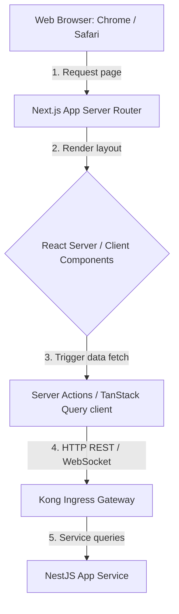
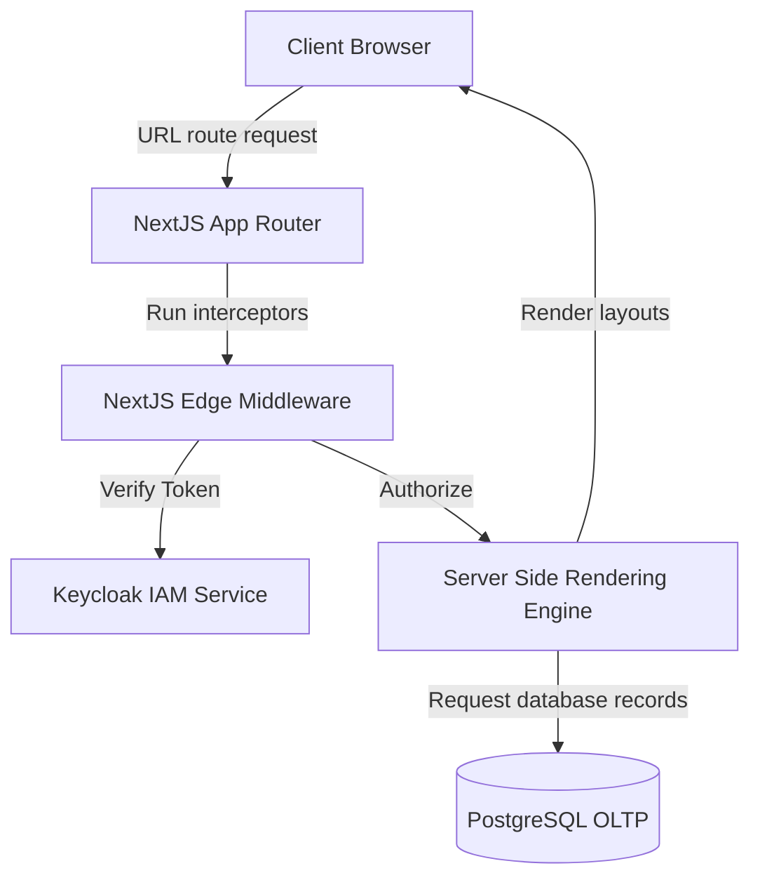
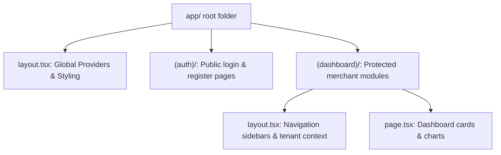
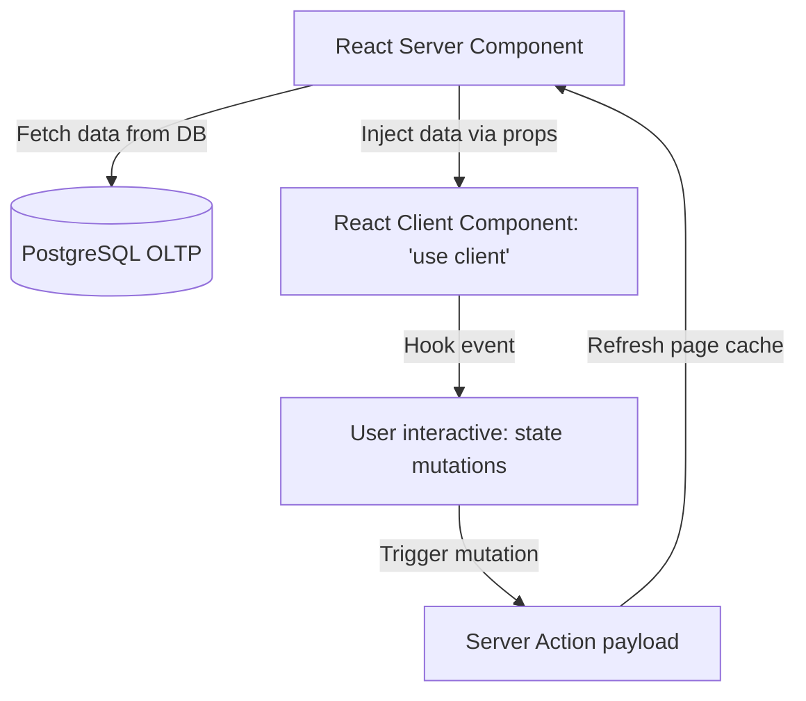
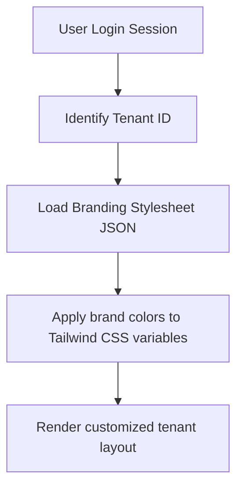

# NEXT.JS WEB APPLICATION ARCHITECTURE & ENTERPRISE FRONTEND STRUCTURE

**Project Name:** Enterprise SaaS Business Management Platform  
**Document Version:** 1.0.0 — Baseline Standard  
**Date:** July 13, 2026  
**Authors:** Principal Frontend Architect, Next.js Architect & React Performance Engineer  
**Classification:** Enterprise Internal — Unrestricted  
**Status:** 🏛️ APPROVED WEB APPLICATION SPECIFICATION  

---

## SECTION 1 — NEXT.JS ARCHITECTURE FOUNDATION

We select Next.js (React Framework) to build our multi-tenant SaaS web portal, leveraging its core features:
*   **Server Rendering:** Leverages Server-Side Rendering (SSR) and Static Site Generation (SSG) to render pages on the server, minimizing page load times.
*   **Performance:** Automatically optimizes code splitting, image delivery, and routing out of the box.
*   **SEO:** Renders metadata on the server, supporting indexing and social preview cards for public marketing pages.
*   **Developer Experience (DX):** Standardizes page layouts, supports Hot Module Replacement (HMR), and integrates strict TypeScript type checks.
*   **Scalability:** Uses file-system routing to support growing development teams.

---

## SECTION 2 — NEXT.JS APPLICATION ARCHITECTURE

Our Next.js applications use a layered structure to manage data flow between the browser, page routes, and backend APIs:



---

## SECTION 3 — APP ROUTER ARCHITECTURE

We use the Next.js App Router framework, defining routes and layouts using structured file naming conventions:
*   `layout.tsx` $\rightarrow$ Defines shared page layouts and scopes wrapper components.
*   `page.tsx` $\rightarrow$ Renders the main view for specific page routes.
*   `loading.tsx` $\rightarrow$ Defines skeleton loading states to display during page transitions.
*   `error.tsx` $\rightarrow$ Defines error boundaries to catch runtime issues.
*   `not-found.tsx` $\rightarrow$ Renders custom 404 pages when routes do not exist.

---

## SECTION 4 — ENTERPRISE FOLDER STRUCTURE

We organize our Next.js codebase to separate layout files from shared features:

```
src/
├── app/                  # Next.js App Router paths (layouts, pages, loading states)
├── components/           # Shared atomic components (Atoms, Composites)
├── features/             # Business modules (POS, Inventory, Accounting)
├── services/             # API client services
├── hooks/                # Custom React hooks
├── store/                # Zustand global state stores
├── types/                # TypeScript type definitions
├── utils/                # Utility helper functions
├── lib/                  # Shared libraries (Axios client config, S3 helpers)
├── config/               # Application configuration constants
└── styles/               # Global CSS files (Tailwind configuration variables)
```

---

## SECTION 5 — ROUTING ARCHITECTURE

We categorize routing paths to manage accessibility:
*   **Public Routes:** Paths accessible without login, such as `/login`, `/register`, and `/pricing`.
*   **Private Routes:** Paths that require authenticated login credentials, such as `/dashboard`, `/pos`, `/inventory`, and `/finance`.
*   **Admin Routes:** Paths restricted to system administrators, such as `/admin`.

---

## SECTION 6 — LAYOUT ARCHITECTURE

We nest layouts hierarchically to inherit routing configurations and wrapper components:

```
Root Layout (Viewport, Global Context)
  └── Auth Layout (Marketing Header, Form Frame)
  └── Dashboard Layout (Branch Context, Navigation Sidebar)
        └── Module Layout (POS Cart Panel, Inventory List View)
```

---

## SECTION 7 — SERVER COMPONENT STRATEGY

We use React Server Components (RSC) by default to manage page rendering:
*   **Direct Database Access:** Query databases directly from page routes without making intermediate API calls.
*   **Reduced Bundle Size:** Keep heavy dependency libraries on the server, sending only compiled HTML to the browser.
*   **Sensitive Data Protection:** Keep API tokens and security credentials on the server, preventing exposure to browsers.

---

## SECTION 8 — CLIENT COMPONENT STRATEGY

We define client components explicitly using the `'use client'` directive to support interactivity:
*   **Interactive Controls:** Use client components for buttons, input forms, tab menus, and interactive charts.
*   **Browser Integrations:** Use client components when accessing browser-specific APIs (such as local storage or geolocation).
*   **State Management:** Use client components when connecting to Zustand stores or TanStack Query contexts.

---

## SECTION 9 — DATA FETCHING & CACHING ARCHITECTURE

We manage server data queries using TanStack Query to standardize caching and revalidation:

### 9.1 Data Query Handler Example (`features/inventory/hooks.ts`)
```typescript
import { useQuery, useMutation, useQueryClient } from '@tanstack/react-query';

export interface Product {
  readonly id: string;
  readonly name: string;
  readonly price: number;
  readonly sku: string;
}

const fetchProducts = async (tenantId: string): Promise<Product[]> => {
  const res = await fetch(`/api/v1/inventory/products?tenantId=${tenantId}`);
  if (!res.ok) throw new Error('Failed to fetch inventory catalog');
  return res.json();
};

export const useInventoryProducts = (tenantId: string) => {
  return useQuery<Product[], Error>({
    queryKey: ['products', tenantId],
    queryFn: () => fetchProducts(tenantId),
    staleTime: 5 * 60 * 1000, // Cache data for 5 minutes
  });
};
```

---

## SECTION 10 — SERVER ACTIONS ARCHITECTURE

We use Server Actions to manage form submissions and trigger server-side operations directly from client views:

### 10.1 Server Action Definition (`app/actions/add-product.ts`)
```typescript
'use server';

import { revalidatePath } from 'next/cache';

export interface ActionResponse {
  success: boolean;
  message: string;
  productId?: string;
}

export async function addProductAction(formData: FormData): Promise<ActionResponse> {
  const name = formData.get('name') as string;
  const price = parseFloat(formData.get('price') as string);
  
  if (!name || isNaN(price)) {
    return { success: false, message: 'Invalid product input parameters' };
  }

  try {
    const res = await fetch(`${process.env.BACKEND_API_URL}/api/v1/products`, {
      method: 'POST',
      headers: { 'Content-Type': 'application/json' },
      body: JSON.stringify({ name, price }),
    });

    if (!res.ok) throw new Error('Product creation failed');
    const data = await res.json();

    revalidatePath('/inventory'); // Refresh page route cache
    return { success: true, message: 'Product added successfully', productId: data.id };
  } catch (error: any) {
    return { success: false, message: error.message || 'Server error' };
  }
}
```

---

## SECTION 11 — MIDDLEWARE ARCHITECTURE

We intercept page requests using Next.js Middleware to enforce security policies and validate routing parameters:

### 11.1 Middleware Configuration (`middleware.ts`)
```typescript
import { NextResponse } from 'next/server';
import type { NextRequest } from 'next/server';

export function middleware(request: NextRequest) {
  const sessionToken = request.cookies.get('session-token');
  const { pathname } = request.nextUrl;

  // 1. Redirect unauthenticated requests to login page
  if (!sessionToken && pathname.startsWith('/dashboard')) {
    return NextResponse.redirect(new URL('/login', request.url));
  }

  // 2. Validate tenant parameters
  const tenantId = request.nextUrl.searchParams.get('tenantId');
  if (pathname.startsWith('/dashboard') && !tenantId) {
    return NextResponse.rewrite(new URL('/not-found', request.url));
  }

  return NextResponse.next();
}

export const config = {
  matcher: ['/dashboard/:path*', '/pos/:path*', '/admin/:path*'],
};
```

---

## SECTION 12 — AUTHENTICATION FRONTEND FLOW

Our login interface validates credentials and saves session tokens to guide users to dashboards:
*   **Authentication Flow:** User submits credentials $\rightarrow$ server validates input and generates session token $\rightarrow$ middleware saves token as an HTTP-only cookie $\rightarrow$ application redirects user to dashboard view.

---

## SECTION 13 — ROLE-BASED ROUTE PROTECTION

We protect page sections using role-based routing guards:
*   **Role Validation:** Read user roles from session tokens, restricting cashier access to checkout screens while routing managers to store reports.

---

## SECTION 14 — MULTI-TENANT FRONTEND INTERFACE

We configure layout branding dynamically based on tenant settings:
*   **Branding Configuration:** Load active tenant settings on login to update themes, logos, and features across page modules.

---

## SECTION 15 — REAL-TIME UPDATES

We integrate WebSockets to update dashboard views in real time:
*   **Live Status Updates:** Connect to server event streams to update POS order statuses and inventory warnings without page refreshes.

---

## SECTION 16 — PERFORMANCE OPTIMIZATION

We enforce strict performance guidelines to keep page load times fast:
*   **Dynamic Loading:** Load heavy composite components (like charts or modal dialogs) dynamically to reduce bundle sizes.
*   **Image Compression:** Compress images, serve optimized formats (WebP), and specify layout dimensions to prevent layout shifts.
*   **Rendering Optimization:** Cache and revalidate routes dynamically to minimize server roundtrips.

---

## SECTION 17 — SEO & METADATA CONFIGURATIONS

We define metadata on the server to support SEO and social preview cards:

### 17.1 Metadata Definition (`app/page.tsx`)
```typescript
import { Metadata } from 'next';

export const metadata: Metadata = {
  title: 'Merchant Portal - Enterprise SaaS Platform',
  description: 'Manage sales, pos checkout payments, inventory catalogs, accounting ledgers, and employee payrolls.',
  openGraph: {
    title: 'Merchant Portal - Enterprise SaaS Platform',
    description: 'Manage sales, pos checkout payments, inventory catalogs, accounting ledgers, and employee payrolls.',
    url: 'https://saas-platform.com',
    type: 'website',
  },
};
```

---

## SECTION 18 — FRONTEND TESTING FRAMEWORK

We verify code quality using a multi-tiered testing plan:
*   **Unit & Component Tests:** Test component props and states using Jest and React Testing Library.
*   **Integration Tests:** Test user journeys (like logging in or configuring products) using mock API services.
*   **E2E Tests:** Run cross-browser tests (using Playwright) to check layout stability under load.

---

## SECTION 19 — NEXT.JS GOVERNANCE

*   **Review Gates:** Require new components to pass styling linting and build checks before merging pull requests.
*   **Dependency Management:** Review and approve third-party library additions to prevent bundle bloat.
*   **Upgrade Path:** Keep dependencies updated, scheduling quarterly patch updates to address security vulnerabilities.

---

## SECTION 20 — FINAL NEXT.JS ARCHITECTURE MERMAID DIAGRAMS

### 20.1 Next.js Enterprise Architecture


### 20.2 App Router Structure


### 20.3 Server vs. Client Component Flow


### 20.4 Authentication Flow
```
[ Submit Login Form ] ──► [ API validation ] ──► [ Set HTTP-Only Cookie ] ──► [ Redirect Dashboard ]
```

### 20.5 Multi-Tenant Frontend Flow


---

*End of Next.js Web Application Architecture & Enterprise Frontend Structure*  
*Document maintained by: Principal Frontend Architect | Status: Approved Web Application Specification*
