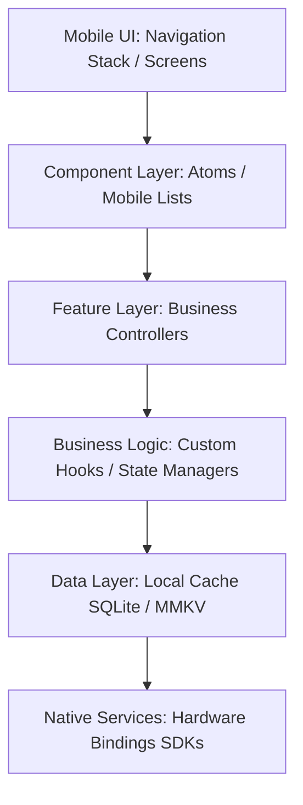
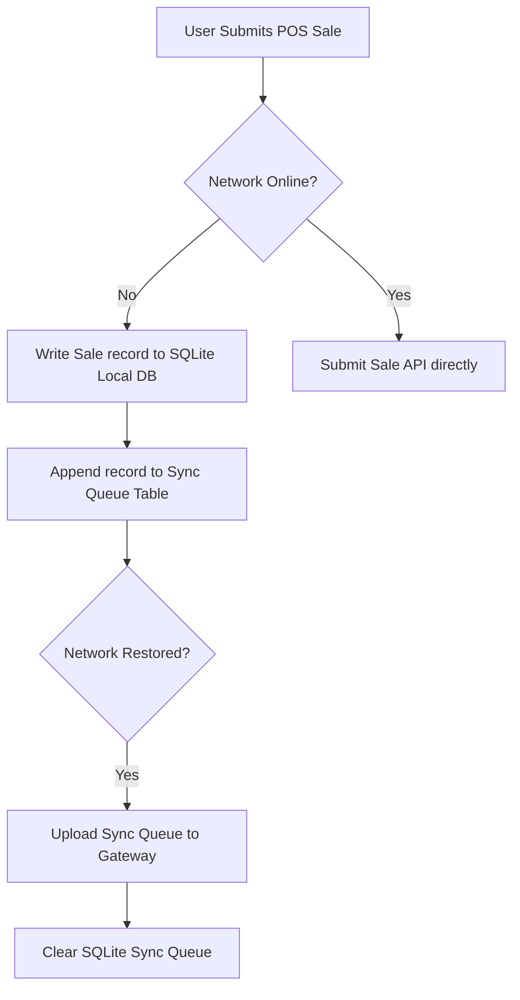
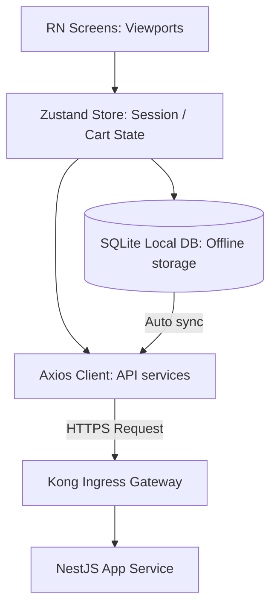
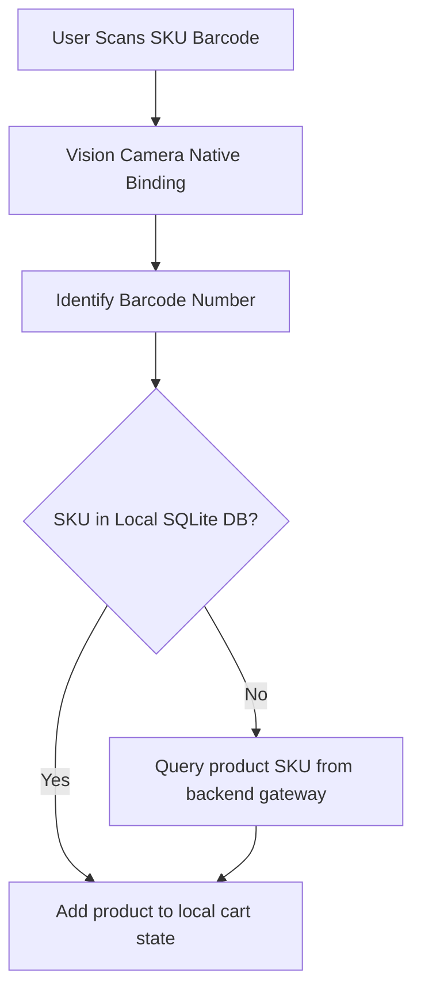
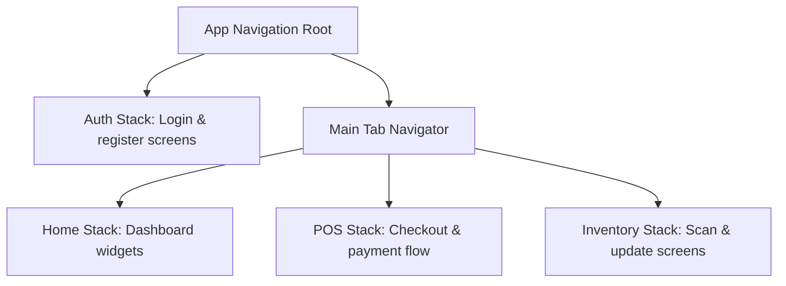
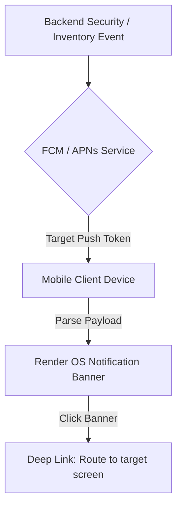

# REACT NATIVE MOBILE APPLICATION ARCHITECTURE & MOBILE ENGINEERING STRATEGY

**Project Name:** Enterprise SaaS Business Management Platform  
**Document Version:** 1.0.0 — Baseline Standard  
**Date:** July 13, 2026  
**Authors:** Principal Mobile Architect, React Native Architect & Mobile Platform Engineer  
**Classification:** Enterprise Internal — Unrestricted  
**Status:** 🏛️ APPROVED MOBILE APPLICATION SPECIFICATION  

---

## SECTION 1 — MOBILE ARCHITECTURE FOUNDATION

Our mobile applications (Business Owner App, Employee App, Operation App, and Field Staff App) are built on five core pillars:
*   **Fast:** Fast app loading times and fluid interface animations.
*   **Reliable:** Graceful error handling and crash protection rules to prevent data loss.
*   **Offline Capable:** Offline checkouts and database operations with automated queue sync systems.
*   **Secure:** Sensitive data encryption, secure local token storage, and biometric authentication.
*   **Scalable:** Standardized feature folders to allow multiple developers to work on features concurrently.

---

## SECTION 2 — REACT NATIVE APPLICATION ARCHITECTURE

Our React Native applications use a decoupled, layered architecture to separate user interfaces from local database engines:



---

## SECTION 3 — MOBILE PROJECT STRUCTURE

We organize React Native code bases using standard project directories:

```
src/
├── screens/              # Top-level screen views (POS Checkout, Inventory List)
├── navigation/           # React Navigation stack and tab configurations
├── components/           # Mobile atomic components (Buttons, Inputs, Alert banners)
├── features/             # Business modules (POS, Orders, Inventory)
├── services/             # API client services
├── hooks/                # Custom React hooks (useBiometrics, useScanner)
├── store/                # Zustand global state stores (useCartStore)
├── storage/              # SQLite / MMKV local database engines
├── native/               # Native iOS/Android bridges and platform modules
├── utils/                # Utility helper functions
├── types/                # TypeScript type definitions
└── index.ts              # Entry point exports
```

---

## SECTION 4 — FEATURE-BASED MOBILE ARCHITECTURE

We group related screens, hooks, and services within feature-specific directories:
*   `features/auth/` $\rightarrow$ User registration, login, biometrics, and password resets.
*   `features/dashboard/` $\rightarrow$ Business overview charts, summaries, and notifications.
*   `features/pos/` $\rightarrow$ Order cart management, discounts, and payments.
*   `features/inventory/` $\rightarrow$ Barcode scanning and stock catalog lookups.
*   `features/profile/` $\rightarrow$ User profile configurations and branch selectors.

---

## SECTION 5 — NAVIGATION ARCHITECTURE

We manage screen routing using **React Navigation**:
*   **Stack Navigation:** For linear screen flows (such as `POS Checkout -> Payment -> Success`).
*   **Tab Navigation:** Standard bottom tab navigators for primary sections (Home, POS, Inventory, Settings).
*   **Drawer Navigation:** For administrative settings and branch switching menus.
*   **Deep Linking:** Support routing users directly to specific screens from push notifications (e.g., routing to `orders/9812` from low-stock alerts).

---

## SECTION 6 — MOBILE SCREEN ARCHITECTURE

We structure mobile screens to separate UI layouts from business logic:
*   **Screens:** Top-level route containers that define navigation headers and page structures.
*   **Containers:** Client wrapper components that manage state hooks and API calls.
*   **Components:** Reusable UI elements that render layout states.
*   **Hooks:** Encapsulate operations like camera controls or transaction submittals.

---

## SECTION 7 — STATE MANAGEMENT ARCHITECTURE

We match state scopes to appropriate management tools:
*   **Local State:** Managed via React’s `useState` hook for page-specific visual actions (like toggling selectors).
*   **Global Session State:** Managed via **Zustand** for active states (like current shopping cart items or logged-in users).
*   **Server State:** Managed via **TanStack Query** to handle backend requests, caching, and background sync processes.

---

## SECTION 8 — API COMMUNICATION & OFFLINE QUEUE

We wrap API requests in custom clients to handle offline caching and auto-retries:
*   **Offline Queue:** Intercept failed mutations (like checkouts) when offline, saving request details to a queue to retry when connection is restored.
*   **Background Retries:** Automatically retry failed network requests up to 3 times before prompting user alerts.

---

## SECTION 9 — OFFLINE-FIRST ARCHITECTURE

Our sync engine uses local SQLite databases to queue transactions during network outages:



---

## SECTION 10 — LOCAL DATABASE STRATEGY

We select local storage tools based on data read-write requirements:

### 10.1 Local Storage Matrix

| Storage Tool | Data Type | Primary Use Case | Performance Rationale |
| :--- | :--- | :--- | :--- |
| **MMKV** | Key-Value Pairs | Session tokens, user profile settings. | Fast read/write times. |
| **SQLite / WatermelonDB** | Relational Tables | Inventory catalogs, offline transactions. | Supports SQL queries. |
| **Keychain (iOS / Android)** | Encrypted Strings | Master passwords, biometrics. | OS-level secure storage. |

---

## SECTION 11 — PUSH NOTIFICATIONS ARCHITECTURE

We route notifications through **Firebase Cloud Messaging (FCM)** for Android and **Apple Push Notification Service (APNs)** for iOS:
*   **Token Registration:** Register device push tokens on login, saving them to backend user profiles.
*   **Background Handling:** Parse notification payloads in background threads to refresh local caches or display notifications.

---

## SECTION 12 — NATIVE DEVICE INTEGRATIONS

We bridge native device hardware features using React Native native modules:
*   **Camera & Barcode Scanners:** Use device cameras to scan product barcodes (using libraries like Vision Camera).
*   **GPS Geolocation:** Use location data to track field deliveries or verify check-in locations.
*   **Biometrics:** Support fast logins using FaceID or fingerprint scanning.
*   **Bluetooth:** Connect to external POS receipt printers and card terminals.

---

## SECTION 13 — MOBILE SECURITY SPECIFICATIONS

*   **Token Security:** Store session and API tokens within the device's secure keychain, never in plain-text storage.
*   **Certificate Pinning:** Enable certificate pinning to protect API requests from man-in-the-middle attacks.
*   **App Lock:** Prompt for a PIN code or biometric confirmation when the app is resumed from background states.

---

## SECTION 14 — MOBILE PERFORMANCE OPTIMIZATION

*   **Fast Startup:** Limit initial bundle sizes and configure lazy module loading to keep startup times under 2 seconds.
*   **Smooth Rendering:** Use flat list structures with optimized layout properties to maintain 60fps animations.
*   **Image Caching:** Cache external product images locally to reduce network usage and speed up list loading.

---

## SECTION 15 — MOBILE UX ENGINEERING

*   **Touch Targets:** Ensure all buttons and interactive elements have a minimum touch target size of $48\text{px} \times 48\text{px}$.
*   **Gestures:** Support swipe-to-delete actions in carts and pinch-to-zoom views on product images.
*   **Accessibility:** Support system text scaling and screen readers (VoiceOver and TalkBack).

---

## SECTION 16 — MOBILE TESTING STRATEGY

*   **Unit Tests:** Verify helper functions and component render states using Jest and React Native Testing Library.
*   **End-to-End Tests:** Automate test flows (like checkouts and inventory updates) on actual device emulators using **Detox**.

---

## SECTION 17 — APP RELEASE ARCHITECTURE

*   **Internal Testing:** Deploy internal builds to developer teams using Expo Application Services (EAS).
*   **Beta Distribution:** Distribute beta builds to merchants via TestFlight (iOS) and Google Play Console Internal Testing (Android).
*   **Production Release:** Submit validated app versions to the Apple App Store and Google Play Store for review.

---

## SECTION 18 — MOBILE CI/CD PIPELINE

We automate build processes using GitHub Actions and Fastlane:
*   **Build Scripts:** Build app binaries automatically when code changes are merged into release branches.
*   **Signing Certificates:** Manage keys and signing certificates securely inside private CI environments.

---

## SECTION 19 — MOBILE ENGINEERING GOVERNANCE

*   **Code Review Gates:** Require new code to pass linting and component tests before merging pull requests.
*   **Dependency Management:** Audit third-party packages to prevent security issues and control app bundle sizes.

---

## SECTION 20 — FINAL MOBILE ARCHITECTURE MERMAID DIAGRAMS

### 20.1 React Native Enterprise Architecture


### 20.2 Mobile Data Flow


### 20.3 Navigation Architecture


### 20.4 Offline Synchronization Flow
```
[ User processes POS check ] ──► [ Save to SQLite Sync Queue ] ──► [ Connection restored ] ──► [ Upload to backend ] ──► [ Clear Queue ]
```

### 20.5 Push Notification Architecture


---

*End of React Native Mobile Application Architecture & Mobile Engineering Strategy*  
*Document maintained by: Principal Mobile Architect | Status: Approved Mobile Application Specification*
