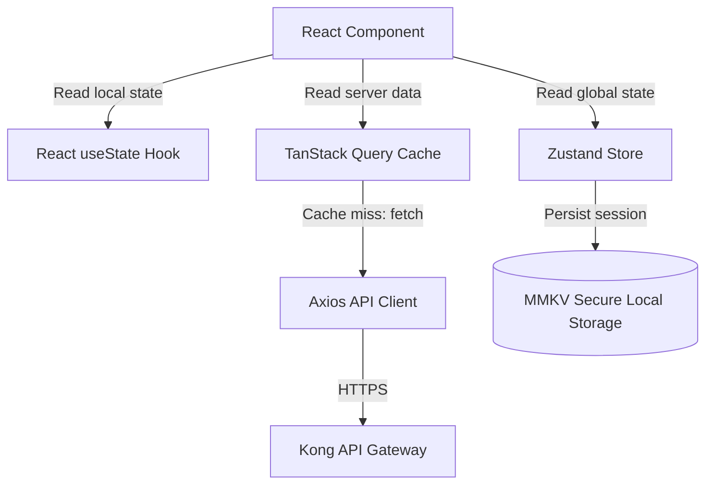
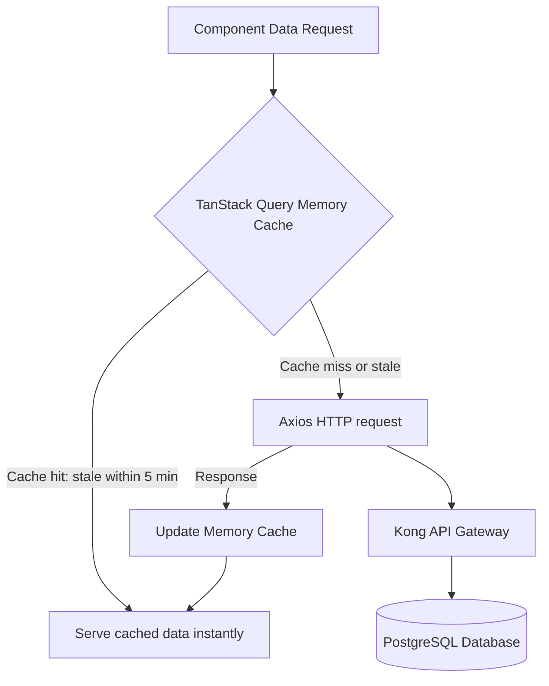
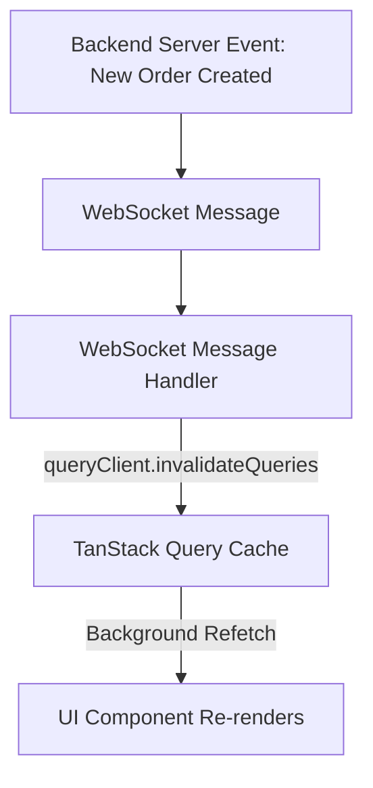
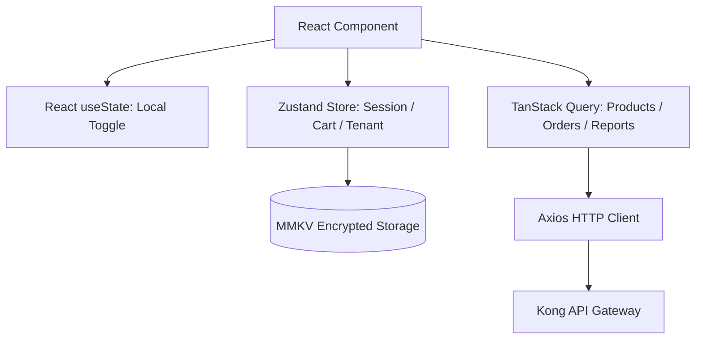
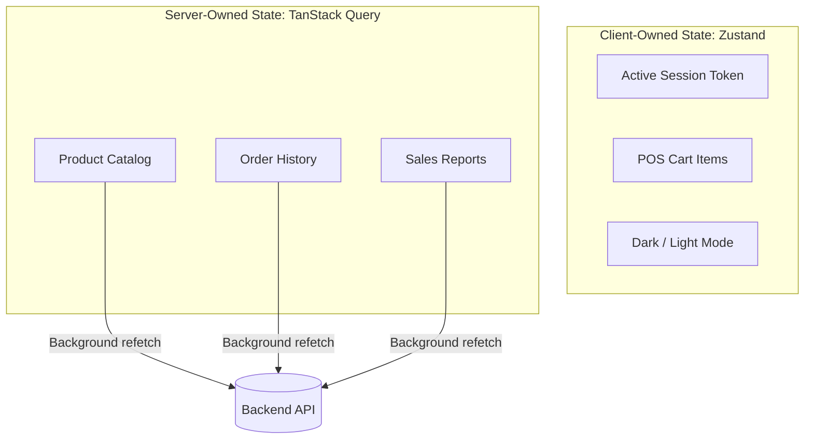
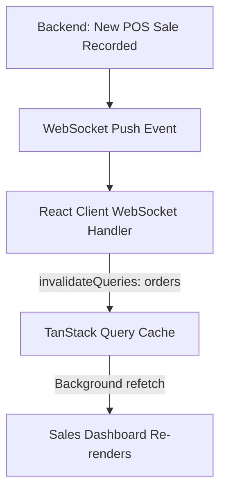
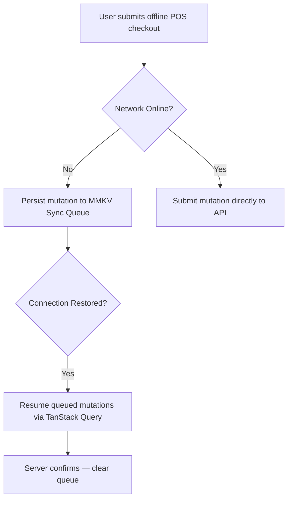

# FRONTEND STATE MANAGEMENT, DATA FLOW & CLIENT-SIDE ARCHITECTURE

**Project Name:** Enterprise SaaS Business Management Platform  
**Document Version:** 1.0.0 — Baseline Standard  
**Date:** July 13, 2026  
**Authors:** Principal Frontend Architect, React State Management Expert & Application Data Architect  
**Classification:** Enterprise Internal — Unrestricted  
**Status:** 🏛️ APPROVED CLIENT-SIDE ARCHITECTURE SPECIFICATION  

---

## SECTION 1 — FRONTEND STATE FOUNDATION

### 1.1 Why State Architecture Matters
As application complexity grows across our multi-tenant SaaS platform, unstructured state management creates cascading data bugs, stale cache renders, and degraded user experiences:

```
Application Complexity ──► Data Management Strategy ──► Predictable User Experience ──► Platform Performance
```

### 1.2 Enterprise State Management Principles
*   **Single Source of Truth:** Define clear ownership for each state type to prevent duplicated data inconsistencies.
*   **Colocation:** Keep state as close to the component that uses it as possible, lifting it upward only when shared.
*   **Separation of Concerns:** Separate client-owned UI state from server-owned data to avoid caching conflicts.
*   **Predictability:** Use deterministic state transition patterns so state changes are traceable and debuggable.

---

## SECTION 2 — STATE CLASSIFICATION

We categorize state into five distinct scopes:

### 2.1 State Type Matrix

| State Type | Ownership | Persistence | Examples |
| :--- | :--- | :--- | :--- |
| **Local UI State** | Single component | Lives only while component is mounted. | Modal open/close, tab selection, input focus. |
| **Feature State** | Feature module | Lives while feature route is active. | POS cart items, active filter selections. |
| **Global Application State** | Entire application | Persists across page navigations. | Authenticated user session, active tenant context. |
| **Server State** | Backend database | Cached locally, synchronized with server. | Product catalogs, order histories, ledgers. |
| **Persistent State** | Device or browser | Stored after app restarts. | Language preference, theme mode, offline queues. |

---

## SECTION 3 — CLIENT STATE VS. SERVER STATE

We enforce a strict separation between data the frontend controls and data the backend owns:

### 3.1 Client State (UI-Owned)
*   UI mode toggles (dark/light theme, sidebar collapsed)
*   Active modal dialogs
*   Form input states
*   Pagination cursor position

### 3.2 Server State (Backend-Owned, Cached Locally)
*   Product and inventory catalogs
*   Order and transaction histories
*   Customer and employee records
*   Financial ledgers and reports

> **Rule:** Never store server state in Zustand or Redux. Use TanStack Query exclusively for all server-owned data.

---

## SECTION 4 — STATE MANAGEMENT ARCHITECTURE

Our state layers are decoupled by responsibility to keep data flows predictable:



---

## SECTION 5 — GLOBAL STATE ARCHITECTURE

We use **Zustand** to manage lightweight global application state that does not belong to the server:
*   **Authentication State:** Active session tokens, user IDs, and login status.
*   **Tenant Context:** Active `tenantId`, `branchId`, and subscription plan.
*   **User Profile:** Display name, avatar URL, and role.
*   **Permissions:** Computed permission flags derived from user role assignments.
*   **Theme:** Active color mode (`light` / `dark`) and language locale setting.

### 5.1 Global Auth Store Example (`store/useAuthStore.ts`)
```typescript
import { create } from 'zustand';
import { persist, createJSONStorage } from 'zustand/middleware';

export interface AuthState {
  accessToken: string | null;
  userId: string | null;
  tenantId: string | null;
  role: 'owner' | 'manager' | 'cashier' | 'admin' | null;
  isAuthenticated: boolean;
  setSession: (token: string, userId: string, tenantId: string, role: AuthState['role']) => void;
  clearSession: () => void;
}

export const useAuthStore = create<AuthState>()(
  persist(
    (set) => ({
      accessToken: null,
      userId: null,
      tenantId: null,
      role: null,
      isAuthenticated: false,
      setSession: (accessToken, userId, tenantId, role) =>
        set({ accessToken, userId, tenantId, role, isAuthenticated: true }),
      clearSession: () =>
        set({ accessToken: null, userId: null, tenantId: null, role: null, isAuthenticated: false }),
    }),
    {
      name: 'auth-session',
      storage: createJSONStorage(() => sessionStorage), // Web: sessionStorage; Mobile: MMKV
    }
  )
);
```

### 5.2 POS Cart Store Example (`store/useCartStore.ts`)
```typescript
import { create } from 'zustand';

export interface CartItem {
  readonly id: string;
  readonly sku: string;
  readonly name: string;
  readonly unitPrice: number;
  quantity: number;
  discountPercentage?: number;
}

interface CartStore {
  items: CartItem[];
  addItem: (item: CartItem) => void;
  updateQuantity: (id: string, quantity: number) => void;
  removeItem: (id: string) => void;
  clearCart: () => void;
  cartTotal: () => number;
}

export const useCartStore = create<CartStore>((set, get) => ({
  items: [],
  addItem: (item) => set((state) => {
    const existing = state.items.find((i) => i.id === item.id);
    if (existing) {
      return { items: state.items.map((i) => i.id === item.id ? { ...i, quantity: i.quantity + 1 } : i) };
    }
    return { items: [...state.items, item] };
  }),
  updateQuantity: (id, quantity) => set((state) => ({
    items: state.items.map((i) => i.id === id ? { ...i, quantity } : i),
  })),
  removeItem: (id) => set((state) => ({ items: state.items.filter((i) => i.id !== id) })),
  clearCart: () => set({ items: [] }),
  cartTotal: () => get().items.reduce((sum, item) => sum + item.unitPrice * item.quantity, 0),
}));
```

---

## SECTION 6 — SERVER STATE ARCHITECTURE (TANSTACK QUERY)

We use **TanStack Query** exclusively to manage all server-owned data, enforcing clear cache rules:
*   **Stale-While-Revalidate:** Serve cached data immediately while refreshing in the background.
*   **Cache Keys:** Use structured query keys (e.g., `['products', tenantId, { page }]`) to scope caches per tenant.
*   **Automatic Garbage Collection:** Remove unused cache entries after a configurable idle timeout.

### 6.1 TanStack Query Provider Setup (`app/providers.tsx`)
```typescript
'use client';

import { QueryClient, QueryClientProvider } from '@tanstack/react-query';
import { ReactQueryDevtools } from '@tanstack/react-query-devtools';
import { useState } from 'react';

export function Providers({ children }: { children: React.ReactNode }) {
  const [queryClient] = useState(() => new QueryClient({
    defaultOptions: {
      queries: {
        staleTime: 5 * 60 * 1000,        // Cache data for 5 minutes
        gcTime: 10 * 60 * 1000,          // Garbage collect after 10 minutes idle
        retry: 3,                          // Retry failed requests 3 times
        refetchOnWindowFocus: false,       // Do not auto-refetch on tab focus
      },
    },
  }));

  return (
    <QueryClientProvider client={queryClient}>
      {children}
      <ReactQueryDevtools initialIsOpen={false} />
    </QueryClientProvider>
  );
}
```

---

## SECTION 7 — TANSTACK QUERY FEATURE PATTERNS

We implement five standard TanStack Query patterns across our modules:

### 7.1 Basic Query Pattern (`features/inventory/hooks.ts`)
```typescript
import { useQuery } from '@tanstack/react-query';
import { inventoryApi } from '../services/inventoryApi';

export const useInventoryProducts = (tenantId: string, branchId: string) => {
  return useQuery({
    queryKey: ['inventory', 'products', tenantId, branchId],
    queryFn: () => inventoryApi.listProducts(tenantId, branchId),
    staleTime: 3 * 60 * 1000, // 3 minutes for inventory
    enabled: !!tenantId && !!branchId, // Only fetch when context is set
  });
};
```

### 7.2 Mutation with Optimistic Update (`features/pos/hooks.ts`)
```typescript
import { useMutation, useQueryClient } from '@tanstack/react-query';
import { posApi } from '../services/posApi';
import { CartItem } from '../../store/useCartStore';

export const useSubmitCheckout = (tenantId: string) => {
  const queryClient = useQueryClient();

  return useMutation({
    mutationFn: posApi.submitCheckout,
    onMutate: async (newOrder) => {
      // Optimistically clear cart before server confirmation
      await queryClient.cancelQueries({ queryKey: ['orders', tenantId] });
      const previousOrders = queryClient.getQueryData(['orders', tenantId]);
      return { previousOrders };
    },
    onError: (_err, _newOrder, context) => {
      // Roll back on server error
      if (context?.previousOrders) {
        queryClient.setQueryData(['orders', tenantId], context.previousOrders);
      }
    },
    onSettled: () => {
      // Always re-sync orders after mutation
      queryClient.invalidateQueries({ queryKey: ['orders', tenantId] });
    },
  });
};
```

### 7.3 Infinite Query for Paginated Lists
```typescript
import { useInfiniteQuery } from '@tanstack/react-query';

export const useInfiniteOrders = (tenantId: string) => {
  return useInfiniteQuery({
    queryKey: ['orders', tenantId, 'infinite'],
    queryFn: ({ pageParam = 1 }) => orderApi.listOrders(tenantId, pageParam),
    getNextPageParam: (lastPage) => lastPage.nextPage ?? undefined,
    initialPageParam: 1,
  });
};
```

---

## SECTION 8 — DATA FETCHING GOVERNANCE PATTERNS

| Pattern | When to Use | Implementation |
| :--- | :--- | :--- |
| **Standard Query** | Fetch a list or single resource by ID. | `useQuery` with structured key. |
| **Dependent Query** | Fetch B only when A resolves. | `enabled: !!dataFromQueryA`. |
| **Parallel Query** | Fetch multiple independent resources simultaneously. | Multiple `useQuery` calls. |
| **Infinite Query** | Paginated lists with load-more buttons. | `useInfiniteQuery`. |
| **Prefetch** | Load data before the user navigates to a page. | `queryClient.prefetchQuery`. |
| **Optimistic Update** | Update UI immediately before server confirms. | `onMutate` + `onError` rollback. |

---

## SECTION 9 — FRONTEND CACHE STRATEGY

We define four distinct cache layers to serve data at different speeds:



### 9.1 Cache Invalidation Rules

| Trigger Event | Invalidation Action |
| :--- | :--- |
| User submits new POS checkout | Invalidate `['orders', tenantId]` |
| User updates a product price | Invalidate `['inventory', 'products', tenantId]` |
| User changes branch settings | Invalidate `['branch', branchId]` |
| Session expires or user logs out | Clear entire QueryClient cache |

---

## SECTION 10 — REAL-TIME STATE ARCHITECTURE

We use WebSockets to push backend events directly into TanStack Query caches, triggering UI updates without polling:



---

## SECTION 11 — OPTIMISTIC UPDATE ARCHITECTURE

We apply optimistic updates to high-frequency operations (like cart modifications and stock counts) to make the interface feel instant:

```
User Clicks Remove Item ──► Update UI Immediately ──► Send DELETE API Request ──► Success: Done | Error: Restore Item
```

---

## SECTION 12 — FORM STATE MANAGEMENT

We use **React Hook Form** with **Zod** schema validation to manage form states:

### 12.1 Product Creation Form Example (`features/inventory/ProductForm.tsx`)
```typescript
import { useForm } from 'react-hook-form';
import { zodResolver } from '@hookform/resolvers/zod';
import { z } from 'zod';

const productSchema = z.object({
  name: z.string().min(2, 'Product name must be at least 2 characters'),
  sku: z.string().min(3, 'SKU must be at least 3 characters'),
  price: z.number().positive('Price must be a positive number'),
  stock: z.number().int().min(0, 'Stock cannot be negative'),
  categoryId: z.string().uuid('Category must be a valid selection'),
});

type ProductFormValues = z.infer<typeof productSchema>;

export const ProductForm = () => {
  const { register, handleSubmit, formState: { errors, isSubmitting } } = useForm<ProductFormValues>({
    resolver: zodResolver(productSchema),
  });

  const onSubmit = async (data: ProductFormValues) => {
    // Submit to mutation hook
  };

  return (
    <form onSubmit={handleSubmit(onSubmit)}>
      <input {...register('name')} placeholder="Product name" />
      {errors.name && <span>{errors.name.message}</span>}
      {/* Other fields */}
      <button type="submit" disabled={isSubmitting}>Save Product</button>
    </form>
  );
};
```

---

## SECTION 13 — MULTI-TENANT STATE MANAGEMENT

We scope all queries and state stores to the active tenant context:
*   **Context Injection:** Wrap the application in a `TenantProvider` that reads the active `tenantId` and `branchId` from the auth store.
*   **Query Key Scoping:** Include `tenantId` as a required prefix in all TanStack Query keys to enforce cache isolation between tenants.

```typescript
// All tenant-scoped queries must use this key factory
export const inventoryKeys = {
  all: (tenantId: string) => ['inventory', tenantId] as const,
  products: (tenantId: string, branchId: string) => [...inventoryKeys.all(tenantId), 'products', branchId] as const,
  product: (tenantId: string, productId: string) => [...inventoryKeys.all(tenantId), 'product', productId] as const,
};
```

---

## SECTION 14 — OFFLINE STATE ARCHITECTURE

We persist mutation queues locally when the network is unavailable:
*   **Persistence:** Write failed mutations to MMKV (mobile) or IndexedDB (web) queues.
*   **Auto-Sync:** Use TanStack Query's `persistQueryClient` plugin to resume queued mutations when the network reconnects.

---

## SECTION 15 — ERROR STATE MANAGEMENT

We standardize error state handling across all async data operations:

| Error Type | Detection Method | User-Facing Response |
| :--- | :--- | :--- |
| **Network Error** | `isError && !error.response` | "No internet connection. Please try again." |
| **401 Unauthorized** | `error.response.status === 401` | Clear session, redirect to `/login`. |
| **403 Forbidden** | `error.response.status === 403` | Show "Access denied" with contact info. |
| **404 Not Found** | `error.response.status === 404` | Show empty state with navigation options. |
| **500 Server Error** | `error.response.status >= 500` | "Server error. Our team has been notified." |

---

## SECTION 16 — PERFORMANCE OPTIMIZATION

*   **Memoization:** Wrap heavy derived computations (like cart totals or filtered product lists) in `useMemo` to prevent unnecessary recalculations on re-renders.
*   **Selector Pattern:** Use Zustand's slice selector pattern to subscribe components to only the specific state fields they need, preventing over-rendering.

```typescript
// Efficient: Subscribe only to cart item count
const itemCount = useCartStore((state) => state.items.length);

// Inefficient: Subscribe to entire store — avoids this
const { items, addItem, removeItem, clearCart } = useCartStore();
```

*   **Data Normalization:** Normalize relational server data (e.g., indexing products by ID) before storing in cache to avoid duplicated object references.

---

## SECTION 17 — FRONTEND DATA SECURITY

*   **Token Protection:** Store access tokens in `sessionStorage` (web) or the OS keychain (mobile). Never in `localStorage`.
*   **PII Masking:** Mask sensitive fields (such as customer phone numbers and card numbers) when rendering in list views.
*   **Permission Guards:** Derive permission flags from role data and gate feature access behind `usePermission(scope)` hooks.

---

## SECTION 18 — STATE MANAGEMENT TOOL STACK REFERENCE

| Category | Selected Tool | Purpose |
| :--- | :--- | :--- |
| **Server State** | **TanStack Query** | Fetches, caches, and synchronizes backend API data. |
| **Complex Global State** | **Redux Toolkit** | Manages complex multi-slice application state (if needed). |
| **Lightweight Global State** | **Zustand** | Manages sessions, cart, tenant, and UI preferences. |
| **Context State** | **React Context** | Provides theme and locale to deep component trees. |
| **Form State** | **React Hook Form** | Manages form input, validation, and submission. |
| **Schema Validation** | **Zod** | Defines and enforces TypeScript-safe data schemas. |

---

## SECTION 19 — STATE ARCHITECTURE GOVERNANCE

*   **Where State Lives:** Define clear ownership rules: `useState` for local UI, Zustand for global sessions, TanStack Query for all backend data.
*   **Naming Conventions:** Prefix store hooks with `use` and end with `Store` (e.g., `useCartStore`). Prefix query hooks with `use` and noun (e.g., `useInventoryProducts`).
*   **Data Ownership Rules:** No component directly calls `fetch`. All API communication is routed through service layer functions invoked by TanStack Query hooks.
*   **Code Review:** Require state architecture reviews for any new Zustand slice or custom query hook.

---

## SECTION 20 — FINAL FRONTEND DATA ARCHITECTURE MERMAID DIAGRAMS

### 20.1 Complete State Management Architecture


### 20.2 Client vs. Server State Flow


### 20.3 Cache Architecture
```
[ Component Request ] ──► [ TanStack Memory Cache: 5 min ] ──► [ Stale? → Axios Refetch ] ──► [ Update Cache ] ──► [ Re-render ]
```

### 20.4 Real-Time Data Flow


### 20.5 Offline Synchronization State


---

*End of Frontend State Management, Data Flow & Client-Side Architecture*  
*Document maintained by: Principal Frontend Architect | Status: Approved Client-Side Architecture Specification*
