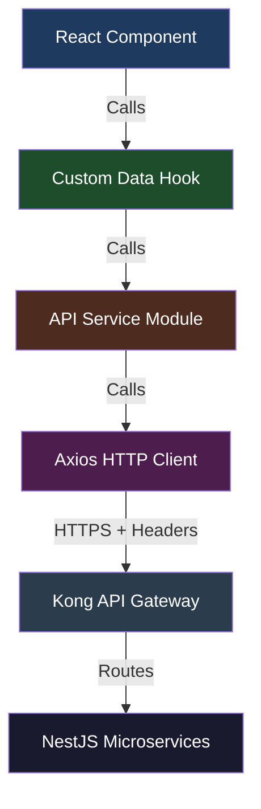
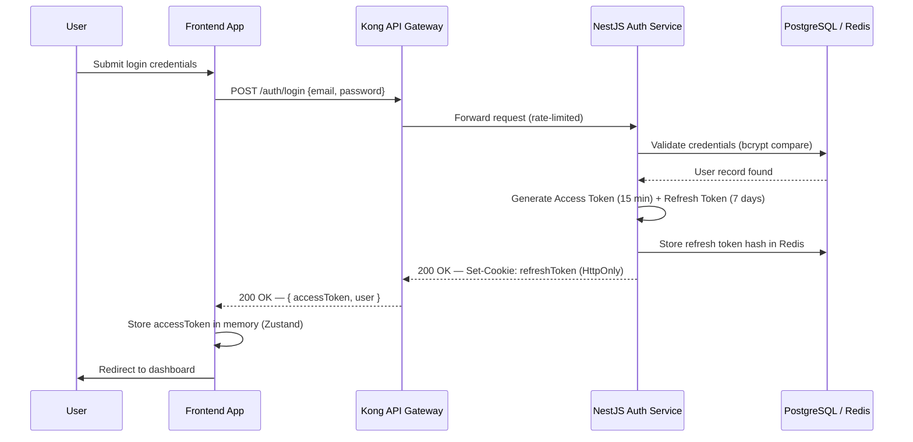
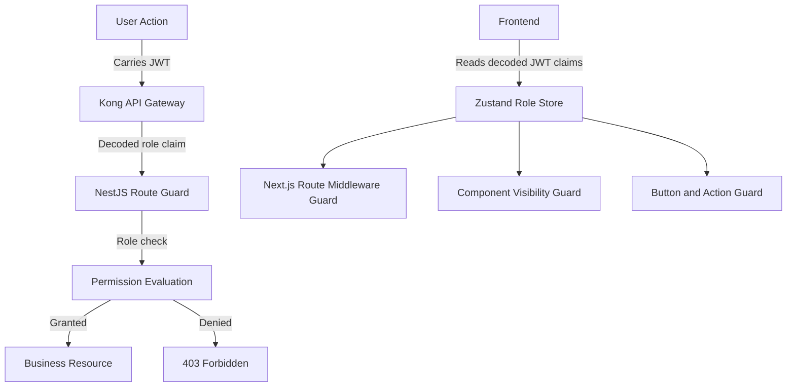
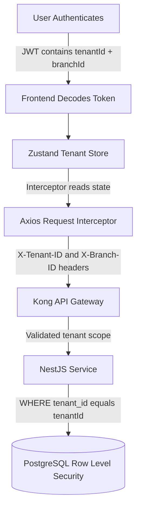
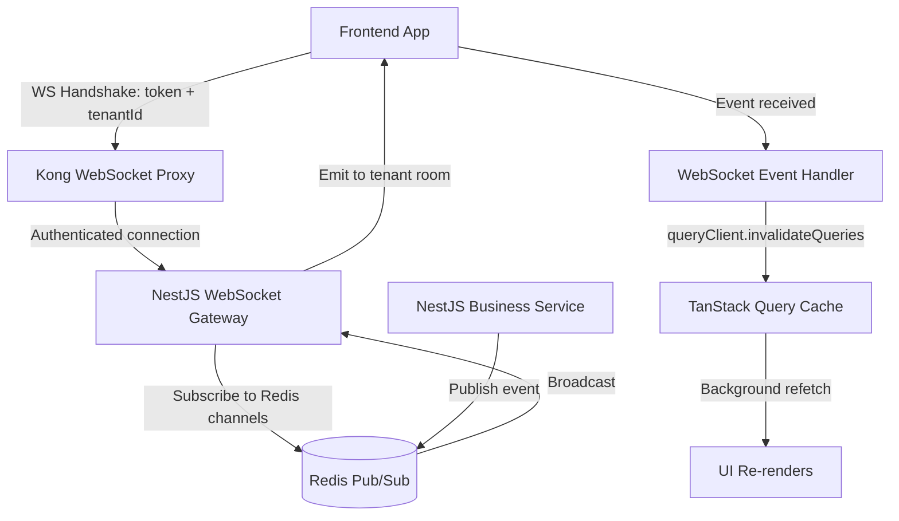
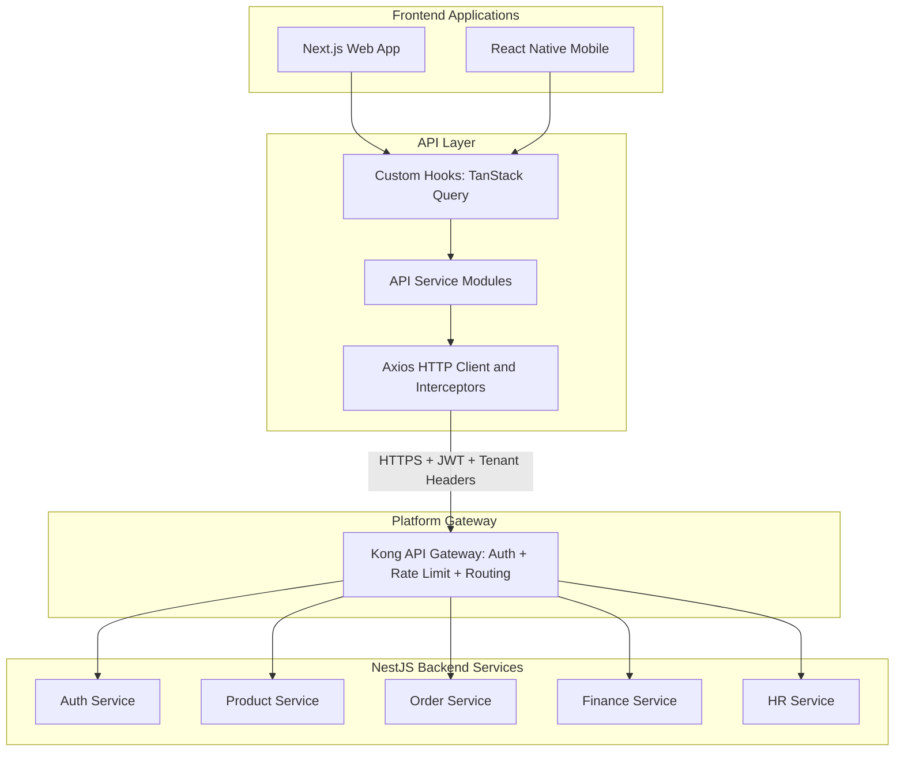
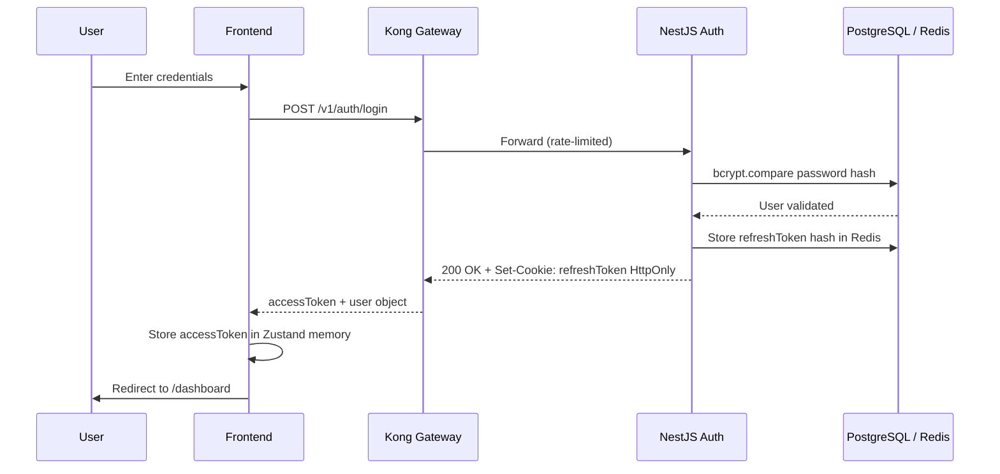
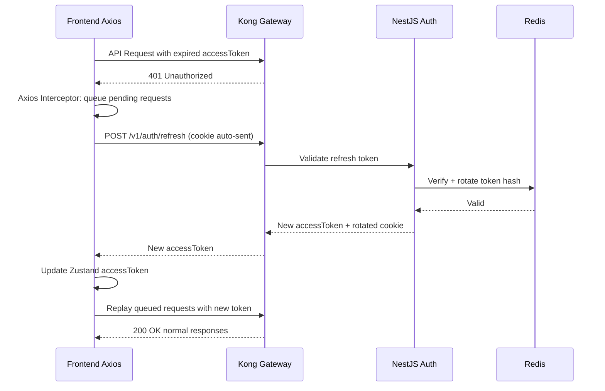
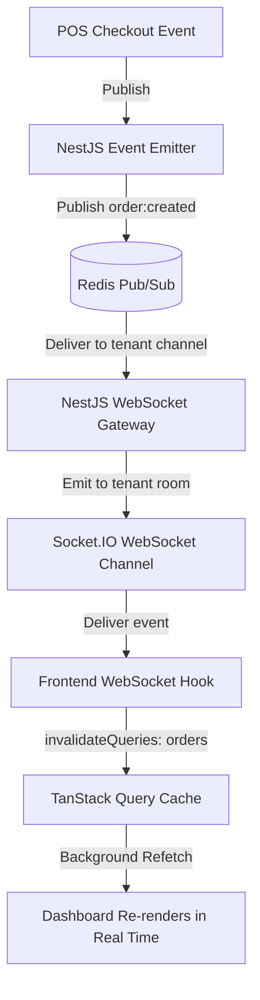
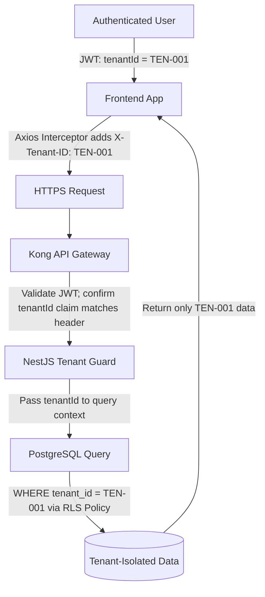

# FRONTEND API INTEGRATION, AUTHENTICATION & BACKEND COMMUNICATION ARCHITECTURE

**Project Name:** Enterprise SaaS Business Management Platform  
**Document Version:** 1.0.0 — Baseline Standard  
**Date:** July 13, 2026  
**Authors:** Principal Frontend Architect, API Integration Architect, Identity Management Engineer, Security Engineer & Backend Integration Specialist  
**Classification:** Enterprise Internal — Unrestricted  
**Status:** 🏛️ APPROVED FRONTEND INTEGRATION ARCHITECTURE SPECIFICATION  

---

## SECTION 1 — FRONTEND BACKEND COMMUNICATION FOUNDATION

### 1.1 Communication Model Overview

Every user action that requires persistent data travels through a deterministic four-layer communication stack. This ensures consistent security enforcement, telemetry, and error handling regardless of which frontend application or module initiates the request.

```
┌─────────────────────────────────────────┐
│          React / React Native           │  ← Presentation layer (components, hooks)
├─────────────────────────────────────────┤
│           API Service Layer             │  ← Business-domain services (auth, orders…)
├─────────────────────────────────────────┤
│         HTTP Client (Axios)             │  ← Transport — interceptors, retry, logging
├─────────────────────────────────────────┤
│         Kong API Gateway                │  ← TLS termination, rate limiting, auth check
├─────────────────────────────────────────┤
│       NestJS Business Services          │  ← Domain logic, database, event bus
└─────────────────────────────────────────┘
```

### 1.2 Enterprise API Communication Principles

| Principle | Description | Enforcement |
| :--- | :--- | :--- |
| **Single HTTP Client** | One Axios instance per application; no raw `fetch` calls outside the client. | ESLint `no-restricted-globals` rule bans raw `fetch`. |
| **Service Encapsulation** | Components never call the HTTP client directly; only service modules do. | Architecture review gate in CI. |
| **Type Safety End-to-End** | All request/response payloads are typed with auto-generated TypeScript types from OpenAPI. | `openapi-typescript` runs in CI on every schema change. |
| **Tenant Context Always** | Every HTTP request carries `X-Tenant-ID` and `X-Branch-ID` headers. | Enforced in the Axios request interceptor. |
| **Retry with Backoff** | Transient 5xx failures are retried up to 3 times with exponential backoff. | `axios-retry` plugin configuration. |
| **Structured Error Handling** | All API errors are normalized into a standard `ApiError` type before reaching hooks. | Response interceptor in the HTTP client. |
| **Secure Token Handling** | Access tokens are never stored in `localStorage`; web uses `HttpOnly` cookies with CSRF tokens. | Security review gate. |
| **Observability First** | Every outbound request and response is traced with a correlation ID. | Request interceptor injects `X-Correlation-ID`. |

---

## SECTION 2 — API CLIENT ARCHITECTURE

### 2.1 Layered API Stack



### 2.2 Module Responsibilities

| Layer | Module | Responsibility |
| :--- | :--- | :--- |
| **Component** | `*.tsx` | Renders UI; reads data from hooks; never calls services directly. |
| **Custom Hook** | `use*.ts` | Combines TanStack Query + service calls; manages loading, error, and data states. |
| **API Service** | `*.service.ts` | Constructs typed requests; maps raw responses to domain models. |
| **HTTP Client** | `apiClient.ts` | Manages base URL, headers, interceptors, retry, and error normalization. |
| **API Gateway** | Kong | Validates JWT, enforces rate limits, routes to backend services. |

---

## SECTION 3 — HTTP CLIENT ARCHITECTURE

### 3.1 Axios HTTP Client (`lib/apiClient.ts`)

```typescript
import axios, { AxiosInstance, AxiosError, InternalAxiosRequestConfig } from 'axios';
import axiosRetry from 'axios-retry';
import { useAuthStore } from '@/store/useAuthStore';
import { useTenantStore } from '@/store/useTenantStore';
import { normalizeApiError } from './apiError';
import { logger } from './logger';

// ─── 1. Create Base Instance ──────────────────────────────────────────────────
const apiClient: AxiosInstance = axios.create({
  baseURL: process.env.NEXT_PUBLIC_API_BASE_URL ?? 'https://api.platform.io/v1',
  timeout: 30_000,
  headers: {
    'Content-Type': 'application/json',
    'Accept': 'application/json',
    'X-Client-Version': process.env.NEXT_PUBLIC_APP_VERSION ?? '1.0.0',
  },
  withCredentials: true,
});

// ─── 2. Retry Configuration ───────────────────────────────────────────────────
axiosRetry(apiClient, {
  retries: 3,
  retryDelay: axiosRetry.exponentialDelay,
  retryCondition: (error: AxiosError) =>
    axiosRetry.isNetworkOrIdempotentRequestError(error) ||
    (error.response?.status !== undefined && error.response.status >= 500),
  onRetry: (retryCount, error) =>
    logger.warn(`API retry attempt ${retryCount}`, { url: error.config?.url }),
});

// ─── 3. Request Interceptor ───────────────────────────────────────────────────
apiClient.interceptors.request.use(
  (config: InternalAxiosRequestConfig) => {
    const { accessToken } = useAuthStore.getState();
    const { tenantId, branchId } = useTenantStore.getState();
    const correlationId = crypto.randomUUID();

    if (accessToken) config.headers['Authorization'] = `Bearer ${accessToken}`;
    if (tenantId) config.headers['X-Tenant-ID'] = tenantId;
    if (branchId) config.headers['X-Branch-ID'] = branchId;
    config.headers['X-Correlation-ID'] = correlationId;
    config.headers['X-Request-Timestamp'] = new Date().toISOString();

    logger.debug('API Request', { method: config.method?.toUpperCase(), url: config.url, correlationId });
    return config;
  },
  (error) => Promise.reject(error)
);

// ─── 4. Response Interceptor ─────────────────────────────────────────────────
apiClient.interceptors.response.use(
  (response) => {
    logger.debug('API Response', { status: response.status, url: response.config.url });
    return response;
  },
  async (error: AxiosError) => {
    const normalized = normalizeApiError(error);
    if (error.response?.status === 401) {
      const refreshed = await attemptTokenRefresh();
      if (refreshed) return apiClient(error.config!);
      useAuthStore.getState().clearSession();
      window.location.href = '/login?reason=session_expired';
    }
    return Promise.reject(normalized);
  }
);

export { apiClient };
```

### 3.2 HTTP Client Feature Summary

| Feature | Implementation | Purpose |
| :--- | :--- | :--- |
| **Base URL** | `process.env.NEXT_PUBLIC_API_BASE_URL` | Env-scoped per deployment (dev / staging / prod). |
| **Request Timeout** | `30_000` ms | Prevents hanging requests from blocking UI. |
| **Authentication Header** | `Authorization: Bearer {token}` | JWT passed on every authenticated request. |
| **Tenant Headers** | `X-Tenant-ID`, `X-Branch-ID` | Scope API responses to the active business context. |
| **Correlation ID** | `X-Correlation-ID: {uuid}` | Ties frontend request logs to backend traces. |
| **Retry Logic** | Exponential backoff × 3 on 5xx / network errors. | Resilience against transient infrastructure failures. |
| **Cookie Credentials** | `withCredentials: true` | Sends `HttpOnly` session cookies for web clients. |
| **Error Normalization** | `normalizeApiError()` in response interceptor. | Converts any error shape to a standard `ApiError`. |

---

## SECTION 4 — API REQUEST & RESPONSE STRUCTURE

### 4.1 Standard Request Structure

```typescript
interface ApiRequest<TPayload = unknown> {
  headers: {
    'Authorization': string;
    'X-Tenant-ID': string;
    'X-Branch-ID'?: string;
    'X-Correlation-ID': string;
    'X-Request-Timestamp': string;
    'Content-Type': 'application/json';
    'Accept': 'application/json';
  };
  body?: TPayload;
  params?: {
    page?: number;
    pageSize?: number;
    sortBy?: string;
    sortOrder?: 'asc' | 'desc';
    search?: string;
    [key: string]: unknown;
  };
}
```

### 4.2 Standard Response Envelope

```typescript
interface ApiResponse<TData = unknown> {
  success: boolean;
  data: TData;
  meta?: {
    page: number;
    pageSize: number;
    totalItems: number;
    totalPages: number;
    hasNextPage: boolean;
  };
  message?: string;
  correlationId: string;
  timestamp: string;
}

interface ApiErrorResponse {
  success: false;
  error: {
    code: string;
    message: string;
    userMessage: string;
    field?: string;
    details?: Record<string, string[]>;
  };
  correlationId: string;
  timestamp: string;
}
```

### 4.3 Normalized API Error (`lib/apiError.ts`)

```typescript
import { AxiosError } from 'axios';

export interface ApiError {
  code: string;
  message: string;
  userMessage: string;
  statusCode: number;
  correlationId?: string;
  fieldErrors?: Record<string, string[]>;
  isNetworkError: boolean;
  isAuthError: boolean;
  isServerError: boolean;
}

export function normalizeApiError(error: AxiosError<ApiErrorResponse>): ApiError {
  if (!error.response) {
    return {
      code: 'NETWORK_ERROR',
      message: 'Network request failed',
      userMessage: 'No internet connection. Please check your network.',
      statusCode: 0,
      isNetworkError: true,
      isAuthError: false,
      isServerError: false,
    };
  }
  const { status, data } = error.response;
  return {
    code: data?.error?.code ?? 'UNKNOWN_ERROR',
    message: data?.error?.message ?? error.message,
    userMessage: data?.error?.userMessage ?? 'An unexpected error occurred.',
    statusCode: status,
    correlationId: data?.correlationId,
    fieldErrors: data?.error?.details,
    isNetworkError: false,
    isAuthError: status === 401 || status === 403,
    isServerError: status >= 500,
  };
}
```

---

## SECTION 5 — API SERVICE LAYER

### 5.1 Service Directory Structure

```
services/
├── auth.service.ts          ← Login, logout, refresh, password management
├── user.service.ts          ← User profile, preferences, account settings
├── tenant.service.ts        ← Tenant config, branch management, subscription
├── product.service.ts       ← Product catalog, SKUs, categories
├── inventory.service.ts     ← Stock levels, adjustments, stock transfers
├── order.service.ts         ← POS orders, order history, status updates
├── customer.service.ts      ← CRM customer records, loyalty, contacts
├── supplier.service.ts      ← Supplier profiles, purchase orders
├── finance.service.ts       ← Ledger entries, invoices, expense categories
├── hr.service.ts            ← Employee records, schedules, payroll
├── report.service.ts        ← Analytics queries, dashboard KPIs
└── upload.service.ts        ← File uploads to S3 via pre-signed URLs
```

### 5.2 `auth.service.ts`

```typescript
import { apiClient } from '@/lib/apiClient';
import type { LoginCredentials, AuthTokens, UserSession } from '@/types/auth.types';

export const authService = {
  async login(credentials: LoginCredentials): Promise<UserSession> {
    const { data } = await apiClient.post<ApiResponse<UserSession>>('/auth/login', credentials);
    return data.data;
  },
  async logout(): Promise<void> {
    await apiClient.post('/auth/logout');
  },
  async refreshToken(): Promise<AuthTokens> {
    const { data } = await apiClient.post<ApiResponse<AuthTokens>>('/auth/refresh');
    return data.data;
  },
  async getProfile(): Promise<UserSession> {
    const { data } = await apiClient.get<ApiResponse<UserSession>>('/auth/me');
    return data.data;
  },
  async requestPasswordReset(email: string): Promise<void> {
    await apiClient.post('/auth/password/reset-request', { email });
  },
  async confirmPasswordReset(token: string, newPassword: string): Promise<void> {
    await apiClient.post('/auth/password/reset-confirm', { token, newPassword });
  },
};
```

### 5.3 `product.service.ts`

```typescript
import { apiClient } from '@/lib/apiClient';
import type { Product, CreateProductDto, UpdateProductDto, ProductListParams } from '@/types/product.types';

export const productService = {
  async listProducts(params: ProductListParams): Promise<ApiResponse<Product[]>> {
    const { data } = await apiClient.get<ApiResponse<Product[]>>('/products', { params });
    return data;
  },
  async getProduct(productId: string): Promise<Product> {
    const { data } = await apiClient.get<ApiResponse<Product>>(`/products/${productId}`);
    return data.data;
  },
  async createProduct(payload: CreateProductDto): Promise<Product> {
    const { data } = await apiClient.post<ApiResponse<Product>>('/products', payload);
    return data.data;
  },
  async updateProduct(productId: string, payload: UpdateProductDto): Promise<Product> {
    const { data } = await apiClient.patch<ApiResponse<Product>>(`/products/${productId}`, payload);
    return data.data;
  },
  async deleteProduct(productId: string): Promise<void> {
    await apiClient.delete(`/products/${productId}`);
  },
};
```

### 5.4 `order.service.ts`

```typescript
import { apiClient } from '@/lib/apiClient';
import type { Order, CreateOrderDto, OrderListParams } from '@/types/order.types';

export const orderService = {
  async listOrders(params: OrderListParams): Promise<ApiResponse<Order[]>> {
    const { data } = await apiClient.get<ApiResponse<Order[]>>('/orders', { params });
    return data;
  },
  async getOrder(orderId: string): Promise<Order> {
    const { data } = await apiClient.get<ApiResponse<Order>>(`/orders/${orderId}`);
    return data.data;
  },
  async createOrder(payload: CreateOrderDto): Promise<Order> {
    const { data } = await apiClient.post<ApiResponse<Order>>('/orders', payload);
    return data.data;
  },
  async voidOrder(orderId: string, reason: string): Promise<Order> {
    const { data } = await apiClient.post<ApiResponse<Order>>(`/orders/${orderId}/void`, { reason });
    return data.data;
  },
};
```

---

## SECTION 6 — CUSTOM HOOK ARCHITECTURE

### 6.1 Hook Composition Pattern

```
Component (renders UI)
    ↓ calls
Custom Hook (TanStack Query: loading / error / data)
    ↓ calls
API Service Module (typed HTTP request construction)
    ↓ calls
Axios HTTP Client (headers, retry, error normalization)
    ↓ HTTPS
Backend API
```

### 6.2 `useAuth()` Hook

```typescript
import { useMutation, useQuery, useQueryClient } from '@tanstack/react-query';
import { authService } from '@/services/auth.service';
import { useAuthStore } from '@/store/useAuthStore';
import type { LoginCredentials } from '@/types/auth.types';

export const useAuth = () => {
  const queryClient = useQueryClient();
  const { setSession, clearSession, isAuthenticated } = useAuthStore();

  const sessionQuery = useQuery({
    queryKey: ['auth', 'session'],
    queryFn: authService.getProfile,
    enabled: isAuthenticated,
    staleTime: 10 * 60 * 1000,
    retry: false,
  });

  const loginMutation = useMutation({
    mutationFn: (credentials: LoginCredentials) => authService.login(credentials),
    onSuccess: (session) => {
      setSession(session.accessToken, session.userId, session.tenantId, session.role);
      queryClient.setQueryData(['auth', 'session'], session);
    },
  });

  const logoutMutation = useMutation({
    mutationFn: authService.logout,
    onSettled: () => {
      clearSession();
      queryClient.clear();
    },
  });

  return {
    session: sessionQuery.data,
    isLoading: sessionQuery.isLoading,
    login: loginMutation.mutateAsync,
    logout: logoutMutation.mutate,
    isLoggingIn: loginMutation.isPending,
    loginError: loginMutation.error,
  };
};
```

### 6.3 `useProducts()` Hook

```typescript
import { useQuery, useMutation, useQueryClient } from '@tanstack/react-query';
import { productService } from '@/services/product.service';
import { useTenantStore } from '@/store/useTenantStore';
import type { CreateProductDto, ProductListParams } from '@/types/product.types';

export const useProducts = (params: Partial<ProductListParams> = {}) => {
  const { tenantId, branchId } = useTenantStore();
  const queryClient = useQueryClient();

  const productsQuery = useQuery({
    queryKey: ['products', tenantId, branchId, params],
    queryFn: () => productService.listProducts({ ...params, branchId }),
    enabled: !!tenantId,
    staleTime: 3 * 60 * 1000,
  });

  const createMutation = useMutation({
    mutationFn: (dto: CreateProductDto) => productService.createProduct(dto),
    onSuccess: () => queryClient.invalidateQueries({ queryKey: ['products', tenantId] }),
  });

  return {
    products: productsQuery.data?.data ?? [],
    meta: productsQuery.data?.meta,
    isLoading: productsQuery.isLoading,
    error: productsQuery.error,
    createProduct: createMutation.mutateAsync,
    isCreating: createMutation.isPending,
  };
};
```

### 6.4 `useOrders()` Hook

```typescript
import { useInfiniteQuery } from '@tanstack/react-query';
import { orderService } from '@/services/order.service';
import { useTenantStore } from '@/store/useTenantStore';

export const useOrders = (filters = {}) => {
  const { tenantId } = useTenantStore();
  return useInfiniteQuery({
    queryKey: ['orders', tenantId, filters],
    queryFn: ({ pageParam = 1 }) =>
      orderService.listOrders({ ...filters, page: pageParam, pageSize: 20 }),
    getNextPageParam: (lastPage) => lastPage.meta?.hasNextPage ? lastPage.meta.page + 1 : undefined,
    initialPageParam: 1,
    enabled: !!tenantId,
    staleTime: 60 * 1000,
  });
};
```

---

## SECTION 7 — AUTHENTICATION ARCHITECTURE

### 7.1 Authentication Flow



### 7.2 Session Initialization Flow

```
App Loads ──► Check Auth Store ──► Token Present?
    ├── Yes → GET /auth/me ──► 200 OK: Enter App | 401: Redirect to /login
    └── No  → Redirect to /login
```

### 7.3 Authentication State Machine

| State | Description | Transition |
| :--- | :--- | :--- |
| `UNAUTHENTICATED` | No session; user sees login page. | On successful `POST /auth/login`. |
| `AUTHENTICATING` | Login request in flight. | On `POST /auth/login` success / failure. |
| `AUTHENTICATED` | Active session; access token valid. | On token expiry or manual logout. |
| `REFRESHING` | Access token expired; refresh in progress. | Refresh success → `AUTHENTICATED`; failure → `UNAUTHENTICATED`. |
| `LOGGED_OUT` | Session cleared by user or server. | On navigating to `/login`. |

---

## SECTION 8 — JWT TOKEN MANAGEMENT

### 8.1 Token Lifecycle

```mermaid
graph TD
    Login[User Logs In] -->|POST /auth/login| Issue[Backend Issues Tokens]
    Issue -->|accessToken: 15 min| Memory[Stored in Zustand Memory Store]
    Issue -->|refreshToken: 7 days| Cookie[Stored in HttpOnly Cookie]

    Memory -->|Attached to every API request| API[API Requests]
    API -->|Token expires: 401| Interceptor[Axios Response Interceptor]
    Interceptor -->|POST /auth/refresh| RefreshEndpoint[/auth/refresh]
    RefreshEndpoint -->|Cookie sent automatically| Backend[Backend validates refresh token]
    Backend -->|Issues new accessToken| Memory
    Backend -->|Rotates refreshToken in Redis| Cookie

    Interceptor -->|Refresh fails| Logout[Clear Session redirect /login]
```

### 8.2 Token Refresh Implementation (`lib/tokenRefresh.ts`)

```typescript
import { apiClient } from './apiClient';
import { useAuthStore } from '@/store/useAuthStore';

let isRefreshing = false;
let failedQueue: Array<{ resolve: Function; reject: Function }> = [];

const processQueue = (error: unknown, token: string | null = null) => {
  failedQueue.forEach(({ resolve, reject }) => {
    if (error) reject(error);
    else resolve(token);
  });
  failedQueue = [];
};

export async function attemptTokenRefresh(): Promise<boolean> {
  if (isRefreshing) {
    return new Promise((resolve, reject) => {
      failedQueue.push({ resolve, reject });
    }).then(() => true).catch(() => false);
  }
  isRefreshing = true;
  try {
    const { data } = await apiClient.post<ApiResponse<{ accessToken: string }>>('/auth/refresh');
    const newToken = data.data.accessToken;
    useAuthStore.getState().setAccessToken(newToken);
    processQueue(null, newToken);
    return true;
  } catch (refreshError) {
    processQueue(refreshError, null);
    return false;
  } finally {
    isRefreshing = false;
  }
}
```

### 8.3 Token Management Rules

| Rule | Web | Mobile |
| :--- | :--- | :--- |
| **Access Token Storage** | Zustand in-memory (never persisted to disk) | Zustand + MMKV encrypted storage |
| **Refresh Token Storage** | `HttpOnly; Secure; SameSite=Strict` cookie | iOS Keychain / Android Keystore |
| **Access Token TTL** | 15 minutes | 15 minutes |
| **Refresh Token TTL** | 7 days (rolling) | 30 days (rolling) |
| **Token Rotation** | Refresh token rotated on every use | Refresh token rotated on every use |
| **Concurrent Refresh** | Queued via `isRefreshing` flag | Queued via semaphore |

---

## SECTION 9 — SECURE TOKEN STORAGE

### 9.1 Web Token Storage Comparison

| Storage Method | XSS Exposure | CSRF Exposure | Recommended |
| :--- | :--- | :--- | :--- |
| `localStorage` | ❌ High (any JS can read) | ✅ None | ❌ Never |
| `sessionStorage` | ❌ High (any JS can read) | ✅ None | ❌ Avoid for sensitive tokens |
| **`HttpOnly` Cookie** | ✅ Not accessible to JS | ❌ Requires CSRF mitigation | ✅ Yes — for refresh tokens |
| **In-memory (Zustand)** | ✅ Low (wiped on tab close) | ✅ Not sent as cookie | ✅ Yes — for access tokens |

### 9.2 Web Secure Token Architecture

```
Browser Memory (Zustand)
    └── accessToken: string           ← Wiped on page reload; re-acquired via /auth/refresh

HttpOnly Cookie (Browser)
    └── refreshToken                  ← HttpOnly; Secure; SameSite=Strict; Path=/auth/refresh
                                         Sent automatically ONLY to /auth/refresh endpoint
```

### 9.3 Mobile Token Storage

```typescript
import { MMKV } from 'react-native-mmkv';
import * as Keychain from 'react-native-keychain';

// Access token: MMKV encrypted storage
const secureStorage = new MMKV({ id: 'secure-tokens', encryptionKey: deviceSecret });

// Refresh token: OS Keychain (biometric-protected)
await Keychain.setGenericPassword('refreshToken', token, {
  accessible: Keychain.ACCESSIBLE.WHEN_UNLOCKED_THIS_DEVICE_ONLY,
  authenticationType: Keychain.AUTHENTICATION_TYPE.BIOMETRICS,
});
```

### 9.4 CSRF Protection

```typescript
// Read CSRF token from readable cookie; inject into state-changing request headers
apiClient.interceptors.request.use((config) => {
  const csrfToken = getCookieValue('XSRF-TOKEN');
  if (['post', 'put', 'patch', 'delete'].includes(config.method ?? '')) {
    config.headers['X-XSRF-TOKEN'] = csrfToken;
  }
  return config;
});
```

---

## SECTION 10 — AUTHORIZATION ARCHITECTURE

### 10.1 Role-Based Access Control Flow



### 10.2 Permission Definitions

```typescript
export type Role = 'platform_admin' | 'business_owner' | 'manager' | 'cashier' | 'staff';

export const PERMISSIONS = {
  'pos:checkout':          ['business_owner', 'manager', 'cashier'],
  'pos:void_order':        ['business_owner', 'manager'],
  'pos:apply_discount':    ['business_owner', 'manager'],
  'inventory:view':        ['business_owner', 'manager', 'staff'],
  'inventory:edit':        ['business_owner', 'manager'],
  'inventory:delete':      ['business_owner'],
  'finance:view_reports':  ['business_owner', 'manager'],
  'finance:export':        ['business_owner'],
  'hr:view_employees':     ['business_owner', 'manager'],
  'hr:edit_employees':     ['business_owner'],
  'hr:manage_payroll':     ['business_owner'],
  'admin:manage_tenants':  ['platform_admin'],
} as const;

export type Permission = keyof typeof PERMISSIONS;
```

### 10.3 `usePermission()` Hook

```typescript
import { useAuthStore } from '@/store/useAuthStore';
import { PERMISSIONS, type Permission, type Role } from '@/types/permissions';

export const usePermission = (permission: Permission): boolean => {
  const role = useAuthStore((state) => state.role) as Role | null;
  if (!role) return false;
  return (PERMISSIONS[permission] as ReadonlyArray<string>).includes(role);
};
```

### 10.4 Route Guard (`middleware.ts`)

```typescript
import { NextResponse } from 'next/server';
import type { NextRequest } from 'next/server';

const PROTECTED_ROUTES: Record<string, string[]> = {
  '/finance':  ['business_owner', 'manager'],
  '/hr':       ['business_owner', 'manager'],
  '/admin':    ['platform_admin'],
  '/settings': ['business_owner'],
};

export function middleware(request: NextRequest) {
  const role = request.cookies.get('user-role')?.value;
  const path = request.nextUrl.pathname;

  for (const [route, allowedRoles] of Object.entries(PROTECTED_ROUTES)) {
    if (path.startsWith(route)) {
      if (!role || !allowedRoles.includes(role)) {
        return NextResponse.redirect(new URL('/403', request.url));
      }
    }
  }
  return NextResponse.next();
}

export const config = {
  matcher: ['/finance/:path*', '/hr/:path*', '/admin/:path*', '/settings/:path*'],
};
```

### 10.5 Component-Level Guard (`PermissionGate`)

```typescript
import { usePermission } from '@/hooks/usePermission';
import type { Permission } from '@/types/permissions';

interface Props {
  permission: Permission;
  children: React.ReactNode;
  fallback?: React.ReactNode;
}

export const PermissionGate = ({ permission, children, fallback = null }: Props) => {
  const hasPermission = usePermission(permission);
  return hasPermission ? <>{children}</> : <>{fallback}</>;
};

// Usage example
// <PermissionGate permission="pos:void_order">
//   <VoidOrderButton orderId={order.id} />
// </PermissionGate>
```

---

## SECTION 11 — MULTI-TENANT API COMMUNICATION

### 11.1 Tenant Context Injection Flow



### 11.2 Tenant Store

```typescript
import { create } from 'zustand';

interface TenantStore {
  tenantId: string | null;
  branchId: string | null;
  tenantName: string | null;
  plan: 'starter' | 'professional' | 'enterprise' | null;
  setTenant: (tenantId: string, tenantName: string, plan: TenantStore['plan']) => void;
  setActiveBranch: (branchId: string) => void;
  clearTenant: () => void;
}

export const useTenantStore = create<TenantStore>((set) => ({
  tenantId: null,
  branchId: null,
  tenantName: null,
  plan: null,
  setTenant: (tenantId, tenantName, plan) => set({ tenantId, tenantName, plan }),
  setActiveBranch: (branchId) => set({ branchId }),
  clearTenant: () => set({ tenantId: null, branchId: null, tenantName: null, plan: null }),
}));
```

### 11.3 Tenant Isolation Enforcement Layers

| Enforcement Layer | Mechanism | Verification |
| :--- | :--- | :--- |
| **API Gateway** | Kong validates `X-Tenant-ID` matches JWT `tenantId` claim. | JWT claim verification on every request. |
| **NestJS Guard** | `@TenantGuard()` decorator validates header against authenticated user. | Integration tests per endpoint. |
| **PostgreSQL RLS** | Row Level Security policies filter all queries by `tenant_id`. | Database-level enforcement tested via `SET ROLE`. |
| **Query Key Scoping** | TanStack Query keys always include `tenantId` as first dimension. | Code review + linting rule. |
| **Zustand Isolation** | Tenant store cleared on logout to prevent cross-tenant data leakage. | Auth logout integration test. |

---

## SECTION 12 — ERROR HANDLING ARCHITECTURE

### 12.1 Error Classification Matrix

| Error Code | HTTP Status | Frontend Action | User-Facing Message |
| :--- | :--- | :--- | :--- |
| `NETWORK_ERROR` | 0 | Show offline banner; queue mutation if applicable. | "No internet connection." |
| `UNAUTHORIZED` | 401 | Attempt token refresh → redirect to `/login` if refresh fails. | "Session expired. Please log in again." |
| `FORBIDDEN` | 403 | Show permission error modal; do NOT redirect. | "You don't have permission to do this." |
| `VALIDATION_ERROR` | 422 | Map `fieldErrors` to React Hook Form `setError()`. | Show inline field messages. |
| `NOT_FOUND` | 404 | Show empty state with back navigation. | "This resource was not found." |
| `RATE_LIMITED` | 429 | Disable action button; show countdown timer. | "Too many attempts. Please wait {n} seconds." |
| `SERVER_ERROR` | 500–503 | Show global error toast; log to Sentry. | "Server error. Our team has been notified." |
| `TIMEOUT` | — | Trigger retry; show loading state. | "Request is taking longer than expected." |

### 12.2 React Error Boundary

```typescript
'use client';
import { Component, type ReactNode } from 'react';
import type { ApiError } from '@/lib/apiError';

interface Props { children: ReactNode; fallback?: ReactNode }
interface State { hasError: boolean; error?: ApiError }

export class ApiErrorBoundary extends Component<Props, State> {
  state: State = { hasError: false };

  static getDerivedStateFromError(error: ApiError): State {
    return { hasError: true, error };
  }

  componentDidCatch(error: ApiError) {
    if (error.isServerError) reportToSentry(error);
  }

  render() {
    if (this.state.hasError) {
      return this.props.fallback ?? <ErrorFallbackScreen error={this.state.error} />;
    }
    return this.props.children;
  }
}
```

### 12.3 Form Validation Error Mapping

```typescript
useEffect(() => {
  if (loginError?.fieldErrors) {
    Object.entries(loginError.fieldErrors).forEach(([field, messages]) => {
      setError(field as keyof LoginFormValues, { message: messages[0] });
    });
  }
}, [loginError]);
```

---

## SECTION 13 — API RESPONSE MANAGEMENT

### 13.1 Response Helper Utilities

```typescript
export function extractData<T>(response: ApiResponse<T>): T {
  return response.data;
}

export function extractPagedData<T>(response: ApiResponse<T[]>) {
  return {
    items: response.data,
    total: response.meta?.totalItems ?? 0,
    totalPages: response.meta?.totalPages ?? 1,
    hasNextPage: response.meta?.hasNextPage ?? false,
  };
}
```

### 13.2 Response Type Matrix

| Scenario | Status | `success` | `data` | `meta` | `error` |
| :--- | :--- | :--- | :--- | :--- | :--- |
| Single resource fetch | 200 | `true` | Object | — | — |
| List fetch (paginated) | 200 | `true` | Array | Pagination | — |
| Resource created | 201 | `true` | Created object | — | — |
| No content (delete) | 204 | `true` | `null` | — | — |
| Validation failure | 422 | `false` | — | — | Field errors |
| Auth failure | 401 | `false` | — | — | `UNAUTHORIZED` |
| Permission denied | 403 | `false` | — | — | `FORBIDDEN` |
| Server error | 500 | `false` | — | — | `SERVER_ERROR` |

---

## SECTION 14 — REAL-TIME COMMUNICATION ARCHITECTURE

### 14.1 WebSocket Architecture



### 14.2 WebSocket Client (`lib/websocket.ts`)

```typescript
import { io, Socket } from 'socket.io-client';
import { useAuthStore } from '@/store/useAuthStore';
import { useTenantStore } from '@/store/useTenantStore';

let socket: Socket | null = null;

export function connectWebSocket(): Socket {
  if (socket?.connected) return socket;

  const { accessToken } = useAuthStore.getState();
  const { tenantId } = useTenantStore.getState();

  socket = io(process.env.NEXT_PUBLIC_WS_URL!, {
    auth: { token: accessToken },
    query: { tenantId },
    transports: ['websocket'],
    reconnection: true,
    reconnectionAttempts: 5,
    reconnectionDelay: 2000,
  });

  socket.on('connect', () => console.info('[WS] Connected'));
  socket.on('connect_error', (err) => console.error('[WS] Error', err));
  socket.on('disconnect', (reason) => console.warn('[WS] Disconnected:', reason));

  return socket;
}

export function disconnectWebSocket(): void {
  socket?.disconnect();
  socket = null;
}
```

### 14.3 Real-Time Order Hook (`hooks/useRealtimeOrders.ts`)

```typescript
import { useEffect } from 'react';
import { useQueryClient } from '@tanstack/react-query';
import { connectWebSocket } from '@/lib/websocket';
import { useTenantStore } from '@/store/useTenantStore';

export const useRealtimeOrders = () => {
  const queryClient = useQueryClient();
  const { tenantId } = useTenantStore();

  useEffect(() => {
    const ws = connectWebSocket();

    ws.on('order:created', () =>
      queryClient.invalidateQueries({ queryKey: ['orders', tenantId] }));
    ws.on('order:status_changed', (data: { orderId: string }) =>
      queryClient.invalidateQueries({ queryKey: ['orders', tenantId, data.orderId] }));
    ws.on('inventory:stock_updated', () =>
      queryClient.invalidateQueries({ queryKey: ['inventory', tenantId] }));

    return () => {
      ws.off('order:created');
      ws.off('order:status_changed');
      ws.off('inventory:stock_updated');
    };
  }, [tenantId, queryClient]);
};
```

### 14.4 WebSocket Event Catalog

| Event Name | Payload | Frontend Action |
| :--- | :--- | :--- |
| `order:created` | `{ orderId, tenantId }` | Invalidate orders cache; show notification. |
| `order:status_changed` | `{ orderId, status }` | Invalidate specific order; update badge. |
| `inventory:stock_updated` | `{ productId, quantity }` | Invalidate inventory cache for affected SKU. |
| `notification:received` | `{ id, type, message }` | Append to notification panel. |
| `pos:session_started` | `{ branchId, cashierId }` | Update branch activity indicator. |

---

## SECTION 15 — FILE UPLOAD ARCHITECTURE

### 15.1 Upload Flow (S3 Pre-Signed URL Pattern)

```mermaid
graph TD
    FE[Frontend: User selects file] -->|POST /uploads/presign-url| UploadService[NestJS Upload Service]
    UploadService -->|Generate signed URL| S3[AWS S3 Pre-Signed URL: 15 min TTL]
    UploadService -->>|Return: uploadUrl + fileKey| FE
    FE -->|PUT file directly to S3| S3
    S3 -->>|200 OK| FE
    FE -->|PATCH /resources/id with fileKey| Backend[NestJS Resource Service]
    Backend -->|Confirm and record fileKey| DB[(PostgreSQL)]
```

### 15.2 Upload Service

```typescript
import { apiClient } from '@/lib/apiClient';
import axios from 'axios';

interface PresignedUploadResponse {
  uploadUrl: string;
  fileKey: string;
  expiresAt: string;
}

export const uploadService = {
  async getPresignedUrl(fileName: string, contentType: string): Promise<PresignedUploadResponse> {
    const { data } = await apiClient.post<ApiResponse<PresignedUploadResponse>>(
      '/uploads/presign-url', { fileName, contentType }
    );
    return data.data;
  },

  async uploadFile(file: File, onProgress?: (percent: number) => void): Promise<string> {
    const { uploadUrl, fileKey } = await this.getPresignedUrl(file.name, file.type);
    await axios.put(uploadUrl, file, {
      headers: { 'Content-Type': file.type },
      onUploadProgress: (event) => {
        if (event.total && onProgress) {
          onProgress(Math.round((event.loaded / event.total) * 100));
        }
      },
    });
    return fileKey;
  },
};
```

### 15.3 Upload Constraints

| File Category | Allowed Types | Max Size | Storage Bucket Path |
| :--- | :--- | :--- | :--- |
| **Product Images** | `image/jpeg`, `image/png`, `image/webp` | 5 MB | `s3://assets/products/` |
| **Documents** | `application/pdf` | 20 MB | `s3://docs/` |
| **Report Exports** | `text/csv`, `application/vnd.ms-excel` | 50 MB | `s3://reports/` |
| **Employee Avatars** | `image/jpeg`, `image/png` | 2 MB | `s3://assets/avatars/` |

---

## SECTION 16 — API CONTRACT MANAGEMENT

### 16.1 Contract-First Development Workflow

```
Backend writes OpenAPI 3.1 spec ──► Swagger UI at /api-docs
    ↓
CI runs openapi-typescript code generation
    ↓
Types committed to shared package: @platform/api-types
    ↓
Frontend imports types — zero manual type duplication
```

### 16.2 Type Generation CI Pipeline

```yaml
name: Generate API Types
on:
  push:
    paths: ['apps/backend/src/**/*.swagger.ts']
jobs:
  generate-types:
    runs-on: ubuntu-latest
    steps:
      - name: Generate TypeScript types from OpenAPI spec
        run: |
          npx openapi-typescript http://localhost:3000/api-docs/yaml \
            --output packages/api-types/src/generated.ts
      - name: Commit updated types
        run: |
          git add packages/api-types/src/generated.ts
          git commit -m "chore: regenerate API types [skip ci]"
          git push
```

### 16.3 API Versioning Strategy

| Strategy | Implementation | When Applied |
| :--- | :--- | :--- |
| **URL versioning** | `/v1/products`, `/v2/products` | Breaking schema changes. |
| **Header versioning** | `API-Version: 2024-07-01` | Minor additive changes. |
| **Deprecation window** | 6-month support overlap for old versions. | Any breaking change. |
| **Breaking change policy** | RFC + migration guide + frontend team sign-off. | Enforced via API governance. |

---

## SECTION 17 — FRONTEND SECURITY

### 17.1 Security Threat Matrix

| Threat | Attack Vector | Mitigation |
| :--- | :--- | :--- |
| **XSS** | Injected JS reads access token. | Access token in Zustand memory only; never `localStorage`. |
| **CSRF** | Malicious site triggers state-changing request. | `SameSite=Strict` cookie + `X-XSRF-TOKEN` header. |
| **Token Theft** | Network intercepts bearer token. | TLS 1.3 enforced; HSTS headers set. |
| **Sensitive Data Exposure** | API responses logged to browser tools. | Disable request logging in production; mask PII. |
| **Man-in-the-Middle** | Attacker intercepts API traffic. | `withCredentials: true`; certificate pinning on mobile. |
| **Rate Limit Bypass** | Bot floods API with automated requests. | Kong rate limiting; CAPTCHA on login; exponential backoff. |
| **IDOR** | User manipulates IDs to access other tenants' data. | Backend RLS + tenant guard; never trust frontend-provided tenant context. |

### 17.2 Content Security Policy (Web)

```http
Content-Security-Policy:
  default-src 'self';
  script-src 'self' 'nonce-{nonce}';
  connect-src 'self' https://api.platform.io wss://ws.platform.io;
  img-src 'self' https://assets.platform.io data:;
  style-src 'self' 'unsafe-inline' https://fonts.googleapis.com;
  font-src 'self' https://fonts.gstatic.com;
  frame-ancestors 'none';
```

### 17.3 Mobile Certificate Pinning

```typescript
import { fetch } from 'react-native-ssl-pinning';

const response = await fetch('https://api.platform.io/v1/products', {
  method: 'GET',
  sslPinning: {
    certs: ['api_platform_cert'] // Certificate bundled with the app binary
  },
});
```

---

## SECTION 18 — TESTING API INTEGRATION

### 18.1 Testing Strategy Layers

| Layer | Tool | Scope |
| :--- | :--- | :--- |
| **Unit** | Jest + `@testing-library/react` | Hook logic; service functions; error normalizer. |
| **Component** | React Testing Library | Components consuming hooks; loading and error states. |
| **API Mock** | MSW (Mock Service Worker) | Intercept API calls in browser and Node; simulate responses. |
| **Integration** | Playwright | Full user journeys including authentication (staging environment). |

### 18.2 MSW API Mock Server Setup

```typescript
// mocks/handlers.ts
import { http, HttpResponse } from 'msw';
import { mockProducts } from './data/products';

export const handlers = [
  http.get('/v1/products', () =>
    HttpResponse.json({
      success: true,
      data: mockProducts,
      meta: { page: 1, pageSize: 20, totalItems: 2, totalPages: 1, hasNextPage: false },
      correlationId: 'test-id',
      timestamp: new Date().toISOString(),
    })
  ),
  http.post('/v1/auth/login', () =>
    HttpResponse.json({
      success: true,
      data: { accessToken: 'mock-token', userId: 'user-001', tenantId: 'tenant-001', role: 'manager' },
      correlationId: 'test-id',
      timestamp: new Date().toISOString(),
    })
  ),
  http.get('/v1/orders', ({ request }) => {
    if (!request.headers.get('Authorization')) {
      return HttpResponse.json({ success: false, error: { code: 'UNAUTHORIZED' } }, { status: 401 });
    }
    return HttpResponse.json({ success: true, data: [] });
  }),
];
```

### 18.3 Hook Unit Test

```typescript
// hooks/__tests__/useProducts.test.ts
import { renderHook, waitFor } from '@testing-library/react';
import { createWrapper } from '@/test-utils/queryWrapper';
import { useProducts } from '@/hooks/useProducts';

describe('useProducts', () => {
  it('fetches and returns a list of products', async () => {
    const { result } = renderHook(
      () => useProducts(),
      { wrapper: createWrapper({ tenantId: 'tenant-001' }) }
    );
    expect(result.current.isLoading).toBe(true);
    await waitFor(() => expect(result.current.isLoading).toBe(false));
    expect(result.current.products).toHaveLength(2);
    expect(result.current.error).toBeNull();
  });

  it('returns empty array on 404', async () => {
    server.use(http.get('/v1/products', () => HttpResponse.json({}, { status: 404 })));
    const { result } = renderHook(() => useProducts(), { wrapper: createWrapper() });
    await waitFor(() => expect(result.current.isLoading).toBe(false));
    expect(result.current.products).toHaveLength(0);
  });
});
```

### 18.4 Playwright End-to-End Authentication Test

```typescript
// e2e/auth/login.spec.ts
import { test, expect } from '@playwright/test';

test('User can log in and see the dashboard', async ({ page }) => {
  await page.goto('/login');
  await page.getByLabel('Email').fill('manager@tenant001.com');
  await page.getByLabel('Password').fill('P@ssword123!');
  await page.getByRole('button', { name: 'Log In' }).click();
  await expect(page).toHaveURL('/dashboard');
  await expect(page.getByTestId('welcome-heading')).toBeVisible();
});

test('Shows error on invalid credentials', async ({ page }) => {
  await page.goto('/login');
  await page.getByLabel('Email').fill('wrong@example.com');
  await page.getByLabel('Password').fill('wrongpassword');
  await page.getByRole('button', { name: 'Log In' }).click();
  await expect(page.getByRole('alert')).toContainText('Invalid email or password');
});
```

---

## SECTION 19 — API GOVERNANCE

### 19.1 API Naming Conventions

| Convention | Standard | Example |
| :--- | :--- | :--- |
| **URL format** | Lowercase, hyphen-separated, plural nouns. | `/v1/product-categories` |
| **HTTP verbs** | `GET` read, `POST` create, `PATCH` update, `DELETE` remove. | `PATCH /v1/products/:id` |
| **Query parameters** | camelCase. | `?sortBy=createdAt&sortOrder=desc` |
| **Response fields** | camelCase. | `{ "productName": "...", "unitPrice": 9.99 }` |
| **Error codes** | SCREAMING_SNAKE_CASE, domain-prefixed. | `INVENTORY_INSUFFICIENT_STOCK` |

### 19.2 API Breaking Change Policy

| Change Type | Classification | Required Process |
| :--- | :--- | :--- |
| Add optional field to response | ✅ Non-breaking | No process; update docs. |
| Add new endpoint | ✅ Non-breaking | Update OpenAPI spec; notify frontend. |
| Rename a field | ❌ Breaking | RFC + 6-month deprecation + new version. |
| Remove an endpoint | ❌ Breaking | RFC + 6-month deprecation + migration guide. |
| Change field data type | ❌ Breaking | RFC + new API version + parallel support. |
| Change authentication scheme | ❌ Breaking | RFC + security review + migration plan. |

### 19.3 Frontend–Backend Collaboration Agreement

| Agreement | Process |
| :--- | :--- |
| **API-First Design** | Backend writes OpenAPI spec before implementation. Frontend reviews spec first. |
| **Contract Review** | Any API change requires frontend architect sign-off in the PR. |
| **Type Auto-Generation** | CI blocks merge if `openapi-typescript` output differs from committed types. |
| **Breaking Change Window** | Minimum 6-month support of old versions after breaking release. |
| **Shared Type Package** | `@platform/api-types` is the single source of truth for all request/response types. |
| **Staging API Stability** | Staging API must not introduce breaking changes mid-sprint without team agreement. |

---

## SECTION 20 — FINAL API INTEGRATION ARCHITECTURE DIAGRAMS

### 20.1 Complete Frontend–Backend Communication Architecture



### 20.2 Authentication Flow



### 20.3 Token Refresh Flow



### 20.4 WebSocket Real-Time Architecture



### 20.5 Multi-Tenant API Request Flow



---

## APPENDIX A — API INTEGRATION QUICK REFERENCE

| Parameter | Value |
| :--- | :--- |
| **API Base URL** | `process.env.NEXT_PUBLIC_API_BASE_URL` |
| **WebSocket URL** | `process.env.NEXT_PUBLIC_WS_URL` |
| **Access Token Storage (Web)** | Zustand in-memory only |
| **Refresh Token Storage (Web)** | `HttpOnly; Secure; SameSite=Strict` cookie |
| **Access Token Storage (Mobile)** | MMKV encrypted storage |
| **Refresh Token Storage (Mobile)** | iOS Keychain / Android Keystore |
| **Access Token TTL** | 15 minutes |
| **Refresh Token TTL** | 7 days (web) / 30 days (mobile) |
| **Retry Policy** | 3 attempts, exponential backoff (1s → 2s → 4s) |
| **Request Timeout** | 30 seconds |
| **Tenant Headers** | `X-Tenant-ID`, `X-Branch-ID` (injected by interceptor) |
| **Correlation Tracing** | `X-Correlation-ID: {uuid}` on every request |
| **CSRF Protection** | `X-XSRF-TOKEN` header on all state-changing requests |

---

*End of Frontend API Integration, Authentication & Backend Communication Architecture*  
*Document maintained by: Principal Frontend Architect & Identity Management Engineer | Status: Approved Integration Architecture Specification*
