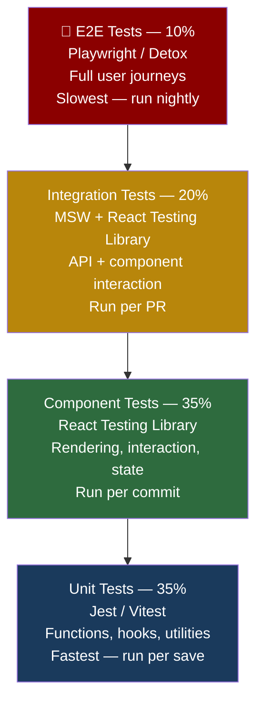
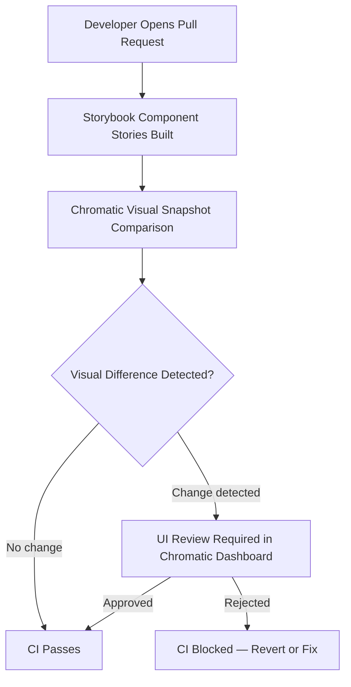
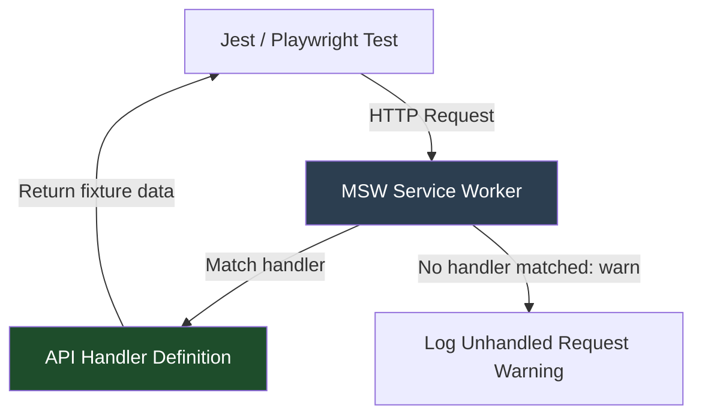
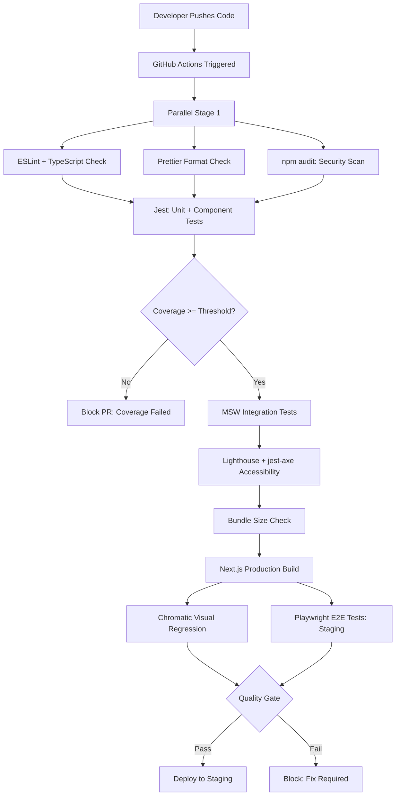
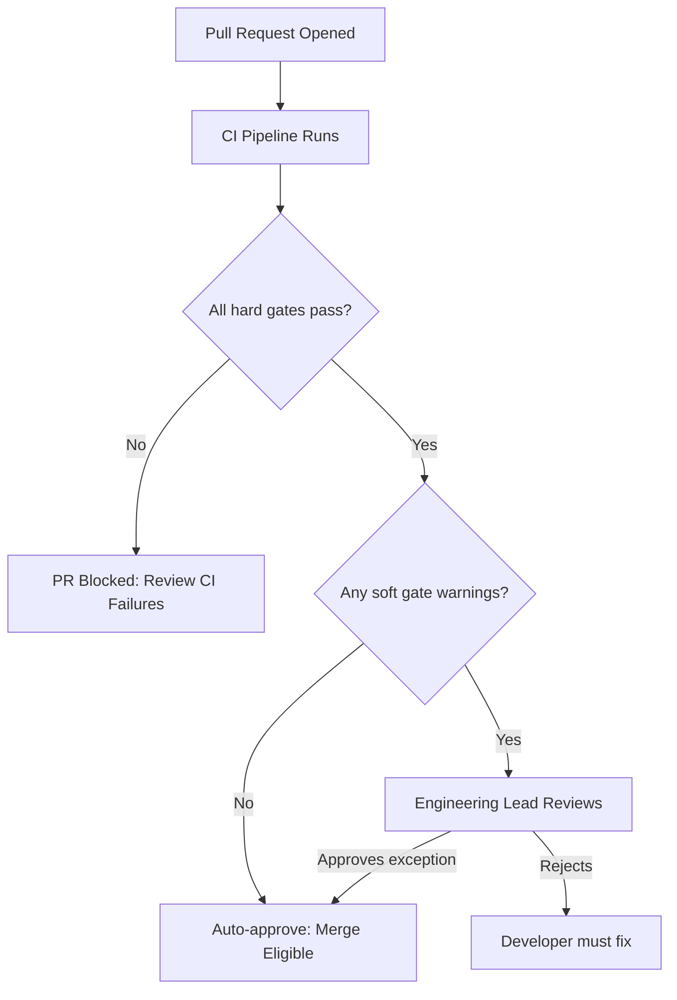
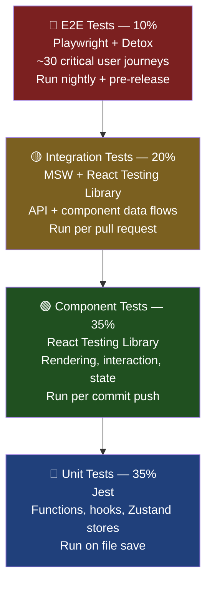
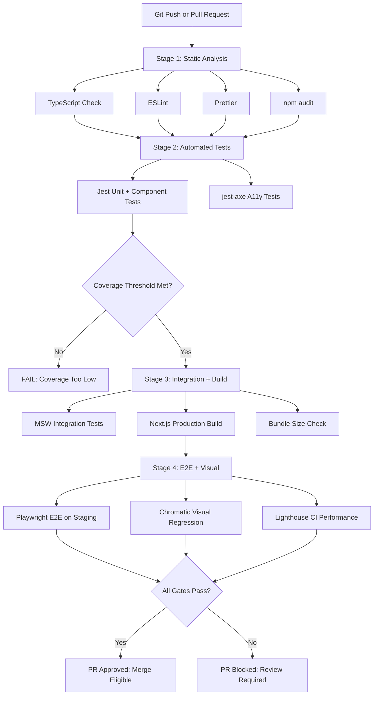
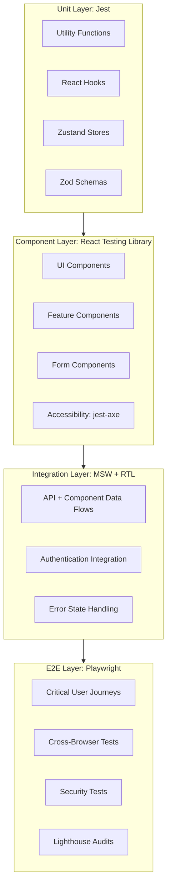
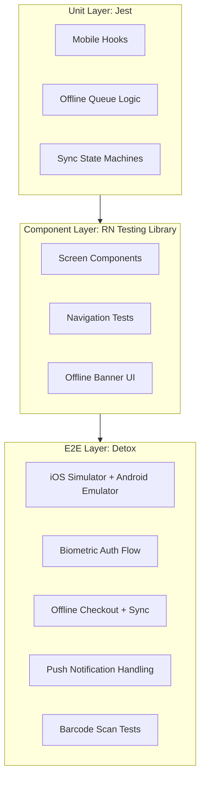
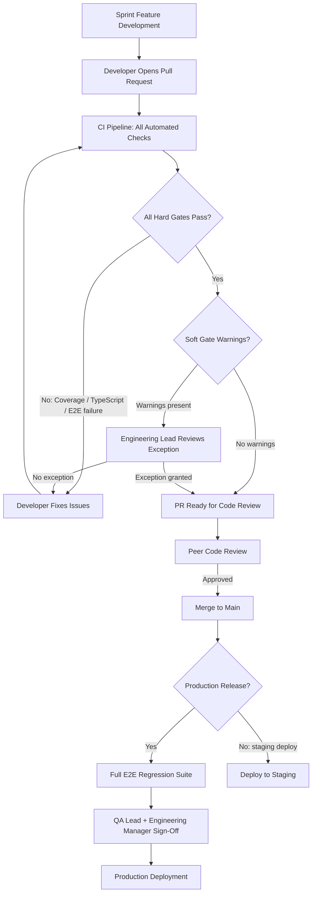

# FRONTEND TESTING ARCHITECTURE & QUALITY ENGINEERING STRATEGY

**Project Name:** Enterprise SaaS Business Management Platform  
**Document Version:** 1.0.0 — Baseline Standard  
**Date:** July 13, 2026  
**Authors:** Principal Frontend QA Architect, Quality Engineering Lead, React Testing Specialist & Mobile Testing Engineer  
**Classification:** Enterprise Internal — Unrestricted  
**Status:** 🏛️ APPROVED FRONTEND QUALITY ENGINEERING SPECIFICATION  

---

## SECTION 1 — FRONTEND QUALITY FOUNDATION

### 1.1 Quality Engineering Continuous Lifecycle

Quality is not a phase that happens after development — it is a continuous, layered discipline embedded into every step of the engineering lifecycle:

```
┌─────────────────────────────────────────────────────────┐
│  Development   │  Code quality, type safety, code review│
├─────────────────────────────────────────────────────────┤
│  Testing       │  Unit, component, integration, E2E     │
├─────────────────────────────────────────────────────────┤
│  Automation    │  CI pipeline: lint → test → build      │
├─────────────────────────────────────────────────────────┤
│  Monitoring    │  Production errors, Web Vitals, Sentry │
├─────────────────────────────────────────────────────────┤
│  Improvement   │  Sprint retrospectives, flaky test fix │
└─────────────────────────────────────────────────────────┘
```

### 1.2 Enterprise Frontend Quality Principles

| Principle | Description | Enforcement |
| :--- | :--- | :--- |
| **Test What Matters** | Prioritize business-critical flows (POS checkout, auth, inventory) over trivial UI details. | Coverage requirements by module criticality, not global average. |
| **Test Behavior, Not Implementation** | Assertions validate user-observable outcomes, not internal component state. | React Testing Library APIs enforce this by design. |
| **Automation First** | No manual-only regression; every business scenario has an automated equivalent. | CI blocks merge if new feature lacks test coverage. |
| **Fast Feedback** | Unit and component tests run in under 60 seconds locally. E2E suites parallelized in CI. | jest `--runInBand` banned; Playwright workers configured. |
| **Deterministic Tests** | Tests produce the same result on every run; no time-sensitive or network-dependent assertions. | MSW for API mocking; fixed date mocking in Jest. |
| **Shift Left Security** | Security and accessibility checks run in CI, not only at release time. | `axe-core` and `npm audit` in CI pipeline. |
| **Shared Quality Ownership** | QA engineers write automation frameworks; frontend engineers write tests for their features. | Definition of Done includes passing tests for every user story. |
| **Observable Failure** | Every test failure produces a clear, actionable message, screenshot, or trace. | Playwright HTML report + Sentry integration required. |

---

## SECTION 2 — FRONTEND TESTING PYRAMID

### 2.1 Testing Pyramid Architecture



### 2.2 Pyramid Balance Rationale

| Layer | Coverage Target | Execution Speed | Run Trigger | Primary Value |
| :--- | :--- | :--- | :--- | :--- |
| **Unit Tests** | 35% of total suite | < 5 ms per test | On file save (watch mode) | Validates pure logic; instant feedback. |
| **Component Tests** | 35% of total suite | 50–200 ms per test | Per commit | Validates UI rendering and user interactions. |
| **Integration Tests** | 20% of total suite | 200 ms–2 s per test | Per pull request | Validates API + component data flows. |
| **E2E Tests** | 10% of total suite | 5–30 s per scenario | Nightly + pre-release | Validates complete user journeys end to end. |

### 2.3 Module Coverage Requirements

| Module | Minimum Coverage | Rationale |
| :--- | :--- | :--- |
| **POS Checkout** | 90% | Revenue-critical; every path must be validated. |
| **Authentication** | 95% | Security-critical; edge cases are high risk. |
| **Inventory Management** | 85% | Operational-critical; stock errors cause business loss. |
| **Finance / Reporting** | 85% | Regulatory-adjacent; data accuracy is essential. |
| **HR / Payroll** | 80% | Data sensitivity; calculation correctness required. |
| **UI Utilities / Helpers** | 90% | Pure functions; cheap to test exhaustively. |
| **Static UI Components** | 70% | Rendering and interaction; visual regression handles the rest. |

---

## SECTION 3 — UNIT TESTING ARCHITECTURE

### 3.1 What to Unit Test

*   Pure utility functions (formatters, validators, calculators)
*   Custom React hooks (business logic, state transitions)
*   Redux Toolkit slices / Zustand store actions
*   Zod schema validation rules
*   Date, currency, and number transformation utilities

### 3.2 Jest Configuration (`jest.config.ts`)

```typescript
import type { Config } from 'jest';
import nextJest from 'next/jest.js';

const createJestConfig = nextJest({ dir: './' });

const config: Config = {
  testEnvironment: 'jsdom',
  setupFilesAfterFramework: ['<rootDir>/jest.setup.ts'],
  moduleNameMapper: {
    '^@/(.*)$': '<rootDir>/src/$1',
  },
  collectCoverageFrom: [
    'src/**/*.{ts,tsx}',
    '!src/**/*.d.ts',
    '!src/**/*.stories.tsx',
    '!src/app/layout.tsx',
  ],
  coverageThresholds: {
    global: {
      branches: 75,
      functions: 80,
      lines: 80,
      statements: 80,
    },
  },
  testPathPattern: ['**/__tests__/**/*.test.{ts,tsx}'],
};

export default createJestConfig(config);
```

### 3.3 Jest Setup File (`jest.setup.ts`)

```typescript
import '@testing-library/jest-dom';
import { server } from './src/mocks/server';

// Start MSW server before all tests
beforeAll(() => server.listen({ onUnhandledRequest: 'warn' }));
afterEach(() => server.resetHandlers());
afterAll(() => server.close());

// Mock Next.js router
jest.mock('next/navigation', () => ({
  useRouter: () => ({ push: jest.fn(), replace: jest.fn(), back: jest.fn() }),
  usePathname: () => '/dashboard',
  useSearchParams: () => new URLSearchParams(),
}));

// Freeze dates for deterministic tests
jest.useFakeTimers({ now: new Date('2026-01-15T10:00:00Z') });
```

### 3.4 Unit Test — Utility Function

```typescript
// utils/__tests__/currency.test.ts
import { formatCurrency, calculateDiscount, calculateVAT } from '@/utils/currency';

describe('formatCurrency', () => {
  it('formats USD to two decimal places', () => {
    expect(formatCurrency(1234.5, 'USD')).toBe('$1,234.50');
  });

  it('formats KHR without decimal places', () => {
    expect(formatCurrency(50000, 'KHR')).toBe('50,000 ៛');
  });

  it('returns zero-value string for zero amount', () => {
    expect(formatCurrency(0, 'USD')).toBe('$0.00');
  });
});

describe('calculateDiscount', () => {
  it('applies percentage discount correctly', () => {
    expect(calculateDiscount(100, 10)).toBe(90);
  });

  it('throws if discount exceeds 100%', () => {
    expect(() => calculateDiscount(100, 110)).toThrow('Discount cannot exceed 100%');
  });
});

describe('calculateVAT', () => {
  it('calculates 10% VAT on a given amount', () => {
    expect(calculateVAT(1000, 10)).toBe(100);
  });
});
```

### 3.5 Unit Test — Custom Hook

```typescript
// hooks/__tests__/useCartStore.test.ts
import { renderHook, act } from '@testing-library/react';
import { useCartStore } from '@/store/useCartStore';

const mockProduct = {
  id: 'prod-001', sku: 'SKU-001', name: 'Coffee', unitPrice: 3.5, quantity: 1
};

describe('useCartStore', () => {
  beforeEach(() => useCartStore.getState().clearCart());

  it('adds a new item to the cart', () => {
    const { result } = renderHook(() => useCartStore());
    act(() => result.current.addItem(mockProduct));
    expect(result.current.items).toHaveLength(1);
    expect(result.current.items[0].name).toBe('Coffee');
  });

  it('increments quantity when the same item is added twice', () => {
    const { result } = renderHook(() => useCartStore());
    act(() => {
      result.current.addItem(mockProduct);
      result.current.addItem(mockProduct);
    });
    expect(result.current.items).toHaveLength(1);
    expect(result.current.items[0].quantity).toBe(2);
  });

  it('calculates the correct cart total', () => {
    const { result } = renderHook(() => useCartStore());
    act(() => result.current.addItem({ ...mockProduct, quantity: 2 }));
    expect(result.current.cartTotal()).toBe(7.0);
  });

  it('removes an item from the cart', () => {
    const { result } = renderHook(() => useCartStore());
    act(() => {
      result.current.addItem(mockProduct);
      result.current.removeItem('prod-001');
    });
    expect(result.current.items).toHaveLength(0);
  });

  it('clears the entire cart', () => {
    const { result } = renderHook(() => useCartStore());
    act(() => {
      result.current.addItem(mockProduct);
      result.current.clearCart();
    });
    expect(result.current.items).toHaveLength(0);
  });
});
```

---

## SECTION 4 — COMPONENT TESTING

### 4.1 Component Testing Principles

*   Test the component as a user would interact with it — query by role, label, and text.
*   Never test implementation details (internal state, method calls).
*   Validate all interaction states: default, loading, error, empty, and success.
*   Mock external dependencies (API calls, router) — test the component in isolation.

### 4.2 Button Component Test

```typescript
// components/__tests__/Button.test.tsx
import { render, screen, fireEvent } from '@testing-library/react';
import { Button } from '@/components/ui/Button';

describe('Button', () => {
  it('renders with correct label', () => {
    render(<Button>Save Product</Button>);
    expect(screen.getByRole('button', { name: 'Save Product' })).toBeInTheDocument();
  });

  it('calls onClick handler when clicked', () => {
    const handleClick = jest.fn();
    render(<Button onClick={handleClick}>Submit</Button>);
    fireEvent.click(screen.getByRole('button', { name: 'Submit' }));
    expect(handleClick).toHaveBeenCalledTimes(1);
  });

  it('is disabled when loading prop is true', () => {
    render(<Button loading>Saving…</Button>);
    expect(screen.getByRole('button')).toBeDisabled();
  });

  it('shows spinner when loading', () => {
    render(<Button loading>Saving…</Button>);
    expect(screen.getByTestId('loading-spinner')).toBeInTheDocument();
  });

  it('does not call onClick when disabled', () => {
    const handleClick = jest.fn();
    render(<Button disabled onClick={handleClick}>Click me</Button>);
    fireEvent.click(screen.getByRole('button'));
    expect(handleClick).not.toHaveBeenCalled();
  });
});
```

### 4.3 Form Component Test

```typescript
// features/inventory/__tests__/ProductForm.test.tsx
import { render, screen, waitFor } from '@testing-library/react';
import userEvent from '@testing-library/user-event';
import { ProductForm } from '@/features/inventory/ProductForm';

describe('ProductForm', () => {
  it('submits form with valid data', async () => {
    const user = userEvent.setup();
    const onSubmit = jest.fn();
    render(<ProductForm onSubmit={onSubmit} />);

    await user.type(screen.getByLabelText('Product Name'), 'Espresso');
    await user.type(screen.getByLabelText('SKU'), 'ESP-001');
    await user.type(screen.getByLabelText('Price'), '3.50');
    await user.click(screen.getByRole('button', { name: 'Save Product' }));

    await waitFor(() =>
      expect(onSubmit).toHaveBeenCalledWith(
        expect.objectContaining({ name: 'Espresso', sku: 'ESP-001', price: 3.5 })
      )
    );
  });

  it('shows validation errors when required fields are empty', async () => {
    const user = userEvent.setup();
    render(<ProductForm onSubmit={jest.fn()} />);
    await user.click(screen.getByRole('button', { name: 'Save Product' }));

    await waitFor(() => {
      expect(screen.getByText('Product name must be at least 2 characters')).toBeInTheDocument();
      expect(screen.getByText('SKU must be at least 3 characters')).toBeInTheDocument();
    });
  });
});
```

### 4.4 Dashboard Widget Test

```typescript
// features/dashboard/__tests__/SalesSummaryWidget.test.tsx
import { render, screen } from '@testing-library/react';
import { SalesSummaryWidget } from '@/features/dashboard/SalesSummaryWidget';
import { createWrapper } from '@/test-utils/queryWrapper';

describe('SalesSummaryWidget', () => {
  it('displays loading skeleton while data is fetching', () => {
    render(<SalesSummaryWidget />, { wrapper: createWrapper() });
    expect(screen.getByTestId('skeleton-loader')).toBeInTheDocument();
  });

  it('renders total sales value after data loads', async () => {
    render(<SalesSummaryWidget />, { wrapper: createWrapper() });
    expect(await screen.findByText('$12,450.00')).toBeInTheDocument();
  });

  it('renders error state on API failure', async () => {
    server.use(http.get('/v1/reports/sales-summary', () =>
      HttpResponse.json({}, { status: 500 })
    ));
    render(<SalesSummaryWidget />, { wrapper: createWrapper() });
    expect(await screen.findByText('Unable to load sales data')).toBeInTheDocument();
  });
});
```

---

## SECTION 5 — FEATURE TESTING

### 5.1 Feature Test Scope

Feature tests validate complete business flows within a single browser context, interacting with mocked APIs. They sit above component tests but below full E2E tests in cost and scope.

### 5.2 POS Checkout Feature Test

```typescript
// features/pos/__tests__/POSCheckout.feature.test.tsx
import { render, screen, waitFor } from '@testing-library/react';
import userEvent from '@testing-library/user-event';
import { POSScreen } from '@/features/pos/POSScreen';
import { createWrapper } from '@/test-utils/queryWrapper';

describe('POS Checkout Feature', () => {
  it('completes a full checkout flow', async () => {
    const user = userEvent.setup();
    render(<POSScreen />, { wrapper: createWrapper({ tenantId: 'tenant-001' }) });

    // Step 1: Search and add a product to cart
    await user.type(screen.getByPlaceholderText('Search products…'), 'Coffee');
    await user.click(await screen.findByText('Espresso — $3.50'));
    expect(screen.getByTestId('cart-item-count')).toHaveTextContent('1');

    // Step 2: Apply a 10% discount
    await user.click(screen.getByRole('button', { name: 'Apply Discount' }));
    await user.type(screen.getByLabelText('Discount %'), '10');
    await user.click(screen.getByRole('button', { name: 'Confirm Discount' }));

    // Step 3: Confirm total is correct
    expect(screen.getByTestId('cart-total')).toHaveTextContent('$3.15');

    // Step 4: Submit checkout
    await user.click(screen.getByRole('button', { name: 'Checkout' }));
    await user.click(screen.getByRole('button', { name: 'Cash Payment' }));

    // Step 5: Assert receipt is shown
    await waitFor(() =>
      expect(screen.getByTestId('receipt-modal')).toBeInTheDocument()
    );
    expect(screen.getByText('Order completed successfully')).toBeInTheDocument();
  });

  it('prevents checkout when cart is empty', async () => {
    const user = userEvent.setup();
    render(<POSScreen />, { wrapper: createWrapper() });
    await user.click(screen.getByRole('button', { name: 'Checkout' }));
    expect(screen.getByText('Add at least one item before checking out')).toBeInTheDocument();
  });
});
```

### 5.3 Inventory Update Feature Test

```typescript
// features/inventory/__tests__/StockAdjustment.feature.test.tsx
describe('Inventory Stock Adjustment', () => {
  it('adjusts stock level and shows new quantity', async () => {
    const user = userEvent.setup();
    render(<StockAdjustmentForm productId="prod-001" />, { wrapper: createWrapper() });

    await user.selectOptions(screen.getByLabelText('Adjustment Type'), 'ADDITION');
    await user.type(screen.getByLabelText('Quantity'), '50');
    await user.type(screen.getByLabelText('Reason'), 'Received supplier delivery');
    await user.click(screen.getByRole('button', { name: 'Save Adjustment' }));

    await waitFor(() =>
      expect(screen.getByTestId('success-banner')).toHaveTextContent(
        'Stock updated successfully'
      )
    );
  });
});
```

---

## SECTION 6 — INTEGRATION TESTING

### 6.1 Integration Test Scope

Integration tests validate the full data pipeline from component through the API layer (mocked via MSW) to rendered output. They answer: "Does the component correctly request data from the API and display it?"

### 6.2 API Integration Test — Authentication

```typescript
// integration/__tests__/authentication.integration.test.tsx
import { render, screen, waitFor } from '@testing-library/react';
import userEvent from '@testing-library/user-event';
import { LoginPage } from '@/app/(auth)/login/page';
import { createWrapper } from '@/test-utils/queryWrapper';

describe('Authentication Integration', () => {
  it('redirects to dashboard after successful login', async () => {
    const user = userEvent.setup();
    const mockPush = jest.fn();
    jest.mocked(useRouter).mockReturnValue({ push: mockPush } as any);

    render(<LoginPage />, { wrapper: createWrapper() });
    await user.type(screen.getByLabelText('Email'), 'owner@business.com');
    await user.type(screen.getByLabelText('Password'), 'P@ssword123!');
    await user.click(screen.getByRole('button', { name: 'Log In' }));

    await waitFor(() => expect(mockPush).toHaveBeenCalledWith('/dashboard'));
  });

  it('shows API error message on invalid credentials', async () => {
    server.use(
      http.post('/v1/auth/login', () =>
        HttpResponse.json(
          { success: false, error: { userMessage: 'Invalid email or password' } },
          { status: 401 }
        )
      )
    );
    const user = userEvent.setup();
    render(<LoginPage />, { wrapper: createWrapper() });
    await user.type(screen.getByLabelText('Email'), 'bad@user.com');
    await user.type(screen.getByLabelText('Password'), 'wrongpass');
    await user.click(screen.getByRole('button', { name: 'Log In' }));

    await waitFor(() =>
      expect(screen.getByRole('alert')).toHaveTextContent('Invalid email or password')
    );
  });
});
```

### 6.3 API Integration Test — Data Loading

```typescript
// integration/__tests__/productList.integration.test.tsx
describe('Product List Data Loading', () => {
  it('renders product list from API response', async () => {
    render(<ProductListPage />, { wrapper: createWrapper({ tenantId: 'tenant-001' }) });
    expect(screen.getByTestId('skeleton-loader')).toBeInTheDocument();

    await waitFor(() =>
      expect(screen.queryByTestId('skeleton-loader')).not.toBeInTheDocument()
    );
    expect(screen.getAllByRole('row')).toHaveLength(3); // header + 2 product rows
  });

  it('shows empty state when no products exist', async () => {
    server.use(http.get('/v1/products', () =>
      HttpResponse.json({ success: true, data: [], meta: { totalItems: 0 } })
    ));
    render(<ProductListPage />, { wrapper: createWrapper() });
    expect(await screen.findByTestId('empty-state')).toBeInTheDocument();
  });
});
```

---

## SECTION 7 — END-TO-END TESTING

### 7.1 E2E Test Philosophy

E2E tests simulate a real user navigating a real browser against a running staging environment. They validate that every layer of the stack — frontend, API gateway, backend, and database — works together correctly.

### 7.2 Playwright Configuration (`playwright.config.ts`)

```typescript
import { defineConfig, devices } from '@playwright/test';

export default defineConfig({
  testDir: './e2e',
  fullyParallel: true,
  retries: process.env.CI ? 2 : 0,
  workers: process.env.CI ? 4 : 1,
  reporter: [['html', { open: 'never' }], ['github']],
  timeout: 30_000,
  use: {
    baseURL: process.env.E2E_BASE_URL ?? 'http://localhost:3000',
    trace: 'on-first-retry',
    screenshot: 'only-on-failure',
    video: 'on-first-retry',
  },
  projects: [
    { name: 'chromium', use: { ...devices['Desktop Chrome'] } },
    { name: 'firefox', use: { ...devices['Desktop Firefox'] } },
    { name: 'mobile-safari', use: { ...devices['iPhone 14'] } },
  ],
});
```

### 7.3 E2E Scenario — Full POS Transaction

```typescript
// e2e/pos/checkout.spec.ts
import { test, expect } from '@playwright/test';
import { LoginPage } from '../pages/login.page';
import { POSPage } from '../pages/pos.page';

test.describe('POS Checkout Journey', () => {
  test.beforeEach(async ({ page }) => {
    const login = new LoginPage(page);
    await login.goto();
    await login.loginAs('cashier@tenant001.com', 'P@ssword123!');
    await expect(page).toHaveURL('/pos');
  });

  test('cashier completes a full cash checkout', async ({ page }) => {
    const pos = new POSPage(page);

    await pos.searchProduct('Espresso');
    await pos.addProductToCart('Espresso');
    await expect(pos.cartItemCount).toHaveText('1');

    await pos.applyDiscount(10);
    await expect(pos.cartTotal).toHaveText('$3.15');

    await pos.checkout('Cash');
    await expect(page.getByTestId('receipt-modal')).toBeVisible();
    await expect(page.getByTestId('order-number')).toBeVisible();
  });

  test('manager can void a completed order', async ({ page }) => {
    const pos = new POSPage(page);
    await pos.openOrderHistory();
    await pos.voidOrder('ORD-00123', 'Customer changed mind');
    await expect(page.getByText('Order voided successfully')).toBeVisible();
  });
});
```

### 7.4 E2E Page Object Model (`e2e/pages/pos.page.ts`)

```typescript
import { type Page, type Locator } from '@playwright/test';

export class POSPage {
  readonly searchInput: Locator;
  readonly cartItemCount: Locator;
  readonly cartTotal: Locator;

  constructor(private page: Page) {
    this.searchInput = page.getByPlaceholder('Search products…');
    this.cartItemCount = page.getByTestId('cart-item-count');
    this.cartTotal = page.getByTestId('cart-total');
  }

  async searchProduct(name: string): Promise<void> {
    await this.searchInput.fill(name);
  }

  async addProductToCart(name: string): Promise<void> {
    await this.page.getByText(name).first().click();
  }

  async applyDiscount(percent: number): Promise<void> {
    await this.page.getByRole('button', { name: 'Apply Discount' }).click();
    await this.page.getByLabel('Discount %').fill(String(percent));
    await this.page.getByRole('button', { name: 'Confirm Discount' }).click();
  }

  async checkout(paymentMethod: 'Cash' | 'Card' | 'QR'): Promise<void> {
    await this.page.getByRole('button', { name: 'Checkout' }).click();
    await this.page.getByRole('button', { name: `${paymentMethod} Payment` }).click();
  }

  async openOrderHistory(): Promise<void> {
    await this.page.getByRole('link', { name: 'Order History' }).click();
  }

  async voidOrder(orderId: string, reason: string): Promise<void> {
    await this.page.getByTestId(`order-${orderId}-void-btn`).click();
    await this.page.getByLabel('Void Reason').fill(reason);
    await this.page.getByRole('button', { name: 'Confirm Void' }).click();
  }
}
```

### 7.5 Critical E2E Scenario Coverage

| Scenario | User Role | Priority |
| :--- | :--- | :--- |
| Login and dashboard access | All roles | 🔴 Critical |
| POS checkout (cash + card + QR) | Cashier, Manager | 🔴 Critical |
| Inventory stock adjustment | Manager | 🔴 Critical |
| Create and manage product | Manager, Owner | 🟠 High |
| Generate and export sales report | Owner | 🟠 High |
| Add and update customer record | Manager | 🟡 Medium |
| Employee clock in / clock out | Staff | 🟡 Medium |
| Multi-branch data switch | Owner | 🟡 Medium |
| Role-based access (403 redirect) | All roles | 🔴 Critical |
| Session expiry and auto-renewal | All roles | 🔴 Critical |

---

## SECTION 8 — WEB APPLICATION TESTING

### 8.1 Next.js App Router Testing Coverage

| Next.js Feature | Test Type | Test Focus |
| :--- | :--- | :--- |
| **Server Components** | Integration | Render correct HTML; handle async data; SEO meta tags. |
| **Client Components** | Component | Interactivity; state transitions; event handlers. |
| **Server Actions** | Integration | Form submission; validation; optimistic updates. |
| **Dynamic Routes** | E2E | Route params resolve to correct resource pages. |
| **Middleware** | Unit + E2E | Route guards redirect unauthorized users correctly. |
| **Layouts** | Component | Sidebar, navigation, and header render per role. |
| **Error Pages** | Component | `error.tsx` and `not-found.tsx` display expected messages. |
| **Loading States** | Component | `loading.tsx` skeleton renders during async transitions. |

### 8.2 Middleware / Route Guard Test

```typescript
// middleware/__tests__/authMiddleware.test.ts
import { middleware } from '@/middleware';
import { NextRequest } from 'next/server';

function buildRequest(path: string, cookies: Record<string, string> = {}) {
  const request = new NextRequest(`http://localhost${path}`);
  Object.entries(cookies).forEach(([k, v]) => request.cookies.set(k, v));
  return request;
}

describe('Auth Middleware', () => {
  it('allows authenticated user to access /dashboard', () => {
    const request = buildRequest('/dashboard', { 'user-role': 'manager' });
    const response = middleware(request);
    expect(response.status).toBe(200);
  });

  it('redirects unauthenticated user from /finance to /403', () => {
    const request = buildRequest('/finance');
    const response = middleware(request);
    expect(response.headers.get('location')).toContain('/403');
  });

  it('allows business_owner to access /finance', () => {
    const request = buildRequest('/finance', { 'user-role': 'business_owner' });
    const response = middleware(request);
    expect(response.status).toBe(200);
  });

  it('blocks cashier from accessing /admin', () => {
    const request = buildRequest('/admin', { 'user-role': 'cashier' });
    const response = middleware(request);
    expect(response.headers.get('location')).toContain('/403');
  });
});
```

### 8.3 Responsive UI Testing (Playwright)

```typescript
// e2e/responsive/dashboard.responsive.spec.ts
import { test, expect, devices } from '@playwright/test';

const viewports = [
  { name: 'Desktop', ...devices['Desktop Chrome'] },
  { name: 'Tablet', ...devices['iPad Pro'] },
  { name: 'Mobile', ...devices['iPhone 14'] },
];

for (const viewport of viewports) {
  test(`Dashboard layout is usable on ${viewport.name}`, async ({ browser }) => {
    const context = await browser.newContext({ ...viewport });
    const page = await context.newPage();
    await page.goto('/dashboard');
    await expect(page.getByTestId('main-navigation')).toBeVisible();
    await expect(page.getByTestId('sales-summary-widget')).toBeVisible();
    await page.screenshot({ path: `test-results/screenshots/dashboard-${viewport.name}.png` });
    await context.close();
  });
}
```

---

## SECTION 9 — MOBILE APPLICATION TESTING

### 9.1 React Native Testing Architecture

```
┌─────────────────────────────────────────────────┐
│  Detox E2E Tests         (Full device / emulator)│
├─────────────────────────────────────────────────┤
│  React Native Testing Library  (Component tests) │
├─────────────────────────────────────────────────┤
│  Jest Unit Tests         (Business logic / hooks)│
└─────────────────────────────────────────────────┘
```

### 9.2 Detox E2E Configuration (`detox.config.ts`)

```typescript
import type { Detox } from 'detox';

const config: Detox.DetoxConfig = {
  testRunner: {
    args: { '$0': 'jest', config: 'e2e/jest.config.js' },
    jest: { setupTimeout: 120_000 },
  },
  apps: {
    'ios.debug': {
      type: 'ios.app',
      binaryPath: 'ios/build/Products/Debug/SaaSMobile.app',
      build: 'xcodebuild -workspace ios/SaaSMobile.xcworkspace -scheme SaaSMobile -configuration Debug',
    },
    'android.debug': {
      type: 'android.apk',
      binaryPath: 'android/app/build/outputs/apk/debug/app-debug.apk',
      build: './gradlew assembleDebug',
    },
  },
  devices: {
    simulator: { type: 'ios.simulator', device: { type: 'iPhone 15 Pro' } },
    emulator: { type: 'android.emulator', device: { avdName: 'Pixel_7_API_34' } },
  },
  configurations: {
    'ios.sim.debug': { device: 'simulator', app: 'ios.debug' },
    'android.emu.debug': { device: 'emulator', app: 'android.debug' },
  },
};

export default config;
```

### 9.3 Detox E2E Test — Mobile Login

```typescript
// e2e/mobile/auth/login.e2e.ts
import { device, element, by, expect as detoxExpect } from 'detox';

describe('Mobile Authentication', () => {
  beforeAll(async () => {
    await device.launchApp({ newInstance: true });
  });

  beforeEach(async () => {
    await device.reloadReactNative();
  });

  it('logs in with valid credentials and shows dashboard', async () => {
    await element(by.id('email-input')).typeText('owner@business.com');
    await element(by.id('password-input')).typeText('P@ssword123!');
    await element(by.id('login-button')).tap();

    await detoxExpect(element(by.id('dashboard-screen'))).toBeVisible();
  });

  it('shows error for invalid credentials', async () => {
    await element(by.id('email-input')).typeText('wrong@user.com');
    await element(by.id('password-input')).typeText('badpassword');
    await element(by.id('login-button')).tap();

    await detoxExpect(element(by.id('login-error-message'))).toBeVisible();
  });
});
```

### 9.4 Offline Mode Test (Detox)

```typescript
// e2e/mobile/offline/pos-offline.e2e.ts
describe('POS Offline Mode', () => {
  it('allows checkout when network is unavailable and syncs on reconnect', async () => {
    // 1. Login while online
    await loginAs('cashier@business.com');

    // 2. Disable network
    await device.setStatusBar({ networkType: 'none' });

    // 3. Verify offline indicator is shown
    await detoxExpect(element(by.id('offline-banner'))).toBeVisible();

    // 4. Complete a checkout
    await element(by.id('product-coffee')).tap();
    await element(by.id('checkout-button')).tap();
    await element(by.id('cash-payment-button')).tap();

    // 5. Verify order queued locally
    await detoxExpect(element(by.id('sync-queue-badge'))).toHaveText('1');

    // 6. Re-enable network and verify sync
    await device.setStatusBar({ networkType: 'wifi' });
    await waitFor(element(by.id('sync-queue-badge'))).not.toBeVisible().withTimeout(10_000);
    await detoxExpect(element(by.id('last-sync-time'))).toBeVisible();
  });
});
```

### 9.5 Mobile Testing Coverage

| Feature | Test Type | Tools |
| :--- | :--- | :--- |
| **Screen Navigation** | Detox E2E | Navigate between screens; back button; deep links. |
| **Touch Interactions** | Detox E2E | Tap, swipe, scroll, long-press, pinch-zoom. |
| **Camera / Barcode** | Detox + Mock | Product barcode scanning with mocked camera input. |
| **Push Notifications** | Detox | Receive notification; tap to navigate to relevant screen. |
| **Offline POS** | Detox E2E | Checkout while offline; sync queue; reconnect sync. |
| **Biometric Auth** | Detox + Mock | Face ID / fingerprint authentication flow. |
| **Device Rotation** | Detox E2E | Layout adapts correctly on portrait / landscape switch. |

---

## SECTION 10 — VISUAL REGRESSION TESTING

### 10.1 Visual Testing Architecture



### 10.2 Storybook Component Story

```typescript
// components/ui/Button/Button.stories.tsx
import type { Meta, StoryObj } from '@storybook/react';
import { Button } from './Button';

const meta: Meta<typeof Button> = {
  title: 'UI/Button',
  component: Button,
  parameters: { layout: 'centered' },
  tags: ['autodocs'],
};

export default meta;
type Story = StoryObj<typeof Button>;

export const Primary: Story = {
  args: { children: 'Save Product', variant: 'primary' },
};

export const Loading: Story = {
  args: { children: 'Saving…', loading: true },
};

export const Disabled: Story = {
  args: { children: 'Unavailable', disabled: true },
};

export const Danger: Story = {
  args: { children: 'Delete Product', variant: 'danger' },
};
```

### 10.3 Chromatic CI Integration

```yaml
# .github/workflows/chromatic.yml
name: Visual Regression Tests
on: [push]
jobs:
  chromatic:
    runs-on: ubuntu-latest
    steps:
      - uses: actions/checkout@v4
        with: { fetch-depth: 0 }
      - name: Install dependencies
        run: npm ci
      - name: Build Storybook
        run: npm run build-storybook
      - name: Run Chromatic
        uses: chromaui/action@v1
        with:
          projectToken: ${{ secrets.CHROMATIC_PROJECT_TOKEN }}
          storybookBuildDir: storybook-static
          exitZeroOnChanges: false   # Block PR on unapproved visual changes
          autoAcceptChanges: false
```

---

## SECTION 11 — ACCESSIBILITY TESTING

### 11.1 Accessibility Testing Layers

| Layer | Tool | Scope |
| :--- | :--- | :--- |
| **Automated (CI)** | `jest-axe` + `@axe-core/react` | Component-level WCAG 2.1 AA violations caught in unit/component tests. |
| **Automated (CI)** | Lighthouse CI | Full-page accessibility score on every PR. |
| **Manual Review** | Screen reader (NVDA / VoiceOver) | Navigation, announcements, and focus order verified quarterly. |
| **Visual** | Chromatic | Color contrast, touch target size across component stories. |

### 11.2 Automated Accessibility Test (`jest-axe`)

```typescript
// components/__tests__/ProductTable.a11y.test.tsx
import { render } from '@testing-library/react';
import { axe, toHaveNoViolations } from 'jest-axe';
import { ProductTable } from '@/features/inventory/ProductTable';

expect.extend(toHaveNoViolations);

describe('ProductTable Accessibility', () => {
  it('has no WCAG 2.1 AA violations', async () => {
    const { container } = render(
      <ProductTable products={mockProducts} onEdit={jest.fn()} onDelete={jest.fn()} />
    );
    const results = await axe(container);
    expect(results).toHaveNoViolations();
  });
});
```

### 11.3 Keyboard Navigation Test (Playwright)

```typescript
// e2e/accessibility/keyboard.spec.ts
test('User can navigate POS using keyboard only', async ({ page }) => {
  await page.goto('/pos');
  await page.keyboard.press('Tab'); // Focus search input
  await expect(page.getByPlaceholder('Search products…')).toBeFocused();

  await page.keyboard.type('Coffee');
  await page.keyboard.press('ArrowDown'); // Move to first result
  await page.keyboard.press('Enter');     // Add to cart

  await expect(page.getByTestId('cart-item-count')).toHaveText('1');
});
```

### 11.4 WCAG 2.1 AA Compliance Checklist

| Criterion | Standard | Test Method |
| :--- | :--- | :--- |
| **Color Contrast** | ≥ 4.5:1 for text | `jest-axe` + Chromatic visual review |
| **Keyboard Navigability** | All interactive elements reachable via Tab | Playwright keyboard navigation tests |
| **Focus Indicators** | Visible focus ring on every interactive element | Visual regression via Chromatic |
| **Screen Reader Labels** | All inputs and buttons have `aria-label` or `<label>` | `jest-axe` automated check |
| **Resize to 200%** | Layout usable at 200% browser zoom | Playwright viewport resize tests |
| **Error Identification** | Error messages are announced to screen readers | `aria-live` region tests |

---

## SECTION 12 — PERFORMANCE TESTING

### 12.1 Frontend Performance Metrics (Core Web Vitals)

| Metric | Target | Tool | Enforcement |
| :--- | :--- | :--- | :--- |
| **LCP** (Largest Contentful Paint) | ≤ 2.5 s | Lighthouse CI | CI fails if LCP > 2.5 s |
| **INP** (Interaction to Next Paint) | ≤ 200 ms | Web Vitals API | Monitored in production via RUM |
| **CLS** (Cumulative Layout Shift) | ≤ 0.1 | Lighthouse CI | CI warns if CLS > 0.1 |
| **FCP** (First Contentful Paint) | ≤ 1.8 s | Lighthouse CI | CI warns if FCP > 1.8 s |
| **TTFB** (Time to First Byte) | ≤ 600 ms | Lighthouse CI | Reviewed per PR for regression |

### 12.2 Lighthouse CI Configuration (`lighthouserc.js`)

```javascript
module.exports = {
  ci: {
    collect: {
      url: [
        'http://localhost:3000/',
        'http://localhost:3000/dashboard',
        'http://localhost:3000/pos',
        'http://localhost:3000/inventory',
      ],
      numberOfRuns: 3,
      startServerCommand: 'npm run start',
    },
    assert: {
      assertions: {
        'categories:performance': ['error', { minScore: 0.85 }],
        'categories:accessibility': ['error', { minScore: 0.90 }],
        'categories:best-practices': ['warn', { minScore: 0.90 }],
        'categories:seo': ['warn', { minScore: 0.90 }],
      },
    },
    upload: {
      target: 'lhci',
      serverBaseUrl: process.env.LHCI_SERVER_URL,
      token: process.env.LHCI_BUILD_TOKEN,
    },
  },
};
```

### 12.3 Bundle Size Monitoring

```yaml
# .github/workflows/bundle-analysis.yml
- name: Analyze bundle size
  run: npm run build
  env:
    ANALYZE: true

- name: Enforce bundle size budget
  uses: preactjs/compressed-size-action@v2
  with:
    repo-token: ${{ secrets.GITHUB_TOKEN }}
    pattern: '.next/static/**/*.{js,css}'
    compression: gzip
    minimum-change-threshold: 100     # Ignore changes < 100 bytes
    warn-if-larger-than: 250000       # Warn if any JS chunk > 250 kB gzipped
    error-if-larger-than: 500000      # Fail if any JS chunk > 500 kB gzipped
```

### 12.4 React Profiler Performance Test

```typescript
// performance/__tests__/POSScreen.perf.test.tsx
import { Profiler, type ProfilerOnRenderCallback } from 'react';
import { render, screen } from '@testing-library/react';
import { POSScreen } from '@/features/pos/POSScreen';

describe('POS Screen Render Performance', () => {
  it('initial render completes within 100 ms', () => {
    const renders: number[] = [];

    const onRender: ProfilerOnRenderCallback = (id, phase, actualDuration) => {
      renders.push(actualDuration);
    };

    render(
      <Profiler id="POSScreen" onRender={onRender}>
        <POSScreen />
      </Profiler>,
      { wrapper: createWrapper() }
    );

    const initialRenderTime = renders[0];
    expect(initialRenderTime).toBeLessThan(100);
  });
});
```

---

## SECTION 13 — API MOCKING STRATEGY

### 13.1 Mock Service Worker Architecture



### 13.2 MSW Server Setup (`mocks/server.ts`)

```typescript
import { setupServer } from 'msw/node';
import { handlers } from './handlers';

// Single MSW server instance shared across all test files
export const server = setupServer(...handlers);
```

### 13.3 MSW Browser Setup for Storybook / Development

```typescript
// mocks/browser.ts
import { setupWorker } from 'msw/browser';
import { handlers } from './handlers';

export const worker = setupWorker(...handlers);

// app/layout.tsx (dev only)
if (process.env.NODE_ENV === 'development') {
  const { worker } = await import('../mocks/browser');
  await worker.start({ onUnhandledRequest: 'warn' });
}
```

### 13.4 Handler Overriding for Error Scenarios

```typescript
// Pattern: override handlers per test to simulate error scenarios
describe('Network failure handling', () => {
  it('shows offline banner when network is unavailable', async () => {
    server.use(
      http.get('/v1/products', () => HttpResponse.error()) // Simulate network failure
    );
    render(<ProductListPage />, { wrapper: createWrapper() });
    await waitFor(() =>
      expect(screen.getByTestId('network-error-banner')).toBeInTheDocument()
    );
  });
});
```

---

## SECTION 14 — TEST DATA MANAGEMENT

### 14.1 Factory Pattern for Test Data (`test-utils/factories.ts`)

```typescript
import { faker } from '@faker-js/faker';
import type { Product, Order, Customer, Tenant, User } from '@/types';

export const productFactory = {
  create: (overrides: Partial<Product> = {}): Product => ({
    id: faker.string.uuid(),
    sku: `SKU-${faker.string.alphanumeric(6).toUpperCase()}`,
    name: faker.commerce.productName(),
    unitPrice: parseFloat(faker.commerce.price({ min: 1, max: 500 })),
    stock: faker.number.int({ min: 0, max: 500 }),
    categoryId: faker.string.uuid(),
    tenantId: 'tenant-001',
    createdAt: faker.date.past().toISOString(),
    ...overrides,
  }),
  createMany: (count: number, overrides: Partial<Product> = {}): Product[] =>
    Array.from({ length: count }, () => productFactory.create(overrides)),
};

export const orderFactory = {
  create: (overrides: Partial<Order> = {}): Order => ({
    id: faker.string.uuid(),
    orderNumber: `ORD-${faker.number.int({ min: 10000, max: 99999 })}`,
    status: 'COMPLETED',
    totalAmount: parseFloat(faker.commerce.price({ min: 5, max: 5000 })),
    tenantId: 'tenant-001',
    branchId: 'branch-001',
    createdAt: faker.date.recent().toISOString(),
    items: [],
    ...overrides,
  }),
};

export const tenantFactory = {
  create: (overrides = {}): Tenant => ({
    id: faker.string.uuid(),
    name: `${faker.company.name()} Business`,
    plan: 'professional',
    ...overrides,
  }),
};

export const userFactory = {
  create: (role: User['role'] = 'cashier', overrides: Partial<User> = {}): User => ({
    id: faker.string.uuid(),
    email: faker.internet.email(),
    name: faker.person.fullName(),
    role,
    tenantId: 'tenant-001',
    ...overrides,
  }),
};
```

### 14.2 Shared Test Fixtures (`test-utils/fixtures.ts`)

```typescript
export const mockProducts = productFactory.createMany(10);
export const mockOrders = orderFactory.create();
export const mockOwnerUser = userFactory.create('business_owner');
export const mockManagerUser = userFactory.create('manager');
export const mockCashierUser = userFactory.create('cashier');
export const mockTenant = tenantFactory.create({ id: 'tenant-001', name: 'Bright Coffee Shop' });
```

### 14.3 Test Wrapper with Context (`test-utils/queryWrapper.tsx`)

```typescript
import { QueryClient, QueryClientProvider } from '@tanstack/react-query';
import type { ReactNode } from 'react';

interface WrapperOptions {
  tenantId?: string;
  role?: string;
}

export function createWrapper(options: WrapperOptions = {}) {
  const queryClient = new QueryClient({
    defaultOptions: { queries: { retry: false }, mutations: { retry: false } },
  });

  return function Wrapper({ children }: { children: ReactNode }) {
    return (
      <QueryClientProvider client={queryClient}>
        {children}
      </QueryClientProvider>
    );
  };
}
```

---

## SECTION 15 — FRONTEND SECURITY TESTING

### 15.1 Security Test Coverage

| Threat | Test Approach | Tool |
| :--- | :--- | :--- |
| **XSS (Cross-Site Scripting)** | Inject script tags into input fields; verify sanitization. | Playwright E2E; OWASP ZAP scan. |
| **CSRF** | Attempt state-changing request without `X-XSRF-TOKEN`; expect 403. | Integration test; manual API test. |
| **Authentication Bypass** | Access protected routes without session cookies; verify redirect. | Playwright E2E; middleware unit tests. |
| **Authorization Bypass** | Attempt actions with insufficient role; verify 403 response. | Integration tests; `PermissionGate` component tests. |
| **Sensitive Data Exposure** | Inspect rendered DOM and console logs for tokens / PII leakage. | Playwright E2E; React Testing Library. |
| **Dependency Vulnerability** | Scan `package.json` dependencies for known CVEs. | `npm audit`; Dependabot alerts. |
| **Insecure Storage** | Verify no tokens stored in `localStorage` in production build. | Playwright: `page.evaluate(() => localStorage)` assertion. |

### 15.2 Security Test — No Token in LocalStorage

```typescript
// e2e/security/token-storage.spec.ts
test('Access token is never stored in localStorage', async ({ page }) => {
  await page.goto('/login');
  await page.getByLabel('Email').fill('owner@business.com');
  await page.getByLabel('Password').fill('P@ssword123!');
  await page.getByRole('button', { name: 'Log In' }).click();
  await expect(page).toHaveURL('/dashboard');

  const localStorage = await page.evaluate(() => JSON.stringify(localStorage));
  expect(localStorage).not.toContain('accessToken');
  expect(localStorage).not.toContain('refreshToken');
  expect(localStorage).not.toContain('Bearer');
});
```

### 15.3 Security Test — XSS Input Sanitization

```typescript
// e2e/security/xss.spec.ts
test('Malicious script input is sanitized in product name field', async ({ page }) => {
  await loginAs(page, 'manager@business.com');
  await page.goto('/inventory/products/new');

  const xssPayload = '<script>alert("XSS")</script>';
  await page.getByLabel('Product Name').fill(xssPayload);
  await page.getByRole('button', { name: 'Save Product' }).click();

  // Verify script did not execute
  page.on('dialog', () => { throw new Error('XSS dialog was triggered!'); });

  // Verify sanitized text appears in DOM
  const productName = await page.getByTestId('product-name').textContent();
  expect(productName).not.toContain('<script>');
});
```

### 15.4 Dependency Security Check (CI)

```yaml
- name: Security audit
  run: npm audit --audit-level=high
  # Fail CI if any HIGH or CRITICAL vulnerabilities are found in dependencies
```

---

## SECTION 16 — CONTINUOUS TESTING PIPELINE

### 16.1 CI Testing Pipeline Architecture



### 16.2 GitHub Actions CI Workflow (`ci.yml`)

```yaml
name: Frontend CI Pipeline
on:
  push:
    branches: [main, develop]
  pull_request:
    branches: [main]

jobs:
  quality:
    name: Code Quality & Unit Tests
    runs-on: ubuntu-latest
    steps:
      - uses: actions/checkout@v4
      - uses: actions/setup-node@v4
        with: { node-version: '20', cache: 'npm' }
      - run: npm ci

      - name: TypeScript type check
        run: npx tsc --noEmit

      - name: ESLint
        run: npm run lint

      - name: Prettier format check
        run: npx prettier --check "src/**/*.{ts,tsx}"

      - name: Security audit
        run: npm audit --audit-level=high

      - name: Unit & Component Tests with Coverage
        run: npm test -- --coverage --ci --forceExit
        env:
          CI: true

      - name: Upload coverage to Codecov
        uses: codecov/codecov-action@v4
        with:
          token: ${{ secrets.CODECOV_TOKEN }}
          fail_ci_if_error: true

  integration:
    name: Integration & Accessibility Tests
    needs: quality
    runs-on: ubuntu-latest
    steps:
      - uses: actions/checkout@v4
      - uses: actions/setup-node@v4
        with: { node-version: '20', cache: 'npm' }
      - run: npm ci
      - run: npm run test:integration
      - run: npm run test:a11y

  e2e:
    name: Playwright E2E Tests
    needs: integration
    runs-on: ubuntu-latest
    steps:
      - uses: actions/checkout@v4
      - uses: actions/setup-node@v4
        with: { node-version: '20', cache: 'npm' }
      - run: npm ci
      - run: npx playwright install --with-deps chromium firefox
      - run: npm run test:e2e
        env:
          E2E_BASE_URL: ${{ secrets.STAGING_URL }}
      - uses: actions/upload-artifact@v4
        if: failure()
        with:
          name: playwright-report
          path: playwright-report/

  performance:
    name: Lighthouse Performance Audit
    needs: integration
    runs-on: ubuntu-latest
    steps:
      - uses: actions/checkout@v4
      - uses: actions/setup-node@v4
        with: { node-version: '20', cache: 'npm' }
      - run: npm ci && npm run build && npm run start &
      - name: Run Lighthouse CI
        run: npx lhci autorun
        env:
          LHCI_GITHUB_APP_TOKEN: ${{ secrets.LHCI_GITHUB_APP_TOKEN }}
```

---

## SECTION 17 — QUALITY GATES

### 17.1 Release Quality Gate Requirements

| Gate | Requirement | Block Level |
| :--- | :--- | :--- |
| **Unit Test Coverage** | Global ≥ 80%; POS/Auth modules ≥ 90% | ❌ Hard block — PR cannot merge. |
| **TypeScript Errors** | Zero type errors (`tsc --noEmit`) | ❌ Hard block. |
| **ESLint Errors** | Zero lint errors (warnings allowed) | ❌ Hard block. |
| **Security Audit** | Zero HIGH or CRITICAL CVEs in dependencies | ❌ Hard block. |
| **E2E Tests Pass** | 100% of critical path E2E scenarios pass | ❌ Hard block. |
| **Lighthouse Performance** | Score ≥ 85 on all audited pages | ⚠️ Soft block — requires Engineering Lead approval to bypass. |
| **Lighthouse Accessibility** | Score ≥ 90 on all audited pages | ⚠️ Soft block. |
| **Bundle Size** | No chunk exceeds 500 kB gzipped | ⚠️ Soft block — requires justification. |
| **Visual Regression** | No unapproved visual changes in Chromatic | ⚠️ Soft block — requires UI review approval. |
| **No Critical Bugs** | No open P0 / P1 bugs in backlog | ❌ Hard block for production release. |

### 17.2 Quality Gate Decision Flow



---

## SECTION 18 — TESTING TOOL STACK

### 18.1 Complete Frontend Testing Tool Stack

| Category | Tool | Version | Purpose |
| :--- | :--- | :--- | :--- |
| **Unit Testing** | Jest | 29+ | Test runner; unit tests; snapshot tests; coverage. |
| **Component Testing** | React Testing Library | 16+ | Behavior-driven component tests without implementation coupling. |
| **User Event Simulation** | `@testing-library/user-event` | 14+ | Realistic browser interaction simulation in tests. |
| **E2E (Web)** | Playwright | 1.45+ | Cross-browser E2E tests; traces; screenshot; video. |
| **E2E (Mobile)** | Detox | 20+ | Device/emulator E2E tests for React Native apps. |
| **API Mocking** | MSW (Mock Service Worker) | 2+ | Intercept HTTP requests in tests and Storybook. |
| **Visual Regression** | Chromatic | Latest | Visual snapshot comparison; Storybook CI integration. |
| **Component Stories** | Storybook | 8+ | Isolated component development; visual documentation. |
| **Accessibility** | jest-axe | 8+ | WCAG 2.1 AA automated violation detection in component tests. |
| **Accessibility (E2E)** | axe-playwright | 2+ | Accessibility audits during Playwright E2E runs. |
| **Performance** | Lighthouse CI | 12+ | Core Web Vitals; performance scoring; CI integration. |
| **Bundle Analysis** | `@next/bundle-analyzer` | Latest | Visualize JavaScript bundle composition; identify bloat. |
| **Test Data** | `@faker-js/faker` | 9+ | Randomized, realistic test data generation. |
| **React Profiler** | Built-in React API | 18+ | Render time profiling; unnecessary re-render detection. |
| **Security** | OWASP ZAP | 2.14+ | Automated DAST scanning on staging environment. |
| **Dependency Audit** | `npm audit` | Built-in | CVE scanning of package dependencies. |
| **Coverage Upload** | Codecov | Latest | Coverage tracking; PR diff coverage; trend analysis. |

---

## SECTION 19 — FRONTEND QA GOVERNANCE

### 19.1 QA Process Framework

| Process | Frequency | Owner | Output |
| :--- | :--- | :--- | :--- |
| **Test Planning** | Per sprint | QA Lead + Frontend Lead | Test plan covering new features and regression scope. |
| **Automation Review** | Per sprint | QA Architect | Review new test code quality; identify coverage gaps. |
| **Flaky Test Review** | Weekly | QA Engineer | Identify and fix non-deterministic tests; update test log. |
| **Bug Management** | Daily | QA Engineer | Triage new failures; assign severity; link to test gaps. |
| **Regression Testing** | Pre-release | QA Lead | Execute full E2E regression suite; sign off on release. |
| **Security Scan Review** | Per release | Security Lead | Review `npm audit` and OWASP ZAP findings. |
| **Performance Review** | Monthly | Frontend Lead | Review Lighthouse CI trends; address regressions. |
| **Release Approval** | Per release | Engineering Manager | Confirm all quality gates passed; authorize production deploy. |

### 19.2 Bug Severity Classification

| Severity | Definition | SLA to Fix | Example |
| :--- | :--- | :--- | :--- |
| **P0 — Critical** | Production down; data loss; checkout broken. | Immediate hot fix. | POS cannot complete any transaction. |
| **P1 — High** | Core feature broken; significant UX degradation. | Within current sprint. | Inventory stock count incorrect after adjustment. |
| **P2 — Medium** | Non-critical feature broken; workaround exists. | Next sprint. | Report export fails for date ranges > 90 days. |
| **P3 — Low** | Minor UI glitch; cosmetic issue. | Backlog prioritization. | Button alignment off by 2px in Safari. |

### 19.3 Definition of Done — Testing Requirements

A user story is considered **Done** only when all of the following conditions are met:

- [ ] Unit tests written for all new utility functions and hooks.
- [ ] Component tests written for all new or modified UI components.
- [ ] Integration tests written for all new API connections.
- [ ] E2E test added for any new user-facing business workflow.
- [ ] `jest-axe` accessibility test passes on all new components.
- [ ] All existing tests continue to pass (no regression introduced).
- [ ] Coverage thresholds for the affected module remain met.
- [ ] Visual regression screenshots reviewed and approved in Chromatic.
- [ ] CI pipeline passes all quality gates.

---

## SECTION 20 — FINAL FRONTEND TESTING ARCHITECTURE DIAGRAMS

### 20.1 Frontend Testing Pyramid



### 20.2 CI Testing Pipeline



### 20.3 Web Testing Architecture



### 20.4 Mobile Testing Architecture



### 20.5 Quality Gate Process



---

## APPENDIX A — TESTING QUICK REFERENCE

```
Unit Tests:          npm test
Unit Tests (Watch):  npm test -- --watch
Coverage Report:     npm test -- --coverage
Component Tests:     npm test -- --testPathPattern=components
Integration Tests:   npm run test:integration
E2E Tests (Web):     npx playwright test
E2E Tests (Mobile):  npx detox test --configuration ios.sim.debug
Visual Regression:   npm run chromatic
Lighthouse Audit:    npx lhci autorun
Accessibility Scan:  npm run test:a11y
Security Audit:      npm audit --audit-level=high
Bundle Analysis:     ANALYZE=true npm run build
```

## APPENDIX B — COVERAGE THRESHOLDS SUMMARY

```
Global:          Statements ≥ 80%  |  Branches ≥ 75%  |  Lines ≥ 80%
POS Module:      ≥ 90%
Auth Module:     ≥ 95%
Inventory:       ≥ 85%
Finance:         ≥ 85%
Utilities:       ≥ 90%
UI Components:   ≥ 70%
```

---

*End of Frontend Testing Architecture & Quality Engineering Strategy*  
*Document maintained by: Principal Frontend QA Architect & Quality Engineering Lead | Status: Approved Quality Engineering Specification*
