# FRONTEND PERFORMANCE OPTIMIZATION, SCALABILITY & PRODUCTION READINESS

**Project Name:** Enterprise SaaS Business Management Platform  
**Document Version:** 1.0.0 — Baseline Standard  
**Date:** July 13, 2026  
**Authors:** Principal Frontend Performance Architect, Web Performance Engineer, React Optimization Specialist & Mobile Performance Engineer  
**Classification:** Enterprise Internal — Unrestricted  
**Status:** 🏛️ APPROVED FRONTEND PERFORMANCE & PRODUCTION READINESS SPECIFICATION  

---

## SECTION 1 — FRONTEND PERFORMANCE FOUNDATION

### 1.1 Why Frontend Performance Drives Business Outcomes

Performance is not an engineering concern alone — it is a direct driver of user retention, transaction completion, and operational cost:

| Metric | Business Impact |
| :--- | :--- |
| **Every 100 ms reduction in load time** | Up to 1% increase in conversion rate (Google/Deloitte study). |
| **LCP > 4 s** | 32% higher bounce rate; users abandon before interacting. |
| **POS checkout latency > 300 ms** | Cashier throughput drops; queues form; staff frustration increases. |
| **Dashboard load > 3 s** | Managers delay data-driven decisions; trust in the platform erodes. |
| **Mobile app startup > 5 s** | App store ratings decline; employees switch to manual alternatives. |

### 1.2 Performance Lifecycle Model

```
User Experience (perceived speed)
    +
Business Conversion (checkout, report, onboarding completion)
    +
Operational Efficiency (API cost, CDN cost, server load)
    =
Enterprise Frontend Performance Strategy
```

### 1.3 Enterprise Frontend Performance Principles

| Principle | Description | Enforcement |
| :--- | :--- | :--- |
| **Measure First** | Every optimization must be backed by a measured baseline; no speculative optimization. | Lighthouse CI baseline on every PR. |
| **Performance Budgets** | Define explicit size and timing budgets per page and enforce them in CI. | Bundle size action blocks PRs that exceed budgets. |
| **Render on the Right Layer** | Choose server, static, or client rendering deliberately based on data dynamism and user latency requirements. | Rendering strategy review per feature. |
| **Minimize Critical Path** | Reduce bytes, round trips, and render-blocking resources on the initial load path. | Lighthouse critical path audit per release. |
| **Cache Aggressively, Invalidate Precisely** | Serve cached content at every layer; invalidate only the specific keys that have changed. | CDN cache-control headers enforced in deployment pipeline. |
| **Defer Non-Critical Work** | Lazy load modules, images, and analytics scripts that are not needed for initial interaction. | `next/dynamic` required for heavy components; `next/image` required for all images. |
| **Monitor in Production** | Synthetic lab tests (Lighthouse) measure potential; Real User Monitoring (RUM) measures actual experience. | Sentry Performance + Web Vitals RUM on all production pages. |
| **Mobile-First** | Performance budgets and rendering strategies designed for mobile-first; desktop receives the benefit. | Lighthouse mobile score ≥ 85 required; desktop ≥ 90. |

---

## SECTION 2 — PERFORMANCE ARCHITECTURE

### 2.1 High-Level Delivery Architecture

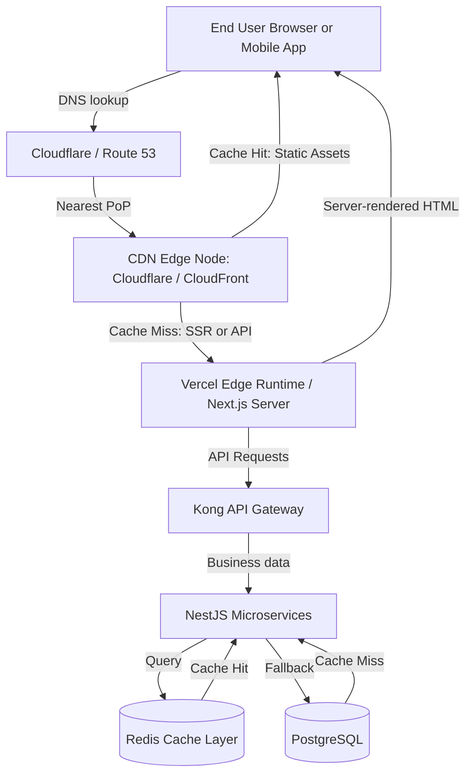

### 2.2 Performance Responsibility by Layer

| Layer | Performance Lever | Owner |
| :--- | :--- | :--- |
| **CDN Edge** | Static asset caching; HTTP/3; Brotli compression; geographic proximity. | DevOps / Infrastructure. |
| **Next.js Server** | SSR/SSG/ISR strategy; response streaming; server component granularity. | Frontend Architect. |
| **React Application** | Component memoization; bundle splitting; lazy loading; virtual lists. | Frontend Engineers. |
| **API/Cache Layer** | TanStack Query stale-while-revalidate; Redis response caching. | Backend + Frontend shared. |
| **Network Transport** | HTTPS/2; connection keep-alive; request coalescing; payload compression. | DevOps / Infrastructure. |

---

## SECTION 3 — WEB CORE VITALS OPTIMIZATION

### 3.1 Core Web Vitals Target Matrix

| Metric | Good | Needs Improvement | Poor | Our Target | Measurement Tool |
| :--- | :--- | :--- | :--- | :--- | :--- |
| **LCP** (Largest Contentful Paint) | ≤ 2.5 s | 2.5–4.0 s | > 4.0 s | **≤ 2.0 s** | Lighthouse CI + RUM |
| **INP** (Interaction to Next Paint) | ≤ 200 ms | 200–500 ms | > 500 ms | **≤ 150 ms** | Web Vitals API + RUM |
| **CLS** (Cumulative Layout Shift) | ≤ 0.1 | 0.1–0.25 | > 0.25 | **≤ 0.05** | Lighthouse CI + RUM |
| **FCP** (First Contentful Paint) | ≤ 1.8 s | 1.8–3.0 s | > 3.0 s | **≤ 1.5 s** | Lighthouse CI |
| **TTFB** (Time to First Byte) | ≤ 0.8 s | 0.8–1.8 s | > 1.8 s | **≤ 0.5 s** | Lighthouse CI |

### 3.2 LCP Optimization Strategies

*   **Priority images:** Apply `priority` prop to hero images on all above-the-fold `<Image>` components so the browser preloads them immediately.
*   **Preload critical fonts:** Add `<link rel="preload">` for primary typeface (Inter) to prevent FOIT (Flash of Invisible Text).
*   **Server-render above-the-fold:** Use RSC (React Server Components) so the first meaningful content is in the initial HTML payload.
*   **Eliminate render-blocking resources:** Move non-critical CSS to async loading; defer analytics and third-party scripts.

```tsx
// Correct: Priority hero image — browser preloads before paint
import Image from 'next/image';

export const DashboardHero = () => (
  <Image
    src="/assets/dashboard-banner.webp"
    alt="Business dashboard overview"
    width={1200}
    height={400}
    priority              // Adds <link rel="preload"> in <head>
    sizes="(max-width: 768px) 100vw, 1200px"
    placeholder="blur"
    blurDataURL="/assets/dashboard-banner-blur.webp"
  />
);
```

### 3.3 INP Optimization Strategies

*   **Defer non-critical event handlers:** Use `startTransition` to mark non-urgent state updates so React defers them without blocking user input.
*   **Avoid synchronous layout-thrashing:** Never read and write DOM layout properties alternately in the same event loop tick.
*   **Debounce high-frequency inputs:** Debounce search inputs (300 ms) to prevent re-rendering on every keystroke.

```typescript
import { startTransition, useState } from 'react';

export const ProductSearch = () => {
  const [query, setQuery] = useState('');
  const [results, setResults] = useState([]);

  const handleChange = (value: string) => {
    setQuery(value);                          // Urgent: update controlled input immediately
    startTransition(() => {
      setResults(filterProducts(value));      // Non-urgent: defer expensive filter operation
    });
  };

  return <input value={query} onChange={(e) => handleChange(e.target.value)} />;
};
```

### 3.4 CLS Optimization Strategies

*   Reserve explicit `width` and `height` on all `<Image>` and `<video>` elements to prevent layout shifts during load.
*   Use skeleton loaders with fixed dimensions instead of conditional rendering that changes page height.
*   Avoid inserting content above existing content after the page loads (e.g., cookie banners should be fixed-position).
*   Load web fonts with `font-display: optional` or preload to prevent FOUT-induced layout shifts.

---

## SECTION 4 — NEXT.JS RENDERING OPTIMIZATION

### 4.1 Rendering Strategy Decision Matrix

| Rendering Mode | When to Use | Data Freshness | Performance Benefit |
| :--- | :--- | :--- | :--- |
| **Static Generation (SSG)** | Marketing pages, login page, help center. | Build time | Fastest TTFB; served from CDN edge. |
| **Incremental Static Regeneration (ISR)** | Product catalog, report templates, pricing pages. | Every N seconds | Near-static speed; auto-refreshes on schedule. |
| **Server-Side Rendering (SSR)** | Personalized dashboards, tenant-specific pages. | Per request | Fresh data; SEO-compatible; avoids waterfall API calls. |
| **React Server Components (RSC)** | Data-heavy UI trees that do not need interactivity. | Per request | Zero client-side JavaScript for server components; smaller bundles. |
| **Client-Side Rendering (CSR)** | Highly interactive widgets (POS cart, live charts). | Real-time | Instant interactions after initial hydration. |
| **Streaming (Suspense)** | Pages with multiple independently loading sections. | Per request | Progressively flush HTML; LCP unblocked by slow sections. |

### 4.2 ISR Configuration (Product Catalog Page)

```typescript
// app/inventory/products/page.tsx — ISR: rebuild every 60 seconds
export const revalidate = 60;

export default async function ProductsPage() {
  // Rendered on server at build time; refreshed every 60 s in background
  const products = await productService.listProducts({ page: 1, pageSize: 50 });

  return <ProductCatalogView products={products.data} />;
}
```

### 4.3 Streaming with Suspense (Dashboard)

```tsx
// app/dashboard/page.tsx — Stream sections independently
import { Suspense } from 'react';
import { SalesSummarySkeleton, TopProductsSkeleton, RecentOrdersSkeleton } from '@/components/skeletons';

export default function DashboardPage() {
  return (
    <main>
      <h1>Business Dashboard</h1>

      {/* Each section streams independently — slow data does not block fast data */}
      <Suspense fallback={<SalesSummarySkeleton />}>
        <SalesSummaryWidget />       {/* RSC: fetches today's sales */}
      </Suspense>

      <Suspense fallback={<TopProductsSkeleton />}>
        <TopProductsWidget />        {/* RSC: fetches top 5 products */}
      </Suspense>

      <Suspense fallback={<RecentOrdersSkeleton />}>
        <RecentOrdersWidget />       {/* RSC: fetches last 10 orders */}
      </Suspense>
    </main>
  );
}
```

### 4.4 Per-Route Rendering Strategy Map

| Route | Rendering Mode | Revalidation |
| :--- | :--- | :--- |
| `/` (Landing page) | SSG | — (static) |
| `/login` | SSG | — (static) |
| `/dashboard` | SSR + Streaming | Per request |
| `/inventory/products` | ISR | 60 seconds |
| `/pos` | CSR | Real-time (WebSocket) |
| `/reports/sales` | SSR | Per request |
| `/settings` | SSR | Per request |
| `/admin` | SSR | Per request |

---

## SECTION 5 — COMPONENT PERFORMANCE OPTIMIZATION

### 5.1 Memoization Decision Guide

| Technique | When to Apply | When NOT to Apply |
| :--- | :--- | :--- |
| `React.memo` | Component receives stable props; re-renders only when parent state changes. | Components that always receive new props; trivial render time. |
| `useMemo` | Expensive computed value derived from props/state (e.g., sorted/filtered lists). | Simple expressions; references that change every render anyway. |
| `useCallback` | Stable function reference passed as prop to memoized child; event handler in dependency arrays. | Functions not passed as props; top-level handlers without dependencies. |

### 5.2 `React.memo` for Table Row Component

```typescript
// Prevent full table re-render when only one row's data changes
import { memo } from 'react';
import type { Product } from '@/types/product.types';

interface Props {
  product: Product;
  onEdit: (id: string) => void;
  onDelete: (id: string) => void;
}

export const ProductTableRow = memo(({ product, onEdit, onDelete }: Props) => {
  return (
    <tr>
      <td>{product.sku}</td>
      <td>{product.name}</td>
      <td>{formatCurrency(product.unitPrice, 'USD')}</td>
      <td>{product.stock}</td>
      <td>
        <button onClick={() => onEdit(product.id)}>Edit</button>
        <button onClick={() => onDelete(product.id)}>Delete</button>
      </td>
    </tr>
  );
}, (prevProps, nextProps) => {
  // Custom comparator: only re-render if this product's data changed
  return prevProps.product.id === nextProps.product.id &&
         prevProps.product.unitPrice === nextProps.product.unitPrice &&
         prevProps.product.stock === nextProps.product.stock;
});
```

### 5.3 `useMemo` for Expensive Computation

```typescript
import { useMemo } from 'react';

export const useFilteredProducts = (
  products: Product[],
  searchQuery: string,
  categoryId: string | null
) => {
  // Without useMemo: runs filter on every render even if inputs haven't changed
  // With useMemo: only recomputes when products, searchQuery, or categoryId change
  return useMemo(() => {
    let filtered = products;
    if (searchQuery) {
      const lower = searchQuery.toLowerCase();
      filtered = filtered.filter(p =>
        p.name.toLowerCase().includes(lower) || p.sku.toLowerCase().includes(lower)
      );
    }
    if (categoryId) {
      filtered = filtered.filter(p => p.categoryId === categoryId);
    }
    return filtered;
  }, [products, searchQuery, categoryId]);
};
```

### 5.4 `useCallback` for Stable Event Handlers

```typescript
import { useCallback } from 'react';

export const ProductListContainer = () => {
  const queryClient = useQueryClient();

  // Without useCallback: new function reference created every render →
  // ProductTableRow re-renders even with React.memo
  const handleEdit = useCallback((productId: string) => {
    router.push(`/inventory/products/${productId}/edit`);
  }, []); // Stable — no dependencies

  const handleDelete = useCallback(async (productId: string) => {
    await productService.deleteProduct(productId);
    queryClient.invalidateQueries({ queryKey: ['products'] });
  }, [queryClient]); // Only recreates if queryClient changes

  return <ProductTable onEdit={handleEdit} onDelete={handleDelete} />;
};
```

### 5.5 Selector-Based Zustand Subscription

```typescript
// Anti-pattern: subscribes to entire store — re-renders on any store change
const store = useCartStore();

// Correct: subscribes only to cart item count — re-renders only when count changes
const itemCount = useCartStore(state => state.items.length);
const cartTotal = useCartStore(state => state.cartTotal());
```

---

## SECTION 6 — BUNDLE SIZE OPTIMIZATION

### 6.1 Bundle Budget Targets

| Asset Type | Target (gzipped) | Hard Limit (CI block) |
| :--- | :--- | :--- |
| **Initial JS bundle (page)** | ≤ 150 kB | 250 kB |
| **Shared vendor chunk** | ≤ 200 kB | 350 kB |
| **Per-feature lazy chunk** | ≤ 80 kB | 150 kB |
| **Initial CSS** | ≤ 30 kB | 60 kB |
| **Total page weight (HTML+JS+CSS+fonts)** | ≤ 500 kB | 1 MB |

### 6.2 Code Splitting with `next/dynamic`

```typescript
// Heavy components loaded only when needed — not in the initial bundle
import dynamic from 'next/dynamic';

// POS screen: only loaded when user navigates to /pos
const POSCheckoutScreen = dynamic(
  () => import('@/features/pos/POSCheckoutScreen'),
  {
    loading: () => <POSScreenSkeleton />,
    ssr: false,   // POS is fully client-side; skip SSR for this component
  }
);

// Rich text editor: loaded only when user opens a description field
const RichTextEditor = dynamic(
  () => import('@/components/ui/RichTextEditor'),
  { loading: () => <Skeleton height={200} /> }
);

// Heavy chart library: loaded on demand in analytics module
const RevenueChart = dynamic(
  () => import('@/features/analytics/RevenueChart'),
  { loading: () => <ChartSkeleton /> }
);
```

### 6.3 Tree Shaking — Import Discipline

```typescript
// ❌ Anti-pattern: imports entire lodash library (70+ kB gzipped)
import _ from 'lodash';
const sorted = _.sortBy(products, 'name');

// ✅ Correct: imports only the needed function (< 1 kB)
import sortBy from 'lodash/sortBy';
const sorted = sortBy(products, 'name');

// ✅ Even better: use native alternatives when possible
const sorted = [...products].sort((a, b) => a.name.localeCompare(b.name));

// ❌ Anti-pattern: imports all icons from icon library
import { Edit, Delete, Search, Filter, Export } from '@heroicons/react/24/solid';

// ✅ Correct: already tree-shakable in Heroicons v2; but verify with bundle analyzer
```

### 6.4 Bundle Analyzer Workflow

```bash
# Generate visual bundle composition map
ANALYZE=true npm run build

# Review in browser:
# .next/analyze/client.html  — Client-side bundle composition
# .next/analyze/server.html  — Server-side bundle composition
```

```javascript
// next.config.js
const withBundleAnalyzer = require('@next/bundle-analyzer')({
  enabled: process.env.ANALYZE === 'true',
});

module.exports = withBundleAnalyzer({
  // ...Next.js config
});
```

### 6.5 Dependency Audit Process

| Step | Tool | Action |
| :--- | :--- | :--- |
| **Identify large dependencies** | Bundle Analyzer | Find packages > 50 kB gzipped in the vendor chunk. |
| **Find lighter alternatives** | bundlephobia.com | Compare bundle size of alternative packages. |
| **Check for unused exports** | `ts-prune`, ESLint `no-unused-vars` | Remove dead code paths before shipping. |
| **Validate tree-shaking** | Bundle Analyzer diff | Confirm import change reduced output bundle. |
| **Monitor in CI** | `compressed-size-action` | Block PRs that increase any chunk by > 10 kB without justification. |

---

## SECTION 7 — ASSET OPTIMIZATION

### 7.1 Image Optimization Strategy

```tsx
import Image from 'next/image';

// Product thumbnail — lazy loaded, responsive srcset, WebP conversion automatic
export const ProductThumbnail = ({ product }: { product: Product }) => (
  <Image
    src={product.imageUrl}
    alt={`Product image for ${product.name}`}
    width={200}
    height={200}
    loading="lazy"                          // Lazy load below-the-fold images
    sizes="(max-width: 640px) 50vw, 200px" // Responsive srcset hints
    style={{ objectFit: 'cover' }}
    placeholder="blur"
    blurDataURL={product.blurHash}         // Low-quality placeholder during load
  />
);
```

### 7.2 Image Format and Compression Rules

| Image Type | Target Format | Max Size | Optimization Tool |
| :--- | :--- | :--- | :--- |
| **Product photos** | WebP (fallback JPEG) | 100 kB | Next.js Image + Sharp |
| **UI illustrations** | SVG (inline or external) | 20 kB | SVGO optimization |
| **Brand logos** | SVG | 10 kB | SVGO |
| **Icons** | SVG sprite or `lucide-react` | < 1 kB each | Tree-shaken icon library |
| **Background textures** | WebP | 50 kB | Sharp + quality 80% |

### 7.3 Font Optimization

```typescript
// app/layout.tsx — Optimized font loading via next/font
import { Inter, Noto_Sans_Khmer } from 'next/font/google';

// Subset to Latin + Khmer characters only — prevents loading full Unicode range
const inter = Inter({
  subsets: ['latin'],
  display: 'swap',           // Show fallback font until Inter loads — prevents FOIT
  preload: true,
  variable: '--font-inter',
});

const notoKhmer = Noto_Sans_Khmer({
  subsets: ['khmer'],
  weight: ['400', '500', '700'],
  display: 'swap',
  variable: '--font-khmer',
});

export default function RootLayout({ children }: { children: React.ReactNode }) {
  return (
    <html lang="en" className={`${inter.variable} ${notoKhmer.variable}`}>
      <body>{children}</body>
    </html>
  );
}
```

### 7.4 Icon Optimization

```typescript
// ✅ Use tree-shakable icon library — only imported icons are included in bundle
import { ShoppingCart, Package, BarChart3, Users } from 'lucide-react';

// ✅ For custom SVG icons: inline as React components — no HTTP request needed
export const BarcodeIcon = ({ size = 24 }: { size?: number }) => (
  <svg width={size} height={size} viewBox="0 0 24 24" fill="none" aria-hidden="true">
    {/* SVG path data */}
  </svg>
);
```

---

## SECTION 8 — DATA LOADING PERFORMANCE

### 8.1 Data Loading Strategy Matrix

| Data Characteristic | Loading Strategy | TanStack Query Pattern |
| :--- | :--- | :--- |
| **Small list (< 50 items)** | Fetch all at once | `useQuery` with full fetch |
| **Medium list (50–500 items)** | Server-side pagination | `useQuery` with page params |
| **Large list (500+ items)** | Infinite scroll + virtualization | `useInfiniteQuery` + TanStack Virtual |
| **Dashboard aggregate data** | Prefetch on route entry | `router.prefetch` + `queryClient.prefetchQuery` |
| **Frequently changing data** | Short staleTime + background refetch | `staleTime: 30_000` |
| **Rarely changing data** | Long staleTime + ISR | `staleTime: 10 * 60 * 1000` |
| **Real-time data (orders)** | WebSocket invalidation | `ws.on('event') → invalidateQueries` |

### 8.2 Route-Level Prefetching

```typescript
// Prefetch product data when user hovers the Inventory nav link
// Data is ready in cache before the route even renders

// app/layout.tsx (server component)
import { HydrationBoundary, dehydrate } from '@tanstack/react-query';
import { getQueryClient } from '@/lib/queryClient';

export default async function InventoryLayout({ children }) {
  const queryClient = getQueryClient();

  // Prefetch first page of products on the server
  await queryClient.prefetchQuery({
    queryKey: ['products', 'tenant-001', 'branch-001', {}],
    queryFn: () => productService.listProducts({ page: 1, pageSize: 20 }),
  });

  return (
    <HydrationBoundary state={dehydrate(queryClient)}>
      {children}
    </HydrationBoundary>
  );
}
```

### 8.3 Stale-While-Revalidate Performance Pattern

```typescript
// Product list: serve stale data instantly, refresh in background after 3 minutes
const productsQuery = useQuery({
  queryKey: ['products', tenantId, branchId],
  queryFn: () => productService.listProducts({ branchId }),
  staleTime: 3 * 60 * 1000,      // Data is "fresh" for 3 minutes → no refetch
  gcTime: 10 * 60 * 1000,        // Remove from cache after 10 minutes of disuse
  refetchOnWindowFocus: false,    // Do not refetch when user alt-tabs back
  placeholderData: keepPreviousData, // Show old data while new page loads
});
```

---

## SECTION 9 — LARGE DATA UI ARCHITECTURE

### 9.1 Virtual List for Large Datasets

Rendering thousands of DOM rows is the single most common cause of frontend performance collapse in enterprise dashboards. We use **TanStack Virtual** (formerly `react-virtual`) to render only the rows visible in the viewport.

```typescript
import { useVirtualizer } from '@tanstack/react-virtual';
import { useRef } from 'react';

interface Props {
  orders: Order[];
}

export const VirtualOrderTable = ({ orders }: Props) => {
  const parentRef = useRef<HTMLDivElement>(null);

  const rowVirtualizer = useVirtualizer({
    count: orders.length,
    getScrollElement: () => parentRef.current,
    estimateSize: () => 52,       // Estimated row height in px
    overscan: 10,                  // Render 10 extra rows above/below for smooth scroll
  });

  return (
    <div ref={parentRef} style={{ height: '600px', overflowY: 'auto' }}>
      {/* Total scroll height without rendering all rows */}
      <div style={{ height: `${rowVirtualizer.getTotalSize()}px`, position: 'relative' }}>
        {rowVirtualizer.getVirtualItems().map((virtualRow) => (
          <div
            key={virtualRow.index}
            style={{
              position: 'absolute',
              top: `${virtualRow.start}px`,
              width: '100%',
              height: `${virtualRow.size}px`,
            }}
          >
            <OrderTableRow order={orders[virtualRow.index]} />
          </div>
        ))}
      </div>
    </div>
  );
};
```

### 9.2 Server-Side Pagination for Reports

```typescript
// Never load 10,000 transactions at once; paginate server-side
export const useTransactionReport = (filters: ReportFilters) => {
  return useInfiniteQuery({
    queryKey: ['reports', 'transactions', filters],
    queryFn: ({ pageParam = 1 }) =>
      reportService.getTransactions({ ...filters, page: pageParam, pageSize: 100 }),
    getNextPageParam: (lastPage) =>
      lastPage.meta.hasNextPage ? lastPage.meta.page + 1 : undefined,
    initialPageParam: 1,
    staleTime: 5 * 60 * 1000,
  });
};
```

### 9.3 Progressive Data Loading for Analytics

```typescript
// Stream chart data in chunks — render initial bars immediately, fill in over time
export const RevenueChart = () => {
  const [chartData, setChartData] = useState<DataPoint[]>([]);

  useEffect(() => {
    const eventSource = new EventSource('/api/reports/revenue-stream');

    eventSource.onmessage = (event) => {
      const newPoint: DataPoint = JSON.parse(event.data);
      setChartData(prev => [...prev, newPoint]);   // Append incrementally
    };

    return () => eventSource.close();
  }, []);

  return <BarChart data={chartData} />;
};
```

### 9.4 Large Data Architecture Decision Map

| Data Volume | Approach | Component |
| :--- | :--- | :--- |
| **< 50 rows** | Render all rows directly. | Standard `<table>` |
| **50–500 rows** | Client-side pagination (10–20 per page). | `Pagination` + `useQuery` |
| **500–5,000 rows** | Virtual scrolling (visible rows only). | `useVirtualizer` + `useInfiniteQuery` |
| **5,000+ rows** | Server-side pagination + export to CSV/Excel. | Server pagination + background export job |
| **Real-time streams** | Progressive rendering via SSE / WebSocket. | `EventSource` / Socket.IO + incremental state |

---

## SECTION 10 — FRONTEND CACHE ARCHITECTURE

### 10.1 Multi-Layer Cache Architecture

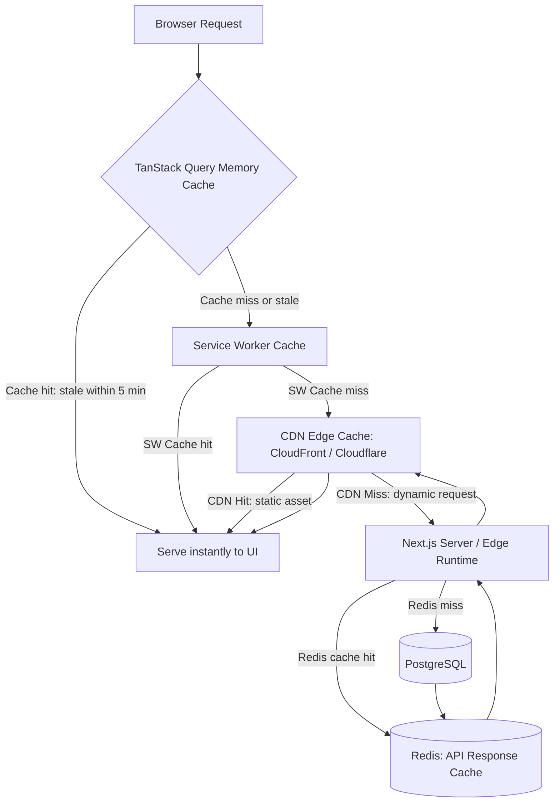

### 10.2 Cache TTL Configuration by Resource Type

| Resource Type | Browser Cache | TanStack Cache | CDN Cache | Invalidation Trigger |
| :--- | :--- | :--- | :--- | :--- |
| **Static JS/CSS bundles** | 1 year (immutable) | — | 1 year | Content hash change (new deploy). |
| **Next.js HTML pages** | No-store | — | 0–60 s | ISR revalidation or on-demand revalidate. |
| **Product catalog data** | — | 3 minutes | 60 seconds | `POST /products` mutation. |
| **Order list** | — | 1 minute | 0 s (no CDN) | `order:created` WebSocket event. |
| **Dashboard KPIs** | — | 5 minutes | 0 s (no CDN) | Manual refresh or scheduled revalidation. |
| **User session** | — | 10 minutes | 0 s (no CDN) | Logout or session expiry. |
| **Product images** | 7 days | — | 30 days | S3 key change on upload. |

### 10.3 Cache Invalidation Implementation

```typescript
// Targeted cache invalidation — only invalidate what changed
const useUpdateProduct = (tenantId: string) => {
  const queryClient = useQueryClient();

  return useMutation({
    mutationFn: ({ id, data }: { id: string; data: UpdateProductDto }) =>
      productService.updateProduct(id, data),
    onSuccess: (updatedProduct) => {
      // 1. Update the specific product in cache immediately (no re-fetch needed)
      queryClient.setQueryData(['products', tenantId, 'product', updatedProduct.id], updatedProduct);

      // 2. Invalidate the product list to reflect the change
      queryClient.invalidateQueries({ queryKey: ['products', tenantId] });

      // 3. Do NOT invalidate unrelated caches (orders, reports, customers)
    },
  });
};
```

---

## SECTION 11 — REAL-TIME PERFORMANCE OPTIMIZATION

### 11.1 WebSocket Performance Architecture

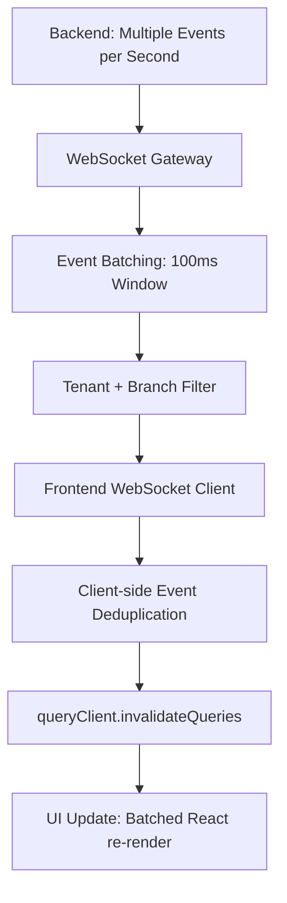

### 11.2 Connection Management

```typescript
// Singleton WebSocket connection — never create multiple connections
let socketInstance: Socket | null = null;
let reconnectAttempts = 0;

export function getWebSocket(): Socket {
  if (socketInstance?.connected) return socketInstance;

  socketInstance = io(process.env.NEXT_PUBLIC_WS_URL!, {
    reconnection: true,
    reconnectionAttempts: 10,
    reconnectionDelay: 1000,
    reconnectionDelayMax: 30_000,   // Cap backoff at 30 seconds
    randomizationFactor: 0.5,        // Add jitter to prevent thundering herd
    auth: { token: useAuthStore.getState().accessToken },
  });

  socketInstance.on('reconnect_attempt', (attempt) => {
    reconnectAttempts = attempt;
    console.info(`[WS] Reconnect attempt ${attempt}`);
  });

  socketInstance.on('reconnect', () => {
    reconnectAttempts = 0;
    // Re-sync all stale queries after reconnection
    getQueryClient().invalidateQueries();
  });

  return socketInstance;
}
```

### 11.3 Event Batching and Deduplication

```typescript
// Prevent cascading re-renders when many events arrive within milliseconds
const pendingInvalidations = new Set<string>();
let batchTimer: ReturnType<typeof setTimeout> | null = null;

function scheduleInvalidation(queryKey: string): void {
  pendingInvalidations.add(queryKey);

  if (batchTimer) clearTimeout(batchTimer);

  // Collect all events that arrive within 100 ms and invalidate once
  batchTimer = setTimeout(() => {
    pendingInvalidations.forEach(key => {
      queryClient.invalidateQueries({ queryKey: [key] });
    });
    pendingInvalidations.clear();
    batchTimer = null;
  }, 100);
}

// Usage in WebSocket handler
ws.on('order:created', () => scheduleInvalidation('orders'));
ws.on('order:status_changed', () => scheduleInvalidation('orders'));
ws.on('inventory:stock_updated', () => scheduleInvalidation('inventory'));
```

---

## SECTION 12 — MOBILE PERFORMANCE OPTIMIZATION

### 12.1 React Native Performance Targets

| Metric | Target | Measurement |
| :--- | :--- | :--- |
| **App cold start time** | ≤ 2.5 s | Detox + systrace |
| **Screen transition** | ≤ 300 ms | React Navigation trace |
| **POS screen interactive** | ≤ 1.5 s | Detox performance test |
| **Scroll frame rate** | 60 FPS (steady) | Flipper Performance Monitor |
| **JS bundle size** | ≤ 3 MB (main bundle) | Metro bundler stats |
| **Memory usage (active)** | ≤ 150 MB RSS | Instruments / Android Profiler |
| **Battery drain (background)** | Minimal (background sync ≤ 1 min interval) | iOS Energy Impact |

### 12.2 React Native Rendering Optimizations

```typescript
// ✅ Use FlatList instead of ScrollView + map for long lists
import { FlatList, type ListRenderItem } from 'react-native';

const renderOrderRow: ListRenderItem<Order> = ({ item }) => (
  <OrderRow order={item} />
);

const keyExtractor = (item: Order) => item.id;

export const OrderList = ({ orders }: { orders: Order[] }) => (
  <FlatList
    data={orders}
    renderItem={renderOrderRow}
    keyExtractor={keyExtractor}
    getItemLayout={(_, index) => ({ length: 64, offset: 64 * index, index })}
    windowSize={10}              // Only keep 10 viewport heights of items in memory
    maxToRenderPerBatch={15}     // Render 15 items per batch during fast scroll
    updateCellsBatchingPeriod={50}
    initialNumToRender={10}
    removeClippedSubviews={true} // Remove off-screen views from memory
  />
);
```

### 12.3 JavaScript Thread Optimization

```typescript
// Move heavy computation off the JS thread using Worklets (Reanimated)
import { runOnUI, runOnJS } from 'react-native-reanimated';

// ✅ Gesture handlers run on the UI thread — no JS bridge latency
const gesture = Gesture.Pan()
  .onUpdate((event) => {
    'worklet'; // Executes directly on UI thread
    translateX.value = event.translationX;
    translateY.value = event.translationY;
  })
  .onEnd(() => {
    'worklet';
    translateX.value = withSpring(0);
    translateY.value = withSpring(0);
  });
```

### 12.4 App Startup Optimization

```typescript
// Defer non-critical initialization until after first render
import { InteractionManager } from 'react-native';

export const usePostStartupInit = () => {
  useEffect(() => {
    // Wait until initial animations and interactions are complete
    const task = InteractionManager.runAfterInteractions(() => {
      // Initialize analytics (non-critical)
      Analytics.initialize();
      // Preload offline sync manager
      SyncManager.start();
      // Register push notification handlers
      PushNotifications.register();
    });
    return () => task.cancel();
  }, []);
};
```

---

## SECTION 13 — OFFLINE PERFORMANCE ARCHITECTURE

### 13.1 Offline Data Architecture

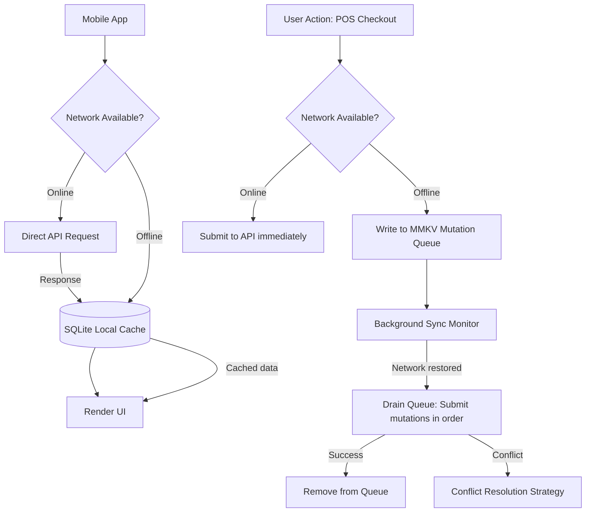

### 13.2 Sync Queue Implementation

```typescript
import { MMKV } from 'react-native-mmkv';

interface QueuedMutation {
  id: string;
  endpoint: string;
  method: 'POST' | 'PATCH' | 'DELETE';
  payload: unknown;
  createdAt: string;
  retryCount: number;
}

const syncStorage = new MMKV({ id: 'sync-queue' });

export const syncQueue = {
  enqueue(mutation: Omit<QueuedMutation, 'id' | 'retryCount' | 'createdAt'>): void {
    const queue = this.getAll();
    queue.push({ ...mutation, id: crypto.randomUUID(), retryCount: 0, createdAt: new Date().toISOString() });
    syncStorage.set('queue', JSON.stringify(queue));
  },

  getAll(): QueuedMutation[] {
    const raw = syncStorage.getString('queue');
    return raw ? JSON.parse(raw) : [];
  },

  remove(id: string): void {
    const queue = this.getAll().filter(m => m.id !== id);
    syncStorage.set('queue', JSON.stringify(queue));
  },

  async drain(): Promise<void> {
    const queue = this.getAll();
    for (const mutation of queue) {
      try {
        await apiClient({ url: mutation.endpoint, method: mutation.method, data: mutation.payload });
        this.remove(mutation.id);
      } catch {
        if (mutation.retryCount >= 3) {
          this.remove(mutation.id);  // Dead-letter after 3 failures
          reportToSentry(new Error(`Sync mutation permanently failed: ${mutation.endpoint}`));
        }
      }
    }
  },
};
```

### 13.3 Conflict Resolution Strategy

| Conflict Type | Resolution Policy | Implementation |
| :--- | :--- | :--- |
| **Offline edit + online edit of same record** | Last-write-wins with server timestamp. | `updatedAt` timestamp comparison on backend. |
| **Offline stock deduction + server stock update** | Server-side validation on sync; reject if stock insufficient. | 409 Conflict response → notify user. |
| **Offline POS checkout of same item by two cashiers** | First-sync-wins; second receives conflict error. | Backend idempotency key prevents double submission. |

---

## SECTION 14 — FRONTEND SCALABILITY ARCHITECTURE

### 14.1 Feature Isolation Strategy

We structure the frontend as independently deployable feature modules to support parallel development, independent scaling, and safe experimentation:

```
apps/web/
├── app/
│   ├── (pos)/          ← POS module: isolated routes, components, and hooks
│   ├── (inventory)/    ← Inventory module
│   ├── (finance)/      ← Finance module
│   ├── (hr)/           ← HR module
│   ├── (crm)/          ← CRM module
│   └── (analytics)/    ← Analytics module
├── features/
│   ├── pos/            ← Feature-specific components, hooks, services
│   ├── inventory/
│   ├── finance/
│   ├── hr/
│   └── analytics/
└── components/         ← Shared UI components (no business logic)
```

### 14.2 Lazy Module Loading

```typescript
// Route group layouts enforce module isolation and enable code splitting per module
// Each (group) generates its own JS chunk — only loaded when user enters that module

// app/(inventory)/layout.tsx
export default function InventoryLayout({ children }: { children: React.ReactNode }) {
  return (
    <ModuleProvider module="inventory">
      <InventoryNavigation />
      <main>{children}</main>
    </ModuleProvider>
  );
}
```

### 14.3 Micro-Frontend Readiness

While we deploy as a monolithic Next.js application initially, the feature isolation pattern makes future extraction into micro-frontends straightforward:

| Current (Monolith) | Future (Micro-Frontend) |
| :--- | :--- |
| Single Next.js app with route groups | Module Federation — each feature module deployed independently. |
| Shared `@platform/design-system` package | Remote component library exposed via Webpack Module Federation. |
| Single CI/CD pipeline | Per-module CI/CD pipelines with independent deployment windows. |
| Shared TanStack Query instance | Per-module query clients with shared cache hydration layer. |

### 14.4 Multi-Tenant Scalability

```typescript
// Tenant-aware dynamic feature flags — enable/disable modules per subscription plan
export const useFeatureAccess = (feature: PlatformFeature): boolean => {
  const { plan } = useTenantStore();

  const featureMatrix: Record<PlatformFeature, TenantPlan[]> = {
    'advanced-analytics': ['professional', 'enterprise'],
    'multi-branch':        ['professional', 'enterprise'],
    'payroll':             ['enterprise'],
    'api-access':          ['enterprise'],
    'pos':                 ['starter', 'professional', 'enterprise'],
    'inventory':           ['starter', 'professional', 'enterprise'],
  };

  return plan ? featureMatrix[feature]?.includes(plan) ?? false : false;
};
```

---

## SECTION 15 — CDN & DELIVERY STRATEGY

### 15.1 Frontend Delivery Architecture

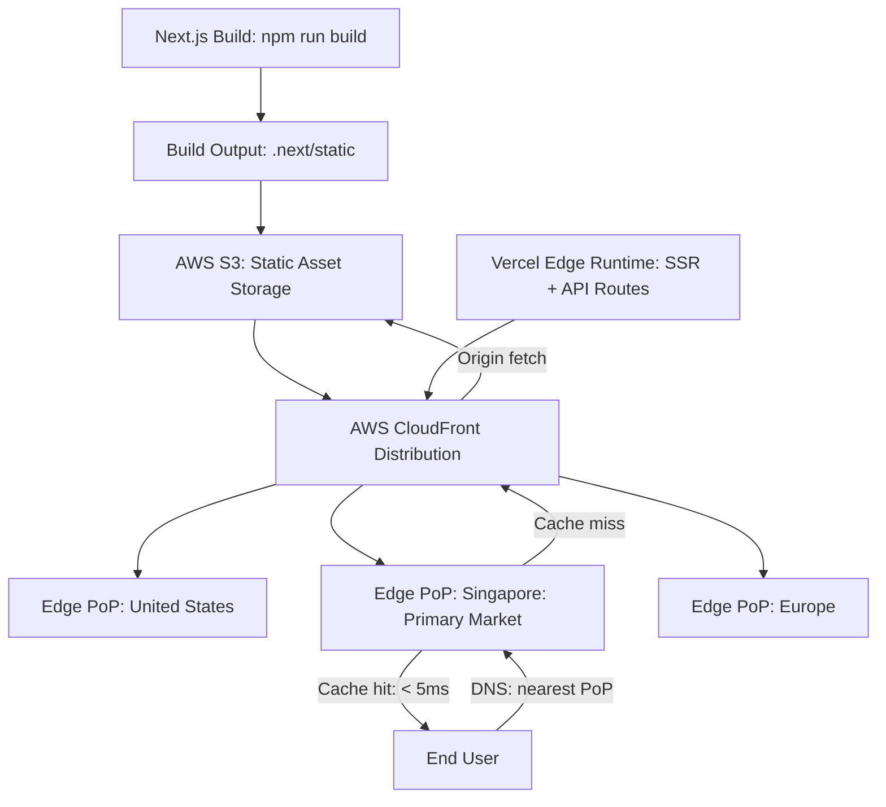

### 15.2 CloudFront Cache Configuration

```
Static JS/CSS (content-hashed filenames):
  Cache-Control: public, max-age=31536000, immutable
  CloudFront TTL: 365 days

Next.js HTML pages (SSR / ISR):
  Cache-Control: public, s-maxage=60, stale-while-revalidate=3600
  CloudFront TTL: 60 seconds (then SWR up to 1 hour)

API responses (proxied):
  Cache-Control: no-store
  CloudFront TTL: 0 (bypass cache — always origin)

Images (S3):
  Cache-Control: public, max-age=604800
  CloudFront TTL: 7 days
```

### 15.3 CDN Platform Comparison

| Platform | Strengths | Use Case in Our Stack |
| :--- | :--- | :--- |
| **Vercel Edge Network** | Tight Next.js integration; zero-config; Edge Runtime; ISR. | Primary deployment for Next.js SSR/ISR pages. |
| **AWS CloudFront** | Deep AWS integration; S3 origin; Lambda@Edge; enterprise SLAs. | Static asset CDN; S3 bucket serving; region failover. |
| **Cloudflare** | Global PoPs; DDoS protection; WAF; Workers at edge. | DNS + WAF layer; backup CDN; Workers for lightweight edge logic. |

### 15.4 Edge Runtime for Dynamic Routes

```typescript
// app/api/tenant-config/route.ts — Runs at edge: < 50ms globally
export const runtime = 'edge';

export async function GET(request: Request) {
  const tenantId = request.headers.get('X-Tenant-ID');

  // Fetch tenant config from KV store (edge-local; no database round-trip)
  const config = await KV.get(`tenant:${tenantId}:config`);

  return Response.json(JSON.parse(config ?? '{}'), {
    headers: {
      'Cache-Control': 'public, max-age=300, stale-while-revalidate=600',
    },
  });
}
```

---

## SECTION 16 — MONITORING FRONTEND PERFORMANCE

### 16.1 Real User Monitoring (RUM) Architecture

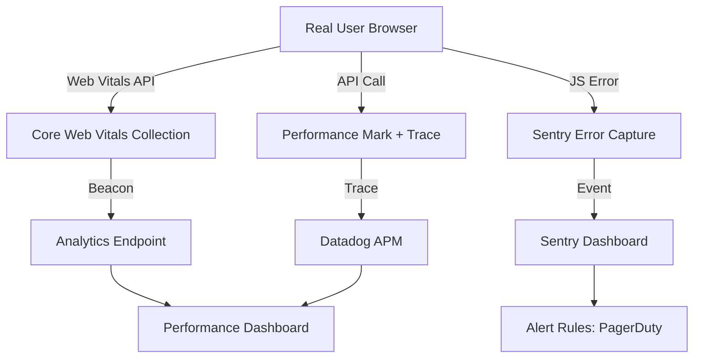

### 16.2 Web Vitals RUM Integration

```typescript
// app/layout.tsx — Report real user metrics to analytics
'use client';
import { useEffect } from 'react';
import { onCLS, onINP, onLCP, onFCP, onTTFB } from 'web-vitals';

export function WebVitalsReporter() {
  useEffect(() => {
    const reportMetric = ({ name, value, id, rating }: Metric) => {
      // Send to internal analytics + Datadog RUM
      fetch('/api/vitals', {
        method: 'POST',
        body: JSON.stringify({ name, value, id, rating, page: window.location.pathname }),
        keepalive: true,   // Ensure beacon fires even if user navigates away
      });
    };

    onCLS(reportMetric);
    onINP(reportMetric);
    onLCP(reportMetric);
    onFCP(reportMetric);
    onTTFB(reportMetric);
  }, []);

  return null;
}
```

### 16.3 Sentry Frontend Error Monitoring

```typescript
// sentry.client.config.ts
import * as Sentry from '@sentry/nextjs';

Sentry.init({
  dsn: process.env.NEXT_PUBLIC_SENTRY_DSN,
  environment: process.env.NEXT_PUBLIC_ENVIRONMENT,
  tracesSampleRate: process.env.NODE_ENV === 'production' ? 0.1 : 1.0,
  replaysSessionSampleRate: 0.05,         // Record 5% of sessions for replay
  replaysOnErrorSampleRate: 1.0,          // Always record replays for error sessions
  integrations: [
    Sentry.replayIntegration({
      maskAllText: false,                  // Allow text capture for debugging
      maskAllInputs: true,                 // Always mask form inputs (PII protection)
      blockAllMedia: false,
    }),
  ],
  beforeSend: (event) => {
    // Strip sensitive data before sending to Sentry
    if (event.request?.cookies) delete event.request.cookies;
    return event;
  },
});
```

### 16.4 Performance Monitoring Metrics

| Metric | Tool | Alert Threshold | Action |
| :--- | :--- | :--- | :--- |
| **LCP p75** | Datadog RUM | > 3.0 s | Page performance investigation. |
| **INP p75** | Datadog RUM | > 300 ms | React profiler analysis; interaction optimization. |
| **CLS p75** | Datadog RUM | > 0.15 | Layout shift audit; image dimension review. |
| **JS Error Rate** | Sentry | > 0.5% of sessions | PagerDuty alert → on-call frontend engineer. |
| **API p99 Latency** | Datadog APM | > 2 s | API performance review; caching review. |
| **Bundle Size Increase** | CI action | > 10 kB gzipped | Automatic PR comment + block. |

---

## SECTION 17 — FRONTEND SECURITY PERFORMANCE

### 17.1 Security vs. Performance Trade-Off Management

| Security Control | Performance Cost | Optimized Implementation |
| :--- | :--- | :--- |
| **TLS 1.3** | ~1 ms additional handshake vs TLS 1.2 | OCSP stapling; TLS session resumption; HTTP/2 connection multiplexing. |
| **Content Security Policy** | Negligible (header size) | Nonce-based CSP (no `unsafe-inline`); precompute nonces server-side. |
| **JWT Validation** | ~1 ms per request (signature verify) | Kong validates once at gateway; backend trusts JWT claims without re-verifying. |
| **CSRF Token** | ~100 bytes per mutating request | Inject once on page load; reuse across all session mutations. |
| **Secure Headers** | Negligible | Set at CDN/gateway layer — zero application-level overhead. |
| **npm audit** | CI only (not runtime) | Run in CI; no production performance impact. |

### 17.2 Security Headers Configuration (Next.js)

```typescript
// next.config.ts — Security headers applied to all responses
const securityHeaders = [
  { key: 'X-DNS-Prefetch-Control', value: 'on' },
  { key: 'Strict-Transport-Security', value: 'max-age=63072000; includeSubDomains; preload' },
  { key: 'X-Frame-Options', value: 'SAMEORIGIN' },
  { key: 'X-Content-Type-Options', value: 'nosniff' },
  { key: 'Referrer-Policy', value: 'strict-origin-when-cross-origin' },
  { key: 'Permissions-Policy', value: 'camera=(), microphone=(), geolocation=(self)' },
];

module.exports = {
  async headers() {
    return [{ source: '/:path*', headers: securityHeaders }];
  },
};
```

### 17.3 Dependency Performance Audit

```bash
# Identify and remove unused dependencies (reduce bundle + attack surface)
npx depcheck

# Find duplicate package versions (can inflate bundle size)
npx npm-dedupe

# Check for faster, smaller alternatives
npx bundlephobia <package-name>

# Full security + outdated dependency report
npm audit && npm outdated
```

---

## SECTION 18 — PRODUCTION READINESS CHECKLIST

### 18.1 Pre-Release Production Readiness Gates

#### 🟦 Performance Gates
- [ ] Lighthouse mobile performance score ≥ 85 on all critical pages.
- [ ] Lighthouse desktop performance score ≥ 90 on all critical pages.
- [ ] LCP ≤ 2.5 s (lab); ≤ 2.0 s (target) measured in CI.
- [ ] No JS chunk exceeds 250 kB gzipped (CI bundle size action passes).
- [ ] All pages pass Core Web Vitals thresholds in Lighthouse CI.

#### 🟩 Load & Stress Gates
- [ ] 200 concurrent users: POS checkout p99 ≤ 50 ms.
- [ ] 500 concurrent dashboard users: page load p95 ≤ 3.0 s.
- [ ] WebSocket: 1,000 concurrent connections sustained for 30 minutes without degradation.
- [ ] Infinite scroll: 10,000 row list renders within 500 ms; frame rate ≥ 55 FPS.

#### 🟨 Cross-Browser & Device Gates
- [ ] Chrome (latest two versions) — All critical paths tested.
- [ ] Firefox (latest two versions) — All critical paths tested.
- [ ] Safari (latest two versions, macOS + iOS) — All critical paths tested.
- [ ] Edge (latest version) — Smoke test on critical paths.
- [ ] Mobile Chrome (Android 12+) — All critical paths tested.
- [ ] Mobile Safari (iOS 16+) — All critical paths tested.

#### 🟥 Security Gates
- [ ] `npm audit --audit-level=high` passes with zero findings.
- [ ] OWASP ZAP DAST scan on staging: zero HIGH or CRITICAL findings.
- [ ] Security headers scan (securityheaders.io): grade A or above.
- [ ] Access tokens confirmed absent from `localStorage` (automated Playwright test).
- [ ] XSS injection test passes for all text input fields.

#### 🟪 Accessibility Gates
- [ ] Lighthouse accessibility score ≥ 90 on all critical pages.
- [ ] `jest-axe` — zero WCAG 2.1 AA violations in component test suite.
- [ ] Keyboard navigation verified for POS, Inventory, and Dashboard flows.
- [ ] Screen reader (NVDA on Windows / VoiceOver on macOS) — navigation announces correctly.

#### ⬛ Mobile Gates
- [ ] iOS cold start ≤ 2.5 s on iPhone 13 or newer.
- [ ] Android cold start ≤ 3.0 s on mid-range device (e.g., Samsung Galaxy A-series).
- [ ] Offline POS checkout flow validated end-to-end with network disabled.
- [ ] Sync queue drains correctly on reconnection — no duplicate submissions.
- [ ] Push notifications delivered and tapped-to-navigate correctly on both platforms.

---

## SECTION 19 — PERFORMANCE TOOL STACK

### 19.1 Complete Frontend Performance Tool Stack

| Category | Tool | Version | Purpose |
| :--- | :--- | :--- | :--- |
| **Synthetic Performance** | Lighthouse CI | 12+ | Core Web Vitals scoring; CI gating; trend tracking. |
| **Real User Monitoring** | `web-vitals` + Datadog RUM | Latest | Collect LCP/INP/CLS from real users in production. |
| **Error Monitoring** | Sentry | Latest | JS error capture; session replay; performance tracing. |
| **Bundle Analysis** | `@next/bundle-analyzer` | Latest | Visualize JS bundle composition; identify bloat. |
| **Bundle CI Enforcement** | `compressed-size-action` | 2+ | Block PRs that exceed bundle size budgets. |
| **Network Analysis** | Chrome DevTools (Network tab) | — | Waterfall analysis; request timing; cache header verification. |
| **Rendering Analysis** | Chrome DevTools (Performance tab) | — | Flame charts; long tasks; layout shifts; paint events. |
| **React Rendering** | React DevTools Profiler | — | Component render time; wasted renders; hooks analysis. |
| **Virtualization** | TanStack Virtual | 3+ | Viewport-only DOM rendering for large lists and tables. |
| **Load Testing** | k6 | 0.50+ | Simulate concurrent users; identify frontend-induced API bottlenecks. |
| **WebPage Testing** | WebPageTest | — | Advanced waterfall; filmstrip; real device testing. |
| **Mobile Profiling** | Flipper + React Native Profiler | — | JS thread; UI thread; bridge traffic; memory. |
| **Mobile Load Testing** | Detox Performance | — | Startup time; frame rate; interaction latency on simulators. |
| **Dependency Audit** | `depcheck`, `bundlephobia` | — | Identify unused packages; find smaller alternatives. |
| **APM** | Datadog APM | — | Frontend-to-backend distributed tracing; API latency. |
| **Accessibility Audit** | Lighthouse + `jest-axe` | — | Automated WCAG compliance in CI. |

---

## SECTION 20 — FINAL PERFORMANCE ARCHITECTURE DIAGRAMS

### 20.1 Complete Frontend Performance Architecture

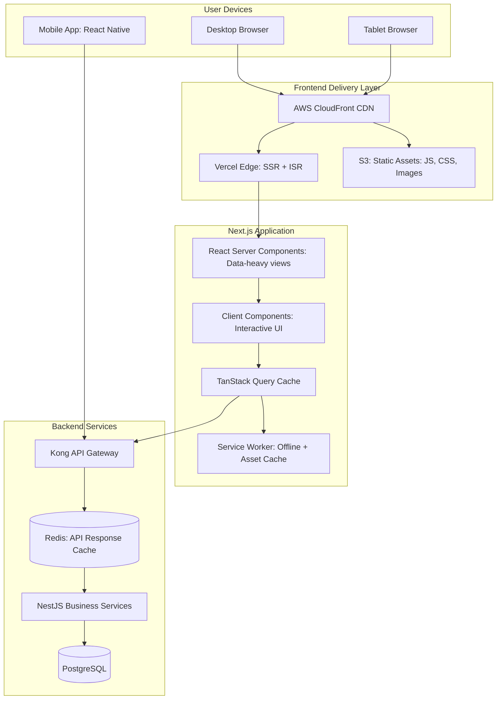

### 20.2 Rendering Strategy Architecture

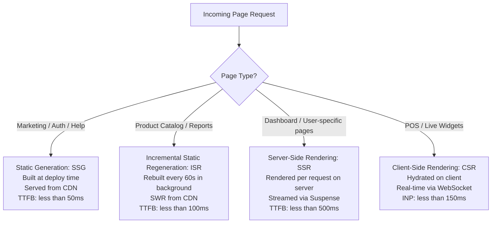

### 20.3 Multi-Layer Cache Architecture

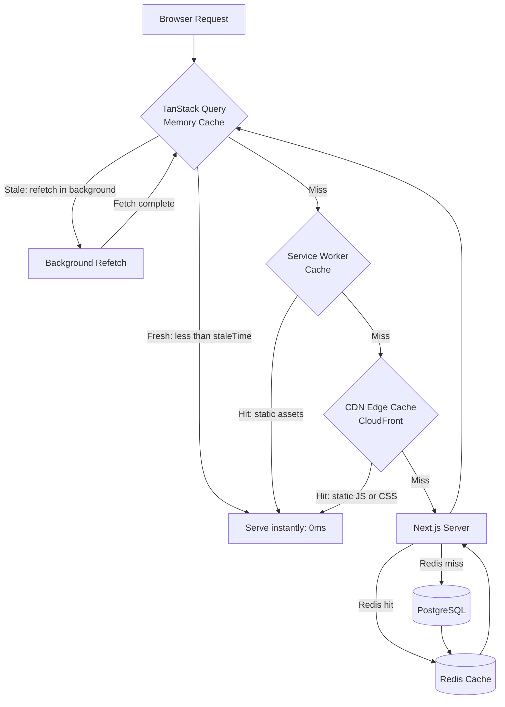

### 20.4 CDN Delivery Flow

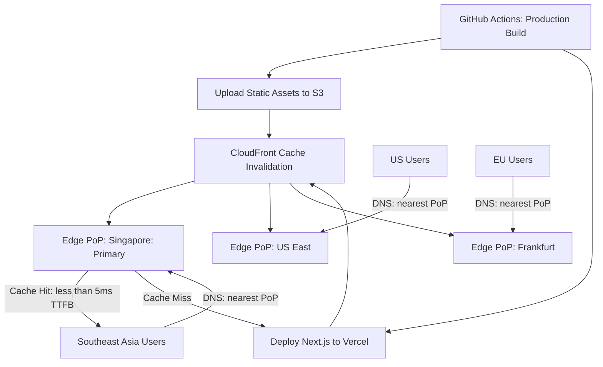

### 20.5 Production Readiness Pipeline

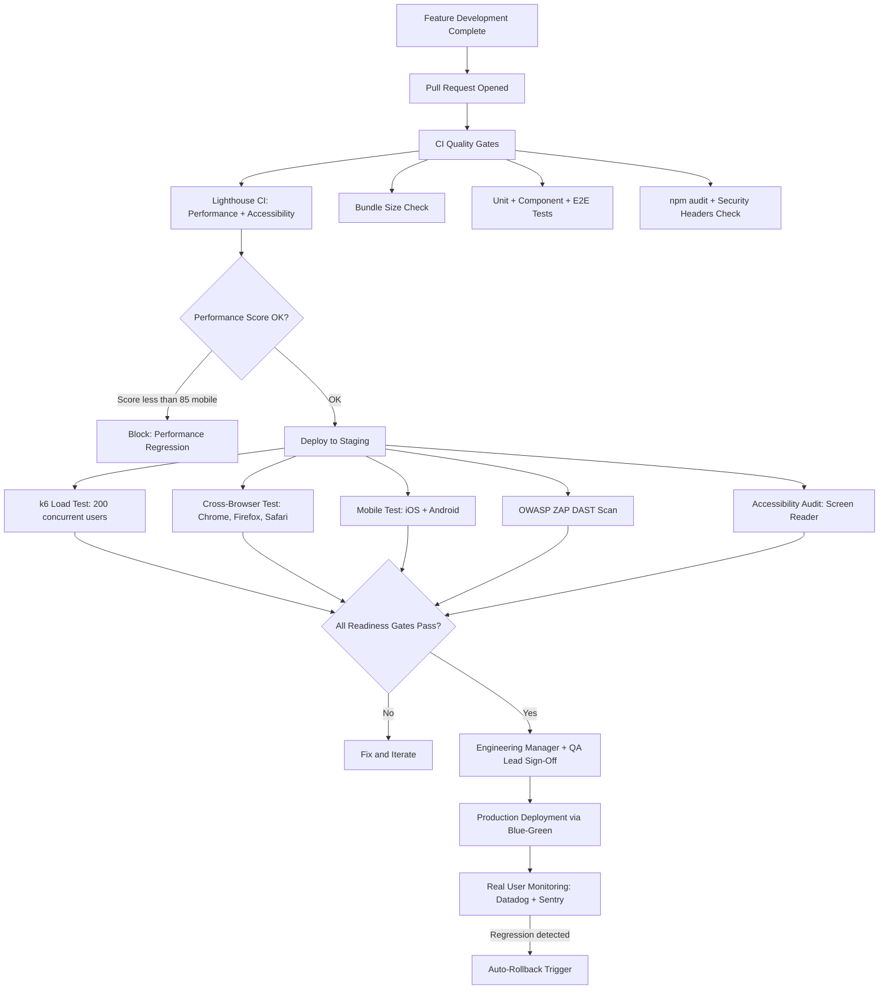

---

## APPENDIX A — PERFORMANCE QUICK REFERENCE

```
LCP Target:         ≤ 2.0 s
INP Target:         ≤ 150 ms
CLS Target:         ≤ 0.05
FCP Target:         ≤ 1.5 s
TTFB Target:        ≤ 0.5 s

JS Chunk Budget:    ≤ 150 kB gzipped (page)
Vendor Chunk:       ≤ 200 kB gzipped
Total Page Weight:  ≤ 500 kB gzipped

Mobile Cold Start:  ≤ 2.5 s (iOS) / ≤ 3.0 s (Android)
POS Interactive:    ≤ 1.5 s
Scroll FPS:         ≥ 60 FPS sustained

Lighthouse Mobile:  ≥ 85
Lighthouse Desktop: ≥ 90
Lighthouse A11y:    ≥ 90
```

## APPENDIX B — PERFORMANCE OPTIMIZATION PRIORITY MATRIX

| Priority | Optimization | Impact | Effort |
| :--- | :--- | :--- | :--- |
| 🔴 P1 | Implement virtual scrolling for order/product lists > 100 rows | High | Medium |
| 🔴 P1 | Enable React Server Components for dashboard data-fetch sections | High | Medium |
| 🔴 P1 | Convert all product images to WebP with `next/image` | High | Low |
| 🟠 P2 | Add route-level prefetching for high-traffic pages | Medium | Low |
| 🟠 P2 | Implement event batching for WebSocket invalidations | Medium | Low |
| 🟠 P2 | Apply `React.memo` to ProductTableRow and OrderTableRow | Medium | Low |
| 🟡 P3 | Extract heavy chart library to lazy dynamic import | Medium | Low |
| 🟡 P3 | Add Service Worker for offline asset caching on mobile web | Medium | High |
| 🟡 P3 | Implement ISR on product catalog (replace SSR) | Low | Low |

---

*End of Frontend Performance Optimization, Scalability & Production Readiness*  
*Document maintained by: Principal Frontend Performance Architect & Web Performance Engineer | Status: Approved Performance & Production Readiness Specification*
