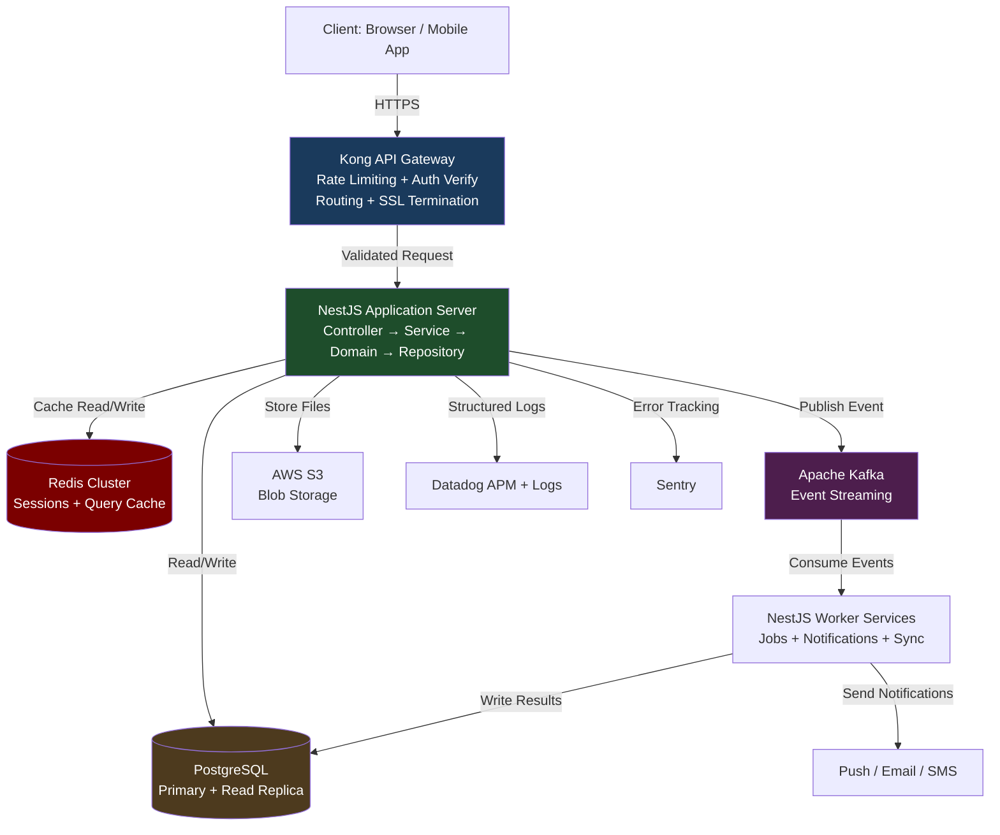
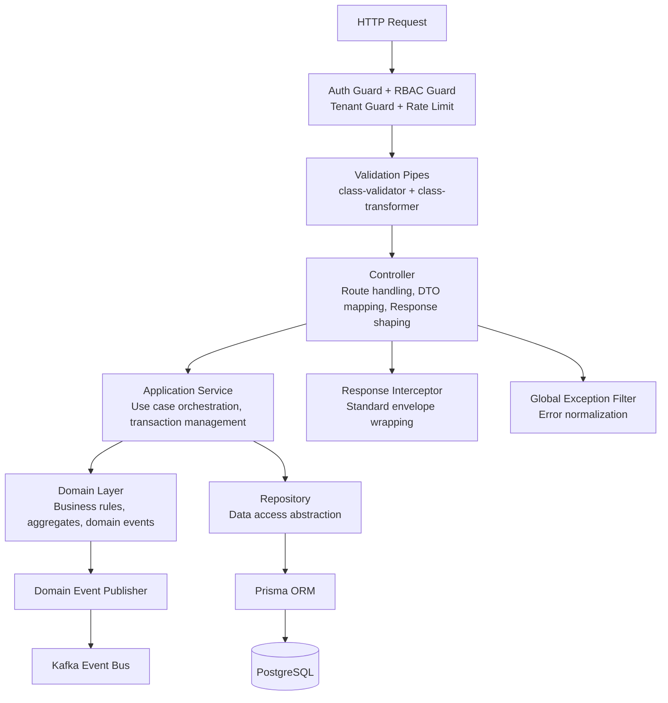
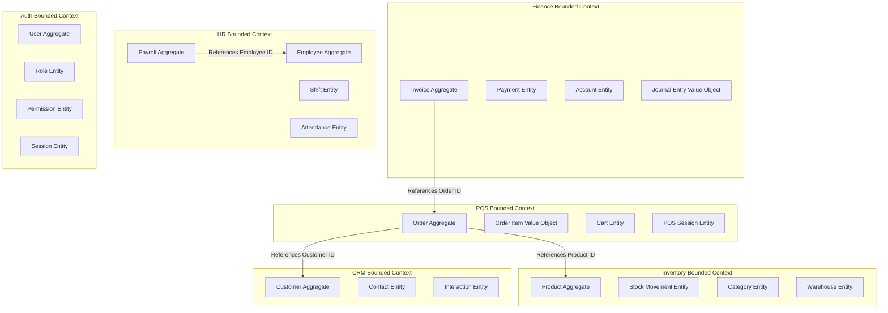
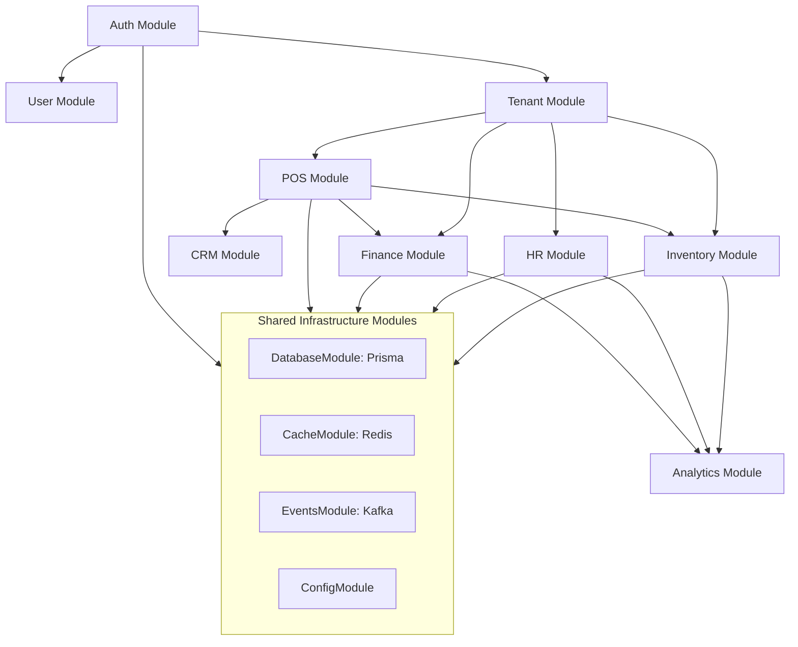
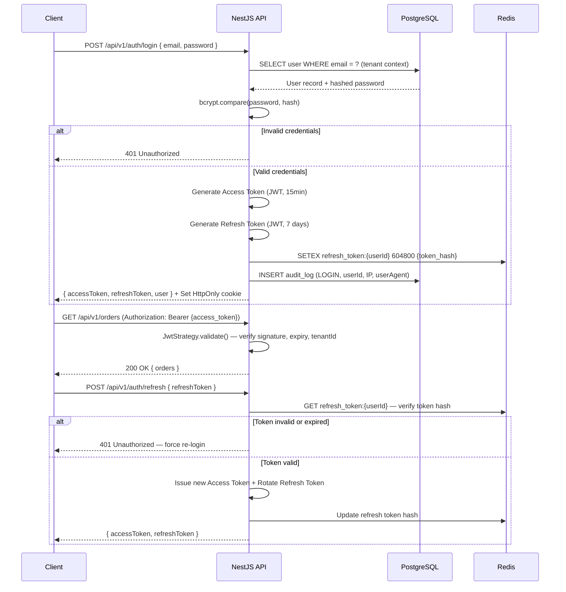
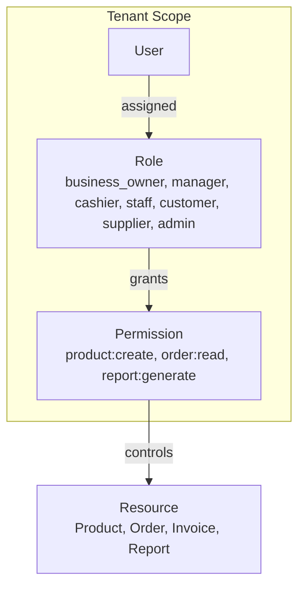
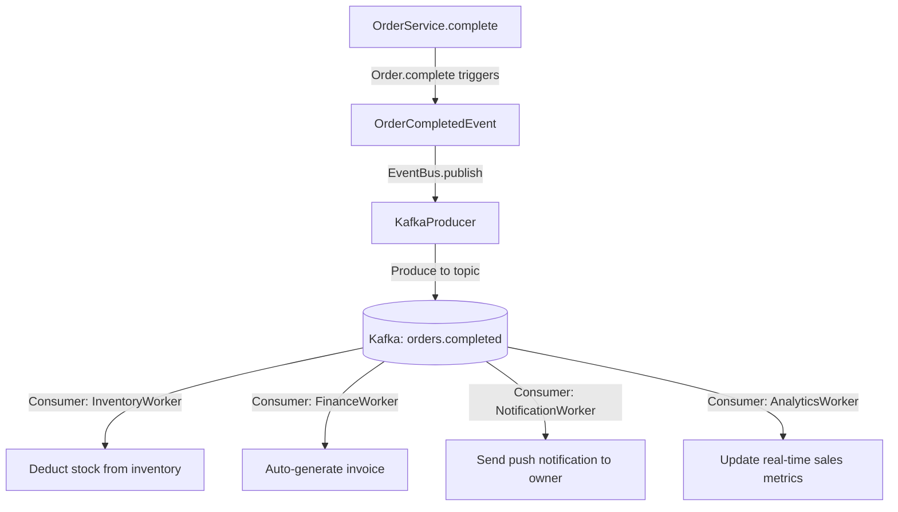
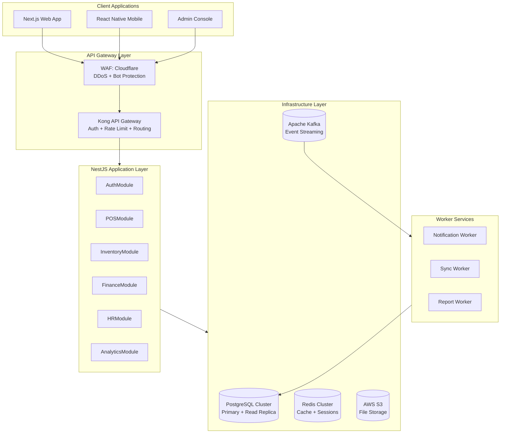
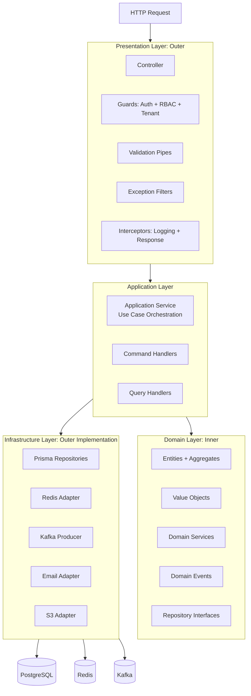
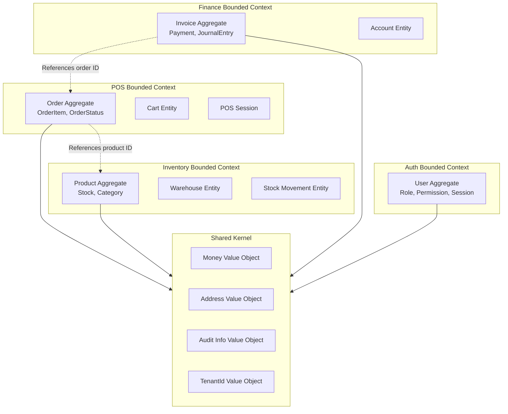

# BACKEND ARCHITECTURE FOUNDATION & ENTERPRISE ENGINEERING STANDARDS

**Project Name:** Enterprise SaaS Business Management Platform  
**Document Version:** 1.0.0 — Baseline Standard  
**Date:** July 13, 2026  
**Authors:** Principal Backend Architect, Enterprise Software Architect, NestJS Architect, Domain Driven Design Specialist & Database Architect  
**Classification:** Enterprise Internal — Unrestricted  
**Status:** 🏛️ APPROVED BACKEND ARCHITECTURE FOUNDATION SPECIFICATION  

---

## SECTION 1 — BACKEND ARCHITECTURE PRINCIPLES

### 1.1 Why Architecture Principles Matter

Enterprise SaaS platforms fail not because of missing features, but because of **accumulated architectural debt** — short-term decisions that compound into systems that cannot scale, cannot be changed safely, and cannot be understood by new engineers. These principles exist to prevent that outcome.

### 1.2 Enterprise Backend Engineering Principles

| Principle | Description | Enforcement |
| :--- | :--- | :--- |
| **Maintainability** | Code must be readable, predictable, and changeable by any senior engineer without guidance. Follow naming conventions, single responsibility, and dependency injection rigorously. | Mandatory code review; ESLint + Prettier; Architecture Review Board for new patterns. |
| **Scalability** | Design every component to scale independently. Stateless services; horizontal scaling; asynchronous processing for long-running tasks. | Stateless NestJS modules; Redis-backed session; Kafka for async workflows. |
| **Security by Default** | Every endpoint is assumed hostile until proven otherwise. Input validation, authorization, rate limiting, and audit logging are non-negotiable — never optional. | Global validation pipe; Guards on every route; Helmet + CORS enforced globally. |
| **Performance** | Target p95 API latency < 200 ms for transactional endpoints; p95 < 500 ms for reporting endpoints. Never sacrifice correctness for speed. | Datadog APM latency alerts; DB query time logging; Redis cache layer. |
| **Reliability** | System must remain available and correct under partial failure. Design for failure: circuit breakers, retries with backoff, graceful degradation. | NestJS retry decorators; Kafka dead-letter topics; health check endpoints. |
| **Testability** | All business logic must be unit-testable in isolation. No direct database or third-party calls in domain or service layers without abstraction. | 100% injection via constructors; repository interfaces; Jest mocking strategy. |
| **Observability** | Every request must produce structured logs, distributed traces, and metrics. Silent failures are unacceptable. | Winston + Datadog; correlation IDs on all requests; structured JSON logging. |
| **Domain Integrity** | Business rules live in the domain layer — never in controllers, DTOs, or database models. Domain objects enforce their own invariants. | DDD aggregate patterns; no business logic in `@Controller` classes. |

### 1.3 Non-Negotiable Backend Standards

```
✅ All endpoints require authentication unless explicitly marked @Public()
✅ All input is validated via class-validator DTOs before reaching service layer
✅ All database access goes through repository interfaces
✅ All sensitive operations write to audit log
✅ All modules are isolated — cross-module dependency via service injection only
✅ All async jobs have a dead-letter fallback
✅ All secrets are read from environment — never hardcoded
✅ All database changes go through Prisma migrations — no raw schema edits
```

---

## SECTION 2 — BACKEND SYSTEM ARCHITECTURE

### 2.1 High-Level System Architecture



### 2.2 Application Internal Architecture



---

## SECTION 3 — CLEAN ARCHITECTURE APPROACH

### 3.1 Clean Architecture Layer Model

The Clean Architecture principle dictates that **dependencies only point inward**. The outer layers depend on inner layers; inner layers know nothing about outer layers:

```
┌─────────────────────────────────────────────────────────────────────┐
│  PRESENTATION LAYER (outermost)                                     │
│  Controllers, Guards, Pipes, Interceptors, Filters                  │
│  HTTP transport, request/response shaping                           │
├─────────────────────────────────────────────────────────────────────┤
│  APPLICATION LAYER                                                  │
│  Use Cases, Command Handlers, Query Handlers, DTOs                  │
│  Orchestrates domain objects; manages transactions                  │
├─────────────────────────────────────────────────────────────────────┤
│  DOMAIN LAYER (innermost, no external dependencies)                 │
│  Entities, Aggregates, Value Objects, Domain Events                 │
│  Domain Services, Repository Interfaces, Business Rules             │
├─────────────────────────────────────────────────────────────────────┤
│  INFRASTRUCTURE LAYER (outermost implementation)                    │
│  Prisma Repositories, Redis Adapters, Kafka Producers               │
│  Email Providers, S3 Adapters, External API Clients                 │
└─────────────────────────────────────────────────────────────────────┘
         ↑ Dependencies point INWARD only ↑
```

### 3.2 Layer Responsibility Matrix

| Layer | Files / Classes | Knows About | Must NOT Know About |
| :--- | :--- | :--- | :--- |
| **Presentation** | `*.controller.ts`, Guards, Pipes | Application layer DTOs; HTTP request/response. | Domain entities; infrastructure adapters; Prisma. |
| **Application** | `*.service.ts`, command/query handlers | Domain models; repository interfaces; domain events. | Prisma models; HTTP; Express/Fastify; Redis directly. |
| **Domain** | Entities, Aggregates, Value Objects, Domain Services | Only itself; pure TypeScript. | NestJS decorators; Prisma; Express; Redis; Kafka. |
| **Infrastructure** | `*.repository.ts`, adapters, providers | Domain interfaces it implements; Prisma; Redis; Kafka. | HTTP transport; NestJS controllers; application DTOs. |

### 3.3 Dependency Rule Example (Product Aggregate)

```typescript
// ─── DOMAIN LAYER: no external dependencies ──────────────────────────────────
// domain/product/product.entity.ts
export class Product {
  private constructor(
    public readonly id: string,
    public readonly tenantId: string,
    private _name: string,
    private _unitPrice: Money,
    private _stock: number,
  ) {}

  static create(props: CreateProductProps): Product {
    if (props.unitPrice.amount <= 0) throw new DomainException('Price must be positive');
    if (!props.name || props.name.trim().length < 2) throw new DomainException('Name too short');
    return new Product(generateId(), props.tenantId, props.name, props.unitPrice, props.stock);
  }

  adjustStock(delta: number): void {
    const newStock = this._stock + delta;
    if (newStock < 0) throw new DomainException(`Insufficient stock: ${this._stock} available`);
    this._stock = newStock;
  }

  get name(): string { return this._name; }
  get unitPrice(): Money { return this._unitPrice; }
  get stock(): number { return this._stock; }
}

// ─── DOMAIN: Repository interface (not implementation) ───────────────────────
export interface IProductRepository {
  findById(id: string, tenantId: string): Promise<Product | null>;
  findAll(tenantId: string, filters: ProductFilters): Promise<PaginatedResult<Product>>;
  save(product: Product): Promise<void>;
  delete(id: string, tenantId: string): Promise<void>;
}

// ─── INFRASTRUCTURE: Prisma implementation (depends on domain interface) ─────
// infrastructure/repositories/prisma-product.repository.ts
@Injectable()
export class PrismaProductRepository implements IProductRepository {
  constructor(private readonly prisma: PrismaService) {}

  async findById(id: string, tenantId: string): Promise<Product | null> {
    const row = await this.prisma.product.findFirst({ where: { id, tenantId } });
    return row ? this.toDomain(row) : null;
  }

  async save(product: Product): Promise<void> {
    await this.prisma.product.upsert({
      where: { id: product.id },
      create: this.toPersistence(product),
      update: this.toPersistence(product),
    });
  }

  private toDomain(row: PrismaProduct): Product { /* mapping */ }
  private toPersistence(product: Product): PrismaProductCreateInput { /* mapping */ }
}
```

---

## SECTION 4 — DOMAIN DRIVEN DESIGN (DDD)

### 4.1 DDD Building Blocks

| Concept | Description | SaaS Example |
| :--- | :--- | :--- |
| **Bounded Context** | An explicit boundary within which a domain model applies. Models in different contexts can differ. | `POS Context`, `Inventory Context`, `Finance Context`, `HR Context` are separate bounded contexts. |
| **Aggregate** | A cluster of domain objects treated as a single transactional unit. Has one root entity. | `Order` aggregate contains `OrderItems`; consistency enforced at the aggregate root. |
| **Entity** | A domain object with a stable identity that persists over time. Equality by ID. | `Product`, `Customer`, `Employee`, `Invoice`. |
| **Value Object** | An immutable domain object with no identity; equality by value. | `Money(amount, currency)`, `Address(street, city, country)`, `TaxRate(rate, type)`. |
| **Domain Service** | Stateless operation on domain objects that does not naturally belong to an entity. | `PricingService.calculateOrderTotal(order, discounts)`. |
| **Domain Event** | A record of something significant that happened in the domain. | `OrderCreatedEvent`, `PaymentCompletedEvent`, `StockDepletedEvent`. |
| **Repository Interface** | Abstraction over data persistence; defined in domain layer, implemented in infrastructure. | `IOrderRepository`, `IProductRepository`. |
| **Factory** | Encapsulates the creation of complex domain objects or aggregates. | `OrderFactory.createFromCart(cart, customer, branch)`. |

### 4.2 Bounded Context Map



### 4.3 Value Object Example: Money

```typescript
// domain/shared/money.value-object.ts
export class Money {
  private constructor(
    public readonly amount: number,
    public readonly currency: 'USD' | 'KHR' | 'THB',
  ) {
    if (!Number.isFinite(amount)) throw new DomainException('Amount must be a finite number');
    if (amount < 0) throw new DomainException('Amount cannot be negative');
  }

  static of(amount: number, currency: 'USD' | 'KHR' | 'THB'): Money {
    return new Money(Math.round(amount * 100) / 100, currency);  // 2dp precision
  }

  add(other: Money): Money {
    if (other.currency !== this.currency) throw new DomainException('Cannot add different currencies');
    return Money.of(this.amount + other.amount, this.currency);
  }

  multiply(factor: number): Money {
    return Money.of(this.amount * factor, this.currency);
  }

  equals(other: Money): boolean {
    return this.amount === other.amount && this.currency === other.currency;
  }

  isGreaterThan(other: Money): boolean {
    return this.amount > other.amount;
  }
}
```

### 4.4 Order Aggregate Example

```typescript
// domain/pos/order.aggregate.ts
export class Order {
  private _items: OrderItem[] = [];
  private _status: OrderStatus = OrderStatus.DRAFT;
  private _domainEvents: DomainEvent[] = [];

  private constructor(
    public readonly id: string,
    public readonly tenantId: string,
    public readonly branchId: string,
    public readonly customerId: string | null,
    private _totalAmount: Money,
  ) {}

  static create(props: CreateOrderProps): Order {
    const order = new Order(
      generateId(), props.tenantId, props.branchId,
      props.customerId ?? null, Money.of(0, props.currency)
    );
    order._domainEvents.push(new OrderCreatedEvent(order.id, props.tenantId));
    return order;
  }

  addItem(product: Product, quantity: number): void {
    if (this._status !== OrderStatus.DRAFT) {
      throw new DomainException('Cannot add items to a non-draft order');
    }
    if (quantity <= 0) throw new DomainException('Quantity must be positive');
    if (product.stock < quantity) throw new DomainException(`Insufficient stock for ${product.name}`);

    const existing = this._items.find(i => i.productId === product.id);
    if (existing) {
      existing.increaseQuantity(quantity);
    } else {
      this._items.push(OrderItem.create(product.id, product.name, quantity, product.unitPrice));
    }
    this.recalculateTotal();
  }

  complete(payment: Payment): void {
    if (this._status !== OrderStatus.DRAFT) throw new DomainException('Order is not in draft state');
    if (!payment.isSufficient(this._totalAmount)) {
      throw new DomainException('Payment amount is insufficient');
    }
    this._status = OrderStatus.COMPLETED;
    this._domainEvents.push(new OrderCompletedEvent(this.id, this.tenantId, this._totalAmount));
  }

  void(reason: string): void {
    if (this._status !== OrderStatus.COMPLETED) throw new DomainException('Only completed orders can be voided');
    this._status = OrderStatus.VOIDED;
    this._domainEvents.push(new OrderVoidedEvent(this.id, this.tenantId, reason));
  }

  get items(): ReadonlyArray<OrderItem> { return this._items; }
  get status(): OrderStatus { return this._status; }
  get totalAmount(): Money { return this._totalAmount; }
  get domainEvents(): ReadonlyArray<DomainEvent> { return this._domainEvents; }

  private recalculateTotal(): void {
    this._totalAmount = this._items.reduce(
      (sum, item) => sum.add(item.lineTotal), Money.of(0, this._totalAmount.currency)
    );
  }
}
```

---

## SECTION 5 — BACKEND MODULE ARCHITECTURE

### 5.1 Module Boundary Principles

*   Each business module is a **self-contained NestJS module** with its own controllers, services, domain, repositories, and tests.
*   Modules communicate via **injected services or domain events** — never via direct database access into another module's tables.
*   Shared infrastructure (database, cache, Kafka) is provided by **shared infrastructure modules**, not duplicated per feature module.
*   Cross-cutting concerns (auth, logging, rate limiting) are implemented as **global guards, interceptors, and filters**.

### 5.2 Module Dependency Map



### 5.3 Module Catalog

| Module | Bounded Context | Primary Entities | Exposed Services |
| :--- | :--- | :--- | :--- |
| **AuthModule** | Auth | User, Session, Token | `AuthService`, `JwtStrategy` |
| **UserModule** | Auth | User, UserProfile, Role | `UserService` |
| **TenantModule** | Platform | Tenant, TenantPlan, Branch | `TenantService`, `TenantResolver` |
| **OrganizationModule** | Platform | Branch, Department, Team | `OrganizationService` |
| **POSModule** | POS | Order, OrderItem, POS Session | `OrderService`, `CartService` |
| **InventoryModule** | Inventory | Product, Category, Stock, Supplier | `ProductService`, `StockService` |
| **SalesModule** | Sales | Quote, SalesOrder, Delivery | `SalesOrderService` |
| **FinanceModule** | Finance | Invoice, Payment, Account, Journal | `InvoiceService`, `PaymentService` |
| **CRMModule** | CRM | Customer, Contact, Lead | `CustomerService` |
| **HRModule** | HR | Employee, Shift, Attendance, Payroll | `EmployeeService`, `PayrollService` |
| **AnalyticsModule** | Analytics | Report, KPI, Dashboard | `ReportService`, `KPIService` |

---

## SECTION 6 — NESTJS PROJECT STRUCTURE

### 6.1 Monorepo-Ready Folder Structure

```
src/
├── main.ts                            ← NestJS bootstrap; global config; shutdown hooks
├── app.module.ts                      ← Root module; imports all feature and infra modules
│
├── modules/                           ← Business feature modules (one per bounded context)
│   ├── auth/
│   │   ├── auth.module.ts
│   │   ├── controllers/
│   │   │   └── auth.controller.ts
│   │   ├── services/
│   │   │   └── auth.service.ts
│   │   ├── domain/
│   │   │   ├── entities/              ← User, Session domain entities
│   │   │   ├── value-objects/
│   │   │   ├── events/                ← UserRegisteredEvent, PasswordChangedEvent
│   │   │   └── interfaces/            ← IUserRepository, ISessionRepository
│   │   ├── infrastructure/
│   │   │   └── repositories/         ← PrismaUserRepository, PrismaSessionRepository
│   │   ├── dto/                       ← LoginDto, RegisterDto, RefreshTokenDto
│   │   ├── strategies/                ← JwtStrategy, LocalStrategy
│   │   ├── guards/                    ← JwtAuthGuard, RbacGuard
│   │   └── __tests__/
│   ├── tenant/
│   ├── pos/
│   ├── inventory/
│   ├── finance/
│   ├── hr/
│   ├── crm/
│   └── analytics/
│
├── common/                            ← Shared utilities; no business logic
│   ├── decorators/                    ← @CurrentUser(), @TenantId(), @Public(), @Roles()
│   ├── filters/                       ← GlobalExceptionFilter
│   ├── guards/                        ← TenantGuard, ThrottleGuard
│   ├── interceptors/                  ← LoggingInterceptor, ResponseInterceptor
│   ├── pipes/                         ← ParseUUIDPipe, TrimPipe
│   ├── enums/                         ← OrderStatus, PaymentMethod, UserRole
│   ├── types/                         ← PaginatedResult<T>, ApiResponse<T>
│   └── utils/                         ← generateId(), formatCurrency(), hashPassword()
│
├── config/                            ← Configuration modules (validated at startup)
│   ├── app.config.ts                  ← Port, env, CORS origins
│   ├── database.config.ts             ← PostgreSQL URL, pool size
│   ├── redis.config.ts                ← Redis host, port, TTL defaults
│   ├── kafka.config.ts                ← Broker URLs, consumer group IDs
│   ├── jwt.config.ts                  ← Access + refresh token secrets, expiry
│   └── storage.config.ts              ← S3 bucket, region, CDN URL
│
├── database/                          ← Database infrastructure
│   ├── prisma/
│   │   ├── schema.prisma              ← Prisma schema definition
│   │   └── migrations/                ← Versioned migration files
│   └── prisma.service.ts              ← PrismaClient wrapper with lifecycle hooks
│
├── security/                          ← Cross-cutting security concerns
│   ├── encryption.service.ts          ← AES-256 field-level encryption
│   ├── hashing.service.ts             ← bcrypt password hashing
│   ├── audit.service.ts               ← Audit log write service
│   └── rate-limit.service.ts          ← Custom rate limit logic
│
├── events/                            ← Event-driven infrastructure
│   ├── kafka/
│   │   ├── kafka.module.ts
│   │   ├── kafka.producer.ts
│   │   └── kafka.consumer.ts
│   ├── handlers/                      ← Domain event → Kafka event bridge
│   └── topics.enum.ts                 ← Topic name constants
│
├── jobs/                              ← Scheduled and background jobs
│   ├── scheduler.module.ts
│   ├── daily-report.job.ts            ← @Cron jobs
│   ├── sync-stock.job.ts
│   └── cleanup-sessions.job.ts
│
└── integrations/                      ← External service adapters
    ├── payment/                        ← Stripe, ABA Pay, PayWay
    ├── storage/                        ← AWS S3 adapter
    ├── email/                          ← SendGrid adapter
    ├── sms/                            ← Twilio, Cambodia Telco adapters
    └── push-notifications/             ← Firebase Cloud Messaging adapter
```

### 6.2 Application Bootstrap (`main.ts`)

```typescript
import { NestFactory } from '@nestjs/core';
import { ValidationPipe, VersioningType } from '@nestjs/common';
import { SwaggerModule, DocumentBuilder } from '@nestjs/swagger';
import { AppModule } from './app.module';
import { GlobalExceptionFilter } from './common/filters/global-exception.filter';
import { ResponseInterceptor } from './common/interceptors/response.interceptor';
import { LoggingInterceptor } from './common/interceptors/logging.interceptor';
import helmet from 'helmet';
import compression from 'compression';

async function bootstrap() {
  const app = await NestFactory.create(AppModule, {
    logger: ['error', 'warn', 'log'],
    bufferLogs: true,
  });

  // ─── Security Middleware ────────────────────────────────────────────────
  app.use(helmet({
    contentSecurityPolicy: {
      directives: {
        defaultSrc: ["'self'"],
        scriptSrc: ["'self'"],
      },
    },
  }));
  app.use(compression());
  app.enableCors({
    origin: process.env.ALLOWED_ORIGINS?.split(',') ?? ['http://localhost:3000'],
    credentials: true,
    methods: ['GET', 'POST', 'PATCH', 'PUT', 'DELETE'],
  });

  // ─── API Versioning ─────────────────────────────────────────────────────
  app.enableVersioning({ type: VersioningType.URI, defaultVersion: '1' });
  app.setGlobalPrefix('api');

  // ─── Global Pipes ──────────────────────────────────────────────────────
  app.useGlobalPipes(new ValidationPipe({
    whitelist: true,            // Strip unknown properties from DTOs
    forbidNonWhitelisted: true, // Reject requests with unknown properties
    transform: true,            // Auto-transform payloads to DTO class instances
    transformOptions: { enableImplicitConversion: true },
  }));

  // ─── Global Interceptors + Filters ─────────────────────────────────────
  app.useGlobalInterceptors(new LoggingInterceptor(), new ResponseInterceptor());
  app.useGlobalFilters(new GlobalExceptionFilter());

  // ─── Swagger Documentation ──────────────────────────────────────────────
  const config = new DocumentBuilder()
    .setTitle('SaaS Business Management Platform API')
    .setDescription('Enterprise REST API — Version 1')
    .setVersion('1.0')
    .addBearerAuth()
    .addServer(`https://api.platform.io`, 'Production')
    .addServer(`https://api.staging.platform.io`, 'Staging')
    .build();
  const document = SwaggerModule.createDocument(app, config);
  SwaggerModule.setup('docs', app, document, {
    swaggerOptions: { persistAuthorization: true },
  });

  // ─── Graceful Shutdown ──────────────────────────────────────────────────
  app.enableShutdownHooks();
  const port = process.env.PORT ?? 3001;
  await app.listen(port);
  console.log(`🚀 Backend API running on port ${port}`);
}

bootstrap();
```

---

## SECTION 7 — FEATURE-BASED BACKEND ARCHITECTURE

### 7.1 Feature Vertical Slice

Each business feature follows a consistent vertical slice from HTTP request to database response:

```mermaid
graph TD
    HTTP[HTTP POST /api/v1/products] --> Controller
    Controller[ProductController\n@UseGuards: JwtAuthGuard, RbacGuard\n@Body: CreateProductDto\nValidated by ValidationPipe] --> AppService
    AppService[ProductService\nOrchestrates use case\nManages transactions\nPublishes domain events] --> Domain
    Domain[Product.create\nEnforces business rules\nReturns Product or throws DomainException] --> Repository
    Repository[IProductRepository → PrismaProductRepository\nMapps domain ↔ Prisma model\nExecutes database query] --> DB[(PostgreSQL)]
    AppService --> EventBus[Domain Event Bus\nProductCreatedEvent → Kafka]
    Controller --> Response[ApiResponse wrapped output]
```

### 7.2 Feature Module Example: Inventory

```typescript
// modules/inventory/inventory.module.ts
@Module({
  imports: [
    DatabaseModule,
    CacheModule,
    EventsModule,
  ],
  controllers: [ProductController, CategoryController, StockController],
  providers: [
    ProductService,
    StockService,
    // Repository token binding: inject interface, provide implementation
    { provide: PRODUCT_REPOSITORY, useClass: PrismaProductRepository },
    { provide: STOCK_REPOSITORY, useClass: PrismaStockRepository },
  ],
  exports: [ProductService],  // Exported for POS module dependency
})
export class InventoryModule {}
```

### 7.3 Controller Pattern

```typescript
// modules/inventory/controllers/product.controller.ts
@ApiTags('Products')
@ApiBearerAuth()
@UseGuards(JwtAuthGuard, RbacGuard)
@Controller({ path: 'products', version: '1' })
export class ProductController {
  constructor(private readonly productService: ProductService) {}

  @Post()
  @Roles('BUSINESS_OWNER', 'MANAGER')
  @ApiOperation({ summary: 'Create a new product' })
  @ApiResponse({ status: 201, type: ProductResponseDto })
  async create(
    @Body() dto: CreateProductDto,
    @CurrentUser() user: AuthUser,
    @TenantId() tenantId: string,
  ): Promise<ApiResponse<ProductResponseDto>> {
    const product = await this.productService.create({ ...dto, tenantId, createdBy: user.id });
    return ApiResponse.success(ProductMapper.toResponse(product), 201);
  }

  @Get()
  @Roles('BUSINESS_OWNER', 'MANAGER', 'STAFF')
  async findAll(
    @Query() query: ProductQueryDto,
    @TenantId() tenantId: string,
  ): Promise<ApiResponse<PaginatedResult<ProductResponseDto>>> {
    const result = await this.productService.findAll(tenantId, query);
    return ApiResponse.success(result);
  }

  @Patch(':id')
  @Roles('BUSINESS_OWNER', 'MANAGER')
  async update(
    @Param('id', ParseUUIDPipe) id: string,
    @Body() dto: UpdateProductDto,
    @TenantId() tenantId: string,
  ): Promise<ApiResponse<ProductResponseDto>> {
    const product = await this.productService.update(id, tenantId, dto);
    return ApiResponse.success(ProductMapper.toResponse(product));
  }

  @Delete(':id')
  @Roles('BUSINESS_OWNER')
  @HttpCode(204)
  async delete(
    @Param('id', ParseUUIDPipe) id: string,
    @TenantId() tenantId: string,
  ): Promise<void> {
    await this.productService.delete(id, tenantId);
  }
}
```

### 7.4 Application Service Pattern

```typescript
// modules/inventory/services/product.service.ts
@Injectable()
export class ProductService {
  constructor(
    @Inject(PRODUCT_REPOSITORY) private readonly productRepo: IProductRepository,
    @Inject(STOCK_REPOSITORY) private readonly stockRepo: IStockRepository,
    private readonly eventBus: EventBus,
    private readonly auditService: AuditService,
    @InjectPrismaTransaction() private readonly prisma: PrismaService,
  ) {}

  async create(command: CreateProductCommand): Promise<Product> {
    const existing = await this.productRepo.findBySku(command.sku, command.tenantId);
    if (existing) throw new ConflictException(`Product with SKU ${command.sku} already exists`);

    const product = Product.create({
      tenantId: command.tenantId,
      name: command.name,
      sku: command.sku,
      unitPrice: Money.of(command.unitPrice, command.currency),
      stock: command.initialStock ?? 0,
    });

    await this.prisma.$transaction(async (tx) => {
      await this.productRepo.save(product, tx);
      await this.auditService.log({
        action: 'PRODUCT_CREATED',
        resourceId: product.id,
        tenantId: command.tenantId,
        actorId: command.createdBy,
        metadata: { name: product.name, sku: product.sku },
      }, tx);
    });

    // Publish after successful transaction
    await this.eventBus.publish(product.domainEvents);
    return product;
  }
}
```

---

## SECTION 8 — API ARCHITECTURE

### 8.1 REST API Design Standards

| Convention | Standard | Example |
| :--- | :--- | :--- |
| **Base URL** | `/api/v{n}/` | `/api/v1/products` |
| **Resource naming** | Plural nouns, lowercase, hyphenated | `/api/v1/order-items`, `/api/v1/stock-movements` |
| **HTTP verbs** | GET (read), POST (create), PATCH (partial update), PUT (full replace), DELETE | `PATCH /api/v1/products/:id` |
| **Filtering** | Query parameters, not path segments | `GET /api/v1/products?categoryId=xxx&inStock=true` |
| **Pagination** | `?page=1&pageSize=20` | Response: `{ data, meta: { page, pageSize, totalItems, totalPages } }` |
| **Sorting** | `?sortBy=name&sortOrder=asc` | Response sorted accordingly |
| **Versioning** | URI versioning `/v1/`, `/v2/` | Breaking changes bump major version |
| **Status codes** | 200 OK, 201 Created, 204 No Content, 400 Bad Request, 401 Unauthorized, 403 Forbidden, 404 Not Found, 409 Conflict, 422 Unprocessable, 429 Too Many Requests, 500 Internal Server Error | — |

### 8.2 Standard API Response Envelope

```typescript
// common/types/api-response.type.ts
export class ApiResponse<T> {
  success: boolean;
  data: T;
  meta?: PaginationMeta;
  error?: ApiError;
  timestamp: string;
  requestId: string;

  static success<T>(data: T, statusCode = 200, meta?: PaginationMeta): ApiResponse<T> {
    return { success: true, data, meta, timestamp: new Date().toISOString(), requestId: cls.get('requestId') };
  }

  static error(message: string, code: string, statusCode: number): ApiResponse<null> {
    return { success: false, data: null, error: { message, code, statusCode }, timestamp: new Date().toISOString(), requestId: cls.get('requestId') };
  }
}
```

### 8.3 API Versioning Strategy

```
v1 → Current stable version (maintained for minimum 18 months after v2 release)
v2 → Next major version (breaking changes: field removals, type changes, behavior changes)

Deprecation policy:
  - 6 months advance notice before deprecating any endpoint
  - Deprecation header added: Deprecation: "2027-01-01", Sunset: "2027-06-01"
  - Email notification to all API consumers via developer portal
```

### 8.4 WebSocket Gateway

```typescript
// modules/pos/gateways/pos.gateway.ts
@WebSocketGateway({ namespace: '/pos', cors: { origin: process.env.ALLOWED_ORIGINS } })
@UseGuards(WsJwtGuard)
export class POSGateway implements OnGatewayConnection, OnGatewayDisconnect {
  @WebSocketServer() server: Server;

  constructor(private readonly tenantService: TenantService) {}

  async handleConnection(client: Socket): Promise<void> {
    const tenantId = client.handshake.auth.tenantId;
    const branchId = client.handshake.auth.branchId;
    await client.join(`tenant:${tenantId}:branch:${branchId}`);
  }

  handleDisconnect(client: Socket): void {
    client.leaveAll();
  }

  @SubscribeMessage('order:subscribe')
  handleOrderSubscribe(client: Socket, payload: { branchId: string }): void {
    client.join(`orders:${payload.branchId}`);
  }

  // Called by OrderService after successful order creation
  async broadcastOrderCreated(tenantId: string, branchId: string, order: OrderResponseDto): Promise<void> {
    this.server.to(`tenant:${tenantId}:branch:${branchId}`).emit('order:created', order);
  }
}
```

---

## SECTION 9 — BUSINESS LOGIC ARCHITECTURE

### 9.1 Business Logic Placement Rules

| Logic Type | Lives In | Example | Must NOT Live In |
| :--- | :--- | :--- | :--- |
| **HTTP routing** | Controller | Route params, query parsing | Service, Domain |
| **Use case orchestration** | Application Service | Fetch, validate, execute, persist, publish | Controller, Domain |
| **Business rules** | Domain Entity / Aggregate | "Order cannot be voided if paid" | Controller, Service, Repository |
| **Cross-entity domain logic** | Domain Service | `PricingService.applyTieredDiscount(order)` | Controller, Repository |
| **Data access** | Repository | `prisma.product.findFirst(...)` | Service, Domain, Controller |
| **Infrastructure concerns** | Infrastructure adapters | S3 upload, email sending, Kafka publish | Domain, Application |

### 9.2 DTO Validation Example

```typescript
// modules/inventory/dto/create-product.dto.ts
import { IsString, IsNumber, IsPositive, IsEnum, IsOptional, MinLength, MaxLength } from 'class-validator';
import { Transform } from 'class-transformer';
import { ApiProperty, ApiPropertyOptional } from '@nestjs/swagger';

export class CreateProductDto {
  @ApiProperty({ example: 'Espresso Coffee' })
  @IsString()
  @MinLength(2)
  @MaxLength(200)
  @Transform(({ value }) => value?.trim())
  name: string;

  @ApiProperty({ example: 'SKU-ESP-001' })
  @IsString()
  @MinLength(3)
  @MaxLength(100)
  @Transform(({ value }) => value?.trim().toUpperCase())
  sku: string;

  @ApiProperty({ example: 3.50 })
  @IsNumber({ maxDecimalPlaces: 4 })
  @IsPositive()
  unitPrice: number;

  @ApiProperty({ enum: ['USD', 'KHR', 'THB'], example: 'USD' })
  @IsEnum(['USD', 'KHR', 'THB'])
  currency: 'USD' | 'KHR' | 'THB';

  @ApiPropertyOptional({ example: 100 })
  @IsOptional()
  @IsNumber()
  @IsPositive()
  initialStock?: number;

  @ApiPropertyOptional()
  @IsOptional()
  @IsString()
  categoryId?: string;
}
```

---

## SECTION 10 — DATABASE ARCHITECTURE

### 10.1 Prisma Schema Design Principles

*   Every table has `id UUID PRIMARY KEY DEFAULT gen_random_uuid()`, `createdAt`, `updatedAt`, and `tenantId`.
*   All foreign keys have `ON DELETE` behavior explicitly defined.
*   Indexes defined for all foreign keys and frequently-filtered columns.
*   Soft deletes via `deletedAt TIMESTAMP NULL` — never hard-delete business records.

### 10.2 Prisma Schema Sample

```prisma
// prisma/schema.prisma (excerpt)
datasource db {
  provider = "postgresql"
  url      = env("DATABASE_URL")
}

generator client {
  provider        = "prisma-client-js"
  previewFeatures = ["multiSchema", "fullTextSearch"]
}

model Product {
  id          String   @id @default(dbgenerated("gen_random_uuid()")) @db.Uuid
  tenantId    String   @db.Uuid
  branchId    String?  @db.Uuid
  categoryId  String?  @db.Uuid
  sku         String
  name        String
  description String?
  unitPrice   Decimal  @db.Decimal(12, 4)
  currency    String   @default("USD") @db.VarChar(3)
  stock       Int      @default(0)
  minStock    Int      @default(0)
  isActive    Boolean  @default(true)
  createdBy   String   @db.Uuid
  updatedBy   String?  @db.Uuid
  createdAt   DateTime @default(now()) @db.Timestamptz
  updatedAt   DateTime @updatedAt @db.Timestamptz
  deletedAt   DateTime? @db.Timestamptz

  tenant      Tenant   @relation(fields: [tenantId], references: [id])
  category    Category? @relation(fields: [categoryId], references: [id])
  orderItems  OrderItem[]
  stockMovements StockMovement[]

  @@unique([tenantId, sku], name: "tenant_sku_unique")
  @@index([tenantId, isActive])
  @@index([tenantId, categoryId])
  @@map("products")
}
```

### 10.3 Repository Pattern

```typescript
// modules/inventory/infrastructure/repositories/prisma-product.repository.ts
@Injectable()
export class PrismaProductRepository implements IProductRepository {
  constructor(private readonly prisma: PrismaService) {}

  async findById(id: string, tenantId: string): Promise<Product | null> {
    const row = await this.prisma.product.findFirst({
      where: { id, tenantId, deletedAt: null },
    });
    return row ? ProductMapper.toDomain(row) : null;
  }

  async findAll(tenantId: string, filters: ProductFilters): Promise<PaginatedResult<Product>> {
    const where = {
      tenantId,
      deletedAt: null,
      ...(filters.categoryId && { categoryId: filters.categoryId }),
      ...(filters.inStock && { stock: { gt: 0 } }),
      ...(filters.search && {
        OR: [
          { name: { contains: filters.search, mode: 'insensitive' } },
          { sku: { contains: filters.search, mode: 'insensitive' } },
        ],
      }),
    };

    const [data, total] = await this.prisma.$transaction([
      this.prisma.product.findMany({
        where, skip: (filters.page - 1) * filters.pageSize,
        take: filters.pageSize,
        orderBy: { [filters.sortBy ?? 'createdAt']: filters.sortOrder ?? 'desc' },
      }),
      this.prisma.product.count({ where }),
    ]);

    return {
      data: data.map(ProductMapper.toDomain),
      meta: { page: filters.page, pageSize: filters.pageSize, totalItems: total, totalPages: Math.ceil(total / filters.pageSize) },
    };
  }

  async save(product: Product, tx?: PrismaTransactionClient): Promise<void> {
    const client = tx ?? this.prisma;
    await client.product.upsert({
      where: { id: product.id },
      create: ProductMapper.toPersistence(product),
      update: ProductMapper.toPersistenceUpdate(product),
    });
  }

  async delete(id: string, tenantId: string): Promise<void> {
    await this.prisma.product.update({
      where: { id },
      data: { deletedAt: new Date() },         // Soft delete
    });
  }
}
```

### 10.4 Migration Strategy

```
Migration workflow:
1. Developer modifies prisma/schema.prisma
2. Run: npx prisma migrate dev --name "add_product_barcode"
   → Creates migration file: migrations/20260713_add_product_barcode/migration.sql
3. Review generated SQL — ensure indexes and constraints are correct
4. Commit migration file alongside schema change in same PR
5. CI applies migration to staging: npx prisma migrate deploy
6. Production migration applied as part of deployment (zero-downtime via backward-compatible changes)

Zero-downtime migration rules:
✅ Adding nullable columns: safe (no downtime)
✅ Adding indexes: use CONCURRENTLY in raw SQL
✅ Adding new tables: safe
⚠️ Renaming columns: use shadow column strategy (add new, backfill, remove old in 3 deployments)
❌ Changing column types: requires data migration job first
❌ Removing columns referenced by application code: remove code before column
```

---

## SECTION 11 — MULTI-TENANT BACKEND ARCHITECTURE

### 11.1 Multi-Tenancy Strategy Decision

We use **Shared Database, Row-Level Security** strategy — all tenants share the same PostgreSQL instance and schema, but every table has a `tenantId` column and Row-Level Security policies prevent cross-tenant data access at the database level:

| Strategy | Isolation | Cost | Scalability | Our Use |
| :--- | :--- | :--- | :--- | :--- |
| **Database per tenant** | Maximum | High (one DB per tenant) | Hard to scale many small tenants | Reserved for enterprise-tier customers on request |
| **Schema per tenant** | High | Medium | Limited by PostgreSQL schema count | Not used (complexity without proportional benefit) |
| **Shared DB + RLS** | Row-level | Low | Excellent for many small/medium tenants | ✅ **Default for all tiers** |

### 11.2 Multi-Tenant Request Lifecycle

```mermaid
graph TD
    Request[Incoming HTTP Request] --> Kong[Kong API Gateway\nExtract JWT token]
    Kong --> TenantHeader[X-Tenant-ID header injected by Kong\nfrom verified JWT claims]
    TenantHeader --> Guard[TenantGuard @ NestJS\nValidate tenantId exists and is active]
    Guard --> Context[AsyncLocalStorage\nSet tenantId for request scope]
    Context --> Service[Application Service\nAll queries include tenantId automatically]
    Service --> RepoFilter[Repository Layer\nWhere clause: { tenantId: ctx.tenantId }]
    RepoFilter --> RLS[PostgreSQL RLS\nDouble-enforcement: set_config + policy check]
    RLS --> DB[(Tenant Data — Isolated by Row)]
```

### 11.3 Tenant Guard Implementation

```typescript
// common/guards/tenant.guard.ts
@Injectable()
export class TenantGuard implements CanActivate {
  constructor(
    private readonly tenantService: TenantService,
    private readonly reflector: Reflector,
  ) {}

  async canActivate(context: ExecutionContext): Promise<boolean> {
    const isPublic = this.reflector.getAllAndOverride<boolean>('isPublic', [
      context.getHandler(), context.getClass(),
    ]);
    if (isPublic) return true;

    const request = context.switchToHttp().getRequest();
    const tenantId = request.headers['x-tenant-id'] ?? request.user?.tenantId;

    if (!tenantId) throw new UnauthorizedException('Tenant context is required');

    const tenant = await this.tenantService.findActiveById(tenantId);
    if (!tenant) throw new ForbiddenException('Tenant not found or inactive');

    // Inject into async context for downstream use
    TenantContext.set(tenantId);
    request.tenantId = tenantId;
    return true;
  }
}
```

### 11.4 PostgreSQL Row-Level Security

```sql
-- Enable RLS on all tenant-scoped tables
ALTER TABLE products ENABLE ROW LEVEL SECURITY;

-- Policy: app user can only see their own tenant's rows
CREATE POLICY tenant_isolation ON products
  USING (tenant_id = current_setting('app.current_tenant_id', true)::uuid);

-- Set tenant context at the start of each transaction
-- Called by PrismaService before any query
SET LOCAL app.current_tenant_id = 'tenant-uuid-here';
```

---

## SECTION 12 — AUTHENTICATION BACKEND ARCHITECTURE

### 12.1 Authentication Flow



### 12.2 JWT Strategy Implementation

```typescript
// modules/auth/strategies/jwt.strategy.ts
@Injectable()
export class JwtStrategy extends PassportStrategy(Strategy) {
  constructor(private readonly configService: ConfigService) {
    super({
      jwtFromRequest: ExtractJwt.fromAuthHeaderAsBearerToken(),
      secretOrKey: configService.get<string>('JWT_ACCESS_SECRET'),
      ignoreExpiration: false,
    });
  }

  async validate(payload: JwtPayload): Promise<AuthUser> {
    // payload is already signature-verified by passport
    return {
      id: payload.sub,
      email: payload.email,
      tenantId: payload.tenantId,
      role: payload.role,
      permissions: payload.permissions,
    };
  }
}

// modules/auth/services/auth.service.ts
@Injectable()
export class AuthService {
  constructor(
    @Inject(USER_REPOSITORY) private readonly userRepo: IUserRepository,
    private readonly hashingService: HashingService,
    private readonly jwtService: JwtService,
    private readonly redis: RedisService,
    private readonly auditService: AuditService,
  ) {}

  async login(dto: LoginDto, ip: string): Promise<AuthTokens> {
    const user = await this.userRepo.findByEmail(dto.email, dto.tenantId);
    if (!user) throw new UnauthorizedException('Invalid credentials');

    const isValid = await this.hashingService.verify(dto.password, user.passwordHash);
    if (!isValid) throw new UnauthorizedException('Invalid credentials');
    if (!user.isActive) throw new ForbiddenException('Account is deactivated');

    const tokens = await this.generateTokens(user);
    await this.auditService.log({ action: 'LOGIN', actorId: user.id, tenantId: user.tenantId, metadata: { ip } });
    return tokens;
  }

  private async generateTokens(user: User): Promise<AuthTokens> {
    const payload: JwtPayload = {
      sub: user.id, email: user.email, tenantId: user.tenantId,
      role: user.role, permissions: user.permissions,
    };

    const [accessToken, refreshToken] = await Promise.all([
      this.jwtService.signAsync(payload, { expiresIn: '15m', secret: process.env.JWT_ACCESS_SECRET }),
      this.jwtService.signAsync({ sub: user.id }, { expiresIn: '7d', secret: process.env.JWT_REFRESH_SECRET }),
    ]);

    await this.redis.setex(`refresh:${user.id}`, 604800, await this.hashingService.hash(refreshToken));
    return { accessToken, refreshToken };
  }
}
```

---

## SECTION 13 — AUTHORIZATION ARCHITECTURE

### 13.1 RBAC Model



### 13.2 RBAC Permission Matrix

| Permission | Business Owner | Manager | Cashier | Staff | Customer | Admin |
| :--- | :--- | :--- | :--- | :--- | :--- | :--- |
| `product:create` | ✅ | ✅ | ❌ | ❌ | ❌ | ✅ |
| `product:read` | ✅ | ✅ | ✅ | ✅ | ❌ | ✅ |
| `order:create` | ✅ | ✅ | ✅ | ❌ | ❌ | ✅ |
| `order:void` | ✅ | ✅ | ❌ | ❌ | ❌ | ✅ |
| `finance:read` | ✅ | ✅ | ❌ | ❌ | ❌ | ✅ |
| `report:generate` | ✅ | ✅ | ❌ | ❌ | ❌ | ✅ |
| `employee:manage` | ✅ | ✅ | ❌ | ❌ | ❌ | ✅ |
| `tenant:manage` | ✅ | ❌ | ❌ | ❌ | ❌ | ✅ |

### 13.3 RBAC Guard Implementation

```typescript
// common/guards/rbac.guard.ts
@Injectable()
export class RbacGuard implements CanActivate {
  constructor(private readonly reflector: Reflector) {}

  canActivate(context: ExecutionContext): boolean {
    const requiredRoles = this.reflector.getAllAndOverride<string[]>('roles', [
      context.getHandler(), context.getClass(),
    ]);
    if (!requiredRoles?.length) return true;

    const { user }: { user: AuthUser } = context.switchToHttp().getRequest();
    if (!user) throw new UnauthorizedException();

    if (!requiredRoles.includes(user.role)) {
      throw new ForbiddenException(`Role '${user.role}' lacks access to this resource`);
    }
    return true;
  }
}

// common/decorators/roles.decorator.ts
export const Roles = (...roles: string[]) => SetMetadata('roles', roles);
```

---

## SECTION 14 — SECURITY FOUNDATION

### 14.1 Input Security Pipeline

```typescript
// Every request passes through this pipeline before reaching business logic:
// 1. Helmet: Sets secure HTTP response headers
// 2. CORS: Validates request origin
// 3. ThrottleGuard: Rate limits per IP and per user
// 4. JwtAuthGuard: Verifies JWT signature and expiry
// 5. TenantGuard: Validates tenant context
// 6. RbacGuard: Checks role permissions
// 7. ValidationPipe: Validates and sanitizes request body via class-validator
// 8. Controller: Receives clean, validated, authorized request
```

### 14.2 Rate Limiting

```typescript
// app.module.ts
ThrottlerModule.forRoot([
  { name: 'short',  ttl: 1000,  limit: 10  },  // 10 requests per second
  { name: 'medium', ttl: 60000, limit: 300 },   // 300 requests per minute
  { name: 'long',   ttl: 3600000, limit: 5000 },// 5000 requests per hour
]),

// Per-endpoint override for auth routes (stricter)
@Throttle({ short: { limit: 3, ttl: 60000 } })  // 3 login attempts per minute
@Post('login')
async login(@Body() dto: LoginDto) { ... }
```

### 14.3 Audit Logging

```typescript
// security/audit.service.ts
@Injectable()
export class AuditService {
  constructor(private readonly prisma: PrismaService) {}

  async log(entry: AuditEntry, tx?: PrismaTransactionClient): Promise<void> {
    const client = tx ?? this.prisma;
    await client.auditLog.create({
      data: {
        id: generateId(),
        action: entry.action,
        resourceType: entry.resourceType,
        resourceId: entry.resourceId,
        tenantId: entry.tenantId,
        actorId: entry.actorId,
        actorIp: entry.ip,
        userAgent: entry.userAgent,
        metadata: entry.metadata ?? {},
        createdAt: new Date(),
      },
    });
  }
}
```

---

## SECTION 15 — ERROR HANDLING ARCHITECTURE

### 15.1 Exception Hierarchy

```typescript
// common/exceptions/
export class DomainException extends Error {
  constructor(message: string, public readonly code?: string) {
    super(message);
    this.name = 'DomainException';
  }
}

export class ResourceNotFoundException extends DomainException {
  constructor(resource: string, id: string) {
    super(`${resource} with ID '${id}' not found`, 'RESOURCE_NOT_FOUND');
  }
}

export class BusinessRuleViolationException extends DomainException {
  constructor(rule: string) {
    super(rule, 'BUSINESS_RULE_VIOLATION');
  }
}
```

### 15.2 Global Exception Filter

```typescript
// common/filters/global-exception.filter.ts
@Catch()
export class GlobalExceptionFilter implements ExceptionFilter {
  private readonly logger = new Logger(GlobalExceptionFilter.name);

  catch(exception: unknown, host: ArgumentsHost): void {
    const ctx = host.switchToHttp();
    const response = ctx.getResponse<Response>();
    const request = ctx.getRequest<Request>();

    let status = HttpStatus.INTERNAL_SERVER_ERROR;
    let message = 'Internal server error';
    let code = 'INTERNAL_ERROR';

    if (exception instanceof HttpException) {
      status = exception.getStatus();
      const exceptionResponse = exception.getResponse();
      message = typeof exceptionResponse === 'string'
        ? exceptionResponse
        : (exceptionResponse as any).message ?? message;
      code = (exceptionResponse as any).code ?? exception.name;
    } else if (exception instanceof DomainException) {
      status = HttpStatus.UNPROCESSABLE_ENTITY;
      message = exception.message;
      code = exception.code ?? 'DOMAIN_ERROR';
    } else if (exception instanceof Prisma.PrismaClientKnownRequestError) {
      status = this.handlePrismaError(exception);
      message = this.formatPrismaMessage(exception);
      code = `PRISMA_${exception.code}`;
    }

    // Log server errors with full stack trace
    if (status >= 500) {
      this.logger.error({ exception, requestId: request['requestId'], path: request.url });
    }

    response.status(status).json({
      success: false,
      data: null,
      error: { code, message, statusCode: status },
      timestamp: new Date().toISOString(),
      requestId: request['requestId'],
    });
  }

  private handlePrismaError(e: Prisma.PrismaClientKnownRequestError): number {
    if (e.code === 'P2025') return HttpStatus.NOT_FOUND;        // Record not found
    if (e.code === 'P2002') return HttpStatus.CONFLICT;         // Unique constraint violation
    if (e.code === 'P2003') return HttpStatus.CONFLICT;         // Foreign key constraint
    return HttpStatus.INTERNAL_SERVER_ERROR;
  }
}
```

---

## SECTION 16 — EVENT-DRIVEN ARCHITECTURE

### 16.1 Domain Event → Kafka Pipeline



### 16.2 Kafka Producer

```typescript
// events/kafka/kafka.producer.ts
@Injectable()
export class KafkaProducer implements OnModuleInit, OnModuleDestroy {
  private readonly kafka = new Kafka({
    clientId: 'saas-backend',
    brokers: process.env.KAFKA_BROKERS?.split(',') ?? ['localhost:9092'],
    ssl: process.env.NODE_ENV === 'production',
  });
  private readonly producer = this.kafka.producer({
    idempotent: true,  // Exactly-once semantics
  });

  async onModuleInit() { await this.producer.connect(); }
  async onModuleDestroy() { await this.producer.disconnect(); }

  async publish<T>(topic: string, event: T, key?: string): Promise<void> {
    await this.producer.send({
      topic,
      messages: [{
        key: key ?? generateId(),
        value: JSON.stringify(event),
        headers: {
          'event-type': topic,
          'correlation-id': AsyncLocalStorage.getStore()?.requestId ?? '',
          'timestamp': new Date().toISOString(),
        },
      }],
    });
  }
}
```

### 16.3 Event Topic Registry

| Topic | Producer | Consumers | Payload |
| :--- | :--- | :--- | :--- |
| `orders.created` | POS Service | Inventory, Notification | `{ orderId, tenantId, branchId, items[] }` |
| `orders.completed` | POS Service | Finance, Analytics, Notification | `{ orderId, totalAmount, paymentMethod }` |
| `orders.voided` | POS Service | Finance, Inventory, Analytics | `{ orderId, reason, voidedBy }` |
| `inventory.stock_updated` | Inventory Service | Analytics, Notification (low stock) | `{ productId, delta, newStock }` |
| `payments.completed` | Finance Service | Notification, Analytics | `{ paymentId, orderId, amount, method }` |
| `employees.clock_in` | HR Service | Attendance Analytics | `{ employeeId, branchId, timestamp }` |
| `users.registered` | Auth Service | Notification, Onboarding | `{ userId, tenantId, email }` |

---

## SECTION 17 — BACKEND TESTING STRATEGY

### 17.1 Testing Pyramid for Backend

| Layer | Tool | Coverage Target | Run Frequency |
| :--- | :--- | :--- | :--- |
| **Unit Tests** | Jest | 85% domain + service layer | On every file save (watch mode) |
| **Integration Tests** | Jest + Prisma test DB | 70% repository + service integration | Per PR |
| **API Tests** | Supertest + Jest | All endpoints: happy path + error paths | Per PR |
| **E2E Tests** | Playwright / custom HTTP client | Critical business flows (POS, auth, reports) | Nightly + pre-release |

### 17.2 Unit Test — Domain Entity

```typescript
// modules/pos/domain/__tests__/order.aggregate.spec.ts
describe('Order Aggregate', () => {
  const mockProduct = Product.create({
    tenantId: 'tenant-001', name: 'Coffee', sku: 'ESP-001',
    unitPrice: Money.of(3.50, 'USD'), stock: 100,
  });

  it('adds an item and recalculates total', () => {
    const order = Order.create({ tenantId: 'tenant-001', branchId: 'branch-001', currency: 'USD' });
    order.addItem(mockProduct, 2);
    expect(order.items).toHaveLength(1);
    expect(order.totalAmount.amount).toBe(7.0);
  });

  it('throws when adding item with insufficient stock', () => {
    const lowStockProduct = { ...mockProduct, stock: 1 };
    const order = Order.create({ tenantId: 'tenant-001', branchId: 'branch-001', currency: 'USD' });
    expect(() => order.addItem(lowStockProduct as Product, 5)).toThrow('Insufficient stock');
  });

  it('marks order as completed on valid payment', () => {
    const order = Order.create({ tenantId: 'tenant-001', branchId: 'branch-001', currency: 'USD' });
    order.addItem(mockProduct, 1);
    const payment = Payment.cash(Money.of(5.0, 'USD'));
    order.complete(payment);
    expect(order.status).toBe(OrderStatus.COMPLETED);
    expect(order.domainEvents).toContainEqual(expect.objectContaining({ type: 'ORDER_COMPLETED' }));
  });

  it('prevents voiding a draft order', () => {
    const order = Order.create({ tenantId: 'tenant-001', branchId: 'branch-001', currency: 'USD' });
    expect(() => order.void('test')).toThrow('Only completed orders can be voided');
  });
});
```

### 17.3 API Test — Supertest

```typescript
// modules/inventory/__tests__/product.controller.spec.ts
describe('ProductController (Integration)', () => {
  let app: INestApplication;

  beforeAll(async () => {
    const module = await Test.createTestingModule({
      imports: [AppModule],
    }).compile();

    app = module.createNestApplication();
    await app.init();
  });

  it('POST /api/v1/products — creates product with valid data', async () => {
    const token = await getTestJwt(app, 'manager@test.com');
    const response = await request(app.getHttpServer())
      .post('/api/v1/products')
      .set('Authorization', `Bearer ${token}`)
      .set('X-Tenant-ID', TEST_TENANT_ID)
      .send({ name: 'Espresso', sku: 'ESP-001', unitPrice: 3.50, currency: 'USD' });

    expect(response.status).toBe(201);
    expect(response.body.success).toBe(true);
    expect(response.body.data.sku).toBe('ESP-001');
  });

  it('POST /api/v1/products — returns 409 on duplicate SKU', async () => {
    const token = await getTestJwt(app, 'manager@test.com');
    await request(app.getHttpServer()).post('/api/v1/products')
      .set('Authorization', `Bearer ${token}`).set('X-Tenant-ID', TEST_TENANT_ID)
      .send({ name: 'Espresso', sku: 'ESP-001', unitPrice: 3.50, currency: 'USD' });

    const response = await request(app.getHttpServer()).post('/api/v1/products')
      .set('Authorization', `Bearer ${token}`).set('X-Tenant-ID', TEST_TENANT_ID)
      .send({ name: 'Other Coffee', sku: 'ESP-001', unitPrice: 4.0, currency: 'USD' });

    expect(response.status).toBe(409);
    expect(response.body.error.code).toBe('CONFLICT');
  });

  afterAll(async () => await app.close());
});
```

---

## SECTION 18 — BACKEND ENGINEERING TOOL STACK

### 18.1 Complete Backend Tool Stack

| Category | Tool | Version | Purpose |
| :--- | :--- | :--- | :--- |
| **Framework** | NestJS | 10+ | Modular Node.js framework; DI; decorators; Guards; Interceptors. |
| **Language** | TypeScript | 5+ | Type safety; advanced type inference; strict mode enabled. |
| **ORM** | Prisma | 5+ | Type-safe database access; migrations; Prisma Client codegen. |
| **Database** | PostgreSQL | 16+ | ACID transactions; JSONB; RLS; full-text search; UUID. |
| **Cache** | Redis | 7+ | Session storage; query cache; rate limit counters; Pub/Sub. |
| **Messaging** | Apache Kafka | 3.6+ | Event streaming; domain event distribution; async workflows. |
| **Task Queue** | BullMQ + Redis | 5+ | Scheduled jobs; retry queues; priority queues; job dashboards. |
| **Auth** | Passport.js + JWT | — | JWT strategy; OAuth2; local strategy. |
| **Validation** | class-validator + class-transformer | — | DTO validation; type coercion; sanitization. |
| **API Docs** | Swagger / OpenAPI 3.1 | — | Auto-generated API documentation from decorators. |
| **Logging** | Winston + nest-winston | — | Structured JSON logs; log levels; Datadog transport. |
| **Monitoring** | Datadog APM + `dd-trace` | — | Distributed tracing; APM; RUM correlation. |
| **Error Tracking** | Sentry | — | Runtime error capture; stack traces; release tracking. |
| **Testing** | Jest | 29+ | Unit + integration tests; mocking; coverage reports. |
| **API Testing** | Supertest | — | HTTP assertion testing for NestJS endpoints. |
| **Containerization** | Docker + Docker Compose | 25+ | Dev environment; production image; multi-stage builds. |
| **Orchestration** | Kubernetes | 1.29+ | Production pod management; HPA; rolling updates. |
| **Secret Management** | AWS Secrets Manager | — | Runtime secret injection; automatic rotation. |
| **CI/CD** | GitHub Actions | — | Build, test, deploy automation. |

---

## SECTION 19 — BACKEND GOVERNANCE

### 19.1 Code Review Standards

| Review Criterion | Requirement |
| :--- | :--- |
| **Business Logic in Domain** | Reviewers verify that business rules are enforced by domain entities, not services or controllers. |
| **No Raw Database Calls in Services** | Services must use repository interfaces; never call `prisma.*` directly. |
| **DTO Validation Completeness** | All DTOs must have `class-validator` decorators on every field; no `any` types. |
| **Security Annotations** | Every controller method must have explicit `@Roles()` or `@Public()` decorator; no implicit access. |
| **Audit Log Coverage** | All mutating operations (create, update, delete, void) must write an audit log entry. |
| **Test Coverage** | PRs without tests for new service/domain code require architectural justification. |
| **Migration Safety** | Database migrations reviewed by Database Lead; zero-downtime strategy confirmed. |
| **No Hardcoded Values** | No magic strings, hardcoded IDs, or credentials; all configuration via `ConfigService`. |

### 19.2 Architecture Review Process

```
New Pattern Proposal:
1. Engineer creates ADR (Architecture Decision Record) in docs/adr/
2. ADR reviewed by Principal Backend Architect and 2 senior engineers
3. Approved ADR defines the canonical pattern for that concern
4. All PRs implementing that concern must follow the ADR
5. ADR updated if circumstances change; old ADR marked superseded

Architecture Review Board (ARB) meetings:
- Bi-weekly: Review new ADRs and significant design changes
- Ad-hoc: Critical design decisions blocking sprint progress
- Annual: Full architecture health assessment
```

### 19.3 Governance Metrics

| Metric | Target | Measured By |
| :--- | :--- | :--- |
| **Unit test coverage (domain + service)** | ≥ 85% | Codecov per PR |
| **API response time p95** | < 200 ms (transactional) | Datadog APM |
| **Zero downtime deploys** | 100% | Deployment monitoring |
| **Dependency audit** | Zero HIGH/CRITICAL CVEs | `npm audit` in CI |
| **Migration rollback success** | 100% tested | Staging migration dry-run |
| **Code review turnaround** | < 24 hours | GitHub PR analytics |

---

## SECTION 20 — FINAL BACKEND ARCHITECTURE DIAGRAMS

### 20.1 Enterprise Backend Architecture



### 20.2 Clean Architecture Layers



### 20.3 DDD Bounded Context Structure



### 20.4 Request Lifecycle

```mermaid
sequenceDiagram
    participant C as Client
    participant Kong as Kong Gateway
    participant Guard as NestJS Guards
    participant Pipe as Validation Pipe
    participant Ctrl as Controller
    participant Svc as Application Service
    participant Domain as Domain Layer
    participant Repo as Repository
    participant DB as PostgreSQL
    participant Kafka as Kafka

    C->>Kong: HTTPS Request + JWT
    Kong->>Kong: Verify JWT signature; inject X-Tenant-ID
    Kong->>Guard: Forward request
    Guard->>Guard: JwtAuthGuard + TenantGuard + RbacGuard
    Guard->>Pipe: Authorized request
    Pipe->>Pipe: class-validator: strip, validate, transform DTO
    Pipe->>Ctrl: Clean, validated request
    Ctrl->>Svc: Call use case method with command/query
    Svc->>Domain: Execute business rules on aggregate
    Domain->>Domain: Enforce invariants; emit domain events
    Svc->>Repo: Save aggregate (within transaction)
    Repo->>DB: Prisma upsert within $transaction
    DB-->>Repo: Committed result
    Svc->>Kafka: Publish domain events
    Svc-->>Ctrl: Return result
    Ctrl-->>C: ApiResponse envelope { success, data, meta }
```

### 20.5 Multi-Tenant Backend Flow

```mermaid
graph TD
    Request[HTTP Request\nAuthorization: Bearer {JWT}] --> Kong[Kong API Gateway]

    Kong -->|Decode JWT| Extract[Extract tenantId from JWT claims]
    Extract -->|Inject header| Header[X-Tenant-ID: tenant-uuid]
    Header --> TenantGuard[TenantGuard @ NestJS\nValidate tenant is active and subscribed]

    TenantGuard --> AsyncCtx[AsyncLocalStorage\nSet tenantId for request scope]
    AsyncCtx --> Service[Application Service\nReceives tenantId via @TenantId() decorator]

    Service --> Repo[Repository Layer\nAll queries include: WHERE tenant_id = ?]
    Repo --> PrismaMiddleware[Prisma Middleware\nAuto-inject tenant filter on all queries]
    PrismaMiddleware --> RLS[PostgreSQL RLS\nSET LOCAL app.current_tenant_id = ?]
    RLS --> DB[(Tenant Row Data)]

    DB --> Response[Response data\nGuaranteed tenant-isolated]
```

---

## APPENDIX A — BACKEND QUICK REFERENCE

```
Framework:          NestJS 10 + TypeScript 5 (strict mode)
ORM:                Prisma 5 (PostgreSQL 16)
Cache:              Redis 7 (ioredis client)
Messaging:          Apache Kafka 3.6 (kafkajs)
Auth:               JWT (15m access / 7d refresh) + bcrypt (rounds=12)
API:                REST v1 (OpenAPI 3.1) + WebSocket (Socket.IO)
Multi-Tenancy:      Shared DB + Row-Level Security (PostgreSQL RLS)
Testing:            Jest (unit + integration) + Supertest (API)
Logging:            Winston → Datadog (structured JSON)
Error Tracking:     Sentry (with correlation IDs)

API Latency Target: p95 < 200ms (transactional), p95 < 500ms (reports)
Coverage Target:    ≥ 85% domain + service layer
Migration Policy:   Prisma migrations only; zero-downtime patterns
Secret Policy:      AWS Secrets Manager; never in code or .env in production
```

## APPENDIX B — MODULE CREATION CHECKLIST

When creating a new business module:

- [ ] Create `modules/{name}/{name}.module.ts` with explicit imports and exports.
- [ ] Define domain entities in `modules/{name}/domain/entities/`.
- [ ] Define repository interfaces in `modules/{name}/domain/interfaces/`.
- [ ] Implement Prisma repository in `modules/{name}/infrastructure/repositories/`.
- [ ] Bind repository interface to implementation via `provide/useClass` token.
- [ ] Create DTOs with full `class-validator` decoration.
- [ ] Create controller with explicit `@Roles()` on every method.
- [ ] Write unit tests for all domain entities and application services.
- [ ] Write API tests for all controller endpoints.
- [ ] Register module in `AppModule`.
- [ ] Add Swagger `@ApiTags` and `@ApiOperation` to controller.
- [ ] Update `docs/` with module boundary documentation.

---

*End of Backend Architecture Foundation & Enterprise Engineering Standards*  
*Document maintained by: Principal Backend Architect & Enterprise Software Architect | Status: Approved Backend Architecture Foundation Specification*
