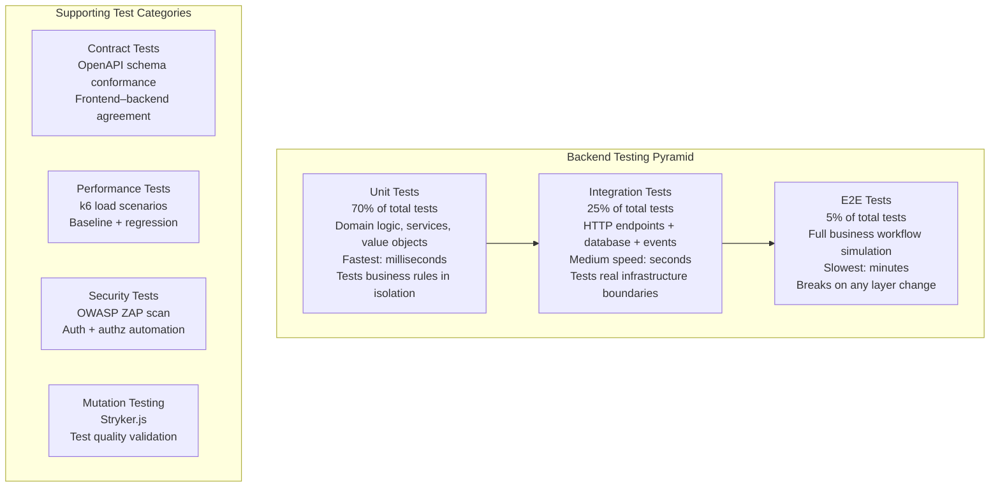
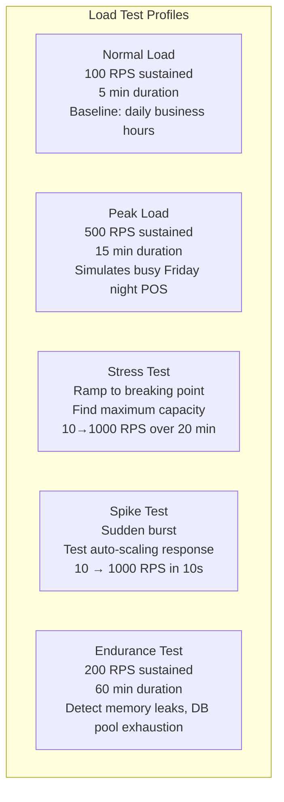
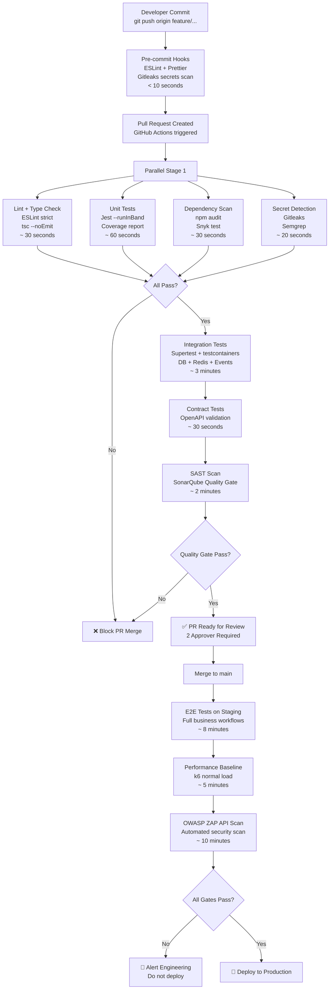
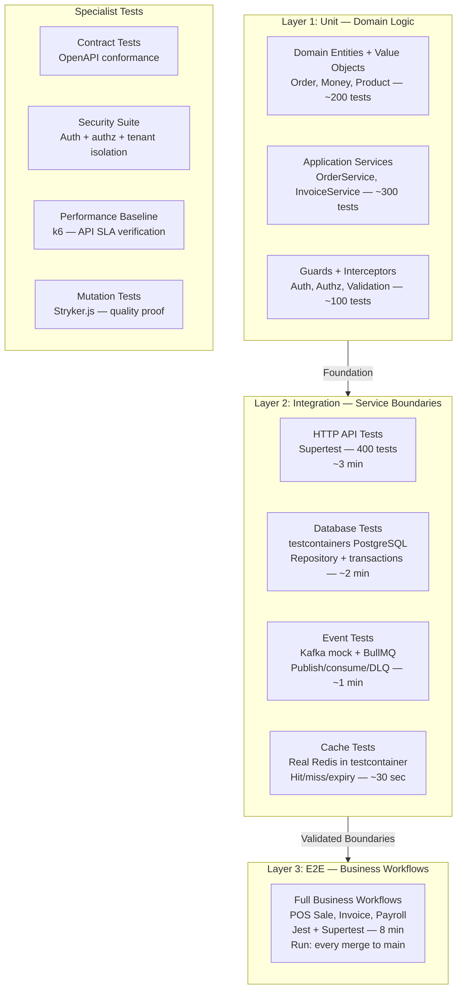
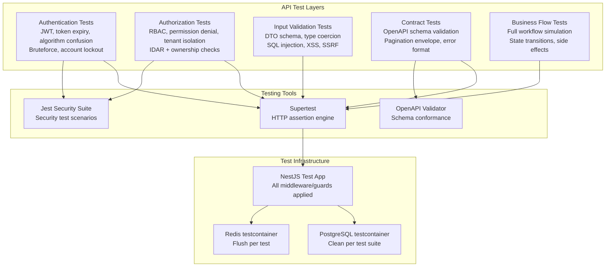
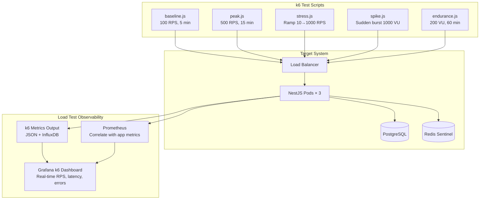
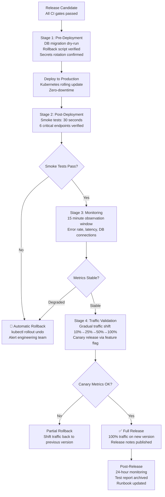

# BACKEND TESTING STRATEGY, QUALITY ENGINEERING & PRODUCTION VALIDATION

**Project Name:** Enterprise SaaS Business Management Platform  
**Document Version:** 1.0.0 — Baseline Standard  
**Date:** July 13, 2026  
**Authors:** Principal Backend QA Architect, Quality Engineering Lead, NestJS Testing Expert, Performance Engineer & Enterprise SaaS Reliability Architect  
**Classification:** Enterprise Internal — Unrestricted  
**Status:** 🏛️ APPROVED BACKEND TESTING STRATEGY & QUALITY ENGINEERING SPECIFICATION  

---

## SECTION 1 — BACKEND QUALITY FOUNDATION

### 1.1 Enterprise Quality Engineering Model

```
QUALITY ENGINEERING LIFECYCLE:
─────────────────────────────────────────────────────────────────────────
Code → Test → Validate → Monitor → Improve → (repeat)

STAGE 1 — CODE:
  Developer writes code following Clean Architecture + DDD
  ESLint + Prettier enforced via pre-commit hooks
  Code review required before merge (2 approvers for business logic)

STAGE 2 — TEST:
  Unit tests: domain logic, services, value objects (Jest)
  Integration tests: database, API endpoints (Supertest + testcontainers)
  Event tests: Kafka publish/consume, BullMQ job processing
  Security tests: authentication, authorization, tenant isolation

STAGE 3 — VALIDATE:
  API contract tests: OpenAPI schema conformance
  Performance baseline: API p99 < 200ms at standard load
  Security scan: OWASP ZAP automated API scan
  Load tests: 500 concurrent users sustained for 5 minutes

STAGE 4 — MONITOR:
  Production metrics: error rate, latency, DB query time, queue depth
  Security events: failed logins, permission denied, tenant bypass attempts
  Business metrics: order completion rate, payment success rate
  SLA monitoring: uptime, p99 response time

STAGE 5 — IMPROVE:
  Post-incident analysis: root cause identification
  Performance regression analysis: benchmark comparison
  Test gap identification: failing production scenarios added as tests
  Quality metrics review: coverage, mutation score, defect density
─────────────────────────────────────────────────────────────────────────
```

### 1.2 Enterprise Backend Quality Principles

| Principle | Description | Enforcement |
| :--- | :--- | :--- |
| **Test at the right level** | Unit tests for logic; integration tests for boundaries; E2E for business flows. Don't test implementation details. | Test pyramid adherence tracked in CI |
| **Fast feedback** | Unit tests must complete < 5s. Integration tests < 60s. Full suite < 10min. | CI timeout thresholds; test parallelization |
| **Tests as documentation** | Test names describe business behavior, not implementation. `it('rejects order completion when stock is insufficient')` | Code review enforces descriptive naming |
| **Deterministic tests** | No flaky tests. Tests must pass consistently. Flaky tests are removed or fixed immediately. | Zero flaky test tolerance; CI failure tracking |
| **Test isolation** | Each test runs independently. No shared state between tests. Database cleaned after each test. | `beforeEach` reset; testcontainers per suite |
| **Realistic data** | Test data reflects production shape. Not `name: 'test'`, but `name: 'Khmer Chicken Rice'`. | Factory pattern with realistic Faker.js data |
| **Security is tested** | Authentication, authorization, tenant isolation tested automatically on every PR. | Security test suite blocks merge on failure |
| **Performance is measured** | API latency, DB query time, and memory usage profiled on every staging deploy. | k6 baseline test in staging CI |

---

## SECTION 2 — BACKEND TESTING PYRAMID

### 2.1 Testing Pyramid Architecture



### 2.2 Test Distribution Targets

| Test Level | Count Target | Speed Target | Run In CI | Blocks PR Merge |
| :--- | :--- | :--- | :--- | :--- |
| **Unit tests** | > 600 tests | < 5 s total | Every commit | ✅ Yes |
| **Integration tests** | > 200 tests | < 90 s total | Every PR | ✅ Yes |
| **API E2E tests** | > 60 scenarios | < 5 min | Every merge to main | ✅ Yes |
| **Contract tests** | 1 per API resource | < 30 s | Every PR | ✅ Yes |
| **Security tests** | OWASP Top 10 coverage | < 10 min | Every staging deploy | ✅ Yes |
| **Performance baseline** | 5 core scenarios | < 5 min | Every staging deploy | ✅ On regression |
| **Load tests** | 3 load profiles | < 30 min | Pre-release | Manual review |

### 2.3 Test Technology Stack

| Test Category | Framework | Test Runner | Coverage |
| :--- | :--- | :--- | :--- |
| **Unit tests** | Jest + `@nestjs/testing` | Jest | Istanbul (c8) |
| **Integration tests** | Jest + Supertest + testcontainers | Jest | Istanbul (c8) |
| **API E2E** | Supertest + Jest scenarios | Jest | N/A |
| **Contract tests** | OpenAPI Jest Matcher | Jest | N/A |
| **Event tests** | Jest + in-memory Kafka mock | Jest | Istanbul |
| **Cache tests** | Jest + ioredis-mock | Jest | Istanbul |
| **Performance** | k6 | k6 cloud / local | k6 summary |
| **Load tests** | k6 + Grafana k6 Cloud | k6 | k6 trend |
| **Security tests** | OWASP ZAP + custom Jest suite | ZAP + Jest | ZAP report |
| **Mutation tests** | Stryker.js | Stryker | Mutation score |

---

## SECTION 3 — UNIT TESTING ARCHITECTURE

### 3.1 Unit Test Structure

```typescript
// jest.config.ts (root)
export default {
  moduleFileExtensions: ['js', 'json', 'ts'],
  rootDir: 'src',
  testRegex: '.*\\.spec\\.ts$',
  transform: { '^.+\\.(t|j)s$': 'ts-jest' },
  coverageDirectory: '../coverage',
  testEnvironment: 'node',
  collectCoverageFrom: [
    '**/*.(t|j)s',
    '!**/*.module.ts',
    '!**/main.ts',
    '!**/*.dto.ts',
    '!**/index.ts',
  ],
  coverageThresholds: {
    global: {
      branches:   80,   // Business rules: all branches must be tested
      functions:  85,
      lines:      85,
      statements: 85,
    },
    // Critical paths require higher coverage
    './src/modules/pos/domain/**': { branches: 95, lines: 95 },
    './src/modules/finance/domain/**': { branches: 95, lines: 95 },
  },
};
```

### 3.2 NestJS Service Unit Test Pattern

```typescript
// modules/pos/services/__tests__/order.service.spec.ts
describe('OrderService', () => {
  let service: OrderService;
  let orderRepo: jest.Mocked<OrderRepository>;
  let pricingService: jest.Mocked<PricingDomainService>;
  let inventoryService: jest.Mocked<StockAllocationDomainService>;
  let eventBus: jest.Mocked<EventBus>;
  let idempotencyService: jest.Mocked<IdempotencyService>;

  beforeEach(async () => {
    const module = await Test.createTestingModule({
      providers: [
        OrderService,
        { provide: OrderRepository,              useValue: createMock<OrderRepository>() },
        { provide: PricingDomainService,         useValue: createMock<PricingDomainService>() },
        { provide: StockAllocationDomainService, useValue: createMock<StockAllocationDomainService>() },
        { provide: EventBus,                     useValue: createMock<EventBus>() },
        { provide: IdempotencyService,           useValue: createMock<IdempotencyService>() },
        { provide: PrismaService,                useValue: createMock<PrismaService>() },
      ],
    }).compile();

    service           = module.get(OrderService);
    orderRepo         = module.get(OrderRepository);
    pricingService    = module.get(PricingDomainService);
    inventoryService  = module.get(StockAllocationDomainService);
    eventBus          = module.get(EventBus);
    idempotencyService= module.get(IdempotencyService);
  });

  describe('completeOrder()', () => {
    it('completes a valid DRAFT order and publishes OrderCompletedEvent', async () => {
      const order = buildMockOrder({ status: 'DRAFT', items: [buildMockOrderItem()] });
      orderRepo.findById.mockResolvedValue(order);
      pricingService.calculateOrderTotal.mockResolvedValue({ total: 25.50, tax: 1.50 });
      inventoryService.allocateStock.mockResolvedValue(undefined);
      idempotencyService.check.mockResolvedValue(null);

      const result = await service.completeOrder(
        order.id, order.tenantId, 'cashier-001', 'idem-key-001'
      );

      expect(result.status).toBe('COMPLETED');
      expect(eventBus.publishAll).toHaveBeenCalledWith(
        expect.arrayContaining([expect.objectContaining({ eventType: 'pos.order.completed' })])
      );
    });

    it('throws IDEMPOTENCY_DUPLICATE when same key processed twice', async () => {
      idempotencyService.check.mockResolvedValue({ status: 'DONE', result: existingOrder });

      await expect(
        service.completeOrder('order-1', 'tenant-1', 'cashier-1', 'existing-key')
      ).rejects.toThrow(IdempotencyDuplicateException);

      expect(orderRepo.findById).not.toHaveBeenCalled();
    });

    it('throws INVALID_ORDER_STATUS when order is not in DRAFT status', async () => {
      const completedOrder = buildMockOrder({ status: 'COMPLETED' });
      orderRepo.findById.mockResolvedValue(completedOrder);
      idempotencyService.check.mockResolvedValue(null);

      await expect(
        service.completeOrder(completedOrder.id, 'tenant-1', 'cashier-1', 'new-key')
      ).rejects.toThrow(InvalidOrderStatusException);
    });

    it('throws INSUFFICIENT_STOCK when stock allocation fails', async () => {
      const order = buildMockOrder({ status: 'DRAFT' });
      orderRepo.findById.mockResolvedValue(order);
      idempotencyService.check.mockResolvedValue(null);
      inventoryService.allocateStock.mockRejectedValue(new InsufficientStockException('product-1', 5, 3));

      await expect(
        service.completeOrder(order.id, 'tenant-1', 'cashier-1', 'new-key')
      ).rejects.toThrow(InsufficientStockException);

      expect(eventBus.publishAll).not.toHaveBeenCalled();
    });

    it('does NOT publish events when transaction fails', async () => {
      const order = buildMockOrder({ status: 'DRAFT' });
      orderRepo.findById.mockResolvedValue(order);
      idempotencyService.check.mockResolvedValue(null);
      orderRepo.save.mockRejectedValue(new Error('DB connection lost'));

      await expect(
        service.completeOrder(order.id, 'tenant-1', 'cashier-1', 'new-key')
      ).rejects.toThrow();

      expect(eventBus.publishAll).not.toHaveBeenCalled();
    });
  });
});
```

---

## SECTION 4 — DOMAIN LOGIC TESTING

### 4.1 Domain Entity Tests

```typescript
// modules/pos/domain/__tests__/order.entity.spec.ts
describe('Order (Domain Entity)', () => {
  describe('complete()', () => {
    it('transitions from DRAFT to COMPLETED and records domain event', () => {
      const order = Order.create({
        tenantId: 'tenant-001', branchId: 'branch-001', cashierId: 'cashier-001',
        items: [OrderItem.create({ productId: 'p1', quantity: 2, unitPrice: 12.50, lineTotal: 25.00 })],
      });

      order.complete({ totalAmount: 25.00, paymentMethod: 'CASH' });

      expect(order.status).toBe('COMPLETED');
      expect(order.completedAt).toBeInstanceOf(Date);
      const events = order.pullDomainEvents();
      expect(events).toHaveLength(1);
      expect(events[0]).toBeInstanceOf(OrderCompletedEvent);
      expect((events[0] as OrderCompletedEvent).totalAmount).toBe(25.00);
    });

    it('throws InvalidOrderStatusException when completing a non-DRAFT order', () => {
      const order = buildCompletedOrder();
      expect(() => order.complete({ totalAmount: 25.00, paymentMethod: 'CASH' }))
        .toThrow(InvalidOrderStatusException);
    });

    it('throws EmptyOrderException when order has no items', () => {
      const emptyOrder = Order.create({ tenantId: 'tenant-1', branchId: 'branch-1', cashierId: 'c1', items: [] });
      expect(() => emptyOrder.complete({ totalAmount: 0, paymentMethod: 'CASH' }))
        .toThrow(EmptyOrderException);
    });

    it('pullDomainEvents() clears events after retrieval (prevents double publish)', () => {
      const order = buildDraftOrderWithItems();
      order.complete({ totalAmount: 25.00, paymentMethod: 'CASH' });

      const firstPull = order.pullDomainEvents();
      const secondPull = order.pullDomainEvents();

      expect(firstPull).toHaveLength(1);
      expect(secondPull).toHaveLength(0);  // Events consumed; not replayed
    });
  });

  describe('void()', () => {
    it('transitions COMPLETED order to VOIDED with reason and event', () => {
      const order = buildCompletedOrder();
      order.void('cashier-manager-001', 'Customer requested cancellation');

      expect(order.status).toBe('VOIDED');
      expect(order.voidedBy).toBe('cashier-manager-001');
      expect(order.voidReason).toBe('Customer requested cancellation');
      const [event] = order.pullDomainEvents();
      expect(event).toBeInstanceOf(OrderVoidedEvent);
    });

    it('throws VoidNotAllowedException when order was completed more than 24 hours ago', () => {
      const oldOrder = buildCompletedOrder({ completedAt: daysAgo(2) });
      expect(() => oldOrder.void('manager-001', 'reason'))
        .toThrow(VoidNotAllowedException);
    });
  });

  describe('addItem()', () => {
    it('adds item and recalculates order subtotal', () => {
      const order = buildDraftOrder();
      order.addItem(OrderItem.create({ productId: 'p1', quantity: 3, unitPrice: 10.00, lineTotal: 30.00 }));
      order.addItem(OrderItem.create({ productId: 'p2', quantity: 1, unitPrice: 15.00, lineTotal: 15.00 }));

      expect(order.items).toHaveLength(2);
      expect(order.subtotal).toBe(45.00);
    });

    it('merges duplicate product into existing item (increases quantity)', () => {
      const order = buildDraftOrder();
      order.addItem(OrderItem.create({ productId: 'p1', quantity: 2, unitPrice: 10.00, lineTotal: 20.00 }));
      order.addItem(OrderItem.create({ productId: 'p1', quantity: 3, unitPrice: 10.00, lineTotal: 30.00 }));

      expect(order.items).toHaveLength(1);
      expect(order.items[0].quantity).toBe(5);
    });
  });
});
```

### 4.2 Value Object Tests

```typescript
// modules/finance/domain/__tests__/money.value-object.spec.ts
describe('Money (Value Object)', () => {
  it('creates valid Money with amount and currency', () => {
    const money = Money.of(25.50, 'USD');
    expect(money.amount).toBe(25.50);
    expect(money.currency).toBe('USD');
  });

  it('throws for negative amount', () => {
    expect(() => Money.of(-1, 'USD')).toThrow(InvalidMoneyException);
  });

  it('throws for unsupported currency', () => {
    expect(() => Money.of(10, 'XYZ')).toThrow(UnsupportedCurrencyException);
  });

  it('adds two Money values of the same currency', () => {
    const result = Money.of(10.00, 'USD').add(Money.of(5.50, 'USD'));
    expect(result.amount).toBe(15.50);
  });

  it('throws when adding Money of different currencies', () => {
    expect(() => Money.of(10, 'USD').add(Money.of(5, 'EUR')))
      .toThrow(CurrencyMismatchException);
  });

  it('rounds to 2 decimal places using banker rounding', () => {
    const result = Money.of(10.005, 'USD');
    expect(result.amount).toBe(10.01);  // Not 10.00 (banker rounding)
  });

  it('equality: two Money objects with same amount and currency are equal', () => {
    expect(Money.of(25.00, 'USD').equals(Money.of(25.00, 'USD'))).toBe(true);
    expect(Money.of(25.00, 'USD').equals(Money.of(25.01, 'USD'))).toBe(false);
  });
});
```

### 4.3 Business Rule Tests

```typescript
// modules/pos/domain/__tests__/discount-rule.spec.ts
describe('DiscountRule', () => {
  const rule = new DiscountRule();

  it('allows discount within loyalty member limit (30%)', () => {
    const context = { isLoyaltyMember: true, discountPercent: 29, isDiscountable: true };
    expect(rule.isSatisfiedBy(context)).toBe(true);
  });

  it('rejects discount exceeding loyalty member limit', () => {
    const context = { isLoyaltyMember: true, discountPercent: 31, isDiscountable: true };
    expect(rule.isSatisfiedBy(context)).toBe(false);
    expect(rule.brokenRuleMessage).toBe('Loyalty member discount cannot exceed 30%');
  });

  it('rejects any discount on non-discountable products', () => {
    const context = { isLoyaltyMember: true, discountPercent: 5, isDiscountable: false };
    expect(rule.isSatisfiedBy(context)).toBe(false);
    expect(rule.brokenRuleMessage).toBe('Product is marked as non-discountable');
  });

  it('allows 0% discount for non-members (no rule violation)', () => {
    const context = { isLoyaltyMember: false, discountPercent: 0, isDiscountable: true };
    expect(rule.isSatisfiedBy(context)).toBe(true);
  });
});
```

---

## SECTION 5 — APPLICATION SERVICE TESTING

### 5.1 Use Case Tests with Mock Dependencies

```typescript
// modules/finance/services/__tests__/invoice.service.spec.ts
describe('InvoiceService — generateFromOrder()', () => {
  let service: InvoiceService;
  let invoiceRepo: jest.Mocked<InvoiceRepository>;
  let customerRepo: jest.Mocked<CustomerRepository>;
  let pdfQueue: jest.Mocked<Queue>;

  beforeEach(async () => {
    const module = await Test.createTestingModule({
      providers: [
        InvoiceService,
        { provide: InvoiceRepository, useValue: createMock<InvoiceRepository>() },
        { provide: CustomerRepository, useValue: createMock<CustomerRepository>() },
        { provide: getQueueToken('medium'), useValue: createMock<Queue>() },
        { provide: EventBus, useValue: createMock<EventBus>() },
      ],
    }).compile();

    service      = module.get(InvoiceService);
    invoiceRepo  = module.get(InvoiceRepository);
    customerRepo = module.get(CustomerRepository);
    pdfQueue     = module.get(getQueueToken('medium'));
  });

  it('generates invoice from completed order with customer details', async () => {
    const order   = buildCompletedOrder({ customerId: 'cust-001', totalAmount: 55.50 });
    const customer = buildMockCustomer({ id: 'cust-001', name: 'Dara Soeun' });
    customerRepo.findById.mockResolvedValue(customer);
    invoiceRepo.create.mockResolvedValue(buildMockInvoice());

    await service.generateFromOrder(order, 'tenant-001');

    expect(invoiceRepo.create).toHaveBeenCalledWith(
      expect.objectContaining({
        customerId: 'cust-001',
        totalAmount: 55.50,
        status: 'ISSUED',
      })
    );
    expect(pdfQueue.add).toHaveBeenCalledWith(
      'invoice:generate',
      expect.objectContaining({ invoiceId: expect.any(String) })
    );
  });

  it('generates walk-in invoice (no customer) for anonymous orders', async () => {
    const order = buildCompletedOrder({ customerId: null, totalAmount: 12.00 });

    await service.generateFromOrder(order, 'tenant-001');

    expect(customerRepo.findById).not.toHaveBeenCalled();
    expect(invoiceRepo.create).toHaveBeenCalledWith(
      expect.objectContaining({ customerId: null, customerName: 'Walk-in Customer' })
    );
  });

  it('marks invoice as OVERDUE when due date is in the past', async () => {
    const pastDueInvoice = buildMockInvoice({ dueDate: daysAgo(5), status: 'ISSUED' });
    invoiceRepo.findOverdue.mockResolvedValue([pastDueInvoice]);
    invoiceRepo.updateStatus.mockResolvedValue(undefined);

    await service.processOverdueInvoices('tenant-001');

    expect(invoiceRepo.updateStatus).toHaveBeenCalledWith(pastDueInvoice.id, 'OVERDUE');
  });
});
```

---

## SECTION 6 — API INTEGRATION TESTING

### 6.1 Supertest Integration Test Pattern

```typescript
// modules/pos/controllers/__tests__/order.controller.integration.spec.ts
describe('Order API Integration Tests', () => {
  let app: INestApplication;
  let prisma: PrismaService;
  let authToken: string;
  let tenantId: string;

  beforeAll(async () => {
    // Spin up real NestJS app with testcontainers PostgreSQL + Redis
    const moduleRef = await Test.createTestingModule({
      imports: [AppModule],
    })
    .overrideProvider(ConfigService)
    .useValue(testConfigService)  // Points to testcontainers DB
    .compile();

    app = moduleRef.createNestApplication();
    applyGlobalConfig(app);  // Same middleware/guards as production
    await app.init();

    prisma = moduleRef.get(PrismaService);
    await seedTestData(prisma);  // Load tenant, users, products

    const { body } = await request(app.getHttpServer())
      .post('/api/v1/auth/login')
      .send({ email: 'cashier@test.com', password: 'Test@12345', tenantSlug: 'test-tenant' });

    authToken = body.data.accessToken;
    tenantId = body.data.user.tenantId;
  });

  afterAll(async () => {
    await prisma.cleanDatabase();
    await app.close();
  });

  describe('POST /api/v1/orders', () => {
    it('creates a DRAFT order with valid items', async () => {
      const response = await request(app.getHttpServer())
        .post('/api/v1/orders')
        .set('Authorization', `Bearer ${authToken}`)
        .set('X-Tenant-ID', tenantId)
        .send({
          branchId: testBranchId,
          items: [{ productId: testProductId, quantity: 2 }],
          idempotencyKey: generateId(),
        })
        .expect(201);

      expect(response.body.data.status).toBe('DRAFT');
      expect(response.body.data.items).toHaveLength(1);
      expect(response.body.data.items[0].quantity).toBe(2);
    });

    it('returns 400 when items array is empty', async () => {
      const response = await request(app.getHttpServer())
        .post('/api/v1/orders')
        .set('Authorization', `Bearer ${authToken}`)
        .set('X-Tenant-ID', tenantId)
        .send({ branchId: testBranchId, items: [], idempotencyKey: generateId() })
        .expect(400);

      expect(response.body.message).toContain('items must not be empty');
    });

    it('returns 401 without authentication token', async () => {
      await request(app.getHttpServer())
        .post('/api/v1/orders')
        .set('X-Tenant-ID', tenantId)
        .send({ branchId: testBranchId, items: [], idempotencyKey: generateId() })
        .expect(401);
    });

    it('returns 403 when user lacks orders.create permission', async () => {
      const viewerToken = await getTokenForRole(app, 'VIEWER');
      await request(app.getHttpServer())
        .post('/api/v1/orders')
        .set('Authorization', `Bearer ${viewerToken}`)
        .set('X-Tenant-ID', tenantId)
        .send({ branchId: testBranchId, items: [{ productId: testProductId, quantity: 1 }] })
        .expect(403);
    });

    it('is idempotent: same idempotencyKey returns same order', async () => {
      const key = generateId();
      const payload = { branchId: testBranchId, items: [{ productId: testProductId, quantity: 1 }], idempotencyKey: key };

      const first  = await request(app.getHttpServer()).post('/api/v1/orders')
        .set('Authorization', `Bearer ${authToken}`).set('X-Tenant-ID', tenantId)
        .send(payload).expect(201);

      const second = await request(app.getHttpServer()).post('/api/v1/orders')
        .set('Authorization', `Bearer ${authToken}`).set('X-Tenant-ID', tenantId)
        .send(payload).expect(200);  // Idempotent: 200 (not 201 on repeat)

      expect(first.body.data.id).toBe(second.body.data.id);
    });
  });

  describe('POST /api/v1/orders/:id/complete', () => {
    it('completes a DRAFT order and deducts stock', async () => {
      const stockBefore = await getProductStock(prisma, testProductId, tenantId);
      const order = await createDraftOrder(app, authToken, tenantId);

      await request(app.getHttpServer())
        .post(`/api/v1/orders/${order.id}/complete`)
        .set('Authorization', `Bearer ${authToken}`)
        .set('X-Tenant-ID', tenantId)
        .send({ payment: { method: 'CASH', amount: order.totalAmount }, idempotencyKey: generateId() })
        .expect(200);

      const stockAfter = await getProductStock(prisma, testProductId, tenantId);
      expect(stockAfter).toBe(stockBefore - 1);  // Stock deducted
    });
  });
});
```

### 6.2 API Response Contract Validation

```typescript
// common/testing/contract-validator.ts
// Validates every API response matches OpenAPI schema definition

import { validate } from 'openapi-response-validator';
import openApiDoc from '../../openapi.json';

export function validateResponseSchema(
  path: string, method: string, statusCode: number, body: unknown
): void {
  const errors = validate({ path, method, statusCode, body }, openApiDoc);
  if (errors.length > 0) {
    throw new Error(
      `API contract violation for ${method.toUpperCase()} ${path} → ${statusCode}:\n` +
      errors.map(e => `  - ${e.path}: ${e.message}`).join('\n')
    );
  }
}

// Usage in integration tests:
it('GET /api/v1/products conforms to OpenAPI contract', async () => {
  const response = await request(app.getHttpServer())
    .get('/api/v1/products')
    .set('Authorization', `Bearer ${authToken}`)
    .set('X-Tenant-ID', tenantId)
    .expect(200);

  validateResponseSchema('/api/v1/products', 'get', 200, response.body);
});
```

---

## SECTION 7 — DATABASE TESTING

### 7.1 Testcontainers Database Setup

```typescript
// test/setup/database.setup.ts — Real PostgreSQL via testcontainers
import { PostgreSqlContainer, StartedPostgreSqlContainer } from '@testcontainers/postgresql';

let container: StartedPostgreSqlContainer;

export async function startTestDatabase(): Promise<string> {
  container = await new PostgreSqlContainer('postgres:16-alpine')
    .withDatabase('saas_test')
    .withUsername('test_user')
    .withPassword('test_pass')
    .withExposedPorts(5432)
    .start();

  const connectionString = container.getConnectionUri();

  // Run migrations on fresh test database
  const prisma = new PrismaClient({ datasources: { db: { url: connectionString } } });
  await prisma.$executeRaw`CREATE EXTENSION IF NOT EXISTS "pgcrypto"`;
  await execSync(`npx prisma migrate deploy`, { env: { ...process.env, DATABASE_URL: connectionString } });
  await prisma.$disconnect();

  return connectionString;
}

export async function stopTestDatabase(): Promise<void> {
  await container?.stop();
}
```

### 7.2 Repository Integration Tests

```typescript
// modules/pos/repositories/__tests__/order.repository.spec.ts
describe('OrderRepository (Integration)', () => {
  let repo: OrderRepository;
  let prisma: PrismaService;

  beforeAll(async () => {
    const dbUrl = await startTestDatabase();
    // Initialize module with real Prisma pointed at testcontainers DB
    const module = await Test.createTestingModule({
      imports: [DatabaseModule.forRoot(dbUrl)],
      providers: [OrderRepository],
    }).compile();

    repo = module.get(OrderRepository);
    prisma = module.get(PrismaService);
    await seedMinimalTestData(prisma);  // Tenant, branch, product
  });

  afterEach(async () => {
    await prisma.order.deleteMany();  // Clean orders between tests
  });

  it('saves and retrieves an order with items and tenant isolation', async () => {
    const order = Order.create({ tenantId: testTenantId, branchId: testBranchId, cashierId: 'c1',
      items: [OrderItem.create({ productId: testProductId, quantity: 2, unitPrice: 12.50, lineTotal: 25.00 })] });

    const saved = await repo.save(order);
    const found = await repo.findById(saved.id, testTenantId);

    expect(found).not.toBeNull();
    expect(found!.items).toHaveLength(1);
    expect(found!.items[0].quantity).toBe(2);
    expect(found!.tenantId).toBe(testTenantId);
  });

  it('returns null when querying order from different tenant (RLS enforcement)', async () => {
    const order = await createTestOrder(repo, testTenantId);

    // Query with different tenant ID — RLS should hide the row
    const result = await repo.findById(order.id, 'different-tenant-id');

    expect(result).toBeNull();  // Not 403 — just empty result (tenant isolation)
  });

  it('findByBranch() paginates correctly', async () => {
    // Create 15 orders
    await Promise.all(Array.from({ length: 15 }, () => createTestOrder(repo, testTenantId)));

    const page1 = await repo.findByBranch(testTenantId, testBranchId, { page: 1, limit: 10 });
    const page2 = await repo.findByBranch(testTenantId, testBranchId, { page: 2, limit: 10 });

    expect(page1.data).toHaveLength(10);
    expect(page2.data).toHaveLength(5);
    expect(page1.meta.total).toBe(15);
  });

  it('transaction rollback: order + stock deduction atomic', async () => {
    const stockBefore = await getTestProductStock(prisma, testProductId);

    // Simulate transaction that fails mid-way
    try {
      await prisma.$transaction(async (tx) => {
        await repo.save(order, tx);
        throw new Error('Simulated failure after order save');
      });
    } catch { /* expected */ }

    // Verify both order AND stock were rolled back
    const orders = await repo.findByBranch(testTenantId, testBranchId, { page: 1, limit: 100 });
    const stockAfter = await getTestProductStock(prisma, testProductId);

    expect(orders.data).toHaveLength(0);
    expect(stockAfter).toBe(stockBefore);  // Stock unchanged — rollback worked
  });
});
```

---

## SECTION 8 — EVENT & MESSAGE TESTING

### 8.1 Kafka Event Testing with In-Memory Mock

```typescript
// modules/pos/handlers/__tests__/order-completed.handler.integration.spec.ts
describe('OrderCompletedHandler (Event Integration)', () => {
  let handler: OrderCompletedHandler;
  let kafkaProducer: jest.Mocked<KafkaProducerService>;
  let wsGateway: jest.Mocked<RealtimeGateway>;
  let eventLogRepo: jest.Mocked<EventLogRepository>;
  let redis: Redis;

  beforeEach(async () => {
    redis = new Redis(testRedisUrl);
    const module = await Test.createTestingModule({
      providers: [
        OrderCompletedHandler,
        { provide: KafkaProducerService, useValue: createMock<KafkaProducerService>() },
        { provide: RealtimeGateway,      useValue: createMock<RealtimeGateway>() },
        { provide: EventLogRepository,   useValue: createMock<EventLogRepository>() },
      ],
    }).compile();

    handler       = module.get(OrderCompletedHandler);
    kafkaProducer = module.get(KafkaProducerService);
    wsGateway     = module.get(RealtimeGateway);
    eventLogRepo  = module.get(EventLogRepository);
  });

  afterEach(async () => {
    await redis.flushdb();
    await redis.quit();
  });

  it('persists event to log, publishes to Kafka, and broadcasts to WebSocket', async () => {
    const event = new OrderCompletedEvent('order-1', 'tenant-1', 'branch-1', 'cashier-1',
      null, 25.50, 'USD', 'CASH', [{ productId: 'p1', quantity: 1, lineTotal: 25.50 }]);

    await handler.handle(event);

    expect(eventLogRepo.append).toHaveBeenCalledWith(event);
    expect(kafkaProducer.publish).toHaveBeenCalledWith('pos.order.completed', event);
    expect(wsGateway.broadcastOrderCompleted).toHaveBeenCalledWith(
      'tenant-1', 'branch-1', expect.objectContaining({ orderId: 'order-1' })
    );
  });

  it('idempotency: skips processing for duplicate event ID (consumer group)', async () => {
    const consumer = new IdempotentOrderConsumer(redis, createMock());
    const event = buildMockKafkaMessage('duplicate-event-id-001');

    await consumer.processMessage(event, 'pos.order.completed');
    await consumer.processMessage(event, 'pos.order.completed');  // Duplicate

    expect(consumer.processUniqueEventSpy).toHaveBeenCalledTimes(1);  // Only once
  });
});
```

### 8.2 BullMQ Job Tests

```typescript
// modules/jobs/workers/__tests__/receipt.worker.spec.ts
describe('ReceiptGenerationWorker', () => {
  let worker: ReceiptGenerationWorker;
  let s3Service: jest.Mocked<S3Service>;
  let reportRepo: jest.Mocked<ReportRepository>;

  it('generates PDF receipt, uploads to S3, and updates job progress', async () => {
    const job = buildMockJob({
      data: { orderId: 'order-001', tenantId: 'tenant-001' },
    });

    s3Service.upload.mockResolvedValue('https://s3.amazonaws.com/receipts/order-001.pdf');
    reportRepo.setCompleted.mockResolvedValue(undefined);

    await worker.handle(job);

    expect(s3Service.upload).toHaveBeenCalledWith(
      expect.stringContaining('order-001'), expect.any(Buffer)
    );
    expect(reportRepo.setCompleted).toHaveBeenCalledWith(
      'order-001', 'https://s3.amazonaws.com/receipts/order-001.pdf'
    );
    expect(job.updateProgress).toHaveBeenLastCalledWith(100);
  });

  it('sends failed job to DLQ after max retry exceeded', async () => {
    const job = buildMockJob({ attemptsMade: 4, opts: { attempts: 5 } });
    s3Service.upload.mockRejectedValue(new Error('S3 unavailable'));

    // After max attempts: BullMQ moves to failed; worker calls DLQ handler
    await expect(worker.handle(job)).rejects.toThrow('S3 unavailable');
    // In production, BullMQ automatically moves to failed queue after 5 attempts
  });
});
```

---

## SECTION 9 — CACHE TESTING

### 9.1 Cache Behavior Tests

```typescript
// common/cache/__tests__/cache.service.spec.ts
describe('CacheService', () => {
  let cacheService: CacheService;
  let redis: Redis;

  beforeAll(async () => {
    redis = new Redis(testRedisUrl);
    cacheService = new CacheService(redis, createMock<CacheMetricsService>());
  });

  afterEach(async () => { await redis.flushdb(); });
  afterAll(async () => { await redis.quit(); });

  describe('get() and set()', () => {
    it('returns null on cache miss', async () => {
      const result = await cacheService.get<string>('missing-key');
      expect(result).toBeNull();
    });

    it('returns cached value on cache hit', async () => {
      await cacheService.set('test-key', { name: 'Dara', role: 'CASHIER' }, 60);
      const result = await cacheService.get<{ name: string; role: string }>('test-key');
      expect(result).toEqual({ name: 'Dara', role: 'CASHIER' });
    });

    it('expires cache after TTL', async () => {
      await cacheService.set('expiring-key', 'value', 1);  // 1 second TTL
      await sleep(1100);  // Wait for expiry
      const result = await cacheService.get<string>('expiring-key');
      expect(result).toBeNull();
    });

    it('throws when TTL is zero or negative', async () => {
      await expect(cacheService.set('k', 'v', 0)).rejects.toThrow('Cache TTL must be positive');
      await expect(cacheService.set('k', 'v', -5)).rejects.toThrow('Cache TTL must be positive');
    });
  });

  describe('getOrSet()', () => {
    it('calls factory only once on cache miss, not on subsequent hits', async () => {
      const factory = jest.fn().mockResolvedValue({ data: 'expensive-result' });

      await cacheService.getOrSet('compute-key', factory, 60);
      await cacheService.getOrSet('compute-key', factory, 60);
      await cacheService.getOrSet('compute-key', factory, 60);

      expect(factory).toHaveBeenCalledTimes(1);
    });
  });

  describe('Redis failure graceful degradation', () => {
    it('returns null (treats as cache miss) when Redis is unavailable', async () => {
      const brokenRedis = { get: jest.fn().mockRejectedValue(new Error('ECONNREFUSED')) } as any;
      const degradedCache = new CacheService(brokenRedis, createMock<CacheMetricsService>());

      const result = await degradedCache.get<string>('any-key');
      expect(result).toBeNull();  // Graceful degradation; does not throw
    });

    it('does not throw when SET fails on unavailable Redis', async () => {
      const brokenRedis = { setex: jest.fn().mockRejectedValue(new Error('ECONNREFUSED')) } as any;
      const degradedCache = new CacheService(brokenRedis, createMock<CacheMetricsService>());

      await expect(degradedCache.set('any-key', 'val', 60)).resolves.not.toThrow();
    });
  });

  describe('delByPattern()', () => {
    it('deletes all keys matching pattern using SCAN (not KEYS)', async () => {
      await Promise.all([
        redis.setex('tenant:abc:product:1', 60, 'v1'),
        redis.setex('tenant:abc:product:2', 60, 'v2'),
        redis.setex('tenant:abc:user:1', 60, 'v3'),  // Should NOT be deleted
      ]);

      const deleted = await cacheService.delByPattern('tenant:abc:product:*');

      expect(deleted).toBe(2);
      expect(await redis.exists('tenant:abc:user:1')).toBe(1);  // User key preserved
    });
  });
});
```

---

## SECTION 10 — SECURITY TESTING

### 10.1 Authentication Security Tests

```typescript
// security/tests/__tests__/authentication.security.spec.ts
describe('Authentication Security Tests', () => {
  describe('JWT Security', () => {
    it('rejects algorithm confusion: HS256 token against RS256-configured API', async () => {
      const confusedToken = jwt.sign({ userId: 'attacker', tenantId: 'any' }, 'random-secret', { algorithm: 'HS256' });
      await request(app.getHttpServer())
        .get('/api/v1/products')
        .set('Authorization', `Bearer ${confusedToken}`)
        .expect(401);
    });

    it('rejects tampered JWT payload (signature invalidated)', async () => {
      const [header, , signature] = validToken.split('.');
      const tamperedPayload = Buffer.from(JSON.stringify({ userId: 'attacker', role: 'SUPER_ADMIN' })).toString('base64url');
      const tamperedToken = `${header}.${tamperedPayload}.${signature}`;
      await request(app.getHttpServer())
        .get('/api/v1/products')
        .set('Authorization', `Bearer ${tamperedToken}`)
        .expect(401);
    });

    it('rejects expired access token even within 1 second of expiry', async () => {
      const expiredToken = jwt.sign({ userId: validUserId }, privateKey, { algorithm: 'RS256', expiresIn: '-1ms' });
      await request(app.getHttpServer())
        .get('/api/v1/products')
        .set('Authorization', `Bearer ${expiredToken}`)
        .expect(401);
    });
  });

  describe('Tenant Isolation Security', () => {
    it('cannot access Tenant B order using Tenant A credentials', async () => {
      const tenantBOrder = await createOrderForTenant(tenantBId);
      await request(app.getHttpServer())
        .get(`/api/v1/orders/${tenantBOrder.id}`)
        .set('Authorization', `Bearer ${tenantAToken}`)
        .set('X-Tenant-ID', tenantAId)
        .expect(404);  // RLS hides row; no 200 or 403
    });

    it('rejects mismatched X-Tenant-ID header vs JWT tenant claim', async () => {
      await request(app.getHttpServer())
        .get('/api/v1/products')
        .set('Authorization', `Bearer ${tenantAToken}`)
        .set('X-Tenant-ID', tenantBId)  // Mismatch!
        .expect(401);
    });
  });

  describe('Injection Prevention', () => {
    it('treats SQL injection in query params as literal search string', async () => {
      const response = await request(app.getHttpServer())
        .get("/api/v1/products?search='; DROP TABLE products; --")
        .set('Authorization', `Bearer ${validToken}`)
        .set('X-Tenant-ID', validTenantId)
        .expect(200);
      expect(response.body.data).toBeInstanceOf(Array);  // Not an error; safe
    });

    it('strips HTML tags from string inputs (XSS prevention)', async () => {
      const response = await request(app.getHttpServer())
        .post('/api/v1/products')
        .set('Authorization', `Bearer ${managerToken}`)
        .set('X-Tenant-ID', validTenantId)
        .send({ name: '<script>alert("xss")</script>Chicken Rice', price: 5.00, categoryId: validCategoryId })
        .expect(201);
      expect(response.body.data.name).toBe('Chicken Rice');  // HTML stripped
    });
  });

  describe('Rate Limiting', () => {
    it('rate limits login to 5 attempts per 15 minutes per email', async () => {
      for (let i = 0; i < 5; i++) {
        await request(app.getHttpServer())
          .post('/api/v1/auth/login')
          .send({ email: 'target@test.com', password: 'wrong-password', tenantSlug: 'test' });
      }
      const response = await request(app.getHttpServer())
        .post('/api/v1/auth/login')
        .send({ email: 'target@test.com', password: 'wrong-password', tenantSlug: 'test' })
        .expect(429);

      expect(response.headers['retry-after']).toBeDefined();
    });
  });
});
```

---

## SECTION 11 — PERFORMANCE TESTING

### 11.1 k6 API Performance Baseline

```javascript
// performance/scripts/api-baseline.js
import http from 'k6/http';
import { check, sleep } from 'k6';
import { Counter, Rate, Trend } from 'k6/metrics';

const errorRate     = new Rate('error_rate');
const orderLatency  = new Trend('order_completion_latency');
const dashLatency   = new Trend('dashboard_latency');
const productLatency = new Trend('product_list_latency');

export const options = {
  scenarios: {
    // Scenario 1: Baseline — steady load at expected normal traffic
    baseline: {
      executor: 'constant-arrival-rate',
      rate: 100,              // 100 requests per second
      timeUnit: '1s',
      duration: '5m',
      preAllocatedVUs: 50,
      maxVUs: 200,
    },
  },
  thresholds: {
    // SLA definitions — test fails if these are violated
    http_req_duration:        ['p(50) < 50', 'p(95) < 200', 'p(99) < 500'],
    http_req_failed:          ['rate < 0.001'],   // < 0.1% error rate
    error_rate:               ['rate < 0.001'],
    order_completion_latency: ['p(95) < 300', 'p(99) < 800'],
    dashboard_latency:        ['p(95) < 100', 'p(99) < 200'],  // Cached: should be fast
    product_list_latency:     ['p(95) < 150', 'p(99) < 300'],
  },
};

export function setup() {
  const loginRes = http.post(`${BASE_URL}/auth/login`, JSON.stringify({
    email: 'loadtest@example.com', password: 'Test@12345', tenantSlug: 'load-test-tenant',
  }), { headers: { 'Content-Type': 'application/json' } });

  return { token: loginRes.json('data.accessToken'), tenantId: loginRes.json('data.user.tenantId') };
}

export default function (data) {
  const headers = {
    'Authorization': `Bearer ${data.token}`,
    'X-Tenant-ID': data.tenantId,
    'Content-Type': 'application/json',
  };

  // Test 1: Dashboard (cached after first hit)
  const dashStart = Date.now();
  const dashRes = http.get(`${BASE_URL}/analytics/dashboard?branchId=${BRANCH_ID}&date=${TODAY}`, { headers });
  dashLatency.add(Date.now() - dashStart);
  check(dashRes, { 'dashboard status 200': r => r.status === 200 });
  errorRate.add(dashRes.status !== 200);

  sleep(0.1);

  // Test 2: Product list
  const prodStart = Date.now();
  const prodRes = http.get(`${BASE_URL}/products?page=1&limit=20`, { headers });
  productLatency.add(Date.now() - prodStart);
  check(prodRes, { 'products status 200': r => r.status === 200 });

  sleep(0.1);

  // Test 3: Order completion (complex DB transaction)
  const orderStart = Date.now();
  const createRes = http.post(`${BASE_URL}/orders`, JSON.stringify({
    branchId: BRANCH_ID,
    items: [{ productId: TEST_PRODUCT_ID, quantity: 1 }],
    idempotencyKey: `k6-${Date.now()}-${Math.random()}`,
  }), { headers });

  if (createRes.status === 201) {
    const orderId = createRes.json('data.id');
    const completeRes = http.post(`${BASE_URL}/orders/${orderId}/complete`, JSON.stringify({
      payment: { method: 'CASH', amount: 25.00 },
      idempotencyKey: `k6-complete-${orderId}`,
    }), { headers });
    orderLatency.add(Date.now() - orderStart);
    check(completeRes, { 'order completed': r => r.status === 200 });
    errorRate.add(completeRes.status !== 200);
  }
}
```

### 11.2 Database Query Performance Tests

```typescript
// performance/tests/database-performance.spec.ts
describe('Database Query Performance', () => {
  it('sales report query completes in < 500ms for 1 month of data', async () => {
    await seedLargeDataset(prisma, { orders: 10_000, products: 500 });

    const start = Date.now();
    await analyticsService.getDailySalesReport(testTenantId, testBranchId, '2026-06-01', '2026-06-30');
    const duration = Date.now() - start;

    expect(duration).toBeLessThan(500);
  }, 10_000);

  it('product search with fuzzy match completes in < 100ms for 10k products', async () => {
    await seedProducts(prisma, testTenantId, 10_000);

    const start = Date.now();
    await productService.search(testTenantId, { query: 'chicken', page: 1, limit: 20 });
    const duration = Date.now() - start;

    expect(duration).toBeLessThan(100);
  }, 10_000);

  it('order list pagination does not degrade beyond page 10', async () => {
    await seedOrders(prisma, testTenantId, 5_000);

    const page1Duration = await measureQueryTime(() =>
      orderRepo.findByBranch(testTenantId, testBranchId, { page: 1, limit: 50 })
    );
    const page10Duration = await measureQueryTime(() =>
      orderRepo.findByBranch(testTenantId, testBranchId, { page: 10, limit: 50 })
    );

    // Keyset pagination should maintain constant time regardless of page
    expect(page10Duration).toBeLessThan(page1Duration * 2);
  });
});
```

---

## SECTION 12 — LOAD TESTING STRATEGY

### 12.1 Load Test Profile Definitions



### 12.2 Load Test Execution Strategy

| Profile | Tool | Duration | Target | Pass Criteria |
| :--- | :--- | :--- | :--- | :--- |
| **Normal Load** | k6 constant-arrival | 5 min | 100 RPS | p99 < 500ms; error rate < 0.1% |
| **Peak Load** | k6 constant-arrival | 15 min | 500 RPS | p99 < 1s; error rate < 1% |
| **Stress Test** | k6 ramping-arrival | 20 min | Max capacity | Identify breaking point; graceful degradation |
| **Spike Test** | k6 ramping-VUs | 5 min | 1000 VU burst | No crash; recovery within 60s |
| **Endurance Test** | k6 constant-VUs | 60 min | 200 VU sustained | No memory leak; DB pool stable |

```javascript
// performance/scripts/spike-test.js
export const options = {
  scenarios: {
    spike: {
      executor: 'ramping-arrival-rate',
      startRate: 10,
      timeUnit: '1s',
      stages: [
        { duration: '1m',  target: 10 },    // Warm-up
        { duration: '10s', target: 1000 },  // Spike!
        { duration: '3m',  target: 1000 },  // Hold spike
        { duration: '10s', target: 10 },    // Return to normal
        { duration: '1m',  target: 10 },    // Recovery verification
      ],
      preAllocatedVUs: 500,
      maxVUs: 1500,
    },
  },
  thresholds: {
    http_req_failed:    ['rate < 0.05'],   // < 5% errors during spike
    http_req_duration:  ['p(99) < 5000'],  // < 5s even during spike
  },
};
```

---

## SECTION 13 — BUSINESS FLOW TESTING

### 13.1 Full SaaS Workflow E2E Tests

```typescript
// e2e/flows/pos-sale-workflow.e2e.spec.ts
describe('POS Sale Workflow — End-to-End', () => {
  it('completes full sale: login → create order → add items → payment → inventory update → receipt', async () => {
    // Step 1: Authenticate cashier
    const { accessToken, tenantId } = await authenticateCashier(app);
    const headers = buildAuthHeaders(accessToken, tenantId);

    // Step 2: Get available products
    const products = await request(app.getHttpServer())
      .get('/api/v1/products?inStock=true')
      .set(headers).expect(200);
    const product = products.body.data[0];
    const stockBefore = product.stockQuantity;

    // Step 3: Create draft order
    const orderRes = await request(app.getHttpServer())
      .post('/api/v1/orders')
      .set(headers)
      .send({ branchId: testBranchId, items: [{ productId: product.id, quantity: 2 }], idempotencyKey: generateId() })
      .expect(201);
    const orderId = orderRes.body.data.id;

    // Step 4: Complete order with cash payment
    const completeRes = await request(app.getHttpServer())
      .post(`/api/v1/orders/${orderId}/complete`)
      .set(headers)
      .send({ payment: { method: 'CASH', amount: product.price * 2 }, idempotencyKey: generateId() })
      .expect(200);

    expect(completeRes.body.data.status).toBe('COMPLETED');

    // Step 5: Verify stock was deducted
    const productAfter = await request(app.getHttpServer())
      .get(`/api/v1/products/${product.id}`)
      .set(headers).expect(200);
    expect(productAfter.body.data.stockQuantity).toBe(stockBefore - 2);

    // Step 6: Verify journal entries created (financial integrity)
    await waitFor(async () => {
      const journals = await request(app.getHttpServer())
        .get(`/api/v1/finance/journal-entries?orderId=${orderId}`)
        .set(headers).expect(200);
      expect(journals.body.data.length).toBeGreaterThan(0);
    }, { timeout: 5000 });

    // Step 7: Verify receipt PDF queued
    const jobs = await bullQueues.high.getWaiting();
    expect(jobs.some(j => j.data.orderId === orderId)).toBe(true);
  }, 30_000);

  it('rejects order completion when product is out of stock', async () => {
    const { accessToken, tenantId } = await authenticateCashier(app);
    const headers = buildAuthHeaders(accessToken, tenantId);

    // Set product stock to 0
    await setProductStock(prisma, zeroStockProductId, tenantId, 0);

    const orderRes = await request(app.getHttpServer())
      .post('/api/v1/orders')
      .set(headers)
      .send({ branchId: testBranchId, items: [{ productId: zeroStockProductId, quantity: 1 }], idempotencyKey: generateId() })
      .expect(201);

    await request(app.getHttpServer())
      .post(`/api/v1/orders/${orderRes.body.data.id}/complete`)
      .set(headers)
      .send({ payment: { method: 'CASH', amount: 10.00 }, idempotencyKey: generateId() })
      .expect(422);  // Unprocessable — insufficient stock
  }, 15_000);
});
```

---

## SECTION 14 — CONTRACT TESTING

### 14.1 OpenAPI Contract Validation

```typescript
// contract/tests/product-api.contract.spec.ts
describe('Product API Contract Tests', () => {
  let openApiSpec: object;

  beforeAll(async () => {
    // Load the generated OpenAPI spec from Swagger/NestJS decorator
    const app = await createTestApp();
    const document = SwaggerModule.createDocument(app, swaggerConfig);
    openApiSpec = document;
  });

  it('GET /api/v1/products matches OpenAPI schema', async () => {
    const response = await request(app.getHttpServer())
      .get('/api/v1/products')
      .set('Authorization', `Bearer ${validToken}`)
      .set('X-Tenant-ID', validTenantId)
      .expect(200);

    validateResponseAgainstOpenApi(openApiSpec, 'GET', '/api/v1/products', 200, response.body);
  });

  it('POST /api/v1/products 422 response matches OpenAPI schema', async () => {
    const response = await request(app.getHttpServer())
      .post('/api/v1/products')
      .set('Authorization', `Bearer ${managerToken}`)
      .set('X-Tenant-ID', validTenantId)
      .send({ name: '', price: -1 })  // Invalid
      .expect(400);

    validateResponseAgainstOpenApi(openApiSpec, 'POST', '/api/v1/products', 400, response.body);
  });
});

// Pagination envelope contract (all list responses must conform):
const PAGINATION_ENVELOPE_SCHEMA = {
  type: 'object',
  required: ['data', 'meta'],
  properties: {
    data: { type: 'array' },
    meta: {
      type: 'object',
      required: ['total', 'page', 'limit', 'totalPages'],
      properties: {
        total:      { type: 'number' },
        page:       { type: 'number' },
        limit:      { type: 'number' },
        totalPages: { type: 'number' },
      },
    },
  },
};
```

---

## SECTION 15 — CONTINUOUS TESTING PIPELINE

### 15.1 CI Testing Pipeline Architecture



### 15.2 CI Quality Gates

| Gate | Tool | Threshold | Action on Fail |
| :--- | :--- | :--- | :--- |
| **Lint** | ESLint + Prettier | 0 errors | Block PR |
| **Type check** | TypeScript | 0 errors | Block PR |
| **Unit test** | Jest | 100% pass; coverage ≥ 85% | Block PR |
| **Secret scan** | Gitleaks | 0 secrets detected | Block PR immediately |
| **Dependency scan** | Snyk + npm audit | 0 HIGH/CRITICAL CVEs | Block PR |
| **Integration test** | Jest + Supertest | 100% pass | Block PR |
| **Contract test** | OpenAPI matcher | 0 schema violations | Block PR |
| **SAST** | SonarQube | Quality Gate: Passed | Block merge |
| **E2E test** | Jest E2E suite | 100% pass | Block staging deploy |
| **Performance baseline** | k6 | No p99 regression > 20% | Alert engineering |
| **OWASP scan** | ZAP | 0 HIGH/CRITICAL findings | Block production deploy |

---

## SECTION 16 — TEST DATA MANAGEMENT

### 16.1 Test Data Factory Pattern

```typescript
// test/factories/order.factory.ts
import { faker } from '@faker-js/faker/locale/en';

export function buildMockOrder(overrides: Partial<OrderProps> = {}): Order {
  return Order.reconstitute({
    id:          overrides.id         ?? generateId(),
    tenantId:    overrides.tenantId   ?? generateId(),
    branchId:    overrides.branchId   ?? generateId(),
    cashierId:   overrides.cashierId  ?? generateId(),
    status:      overrides.status     ?? 'DRAFT',
    totalAmount: overrides.totalAmount ?? faker.number.float({ min: 5, max: 500, fractionDigits: 2 }),
    currency:    overrides.currency   ?? 'USD',
    items:       overrides.items      ?? [buildMockOrderItem()],
    completedAt: overrides.completedAt ?? null,
    createdAt:   overrides.createdAt  ?? new Date(),
    updatedAt:   new Date(),
  });
}

export function buildMockOrderItem(overrides: Partial<OrderItemProps> = {}): OrderItem {
  return OrderItem.create({
    productId:   overrides.productId  ?? generateId(),
    productName: overrides.productName ?? faker.commerce.productName(),
    quantity:    overrides.quantity   ?? faker.number.int({ min: 1, max: 10 }),
    unitPrice:   overrides.unitPrice  ?? faker.number.float({ min: 1, max: 100, fractionDigits: 2 }),
    lineTotal:   overrides.lineTotal  ?? (overrides.quantity ?? 1) * (overrides.unitPrice ?? 25.00),
  });
}

// Database seeder for integration tests:
export class TestDatabaseSeeder {
  constructor(private readonly prisma: PrismaService) {}

  async seedTenant(): Promise<{ tenantId: string; branchId: string }> {
    const tenant = await this.prisma.tenant.create({
      data: {
        id: generateId(), slug: 'test-' + faker.string.alphanumeric(6),
        name: faker.company.name(), status: 'ACTIVE',
        subscription: { plan: 'PROFESSIONAL', expiresAt: futureDate(365) },
      },
    });

    const branch = await this.prisma.branch.create({
      data: { id: generateId(), tenantId: tenant.id, name: 'Main Branch', isActive: true },
    });

    return { tenantId: tenant.id, branchId: branch.id };
  }

  async seedProduct(tenantId: string, overrides = {}): Promise<{ productId: string }> {
    const product = await this.prisma.product.create({
      data: {
        id: generateId(), tenantId,
        name: faker.commerce.productName(),
        price: parseFloat(faker.commerce.price({ min: 1, max: 100 })),
        stockQuantity: 100,
        isActive: true, isDiscountable: true,
        ...overrides,
      },
    });
    return { productId: product.id };
  }

  async cleanDatabase(): Promise<void> {
    // Order matters (FK constraints)
    await this.prisma.$transaction([
      this.prisma.orderItem.deleteMany(),
      this.prisma.order.deleteMany(),
      this.prisma.product.deleteMany(),
      this.prisma.branch.deleteMany(),
      this.prisma.user.deleteMany(),
      this.prisma.tenant.deleteMany(),
    ]);
  }
}
```

---

## SECTION 17 — CODE QUALITY MANAGEMENT

### 17.1 SonarQube Quality Gate Configuration

```
SonarQube Quality Gate: "SaaS Platform Standard"

Conditions (all must pass):
  Coverage:           >= 85% on new code
  Duplications:       <= 3% on new code
  Maintainability:    New Technical Debt Ratio <= 5%
  Reliability:        0 new bugs (any severity)
  Security:           0 new vulnerabilities (any severity)
  Security Hotspots:  100% reviewed

ESLint Security Rules (plugin:security + plugin:@typescript-eslint):
  no-eval                           — Never use eval()
  no-implied-eval                   — No setTimeout with string arg
  security/detect-child-process     — No child_process.exec with user input
  security/detect-object-injection  — No bracket access with user input
  security/detect-non-literal-regexp — No dynamic RegEx
  @typescript-eslint/no-explicit-any — Minimize type escapes
```

### 17.2 Mutation Testing

```typescript
// stryker.config.ts — Mutation testing configuration
export const config = {
  packageManager: 'npm',
  reporters: ['html', 'clear-text', 'progress'],
  testRunner: 'jest',
  coverageAnalysis: 'perTest',
  mutate: [
    'src/modules/**/domain/**/*.ts',    // Highest priority: domain logic
    'src/modules/**/services/**/*.ts',  // Service layer
    '!src/**/*.spec.ts',
    '!src/**/*.mock.ts',
  ],
  thresholds: {
    high:    80,  // > 80% mutation score = green
    low:     70,  // 70–80% = yellow warning
    break:   60,  // < 60% = CI failure
  },
};
// Mutation score > 80% proves tests catch actual logic errors, not just run code
```

---

## SECTION 18 — PRODUCTION VALIDATION

### 18.1 Pre-Release Validation Checklist

| Category | Check | Tool | Pass Criteria |
| :--- | :--- | :--- | :--- |
| **Functional** | All unit tests pass | Jest | 100% green |
| **Functional** | All integration tests pass | Jest + Supertest | 100% green |
| **Functional** | All E2E workflows pass | Jest E2E | 100% green |
| **Contract** | OpenAPI schema conformance | OpenAPI validator | 0 violations |
| **Performance** | API p99 < 500ms at 100 RPS | k6 normal load | All thresholds met |
| **Performance** | API p99 < 1s at 500 RPS | k6 peak load | All thresholds met |
| **Performance** | DB query < 500ms for reports | DB perf test | Pass |
| **Security** | OWASP ZAP API scan | OWASP ZAP | 0 HIGH/CRITICAL |
| **Security** | Dependency vulnerabilities | Snyk | 0 HIGH/CRITICAL |
| **Security** | Auth/authz test suite | Jest security | 100% pass |
| **Security** | Secrets in code | Gitleaks | 0 detected |
| **Database** | Migrations run cleanly | Prisma migrate | No errors |
| **Database** | Rollback tested | Prisma migrate reset | Rollback successful |
| **Database** | RLS policies verified | Integration tests | Tenant isolation confirmed |
| **Monitoring** | Health check endpoint | curl /health | 200 OK |
| **Monitoring** | Prometheus metrics exporting | curl /metrics | Expected metrics present |
| **Monitoring** | Error rate baseline < 0.01% | Grafana | Baseline verified |
| **Backup** | Database backup restored | pg_restore test | Data integrity confirmed |
| **Backup** | Redis persistence verified | redis-cli DEBUG RELOAD | Data survives restart |

### 18.2 Smoke Tests After Deployment

```typescript
// production/smoke-tests/production-smoke.ts
const SMOKE_TESTS = [
  { name: 'Health check',    fn: () => GET('/health'),               expect: { status: 200 } },
  { name: 'Auth login',      fn: () => POST('/auth/login', creds),   expect: { status: 200, body: { data: { accessToken: EXISTS } } } },
  { name: 'Products list',   fn: () => GET('/products', auth),       expect: { status: 200, body: { data: ARRAY } } },
  { name: 'Dashboard load',  fn: () => GET('/analytics/dashboard', auth), expect: { status: 200 } },
  { name: 'Kafka health',    fn: () => GET('/health/kafka'),         expect: { status: 200, body: { kafka: 'connected' } } },
  { name: 'Redis health',    fn: () => GET('/health/redis'),         expect: { status: 200, body: { redis: 'connected' } } },
];

async function runSmokeTests(): Promise<void> {
  const results = await Promise.all(SMOKE_TESTS.map(async test => {
    try {
      const result = await test.fn();
      const pass = validateSmokeExpectation(result, test.expect);
      return { name: test.name, pass, duration: result.duration };
    } catch (error) {
      return { name: test.name, pass: false, error: (error as Error).message };
    }
  }));

  const failed = results.filter(r => !r.pass);
  if (failed.length > 0) {
    console.error('❌ Smoke tests FAILED:', failed.map(f => f.name).join(', '));
    await alertService.sendCriticalAlert({ title: 'Production smoke tests failed', details: failed });
    process.exit(1);  // Trigger automatic rollback in deployment pipeline
  } else {
    console.log(`✅ All ${results.length} smoke tests passed`);
  }
}
```

---

## SECTION 19 — BACKEND QA TOOL STACK

### 19.1 Complete Backend Quality Engineering Tool Stack

| Category | Tool | Version | Purpose |
| :--- | :--- | :--- | :--- |
| **Unit Testing** | Jest | 29+ | Test runner, assertion library, mocking, code coverage |
| **NestJS Testing** | `@nestjs/testing` | — | `Test.createTestingModule()`, DI container for unit tests |
| **Mock Generation** | `@golevelup/ts-jest` | — | `createMock<T>()` auto-mock with full type safety |
| **API Integration** | Supertest | 6+ | HTTP assertion against NestJS app; full request simulation |
| **Test Containers** | `@testcontainers/postgresql` | 10+ | Real PostgreSQL in Docker for integration tests |
| **Test Containers** | `@testcontainers/redis` | 10+ | Real Redis in Docker for cache integration tests |
| **Test Data** | Faker.js | 8+ | Realistic fake data generation (locale: `en`) |
| **Mutation Testing** | Stryker.js | 7+ | Validates test quality by introducing code mutations |
| **Contract Testing** | OpenAPI Validator | — | Response schema validation against OpenAPI spec |
| **Performance Testing** | k6 | 0.5x | Load testing, stress, spike, endurance scenarios |
| **Performance Dashboard** | Grafana k6 Cloud | — | Real-time load test results; historical comparison |
| **Security Testing** | OWASP ZAP | 2.14 | Automated OWASP API Top 10 scan; CI integration |
| **Manual Pen Testing** | Burp Suite Professional | 2024 | Manual auth, IDOR, business logic pen testing |
| **SAST** | SonarQube Community | 10+ | Static analysis, security hotspots, tech debt |
| **Dependency Scan** | Snyk | — | CVE monitoring; fix PRs for vulnerable packages |
| **Dependency Audit** | npm audit | Built-in | Built-in Node.js dependency vulnerability check |
| **Secret Detection** | Gitleaks | 8+ | Pre-commit hook; Git history scan for secrets |
| **Coverage** | Istanbul (c8) | — | Statement, branch, function, line coverage |
| **API Exploration** | Postman / Insomnia | — | Manual API exploration; collection sharing |
| **CI** | GitHub Actions | — | Pipeline: lint → unit → integration → deploy gates |
| **Database Test Env** | Prisma + testcontainers | — | Real DB migrations on isolated test containers |

---

## SECTION 20 — FINAL BACKEND TESTING ARCHITECTURE DIAGRAMS

### 20.1 Backend Testing Pyramid



### 20.2 CI Testing Pipeline

```mermaid
sequenceDiagram
    participant Dev as Developer
    participant GH as GitHub Actions
    participant Jest2 as Jest Unit
    participant Super as Supertest Integration
    participant TC as testcontainers
    participant Sonar as SonarQube
    participant ZAP as OWASP ZAP
    participant k6_2 as k6 Performance

    Dev->>GH: git push → PR opened
    GH->>GH: Pre-commit: Gitleaks + ESLint (30s)
    GH->>Jest2: Run unit tests (60s)
    Jest2-->>GH: ✅ 600 tests pass; coverage 88%

    GH->>TC: Start PostgreSQL + Redis containers
    TC-->>GH: Containers ready (15s)
    GH->>Super: Run integration tests (3 min)
    Super-->>GH: ✅ 200 tests pass

    GH->>Sonar: Submit code for SAST analysis
    Sonar-->>GH: ✅ Quality Gate: Passed

    Note over GH: All gates pass → PR approved → Merge to main

    GH->>Super: E2E tests on staging (8 min)
    Super-->>GH: ✅ 60 workflows pass

    GH->>ZAP: OWASP ZAP API scan on staging
    ZAP-->>GH: ✅ 0 HIGH/CRITICAL findings

    GH->>k6_2: Performance baseline (5 min)
    k6_2-->>GH: ✅ p99 = 187ms < 500ms threshold

    GH->>GH: 🚀 Deploy to production
    GH->>GH: Run production smoke tests (30s)
    GH-->>Dev: ✅ Deployment successful
```

### 20.3 API Testing Architecture



### 20.4 Load Testing Architecture



### 20.5 Production Validation Flow



---

## APPENDIX A — BACKEND TESTING QUICK REFERENCE

```
Unit Test Runner:      Jest 29+ with ts-jest
Test Module:           @nestjs/testing (Test.createTestingModule)
Mock Generator:        @golevelup/ts-jest createMock<T>()
HTTP Integration:      Supertest against real NestJS app
DB Integration:        @testcontainers/postgresql (real PostgreSQL, not SQLite)
Cache Integration:     @testcontainers/redis (real Redis)
Test Data:             Faker.js factories + TestDatabaseSeeder
Coverage Target:       85% global; 95% for domain + finance modules
Performance Tool:      k6 with 5 load profiles
Security Scan:         OWASP ZAP (automated CI) + Burp Suite (quarterly manual)
SAST Tool:             SonarQube (Quality Gate blocks merge on fail)
Mutation Testing:      Stryker.js (mutation score target > 80%)
Contract Testing:      OpenAPI response validator
CI Pipeline:           GitHub Actions; 10-stage pipeline; full suite < 25 min
Smoke Tests:           6 critical endpoint checks post every production deploy
Rollback Trigger:      Automated on smoke test failure or metric degradation
```

## APPENDIX B — TESTING ANTI-PATTERNS (WHAT NOT TO DO)

```
❌ Testing implementation details:
   // BAD: tests internal state that can change
   expect(orderService._internalCache.has(orderId)).toBe(true);
   // GOOD: tests observable behavior
   expect(result.status).toBe('COMPLETED');

❌ Using SQLite in integration tests:
   // SQLite does not support PostgreSQL features: RLS, JSONB, UUID types, CTEs
   // Always use testcontainers PostgreSQL

❌ Shared test state between tests:
   // No global mutable state; each test starts clean
   // Use beforeEach + afterEach; not beforeAll for business data

❌ Magic numbers in assertions:
   // BAD
   expect(response.body.data.length).toBe(3);
   // GOOD
   expect(response.body.data.length).toBe(SEEDED_PRODUCT_COUNT);

❌ Empty catch blocks in tests:
   // BAD — swallows errors silently
   try { await service.doSomething(); } catch { }
   // GOOD
   await expect(service.doSomething()).rejects.toThrow(SpecificException);

❌ Testing third-party library internals:
   // Don't test that Prisma executes SQL correctly
   // Test that your repository returns what you expect
```

---

*End of Backend Testing Strategy, Quality Engineering & Production Validation*  
*Document maintained by: Principal Backend QA Architect & Quality Engineering Lead | Status: Approved Backend Testing Strategy & Quality Engineering Specification*
