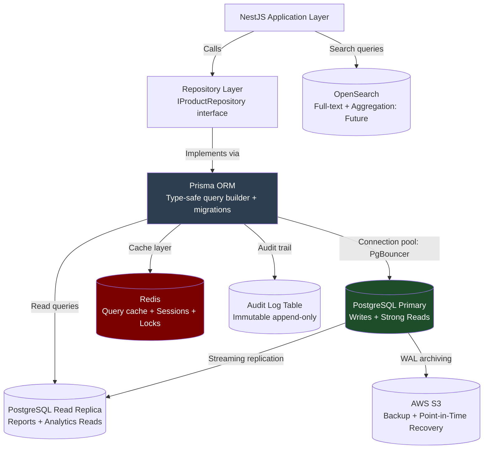
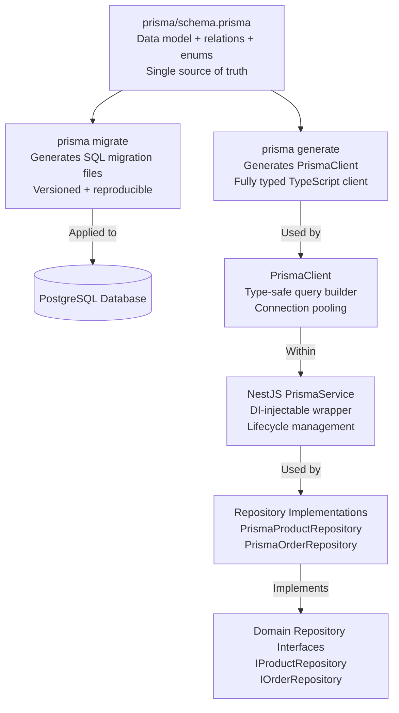
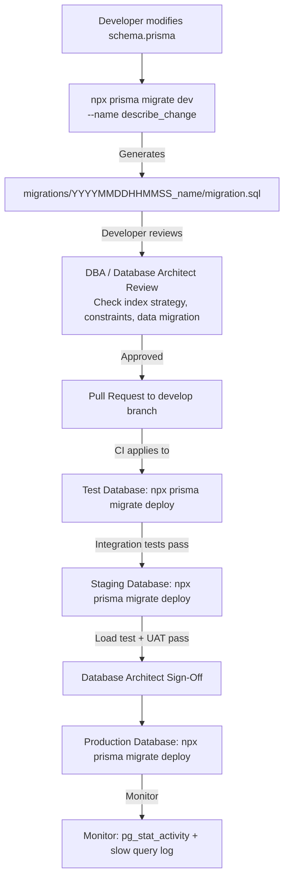
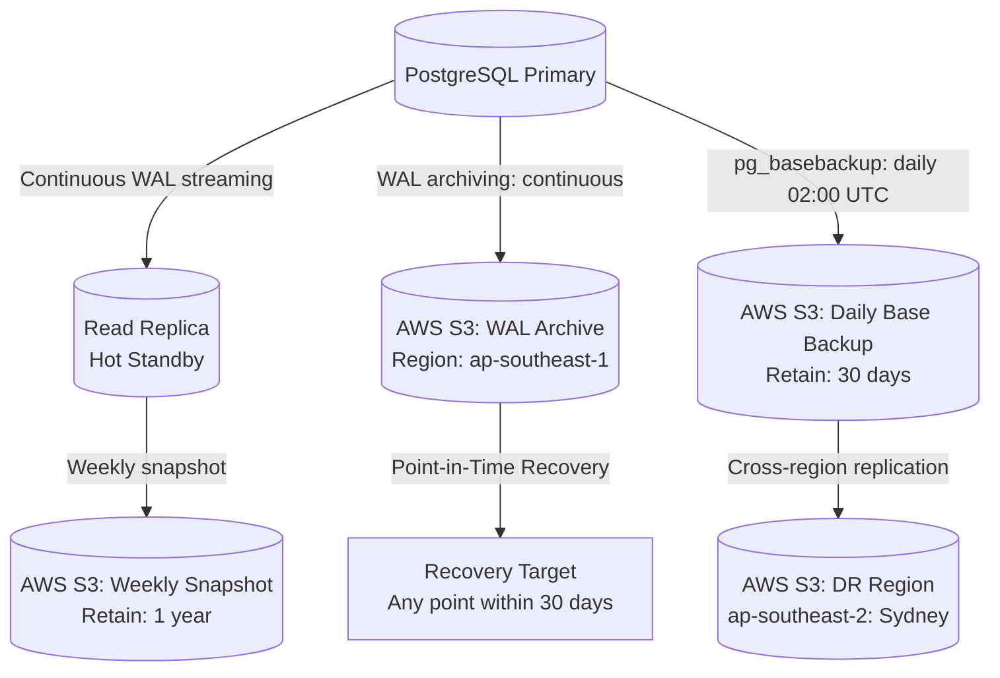
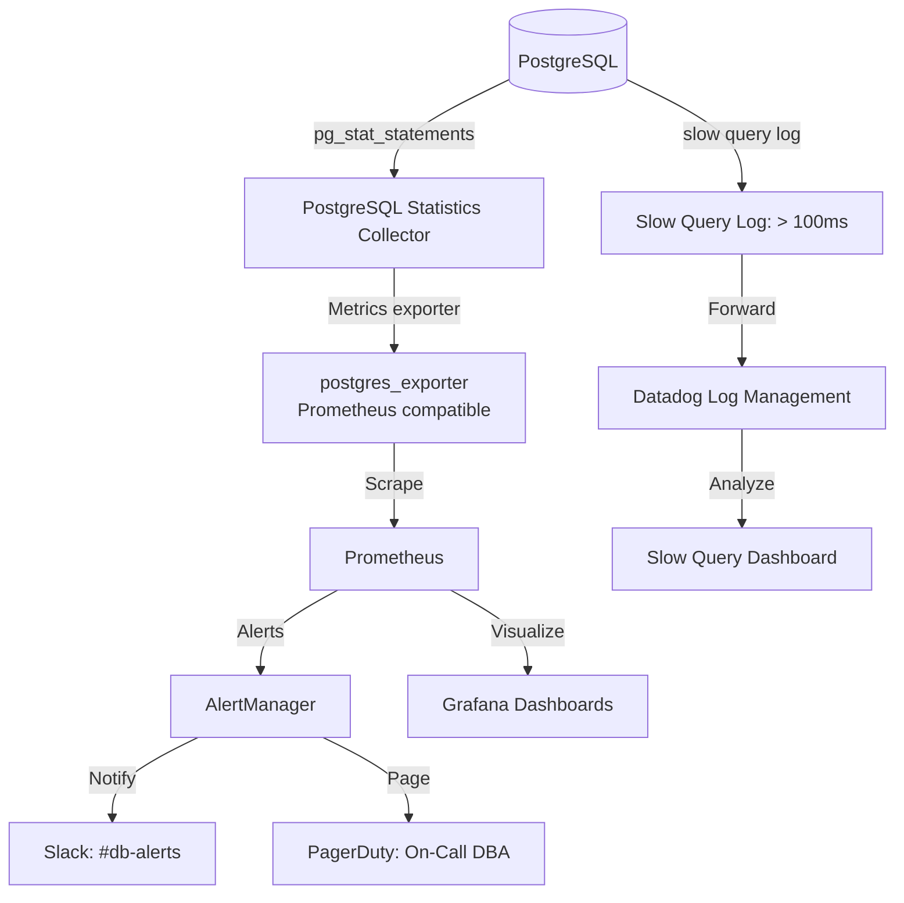
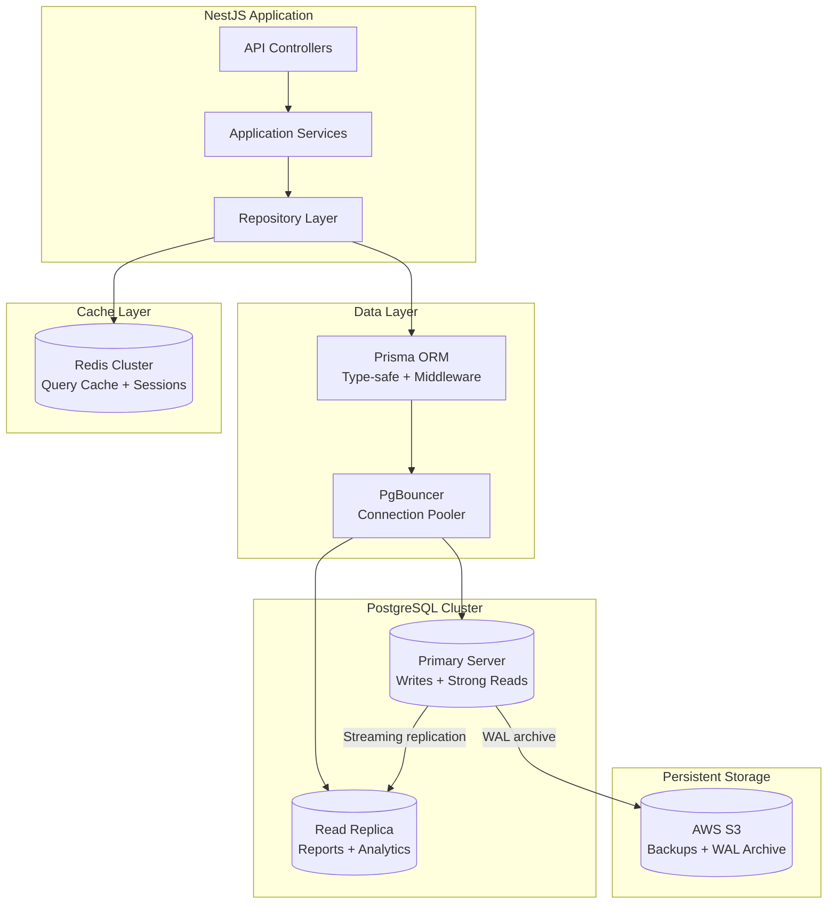
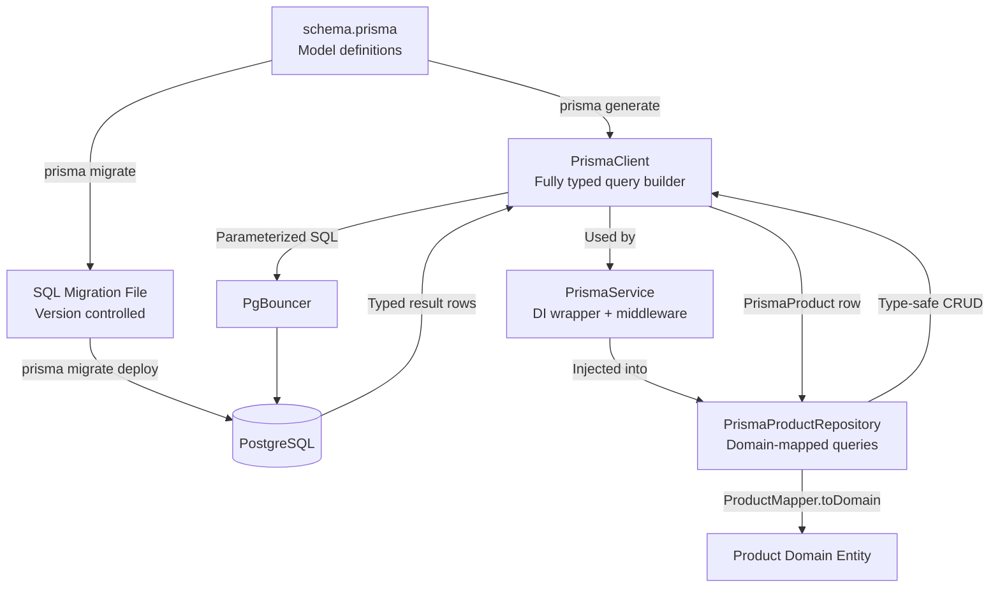
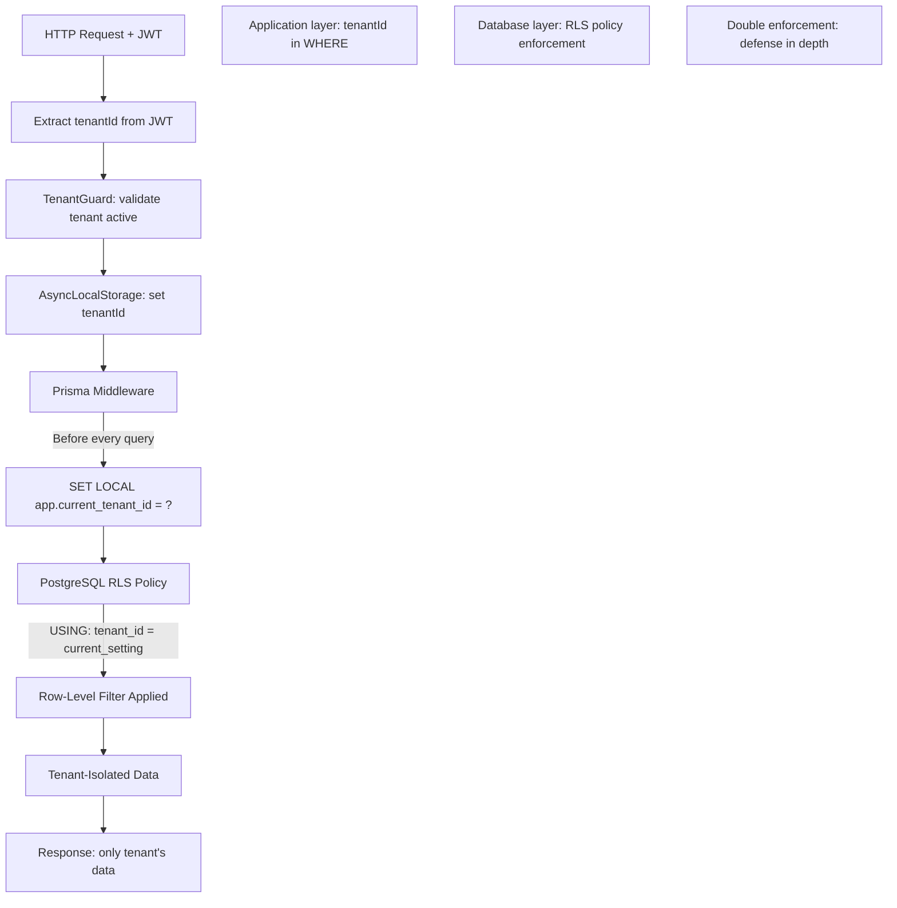
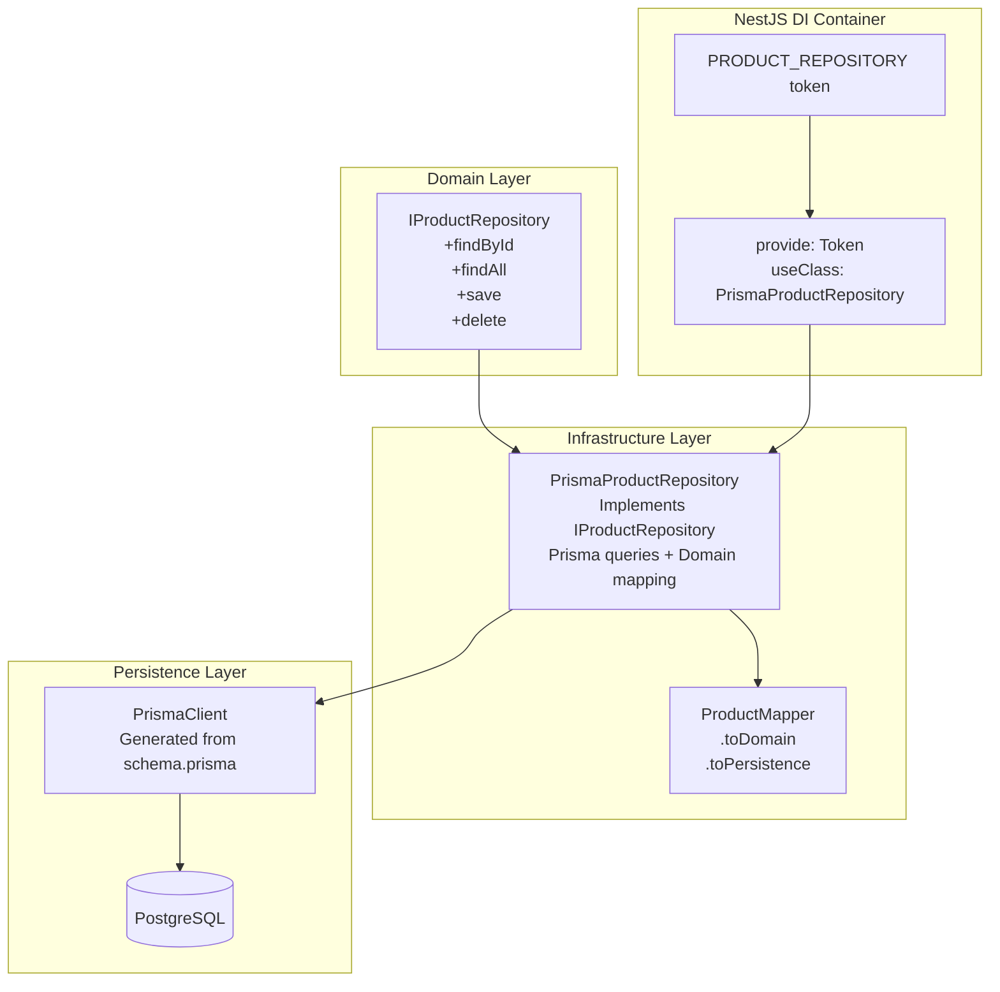
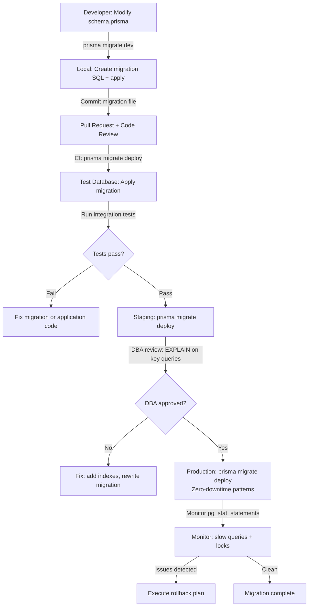

# BACKEND DATABASE ARCHITECTURE, PRISMA ORM & DATA ACCESS STRATEGY

**Project Name:** Enterprise SaaS Business Management Platform  
**Document Version:** 1.0.0 — Baseline Standard  
**Date:** July 13, 2026  
**Authors:** Principal Database Architect, PostgreSQL Expert, Prisma ORM Architect, Backend Data Engineer & Data Modeling Specialist  
**Classification:** Enterprise Internal — Unrestricted  
**Status:** 🏛️ APPROVED DATABASE ARCHITECTURE & DATA ACCESS SPECIFICATION  

---

## SECTION 1 — DATABASE ARCHITECTURE FOUNDATION

### 1.1 Enterprise Database Philosophy

A SaaS platform's database layer is its **most critical and least reversible** architectural decision. Bad schema choices compound with every tenant added, every feature shipped, and every million records accumulated. The principles below exist to ensure our data layer remains correct, fast, and evolvable across years of growth.

### 1.2 Enterprise Database Engineering Principles

| Principle | Description | Enforcement Mechanism |
| :--- | :--- | :--- |
| **Consistency** | Every transaction leaves the database in a valid state. Business invariants are enforced at the application layer (domain) AND reinforced by database constraints. | `NOT NULL`, `UNIQUE`, `CHECK`, `FOREIGN KEY` constraints on all schemas; Prisma enforces at ORM level. |
| **Integrity** | Referential integrity is maintained across all related tables. Orphaned records are prevented by design. | All foreign keys defined with explicit `ON DELETE` behavior; soft deletes over hard deletes for business records. |
| **Performance** | Query plans are predictable and efficient. No query should perform a full table scan on tenant-scoped tables. | Mandatory index on every `tenantId` + frequently-filtered column combination; query plan review in PR. |
| **Security** | No cross-tenant data leakage. Sensitive fields encrypted at rest. Access limited to least-privilege roles. | Row-Level Security on all tenant tables; `pgcrypto` for field encryption; dedicated DB roles per service. |
| **Scalability** | Schema design supports horizontal read scaling and vertical write scaling without breaking changes. | Read replicas for reporting; table partitioning for time-series data; connection pooling via PgBouncer. |
| **Maintainability** | Schema changes are explicit, versioned, reviewable, and reversible. No direct DDL changes in production. | All changes via Prisma migrations; migration files committed to git; Database Architect review required. |
| **Observability** | Slow queries, connection saturation, and lock contention are visible before they become incidents. | `pg_stat_statements`; slow query log (> 100 ms); Grafana dashboard; PgHero for index recommendations. |

### 1.3 Non-Negotiable Database Standards

```
✅ All business tables include: id, tenantId, createdAt, updatedAt (auto-managed by Prisma)
✅ All schema changes deployed via Prisma migration files — no manual DDL in production
✅ All foreign keys have explicit ON DELETE behavior defined
✅ All tenant-scoped tables have Row-Level Security policies enabled
✅ All indexes created using CONCURRENTLY in production to avoid table locks
✅ Sensitive columns (PII, financial data) encrypted using pgcrypto AES-256
✅ No SELECT * in repository queries — always specify exact columns needed
✅ No N+1 queries — use Prisma include/select or raw SQL joins
✅ Soft delete pattern for all business records (deletedAt column)
✅ Numeric financial values stored as DECIMAL(12,4) — never FLOAT
```

---

## SECTION 2 — DATABASE SYSTEM ARCHITECTURE

### 2.1 Database Layer Architecture



### 2.2 Connection Management Architecture

```
┌─────────────────────────────────────────────────────────────────────┐
│  NestJS Application Pod 1  │  NestJS Application Pod 2             │
│  Prisma Client             │  Prisma Client                        │
│  (connection pool: 10)     │  (connection pool: 10)                │
├─────────────────────────────────────────────────────────────────────┤
│              PgBouncer (Connection Pooler)                          │
│              Max: 500 server connections                            │
│              Mode: Transaction pooling                              │
├─────────────────────────────────────────────────────────────────────┤
│  PostgreSQL Primary Server                                          │
│  max_connections: 500 (reserved for PgBouncer)                     │
│  shared_buffers: 25% of RAM                                         │
│  work_mem: 64MB per query                                           │
└─────────────────────────────────────────────────────────────────────┘
```

---

## SECTION 3 — POSTGRESQL ENTERPRISE ARCHITECTURE

### 3.1 PostgreSQL Feature Utilization

| Feature | PostgreSQL Capability | SaaS Platform Usage |
| :--- | :--- | :--- |
| **ACID Transactions** | Serializable, Repeatable Read, Read Committed isolation levels. | POS checkout: deduct stock + create order + create payment in one atomic transaction. |
| **Row-Level Security (RLS)** | Policy-based row filtering at the database engine level. | Every tenant table has an RLS policy; `SET LOCAL app.current_tenant_id = ?` before queries. |
| **JSONB** | Binary JSON storage with indexing, operators, and path queries. | Product metadata, tenant configuration, custom fields, feature flag overrides. |
| **Table Partitioning** | Range, list, and hash partitioning strategies. | `audit_logs` and `transactions` partitioned by month (`PARTITION BY RANGE (created_at)`). |
| **Partial Indexes** | Index only rows matching a WHERE clause. | `CREATE INDEX ON orders (tenant_id, created_at) WHERE deleted_at IS NULL` — excludes soft-deleted rows. |
| **Full-Text Search** | `tsvector` + `GIN` index for keyword search. | Product name + description full-text search (`to_tsvector + to_tsquery`). |
| **Streaming Replication** | Physical replication of WAL to standby servers. | One read replica per production region; hot standby for failover. |
| **UUID Generation** | `gen_random_uuid()` from `pgcrypto`; default primary key. | All IDs are UUID v4 — no auto-increment integers exposed externally. |
| **Timestamp Zones** | `TIMESTAMPTZ` stores UTC; displayed in tenant's local timezone. | All `createdAt`, `updatedAt`, `deletedAt` columns use `TIMESTAMPTZ`. |
| **DECIMAL Precision** | `DECIMAL(12,4)` for exact financial arithmetic. | All monetary columns — avoids floating-point rounding errors in financial calculations. |

### 3.2 PostgreSQL Server Configuration (Production)

```ini
# postgresql.conf — Production tuning (64 GB RAM server example)
max_connections = 500               # Managed by PgBouncer
shared_buffers = 16GB               # 25% of RAM
effective_cache_size = 48GB         # OS + PostgreSQL combined cache estimate
maintenance_work_mem = 2GB          # Memory for VACUUM, CREATE INDEX
work_mem = 64MB                     # Per-query sort/hash memory
wal_buffers = 64MB
checkpoint_completion_target = 0.9
random_page_cost = 1.1              # SSD storage (default 4.0 is for HDD)
effective_io_concurrency = 200      # NVMe SSD
log_min_duration_statement = 100    # Log queries slower than 100ms
log_checkpoints = on
log_connections = off               # High-volume; log only errors
log_lock_waits = on
deadlock_timeout = 1s
track_activity_query_size = 4096
pg_stat_statements.track = all
```

---

## SECTION 4 — DATABASE DESIGN APPROACH

### 4.1 Normalization Strategy

We target **Third Normal Form (3NF)** as the baseline for transactional tables, with **controlled denormalization** only when query performance demands it and the trade-off is explicitly documented:

| Form | Rule | Applied To |
| :--- | :--- | :--- |
| **1NF** | Atomic values; no repeating groups. | All tables — arrays stored as `JSONB` or child tables. |
| **2NF** | No partial dependencies on composite keys. | All tables — UUIDs as single-column primary keys avoid partial dependency. |
| **3NF** | No transitive dependencies. | All tables — derived values recalculated; not stored (except documented exceptions). |
| **Denormalization** | Controlled redundancy for query performance. | `orders.total_amount` stored (derived from items); `reports.daily_sales` materialized view. |

### 4.2 Naming Conventions

| Object | Convention | Example |
| :--- | :--- | :--- |
| **Table names** | `snake_case`, plural nouns | `products`, `order_items`, `stock_movements` |
| **Column names** | `snake_case` | `unit_price`, `tenant_id`, `created_at` |
| **Primary key** | Always `id UUID` | `id UUID DEFAULT gen_random_uuid()` |
| **Foreign keys** | `{referenced_table_singular}_id` | `tenant_id`, `product_id`, `customer_id` |
| **Boolean columns** | Affirmative `is_` / `has_` prefix | `is_active`, `is_deleted`, `has_variant` |
| **Timestamp columns** | `_at` suffix | `created_at`, `updated_at`, `deleted_at` |
| **Index names** | `idx_{table}_{columns}` | `idx_products_tenant_id_sku` |
| **Unique constraint** | `uq_{table}_{columns}` | `uq_products_tenant_id_sku` |
| **Foreign key constraint** | `fk_{table}_{ref_table}` | `fk_orders_tenants` |
| **Check constraint** | `chk_{table}_{rule}` | `chk_products_unit_price_positive` |
| **Enum types** | `{name}_enum` | `order_status_enum`, `payment_method_enum` |

### 4.3 Relationship Design Rules

```
One-to-Many:   Standard FK column on the "many" side
               products.category_id → categories.id

Many-to-Many:  Explicit junction table with composite PK + own created_at
               product_tags (product_id, tag_id, created_at)

Soft Delete:   deleted_at TIMESTAMPTZ NULL — NULL means active; timestamp means deleted
               All queries filter: WHERE deleted_at IS NULL

Cascades:      ON DELETE CASCADE only for child tables with no independent meaning
               (e.g., order_items cascade delete when order is hard-deleted)
               ON DELETE RESTRICT for business-critical relationships
               ON DELETE SET NULL for optional references
```

---

## SECTION 5 — SAAS MULTI-TENANT DATABASE ARCHITECTURE

### 5.1 Strategy Comparison Matrix

| Strategy | Isolation | Cost | Scalability | Complexity | Best For |
| :--- | :--- | :--- | :--- | :--- | :--- |
| **Database Per Tenant** | Maximum (complete DB isolation) | Very High (one DB cluster per tenant) | Difficult for many small tenants | High (provisioning, migration, monitoring per DB) | Regulated enterprise tenants requiring complete data isolation |
| **Schema Per Tenant** | High (separate PostgreSQL schema) | Medium (shared cluster, separate schemas) | Limited by PostgreSQL schema count | Medium (schema migration for each tenant) | Mid-market customers with compliance requirements |
| **Shared DB + RLS** | Row-level (policy enforcement) | Low (shared infrastructure) | Excellent (10,000+ tenants on one cluster) | Low-Medium (RLS policies + tenant filter in every query) | ✅ **Default: SMB + mid-market tenants** |
| **Hybrid** | Configurable per tenant | Moderate | Good | High | Enterprise tiers upgrading from shared to dedicated |

### 5.2 Our Architecture Decision

```
Default Tier (Starter, Professional):
  → Shared PostgreSQL cluster + Row-Level Security
  → All tenants share tables; tenantId column on every row
  → RLS policies enforce isolation at DB engine level
  → PgBouncer connection pooling for efficiency

Enterprise Tier (on-request):
  → Dedicated PostgreSQL instance per tenant (or per tenant cluster)
  → Same Prisma schema; different DATABASE_URL per tenant
  → Provisioned via Terraform automation; managed by platform ops team

Decision rationale:
  → 95%+ of SaaS businesses require shared-DB economics during growth phase
  → RLS provides database-engine-level enforcement — stronger than application-only checks
  → Prisma schema is compatible with both strategies — migration path is clear
```

### 5.3 Row-Level Security Implementation

```sql
-- Step 1: Enable RLS on all tenant-scoped tables
ALTER TABLE products ENABLE ROW LEVEL SECURITY;
ALTER TABLE orders ENABLE ROW LEVEL SECURITY;
ALTER TABLE order_items ENABLE ROW LEVEL SECURITY;
ALTER TABLE payments ENABLE ROW LEVEL SECURITY;
ALTER TABLE customers ENABLE ROW LEVEL SECURITY;
ALTER TABLE employees ENABLE ROW LEVEL SECURITY;

-- Step 2: Create isolation policy (read + write)
CREATE POLICY tenant_isolation_policy ON products
  AS PERMISSIVE
  FOR ALL
  TO app_user
  USING (tenant_id = current_setting('app.current_tenant_id', true)::uuid)
  WITH CHECK (tenant_id = current_setting('app.current_tenant_id', true)::uuid);

-- Step 3: Platform admin bypass policy (superuser access for support)
CREATE POLICY admin_bypass_policy ON products
  AS PERMISSIVE
  FOR ALL
  TO app_admin
  USING (true);  -- Admin can see all tenants

-- Step 4: Set tenant context at start of each transaction (via Prisma middleware)
SET LOCAL app.current_tenant_id = 'a1b2c3d4-e5f6-7890-abcd-ef1234567890';
```

### 5.4 Prisma Middleware for Tenant Context Injection

```typescript
// database/prisma.service.ts — Tenant context middleware
@Injectable()
export class PrismaService extends PrismaClient implements OnModuleInit {
  async onModuleInit(): Promise<void> {
    this.$use(async (params, next) => {
      const tenantId = TenantContext.get();

      if (tenantId) {
        // Set tenant context for RLS before every query
        await this.$executeRaw`SET LOCAL app.current_tenant_id = ${tenantId}`;
      }

      return next(params);
    });

    await this.$connect();
  }

  async onModuleDestroy(): Promise<void> {
    await this.$disconnect();
  }
}
```

---

## SECTION 6 — DATABASE SCHEMA ORGANIZATION

### 6.1 Domain-Driven Schema Layout

We organize tables by bounded context domain, using PostgreSQL schemas to provide namespace isolation within the shared database:

```
public schema (default) — platform infrastructure
  ├── tenants                    Platform-level tenant registry
  ├── tenant_plans               Subscription plan definitions
  ├── tenant_features            Feature flag overrides per tenant
  ├── platform_users             Platform admin users (not business users)
  └── audit_logs                 Immutable platform-wide audit trail

identity schema — authentication & authorization
  ├── users                      Business user accounts
  ├── user_profiles              Extended user information
  ├── roles                      Role definitions per tenant
  ├── permissions                Permission definitions
  ├── role_permissions           Role-permission mapping
  ├── user_roles                 User-role assignment
  ├── sessions                   Active session records
  └── refresh_tokens             JWT refresh token store

organization schema — tenant structure
  ├── branches                   Physical or virtual business branches
  ├── departments                Organizational departments
  └── business_settings          Per-tenant configuration

inventory schema — product & stock
  ├── products                   Product master data
  ├── product_variants           SKU variants (size, color, etc.)
  ├── categories                 Product category hierarchy
  ├── suppliers                  Supplier records
  ├── stock_movements            Stock in/out history
  └── warehouses                 Storage location definitions

pos schema — point of sale
  ├── orders                     Sales transaction header
  ├── order_items                Line items per order
  ├── pos_sessions               POS terminal sessions
  └── discounts                  Applied discount records

finance schema — financial data
  ├── invoices                   Invoice headers
  ├── invoice_items              Invoice line items
  ├── payments                   Payment records
  ├── accounts                   Chart of accounts
  ├── journal_entries            Double-entry bookkeeping entries
  └── tax_rates                  Tax rate definitions

crm schema — customer relationship
  ├── customers                  Customer master records
  ├── contacts                   Customer contact details
  └── customer_interactions      Interaction history log

hr schema — human resources
  ├── employees                  Employee records
  ├── shifts                     Shift schedules
  ├── attendance                 Clock-in/clock-out records
  ├── leave_requests             Leave management
  └── payroll_runs               Payroll calculation history

analytics schema — reporting
  ├── daily_sales_summary        Materialized daily aggregates
  ├── product_performance        Materialized product KPIs
  └── report_snapshots           Point-in-time report exports
```

---

## SECTION 7 — PRISMA ORM ARCHITECTURE

### 7.1 Prisma Component Overview



### 7.2 Prisma Client Capabilities

| Feature | Prisma Capability | Enterprise Value |
| :--- | :--- | :--- |
| **Type Safety** | Every query parameter and result is strongly typed from schema. | Compile-time detection of field name errors; auto-complete in IDE. |
| **Relation Loading** | `include`, `select`, nested queries. | Prevents N+1 by loading relations in a single query. |
| **Transaction API** | `$transaction([...])` and interactive transactions `$transaction(async (tx) => ...)`. | Atomic multi-table operations for business workflows. |
| **Middleware** | Hooks before/after every query for logging, tenant injection, soft-delete filters. | Centralized cross-cutting concerns without code duplication. |
| **Raw SQL Escape Hatch** | `$executeRaw`, `$queryRaw` with parameterized queries. | Complex queries (partitioned tables, custom aggregations) not expressible in Prisma DSL. |
| **Migration CLI** | `prisma migrate dev`, `prisma migrate deploy`, `prisma migrate reset`. | Developer-friendly migration workflow with CI/CD integration. |
| **Prisma Studio** | Web UI for data browsing. | Development data inspection without direct DB access. |
| **Query Engine** | Optimized Rust binary; automatic query optimization. | Consistent performance without hand-tuning every query. |

---

## SECTION 8 — PRISMA PROJECT STRUCTURE

### 8.1 Prisma File Organization

```
prisma/
├── schema.prisma                      ← Single schema file: models, relations, enums
├── migrations/                        ← Auto-generated; committed to git; never hand-edited
│   ├── 20260101000000_init/
│   │   └── migration.sql
│   ├── 20260115000000_add_branches/
│   │   └── migration.sql
│   ├── 20260201000000_add_product_variants/
│   │   └── migration.sql
│   └── migration_lock.toml            ← Prevents parallel migration conflicts
└── seed/
    ├── seed.ts                        ← Main seed orchestrator
    ├── data/
    │   ├── roles.seed.ts
    │   ├── permissions.seed.ts
    │   ├── demo-tenant.seed.ts
    │   └── system-config.seed.ts
    └── factories/                     ← Test data factories (dev only)
        ├── product.factory.ts
        └── order.factory.ts

src/database/
├── prisma.service.ts                  ← PrismaClient DI wrapper
├── prisma.module.ts                   ← Global database module
├── prisma-transaction.decorator.ts    ← @InjectPrismaTransaction() decorator
└── repositories/
    ├── base.repository.ts             ← Abstract base: common CRUD + pagination
    ├── product.repository.ts
    ├── order.repository.ts
    ├── customer.repository.ts
    └── employee.repository.ts
```

### 8.2 PrismaService Implementation

```typescript
// src/database/prisma.service.ts
import { Injectable, OnModuleInit, OnModuleDestroy, Logger } from '@nestjs/common';
import { PrismaClient, Prisma } from '@prisma/client';
import { TenantContext } from '../common/context/tenant.context';

@Injectable()
export class PrismaService extends PrismaClient implements OnModuleInit, OnModuleDestroy {
  private readonly logger = new Logger(PrismaService.name);

  constructor() {
    super({
      log: [
        { level: 'query',  emit: 'event' },
        { level: 'warn',   emit: 'stdout' },
        { level: 'error',  emit: 'stdout' },
      ],
      errorFormat: 'minimal',
    });
  }

  async onModuleInit(): Promise<void> {
    // ─── Slow Query Logging ──────────────────────────────────────────
    this.$on('query' as never, (event: Prisma.QueryEvent) => {
      if (event.duration > 100) {
        this.logger.warn({
          message: 'Slow query detected',
          query: event.query,
          params: event.params,
          duration: `${event.duration}ms`,
        });
      }
    });

    // ─── Tenant Context Middleware ───────────────────────────────────
    this.$use(async (params, next) => {
      const tenantId = TenantContext.get();
      if (tenantId) {
        // Inject RLS context before every Prisma operation
        await this.$executeRaw`SELECT set_config('app.current_tenant_id', ${tenantId}, true)`;
      }
      return next(params);
    });

    // ─── Soft Delete Middleware ──────────────────────────────────────
    // Automatically filter soft-deleted records from findMany queries
    const SOFT_DELETE_MODELS = ['Product', 'Order', 'Customer', 'Employee', 'Invoice'];
    this.$use(async (params, next) => {
      if (SOFT_DELETE_MODELS.includes(params.model ?? '') && params.action === 'findMany') {
        params.args = params.args ?? {};
        params.args.where = { ...params.args.where, deletedAt: null };
      }
      return next(params);
    });

    await this.$connect();
    this.logger.log('Database connected');
  }

  async onModuleDestroy(): Promise<void> {
    await this.$disconnect();
  }
}
```

---

## SECTION 9 — DATA ACCESS LAYER

### 9.1 Repository Layer Architecture

```mermaid
graph TD
    Controller[ProductController\n@UseGuards: Auth + RBAC + Tenant] -->|Calls| AppService[ProductService\nApplication use case orchestration]
    AppService -->|Calls via DI token| Interface[IProductRepository\nDomain interface: findById, findAll, save, delete]
    Interface -->|Implemented by| PrismaRepo[PrismaProductRepository\nPrisma queries + domain mapping]
    PrismaRepo -->|Type-safe query| Prisma[PrismaClient\nConnection pool via PgBouncer]
    Prisma -->|SQL| DB[(PostgreSQL)]
    DB -->|Result rows| Prisma
    Prisma -->|PrismaProduct row| PrismaRepo
    PrismaRepo -->|ProductMapper.toDomain| Domain[Product Domain Entity]
    Domain --> AppService
    AppService --> Controller
```

### 9.2 Abstract Base Repository

```typescript
// src/database/repositories/base.repository.ts
import { PrismaService } from '../prisma.service';
import type { PaginatedResult, PaginationParams } from '../../common/types';

export abstract class BaseRepository<TDomain, TPrismaModel> {
  constructor(protected readonly prisma: PrismaService) {}

  protected abstract toDomain(row: TPrismaModel): TDomain;
  protected abstract toPersistence(entity: TDomain): Record<string, unknown>;

  protected buildPaginationMeta(total: number, params: PaginationParams) {
    return {
      page: params.page,
      pageSize: params.pageSize,
      totalItems: total,
      totalPages: Math.ceil(total / params.pageSize),
      hasNextPage: params.page * params.pageSize < total,
      hasPreviousPage: params.page > 1,
    };
  }
}
```

### 9.3 Product Repository Implementation

```typescript
// src/database/repositories/product.repository.ts
@Injectable()
export class PrismaProductRepository
  extends BaseRepository<Product, PrismaProduct>
  implements IProductRepository
{
  constructor(prisma: PrismaService) { super(prisma); }

  async findById(id: string, tenantId: string): Promise<Product | null> {
    const row = await this.prisma.product.findFirst({
      where: { id, tenantId, deletedAt: null },
      include: { category: true, variants: true },
    });
    return row ? this.toDomain(row) : null;
  }

  async findBySku(sku: string, tenantId: string): Promise<Product | null> {
    const row = await this.prisma.product.findUnique({
      where: { tenantId_sku: { tenantId, sku } },
    });
    return row ? this.toDomain(row) : null;
  }

  async findAll(tenantId: string, params: ProductFilters): Promise<PaginatedResult<Product>> {
    const where: Prisma.ProductWhereInput = {
      tenantId,
      deletedAt: null,
      ...(params.categoryId && { categoryId: params.categoryId }),
      ...(params.inStock !== undefined && params.inStock
          ? { stock: { gt: 0 } }
          : params.inStock === false ? { stock: 0 } : {}),
      ...(params.search && {
        OR: [
          { name: { search: params.search } },    // Full-text search
          { sku:  { contains: params.search, mode: 'insensitive' } },
        ],
      }),
    };

    const [rows, total] = await this.prisma.$transaction([
      this.prisma.product.findMany({
        where,
        orderBy: { [params.sortBy ?? 'createdAt']: params.sortOrder ?? 'desc' },
        skip: (params.page - 1) * params.pageSize,
        take: params.pageSize,
        include: { category: { select: { id: true, name: true } } },
      }),
      this.prisma.product.count({ where }),
    ]);

    return {
      data: rows.map(r => this.toDomain(r)),
      meta: this.buildPaginationMeta(total, params),
    };
  }

  async save(product: Product, tx?: Prisma.TransactionClient): Promise<void> {
    const client = tx ?? this.prisma;
    await client.product.upsert({
      where: { id: product.id },
      create: this.toPersistence(product) as Prisma.ProductCreateInput,
      update: this.toPersistenceUpdate(product) as Prisma.ProductUpdateInput,
    });
  }

  async delete(id: string, tenantId: string): Promise<void> {
    await this.prisma.product.updateMany({
      where: { id, tenantId, deletedAt: null },
      data: { deletedAt: new Date() },
    });
  }

  async findLowStock(tenantId: string): Promise<Product[]> {
    const rows = await this.prisma.$queryRaw<PrismaProduct[]>`
      SELECT * FROM inventory.products
      WHERE tenant_id = ${tenantId}::uuid
        AND deleted_at IS NULL
        AND stock <= min_stock
        AND is_active = true
      ORDER BY stock ASC
    `;
    return rows.map(r => this.toDomain(r));
  }

  protected toDomain(row: PrismaProduct): Product {
    return ProductMapper.toDomain(row);
  }

  protected toPersistence(product: Product): Record<string, unknown> {
    return ProductMapper.toPersistence(product);
  }

  private toPersistenceUpdate(product: Product): Record<string, unknown> {
    return ProductMapper.toPersistenceUpdate(product);
  }
}
```

---

## SECTION 10 — PRISMA SCHEMA DESIGN STANDARD

### 10.1 Complete Prisma Schema (Core Models)

```prisma
// prisma/schema.prisma

datasource db {
  provider          = "postgresql"
  url               = env("DATABASE_URL")
  shadowDatabaseUrl = env("SHADOW_DATABASE_URL")
}

generator client {
  provider        = "prisma-client-js"
  previewFeatures = ["fullTextSearch", "multiSchema"]
}

// ─── ENUMS ────────────────────────────────────────────────────────────────────

enum OrderStatus {
  DRAFT
  CONFIRMED
  COMPLETED
  VOIDED
  REFUNDED
}

enum PaymentMethod {
  CASH
  CARD
  QR_CODE
  BANK_TRANSFER
  CREDIT
}

enum UserRole {
  PLATFORM_ADMIN
  BUSINESS_OWNER
  MANAGER
  CASHIER
  STAFF
  CUSTOMER
  SUPPLIER
}

enum MovementType {
  PURCHASE
  SALE
  ADJUSTMENT_ADD
  ADJUSTMENT_REMOVE
  TRANSFER_IN
  TRANSFER_OUT
  RETURN
}

// ─── TENANT ───────────────────────────────────────────────────────────────────

model Tenant {
  id            String    @id @default(dbgenerated("gen_random_uuid()")) @db.Uuid
  name          String    @db.VarChar(200)
  slug          String    @unique @db.VarChar(100)
  plan          String    @default("starter") @db.VarChar(50)
  isActive      Boolean   @default(true)
  settings      Json      @default("{}")         @db.JsonB
  createdAt     DateTime  @default(now())         @db.Timestamptz
  updatedAt     DateTime  @updatedAt              @db.Timestamptz
  deletedAt     DateTime?                         @db.Timestamptz

  users         User[]
  branches      Branch[]
  products      Product[]
  orders        Order[]
  customers     Customer[]
  employees     Employee[]

  @@index([slug])
  @@index([isActive])
  @@map("tenants")
}

// ─── USER ─────────────────────────────────────────────────────────────────────

model User {
  id            String    @id @default(dbgenerated("gen_random_uuid()")) @db.Uuid
  tenantId      String    @db.Uuid
  email         String    @db.VarChar(320)
  passwordHash  String    @db.VarChar(255)
  role          UserRole  @default(STAFF)
  isActive      Boolean   @default(true)
  isEmailVerified Boolean @default(false)
  lastLoginAt   DateTime?                         @db.Timestamptz
  createdAt     DateTime  @default(now())         @db.Timestamptz
  updatedAt     DateTime  @updatedAt              @db.Timestamptz
  deletedAt     DateTime?                         @db.Timestamptz

  tenant        Tenant    @relation(fields: [tenantId], references: [id], onDelete: Restrict)

  @@unique([tenantId, email], name: "uq_users_tenant_email")
  @@index([tenantId, isActive])
  @@index([email])
  @@map("users")
}

// ─── PRODUCT ──────────────────────────────────────────────────────────────────

model Product {
  id            String    @id @default(dbgenerated("gen_random_uuid()")) @db.Uuid
  tenantId      String    @db.Uuid
  branchId      String?   @db.Uuid
  categoryId    String?   @db.Uuid
  sku           String    @db.VarChar(100)
  barcode       String?   @db.VarChar(200)
  name          String    @db.VarChar(300)
  description   String?   @db.Text
  unitPrice     Decimal   @db.Decimal(12, 4)
  currency      String    @default("USD") @db.VarChar(3)
  costPrice     Decimal?  @db.Decimal(12, 4)
  stock         Int       @default(0)
  minStock      Int       @default(0)
  unit          String    @default("piece") @db.VarChar(50)
  isActive      Boolean   @default(true)
  metadata      Json      @default("{}")   @db.JsonB
  createdBy     String    @db.Uuid
  updatedBy     String?   @db.Uuid
  createdAt     DateTime  @default(now()) @db.Timestamptz
  updatedAt     DateTime  @updatedAt      @db.Timestamptz
  deletedAt     DateTime?                 @db.Timestamptz

  tenant        Tenant    @relation(fields: [tenantId], references: [id], onDelete: Restrict)
  category      Category? @relation(fields: [categoryId], references: [id], onDelete: SetNull)
  orderItems    OrderItem[]
  stockMovements StockMovement[]

  @@unique([tenantId, sku], name: "uq_products_tenant_sku")
  @@index([tenantId, isActive])
  @@index([tenantId, categoryId])
  @@index([tenantId, stock])
  @@map("products")
}

// ─── ORDER ────────────────────────────────────────────────────────────────────

model Order {
  id             String       @id @default(dbgenerated("gen_random_uuid()")) @db.Uuid
  tenantId       String       @db.Uuid
  branchId       String       @db.Uuid
  orderNumber    String       @db.VarChar(50)
  customerId     String?      @db.Uuid
  status         OrderStatus  @default(DRAFT)
  subtotal       Decimal      @db.Decimal(12, 4)
  discountAmount Decimal      @default(0) @db.Decimal(12, 4)
  taxAmount      Decimal      @default(0) @db.Decimal(12, 4)
  totalAmount    Decimal      @db.Decimal(12, 4)
  currency       String       @default("USD") @db.VarChar(3)
  notes          String?      @db.Text
  cashierId      String       @db.Uuid
  completedAt    DateTime?                    @db.Timestamptz
  voidedAt       DateTime?                    @db.Timestamptz
  voidReason     String?      @db.Text
  createdAt      DateTime     @default(now()) @db.Timestamptz
  updatedAt      DateTime     @updatedAt      @db.Timestamptz

  tenant         Tenant       @relation(fields: [tenantId], references: [id], onDelete: Restrict)
  items          OrderItem[]
  payments       Payment[]

  @@unique([tenantId, orderNumber], name: "uq_orders_tenant_number")
  @@index([tenantId, status])
  @@index([tenantId, branchId, createdAt])
  @@index([tenantId, customerId])
  @@index([tenantId, cashierId])
  @@map("orders")
}

// ─── ORDER ITEM ───────────────────────────────────────────────────────────────

model OrderItem {
  id            String    @id @default(dbgenerated("gen_random_uuid()")) @db.Uuid
  orderId       String    @db.Uuid
  productId     String    @db.Uuid
  productName   String    @db.VarChar(300)   // Denormalized snapshot at time of sale
  productSku    String    @db.VarChar(100)   // Denormalized snapshot at time of sale
  quantity      Int
  unitPrice     Decimal   @db.Decimal(12, 4) // Snapshot at time of sale
  discountRate  Decimal   @default(0) @db.Decimal(5, 4)
  lineTotal     Decimal   @db.Decimal(12, 4)
  currency      String    @default("USD") @db.VarChar(3)
  createdAt     DateTime  @default(now()) @db.Timestamptz

  order         Order     @relation(fields: [orderId], references: [id], onDelete: Cascade)
  product       Product   @relation(fields: [productId], references: [id], onDelete: Restrict)

  @@index([orderId])
  @@index([productId])
  @@map("order_items")
}

// ─── PAYMENT ──────────────────────────────────────────────────────────────────

model Payment {
  id            String        @id @default(dbgenerated("gen_random_uuid()")) @db.Uuid
  tenantId      String        @db.Uuid
  orderId       String        @db.Uuid
  method        PaymentMethod
  amount        Decimal       @db.Decimal(12, 4)
  currency      String        @default("USD") @db.VarChar(3)
  reference     String?       @db.VarChar(200)
  isVerified    Boolean       @default(false)
  paidAt        DateTime?                      @db.Timestamptz
  createdAt     DateTime      @default(now())  @db.Timestamptz

  order         Order         @relation(fields: [orderId], references: [id], onDelete: Restrict)

  @@index([tenantId, orderId])
  @@index([tenantId, method, paidAt])
  @@map("payments")
}

// ─── STOCK MOVEMENT ───────────────────────────────────────────────────────────

model StockMovement {
  id            String        @id @default(dbgenerated("gen_random_uuid()")) @db.Uuid
  tenantId      String        @db.Uuid
  productId     String        @db.Uuid
  branchId      String        @db.Uuid
  type          MovementType
  delta         Int
  stockBefore   Int
  stockAfter    Int
  referenceId   String?       @db.Uuid   // orderId or purchaseId or adjustmentId
  referenceType String?       @db.VarChar(50)
  reason        String?       @db.Text
  performedBy   String        @db.Uuid
  createdAt     DateTime      @default(now()) @db.Timestamptz

  product       Product       @relation(fields: [productId], references: [id], onDelete: Restrict)

  @@index([tenantId, productId, createdAt])
  @@index([tenantId, branchId, createdAt])
  @@index([tenantId, type, createdAt])
  @@map("stock_movements")
}
```

---

## SECTION 11 — DATABASE MIGRATION STRATEGY

### 11.1 Migration Lifecycle



### 11.2 Zero-Downtime Migration Patterns

| Change Type | Risk | Zero-Downtime Strategy |
| :--- | :--- | :--- |
| **Add nullable column** | None | Safe to apply directly. |
| **Add NOT NULL column with default** | Low | Add nullable first + set default; backfill; then add NOT NULL constraint. |
| **Add new table** | None | Safe to apply directly. |
| **Add index** | Low | Use `CREATE INDEX CONCURRENTLY` — does not lock table. |
| **Rename column** | High (breaking) | 3-phase: add new column; dual-write to both; backfill; switch reads; remove old column. |
| **Change column type** | High | Add new column of new type; migrate data in batches; switch application code; drop old. |
| **Remove column** | High (breaking) | Remove application references first (separate deploy); then drop column. |
| **Partition existing table** | Very High | Create new partitioned table; migrate data in batches; swap table names with minimal downtime window. |

### 11.3 Migration File Naming and Review Checklist

```
✅ Migration name is descriptive: add_product_barcode, create_audit_logs_partition
✅ New indexes use CONCURRENTLY (raw SQL in migration): CREATE INDEX CONCURRENTLY ...
✅ Backfill steps included for non-nullable column additions
✅ Foreign key constraints have explicit ON DELETE behavior
✅ Migration is reversible OR irreversibility is documented
✅ Migration tested on a copy of production-size data (staging)
✅ Database Architect has reviewed and approved
```

### 11.4 CI/CD Migration Commands

```bash
# Local development: create + apply migration
npx prisma migrate dev --name "add_product_barcode"

# CI: apply migrations to test database (no interactive prompts)
npx prisma migrate deploy

# Production deployment: apply pending migrations
npx prisma migrate deploy
# → Applies only migrations not yet applied (tracked in _prisma_migrations table)
# → Idempotent: safe to run multiple times

# Check migration status
npx prisma migrate status

# Emergency: mark a failed migration as rolled back
npx prisma migrate resolve --rolled-back 20260201000000_migration_name
```

---

## SECTION 12 — DATABASE SEEDING STRATEGY

### 12.1 Seed Data Architecture

```typescript
// prisma/seed/seed.ts — Main orchestrator
import { PrismaClient } from '@prisma/client';
import { seedRoles } from './data/roles.seed';
import { seedPermissions } from './data/permissions.seed';
import { seedDemoTenant } from './data/demo-tenant.seed';
import { seedSystemConfig } from './data/system-config.seed';

const prisma = new PrismaClient();

async function main() {
  console.log('🌱 Starting database seed...');

  await seedSystemConfig(prisma);
  await seedRoles(prisma);
  await seedPermissions(prisma);

  if (process.env.NODE_ENV !== 'production') {
    await seedDemoTenant(prisma);
  }

  console.log('✅ Database seeded successfully');
}

main()
  .catch((e) => { console.error(e); process.exit(1); })
  .finally(async () => prisma.$disconnect());
```

### 12.2 Role and Permission Seed

```typescript
// prisma/seed/data/roles.seed.ts
export async function seedRoles(prisma: PrismaClient): Promise<void> {
  const roles = [
    { id: 'role-platform-admin', name: 'PLATFORM_ADMIN', description: 'Full platform access' },
    { id: 'role-business-owner', name: 'BUSINESS_OWNER', description: 'Full tenant access' },
    { id: 'role-manager',        name: 'MANAGER',        description: 'Manage operations and staff' },
    { id: 'role-cashier',        name: 'CASHIER',        description: 'POS access only' },
    { id: 'role-staff',          name: 'STAFF',          description: 'Limited read access' },
  ];

  for (const role of roles) {
    await prisma.role.upsert({
      where: { id: role.id },
      create: role,
      update: { description: role.description },
    });
  }
  console.log(`  ✓ Seeded ${roles.length} roles`);
}

// prisma/seed/data/permissions.seed.ts
export async function seedPermissions(prisma: PrismaClient): Promise<void> {
  const permissions = [
    // Inventory
    { resource: 'product', action: 'create' },
    { resource: 'product', action: 'read'   },
    { resource: 'product', action: 'update' },
    { resource: 'product', action: 'delete' },
    // POS
    { resource: 'order', action: 'create'  },
    { resource: 'order', action: 'read'    },
    { resource: 'order', action: 'void'    },
    // Finance
    { resource: 'invoice', action: 'create'   },
    { resource: 'invoice', action: 'read'     },
    { resource: 'report',  action: 'generate' },
    // HR
    { resource: 'employee', action: 'manage' },
    { resource: 'payroll',  action: 'run'    },
  ].map(p => ({ ...p, id: `perm-${p.resource}-${p.action}` }));

  for (const perm of permissions) {
    await prisma.permission.upsert({
      where: { id: perm.id },
      create: perm,
      update: {},
    });
  }
  console.log(`  ✓ Seeded ${permissions.length} permissions`);
}
```

---

## SECTION 13 — QUERY OPTIMIZATION

### 13.1 Index Strategy

```sql
-- ─── Tenant isolation index (mandatory on every tenant-scoped table) ──────────
CREATE INDEX CONCURRENTLY idx_products_tenant_active
  ON products (tenant_id, is_active)
  WHERE deleted_at IS NULL;            -- Partial index: excludes soft-deleted

-- ─── Composite index for frequent filter combinations ─────────────────────────
CREATE INDEX CONCURRENTLY idx_products_tenant_category
  ON products (tenant_id, category_id)
  WHERE deleted_at IS NULL;

-- ─── Date-range index for order reporting ─────────────────────────────────────
CREATE INDEX CONCURRENTLY idx_orders_tenant_branch_date
  ON orders (tenant_id, branch_id, created_at DESC);

-- ─── GIN index for JSONB metadata searching ───────────────────────────────────
CREATE INDEX CONCURRENTLY idx_products_metadata
  ON products USING GIN (metadata);

-- ─── Full-text search index on product name and description ───────────────────
CREATE INDEX CONCURRENTLY idx_products_fts
  ON products USING GIN (to_tsvector('english', name || ' ' || COALESCE(description, '')));
```

### 13.2 Avoiding N+1 Queries with Prisma

```typescript
// ❌ N+1 Pattern — 1 query for orders + 1 query per order for items = N+1
const orders = await this.prisma.order.findMany({ where: { tenantId } });
for (const order of orders) {
  const items = await this.prisma.orderItem.findMany({ where: { orderId: order.id } });
  // N additional queries!
}

// ✅ Correct: Load in a single query with include
const orders = await this.prisma.order.findMany({
  where: { tenantId, deletedAt: null },
  include: {
    items: {
      select: {
        id: true, productId: true, productName: true,
        quantity: true, unitPrice: true, lineTotal: true,
      },
    },
    payments: { select: { method: true, amount: true, paidAt: true } },
  },
  orderBy: { createdAt: 'desc' },
  take: 20,
  skip: (page - 1) * 20,
});
```

### 13.3 Query Performance Decision Table

| Query Pattern | Performance | Recommended Fix |
| :--- | :--- | :--- |
| `SELECT *` on wide tables | Poor | Always use `select: { field1, field2 }` in Prisma. |
| Missing index on `WHERE` column | Very Poor | Add index; check `EXPLAIN ANALYZE` plan for Seq Scan. |
| `ORDER BY` without index | Poor | Add covering index that includes sort column. |
| `findMany` without `take` limit | Dangerous | Always paginate; enforce `maxPageSize = 1000` in service. |
| N+1 relation queries | Very Poor | Use Prisma `include` or raw SQL JOIN. |
| Uncached count query on large table | Poor | Cache count with 30s TTL in Redis; use `COUNT(1)` not `COUNT(*)`. |
| `LIKE '%keyword%'` without FTS | Poor | Use PostgreSQL full-text search with GIN index. |
| Complex aggregation in ORM | Poor | Use Prisma `$queryRaw` with optimized SQL + EXPLAIN tuning. |

### 13.4 Query Plan Analysis

```sql
-- Analyze a slow product search query
EXPLAIN (ANALYZE, BUFFERS, FORMAT JSON)
SELECT id, sku, name, unit_price, stock
FROM inventory.products
WHERE tenant_id = 'tenant-uuid'
  AND deleted_at IS NULL
  AND is_active = true
  AND (name ILIKE '%coffee%' OR sku ILIKE '%esp%')
ORDER BY created_at DESC
LIMIT 20;

-- Warning signs to look for in EXPLAIN output:
--   Seq Scan on large table          → Add missing index
--   Hash Join on unindexed column    → Add index on join column
--   sort on disk (external merge)    → Increase work_mem or add index
--   estimated rows << actual rows    → Run ANALYZE to update statistics
```

---

## SECTION 14 — LARGE DATA ARCHITECTURE

### 14.1 Table Partitioning Strategy

```sql
-- Partition audit_logs by month (range partition on created_at)
CREATE TABLE audit_logs (
  id          UUID          NOT NULL DEFAULT gen_random_uuid(),
  tenant_id   UUID          NOT NULL,
  action      VARCHAR(100)  NOT NULL,
  actor_id    UUID,
  resource_id UUID,
  metadata    JSONB         DEFAULT '{}',
  created_at  TIMESTAMPTZ   NOT NULL DEFAULT NOW()
) PARTITION BY RANGE (created_at);

-- Create monthly partitions
CREATE TABLE audit_logs_2026_01 PARTITION OF audit_logs
  FOR VALUES FROM ('2026-01-01') TO ('2026-02-01');
CREATE TABLE audit_logs_2026_02 PARTITION OF audit_logs
  FOR VALUES FROM ('2026-02-01') TO ('2026-03-01');
-- Continue for each month...

-- Create local index on each partition (automatically inherits parent index)
CREATE INDEX CONCURRENTLY ON audit_logs USING BTREE (tenant_id, created_at DESC);
```

### 14.2 Data Volume Management

| Table | Expected Volume | Strategy | Archive After |
| :--- | :--- | :--- | :--- |
| `orders` | 1M+ rows/year | Partition by month; index by branch + date | Active data: 2 years in primary; archive to cold storage |
| `order_items` | 5M+ rows/year | Follows orders partition | Same as orders |
| `stock_movements` | 3M+ rows/year | Partition by month | 1 year active; archive after |
| `audit_logs` | 10M+ rows/year | Partition by month; GIN on metadata | 90 days hot; 7 years cold (compliance) |
| `payments` | 1M+ rows/year | Partition by quarter | 7 years (financial regulation) |
| `products` | 10K–100K per tenant | No partition needed at this scale | Soft delete; no archive needed |
| `employees` | < 10K per tenant | No partition needed | Soft delete |

### 14.3 Read Replica Strategy

```
Write operations → PostgreSQL Primary
  CREATE, UPDATE, DELETE, UPSERT

Strong read operations (need latest data) → PostgreSQL Primary
  Order checkout validation, stock check before deduction

Analytical reads (reports, dashboards) → PostgreSQL Read Replica
  Sales reports, inventory reports, KPI dashboard, audit log queries

Configuration:
  Primary:  Write + Strong reads
  Replica:  Reporting reads (lag tolerance: < 500ms)
  Switching: Controlled via DATABASE_READ_URL vs DATABASE_URL in config
```

---

## SECTION 15 — TRANSACTION MANAGEMENT

### 15.1 Multi-Step Business Transaction

```typescript
// Complete POS checkout: all-or-nothing atomic operation
async function completeCheckout(
  orderId: string,
  tenantId: string,
  payment: CreatePaymentDto,
  prisma: PrismaService,
): Promise<void> {
  await prisma.$transaction(async (tx) => {
    // Step 1: Lock and fetch the order
    const orderRow = await tx.$queryRaw<[{ id: string; status: string; total_amount: string }]>`
      SELECT id, status, total_amount
      FROM pos.orders
      WHERE id = ${orderId}::uuid
        AND tenant_id = ${tenantId}::uuid
      FOR UPDATE NOWAIT          -- Lock the row; fail immediately if already locked
    `;
    if (!orderRow.length) throw new NotFoundException('Order not found');
    if (orderRow[0].status !== 'DRAFT') throw new BusinessRuleViolationException('Order is not in draft state');

    // Step 2: Deduct stock for each order item (with row locks)
    const items = await tx.orderItem.findMany({ where: { orderId } });
    for (const item of items) {
      const result = await tx.$executeRaw`
        UPDATE inventory.products
        SET stock = stock - ${item.quantity},
            updated_at = NOW()
        WHERE id = ${item.productId}::uuid
          AND tenant_id = ${tenantId}::uuid
          AND stock >= ${item.quantity}
      `;
      if (result === 0) {
        throw new BusinessRuleViolationException(`Insufficient stock for product: ${item.productName}`);
      }

      // Step 3: Record stock movement
      await tx.stockMovement.create({
        data: {
          tenantId, productId: item.productId,
          branchId: orderRow[0].branch_id,
          type: 'SALE', delta: -item.quantity,
          referenceId: orderId, referenceType: 'ORDER',
          performedBy: payment.cashierId, createdAt: new Date(),
        },
      });
    }

    // Step 4: Create payment record
    await tx.payment.create({
      data: {
        tenantId, orderId, method: payment.method,
        amount: new Decimal(orderRow[0].total_amount),
        currency: payment.currency, paidAt: new Date(),
      },
    });

    // Step 5: Update order status
    await tx.order.update({
      where: { id: orderId },
      data: { status: 'COMPLETED', completedAt: new Date() },
    });

    // Step 6: Audit log (within transaction — atomic with business operation)
    await tx.auditLog.create({
      data: {
        tenantId, action: 'ORDER_COMPLETED', resourceId: orderId,
        actorId: payment.cashierId, metadata: { totalAmount: orderRow[0].total_amount },
      },
    });

    // All 6 steps commit atomically — if any fails, ALL are rolled back
  }, {
    timeout: 10_000,                             // 10 second transaction timeout
    isolationLevel: 'ReadCommitted',            // Standard isolation; FOR UPDATE handles concurrency
  });
}
```

### 15.2 Transaction Isolation Level Guide

| Isolation Level | Prevents | Use Case |
| :--- | :--- | :--- |
| **Read Committed** | Dirty reads | Default for most business operations (create order, update product). |
| **Repeatable Read** | Dirty reads + non-repeatable reads | Financial recalculations; concurrent balance reads must be consistent. |
| **Serializable** | All anomalies | Complex financial reporting that reads and writes based on aggregates. |
| **Row-level locking** (`FOR UPDATE`) | Concurrent update conflicts | POS checkout: lock order + product rows before deducting stock. |

---

## SECTION 16 — DATABASE SECURITY

### 16.1 Database Access Control

```sql
-- ─── Database roles (principle of least privilege) ──────────────────────────
-- Application user: read/write to business tables; no DDL
CREATE ROLE app_user WITH LOGIN PASSWORD 'secure_password';
GRANT SELECT, INSERT, UPDATE, DELETE ON ALL TABLES IN SCHEMA public TO app_user;
GRANT SELECT, INSERT, UPDATE, DELETE ON ALL TABLES IN SCHEMA inventory TO app_user;
GRANT SELECT, INSERT, UPDATE, DELETE ON ALL TABLES IN SCHEMA pos TO app_user;
GRANT SELECT, INSERT, UPDATE, DELETE ON ALL TABLES IN SCHEMA finance TO app_user;
GRANT USAGE ON ALL SEQUENCES IN SCHEMA public TO app_user;

-- Read-only user: reporting and analytics queries (read replica)
CREATE ROLE app_reader WITH LOGIN PASSWORD 'secure_reader_password';
GRANT SELECT ON ALL TABLES IN SCHEMA public TO app_reader;
GRANT SELECT ON ALL TABLES IN SCHEMA inventory TO app_reader;
GRANT SELECT ON ALL TABLES IN SCHEMA pos TO app_reader;

-- Migration user: DDL only (used by CI/CD migration pipeline)
CREATE ROLE app_migrator WITH LOGIN PASSWORD 'secure_migrator_password';
GRANT CREATE, USAGE ON SCHEMA public TO app_migrator;
GRANT ALL PRIVILEGES ON ALL TABLES IN SCHEMA public TO app_migrator;

-- Admin user: full access (Platform DevOps only; MFA required; logged)
CREATE ROLE app_admin WITH LOGIN PASSWORD 'secure_admin_password' SUPERUSER;
```

### 16.2 Field-Level Encryption (PII Protection)

```typescript
// security/encryption.service.ts — AES-256-GCM field encryption
import { createCipheriv, createDecipheriv, randomBytes } from 'crypto';

@Injectable()
export class EncryptionService {
  private readonly algorithm = 'aes-256-gcm';
  private readonly keyBuffer: Buffer;

  constructor(private readonly config: ConfigService) {
    const key = config.get<string>('FIELD_ENCRYPTION_KEY')!;
    this.keyBuffer = Buffer.from(key, 'hex');   // 32-byte hex key
  }

  encrypt(plaintext: string): string {
    const iv = randomBytes(12);
    const cipher = createCipheriv(this.algorithm, this.keyBuffer, iv);
    const encrypted = Buffer.concat([cipher.update(plaintext, 'utf8'), cipher.final()]);
    const authTag = cipher.getAuthTag();
    // Store: iv:authTag:encryptedData (all base64)
    return `${iv.toString('base64')}:${authTag.toString('base64')}:${encrypted.toString('base64')}`;
  }

  decrypt(encryptedData: string): string {
    const [ivB64, authTagB64, encryptedB64] = encryptedData.split(':');
    const iv = Buffer.from(ivB64, 'base64');
    const authTag = Buffer.from(authTagB64, 'base64');
    const encrypted = Buffer.from(encryptedB64, 'base64');
    const decipher = createDecipheriv(this.algorithm, this.keyBuffer, iv);
    decipher.setAuthTag(authTag);
    return decipher.update(encrypted).toString('utf8') + decipher.final('utf8');
  }
}

// Encrypted fields in practice:
//   customers.phone_number   → Encrypted at application layer before INSERT
//   employees.id_number      → Encrypted; decrypted only on explicit read
//   users.password_hash      → bcrypt (one-way); not AES
```

### 16.3 SQL Injection Prevention

```typescript
// ✅ Always use parameterized queries — never string interpolation

// Prisma ORM: always parameterized by design
const product = await this.prisma.product.findFirst({
  where: { tenantId: tenantId, name: { contains: searchQuery } },
});

// Prisma $queryRaw: use template literals (auto-parameterized)
const results = await this.prisma.$queryRaw`
  SELECT id, name, stock
  FROM inventory.products
  WHERE tenant_id = ${tenantId}::uuid
    AND name ILIKE ${'%' + searchQuery + '%'}
  LIMIT ${limit}
`;

// ❌ NEVER do this — SQL injection vulnerability:
// const query = `SELECT * FROM products WHERE name = '${userInput}'`;
// await this.prisma.$executeRawUnsafe(query);   // FORBIDDEN
```

---

## SECTION 17 — BACKUP & RECOVERY

### 17.1 Backup Architecture



### 17.2 Backup and Recovery SLAs

| Backup Type | Frequency | Retention | RPO | RTO |
| :--- | :--- | :--- | :--- | :--- |
| **WAL Archiving** | Continuous (< 1 min segments) | 30 days | < 1 minute | 15–30 min (PITR restore) |
| **Daily Base Backup** | Daily at 02:00 UTC | 30 days | 24 hours | 30–60 min |
| **Weekly Snapshot** | Weekly Sunday 03:00 UTC | 1 year | 1 week | 60–120 min |
| **Read Replica** | Real-time streaming (< 500ms lag) | N/A (not a backup) | < 500ms | < 2 min (promote replica) |

### 17.3 Point-in-Time Recovery Procedure

```bash
# Restore to a specific point in time (PostgreSQL PITR)
# 1. Stop the primary database
sudo systemctl stop postgresql

# 2. Restore base backup from S3
aws s3 sync s3://saas-db-backups/base-backup/latest/ /var/lib/postgresql/16/main/

# 3. Create recovery configuration
cat > /var/lib/postgresql/16/main/postgresql.auto.conf << EOF
restore_command = 'aws s3 cp s3://saas-db-backups/wal-archive/%f %p'
recovery_target_time = '2026-07-13 14:30:00 UTC'
recovery_target_action = 'promote'
EOF

# 4. Create recovery signal file
touch /var/lib/postgresql/16/main/recovery.signal

# 5. Start database (will replay WAL to target time)
sudo systemctl start postgresql

# 6. Verify recovery point
psql -c "SELECT pg_is_in_recovery(), now();"
```

---

## SECTION 18 — DATABASE MONITORING

### 18.1 Monitoring Architecture



### 18.2 Key Monitoring Queries

```sql
-- ─── Top slow queries (last hour) ─────────────────────────────────────────────
SELECT
  round(mean_exec_time::numeric, 2) AS avg_ms,
  round(max_exec_time::numeric, 2)  AS max_ms,
  calls,
  round(total_exec_time::numeric, 2) AS total_ms,
  rows,
  query
FROM pg_stat_statements
WHERE calls > 10
ORDER BY mean_exec_time DESC
LIMIT 20;

-- ─── Current active connections by state ──────────────────────────────────────
SELECT state, count(*) FROM pg_stat_activity GROUP BY state;

-- ─── Tables with highest sequential scan ratio (missing indexes) ──────────────
SELECT
  schemaname,
  tablename,
  seq_scan,
  idx_scan,
  round(seq_scan::numeric / NULLIF(seq_scan + idx_scan, 0) * 100, 1) AS seq_ratio_pct
FROM pg_stat_user_tables
WHERE seq_scan + idx_scan > 100
ORDER BY seq_ratio_pct DESC
LIMIT 10;

-- ─── Table bloat check (triggers VACUUM if > 20%) ─────────────────────────────
SELECT
  tablename,
  pg_size_pretty(pg_total_relation_size(schemaname||'.'||tablename)) AS total_size,
  n_dead_tup,
  n_live_tup,
  round(n_dead_tup::numeric / NULLIF(n_live_tup + n_dead_tup, 0) * 100, 1) AS bloat_pct
FROM pg_stat_user_tables
WHERE n_dead_tup > 1000
ORDER BY bloat_pct DESC;
```

### 18.3 Monitoring Alert Rules

| Metric | Warning | Critical | Response |
| :--- | :--- | :--- | :--- |
| **Connection pool utilization** | > 70% | > 90% | Scale PgBouncer; add read replica. |
| **Query p95 execution time** | > 200 ms | > 1 s | Query optimization; index review. |
| **Replication lag** | > 1 s | > 5 s | Investigate replica; increase `max_wal_senders`. |
| **Table bloat** | > 20% | > 50% | Run `VACUUM ANALYZE`; review autovacuum settings. |
| **Database size growth** | > 80% disk | > 90% disk | Storage expansion; archive old data. |
| **Long-running transactions** | > 30 s | > 2 min | Terminate query; investigate application code. |
| **Lock wait timeout** | > 5 s | > 30 s | Investigate conflicting transactions. |
| **Failed backups** | 1 failure | 2 consecutive | PagerDuty alert; manual backup verification. |

---

## SECTION 19 — DATABASE TOOL STACK

### 19.1 Complete Database Tool Stack

| Category | Tool | Version | Purpose |
| :--- | :--- | :--- | :--- |
| **Primary Database** | PostgreSQL | 16+ | ACID transactions; RLS; JSONB; partitioning; full-text search. |
| **ORM** | Prisma | 5+ | Type-safe query builder; migration CLI; code generation; middleware. |
| **Connection Pooling** | PgBouncer | 1.22+ | Transaction-mode pooling; 500+ client connections to limited server connections. |
| **Cache Layer** | Redis | 7+ | Query cache; session storage; rate limit counters; distributed locks. |
| **Cache Client** | ioredis (NestJS `@nestjs/redis`) | — | Redis client with cluster support; auto-reconnect; retry. |
| **DB Admin (Dev)** | DBeaver Community | — | Cross-database GUI; query execution; schema browser; ERD generation. |
| **DB Admin (Prod)** | pgAdmin 4 | 8+ | PostgreSQL-specific admin; EXPLAIN visualization; query tool. |
| **Query Analysis** | PgHero | 3+ | Top slow queries; index recommendations; connection monitoring. |
| **Performance Metrics** | postgres_exporter + Prometheus | — | Expose PostgreSQL metrics in Prometheus format. |
| **Dashboards** | Grafana | 10+ | PostgreSQL dashboard; slow query trends; replication lag; disk usage. |
| **Backup** | pgBackRest | 2+ | Incremental backups; PITR; S3 integration; parallel restore. |
| **Search (Future)** | OpenSearch | 2+ | Full-text search; log analytics; product catalog search. |
| **Schema Visualization** | Prisma Studio | — | Development data browser; relation explorer. |
| **Migration Testing** | `pgTAP` | — | SQL unit tests for constraints, indexes, and trigger logic. |
| **Security Audit** | `pgaudit` extension | — | Detailed audit logging of all DDL + DML operations at DB level. |

---

## SECTION 20 — FINAL DATABASE ARCHITECTURE DIAGRAMS

### 20.1 Enterprise Database Architecture



### 20.2 Prisma Data Flow



### 20.3 Multi-Tenant Database Strategy



### 20.4 Repository Pattern



### 20.5 Migration Pipeline



---

## APPENDIX A — DATABASE QUICK REFERENCE

```
Primary DB:           PostgreSQL 16 (AWS RDS Multi-AZ or self-hosted)
ORM:                  Prisma 5 (TypeScript client generation)
Connection Pool:      PgBouncer (transaction mode, 500 server connections)
Cache:                Redis 7 Cluster (ioredis client)
Tenancy Model:        Shared DB + Row-Level Security (RLS)
Primary Key:          UUID v4 (gen_random_uuid() — all tables)
Financial Values:     DECIMAL(12,4) — never FLOAT
Timestamps:           TIMESTAMPTZ — always UTC storage
Soft Delete:          deletedAt TIMESTAMPTZ NULL (NULL = active)
Backup RPO:           < 1 minute (continuous WAL archiving)
Backup RTO:           < 30 min (PITR restore from WAL)
Failover RTO:         < 2 min (promote read replica)
Encryption:           AES-256-GCM (application layer for PII fields)
Slow Query Threshold: 100ms (logged to Datadog)
Migration Tool:       Prisma Migrate (versioned + CI-applied)
```

## APPENDIX B — INDEX CHECKLIST

When creating a new table, verify:

- [ ] Primary key: `id UUID DEFAULT gen_random_uuid()`
- [ ] Tenant isolation: index on `(tenant_id, <primary_filter_columns>)`
- [ ] Soft delete filter: `WHERE deleted_at IS NULL` partial index
- [ ] Foreign keys: index on every FK column
- [ ] Frequently filtered columns: composite index with tenant_id
- [ ] Date range queries: index includes timestamp column
- [ ] JSONB metadata: GIN index if querying inside JSON
- [ ] Unique constraints: verify composite uniqueness includes tenant_id
- [ ] All `CREATE INDEX` statements use `CONCURRENTLY` in production

---

*End of Backend Database Architecture, Prisma ORM & Data Access Strategy*  
*Document maintained by: Principal Database Architect & PostgreSQL Expert | Status: Approved Database Architecture & Data Access Specification*
