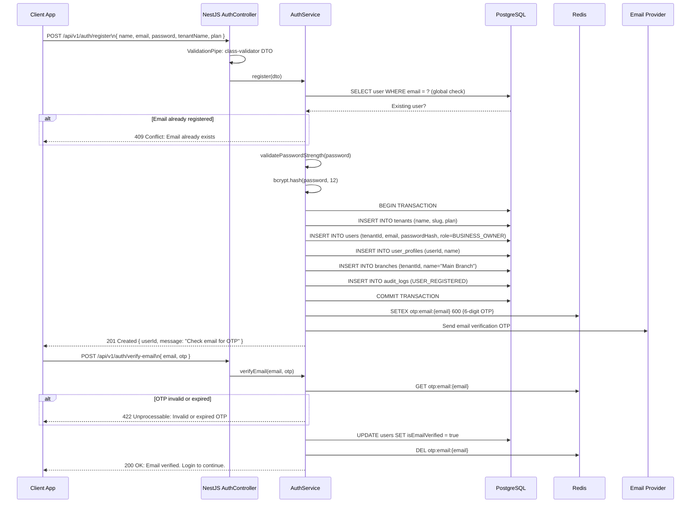
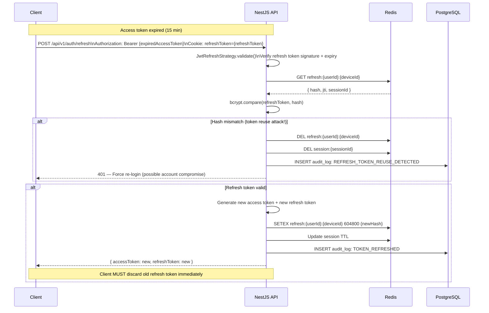
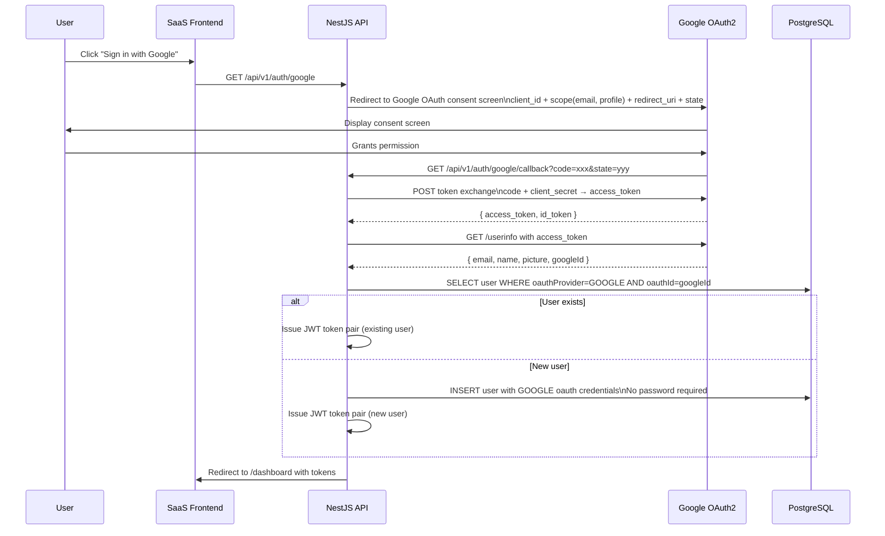
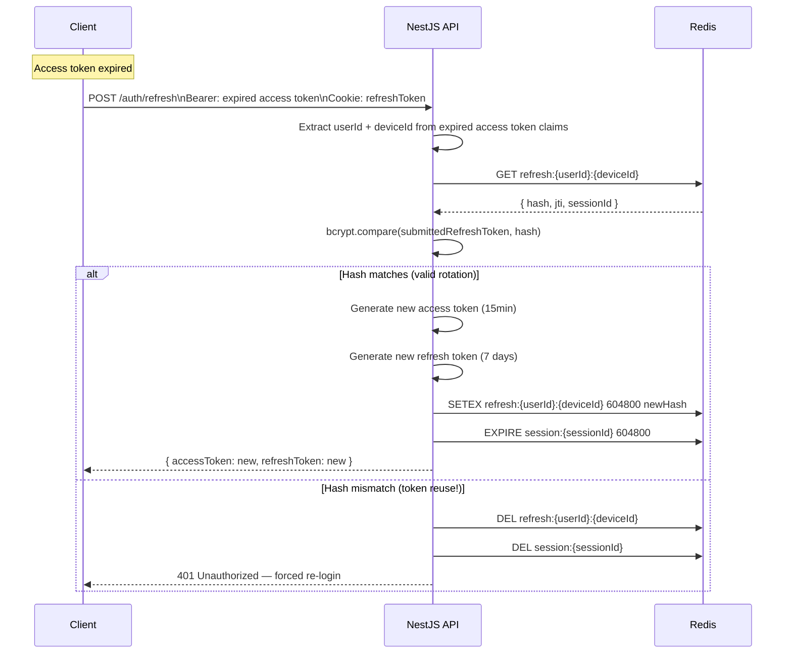

# BACKEND AUTHENTICATION, AUTHORIZATION & IDENTITY MANAGEMENT ARCHITECTURE

**Project Name:** Enterprise SaaS Business Management Platform  
**Document Version:** 1.0.0 — Baseline Standard  
**Date:** July 13, 2026  
**Authors:** Principal Security Architect, Identity Management Architect, Backend Security Engineer, NestJS Authentication Specialist & OAuth2 Expert  
**Classification:** Enterprise Internal — Restricted  
**Status:** 🏛️ APPROVED IDENTITY & ACCESS MANAGEMENT ARCHITECTURE SPECIFICATION  

---

## SECTION 1 — IDENTITY MANAGEMENT FOUNDATION

### 1.1 The Three Questions of Identity

Every request to the platform must answer three fundamental questions before data is served:

```
┌─────────────────────────────────────────────────────────────────────┐
│  WHO IS THE USER?       → Authentication                            │
│  "Prove you are who you claim to be."                               │
│  Mechanism: Email+Password, OTP, OAuth2, Biometric                  │
├─────────────────────────────────────────────────────────────────────┤
│  WHAT CAN THEY DO?      → Authorization                             │
│  "You are authenticated — but are you allowed to do this?"          │
│  Mechanism: RBAC, Permission System, Resource Ownership             │
├─────────────────────────────────────────────────────────────────────┤
│  IS THIS ACCESS SAFE?   → Security Controls                         │
│  "Is this session legitimate? Are signals of compromise present?"   │
│  Mechanism: Rate Limiting, Session Validation, Anomaly Detection    │
└─────────────────────────────────────────────────────────────────────┘
```

### 1.2 Enterprise IAM Principles

| Principle | Description | Implementation |
| :--- | :--- | :--- |
| **Zero Trust** | Never assume any request is safe based on network origin alone. Every request must be authenticated and authorized, even internal service calls. | JWT validation on every request; Guards on every endpoint; no implicit trust. |
| **Least Privilege** | Every user and service account has only the minimum permissions required for their function. | RBAC with granular permissions; no wildcard grants; regularly audited. |
| **Defense in Depth** | Authentication and authorization are enforced at multiple layers simultaneously. | Kong Gateway (JWT verify) + NestJS Guards (RBAC) + PostgreSQL RLS (data isolation). |
| **Separation of Concerns** | Authentication (who) and authorization (what) are logically distinct systems. | Separate `AuthModule` and `RbacModule`; distinct Guard classes for each concern. |
| **Credential Minimization** | Tokens carry only the minimum information necessary; sensitive data not stored in tokens. | JWT payload: `sub`, `email`, `tenantId`, `role` only — no PII or passwords. |
| **Auditability** | Every authentication event and permission change is logged immutably. | `audit_logs` table; every login, logout, password change, role assignment recorded. |
| **Fail Secure** | When in doubt, deny. An ambiguous or missing authorization context results in rejection. | Global `JwtAuthGuard` applied to all routes by default; `@Public()` required to opt out. |
| **Token Rotation** | Refresh tokens are rotated on every use. Old tokens are immediately invalidated. | Redis-backed refresh token store; rotation on every `/auth/refresh` call. |

---

## SECTION 2 — AUTHENTICATION ARCHITECTURE

### 2.1 Authentication System Architecture

```mermaid
graph TD
    User[User: Browser or Mobile] -->|Credentials| Kong[Kong API Gateway\nTLS termination + Basic request validation]

    Kong -->|POST /api/v1/auth/login| Auth[NestJS AuthModule\nLocalStrategy: email + password]

    Auth -->|Fetch user| UserRepo[UserRepository\nfindByEmail + tenantId]
    UserRepo -->|User record| Hash[HashingService\nbcrypt.compare password]

    Hash -->|Invalid credentials| Err401[401 Unauthorized]
    Hash -->|Valid| MFA{MFA Required?}

    MFA -->|Yes: OTP configured| OTPFlow[OTP Verification Flow\n→ Section 7]
    MFA -->|No| Tokens[TokenService\nGenerate access + refresh tokens]

    Tokens -->|Store refresh hash| Redis[(Redis\nrefresh:{userId}:{deviceId})]
    Tokens -->|Write audit log| Audit[(audit_logs\nLOGIN event)]
    Tokens -->|Response| Client[Client: accessToken + refreshToken]

    Client -->|Subsequent requests| JWTGuard[JwtAuthGuard\nValidate signature + expiry]
    JWTGuard -->|Valid| TenantGuard[TenantGuard\nValidate tenant active]
    TenantGuard -->|Valid| RbacGuard[RbacGuard\nCheck role permissions]
    RbacGuard -->|Authorized| Resource[Business Resource]
    RbacGuard -->|Denied| Err403[403 Forbidden]
```

### 2.2 Authentication Methods Supported

| Method | Use Case | Security Level | Supported |
| :--- | :--- | :--- | :--- |
| **Email + Password** | Primary login for all users | Medium (bcrypt + rate limit) | ✅ Core |
| **OTP via SMS** | MFA second factor; passwordless for field staff | High | ✅ Core |
| **OTP via Email** | Account verification; password reset; MFA | High | ✅ Core |
| **TOTP (Authenticator App)** | MFA second factor for managers/owners | Very High | ✅ Core |
| **OAuth2 Google** | Social login; quick onboarding | High | ✅ Integrated |
| **OAuth2 Microsoft** | Enterprise SSO for corporate tenants | High | ✅ Integrated |
| **OAuth2 Apple** | Mobile iOS app login | High | ✅ Integrated |
| **Biometric (Mobile)** | React Native: FaceID/TouchID unlock | Very High (local) | ✅ Mobile only |
| **Magic Link (Email)** | Passwordless; one-time login link | High | 🔄 Planned |

---

## SECTION 3 — USER REGISTRATION FLOW

### 3.1 Registration Architecture



### 3.2 Registration DTO Validation

```typescript
// modules/auth/dto/register.dto.ts
import {
  IsEmail, IsString, MinLength, MaxLength, Matches,
  IsEnum, IsOptional, ValidateNested
} from 'class-validator';
import { Type } from 'class-transformer';
import { ApiProperty } from '@nestjs/swagger';

export class RegisterDto {
  @ApiProperty({ example: 'Sopheak Pich' })
  @IsString()
  @MinLength(2)
  @MaxLength(100)
  fullName: string;

  @ApiProperty({ example: 'sopheak@example.com' })
  @IsEmail()
  @MaxLength(320)
  email: string;

  @ApiProperty({ example: '+85512345678', description: 'International format' })
  @IsOptional()
  @Matches(/^\+[1-9]\d{6,14}$/, { message: 'Phone must be in international format' })
  phone?: string;

  @ApiProperty({ example: 'Secure@Pass123!' })
  @IsString()
  @MinLength(8)
  @MaxLength(128)
  @Matches(/^(?=.*[a-z])(?=.*[A-Z])(?=.*\d)(?=.*[!@#$%^&*]).{8,}$/, {
    message: 'Password must have uppercase, lowercase, number, and special character',
  })
  password: string;

  @ApiProperty({ example: 'Sopheak Coffee Shop' })
  @IsString()
  @MinLength(2)
  @MaxLength(200)
  businessName: string;

  @ApiProperty({ enum: ['starter', 'professional', 'enterprise'], example: 'starter' })
  @IsEnum(['starter', 'professional', 'enterprise'])
  plan: string;
}
```

---

## SECTION 4 — LOGIN ARCHITECTURE

### 4.1 Login Flow Implementation

```typescript
// modules/auth/services/auth.service.ts (login method)
@Injectable()
export class AuthService {
  constructor(
    @Inject(USER_REPOSITORY) private readonly userRepo: IUserRepository,
    private readonly hashingService: HashingService,
    private readonly tokenService: TokenService,
    private readonly sessionService: SessionService,
    private readonly auditService: AuditService,
    private readonly redis: RedisService,
  ) {}

  async login(dto: LoginDto, meta: RequestMeta): Promise<LoginResponse> {
    // ─── 1. Rate limit check (fail fast before DB hit) ───────────────
    const attempts = await this.redis.incr(`login:attempts:${dto.email}`);
    if (attempts === 1) await this.redis.expire(`login:attempts:${dto.email}`, 900); // 15 min window
    if (attempts > 5) {
      await this.auditService.log({
        action: 'LOGIN_RATE_LIMITED', metadata: { email: dto.email, ip: meta.ip }
      });
      throw new TooManyRequestsException('Too many login attempts. Try again in 15 minutes.');
    }

    // ─── 2. Fetch user ────────────────────────────────────────────────
    const user = await this.userRepo.findByEmail(dto.email, dto.tenantId);
    if (!user) throw new UnauthorizedException('Invalid credentials');  // Generic message (no user enumeration)
    if (!user.isActive) throw new ForbiddenException('Account is deactivated');
    if (!user.isEmailVerified) throw new ForbiddenException('Email not verified');

    // ─── 3. Verify password ───────────────────────────────────────────
    const isPasswordValid = await this.hashingService.verify(dto.password, user.passwordHash);
    if (!isPasswordValid) {
      await this.auditService.log({ action: 'LOGIN_FAILED', actorId: user.id, metadata: { ip: meta.ip } });
      throw new UnauthorizedException('Invalid credentials');
    }

    // ─── 4. Check if MFA required ────────────────────────────────────
    if (user.mfaEnabled) {
      const mfaToken = generateSecureToken(32);
      await this.redis.setex(`mfa:pending:${mfaToken}`, 300, user.id); // 5 min
      return { requiresMfa: true, mfaToken };
    }

    // ─── 5. Clear rate limit on success; issue tokens ─────────────────
    await this.redis.del(`login:attempts:${dto.email}`);
    const tokens = await this.tokenService.issueTokenPair(user, meta.deviceId);
    await this.sessionService.create(user.id, meta);
    await this.auditService.log({
      action: 'LOGIN_SUCCESS', actorId: user.id, tenantId: user.tenantId,
      metadata: { ip: meta.ip, userAgent: meta.userAgent, deviceId: meta.deviceId }
    });

    return { requiresMfa: false, accessToken: tokens.accessToken, refreshToken: tokens.refreshToken, user: UserMapper.toResponse(user) };
  }
}
```

### 4.2 Login DTO

```typescript
// modules/auth/dto/login.dto.ts
export class LoginDto {
  @IsEmail()
  email: string;

  @IsString()
  @MinLength(8)
  @MaxLength(128)
  password: string;

  @IsOptional()
  @IsUUID()
  tenantId?: string;  // Optional: if user logs in directly without subdomain resolution

  @IsOptional()
  @IsString()
  @MaxLength(200)
  deviceId?: string;  // Used for device-specific session tracking
}
```

---

## SECTION 5 — JWT TOKEN ARCHITECTURE

### 5.1 Token Architecture Overview

```
┌──────────────────────────────────────────────────────────────────────┐
│  ACCESS TOKEN (Short-lived: 15 minutes)                              │
│  Purpose: Authenticate API requests                                  │
│  Storage: Memory only (Zustand on web; SecureStore on mobile)        │
│  Never stored in: localStorage, cookies                              │
├──────────────────────────────────────────────────────────────────────┤
│  REFRESH TOKEN (Long-lived: 7 days)                                  │
│  Purpose: Obtain new access token when expired                       │
│  Storage: HttpOnly + SameSite=Strict cookie (web); Keychain (mobile) │
│  Server state: Hash stored in Redis; rotated on every use            │
└──────────────────────────────────────────────────────────────────────┘
```

### 5.2 JWT Payload Design

```typescript
// modules/auth/interfaces/jwt-payload.interface.ts
export interface JwtPayload {
  // ─── Standard Claims ───────────────────────────────────────────────
  sub: string;          // User UUID (subject)
  iat: number;          // Issued at (Unix timestamp)
  exp: number;          // Expiry (Unix timestamp)
  jti: string;          // JWT ID (unique per token; for revocation)

  // ─── Custom Claims ─────────────────────────────────────────────────
  email: string;        // User email (for display; not for auth lookup)
  tenantId: string;     // Tenant UUID (for RLS + tenant guard)
  role: UserRole;       // Single role (BUSINESS_OWNER | MANAGER | CASHIER | STAFF)
  permissions: string[]; // Resolved permissions: ['product:create', 'order:read', ...]
  deviceId: string;     // Device identifier (for session-specific revocation)
  sessionId: string;    // Session UUID (for force-logout capability)

  // ─── What is deliberately NOT in the payload ───────────────────────
  // passwordHash: NEVER
  // creditCard: NEVER
  // sensitivePersonalInfo: NEVER
}

// Example decoded token:
// {
//   "sub": "user-uuid-here",
//   "iat": 1720876800,
//   "exp": 1720877700,   // 15 minutes later
//   "jti": "unique-jwt-id",
//   "email": "manager@coffeshop.com",
//   "tenantId": "tenant-uuid-here",
//   "role": "MANAGER",
//   "permissions": ["product:read", "product:update", "order:create", "order:read"],
//   "deviceId": "device-fingerprint-hash",
//   "sessionId": "session-uuid-here"
// }
```

### 5.3 JWT Strategy Implementation

```typescript
// modules/auth/strategies/jwt-access.strategy.ts
@Injectable()
export class JwtAccessStrategy extends PassportStrategy(Strategy, 'jwt-access') {
  constructor(
    private readonly configService: ConfigService,
    private readonly redis: RedisService,
  ) {
    super({
      jwtFromRequest: ExtractJwt.fromAuthHeaderAsBearerToken(),
      secretOrKey: configService.getOrThrow<string>('JWT_ACCESS_SECRET'),
      ignoreExpiration: false,
      passReqToCallback: true,
    });
  }

  async validate(request: Request, payload: JwtPayload): Promise<AuthUser> {
    // Check if the specific JWT ID has been revoked (force-logout support)
    const isRevoked = await this.redis.exists(`revoked:jti:${payload.jti}`);
    if (isRevoked) throw new UnauthorizedException('Token has been revoked');

    // Check if the session is still active
    const sessionActive = await this.redis.exists(`session:${payload.sessionId}`);
    if (!sessionActive) throw new UnauthorizedException('Session has expired or been terminated');

    return {
      id: payload.sub,
      email: payload.email,
      tenantId: payload.tenantId,
      role: payload.role,
      permissions: payload.permissions,
      sessionId: payload.sessionId,
      deviceId: payload.deviceId,
    };
  }
}
```

### 5.4 Token Service

```typescript
// modules/auth/services/token.service.ts
@Injectable()
export class TokenService {
  constructor(
    private readonly jwtService: JwtService,
    private readonly redis: RedisService,
    private readonly configService: ConfigService,
  ) {}

  async issueTokenPair(user: User, deviceId: string): Promise<TokenPair> {
    const sessionId = generateId();
    const accessJti = generateId();
    const refreshJti = generateId();

    const accessPayload: JwtPayload = {
      sub: user.id, iat: Math.floor(Date.now() / 1000),
      exp: 0,   // Set by expiresIn option below
      jti: accessJti,
      email: user.email, tenantId: user.tenantId,
      role: user.role, permissions: user.permissions,
      deviceId, sessionId,
    };

    const [accessToken, refreshToken] = await Promise.all([
      this.jwtService.signAsync(accessPayload, {
        secret: this.configService.getOrThrow('JWT_ACCESS_SECRET'),
        expiresIn: '15m',
      }),
      this.jwtService.signAsync(
        { sub: user.id, jti: refreshJti, deviceId, sessionId },
        { secret: this.configService.getOrThrow('JWT_REFRESH_SECRET'), expiresIn: '7d' }
      ),
    ]);

    // Store refresh token hash in Redis (prevents token reuse after rotation)
    const refreshHash = await bcrypt.hash(refreshToken, 8);  // Light hash; bcrypt cost=8
    await this.redis.setex(
      `refresh:${user.id}:${deviceId}`,
      604800,  // 7 days
      JSON.stringify({ hash: refreshHash, jti: refreshJti, sessionId })
    );

    // Activate session
    await this.redis.setex(`session:${sessionId}`, 604800, user.id);

    return { accessToken, refreshToken };
  }
}
```

---

## SECTION 6 — REFRESH TOKEN MANAGEMENT

### 6.1 Refresh Token Rotation Flow



### 6.2 Token Revocation System

```typescript
// modules/auth/services/token.service.ts — Revocation methods
async revokeToken(jti: string, expiresAt: number): Promise<void> {
  // Block this specific JWT until it naturally expires
  const ttl = expiresAt - Math.floor(Date.now() / 1000);
  if (ttl > 0) {
    await this.redis.setex(`revoked:jti:${jti}`, ttl, '1');
  }
}

async revokeAllUserTokens(userId: string): Promise<void> {
  // Force-logout: remove all device refresh tokens for this user
  const keys = await this.redis.keys(`refresh:${userId}:*`);
  if (keys.length > 0) await this.redis.del(...keys);

  // Also remove all sessions for this user
  const sessionKeys = await this.redis.keys(`session:user:${userId}:*`);
  if (sessionKeys.length > 0) await this.redis.del(...sessionKeys);
}

async revokeDeviceToken(userId: string, deviceId: string): Promise<void> {
  // Logout from specific device only
  await this.redis.del(`refresh:${userId}:${deviceId}`);
}
```

### 6.3 Redis Token Storage Schema

```
Key pattern:                           TTL        Value
─────────────────────────────────────────────────────────────────────
refresh:{userId}:{deviceId}            7 days     JSON{ hash, jti, sessionId }
session:{sessionId}                    7 days     userId
revoked:jti:{jti}                      Until exp  "1" (flag)
login:attempts:{email}                 15 min     count (integer)
otp:email:{email}                      10 min     { code, attempts }
otp:sms:{phone}                        10 min     { code, attempts }
mfa:pending:{mfaToken}                 5 min      userId
password:reset:{token}                 1 hour     userId
```

---

## SECTION 7 — OTP AUTHENTICATION SYSTEM

### 7.1 OTP Lifecycle

```mermaid
graph TD
    Request[User requests OTP\n→ Login, Verify Email, MFA, Reset Password] --> RateCheck[Rate Limit Check\n3 OTPs per 10 min per user]
    RateCheck -->|Exceeded| Block[429 Too Many Requests]
    RateCheck -->|Allowed| Generate[Generate 6-digit TOTP-based code\ncrypto.randomInt min=100000 max=999999]

    Generate -->|Store in Redis| Redis[(Redis\notp:{type}:{identifier}\nTTL: 10 minutes, max 3 attempts)]
    Generate --> Channel{Delivery Channel}

    Channel -->|SMS| Twilio[Twilio SMS / Cambodia Telco\nCelcom, Smart, Metfone]
    Channel -->|Email| SendGrid[SendGrid Email\nHTML template with code]
    Channel -->|TOTP App| App[RFC 6238 TOTP\nGoogle Authenticator, Authy]

    Twilio --> UserDevice[User receives OTP]
    SendGrid --> UserDevice
    App --> UserDevice

    UserDevice -->|Submit code| Verify[OTP Verification\nCompare submitted vs stored]
    Verify -->|Mismatch| AttemptCheck{Attempts < 3?}
    AttemptCheck -->|Yes| RetryErr[422 Invalid OTP\nX attempts remaining]
    AttemptCheck -->|No| LockErr[429 OTP locked\nRequest new code]

    Verify -->|Match| Delete[DELETE otp key from Redis\nInvalidate immediately after use]
    Delete --> Success[OTP Verified Successfully]
```

### 7.2 OTP Service Implementation

```typescript
// modules/auth/services/otp.service.ts
@Injectable()
export class OtpService {
  private readonly OTP_EXPIRY = 600;       // 10 minutes
  private readonly MAX_ATTEMPTS = 3;
  private readonly RATE_LIMIT = 3;         // 3 OTP requests per 10 min

  constructor(
    private readonly redis: RedisService,
    private readonly smsProvider: SmsProvider,
    private readonly emailProvider: EmailProvider,
  ) {}

  async sendSmsOtp(phone: string, purpose: OtpPurpose): Promise<void> {
    await this.checkRateLimit('sms', phone);
    const code = this.generateCode();
    await this.storeOtp(`otp:sms:${phone}:${purpose}`, code);
    await this.smsProvider.send(phone, `Your ${purpose} code: ${code}. Expires in 10 minutes.`);
  }

  async sendEmailOtp(email: string, purpose: OtpPurpose): Promise<void> {
    await this.checkRateLimit('email', email);
    const code = this.generateCode();
    await this.storeOtp(`otp:email:${email}:${purpose}`, code);
    await this.emailProvider.sendOtpEmail(email, code, purpose);
  }

  async verifyOtp(identifier: string, purpose: OtpPurpose, submittedCode: string): Promise<boolean> {
    const key = `otp:${identifier}:${purpose}`;
    const stored = await this.redis.get(key);

    if (!stored) throw new UnprocessableEntityException('OTP has expired. Please request a new code.');

    const data = JSON.parse(stored) as { code: string; attempts: number };

    if (data.attempts >= this.MAX_ATTEMPTS) {
      await this.redis.del(key);
      throw new TooManyRequestsException('Maximum attempts exceeded. Request a new OTP.');
    }

    if (data.code !== submittedCode) {
      data.attempts += 1;
      const ttl = await this.redis.ttl(key);
      await this.redis.setex(key, ttl, JSON.stringify(data));
      throw new UnprocessableEntityException(`Invalid OTP. ${this.MAX_ATTEMPTS - data.attempts} attempts remaining.`);
    }

    await this.redis.del(key);  // ← Immediate invalidation after successful verify
    return true;
  }

  private generateCode(): string {
    return String(crypto.randomInt(100000, 999999));
  }

  private async storeOtp(key: string, code: string): Promise<void> {
    await this.redis.setex(key, this.OTP_EXPIRY, JSON.stringify({ code, attempts: 0 }));
  }

  private async checkRateLimit(channel: string, identifier: string): Promise<void> {
    const key = `otp:ratelimit:${channel}:${identifier}`;
    const count = await this.redis.incr(key);
    if (count === 1) await this.redis.expire(key, 600);
    if (count > this.RATE_LIMIT) {
      throw new TooManyRequestsException('OTP rate limit exceeded. Try again in 10 minutes.');
    }
  }
}
```

### 7.3 TOTP (Authenticator App) Setup

```typescript
// modules/auth/services/totp.service.ts
import { authenticator } from 'otplib';
import * as qrcode from 'qrcode';

@Injectable()
export class TotpService {
  async setupTotp(userId: string, email: string): Promise<TotpSetupResponse> {
    const secret = authenticator.generateSecret(32);  // 32-char base32 secret

    // Store encrypted secret (not activated until verified)
    await this.userRepo.setTotpSecretPending(userId, this.encryption.encrypt(secret));

    const otpauthUrl = authenticator.keyuri(email, 'SaaS Business Platform', secret);
    const qrCodeDataUrl = await qrcode.toDataURL(otpauthUrl);

    return { secret, qrCodeDataUrl };   // Display to user; they scan with Authenticator app
  }

  async confirmTotp(userId: string, code: string): Promise<void> {
    const encryptedSecret = await this.userRepo.getTotpSecretPending(userId);
    const secret = this.encryption.decrypt(encryptedSecret);

    if (!authenticator.verify({ token: code, secret })) {
      throw new UnprocessableEntityException('Invalid TOTP code. Please check your authenticator app.');
    }

    await this.userRepo.activateTotp(userId, encryptedSecret);
  }

  verifyTotp(secret: string, code: string): boolean {
    return authenticator.verify({ token: code, secret });
  }
}
```

---

## SECTION 8 — OAUTH2 SOCIAL LOGIN

### 8.1 OAuth2 Authorization Code Flow



### 8.2 Google OAuth2 Strategy (Passport.js)

```typescript
// modules/auth/strategies/google.strategy.ts
@Injectable()
export class GoogleStrategy extends PassportStrategy(Strategy, 'google') {
  constructor(
    private readonly configService: ConfigService,
    private readonly authService: AuthService,
  ) {
    super({
      clientID:     configService.getOrThrow('GOOGLE_CLIENT_ID'),
      clientSecret: configService.getOrThrow('GOOGLE_CLIENT_SECRET'),
      callbackURL:  configService.getOrThrow('GOOGLE_CALLBACK_URL'),
      scope:        ['email', 'profile'],
      state:        true,    // CSRF protection via state parameter
    });
  }

  async validate(
    accessToken: string,
    refreshToken: string,
    profile: Profile,
    done: (error: Error | null, user?: OAuthUserPayload) => void,
  ): Promise<void> {
    const { id, emails, displayName, photos } = profile;
    const email = emails?.[0].value;

    if (!email) return done(new Error('No email from Google profile'));

    const user = await this.authService.handleOAuthLogin({
      provider: 'GOOGLE',
      providerId: id,
      email,
      name: displayName,
      avatarUrl: photos?.[0]?.value,
    });

    done(null, user);
  }
}

// modules/auth/controllers/auth.controller.ts (OAuth routes)
@Controller({ path: 'auth', version: '1' })
export class AuthController {
  @Get('google')
  @UseGuards(AuthGuard('google'))
  @Public()
  googleLogin(): void {
    // Redirect handled by Passport Google strategy
  }

  @Get('google/callback')
  @UseGuards(AuthGuard('google'))
  @Public()
  async googleCallback(
    @CurrentUser() user: OAuthUserPayload,
    @Res() res: Response,
  ): Promise<void> {
    const tokens = await this.authService.issueTokensForOAuthUser(user);
    // Redirect to frontend with tokens
    res.redirect(`${process.env.FRONTEND_URL}/auth/callback?token=${tokens.accessToken}`);
  }
}
```

### 8.3 OAuth2 Provider Configuration

| Provider | Client Registration | Scopes | Callback URL |
| :--- | :--- | :--- | :--- |
| **Google** | Google Cloud Console → OAuth2 Credentials | `email`, `profile` | `https://api.platform.io/api/v1/auth/google/callback` |
| **Microsoft** | Azure AD → App Registration | `email`, `openid`, `profile` | `https://api.platform.io/api/v1/auth/microsoft/callback` |
| **Apple** | Apple Developer → Sign in with Apple | `email`, `name` | `https://api.platform.io/api/v1/auth/apple/callback` |

---

## SECTION 9 — PASSWORD SECURITY

### 9.1 Password Hashing

```typescript
// security/hashing.service.ts
import * as bcrypt from 'bcrypt';

@Injectable()
export class HashingService {
  private readonly BCRYPT_ROUNDS = 12;  // ~250ms on modern hardware; adjust on benchmark

  async hash(plaintext: string): Promise<string> {
    return bcrypt.hash(plaintext, this.BCRYPT_ROUNDS);
  }

  async verify(plaintext: string, hash: string): Promise<boolean> {
    return bcrypt.compare(plaintext, hash);
  }

  // Constant-time comparison to prevent timing attacks
  async verifyConstantTime(a: string, b: string): Promise<boolean> {
    if (a.length !== b.length) return false;
    return timingSafeEqual(Buffer.from(a), Buffer.from(b));
  }
}
```

### 9.2 Password Policy

| Rule | Requirement | Error Message |
| :--- | :--- | :--- |
| **Minimum length** | 8 characters | "Password must be at least 8 characters" |
| **Maximum length** | 128 characters | "Password must be at most 128 characters" |
| **Uppercase letter** | At least 1 (A-Z) | "Password must contain an uppercase letter" |
| **Lowercase letter** | At least 1 (a-z) | "Password must contain a lowercase letter" |
| **Digit** | At least 1 (0-9) | "Password must contain a number" |
| **Special character** | At least 1 (`!@#$%^&*`) | "Password must contain a special character" |
| **No spaces** | Spaces not allowed | "Password cannot contain spaces" |
| **Breach check** | Not in HaveIBeenPwned | "Password found in data breach. Choose another." |

### 9.3 Password Reset Flow

```mermaid
graph TD
    Request[User: POST /auth/forgot-password\n{ email }] --> Find[Find user by email\nNever reveal if email exists]

    Find -->|Always return same message| OkMsg[200 OK: If email registered, you will receive a reset link]

    Find -->|User exists| Token[Generate secure 32-byte reset token\ncrypto.randomBytes 32 → hex]
    Token --> Redis[Store: SETEX password:reset:{token} 3600 userId]
    Token --> Email[Send reset email with token URL]

    Email --> Click[User clicks reset link\nGET /reset-password?token={token}]
    Click --> ValidateToken[Validate token: GET from Redis\nCheck not expired]

    ValidateToken -->|Expired or invalid| Err[400 Bad Request: Reset link expired]
    ValidateToken -->|Valid| NewPassword[POST /auth/reset-password\n{ token, newPassword }]

    NewPassword --> StrengthCheck[Validate password strength]
    NewPassword --> BreachCheck[HaveIBeenPwned API check]
    NewPassword --> Hash[bcrypt.hash newPassword 12]
    Hash --> Update[UPDATE user SET passwordHash = ?]
    Update --> Revoke[Revoke all existing tokens for user\nredis.del refresh:{userId}:*]
    Update --> DelToken[DEL password:reset:{token}]
    Update --> Audit[INSERT audit_log PASSWORD_RESET]
    Update --> Notify[Email: Password changed notification]
    Update --> Done[200 OK: Password reset successful]
```

### 9.4 HaveIBeenPwned Integration

```typescript
// security/breach-check.service.ts
@Injectable()
export class BreachCheckService {
  async isPasswordBreached(password: string): Promise<boolean> {
    // K-Anonymity: send only first 5 chars of SHA1 — password never sent in full
    const sha1 = createHash('sha1').update(password).digest('hex').toUpperCase();
    const prefix = sha1.slice(0, 5);
    const suffix = sha1.slice(5);

    const response = await fetch(`https://api.pwnedpasswords.com/range/${prefix}`, {
      headers: { 'Add-Padding': 'true' },
    });
    const text = await response.text();

    return text.split('\r\n').some(line => {
      const [hash] = line.split(':');
      return hash === suffix;
    });
  }
}
```

---

## SECTION 10 — SESSION MANAGEMENT

### 10.1 Session Architecture

```typescript
// modules/auth/services/session.service.ts
@Injectable()
export class SessionService {
  constructor(
    private readonly redis: RedisService,
    @Inject(SESSION_REPOSITORY) private readonly sessionRepo: ISessionRepository,
  ) {}

  async create(userId: string, meta: RequestMeta): Promise<Session> {
    const session = Session.create({
      userId,
      deviceId: meta.deviceId ?? generateId(),
      deviceName: this.parseDeviceName(meta.userAgent),
      ipAddress: meta.ip,
      userAgent: meta.userAgent,
      location: await this.resolveLocation(meta.ip),
    });

    await this.sessionRepo.save(session);
    // Mirror active state in Redis for fast lookup
    await this.redis.setex(`session:${session.id}`, 604800, userId);
    await this.redis.setex(`session:user:${userId}:${session.id}`, 604800, JSON.stringify({
      deviceName: session.deviceName, ip: meta.ip, createdAt: new Date().toISOString(),
    }));

    return session;
  }

  async listActiveSessions(userId: string): Promise<ActiveSession[]> {
    const keys = await this.redis.keys(`session:user:${userId}:*`);
    return Promise.all(keys.map(async (key) => {
      const data = await this.redis.get(key);
      const ttl = await this.redis.ttl(key);
      return { ...JSON.parse(data!), sessionId: key.split(':')[3], expiresInSeconds: ttl };
    }));
  }

  async terminateSession(userId: string, sessionId: string): Promise<void> {
    await this.redis.del(`session:${sessionId}`);
    await this.redis.del(`session:user:${userId}:${sessionId}`);
    // Also revoke the refresh token for this session
    await this.redis.del(`refresh:${userId}:*`);
    await this.sessionRepo.markTerminated(sessionId);
  }

  async terminateAllSessions(userId: string): Promise<void> {
    const sessionKeys = await this.redis.keys(`session:user:${userId}:*`);
    const activeKeys = await this.redis.keys(`session:${userId}:*`);
    const refreshKeys = await this.redis.keys(`refresh:${userId}:*`);
    const allKeys = [...sessionKeys, ...activeKeys, ...refreshKeys];
    if (allKeys.length > 0) await this.redis.del(...allKeys);
    await this.sessionRepo.markAllTerminated(userId);
  }
}
```

### 10.2 Active Session Dashboard Response

```json
{
  "sessions": [
    {
      "sessionId": "sess-uuid-001",
      "deviceName": "Chrome on Windows 11",
      "ipAddress": "103.14.xx.xx",
      "location": "Phnom Penh, Cambodia",
      "createdAt": "2026-07-13T08:00:00Z",
      "expiresInSeconds": 512400,
      "isCurrent": true
    },
    {
      "sessionId": "sess-uuid-002",
      "deviceName": "iOS 17 — iPhone 15 Pro",
      "ipAddress": "171.100.xx.xx",
      "location": "Siem Reap, Cambodia",
      "createdAt": "2026-07-12T14:30:00Z",
      "expiresInSeconds": 348200,
      "isCurrent": false
    }
  ]
}
```

---

## SECTION 11 — AUTHORIZATION ARCHITECTURE

### 11.1 Authorization Decision Flow

```mermaid
graph TD
    Request[Authenticated Request\nJWT payload: { role, permissions, tenantId }] --> ExtractCtx[Extract Authorization Context]

    ExtractCtx --> RoleCheck[Role-Based Check\n@Roles: MANAGER, CASHIER\nDoes user.role match?]
    RoleCheck -->|No| Deny403[403 Forbidden: Insufficient role]
    RoleCheck -->|Yes| PermCheck[Permission Check\n@RequirePermissions: product:create\nDoes permissions array include this?]
    PermCheck -->|No| Deny403
    PermCheck -->|Yes| OwnerCheck{Ownership Check Required?}

    OwnerCheck -->|Yes: ResourceOwner policy| FetchResource[Fetch resource from DB]
    FetchResource --> OwnerMatch{resource.tenantId === user.tenantId?}
    OwnerMatch -->|No| Deny403
    OwnerMatch -->|Yes| Allow[Allow Access]
    OwnerCheck -->|No| Allow

    Allow --> TenantRLS[PostgreSQL RLS: Final enforcement\nDatabase-level tenant isolation]
```

### 11.2 Authorization Layers

| Layer | Mechanism | Enforcement Point | Purpose |
| :--- | :--- | :--- | :--- |
| **Layer 1: Network** | Kong API Gateway | API Gateway | Block unauthenticated requests before reaching app |
| **Layer 2: Authentication** | `JwtAuthGuard` | NestJS Guard | Verify JWT signature + session validity |
| **Layer 3: Tenant** | `TenantGuard` | NestJS Guard | Validate tenant is active + bind context |
| **Layer 4: Role** | `RbacGuard` | NestJS Guard | Check user's role against required roles |
| **Layer 5: Permission** | `PermissionGuard` | NestJS Guard | Check granular permission strings |
| **Layer 6: Data** | PostgreSQL RLS | Database Engine | Enforce row-level tenant isolation |

---

## SECTION 12 — RBAC SYSTEM DESIGN

### 12.1 Role Hierarchy

```
Platform Level:
  PLATFORM_ADMIN
    ↳ Full access to all tenants; infrastructure management; billing; support tools

Tenant Level (scoped within a single tenant):
  BUSINESS_OWNER
    ↳ Full tenant access; billing; user management; all modules
  MANAGER
    ↳ Operational access; staff management; reports; all modules except billing
  CASHIER
    ↳ POS access; order management; basic product view
  STAFF
    ↳ Limited read access; task-based operations
  CUSTOMER (portal access)
    ↳ Own order history; loyalty points; invoices
  SUPPLIER (portal access)
    ↳ Own purchase orders; delivery confirmations; invoices
```

### 12.2 Role Definitions and Scope

| Role | Scope | Module Access | Management Access |
| :--- | :--- | :--- | :--- |
| **PLATFORM_ADMIN** | All tenants | All modules (read) | Tenant management; billing; platform config |
| **BUSINESS_OWNER** | Own tenant only | All modules (full) | Users; billing; branches; settings |
| **MANAGER** | Own tenant only | POS, Inventory, HR, CRM, Finance, Analytics | Staff; products; reports |
| **CASHIER** | Own branch only | POS (full), Inventory (read) | Own transactions only |
| **STAFF** | Own tasks only | Assigned module (read) | None |
| **CUSTOMER** | Own records only | Orders, Invoices (own) | None |
| **SUPPLIER** | Own records only | Purchase Orders (own) | None |

### 12.3 Custom Role Support

```typescript
// Future: Dynamic custom roles per tenant
// Enables businesses to define their own role names and permission sets
// e.g., "Warehouse Manager" with inventory:* + purchase:read permissions

model CustomRole {
  id          String   @id @default(dbgenerated("gen_random_uuid()")) @db.Uuid
  tenantId    String   @db.Uuid
  name        String   @db.VarChar(100)
  description String?  @db.Text
  permissions String[] // Array of permission strings
  isActive    Boolean  @default(true)
  createdAt   DateTime @default(now()) @db.Timestamptz

  @@unique([tenantId, name])
}
```

---

## SECTION 13 — PERMISSION SYSTEM

### 13.1 Permission String Format

```
Format:  {module}.{resource}.{action}
Example: inventory.product.create

Modules:     inventory, pos, finance, crm, hr, analytics, settings, platform
Resources:   product, order, invoice, customer, employee, report, user, branch
Actions:     create, read, update, delete, export, approve, void, manage
```

### 13.2 Complete Permission Registry

| Permission String | Description | Minimum Role |
| :--- | :--- | :--- |
| `inventory.product.create` | Create new product | MANAGER |
| `inventory.product.read` | View products and inventory | CASHIER |
| `inventory.product.update` | Edit product details | MANAGER |
| `inventory.product.delete` | Archive product | BUSINESS_OWNER |
| `inventory.stock.adjust` | Manual stock adjustment | MANAGER |
| `pos.order.create` | Create POS order | CASHIER |
| `pos.order.read` | View orders | CASHIER |
| `pos.order.void` | Void completed order | MANAGER |
| `pos.discount.apply` | Apply discounts to orders | CASHIER |
| `finance.invoice.create` | Create invoices | MANAGER |
| `finance.invoice.read` | View invoices | MANAGER |
| `finance.report.export` | Export financial reports | BUSINESS_OWNER |
| `finance.payment.refund` | Process refunds | MANAGER |
| `crm.customer.manage` | Manage customer records | MANAGER |
| `hr.employee.manage` | Manage employee records | MANAGER |
| `hr.payroll.run` | Execute payroll | BUSINESS_OWNER |
| `analytics.report.generate` | Generate analytics reports | MANAGER |
| `settings.tenant.manage` | Manage tenant settings | BUSINESS_OWNER |
| `settings.user.invite` | Invite users to tenant | BUSINESS_OWNER |
| `platform.tenant.manage` | Platform-level tenant management | PLATFORM_ADMIN |

### 13.3 Permission Assignment by Role

```typescript
// modules/auth/constants/role-permissions.constant.ts
export const ROLE_PERMISSIONS: Record<UserRole, string[]> = {
  PLATFORM_ADMIN: ['platform.*'],  // Wildcard expansion handled at runtime

  BUSINESS_OWNER: [
    'inventory.*', 'pos.*', 'finance.*', 'crm.*',
    'hr.*', 'analytics.*', 'settings.*',
  ],

  MANAGER: [
    'inventory.product.create', 'inventory.product.read', 'inventory.product.update',
    'inventory.stock.adjust',
    'pos.order.create', 'pos.order.read', 'pos.order.void', 'pos.discount.apply',
    'finance.invoice.create', 'finance.invoice.read', 'finance.payment.refund',
    'crm.customer.manage',
    'hr.employee.manage',
    'analytics.report.generate',
  ],

  CASHIER: [
    'inventory.product.read',
    'pos.order.create', 'pos.order.read', 'pos.discount.apply',
  ],

  STAFF: [
    'inventory.product.read',
    'pos.order.read',
  ],

  CUSTOMER: ['crm.order.read:own', 'finance.invoice.read:own'],
  SUPPLIER:  ['inventory.purchase.read:own', 'inventory.purchase.confirm:own'],
};
```

---

## SECTION 14 — GUARD & MIDDLEWARE ARCHITECTURE

### 14.1 Guard Execution Chain

```typescript
// ─── Guard execution order per request (top to bottom) ───────────────────────
// 1. ThrottleGuard      → Rate limiting (blocks before any auth logic)
// 2. JwtAuthGuard       → JWT signature + expiry + session validation
// 3. TenantGuard        → Tenant active + context binding
// 4. RbacGuard          → Role check
// 5. PermissionGuard    → Granular permission check

// Applied globally via app.module.ts providers:
APP_GUARD: JwtAuthGuard, TenantGuard  (global defaults)
// Individual routes add: @Roles(...) @RequirePermissions(...) @Throttle(...)
```

### 14.2 JWT Auth Guard

```typescript
// common/guards/jwt-auth.guard.ts
@Injectable()
export class JwtAuthGuard extends AuthGuard('jwt-access') {
  constructor(private readonly reflector: Reflector) {
    super();
  }

  canActivate(context: ExecutionContext): boolean | Promise<boolean> | Observable<boolean> {
    // Allow @Public() routes to bypass JWT check
    const isPublic = this.reflector.getAllAndOverride<boolean>('isPublic', [
      context.getHandler(), context.getClass(),
    ]);
    if (isPublic) return true;

    return super.canActivate(context);
  }

  handleRequest<TUser = AuthUser>(err: Error, user: TUser, info: any): TUser {
    if (err || !user) {
      throw err || new UnauthorizedException(
        info?.message ?? 'Authentication required'
      );
    }
    return user;
  }
}
```

### 14.3 RBAC Guard

```typescript
// common/guards/rbac.guard.ts
@Injectable()
export class RbacGuard implements CanActivate {
  constructor(private readonly reflector: Reflector) {}

  canActivate(context: ExecutionContext): boolean {
    const requiredRoles = this.reflector.getAllAndOverride<UserRole[]>('roles', [
      context.getHandler(), context.getClass(),
    ]);
    if (!requiredRoles?.length) return true;

    const { user } = context.switchToHttp().getRequest<{ user: AuthUser }>();
    if (!user) throw new UnauthorizedException();

    const hasRole = requiredRoles.includes(user.role);
    if (!hasRole) {
      throw new ForbiddenException(
        `Access denied. Required role: [${requiredRoles.join(', ')}]. Your role: ${user.role}`
      );
    }
    return true;
  }
}
```

### 14.4 Permission Guard

```typescript
// common/guards/permission.guard.ts
@Injectable()
export class PermissionGuard implements CanActivate {
  constructor(private readonly reflector: Reflector) {}

  canActivate(context: ExecutionContext): boolean {
    const requiredPermissions = this.reflector.getAllAndOverride<string[]>('permissions', [
      context.getHandler(), context.getClass(),
    ]);
    if (!requiredPermissions?.length) return true;

    const { user } = context.switchToHttp().getRequest<{ user: AuthUser }>();
    if (!user) throw new UnauthorizedException();

    const hasAll = requiredPermissions.every(required => {
      // Support wildcard: 'inventory.*' matches 'inventory.product.create'
      return user.permissions.some(p => {
        if (p.endsWith('.*')) return required.startsWith(p.slice(0, -2));
        return p === required;
      });
    });

    if (!hasAll) {
      throw new ForbiddenException(`Missing required permission: ${requiredPermissions.join(', ')}`);
    }
    return true;
  }
}

// Usage on controller method:
@Post()
@Roles(UserRole.MANAGER, UserRole.BUSINESS_OWNER)
@RequirePermissions('inventory.product.create')
async createProduct(@Body() dto: CreateProductDto) { ... }

// Custom decorators
export const Roles = (...roles: UserRole[]) => SetMetadata('roles', roles);
export const RequirePermissions = (...perms: string[]) => SetMetadata('permissions', perms);
export const Public = () => SetMetadata('isPublic', true);
```

---

## SECTION 15 — MULTI-TENANT SECURITY

### 15.1 Tenant Security Architecture

```mermaid
graph TD
    Request[HTTPS Request\nAuthorization: Bearer {JWT}] --> Kong[Kong API Gateway\nVerify JWT signature\nExtract tenantId from claims]

    Kong -->|X-Tenant-ID header| NestJS[NestJS Application]
    NestJS --> JwtGuard[JwtAuthGuard\nValidate JWT + session]
    JwtGuard --> TenantGuard[TenantGuard\nValidate X-Tenant-ID matches JWT tenantId\nVerify tenant is active and not suspended]

    TenantGuard -->|Valid| Context[AsyncLocalStorage\nSet tenantId for request scope]
    TenantGuard -->|Mismatch| Attack[403 Forbidden\nPotential cross-tenant attack detected\nAlert security team]

    Context --> PrismaMiddleware[Prisma Middleware\nAuto-inject: WHERE tenant_id = {tenantId}]
    PrismaMiddleware --> RLS[PostgreSQL RLS\nSET LOCAL app.current_tenant_id = {tenantId}\nRow-level policy enforcement]

    RLS --> Data[Tenant-Isolated Data\nDual enforcement: ORM + DB level]

    subgraph CrossTenantPrevention [Cross-Tenant Attack Prevention]
        JWT_Check[JWT tenantId claim must match X-Tenant-ID header]
        ORM_Filter[Prisma always includes tenantId in WHERE]
        DB_RLS[PostgreSQL RLS policy rejects wrong tenant rows]
    end
```

### 15.2 Tenant Isolation Checklist

```typescript
// Every repository method must include tenantId isolation
// ✅ CORRECT
async findById(id: string, tenantId: string): Promise<Product | null> {
  return this.prisma.product.findFirst({
    where: { id, tenantId, deletedAt: null },  // ← tenantId ALWAYS included
  });
}

// ❌ WRONG — Allows access to any tenant's data
async findById(id: string): Promise<Product | null> {
  return this.prisma.product.findFirst({ where: { id } });  // Missing tenantId!
}

// Security testing: automated test verifies cross-tenant access is rejected
it('prevents cross-tenant data access', async () => {
  const tenantAToken = await loginAs(TENANT_A_USER);
  const tenantBProductId = await createProductInTenantB();

  const response = await request(app.getHttpServer())
    .get(`/api/v1/products/${tenantBProductId}`)
    .set('Authorization', `Bearer ${tenantAToken}`)
    .set('X-Tenant-ID', TENANT_A_ID);

  expect(response.status).toBe(404);  // Not 403 — never confirm resource existence across tenants
});
```

---

## SECTION 16 — API SECURITY

### 16.1 Security Middleware Stack

```typescript
// main.ts — Applied to all requests
app.use(helmet({
  contentSecurityPolicy: {
    directives: {
      defaultSrc:  ["'self'"],
      scriptSrc:   ["'self'"],
      styleSrc:    ["'self'", "'unsafe-inline'"],
      imgSrc:      ["'self'", 'data:', 'https://cdn.platform.io'],
      connectSrc:  ["'self'", 'https://api.platform.io'],
      frameAncestors: ["'none'"],  // Prevents clickjacking
    },
  },
  hsts: {
    maxAge: 63072000,   // 2 years
    includeSubDomains: true,
    preload: true,
  },
  noSniff: true,
  xssFilter: true,
  referrerPolicy: { policy: 'strict-origin-when-cross-origin' },
}));

// CORS: strict origin allowlist
app.enableCors({
  origin: (origin, callback) => {
    const allowedOrigins = process.env.ALLOWED_ORIGINS?.split(',') ?? [];
    if (!origin || allowedOrigins.includes(origin)) {
      callback(null, true);
    } else {
      callback(new Error(`CORS policy violation: ${origin} not allowed`));
    }
  },
  credentials: true,
  methods: ['GET', 'POST', 'PATCH', 'PUT', 'DELETE', 'OPTIONS'],
  allowedHeaders: ['Content-Type', 'Authorization', 'X-Tenant-ID', 'X-Request-ID'],
});
```

### 16.2 Rate Limiting Strategy

| Endpoint Category | Limit | Window | Scope |
| :--- | :--- | :--- | :--- |
| **Login** | 5 attempts | 15 minutes | Per IP + per email |
| **Register** | 3 requests | 1 hour | Per IP |
| **OTP send** | 3 requests | 10 minutes | Per user + per channel |
| **Password reset** | 3 requests | 1 hour | Per email |
| **API reads** (GET) | 300 requests | 1 minute | Per user token |
| **API writes** (POST/PATCH) | 100 requests | 1 minute | Per user token |
| **File uploads** | 20 requests | 1 minute | Per user token |
| **Reports** | 10 requests | 1 minute | Per user token |

---

## SECTION 17 — AUDIT & SECURITY LOGGING

### 17.1 Audit Event Catalog

| Event | Trigger | Data Captured | Retention |
| :--- | :--- | :--- | :--- |
| `LOGIN_SUCCESS` | Successful authentication | userId, tenantId, IP, userAgent, deviceId | 2 years |
| `LOGIN_FAILED` | Wrong credentials | email, IP, userAgent, attempt count | 2 years |
| `LOGIN_RATE_LIMITED` | Too many attempts | email, IP | 2 years |
| `LOGOUT` | User or system logout | userId, sessionId, reason | 2 years |
| `TOKEN_REFRESHED` | Refresh token used | userId, deviceId | 1 year |
| `REFRESH_REUSE_DETECTED` | Token replay attack | userId, IP, suspicious pattern | 7 years |
| `PASSWORD_CHANGED` | User changes password | userId, initiatedBy, IP | 7 years |
| `PASSWORD_RESET` | Password reset completed | userId, IP | 7 years |
| `MFA_ENABLED` | TOTP/OTP MFA activated | userId, method | 7 years |
| `MFA_DISABLED` | MFA turned off | userId, approvedBy | 7 years |
| `ROLE_ASSIGNED` | User role changed | targetUserId, oldRole, newRole, changedBy | 7 years |
| `PERMISSION_CHANGED` | Permission grant/revoke | targetUserId, permission, action, changedBy | 7 years |
| `FORCE_LOGOUT` | Admin terminates session | targetUserId, sessionId, reason, adminId | 7 years |
| `SUSPICIOUS_ACCESS` | Anomalous pattern detected | userId, pattern, IP, risk score | 7 years |

### 17.2 Audit Log Implementation

```typescript
// security/audit.service.ts
@Injectable()
export class AuditService {
  constructor(
    private readonly prisma: PrismaService,
    private readonly logger: Logger,
  ) {}

  async log(entry: AuditEntry, tx?: Prisma.TransactionClient): Promise<void> {
    const client = tx ?? this.prisma;

    // Always write to database (within transaction if provided)
    await client.auditLog.create({
      data: {
        id:           generateId(),
        action:       entry.action,
        actorId:      entry.actorId ?? null,
        actorIp:      entry.ip ?? null,
        targetId:     entry.targetId ?? null,
        tenantId:     entry.tenantId ?? null,
        resourceType: entry.resourceType ?? null,
        resourceId:   entry.resourceId ?? null,
        userAgent:    entry.userAgent ?? null,
        metadata:     entry.metadata ?? {},
        severity:     entry.severity ?? 'INFO',
        createdAt:    new Date(),
      },
    });

    // Also write to structured log (Datadog ingestion)
    this.logger.log({
      message: `AUDIT: ${entry.action}`,
      level: entry.severity ?? 'info',
      ...entry,
      timestamp: new Date().toISOString(),
    });
  }
}
```

---

## SECTION 18 — IDENTITY TESTING STRATEGY

### 18.1 Security Test Coverage

| Test Category | Tool | Coverage Target | Examples |
| :--- | :--- | :--- | :--- |
| **Unit: Domain** | Jest | 100% auth service methods | `login()`, `refreshToken()`, `verifyOtp()` |
| **Unit: JWT** | Jest + `jsonwebtoken` | 100% token generation + validation | Signature, expiry, revocation |
| **Integration: API** | Supertest | All auth endpoints | POST /login, POST /refresh, POST /register |
| **Security: Auth Bypass** | Supertest | Ensure guards reject missing/invalid tokens | No token, expired token, wrong tenant |
| **Security: Rate Limit** | Supertest | Rate limit triggers correctly | 6th login attempt blocked |
| **Security: Cross-Tenant** | Supertest | Cross-tenant data access returns 404 | Tenant A token + Tenant B resource ID |
| **Security: OTP** | Supertest | OTP expiry, reuse, max attempts | Expired OTP; 4th attempt rejected |

### 18.2 Authentication Unit Tests

```typescript
// modules/auth/__tests__/auth.service.spec.ts
describe('AuthService.login', () => {
  let service: AuthService;
  let userRepo: jest.Mocked<IUserRepository>;
  let redis: jest.Mocked<RedisService>;

  beforeEach(async () => {
    const module = await Test.createTestingModule({
      providers: [
        AuthService,
        { provide: USER_REPOSITORY, useValue: createMock<IUserRepository>() },
        { provide: RedisService, useValue: createMock<RedisService>() },
        { provide: TokenService, useValue: createMock<TokenService>() },
        { provide: AuditService, useValue: createMock<AuditService>() },
      ],
    }).compile();

    service = module.get(AuthService);
    userRepo = module.get(USER_REPOSITORY);
    redis = module.get(RedisService);
  });

  it('returns tokens on successful login', async () => {
    userRepo.findByEmail.mockResolvedValue(mockActiveUser);
    redis.incr.mockResolvedValue(1);

    const result = await service.login(
      { email: 'user@test.com', password: 'Secure@123!' },
      { ip: '127.0.0.1', userAgent: 'Jest', deviceId: 'test-device' }
    );

    expect(result.requiresMfa).toBe(false);
    expect(result.accessToken).toBeDefined();
  });

  it('throws 401 for invalid password', async () => {
    userRepo.findByEmail.mockResolvedValue(mockActiveUser);
    redis.incr.mockResolvedValue(1);

    await expect(
      service.login({ email: 'user@test.com', password: 'wrongpassword' }, mockMeta)
    ).rejects.toThrow(UnauthorizedException);
  });

  it('throws 429 after 5 failed attempts', async () => {
    redis.incr.mockResolvedValue(6);
    await expect(
      service.login({ email: 'user@test.com', password: 'any' }, mockMeta)
    ).rejects.toThrow(TooManyRequestsException);
  });

  it('detects refresh token reuse and revokes all tokens', async () => {
    const revokeSpy = jest.spyOn(service, 'revokeAllUserTokens');
    redis.get.mockResolvedValue(JSON.stringify({ hash: 'different-hash', jti: 'jti-1' }));

    await expect(service.refreshTokens('reused-token', 'user-id', 'device-id'))
      .rejects.toThrow(UnauthorizedException);
    expect(revokeSpy).toHaveBeenCalled();
  });
});
```

### 18.3 API Security Tests (Supertest)

```typescript
// modules/auth/__tests__/auth.controller.spec.ts (E2E style)
describe('Auth API Security', () => {
  it('rejects requests without Authorization header', async () => {
    const res = await request(app.getHttpServer()).get('/api/v1/products');
    expect(res.status).toBe(401);
  });

  it('rejects expired JWT', async () => {
    const expiredToken = generateExpiredTestJwt();
    const res = await request(app.getHttpServer())
      .get('/api/v1/products')
      .set('Authorization', `Bearer ${expiredToken}`);
    expect(res.status).toBe(401);
  });

  it('rejects cross-tenant access attempt', async () => {
    const tokenForTenantA = await loginAndGetToken(TENANT_A_USER);
    const tenantBProductId = await createProductForTenant(TENANT_B_ID);

    const res = await request(app.getHttpServer())
      .get(`/api/v1/products/${tenantBProductId}`)
      .set('Authorization', `Bearer ${tokenForTenantA}`)
      .set('X-Tenant-ID', TENANT_A_ID);

    expect(res.status).toBe(404);  // Product not found (not 403 — no resource enumeration)
  });

  it('blocks 6th login attempt with 429', async () => {
    for (let i = 0; i < 5; i++) {
      await request(app.getHttpServer()).post('/api/v1/auth/login')
        .send({ email: 'victim@test.com', password: 'wrong' });
    }
    const res = await request(app.getHttpServer()).post('/api/v1/auth/login')
      .send({ email: 'victim@test.com', password: 'Correct@123' });
    expect(res.status).toBe(429);
  });
});
```

---

## SECTION 19 — IAM TOOL STACK

### 19.1 Complete Identity & Access Management Tool Stack

| Category | Tool | Version | Purpose |
| :--- | :--- | :--- | :--- |
| **Authentication Framework** | Passport.js (`@nestjs/passport`) | 10+ | Pluggable auth strategy system; JWT, Local, OAuth2 strategies. |
| **JWT Library** | `@nestjs/jwt` + `jsonwebtoken` | — | Token signing (RS256/HS256); verification; claim extraction. |
| **Password Hashing** | `bcrypt` | — | Adaptive cost factor; secure one-way hashing for passwords. |
| **OTP / TOTP** | `otplib` | — | RFC 6238 TOTP; compatible with Google Authenticator and Authy. |
| **QR Code (TOTP Setup)** | `qrcode` | — | Generate QR code data URL for authenticator app scanning. |
| **OAuth2 Strategies** | `passport-google-oauth20`, `passport-microsoft`, `passport-apple` | — | Social login via authorization code flow. |
| **Session + Token Store** | Redis (`ioredis`) | — | Refresh token hashes; revocation list; OTP codes; sessions. |
| **Breach Detection** | HaveIBeenPwned API (k-anonymity) | — | Check passwords against known breach databases at registration. |
| **Rate Limiting** | `@nestjs/throttler` | — | Per-endpoint + per-user rate limiting with Redis backend. |
| **Helmet** | `helmet` | — | Security HTTP headers (CSP, HSTS, X-Frame-Options, etc.). |
| **Secret Management** | AWS Secrets Manager | — | Runtime injection of JWT secrets; rotation without redeploy. |
| **Enterprise SSO (Future)** | Keycloak | 24+ | SAML 2.0 + OIDC for enterprise customers requiring on-prem SSO. |
| **Audit Log Storage** | PostgreSQL (`audit_logs` table) | — | Immutable audit trail with partitioning for high volume. |
| **Secrets Vault (Future)** | HashiCorp Vault | — | Dynamic secret generation; certificate management; HSM integration. |

---

## SECTION 20 — FINAL IDENTITY ARCHITECTURE DIAGRAMS

### 20.1 Complete Authentication Flow

```mermaid
graph TD
    User[User: Email + Password] --> RateLimit[Rate Limit Check\n5 attempts per 15min per email]
    RateLimit -->|Exceeded| Block[429 Too Many Requests]
    RateLimit -->|OK| FetchUser[Fetch user by email + tenantId]
    FetchUser -->|Not found| Err401[401 Unauthorized — generic message]
    FetchUser -->|Found| BCrypt[bcrypt.compare password + hash]
    BCrypt -->|Invalid| Err401
    BCrypt -->|Valid| ActiveCheck{Account active?}
    ActiveCheck -->|Deactivated| Err403[403 Account Deactivated]
    ActiveCheck -->|Active| MFACheck{MFA enabled?}
    MFACheck -->|Yes| OTPPrompt[OTP verification required\n→ Section 7 OTP flow]
    OTPPrompt -->|OTP valid| IssueTokens[TokenService.issueTokenPair]
    MFACheck -->|No| IssueTokens
    IssueTokens --> StoreRefresh[Redis: SETEX refresh:{userId}:{deviceId}]
    IssueTokens --> CreateSession[Redis + DB: Create session record]
    IssueTokens --> AuditLog[DB: INSERT audit_log LOGIN_SUCCESS]
    IssueTokens --> ClearAttempts[Redis: DEL login:attempts:{email}]
    IssueTokens --> Response[200 OK: { accessToken, refreshToken, user }]
```

### 20.2 JWT Lifecycle

```mermaid
graph TD
    Login[Login successful] --> Issue[Issue Token Pair\nAccess: 15min, Refresh: 7days]

    Issue --> UseAccess[Client uses access token\nGET /api/v1/products\nAuthorization: Bearer {access}]
    UseAccess --> Validate[JwtAccessStrategy.validate\nVerify signature + expiry + revocation + session]
    Validate -->|Valid| Resource[Return resource data]
    Validate -->|Expired| Refresh[Client detects 401]

    Refresh --> SendRefresh[POST /auth/refresh\nCookie: refresh token]
    SendRefresh --> ValidateRefresh[Verify refresh signature\nCompare hash in Redis\nCheck not reused]
    ValidateRefresh -->|Reuse detected| ForceLogout[Force logout: revoke all tokens\nAudit: REFRESH_REUSE_DETECTED]
    ValidateRefresh -->|Valid| NewPair[Issue new token pair\nRotate refresh token]
    NewPair --> UseAccess

    Logout[User logs out] --> RevokeJTI[Add access JTI to revoked:jti: in Redis]
    Logout --> DelRefresh[DEL refresh:{userId}:{deviceId}]
    Logout --> DelSession[DEL session:{sessionId}]
    Logout --> AuditLogout[INSERT audit_log LOGOUT]
```

### 20.3 Refresh Token Flow



### 20.4 RBAC Permission Architecture

```mermaid
graph TD
    Request[HTTP Request + JWT] --> Decode[Decode JWT: role + permissions array]

    Decode --> RbacGuard[RbacGuard\n@Roles: MANAGER, BUSINESS_OWNER\nuser.role in requiredRoles?]
    RbacGuard -->|No| Forbidden403[403 Forbidden: Role check failed]
    RbacGuard -->|Yes| PermGuard[PermissionGuard\n@RequirePermissions: inventory.product.create\nuser.permissions.includes?]
    PermGuard -->|No| Forbidden403
    PermGuard -->|Yes| Service[ProductService.create]

    subgraph PermissionResolution [Permission Resolution at Login]
        UserRole2[User Role: MANAGER] --> Lookup[ROLE_PERMISSIONS lookup]
        Lookup --> Expand[Expand wildcard permissions]
        Expand --> Store[Store in JWT payload: permissions array]
    end
```

### 20.5 Multi-Tenant Identity Security Flow

```mermaid
graph TD
    JWT[JWT Contains\nsub: userId\ntenantId: tenant-uuid\nrole: MANAGER\npermissions: list] --> Kong[Kong Gateway\nVerify JWT signature\nInject X-Tenant-ID from JWT claims]

    Kong --> App[NestJS Application]
    App --> JWTGuard[JwtAuthGuard\nVerify signature + session + revocation]
    JWTGuard --> TenantGuard[TenantGuard\nX-Tenant-ID must match JWT.tenantId\nTenant must be active in DB]

    TenantGuard -->|Mismatch| CrossTenantAlert[403 + Security Alert\nPotential cross-tenant attack]
    TenantGuard -->|Match| AsyncCtx[AsyncLocalStorage.set tenantId]

    AsyncCtx --> Repo[Repository Layer\nALL queries: WHERE tenant_id = {tenantId}]
    Repo --> PrismaMiddleware[Prisma Middleware\nSET LOCAL app.current_tenant_id = {tenantId}]
    PrismaMiddleware --> RLS[PostgreSQL RLS Policy\nFinal enforcement at DB engine level]
    RLS --> Data[Tenant Data — Doubly Isolated]
```

---

## APPENDIX A — IAM QUICK REFERENCE

```
Access Token:        JWT, HS256, 15 minute expiry, in-memory only
Refresh Token:       JWT, HS256, 7 day expiry, HttpOnly cookie (web) / Keychain (mobile)
Token Store:         Redis — refresh hash + session state
Revocation:          JTI blocklist in Redis until natural expiry
Password Hash:       bcrypt (rounds=12, ~250ms)
OTP:                 6-digit, 10 min TTL, 3 max attempts, RFC 6238 TOTP for MFA
OAuth2:              Google, Microsoft, Apple (authorization code + PKCE)
Rate Limiting:       5 login attempts per 15 min per email
Session Store:       Redis + PostgreSQL sessions table
Tenant Isolation:    JWT claim + TenantGuard + Prisma filter + PostgreSQL RLS
Audit Log:           Every auth event logged to audit_logs (immutable, 2-7 year retention)
```

## APPENDIX B — AUTH ENDPOINT REFERENCE

| Method | Endpoint | Auth | Description |
| :--- | :--- | :--- | :--- |
| POST | `/api/v1/auth/register` | Public | Create new tenant + business owner |
| POST | `/api/v1/auth/login` | Public | Email + password authentication |
| POST | `/api/v1/auth/refresh` | Public (refresh cookie) | Rotate token pair |
| POST | `/api/v1/auth/logout` | JWT | Revoke current session |
| POST | `/api/v1/auth/logout-all` | JWT | Revoke all sessions |
| POST | `/api/v1/auth/verify-email` | Public | Verify email OTP |
| POST | `/api/v1/auth/forgot-password` | Public | Request password reset |
| POST | `/api/v1/auth/reset-password` | Public (reset token) | Set new password |
| POST | `/api/v1/auth/mfa/setup` | JWT | Generate TOTP secret + QR |
| POST | `/api/v1/auth/mfa/confirm` | JWT | Activate TOTP with first code |
| POST | `/api/v1/auth/mfa/verify` | Partial (mfaToken) | Complete MFA challenge |
| GET | `/api/v1/auth/google` | Public | Redirect to Google OAuth |
| GET | `/api/v1/auth/google/callback` | OAuth callback | Handle Google OAuth response |
| GET | `/api/v1/auth/sessions` | JWT | List active sessions |
| DELETE | `/api/v1/auth/sessions/:id` | JWT | Terminate specific session |

---

*End of Backend Authentication, Authorization & Identity Management Architecture*  
*Document maintained by: Principal Security Architect & Identity Management Architect | Status: Approved IAM Architecture Specification*
