# BACKEND API ARCHITECTURE, GATEWAY & ENTERPRISE COMMUNICATION LAYER

**Project Name:** Enterprise SaaS Business Management Platform  
**Document Version:** 1.0.0 — Baseline Standard  
**Date:** July 13, 2026  
**Authors:** Principal API Architect, Backend Platform Engineer, NestJS API Specialist, Enterprise Integration Architect & Cloud Architect  
**Classification:** Enterprise Internal — Unrestricted  
**Status:** 🏛️ APPROVED API ARCHITECTURE & ENTERPRISE COMMUNICATION SPECIFICATION  

---

## SECTION 1 — API ARCHITECTURE FOUNDATION

### 1.1 Why API Architecture Matters

The API layer is the **contract boundary** between your platform and every consuming system — web apps, mobile apps, external integrations, and future partners. A poorly designed API is expensive to change, difficult to secure, and frustrating for developers. An excellent API is intuitive, consistent, versioned, and safe by default.

### 1.2 Enterprise API Engineering Principles

| Principle | Description | Enforcement |
| :--- | :--- | :--- |
| **Consistency** | Every endpoint follows the same conventions for naming, structure, status codes, and error format. Developers should be able to predict how any endpoint works from its URL alone. | Shared DTO base classes; `ApiResponse<T>` envelope; linting rules enforced in CI. |
| **Security by Default** | Every endpoint requires JWT authentication unless explicitly marked public. All inputs are validated; all outputs are sanitized. | Global `JwtAuthGuard`; `ValidationPipe` with `whitelist: true`; Helmet headers on all responses. |
| **Performance** | API responses meet SLAs without sacrificing correctness. Expensive operations are paginated, cached, or executed asynchronously. | Redis query cache; p95 < 200ms alert; pagination enforced (max 1000 per page). |
| **Scalability** | The API layer scales horizontally. No shared mutable state in controllers or services. All state lives in Redis or PostgreSQL. | Stateless NestJS pods; Redis session store; Kong load balancing. |
| **Developer Experience** | The API is self-documenting, predictable, and easy to integrate. Error messages are actionable. | OpenAPI 3.1 with examples; Swagger UI; typed SDK generation planned; meaningful error codes. |
| **Backward Compatibility** | Published API versions are never broken. Additive changes are safe; breaking changes require a new major version. | v1 maintained ≥18 months after v2 release; deprecation headers added before removal. |
| **Observability** | Every request generates a trace, metrics, and structured logs. Failures are visible before they impact users. | Correlation ID on every request; Datadog APM; Sentry error capture. |
| **Contract First** | API contracts (OpenAPI specs) are defined and reviewed before implementation begins. | OpenAPI YAML committed to `docs/api/`; reviewed by API Architect before coding starts. |

### 1.3 Communication Protocol Summary

| Protocol | Use Case | Technology |
| :--- | :--- | :--- |
| **REST/HTTP** | Standard CRUD operations; business workflows; authentication | NestJS + Fastify adapter |
| **WebSocket** | Real-time updates; live dashboards; POS notifications | Socket.IO + NestJS Gateway |
| **Kafka** | Async event-driven workflows; domain event distribution | KafkaJS producer/consumer |
| **Webhook** | External system notifications; payment callbacks | NestJS event handlers |
| **GraphQL** | Flexible querying for analytics and reporting | Planned Phase 15 |

---

## SECTION 2 — ENTERPRISE API ARCHITECTURE

### 2.1 Full System Communication Architecture

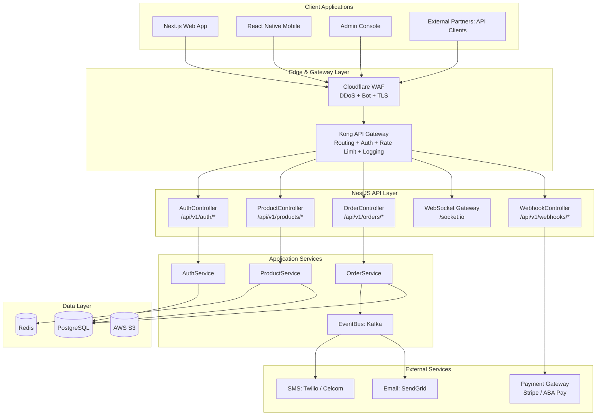

### 2.2 API Service Boundary Map

| Service | Base Path | Responsible Module | Primary Data |
| :--- | :--- | :--- | :--- |
| Authentication | `/api/v1/auth` | AuthModule | Users, Sessions, Tokens |
| Users | `/api/v1/users` | UserModule | User profiles, Roles |
| Tenants | `/api/v1/tenants` | TenantModule | Tenant config, Plans |
| Branches | `/api/v1/branches` | OrganizationModule | Branch records |
| Products | `/api/v1/products` | InventoryModule | Products, Categories, Stock |
| Orders | `/api/v1/orders` | POSModule | Orders, Order Items |
| Payments | `/api/v1/payments` | FinanceModule | Payment records |
| Invoices | `/api/v1/invoices` | FinanceModule | Invoice headers + items |
| Customers | `/api/v1/customers` | CRMModule | Customer master |
| Employees | `/api/v1/employees` | HRModule | Employee records |
| Reports | `/api/v1/reports` | AnalyticsModule | Report data |
| Webhooks | `/api/v1/webhooks` | IntegrationModule | Inbound webhooks |

---

## SECTION 3 — REST API DESIGN STANDARD

### 3.1 Resource Naming Conventions

| Convention | Rule | Correct | Incorrect |
| :--- | :--- | :--- | :--- |
| **Plural nouns** | Resources are plural nouns | `/products`, `/orders`, `/customers` | `/product`, `/getOrder` |
| **Lowercase** | All lowercase, hyphenated | `/order-items`, `/stock-movements` | `/OrderItems`, `/stockMovements` |
| **Hierarchy** | Nested resources for ownership | `/orders/{id}/items` | `/order-items?orderId={id}` |
| **No verbs** | HTTP method implies the action | `POST /orders` | `/createOrder` |
| **IDs in path** | Specific resource by ID in path | `/products/{id}` | `/products?id={id}` |

### 3.2 HTTP Methods and Semantics

| Method | Use Case | Idempotent | Safe | Example |
| :--- | :--- | :--- | :--- | :--- |
| **GET** | Read single or list of resources | ✅ | ✅ | `GET /products/{id}` |
| **POST** | Create new resource | ❌ | ❌ | `POST /products` |
| **PATCH** | Partial update (only fields provided) | ✅ | ❌ | `PATCH /products/{id}` |
| **PUT** | Full resource replacement | ✅ | ❌ | `PUT /products/{id}` |
| **DELETE** | Delete / soft-delete resource | ✅ | ❌ | `DELETE /products/{id}` |

### 3.3 HTTP Status Code Standards

| Code | Meaning | Usage |
| :--- | :--- | :--- |
| **200 OK** | Success (GET, PATCH, PUT) | Successful read or update |
| **201 Created** | Resource created (POST) | New product, order, user created |
| **204 No Content** | Success, no body (DELETE) | Product deleted, session ended |
| **400 Bad Request** | Invalid request format | Missing required field; malformed JSON |
| **401 Unauthorized** | Authentication required or failed | No token; expired token; invalid signature |
| **403 Forbidden** | Authenticated but not authorized | Role insufficient; wrong tenant |
| **404 Not Found** | Resource does not exist | Product ID not found in this tenant |
| **409 Conflict** | Duplicate resource | SKU already exists for this tenant |
| **422 Unprocessable** | Validation failed (business rule) | Stock would go negative; invalid transition |
| **429 Too Many Requests** | Rate limit exceeded | 6th login attempt in 15 min |
| **500 Internal Server Error** | Unexpected server failure | Unhandled exception; DB connection failure |
| **502 Bad Gateway** | Upstream service failure | Payment gateway timeout |
| **503 Service Unavailable** | Maintenance or overload | Scheduled maintenance window |

### 3.4 Request Structure Standards

```
All API requests must include:

Headers (Required):
  Authorization: Bearer {access_token}       ← JWT access token
  X-Tenant-ID:   {tenant-uuid}               ← Tenant context
  Content-Type:  application/json            ← For POST/PATCH/PUT
  X-Request-ID:  {client-generated-uuid}     ← For distributed tracing (optional; generated by server if absent)

Query Parameters (Standard):
  ?page=1                                    ← 1-indexed page number
  &pageSize=20                               ← Items per page (max: 1000)
  &sortBy=createdAt                          ← Field to sort by
  &sortOrder=desc                            ← asc | desc
  &search=coffee                             ← Full-text search term

Path Parameters:
  /products/{id}                             ← Always UUID; validated by ParseUUIDPipe
```

---

## SECTION 4 — API VERSIONING STRATEGY

### 4.1 Versioning Approach

We use **URI path versioning** — the version number is part of the URL. This is the most explicit and developer-friendly approach:

```
Current:   /api/v1/products
Next:      /api/v2/products
```

### 4.2 NestJS Versioning Configuration

```typescript
// main.ts
app.enableVersioning({
  type: VersioningType.URI,
  defaultVersion: '1',    // Routes without @Version() default to v1
  prefix: 'v',
});
app.setGlobalPrefix('api');

// Controller-level versioning
@Controller({ path: 'products', version: '1' })   // Handles /api/v1/products
export class ProductControllerV1 { ... }

@Controller({ path: 'products', version: '2' })   // Handles /api/v2/products
export class ProductControllerV2 { ... }

// Method-level versioning (for gradual migration)
@Version('2')
@Get(':id')
async findByIdV2(@Param('id') id: string) { ... }
```

### 4.3 Breaking vs Non-Breaking Changes

| Change Type | Breaking | Version Bump Required |
| :--- | :--- | :--- |
| Add new optional field to response | ❌ | No — additive |
| Add new optional query parameter | ❌ | No — additive |
| Add new endpoint | ❌ | No — additive |
| Remove a field from response | ✅ | Yes — major version |
| Change field name | ✅ | Yes — major version |
| Change field type (`string` → `number`) | ✅ | Yes — major version |
| Change HTTP method for existing route | ✅ | Yes — major version |
| Change required authentication | ✅ | Yes — major version |
| Change HTTP status code returned | ✅ | Yes — major version |

### 4.4 Deprecation Process

```
Step 1: Add Deprecation header to all responses from deprecated endpoint
  Deprecation: "2026-12-01"
  Sunset: "2027-06-01"
  Link: <https://docs.platform.io/api/migration/v1-to-v2>; rel="deprecation"

Step 2: Update Developer Portal with migration guide (6 months before sunset)
Step 3: Email notification to all registered API consumers
Step 4: Monitor traffic to deprecated endpoints via Datadog
Step 5: Remove endpoint at sunset date (after zero-traffic confirmation)
Step 6: Return 410 Gone after sunset with migration URL
```

---

## SECTION 5 — REQUEST LIFECYCLE

### 5.1 Complete Request Processing Pipeline

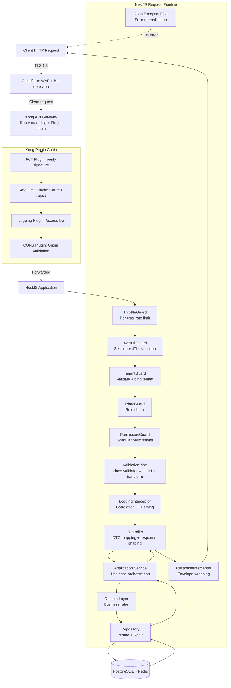

### 5.2 Timing Benchmarks Per Stage

| Pipeline Stage | Target Duration | Alert Threshold |
| :--- | :--- | :--- |
| **Kong routing + plugins** | < 2 ms | > 10 ms |
| **JWT validation** | < 1 ms | > 5 ms |
| **NestJS guard chain** | < 3 ms | > 15 ms |
| **DTO validation** | < 1 ms | > 5 ms |
| **Service + domain logic** | < 10 ms | > 50 ms |
| **Database query (simple)** | < 5 ms | > 30 ms |
| **Database query (complex)** | < 50 ms | > 150 ms |
| **Redis cache read** | < 1 ms | > 5 ms |
| **Total API response (transactional)** | < 100 ms p50 / < 200 ms p95 | > 500 ms p99 |

### 5.3 Correlation ID Tracking

```typescript
// common/interceptors/logging.interceptor.ts
@Injectable()
export class LoggingInterceptor implements NestInterceptor {
  private readonly logger = new Logger(LoggingInterceptor.name);

  intercept(context: ExecutionContext, next: CallHandler): Observable<unknown> {
    const request = context.switchToHttp().getRequest<Request>();

    // Generate or forward correlation ID for distributed tracing
    const requestId = (request.headers['x-request-id'] as string) ?? generateId();
    request['requestId'] = requestId;
    AsyncLocalStorage.run({ requestId }, () => {});

    const { method, url } = request;
    const startTime = Date.now();

    return next.handle().pipe(
      tap({
        next: () => {
          const duration = Date.now() - startTime;
          this.logger.log({ message: `${method} ${url}`, requestId, duration, status: 'SUCCESS' });
        },
        error: (error: Error) => {
          const duration = Date.now() - startTime;
          this.logger.error({ message: `${method} ${url}`, requestId, duration, error: error.message });
        },
      }),
    );
  }
}
```

---

## SECTION 6 — API GATEWAY ARCHITECTURE

### 6.1 Kong API Gateway Configuration

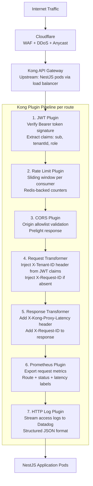

### 6.2 Kong Route Configuration

```yaml
# kong/kong.yaml (declarative configuration)
_format_version: "3.0"

services:
  - name: saas-api-service
    url: http://nestjs-api:3001
    connect_timeout: 5000
    read_timeout: 30000
    write_timeout: 30000

routes:
  - name: api-v1-public
    service: saas-api-service
    paths: ["/api/v1/auth", "/api/v1/webhooks"]
    methods: ["GET", "POST"]
    strip_path: false
    plugins:
      - name: rate-limiting
        config:
          minute: 30
          hour: 500
          policy: redis
          redis_host: redis

  - name: api-v1-protected
    service: saas-api-service
    paths: ["/api/v1"]
    methods: ["GET", "POST", "PATCH", "PUT", "DELETE"]
    strip_path: false
    plugins:
      - name: jwt
        config:
          claims_to_verify: ["exp", "iat"]
          key_claim_name: "sub"
      - name: rate-limiting
        config:
          minute: 300
          hour: 10000
          policy: redis
          redis_host: redis
      - name: request-transformer
        config:
          add:
            headers:
              - "X-Tenant-ID:$(jwt.claims.tenantId)"
              - "X-User-Role:$(jwt.claims.role)"
      - name: prometheus

  - name: websocket
    service: saas-api-service
    paths: ["/socket.io"]
    protocols: ["http", "https", "ws", "wss"]
```

### 6.3 Gateway Responsibilities

| Responsibility | Kong Plugin | Value |
| :--- | :--- | :--- |
| **TLS Termination** | Cloudflare upstream | Offloads SSL from application; TLS 1.3 enforced. |
| **Request Routing** | Route matching | Path + method routing to correct service; future microservice routing. |
| **JWT Verification** | `jwt` plugin | First-line token signature check before request reaches NestJS. |
| **Rate Limiting** | `rate-limiting` plugin | Redis-backed sliding window counters; per-consumer and per-route limits. |
| **CORS** | `cors` plugin | Origin validation; preflight caching; credential headers. |
| **Request Enrichment** | `request-transformer` | Inject `X-Tenant-ID`, `X-User-Role` from verified JWT claims. |
| **Load Balancing** | Kong upstream targets | Round-robin across NestJS pod replicas; health-check-based failover. |
| **Access Logging** | `http-log` plugin | Structured access logs to Datadog; every request recorded. |
| **Metrics** | `prometheus` plugin | Latency histograms; request counts by route; error rates. |

---

## SECTION 7 — NESTJS CONTROLLER ARCHITECTURE

### 7.1 Controller Responsibility Boundaries

```
✅ Controller DOES:
  - Define HTTP routes and methods
  - Extract and map request data (params, query, body, headers)
  - Call the appropriate application service method
  - Map service response to DTO
  - Return ApiResponse-wrapped result
  - Apply Guards, Pipes, and Interceptors via decorators

❌ Controller MUST NOT:
  - Contain business logic or domain rules
  - Call repository or database directly
  - Make decisions based on data content
  - Handle transactions
  - Know about Prisma, Redis, or external services
```

### 7.2 Complete Controller Example: Orders

```typescript
// modules/pos/controllers/order.controller.ts
@ApiTags('Orders')
@ApiBearerAuth()
@UseGuards(JwtAuthGuard, TenantGuard, RbacGuard, PermissionGuard)
@UseInterceptors(LoggingInterceptor)
@Controller({ path: 'orders', version: '1' })
export class OrderController {
  constructor(private readonly orderService: OrderService) {}

  @Post()
  @Roles(UserRole.CASHIER, UserRole.MANAGER, UserRole.BUSINESS_OWNER)
  @RequirePermissions('pos.order.create')
  @ApiOperation({ summary: 'Create a new POS order' })
  @ApiResponse({ status: 201, type: OrderResponseDto })
  async create(
    @Body() dto: CreateOrderDto,
    @CurrentUser() user: AuthUser,
    @TenantId() tenantId: string,
  ): Promise<ApiResponse<OrderResponseDto>> {
    const order = await this.orderService.create({ ...dto, tenantId, cashierId: user.id });
    return ApiResponse.created(OrderMapper.toResponse(order));
  }

  @Get()
  @Roles(UserRole.CASHIER, UserRole.MANAGER, UserRole.BUSINESS_OWNER)
  @RequirePermissions('pos.order.read')
  @ApiOperation({ summary: 'List orders with pagination and filters' })
  async findAll(
    @Query() query: OrderQueryDto,
    @TenantId() tenantId: string,
  ): Promise<ApiResponse<PaginatedResult<OrderResponseDto>>> {
    const result = await this.orderService.findAll(tenantId, query);
    return ApiResponse.success(result);
  }

  @Get(':id')
  @Roles(UserRole.CASHIER, UserRole.MANAGER, UserRole.BUSINESS_OWNER)
  @RequirePermissions('pos.order.read')
  @ApiOperation({ summary: 'Get order by ID' })
  async findOne(
    @Param('id', ParseUUIDPipe) id: string,
    @TenantId() tenantId: string,
  ): Promise<ApiResponse<OrderResponseDto>> {
    const order = await this.orderService.findById(id, tenantId);
    return ApiResponse.success(OrderMapper.toResponse(order));
  }

  @Post(':id/complete')
  @Roles(UserRole.CASHIER, UserRole.MANAGER, UserRole.BUSINESS_OWNER)
  @RequirePermissions('pos.order.create')
  @ApiOperation({ summary: 'Complete order with payment' })
  async complete(
    @Param('id', ParseUUIDPipe) id: string,
    @Body() dto: CompleteOrderDto,
    @CurrentUser() user: AuthUser,
    @TenantId() tenantId: string,
  ): Promise<ApiResponse<OrderResponseDto>> {
    const order = await this.orderService.complete(id, tenantId, { ...dto, cashierId: user.id });
    return ApiResponse.success(OrderMapper.toResponse(order));
  }

  @Post(':id/void')
  @Roles(UserRole.MANAGER, UserRole.BUSINESS_OWNER)
  @RequirePermissions('pos.order.void')
  @HttpCode(200)
  @ApiOperation({ summary: 'Void a completed order' })
  async void(
    @Param('id', ParseUUIDPipe) id: string,
    @Body() dto: VoidOrderDto,
    @CurrentUser() user: AuthUser,
    @TenantId() tenantId: string,
  ): Promise<ApiResponse<OrderResponseDto>> {
    const order = await this.orderService.void(id, tenantId, { ...dto, voidedBy: user.id });
    return ApiResponse.success(OrderMapper.toResponse(order));
  }

  @Get(':id/receipt')
  @Roles(UserRole.CASHIER, UserRole.MANAGER, UserRole.BUSINESS_OWNER)
  @RequirePermissions('pos.order.read')
  @ApiOperation({ summary: 'Generate order receipt as PDF URL' })
  async generateReceipt(
    @Param('id', ParseUUIDPipe) id: string,
    @TenantId() tenantId: string,
  ): Promise<ApiResponse<{ receiptUrl: string }>> {
    const url = await this.orderService.generateReceipt(id, tenantId);
    return ApiResponse.success({ receiptUrl: url });
  }
}
```

---

## SECTION 8 — DTO VALIDATION ARCHITECTURE

### 8.1 DTO Validation Pipeline

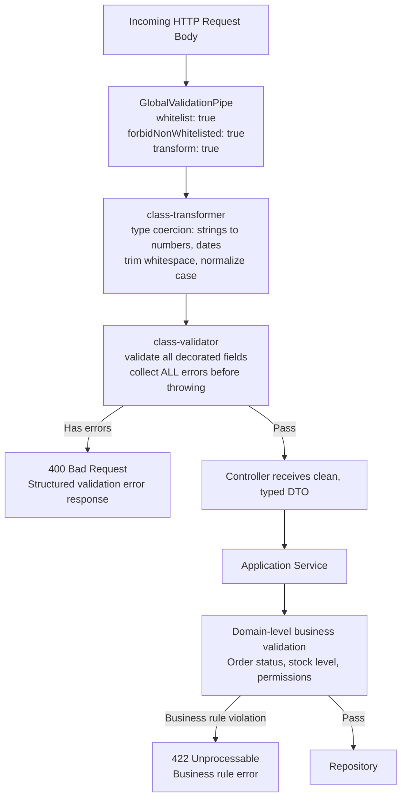

### 8.2 Comprehensive DTO Example: Create Order

```typescript
// modules/pos/dto/create-order.dto.ts
import {
  IsUUID, IsOptional, IsEnum, IsArray, ValidateNested,
  IsInt, IsPositive, IsNumber, Min, Max, IsString, MaxLength, ArrayMinSize
} from 'class-validator';
import { Type, Transform } from 'class-transformer';
import { ApiProperty, ApiPropertyOptional } from '@nestjs/swagger';

class OrderItemDto {
  @ApiProperty({ example: 'product-uuid-here' })
  @IsUUID()
  productId: string;

  @ApiProperty({ example: 2 })
  @IsInt()
  @IsPositive()
  @Max(9999)
  quantity: number;

  @ApiPropertyOptional({ example: 0.1, description: 'Discount rate: 0-1' })
  @IsOptional()
  @IsNumber({ maxDecimalPlaces: 4 })
  @Min(0)
  @Max(1)
  discountRate?: number;
}

export class CreateOrderDto {
  @ApiPropertyOptional({ example: 'branch-uuid-here' })
  @IsOptional()
  @IsUUID()
  branchId?: string;

  @ApiPropertyOptional({ example: 'customer-uuid-here' })
  @IsOptional()
  @IsUUID()
  customerId?: string;

  @ApiProperty({ type: [OrderItemDto] })
  @IsArray()
  @ArrayMinSize(1)
  @ValidateNested({ each: true })
  @Type(() => OrderItemDto)
  items: OrderItemDto[];

  @ApiProperty({ enum: ['USD', 'KHR', 'THB'], example: 'USD' })
  @IsEnum(['USD', 'KHR', 'THB'])
  currency: string;

  @ApiPropertyOptional({ example: 'No ice for item 1' })
  @IsOptional()
  @IsString()
  @MaxLength(500)
  @Transform(({ value }) => value?.trim())
  notes?: string;
}

// modules/pos/dto/order-query.dto.ts
export class OrderQueryDto {
  @IsOptional()
  @Type(() => Number)
  @IsInt()
  @Min(1)
  page: number = 1;

  @IsOptional()
  @Type(() => Number)
  @IsInt()
  @Min(1)
  @Max(100)
  pageSize: number = 20;

  @IsOptional()
  @IsEnum(['DRAFT', 'COMPLETED', 'VOIDED'])
  status?: string;

  @IsOptional()
  @IsUUID()
  branchId?: string;

  @IsOptional()
  @IsUUID()
  cashierId?: string;

  @IsOptional()
  @IsDateString()
  dateFrom?: string;

  @IsOptional()
  @IsDateString()
  dateTo?: string;

  @IsOptional()
  @IsEnum(['createdAt', 'totalAmount', 'completedAt'])
  sortBy?: string = 'createdAt';

  @IsOptional()
  @IsEnum(['asc', 'desc'])
  sortOrder?: 'asc' | 'desc' = 'desc';
}
```

---

## SECTION 9 — RESPONSE STANDARDIZATION

### 9.1 Standard Response Envelope

```typescript
// common/types/api-response.type.ts
export class ApiResponse<T> {
  success: boolean;
  data: T;
  meta?: PaginationMeta;
  error?: ApiError;
  timestamp: string;
  requestId: string;
  version: string;

  static success<T>(data: T, meta?: PaginationMeta): ApiResponse<T> {
    return {
      success: true, data, meta,
      timestamp: new Date().toISOString(),
      requestId: TenantContext.getRequestId(),
      version: 'v1',
      error: undefined,
    };
  }

  static created<T>(data: T): ApiResponse<T> {
    return ApiResponse.success(data);
  }

  static paginated<T>(
    data: T[],
    paginationMeta: PaginationMeta,
  ): ApiResponse<T[]> {
    return ApiResponse.success(data, paginationMeta);
  }
}

// PaginationMeta structure
export interface PaginationMeta {
  page: number;
  pageSize: number;
  totalItems: number;
  totalPages: number;
  hasNextPage: boolean;
  hasPreviousPage: boolean;
}
```

### 9.2 Success Response Examples

```json
// Single resource: GET /api/v1/products/{id}
{
  "success": true,
  "data": {
    "id": "prod-uuid-001",
    "sku": "ESP-001",
    "name": "Espresso Coffee",
    "unitPrice": "3.5000",
    "currency": "USD",
    "stock": 48,
    "isActive": true,
    "createdAt": "2026-01-15T08:00:00Z"
  },
  "meta": null,
  "timestamp": "2026-07-13T14:00:00Z",
  "requestId": "req-uuid-here",
  "version": "v1"
}

// Paginated list: GET /api/v1/products?page=1&pageSize=20
{
  "success": true,
  "data": [ { ... }, { ... } ],
  "meta": {
    "page": 1,
    "pageSize": 20,
    "totalItems": 143,
    "totalPages": 8,
    "hasNextPage": true,
    "hasPreviousPage": false
  },
  "timestamp": "2026-07-13T14:00:00Z",
  "requestId": "req-uuid-here",
  "version": "v1"
}
```

### 9.3 Error Response Format

```json
// Validation error: 400
{
  "success": false,
  "data": null,
  "error": {
    "code": "VALIDATION_ERROR",
    "message": "Request validation failed",
    "statusCode": 400,
    "details": [
      { "field": "unitPrice", "message": "unitPrice must be a positive number" },
      { "field": "sku", "message": "sku must be between 3 and 100 characters" }
    ]
  },
  "timestamp": "2026-07-13T14:00:00Z",
  "requestId": "req-uuid-here"
}

// Business rule error: 422
{
  "success": false,
  "data": null,
  "error": {
    "code": "INSUFFICIENT_STOCK",
    "message": "Insufficient stock for product 'Espresso Coffee'. Available: 2, Requested: 5",
    "statusCode": 422,
    "details": []
  },
  "timestamp": "2026-07-13T14:00:00Z",
  "requestId": "req-uuid-here"
}
```

---

## SECTION 10 — ERROR HANDLING ARCHITECTURE

### 10.1 Exception Hierarchy

```typescript
// common/exceptions/
// ─── Base exceptions ──────────────────────────────────────────────────────────
export class AppException extends Error {
  constructor(
    public readonly code: string,
    message: string,
    public readonly statusCode: number = 500,
    public readonly details: unknown[] = [],
  ) { super(message); }
}

// ─── Domain exceptions (422 Unprocessable) ────────────────────────────────────
export class DomainException extends AppException {
  constructor(code: string, message: string, details?: unknown[]) {
    super(code, message, 422, details);
  }
}

export class InsufficientStockException extends DomainException {
  constructor(productName: string, available: number, requested: number) {
    super('INSUFFICIENT_STOCK',
      `Insufficient stock for '${productName}'. Available: ${available}, Requested: ${requested}`
    );
  }
}

export class InvalidOrderTransitionException extends DomainException {
  constructor(from: string, to: string) {
    super('INVALID_ORDER_TRANSITION', `Cannot transition order from ${from} to ${to}`);
  }
}

// ─── Infrastructure exceptions ────────────────────────────────────────────────
export class ExternalServiceException extends AppException {
  constructor(service: string, message: string) {
    super(`EXTERNAL_SERVICE_ERROR`, `${service}: ${message}`, 502);
  }
}
```

### 10.2 Global Exception Filter

```typescript
// common/filters/global-exception.filter.ts
@Catch()
export class GlobalExceptionFilter implements ExceptionFilter {
  private readonly logger = new Logger(GlobalExceptionFilter.name);

  catch(exception: unknown, host: ArgumentsHost): void {
    const ctx = host.switchToHttp();
    const response = ctx.getResponse<Response>();
    const request = ctx.getRequest<Request>();
    const requestId = request['requestId'] ?? 'unknown';

    let status = 500;
    let code = 'INTERNAL_SERVER_ERROR';
    let message = 'An unexpected error occurred';
    let details: unknown[] = [];

    if (exception instanceof AppException) {
      // Our own exceptions — pass through as-is
      status = exception.statusCode;
      code = exception.code;
      message = exception.message;
      details = exception.details;

    } else if (exception instanceof HttpException) {
      // NestJS built-in exceptions (BadRequestException, NotFoundException, etc.)
      status = exception.getStatus();
      const body = exception.getResponse();
      if (typeof body === 'object' && body !== null) {
        code = (body as any).error ?? exception.name;
        message = Array.isArray((body as any).message)
          ? 'Validation failed'
          : (body as any).message ?? message;
        details = Array.isArray((body as any).message)
          ? (body as any).message.map((m: string) => ({ field: '', message: m }))
          : [];
      }

    } else if (exception instanceof Prisma.PrismaClientKnownRequestError) {
      // Prisma ORM known errors
      switch (exception.code) {
        case 'P2025': status = 404; code = 'NOT_FOUND'; message = 'Record not found'; break;
        case 'P2002': status = 409; code = 'DUPLICATE_ENTRY'; message = 'Record already exists'; break;
        case 'P2003': status = 409; code = 'FOREIGN_KEY_VIOLATION'; message = 'Referenced record not found'; break;
        default:      status = 500; code = `PRISMA_${exception.code}`;
      }

    } else if (exception instanceof Error) {
      // Unknown application error — log full details; return generic message to client
      this.logger.error({
        message: 'Unhandled exception',
        error: exception.message,
        stack: exception.stack,
        requestId,
        path: request.url,
      });
    }

    // Log all 5xx errors with full context
    if (status >= 500) {
      this.logger.error({ requestId, path: request.url, status, code, message });
    }

    response.status(status).json({
      success: false,
      data: null,
      error: { code, message, statusCode: status, details },
      timestamp: new Date().toISOString(),
      requestId,
    });
  }
}
```

---

## SECTION 11 — PAGINATION & FILTERING

### 11.1 Pagination Strategy

All `GET` list endpoints implement cursor-based or offset pagination with consistent behavior:

| Parameter | Type | Default | Max | Description |
| :--- | :--- | :--- | :--- | :--- |
| `page` | `integer` | `1` | — | Page number (1-indexed) |
| `pageSize` | `integer` | `20` | `1000` | Items per page |
| `sortBy` | `string` | `createdAt` | — | Field to sort by |
| `sortOrder` | `asc\|desc` | `desc` | — | Sort direction |
| `search` | `string` | — | 200 chars | Full-text search term |
| `dateFrom` | `ISO8601` | — | — | Filter: created_at >= dateFrom |
| `dateTo` | `ISO8601` | — | — | Filter: created_at <= dateTo |

### 11.2 Filtering Examples by Domain

```bash
# Products: filter by category, stock status, and search
GET /api/v1/products?categoryId=cat-uuid&inStock=true&search=coffee&sortBy=name&sortOrder=asc&page=1&pageSize=20

# Orders: filter by status, branch, and date range
GET /api/v1/orders?status=COMPLETED&branchId=branch-uuid&dateFrom=2026-07-01T00:00:00Z&dateTo=2026-07-13T23:59:59Z

# Transactions: filter by payment method and cashier
GET /api/v1/orders?cashierId=user-uuid&status=COMPLETED&sortBy=totalAmount&sortOrder=desc

# Customers: search by name or phone
GET /api/v1/customers?search=sopheak&sortBy=createdAt&sortOrder=desc&page=2&pageSize=50

# Employees: filter by department
GET /api/v1/employees?departmentId=dept-uuid&isActive=true
```

### 11.3 Pagination Service Helper

```typescript
// common/helpers/pagination.helper.ts
export function buildPrismaOrderBy(
  sortBy: string,
  sortOrder: 'asc' | 'desc',
  allowedFields: string[],
): Record<string, 'asc' | 'desc'> {
  const field = allowedFields.includes(sortBy) ? sortBy : 'createdAt';
  return { [field]: sortOrder };
}

export function buildPaginationMeta(
  total: number,
  page: number,
  pageSize: number,
): PaginationMeta {
  return {
    page,
    pageSize,
    totalItems: total,
    totalPages: Math.ceil(total / pageSize),
    hasNextPage: page * pageSize < total,
    hasPreviousPage: page > 1,
  };
}
```

---

## SECTION 12 — WEBSOCKET ARCHITECTURE

### 12.1 WebSocket Architecture

```mermaid
graph TD
    Client[Client: Next.js or React Native\nSocket.IO client] -->|wss: Upgrade| Kong[Kong Gateway\nWebSocket protocol support]
    Kong -->|Proxied| WSGateway[NestJS WebSocket Gateway\n@WebSocketGateway namespace=/ws]

    WSGateway --> WsAuthGuard[WsJwtGuard\nVerify JWT from handshake.auth.token]
    WsAuthGuard -->|Invalid| Disconnect[Disconnect client: 401]
    WsAuthGuard -->|Valid| RoomJoin[Join tenant+branch rooms\ntenant:{tenantId}:branch:{branchId}]

    RoomJoin --> EventHandler[Event Handlers\n@SubscribeMessage]
    EventHandler --> AppService[Application Services\nOrderService, DashboardService]
    AppService --> DB[(PostgreSQL + Redis)]

    subgraph ServerEvents [Server-to-Client Events]
        OrderCreated[order:created]
        OrderCompleted[order:completed]
        StockAlert[stock:low_alert]
        DashboardUpdate[dashboard:metrics_update]
        Notification[notification:new]
    end

    OrderService -->|Broadcast| OrderCreated
    OrderService -->|Broadcast| OrderCompleted
    InventoryService -->|Broadcast| StockAlert
    AnalyticsService -->|Broadcast| DashboardUpdate
```

### 12.2 WebSocket Gateway Implementation

```typescript
// modules/realtime/gateways/realtime.gateway.ts
@WebSocketGateway({
  namespace: '/ws',
  cors: {
    origin: process.env.ALLOWED_ORIGINS?.split(','),
    credentials: true,
  },
  pingInterval: 25000,
  pingTimeout: 5000,
})
export class RealtimeGateway implements OnGatewayConnection, OnGatewayDisconnect {
  @WebSocketServer() server: Server;
  private readonly logger = new Logger(RealtimeGateway.name);

  constructor(
    private readonly wsAuthGuard: WsJwtGuard,
    private readonly tenantService: TenantService,
  ) {}

  async handleConnection(client: Socket): Promise<void> {
    try {
      const user = await this.wsAuthGuard.validate(client.handshake.auth.token);
      client.data.user = user;

      // Join tenant-scoped rooms
      await client.join(`tenant:${user.tenantId}`);

      if (client.handshake.auth.branchId) {
        await client.join(`tenant:${user.tenantId}:branch:${client.handshake.auth.branchId}`);
      }

      this.logger.log(`Client connected: ${client.id} — User: ${user.id}`);
    } catch {
      client.emit('error', { code: 'UNAUTHORIZED', message: 'Invalid token' });
      client.disconnect(true);
    }
  }

  handleDisconnect(client: Socket): void {
    this.logger.log(`Client disconnected: ${client.id}`);
    client.leaveAll();
  }

  @SubscribeMessage('order:subscribe')
  handleOrderSubscribe(client: Socket, payload: { branchId: string }): void {
    client.join(`orders:${client.data.user.tenantId}:${payload.branchId}`);
    client.emit('order:subscribed', { branchId: payload.branchId });
  }

  @SubscribeMessage('dashboard:subscribe')
  handleDashboardSubscribe(client: Socket): void {
    client.join(`dashboard:${client.data.user.tenantId}`);
    client.emit('dashboard:subscribed');
  }

  // Called by OrderService after successful order completion
  broadcastOrderCompleted(tenantId: string, branchId: string, order: OrderResponseDto): void {
    this.server
      .to(`tenant:${tenantId}:branch:${branchId}`)
      .emit('order:completed', { order, timestamp: new Date().toISOString() });
  }

  // Called by InventoryService on low stock event
  broadcastStockAlert(tenantId: string, alert: StockAlertDto): void {
    this.server
      .to(`tenant:${tenantId}`)
      .emit('stock:low_alert', alert);
  }

  // Broadcast live dashboard metrics
  broadcastDashboardUpdate(tenantId: string, metrics: DashboardMetricsDto): void {
    this.server
      .to(`dashboard:${tenantId}`)
      .emit('dashboard:metrics_update', metrics);
  }
}
```

### 12.3 WebSocket Event Registry

| Event (Server → Client) | Trigger | Payload |
| :--- | :--- | :--- |
| `order:created` | New order draft created | `{ orderId, branchId, timestamp }` |
| `order:completed` | Order successfully completed | `{ order, totalAmount, paymentMethod }` |
| `order:voided` | Order voided | `{ orderId, reason, voidedBy }` |
| `stock:low_alert` | Product stock below `minStock` | `{ productId, name, stock, minStock }` |
| `stock:updated` | Stock movement recorded | `{ productId, delta, newStock }` |
| `dashboard:metrics_update` | Real-time KPI update | `{ totalSales, orderCount, topProduct }` |
| `notification:new` | New system notification | `{ id, type, title, message }` |
| `employee:clocked_in` | Employee time-clock event | `{ employeeId, name, branchId }` |

---

## SECTION 13 — EVENT COMMUNICATION

### 13.1 Internal Domain Event Pipeline

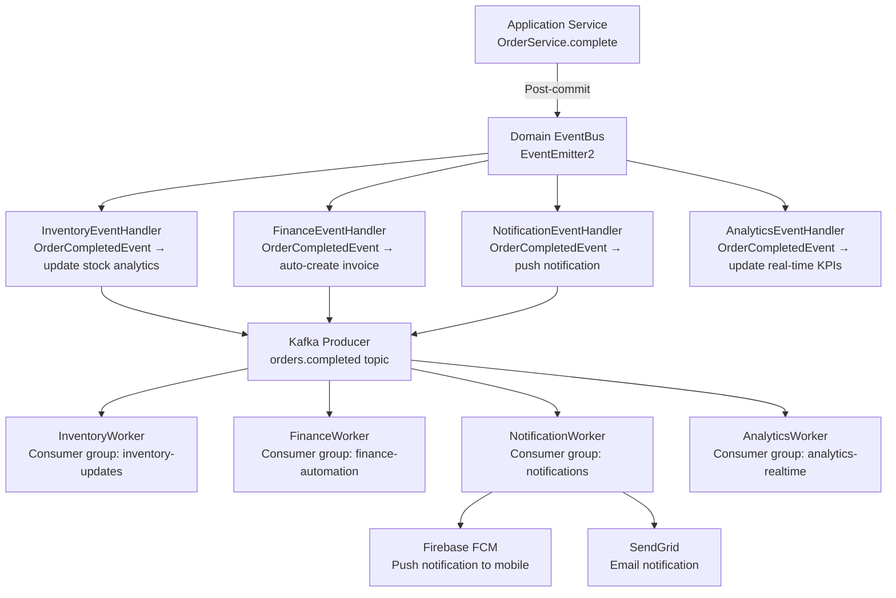

### 13.2 Domain Event System

```typescript
// common/events/domain-event.base.ts
export abstract class DomainEvent {
  readonly eventId: string = generateId();
  readonly occurredAt: Date = new Date();
  abstract readonly eventType: string;
}

// modules/pos/domain/events/order-completed.event.ts
export class OrderCompletedEvent extends DomainEvent {
  readonly eventType = 'ORDER_COMPLETED';
  constructor(
    public readonly orderId: string,
    public readonly tenantId: string,
    public readonly branchId: string,
    public readonly totalAmount: Money,
    public readonly items: Array<{ productId: string; quantity: number }>,
    public readonly cashierId: string,
  ) { super(); }
}

// modules/pos/handlers/order-completed.handler.ts
@EventsHandler(OrderCompletedEvent)
export class OrderCompletedHandler implements IEventHandler<OrderCompletedEvent> {
  constructor(
    private readonly kafkaProducer: KafkaProducer,
    private readonly wsGateway: RealtimeGateway,
  ) {}

  async handle(event: OrderCompletedEvent): Promise<void> {
    // 1. Publish to Kafka for async consumers
    await this.kafkaProducer.publish('orders.completed', {
      orderId: event.orderId,
      tenantId: event.tenantId,
      branchId: event.branchId,
      totalAmount: event.totalAmount.amount,
      currency: event.totalAmount.currency,
      items: event.items,
    }, event.orderId);  // Use orderId as Kafka key for ordering

    // 2. Real-time WebSocket broadcast (non-blocking)
    this.wsGateway.broadcastOrderCompleted(event.tenantId, event.branchId, {
      orderId: event.orderId,
      totalAmount: event.totalAmount.amount,
    });
  }
}
```

---

## SECTION 14 — EXTERNAL API INTEGRATION

### 14.1 Integration Layer Architecture

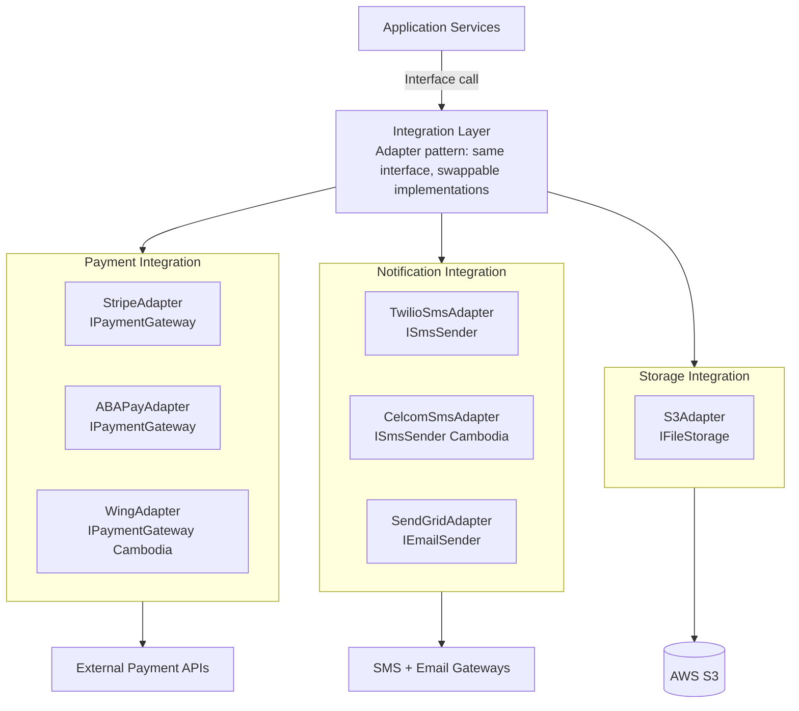

### 14.2 Payment Gateway Integration

```typescript
// integrations/payment/payment-gateway.interface.ts
export interface IPaymentGateway {
  createPaymentIntent(amount: Money, orderId: string, metadata: Record<string, string>): Promise<PaymentIntent>;
  confirmPayment(intentId: string): Promise<PaymentResult>;
  processRefund(paymentId: string, amount: Money, reason: string): Promise<RefundResult>;
  verifyWebhook(payload: string, signature: string): PaymentWebhookEvent;
}

// integrations/payment/stripe.adapter.ts
@Injectable()
export class StripeAdapter implements IPaymentGateway {
  private stripe: Stripe;

  constructor(private readonly configService: ConfigService) {
    this.stripe = new Stripe(configService.getOrThrow('STRIPE_SECRET_KEY'), {
      apiVersion: '2024-12-18.acacia',
      timeout: 10000,
    });
  }

  async createPaymentIntent(amount: Money, orderId: string): Promise<PaymentIntent> {
    try {
      const intent = await this.stripe.paymentIntents.create({
        amount: Math.round(amount.amount * 100),  // Stripe uses cents
        currency: amount.currency.toLowerCase(),
        metadata: { orderId },
        idempotencyKey: `order-${orderId}`,      // Prevent duplicate charges
      });
      return { id: intent.id, clientSecret: intent.client_secret!, status: intent.status };
    } catch (error) {
      throw new ExternalServiceException('Stripe', (error as Stripe.StripeError).message);
    }
  }

  verifyWebhook(payload: string, signature: string): PaymentWebhookEvent {
    const event = this.stripe.webhooks.constructEvent(
      payload,
      signature,
      this.configService.getOrThrow('STRIPE_WEBHOOK_SECRET'),
    );
    return this.mapStripeEvent(event);
  }
}
```

### 14.3 External Integration Registry

| Service | Type | Interface | Adapters | Fallback |
| :--- | :--- | :--- | :--- | :--- |
| **Stripe** | Payment | `IPaymentGateway` | `StripeAdapter` | ABA Pay |
| **ABA Pay** | Payment (Cambodia) | `IPaymentGateway` | `ABAPayAdapter` | Cash fallback |
| **Wing** | Payment (Cambodia) | `IPaymentGateway` | `WingAdapter` | — |
| **Twilio** | SMS | `ISmsSender` | `TwilioAdapter` | Celcom |
| **Celcom** | SMS (Cambodia) | `ISmsSender` | `CelcomSmsAdapter` | Smart Telecom |
| **SendGrid** | Email | `IEmailSender` | `SendGridAdapter` | SES fallback |
| **Firebase FCM** | Push notifications | `IPushNotifier` | `FCMAdapter` | Email fallback |
| **AWS S3** | File storage | `IFileStorage` | `S3Adapter` | — |
| **Google Maps** | Location/geocoding | `IGeocoder` | `GoogleMapsAdapter` | OpenStreetMap |

---

## SECTION 15 — API SECURITY ARCHITECTURE

### 15.1 Defense-in-Depth API Security Layers

```
Layer 1 — Network:        Cloudflare WAF; DDoS mitigation; IP reputation blocking
Layer 2 — TLS:            TLS 1.3 minimum; HSTS preload; certificate pinning (mobile)
Layer 3 — Gateway:        Kong JWT plugin; route-level rate limiting; CORS validation
Layer 4 — Application:    NestJS Guards (JWT → Tenant → RBAC → Permission)
Layer 5 — Validation:     GlobalValidationPipe; whitelist; forbidNonWhitelisted
Layer 6 — Data:           PostgreSQL RLS; Prisma tenant filter; parameterized queries
Layer 7 — Audit:          Every request logged; sensitive operations double-audited
```

### 15.2 API Key Authentication (External Partners)

```typescript
// For external integrations: machines use API keys, not JWT
// modules/auth/strategies/api-key.strategy.ts
@Injectable()
export class ApiKeyStrategy extends PassportStrategy(Strategy, 'api-key') {
  constructor(private readonly apiKeyService: ApiKeyService) {
    super({
      header: 'X-Api-Key',
      prefix: '',
    });
  }

  async validate(apiKey: string): Promise<ApiClient> {
    const keyHash = createHash('sha256').update(apiKey).digest('hex');
    const client = await this.apiKeyService.findByHash(keyHash);

    if (!client || !client.isActive) {
      throw new UnauthorizedException('Invalid or inactive API key');
    }

    if (client.expiresAt && client.expiresAt < new Date()) {
      throw new UnauthorizedException('API key has expired');
    }

    return client;
  }
}
```

### 15.3 Request Signature Validation (Webhooks)

```typescript
// common/guards/webhook-signature.guard.ts
@Injectable()
export class WebhookSignatureGuard implements CanActivate {
  canActivate(context: ExecutionContext): boolean {
    const request = context.switchToHttp().getRequest<RawBodyRequest<Request>>();
    const signature = request.headers['x-webhook-signature'] as string;
    const rawBody = request.rawBody;

    if (!signature || !rawBody) throw new BadRequestException('Missing webhook signature');

    const expectedSig = createHmac('sha256', process.env.WEBHOOK_SECRET!)
      .update(rawBody)
      .digest('hex');

    if (!timingSafeEqual(Buffer.from(signature, 'hex'), Buffer.from(expectedSig, 'hex'))) {
      throw new UnauthorizedException('Invalid webhook signature');
    }

    return true;
  }
}
```

---

## SECTION 16 — API DOCUMENTATION

### 16.1 OpenAPI Configuration

```typescript
// main.ts — Swagger setup
const config = new DocumentBuilder()
  .setTitle('SaaS Business Management Platform API')
  .setDescription(`
## Overview
Enterprise REST API for the SaaS Business Management Platform.
This API supports all business operations including POS, Inventory, Finance, HR, and CRM.

## Authentication
All endpoints require a Bearer JWT token unless marked as Public.
Include the token in the Authorization header: \`Authorization: Bearer {token}\`

## Versioning
Current version: v1. All endpoints are prefixed with \`/api/v1/\`.

## Rate Limits
- Standard endpoints: 300 requests/minute per user
- Auth endpoints: 5 requests/15 minutes per email

## Support
API documentation: https://docs.platform.io/api
Developer portal: https://developer.platform.io
  `)
  .setVersion('1.0.0')
  .addBearerAuth({ type: 'http', scheme: 'bearer', bearerFormat: 'JWT' }, 'JWT')
  .addApiKey({ type: 'apiKey', in: 'header', name: 'X-Api-Key' }, 'ApiKey')
  .addServer('https://api.platform.io', 'Production')
  .addServer('https://api.staging.platform.io', 'Staging')
  .addServer('http://localhost:3001', 'Local Development')
  .addTag('Authentication', 'User login, registration, token management')
  .addTag('Products', 'Product and inventory management')
  .addTag('Orders', 'POS order management')
  .addTag('Customers', 'CRM customer management')
  .addTag('Employees', 'HR employee management')
  .addTag('Reports', 'Analytics and reporting')
  .build();

const document = SwaggerModule.createDocument(app, config, {
  operationIdFactory: (controllerKey, methodKey) => methodKey,
  deepScanRoutes: true,
});

SwaggerModule.setup('docs', app, document, {
  swaggerOptions: {
    persistAuthorization: true,
    tagsSorter: 'alpha',
    operationsSorter: 'alpha',
    docExpansion: 'none',
  },
  customSiteTitle: 'SaaS Platform API Docs',
  customCss: '.swagger-ui .topbar { background-color: #1a3a5c; }',
});
```

### 16.2 Swagger Decorator Standards

```typescript
// Every controller method must have these Swagger decorators:
@ApiTags('Products')                    // Tag grouping
@ApiBearerAuth('JWT')                   // Auth requirement shown in UI
@ApiOperation({
  summary: 'Create a new product',
  description: 'Creates a product in the tenant inventory. SKU must be unique per tenant.'
})
@ApiBody({ type: CreateProductDto })
@ApiResponse({ status: 201, type: ProductResponseDto, description: 'Product created successfully' })
@ApiResponse({ status: 400, description: 'Validation error — invalid request body' })
@ApiResponse({ status: 409, description: 'SKU already exists for this tenant' })
@ApiResponse({ status: 422, description: 'Business rule violation' })
```

### 16.3 Documentation Accessibility

| Documentation Type | URL | Audience |
| :--- | :--- | :--- |
| **Interactive Swagger UI** | `https://api.platform.io/docs` | Frontend + Backend engineers |
| **OpenAPI JSON spec** | `https://api.platform.io/docs-json` | SDK generators; API clients |
| **Developer Portal** | `https://developer.platform.io` | External integrators; partners |
| **Postman Collection** | `docs/api/postman-collection.json` | QA team; integration testing |
| **API Changelog** | `docs/api/CHANGELOG.md` | All consumers; deprecation notices |

---

## SECTION 17 — API TESTING STRATEGY

### 17.1 API Testing Pyramid

| Level | Tool | Coverage | Run In |
| :--- | :--- | :--- | :--- |
| **Controller Unit** | Jest + `@nestjs/testing` | Input/output mapping; guard decoration | Every PR |
| **API Integration** | Supertest + Jest | Happy path + error paths per endpoint | Every PR |
| **Contract Testing** | Pact (consumer-driven) | Frontend ↔ Backend contract | Weekly |
| **Performance** | k6 | Load test: 200 concurrent users | Pre-release |
| **Security** | OWASP ZAP + custom scripts | Auth bypass; injection; rate limit | Weekly |
| **E2E API Flow** | Playwright HTTP client | Full business workflow (register → login → create order → complete) | Nightly |

### 17.2 API Integration Test Template

```typescript
// modules/pos/__tests__/order.controller.e2e-spec.ts
describe('Order API (E2E)', () => {
  let app: INestApplication;
  let authToken: string;
  let tenantId: string;

  beforeAll(async () => {
    const module = await Test.createTestingModule({
      imports: [AppModule],
    }).compile();

    app = module.createNestApplication();
    applyGlobalPipesAndFilters(app);    // Apply same global config as main.ts
    await app.init();

    // Authenticate and get test token
    ({ authToken, tenantId } = await authenticateTestUser(app, 'cashier'));
  });

  describe('POST /api/v1/orders', () => {
    it('creates order with valid data — returns 201', async () => {
      const product = await createTestProduct(app, tenantId);

      const res = await request(app.getHttpServer())
        .post('/api/v1/orders')
        .set('Authorization', `Bearer ${authToken}`)
        .set('X-Tenant-ID', tenantId)
        .send({
          currency: 'USD',
          items: [{ productId: product.id, quantity: 2 }],
        });

      expect(res.status).toBe(201);
      expect(res.body.success).toBe(true);
      expect(res.body.data.status).toBe('DRAFT');
      expect(res.body.data.totalAmount).toBe(product.unitPrice * 2);
    });

    it('returns 400 on empty items array', async () => {
      const res = await request(app.getHttpServer())
        .post('/api/v1/orders')
        .set('Authorization', `Bearer ${authToken}`)
        .set('X-Tenant-ID', tenantId)
        .send({ currency: 'USD', items: [] });

      expect(res.status).toBe(400);
      expect(res.body.error.code).toBe('VALIDATION_ERROR');
    });

    it('returns 422 when stock is insufficient', async () => {
      const product = await createTestProduct(app, tenantId, { stock: 1 });

      const res = await request(app.getHttpServer())
        .post('/api/v1/orders')
        .set('Authorization', `Bearer ${authToken}`)
        .set('X-Tenant-ID', tenantId)
        .send({ currency: 'USD', items: [{ productId: product.id, quantity: 5 }] });

      expect(res.status).toBe(422);
      expect(res.body.error.code).toBe('INSUFFICIENT_STOCK');
    });

    it('returns 401 without authentication', async () => {
      const res = await request(app.getHttpServer())
        .post('/api/v1/orders')
        .send({ currency: 'USD', items: [] });
      expect(res.status).toBe(401);
    });

    it('returns 403 when cashier tries to void order', async () => {
      const cashierToken = await authenticateAs(app, 'CASHIER', tenantId);
      const res = await request(app.getHttpServer())
        .post('/api/v1/orders/some-id/void')
        .set('Authorization', `Bearer ${cashierToken}`)
        .set('X-Tenant-ID', tenantId)
        .send({ reason: 'test' });
      expect(res.status).toBe(403);
    });
  });

  afterAll(async () => await app.close());
});
```

---

## SECTION 18 — API MONITORING

### 18.1 Monitoring Architecture

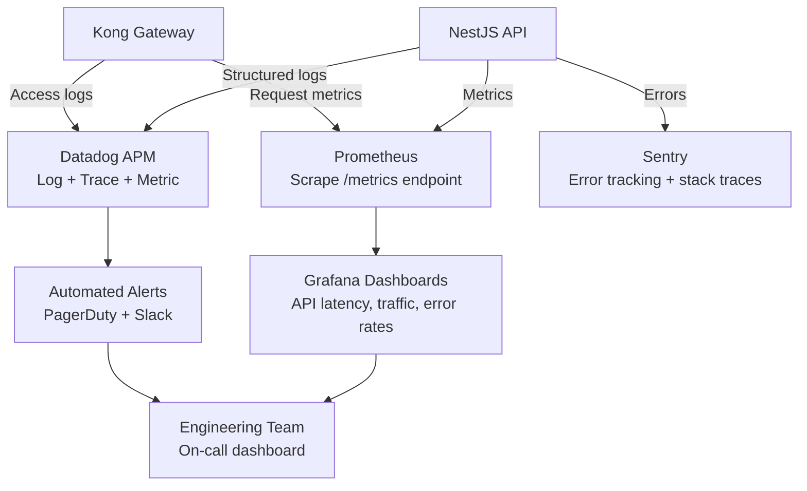

### 18.2 Custom Metrics with Prometheus

```typescript
// common/metrics/api-metrics.service.ts
import { Injectable } from '@nestjs/common';
import { InjectMetric } from '@willsoto/nestjs-prometheus';
import { Counter, Histogram, Gauge } from 'prom-client';

@Injectable()
export class ApiMetricsService {
  constructor(
    @InjectMetric('http_requests_total')
    private readonly requestCounter: Counter<string>,
    @InjectMetric('http_request_duration_seconds')
    private readonly requestDuration: Histogram<string>,
    @InjectMetric('active_websocket_connections')
    private readonly wsConnections: Gauge<string>,
  ) {}

  recordRequest(method: string, path: string, status: number, duration: number): void {
    this.requestCounter.inc({ method, path, status: String(status) });
    this.requestDuration.observe({ method, path }, duration / 1000);
  }

  setWsConnections(tenantId: string, count: number): void {
    this.wsConnections.set({ tenant_id: tenantId }, count);
  }
}
```

### 18.3 API Monitoring Alert Rules

| Metric | Warning | Critical | Response |
| :--- | :--- | :--- | :--- |
| **API Error Rate (5xx)** | > 0.5% | > 2% | PagerDuty; investigate error logs |
| **API Error Rate (4xx)** | > 10% | > 25% | Slack alert; check client behavior |
| **p95 Response Latency** | > 300 ms | > 1 s | Performance investigation; cache review |
| **p99 Response Latency** | > 1 s | > 3 s | PagerDuty; possible infra scaling |
| **Rate Limit Triggers** | > 100/min | > 500/min | Investigate abuse; adjust limits |
| **WebSocket Disconnects** | > 50/min | > 200/min | Check WebSocket gateway health |
| **Kong 502 Rate** | > 1% | > 5% | Check NestJS pod health; scale up |
| **DB Query Time (p99)** | > 200 ms | > 500 ms | Query optimization or cache miss |

---

## SECTION 19 — API GOVERNANCE

### 19.1 API Design Review Process

```
New API Endpoint Lifecycle:

1. CONTRACT FIRST
   → Developer writes OpenAPI YAML spec before coding
   → Spec reviewed by: API Architect + 1 senior backend engineer
   → Naming, status codes, response format reviewed against this document

2. DTO REVIEW
   → All DTOs reviewed for completeness of validation
   → No `any` types; all fields decorated; transformation reviewed

3. SECURITY REVIEW
   → Every endpoint has explicit @Roles() or @Public()
   → Rate limiting appropriate for sensitivity
   → Audit logging for all mutating endpoints

4. DOCUMENTATION REQUIREMENT
   → @ApiOperation, @ApiResponse, @ApiBody on every endpoint
   → Postman collection updated before PR merge
   → CHANGELOG.md updated for any breaking change

5. TESTING REQUIREMENT
   → Integration test: happy path + validation error + auth error
   → Test coverage for new service methods ≥ 85%
```

### 19.2 API Governance Standards Table

| Standard | Rule | Enforcement |
| :--- | :--- | :--- |
| **URL naming** | Plural nouns, lowercase, hyphenated | ESLint custom rule + PR checklist |
| **Versioning** | Breaking changes bump major version | API Architect sign-off required |
| **Security** | Every route has explicit auth decoration | CI lint check for missing `@Public()` or `@Roles()` |
| **Documentation** | All endpoints documented in Swagger | CI check: `@ApiOperation` required on all controllers |
| **Error codes** | All errors use codes from `ErrorCode` enum | Custom lint rule checks exception instantiation |
| **Response format** | All responses use `ApiResponse<T>` envelope | TypeScript return type enforced |
| **Deprecation** | 6-month notice before removal | Deprecation header required + Developer Portal update |
| **Testing** | Integration test required for every new endpoint | CI gate: test file must exist alongside controller |

---

## SECTION 20 — FINAL API ARCHITECTURE DIAGRAMS

### 20.1 Enterprise API Architecture

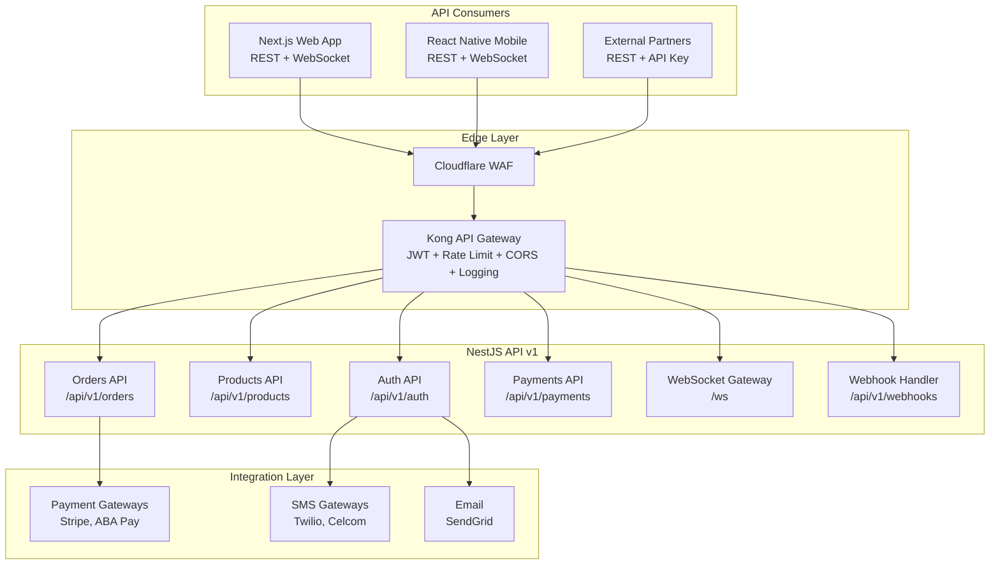

### 20.2 Request Lifecycle

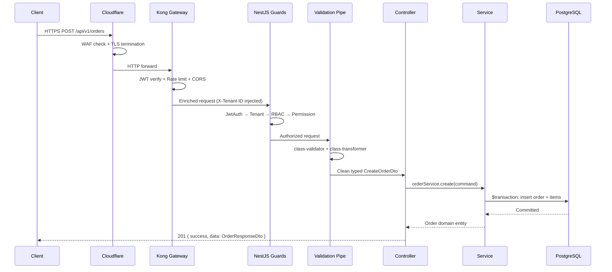

### 20.3 API Gateway Flow

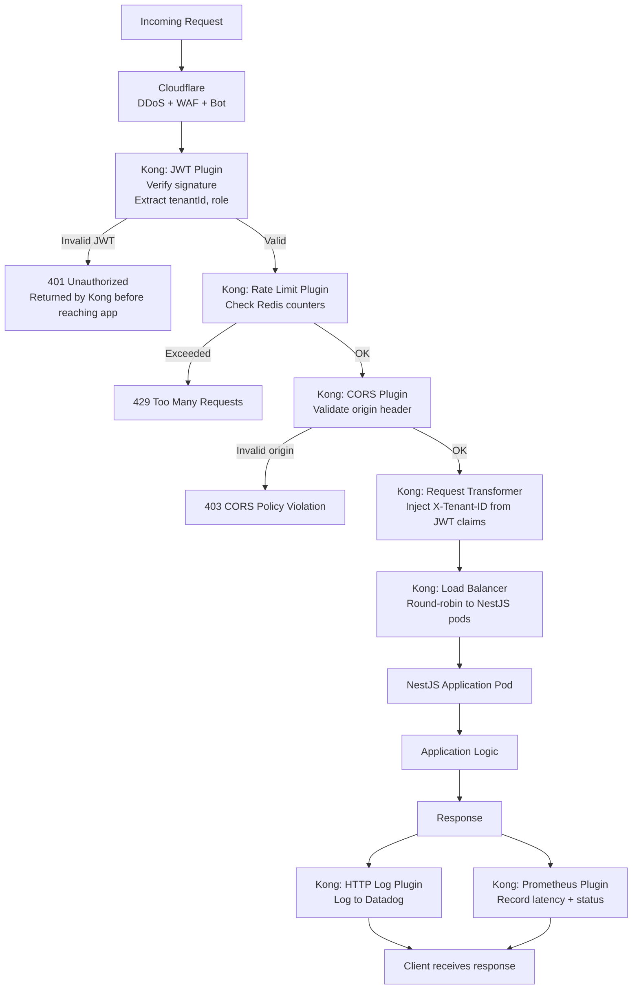

### 20.4 WebSocket Architecture

```mermaid
graph TD
    Client2[Browser / Mobile App\nSocket.IO client] -->|WSS Upgrade| Kong3[Kong Gateway\nWS protocol: pass-through]
    Kong3 --> Gateway[RealtimeGateway\n@WebSocketGateway /ws]

    Gateway --> WsAuth[WsJwtGuard\nExtract + verify token from handshake]
    WsAuth -->|Valid| Rooms[Join tenant rooms\ntenant:{tenantId}\ntenant:{tenantId}:branch:{branchId}]

    Rooms --> Subscribe[@SubscribeMessage handlers\norder:subscribe\ndashboard:subscribe]

    subgraph ServerBroadcast [Application → Client Events]
        BcastOrder[broadcastOrderCompleted\nEmit to branch room]
        BcastStock[broadcastStockAlert\nEmit to tenant room]
        BcastDash[broadcastDashboardUpdate\nEmit to dashboard room]
    end

    OrderService2[OrderService] --> BcastOrder
    InventoryService2[InventoryService] --> BcastStock
    AnalyticsService2[AnalyticsService] --> BcastDash
    BcastOrder --> Rooms
    BcastStock --> Rooms
    BcastDash --> Rooms
```

### 20.5 External Integration Architecture

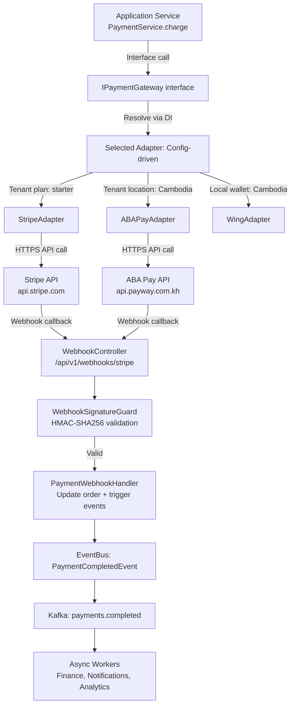

---

## APPENDIX A — API QUICK REFERENCE

```
Base URL:            https://api.platform.io/api/v1/
Auth:                Bearer JWT (access token, 15 min)
Tenant Context:      X-Tenant-ID header (injected by Kong from JWT)
Rate Limits:         300 req/min (standard), 5 req/15min (login)
Pagination:          ?page=1&pageSize=20 (max: 1000)
Sorting:             ?sortBy=createdAt&sortOrder=desc
Search:              ?search=keyword (full-text, max 200 chars)
Response Format:     { success, data, meta, error, timestamp, requestId }
Error Format:        { code, message, statusCode, details[] }
WebSocket URL:       wss://api.platform.io/ws
WebSocket Auth:      socket.io handshake: { auth: { token: 'Bearer ...' } }
API Docs:            https://api.platform.io/docs (Swagger UI)
API Spec:            https://api.platform.io/docs-json (OpenAPI 3.1)
```

## APPENDIX B — API ERROR CODE REFERENCE

| Code | HTTP Status | Description |
| :--- | :--- | :--- |
| `VALIDATION_ERROR` | 400 | DTO field validation failed |
| `UNAUTHORIZED` | 401 | Missing or invalid JWT |
| `FORBIDDEN` | 403 | Insufficient role or permission |
| `NOT_FOUND` | 404 | Resource not found in tenant |
| `DUPLICATE_ENTRY` | 409 | Unique constraint violation (e.g., duplicate SKU) |
| `INVALID_ORDER_TRANSITION` | 422 | Invalid business state transition |
| `INSUFFICIENT_STOCK` | 422 | Stock too low for requested quantity |
| `BUSINESS_RULE_VIOLATION` | 422 | Generic domain rule violation |
| `RATE_LIMITED` | 429 | Too many requests |
| `INTERNAL_SERVER_ERROR` | 500 | Unexpected application error |
| `EXTERNAL_SERVICE_ERROR` | 502 | Third-party service (payment, SMS) failure |
| `SERVICE_UNAVAILABLE` | 503 | Maintenance or overload |

---

*End of Backend API Architecture, Gateway & Enterprise Communication Layer*  
*Document maintained by: Principal API Architect & Backend Platform Engineer | Status: Approved API Architecture & Enterprise Communication Specification*
