# BACKEND BUSINESS LOGIC, WORKFLOW ENGINE & TRANSACTION ARCHITECTURE

**Project Name:** Enterprise SaaS Business Management Platform  
**Document Version:** 1.0.0 — Baseline Standard  
**Date:** July 13, 2026  
**Authors:** Principal Backend Architect, Business Logic Architect, DDD Specialist, Workflow Engine Architect & Transaction Processing Expert  
**Classification:** Enterprise Internal — Unrestricted  
**Status:** 🏛️ APPROVED BUSINESS LOGIC & WORKFLOW ARCHITECTURE SPECIFICATION  

---

## SECTION 1 — BUSINESS LOGIC FOUNDATION

### 1.1 What Is Business Logic?

Business logic is the set of **rules, processes, and decisions** that define how the business operates. It answers: *"What should happen when this business event occurs?"* — not how to store data or how to transmit it, but purely what the business rules say should happen.

```
User Action Example:
  Cashier clicks "Complete Sale" at POS

Business Logic Triggered:
  1. Can this order be completed? (status must be DRAFT)
  2. Does stock exist for every item? (quantity available >= quantity ordered)
  3. What is the correct price? (unit price × quantity − discount + tax)
  4. Is the payment amount sufficient? (payment >= total amount)
  5. Should loyalty points be added? (customer exists + plan supports it)
  6. What notifications should be sent? (manager if discount > 15%)
  7. What stock movements should be recorded? (one per item, SALE type)
  8. Should an invoice be auto-generated? (tenant setting: auto-invoice = true)

Data Updated As Result:
  - orders.status = COMPLETED
  - products.stock -= quantity (per item)
  - stock_movements (insert per item)
  - payments (insert)
  - loyalty_points (insert if applicable)
  - notifications (queue)
  - invoices (insert if auto-invoice)
```

### 1.2 Why Business Logic Must Be Independent

```
❌ Business Logic in Controller — WRONG
  → Controllers change when API protocol changes (REST → GraphQL)
  → Logic is untestable without HTTP context
  → Business rules are scattered across HTTP layer

❌ Business Logic in Repository — WRONG
  → Repositories change when ORM changes (Prisma → TypeORM)
  → Mixes data access concerns with business decisions
  → Domain invariants become leaky and bypassable

✅ Business Logic in Domain and Application Service Layer — CORRECT
  → Completely independent of HTTP, database, and framework
  → Testable with plain unit tests: no database, no HTTP needed
  → Business rules in one place — easy to find, update, and audit
  → Domain entities enforce their own invariants
  → Application services orchestrate use cases across domain objects
```

### 1.3 Enterprise Business Logic Principles

| Principle | Description | Enforcement |
| :--- | :--- | :--- |
| **Domain Centrality** | All business rules live in the domain layer. No rule in controllers, repositories, or handlers. | Code review checklist; ESLint no-direct-prisma-in-service rule. |
| **Invariant Protection** | Domain entities enforce their own invariants. An entity cannot exist in an invalid state. | Aggregates use factory methods; setters check rules before mutating. |
| **Explicit State Transitions** | Business state machines define allowed transitions. No direct status string assignment. | `OrderStateMachine.transition(from, to)` validates before setting. |
| **Idempotency** | Identical business operations produce identical results regardless of how many times they are executed. | Idempotency keys on all mutating operations; Redis deduplication. |
| **Auditability** | Every business action is traceable — who, what, when, before, after. | `AuditService.log()` called atomically within business transaction. |
| **Transactional Integrity** | Related business operations succeed or fail together. No partial business state. | `prisma.$transaction()` wraps all multi-step operations. |

---

## SECTION 2 — BUSINESS LOGIC LAYER ARCHITECTURE

### 2.1 Clean Architecture Layer Diagram

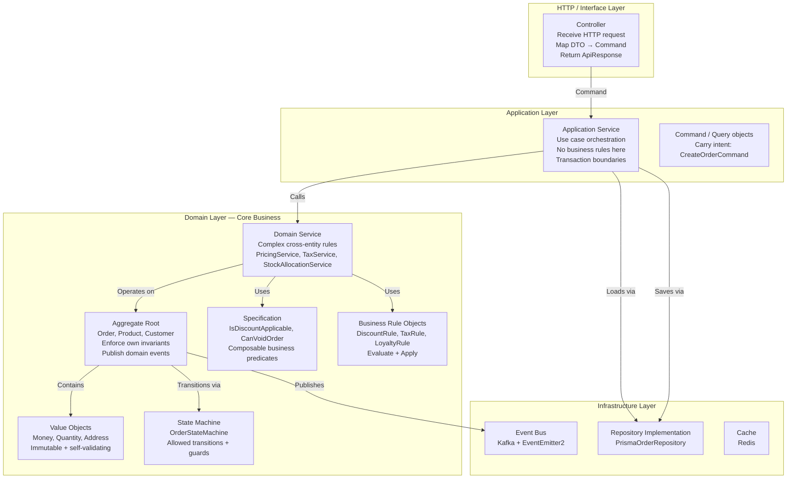

### 2.2 Layer Responsibility Matrix

| Layer | Knows About | Does NOT Know | Tested With |
| :--- | :--- | :--- | :--- |
| **Controller** | HTTP, DTOs, Application Service | Domain, DB, Redis | Supertest |
| **Application Service** | Commands, Domain, Repository interfaces | HTTP, Prisma, Redis | Jest (mocked repos) |
| **Domain Service** | Aggregates, Value Objects, Specifications | HTTP, DB, Cache | Jest (pure unit) |
| **Aggregate** | Own state, Value Objects, Domain Events | Application, DB, HTTP | Jest (pure unit) |
| **Repository (interface)** | Aggregate types, pagination | DB implementation | N/A (interface) |
| **Repository (Prisma impl)** | Prisma, DB schema, Domain mapper | Business rules, HTTP | Jest + TestDB |

---

## SECTION 3 — DOMAIN SERVICE DESIGN

### 3.1 Domain Service vs Application Service

```
Application Service (orchestration layer):
  → Loads aggregates from repositories
  → Calls domain services for business logic
  → Opens/closes transactions
  → Publishes domain events
  → Does NOT contain business rules

Domain Service (pure business logic):
  → Contains business rules that span multiple aggregates
  → Stateless: receives entities, returns results
  → Depends only on domain objects
  → Completely testable without infrastructure
```

### 3.2 Pricing Domain Service

```typescript
// domain/services/pricing.service.ts
@Injectable()
export class PricingDomainService {
  /**
   * Calculate the correct selling price for a product including:
   * - Applicable promotions (time-based, customer-tier-based)
   * - Manual discount (validated against discount rules)
   * - Tax calculation based on product tax category and tenant tax config
   */
  calculateLineTotal(
    product: Product,
    quantity: Quantity,
    manualDiscountRate: number = 0,
    customer: Customer | null,
    taxConfig: TaxConfiguration,
  ): LineTotalResult {
    // Step 1: Determine base price (check if product has active promotion)
    const basePrice = this.resolveEffectivePrice(product);

    // Step 2: Validate and apply discount
    const discountRule = new DiscountRule({
      product,
      customer,
      requestedRate: manualDiscountRate,
      maxAllowedRate: taxConfig.maxDiscountRate,
    });

    if (!discountRule.isSatisfied()) {
      throw new DomainException('DISCOUNT_EXCEEDS_LIMIT',
        `Discount rate ${manualDiscountRate * 100}% exceeds maximum ${taxConfig.maxDiscountRate * 100}% for this product.`
      );
    }

    const discountedPrice = basePrice.multiply(1 - manualDiscountRate);

    // Step 3: Calculate tax (exclusive or inclusive based on tenant setting)
    const taxAmount = taxConfig.taxInclusive
      ? basePrice.multiply(quantity.value).multiply(taxConfig.taxRate / (1 + taxConfig.taxRate))
      : discountedPrice.multiply(quantity.value).multiply(taxConfig.taxRate);

    const lineSubtotal = discountedPrice.multiply(quantity.value);
    const lineTotal = taxConfig.taxInclusive
      ? lineSubtotal
      : lineSubtotal.add(taxAmount);

    return new LineTotalResult({
      basePrice, discountedPrice, discountRate: manualDiscountRate,
      quantity, subtotal: lineSubtotal, taxAmount, lineTotal,
    });
  }

  private resolveEffectivePrice(product: Product): Money {
    const activePromotion = product.promotions.find(p =>
      p.isActive && p.startDate <= new Date() && p.endDate >= new Date()
    );
    return activePromotion ? activePromotion.promotionalPrice : product.unitPrice;
  }

  /**
   * Calculate order total from validated line items
   */
  calculateOrderTotal(items: LineTotalResult[], orderDiscountRate: number = 0): OrderTotalResult {
    const subtotal = items.reduce((sum, item) => sum.add(item.subtotal), Money.zero('USD'));
    const totalTax = items.reduce((sum, item) => sum.add(item.taxAmount), Money.zero('USD'));
    const orderDiscount = subtotal.multiply(orderDiscountRate);
    const grandTotal = subtotal.subtract(orderDiscount).add(totalTax);

    return new OrderTotalResult({ subtotal, totalTax, orderDiscount, grandTotal });
  }
}
```

### 3.3 Tax Calculation Service

```typescript
// domain/services/tax.service.ts
@Injectable()
export class TaxDomainService {
  /**
   * Resolve tax rate for a product based on:
   * - Product tax category (standard, zero-rated, exempt, reduced)
   * - Tenant jurisdiction tax configuration
   * - Customer tax exemption status
   */
  resolveTaxRate(
    product: Product,
    tenant: Tenant,
    customer: Customer | null,
  ): TaxRate {
    // Tax-exempt customer → zero tax
    if (customer?.hasTaxExemptCertificate()) return TaxRate.zero();

    // Zero-rated product category → zero tax
    if (product.taxCategory === TaxCategory.ZERO_RATED) return TaxRate.zero();
    if (product.taxCategory === TaxCategory.EXEMPT) return TaxRate.zero();

    // Standard or reduced rate from tenant configuration
    const tenantTaxRate = tenant.getTaxRateForCategory(product.taxCategory);
    return new TaxRate(tenantTaxRate);
  }
}
```

### 3.4 Stock Allocation Domain Service

```typescript
// domain/services/stock-allocation.service.ts
@Injectable()
export class StockAllocationDomainService {
  /**
   * Check if all order items can be fulfilled from available stock.
   * Returns allocation results per item.
   * Throws InsufficientStockException if any item cannot be fulfilled.
   */
  validateAndAllocate(
    items: Array<{ product: Product; quantity: Quantity }>,
  ): StockAllocationResult[] {
    const insufficientItems: string[] = [];

    const allocations = items.map(({ product, quantity }) => {
      if (!product.hasEnoughStock(quantity)) {
        insufficientItems.push(
          `${product.name} (available: ${product.stock.value}, requested: ${quantity.value})`
        );
        return null;
      }
      return new StockAllocationResult({ product, quantity, allocated: true });
    });

    if (insufficientItems.length > 0) {
      throw new InsufficientStockException(insufficientItems.join(', '));
    }

    return allocations as StockAllocationResult[];
  }
}
```

---

## SECTION 4 — BUSINESS RULE ENGINE

### 4.1 Business Rule Pattern

```typescript
// domain/rules/business-rule.interface.ts
export interface IBusinessRule {
  isSatisfied(): boolean;
  errorMessage(): string;
}

// Aggregate validates its rules before any mutation:
// if (!rule.isSatisfied()) throw new DomainException(rule.errorMessage());
```

### 4.2 Core Business Rules

```typescript
// domain/rules/discount.rule.ts
export class DiscountRule implements IBusinessRule {
  constructor(private readonly context: {
    product: Product;
    customer: Customer | null;
    requestedRate: number;
    maxAllowedRate: number;
  }) {}

  isSatisfied(): boolean {
    const { requestedRate, maxAllowedRate, customer, product } = this.context;

    // No discount: always valid
    if (requestedRate === 0) return true;

    // Cashier cannot give discount > max rate (unless manager override exists)
    if (requestedRate > maxAllowedRate) return false;

    // No discount on non-discountable products
    if (!product.isDiscountable) return false;

    // Loyalty customer gets extra 5% headroom
    if (customer?.isLoyaltyMember && requestedRate <= maxAllowedRate + 0.05) return true;

    return requestedRate <= maxAllowedRate;
  }

  errorMessage(): string {
    return `DISCOUNT_RULE_VIOLATED: Requested ${this.context.requestedRate * 100}% exceeds limit of ${this.context.maxAllowedRate * 100}%`;
  }
}

// domain/rules/order-void.rule.ts
export class OrderVoidRule implements IBusinessRule {
  constructor(private readonly context: {
    order: Order;
    requestedBy: User;
    voidWindowHours: number;
  }) {}

  isSatisfied(): boolean {
    const { order, requestedBy, voidWindowHours } = this.context;

    // Only completed orders can be voided (not already voided)
    if (order.status !== OrderStatus.COMPLETED) return false;

    // Manager can void within 24h window
    if (requestedBy.role === UserRole.MANAGER) {
      const hoursSinceCompletion = differenceInHours(new Date(), order.completedAt!);
      return hoursSinceCompletion <= voidWindowHours;
    }

    // Business owner can always void (no time limit)
    return requestedBy.role === UserRole.BUSINESS_OWNER;
  }

  errorMessage(): string {
    return 'ORDER_VOID_NOT_ALLOWED: Order cannot be voided. Check order status and time limit.';
  }
}

// domain/rules/inventory-reorder.rule.ts
export class InventoryReorderRule implements IBusinessRule {
  constructor(private readonly product: Product) {}

  isSatisfied(): boolean {
    return this.product.stock.value <= this.product.minStock.value;
  }

  errorMessage(): string {
    return `REORDER_NEEDED: ${this.product.name} stock ${this.product.stock.value} <= minimum ${this.product.minStock.value}`;
  }
}
```

### 4.3 Business Rule Registry

| Rule | Trigger | Condition | Action |
| :--- | :--- | :--- | :--- |
| `DiscountRule` | Apply discount | `rate <= maxRate` AND `product.isDiscountable` | Allow discount; else throw |
| `OrderVoidRule` | Void order | `status=COMPLETED` AND within time window | Allow void; else throw |
| `InventoryReorderRule` | Stock movement | `stock <= minStock` | Publish `LowStockAlertEvent` |
| `PaymentSufficientRule` | Complete order | `paymentAmount >= orderTotal` | Allow completion; else throw |
| `MaxRefundRule` | Process refund | `refundAmount <= originalPayment` | Allow refund; else throw |
| `DuplicateOrderRule` | Create order | Idempotency key not seen before | Allow; else return existing |
| `AccountLockedRule` | Login attempt | Fewer than 5 failed attempts | Allow login; else lock |

---

## SECTION 5 — WORKFLOW ENGINE ARCHITECTURE

### 5.1 Workflow Engine Design

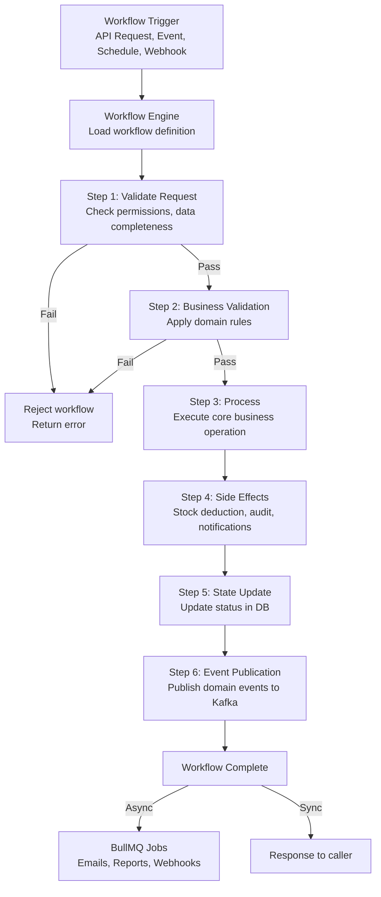

### 5.2 Purchase Order Approval Workflow

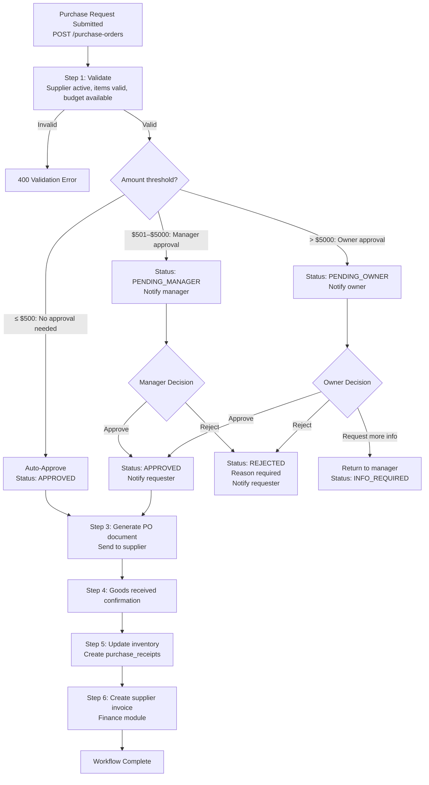

### 5.3 Workflow Step Executor Pattern

```typescript
// domain/workflow/workflow-step.interface.ts
export interface IWorkflowStep<TContext> {
  name: string;
  execute(context: TContext): Promise<TContext>;
  compensate?(context: TContext): Promise<void>;  // Rollback on failure
}

// domain/workflow/workflow.executor.ts
@Injectable()
export class WorkflowExecutor {
  private readonly logger = new Logger(WorkflowExecutor.name);

  async run<TContext>(
    steps: IWorkflowStep<TContext>[],
    initialContext: TContext,
  ): Promise<TContext> {
    let context = initialContext;
    const executed: IWorkflowStep<TContext>[] = [];

    for (const step of steps) {
      try {
        this.logger.log(`Executing workflow step: ${step.name}`);
        context = await step.execute(context);
        executed.push(step);
      } catch (error) {
        this.logger.error(`Workflow step failed: ${step.name}`, (error as Error).message);

        // Compensate executed steps in reverse order (saga pattern)
        for (const executedStep of [...executed].reverse()) {
          if (executedStep.compensate) {
            try {
              await executedStep.compensate(context);
            } catch (compensationError) {
              this.logger.error(`Compensation failed for: ${executedStep.name}`);
            }
          }
        }
        throw error;
      }
    }
    return context;
  }
}
```

---

## SECTION 6 — ORDER PROCESSING ARCHITECTURE

### 6.1 Complete Order Processing Flow

```mermaid
graph TD
    Request[POST /api/v1/orders/complete\n{ orderId, payment }] --> Load[Load Order aggregate\nWith items + product refs]

    Load --> ValidateOrder[Validate Order State\nMust be DRAFT\nOrderVoidRule equivalent]
    ValidateOrder -->|Invalid state| Err1[422 Invalid transition]

    ValidateOrder -->|Valid| LoadProducts[Load all Products\nWith current stock]
    LoadProducts --> AllocateStock[StockAllocationDomainService\nCheck all items have sufficient stock]
    AllocateStock -->|Insufficient| Err2[422 InsufficientStockException]

    AllocateStock -->|OK| CalcPrice[PricingDomainService\nRecalculate totals server-side\nNever trust client-submitted amounts]
    CalcPrice --> ValidatePayment[Validate Payment Sufficiency\nPaymentSufficientRule]
    ValidatePayment -->|Payment short| Err3[422 InsufficientPaymentException]

    ValidatePayment -->|OK| AtomicTx[BEGIN TRANSACTION]

    subgraph Transaction [Atomic Transaction]
        DeductStock[Deduct stock per item\nUPDATE products.stock = stock - qty]
        InsertMovements[INSERT stock_movements per item]
        InsertPayment[INSERT payment record]
        UpdateOrder[UPDATE order.status = COMPLETED\norder.completedAt = NOW]
        InsertAudit[INSERT audit_log: ORDER_COMPLETED]
    end

    AtomicTx --> DeductStock --> InsertMovements --> InsertPayment --> UpdateOrder --> InsertAudit
    InsertAudit --> CommitTx[COMMIT TRANSACTION]

    CommitTx --> PublishEvent[Publish OrderCompletedEvent\nvia EventBus]
    PublishEvent --> AsyncSideEffects[BullMQ:\nGenerate receipt PDF\nSend confirmation SMS/Email\nUpdate loyalty points\nRefresh dashboard metrics]
    PublishEvent --> WSBroadcast[WebSocket: broadcast order:completed\nto branch room]
    CommitTx --> Response[201 OK: Order completed + receipt URL]
```

### 6.2 Order Application Service

```typescript
// modules/pos/services/order.service.ts
@Injectable()
export class OrderService {
  constructor(
    @Inject(ORDER_REPOSITORY) private readonly orderRepo: IOrderRepository,
    @Inject(PRODUCT_REPOSITORY) private readonly productRepo: IProductRepository,
    private readonly pricingService: PricingDomainService,
    private readonly stockAllocationService: StockAllocationDomainService,
    private readonly taxService: TaxDomainService,
    private readonly idempotencyService: IdempotencyService,
    private readonly prisma: PrismaService,
    private readonly eventBus: EventBus,
    private readonly auditService: AuditService,
    private readonly jobQueue: OrderJobQueue,
  ) {}

  async completeOrder(command: CompleteOrderCommand): Promise<Order> {
    // ─── Idempotency check ────────────────────────────────────────────
    const existing = await this.idempotencyService.check<Order>(command.idempotencyKey);
    if (existing) return existing;

    // ─── Load aggregates ──────────────────────────────────────────────
    const order = await this.orderRepo.findById(command.orderId, command.tenantId);
    if (!order) throw new NotFoundException('Order not found');

    const products = await this.productRepo.findByIds(
      order.items.map(i => i.productId), command.tenantId
    );

    // ─── Domain validation ────────────────────────────────────────────
    order.validateCanComplete();  // Aggregate enforces: must be DRAFT state

    const allocations = this.stockAllocationService.validateAndAllocate(
      order.items.map(item => ({
        product: products.get(item.productId)!,
        quantity: item.quantity,
      }))
    );

    // Server-side price recalculation — never trust client amounts
    const lineResults = order.items.map(item => {
      const product = products.get(item.productId)!;
      return this.pricingService.calculateLineTotal(
        product, item.quantity, item.discountRate, order.customer, command.taxConfig
      );
    });

    const orderTotal = this.pricingService.calculateOrderTotal(lineResults);

    // Payment sufficiency check
    const paymentRule = new PaymentSufficientRule(command.payment.amount, orderTotal.grandTotal);
    if (!paymentRule.isSatisfied()) {
      throw new DomainException('INSUFFICIENT_PAYMENT',
        `Payment ${command.payment.amount} is insufficient for order total ${orderTotal.grandTotal}`);
    }

    // ─── Atomic transaction ───────────────────────────────────────────
    const completedOrder = await this.prisma.$transaction(async (tx) => {
      // 1. Deduct stock and record movements
      for (const allocation of allocations) {
        await tx.product.update({
          where: { id: allocation.product.id },
          data: { stock: { decrement: allocation.quantity.value } },
        });
        await tx.stockMovement.create({
          data: {
            tenantId: command.tenantId, productId: allocation.product.id,
            branchId: order.branchId, type: 'SALE',
            delta: -allocation.quantity.value,
            stockBefore: allocation.product.stock.value,
            stockAfter: allocation.product.stock.value - allocation.quantity.value,
            referenceId: order.id, referenceType: 'ORDER',
            performedBy: command.cashierId,
          },
        });
      }

      // 2. Insert payment
      const paymentRecord = await tx.payment.create({
        data: {
          tenantId: command.tenantId, orderId: order.id,
          method: command.payment.method,
          amount: orderTotal.grandTotal.amount,
          currency: orderTotal.grandTotal.currency,
          paidAt: new Date(),
        },
      });

      // 3. Complete order
      const updatedOrder = await tx.order.update({
        where: { id: order.id },
        data: {
          status: 'COMPLETED',
          totalAmount: orderTotal.grandTotal.amount,
          taxAmount: orderTotal.totalTax.amount,
          discountAmount: orderTotal.orderDiscount.amount,
          completedAt: new Date(),
        },
        include: { items: true },
      });

      // 4. Audit log (atomic with transaction)
      await this.auditService.log({
        action: 'ORDER_COMPLETED', tenantId: command.tenantId,
        actorId: command.cashierId, resourceId: order.id,
        resourceType: 'ORDER',
        metadata: { totalAmount: orderTotal.grandTotal.amount, paymentId: paymentRecord.id },
      }, tx);

      return OrderMapper.toDomain(updatedOrder);
    }, { timeout: 10_000 });

    // ─── Post-commit side effects ──────────────────────────────────────
    await this.eventBus.publish(new OrderCompletedEvent(
      completedOrder.id, command.tenantId, order.branchId,
      orderTotal.grandTotal, order.items, command.cashierId,
    ));

    await this.jobQueue.scheduleReceiptGeneration(completedOrder.id);
    if (command.customerPhone) await this.jobQueue.scheduleConfirmationSms(completedOrder.id);

    await this.idempotencyService.store(command.idempotencyKey, completedOrder);
    return completedOrder;
  }
}
```

---

## SECTION 7 — INVENTORY TRANSACTION ARCHITECTURE

### 7.1 Inventory Ledger Concept

The inventory system operates as a **ledger** — every change to stock quantity is recorded as an immutable movement entry. The current stock level is always the sum of all movements for a product. This provides:

- **Complete audit trail** of every stock change
- **Reproducible stock calculation** — recalculate from movements at any point in time
- **Conflict resolution** — concurrent updates race on the same row with `FOR UPDATE` lock

```
Product "Espresso Coffee Beans (1kg)"
  Stock = SUM of all movement deltas

Movement History:
  2026-01-01  PURCHASE      +100  (stock: 0 → 100)
  2026-01-02  SALE          -3    (stock: 100 → 97)
  2026-01-02  SALE          -2    (stock: 97 → 95)
  2026-01-03  ADJUSTMENT    +5    (stock: 95 → 100, reason: found in storage)
  2026-01-04  SALE          -10   (stock: 100 → 90)
  2026-01-05  TRANSFER_OUT  -20   (stock: 90 → 70, to branch 2)
  2026-01-06  RETURN        +2    (stock: 70 → 72, customer return)

Current Stock = 72 (verified by summing all deltas = +100 -3 -2 +5 -10 -20 +2 = +72)
```

### 7.2 Stock Movement Architecture

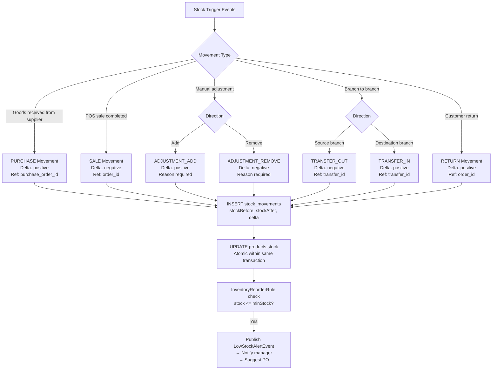

### 7.3 Stock Movement Service

```typescript
// modules/inventory/services/stock-movement.service.ts
@Injectable()
export class StockMovementService {
  async recordMovement(
    command: RecordStockMovementCommand,
    tx: Prisma.TransactionClient,
  ): Promise<StockMovement> {
    // Row-lock the product to prevent concurrent stock race conditions
    const [productRow] = await tx.$queryRaw<[{ id: string; stock: number }]>`
      SELECT id, stock FROM inventory.products
      WHERE id = ${command.productId}::uuid
        AND tenant_id = ${command.tenantId}::uuid
      FOR UPDATE
    `;

    if (!productRow) throw new NotFoundException('Product not found');

    const stockAfter = productRow.stock + command.delta;

    // Prevent negative stock (unless explicitly overridden by owner)
    if (stockAfter < 0 && !command.allowNegative) {
      throw new InsufficientStockException(command.productName, productRow.stock, Math.abs(command.delta));
    }

    // Record movement
    const movement = await tx.stockMovement.create({
      data: {
        tenantId: command.tenantId, productId: command.productId,
        branchId: command.branchId, type: command.type,
        delta: command.delta, stockBefore: productRow.stock, stockAfter,
        referenceId: command.referenceId, referenceType: command.referenceType,
        reason: command.reason, performedBy: command.performedBy,
      },
    });

    // Update product stock atomically
    await tx.product.update({
      where: { id: command.productId },
      data: { stock: stockAfter },
    });

    // Async check for reorder threshold (outside transaction — non-blocking)
    setImmediate(() => {
      if (stockAfter <= command.minStock) {
        this.eventBus.publish(new LowStockAlertEvent(command.productId, command.tenantId, stockAfter, command.minStock));
      }
    });

    return StockMovementMapper.toDomain(movement);
  }
}
```

---

## SECTION 8 — PAYMENT BUSINESS LOGIC

### 8.1 Payment Processing Flow

```mermaid
graph TD
    PayRequest[Payment Request\n{ orderId, method, amount, gatewayToken? }] --> IdempotencyCheck[Idempotency check\nX-Idempotency-Key header]

    IdempotencyCheck -->|Duplicate| ExistingPayment[Return existing payment]
    IdempotencyCheck -->|New| LoadOrder[Load Order\nVerify: COMPLETED or DRAFT status]
    LoadOrder --> Method{Payment Method}

    Method -->|Cash| CashFlow[Cash payment\nAmount >= total? → record immediately]
    Method -->|Card or QR| GatewayFlow[External gateway\nStripe / ABA Pay]
    Method -->|Bank Transfer| BankFlow[Record payment\nStatus: PENDING_VERIFICATION]

    GatewayFlow --> CreateIntent[Create PaymentIntent\nwith idempotency key]
    CreateIntent --> GatewayResult{Gateway result}
    GatewayResult -->|Success| VerifyPayment[Verify payment server-side\nNever trust client confirmation]
    GatewayResult -->|Failed| PayFailed[Update: payment.status = FAILED\nNotify user]

    CashFlow --> RecordPayment[INSERT payment record\nstatus = VERIFIED]
    VerifyPayment --> RecordPayment
    BankFlow --> RecordPayment

    RecordPayment --> CompleteOrder[Complete Order\nStatus: COMPLETED]
    CompleteOrder --> GenerateReceipt[Queue: Generate Receipt PDF]
    GenerateReceipt --> Notify[Queue: SMS + Email confirmation]
    Notify --> Response[200 OK: { payment, receiptUrl }]
```

### 8.2 Multi-Method Payment Support

| Payment Method | Flow | Gateway | Verification |
| :--- | :--- | :--- | :--- |
| **Cash** | Synchronous; cashier enters amount | None | Cashier confirms; no external check |
| **QR Code** | Async; gateway callback on scan | ABA Pay, Wing, Momopay | Webhook callback verifies |
| **Card** | Synchronous gateway call | Stripe, ABA Pay | Server-side intent status check |
| **Bank Transfer** | Async; manual verification | None | Manager marks verified after statement |
| **Credit (Account)** | Record as accounts receivable | None | Due date set; tracked in finance module |
| **Split Payment** | Multiple methods on single order | Mixed | Each method verified independently |

### 8.3 Payment Domain Service

```typescript
// domain/services/payment.service.ts
@Injectable()
export class PaymentDomainService {
  calculateChangeAmount(paymentAmount: Money, orderTotal: Money): Money {
    if (paymentAmount.currency !== orderTotal.currency) {
      throw new DomainException('CURRENCY_MISMATCH', 'Payment and order currencies must match');
    }
    const change = paymentAmount.subtract(orderTotal);
    if (change.amount < 0) {
      throw new DomainException('INSUFFICIENT_PAYMENT',
        `Payment ${paymentAmount.format()} is less than order total ${orderTotal.format()}`);
    }
    return change;
  }

  isSplitPaymentValid(payments: Array<{ amount: Money }>, orderTotal: Money): boolean {
    const totalPaid = payments.reduce((sum, p) => sum.add(p.amount), Money.zero(orderTotal.currency));
    return totalPaid.amount >= orderTotal.amount;
  }

  calculateRefundableAmount(originalPayment: Payment, daysElapsed: number): Money {
    // Business rule: full refund within 7 days; 50% after that
    if (daysElapsed <= 7) return originalPayment.amount;
    return originalPayment.amount.multiply(0.5);
  }
}
```

---

## SECTION 9 — FINANCIAL TRANSACTION ARCHITECTURE

### 9.1 Double-Entry Accounting Readiness

```
Double-entry accounting principle:
  Every financial transaction affects at least TWO accounts
  Total debits ALWAYS = Total credits
  This ensures the accounting equation is always balanced:
    Assets = Liabilities + Equity

SaaS Platform Implementation:
  Every POS sale creates:
    DEBIT:  Cash/Receivable account (Assets increase)
    CREDIT: Sales Revenue account   (Revenue increases)

  Every product purchase creates:
    DEBIT:  Inventory account  (Assets increase)
    CREDIT: Accounts Payable   (Liabilities increase)

  Every payment received for invoice creates:
    DEBIT:  Cash account (Assets increase)
    CREDIT: Accounts Receivable (Assets decrease — debt collected)
```

### 9.2 Chart of Accounts Structure

```typescript
// domain/finance/account-type.enum.ts
enum AccountType {
  ASSET     = 'ASSET',        // Debit increases, Credit decreases
  LIABILITY = 'LIABILITY',    // Credit increases, Debit decreases
  EQUITY    = 'EQUITY',       // Credit increases, Debit decreases
  REVENUE   = 'REVENUE',      // Credit increases, Debit decreases
  EXPENSE   = 'EXPENSE',      // Debit increases, Credit decreases
}

// Sample chart of accounts:
// 1000 - Cash (ASSET)
// 1100 - Bank Account (ASSET)
// 1200 - Accounts Receivable (ASSET)
// 1300 - Inventory (ASSET)
// 2000 - Accounts Payable (LIABILITY)
// 2100 - Tax Payable (LIABILITY)
// 3000 - Owner Equity (EQUITY)
// 4000 - Sales Revenue (REVENUE)
// 4100 - Service Revenue (REVENUE)
// 5000 - Cost of Goods Sold (EXPENSE)
// 5100 - Operating Expenses (EXPENSE)
// 5200 - Payroll Expense (EXPENSE)
```

### 9.3 Journal Entry Service

```typescript
// modules/finance/services/journal-entry.service.ts
@Injectable()
export class JournalEntryService {
  async recordSaleTransaction(
    order: Order,
    payment: Payment,
    tx: Prisma.TransactionClient,
  ): Promise<void> {
    const entries: JournalEntry[] = [
      // DEBIT: Increase Cash (payment received)
      new JournalEntry({
        accountCode: payment.method === 'CASH' ? '1000' : '1100',
        accountName: payment.method === 'CASH' ? 'Cash' : 'Bank Account',
        debit: payment.amount,
        credit: Money.zero(payment.amount.currency),
        description: `POS Sale - Order ${order.orderNumber}`,
        referenceId: order.id,
        referenceType: 'ORDER',
      }),
      // CREDIT: Record Sales Revenue
      new JournalEntry({
        accountCode: '4000',
        accountName: 'Sales Revenue',
        debit: Money.zero(payment.amount.currency),
        credit: order.subtotal,
        description: `POS Sale - Order ${order.orderNumber}`,
        referenceId: order.id,
        referenceType: 'ORDER',
      }),
      // CREDIT: Record Tax Payable (if tax exists)
      ...(order.taxAmount.amount > 0 ? [new JournalEntry({
        accountCode: '2100', accountName: 'Tax Payable',
        debit: Money.zero(order.taxAmount.currency),
        credit: order.taxAmount,
        description: `VAT - Order ${order.orderNumber}`,
        referenceId: order.id, referenceType: 'ORDER',
      })] : []),
      // DEBIT: Record Cost of Goods Sold
      new JournalEntry({
        accountCode: '5000', accountName: 'Cost of Goods Sold',
        debit: order.totalCost,
        credit: Money.zero(order.totalCost.currency),
        description: `COGS - Order ${order.orderNumber}`,
        referenceId: order.id, referenceType: 'ORDER',
      }),
      // CREDIT: Reduce Inventory
      new JournalEntry({
        accountCode: '1300', accountName: 'Inventory',
        debit: Money.zero(order.totalCost.currency),
        credit: order.totalCost,
        description: `COGS - Order ${order.orderNumber}`,
        referenceId: order.id, referenceType: 'ORDER',
      }),
    ];

    // Validate: total debits must equal total credits
    this.validateDoubleEntry(entries);

    // Insert all journal entries atomically
    for (const entry of entries) {
      await tx.journalEntry.create({ data: JournalEntryMapper.toPersistence(entry) });
    }
  }

  private validateDoubleEntry(entries: JournalEntry[]): void {
    const totalDebits = entries.reduce((sum, e) => sum.add(e.debit), Money.zero('USD'));
    const totalCredits = entries.reduce((sum, e) => sum.add(e.credit), Money.zero('USD'));
    if (!totalDebits.equals(totalCredits)) {
      throw new DomainException('JOURNAL_IMBALANCE',
        `Journal entry imbalanced: debits ${totalDebits.format()} ≠ credits ${totalCredits.format()}`
      );
    }
  }
}
```

---

## SECTION 10 — APPROVAL WORKFLOW SYSTEM

### 10.1 Approval Workflow Architecture

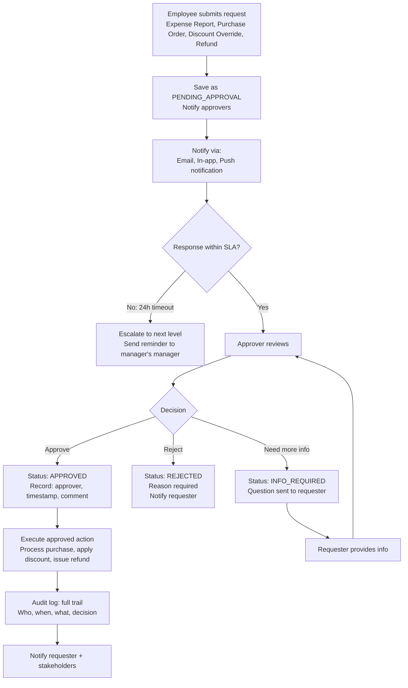

### 10.2 Approval Workflow Service

```typescript
// domain/workflow/approval.service.ts
@Injectable()
export class ApprovalWorkflowService {
  async submitForApproval(command: SubmitApprovalCommand): Promise<ApprovalRequest> {
    const approvers = await this.resolveApprovers(command.type, command.amount, command.tenantId);
    const request = ApprovalRequest.create({
      type: command.type,
      requesterId: command.requesterId,
      tenantId: command.tenantId,
      amount: command.amount,
      description: command.description,
      metadata: command.metadata,
      approvers: approvers.map(a => a.id),
      status: 'PENDING',
      slaHours: this.resolveSla(command.type, command.amount),
    });

    await this.approvalRepo.save(request);
    await this.notificationService.notifyApprovers(approvers, request);
    await this.jobQueue.scheduleEscalation(request.id, request.slaHours);

    return request;
  }

  private async resolveApprovers(type: ApprovalType, amount: Money, tenantId: string): Promise<User[]> {
    const config = await this.tenantConfigRepo.getApprovalConfig(tenantId);
    const amountNum = amount.amount;

    switch (type) {
      case ApprovalType.PURCHASE_ORDER:
        if (amountNum <= 500) return [];                        // Auto-approve
        if (amountNum <= 5000) return config.managers;          // Manager approval
        return config.owners;                                    // Owner approval

      case ApprovalType.DISCOUNT_OVERRIDE:
        return config.managers;                                  // Always needs manager

      case ApprovalType.REFUND:
        if (amountNum <= 100) return config.managers;
        return config.owners;

      case ApprovalType.EXPENSE_REPORT:
        return config.managers;

      default: return config.managers;
    }
  }
}
```

---

## SECTION 11 — STATE MACHINE DESIGN

### 11.1 Order State Machine

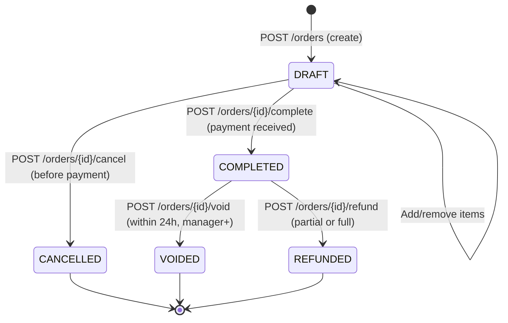

### 11.2 State Machine Implementation

```typescript
// domain/pos/order-state-machine.ts
type OrderStatus = 'DRAFT' | 'COMPLETED' | 'VOIDED' | 'REFUNDED' | 'CANCELLED';

const ALLOWED_TRANSITIONS: Record<OrderStatus, OrderStatus[]> = {
  DRAFT:     ['COMPLETED', 'CANCELLED'],
  COMPLETED: ['VOIDED', 'REFUNDED'],
  VOIDED:    [],   // Terminal state
  REFUNDED:  [],   // Terminal state
  CANCELLED: [],   // Terminal state
};

export class OrderStateMachine {
  static transition(from: OrderStatus, to: OrderStatus): void {
    const allowed = ALLOWED_TRANSITIONS[from];
    if (!allowed.includes(to)) {
      throw new InvalidOrderTransitionException(from, to);
    }
  }

  static canTransition(from: OrderStatus, to: OrderStatus): boolean {
    return ALLOWED_TRANSITIONS[from].includes(to);
  }
}

// In Order aggregate:
complete(): void {
  OrderStateMachine.transition(this.status, 'COMPLETED');
  // Additional business rules specific to completion
  if (this.items.length === 0) throw new DomainException('EMPTY_ORDER', 'Cannot complete empty order');
  this.status = 'COMPLETED';
  this.completedAt = new Date();
  this.addDomainEvent(new OrderCompletedEvent(this.id, ...));
}

void(reason: string, voidedBy: string): void {
  OrderStateMachine.transition(this.status, 'VOIDED');
  this.status = 'VOIDED';
  this.voidedAt = new Date();
  this.voidReason = reason;
  this.voidedBy = voidedBy;
  this.addDomainEvent(new OrderVoidedEvent(this.id, reason, voidedBy));
}
```

### 11.3 Payment State Machine

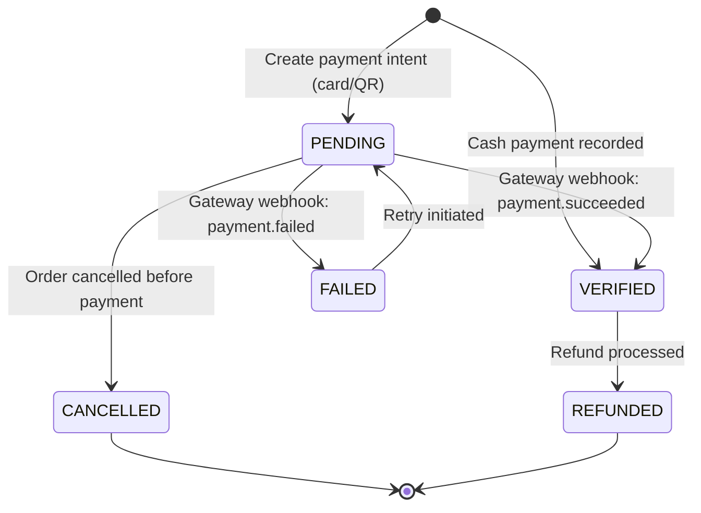

---

## SECTION 12 — DATABASE TRANSACTION MANAGEMENT

### 12.1 Nested Transaction Pattern

```typescript
// Prisma interactive transaction with savepoints
async createComplexOperation(): Promise<void> {
  await this.prisma.$transaction(async (tx) => {
    // Outer transaction step 1
    const order = await tx.order.create({ data: orderData });

    try {
      // Inner operation (can be subtransaction via savepoint)
      for (const item of order.items) {
        await this.stockMovementService.recordMovement(
          { ...movementData, referenceId: order.id },
          tx   // Participates in same transaction
        );
      }
    } catch (stockError) {
      // Re-throw — outer transaction will rollback
      throw new DomainException('STOCK_DEDUCTION_FAILED', (stockError as Error).message);
    }

    await tx.payment.create({ data: paymentData });
    await tx.auditLog.create({ data: auditData });

    // All 4 operations commit together or all roll back
  }, {
    timeout: 15_000,                          // 15 second max
    isolationLevel: 'ReadCommitted',
    maxWait: 5_000,                           // Wait max 5s to acquire connection
  });
}
```

### 12.2 Concurrent Operation Safety

```typescript
// Optimistic locking with version field
model Order {
  id        String  @id
  status    String
  version   Int     @default(0)   // Increment on every update
  // ...
}

// Application layer: include version in update WHERE clause
async updateOrderStatus(orderId: string, expectedVersion: number, newStatus: string): Promise<void> {
  const result = await this.prisma.order.updateMany({
    where: {
      id: orderId,
      version: expectedVersion,   // Only update if version matches (optimistic lock)
    },
    data: { status: newStatus, version: { increment: 1 } },
  });

  if (result.count === 0) {
    throw new ConcurrencyException('Order was modified by another process. Please retry.');
  }
}
```

---

## SECTION 13 — IDEMPOTENCY DESIGN

### 13.1 Idempotency Architecture

```
Problem: Payment API called twice (network retry, user double-click)
  → Without idempotency: Customer charged twice
  → With idempotency:    Second call returns same result as first; no double charge

Idempotency Key Sources:
  Client-generated UUID: X-Idempotency-Key header
  Order-based:           orderId + paymentMethod (deterministic)
  Action-based:          userId + action + timestamp (bucketed to 1 minute)
```

### 13.2 Idempotency Service

```typescript
// common/services/idempotency.service.ts
@Injectable()
export class IdempotencyService {
  private readonly TTL = 86400;  // 24 hours

  constructor(private readonly redis: RedisService) {}

  async check<T>(key: string): Promise<T | null> {
    const stored = await this.redis.get(`idempotent:${key}`);
    if (!stored) return null;

    const { status, result } = JSON.parse(stored) as { status: 'PROCESSING' | 'DONE'; result: T };

    if (status === 'PROCESSING') {
      // Another request is already processing this key
      throw new ConflictException('Duplicate request: same operation is already in progress');
    }

    return result;
  }

  async markProcessing(key: string): Promise<void> {
    const wasSet = await this.redis.set(
      `idempotent:${key}`,
      JSON.stringify({ status: 'PROCESSING' }),
      'EX', 30,               // 30 second processing lock
      'NX',                   // Only set if not exists
    );
    if (!wasSet) {
      throw new ConflictException('Duplicate request: this operation is already being processed');
    }
  }

  async store<T>(key: string, result: T): Promise<void> {
    await this.redis.setex(
      `idempotent:${key}`,
      this.TTL,
      JSON.stringify({ status: 'DONE', result })
    );
  }

  async markFailed(key: string): Promise<void> {
    await this.redis.del(`idempotent:${key}`);  // Allow retry on failure
  }
}

// Usage in application service:
async chargePayment(command: ChargePaymentCommand): Promise<Payment> {
  const idempotencyKey = command.idempotencyKey ?? `payment:${command.orderId}:${command.method}`;

  const existing = await this.idempotencyService.check<Payment>(idempotencyKey);
  if (existing) return existing;

  await this.idempotencyService.markProcessing(idempotencyKey);

  try {
    const payment = await this.processPaymentLogic(command);
    await this.idempotencyService.store(idempotencyKey, payment);
    return payment;
  } catch (error) {
    await this.idempotencyService.markFailed(idempotencyKey);
    throw error;
  }
}
```

---

## SECTION 14 — EVENT DRIVEN BUSINESS FLOW

### 14.1 Business Event Catalog

| Domain Event | Published When | Subscribers | Async Action |
| :--- | :--- | :--- | :--- |
| `OrderCreatedEvent` | POS order draft created | Analytics, Websocket | Dashboard update |
| `OrderCompletedEvent` | Order paid + completed | Finance, Inventory, Analytics, WS | Invoice, stock sync, dashboard |
| `OrderVoidedEvent` | Order voided | Finance, Inventory, Audit | Reverse journal entries, restore stock |
| `StockUpdatedEvent` | Any stock movement | Analytics | Inventory dashboard refresh |
| `LowStockAlertEvent` | Stock ≤ minStock | HR (notifications), Purchasing | Manager notification, suggest PO |
| `PaymentCompletedEvent` | Payment verified | Finance, Notifications | Journal entry, receipt PDF |
| `PaymentFailedEvent` | Gateway payment failure | Notifications | Alert cashier |
| `PurchaseApprovedEvent` | Approval workflow completed | Purchasing, Finance | Send PO to supplier |
| `EmployeeClockInEvent` | Employee starts shift | HR, Analytics | Attendance record, live dashboard |
| `InvoiceOverdueEvent` | Invoice past due date | Finance, CRM | Customer reminder email |

### 14.2 Event-Driven Flow Implementation

```typescript
// Event publisher (in application service):
await this.prisma.$transaction(async (tx) => {
  // ... business operations ...
});
// After transaction commits: publish events
await this.eventBus.publishAll(order.pullDomainEvents());

// Aggregate domain event management:
export class Order {
  private _domainEvents: DomainEvent[] = [];

  complete(): void {
    OrderStateMachine.transition(this.status, 'COMPLETED');
    this.status = 'COMPLETED';
    this.completedAt = new Date();
    this._domainEvents.push(new OrderCompletedEvent(this.id, this.tenantId, this.branchId, this.totalAmount, this.items));
  }

  pullDomainEvents(): DomainEvent[] {
    const events = [...this._domainEvents];
    this._domainEvents = [];   // Clear after pulling
    return events;
  }
}
```

---

## SECTION 15 — ASYNC PROCESSING

### 15.1 BullMQ Job Queue Architecture

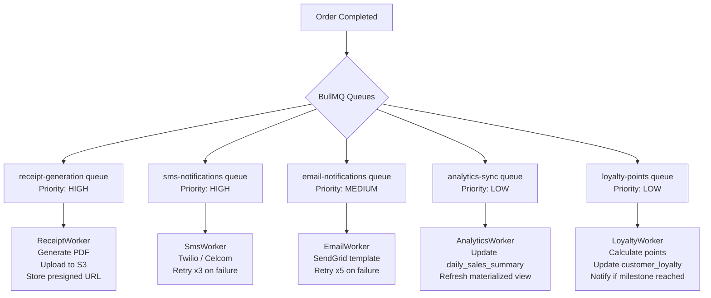

### 15.2 BullMQ Queue Configuration

```typescript
// modules/jobs/queues/order-jobs.queue.ts
@Injectable()
export class OrderJobQueue {
  constructor(
    @InjectQueue('receipt-generation') private receiptQueue: Queue,
    @InjectQueue('sms-notifications') private smsQueue: Queue,
    @InjectQueue('analytics-sync') private analyticsQueue: Queue,
  ) {}

  async scheduleReceiptGeneration(orderId: string): Promise<void> {
    await this.receiptQueue.add(
      'generate-receipt',
      { orderId },
      {
        priority: 10,                       // High priority
        attempts: 3,
        backoff: { type: 'exponential', delay: 2000 },
        removeOnComplete: { count: 1000 },
        removeOnFail: { count: 100 },
      }
    );
  }

  async scheduleSmsConfirmation(orderId: string, phone: string): Promise<void> {
    await this.smsQueue.add(
      'order-confirmation-sms',
      { orderId, phone },
      { priority: 10, attempts: 3, backoff: { type: 'fixed', delay: 3000 } }
    );
  }

  async scheduleAnalyticsSync(tenantId: string, branchId: string): Promise<void> {
    await this.analyticsQueue.add(
      'sync-daily-sales',
      { tenantId, branchId, date: new Date().toISOString().split('T')[0] },
      {
        priority: 1,
        jobId: `analytics-${tenantId}-${branchId}-${new Date().toISOString().split('T')[0]}`,  // Deduplicate by day
        attempts: 5,
        backoff: { type: 'exponential', delay: 5000 },
      }
    );
  }
}

// Worker:
@Processor('receipt-generation')
export class ReceiptGenerationWorker {
  @Process('generate-receipt')
  async handleReceiptGeneration(job: Job<{ orderId: string }>): Promise<void> {
    const { orderId } = job.data;
    await job.updateProgress(10);

    const order = await this.orderRepo.findByIdWithItems(orderId);
    await job.updateProgress(30);

    const pdfBuffer = await this.pdfService.generateReceipt(order);
    await job.updateProgress(70);

    const s3Key = `receipts/${order.tenantId}/${orderId}.pdf`;
    await this.s3Service.upload(s3Key, pdfBuffer, 'application/pdf');
    await job.updateProgress(90);

    await this.orderRepo.setReceiptUrl(orderId, `https://cdn.platform.io/${s3Key}`);
    await job.updateProgress(100);
  }
}
```

---

## SECTION 16 — BUSINESS RULE TESTING

### 16.1 Domain Logic Test Strategy

| Test Type | Coverage Target | Tooling | Speed |
| :--- | :--- | :--- | :--- |
| **Aggregate unit tests** | 100% state transitions | Jest (pure) | < 1ms per test |
| **Domain service unit tests** | All business rule branches | Jest (mocked repos) | < 5ms per test |
| **Specification unit tests** | All `isSatisfied()` branches | Jest (pure) | < 1ms per test |
| **State machine tests** | All valid + invalid transitions | Jest (pure) | < 1ms per test |
| **Application service tests** | Happy path + all error paths | Jest (mocked infra) | < 50ms per test |
| **Integration tests** | Full workflow (DB + Redis) | Jest + TestDB | 200ms–1s |

### 16.2 Order Aggregate Unit Tests

```typescript
// modules/pos/domain/__tests__/order.aggregate.spec.ts
describe('Order Aggregate', () => {
  describe('complete()', () => {
    it('transitions DRAFT → COMPLETED and publishes event', () => {
      const order = Order.create({ tenantId: 'tenant-1', branchId: 'branch-1' });
      order.addItem(ProductStub.build(), Quantity.of(2), Money.of(5, 'USD'));
      order.complete();

      expect(order.status).toBe('COMPLETED');
      expect(order.completedAt).toBeDefined();
      const events = order.pullDomainEvents();
      expect(events).toHaveLength(1);
      expect(events[0]).toBeInstanceOf(OrderCompletedEvent);
    });

    it('throws InvalidOrderTransitionException on COMPLETED → COMPLETED', () => {
      const order = buildCompletedOrder();
      expect(() => order.complete()).toThrow(InvalidOrderTransitionException);
    });

    it('throws DomainException when completing empty order', () => {
      const order = Order.create({ tenantId: 'tenant-1', branchId: 'branch-1' });
      expect(() => order.complete()).toThrow(DomainException);
    });
  });

  describe('void()', () => {
    it('transitions COMPLETED → VOIDED with reason', () => {
      const order = buildCompletedOrder();
      order.void('Customer returned goods', 'manager-id');

      expect(order.status).toBe('VOIDED');
      expect(order.voidReason).toBe('Customer returned goods');
      expect(order.voidedBy).toBe('manager-id');
    });

    it('throws when voiding DRAFT order', () => {
      const order = Order.create({ tenantId: 't1', branchId: 'b1' });
      expect(() => order.void('reason', 'user')).toThrow(InvalidOrderTransitionException);
    });
  });
});

describe('DiscountRule', () => {
  it('allows discount within max rate', () => {
    const rule = new DiscountRule({
      product: buildDiscountableProduct(),
      customer: null,
      requestedRate: 0.1,
      maxAllowedRate: 0.15,
    });
    expect(rule.isSatisfied()).toBe(true);
  });

  it('rejects discount exceeding max rate', () => {
    const rule = new DiscountRule({
      product: buildDiscountableProduct(),
      customer: null,
      requestedRate: 0.2,
      maxAllowedRate: 0.15,
    });
    expect(rule.isSatisfied()).toBe(false);
  });

  it('rejects discount on non-discountable product', () => {
    const rule = new DiscountRule({
      product: buildNonDiscountableProduct(),
      customer: null,
      requestedRate: 0.05,
      maxAllowedRate: 0.15,
    });
    expect(rule.isSatisfied()).toBe(false);
  });
});
```

---

## SECTION 17 — BUSINESS LOGGING & AUDIT

### 17.1 Business Audit Event Design

Every business mutation is logged with full context — before and after state, who performed the action, and when. This enables:

- **Regulatory compliance** — track financial data changes
- **Dispute resolution** — show complete history for a transaction
- **Fraud detection** — identify unusual patterns
- **Operational support** — diagnose issues without interrogating developers

### 17.2 Enhanced Audit Service

```typescript
// security/audit.service.ts — Enhanced with before/after state
export interface BusinessAuditEntry {
  action: string;
  actorId: string;
  tenantId: string;
  resourceType: string;
  resourceId: string;
  previousState?: Record<string, unknown>;  // Snapshot before change
  newState?: Record<string, unknown>;       // Snapshot after change
  changeReason?: string;
  ip?: string;
  metadata?: Record<string, unknown>;
}

@Injectable()
export class AuditService {
  async logBusinessChange(
    entry: BusinessAuditEntry,
    tx?: Prisma.TransactionClient,
  ): Promise<void> {
    const diff = entry.previousState && entry.newState
      ? this.computeDiff(entry.previousState, entry.newState)
      : null;

    await (tx ?? this.prisma).auditLog.create({
      data: {
        action: entry.action,
        actorId: entry.actorId,
        tenantId: entry.tenantId,
        resourceType: entry.resourceType,
        resourceId: entry.resourceId,
        previousState: entry.previousState ?? {},
        newState: entry.newState ?? {},
        diff,
        changeReason: entry.changeReason ?? null,
        actorIp: entry.ip ?? null,
        metadata: entry.metadata ?? {},
        createdAt: new Date(),
      },
    });
  }

  private computeDiff(prev: Record<string, unknown>, next: Record<string, unknown>): Record<string, unknown> {
    const diff: Record<string, { from: unknown; to: unknown }> = {};
    const allKeys = new Set([...Object.keys(prev), ...Object.keys(next)]);
    for (const key of allKeys) {
      if (JSON.stringify(prev[key]) !== JSON.stringify(next[key])) {
        diff[key] = { from: prev[key], to: next[key] };
      }
    }
    return diff;
  }
}

// Usage:
await this.auditService.logBusinessChange({
  action: 'PRODUCT_PRICE_CHANGED',
  actorId: managerId,
  tenantId,
  resourceType: 'PRODUCT',
  resourceId: product.id,
  previousState: { unitPrice: '5.0000', currency: 'USD' },
  newState: { unitPrice: '5.5000', currency: 'USD' },
  changeReason: 'Cost of goods increase Q3 2026',
}, tx);
```

---

## SECTION 18 — BUSINESS LOGIC TOOL STACK

### 18.1 Complete Business Logic Technology Stack

| Category | Tool | Version | Purpose |
| :--- | :--- | :--- | :--- |
| **Backend Framework** | NestJS | 10+ | Module system; DI container; lifecycle hooks; decorators. |
| **ORM** | Prisma | 5+ | Type-safe data access; transactions; migrations; middleware. |
| **Cache / Lock** | Redis (ioredis) | 7+ | Idempotency keys; distributed locks; rate limit counters; job queues. |
| **Job Queue** | BullMQ | 5+ | Priority queues; retries; backoff; progress tracking; delayed jobs. |
| **Event Bus (in-process)** | EventEmitter2 (`@nestjs/event-emitter`) | — | Synchronous in-process domain event dispatch; fan-out to handlers. |
| **Event Bus (distributed)** | Kafka (KafkaJS) | 3+ | Async cross-service event streaming; consumer groups; replay. |
| **State Machine** | Custom `OrderStateMachine` | — | Explicit state transition enforcement; no external dependency needed. |
| **PDF Generation** | Puppeteer or PDFKit | — | Receipt and invoice PDF generation for BullMQ workers. |
| **File Storage** | AWS S3 (via `@aws-sdk/client-s3`) | 3+ | Generated receipt/report PDF storage; presigned URL generation. |
| **TOTP / Business Rules** | Custom specification pattern | — | Composable, testable business predicates (no framework needed). |
| **Workflow Orchestration (Future)** | Temporal | — | Durable, long-running workflows (multi-day approval flows, saga compensation). |
| **Unit Testing** | Jest | 29+ | Domain unit tests; application service tests; mock injection. |
| **DB Integration Testing** | Jest + `testcontainers` | — | Real PostgreSQL in Docker for repository integration tests. |
| **API Testing** | Supertest | — | HTTP integration tests against NestJS app. |

---

## SECTION 19 — BUSINESS ARCHITECTURE GOVERNANCE

### 19.1 Business Rule Documentation Requirements

Before implementing any business rule, a **Business Rule Record (BRR)** must be created and approved:

```markdown
# Business Rule Record — BRR-2026-047

## Rule Name
Order Void Time Limit

## Business Rationale
Voiding orders after 24 hours creates accounting complexity and potential fraud risk.
Managers have operational authority within same business day; owners retain full override.

## Rule Definition
- Orders can be voided within 24 hours of completion by MANAGER role
- Business owners can void at any time (no time limit)
- Voided orders require a mandatory reason (min 10 characters)
- All voids trigger automatic stock restoration and journal entry reversal

## Affected Aggregates
- Order (status transition COMPLETED → VOIDED)
- Product (stock restoration)
- JournalEntry (reversal entries)

## Implementation
- `OrderVoidRule` in `domain/rules/order-void.rule.ts`
- `Order.void()` method in `domain/pos/order.aggregate.ts`
- Full test coverage in `__tests__/order.aggregate.spec.ts`

## Approved By
- Business Stakeholder: [name] — 2026-07-01
- Domain Architect: [name] — 2026-07-02
- QA Lead: [name] — 2026-07-03
```

### 19.2 Business Logic Governance Standards

| Standard | Rule | Enforcement |
| :--- | :--- | :--- |
| **No business logic in controllers** | Controllers only route; never decide | Code review + ESLint no-logic-in-controller rule |
| **No ORM in domain layer** | Domain entities have no Prisma imports | ESLint no-prisma-in-domain rule; TypeScript module boundaries |
| **Business Rule Record required** | Every new business rule needs BRR before coding | PR template: BRR link required in description |
| **Domain review required** | DDD Architect reviews all domain model changes | Protected `domain/` directory; DDD Architect must approve |
| **100% rule unit test coverage** | Every `IBusinessRule.isSatisfied()` branch tested | CI gate: Jest coverage report; domain/ coverage ≥ 100% |
| **State transition diagram updated** | State machine changes must update Mermaid diagrams | Documentation checked in PR review |
| **Audit log required** | All mutations of business data must have audit entry | Code review checklist; `AuditService.logBusinessChange` called |

---

## SECTION 20 — FINAL BUSINESS LOGIC ARCHITECTURE DIAGRAMS

### 20.1 Business Logic Layer

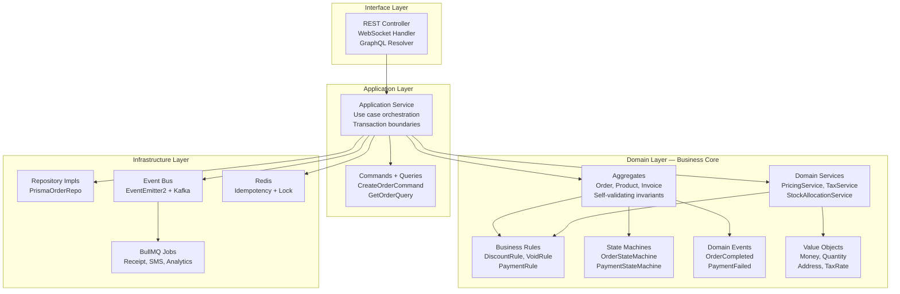

### 20.2 Workflow Engine

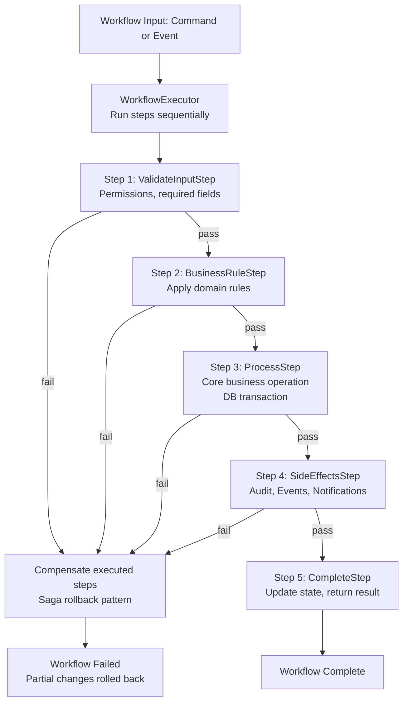

### 20.3 Order Processing Flow

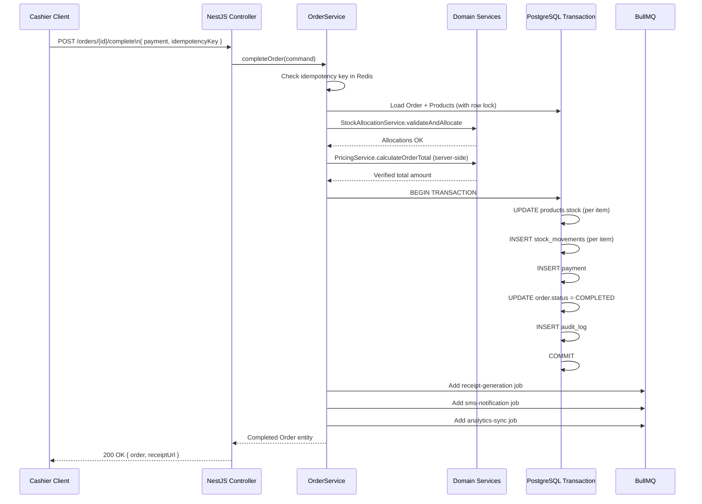

### 20.4 Transaction Architecture

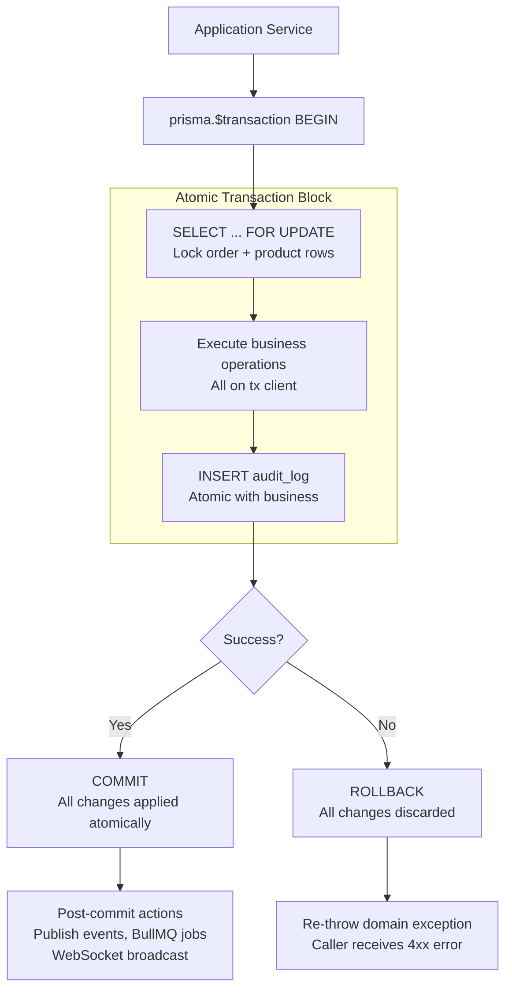

### 20.5 Event-Driven Business Flow

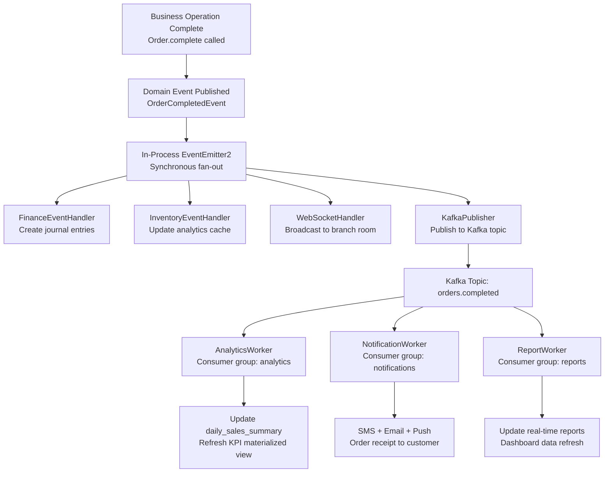

---

## APPENDIX A — BUSINESS LOGIC QUICK REFERENCE

```
Architecture:         Clean Architecture + DDD
Domain Layer:         Zero external dependencies (no Prisma, no HTTP, no Redis)
Business Rules:       IBusinessRule pattern — isSatisfied() + errorMessage()
State Machines:       Explicit ALLOWED_TRANSITIONS map per aggregate
Transactions:         Prisma interactive transactions; 15s max; ReadCommitted
Idempotency:          Redis NX set; 24h TTL; PROCESSING + DONE states
Events:               In-process: EventEmitter2; Cross-service: Kafka
Async Jobs:           BullMQ with priority queues; exponential backoff; 3-5 retries
Approval Workflow:    Amount-threshold routing; SLA escalation; full audit trail
Stock Ledger:         Immutable movement records; current = SUM(deltas)
Double-Entry:         Journal entries for every financial transaction; debits=credits enforced
Audit:                Before + after state captured; diff computed; stored in audit_logs
Testing:              Domain: 100% unit coverage; Application: mock infra; Integration: TestDB
```

## APPENDIX B — BUSINESS RULE CHECKLIST

When implementing a new business rule:

- [ ] Business Rule Record (BRR) created and approved
- [ ] `IBusinessRule` interface implemented with `isSatisfied()` and `errorMessage()`
- [ ] Rule added to `BusinessRuleRegistry` constants
- [ ] Called within aggregate or domain service (not controller or repository)
- [ ] All branches (true/false + edge cases) covered by unit tests
- [ ] Error thrown uses correct exception type (`DomainException` with specific code)
- [ ] State machine updated if rule affects status transitions
- [ ] Audit log entry included for any data mutation
- [ ] Documentation updated in Business Rule Catalog

---

*End of Backend Business Logic, Workflow Engine & Transaction Architecture*  
*Document maintained by: Principal Backend Architect & Domain Driven Design Specialist | Status: Approved Business Logic & Workflow Architecture Specification*
