# BACKEND EVENT DRIVEN ARCHITECTURE, MESSAGING & ASYNCHRONOUS PROCESSING

**Project Name:** Enterprise SaaS Business Management Platform  
**Document Version:** 1.0.0 — Baseline Standard  
**Date:** July 13, 2026  
**Authors:** Principal Distributed Systems Architect, Event Driven Architecture Specialist, Kafka Architect, Backend Platform Engineer & CQRS Expert  
**Classification:** Enterprise Internal — Unrestricted  
**Status:** 🏛️ APPROVED EVENT DRIVEN ARCHITECTURE & MESSAGING SPECIFICATION  

---

## SECTION 1 — EVENT DRIVEN FOUNDATION

### 1.1 Traditional vs Event-Driven Architecture

```
TRADITIONAL (Synchronous Request-Response):
─────────────────────────────────────────────────────────────────────
Client → [Order Completion API]
         ↓ Call payment gateway (wait 500ms)
         ↓ Send SMS (wait 300ms)
         ↓ Send email (wait 200ms)
         ↓ Update analytics (wait 150ms)
         ↓ Generate PDF receipt (wait 800ms)
         ↓ Notify manager (wait 100ms)
         ← Response returned after 2,050ms total

Problems:
  × Slow response times (user waits for every side effect)
  × Single point of failure (SMS failure cancels the whole operation)
  × Tight coupling (every new feature must modify the checkout service)
  × No resilience (if analytics is down, orders fail)
  × No scalability isolation (one slow consumer slows everything)

─────────────────────────────────────────────────────────────────────
EVENT DRIVEN (Asynchronous Publisher-Subscriber):
─────────────────────────────────────────────────────────────────────
Client → [Order Completion API]
         ↓ Complete atomic business transaction (50ms)
         ↓ Publish OrderCompletedEvent (2ms)
         ← Response returned after 52ms total ✅

Async (fire-and-forget, independent):
  → SMS Worker         consumes event (300ms, independently retried if fails)
  → Email Worker       consumes event (200ms, independently retried if fails)
  → Analytics Worker   consumes event (150ms, in background)
  → Receipt Worker     consumes event (800ms, background job queue)
  → Finance Worker     consumes event (120ms, journal entries)

Benefits:
  ✅ Fast user response (52ms vs 2,050ms)
  ✅ Fault isolation (SMS failure does not affect order completion)
  ✅ Loose coupling (add new consumer without changing publisher)
  ✅ Independent scaling (scale analytics workers separately)
  ✅ Resilience (consumers retry independently until success)
  ✅ Auditability (all events persisted in event log)
```

### 1.2 When to Use Event-Driven Architecture

| Pattern | Appropriate For | Not Appropriate For |
| :--- | :--- | :--- |
| **Async Event** | Side effects after business operation (notifications, analytics, PDF) | Operations that need the result before responding to user |
| **Domain Event** | Communicating a business fact within the same service | Simple CRUD with no downstream consumers |
| **Kafka Topic** | High-volume streaming data; multi-consumer fan-out; long retention | Low-volume, simple queues; RPC-style calls |
| **BullMQ Job** | Scheduled jobs; retry-based background work; prioritized tasks | Real-time streaming; persistent event log |
| **WebSocket** | Real-time UI updates; live dashboards; POS notifications | Batch data delivery; large payloads |

### 1.3 Enterprise Event-Driven Principles

| Principle | Description | Implementation |
| :--- | :--- | :--- |
| **Publish After Commit** | Events are published only after the database transaction commits. Publishing before commit risks events for data that was rolled back. | `eventBus.publishAll()` called after `prisma.$transaction()` returns successfully. |
| **Events Are Facts** | Events describe something that already happened — past tense, immutable. They are not commands. | Event names: `OrderCompleted`, not `CompleteOrder`. |
| **Consumer Independence** | Each consumer processes events independently. Failure of one consumer never blocks another. | Separate Kafka consumer groups; BullMQ queues per concern. |
| **Idempotent Consumers** | Processing the same event twice produces the same result as processing it once. | Event ID stored in processed_events table; check before processing. |
| **At-Least-Once Delivery** | The platform guarantees every event is delivered at least once. Consumers must handle duplicates. | Kafka acknowledge only after successful processing; retry on failure. |
| **Schema Contracts** | Event schemas are versioned and backward-compatible. Consumers can handle older schema versions. | JSON Schema validation; additive changes only; never remove fields. |
| **Dead Letter Isolation** | Permanently failed messages are moved to a dead letter queue for manual review. Never silently drop messages. | Kafka DLT topic + BullMQ failed queue + alerting. |

---

## SECTION 2 — EVENT ARCHITECTURE OVERVIEW

### 2.1 Full Event Architecture

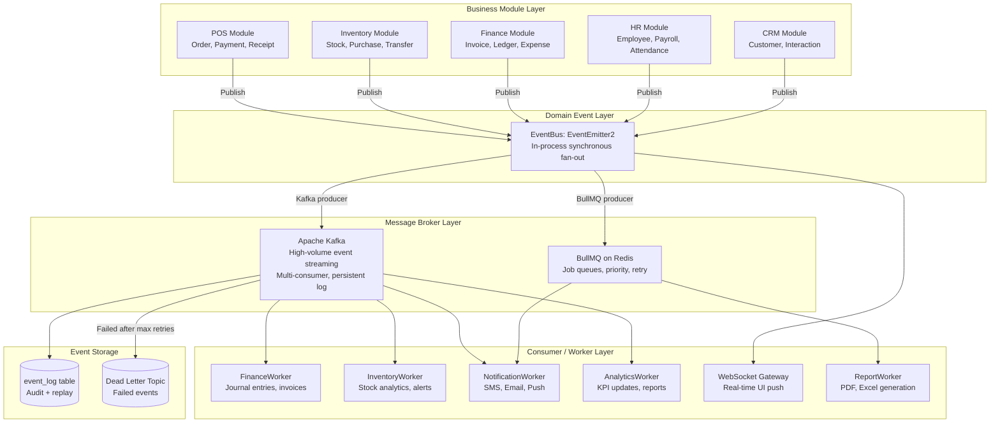

### 2.2 Event Flow Layers

| Layer | Technology | Responsibility | Latency |
| :--- | :--- | :--- | :--- |
| **Domain Event Bus** | EventEmitter2 (in-process) | Synchronous fan-out to local handlers | < 1ms |
| **Kafka** | Apache Kafka | High-volume streaming; cross-service; persistent log | 5–50ms |
| **BullMQ** | Redis-backed queue | Prioritized jobs; retry; scheduling; progress | 10–100ms |
| **WebSocket** | Socket.IO | Real-time UI push from backend events | 10–50ms |

---

## SECTION 3 — DOMAIN EVENT DESIGN

### 3.1 Event Structure Standard

```typescript
// common/events/domain-event.base.ts
export abstract class DomainEvent {
  readonly eventId: string;         // Unique UUID — for deduplication and tracing
  readonly eventType: string;       // Fully qualified name: "pos.order.completed"
  readonly aggregateId: string;     // ID of the root entity (orderId, productId, etc.)
  readonly aggregateType: string;   // Type of aggregate: "Order", "Product"
  readonly tenantId: string;        // Multi-tenant: always required
  readonly occurredAt: Date;        // When the business fact occurred (UTC)
  readonly version: number;         // Schema version for backward compatibility
  readonly correlationId?: string;  // Trace ID from original HTTP request
  readonly causationId?: string;    // ID of event that caused this event (event chain)

  constructor(
    aggregateId: string,
    aggregateType: string,
    tenantId: string,
    correlationId?: string,
    causationId?: string,
  ) {
    this.eventId = generateId();
    this.occurredAt = new Date();
    this.version = 1;
    this.aggregateId = aggregateId;
    this.aggregateType = aggregateType;
    this.tenantId = tenantId;
    this.correlationId = correlationId;
    this.causationId = causationId;
  }
}
```

### 3.2 Core Domain Events

```typescript
// ─── POS Events ───────────────────────────────────────────────────────────────
export class OrderCreatedEvent extends DomainEvent {
  readonly eventType = 'pos.order.created';
  constructor(
    public readonly orderId: string,
    public readonly tenantId: string,
    public readonly branchId: string,
    public readonly cashierId: string,
    public readonly itemCount: number,
    correlationId?: string,
  ) {
    super(orderId, 'Order', tenantId, correlationId);
  }
}

export class OrderCompletedEvent extends DomainEvent {
  readonly eventType = 'pos.order.completed';
  constructor(
    public readonly orderId: string,
    public readonly tenantId: string,
    public readonly branchId: string,
    public readonly cashierId: string,
    public readonly customerId: string | null,
    public readonly totalAmount: number,
    public readonly currency: string,
    public readonly paymentMethod: string,
    public readonly items: Array<{ productId: string; quantity: number; lineTotal: number }>,
    correlationId?: string,
  ) {
    super(orderId, 'Order', tenantId, correlationId);
  }
}

export class OrderVoidedEvent extends DomainEvent {
  readonly eventType = 'pos.order.voided';
  constructor(
    public readonly orderId: string,
    public readonly tenantId: string,
    public readonly voidedBy: string,
    public readonly reason: string,
    public readonly originalTotal: number,
    correlationId?: string,
  ) { super(orderId, 'Order', tenantId, correlationId); }
}

// ─── Inventory Events ─────────────────────────────────────────────────────────
export class StockUpdatedEvent extends DomainEvent {
  readonly eventType = 'inventory.stock.updated';
  constructor(
    public readonly productId: string,
    public readonly tenantId: string,
    public readonly branchId: string,
    public readonly movementType: string,
    public readonly delta: number,
    public readonly stockBefore: number,
    public readonly stockAfter: number,
    correlationId?: string,
  ) { super(productId, 'Product', tenantId, correlationId); }
}

export class LowStockAlertEvent extends DomainEvent {
  readonly eventType = 'inventory.stock.low_alert';
  constructor(
    public readonly productId: string,
    public readonly productName: string,
    public readonly tenantId: string,
    public readonly currentStock: number,
    public readonly minStock: number,
    correlationId?: string,
  ) { super(productId, 'Product', tenantId, correlationId); }
}

// ─── Payment Events ───────────────────────────────────────────────────────────
export class PaymentCompletedEvent extends DomainEvent {
  readonly eventType = 'finance.payment.completed';
  constructor(
    public readonly paymentId: string,
    public readonly orderId: string,
    public readonly tenantId: string,
    public readonly amount: number,
    public readonly currency: string,
    public readonly method: string,
    correlationId?: string,
  ) { super(paymentId, 'Payment', tenantId, correlationId); }
}

export class PaymentFailedEvent extends DomainEvent {
  readonly eventType = 'finance.payment.failed';
  constructor(
    public readonly paymentId: string,
    public readonly orderId: string,
    public readonly tenantId: string,
    public readonly failureReason: string,
    public readonly gatewayCode: string,
    correlationId?: string,
  ) { super(paymentId, 'Payment', tenantId, correlationId); }
}

// ─── User Events ─────────────────────────────────────────────────────────────
export class UserRegisteredEvent extends DomainEvent {
  readonly eventType = 'identity.user.registered';
  constructor(
    public readonly userId: string,
    public readonly tenantId: string,
    public readonly email: string,
    public readonly role: string,
    correlationId?: string,
  ) { super(userId, 'User', tenantId, correlationId); }
}
```

### 3.3 Domain Event Catalog

| Event Type | Aggregate | Published By | Primary Consumers |
| :--- | :--- | :--- | :--- |
| `pos.order.created` | Order | POS Service | Analytics, WebSocket |
| `pos.order.completed` | Order | POS Service | Finance, Inventory, Notif, Analytics, WebSocket |
| `pos.order.voided` | Order | POS Service | Finance (reversal), Inventory (restore), Notif |
| `pos.order.refunded` | Order | POS Service | Finance, Notif, Analytics |
| `inventory.stock.updated` | Product | Inventory Service | Analytics, WebSocket |
| `inventory.stock.low_alert` | Product | Inventory Service | Notif (manager alert), Purchase (suggest PO) |
| `inventory.purchase.received` | PurchaseOrder | Purchase Service | Inventory, Finance |
| `finance.payment.completed` | Payment | Finance Service | POS (complete order), Notif, Analytics |
| `finance.payment.failed` | Payment | Finance Service | Notif, Support alert |
| `finance.invoice.generated` | Invoice | Finance Service | CRM (update customer), Notif |
| `finance.invoice.overdue` | Invoice | Finance Service | CRM, Notif, Finance |
| `identity.user.registered` | User | Auth Service | Notif (welcome email), CRM (create contact) |
| `hr.employee.clocked_in` | Employee | HR Service | Analytics, WebSocket |
| `crm.customer.created` | Customer | CRM Service | Analytics |

---

## SECTION 4 — EVENT BUS ARCHITECTURE

### 4.1 In-Process Event Bus (EventEmitter2)

```mermaid
graph TD
    Publisher[Business Service\nOrderService.completeOrder] -->|Post-commit| EventBus2[EventBus\nwrap of EventEmitter2]

    EventBus2 -->|Synchronous fan-out| H1[FinanceEventHandler\nCreate journal entries]
    EventBus2 -->|Synchronous fan-out| H2[KafkaPublishHandler\nPublish to Kafka topics]
    EventBus2 -->|Synchronous fan-out| H3[WebSocketHandler\nBroadcast real-time update]
    EventBus2 -->|Synchronous fan-out| H4[EventLogHandler\nPersist event to event_log table]

    H1 -->|Async follow-up| BullMQ2[BullMQ: invoice-generation queue]
    H2 --> Kafka2[Kafka: pos.order.completed topic]
    H3 --> WS2[WebSocket: branch:{id} room]
    H4 --> EventLog2[(event_log table)]
```

### 4.2 Event Bus Implementation

```typescript
// common/event-bus/event-bus.service.ts
@Injectable()
export class EventBus {
  constructor(
    private readonly emitter: EventEmitter2,
    private readonly logger: Logger,
  ) {}

  async publish(event: DomainEvent): Promise<void> {
    this.logger.log({
      message: `Publishing event: ${event.eventType}`,
      eventId: event.eventId,
      aggregateId: event.aggregateId,
      tenantId: event.tenantId,
    });
    await this.emitter.emitAsync(event.eventType, event);
  }

  async publishAll(events: DomainEvent[]): Promise<void> {
    for (const event of events) {
      await this.publish(event);
    }
  }
}

// Usage in application service (ALWAYS after transaction commits):
const result = await this.prisma.$transaction(async (tx) => {
  // ... business operations ...
  return completedOrder;
});

// Post-commit: now safe to publish
await this.eventBus.publishAll(completedOrder.pullDomainEvents());
```

### 4.3 Event Handler Registration

```typescript
// modules/pos/handlers/order-completed.handler.ts
@EventsHandler(OrderCompletedEvent)
export class OrderCompletedHandler implements IEventHandler<OrderCompletedEvent> {
  constructor(
    private readonly kafkaProducer: KafkaProducerService,
    private readonly wsGateway: RealtimeGateway,
    private readonly eventLogRepo: EventLogRepository,
  ) {}

  async handle(event: OrderCompletedEvent): Promise<void> {
    // 1. Persist event to log (before Kafka — ensures at least event_log record)
    await this.eventLogRepo.append(event);

    // 2. Publish to Kafka for async consumers
    await this.kafkaProducer.publish('pos.order.completed', event);

    // 3. Real-time WebSocket push (non-blocking)
    this.wsGateway.broadcastOrderCompleted(event.tenantId, event.branchId, {
      orderId: event.orderId, totalAmount: event.totalAmount,
    });
  }
}
```

---

## SECTION 5 — KAFKA ARCHITECTURE

### 5.1 Kafka Component Architecture

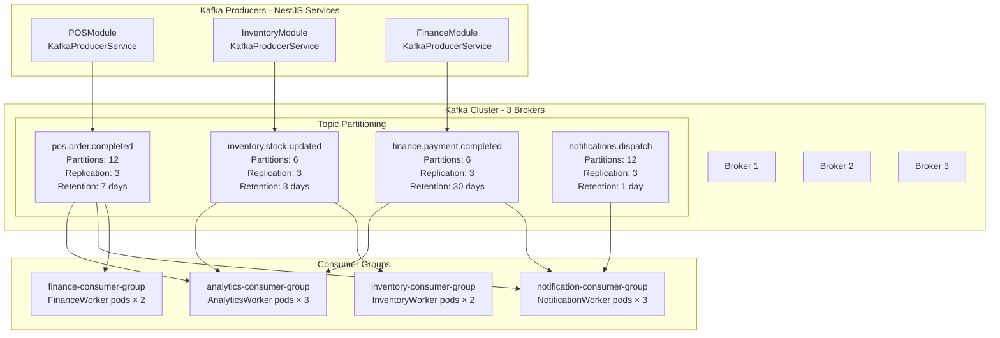

### 5.2 Kafka Topic Design

| Topic | Partitions | Replication | Retention | Partition Key | Purpose |
| :--- | :--- | :--- | :--- | :--- | :--- |
| `pos.order.completed` | 12 | 3 | 7 days | `tenantId` | POS sale events — all consumers |
| `pos.order.voided` | 6 | 3 | 7 days | `tenantId` | Void events — finance + inventory |
| `inventory.stock.updated` | 6 | 3 | 3 days | `productId` | Stock changes — analytics + alert |
| `inventory.low_stock_alert` | 3 | 3 | 1 day | `tenantId` | Low stock alerts — notifications |
| `finance.payment.completed` | 6 | 3 | 30 days | `tenantId` | Payment events — compliance + analytics |
| `finance.invoice.generated` | 4 | 3 | 30 days | `tenantId` | Invoice events — CRM + notifications |
| `notifications.dispatch` | 12 | 3 | 1 day | `userId` | Outbound notification delivery |
| `events.dead_letter` | 3 | 3 | 30 days | — | Failed events for manual review |

### 5.3 Kafka Producer Service

```typescript
// common/kafka/kafka-producer.service.ts
@Injectable()
export class KafkaProducerService {
  private producer: Producer;
  private readonly logger = new Logger(KafkaProducerService.name);

  constructor(private readonly configService: ConfigService) {
    const kafka = new Kafka({
      clientId: 'saas-platform-api',
      brokers: configService.getOrThrow<string>('KAFKA_BROKERS').split(','),
      ssl: configService.get('KAFKA_SSL') === 'true',
      sasl: {
        mechanism: 'scram-sha-256',
        username: configService.getOrThrow('KAFKA_USERNAME'),
        password: configService.getOrThrow('KAFKA_PASSWORD'),
      },
      retry: { initialRetryTime: 100, retries: 5 },
    });

    this.producer = kafka.producer({
      transactionalId: 'saas-transactional-producer',  // Exactly-once semantics
      idempotent: true,                                  // Producer-level idempotency
      maxInFlightRequests: 5,
    });
  }

  async publish<T extends DomainEvent>(topic: string, event: T): Promise<void> {
    await this.producer.send({
      topic,
      messages: [{
        key: event.tenantId,            // Partition by tenantId for ordering per tenant
        value: JSON.stringify({
          eventId:       event.eventId,
          eventType:     event.eventType,
          aggregateId:   event.aggregateId,
          aggregateType: event.aggregateType,
          tenantId:      event.tenantId,
          occurredAt:    event.occurredAt.toISOString(),
          version:       event.version,
          correlationId: event.correlationId,
          payload:       this.extractPayload(event),
        }),
        headers: {
          'event-type':      event.eventType,
          'event-id':        event.eventId,
          'tenant-id':       event.tenantId,
          'correlation-id':  event.correlationId ?? '',
          'schema-version':  String(event.version),
          'content-type':    'application/json',
        },
        timestamp: String(event.occurredAt.getTime()),
      }],
    });

    this.logger.log({
      message: `Event published to Kafka: ${event.eventType}`,
      topic, eventId: event.eventId, tenantId: event.tenantId,
    });
  }

  async publishBatch<T extends DomainEvent>(topic: string, events: T[]): Promise<void> {
    await this.producer.send({
      topic,
      messages: events.map(event => ({
        key: event.tenantId,
        value: JSON.stringify(this.serializeEvent(event)),
        headers: { 'event-type': event.eventType, 'event-id': event.eventId },
      })),
    });
  }

  private extractPayload<T extends DomainEvent>(event: T): Record<string, unknown> {
    const { eventId, eventType, aggregateId, aggregateType, tenantId, occurredAt, version, correlationId, causationId, ...payload } = event;
    return payload as Record<string, unknown>;
  }
}
```

### 5.4 Kafka Consumer Service

```typescript
// common/kafka/kafka-consumer.service.ts — Base consumer
@Injectable()
export abstract class BaseKafkaConsumer implements OnModuleInit, OnModuleDestroy {
  private consumer: Consumer;
  protected abstract topics: string[];
  protected abstract groupId: string;
  protected abstract processMessage(message: KafkaMessage, topic: string): Promise<void>;

  private readonly logger = new Logger(this.constructor.name);

  async onModuleInit(): Promise<void> {
    const kafka = new Kafka({ brokers: ['...'] });
    this.consumer = kafka.consumer({
      groupId: this.groupId,
      sessionTimeout: 30000,
      heartbeatInterval: 3000,
      maxWaitTimeInMs: 500,
    });

    await this.consumer.connect();
    for (const topic of this.topics) {
      await this.consumer.subscribe({ topic, fromBeginning: false });
    }

    await this.consumer.run({
      eachMessage: async ({ topic, partition, message }) => {
        const start = Date.now();
        try {
          await this.processMessage(message, topic);
          this.logger.log({
            message: `Processed: ${topic}`,
            partition, offset: message.offset,
            duration: `${Date.now() - start}ms`,
          });
        } catch (error) {
          this.logger.error({
            message: `Failed to process: ${topic}`,
            error: (error as Error).message,
            partition, offset: message.offset,
          });
          throw error;  // Let Kafka retry (consumer will seek back)
        }
      },
    });
  }

  async onModuleDestroy(): Promise<void> {
    await this.consumer.disconnect();
  }
}
```

---

## SECTION 6 — RABBITMQ ARCHITECTURE

### 6.1 RabbitMQ Component Architecture

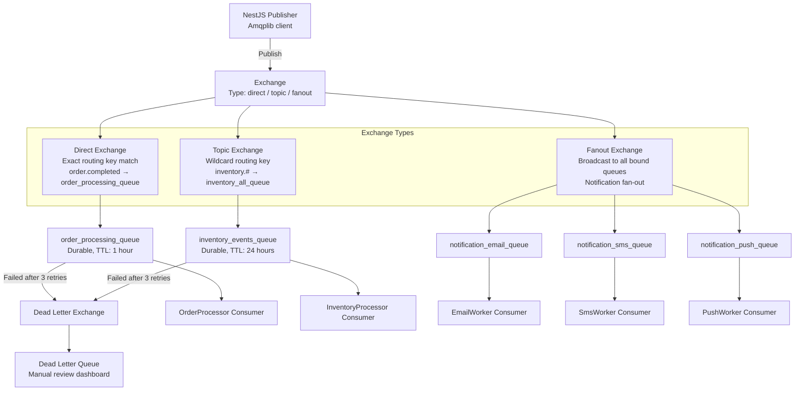

### 6.2 RabbitMQ vs Kafka Use Cases in Our Platform

| Scenario | Kafka | RabbitMQ |
| :--- | :--- | :--- |
| **POS order events** | ✅ High volume; multiple consumers; persistent log | — |
| **Payment events** | ✅ Persistent; compliance audit trail | — |
| **One-time notification dispatch** | — | ✅ Task queue; one consumer processes each message once |
| **Simple request-reply** | — | ✅ RPC pattern via reply queues |
| **Event replay** | ✅ Kafka supports replay from any offset | ❌ RabbitMQ deletes after ACK |
| **Low-latency task routing** | — | ✅ Routing keys for precise task distribution |

### 6.3 Platform Decision

```
PRIMARY: Kafka — for all persistent domain events

  Rationale:
  - Kafka provides event log (replay, audit, event sourcing future)
  - Kafka supports multiple independent consumer groups per topic
  - High throughput for growing tenant base and analytics pipeline

SECONDARY: BullMQ on Redis — for background job processing

  Rationale:
  - Priority queues, delay scheduling, progress tracking
  - Simpler ops than running two broker clusters
  - Redis already in infrastructure for caching and sessions
  - Better suited for job-queue semantics than event streaming

RabbitMQ: NOT deployed in v1

  Rationale:
  - Kafka + BullMQ covers all our use cases
  - Reducing operational complexity (fewer systems to manage)
  - Can add RabbitMQ in Phase 16 if microservice decomposition requires
    request-reply messaging patterns
```

---

## SECTION 7 — KAFKA VS RABBITMQ STRATEGY

### 7.1 Comprehensive Comparison

| Dimension | Apache Kafka | RabbitMQ |
| :--- | :--- | :--- |
| **Paradigm** | Distributed commit log (event streaming) | Message broker (queue-based) |
| **Message Retention** | Configurable (days/weeks); messages stay after consumption | Deleted after ACK; no retention by default |
| **Consumer Model** | Pull-based; consumer controls offset; multiple groups read same data | Push-based; broker delivers; each message consumed once |
| **Ordering** | Guaranteed within partition; partition key determines order | FIFO within queue; priority queues supported |
| **Throughput** | Very high (millions/sec per cluster) | High (100K+/sec) but lower than Kafka |
| **Latency** | Low (5–50ms typical) | Very low (1–5ms typical) |
| **Delivery Guarantee** | At-least-once (idempotent producer = effectively-once) | At-least-once; exactly-once with publisher confirms |
| **Replay** | ✅ Yes — seek to any offset in topic | ❌ No — consumed messages are gone |
| **Fan-out** | ✅ Multiple consumer groups, each read full topic | ✅ Exchange fan-out; each subscriber gets copy |
| **Routing** | By partition key (topic-level) | By routing key, exchange type |
| **Operational Complexity** | High (ZooKeeper/KRaft, cluster management) | Medium (management UI; cluster add-ons) |
| **Best For** | Event sourcing; analytics pipelines; high-volume streams | Task queues; RPC; service-to-service communication |

---

## SECTION 8 — CQRS ARCHITECTURE

### 8.1 CQRS (Command Query Responsibility Segregation)

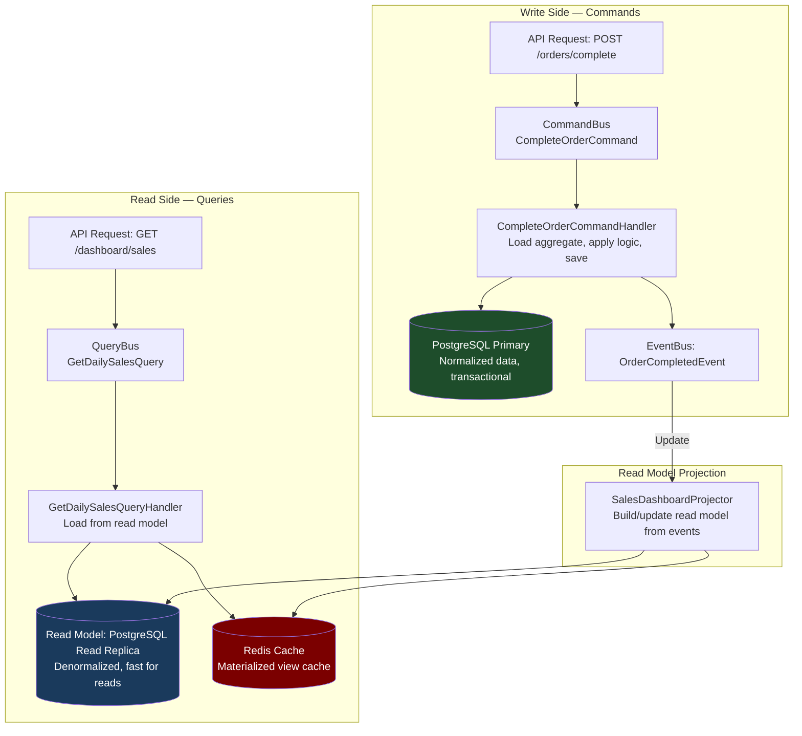

### 8.2 Command and Query Separation

```typescript
// ─── Command Side ─────────────────────────────────────────────────────────────

// Command (intent to change state)
export class CompleteOrderCommand {
  constructor(
    public readonly orderId: string,
    public readonly tenantId: string,
    public readonly cashierId: string,
    public readonly payment: { method: string; amount: number; currency: string },
    public readonly idempotencyKey: string,
  ) {}
}

// Command Handler (write logic)
@CommandHandler(CompleteOrderCommand)
export class CompleteOrderCommandHandler implements ICommandHandler<CompleteOrderCommand> {
  async execute(command: CompleteOrderCommand): Promise<Order> {
    // Full business logic: load, validate, transact, publish events
    return this.orderService.completeOrder(command);
  }
}

// ─── Query Side ────────────────────────────────────────────────────────────────

// Query (intent to read — no side effects)
export class GetDailySalesDashboardQuery {
  constructor(
    public readonly tenantId: string,
    public readonly branchId: string,
    public readonly date: string,   // ISO date string: 2026-07-13
  ) {}
}

// Query Handler (read-optimized — no aggregate loading)
@QueryHandler(GetDailySalesDashboardQuery)
export class GetDailySalesDashboardQueryHandler
  implements IQueryHandler<GetDailySalesDashboardQuery>
{
  constructor(
    private readonly redis: RedisService,
    private readonly prisma: PrismaService,
  ) {}

  async execute(query: GetDailySalesDashboardQuery): Promise<DailySalesDashboardDto> {
    const cacheKey = `dashboard:${query.tenantId}:${query.branchId}:${query.date}`;

    // Check Redis cache first
    const cached = await this.redis.get(cacheKey);
    if (cached) return JSON.parse(cached) as DailySalesDashboardDto;

    // Read from denormalized read model (read replica)
    const data = await this.prisma.$queryRaw<DailySalesDashboardDto[]>`
      SELECT
        COUNT(*)::int             AS total_orders,
        SUM(total_amount)         AS total_revenue,
        AVG(total_amount)         AS avg_order_value,
        MAX(total_amount)         AS max_order_value,
        COUNT(DISTINCT customer_id)::int AS unique_customers
      FROM pos.orders
      WHERE tenant_id = ${query.tenantId}::uuid
        AND branch_id = ${query.branchId}::uuid
        AND DATE(completed_at) = ${query.date}::date
        AND status = 'COMPLETED'
    `;

    const result = data[0];

    // Cache for 60 seconds (refreshed by analytics projector on new events)
    await this.redis.setex(cacheKey, 60, JSON.stringify(result));
    return result;
  }
}
```

### 8.3 CQRS Projector (Read Model Builder)

```typescript
// modules/analytics/projectors/sales-dashboard.projector.ts
@EventsHandler(OrderCompletedEvent)
export class SalesDashboardProjector implements IEventHandler<OrderCompletedEvent> {
  constructor(
    private readonly redis: RedisService,
    private readonly prisma: PrismaService,
  ) {}

  async handle(event: OrderCompletedEvent): Promise<void> {
    const dateKey = event.occurredAt.toISOString().split('T')[0];
    const cacheKey = `dashboard:${event.tenantId}:${event.branchId}:${dateKey}`;

    // Invalidate stale cache — next read will recompute from DB
    await this.redis.del(cacheKey);

    // Also update denormalized daily summary table (optional: for reporting)
    await this.prisma.$executeRaw`
      INSERT INTO analytics.daily_sales_summary
        (tenant_id, branch_id, date, total_orders, total_revenue, updated_at)
      VALUES
        (${event.tenantId}::uuid, ${event.branchId}::uuid, ${dateKey}::date, 1, ${event.totalAmount}, NOW())
      ON CONFLICT (tenant_id, branch_id, date)
      DO UPDATE SET
        total_orders  = daily_sales_summary.total_orders + 1,
        total_revenue = daily_sales_summary.total_revenue + EXCLUDED.total_revenue,
        updated_at    = NOW()
    `;
  }
}
```

---

## SECTION 9 — EVENT PROCESSING FLOW

### 9.1 Full POS Sale Event Chain

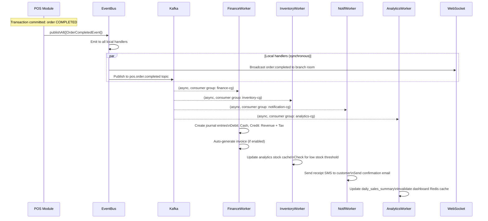

### 9.2 Event Processing Priority

| Event | Priority | Max Processing Time | Retry Attempts |
| :--- | :--- | :--- | :--- |
| `finance.payment.failed` | Critical | 10 s | 5 (DLT after) |
| `finance.payment.completed` | High | 30 s | 5 |
| `pos.order.completed` | High | 30 s | 5 |
| `pos.order.voided` | High | 30 s | 5 |
| `inventory.low_stock_alert` | Medium | 60 s | 3 |
| `identity.user.registered` | Medium | 60 s | 3 |
| `analytics.*` | Low | 120 s | 3 |
| `notifications.dispatch` | Medium | 30 s | 5 |

---

## SECTION 10 — BACKGROUND JOB ARCHITECTURE

### 10.1 BullMQ Queue Design

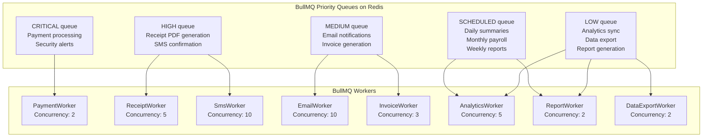

### 10.2 Complete BullMQ Configuration

```typescript
// modules/jobs/job-queues.module.ts
@Module({
  imports: [
    BullModule.forRoot({
      connection: {
        host: process.env.REDIS_HOST,
        port: parseInt(process.env.REDIS_PORT ?? '6379'),
        password: process.env.REDIS_PASSWORD,
        tls: process.env.REDIS_TLS === 'true' ? {} : undefined,
      },
    }),
    BullModule.registerQueue(
      { name: 'critical',   defaultJobOptions: { priority: 100, attempts: 5, backoff: { type: 'exponential', delay: 1000 } } },
      { name: 'high',       defaultJobOptions: { priority: 75,  attempts: 4, backoff: { type: 'exponential', delay: 2000 } } },
      { name: 'medium',     defaultJobOptions: { priority: 50,  attempts: 3, backoff: { type: 'exponential', delay: 5000 } } },
      { name: 'low',        defaultJobOptions: { priority: 25,  attempts: 3, backoff: { type: 'exponential', delay: 10000 } } },
      { name: 'scheduled',  defaultJobOptions: { priority: 10,  attempts: 3, backoff: { type: 'fixed', delay: 30000 } } },
    ),
  ],
})
export class JobQueuesModule {}

// Job type definitions
export enum JobType {
  // High queue
  RECEIPT_GENERATION   = 'receipt:generate',
  SMS_CONFIRMATION     = 'sms:order-confirmation',
  SMS_LOW_STOCK        = 'sms:low-stock-alert',
  // Medium queue
  EMAIL_WELCOME        = 'email:welcome',
  EMAIL_ORDER_CONFIRM  = 'email:order-confirmation',
  EMAIL_INVOICE        = 'email:invoice',
  INVOICE_GENERATE     = 'invoice:generate',
  // Low queue
  ANALYTICS_SYNC       = 'analytics:sync-daily',
  REPORT_GENERATE      = 'report:generate',
  DATA_EXPORT          = 'export:data',
  LOYALTY_CALCULATE    = 'loyalty:calculate-points',
  // Scheduled
  DAILY_SUMMARY        = 'schedule:daily-summary',
  MONTHLY_PAYROLL      = 'schedule:monthly-payroll',
  OVERDUE_INVOICE_CHECK = 'schedule:overdue-invoice-check',
}
```

### 10.3 Scheduled Jobs

```typescript
// modules/jobs/schedulers/daily-operations.scheduler.ts
@Injectable()
export class DailyOperationsScheduler {
  constructor(
    @InjectQueue('scheduled') private readonly scheduledQueue: Queue,
  ) {}

  // Run every day at 23:59 UTC — generate daily sales summary
  @Cron('59 23 * * *')
  async scheduleDailySummary(): Promise<void> {
    const tenants = await this.tenantRepo.findAllActive();
    await Promise.all(tenants.map(t =>
      this.scheduledQueue.add(JobType.DAILY_SUMMARY, { tenantId: t.id }, {
        jobId: `daily-summary:${t.id}:${new Date().toISOString().split('T')[0]}`,  // Dedup
      })
    ));
  }

  // Run every day at 09:00 — check overdue invoices
  @Cron('0 9 * * *')
  async scheduleOverdueInvoiceCheck(): Promise<void> {
    await this.scheduledQueue.add(JobType.OVERDUE_INVOICE_CHECK, {}, {
      jobId: `overdue-check:${new Date().toISOString().split('T')[0]}`,
    });
  }

  // Run on 1st of each month at 06:00 — prepare payroll
  @Cron('0 6 1 * *')
  async scheduleMonthlyPayroll(): Promise<void> {
    const tenants = await this.tenantRepo.findAllActive();
    for (const tenant of tenants) {
      await this.scheduledQueue.add(JobType.MONTHLY_PAYROLL, {
        tenantId: tenant.id,
        month: new Date().getMonth() + 1,
        year: new Date().getFullYear(),
      });
    }
  }
}
```

---

## SECTION 11 — RETRY & FAILURE HANDLING

### 11.1 Failure Handling Architecture

```mermaid
graph TD
    Consumer[Kafka Consumer\nProcesses message] --> ProcessResult{Processing result?}

    ProcessResult -->|Success| ACK[Commit offset\nMessage complete]
    ProcessResult -->|Transient error\ne.g., DB timeout| RetryCheck{Retry attempt}

    RetryCheck -->|Attempt 1| Wait1[Wait: 1s exponential backoff]
    Wait1 --> Retry1[Retry processing]
    Retry1 -->|Fail| RetryCheck

    RetryCheck -->|Attempt 2| Wait2[Wait: 2s]
    RetryCheck -->|Attempt 3| Wait4[Wait: 4s]
    RetryCheck -->|Attempt 4| Wait8[Wait: 8s]
    RetryCheck -->|Attempt 5| Wait16[Wait: 16s]

    RetryCheck -->|Max retries exceeded| DLTPublish[Publish to events.dead_letter topic\nWith: error message, attempt count, original payload]

    DLTPublish --> DLTStore[(Dead Letter Topic\nRetention: 30 days)]
    DLTStore --> Alert[Alert: PagerDuty + Slack\n#platform-alerts channel]
    DLTStore --> Dashboard[DLT Dashboard\nManual review + replay]

    Dashboard -->|After fix| Replay[Replay message to original topic]
    Replay --> Consumer
```

### 11.2 Kafka Dead Letter Topic Handler

```typescript
// common/kafka/dead-letter.service.ts
@Injectable()
export class DeadLetterService {
  constructor(
    private readonly kafkaProducer: KafkaProducerService,
    private readonly alertService: AlertService,
    private readonly prisma: PrismaService,
  ) {}

  async sendToDeadLetter(
    originalTopic: string,
    message: KafkaMessage,
    error: Error,
    attemptCount: number,
  ): Promise<void> {
    const dltPayload = {
      originalTopic,
      originalMessage: JSON.parse(message.value?.toString() ?? '{}'),
      originalHeaders: Object.fromEntries(
        Object.entries(message.headers ?? {}).map(([k, v]) => [k, v?.toString()])
      ),
      failureReason: error.message,
      failureStack: error.stack,
      attemptCount,
      failedAt: new Date().toISOString(),
    };

    // Send to DLT topic
    await this.kafkaProducer.producer.send({
      topic: 'events.dead_letter',
      messages: [{ value: JSON.stringify(dltPayload), key: originalTopic }],
    });

    // Store in DB for dashboard
    await this.prisma.deadLetterEvent.create({
      data: {
        originalTopic,
        payload: dltPayload,
        status: 'PENDING_REVIEW',
        createdAt: new Date(),
      },
    });

    // Alert operations team
    await this.alertService.sendCriticalAlert({
      title: `Dead Letter: ${originalTopic}`,
      message: `Event failed after ${attemptCount} attempts: ${error.message}`,
      severity: 'HIGH',
      channel: '#platform-alerts',
    });
  }

  async replayFromDeadLetter(dltEventId: string): Promise<void> {
    const dltEvent = await this.prisma.deadLetterEvent.findUniqueOrThrow({
      where: { id: dltEventId }
    });

    // Re-publish to original topic
    await this.kafkaProducer.producer.send({
      topic: dltEvent.originalTopic,
      messages: [{ value: JSON.stringify((dltEvent.payload as any).originalMessage) }],
    });

    await this.prisma.deadLetterEvent.update({
      where: { id: dltEventId },
      data: { status: 'REPLAYED', replayedAt: new Date() },
    });
  }
}
```

---

## SECTION 12 — IDEMPOTENT EVENT PROCESSING

### 12.1 Idempotent Consumer Pattern

```typescript
// common/kafka/idempotent-consumer.decorator.ts
// Every Kafka consumer extends this pattern:

export abstract class IdempotentKafkaConsumer extends BaseKafkaConsumer {
  protected abstract processUniqueEvent(payload: unknown, eventId: string): Promise<void>;

  protected async processMessage(message: KafkaMessage, topic: string): Promise<void> {
    const eventId = message.headers?.['event-id']?.toString();
    if (!eventId) throw new Error('Message missing event-id header');

    // Check if already processed (idempotency guard)
    const alreadyProcessed = await this.redis.exists(`processed:${this.groupId}:${eventId}`);
    if (alreadyProcessed) {
      this.logger.warn({ message: 'Duplicate event detected; skipping', eventId, topic });
      return;
    }

    const payload = JSON.parse(message.value?.toString() ?? '{}');

    // Process the unique event
    await this.processUniqueEvent(payload, eventId);

    // Mark as processed (TTL: 7 days — matches max Kafka retention)
    await this.redis.setex(`processed:${this.groupId}:${eventId}`, 604800, '1');
  }
}

// Concrete consumer example:
@Injectable()
export class OrderCompletedConsumer extends IdempotentKafkaConsumer {
  protected topics = ['pos.order.completed'];
  protected groupId = 'finance-consumer-group';

  protected async processUniqueEvent(payload: OrderCompletedEventPayload): Promise<void> {
    await this.journalEntryService.createSaleJournalEntries(payload);
    await this.invoiceService.autoGenerateIfEnabled(payload);
  }
}
```

### 12.2 Idempotency Key Storage

```
Redis Key Pattern:                       TTL          Purpose
────────────────────────────────────────────────────────────
processed:{groupId}:{eventId}            7 days       Per consumer group — prevent double processing
idempotent:{key}                         24 hours     Payment/order API idempotency
lock:{resourceId}                        30 seconds   Distributed lock during processing
dlt:event:{eventId}                      30 days      Dead letter event record reference
```

---

## SECTION 13 — EVENT STORAGE

### 13.1 Event Log Architecture

```typescript
// Event log: append-only table — every domain event persisted
model EventLog {
  id            String    @id @default(dbgenerated("gen_random_uuid()")) @db.Uuid
  eventId       String    @unique @db.Uuid            // DomainEvent.eventId
  eventType     String    @db.VarChar(100)            // "pos.order.completed"
  aggregateId   String    @db.Uuid
  aggregateType String    @db.VarChar(50)
  tenantId      String    @db.Uuid
  version       Int       @default(1)
  correlationId String?   @db.Uuid
  causationId   String?   @db.Uuid
  payload       Json      @db.JsonB                  // Full event data
  occurredAt    DateTime  @db.Timestamptz
  publishedAt   DateTime  @default(now()) @db.Timestamptz  // When recorded

  @@index([tenantId, aggregateId])
  @@index([tenantId, eventType, occurredAt])
  @@index([occurredAt])
  @@map("event_log")
}
```

### 13.2 Event Store Future Roadmap

```
Current State (Phase 14.7):
  → Event Log: append-only table in PostgreSQL
  → Used for: audit trail, debugging, replay capability
  → Limitation: not a true event store (no snapshots, no aggregate rebuilding)

Phase 16 — Event Sourcing (Optional):
  → Replace ORM-based persistence with event sourcing for complex aggregates
  → Aggregate state = replayed from event store
  → EventStoreDB or custom PostgreSQL implementation
  → Enables: time-travel debugging, full audit, CQRS optimization
  → Candidate aggregates: Order, Invoice, Payroll

Decision Criteria for Event Sourcing Adoption:
  → Complex aggregate state history required
  → Regulatory need for complete change audit
  → CQRS read model optimization benefits outweigh complexity
  → Team has Event Sourcing expertise
```

---

## SECTION 14 — REAL-TIME EVENT COMMUNICATION

### 14.1 Backend Event → Frontend Update Flow

```mermaid
graph TD
    BusinessEvent[Business Event\nOrderCompletedEvent] --> EventHandler[OrderCompletedHandler\nIn-process event handler]

    EventHandler --> Kafka4[Publish to Kafka\npos.order.completed]
    EventHandler --> WSBroadcast2[WebSocket Broadcast\nImmediate: same process]

    WSBroadcast2 --> Room[Socket.IO Room\ntenant:{tenantId}:branch:{branchId}]
    Room --> Frontend[Frontend Clients\nSubscribed to branch room]

    Frontend --> POSDashboard[POS Terminal\nNew order appears]
    Frontend --> ManagerDash[Manager Dashboard\nRevenue counter increments]
    Frontend --> KDS[Kitchen Display\nNew order queue item]

    Kafka4 --> AnalyticsConsumer2[AnalyticsWorker\nUpdate daily_sales_summary]
    AnalyticsConsumer2 --> InvalidateCache[Invalidate Redis dashboard cache]
    InvalidateCache --> NextRequest[Next dashboard GET request\nReads fresh data from DB]
```

### 14.2 Real-Time Event Registry

| Backend Event | Socket.IO Event | Room Target | Frontend Component |
| :--- | :--- | :--- | :--- |
| `OrderCompletedEvent` | `order:completed` | `tenant:{id}:branch:{id}` | POS order list; revenue counter |
| `OrderCreatedEvent` | `order:created` | `tenant:{id}:branch:{id}` | POS terminal queue |
| `LowStockAlertEvent` | `stock:low_alert` | `tenant:{id}` | Inventory alert badge |
| `StockUpdatedEvent` | `stock:updated` | `tenant:{id}:branch:{id}` | Inventory stock level |
| `EmployeeClockInEvent` | `employee:clocked_in` | `tenant:{id}` | HR attendance board |
| `PaymentFailedEvent` | `payment:failed` | `tenant:{id}:branch:{id}` | POS payment error modal |
| `InvoiceOverdueEvent` | `invoice:overdue` | `tenant:{id}` | Finance overdue badge |
| `NotificationNewEvent` | `notification:new` | `user:{userId}` | Notification bell |

---

## SECTION 15 — ASYNC BUSINESS EXAMPLES

### 15.1 POS Sale — Full Async Chain

```
Trigger: POST /api/v1/orders/{id}/complete
         ↓ [52ms] Sync: validate, transact, commit
         ↓ [+2ms] Publish OrderCompletedEvent

Immediate async (< 100ms):
  → WebSocket: order:completed broadcast to branch POS terminals
  → EventLog: event persisted to event_log table

Background async (100ms – 2s):
  → FinanceWorker: Create journal entries (DEBIT Cash, CREDIT Revenue)
  → AnalyticsWorker: Update daily_sales_summary, invalidate cache
  → InventoryWorker: Verify stock thresholds; trigger alert if needed

Background async (2s – 30s):
  → ReceiptWorker: Generate PDF receipt, upload to S3
  → SmsWorker: Send confirmation SMS to customer (if phone registered)
  → EmailWorker: Send confirmation email (if email registered)
  → LoyaltyWorker: Calculate and credit loyalty points

Scheduled (23:59 UTC daily):
  → DailySummaryWorker: Finalize day's totals; archive; send daily report
```

### 15.2 Inventory Purchase Receipt — Async Chain

```
Trigger: POST /api/v1/purchase-orders/{id}/receive-goods
         ↓ [80ms] Sync: validate, record receipt, update stock, commit
         ↓ [+2ms] Publish PurchaseReceivedEvent + StockUpdatedEvent

Background async:
  → FinanceWorker: Update accounts payable; create DEBIT Inventory, CREDIT AP journal
  → AnalyticsWorker: Update inventory value, refresh stock dashboard
  → NotifWorker: Notify purchasing manager of receipt confirmation
  → LowStockCheck: Cancel any pending low-stock alerts for received products

Conditional:
  → If any product had low-stock alert → Publish LowStockResolvedEvent
```

### 15.3 Report Generation — Async Job

```typescript
// modules/analytics/services/report.service.ts
async requestReport(command: GenerateReportCommand): Promise<string> {
  const reportId = generateId();

  // Mark as PENDING immediately — user sees "generating"
  await this.prisma.report.create({
    data: { id: reportId, tenantId: command.tenantId, type: command.type,
            status: 'PENDING', requestedBy: command.requestedBy },
  });

  // Queue the heavy work
  await this.reportQueue.add(JobType.REPORT_GENERATE, {
    reportId, tenantId: command.tenantId, type: command.type,
    dateFrom: command.dateFrom, dateTo: command.dateTo,
    filters: command.filters,
  }, { priority: 25, attempts: 3, backoff: { type: 'exponential', delay: 5000 } });

  return reportId;  // Client polls GET /reports/{reportId} for status
}

// Worker:
@Processor('low')
export class ReportGenerationWorker {
  @Process(JobType.REPORT_GENERATE)
  async handle(job: Job<{ reportId: string; tenantId: string; type: string; dateFrom: string; dateTo: string }>): Promise<void> {
    await this.reportRepo.setStatus(job.data.reportId, 'PROCESSING');
    await job.updateProgress(10);

    const data = await this.reportDataService.collect(job.data);
    await job.updateProgress(50);

    const excelBuffer = await this.excelService.generate(job.data.type, data);
    await job.updateProgress(80);

    const s3Key = `reports/${job.data.tenantId}/${job.data.reportId}.xlsx`;
    const url = await this.s3Service.upload(s3Key, excelBuffer);
    await job.updateProgress(95);

    await this.reportRepo.setCompleted(job.data.reportId, url);
    await job.updateProgress(100);

    await this.notifQueue.add(JobType.EMAIL_REPORT_READY, {
      reportId: job.data.reportId, tenantId: job.data.tenantId,
    });
  }
}
```

---

## SECTION 16 — EVENT SECURITY

### 16.1 Message Security Architecture

| Security Control | Kafka | BullMQ | Description |
| :--- | :--- | :--- | :--- |
| **Transport encryption** | TLS 1.3 (SASL_SSL) | TLS to Redis (via TLS Redis) | All messages encrypted in transit |
| **Authentication** | SASL/SCRAM-SHA-256 per producer/consumer | Redis AUTH + TLS | Identity verified before any operation |
| **Authorization** | Kafka ACLs per topic | Redis ACL per queue namespace | Producers cannot consume; cross-topic isolation |
| **Message validation** | JSON Schema validation on consumer | DTO validation in worker | Reject malformed messages before processing |
| **Tenant isolation** | `tenantId` in every message; filter on consumer | `tenantId` in every job payload | No cross-tenant event leakage |
| **Secret management** | Kafka credentials from AWS Secrets Manager | Redis password from AWS Secrets Manager | No credentials in code or env files |
| **Payload encryption** | PII fields encrypted before publishing (AES-256-GCM) | PII encrypted in job payload | Sensitive data protected at rest in Kafka log |

### 16.2 Event Schema Validation

```typescript
// common/kafka/schema-validator.service.ts
const EVENT_SCHEMAS: Record<string, object> = {
  'pos.order.completed': {
    type: 'object',
    required: ['eventId', 'eventType', 'aggregateId', 'tenantId', 'occurredAt', 'payload'],
    properties: {
      eventId:   { type: 'string', format: 'uuid' },
      tenantId:  { type: 'string', format: 'uuid' },
      payload: {
        type: 'object',
        required: ['orderId', 'totalAmount', 'currency', 'items'],
        properties: {
          orderId:     { type: 'string', format: 'uuid' },
          totalAmount: { type: 'number', minimum: 0 },
          currency:    { type: 'string', enum: ['USD', 'KHR', 'THB'] },
          items: {
            type: 'array', minItems: 1,
            items: {
              type: 'object',
              required: ['productId', 'quantity', 'lineTotal'],
            },
          },
        },
      },
    },
  },
};

@Injectable()
export class EventSchemaValidator {
  private readonly ajv = new Ajv({ allErrors: true });

  validate(eventType: string, message: unknown): void {
    const schema = EVENT_SCHEMAS[eventType];
    if (!schema) {
      this.logger.warn(`No schema registered for event: ${eventType}`);
      return;  // Allow unknown events through (forward compatibility)
    }

    const valid = this.ajv.validate(schema, message);
    if (!valid) {
      throw new Error(`Schema validation failed for ${eventType}: ${this.ajv.errorsText()}`);
    }
  }
}
```

---

## SECTION 17 — EVENT TESTING STRATEGY

### 17.1 Event Testing Pyramid

| Test Level | Scope | Tool | Coverage |
| :--- | :--- | :--- | :--- |
| **Unit: Event handlers** | Handler logic with mocked dependencies | Jest + `@nestjs/testing` | All handler methods |
| **Unit: Event structure** | Domain event construction + fields | Jest | All event constructors |
| **Integration: Producer** | Actual Kafka publish + consume | Jest + `testcontainers-kafka` | Topic routing, headers |
| **Integration: BullMQ** | Job queue + worker processing | Jest + BullMQ testing | Queue, retry, DLQ |
| **Integration: Idempotency** | Duplicate event detection | Jest + Redis mock | Duplicate event skipped |
| **E2E: Event chain** | Full chain: API → event → consumers | Supertest + test subscribers | Business flow outcomes |

### 17.2 Event Handler Unit Tests

```typescript
// modules/pos/handlers/__tests__/order-completed.handler.spec.ts
describe('OrderCompletedHandler', () => {
  let handler: OrderCompletedHandler;
  let kafkaProducer: jest.Mocked<KafkaProducerService>;
  let wsGateway: jest.Mocked<RealtimeGateway>;
  let eventLogRepo: jest.Mocked<EventLogRepository>;

  beforeEach(async () => {
    const module = await Test.createTestingModule({
      providers: [
        OrderCompletedHandler,
        { provide: KafkaProducerService, useValue: createMock<KafkaProducerService>() },
        { provide: RealtimeGateway, useValue: createMock<RealtimeGateway>() },
        { provide: EventLogRepository, useValue: createMock<EventLogRepository>() },
      ],
    }).compile();

    handler = module.get(OrderCompletedHandler);
    kafkaProducer = module.get(KafkaProducerService);
    wsGateway = module.get(RealtimeGateway);
    eventLogRepo = module.get(EventLogRepository);
  });

  it('publishes event to Kafka and broadcasts WebSocket on order completion', async () => {
    const event = new OrderCompletedEvent(
      'order-001', 'tenant-001', 'branch-001', 'cashier-001',
      null, 25.50, 'USD', 'CASH', [{ productId: 'p1', quantity: 2, lineTotal: 25.50 }]
    );

    await handler.handle(event);

    expect(eventLogRepo.append).toHaveBeenCalledWith(event);
    expect(kafkaProducer.publish).toHaveBeenCalledWith('pos.order.completed', event);
    expect(wsGateway.broadcastOrderCompleted).toHaveBeenCalledWith('tenant-001', 'branch-001', expect.objectContaining({ orderId: 'order-001' }));
  });

  it('continues with WebSocket broadcast even if Kafka is temporarily unavailable', async () => {
    kafkaProducer.publish.mockRejectedValueOnce(new Error('Kafka unavailable'));
    const event = buildMockOrderCompletedEvent();

    // Handler should not throw — WebSocket broadcast must still happen
    await expect(handler.handle(event)).rejects.toThrow();
    // In production: Kafka failure should be caught and logged, not swallowed silently
  });
});
```

### 17.3 Idempotency Integration Test

```typescript
describe('Idempotent Consumer', () => {
  it('processes event once even when delivered twice', async () => {
    const event = buildMockOrderCompletedEvent('duplicate-event-id');
    const processSpyFn = jest.fn();

    // Process first time
    await consumer.processMessage(buildKafkaMessage(event), 'pos.order.completed');
    expect(processSpyFn).toHaveBeenCalledTimes(1);

    // Process second time (duplicate)
    await consumer.processMessage(buildKafkaMessage(event), 'pos.order.completed');
    expect(processSpyFn).toHaveBeenCalledTimes(1);  // ← Still 1, not 2
  });
});
```

---

## SECTION 18 — EVENT MONITORING

### 18.1 Monitoring Architecture

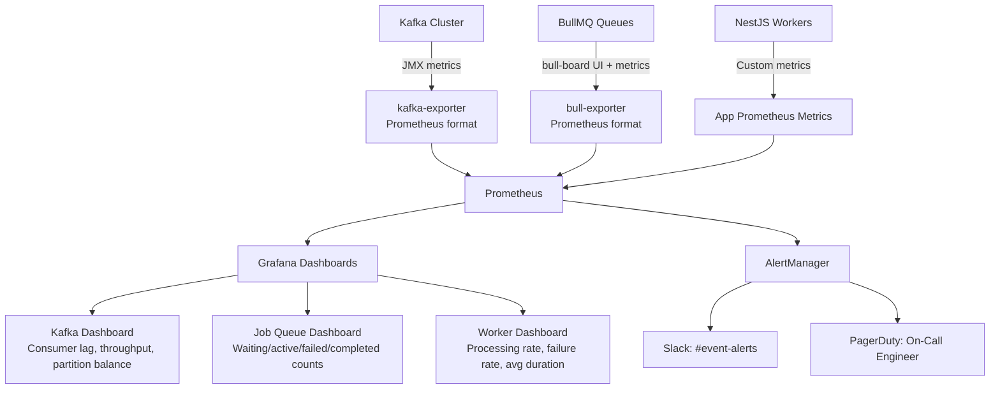

### 18.2 Key Kafka Metrics to Monitor

| Metric | Warning | Critical | Description |
| :--- | :--- | :--- | :--- |
| **Consumer group lag** | > 1,000 messages | > 10,000 messages | Messages pending but not consumed |
| **Message throughput** | < 50% of baseline | < 20% of baseline | Sudden throughput drop (producer issue) |
| **Consumer rebalance rate** | > 1/hour | > 5/hour | Too many rebalances = instability |
| **Failed message rate** | > 0.1% | > 1% | Messages going to DLT |
| **DLT queue size** | > 10 messages | > 100 messages | Dead letters accumulating |
| **Broker disk usage** | > 70% | > 85% | Topic retention may need reduction |
| **Replication factor** | < 3 | < 2 | Insufficient replication |

### 18.3 BullMQ Queue Metrics

```typescript
// common/metrics/queue-metrics.service.ts
@Injectable()
export class QueueMetricsService {
  async collectQueueMetrics(): Promise<QueueMetricSnapshot[]> {
    const queueNames = ['critical', 'high', 'medium', 'low', 'scheduled'];
    return Promise.all(queueNames.map(async (name) => {
      const queue = this.getQueue(name);
      const [waiting, active, completed, failed, delayed] = await Promise.all([
        queue.getWaitingCount(),
        queue.getActiveCount(),
        queue.getCompletedCount(),
        queue.getFailedCount(),
        queue.getDelayedCount(),
      ]);
      return { queue: name, waiting, active, completed, failed, delayed };
    }));
  }
}
```

---

## SECTION 19 — EVENT GOVERNANCE

### 19.1 Event Naming Standards

```
Format:     {domain}.{aggregate}.{past_tense_action}
Examples:   pos.order.completed
            inventory.stock.updated
            finance.payment.failed
            identity.user.registered
            hr.employee.clocked_in

Rules:
  → All lowercase, dot-separated
  → Past tense: completed, updated, failed, registered (facts, not commands)
  → Domain prefix: pos, inventory, finance, crm, hr, identity, analytics
  → Aggregate: order, product, payment, customer, employee, user
  → Never use verbs like: createOrder, processPayment, sendEmail
```

### 19.2 Schema Versioning Rules

| Change Type | Version Bump | Strategy |
| :--- | :--- | :--- |
| Add optional field to payload | None — backward compatible | Consumers must tolerate unknown fields |
| Add required field to payload | Minor version bump | Dual-write: old + new consumers run simultaneously |
| Remove field from payload | Major version bump | New topic version: `pos.order.completed.v2` |
| Rename field | Major version bump | Map old field to new field in consumer |
| Change field type | Major version bump | New topic + migration consumer |

### 19.3 Event Documentation Requirement

```markdown
# Event Record — ER-2026-012

## Event Type
pos.order.completed

## Produced By
POSModule → OrderService.completeOrder → OrderCompletedHandler

## Schema Version
v1 (2026-01-01)

## Payload Fields
| Field         | Type     | Required | Description                      |
| orderId       | UUID     | Yes      | Completed order identifier       |
| tenantId      | UUID     | Yes      | Tenant context                   |
| totalAmount   | number   | Yes      | Order total in base currency unit |
| currency      | string   | Yes      | ISO 4217 currency code           |
| items         | array    | Yes      | Line items with productId, qty   |

## Consumers
| Consumer             | Group                    | Action                           |
| FinanceWorker        | finance-consumer-group   | Create journal entries + invoice |
| InventoryWorker      | inventory-consumer-group | Stock analytics update           |
| NotificationWorker   | notification-cg          | SMS/Email confirmation           |
| AnalyticsWorker      | analytics-consumer-group | KPI dashboard update             |

## SLA
Max processing time: 30 seconds per consumer
DLT policy: After 5 retries with exponential backoff

## Retention
7 days in Kafka topic
Indefinite in event_log table
```

---

## SECTION 20 — FINAL EVENT DRIVEN ARCHITECTURE DIAGRAMS

### 20.1 Event Driven Backend Architecture

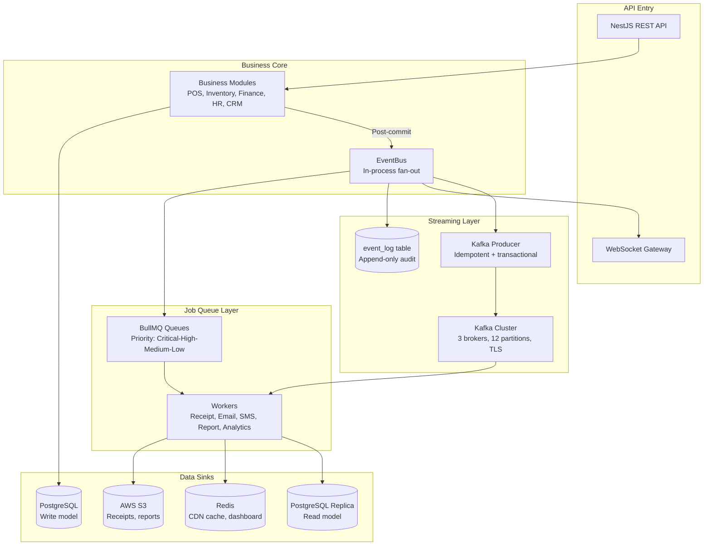

### 20.2 Kafka Message Flow

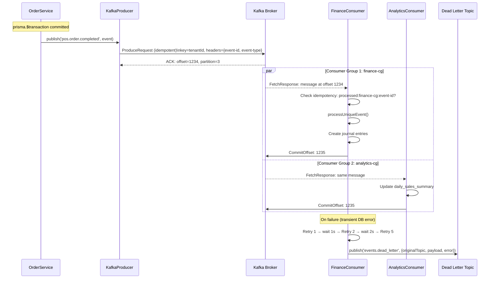

### 20.3 CQRS Architecture

```mermaid
graph TD
    subgraph CommandSide [Command Side - Write]
        CmdReq[POST /api/v1/orders/complete] --> CmdBus[CommandBus]
        CmdBus --> CmdHandler[CompleteOrderCommandHandler]
        CmdHandler --> WriteLogic[Business Logic + Domain Rules]
        WriteLogic --> WriteTx[PostgreSQL Transaction\nNormalized tables]
        WriteLogic --> EventPub[Publish OrderCompletedEvent]
    end

    subgraph ProjectionLayer [Projection / Sync Layer]
        EventPub --> Projector2[SalesDashboardProjector\nConsumes OrderCompletedEvent]
        Projector2 --> UpdateReadModel[Update daily_sales_summary\nDenormalized, query-optimized]
        Projector2 --> InvalidateRedis[Invalidate Redis cache\ndashboard:{tenantId}:{branch}]
    end

    subgraph QuerySide [Query Side - Read]
        QryReq[GET /api/v1/dashboard/sales] --> QryBus[QueryBus]
        QryBus --> QryHandler[GetDailySalesQueryHandler]
        QryHandler --> RedisCheck{Redis hit?}
        RedisCheck -->|Hit| CachedResponse[Return cached data\n< 1ms]
        RedisCheck -->|Miss| ReadReplica[Query PostgreSQL Read Replica\nDenormalized summary table]
        ReadReplica --> StoreCache[Store in Redis 60s]
        StoreCache --> FreshResponse[Return fresh data]
    end

    style WriteTx fill:#1e4d2b,color:#fff
    style ReadReplica fill:#1a3a5c,color:#fff
    style CachedResponse fill:#7B0000,color:#fff
```

### 20.4 Background Job Processing

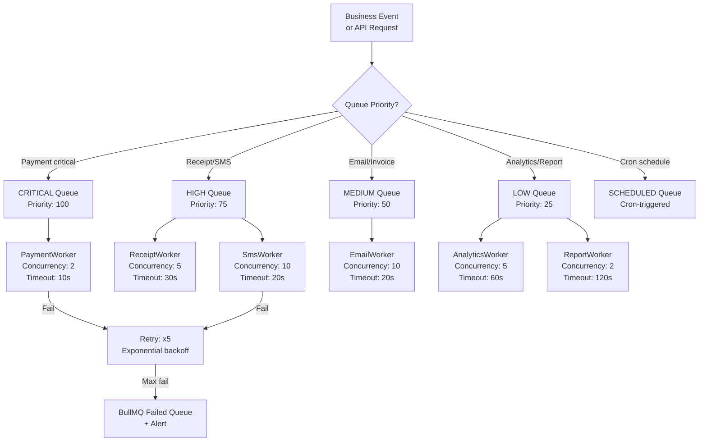

### 20.5 Event Failure Recovery Flow

```mermaid
graph TD
    EventMsg[Kafka Message Received] --> Validate2[Validate schema\nCheck tenant + eventId headers]
    Validate2 -->|Schema invalid| LogReject[Log + reject\nDo not retry schema errors]
    Validate2 -->|Valid| Idempotency2[Idempotency check\nRedis: processed:{group}:{eventId}]

    Idempotency2 -->|Already processed| Skip[Skip silently\nLog: duplicate skipped]
    Idempotency2 -->|New event| Process2[Process event\nBusiness logic]

    Process2 -->|Success| MarkProcessed[Mark processed in Redis\nCommit Kafka offset]
    Process2 -->|Transient failure| Retry3[Retry: exponential backoff\nAttempts 1→5]

    Retry3 -->|Retry success| MarkProcessed
    Retry3 -->|All retries exhausted| DLTSend[Send to events.dead_letter\nInclude: error, attempts, payload]

    DLTSend --> DLTStorage[(Dead Letter Topic + DB)]
    DLTStorage --> AlertOps[Alert: PagerDuty + Slack]
    DLTStorage --> DLTDashboard[Dead Letter Dashboard\nManual review]

    DLTDashboard -->|Root cause fixed| Replay2[Replay: requeue to original topic]
    Replay2 --> EventMsg
```

---

## APPENDIX A — EVENT ARCHITECTURE QUICK REFERENCE

```
In-Process Events:   EventEmitter2 (NestJS @nestjs/event-emitter); synchronous fan-out
Kafka:               3-broker cluster; 12 partitions; SASL/SCRAM; TLS 1.3
Kafka Topics:        8 primary topics; 1 DLT topic; retention: 1–30 days
Consumer Groups:     1 per consuming service; independent offset tracking
BullMQ Queues:       5 priority queues (Critical/High/Medium/Low/Scheduled)
Retry Strategy:      Exponential backoff; 3–5 attempts; DLT after max retries
Idempotency:         Redis NX SET per (groupId, eventId); 7-day TTL
CQRS:                Command side (write DB); Query side (read replica + Redis cache)
Event Log:           Append-only PostgreSQL table; indefinite retention
Event Naming:        {domain}.{aggregate}.{past_tense} — all lowercase dot-separated
Schema Versioning:   Additive changes = backward compatible; breaking = new topic version
```

## APPENDIX B — KAFKA TOPIC QUICK SETUP

```bash
# Create topics via Kafka CLI (or Terraform in production)
kafka-topics.sh --bootstrap-server kafka:9092 \
  --create --topic pos.order.completed \
  --partitions 12 --replication-factor 3 \
  --config retention.ms=604800000 \
  --config min.insync.replicas=2

kafka-topics.sh --bootstrap-server kafka:9092 \
  --create --topic events.dead_letter \
  --partitions 3 --replication-factor 3 \
  --config retention.ms=2592000000  # 30 days

# List consumer group lag
kafka-consumer-groups.sh --bootstrap-server kafka:9092 \
  --describe --group finance-consumer-group
```

---

*End of Backend Event Driven Architecture, Messaging & Asynchronous Processing*  
*Document maintained by: Principal Distributed Systems Architect & Event Driven Architecture Specialist | Status: Approved Event Driven Architecture & Messaging Specification*
