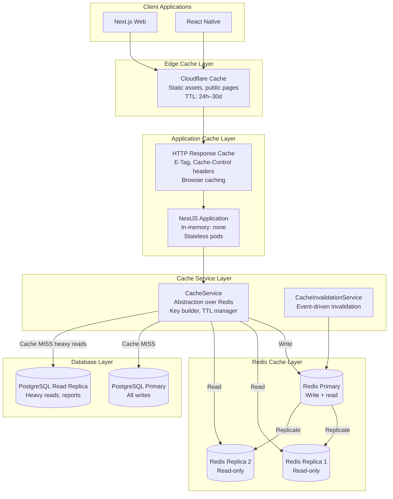
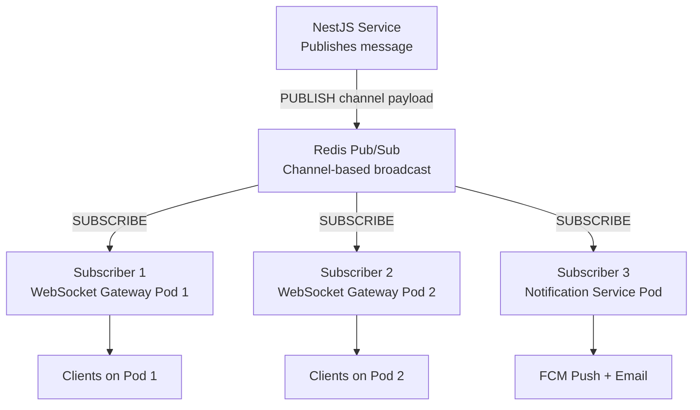
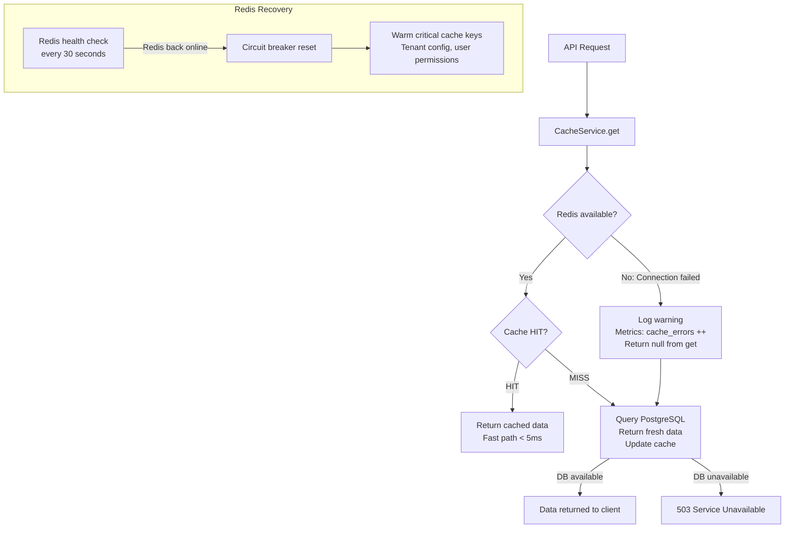
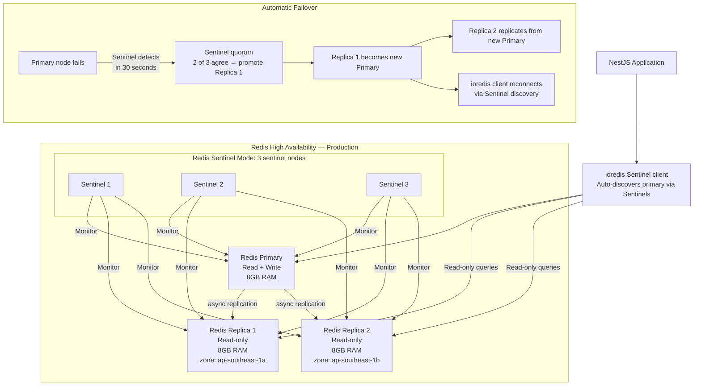
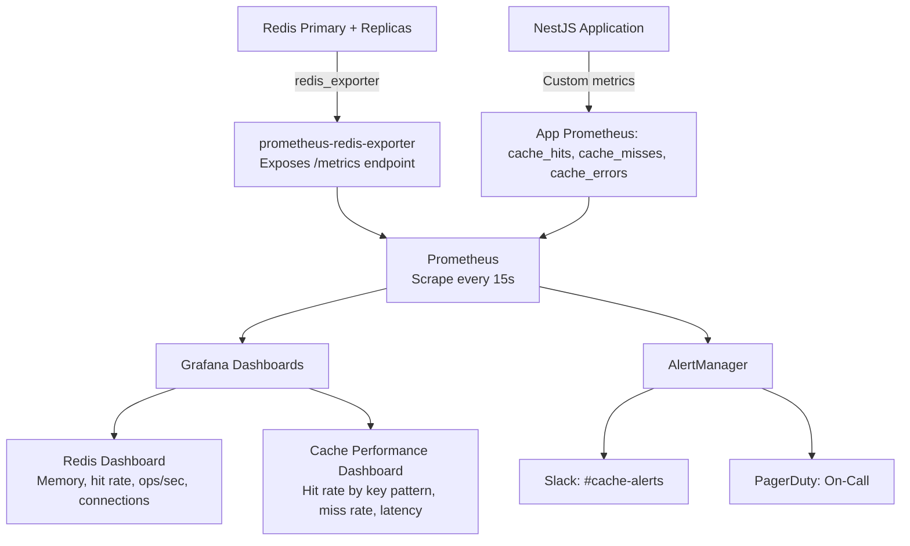
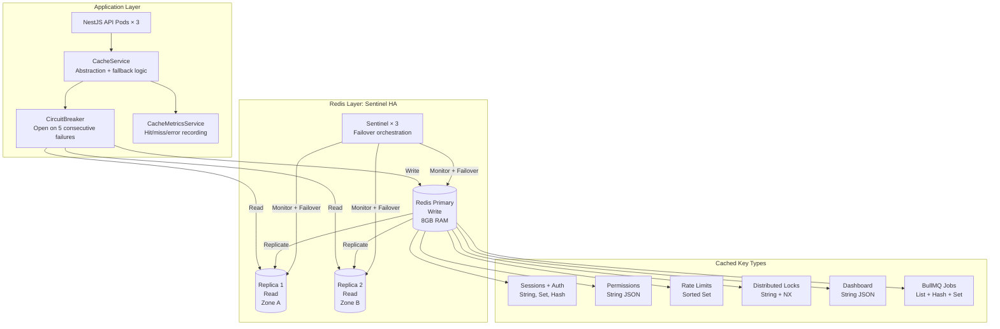
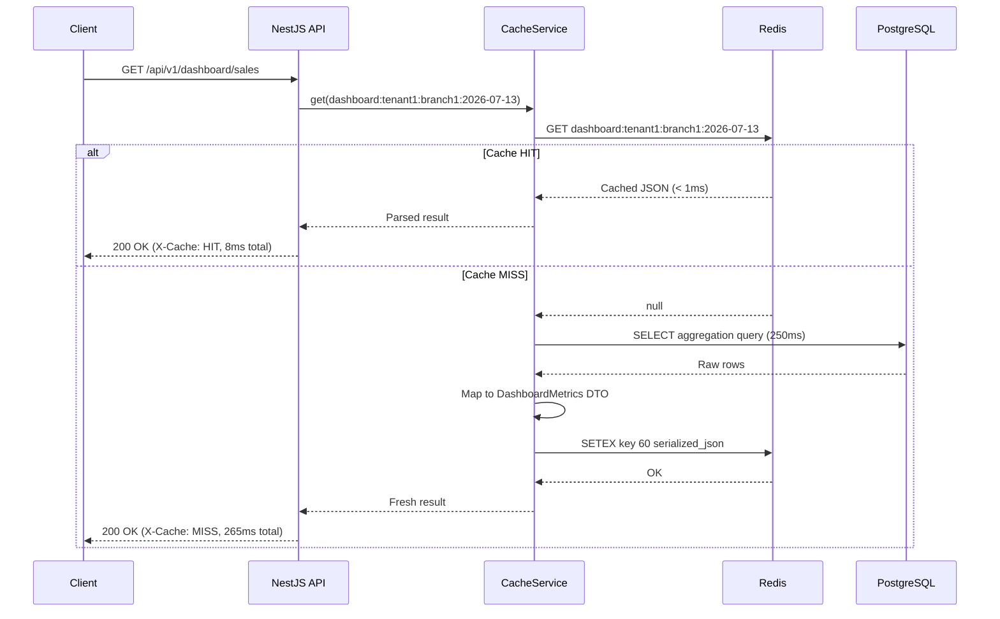
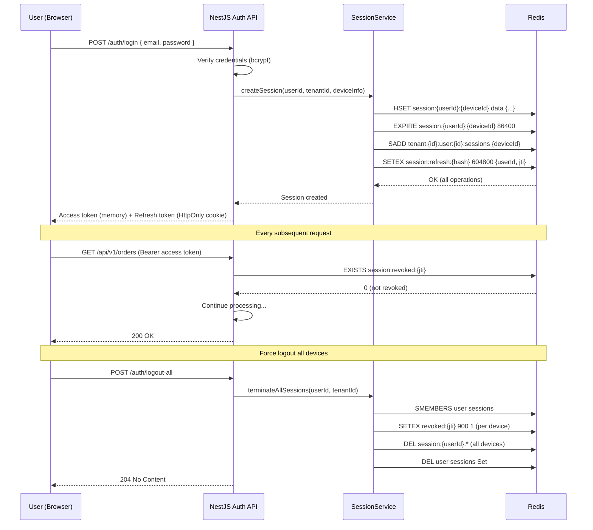
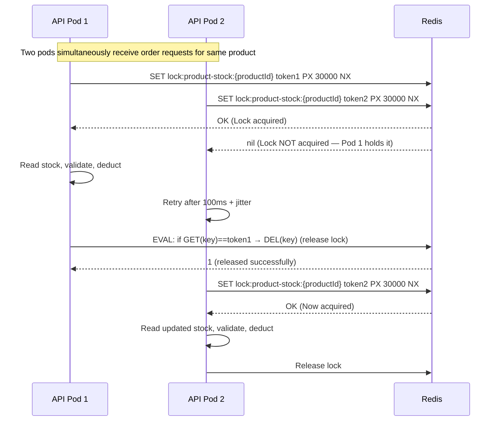
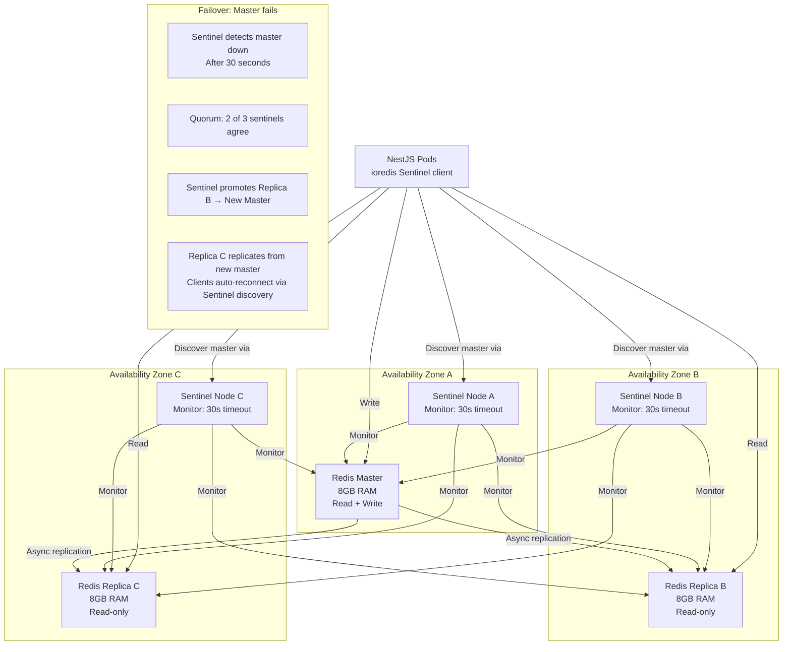

# BACKEND CACHE ARCHITECTURE, REDIS STRATEGY & PERFORMANCE ENGINEERING

**Project Name:** Enterprise SaaS Business Management Platform  
**Document Version:** 1.0.0 — Baseline Standard  
**Date:** July 13, 2026  
**Authors:** Principal Backend Performance Architect, Redis Specialist, Distributed Systems Engineer, Caching Strategy Expert & NestJS Performance Engineer  
**Classification:** Enterprise Internal — Unrestricted  
**Status:** 🏛️ APPROVED CACHE ARCHITECTURE & REDIS PERFORMANCE ENGINEERING SPECIFICATION  

---

## SECTION 1 — CACHE ARCHITECTURE FOUNDATION

### 1.1 Without Cache vs With Cache

```
WITHOUT CACHE — Every request hits the database:
────────────────────────────────────────────────────────────────────────────
1,000 concurrent users viewing the sales dashboard
  → 1,000 × complex SQL aggregation query on PostgreSQL
  → Each query: 250ms average
  → Database CPU: 100% saturated
  → Response time degrades: 250ms → 2,000ms → 5,000ms → timeout
  → New users: "503 Service Unavailable"
────────────────────────────────────────────────────────────────────────────

WITH CACHE — Database called once; Redis serves all others:
────────────────────────────────────────────────────────────────────────────
1,000 concurrent users viewing the sales dashboard
  User 1: Cache MISS → DB query (250ms) → store in Redis (TTL: 60s)
  Users 2–1000: Cache HIT → Redis response (< 1ms)
  → Database query count: 1 per minute (not 1,000 per second)
  → Response time: < 5ms for 99.9% of requests
  → Database CPU: < 10%
  → Result: Application scales to 10,000 users with same DB hardware
────────────────────────────────────────────────────────────────────────────
```

### 1.2 Quantified Cache Benefits

| Metric | Without Cache | With Cache | Improvement |
| :--- | :--- | :--- | :--- |
| **Dashboard p95 latency** | 850 ms | 8 ms | **106×** faster |
| **Database queries/second** | 1,000/s | 5/s | **200×** reduction |
| **Database CPU usage** | 85% | 8% | **90%** reduction |
| **API throughput (RPS)** | 120 RPS | 4,800 RPS | **40×** higher |
| **Infrastructure cost** | 8× DB replicas | 1 Redis + 1 DB | **70%** cost reduction |
| **User-perceived SLA** | 78% < 1s | 99.7% < 50ms | Dramatically improved |

### 1.3 Enterprise Caching Principles

| Principle | Description | Implementation |
| :--- | :--- | :--- |
| **Cache what is expensive** | Only cache data where the cost of regeneration is significant. Don't cache what is trivial to recompute. | Dashboard aggregates, permission sets, product catalogs. |
| **Cache what is stable** | Cache data that doesn't change frequently. Frequently-mutated data has low cache hit rate. | Tenant config (minutes), product catalog (hours), user permissions (minutes). |
| **Always set TTL** | Every cached item must expire. No item lives forever. Prevents stale data accumulating indefinitely. | Enforced in `CacheService.set()` — TTL parameter required. |
| **Design for cache miss** | The application must work correctly when cache is empty. Cache is a performance enhancement, not a dependency. | Fallback to DB on every miss; Redis downtime = degraded performance, not failure. |
| **Tenant isolation** | Cached data from Tenant A must never be served to Tenant B. Keys always include `tenantId`. | `tenant:{tenantId}:...` key prefix on all tenant-scoped cache. |
| **Invalidate proactively** | When data changes, invalidate or update the cache immediately — don't wait for TTL. | Event-driven invalidation via `CacheInvalidationService`. |

---

## SECTION 2 — REDIS ARCHITECTURE

### 2.1 Redis Core Components

```
Redis is a single-threaded in-memory data structure server with optional
persistence. Operations are atomic by default. One Redis command = one
atomic operation. No race conditions on single-key operations.

KEY
  → Unique string identifier for every cached value
  → Max size: 512 MB (practical: < 128 bytes for performance)
  → Binary safe: can contain any characters
  → Namespaced by convention: "tenant:abc:dashboard"

VALUE (Supported data types used in this platform):
  → STRING: Simple key-value (session tokens, rate limit counters)
  → HASH:   Field map (user profile, tenant config — partial update)
  → SET:    Unique collection (active sessions per user)
  → SORTED SET: Priority queue (leaderboard, scheduled jobs)
  → LIST:   Queue/stack (simple job queue, recent activity)
  → STREAM: Append-only log (event sourcing, audit trail)

TTL (Time To Live)
  → Every production key must have TTL
  → EXPIRE key 3600 — key deleted after 3600 seconds
  → Redis removes expired keys lazily (on access) + actively (background)

PERSISTENCE (configured for our Redis):
  → AOF (Append Only File): Every write command logged to disk
  → RDB (Point-in-time snapshot): Periodic full snapshot
  → Both enabled: AOF for durability, RDB for fast restart recovery

MEMORY MANAGEMENT:
  → maxmemory: 8GB per Redis instance (Kubernetes resource limit)
  → maxmemory-policy: allkeys-lru (evict least recently used when full)
  → Active defragmentation: enabled
```

### 2.2 Redis Data Type Usage Map

| Data Type | Redis Command(s) | Platform Usage | TTL Strategy |
| :--- | :--- | :--- | :--- |
| **String** | `GET`, `SET`, `INCR`, `SETEX` | Session tokens, idempotency keys, rate limit counters, OTP codes | Varies: 15m–7d |
| **Hash** | `HGET`, `HSET`, `HMGET`, `HDEL` | User profiles, tenant config, product metadata | 5m–1h |
| **Set** | `SADD`, `SREM`, `SMEMBERS`, `SCARD` | Active sessions per user, device set, online users | 24h |
| **Sorted Set** | `ZADD`, `ZRANGEBYSCORE`, `ZPOPMIN` | Leaderboard, rate limit sliding window timestamps | 1m–1h |
| **List** | `LPUSH`, `RPOP`, `LRANGE` | Recent transactions queue, activity feed | 24h |
| **String (JSON)** | `GET`, `SET` with JSON.stringify | Dashboard snapshots, complex aggregation results, API response cache | 30s–15m |

---

## SECTION 3 — CACHE LAYER ARCHITECTURE

### 3.1 Multi-Layer Cache Architecture



### 3.2 Cache Service Implementation

```typescript
// common/cache/cache.service.ts
@Injectable()
export class CacheService {
  private readonly logger = new Logger(CacheService.name);

  constructor(
    @InjectRedis() private readonly redis: Redis,
    private readonly metrics: CacheMetricsService,
  ) {}

  async get<T>(key: string): Promise<T | null> {
    const start = Date.now();
    try {
      const value = await this.redis.get(key);
      const hit = value !== null;

      this.metrics.recordOperation('GET', hit ? 'HIT' : 'MISS', Date.now() - start);

      if (!hit) {
        this.logger.debug({ message: 'Cache MISS', key });
        return null;
      }

      return JSON.parse(value) as T;
    } catch (error) {
      this.logger.warn({ message: 'Redis GET failed — falling back to DB', key, error: (error as Error).message });
      this.metrics.recordError('GET');
      return null;  // Graceful degradation: treat as MISS
    }
  }

  async set<T>(key: string, value: T, ttlSeconds: number): Promise<void> {
    if (ttlSeconds <= 0) throw new Error('Cache TTL must be positive');
    try {
      await this.redis.setex(key, ttlSeconds, JSON.stringify(value));
      this.metrics.recordOperation('SET', 'OK', 0);
    } catch (error) {
      this.logger.warn({ message: 'Redis SET failed — continuing without cache', key });
      this.metrics.recordError('SET');
      // Do not throw — cache write failure is non-fatal
    }
  }

  async del(key: string): Promise<void> {
    try {
      await this.redis.del(key);
    } catch (error) {
      this.logger.warn({ message: 'Redis DEL failed', key });
    }
  }

  async delByPattern(pattern: string): Promise<number> {
    // Use SCAN not KEYS — never block Redis with KEYS in production
    let cursor = 0;
    let deleted = 0;
    do {
      const [nextCursor, keys] = await this.redis.scan(cursor, 'MATCH', pattern, 'COUNT', 100);
      cursor = parseInt(nextCursor);
      if (keys.length > 0) {
        await this.redis.del(...keys);
        deleted += keys.length;
      }
    } while (cursor !== 0);
    return deleted;
  }

  async getOrSet<T>(
    key: string,
    factory: () => Promise<T>,
    ttlSeconds: number,
  ): Promise<T> {
    const cached = await this.get<T>(key);
    if (cached !== null) return cached;

    const value = await factory();
    await this.set(key, value, ttlSeconds);
    return value;
  }

  async invalidateMany(keys: string[]): Promise<void> {
    if (keys.length === 0) return;
    await this.redis.del(...keys);
  }

  async hget<T>(key: string, field: string): Promise<T | null> {
    const value = await this.redis.hget(key, field);
    return value ? (JSON.parse(value) as T) : null;
  }

  async hset(key: string, field: string, value: unknown, ttlSeconds?: number): Promise<void> {
    await this.redis.hset(key, field, JSON.stringify(value));
    if (ttlSeconds) await this.redis.expire(key, ttlSeconds);
  }
}
```

---

## SECTION 4 — CACHE STRATEGY PATTERNS

### 4.1 Cache Aside (Lazy Loading) — PRIMARY PATTERN

```
Flow:
  1. Application checks cache for data
  2. If HIT → return cached data (fast path)
  3. If MISS → query database → store result in cache → return data

Pros:
  ✅ Only caches data that is actually requested
  ✅ Cache failure is transparent — app falls back to DB
  ✅ Simple to implement; resilient

Cons:
  ❌ Cache miss on first request (cold start penalty)
  ❌ Potential stale data between write and TTL expiry

Our Usage:
  → Dashboard metrics, product catalog, tenant config, user permissions
  → 90% of our caching uses this pattern
```

```typescript
// Cache Aside pattern via getOrSet:
async getTenantConfig(tenantId: string): Promise<TenantConfig> {
  const key = CacheKeys.tenantConfig(tenantId);
  return this.cacheService.getOrSet(
    key,
    () => this.tenantRepo.findConfig(tenantId),   // Factory: called only on MISS
    CacheTTL.TENANT_CONFIG,                        // 10 minutes
  );
}
```

### 4.2 Write Through — FOR CONSISTENCY-SENSITIVE DATA

```
Flow:
  1. Application writes data to cache AND database simultaneously
  2. Every write keeps cache fresh
  3. No stale data after write

Pros:
  ✅ Cache always consistent with database after any write
  ✅ Read latency always low (no cold-start after updates)

Cons:
  ❌ Write latency increases (must write to both)
  ❌ Writes to data that is rarely read waste cache space

Our Usage:
  → User session after login (session stored in Redis + DB simultaneously)
  → Active permission set after role change
```

### 4.3 Write Behind (Write Back) — FOR HIGH-WRITE THROUGHPUT

```
Flow:
  1. Application writes to cache only (fast)
  2. Background job asynchronously syncs cache to database

Pros:
  ✅ Write latency extremely low (cache only)
  ✅ Database protected from write spikes

Cons:
  ❌ Risk of data loss if cache fails before DB sync
  ❌ Complex implementation; difficult to debug

Our Usage:
  → Rate limit counters (Redis-only; DB not needed)
  → Real-time view counters (aggregate and batch-persist)
  → NOT used for financial data (risk unacceptable)
```

### 4.4 Refresh Ahead — FOR PREDICTABLE ACCESS PATTERNS

```
Flow:
  1. Background process proactively refreshes cache before TTL expires
  2. Users always hit warm cache; never experience cold-start

Pros:
  ✅ Zero cache-miss latency for hot data
  ✅ Predictable performance

Cons:
  ❌ Wastes resources if preloaded data is never requested

Our Usage:
  → Daily dashboard summary (pre-computed at midnight, refreshed at business open)
  → Tenant configuration (refreshed every 9 minutes, TTL = 10 minutes)
```

### 4.5 Pattern Comparison

| Pattern | Read | Write | Consistency | Complexity | Our Usage |
| :--- | :--- | :--- | :--- | :--- | :--- |
| **Cache Aside** | MISS → DB → Cache | App writes DB; invalidate cache | Eventually consistent | Low | ✅ Primary |
| **Read Through** | Cache always (DB on miss, auto-fill) | App writes DB only | Eventually consistent | Medium | Partial |
| **Write Through** | Cache always | Both cache + DB together | Strong | Medium | Session, permissions |
| **Write Behind** | Cache first | Cache only; async to DB | Risk of loss | High | Rate limits |
| **Refresh Ahead** | Always cache (pre-warmed) | Background refresh | Strong (if refresh succeeds) | High | Dashboard, config |

---

## SECTION 5 — CACHE DATA DESIGN

### 5.1 Cache Data Inventory

| Cached Data | Key Pattern | Size (est.) | TTL | Invalidation |
| :--- | :--- | :--- | :--- | :--- |
| **User profile** | `tenant:{id}:user:{id}:profile` | 2 KB | 15 min | On user update |
| **User permissions** | `tenant:{id}:user:{id}:permissions` | 5 KB | 10 min | On role/permission change |
| **Active sessions** | `tenant:{id}:user:{id}:sessions` (Set) | 1 KB | 24 h | On logout, force-logout |
| **Tenant configuration** | `tenant:{id}:config` | 10 KB | 10 min | On tenant config change |
| **Tenant plan + limits** | `tenant:{id}:plan` | 1 KB | 30 min | On plan upgrade |
| **Product catalog (page)** | `tenant:{id}:products:page:{n}:{filter-hash}` | 50 KB | 5 min | On product create/update/delete |
| **Single product** | `tenant:{id}:product:{id}` | 5 KB | 10 min | On product update |
| **Dashboard metrics** | `tenant:{id}:dashboard:{branch}:{date}` | 20 KB | 60 s | On order completion |
| **Report result** | `tenant:{id}:report:{hash}` | 500 KB | 15 min | Manual or TTL |
| **Idempotency key** | `idempotent:{key}` | 10 KB | 24 h | After processing |
| **Refresh token** | `session:refresh:{hash}` | 1 KB | 7 days | On logout, rotation |
| **OTP code** | `otp:{userId}:{purpose}` | 100 B | 10 min | After use or expiry |
| **Rate limit counter** | `rate:{endpoint}:{userId}` | 8 B | 1–15 min | Auto-expire |
| **Distributed lock** | `lock:{resource}:{id}` | 100 B | 5–30 s | After release |

### 5.2 TTL Strategy Guidelines

```
VERY SHORT (5–60 seconds):
  → Real-time data that changes frequently
  → Dashboard live metrics (60s)
  → POS active cart (30s)

SHORT (1–15 minutes):
  → Business data that can tolerate slight staleness
  → Dashboard summaries (5m), product details (10m), user profiles (15m)

MEDIUM (15 minutes – 1 hour):
  → Reference data that changes rarely
  → Tenant config (10m), permissions (10m), categories (1h)

LONG (1–24 hours):
  → Stable reference data
  → Exchange rates (1h), app settings (24h)

NEVER CACHED:
  → Financial transaction data (always real-time from DB)
  → Audit logs (immutable; no need to cache)
  → PII without encryption (compliance)
  → Passwords or secrets (never in cache)
```

---

## SECTION 6 — REDIS KEY DESIGN

### 6.1 Key Naming Convention

```
Format:    {namespace}:{tenantId?}:{entity}:{id?}:{qualifier?}

Rules:
  → All lowercase
  → Colon-separated namespace segments
  → Always include tenantId for tenant-scoped data (first segment)
  → Unique enough to prevent accidental collision
  → Short enough to minimize memory overhead (< 128 bytes target)
  → Never include user-submitted data without sanitization
```

### 6.2 Platform Key Registry

```typescript
// common/cache/cache-keys.ts
export const CacheKeys = {
  // User
  userProfile:    (tenantId: string, userId: string) => `tenant:${tenantId}:user:${userId}:profile`,
  userPermissions:(tenantId: string, userId: string) => `tenant:${tenantId}:user:${userId}:permissions`,
  userSessions:   (tenantId: string, userId: string) => `tenant:${tenantId}:user:${userId}:sessions`,
  userOnline:     (tenantId: string) => `tenant:${tenantId}:online_users`,

  // Auth
  refreshToken:   (tokenHash: string) => `session:refresh:${tokenHash}`,
  accessRevoked:  (jti: string) => `session:revoked:${jti}`,
  otp:            (userId: string, purpose: string) => `otp:${userId}:${purpose}`,
  otpAttempts:    (userId: string, purpose: string) => `otp:attempts:${userId}:${purpose}`,

  // Tenant
  tenantConfig:   (tenantId: string) => `tenant:${tenantId}:config`,
  tenantPlan:     (tenantId: string) => `tenant:${tenantId}:plan`,
  tenantBranches: (tenantId: string) => `tenant:${tenantId}:branches`,

  // Products (Inventory)
  product:        (tenantId: string, productId: string) => `tenant:${tenantId}:product:${productId}`,
  productList:    (tenantId: string, pageHash: string) => `tenant:${tenantId}:products:list:${pageHash}`,
  productStock:   (tenantId: string, productId: string) => `tenant:${tenantId}:product:${productId}:stock`,
  categories:     (tenantId: string) => `tenant:${tenantId}:categories`,

  // Orders
  orderDraft:     (tenantId: string, orderId: string) => `tenant:${tenantId}:order:${orderId}:draft`,

  // Dashboard & Analytics
  dashboard:      (tenantId: string, branchId: string, date: string) => `tenant:${tenantId}:dashboard:${branchId}:${date}`,
  topProducts:    (tenantId: string, branchId: string, date: string) => `tenant:${tenantId}:top_products:${branchId}:${date}`,
  report:         (tenantId: string, reportHash: string) => `tenant:${tenantId}:report:${reportHash}`,

  // Rate Limiting
  rateLimit:      (endpoint: string, identifier: string) => `rate:${endpoint}:${identifier}`,
  loginAttempts:  (email: string) => `login:attempts:${email}`,
  otpRateLimit:   (userId: string) => `rate:otp:${userId}`,

  // Distributed Locks
  lock:           (resource: string, resourceId: string) => `lock:${resource}:${resourceId}`,

  // Idempotency
  idempotent:     (key: string) => `idempotent:${key}`,

  // Processed events (Kafka consumer idempotency)
  processedEvent: (groupId: string, eventId: string) => `processed:${groupId}:${eventId}`,
} as const;

// TTL constants (seconds)
export const CacheTTL = {
  USER_PROFILE:      15 * 60,     // 15 minutes
  USER_PERMISSIONS:  10 * 60,     // 10 minutes
  USER_SESSION:      24 * 60 * 60,// 24 hours
  TENANT_CONFIG:     10 * 60,     // 10 minutes
  TENANT_PLAN:       30 * 60,     // 30 minutes
  PRODUCT:           10 * 60,     // 10 minutes
  PRODUCT_LIST:       5 * 60,     //  5 minutes
  CATEGORIES:        60 * 60,     //  1 hour
  DASHBOARD:         60,          // 60 seconds
  REPORT:            15 * 60,     // 15 minutes
  OTP:               10 * 60,     // 10 minutes
  REFRESH_TOKEN:      7 * 24 * 60 * 60,  // 7 days
  IDEMPOTENT:        24 * 60 * 60,// 24 hours
  DISTRIBUTED_LOCK:  30,          // 30 seconds (max lock hold time)
  PROCESSED_EVENT:   7 * 24 * 60 * 60,  // 7 days (Kafka retention match)
} as const;
```

---

## SECTION 7 — SESSION MANAGEMENT

### 7.1 Session Lifecycle Architecture

```mermaid
graph TD
    Login[User Login Request\nPOST /auth/login] --> Validate[Validate credentials\nbcrypt verify]
    Validate -->|Invalid| Fail[401 Unauthorized]
    Validate -->|Valid| IssueTokens[Issue token pair\nAccess token 15min\nRefresh token 7 days]

    IssueTokens --> StoreSession[Store session in Redis\nHash: session data + device info]
    StoreSession --> DeviceSet[Add device to Set\ntenant:{id}:user:{id}:sessions]
    DeviceSet --> RefreshHash[Store hashed refresh token\nsession:refresh:{hash}]

    RefreshHash --> ReturnTokens[Return:\nAccess token: memory only\nRefresh token: HttpOnly cookie]

    subgraph RequestValidation [Every Authenticated Request]
        JWT[Verify JWT signature\n+ extract JTI claim]
        JTICheck[Check: session:revoked:{jti}\nRevoked? → 401]
        SessionCheck[Check: session exists\nActive? Valid device?]
        TenantCheck[Validate tenantId claim\nvs X-Tenant-ID header]
    end

    JWT --> JTICheck --> SessionCheck --> TenantCheck --> Authorized[Request authorized]

    subgraph Logout [Logout / Force Logout]
        SoftLogout[POST /auth/logout\nRevoke this device only]
        ForceLogout[POST /auth/logout-all\nRevoke all devices]

        SoftLogout --> RevokeAccess[session:revoked:{jti}\nTTL = remaining token lifetime]
        SoftLogout --> RemoveDevice[SREM from sessions Set]
        SoftLogout --> DeleteRefresh[DEL session:refresh:{hash}]

        ForceLogout --> GetAllDevices[SMEMBERS user:sessions]
        GetAllDevices --> RevokeAll[Revoke JTI for all devices\nSet all access tokens as revoked]
        RevokeAll --> ClearSet[DEL sessions Set entirely]
    end
```

### 7.2 Multi-Device Session Management

```typescript
// auth/services/session.service.ts
@Injectable()
export class SessionService {
  constructor(private readonly cacheService: CacheService) {}

  async createSession(
    userId: string, tenantId: string,
    deviceInfo: DeviceInfo,
    refreshTokenHash: string,
    jti: string,
  ): Promise<void> {
    const sessionData: SessionRecord = {
      jti, userId, tenantId,
      deviceId:   deviceInfo.deviceId,
      deviceName: deviceInfo.name,
      userAgent:  deviceInfo.userAgent,
      ip:         deviceInfo.ip,
      createdAt:  new Date().toISOString(),
      lastSeenAt: new Date().toISOString(),
    };

    // 1. Store session record (Hash per device)
    const sessionKey = `session:${userId}:${deviceInfo.deviceId}`;
    await this.cacheService.hset(sessionKey, 'data', sessionData, CacheTTL.USER_SESSION);

    // 2. Add device to user's active session set
    const sessionsKey = CacheKeys.userSessions(tenantId, userId);
    await this.cacheService.redis.sadd(sessionsKey, deviceInfo.deviceId);
    await this.cacheService.redis.expire(sessionsKey, CacheTTL.USER_SESSION);

    // 3. Store hashed refresh token → deviceId mapping
    await this.cacheService.set(
      CacheKeys.refreshToken(refreshTokenHash),
      { userId, tenantId, deviceId: deviceInfo.deviceId, jti },
      CacheTTL.REFRESH_TOKEN,
    );
  }

  async listActiveSessions(userId: string, tenantId: string): Promise<SessionRecord[]> {
    const deviceIds = await this.cacheService.redis.smembers(
      CacheKeys.userSessions(tenantId, userId)
    );

    return Promise.all(
      deviceIds.map(deviceId =>
        this.cacheService.hget<SessionRecord>(`session:${userId}:${deviceId}`, 'data')
      )
    ).then(sessions => sessions.filter(Boolean) as SessionRecord[]);
  }

  async terminateSession(userId: string, tenantId: string, deviceId: string, jti: string): Promise<void> {
    // Revoke current access token immediately
    await this.cacheService.set(CacheKeys.accessRevoked(jti), '1', 15 * 60);  // TTL = max access token life

    // Remove device from active sessions set
    await this.cacheService.redis.srem(CacheKeys.userSessions(tenantId, userId), deviceId);

    // Delete session record
    await this.cacheService.redis.del(`session:${userId}:${deviceId}`);
  }

  async terminateAllSessions(userId: string, tenantId: string): Promise<void> {
    const deviceIds = await this.cacheService.redis.smembers(
      CacheKeys.userSessions(tenantId, userId)
    );

    // Revoke all sessions and clean up
    for (const deviceId of deviceIds) {
      const session = await this.cacheService.hget<SessionRecord>(`session:${userId}:${deviceId}`, 'data');
      if (session) {
        await this.cacheService.set(CacheKeys.accessRevoked(session.jti), '1', 15 * 60);
      }
      await this.cacheService.redis.del(`session:${userId}:${deviceId}`);
    }

    await this.cacheService.redis.del(CacheKeys.userSessions(tenantId, userId));
  }
}
```

---

## SECTION 8 — API RESPONSE CACHE

### 8.1 HTTP Cache Interceptor

```typescript
// common/interceptors/cache-response.interceptor.ts
@Injectable()
export class CacheResponseInterceptor implements NestInterceptor {
  constructor(private readonly cacheService: CacheService) {}

  intercept(context: ExecutionContext, next: CallHandler): Observable<unknown> {
    const request = context.switchToHttp().getRequest<Request>();
    const handler = context.getHandler();

    // Only cache GET requests
    if (request.method !== 'GET') return next.handle();

    // Check if route has @Cacheable decorator
    const cacheConfig = Reflect.getMetadata(CACHE_KEY_METADATA, handler) as CacheConfig | undefined;
    if (!cacheConfig) return next.handle();

    const tenantId = request['user']?.tenantId;
    const cacheKey = cacheConfig.keyFn
      ? cacheConfig.keyFn(request, tenantId)
      : `${tenantId}:${request.url}`;

    return new Observable(subscriber => {
      this.cacheService.get<unknown>(cacheKey).then(cached => {
        if (cached !== null) {
          // Set cache hit header for observability
          context.switchToHttp().getResponse().setHeader('X-Cache', 'HIT');
          subscriber.next(cached);
          subscriber.complete();
          return;
        }

        context.switchToHttp().getResponse().setHeader('X-Cache', 'MISS');

        next.handle()
          .pipe(
            tap(async response => {
              await this.cacheService.set(cacheKey, response, cacheConfig.ttl);
            }),
          )
          .subscribe(subscriber);
      });
    });
  }
}

// Usage decorator:
export function Cacheable(config: CacheConfig): MethodDecorator {
  return (target, propertyKey, descriptor) => {
    Reflect.defineMetadata(CACHE_KEY_METADATA, config, descriptor.value as Function);
    return descriptor;
  };
}

// On controller:
@Get()
@Cacheable({
  keyFn: (req, tenantId) => `${CacheKeys.productList(tenantId, md5(req.url))}`,
  ttl: CacheTTL.PRODUCT_LIST,
})
async getProducts(@Query() query: ProductQueryDto, @TenantId() tenantId: string) {
  return this.productService.findAll(tenantId, query);
}
```

### 8.2 Dashboard Cache Strategy

```typescript
// modules/analytics/services/dashboard-cache.service.ts
@Injectable()
export class DashboardCacheService {
  constructor(private readonly cacheService: CacheService) {}

  async getDashboardMetrics(
    tenantId: string, branchId: string, date: string,
    factory: () => Promise<DashboardMetrics>,
  ): Promise<DashboardMetrics> {
    const key = CacheKeys.dashboard(tenantId, branchId, date);

    // Short TTL (60s) — real-time feel while protecting DB
    return this.cacheService.getOrSet(key, factory, CacheTTL.DASHBOARD);
  }

  async invalidateDashboard(tenantId: string, branchId: string, date: string): Promise<void> {
    await this.cacheService.del(CacheKeys.dashboard(tenantId, branchId, date));
    await this.cacheService.del(CacheKeys.topProducts(tenantId, branchId, date));
  }

  async warmDashboard(tenantId: string, branchId: string, date: string): Promise<void> {
    // Proactively compute and cache at business day start (Refresh Ahead)
    const metrics = await this.analyticsService.computeDashboardMetrics(tenantId, branchId, date);
    await this.cacheService.set(CacheKeys.dashboard(tenantId, branchId, date), metrics, CacheTTL.DASHBOARD);
  }
}
```

---

## SECTION 9 — DATABASE CACHE OPTIMIZATION

### 9.1 Query Cache Pattern

```typescript
// Expensive aggregation cached to protect PostgreSQL:
async getSalesReport(tenantId: string, branchId: string, dateFrom: string, dateTo: string): Promise<SalesReport> {
  // Deterministic cache key based on all query parameters
  const queryHash = md5(`${tenantId}:${branchId}:${dateFrom}:${dateTo}`);
  const key = CacheKeys.report(tenantId, queryHash);

  return this.cacheService.getOrSet(key, async () => {
    // Heavy query on read replica — only called on cache miss
    const rows = await this.prisma.$queryRaw<SalesRow[]>`
      SELECT
        DATE_TRUNC('day', completed_at) AS day,
        SUM(total_amount)               AS revenue,
        COUNT(*)::int                   AS order_count,
        COUNT(DISTINCT customer_id)::int AS unique_customers,
        AVG(total_amount)               AS avg_order_value
      FROM pos.orders
      WHERE tenant_id = ${tenantId}::uuid
        AND branch_id = ${branchId}::uuid
        AND completed_at BETWEEN ${dateFrom}::timestamptz AND ${dateTo}::timestamptz
        AND status = 'COMPLETED'
      GROUP BY DATE_TRUNC('day', completed_at)
      ORDER BY day DESC
    `;
    return SalesReportMapper.fromRows(rows);
  }, CacheTTL.REPORT);
}
```

### 9.2 Permission Caching

```typescript
// Permissions computed once per user login period:
async getUserPermissions(tenantId: string, userId: string): Promise<string[]> {
  const key = CacheKeys.userPermissions(tenantId, userId);

  return this.cacheService.getOrSet(key, async () => {
    const user = await this.prisma.user.findUnique({
      where: { id: userId },
      include: {
        role: { include: { permissions: true } },
        customPermissions: true,
      },
    });

    const rolePermissions = user?.role?.permissions.map(p => p.code) ?? [];
    const customPermissions = user?.customPermissions.map(p => p.code) ?? [];
    return [...new Set([...rolePermissions, ...customPermissions])];
  }, CacheTTL.USER_PERMISSIONS);
}
```

---

## SECTION 10 — DISTRIBUTED LOCK

### 10.1 Why Distributed Locks Are Needed

```
Problem: Multiple concurrent requests updating the same resource

Example — Order Number Generation (without lock):
  Pod 1: SELECT MAX(order_number) FROM orders = 1000
  Pod 2: SELECT MAX(order_number) FROM orders = 1000    ← Same value!
  Pod 1: INSERT order (order_number = 1001)
  Pod 2: INSERT order (order_number = 1001)              ← DUPLICATE!

Example — Inventory Deduction (without lock):
  Request A: Read stock for product X = 5 units
  Request B: Read stock for product X = 5 units    ← Same!
  Request A: Write stock = 5 - 3 = 2
  Request B: Write stock = 5 - 4 = 1               ← Should be -2! Stock goes negative!

Solution: Redis distributed lock (Redlock pattern simplified)
```

### 10.2 Distributed Lock Implementation

```typescript
// common/redis/distributed-lock.service.ts
@Injectable()
export class DistributedLockService {
  private readonly logger = new Logger(DistributedLockService.name);

  constructor(@InjectRedis() private readonly redis: Redis) {}

  /**
   * Acquire a distributed lock using SET NX PX (atomic).
   * Returns a lock token if acquired; null if lock is already held.
   */
  async acquire(
    resource: string,
    resourceId: string,
    ttlMs: number = 30_000,
  ): Promise<string | null> {
    const key = CacheKeys.lock(resource, resourceId);
    const token = generateId();  // Unique token: only holder can release

    // SET key token PX ttlMs NX — atomic: set only if not exists
    const result = await this.redis.set(key, token, 'PX', ttlMs, 'NX');

    if (result === 'OK') {
      this.logger.debug({ message: `Lock acquired: ${key}`, ttlMs });
      return token;
    }

    this.logger.debug({ message: `Lock NOT acquired (already held): ${key}` });
    return null;
  }

  /**
   * Release lock — only if the caller holds the token.
   * Uses Lua script for atomic check-and-delete.
   */
  async release(resource: string, resourceId: string, token: string): Promise<boolean> {
    const key = CacheKeys.lock(resource, resourceId);

    // Lua script: compare token before deleting (prevents releasing another holder's lock)
    const luaScript = `
      if redis.call("GET", KEYS[1]) == ARGV[1] then
        return redis.call("DEL", KEYS[1])
      else
        return 0
      end
    `;

    const result = await this.redis.eval(luaScript, 1, key, token) as number;

    if (result === 1) {
      this.logger.debug({ message: `Lock released: ${key}` });
      return true;
    }

    this.logger.warn({ message: `Lock release failed: token mismatch or already expired: ${key}` });
    return false;
  }

  /**
   * Execute a function within a lock. Automatically acquires and releases.
   * Throws if lock cannot be acquired after maxRetries.
   */
  async withLock<T>(
    resource: string,
    resourceId: string,
    fn: () => Promise<T>,
    options: { ttlMs?: number; maxRetries?: number; retryDelayMs?: number } = {},
  ): Promise<T> {
    const { ttlMs = 30_000, maxRetries = 10, retryDelayMs = 100 } = options;

    for (let attempt = 0; attempt < maxRetries; attempt++) {
      const token = await this.acquire(resource, resourceId, ttlMs);

      if (token) {
        try {
          return await fn();
        } finally {
          await this.release(resource, resourceId, token);
        }
      }

      // Lock held by another process — wait and retry
      await delay(retryDelayMs + Math.random() * 50);  // Jitter prevents thundering herd
    }

    throw new DomainException('LOCK_ACQUISITION_TIMEOUT',
      `Could not acquire lock on ${resource}:${resourceId} after ${maxRetries} attempts`
    );
  }
}

// Usage examples:
// 1. Inventory deduction (prevent stock from going negative concurrently)
await this.lockService.withLock('product-stock', productId, async () => {
  const product = await this.productRepo.findById(productId);
  if (product.stock < quantity) throw new InsufficientStockException(...);
  await this.productRepo.deductStock(productId, quantity);
});

// 2. Order number generation (sequential, no gaps)
await this.lockService.withLock('order-number', tenantId, async () => {
  const nextNumber = await this.orderRepo.getNextOrderNumber(tenantId);
  return nextNumber;
});

// 3. Single payment intent per order (prevent double-charge)
await this.lockService.withLock('payment-intent', orderId, async () => {
  const existing = await this.paymentRepo.findPendingByOrderId(orderId);
  if (existing) return existing;
  return this.stripeAdapter.createPaymentIntent(amount, orderId);
});
```

---

## SECTION 11 — RATE LIMITING ARCHITECTURE

### 11.1 Rate Limiting Strategy

```mermaid
graph TD
    Request[Incoming Request] --> RateLimiter[Rate Limiter\nNestJS ThrottlerGuard + Redis]

    RateLimiter --> GetKey[Build rate limit key\nrate:{endpoint}:{identifier}]
    GetKey --> IncrCounter[INCR + EXPIRE atomic\nvia Lua script]

    IncrCounter --> CheckLimit{Count > limit?}
    CheckLimit -->|Under limit| Proceed[Proceed to next guard]
    CheckLimit -->|Over limit| Reject[429 Too Many Requests\nRetry-After header set]

    subgraph Limits [Rate Limit Tiers]
        AuthLogin[Login: 5/15min per email]
        AuthOTP[OTP Request: 3/10min per user]
        AuthRefresh[Token Refresh: 10/min per user]
        APIRead[API Read: 300/min per user]
        APIWrite[API Write: 60/min per user]
        WebSocket[WebSocket: 100 events/min per connection]
    end

    Proceed --> Controller2[Controller → Service → Response]
```

### 11.2 Sliding Window Rate Limiter

```typescript
// common/rate-limit/sliding-window-limiter.service.ts
@Injectable()
export class SlidingWindowRateLimiter {
  constructor(@InjectRedis() private readonly redis: Redis) {}

  /**
   * Sliding window log algorithm using Redis Sorted Set.
   * More accurate than fixed window (no burst at window boundaries).
   */
  async check(
    key: string,
    limit: number,
    windowSeconds: number,
  ): Promise<RateLimitResult> {
    const now = Date.now();
    const windowStart = now - windowSeconds * 1000;
    const fullKey = `rate:${key}`;

    // Lua script: atomic sliding window check
    const luaScript = `
      local key = KEYS[1]
      local now = tonumber(ARGV[1])
      local window_start = tonumber(ARGV[2])
      local limit = tonumber(ARGV[3])
      local ttl = tonumber(ARGV[4])

      -- Remove expired entries from sorted set
      redis.call("ZREMRANGEBYSCORE", key, 0, window_start)

      -- Count current requests in window
      local count = redis.call("ZCARD", key)

      if count < limit then
        -- Add current request
        redis.call("ZADD", key, now, now .. "-" .. math.random(1000000))
        redis.call("EXPIRE", key, ttl)
        return {0, count + 1, limit}  -- {over_limit, current_count, limit}
      else
        return {1, count, limit}      -- {over_limit, current_count, limit}
      end
    `;

    const [overLimit, count, _limit] = await this.redis.eval(
      luaScript, 1, fullKey,
      String(now), String(windowStart), String(limit), String(windowSeconds + 5)
    ) as [number, number, number];

    return {
      allowed: overLimit === 0,
      currentCount: count,
      limit,
      windowSeconds,
      retryAfterSeconds: overLimit === 1 ? windowSeconds : 0,
    };
  }
}
```

### 11.3 Rate Limit Configuration

```typescript
// common/rate-limit/rate-limit.config.ts
export const RATE_LIMITS = {
  // Auth endpoints (by email address to prevent credential stuffing)
  LOGIN:          { limit: 5,   windowSeconds: 15 * 60,  keyFn: (email: string) => `login:${email}` },
  OTP_REQUEST:    { limit: 3,   windowSeconds: 10 * 60,  keyFn: (userId: string) => `otp:${userId}` },
  REGISTER:       { limit: 3,   windowSeconds: 60 * 60,  keyFn: (ip: string) => `register:${ip}` },
  TOKEN_REFRESH:  { limit: 10,  windowSeconds: 60,        keyFn: (userId: string) => `refresh:${userId}` },
  PASSWORD_RESET: { limit: 3,   windowSeconds: 30 * 60,  keyFn: (email: string) => `pwreset:${email}` },

  // API endpoints (by userId)
  API_READ:       { limit: 300, windowSeconds: 60,        keyFn: (userId: string) => `api_read:${userId}` },
  API_WRITE:      { limit: 60,  windowSeconds: 60,        keyFn: (userId: string) => `api_write:${userId}` },
  API_EXPORT:     { limit: 5,   windowSeconds: 60 * 60,  keyFn: (userId: string) => `export:${userId}` },

  // WebSocket events
  WS_EVENTS:      { limit: 100, windowSeconds: 60,        keyFn: (connId: string) => `ws:${connId}` },
} as const;
```

---

## SECTION 12 — REDIS PUB/SUB

### 12.1 Redis Pub/Sub Architecture



### 12.2 Redis Pub/Sub for WebSocket Scaling

```
Problem: Multiple WebSocket Gateway pods
  Pod 1: Client A connected (branchId = "branch-1")
  Pod 2: Client B connected (branchId = "branch-1")
  
  When order completes on Pod 3 (API):
    If we broadcast only to Pod 3's in-memory rooms:
      Client A sees update ✅ (happens to be on Pod 3)
      Client B does NOT see update ❌ (on Pod 2, different process)

Solution: Redis Pub/Sub adapter for Socket.IO
  → socket.io-redis adapter (or socket.io-redis-adapter for v4)
  → All pods subscribe to same Redis channel
  → Broadcast from any pod reaches all clients across all pods
```

```typescript
// main.ts — Socket.IO Redis adapter configuration
import { createAdapter } from '@socket.io/redis-adapter';
import { createClient } from 'redis';

async function bootstrap() {
  const app = await NestFactory.create(AppModule);

  const pubClient = createClient({ url: process.env.REDIS_URL });
  const subClient = pubClient.duplicate();

  await Promise.all([pubClient.connect(), subClient.connect()]);

  const io = app.get(IoAdapter).server;
  io.adapter(createAdapter(pubClient, subClient));

  await app.listen(3001);
}
```

### 12.3 Redis Pub/Sub Event Channels

| Channel | Publisher | Subscribers | Message |
| :--- | :--- | :--- | :--- |
| `ws:order:completed:{tenantId}` | OrderService | All WS Gateway pods | Order summary |
| `ws:stock:alert:{tenantId}` | InventoryService | All WS Gateway pods | Stock alert |
| `ws:notification:{userId}` | NotifService | All WS Gateway pods | Notification |
| `cache:invalidate:tenant:{tenantId}` | CacheInvalidator | All API pods | Invalidation signal |

---

## SECTION 13 — CACHE INVALIDATION STRATEGY

### 13.1 Cache Invalidation Decision Matrix

| Event | Keys to Invalidate | Strategy | Timing |
| :--- | :--- | :--- | :--- |
| **Product updated** | `product:{id}`, `productList:*` (pattern) | Delete + wait for lazy reload | Immediate |
| **Product stock changed** | `product:{id}:stock`, `dashboard:*` | Delete immediately | Immediate |
| **Order completed** | `dashboard:{branchId}:{date}`, `topProducts:{branchId}:{date}` | Delete | Immediate |
| **User role changed** | `user:{id}:permissions`, `user:{id}:profile` | Delete (force re-auth on next request) | Immediate |
| **Tenant config changed** | `tenant:{id}:config`, `tenant:{id}:plan` | Delete | Immediate |
| **Product category changed** | `categories:{tenantId}`, `productList:*` | Delete | Immediate |

### 13.2 Cache Invalidation Service

```typescript
// common/cache/cache-invalidation.service.ts
@Injectable()
export class CacheInvalidationService {
  constructor(private readonly cacheService: CacheService) {}

  async onProductUpdated(tenantId: string, productId: string): Promise<void> {
    await this.cacheService.invalidateMany([
      CacheKeys.product(tenantId, productId),
    ]);
    // Pattern-based for product list pages (any filter combo that included this product)
    await this.cacheService.delByPattern(`tenant:${tenantId}:products:list:*`);
  }

  async onOrderCompleted(tenantId: string, branchId: string): Promise<void> {
    const date = new Date().toISOString().split('T')[0];
    await this.cacheService.invalidateMany([
      CacheKeys.dashboard(tenantId, branchId, date),
      CacheKeys.topProducts(tenantId, branchId, date),
    ]);
  }

  async onUserPermissionsChanged(tenantId: string, userId: string): Promise<void> {
    await this.cacheService.invalidateMany([
      CacheKeys.userPermissions(tenantId, userId),
      CacheKeys.userProfile(tenantId, userId),
    ]);
  }

  async onTenantConfigChanged(tenantId: string): Promise<void> {
    await this.cacheService.invalidateMany([
      CacheKeys.tenantConfig(tenantId),
      CacheKeys.tenantPlan(tenantId),
      CacheKeys.tenantBranches(tenantId),
    ]);
    // Also invalidate all user permission caches for this tenant (config may affect access)
    await this.cacheService.delByPattern(`tenant:${tenantId}:user:*:permissions`);
  }
}
```

---

## SECTION 14 — CACHE FAILURE HANDLING

### 14.1 Graceful Degradation Architecture



### 14.2 Circuit Breaker Pattern

```typescript
// common/redis/redis-circuit-breaker.service.ts
@Injectable()
export class RedisCircuitBreakerService {
  private failureCount = 0;
  private state: 'CLOSED' | 'OPEN' | 'HALF_OPEN' = 'CLOSED';
  private lastFailureTime = 0;
  private readonly threshold = 5;             // Open after 5 consecutive failures
  private readonly recoveryWindowMs = 30_000; // 30s before attempting recovery

  async execute<T>(fn: () => Promise<T>, fallback: () => T): Promise<T> {
    if (this.state === 'OPEN') {
      if (Date.now() - this.lastFailureTime > this.recoveryWindowMs) {
        this.state = 'HALF_OPEN';
      } else {
        return fallback();  // Circuit is open — bypass Redis entirely
      }
    }

    try {
      const result = await fn();
      this.onSuccess();
      return result;
    } catch (error) {
      this.onFailure();
      return fallback();
    }
  }

  private onSuccess(): void {
    this.failureCount = 0;
    this.state = 'CLOSED';
  }

  private onFailure(): void {
    this.failureCount++;
    this.lastFailureTime = Date.now();
    if (this.failureCount >= this.threshold) {
      this.state = 'OPEN';
      this.logger.error('Redis circuit breaker OPENED — falling back to database for all cache operations');
    }
  }
}
```

---

## SECTION 15 — HIGH AVAILABILITY REDIS

### 15.1 Redis HA Architecture



### 15.2 Production Redis Configuration

```typescript
// common/redis/redis.module.ts
@Module({
  imports: [
    RedisModule.forRootAsync({
      useFactory: (config: ConfigService) => ({
        type: 'sentinel',
        sentinels: config.getOrThrow<string>('REDIS_SENTINELS')
          .split(',')
          .map(s => ({ host: s.split(':')[0], port: parseInt(s.split(':')[1]) })),
        name: 'saas-redis-primary',          // Sentinel master name
        password: config.getOrThrow('REDIS_PASSWORD'),
        db: 0,
        retryStrategy: (times: number) => Math.min(times * 100, 3000),
        reconnectOnError: (err: Error) => {
          const targetError = 'READONLY';
          if (err.message.includes(targetError)) return 1;  // Re-connect on READONLY error
          return false;
        },
        enableReadyCheck: true,
        maxRetriesPerRequest: 3,
        connectTimeout: 10000,
        commandTimeout: 5000,
        // TLS for encryption in transit
        tls: config.get('REDIS_TLS') === 'true' ? {
          rejectUnauthorized: true,
          ca: readFileSync(config.getOrThrow('REDIS_TLS_CA')),
        } : undefined,
      }),
      inject: [ConfigService],
    }),
  ],
})
export class RedisModule {}
```

### 15.3 HA Failover Parameters

| Parameter | Value | Reason |
| :--- | :--- | :--- |
| **Sentinel quorum** | 2 of 3 | Majority required — prevents split-brain |
| **down-after-milliseconds** | 30,000 ms | Primary declared down after 30s no response |
| **failover-timeout** | 180,000 ms | 3 min max for entire failover process |
| **parallel-syncs** | 1 | Only 1 replica syncs at a time post-failover |
| **Replication lag alert** | > 10 s | Alert if replica falls behind by 10+ seconds |
| **RTO (Recovery Time)** | < 60 seconds | Target: clients reconnected within 60s |
| **RPO (Data Loss)** | < 1 s | Async replication lag; < 1s data loss |

---

## SECTION 16 — BACKEND PERFORMANCE OPTIMIZATION

### 16.1 API Response Optimization

```typescript
// Performance techniques applied to all API responses:

// 1. Redis pipeline: batch multiple GET operations into single round-trip
async getUserContext(tenantId: string, userId: string): Promise<UserContext> {
  const pipeline = this.redis.pipeline();
  pipeline.get(CacheKeys.userProfile(tenantId, userId));
  pipeline.get(CacheKeys.userPermissions(tenantId, userId));
  pipeline.get(CacheKeys.tenantConfig(tenantId));
  const [[profileErr, profile], [permErr, perms], [configErr, config]] = await pipeline.exec() ?? [];

  // Only query DB for fields that missed cache
  const [finalProfile, finalPerms, finalConfig] = await Promise.all([
    profile ? JSON.parse(profile as string) : this.fetchAndCacheProfile(tenantId, userId),
    perms   ? JSON.parse(perms as string)   : this.fetchAndCachePermissions(tenantId, userId),
    config  ? JSON.parse(config as string)  : this.fetchAndCacheConfig(tenantId),
  ]);

  return { profile: finalProfile, permissions: finalPerms, config: finalConfig };
}

// 2. Compression: large cache values compressed before storage
async setCompressed<T>(key: string, value: T, ttl: number): Promise<void> {
  const json = JSON.stringify(value);
  if (json.length > 10_240) {  // Compress values > 10KB
    const compressed = await gzip(Buffer.from(json));
    await this.redis.setex(`${key}:gz`, ttl, compressed);
  } else {
    await this.redis.setex(key, ttl, json);
  }
}

// 3. Selective field caching (HASH partial updates)
async updateUserProfileField(tenantId: string, userId: string, field: string, value: unknown): Promise<void> {
  const key = CacheKeys.userProfile(tenantId, userId);
  // Update only the changed field in Redis Hash — don't invalidate entire profile
  await this.redis.hset(key, field, JSON.stringify(value));
  // No TTL reset needed: hash-level field update preserves TTL
}
```

### 16.2 N+1 Query Prevention with Cache

```typescript
// Common N+1: fetching category for each product individually
// BAD (N+1 without cache):
//   for each product: SELECT * FROM categories WHERE id = product.categoryId  → N queries

// GOOD: batch load and cache categories
async resolveProductCategories(tenantId: string, categoryIds: string[]): Promise<Map<string, Category>> {
  const categoriesMap = new Map<string, Category>();
  const missedIds: string[] = [];

  // Check cache for each category
  const pipeline = this.redis.pipeline();
  for (const id of categoryIds) {
    pipeline.get(`tenant:${tenantId}:category:${id}`);
  }
  const results = await pipeline.exec() ?? [];

  results.forEach(([, value], index) => {
    if (value) {
      categoriesMap.set(categoryIds[index], JSON.parse(value as string));
    } else {
      missedIds.push(categoryIds[index]);
    }
  });

  if (missedIds.length > 0) {
    // Single DB query for all misses
    const categories = await this.prisma.category.findMany({
      where: { id: { in: missedIds }, tenantId },
    });

    // Populate map and warm cache
    const setPipeline = this.redis.pipeline();
    for (const cat of categories) {
      categoriesMap.set(cat.id, cat);
      setPipeline.setex(`tenant:${tenantId}:category:${cat.id}`, CacheTTL.CATEGORIES, JSON.stringify(cat));
    }
    await setPipeline.exec();
  }

  return categoriesMap;
}
```

---

## SECTION 17 — CACHE SECURITY

### 17.1 Redis Security Architecture

```
AUTHENTICATION:
  → requirepass: strong 32+ character random password
  → ACL (Access Control List): per-application user
    - API service user: GET, SET, DEL, EXPIRE, SCAN, MULTI, EXEC, EVAL, SUBSCRIBE
    - Read-only replica user: GET, SUBSCRIBE (no write operations)
    - BullMQ user: Full access to queue namespace only (bull:*)
    - Monitoring user: INFO, MONITOR (no data access)

NETWORK ISOLATION:
  → Redis not exposed to public internet
  → Kubernetes NetworkPolicy: only NestJS pods can connect to Redis port 6379
  → Redis deployed in private subnet (no public IP)
  → External access only via kubectl port-forward for debugging (MFA required)

ENCRYPTION:
  → TLS 1.2+ for all Redis connections (in-transit encryption)
  → AES-256-GCM for PII fields before storing in Redis (at-rest encryption at application layer)
  → AWS ElastiCache at-rest encryption enabled (disk-level)
  → Sensitive keys (refresh tokens) stored as hashed values only

ACCESS CONTROL:
  → Principle of least privilege: each service has its own Redis ACL user
  → BullMQ isolated to key prefix: bull:*
  → Pub/Sub channels namespaced by tenant
  → No direct Redis access for frontend applications
```

### 17.2 Data Classification in Cache

| Data Type | Stored in Cache | Encryption Required | Notes |
| :--- | :--- | :--- | :--- |
| **Access tokens** | ❌ Never | — | Memory-only in client |
| **Refresh token hash** | ✅ Yes | ✅ Yes (bcrypt hash of token) | Never store plain token |
| **OTP code** | ✅ Yes | ✅ Yes (hash of OTP) | Immediate delete after use |
| **User profile** | ✅ Yes | Partial (email encrypted) | PII fields AES-encrypted |
| **Permissions list** | ✅ Yes | ❌ No | Non-sensitive metadata |
| **Tenant config** | ✅ Yes | ❌ No | Non-sensitive |
| **Dashboard metrics** | ✅ Yes | ❌ No | Aggregated; non-personal |
| **Financial amounts** | ✅ Aggregates only | ❌ No | No individual transactions cached |
| **Passwords** | ❌ Never | — | Never cache passwords |

---

## SECTION 18 — CACHE MONITORING

### 18.1 Redis Monitoring Architecture



### 18.2 Key Redis Metrics

| Metric | Warning | Critical | Action |
| :--- | :--- | :--- | :--- |
| **Cache hit rate** | < 85% | < 70% | Review TTL values; warm critical keys |
| **Memory usage** | > 70% | > 85% | Increase memory limit; review key expiry |
| **Eviction rate** | > 100/s | > 1000/s | Memory too low; increase or reduce TTL |
| **Connected clients** | > 500 | > 800 | Connection pooling review |
| **Blocked clients** | > 10 | > 50 | Slow Lua scripts or deadlocks |
| **Replication lag** | > 1 s | > 10 s | Network issue; replica catch-up needed |
| **Command latency (p99)** | > 5 ms | > 20 ms | Slow commands; check SLOWLOG |
| **Key expiry rate** | — | — | Monitor for sudden drops (TTL misconfiguration) |

### 18.3 Custom Application Metrics

```typescript
// common/metrics/cache-metrics.service.ts
@Injectable()
export class CacheMetricsService {
  private readonly hitCounter:   Counter<string>;
  private readonly missCounter:  Counter<string>;
  private readonly errorCounter: Counter<string>;
  private readonly latencyHist:  Histogram<string>;

  constructor() {
    this.hitCounter   = new Counter({ name: 'cache_hits_total',   labelNames: ['operation'], help: 'Total cache hits' });
    this.missCounter  = new Counter({ name: 'cache_misses_total', labelNames: ['operation'], help: 'Total cache misses' });
    this.errorCounter = new Counter({ name: 'cache_errors_total', labelNames: ['operation'], help: 'Total cache errors' });
    this.latencyHist  = new Histogram({ name: 'cache_operation_duration_ms', labelNames: ['operation', 'result'], buckets: [0.5, 1, 2, 5, 10, 25, 50, 100, 250] });
  }

  recordOperation(op: string, result: 'HIT' | 'MISS' | 'OK', durationMs: number): void {
    if (result === 'HIT') this.hitCounter.inc({ operation: op });
    else if (result === 'MISS') this.missCounter.inc({ operation: op });
    this.latencyHist.observe({ operation: op, result }, durationMs);
  }

  recordError(op: string): void {
    this.errorCounter.inc({ operation: op });
  }
}
```

---

## SECTION 19 — REDIS TOOL STACK

### 19.1 Complete Redis Technology Stack

| Category | Tool | Version | Purpose |
| :--- | :--- | :--- | :--- |
| **Redis Server** | Redis | 7.2+ | Core in-memory data store; primary data structure engine. |
| **Redis HA** | Redis Sentinel | 7.2+ | Automatic failover; primary election; health monitoring. |
| **Redis Cluster** | Redis Cluster (Phase 2) | 7.2+ | Horizontal sharding across multiple nodes (> 64GB data). |
| **Client Library** | ioredis | 5+ | TypeScript Redis client; Sentinel support; pipeline; Lua eval; connection pooling. |
| **NestJS Integration** | `@nestjs-modules/ioredis` | — | NestJS DI-compatible Redis module; `@InjectRedis()` decorator. |
| **Job Queue** | BullMQ | 5+ | Priority job queues backed by Redis; retry; scheduling; progress tracking. |
| **Queue Dashboard** | Bull Board (`@bull-board/api`) | — | Web UI for monitoring BullMQ queues (jobs, workers, failures). |
| **Cache UI** | RedisInsight | 2+ | Visual Redis browser; key inspection; memory profiling; Lua debugger. |
| **Monitoring Exporter** | redis_exporter (Oliver006) | 1.6+ | Exports Redis metrics in Prometheus format; all 200+ Redis INFO metrics. |
| **Metrics Storage** | Prometheus | 2.5+ | Scrapes and stores Redis + app metrics; alert evaluation. |
| **Dashboards** | Grafana | 10+ | Redis Sentinel dashboard; cache hit rate; performance trends. |
| **Alerting** | AlertManager | 0.26+ | Routes Prometheus alerts to Slack, PagerDuty. |
| **Kubernetes** | Redis Helm Chart | — | Deploy Redis Sentinel cluster on Kubernetes with persistent volumes. |
| **Secrets** | AWS Secrets Manager | — | Redis password and TLS certificates; rotated automatically. |

---

## SECTION 20 — FINAL CACHE ARCHITECTURE DIAGRAMS

### 20.1 Redis Cache Architecture



### 20.2 Cache Aside Flow



### 20.3 Session Management Flow



### 20.4 Distributed Lock Flow



### 20.5 High Availability Redis Architecture



---

## APPENDIX A — CACHE QUICK REFERENCE

```
Redis Version:       7.2+ (Redis Sentinel for HA)
Client:              ioredis 5+ with Sentinel connection
Memory Policy:       allkeys-lru (8GB per instance)
Persistence:         AOF + RDB both enabled
TLS:                 Enabled (in-transit); AWS at-rest encryption
Authentication:      ACL per application user; no default user
Key Format:          {namespace}:{tenantId?}:{entity}:{id?}
Primary Pattern:     Cache Aside (lazy loading) via getOrSet()
Fallback:            Cache miss → PostgreSQL; Redis down → PostgreSQL (graceful)
Lock TTL:            30 seconds max hold time; Lua atomic release
Rate Limit:          Sliding window via Sorted Set + Lua; 5 configured tiers
Session Storage:     Hash per device; Set for device list; SADD/SREM
Pub/Sub:             Socket.IO Redis adapter for multi-pod WebSocket
Monitoring:          redis_exporter → Prometheus → Grafana; 8 alert rules
```

## APPENDIX B — REDIS MEMORY ESTIMATION

```
Per 1,000 active tenants (100 users each):

Sessions:
  100,000 session hashes × 2KB each = 200 MB

Permissions:
  100,000 user permission sets × 5KB each = 500 MB

Product catalog (100 products per tenant):
  1,000 tenants × 20 cached pages × 50KB = 1,000 MB = 1 GB

Dashboard (3 branches per tenant × 60s TTL):
  3,000 dashboard keys × 20KB = 60 MB

Rate limit counters (Sorted Sets):
  ~500,000 active counters × 200B each = 100 MB

Miscellaneous (idempotency, locks, OTP):
  ~200 MB

Total estimated: ~2 GB for 1,000 active tenants
Redis capacity (8GB): supports ~4,000 active tenants per node
Scale-out: Add Redis Cluster sharding at > 4,000 active tenants
```

---

*End of Backend Cache Architecture, Redis Strategy & Performance Engineering*  
*Document maintained by: Principal Backend Performance Architect & Redis Specialist | Status: Approved Cache Architecture & Redis Performance Engineering Specification*
