# CLOUD INFRASTRUCTURE FOUNDATION & PRODUCTION ARCHITECTURE STRATEGY

**Project Name:** Enterprise SaaS Business Management Platform  
**Document Version:** 1.0.0 — Baseline Standard  
**Date:** July 13, 2026  
**Authors:** Principal Cloud Architect, DevOps Architect, Infrastructure Engineer, Kubernetes Specialist, Site Reliability Engineer & Enterprise SaaS Platform Architect  
**Classification:** Enterprise Internal — Restricted (Infrastructure Sensitive)  
**Status:** 🏛️ APPROVED CLOUD INFRASTRUCTURE FOUNDATION & PRODUCTION ARCHITECTURE SPECIFICATION  

---

## SECTION 1 — CLOUD ARCHITECTURE FOUNDATION

### 1.1 Enterprise Cloud Strategy

```
CLOUD STRATEGY OVERVIEW:
─────────────────────────────────────────────────────────────────────────
Platform:      AWS (Primary Cloud Provider)
               Multi-cloud ready (workload portability via containers)
               Azure DevOps for pipeline integration (optional)

Deployment:    Kubernetes (EKS) — all application workloads
               Managed services for databases, caching, messaging
               Infrastructure as Code: Terraform (all resources)

Philosophy:    "Cloud-native first" — leverage managed services
               "Everything is code" — no manual console provisioning
               "Immutable infrastructure" — replace, never patch
               "GitOps" — infrastructure state driven by Git
─────────────────────────────────────────────────────────────────────────
```

### 1.2 Enterprise Cloud Principles

| Principle | Definition | Implementation |
| :--- | :--- | :--- |
| **Scalability** | System grows with demand automatically, without redesign | Kubernetes HPA, auto-scaling node groups, Aurora Serverless |
| **Reliability** | System tolerates failures without user-visible outage | Multi-AZ deployments, replica sets, circuit breakers |
| **Security** | Every layer protected; no implicit trust between services | VPC isolation, IAM least-privilege, encryption everywhere |
| **Automation** | No manual infrastructure operations in production | Terraform + GitOps; no console clicks in prod |
| **Observability** | Full visibility into system state at all times | Prometheus + Grafana + distributed tracing + structured logs |
| **Cost Optimization** | Pay only for consumed capacity; eliminate waste | Reserved instances, spot nodes, S3 intelligent tiering |
| **Portability** | Avoid vendor lock-in at application layer | Containers + Kubernetes + open standards |
| **Compliance** | Infrastructure meets regulatory audit requirements | Encryption at rest, audit logs, RBAC, network controls |

### 1.3 Cloud Service Model Selection

```
Service Selection Strategy:
  MANAGED SERVICES (preferred):
    Database:   Amazon RDS PostgreSQL (Multi-AZ) — managed failover, backups, patching
    Cache:      Amazon ElastiCache Redis (Sentinel) — managed HA, OS patching
    Messaging:  Amazon MSK (Kafka) OR self-hosted on EKS — managed broker scaling
    Storage:    Amazon S3 — managed durability (11 nines), lifecycle policies
    CDN:        Amazon CloudFront + Cloudflare — global edge, WAF
    DNS:        Amazon Route 53 — latency-based routing, health checks
    Secrets:    AWS Secrets Manager + KMS — managed rotation, audit

  SELF-MANAGED ON KUBERNETES (application tier):
    Frontend:   Next.js pods behind CloudFront
    Backend:    NestJS pods behind Kong API Gateway
    API Gateway: Kong — full control of rate limiting, plugins, routing
    Monitoring: Prometheus + Grafana + Jaeger — self-hosted observability stack
```

---

## SECTION 2 — PRODUCTION SYSTEM ARCHITECTURE

### 2.1 Full Production Architecture

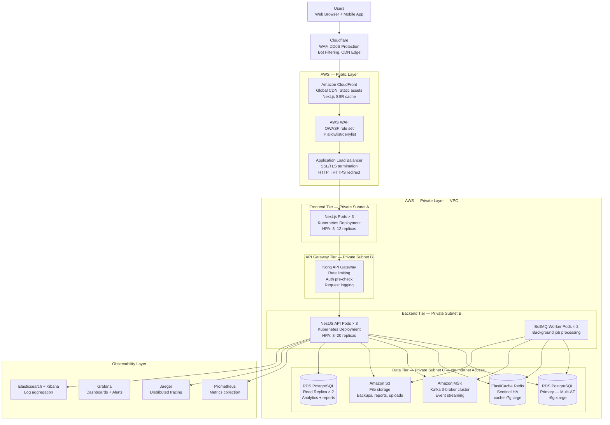

### 2.2 Traffic Flow Summary

| Layer | Component | Protocol | Scale |
| :--- | :--- | :--- | :--- |
| **Edge** | Cloudflare WAF + CDN | HTTPS | Global edge, 200+ PoPs |
| **CDN** | Amazon CloudFront | HTTPS | Regional cache for static assets |
| **Load Balancer** | AWS ALB | HTTPS → HTTP | Multi-AZ, auto-scaling |
| **Frontend** | Next.js on EKS | HTTP | 3–12 replicas (HPA) |
| **API Gateway** | Kong on EKS | HTTP | 2–5 replicas |
| **Backend API** | NestJS on EKS | HTTP | 3–20 replicas (HPA) |
| **Background** | BullMQ Workers on EKS | — | 2–10 replicas (KEDA) |
| **Database** | RDS PostgreSQL | TCP/TLS | Primary + 2 replicas |
| **Cache** | ElastiCache Redis | TLS | Sentinel cluster (3 nodes) |
| **Messaging** | Amazon MSK Kafka | TLS | 3-broker cluster |
| **Storage** | Amazon S3 | HTTPS | Unlimited |

---

## SECTION 3 — CLOUD ENVIRONMENT STRATEGY

### 3.1 Environment Definition

| Environment | Purpose | Infrastructure Scale | Data | Access |
| :--- | :--- | :--- | :--- | :--- |
| **Development** | Developer local iteration | Docker Compose (local) | Seed/mock data | Developer only |
| **Testing (CI)** | Automated test execution | Ephemeral; testcontainers | Auto-generated | CI/CD system only |
| **Staging** | Pre-production validation; QA, UAT, performance testing | 30% of production scale | Anonymized production clone | Engineering + QA |
| **Production** | Live user traffic | Full scale | Real data | On-call SRE only via audit-logged bastion |

### 3.2 Environment Isolation Strategy

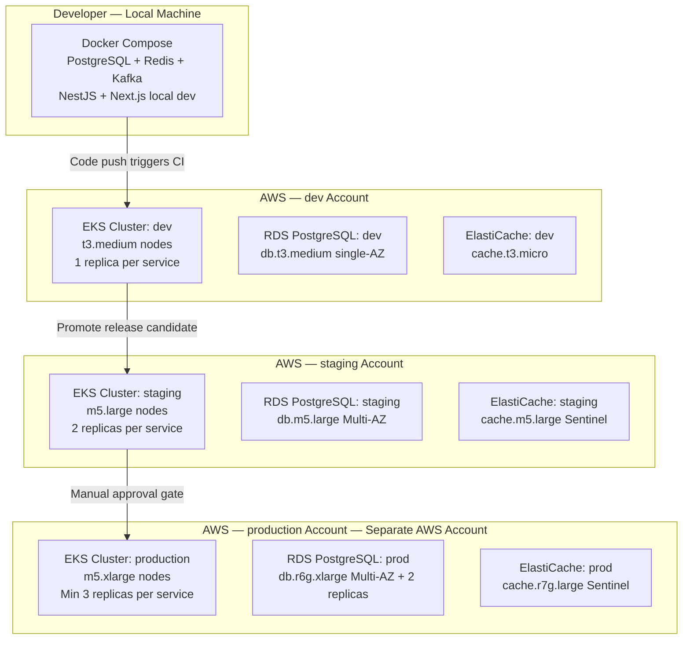

### 3.3 Environment-Specific Configuration

```yaml
# kubernetes/overlays/production/kustomization.yaml
apiVersion: kustomize.config.k8s.io/v1beta1
kind: Kustomization
namespace: saas-platform-prod
bases:
  - ../../base
patches:
  - target: { kind: Deployment, name: nestjs-api }
    patch: |
      spec:
        replicas: 3
        template:
          spec:
            containers:
              - name: nestjs-api
                resources:
                  requests: { cpu: "500m", memory: "512Mi" }
                  limits:   { cpu: "2000m", memory: "2Gi" }

# kubernetes/overlays/staging/kustomization.yaml
  - target: { kind: Deployment, name: nestjs-api }
    patch: |
      spec:
        replicas: 2
        template:
          spec:
            containers:
              - name: nestjs-api
                resources:
                  requests: { cpu: "250m", memory: "256Mi" }
                  limits:   { cpu: "1000m", memory: "1Gi" }
```

---

## SECTION 4 — CLOUD COMPUTE ARCHITECTURE

### 4.1 Compute Option Comparison

| Option | Use Case | Cost | Performance | Scalability | Our Usage |
| :--- | :--- | :--- | :--- | :--- | :--- |
| **EC2 VMs** | Long-running stateful workloads | Medium-High | Predictable | Manual or ASG | EKS worker nodes |
| **EKS (Kubernetes)** | Containerized microservices | Medium | High; bin-packing | HPA + Cluster Autoscaler | ✅ All application workloads |
| **AWS Fargate** | Serverless containers; no node management | High per unit | Good | Automatic | One-off batch jobs |
| **Lambda** | Short event-driven tasks | Low for sporadic | Cold start risk | Automatic | ✅ Webhooks, cron triggers |
| **ECS** | Simpler container orchestration | Medium | Good | Task scaling | Not used (prefer EKS) |

### 4.2 EKS Node Group Strategy

```
PRODUCTION NODE GROUPS:
─────────────────────────────────────────────────────────────────────────
1. System Node Group (On-Demand):
   Instance Type:  m5.large (2 vCPU, 8 GB)
   Count:          3 (one per AZ — never fewer than 3)
   Purpose:        kube-system pods, CoreDNS, cluster-autoscaler, monitoring
   Taints:         node-role=system:NoSchedule
   Note:           Application pods never scheduled here

2. Application Node Group (On-Demand):
   Instance Type:  m5.xlarge (4 vCPU, 16 GB)
   Min/Max/Desired: 3 / 20 / 5
   Purpose:        NestJS, Next.js, Kong, BullMQ workers
   Labels:         role=application
   Cluster Autoscaler: Enabled (scale up in 2 min; scale down in 10 min)

3. Spot Node Group (Spot Instances):
   Instance Types: [m5.xlarge, m5a.xlarge, m4.xlarge] (diversified)
   Min/Max/Desired: 0 / 10 / 2
   Purpose:        BullMQ workers, batch jobs, non-critical workloads
   Interruption:   Kubernetes drain on 2-min notice; KEDA handles requeue
   Cost Saving:    ~70% vs On-Demand for eligible workloads

4. Memory-Optimized Node Group (On-Demand):
   Instance Type:  r6g.large (Graviton3 — ARM, 2 vCPU, 16 GB)
   Min/Max:        1 / 3
   Purpose:        Memory-intensive analytics pods, report generation
   Cost Advantage: Graviton3 ~20% cheaper than x86 equivalent
─────────────────────────────────────────────────────────────────────────
```

---

## SECTION 5 — CONTAINER ARCHITECTURE

### 5.1 Docker Multi-Stage Build

```dockerfile
# apps/api/Dockerfile — NestJS production image

# ─── Stage 1: Dependencies ────────────────────────────────────────────────────
FROM node:20-alpine AS deps
WORKDIR /app
COPY package.json package-lock.json ./
# Install ALL deps (including devDeps for build)
RUN npm ci --frozen-lockfile

# ─── Stage 2: Build ───────────────────────────────────────────────────────────
FROM node:20-alpine AS builder
WORKDIR /app
COPY --from=deps /app/node_modules ./node_modules
COPY . .
# Generate Prisma client before build
RUN npx prisma generate
RUN npm run build

# ─── Stage 3: Production ─────────────────────────────────────────────────────
FROM node:20-alpine AS production
WORKDIR /app

# Security: run as non-root user
RUN addgroup --system --gid 1001 nodejs && \
    adduser  --system --uid  1001 nestjs

# Only copy production necessities — no source, no devDeps, no tests
COPY --from=builder --chown=nestjs:nodejs /app/dist         ./dist
COPY --from=builder --chown=nestjs:nodejs /app/node_modules ./node_modules
COPY --from=builder --chown=nestjs:nodejs /app/prisma       ./prisma
COPY --from=builder --chown=nestjs:nodejs /app/package.json ./

# Security hardening
USER nestjs
ENV NODE_ENV=production
ENV PORT=3000
EXPOSE 3000

# Healthcheck (Kubernetes liveness probe also uses this)
HEALTHCHECK --interval=30s --timeout=10s --start-period=15s --retries=3 \
  CMD wget -qO- http://localhost:3000/health || exit 1

CMD ["node", "dist/main.js"]
```

```dockerfile
# apps/web/Dockerfile — Next.js production image (standalone output mode)

FROM node:20-alpine AS deps
WORKDIR /app
COPY package.json package-lock.json ./
RUN npm ci --frozen-lockfile

FROM node:20-alpine AS builder
WORKDIR /app
COPY --from=deps /app/node_modules ./node_modules
COPY . .
ENV NEXT_TELEMETRY_DISABLED=1
# next.config.js must set: output: 'standalone'
RUN npm run build

FROM node:20-alpine AS production
WORKDIR /app
RUN addgroup --system --gid 1001 nodejs && \
    adduser  --system --uid  1001 nextjs

# Standalone output: minimal bundle — server.js + public + .next/static
COPY --from=builder --chown=nextjs:nodejs /app/.next/standalone  ./
COPY --from=builder --chown=nextjs:nodejs /app/.next/static      ./.next/static
COPY --from=builder --chown=nextjs:nodejs /app/public            ./public

USER nextjs
ENV NODE_ENV=production PORT=3000 HOSTNAME=0.0.0.0
EXPOSE 3000
CMD ["node", "server.js"]
```

### 5.2 Container Image Security

```
Image Security Controls:
  Base Image:    node:20-alpine (minimal attack surface; no package manager after build)
  Distroless:    Consider gcr.io/distroless/nodejs20-debian12 for ultimate minimalism
  Non-root:      User ID 1001 (never root); confirmed with USER directive
  Read-only FS:  Kubernetes securityContext.readOnlyRootFilesystem: true
  No Privilege:  allowPrivilegeEscalation: false
  Scanning:      Trivy scan on every built image (CRITICAL CVE → block push to ECR)
  SBOM:          Software Bill of Materials generated per image version
  Signing:       AWS Signer or cosign for image provenance verification
  Tags:          Never :latest in production; always use immutable SHA256 digest

Image Size Targets:
  NestJS API:    < 250 MB (multi-stage; no devDeps, no test files)
  Next.js Web:   < 200 MB (standalone output mode)
  Workers:       < 250 MB (same NestJS image, different CMD)
```

### 5.3 Container Registry Strategy

```
Amazon ECR (Elastic Container Registry):

Repository Structure:
  saas-platform/nestjs-api:      {git-sha}  — API application image
  saas-platform/nextjs-web:      {git-sha}  — Frontend application image
  saas-platform/bullmq-worker:   {git-sha}  — Background worker image
  saas-platform/prisma-migrate:  {git-sha}  — DB migration runner (one-shot)

Lifecycle Policies:
  Production images:  Retain last 20 tagged releases (retain-count: 20)
  Development images: Delete images older than 7 days
  Untagged:          Delete immediately (digest-only, abandoned builds)

Access:
  EKS pulls via IAM Role for Service Account (IRSA) — no long-term credentials
  CI/CD pushes via GitHub Actions OIDC → AssumeRole — no stored AWS keys
```

---

## SECTION 6 — KUBERNETES FOUNDATION

### 6.1 EKS Cluster Architecture

```
Kubernetes Version:  1.30 (latest LTS)
EKS Control Plane:   Fully managed by AWS (no master node management)
Container Runtime:   containerd (default in Kubernetes 1.24+)
CNI:                 VPC CNI (aws-node) — native VPC IP addresses for pods
DNS:                 CoreDNS (cluster-internal DNS resolution)
Ingress:             AWS Load Balancer Controller + NGINX Ingress Controller
Service Mesh:        None initially; Istio or Linkerd as future option
GitOps:              ArgoCD — declarative, Git-driven cluster state
```

### 6.2 Kubernetes Object Architecture (NestJS API)

```yaml
# kubernetes/base/nestjs-api/deployment.yaml
apiVersion: apps/v1
kind: Deployment
metadata:
  name: nestjs-api
  namespace: saas-platform-prod
  labels:
    app: nestjs-api
    version: "1.0.0"
spec:
  replicas: 3
  strategy:
    type: RollingUpdate
    rollingUpdate:
      maxSurge: 1         # One extra pod during update
      maxUnavailable: 0   # Never reduce below desired count during update (zero-downtime)
  selector:
    matchLabels:
      app: nestjs-api
  template:
    metadata:
      labels:
        app: nestjs-api
      annotations:
        prometheus.io/scrape: "true"
        prometheus.io/port:   "3000"
        prometheus.io/path:   "/metrics"
    spec:
      serviceAccountName: nestjs-api-sa   # IRSA: S3, Secrets Manager, KMS access
      terminationGracePeriodSeconds: 60   # Allow in-flight requests to complete
      topologySpreadConstraints:
        - maxSkew: 1
          topologyKey: topology.kubernetes.io/zone
          whenUnsatisfiable: DoNotSchedule   # Spread across AZs
          labelSelector:
            matchLabels: { app: nestjs-api }
      containers:
        - name: nestjs-api
          image: 123456789.dkr.ecr.ap-southeast-1.amazonaws.com/saas-platform/nestjs-api:abc1234
          ports:
            - containerPort: 3000
          envFrom:
            - configMapRef: { name: nestjs-api-config }    # Non-secret config
            - secretRef:    { name: nestjs-api-secrets }   # Populated from Secrets Manager via ESO
          resources:
            requests: { cpu: "500m",  memory: "512Mi" }
            limits:   { cpu: "2000m", memory: "2Gi" }
          livenessProbe:
            httpGet: { path: /health/live, port: 3000 }
            initialDelaySeconds: 30
            periodSeconds: 15
            failureThreshold: 3
          readinessProbe:
            httpGet: { path: /health/ready, port: 3000 }
            initialDelaySeconds: 10
            periodSeconds: 5
            failureThreshold: 3
            successThreshold: 1
          securityContext:
            runAsNonRoot:              true
            runAsUser:                 1001
            allowPrivilegeEscalation:  false
            readOnlyRootFilesystem:    true
            capabilities:
              drop: ["ALL"]
          volumeMounts:
            - name: tmp
              mountPath: /tmp   # Writable temp dir for read-only FS
      volumes:
        - name: tmp
          emptyDir: {}
```

### 6.3 Kubernetes Service Architecture

```yaml
# Service (cluster-internal)
apiVersion: v1
kind: Service
metadata:
  name: nestjs-api
  namespace: saas-platform-prod
spec:
  selector:
    app: nestjs-api
  ports:
    - port: 80
      targetPort: 3000
  type: ClusterIP   # Internal only; exposed via Ingress externally

---
# Horizontal Pod Autoscaler
apiVersion: autoscaling/v2
kind: HorizontalPodAutoscaler
metadata:
  name: nestjs-api-hpa
spec:
  scaleTargetRef:
    apiVersion: apps/v1
    kind: Deployment
    name: nestjs-api
  minReplicas: 3
  maxReplicas: 20
  metrics:
    - type: Resource
      resource:
        name: cpu
        target: { type: Utilization, averageUtilization: 60 }
    - type: Resource
      resource:
        name: memory
        target: { type: Utilization, averageUtilization: 75 }
  behavior:
    scaleUp:
      stabilizationWindowSeconds: 60     # Wait 60s before scaling up
      policies:
        - type: Pods, value: 2, periodSeconds: 60  # Add max 2 pods/min
    scaleDown:
      stabilizationWindowSeconds: 300    # Wait 5 min before scaling down
      policies:
        - type: Pods, value: 1, periodSeconds: 120  # Remove max 1 pod/2min
```

### 6.4 Kubernetes Namespace Strategy

```
Namespace Layout:
  saas-platform-prod        — All production application workloads
  saas-platform-staging     — Staging environment (same cluster or separate)
  monitoring                — Prometheus, Grafana, Alertmanager, Jaeger
  logging                   — Fluentd DaemonSet, Elasticsearch
  argocd                    — ArgoCD GitOps controller
  ingress-nginx             — NGINX Ingress Controller
  cert-manager              — Let's Encrypt TLS certificate automation
  external-secrets          — External Secrets Operator (ESO): Secrets Manager sync
  keda                      — KEDA: event-driven autoscaling for workers

Resource Quotas per Namespace (production):
  CPU:     requests: 20 cores, limits: 40 cores
  Memory:  requests: 40 Gi, limits: 80 Gi
  Pods:    max 100
  PVCs:    max 20
```

---

## SECTION 7 — NETWORK ARCHITECTURE

### 7.1 VPC Network Design

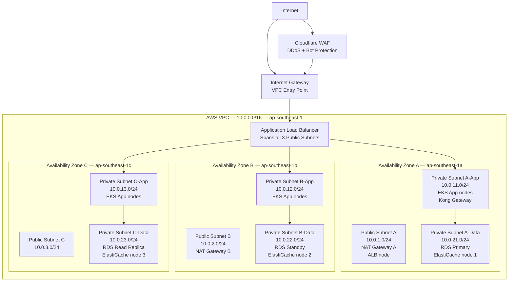

### 7.2 Security Group Architecture

| Security Group | Inbound | Outbound | Attached To |
| :--- | :--- | :--- | :--- |
| **sg-alb** | 443 from 0.0.0.0/0 (HTTPS) | 3000 to sg-eks-app | ALB |
| **sg-eks-app** | 3000 from sg-alb; all from sg-eks-app (pod-pod) | 5432 to sg-rds; 6379 to sg-redis; 443 to 0.0.0.0/0 (egress via NAT) | EKS nodes |
| **sg-rds** | 5432 from sg-eks-app ONLY | None | RDS PostgreSQL |
| **sg-redis** | 6379 from sg-eks-app ONLY | None | ElastiCache |
| **sg-kafka** | 9092/9094 from sg-eks-app ONLY | None | MSK Kafka |
| **sg-bastion** | 22 from VPN CIDR only (10.8.0.0/16) | All within VPC | Bastion host |

### 7.3 Network Access Controls

```
Network ACLs (subnet-level stateless firewall):
  Public Subnets:
    Inbound:  Allow 443 (HTTPS), 80 (HTTP redirect), ephemeral (1024-65535)
    Outbound: Allow all

  Private App Subnets:
    Inbound:  Allow from ALB SG, allow pod-to-pod within VPC CIDR
    Outbound: Allow 5432 (PostgreSQL), 6379 (Redis), 9094 (Kafka), 443 (HTTPS egress)

  Private Data Subnets:
    Inbound:  Allow 5432 from App subnets only; 6379 from App subnets only
    Outbound: Allow ephemeral ports back to App subnets only
    Note:     No internet access whatsoever — data tier is fully isolated

VPN / Bastion Access:
  VPN:     AWS Client VPN with certificate authentication
  Bastion: Single bastion EC2 in public subnet; SSH access from VPN CIDR only
  Session: AWS Systems Manager Session Manager (preferred — no open port 22)
  Audit:   All bastion sessions recorded; CloudTrail logs every API call
```

---

## SECTION 8 — LOAD BALANCING ARCHITECTURE

### 8.1 Load Balancer Stack

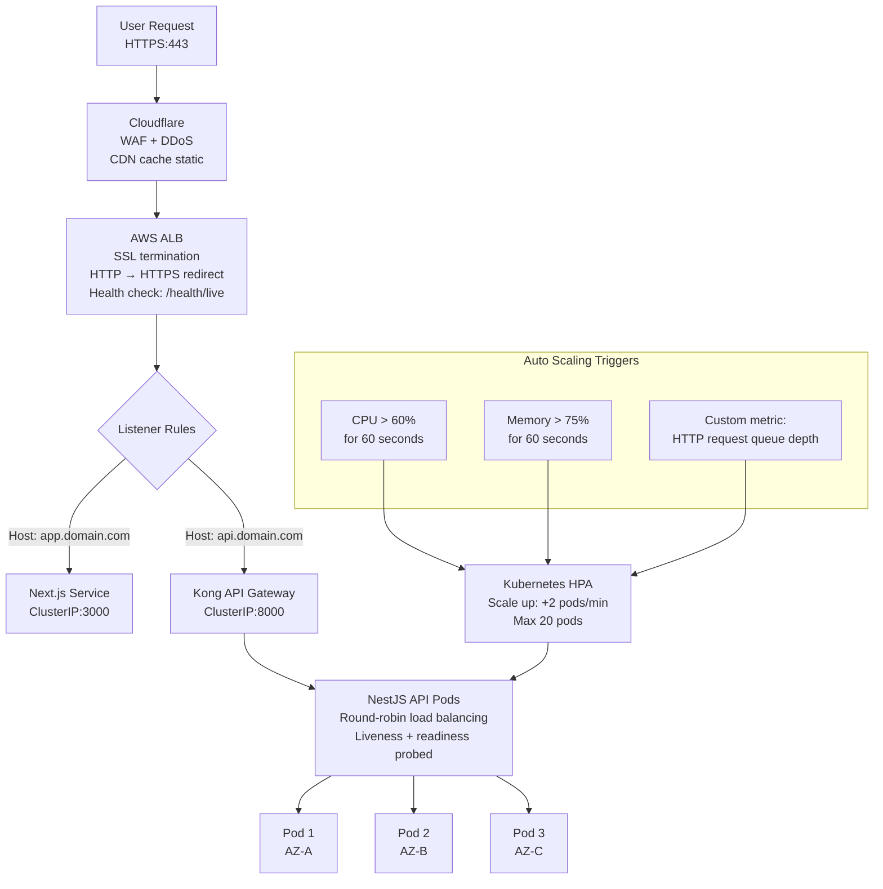

### 8.2 Health Check Configuration

```yaml
# ALB Target Group Health Check
HealthCheck:
  Protocol:               HTTP
  Port:                   traffic-port
  Path:                   /health/live
  HealthyThresholdCount:  2     # 2 consecutive passes → healthy
  UnhealthyThreshold:     3     # 3 consecutive fails → remove from rotation
  IntervalSeconds:        15
  TimeoutSeconds:         5

# Kubernetes Pod Health Checks
livenessProbe:
  # Fails → Pod restarted
  httpGet:      { path: /health/live, port: 3000 }
  initialDelaySeconds: 30      # Give NestJS time to start
  periodSeconds:       15
  failureThreshold:    3       # 3 × 15s = 45s before restart

readinessProbe:
  # Fails → Pod removed from Service endpoints (traffic stops)
  httpGet:      { path: /health/ready, port: 3000 }
  initialDelaySeconds: 10
  periodSeconds:       5
  failureThreshold:    3       # 3 × 5s = 15s before removed from rotation
  successThreshold:    1
```

```typescript
// health/health.controller.ts — Kubernetes health endpoints
@Controller('health')
export class HealthController {
  constructor(
    private readonly health:   HealthCheckService,
    private readonly prisma:   PrismaHealthIndicator,
    private readonly redis:    RedisHealthIndicator,
    private readonly disk:     DiskHealthIndicator,
    private readonly memory:   MemoryHealthIndicator,
  ) {}

  // Liveness: is the process alive and not deadlocked?
  @Get('live')
  @HealthCheck()
  async liveness() {
    return this.health.check([
      () => this.memory.checkHeap('memory_heap', 500 * 1024 * 1024),  // < 500MB heap
      () => this.disk.checkStorage('disk', { path: '/', thresholdPercent: 0.9 }),
    ]);
  }

  // Readiness: is the app ready to serve traffic?
  @Get('ready')
  @HealthCheck()
  async readiness() {
    return this.health.check([
      () => this.prisma.pingCheck('database'),   // DB reachable
      () => this.redis.pingCheck('cache'),        // Redis reachable
    ]);
  }

  // Startup: has the app finished initialization? (Kubernetes startupProbe)
  @Get('startup')
  async startup() {
    return { status: 'ok', timestamp: new Date().toISOString() };
  }
}
```

---

## SECTION 9 — DATABASE INFRASTRUCTURE

### 9.1 PostgreSQL Production Architecture

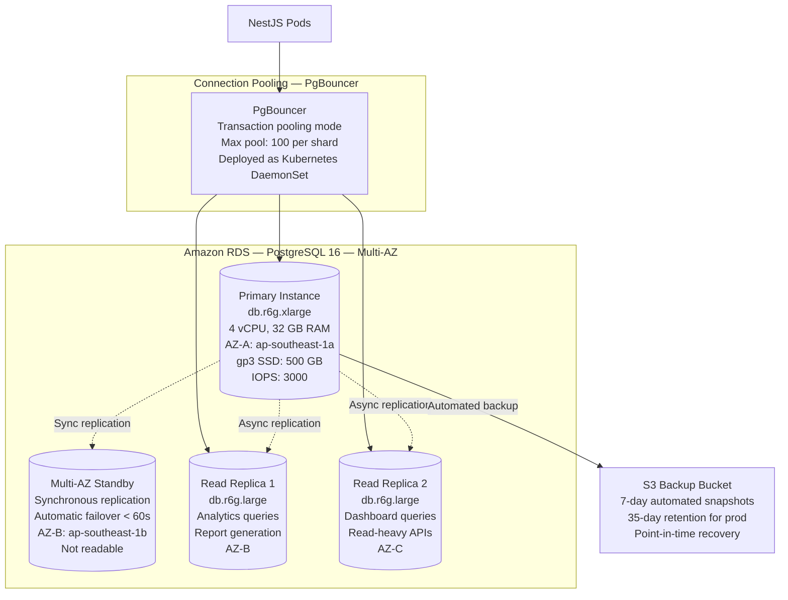

### 9.2 Database Configuration

```
RDS PostgreSQL Production Settings:
  Engine:              PostgreSQL 16.x
  Instance Class:      db.r6g.xlarge (Graviton2 — 20% cost saving)
  Storage:             gp3 SSD — 500 GB initial; autoscaling to 2 TB
  IOPS:                3000 provisioned (upgradeable to 12,000)
  Multi-AZ:            Yes — synchronous standby in separate AZ
  Automated Backups:   Yes — 35-day retention; point-in-time recovery (PITR)
  Encryption:          AWS KMS — encrypted at rest (AES-256)
  TLS:                 sslmode=require; ssl_min_protocol_version=TLSv1.2
  Maintenance Window:  Sunday 03:00–04:00 UTC (lowest traffic)
  Upgrade Policy:      Minor versions: automated; Major: manual with testing

Performance Parameters:
  max_connections:               200   (PgBouncer handles actual pooling)
  shared_buffers:                25% RAM = 8 GB
  effective_cache_size:          75% RAM = 24 GB
  work_mem:                      64 MB
  maintenance_work_mem:          2 GB
  wal_level:                     replica
  max_wal_senders:               10
  wal_keep_size:                 1 GB
  checkpoint_completion_target:  0.9
  random_page_cost:              1.1   (SSD — lower than default 4.0)
  log_min_duration_statement:    1000  (log queries > 1s)
```

### 9.3 PgBouncer Connection Pooling

```ini
# pgbouncer.ini — Connection pool configuration
[databases]
saas_platform = host=saas-db.cluster-xxxxx.ap-southeast-1.rds.amazonaws.com \
                port=5432 dbname=saas_platform

[pgbouncer]
pool_mode           = transaction    # Transaction-level pooling (optimal for NestJS)
max_client_conn     = 500            # Max concurrent client connections (from pods)
default_pool_size   = 25            # Connections to PostgreSQL per database
reserve_pool_size   = 5             # Extra connections for sudden bursts
reserve_pool_timeout = 5            # Seconds to wait before using reserve pool
server_lifetime     = 3600          # Recycle server connections hourly
server_idle_timeout = 600           # Remove idle server connections after 10 min
auth_type           = scram-sha-256
listen_addr         = 0.0.0.0
listen_port         = 5432
log_connections     = 1
log_disconnections  = 1
```

---

## SECTION 10 — CACHE INFRASTRUCTURE

### 10.1 Redis Architecture Selection

| Mode | Description | Use Case | HA | Our Choice |
| :--- | :--- | :--- | :--- | :--- |
| **Standalone** | Single Redis node | Development only | None | Dev only |
| **Sentinel** | 1 primary + 2 replicas + 3 sentinels | Production HA; automatic failover | Yes (< 30s failover) | ✅ Production |
| **Cluster** | Sharded across 6+ nodes | Massive dataset > 100 GB; high throughput > 1M ops/s | Yes | Future if needed |

### 10.2 ElastiCache Redis Production Configuration

```
Amazon ElastiCache Redis Sentinel Configuration:

Primary Node:     cache.r7g.large (2 vCPU, 13 GB) — AZ-A
Replica Nodes:    cache.r7g.large × 2 — AZ-B, AZ-C
Sentinel:         3 sentinel nodes managed by ElastiCache (automatic)
Failover Time:    < 30 seconds (automatic; Sentinel quorum = 2/3)
Encryption:       At-rest (AWS KMS); In-transit (TLS 1.2+)
Auth:             Redis AUTH token (Secrets Manager managed)
Parameter Group:
  maxmemory-policy:     allkeys-lru     (evict LRU keys when memory full)
  maxmemory:            10gb            (80% of 13 GB — leave OS headroom)
  save:                 900 1 300 10    (RDB snapshots: 15min if 1 key changed)
  appendonly:           yes             (AOF: every-second fsync)
  appendfsync:          everysec
  tcp-keepalive:        60
  lazyfree-lazy-eviction: yes           (Non-blocking eviction)

Backup:
  Automatic daily snapshots retained 7 days
  Backup window: 03:00–04:00 UTC
```

---

## SECTION 11 — STORAGE ARCHITECTURE

### 11.1 S3 Storage Design

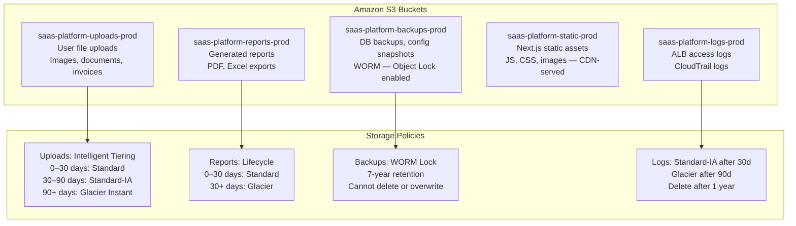

### 11.2 S3 Bucket Security Configuration

```json
// S3 Bucket Policy — uploads bucket (no public access)
{
  "Version": "2012-10-17",
  "Statement": [
    {
      "Sid": "DenyPublicAccess",
      "Effect": "Deny",
      "Principal": "*",
      "Action": "s3:GetObject",
      "Resource": "arn:aws:s3:::saas-platform-uploads-prod/*",
      "Condition": { "StringEquals": { "s3:ExistingObjectTag/public": "false" } }
    },
    {
      "Sid": "AllowApplicationIAMRole",
      "Effect": "Allow",
      "Principal": { "AWS": "arn:aws:iam::ACCOUNT:role/nestjs-api-pod-role" },
      "Action": ["s3:GetObject", "s3:PutObject", "s3:DeleteObject"],
      "Resource": "arn:aws:s3:::saas-platform-uploads-prod/*"
    }
  ]
}
```

```
S3 Security Controls:
  Block Public Access:   Enabled on ALL buckets (account-level policy)
  Bucket Encryption:     SSE-KMS (AWS managed key per bucket)
  Versioning:            Enabled on uploads and backups (protect against delete)
  Object Lock:           Enabled on backups bucket (WORM compliance)
  Access Logging:        Enabled → logs to saas-platform-logs-prod bucket
  CloudTrail S3:         API-level audit trail for all S3 operations
  Presigned URLs:        All file access via presigned URL (15-min to 1-hour TTL)
  CORS:                  Allowlisted origins only (no wildcard)
```

---

## SECTION 12 — SECRET MANAGEMENT

### 12.1 Secrets Architecture

```mermaid
graph TD
    subgraph SecretsManager [AWS Secrets Manager]
        DBSecret[/saas/prod/database/password\nPostgreSQL master password\nRotated every 90 days]
        RedisSecret[/saas/prod/redis/auth\nRedis AUTH token]
        JWTSecret[/saas/prod/auth/jwt-private-key\nRS256 private key PEM]
        StripeSecret[/saas/prod/payments/stripe-api-key]
        SendGridSecret[/saas/prod/notifications/sendgrid-api-key]
        FieldEncKey[/saas/prod/crypto/field-encryption-key\nAES-256 key for PII encryption]
    end

    subgraph KMS [AWS KMS]
        KMSKey[KMS Customer Managed Key\nEncrypts all Secrets Manager values\nKey rotation: annual\nAccess: IAM role only]
    end

    subgraph ESO [External Secrets Operator — Kubernetes]
        ExternalSecret[ExternalSecret CRD\nPolls Secrets Manager every 1h\nSyncs to Kubernetes Secret]
        K8sSecret[Kubernetes Secret\nNamespace-scoped\nEncrypted in etcd via KMS]
    end

    SecretsManager --> KMSKey
    SecretsManager --> ExternalSecret --> K8sSecret
    K8sSecret --> NestPods3[NestJS Pods\nInjected as env vars via secretRef]
```

### 12.2 External Secrets Operator Configuration

```yaml
# external-secrets/nestjs-api-secrets.yaml
apiVersion: external-secrets.io/v1beta1
kind: ExternalSecret
metadata:
  name: nestjs-api-secrets
  namespace: saas-platform-prod
spec:
  refreshInterval: 1h    # Re-sync from Secrets Manager every hour
  secretStoreRef:
    name: aws-secrets-store
    kind: ClusterSecretStore
  target:
    name: nestjs-api-secrets   # Creates this Kubernetes Secret
    creationPolicy: Owner
    deletionPolicy: Retain
  data:
    - secretKey: DATABASE_URL
      remoteRef:
        key:      /saas/prod/database/password
        property: connection_string
    - secretKey: JWT_PRIVATE_KEY
      remoteRef:
        key: /saas/prod/auth/jwt-private-key
    - secretKey: REDIS_URL
      remoteRef:
        key: /saas/prod/redis/auth
        property: url
    - secretKey: STRIPE_SECRET_KEY
      remoteRef:
        key: /saas/prod/payments/stripe-api-key
```

---

## SECTION 13 — INFRASTRUCTURE SECURITY

### 13.1 IAM Architecture

```
IAM Strategy: Least-Privilege, Role-Based, No Long-Term Keys

Pod-Level Access (IRSA — IAM Roles for Service Accounts):
  nestjs-api-pod-role:
    - s3:GetObject, PutObject, DeleteObject → saas-platform-uploads-prod/*
    - secretsmanager:GetSecretValue → /saas/prod/* (read-only)
    - kms:Decrypt → saas-kms-key (for secret decryption)
    - ses:SendEmail → * (email sending)

  bullmq-worker-pod-role:
    - s3:GetObject, PutObject → saas-platform-reports-prod/*
    - secretsmanager:GetSecretValue → /saas/prod/*
    - kms:Decrypt → saas-kms-key

  prisma-migrate-pod-role:
    - secretsmanager:GetSecretValue → /saas/prod/database/* (migrate user password)

CI/CD Access:
  github-actions-role:
    - ecr:GetAuthorizationToken, BatchCheckLayerAvailability, PutImage → ECR repos
    - eks:DescribeCluster → production cluster (for kubectl)
    - Condition: StringLike { token.actions.githubusercontent.com:sub: "repo:org/repo:*" }
    - NO secretsmanager access from CI — secrets managed separately

Human Access:
  SRE engineers: Read-only production access via AWS SSO; write via break-glass role
  Break-glass:   Requires MFA + manager approval; all actions logged to CloudTrail
  No IAM users:  Only AWS SSO (Identity Center) for human login — no permanent credentials
```

### 13.2 Kubernetes RBAC

```yaml
# rbac/production-rbac.yaml
# Developers: read-only access to non-sensitive resources
apiVersion: rbac.authorization.k8s.io/v1
kind: Role
metadata:
  name: developer-readonly
  namespace: saas-platform-prod
rules:
  - apiGroups: [""]
    resources: ["pods", "services", "configmaps"]
    verbs: ["get", "list", "watch"]
  - apiGroups: ["apps"]
    resources: ["deployments", "replicasets"]
    verbs: ["get", "list", "watch"]
  # Explicitly NO: secrets, exec into pods, delete, patch

---
# SRE: full access to namespace
apiVersion: rbac.authorization.k8s.io/v1
kind: Role
metadata:
  name: sre-admin
  namespace: saas-platform-prod
rules:
  - apiGroups: ["*"]
    resources: ["*"]
    verbs: ["*"]
```

---

## SECTION 14 — INFRASTRUCTURE AUTOMATION

### 14.1 Terraform Infrastructure as Code Structure

```
terraform/
├── modules/                    # Reusable modules
│   ├── eks/                    # EKS cluster + node groups
│   ├── rds/                    # RDS PostgreSQL + parameter group
│   ├── elasticache/            # ElastiCache Redis Sentinel
│   ├── msk/                    # Amazon MSK Kafka
│   ├── vpc/                    # VPC, subnets, NAT Gateway, security groups
│   ├── s3/                     # S3 buckets with lifecycle + encryption
│   ├── acm/                    # ACM TLS certificates
│   └── secretsmanager/         # Secrets Manager secrets + rotation
│
├── environments/
│   ├── dev/
│   │   ├── main.tf             # Dev environment composition
│   │   ├── terraform.tfvars    # Dev-specific variable values
│   │   └── backend.tf          # Remote state: S3 + DynamoDB lock
│   ├── staging/
│   └── production/
│       ├── main.tf
│       ├── terraform.tfvars
│       └── backend.tf
│
└── global/
    ├── iam.tf                  # IAM roles, policies, IRSA
    ├── route53.tf              # DNS zones and records
    └── ecr.tf                  # Container registries
```

```hcl
# terraform/environments/production/main.tf
module "vpc" {
  source  = "../../modules/vpc"
  name    = "saas-platform-prod"
  cidr    = "10.0.0.0/16"
  azs     = ["ap-southeast-1a", "ap-southeast-1b", "ap-southeast-1c"]
  public_subnets  = ["10.0.1.0/24", "10.0.2.0/24", "10.0.3.0/24"]
  private_app_subnets  = ["10.0.11.0/24", "10.0.12.0/24", "10.0.13.0/24"]
  private_data_subnets = ["10.0.21.0/24", "10.0.22.0/24", "10.0.23.0/24"]
  enable_nat_gateway = true
  single_nat_gateway = false   # One NAT per AZ (HA)
  tags = local.common_tags
}

module "eks" {
  source             = "../../modules/eks"
  cluster_name       = "saas-platform-prod"
  kubernetes_version = "1.30"
  vpc_id             = module.vpc.vpc_id
  subnet_ids         = module.vpc.private_app_subnet_ids
  node_groups = {
    system = {
      instance_types = ["m5.large"]
      min_size = 3; max_size = 3; desired_size = 3
      taints = [{ key = "node-role", value = "system", effect = "NO_SCHEDULE" }]
    }
    application = {
      instance_types = ["m5.xlarge"]
      min_size = 3; max_size = 20; desired_size = 5
    }
    spot = {
      instance_types    = ["m5.xlarge", "m5a.xlarge", "m4.xlarge"]
      capacity_type     = "SPOT"
      min_size = 0; max_size = 10; desired_size = 2
    }
  }
}

module "rds" {
  source              = "../../modules/rds"
  identifier          = "saas-platform-prod"
  engine_version      = "16.3"
  instance_class      = "db.r6g.xlarge"
  allocated_storage   = 500
  multi_az            = true
  subnet_ids          = module.vpc.private_data_subnet_ids
  vpc_security_group_ids = [module.vpc.sg_rds_id]
  backup_retention_period = 35
  deletion_protection = true   # Cannot delete RDS without removing this first
  kms_key_id          = module.kms.key_arn
}
```

### 14.2 GitOps with ArgoCD

```yaml
# argocd/applications/nestjs-api.yaml
apiVersion: argoproj.io/v1alpha1
kind: Application
metadata:
  name: nestjs-api
  namespace: argocd
spec:
  project: saas-platform
  source:
    repoURL:        https://github.com/org/saas-platform-infra
    targetRevision: main
    path:           kubernetes/overlays/production
  destination:
    server:    https://kubernetes.default.svc
    namespace: saas-platform-prod
  syncPolicy:
    automated:
      prune:    true    # Remove deleted resources from cluster
      selfHeal: true    # Re-apply if manually changed in cluster
    syncOptions:
      - CreateNamespace=true
      - PrunePropagationPolicy=foreground
      - RespectIgnoreDifferences=true
    retry:
      limit: 5
      backoff:
        duration: 5s
        factor: 2
        maxDuration: 3m
```

---

## SECTION 15 — COST OPTIMIZATION

### 15.1 Cost Optimization Strategy

| Resource | Strategy | Estimated Saving |
| :--- | :--- | :--- |
| **EKS worker nodes** | Mix On-Demand (70%) + Spot (30%) for workers | ~20% compute reduction |
| **EC2 On-Demand** | Reserved Instances (1-year, no upfront) for system nodes | ~30–40% vs On-Demand |
| **Graviton3 instances** | Use arm64 (r7g, m7g) for compatible workloads | ~20% cheaper per vCPU |
| **RDS** | Graviton2 instance class (db.r6g.*) | ~20% vs x86 equivalent |
| **ElastiCache** | Graviton3 instance (cache.r7g.*) | ~20% savings |
| **S3 storage** | Intelligent Tiering for uploads; Glacier for backups | 60–70% vs Standard alone |
| **NAT Gateway** | VPC Endpoints for S3, ECR, Secrets Manager (bypass NAT) | $0.045/GB saved on internal traffic |
| **CloudWatch Logs** | Ship to S3 + Elasticsearch instead of CloudWatch retention | ~80% log storage cost reduction |
| **Data Transfer** | Use same-region services; minimize cross-AZ data transfer | $0.01/GB saved |

### 15.2 Resource Right-Sizing Policy

```
Monthly Cost Review Process:
  1. Pull AWS Cost Explorer: resource utilization vs billing
  2. Review CPU/Memory P95 via Prometheus over 30 days
  3. Downsize instances where P95 CPU < 30% AND P95 Memory < 40%
  4. Upsize instances where P95 CPU > 70% OR P95 Memory > 75%
  5. Convert underutilized On-Demand to Reserved Instances annually
  6. Review Spot interruption frequency; adjust diversification

Budget Alerts:
  Daily: Alert if daily spend > 110% of expected
  Monthly: Alert at 80% and 100% of monthly budget
  Anomaly: AWS Cost Anomaly Detection — alert on unexpected spike
```

---

## SECTION 16 — HIGH AVAILABILITY ARCHITECTURE

### 16.1 HA Design Principles

```
AVAILABILITY TARGET:
  SLA:              99.9% uptime (< 8.7 hours downtime/year)
  RTO:              < 10 minutes (Recovery Time Objective)
  RPO:              < 5 minutes (Recovery Point Objective)

MULTI-AZ SPREAD:
  EKS Nodes:        Spread across 3 AZs via topologySpreadConstraints
  RDS:              Multi-AZ synchronous standby in separate AZ
  ElastiCache:      Redis Sentinel with nodes in 3 AZs
  MSK Kafka:        3 brokers spread across 3 AZs
  NAT Gateways:     One per AZ (3 total) — AZ-local egress
  Load Balancer:    ALB spans all 3 AZs automatically

POD DISRUPTION BUDGETS:
  All critical services: minAvailable: 2 (never fewer than 2 pods)
  Ensures rolling updates and node drains don't cause outage
```

```yaml
# Pod Disruption Budget — ensures HA during voluntary disruptions
apiVersion: policy/v1
kind: PodDisruptionBudget
metadata:
  name: nestjs-api-pdb
  namespace: saas-platform-prod
spec:
  minAvailable: 2     # At least 2 pods must be available at all times
  selector:
    matchLabels:
      app: nestjs-api
```

### 16.2 Failure Mode Analysis

| Failure | Impact | Recovery | RTO |
| :--- | :--- | :--- | :--- |
| **Single pod crash** | Traffic rerouted to remaining pods | Kubernetes restarts pod | < 30 sec |
| **AZ outage** | 1/3 of pods + 1 NAT GW unavailable | K8s reschedules to healthy AZs | < 5 min |
| **RDS Primary failure** | Write operations fail during failover | Multi-AZ automatic failover | < 60 sec |
| **ElastiCache primary failure** | Cache miss; DB serves all traffic | Sentinel promotes replica | < 30 sec |
| **Kafka broker failure** | Partition unavailability if RF=1 | Kafka rebalances to other brokers | < 2 min |
| **EKS node failure** | Cluster Autoscaler replaces node | New node provisioned and warmed | < 5 min |
| **Full AZ failure** | Major traffic degradation | Pods redistributed; ALB routes to healthy | < 10 min |
| **Region failure** | Complete outage | Manual DR failover to DR region | < 60 min |

---

## SECTION 17 — DISASTER RECOVERY FOUNDATION

### 17.1 Disaster Recovery Strategy

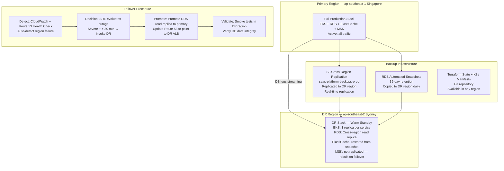

### 17.2 Recovery Objectives

| Scenario | RTO Target | RPO Target | Recovery Method |
| :--- | :--- | :--- | :--- |
| **Pod crash** | < 30 sec | 0 (no data loss) | Kubernetes auto-restart |
| **Node failure** | < 5 min | 0 | Cluster Autoscaler + pod rescheduling |
| **AZ failure** | < 10 min | 0 (Multi-AZ) | Kubernetes AZ redistribution + RDS Multi-AZ |
| **Region failure** | < 60 min | < 5 min | Manual DR failover runbook |
| **Data corruption** | < 2 hours | < 5 min | PITR (Point-in-Time Recovery) from RDS |
| **Ransomware / delete** | < 4 hours | < 24 hours | Restore from WORM-locked S3 backup |

### 17.3 Backup Schedule

```
Database Backups:
  RDS Automated:    Daily snapshot; 35-day retention; PITR to any second
  Manual Snapshots: Weekly before major releases; kept 90 days
  Cross-Region:     Daily snapshot copied to DR region (ap-southeast-2)

Redis Backups:
  ElastiCache RDB:  Daily snapshot; 7-day retention

File Storage Backups:
  S3 Versioning:    Enabled; all object versions retained 90 days
  Cross-Region:     Real-time replication to DR S3 bucket

Configuration Backups:
  Terraform State:  S3 backend with DynamoDB lock; versioned
  K8s Manifests:    Git repository; every change versioned
  Secrets:          Secrets Manager with version history

Backup Testing:
  Monthly:          RDS PITR restore to test environment; validate data integrity
  Quarterly:        Full DR failover simulation; test RTO/RPO targets
```

---

## SECTION 18 — CLOUD TOOL STACK

### 18.1 Complete Cloud Infrastructure Tool Stack

| Category | Tool | Version | Purpose |
| :--- | :--- | :--- | :--- |
| **Cloud Provider** | AWS | — | Primary cloud: compute, storage, networking, managed services |
| **Container Registry** | Amazon ECR | — | Private Docker registry; image scanning; lifecycle policies |
| **Container Orchestration** | Amazon EKS | 1.30 | Managed Kubernetes control plane; worker node management |
| **Compute** | EC2 (m5.xlarge, r6g.xlarge) | — | EKS worker nodes; application tier |
| **Database** | Amazon RDS PostgreSQL | 16.x | Managed PostgreSQL; Multi-AZ; automated backups; PITR |
| **Cache** | Amazon ElastiCache Redis | 7.x | Managed Redis Sentinel; automatic failover; encryption |
| **Messaging** | Amazon MSK (Kafka) | 3.6 | Managed Kafka; 3-broker cluster; TLS; IAM auth |
| **Object Storage** | Amazon S3 | — | Files, reports, backups; 11-nines durability; lifecycle |
| **CDN** | Amazon CloudFront | — | Global CDN; Next.js SSR edge caching; signed URLs |
| **WAF (Cloud)** | Cloudflare WAF | Enterprise | DDoS, bot, IP reputation, OWASP ruleset at edge |
| **WAF (AWS)** | AWS WAF | — | OWASP rules; IP allowlist/denylist; rate limiting |
| **DNS** | Amazon Route 53 | — | Latency-based routing; health checks; failover records |
| **TLS Certificates** | AWS ACM | — | Free managed TLS; auto-renewal; ALB integration |
| **Secrets** | AWS Secrets Manager | — | Credential storage; automatic rotation; KMS encryption |
| **Encryption Keys** | AWS KMS | — | CMK for RDS, S3, Secrets Manager; key rotation |
| **Identity** | AWS IAM + SSO | — | IRSA for pods; IAM Identity Center for human access |
| **Load Balancer** | AWS ALB | — | Layer 7 LB; SSL termination; target group health checks |
| **API Gateway** | Kong | 3.x | Self-hosted on EKS; rate limiting; auth plugin; logging |
| **Container Runtime** | Docker + containerd | — | Image build; Kubernetes container runtime |
| **Orchestration** | Kubernetes | 1.30 | Container orchestration; HPA; rolling updates |
| **IaC** | Terraform | 1.8 | All cloud resources; state in S3; GitOps-driven |
| **GitOps** | ArgoCD | 2.x | Declarative K8s deployment; Git-driven reconciliation |
| **Autoscaling** | Cluster Autoscaler + HPA + KEDA | — | Node scaling; pod scaling; event-driven worker scaling |
| **Ingress** | NGINX Ingress Controller | — | K8s ingress; path routing; rate limiting |
| **Cert Manager** | cert-manager | — | Automatic TLS cert provisioning (Let's Encrypt) |
| **Secrets Sync** | External Secrets Operator | — | Sync AWS Secrets Manager → Kubernetes Secrets |
| **Monitoring** | Prometheus + Grafana | — | Metrics collection; dashboards; alerting |
| **Tracing** | Jaeger | — | Distributed tracing across services |
| **Logging** | Fluentd + Elasticsearch + Kibana | — | Centralized log aggregation; search; dashboards |
| **Image Scanning** | Trivy | — | Container CVE scanning in CI; blocks on CRITICAL |
| **Cost Monitoring** | AWS Cost Explorer + Anomaly Detection | — | Budget alerts; right-sizing recommendations |
| **DR** | AWS Backup + Cross-Region Replication | — | Automated backup; cross-region copy |

---

## SECTION 19 — INFRASTRUCTURE GOVERNANCE

### 19.1 Resource Naming Convention

```
Pattern:   {company}-{environment}-{service}-{resource-type}-{suffix}

Examples:
  EKS Cluster:       saas-prod-platform-eks-cluster
  RDS Instance:      saas-prod-platform-rds-postgres-primary
  ElastiCache:       saas-prod-platform-cache-redis-sentinel
  S3 Bucket:         saas-prod-platform-s3-uploads
  ECR Repository:    saas/nestjs-api, saas/nextjs-web
  Kubernetes NS:     saas-platform-prod, saas-platform-staging
  Kubernetes Deploy: nestjs-api, nextjs-web, bullmq-worker
  Secret Name:       /saas/prod/database/password

Mandatory Tags (all AWS resources):
  Environment:    prod | staging | dev
  Service:        nestjs-api | nextjs-web | database | cache
  Team:           platform-engineering | backend | frontend
  CostCenter:     engineering
  ManagedBy:      terraform
  Version:        Terraform module version
```

### 19.2 Infrastructure Policy Rules

| Policy | Rule | Enforcement |
| :--- | :--- | :--- |
| **No manual provisioning** | All resources created via Terraform; no console clicks in prod | AWS SCP: deny direct resource creation without Terraform tags |
| **No public databases** | RDS, ElastiCache, MSK never in public subnets | VPC security group: no inbound from 0.0.0.0/0 |
| **Encryption mandatory** | All storage encrypted at rest; all connections TLS | AWS Config Rule: checks encryption settings |
| **No root account usage** | AWS root account used only for billing; MFA required | CloudTrail alert on root login |
| **Deletion protection** | RDS `deletion_protection=true`; S3 Object Lock for backups | Terraform enforces; SCP prevents override |
| **Cost tagging** | All resources must have Environment, Team, and CostCenter tags | AWS Config Rule: checks tags; alerts on untagged |
| **Image provenance** | Only signed images from ECR deployed to production | OPA Gatekeeper policy in Kubernetes |
| **Security review** | Any change to IAM, security groups, or VPC requires Security Architect approval | CODEOWNERS file in Terraform repo |

---

## SECTION 20 — FINAL CLOUD ARCHITECTURE DIAGRAMS

### 20.1 Enterprise Cloud Architecture

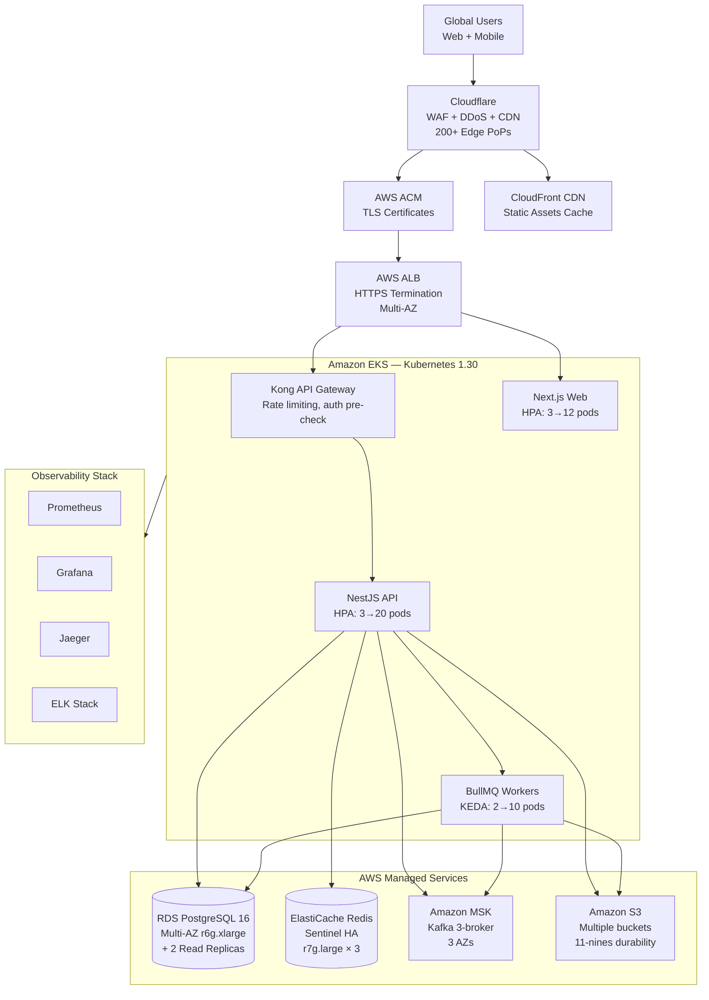

### 20.2 Kubernetes Architecture

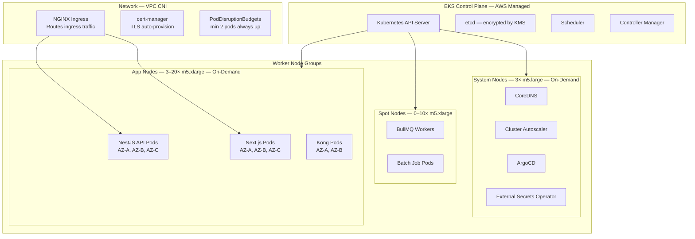

### 20.3 Network Architecture

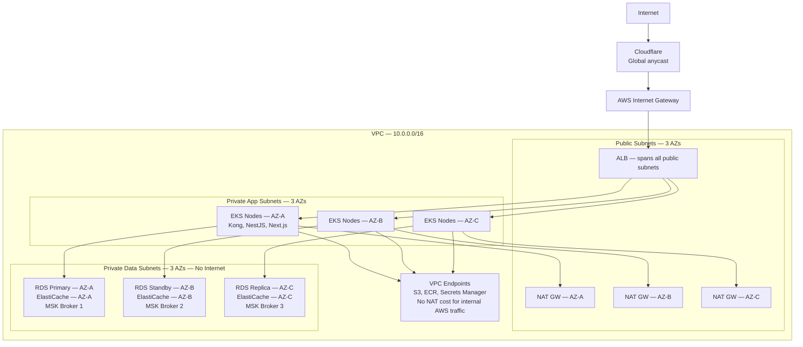

### 20.4 Production Deployment Architecture

```mermaid
sequenceDiagram
    participant Dev2 as Developer
    participant GH2 as GitHub Actions CI
    participant ECR2 as Amazon ECR
    participant ArgoCD3 as ArgoCD
    participant EKS2 as EKS Kubernetes
    participant Smoke2 as Smoke Tests

    Dev2->>GH2: git push → merge to main
    GH2->>GH2: Build Docker image\n(multi-stage; Trivy scan)
    GH2->>ECR2: Push image\n(tag: git-sha)
    GH2->>GH2: Update image tag in\nkubernetes/overlays/prod/kustomization.yaml
    GH2->>GH2: git commit + push to infra repo
    ArgoCD3->>GH2: Poll infra repo every 3 min\nDetect new commit
    ArgoCD3->>EKS2: Apply updated manifests\n(kubectl apply via ArgoCD)
    EKS2->>EKS2: Rolling update\nmaxSurge=1, maxUnavailable=0\n(zero-downtime)
    EKS2->>EKS2: Health probes validate\nnew pod readiness
    EKS2-->>ArgoCD3: Sync status: Healthy
    ArgoCD3->>Smoke2: Trigger smoke tests
    Smoke2-->>ArgoCD3: All 6 checks pass
    ArgoCD3-->>Dev2: Deployment complete ✅
```

### 20.5 Disaster Recovery Architecture

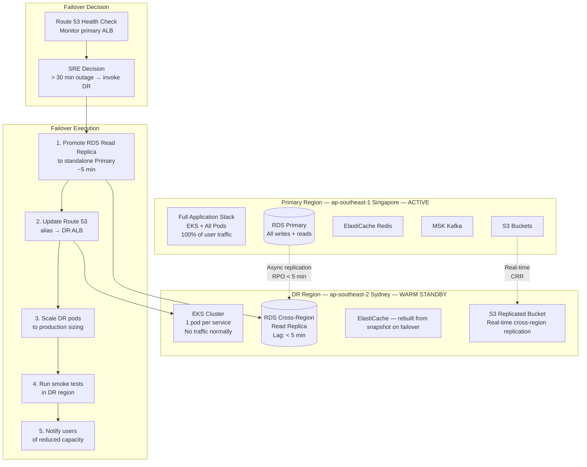

---

## APPENDIX A — CLOUD ARCHITECTURE QUICK REFERENCE

```
Primary Cloud:       AWS — ap-southeast-1 (Singapore)
DR Region:           AWS — ap-southeast-2 (Sydney)
Compute:             EKS 1.30; m5.xlarge app nodes; r6g.xlarge (Graviton) DB
Database:            RDS PostgreSQL 16; Multi-AZ; db.r6g.xlarge; 35-day PITR
Cache:               ElastiCache Redis 7 Sentinel; cache.r7g.large × 3 AZs
Messaging:           Amazon MSK Kafka 3.6; 3 brokers; 3 AZs
Storage:             S3; 5 buckets; lifecycle policies; WORM lock for backups
CDN:                 Cloudflare (global) + CloudFront (AWS-native)
Secrets:             AWS Secrets Manager + KMS; External Secrets Operator
IaC:                 Terraform 1.8; remote state in S3 + DynamoDB lock
GitOps:              ArgoCD; Git-driven cluster reconciliation
Autoscaling:         HPA (pods) + Cluster Autoscaler (nodes) + KEDA (workers)
HA:                  3 AZs; Pod Disruption Budgets; minAvailable: 2
RTO:                 < 10 min (AZ) | < 60 min (region)
RPO:                 0 (AZ) | < 5 min (region)
Uptime SLA:          99.9% (< 8.7 hours/year)
Cost Strategy:       On-Demand + Spot mix; Graviton instances; S3 tiering
```

## APPENDIX B — OPERATIONAL RUNBOOKS INDEX

```
DR-001:   Regional failover procedure (activate DR region)
DR-002:   RDS point-in-time recovery procedure
DR-003:   Redis cache rebuild from snapshot
OPS-001:  EKS node group scaling (emergency scale-up)
OPS-002:  Rolling deployment rollback (kubectl rollout undo)
OPS-003:  Database connection pool exhaustion response
OPS-004:  Kubernetes pod crash loop investigation
OPS-005:  Kafka consumer lag alert response
SEC-001:  Credentials rotation emergency procedure
SEC-002:  Security incident — network isolation procedure
COST-001: Monthly right-sizing review procedure
COST-002: Spot instance interruption response
```

---

*End of Cloud Infrastructure Foundation & Production Architecture Strategy*  
*Document maintained by: Principal Cloud Architect, DevOps Architect & Site Reliability Engineer | Status: Approved Cloud Infrastructure Foundation & Production Architecture Specification — RESTRICTED DISTRIBUTION*
