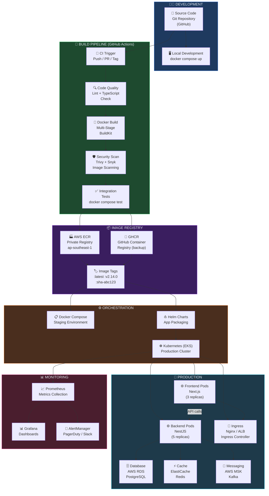
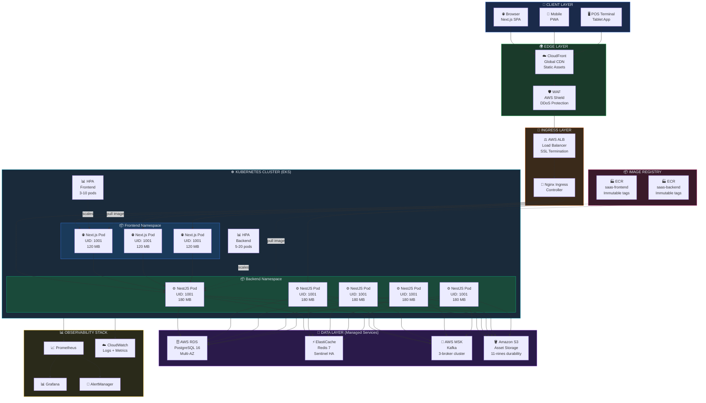
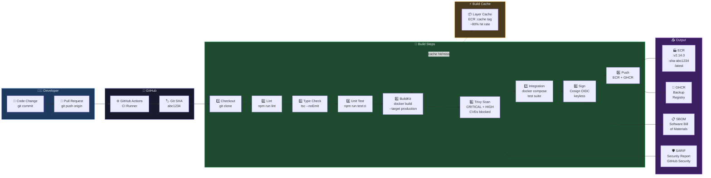
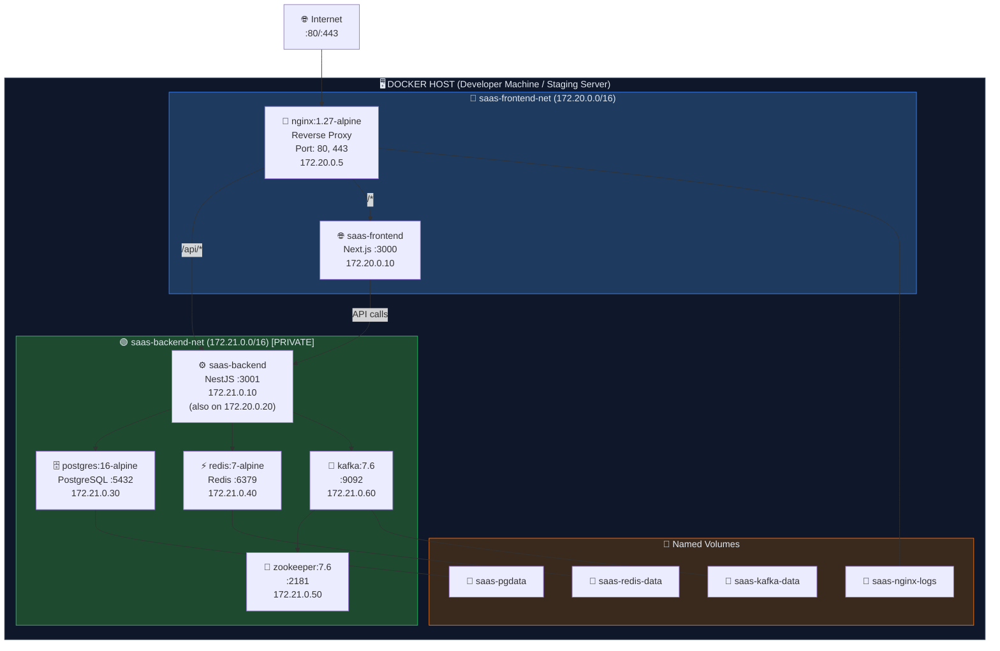
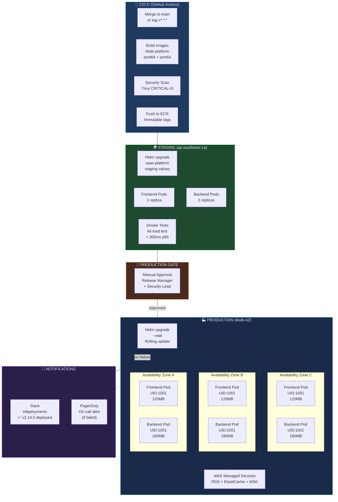
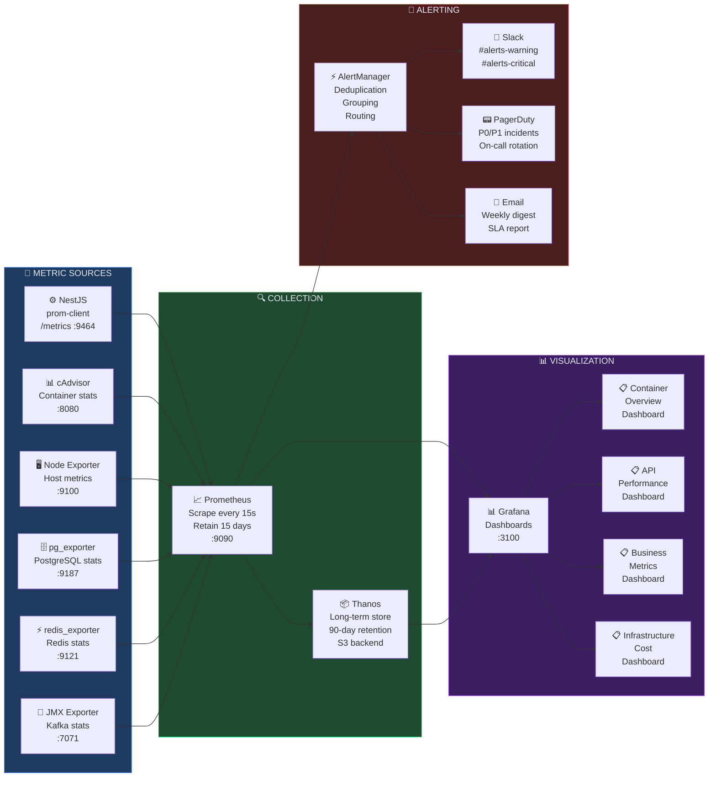

# DOCKER CONTAINER ARCHITECTURE & PRODUCTION CONTAINERIZATION STRATEGY

**Project Name:** Enterprise SaaS Business Management Platform  
**Document Version:** 1.0.0 — Baseline Standard  
**Date:** July 14, 2026  
**Authors:** Principal DevOps Engineer, Docker Specialist, Container Security Engineer, Cloud Native Architect, Kubernetes Engineer & Enterprise SaaS Infrastructure Architect  
**Classification:** Enterprise Internal — Restricted (Infrastructure Sensitive)  
**Status:** 🐳 APPROVED DOCKER CONTAINER ARCHITECTURE & PRODUCTION CONTAINERIZATION SPECIFICATION  

---

## TABLE OF CONTENTS

| Section | Title | Description |
| :---: | :--- | :--- |
| **§1** | [Containerization Foundation](#section-1--containerization-foundation) | Traditional vs. container deployment model |
| **§2** | [Docker Architecture](#section-2--docker-architecture) | Core Docker engine components & responsibilities |
| **§3** | [Container Platform Architecture](#section-3--container-platform-architecture) | End-to-end platform design & Mermaid diagrams |
| **§4** | [Docker Project Structure](#section-4--docker-project-structure) | Repository layout & Dockerfile organization |
| **§5** | [Dockerfile Best Practices](#section-5--dockerfile-best-practices) | Layering, caching, security, and optimization |
| **§6** | [Multi-Stage Build Strategy](#section-6--multi-stage-build-strategy) | Development → Build → Production stages |
| **§7** | [Frontend Containerization](#section-7--frontend-containerization) | Next.js production container (Standalone mode) |
| **§8** | [Backend Containerization](#section-8--backend-containerization) | NestJS production container (TypeScript compile) |
| **§9** | [Database Container Strategy](#section-9--database-container-strategy) | PostgreSQL container vs. managed RDS decision |
| **§10** | [Docker Compose Architecture](#section-10--docker-compose-architecture) | Full local + staging Compose orchestration |
| **§11** | [Container Networking](#section-11--container-networking) | Network topology, isolation & communication |
| **§12** | [Container Storage](#section-12--container-storage) | Volumes, mounts, data persistence strategy |
| **§13** | [Environment Configuration](#section-13--environment-configuration) | Dev / Test / Prod config & secret management |
| **§14** | [Container Security](#section-14--container-security) | Non-root, image scanning, secret protection |
| **§15** | [Docker Image Management](#section-15--docker-image-management) | Registry strategy, tagging, lifecycle policy |
| **§16** | [Container CI/CD Pipeline](#section-16--container-cicd-pipeline) | Build → Scan → Push → Deploy automation |
| **§17** | [Production Container Deployment](#section-17--production-container-deployment) | Compose prod vs. Kubernetes vs. ECS comparison |
| **§18** | [Container Monitoring](#section-18--container-monitoring) | Metrics, logs, health checks, alerting |
| **§19** | [Container Governance](#section-19--container-governance) | Naming standards, versioning, review lifecycle |
| **§20** | [Final Container Architecture](#section-20--final-container-architecture) | Master Mermaid architecture diagrams |

---

## SECTION 1 — CONTAINERIZATION FOUNDATION

### 1.1 The Problem with Traditional Deployment

Before containers, deploying software meant coupling application code tightly to the underlying server's operating system, runtime versions, and system libraries. This produced one of software engineering's most persistent problems: **"it works on my machine."**

```
TRADITIONAL DEPLOYMENT MODEL
═══════════════════════════════════════════════════════════════════════════════
┌─────────────────────────────────────────────────────────────────────────────┐
│  DEVELOPER MACHINE          │  STAGING SERVER         │  PRODUCTION SERVER  │
│  ─────────────────          │  ──────────────          │  ─────────────────  │
│  Node.js 18.12.0            │  Node.js 16.4.0          │  Node.js 20.0.0     │
│  npm 8.19.2                 │  npm 7.10.0              │  npm 9.6.1          │
│  glibc 2.35                 │  glibc 2.31              │  glibc 2.36         │
│  Ubuntu 22.04               │  CentOS 7                │  RHEL 8             │
│                             │                          │                     │
│  App runs perfectly ✅      │  Crashes on npm ci ❌    │  Segfault on start ❌│
└─────────────────────────────────────────────────────────────────────────────┘

Problems:
  ✗  Runtime version mismatch causes unpredictable crashes
  ✗  System library differences break native addons (bcrypt, sharp, etc.)
  ✗  "Works on my machine" cannot be reproduced across environments
  ✗  Server provisioning takes hours — manual, error-prone, undocumented
  ✗  Scaling requires full server provision + manual install (hours or days)
  ✗  Rollback means restoring a snapshot or re-running provisioning scripts
  ✗  Multiple services compete for the same OS-level dependencies
  ✗  No isolation: one misbehaving service can consume all server resources
═══════════════════════════════════════════════════════════════════════════════
```

### 1.2 The Container Deployment Model

Containers solve this by packaging the application **together with its runtime environment** into a single immutable, portable unit — the **container image**.

```
CONTAINER DEPLOYMENT MODEL
═══════════════════════════════════════════════════════════════════════════════
┌──────────────────────────────────────────────────────────────────────────┐
│                          CONTAINER IMAGE                                  │
│  ┌────────────────────────────────────────────────────────────────────┐  │
│  │                        APPLICATION CODE                            │  │
│  │   src/  dist/  package.json  .env.example  public/  node_modules/  │  │
│  ├────────────────────────────────────────────────────────────────────┤  │
│  │                       RUNTIME ENVIRONMENT                          │  │
│  │   Node.js 20.14.0  npm 10.7.0  OpenSSL 3.x  glibc 2.36           │  │
│  ├────────────────────────────────────────────────────────────────────┤  │
│  │                         BASE OS LAYER                              │  │
│  │   Alpine Linux 3.19  /bin/sh  /usr/lib  coreutils  ca-certs       │  │
│  └────────────────────────────────────────────────────────────────────┘  │
└──────────────────────────────────────────────────────────────────────────┘
                                    ↓
              ┌─────────────────────────────────────────┐
              │           CONTAINER RUNTIME             │
              │   (Docker Engine / containerd / runc)   │
              └─────────────────────────────────────────┘
                                    ↓
         ┌──────────────────────────────────────────────────────┐
         │                   HOST OPERATING SYSTEM              │
         │      (Ubuntu 22.04 / Amazon Linux 2023 / RHEL 9)    │
         └──────────────────────────────────────────────────────┘

Result:
  ✅  Identical runtime on every machine — dev, CI, staging, production
  ✅  Fast startup — seconds, not minutes
  ✅  Horizontal scale — clone a container in < 1 second
  ✅  Immutable — an image SHA never changes after build
  ✅  Rollback — switch to a previous image tag instantly
  ✅  Isolation — CPU, memory, network, filesystem namespaces
═══════════════════════════════════════════════════════════════════════════════
```

### 1.3 Containerization Benefits Summary

| Benefit | Traditional Deployment | Container Deployment |
| :--- | :--- | :--- |
| **Environment Consistency** | Varies per server; manual config | Identical image in every environment |
| **Startup Speed** | 5–30 minutes provisioning | 1–10 seconds container start |
| **Horizontal Scaling** | Hours: provision → install → configure | Seconds: `docker run` or Kubernetes Pod |
| **Rollback** | Snapshot restoration (disruptive) | Atomic image tag swap (zero-downtime) |
| **Resource Isolation** | Process-level (no hard limits) | cgroup-enforced CPU/memory limits |
| **Dependency Conflicts** | Services share OS library versions | Each service has its own isolated libs |
| **Infrastructure as Code** | Provisioning scripts (Ansible, Chef) | Dockerfile + docker-compose.yml |
| **CI/CD Integration** | Complex; server-specific scripts | Portable; build once, run anywhere |
| **Local Dev Parity** | "Works on my machine" | Exact production environment locally |
| **Image Size Optimization** | Entire server OS (GBs) | Minimal Alpine image (50–150 MB) |
| **Security Surface** | Full OS exposed per service | Minimal attack surface per container |

### 1.4 Container vs. Virtual Machine

```
CONTAINER vs. VM ARCHITECTURE COMPARISON
═══════════════════════════════════════════════════════════════════════════════

  VIRTUAL MACHINES                      CONTAINERS
  ────────────────                      ──────────
  ┌────┐  ┌────┐  ┌────┐               ┌────┐  ┌────┐  ┌────┐
  │App1│  │App2│  │App3│               │App1│  │App2│  │App3│
  ├────┤  ├────┤  ├────┤               ├────┤  ├────┤  ├────┤
  │Bin/│  │Bin/│  │Bin/│               │Lib/│  │Lib/│  │Lib/│
  │Lib │  │Lib │  │Lib │               └────┘  └────┘  └────┘
  ├────┤  ├────┤  ├────┤               ┌──────────────────────┐
  │OS  │  │OS  │  │OS  │               │  Container Engine    │
  ├────┤  ├────┤  ├────┤               │  (Docker/containerd) │
  │Hypervisor (VMware/KVM/Hyper-V)│    ├──────────────────────┤
  └──────────────────────────────┘    │   Host OS Kernel     │
                                       └──────────────────────┘

  Weight:   1–20 GB per VM             10–500 MB per image
  Boot:     30–120 seconds             1–5 seconds
  Density:  5–20 VMs per host          50–500 containers per host
  Isolation: Full kernel isolation     Process namespace isolation
  Overhead:  High (full OS per VM)     Near-zero (shared kernel)

  Conclusion: Containers are lighter, faster, and more portable than VMs.
  VMs are better for hard multi-tenant isolation (cloud providers use both).
═══════════════════════════════════════════════════════════════════════════════
```

---

## SECTION 2 — DOCKER ARCHITECTURE

### 2.1 Docker Engine Architecture

Docker Engine is the client-server application that builds, runs, and manages containers. It consists of three major components working in concert.

```
DOCKER ENGINE ARCHITECTURE
═══════════════════════════════════════════════════════════════════════════════

  USER INTERFACE
  ┌──────────────────────────────────────────────────────────────────┐
  │  CLI: docker build  docker run  docker push  docker compose up   │
  │  API: REST API (Unix socket: /var/run/docker.sock)               │
  └────────────────────────────┬─────────────────────────────────────┘
                               │  REST API calls
  DOCKER DAEMON (dockerd)      ↓
  ┌──────────────────────────────────────────────────────────────────┐
  │  Image Management     ·  Build Context Processor                 │
  │  Container Lifecycle  ·  Volume Manager                          │
  │  Network Manager      ·  Plugin Manager                          │
  └────────────────────────────┬─────────────────────────────────────┘
                               │  OCI calls
  CONTAINER RUNTIME            ↓
  ┌──────────────────────────────────────────────────────────────────┐
  │  containerd (high-level runtime)                                 │
  │    └── runc (low-level OCI runtime: cgroups + namespaces)        │
  └──────────────────────────────────────────────────────────────────┘

═══════════════════════════════════════════════════════════════════════════════
```

### 2.2 Core Docker Components

#### 2.2.1 Docker Image

An **image** is a read-only, layered filesystem snapshot. Each instruction in a Dockerfile creates a new layer. Images are immutable — once built with a given SHA256 digest, they never change.

```
DOCKER IMAGE LAYER STRUCTURE
─────────────────────────────────────────────────────────────────────────────
Layer 6 (top):  COPY dist/ /app/dist/               ←  application code
Layer 5:        COPY package*.json ./ && npm ci      ←  production deps
Layer 4:        RUN addgroup -S app && adduser -S app←  non-root user
Layer 3:        WORKDIR /app                         ←  working directory
Layer 2:        node:20-alpine (Node.js runtime)     ←  runtime layer
Layer 1 (base): alpine:3.19 (5 MB)                  ←  OS base layer
─────────────────────────────────────────────────────────────────────────────
Key Properties:
  ·  Each layer is content-addressed (SHA256 hash)
  ·  Layers are shared between images (layer cache efficiency)
  ·  Only changed layers are re-downloaded on pull
  ·  Union filesystem (OverlayFS) merges layers at runtime
```

#### 2.2.2 Docker Container

A **container** is a running instance of an image with an additional writable layer (the container layer) on top of the read-only image layers. Containers are isolated via Linux kernel namespaces and cgroups.

```
CONTAINER ISOLATION MECHANISMS
─────────────────────────────────────────────────────────────────────────────
Namespace Type    │  Isolation Provided
──────────────────┼──────────────────────────────────────────────────────────
pid               │  Process ID isolation — container can't see host PIDs
net               │  Network stack isolation — private IP, ports, routing
mnt               │  Filesystem mount isolation — private filesystem view
uts               │  Hostname isolation — container has its own hostname
ipc               │  IPC isolation — shared memory, semaphores
user              │  UID/GID mapping — container root ≠ host root
──────────────────┼──────────────────────────────────────────────────────────
cgroup Resource   │  Enforcement Provided
──────────────────┼──────────────────────────────────────────────────────────
cpu               │  CPU time limits and scheduling weight
memory            │  Memory + swap hard limits
blkio             │  Block I/O rate limiting
network           │  Network bandwidth throttling
```

#### 2.2.3 Docker Registry

A **registry** stores and distributes Docker images. Images are identified by a reference: `registry/repository:tag@sha256:digest`.

```
IMAGE REFERENCE ANATOMY
─────────────────────────────────────────────────────────────────────────────
gcr.io / myorg / saas-backend : v2.14.0 @ sha256:abc123...
  ↑          ↑         ↑          ↑              ↑
Registry   Org/Org  Repository  Tag            Digest (immutable)
─────────────────────────────────────────────────────────────────────────────
```

| Registry | Type | Use Case | Auth Model |
| :--- | :--- | :--- | :--- |
| **Docker Hub** | Public/Private | Open source, small teams | Docker ID |
| **AWS ECR** | Private | Production on AWS | IAM roles |
| **GitHub Container Registry (GHCR)** | Private | OSS + CI/CD via GitHub Actions | PAT / OIDC |
| **Google Artifact Registry** | Private | GCP workloads | Workload Identity |
| **Azure Container Registry (ACR)** | Private | Azure workloads | Managed Identity |
| **Self-hosted (Harbor)** | Private | Air-gapped / enterprise | LDAP / OIDC |

#### 2.2.4 Docker Volume

**Volumes** are the preferred mechanism for persisting data beyond a container's lifecycle. They are managed by the Docker daemon and stored outside the container's writable layer.

```
VOLUME TYPES
─────────────────────────────────────────────────────────────────────────────
Type            │  Mount Syntax                     │  Use Case
────────────────┼───────────────────────────────────┼────────────────────────
Named Volume    │  -v pgdata:/var/lib/postgresql    │  DB data persistence
Bind Mount      │  -v ./src:/app/src                │  Dev hot-reload
tmpfs Mount     │  --tmpfs /tmp                     │  Sensitive temp data
Anonymous Vol   │  VOLUME /app/uploads              │  Ephemeral scratch
```

#### 2.2.5 Docker Network

Docker's software-defined networking enables containers to communicate securely across a virtual network fabric.

```
DOCKER NETWORK DRIVERS
─────────────────────────────────────────────────────────────────────────────
Driver      │  Description                              │  Use Case
────────────┼───────────────────────────────────────────┼────────────────────
bridge      │  Default; isolated network on host        │  Compose services
host        │  Container shares host network namespace  │  Performance-critical
overlay     │  Multi-host Docker Swarm networking       │  Swarm mode
macvlan     │  Container gets MAC + IP on LAN           │  Legacy integration
none        │  No network — completely isolated         │  Batch processing
ipvlan      │  Shares MAC, unique IP on LAN             │  High-density hosts
```

#### 2.2.6 Docker Compose

Docker Compose is a tool for defining and running multi-container applications. A `docker-compose.yml` file declares all services, networks, and volumes for a complete application stack.

```yaml
# Declarative multi-service application definition
services:
  backend:   { build: ./backend,  ports: ["3001:3001"] }
  frontend:  { build: ./frontend, ports: ["3000:3000"] }
  postgres:  { image: postgres:16-alpine }
  redis:     { image: redis:7-alpine }
  kafka:     { image: confluentinc/cp-kafka:7.6.0 }
```

---

## SECTION 3 — CONTAINER PLATFORM ARCHITECTURE

### 3.1 Platform Overview

The container platform is the end-to-end system that transforms developer source code into a running production service. It spans five distinct phases: Source, Build, Registry, Orchestration, and Production.

### 3.2 Container Platform Architecture Diagram



### 3.3 Platform Component Responsibilities

| Component | Technology | Responsibility | Owner |
| :--- | :--- | :--- | :--- |
| **Source Control** | GitHub | Version control, branch strategy, PR reviews | Engineering |
| **CI Engine** | GitHub Actions | Automated build, test, scan on every push | DevOps |
| **Build Tool** | Docker BuildKit | Efficient multi-stage image construction | DevOps |
| **Security Scanner** | Trivy + Snyk | CVE scanning of images and dependencies | Security |
| **Image Registry** | AWS ECR (primary) | Immutable image storage and distribution | DevOps |
| **Staging Orchestrator** | Docker Compose | Pre-production validation environment | DevOps |
| **Production Orchestrator** | Kubernetes (EKS) | Automated scaling, healing, rolling deploys | Platform |
| **Package Manager** | Helm | Kubernetes application lifecycle management | Platform |
| **Ingress** | Nginx / AWS ALB | TLS termination, load balancing, routing | Platform |
| **Observability** | Prometheus + Grafana | Metrics, dashboards, alerting | SRE |

---

## SECTION 4 — DOCKER PROJECT STRUCTURE

### 4.1 Repository Layout

The Docker-related files follow a **co-location** strategy: each service owns its Dockerfile alongside its source code, while shared infrastructure configurations live at the project root.

```
saas-platform/                              # Repository root
│
├── frontend/                               # Next.js application
│   ├── src/                                # Application source
│   │   ├── app/                            # Next.js App Router pages
│   │   ├── components/                     # React components
│   │   ├── lib/                            # Utilities, API clients
│   │   └── styles/                         # Global CSS
│   ├── public/                             # Static assets
│   ├── Dockerfile                          # Multi-stage Next.js Dockerfile
│   ├── .dockerignore                       # Files excluded from build context
│   ├── next.config.ts                      # Next.js config (output: standalone)
│   ├── package.json
│   └── tsconfig.json
│
├── backend/                                # NestJS application
│   ├── src/                                # Application source
│   │   ├── modules/                        # Feature modules
│   │   ├── common/                         # Shared utilities, guards, pipes
│   │   ├── config/                         # Configuration service
│   │   └── main.ts                         # Application entry point
│   ├── test/                               # E2E tests
│   ├── Dockerfile                          # Multi-stage NestJS Dockerfile
│   ├── .dockerignore                       # Files excluded from build context
│   ├── package.json
│   └── tsconfig.json
│
├── docker/                                 # Shared Docker configurations
│   ├── nginx/                              # Nginx reverse proxy
│   │   ├── nginx.conf                      # Main Nginx configuration
│   │   ├── default.conf                    # Server block configuration
│   │   └── ssl/                            # TLS certificates (dev only)
│   │       ├── cert.pem
│   │       └── key.pem
│   ├── postgres/                           # Database initialization
│   │   ├── init/
│   │   │   ├── 01-create-databases.sql     # Schema initialization
│   │   │   └── 02-seed-roles.sql           # Initial RBAC seed data
│   │   └── postgresql.conf                 # Custom PostgreSQL settings
│   ├── redis/
│   │   └── redis.conf                      # Redis configuration
│   └── kafka/
│       └── server.properties               # Kafka broker settings
│
├── scripts/                                # Automation scripts
│   ├── docker-build.sh                     # Build all images with proper tags
│   ├── docker-push.sh                      # Push images to registry
│   ├── docker-scan.sh                      # Trivy security scan runner
│   ├── docker-clean.sh                     # Remove dangling images/volumes
│   ├── health-check.sh                     # Container health verification
│   └── rotate-secrets.sh                   # Secret rotation helper
│
├── .env.example                            # Template with all variable names (no values)
├── .env.development                        # Development overrides (committed, no secrets)
├── .env.staging                            # Staging config template
├── .env.production.example                 # Production template (never commit real values)
├── docker-compose.yml                      # Base compose (all services)
├── docker-compose.override.yml             # Development overrides (hot-reload)
├── docker-compose.staging.yml              # Staging overrides
├── docker-compose.production.yml           # Production-like local validation
├── docker-compose.test.yml                 # CI test environment
├── .dockerignore                           # Root-level global ignore rules
└── Makefile                                # Developer convenience commands
```

### 4.2 Makefile Developer Interface

The Makefile provides a human-friendly interface to complex Docker operations, reducing the cognitive load on developers and ensuring consistent command execution.

```makefile
# Makefile — Developer convenience interface for Docker operations

.PHONY: help up down build rebuild logs shell clean test scan push

# ─── Help ──────────────────────────────────────────────────────────────────
help:
	@echo ""
	@echo "  SaaS Platform — Docker Commands"
	@echo "  ──────────────────────────────────────────────────"
	@echo "  make up        Start all services (development)"
	@echo "  make down      Stop and remove all containers"
	@echo "  make build     Build all images"
	@echo "  make rebuild   Force rebuild (no cache)"
	@echo "  make logs      Follow container logs"
	@echo "  make shell     Open shell in backend container"
	@echo "  make clean     Remove images, volumes, networks"
	@echo "  make test      Run test suite in Docker"
	@echo "  make scan      Run Trivy security scan"
	@echo "  make push      Tag and push images to ECR"
	@echo ""

# ─── Development Lifecycle ─────────────────────────────────────────────────
up:
	docker compose up -d

down:
	docker compose down

build:
	docker compose build

rebuild:
	docker compose build --no-cache --pull

logs:
	docker compose logs -f --tail=100

# ─── Shell Access ───────────────────────────────────────────────────────────
shell-backend:
	docker compose exec backend sh

shell-frontend:
	docker compose exec frontend sh

shell-postgres:
	docker compose exec postgres psql -U saas_user -d saas_db

shell-redis:
	docker compose exec redis redis-cli

# ─── Database Operations ────────────────────────────────────────────────────
db-migrate:
	docker compose exec backend npm run migration:run

db-seed:
	docker compose exec backend npm run seed:run

db-reset:
	docker compose exec backend npm run schema:drop && \
	docker compose exec backend npm run migration:run && \
	docker compose exec backend npm run seed:run

# ─── Testing ────────────────────────────────────────────────────────────────
test:
	docker compose -f docker-compose.test.yml up --abort-on-container-exit

test-unit:
	docker compose exec backend npm run test

test-e2e:
	docker compose exec backend npm run test:e2e

# ─── Security ───────────────────────────────────────────────────────────────
scan:
	./scripts/docker-scan.sh

# ─── Registry Operations ────────────────────────────────────────────────────
push:
	./scripts/docker-push.sh $(VERSION)

# ─── Cleanup ────────────────────────────────────────────────────────────────
clean:
	docker compose down -v --remove-orphans
	docker image prune -f
	docker volume prune -f

prune-all:
	docker system prune -af --volumes
```

### 4.3 `.dockerignore` File (Root)

```dockerignore
# .dockerignore — Root level (applies to all services via build context)

# Version control
.git
.gitignore
.github

# Documentation
docs/
*.md
README.md
CHANGELOG.md

# IDE and editor files
.vscode/
.idea/
*.swp
*.swo
.DS_Store

# Environment files (CRITICAL: never include secrets in image)
.env
.env.*
!.env.example

# Development tools
.eslintrc*
.prettierrc*
jest.config.*
*.test.ts
*.spec.ts
__tests__/
test/
tests/

# Build artifacts (will be rebuilt in container)
node_modules/
dist/
build/
.next/
coverage/
.nyc_output/

# Docker files (prevent recursion)
Dockerfile*
docker-compose*
.dockerignore

# CI/CD
.github/
.gitlab-ci.yml
Jenkinsfile

# Logs
*.log
logs/
npm-debug.log*
yarn-debug.log*
```

---

## SECTION 5 — DOCKERFILE BEST PRACTICES

### 5.1 Dockerfile Instruction Order Principles

Layer ordering in a Dockerfile is the single most impactful factor for **build cache efficiency** and **image size**. Instructions that change infrequently must appear before instructions that change often.

```
DOCKERFILE LAYER ORDERING STRATEGY
═══════════════════════════════════════════════════════════════════════════════

OPTIMAL ORDER (cache-friendly):            ANTI-PATTERN ORDER (cache-busting):
─────────────────────────────────          ────────────────────────────────────
FROM base-image                            FROM base-image
  ↓  [RARELY changes]                      ↓
RUN install-system-packages                COPY . /app         ← COPY ALL FIRST
  ↓  [Rarely changes]                      ↓                     Every code change
WORKDIR /app                               RUN npm install     ← BUSTS CACHE HERE
  ↓  [Never changes]                       ↓                     Full reinstall
COPY package*.json ./                      RUN npm run build   ← every time
  ↓  [Changes rarely]
RUN npm ci --frozen-lockfile
  ↓  [Changes on package.json update]     npm ci runs ONLY when package.json
COPY . .                                   or package-lock.json changes.
  ↓  [Changes on every commit]             Code changes don't trigger reinstall.
RUN npm run build
  ↓  [Changes on every commit]
CMD ["node", "dist/main.js"]

Result: npm ci only re-runs when dependencies change, saving 60-120 seconds/build
═══════════════════════════════════════════════════════════════════════════════
```

### 5.2 Dockerfile Best Practices Reference

| Practice | Why | Implementation |
| :--- | :--- | :--- |
| **Pin exact base image tags** | Reproducible builds; prevents upstream breakage | `FROM node:20.14.0-alpine3.19` not `node:latest` |
| **Use Alpine or Distroless** | Minimal attack surface; smaller image size | Alpine: ~5 MB; Distroless: ~2 MB |
| **Combine RUN commands** | Reduce layer count; avoid intermediate layer bloat | `RUN apt-get update && apt-get install -y pkg && rm -rf /var/lib/apt/lists/*` |
| **Copy package files first** | Leverage build cache for `npm install` | `COPY package*.json ./` before `COPY . .` |
| **Use `npm ci` not `npm install`** | Deterministic installs from lockfile | `RUN npm ci --frozen-lockfile` |
| **Non-root user** | Security: container escape doesn't give host root | `RUN addgroup -S app && adduser -S app -G app` |
| **Use `.dockerignore`** | Exclude irrelevant files; speed up build context | Exclude `node_modules/`, `.git/`, `.env` |
| **Health check instruction** | Orchestrators know when container is ready | `HEALTHCHECK --interval=30s CMD curl -f http://localhost:3001/health` |
| **Set `NODE_ENV=production`** | Skip devDependencies; enable optimizations | `ENV NODE_ENV=production` |
| **Use `COPY` not `ADD`** | `ADD` has unintended URL fetch / tar extraction | Only use `ADD` for fetching URLs or tar extraction |
| **Avoid secrets in ENV** | `ENV` values appear in `docker inspect` | Use Docker secrets or runtime injection |
| **Label images** | Traceability; compliance; automated tooling | `LABEL org.opencontainers.image.version="2.14.0"` |
| **Use multi-stage builds** | Exclude build toolchain from runtime image | Builder stage + production stage |

### 5.3 Security-Hardened Dockerfile Template

```dockerfile
# ─────────────────────────────────────────────────────────────────────────────
# Dockerfile Security Template — Enterprise Standards
# SaaS Business Management Platform
# ─────────────────────────────────────────────────────────────────────────────

# === STAGE: Base ============================================================
# Shared base configuration applied to all stages
# ============================================================================
FROM node:20.14.0-alpine3.19 AS base

# OCI Standard Labels — enables automated tooling, auditing, compliance
LABEL org.opencontainers.image.title="SaaS Platform Backend"
LABEL org.opencontainers.image.vendor="Enterprise SaaS Platform"
LABEL org.opencontainers.image.licenses="Proprietary"

# Security: Install only necessary system packages
# Clean up in the SAME RUN to prevent caching the package index in a layer
RUN apk add --no-cache \
    dumb-init \          
    # PID 1 signal handler (graceful shutdown)
    curl \               
    # Health check dependency only
    && apk cache clean

# Security: Create non-root user and group
# -S: system user (no password, no home dir by default)
# -G: assign to group
RUN addgroup --system --gid 1001 appgroup \
 && adduser  --system --uid  1001 --ingroup appgroup --no-create-home appuser

# Set working directory
WORKDIR /app

# Security: Do NOT run as root after this point
USER appuser
```

---

## SECTION 6 — MULTI-STAGE BUILD STRATEGY

### 6.1 Multi-Stage Build Concept

A multi-stage Dockerfile uses multiple `FROM` statements, each beginning a new build stage. Only the **final stage** is shipped as the production image — all intermediate stages are discarded, keeping the runtime image lean, secure, and free of build toolchain artifacts.

```
MULTI-STAGE BUILD FLOW
═══════════════════════════════════════════════════════════════════════════════

Stage 1: deps                   Stage 2: builder              Stage 3: production
─────────────────               ─────────────────             ────────────────────
FROM node:20-alpine             FROM deps AS builder          FROM node:20-alpine

Install ALL deps                Copy source code              Non-root user setup
  (dev + prod)                  Run TypeScript compile        Copy ONLY dist/
                                Run tests (optional)          Copy prod node_modules
                                Generate dist/                Set health check
                                                              Set CMD

  ↑ Includes:                     ↑ Includes:                   ↑ Ships ONLY:
  typescript                      src/ tsconfig.json            dist/ (compiled JS)
  @types/* (1000+ files)          *.spec.ts test files          node_modules/ (prod)
  eslint / prettier               build tools                   ca-certificates
  jest / ts-jest                                                dumb-init

  ~800 MB                         ~850 MB                       ~180 MB (final)
═══════════════════════════════════════════════════════════════════════════════

Benefits:
  ✅  Smaller Image:   800 MB → 180 MB (78% reduction)
  ✅  Better Security: No TypeScript compiler, build tools, or test code in prod
  ✅  Faster Deploy:   Smaller image = faster pull from registry to node
  ✅  Clear Stages:    Developer, build, production concerns separated
  ✅  Layer Caching:   deps stage cached unless package.json changes
```

### 6.2 Multi-Stage Benefits Quantified

| Metric | Single Stage | Multi-Stage | Improvement |
| :--- | :--- | :--- | :--- |
| **Final Image Size** | ~850 MB | ~180 MB | **79% reduction** |
| **Pull Time (1 Gbps)** | ~6.8 seconds | ~1.4 seconds | **5x faster** |
| **Attack Surface** | Full build toolchain | Runtime only | **Minimal** |
| **CVE Exposure** | Includes dev packages | Production packages only | **Significantly reduced** |
| **Cold Start** | Slower (larger image) | Faster (smaller image) | **Improved startup** |
| **Registry Storage** | High | Low | **Cost reduced** |

---

## SECTION 7 — FRONTEND CONTAINERIZATION

### 7.1 Next.js Containerization Strategy

Next.js provides a **standalone output mode** that creates a fully self-contained server bundle — eliminating the need for `node_modules/` in the production container and dramatically reducing image size.

```typescript
// next.config.ts — Required for minimal container output
const nextConfig: NextConfig = {
  output: 'standalone',     // &larr; Produces self-contained server bundle
  poweredByHeader: false,   // &larr; Security: remove X-Powered-By header
  compress: true,           // &larr; Enable gzip compression at app level
};
```

### 7.2 Next.js Build Flow

```
NEXT.JS CONTAINERIZATION FLOW
═══════════════════════════════════════════════════════════════════════════════

Source Code                Build Process               Runtime Image
───────────               ──────────────              ─────────────

src/app/                 Install all deps            /app/.next/standalone/
src/components/   →      Run next build       →      (self-contained server)
public/                  Tree-shake deps             /app/.next/static/
package.json             Generate static             /app/public/
                         Generate routes             node server.js (entry)

                         Stage 1: deps (300MB)
                         Stage 2: builder (500MB)    Final image: ~120MB
                         Stage 3: runner (120MB) &larr;── Ships only this stage
═══════════════════════════════════════════════════════════════════════════════
```

### 7.3 Frontend Dockerfile (Production)

```dockerfile
# ─────────────────────────────────────────────────────────────────────────────
# frontend/Dockerfile
# Next.js Multi-Stage Production Build
# SaaS Business Management Platform
# ─────────────────────────────────────────────────────────────────────────────

# ══════════════════════════════════════════════════════════════════════════════
# STAGE 1: deps — Install ALL dependencies (dev + prod)
# ══════════════════════════════════════════════════════════════════════════════
FROM node:20.14.0-alpine3.19 AS deps

# Install build dependencies needed by native addons
RUN apk add --no-cache libc6-compat

WORKDIR /app

# Copy package manifests first (cache optimization)
COPY package.json package-lock.json ./

# Install ALL dependencies (including devDependencies for build)
RUN npm ci --frozen-lockfile

# ══════════════════════════════════════════════════════════════════════════════
# STAGE 2: builder — Compile Next.js application
# ══════════════════════════════════════════════════════════════════════════════
FROM node:20.14.0-alpine3.19 AS builder

WORKDIR /app

# Copy deps from previous stage
COPY --from=deps /app/node_modules ./node_modules

# Copy source code (changes most frequently — keep last for cache)
COPY . .

# Build-time environment variables (injected via CI, not committed)
# These become embedded in the static bundle — do NOT include secrets
ARG NEXT_PUBLIC_API_URL
ARG NEXT_PUBLIC_APP_VERSION
ARG NEXT_PUBLIC_SENTRY_DSN

ENV NEXT_PUBLIC_API_URL=${NEXT_PUBLIC_API_URL}
ENV NEXT_PUBLIC_APP_VERSION=${NEXT_PUBLIC_APP_VERSION}
ENV NEXT_PUBLIC_SENTRY_DSN=${NEXT_PUBLIC_SENTRY_DSN}
ENV NODE_ENV=production
ENV NEXT_TELEMETRY_DISABLED=1

# Build the Next.js application
# output: standalone mode creates a self-contained server bundle
RUN npm run build

# ══════════════════════════════════════════════════════════════════════════════
# STAGE 3: runner — Minimal production runtime image
# ══════════════════════════════════════════════════════════════════════════════
FROM node:20.14.0-alpine3.19 AS runner

# OCI Labels for traceability
LABEL org.opencontainers.image.title="saas-frontend"
LABEL org.opencontainers.image.description="SaaS Platform Next.js Frontend"
LABEL org.opencontainers.image.vendor="Enterprise SaaS Platform"

# Install only runtime system dependencies
RUN apk add --no-cache dumb-init curl

WORKDIR /app

# Runtime environment
ENV NODE_ENV=production
ENV NEXT_TELEMETRY_DISABLED=1
ENV PORT=3000
ENV HOSTNAME="0.0.0.0"

# Security: create non-root user
RUN addgroup --system --gid 1001 nodejs \
 && adduser  --system --uid  1001 nextjs --ingroup nodejs

# Copy ONLY the standalone output (no node_modules needed)
COPY --from=builder --chown=nextjs:nodejs /app/public            ./public
COPY --from=builder --chown=nextjs:nodejs /app/.next/standalone  ./
COPY --from=builder --chown=nextjs:nodejs /app/.next/static      ./.next/static

# Switch to non-root user
USER nextjs

EXPOSE 3000

# Health check — orchestrators use this to determine readiness
HEALTHCHECK \
    --interval=30s \
    --timeout=10s \
    --start-period=30s \
    --retries=3 \
    CMD curl -f http://localhost:3000/api/health || exit 1

# Use dumb-init as PID 1 for proper signal handling + zombie reaping
ENTRYPOINT ["/usr/bin/dumb-init", "--"]

# Start the standalone Next.js server
CMD ["node", "server.js"]
```

### 7.4 Frontend `.dockerignore`

```dockerignore
# frontend/.dockerignore
node_modules/
.next/
.git/
.env
.env.*
!.env.example
README.md
*.md
.vscode/
.eslintrc*
.prettierrc*
*.test.tsx
*.spec.tsx
__tests__/
coverage/
Dockerfile
.dockerignore
```

---

## SECTION 8 — BACKEND CONTAINERIZATION

### 8.1 NestJS Containerization Strategy

NestJS is a TypeScript framework that must be compiled to JavaScript before deployment. The multi-stage strategy compiles TypeScript in the builder stage and ships only the compiled JavaScript output with production dependencies.

```
NESTJS CONTAINERIZATION FLOW
═══════════════════════════════════════════════════════════════════════════════

Source Code               Build Process               Runtime Image
───────────               ──────────────              ─────────────

src/**/*.ts              Install all deps            /app/dist/       (compiled JS)
src/**/*.spec.ts  →      tsc compile          →      /app/node_modules/(prod only)
package.json             Generate dist/              /app/package.json
tsconfig.json            Prune dev deps              
nest-cli.json            Copy prod modules           Final image: ~180MB

                         Stage 1: deps               
                         Stage 2: builder            Stage 3: production
                         Stage 4: prod-deps  ←───────────────────────────
                                                  Ships only compiled code
                                                  No TypeScript compiler
                                                  No test files
                                                  No devDependencies
═══════════════════════════════════════════════════════════════════════════════
```

### 8.2 Backend Dockerfile (Production)

```dockerfile
# ─────────────────────────────────────────────────────────────────────────────
# backend/Dockerfile
# NestJS Multi-Stage Production Build
# SaaS Business Management Platform
# ─────────────────────────────────────────────────────────────────────────────

# ══════════════════════════════════════════════════════════════════════════════
# STAGE 1: deps — Install ALL dependencies for compilation
# ══════════════════════════════════════════════════════════════════════════════
FROM node:20.14.0-alpine3.19 AS deps

# Alpine build tools for native addons (bcrypt, argon2, sharp)
RUN apk add --no-cache \
    libc6-compat \
    python3 \
    make \
    g++

WORKDIR /app

COPY package.json package-lock.json ./
RUN npm ci --frozen-lockfile

# ══════════════════════════════════════════════════════════════════════════════
# STAGE 2: builder — Compile TypeScript to JavaScript
# ══════════════════════════════════════════════════════════════════════════════
FROM node:20.14.0-alpine3.19 AS builder

WORKDIR /app

# Copy all dependencies (dev + prod) from deps stage
COPY --from=deps /app/node_modules ./node_modules

# Copy source files
COPY . .

# Set build-time environment
ENV NODE_ENV=production

# Compile TypeScript using NestJS CLI build
# Generates /app/dist/ with all compiled JavaScript
RUN npm run build

# ══════════════════════════════════════════════════════════════════════════════
# STAGE 3: prod-deps — Install only production dependencies
# ══════════════════════════════════════════════════════════════════════════════
FROM node:20.14.0-alpine3.19 AS prod-deps

RUN apk add --no-cache libc6-compat python3 make g++

WORKDIR /app

COPY package.json package-lock.json ./

# Install ONLY production dependencies (no TypeScript, Jest, etc.)
RUN npm ci --frozen-lockfile --omit=dev

# ══════════════════════════════════════════════════════════════════════════════
# STAGE 4: production — Minimal runtime image
# ══════════════════════════════════════════════════════════════════════════════
FROM node:20.14.0-alpine3.19 AS production

# OCI Labels
LABEL org.opencontainers.image.title="saas-backend"
LABEL org.opencontainers.image.description="SaaS Platform NestJS Backend API"
LABEL org.opencontainers.image.vendor="Enterprise SaaS Platform"

# Runtime system packages only
RUN apk add --no-cache dumb-init curl

WORKDIR /app

# Runtime configuration
ENV NODE_ENV=production
ENV PORT=3001

# Security: non-root user
RUN addgroup --system --gid 1001 nodejs \
 && adduser  --system --uid  1001 nestjs --ingroup nodejs

# Copy ONLY what's needed for runtime:
# 1. Compiled JavaScript from builder stage
COPY --from=builder     --chown=nestjs:nodejs /app/dist          ./dist
# 2. Production node_modules (no devDeps)
COPY --from=prod-deps   --chown=nestjs:nodejs /app/node_modules  ./node_modules
# 3. Package manifest (needed at runtime for NestJS metadata)
COPY --from=builder     --chown=nestjs:nodejs /app/package.json  ./package.json

# Switch to non-root user
USER nestjs

EXPOSE 3001

# Health check against /health endpoint (NestJS TerminusModule)
HEALTHCHECK \
    --interval=30s \
    --timeout=10s \
    --start-period=60s \
    --retries=3 \
    CMD curl -f http://localhost:3001/health || exit 1

ENTRYPOINT ["/usr/bin/dumb-init", "--"]

# Start the compiled NestJS application
CMD ["node", "dist/main.js"]
```

### 8.3 Backend Image Size Comparison

```
BACKEND IMAGE SIZE ANALYSIS
─────────────────────────────────────────────────────────────────────────────
Image Variant                │  Size      │  Notes
─────────────────────────────┼────────────┼──────────────────────────────────
node:20-bullseye (debian)    │  ~1.1 GB   │  Full OS, all tools
node:20-slim                 │  ~240 MB   │  Reduced debian
node:20-alpine (single)      │  ~850 MB   │  With all deps + devDeps
saas-backend:multi-stage     │  ~180 MB   │  ✅ Our production image
gcr.io/distroless/nodejs20   │  ~130 MB   │  Alternative (no shell)
─────────────────────────────────────────────────────────────────────────────
```

---

## SECTION 9 — DATABASE CONTAINER STRATEGY

### 9.1 Development vs. Production Database Philosophy

Database containers serve **fundamentally different purposes** in development versus production, and the strategy must reflect this.

```
DATABASE DEPLOYMENT DECISION MATRIX
═══════════════════════════════════════════════════════════════════════════════

DEVELOPMENT ENVIRONMENT             PRODUCTION ENVIRONMENT
────────────────────────            ──────────────────────

  PostgreSQL Container                  AWS RDS PostgreSQL
  (docker compose)                      (Managed Service)

  ┌──────────────────────┐             ┌──────────────────────────────────┐
  │  postgres:16-alpine  │             │  Amazon RDS PostgreSQL 16        │
  │  Port: 5432          │             │  db.r7g.xlarge (Multi-AZ)        │
  │  Volume: pgdata      │             │  300 GB gp3 SSD                  │
  │  RAM: 512MB limit    │             │  Automated backups (35 days)      │
  │  CPU: 0.5 cores      │             │  Point-in-time recovery           │
  │                      │             │  Performance Insights enabled     │
  │  Purpose:            │             │  Encryption at rest (KMS)        │
  │  ·  Fast dev setup   │             │  VPC private subnet               │
  │  ·  Schema iteration │             │  IAM authentication               │
  │  ·  Local testing    │             │  Automated minor version patches  │
  │  ·  No backups needed│             │  Read replica for reporting       │
  └──────────────────────┘             └──────────────────────────────────┘

  Setup: docker compose up -d          Setup: Terraform (managed once)
  Data:  Ephemeral (dev only)          Data:  Persistent, encrypted, backed up
  HA:    Not required                  HA:    Multi-AZ automatic failover
  Cost:  $0 (local only)              Cost:  ~$400/month (justified by SLA)
═══════════════════════════════════════════════════════════════════════════════
```

### 9.2 Why Managed Database in Production

| Concern | Self-Managed PostgreSQL Container | AWS RDS PostgreSQL |
| :--- | :--- | :--- |
| **High Availability** | Manual replication setup | Multi-AZ automatic failover (< 60s) |
| **Backups** | Manual cron + S3 upload scripts | Automated daily + PITR to 35 days |
| **Security Patches** | Manual patching (downtime risk) | Auto minor version patching in maintenance window |
| **Disk Management** | Manual volume expansion (downtime) | Auto Storage Autoscaling (no downtime) |
| **Performance Tuning** | Manual `postgresql.conf` management | Performance Insights + AI recommendations |
| **Monitoring** | Custom Prometheus exporter needed | CloudWatch + Enhanced Monitoring built-in |
| **Encryption at Rest** | Manual setup (LUKS / dm-crypt) | Native KMS encryption (1-click enable) |
| **Connection Pooling** | Self-manage PgBouncer | RDS Proxy (managed, HA PgBouncer) |
| **Compliance** | Manual audit log setup | Native audit log → CloudTrail integration |
| **Engineer Time** | 10–20 hrs/month DB ops | < 1 hr/month (alerts + monitoring) |

> **Architectural Principle**: The engineering team's time is better spent building product features than managing database infrastructure. AWS RDS provides enterprise-grade reliability at a cost-effective price point for this platform's scale.

### 9.3 PostgreSQL Development Container

```yaml
# Excerpt from docker-compose.yml — development PostgreSQL
postgres:
  image: postgres:16.3-alpine3.19
  container_name: saas-postgres
  restart: unless-stopped
  environment:
    POSTGRES_DB:       ${POSTGRES_DB:-saas_db}
    POSTGRES_USER:     ${POSTGRES_USER:-saas_user}
    POSTGRES_PASSWORD: ${POSTGRES_PASSWORD}    # Required; no default
    POSTGRES_INITDB_ARGS: "--encoding=UTF8 --lc-collate=en_US.UTF-8"
    PGDATA: /var/lib/postgresql/data/pgdata
  volumes:
    - pgdata:/var/lib/postgresql/data
    - ./docker/postgres/init:/docker-entrypoint-initdb.d:ro
    - ./docker/postgres/postgresql.conf:/etc/postgresql/postgresql.conf:ro
  ports:
    - "5432:5432"    # Exposed for local DB clients (DBeaver, TablePlus)
  networks:
    - backend-network
  healthcheck:
    test: ["CMD-SHELL", "pg_isready -U ${POSTGRES_USER:-saas_user} -d ${POSTGRES_DB:-saas_db}"]
    interval: 10s
    timeout: 5s
    retries: 5
    start_period: 30s
  deploy:
    resources:
      limits:
        cpus: '1.0'
        memory: 512M
```

---

## SECTION 10 — DOCKER COMPOSE ARCHITECTURE

### 10.1 Docker Compose Strategy

Three distinct Compose files serve different deployment environments, sharing a common base configuration through Compose's merge mechanism.

```
COMPOSE FILE ARCHITECTURE
═══════════════════════════════════════════════════════════════════════════════

docker-compose.yml              ← Base: all service definitions
       +
docker-compose.override.yml     ← Auto-loaded in development:
                                   hot-reload, debug ports, volume mounts
       OR
docker-compose.staging.yml      ← Staging: production-like, with debug access
       OR
docker-compose.production.yml   ← Prod validation: no host ports, secrets

Usage:
  Development:  docker compose up                    (auto-merges override)
  Staging:      docker compose -f docker-compose.yml \
                               -f docker-compose.staging.yml up
  Prod-like:    docker compose -f docker-compose.yml \
                               -f docker-compose.production.yml up
  Testing:      docker compose -f docker-compose.test.yml up --abort-on-container-exit
═══════════════════════════════════════════════════════════════════════════════
```

### 10.2 Base Docker Compose (docker-compose.yml)

```yaml
# ─────────────────────────────────────────────────────────────────────────────
# docker-compose.yml — Base Configuration
# SaaS Business Management Platform
# ─────────────────────────────────────────────────────────────────────────────

name: saas-platform

# ── SERVICES ──────────────────────────────────────────────────────────────────
services:

  # ── NGINX (Reverse Proxy / API Gateway) ──────────────────────────────────
  nginx:
    image: nginx:1.27.0-alpine
    container_name: saas-nginx
    restart: unless-stopped
    ports:
      - "80:80"
      - "443:443"
    volumes:
      - ./docker/nginx/nginx.conf:/etc/nginx/nginx.conf:ro
      - ./docker/nginx/default.conf:/etc/nginx/conf.d/default.conf:ro
      - nginx-logs:/var/log/nginx
    networks:
      - frontend-network
      - backend-network
    depends_on:
      frontend:
        condition: service_healthy
      backend:
        condition: service_healthy
    healthcheck:
      test: ["CMD", "nginx", "-t"]
      interval: 30s
      timeout: 10s
      retries: 3

  # ── FRONTEND (Next.js) ────────────────────────────────────────────────────
  frontend:
    build:
      context: ./frontend
      dockerfile: Dockerfile
      target: runner
      args:
        NEXT_PUBLIC_API_URL: ${NEXT_PUBLIC_API_URL:-http://localhost/api}
        NEXT_PUBLIC_APP_VERSION: ${APP_VERSION:-0.0.0-dev}
    image: ${REGISTRY:-local}/saas-frontend:${TAG:-latest}
    container_name: saas-frontend
    restart: unless-stopped
    environment:
      NODE_ENV:     production
      PORT:         "3000"
      HOSTNAME:     "0.0.0.0"
    expose:
      - "3000"            # Internal only; Nginx proxies from port 80/443
    networks:
      - frontend-network
    healthcheck:
      test: ["CMD", "curl", "-f", "http://localhost:3000/api/health"]
      interval: 30s
      timeout: 10s
      retries: 3
      start_period: 30s
    deploy:
      resources:
        limits:
          cpus: '1.0'
          memory: 512M

  # ── BACKEND (NestJS) ──────────────────────────────────────────────────────
  backend:
    build:
      context: ./backend
      dockerfile: Dockerfile
      target: production
    image: ${REGISTRY:-local}/saas-backend:${TAG:-latest}
    container_name: saas-backend
    restart: unless-stopped
    environment:
      NODE_ENV:                production
      PORT:                    "3001"
      # Database
      DATABASE_HOST:           postgres
      DATABASE_PORT:           "5432"
      DATABASE_NAME:           ${POSTGRES_DB:-saas_db}
      DATABASE_USER:           ${POSTGRES_USER:-saas_user}
      DATABASE_PASSWORD:       ${POSTGRES_PASSWORD}
      DATABASE_SSL:            "false"       # true in production (RDS)
      # Redis
      REDIS_HOST:              redis
      REDIS_PORT:              "6379"
      REDIS_PASSWORD:          ${REDIS_PASSWORD}
      # Kafka
      KAFKA_BROKERS:           kafka:9092
      KAFKA_CLIENT_ID:         saas-backend
      KAFKA_GROUP_ID:          saas-consumer-group
      # JWT
      JWT_SECRET:              ${JWT_SECRET}
      JWT_EXPIRES_IN:          ${JWT_EXPIRES_IN:-15m}
      JWT_REFRESH_SECRET:      ${JWT_REFRESH_SECRET}
      JWT_REFRESH_EXPIRES_IN:  ${JWT_REFRESH_EXPIRES_IN:-7d}
      # App
      APP_VERSION:             ${APP_VERSION:-0.0.0-dev}
      LOG_LEVEL:               ${LOG_LEVEL:-info}
    expose:
      - "3001"
    networks:
      - frontend-network
      - backend-network
    depends_on:
      postgres:
        condition: service_healthy
      redis:
        condition: service_healthy
      kafka:
        condition: service_healthy
    healthcheck:
      test: ["CMD", "curl", "-f", "http://localhost:3001/health"]
      interval: 30s
      timeout: 10s
      retries: 3
      start_period: 60s
    deploy:
      resources:
        limits:
          cpus: '2.0'
          memory: 1G

  # ── POSTGRESQL ────────────────────────────────────────────────────────────
  postgres:
    image: postgres:16.3-alpine3.19
    container_name: saas-postgres
    restart: unless-stopped
    environment:
      POSTGRES_DB:           ${POSTGRES_DB:-saas_db}
      POSTGRES_USER:         ${POSTGRES_USER:-saas_user}
      POSTGRES_PASSWORD:     ${POSTGRES_PASSWORD}
      PGDATA:                /var/lib/postgresql/data/pgdata
    volumes:
      - pgdata:/var/lib/postgresql/data
      - ./docker/postgres/init:/docker-entrypoint-initdb.d:ro
    networks:
      - backend-network
    healthcheck:
      test: ["CMD-SHELL", "pg_isready -U ${POSTGRES_USER:-saas_user} -d ${POSTGRES_DB:-saas_db}"]
      interval: 10s
      timeout: 5s
      retries: 5
      start_period: 30s
    deploy:
      resources:
        limits:
          cpus: '1.0'
          memory: 512M

  # ── REDIS ─────────────────────────────────────────────────────────────────
  redis:
    image: redis:7.2.5-alpine3.19
    container_name: saas-redis
    restart: unless-stopped
    command:
      - redis-server
      - --requirepass ${REDIS_PASSWORD}
      - --appendonly yes
      - --appendfsync everysec
      - --maxmemory 256mb
      - --maxmemory-policy allkeys-lru
    volumes:
      - redis-data:/data
    networks:
      - backend-network
    healthcheck:
      test: ["CMD", "redis-cli", "--pass", "${REDIS_PASSWORD}", "ping"]
      interval: 10s
      timeout: 5s
      retries: 5
    deploy:
      resources:
        limits:
          cpus: '0.5'
          memory: 256M

  # ── ZOOKEEPER (Kafka dependency) ──────────────────────────────────────────
  zookeeper:
    image: confluentinc/cp-zookeeper:7.6.1
    container_name: saas-zookeeper
    restart: unless-stopped
    environment:
      ZOOKEEPER_CLIENT_PORT: 2181
      ZOOKEEPER_TICK_TIME:   2000
      ZOOKEEPER_LOG4J_ROOT_LOGLEVEL: WARN
    volumes:
      - zookeeper-data:/var/lib/zookeeper/data
      - zookeeper-logs:/var/lib/zookeeper/log
    networks:
      - backend-network
    healthcheck:
      test: ["CMD-SHELL", "echo ruok | nc localhost 2181 | grep imok"]
      interval: 10s
      timeout: 5s
      retries: 5

  # ── KAFKA ─────────────────────────────────────────────────────────────────
  kafka:
    image: confluentinc/cp-kafka:7.6.1
    container_name: saas-kafka
    restart: unless-stopped
    environment:
      KAFKA_BROKER_ID:                      1
      KAFKA_ZOOKEEPER_CONNECT:              zookeeper:2181
      KAFKA_ADVERTISED_LISTENERS:           PLAINTEXT://kafka:9092
      KAFKA_OFFSETS_TOPIC_REPLICATION_FACTOR: 1
      KAFKA_AUTO_CREATE_TOPICS_ENABLE:      "true"
      KAFKA_LOG_RETENTION_HOURS:            168      # 7 days
      KAFKA_LOG4J_ROOT_LOGLEVEL:            WARN
    volumes:
      - kafka-data:/var/lib/kafka/data
    networks:
      - backend-network
    depends_on:
      zookeeper:
        condition: service_healthy
    healthcheck:
      test: ["CMD-SHELL", "kafka-topics --bootstrap-server localhost:9092 --list"]
      interval: 30s
      timeout: 10s
      retries: 5
      start_period: 30s
    deploy:
      resources:
        limits:
          cpus: '1.0'
          memory: 1G

  # ── KAFKA UI (Development/Staging only) ──────────────────────────────────
  kafka-ui:
    image: provectuslabs/kafka-ui:v0.7.1
    container_name: saas-kafka-ui
    restart: unless-stopped
    environment:
      KAFKA_CLUSTERS_0_NAME:            local
      KAFKA_CLUSTERS_0_BOOTSTRAPSERVERS: kafka:9092
      KAFKA_CLUSTERS_0_ZOOKEEPER:       zookeeper:2181
    networks:
      - backend-network
    depends_on:
      kafka:
        condition: service_healthy
    profiles:
      - dev         # Only included with: docker compose --profile dev up

# ── NETWORKS ──────────────────────────────────────────────────────────────────
networks:
  frontend-network:
    driver: bridge
    name: saas-frontend-net
  backend-network:
    driver: bridge
    name: saas-backend-net
    internal: false    # Set to 'true' in production for full isolation

# ── VOLUMES ───────────────────────────────────────────────────────────────────
volumes:
  pgdata:
    name: saas-pgdata
    driver: local
  redis-data:
    name: saas-redis-data
    driver: local
  kafka-data:
    name: saas-kafka-data
    driver: local
  zookeeper-data:
    name: saas-zookeeper-data
    driver: local
  zookeeper-logs:
    name: saas-zookeeper-logs
    driver: local
  nginx-logs:
    name: saas-nginx-logs
    driver: local
```

### 10.3 Development Override (docker-compose.override.yml)

```yaml
# ─────────────────────────────────────────────────────────────────────────────
# docker-compose.override.yml — Auto-loaded in development
# Adds: hot-reload, debug ports, development tools
# ─────────────────────────────────────────────────────────────────────────────

services:

  frontend:
    build:
      target: deps         # Use deps stage for faster hot-reload
    volumes:
      - ./frontend/src:/app/src:cached          # Hot-reload source
      - ./frontend/public:/app/public:cached    # Static assets
      - /app/.next                              # Prevent host node_modules override
    environment:
      NODE_ENV:           development
      NEXT_PUBLIC_API_URL: http://localhost/api
    command: ["npm", "run", "dev"]             # Run dev server
    ports:
      - "3000:3000"                            # Direct access (bypass Nginx)

  backend:
    build:
      target: deps         # Use deps stage (has devDependencies)
    volumes:
      - ./backend/src:/app/src:cached          # Hot-reload source
      - /app/node_modules                      # Isolate node_modules
    environment:
      NODE_ENV:           development
      LOG_LEVEL:          debug
    command: ["npm", "run", "start:dev"]       # Nest watch mode
    ports:
      - "3001:3001"                            # Direct API access
      - "9229:9229"                            # Node.js debugger port

  postgres:
    ports:
      - "5432:5432"        # Expose for DB tools (DBeaver, TablePlus)

  redis:
    ports:
      - "6379:6379"        # Expose for Redis Insight / redis-cli

  kafka:
    ports:
      - "9092:9092"        # Expose for local Kafka producers
```

---

## SECTION 11 — CONTAINER NETWORKING

### 11.1 Network Topology Design

```
CONTAINER NETWORK TOPOLOGY
═══════════════════════════════════════════════════════════════════════════════

  EXTERNAL TRAFFIC
  (Internet / Browser)
         │
         │ :80 / :443
         ▼
  ┌──────────────────────────────────────────────────────────────────────┐
  │                         NGINX CONTAINER                              │
  │              (Reverse Proxy + TLS Termination)                       │
  │  Public IP:Port ──► Route /api/* → backend:3001                     │
  │                 ──► Route /*     → frontend:3000                    │
  └──────────┬───────────────────────────────┬────────────────────────── ┘
             │                               │
  ═══════════╪═══════════════════════════════╪══════════════════════════
  FRONTEND   │  saas-frontend-net (bridge)   │
  NETWORK    │  172.20.0.0/16                │
  ═══════════╪═══════════════════════════════╪══════════════════════════
             │                               │
             ▼                               ▼
  ┌─────────────────────┐       ┌─────────────────────────────────────────┐
  │  FRONTEND CONTAINER │       │         BACKEND CONTAINER               │
  │  next.js :3000      │       │         nestjs :3001                    │
  │  172.20.0.10        │       │         172.20.0.20 (frontend-net)      │
  │                     │       │         172.21.0.10 (backend-net) ←──┐  │
  └─────────────────────┘       └─────────────────────────────────────┐┘  │
                                                   │                   │   │
  ═══════════════════════════════════════════════════════════════════  │   │
  BACKEND     saas-backend-net (bridge)             │                  │   │
  NETWORK     172.21.0.0/16                         │                  │   │
  (PRIVATE — frontend containers have NO access     │                  │   │
   to database/redis/kafka directly)                │                  │   │
  ═══════════════════════════════════════════════════════════════════  │   │
             │               │               │                         │   │
             ▼               ▼               ▼                         │   │
  ┌────────────────┐ ┌────────────────┐ ┌──────────────────────────┐  │   │
  │   POSTGRESQL   │ │     REDIS      │ │    KAFKA + ZOOKEEPER     │  │   │
  │   :5432        │ │   :6379        │ │   :9092 / :2181          │  │   │
  │  172.21.0.30   │ │  172.21.0.40  │ │  172.21.0.50/51          │  │   │
  └────────────────┘ └────────────────┘ └──────────────────────────┘  │   │
                                                                        │   │
  ISOLATION RULES:                                                      │   │
  ┌─────────────────────────────────────────────────────────────────┐  │   │
  │  Frontend → Backend:    ✅ Allowed (shared frontend-net)        │  │   │
  │  Nginx    → Frontend:   ✅ Allowed (shared frontend-net)        │  │   │
  │  Nginx    → Backend:    ✅ Allowed (shared frontend-net)        │  │   │
  │  Backend  → PostgreSQL: ✅ Allowed (shared backend-net)         │  │   │
  │  Backend  → Redis:      ✅ Allowed (shared backend-net)         │  │   │
  │  Backend  → Kafka:      ✅ Allowed (shared backend-net)         │  │   │
  │  Frontend → PostgreSQL: ❌ Blocked (not on backend-net)         │  │   │
  │  Frontend → Redis:      ❌ Blocked (not on backend-net)         │  │   │
  │  Internet → PostgreSQL: ❌ Blocked (no host port mapping)       │  │   │
  └─────────────────────────────────────────────────────────────────┘  │   │
═══════════════════════════════════════════════════════════════════════════════
```

### 11.2 Network Configuration Reference

```yaml
# Network definitions — embedded in docker-compose.yml

networks:
  frontend-network:
    driver: bridge
    name: saas-frontend-net
    ipam:
      config:
        - subnet: 172.20.0.0/16
          gateway: 172.20.0.1

  backend-network:
    driver: bridge
    name: saas-backend-net
    internal: true       # In production: no outbound internet from data tier
    ipam:
      config:
        - subnet: 172.21.0.0/16
          gateway: 172.21.0.1
```

### 11.3 DNS Resolution in Docker Networks

Docker Compose provides automatic DNS resolution using service names as hostnames within the same network.

```
DOCKER COMPOSE DNS
─────────────────────────────────────────────────────────────────────────────
Service Name → DNS Hostname → IP Address
─────────────────────────────────────────────────────────────────────────────
backend     →  backend      →  172.20.0.20 (auto-assigned)
postgres    →  postgres     →  172.21.0.30 (auto-assigned)
redis       →  redis        →  172.21.0.40 (auto-assigned)
kafka       →  kafka        →  172.21.0.50 (auto-assigned)
─────────────────────────────────────────────────────────────────────────────
Usage in backend environment variables:
  DATABASE_HOST=postgres    ← resolves to the postgres container
  REDIS_HOST=redis          ← resolves to the redis container
  KAFKA_BROKERS=kafka:9092  ← resolves to the kafka container
```

---

## SECTION 12 — CONTAINER STORAGE

### 12.1 Volume Strategy

```
CONTAINER STORAGE ARCHITECTURE
═══════════════════════════════════════════════════════════════════════════════

VOLUME TYPE        DATA               LIFECYCLE        DRIVER
──────────────     ─────────────      ────────────     ────────────────────
Named Volume       PostgreSQL         Persistent        local (dev)
pgdata             database files     until manually    AWS EBS (prod)
                                     deleted

Named Volume       Redis AOF + RDB    Persistent        local (dev)
redis-data         persistence files  until manually    AWS EFS (prod)
                                     deleted

Named Volume       Kafka segment      Persistent        local (dev)
kafka-data         log files          until manually    AWS EBS (prod)
                                     deleted

Named Volume       Nginx access +     Rotated           local (dev)
nginx-logs         error logs         (logrotate)       CloudWatch (prod)

Bind Mount         Source code        Ephemeral         Host filesystem
./src:/app/src     (dev only)         (never in prod)   (dev only)

tmpfs Mount        Temporary          In-memory         RAM
/tmp               processing         lost on stop      (security)
═══════════════════════════════════════════════════════════════════════════════
```

### 12.2 Production Volume Considerations

```
PRODUCTION VOLUME STRATEGY (Kubernetes)
─────────────────────────────────────────────────────────────────────────────
In production on Kubernetes (EKS), Docker volumes are replaced by:

Kubernetes PersistentVolumeClaim (PVC):
  PostgreSQL data: Not used → AWS RDS (managed)
  Redis data:      Not used → AWS ElastiCache (managed)
  Kafka data:      Not used → AWS MSK (managed)
  Application:     AWS EBS PVC (for stateful apps if needed)
  Shared storage:  AWS EFS PVC (ReadWriteMany for uploads, shared assets)

The decision to use managed services eliminates volume management complexity
in production and provides enterprise-grade durability and backup.
─────────────────────────────────────────────────────────────────────────────
```

### 12.3 Volume Backup Strategy

```bash
#!/bin/bash
# scripts/volume-backup.sh — Development database backup

DATE=$(date +%Y%m%d_%H%M%S)
BACKUP_DIR="./backups"
mkdir -p "$BACKUP_DIR"

echo "📦 Backing up PostgreSQL volume..."
docker compose exec -T postgres pg_dump \
  -U "${POSTGRES_USER:-saas_user}" \
  -d "${POSTGRES_DB:-saas_db}" \
  --format=custom \
  --compress=9 \
  > "${BACKUP_DIR}/postgres_${DATE}.dump"

echo "📦 Backing up Redis..."
docker compose exec -T redis redis-cli \
  --pass "${REDIS_PASSWORD}" BGSAVE
docker cp saas-redis:/data/dump.rdb \
  "${BACKUP_DIR}/redis_${DATE}.rdb"

echo "✅ Backup complete: ${BACKUP_DIR}"
ls -lh "${BACKUP_DIR}"
```

---

## SECTION 13 — ENVIRONMENT CONFIGURATION

### 13.1 Configuration Hierarchy

```
ENVIRONMENT CONFIGURATION STRATEGY
═══════════════════════════════════════════════════════════════════════════════

                    ┌─────────────────────────────────┐
                    │         .env.example             │
                    │  (committed to Git — template)   │
                    │  Contains: variable NAMES only   │
                    │  No actual values                │
                    └────────────────┬────────────────┘
                                     │
             ┌───────────────────────┼───────────────────────┐
             │                       │                       │
             ▼                       ▼                       ▼
   ┌──────────────────┐   ┌──────────────────┐   ┌──────────────────────┐
   │ .env.development │   │   .env.staging   │   │  .env.production     │
   │ (git-ignored)    │   │ (git-ignored)    │   │  (NEVER committed)   │
   │                  │   │                  │   │                      │
   │ Real dev values  │   │ Staging values   │   │  Injected by:        │
   │ Local passwords  │   │ Staging secrets  │   │  AWS Secrets Manager │
   │ Debug settings   │   │ Staging URLs     │   │  K8s Secrets         │
   └──────────────────┘   └──────────────────┘   │  GitHub Env Secrets  │
                                                   └──────────────────────┘
═══════════════════════════════════════════════════════════════════════════════
```

### 13.2 Environment Variable Reference (`.env.example`)

```bash
# ─────────────────────────────────────────────────────────────────────────────
# .env.example — Environment Variable Template
# Copy to .env and populate with actual values
# ─────────────────────────────────────────────────────────────────────────────

# ── Application ──────────────────────────────────────────────────────────────
APP_VERSION=1.0.0
NODE_ENV=development                     # development | staging | production
LOG_LEVEL=info                           # error | warn | info | debug | verbose
APP_PORT=3001
FRONTEND_PORT=3000

# ── Database ─────────────────────────────────────────────────────────────────
POSTGRES_HOST=postgres
POSTGRES_PORT=5432
POSTGRES_DB=saas_db
POSTGRES_USER=saas_user
POSTGRES_PASSWORD=                       # REQUIRED — generate strong password
POSTGRES_SSL=false                       # true in production (RDS)

# ── Cache (Redis) ─────────────────────────────────────────────────────────────
REDIS_HOST=redis
REDIS_PORT=6379
REDIS_PASSWORD=                          # REQUIRED
REDIS_TLS=false                          # true in production (ElastiCache)

# ── Messaging (Kafka) ─────────────────────────────────────────────────────────
KAFKA_BROKERS=kafka:9092
KAFKA_CLIENT_ID=saas-backend
KAFKA_GROUP_ID=saas-consumer-group
KAFKA_SSL=false                          # true in production (MSK)

# ── Authentication ───────────────────────────────────────────────────────────
JWT_SECRET=                              # REQUIRED — min 64 chars, random
JWT_EXPIRES_IN=15m
JWT_REFRESH_SECRET=                      # REQUIRED — different from JWT_SECRET
JWT_REFRESH_EXPIRES_IN=7d

# ── Storage (S3) ─────────────────────────────────────────────────────────────
AWS_REGION=ap-southeast-1
AWS_S3_BUCKET=
AWS_ACCESS_KEY_ID=                       # Use IAM Roles in production (not keys)
AWS_SECRET_ACCESS_KEY=                   # Use IAM Roles in production (not keys)

# ── Email ────────────────────────────────────────────────────────────────────
SMTP_HOST=
SMTP_PORT=587
SMTP_USER=
SMTP_PASSWORD=
SMTP_FROM=noreply@saas-platform.com

# ── Frontend Public Variables (embedded at build time) ───────────────────────
NEXT_PUBLIC_API_URL=http://localhost/api
NEXT_PUBLIC_APP_VERSION=0.0.0-dev
NEXT_PUBLIC_SENTRY_DSN=

# ── Monitoring ───────────────────────────────────────────────────────────────
SENTRY_DSN=
PROMETHEUS_PORT=9464

# ── Registry ─────────────────────────────────────────────────────────────────
REGISTRY=123456789012.dkr.ecr.ap-southeast-1.amazonaws.com
TAG=latest
```

### 13.3 Secret Management by Environment

| Secret | Development | Staging | Production |
| :--- | :--- | :--- | :--- |
| **Database Password** | `.env` file (local) | GitHub Env Secrets | AWS Secrets Manager |
| **Redis Password** | `.env` file (local) | GitHub Env Secrets | AWS Secrets Manager |
| **JWT Secret** | `.env` file (local) | GitHub Env Secrets | AWS Secrets Manager |
| **AWS Keys** | Local AWS CLI credentials | IAM Role (no keys) | IAM Role (no keys) |
| **API Keys (3rd party)** | `.env` file (local) | GitHub Env Secrets | AWS Secrets Manager |
| **TLS Certificates** | Self-signed (docker/nginx/ssl/) | ACM (managed) | ACM (managed) |

### 13.4 Runtime Secret Injection Pattern

```typescript
// backend/src/config/configuration.ts
// NestJS ConfigModule — validates required environment variables at startup

import { z } from 'zod';

const envSchema = z.object({
  NODE_ENV:          z.enum(['development', 'staging', 'production']),
  DATABASE_HOST:     z.string().min(1),
  DATABASE_PORT:     z.coerce.number().default(5432),
  DATABASE_NAME:     z.string().min(1),
  DATABASE_USER:     z.string().min(1),
  DATABASE_PASSWORD: z.string().min(8),  // Enforces minimum complexity
  REDIS_HOST:        z.string().min(1),
  REDIS_PASSWORD:    z.string().min(8),
  JWT_SECRET:        z.string().min(64), // Enforces minimum key length
  JWT_REFRESH_SECRET:z.string().min(64),
});

// Fail fast on startup if any required env var is missing or invalid
const parsed = envSchema.safeParse(process.env);
if (!parsed.success) {
  console.error('❌ Invalid environment configuration:');
  console.error(parsed.error.format());
  process.exit(1);  // Never start with invalid config
}

export default () => parsed.data;
```

---

## SECTION 14 — CONTAINER SECURITY

### 14.1 Container Security Model

```
CONTAINER SECURITY LAYERS
═══════════════════════════════════════════════════════════════════════════════

Layer 7: APPLICATION SECURITY
  ✓  Input validation (class-validator)
  ✓  SQL injection prevention (TypeORM parameterized queries)
  ✓  XSS prevention (Content Security Policy headers)
  ✓  Rate limiting (NestJS ThrottlerModule)
  ✓  CORS policy enforcement

Layer 6: SECRET MANAGEMENT
  ✓  No secrets in Dockerfile or image layers
  ✓  No secrets in docker-compose.yml (use ${VAR} references)
  ✓  AWS Secrets Manager for production credentials
  ✓  Docker secrets for Swarm / K8s secrets for Kubernetes
  ✓  Secret rotation capability

Layer 5: IMAGE SECURITY
  ✓  Minimal base images (Alpine / Distroless)
  ✓  Pinned exact image tags (no :latest in production)
  ✓  Multi-stage builds (no build tools in runtime image)
  ✓  Regular CVE scanning (Trivy + Snyk)
  ✓  Image signing (Docker Content Trust / Cosign)

Layer 4: CONTAINER RUNTIME SECURITY
  ✓  Non-root user (UID 1001)
  ✓  Read-only filesystem where possible
  ✓  Dropped Linux capabilities (--cap-drop ALL)
  ✓  No privileged mode
  ✓  Resource limits (CPU + memory)
  ✓  seccomp profiles

Layer 3: NETWORK SECURITY
  ✓  Network segmentation (frontend / backend nets)
  ✓  No unnecessary port exposure
  ✓  TLS everywhere (Nginx terminates, internal TLS for prod)
  ✓  Internal-only network for data tier

Layer 2: HOST SECURITY
  ✓  Docker daemon socket not mounted in containers
  ✓  User namespace remapping
  ✓  Rootless Docker (production recommendation)

Layer 1: INFRASTRUCTURE SECURITY
  ✓  VPC isolation (production)
  ✓  Security groups (least-privilege)
  ✓  Encrypted storage (KMS)
  ✓  Audit logging (CloudTrail)
═══════════════════════════════════════════════════════════════════════════════
```

### 14.2 Non-Root User Implementation

```dockerfile
# Security: Non-root user pattern
# ─────────────────────────────────────────────────────────────────────────────
# Create system group (no GID conflict with existing groups)
RUN addgroup --system --gid 1001 appgroup

# Create system user:
#   --system:        system account (no password, no login shell)
#   --uid 1001:      fixed UID for consistency across environments
#   --ingroup:       assign to appgroup
#   --no-create-home: no home directory (reduces attack surface)
RUN adduser --system --uid 1001 --ingroup appgroup --no-create-home appuser

# Ensure app files are owned by the app user
COPY --chown=appuser:appgroup . .

# Switch to non-root user — all subsequent instructions run as appuser
USER appuser

# Verification: the container process runs as UID 1001, not root (0)
# docker inspect --format='{{.Config.User}}' saas-backend → appuser
```

### 14.3 Image Security Scanning

```bash
#!/bin/bash
# scripts/docker-scan.sh — Trivy CVE scanning pipeline

set -euo pipefail

IMAGE_NAME="${1:-local/saas-backend:latest}"
SEVERITY="${SEVERITY:-CRITICAL,HIGH}"
EXIT_CODE="${EXIT_CODE:-1}"   # Non-zero exits cause CI failure

echo "🛡️  Scanning image: ${IMAGE_NAME}"
echo "    Severity threshold: ${SEVERITY}"
echo ""

# Install Trivy if not present (CI environment)
if ! command -v trivy &> /dev/null; then
    curl -sfL https://raw.githubusercontent.com/aquasecurity/trivy/main/contrib/install.sh | sh -s -- -b /usr/local/bin
fi

# Run Trivy scan
trivy image \
    --severity "${SEVERITY}" \
    --exit-code "${EXIT_CODE}" \
    --ignore-unfixed \
    --format table \
    "${IMAGE_NAME}"

EXIT=$?

if [ $EXIT -ne 0 ]; then
    echo ""
    echo "❌ SECURITY SCAN FAILED: Critical or High CVEs detected"
    echo "   Image: ${IMAGE_NAME}"
    echo "   Action: Review CVEs above and update base image or dependencies"
    exit 1
else
    echo ""
    echo "✅ Security scan passed: No ${SEVERITY} CVEs found"
fi
```

### 14.4 Read-Only Filesystem

```yaml
# docker-compose.yml — Security hardening for production
services:
  backend:
    read_only: true              # Mount filesystem as read-only
    tmpfs:
      - /tmp:mode=1777,size=100m # Writable tmpfs for temp files
      - /app/tmp:mode=755,size=50m
    security_opt:
      - no-new-privileges:true   # Prevent privilege escalation
      - seccomp:./docker/seccomp/backend.json  # Custom seccomp profile
    cap_drop:
      - ALL                      # Drop all Linux capabilities
    cap_add:
      - NET_BIND_SERVICE         # Only re-add if binding port < 1024
```

### 14.5 Docker Content Trust (Image Signing)

```bash
# Enable Docker Content Trust for production pushes
# All images must be signed before deployment
export DOCKER_CONTENT_TRUST=1
export DOCKER_CONTENT_TRUST_SERVER=https://notary.docker.io

# Sign and push image
docker push ${REGISTRY}/saas-backend:${VERSION}
# ↑ Docker automatically signs with the signing key

# Verify signature before deploy
docker trust inspect --pretty ${REGISTRY}/saas-backend:${VERSION}
```

---

## SECTION 15 — DOCKER IMAGE MANAGEMENT

### 15.1 Image Lifecycle

```
IMAGE LIFECYCLE MANAGEMENT
═══════════════════════════════════════════════════════════════════════════════

  SOURCE        BUILD         TAG           PUSH         DEPLOY
  ──────        ─────         ───           ────         ──────

  Git           docker        :latest       ECR          EKS
  commit   →    build    →    :v2.14.0  →   push    →    Helm upgrade
  (sha-abc)     (BuildKit)    :sha-abc123   GHCR         (rolling update)
                              :main-123

  LIFECYCLE POLICY:
  ─────────────────
  Tag Pattern      │  Retention    │  Description
  ─────────────────┼───────────────┼─────────────────────────────────────────
  :latest          │  1 image      │  Always points to latest main branch
  :v*.*.*          │  30 releases  │  Semantic version tags (keep last 30)
  :sha-*           │  50 commits   │  Git SHA tags (keep last 50)
  :main-*          │  20 images    │  Branch build tags
  :pr-*            │  10 days      │  Pull request images (auto-expire)
  (untagged)       │  7 days       │  Dangling images (auto-cleanup)
═══════════════════════════════════════════════════════════════════════════════
```

### 15.2 Image Tagging Strategy

```bash
#!/bin/bash
# scripts/docker-build.sh — Build and tag images with full metadata

set -euo pipefail

# ── Variables ────────────────────────────────────────────────────────────────
GIT_SHA=$(git rev-parse --short HEAD)
GIT_BRANCH=$(git rev-parse --abbrev-ref HEAD | tr '/' '-')
VERSION=$(cat VERSION 2>/dev/null || echo "0.0.0")
BUILD_DATE=$(date -u +'%Y-%m-%dT%H:%M:%SZ')
REGISTRY="${REGISTRY:-123456789012.dkr.ecr.ap-southeast-1.amazonaws.com}"

SERVICES=("frontend" "backend")

for SERVICE in "${SERVICES[@]}"; do
    IMAGE_BASE="${REGISTRY}/saas-${SERVICE}"

    echo "🐳 Building ${SERVICE}..."
    docker build \
        --file "./${SERVICE}/Dockerfile" \
        --context "./${SERVICE}" \
        --target production \
        --build-arg APP_VERSION="${VERSION}" \
        --build-arg GIT_SHA="${GIT_SHA}" \
        --build-arg BUILD_DATE="${BUILD_DATE}" \
        --label "org.opencontainers.image.created=${BUILD_DATE}" \
        --label "org.opencontainers.image.revision=${GIT_SHA}" \
        --label "org.opencontainers.image.version=${VERSION}" \
        --label "org.opencontainers.image.source=https://github.com/org/saas-platform" \
        --tag "${IMAGE_BASE}:latest" \
        --tag "${IMAGE_BASE}:${VERSION}" \
        --tag "${IMAGE_BASE}:sha-${GIT_SHA}" \
        --tag "${IMAGE_BASE}:${GIT_BRANCH}-${GIT_SHA}" \
        --cache-from "${IMAGE_BASE}:latest" \
        .

    echo "✅ Built: ${IMAGE_BASE}:${VERSION} (sha: ${GIT_SHA})"
done
```

### 15.3 Registry Comparison

| Feature | Docker Hub | AWS ECR | GitHub Container Registry |
| :--- | :--- | :--- | :--- |
| **Type** | Public/Private | Private | Private/Public |
| **Authentication** | Docker ID / PAT | IAM Role / OIDC | PAT / OIDC |
| **Integration** | Universal | Best with AWS EKS | Best with GitHub Actions |
| **Image Scanning** | Snyk (paid) | Native ECR scanning | Third-party |
| **Lifecycle Policies** | Basic | Advanced (regex rules) | Limited |
| **Geo Replication** | Paid | Multi-region push | No |
| **Storage Cost** | Free (500 MB) / $5/mo | $0.10/GB/month | Free (public) |
| **Pull Rate Limits** | Yes (anonymous) | No (private VPC) | No |
| **Immutable Tags** | No | Yes (enforced) | No |
| **OCI Artifacts** | No | Yes (Helm charts) | Yes |
| **Recommended For** | OSS / small teams | Production on AWS | GitHub-integrated teams |

### 15.4 AWS ECR Setup

```bash
# Authenticate Docker to ECR
aws ecr get-login-password \
    --region ap-southeast-1 \
    | docker login \
    --username AWS \
    --password-stdin \
    ${AWS_ACCOUNT_ID}.dkr.ecr.ap-southeast-1.amazonaws.com

# Create repositories with immutable tags + scanning
aws ecr create-repository \
    --repository-name saas-backend \
    --image-scanning-configuration scanOnPush=true \
    --image-tag-mutability IMMUTABLE \
    --encryption-configuration encryptionType=KMS \
    --region ap-southeast-1

# Apply lifecycle policy — keeps last 30 tagged releases, auto-expire untagged
aws ecr put-lifecycle-policy \
    --repository-name saas-backend \
    --lifecycle-policy-text file://docker/ecr-lifecycle-policy.json
```

```json
// docker/ecr-lifecycle-policy.json
{
  "rules": [
    {
      "rulePriority": 1,
      "description": "Keep last 30 semantic version releases",
      "selection": {
        "tagStatus": "tagged",
        "tagPatternList": ["v*.*.*"],
        "countType": "imageCountMoreThan",
        "countNumber": 30
      },
      "action": { "type": "expire" }
    },
    {
      "rulePriority": 2,
      "description": "Expire untagged images after 7 days",
      "selection": {
        "tagStatus": "untagged",
        "countType": "sinceImagePushed",
        "countUnit": "days",
        "countNumber": 7
      },
      "action": { "type": "expire" }
    }
  ]
}
```

---

## SECTION 16 — CONTAINER CI/CD PIPELINE

### 16.1 CI/CD Pipeline Architecture

```mermaid
flowchart TD
    subgraph TRIGGER["🎯 PIPELINE TRIGGERS"]
        PUSH_PR["Pull Request\nPush to feature branch"]
        PUSH_MAIN["Push to main\nMerge PR"]
        TAG_RELEASE["Git Tag Push\nv*.*.* release"]
    end

    subgraph VALIDATE["🔍 PHASE 1 — VALIDATION"]
        CHECKOUT["📥 Checkout Code\ngit clone --depth=1"]
        LINT["🔍 Lint & Format\nnpm run lint\nnpm run format:check"]
        TYPE_CHECK["📐 TypeScript Check\nnpm run type-check\nnpx tsc --noEmit"]
        UNIT_TEST["🧪 Unit Tests\nnpm run test:ci\n--coverage --ci"]
    end

    subgraph BUILD["🔨 PHASE 2 — BUILD"]
        BUILDKIT["🐳 Docker BuildKit\nParallel multi-stage build\n--cache-from registry"]
        BUILD_FE["Build Frontend\nNext.js standalone"]
        BUILD_BE["Build Backend\nNestJS compiled"]
    end

    subgraph SECURITY["🛡️ PHASE 3 — SECURITY"]
        TRIVY["🔒 Trivy Scan\nCVE: CRITICAL,HIGH\nFail on critical CVEs"]
        SNYK["🔐 Snyk Scan\nDependency audit\nLicense compliance"]
        DAST["🌐 DAST Scan\nOWASP ZAP\n(staging target)"]
    end

    subgraph INTEGRATION["✅ PHASE 4 — INTEGRATION"]
        COMPOSE_UP["📋 Docker Compose\nBring up full stack\nRun migrations"]
        INT_TEST["🧪 Integration Tests\nnpm run test:e2e\nAPI contract tests"]
        COMPOSE_DOWN["🔽 Teardown\ndocker compose down -v"]
    end

    subgraph PUBLISH["📦 PHASE 5 — PUBLISH"]
        TAG["🏷️ Tag Images\n:latest :v2.14.0\n:sha-abc123"]
        PUSH_ECR["📤 Push to ECR\nPrimary registry\nImmutable tags"]
        PUSH_GHCR["📤 Push to GHCR\nBackup registry"]
        SIGN["✍️ Sign Images\nCosign + OIDC\n(keyless signing)"]
    end

    subgraph DEPLOY["🚀 PHASE 6 — DEPLOY"]
        STG_DEPLOY["🌍 Deploy Staging\nHelm upgrade\n(auto on main merge)"]
        STG_SMOKE["💨 Smoke Tests\nBasic API health\nLoad test (k6)"]
        PROD_GATE["🚦 Production Gate\nManual approval\n(release tags only)"]
        PROD_DEPLOY["🏭 Deploy Production\nHelm upgrade\nRolling update"]
        NOTIFY["📢 Notify\nSlack + PagerDuty\nDeploy notification"]
    end

    PUSH_PR    --> CHECKOUT
    PUSH_MAIN  --> CHECKOUT
    TAG_RELEASE --> CHECKOUT

    CHECKOUT --> LINT
    LINT --> TYPE_CHECK
    TYPE_CHECK --> UNIT_TEST
    UNIT_TEST --> BUILDKIT
    BUILDKIT --> BUILD_FE
    BUILD_FE --> TRIVY
    BUILD_BE --> TRIVY
    TRIVY --> SNYK
    SNYK --> COMPOSE_UP
    COMPOSE_UP --> INT_TEST
    INT_TEST --> COMPOSE_DOWN
    COMPOSE_DOWN --> TAG
    TAG --> PUSH_ECR
    TAG --> PUSH_GHCR
    PUSH_ECR --> SIGN
    SIGN --> STG_DEPLOY
    STG_DEPLOY --> STG_SMOKE
    STG_SMOKE --> PROD_GATE
    PROD_GATE -->|"Approved (release tag)"| PROD_DEPLOY
    PROD_DEPLOY --> NOTIFY

    DAST -.->|"Parallel with Int Test"| STG_DEPLOY

    style TRIGGER fill:#1e3a5f,color:#e2e8f0,stroke:#3b82f6
    style VALIDATE fill:#1e4a2f,color:#e2e8f0,stroke:#22c55e
    style BUILD fill:#4a2e1e,color:#e2e8f0,stroke:#f97316
    style SECURITY fill:#4a1e1e,color:#e2e8f0,stroke:#ef4444
    style INTEGRATION fill:#1e4a3a,color:#e2e8f0,stroke:#10b981
    style PUBLISH fill:#3a1e5f,color:#e2e8f0,stroke:#a855f7
    style DEPLOY fill:#1e3a4a,color:#e2e8f0,stroke:#06b6d4
```



### 16.2 GitHub Actions Workflow

```yaml
# .github/workflows/ci-cd.yml
# SaaS Platform — Container CI/CD Pipeline

name: Container CI/CD Pipeline

on:
  push:
    branches: [main, develop]
    tags: ['v*.*.*']
  pull_request:
    branches: [main]

env:
  REGISTRY:     ${{ secrets.AWS_ACCOUNT_ID }}.dkr.ecr.ap-southeast-1.amazonaws.com
  AWS_REGION:   ap-southeast-1

permissions:
  contents: read
  id-token:  write    # Required for OIDC AWS authentication
  packages:  write    # Required for GHCR push

jobs:
  # ── Phase 1: Validation ─────────────────────────────────────────────────
  validate:
    name: Code Validation
    runs-on: ubuntu-latest
    steps:
      - uses: actions/checkout@v4

      - uses: actions/setup-node@v4
        with:
          node-version: '20'
          cache: 'npm'
          cache-dependency-path: |
            frontend/package-lock.json
            backend/package-lock.json

      - name: Install Backend Dependencies
        run:  cd backend && npm ci --frozen-lockfile

      - name: Install Frontend Dependencies
        run:  cd frontend && npm ci --frozen-lockfile

      - name: Lint (Backend)
        run:  cd backend && npm run lint

      - name: Lint (Frontend)
        run:  cd frontend && npm run lint

      - name: TypeScript Check (Backend)
        run:  cd backend && npx tsc --noEmit

      - name: TypeScript Check (Frontend)
        run:  cd frontend && npx tsc --noEmit

      - name: Unit Tests (Backend)
        run:  cd backend && npm run test:ci -- --coverage

      - name: Upload Coverage
        uses: codecov/codecov-action@v4
        with:
          files: backend/coverage/lcov.info

  # ── Phase 2: Docker Build ───────────────────────────────────────────────
  build:
    name: Build Docker Images
    runs-on: ubuntu-latest
    needs: validate
    outputs:
      frontend-digest: ${{ steps.build-frontend.outputs.digest }}
      backend-digest:  ${{ steps.build-backend.outputs.digest }}
      image-tag:       ${{ steps.meta.outputs.version }}

    steps:
      - uses: actions/checkout@v4

      - name: Set up Docker BuildKit
        uses: docker/setup-buildx-action@v3
        with:
          driver-opts: |
            image=moby/buildkit:latest
            network=host

      - name: Configure AWS credentials (OIDC)
        uses: aws-actions/configure-aws-credentials@v4
        with:
          role-to-assume: arn:aws:iam::${{ secrets.AWS_ACCOUNT_ID }}:role/github-actions-ecr
          aws-region: ${{ env.AWS_REGION }}

      - name: Login to Amazon ECR
        uses: aws-actions/amazon-ecr-login@v2

      - name: Generate image metadata
        id: meta
        uses: docker/metadata-action@v5
        with:
          images: |
            ${{ env.REGISTRY }}/saas-backend
            ghcr.io/${{ github.repository_owner }}/saas-backend
          tags: |
            type=semver,pattern={{version}}
            type=semver,pattern={{major}}.{{minor}}
            type=sha,prefix=sha-,format=short
            type=ref,event=branch
            type=raw,value=latest,enable=${{ github.ref == 'refs/heads/main' }}

      - name: Build and Push Backend
        id: build-backend
        uses: docker/build-push-action@v5
        with:
          context:    backend/
          file:       backend/Dockerfile
          target:     production
          push:       true
          tags:       ${{ steps.meta.outputs.tags }}
          labels:     ${{ steps.meta.outputs.labels }}
          cache-from: type=registry,ref=${{ env.REGISTRY }}/saas-backend:cache
          cache-to:   type=registry,ref=${{ env.REGISTRY }}/saas-backend:cache,mode=max
          platforms:  linux/amd64,linux/arm64

      - name: Build and Push Frontend
        id: build-frontend
        uses: docker/build-push-action@v5
        with:
          context:    frontend/
          file:       frontend/Dockerfile
          target:     runner
          push:       true
          tags:       ${{ steps.meta.outputs.tags }}
          labels:     ${{ steps.meta.outputs.labels }}
          build-args: |
            NEXT_PUBLIC_API_URL=${{ secrets.NEXT_PUBLIC_API_URL }}
            NEXT_PUBLIC_APP_VERSION=${{ steps.meta.outputs.version }}
          cache-from: type=registry,ref=${{ env.REGISTRY }}/saas-frontend:cache
          cache-to:   type=registry,ref=${{ env.REGISTRY }}/saas-frontend:cache,mode=max

  # ── Phase 3: Security Scan ──────────────────────────────────────────────
  security-scan:
    name: Security Scan
    runs-on: ubuntu-latest
    needs: build
    steps:
      - name: Configure AWS credentials (OIDC)
        uses: aws-actions/configure-aws-credentials@v4
        with:
          role-to-assume: arn:aws:iam::${{ secrets.AWS_ACCOUNT_ID }}:role/github-actions-ecr
          aws-region: ${{ env.AWS_REGION }}

      - name: Login to ECR
        uses: aws-actions/amazon-ecr-login@v2

      - name: Trivy — Backend Image Scan
        uses: aquasecurity/trivy-action@master
        with:
          image-ref:  ${{ env.REGISTRY }}/saas-backend:sha-${{ github.sha }}
          format:     sarif
          output:     trivy-backend.sarif
          severity:   CRITICAL,HIGH
          exit-code:  '1'

      - name: Trivy — Frontend Image Scan
        uses: aquasecurity/trivy-action@master
        with:
          image-ref:  ${{ env.REGISTRY }}/saas-frontend:sha-${{ github.sha }}
          format:     sarif
          output:     trivy-frontend.sarif
          severity:   CRITICAL,HIGH
          exit-code:  '1'

      - name: Upload SARIF to GitHub Security
        uses: github/codeql-action/upload-sarif@v3
        with:
          sarif_file: trivy-backend.sarif

  # ── Phase 4: Integration Tests ──────────────────────────────────────────
  integration-test:
    name: Integration Tests
    runs-on: ubuntu-latest
    needs: security-scan
    steps:
      - uses: actions/checkout@v4

      - name: Start services
        run: docker compose -f docker-compose.test.yml up -d
        env:
          POSTGRES_PASSWORD: ${{ secrets.TEST_POSTGRES_PASSWORD }}
          REDIS_PASSWORD:    ${{ secrets.TEST_REDIS_PASSWORD }}
          JWT_SECRET:        ${{ secrets.TEST_JWT_SECRET }}
          JWT_REFRESH_SECRET: ${{ secrets.TEST_JWT_REFRESH_SECRET }}

      - name: Wait for services to be healthy
        run: |
          docker compose -f docker-compose.test.yml ps
          sleep 30

      - name: Run integration tests
        run: docker compose -f docker-compose.test.yml exec -T backend npm run test:e2e

      - name: Collect logs on failure
        if: failure()
        run: docker compose -f docker-compose.test.yml logs

      - name: Teardown
        if: always()
        run: docker compose -f docker-compose.test.yml down -v

  # ── Phase 5+6: Deploy to Staging ────────────────────────────────────────
  deploy-staging:
    name: Deploy to Staging
    runs-on: ubuntu-latest
    needs: integration-test
    if: github.ref == 'refs/heads/main'
    environment: staging
    steps:
      - uses: actions/checkout@v4

      - name: Configure AWS credentials
        uses: aws-actions/configure-aws-credentials@v4
        with:
          role-to-assume: arn:aws:iam::${{ secrets.AWS_ACCOUNT_ID }}:role/github-actions-eks
          aws-region: ${{ env.AWS_REGION }}

      - name: Deploy to EKS (Staging)
        run: |
          aws eks update-kubeconfig --name saas-staging --region ${{ env.AWS_REGION }}
          helm upgrade --install saas-platform ./helm/saas-platform \
            --namespace staging \
            --set image.tag=sha-${{ github.sha }} \
            --set image.registry=${{ env.REGISTRY }} \
            --values ./helm/values/staging.yaml \
            --wait --timeout=5m

  # ── Phase 6: Deploy to Production (release tags only) ───────────────────
  deploy-production:
    name: Deploy to Production
    runs-on: ubuntu-latest
    needs: deploy-staging
    if: startsWith(github.ref, 'refs/tags/v')
    environment:
      name: production
      url:  https://app.saas-platform.com
    steps:
      - uses: actions/checkout@v4

      - name: Configure AWS credentials
        uses: aws-actions/configure-aws-credentials@v4
        with:
          role-to-assume: arn:aws:iam::${{ secrets.AWS_ACCOUNT_ID }}:role/github-actions-eks-prod
          aws-region: ${{ env.AWS_REGION }}

      - name: Deploy to EKS (Production)
        run: |
          aws eks update-kubeconfig --name saas-production --region ${{ env.AWS_REGION }}
          helm upgrade --install saas-platform ./helm/saas-platform \
            --namespace production \
            --set image.tag=${{ github.ref_name }} \
            --set image.registry=${{ env.REGISTRY }} \
            --values ./helm/values/production.yaml \
            --wait --timeout=10m

      - name: Notify Slack
        uses: slackapi/slack-github-action@v1
        with:
          payload: |
            {
              "text": "✅ Production deployed: ${{ github.ref_name }}"
            }
        env:
          SLACK_WEBHOOK_URL: ${{ secrets.SLACK_WEBHOOK_URL }}
```

---

## SECTION 17 — PRODUCTION CONTAINER DEPLOYMENT

### 17.1 Deployment Strategy Comparison

| Dimension | Docker Compose (Prod) | Kubernetes (EKS) | AWS ECS Fargate |
| :--- | :--- | :--- | :--- |
| **Complexity** | Low | High | Medium |
| **Auto-scaling** | Manual | HPA + VPA (automatic) | Service auto-scaling |
| **Self-healing** | Restart policy only | Full pod replacement | Task replacement |
| **Rolling Updates** | Basic | Configurable strategies | Rolling / blue-green |
| **Load Balancing** | Nginx (manual) | Service + Ingress (automatic) | ALB (automatic) |
| **Multi-AZ** | Not native | Node group spanning AZs | Native multi-AZ |
| **Resource Management** | Container limits only | Requests + limits + QoS | Task CPU/memory |
| **Secret Management** | Env files / Docker secrets | K8s Secrets + External Secrets | SSM + Secrets Manager |
| **Observability** | Manual Prometheus | Native Prometheus + Grafana | CloudWatch Container Insights |
| **Cost** | Low (single server) | Medium (EKS fee + nodes) | Low-Medium (pay per use) |
| **Recommended Scale** | < 5 services, PoC | > 5 services, enterprise | Serverless containers |
| **Our Choice** | Staging/Dev ✓ | **Production ✓** | Not selected |

### 17.2 Production Kubernetes Deployment

```yaml
# helm/saas-platform/templates/backend-deployment.yaml
# NestJS Backend — Kubernetes Production Deployment

apiVersion: apps/v1
kind: Deployment
metadata:
  name: saas-backend
  namespace: production
  labels:
    app: saas-backend
    version: "{{ .Values.image.tag }}"
    component: backend
spec:
  replicas: {{ .Values.backend.replicas }}   # 5 in production
  selector:
    matchLabels:
      app: saas-backend
  strategy:
    type: RollingUpdate
    rollingUpdate:
      maxSurge:       1     # Allow 1 extra pod during update
      maxUnavailable: 0     # Never reduce available pods (zero-downtime)
  template:
    metadata:
      labels:
        app: saas-backend
        version: "{{ .Values.image.tag }}"
      annotations:
        prometheus.io/scrape: "true"
        prometheus.io/port:   "9464"
        prometheus.io/path:   "/metrics"
    spec:
      # Security: non-root pod
      securityContext:
        runAsNonRoot: true
        runAsUser:  1001
        runAsGroup: 1001
        fsGroup:    1001

      # Graceful shutdown: allow in-flight requests to complete
      terminationGracePeriodSeconds: 30

      # Ensure pods spread across AZs
      topologySpreadConstraints:
        - maxSkew: 1
          topologyKey: topology.kubernetes.io/zone
          whenUnsatisfiable: DoNotSchedule
          labelSelector:
            matchLabels:
              app: saas-backend

      containers:
        - name: saas-backend
          image: "{{ .Values.image.registry }}/saas-backend:{{ .Values.image.tag }}"
          imagePullPolicy: IfNotPresent

          ports:
            - name: http
              containerPort: 3001
            - name: metrics
              containerPort: 9464

          # Resource management: prevents resource starvation
          resources:
            requests:
              cpu:    "500m"      # 0.5 CPU cores guaranteed
              memory: "512Mi"     # 512 MB guaranteed
            limits:
              cpu:    "2000m"     # 2 CPU cores maximum
              memory: "1Gi"       # 1 GB maximum

          # Liveness: restart container if it becomes deadlocked
          livenessProbe:
            httpGet:
              path: /health/liveness
              port: http
            initialDelaySeconds: 30
            periodSeconds:       15
            timeoutSeconds:      5
            failureThreshold:    3

          # Readiness: stop traffic until container is ready
          readinessProbe:
            httpGet:
              path: /health/readiness
              port: http
            initialDelaySeconds: 10
            periodSeconds:       5
            timeoutSeconds:      3
            failureThreshold:    3

          # Startup: allow extra time on first start (cold pull)
          startupProbe:
            httpGet:
              path: /health
              port: http
            initialDelaySeconds: 10
            periodSeconds:       5
            failureThreshold:    18   # 90 seconds total startup budget

          env:
            - name: NODE_ENV
              value: production
            - name: DATABASE_PASSWORD
              valueFrom:
                secretKeyRef:
                  name: saas-backend-secrets
                  key:  database-password
            - name: JWT_SECRET
              valueFrom:
                secretKeyRef:
                  name: saas-backend-secrets
                  key:  jwt-secret

          # Security context for the container
          securityContext:
            allowPrivilegeEscalation: false
            readOnlyRootFilesystem:   true
            capabilities:
              drop: ["ALL"]

          volumeMounts:
            - name: tmp
              mountPath: /tmp

      volumes:
        - name: tmp
          emptyDir: {}
```

### 17.3 Horizontal Pod Autoscaler

```yaml
# helm/saas-platform/templates/backend-hpa.yaml

apiVersion: autoscaling/v2
kind: HorizontalPodAutoscaler
metadata:
  name: saas-backend-hpa
  namespace: production
spec:
  scaleTargetRef:
    apiVersion: apps/v1
    kind: Deployment
    name: saas-backend
  minReplicas: 3      # Never below 3 (HA across 3 AZs)
  maxReplicas: 20     # Scale up to 20 during peak
  metrics:
    - type: Resource
      resource:
        name: cpu
        target:
          type: AverageUtilization
          averageUtilization: 65     # Scale when avg CPU > 65%
    - type: Resource
      resource:
        name: memory
        target:
          type: AverageUtilization
          averageUtilization: 75     # Scale when avg memory > 75%
  behavior:
    scaleUp:
      stabilizationWindowSeconds: 60    # Wait 60s before scaling up
      policies:
        - type:          Pods
          value:         3               # Add up to 3 pods at a time
          periodSeconds: 60
    scaleDown:
      stabilizationWindowSeconds: 300   # Wait 5min before scaling down
      policies:
        - type:          Pods
          value:         1               # Remove 1 pod at a time
          periodSeconds: 120
```

---

## SECTION 18 — CONTAINER MONITORING

### 18.1 Monitoring Architecture

```
CONTAINER MONITORING ARCHITECTURE
═══════════════════════════════════════════════════════════════════════════════

  METRICS SOURCES              COLLECTION            VISUALIZATION / ALERTING
  ───────────────              ──────────            ────────────────────────

  NestJS App                   Prometheus             Grafana Dashboards
  (prom-client)  ────────────► Scrape                 ·  Container CPU/Memory
  /metrics       every 15s     & Store                ·  API latency (p50/p95/p99)
                                                       ·  Error rates
  Node.js         ───────────►   │                    ·  HTTP request rates
  process stats                  │                    ·  DB connection pool
                                 │
  Docker/cAdvisor  ──────────►   │                   AlertManager
  (container stats)              │                    ·  CPU > 80% → Slack
                                 │                    ·  Memory > 85% → Slack
  PostgreSQL       ──────────►   │                    ·  Pod crash loop → PD
  (pg_exporter)                  │                    ·  Error rate > 5% → PD
                                 │
  Redis            ──────────►   │                   PagerDuty
  (redis_exporter)               ▼                    ·  P0/P1 incidents
                          Prometheus TSDB             ·  On-call rotation
                          (2 weeks retention)         ·  Escalation policy
                                 │
                          Thanos (long-term)
                          S3 storage
                          90-day retention
═══════════════════════════════════════════════════════════════════════════════
```

### 18.2 NestJS Prometheus Integration

```typescript
// backend/src/monitoring/prometheus.module.ts

import { Module } from '@nestjs/common';
import { PrometheusModule } from '@willsoto/nestjs-prometheus';

@Module({
  imports: [
    PrometheusModule.register({
      path:       '/metrics',
      defaultMetrics: {
        enabled:   true,     // Enable Node.js default metrics
        prefix:    'saas_',  // Namespace all metrics
      },
    }),
  ],
})
export class MonitoringModule {}

// Custom business metrics
// backend/src/monitoring/metrics.service.ts

import { Injectable }         from '@nestjs/common';
import { InjectMetric }       from '@willsoto/nestjs-prometheus';
import { Counter, Histogram } from 'prom-client';

@Injectable()
export class MetricsService {
  constructor(
    @InjectMetric('http_requests_total')
    private readonly requestCounter: Counter<string>,

    @InjectMetric('http_request_duration_seconds')
    private readonly requestDuration: Histogram<string>,

    @InjectMetric('active_tenants_total')
    private readonly activeTenants: Counter<string>,

    @InjectMetric('pos_transactions_total')
    private readonly posTransactions: Counter<string>,
  ) {}

  recordRequest(method: string, path: string, status: number): void {
    this.requestCounter.labels(method, path, String(status)).inc();
  }

  recordDuration(method: string, path: string, duration: number): void {
    this.requestDuration.labels(method, path).observe(duration);
  }

  recordPosTransaction(tenantId: string, type: string): void {
    this.posTransactions.labels(tenantId, type).inc();
  }
}
```

### 18.3 Key Metrics Reference

| Metric Name | Type | Description | Alert Threshold |
| :--- | :--- | :--- | :--- |
| `saas_http_requests_total` | Counter | Total HTTP requests by method/path/status | Error rate > 5% |
| `saas_http_request_duration_seconds` | Histogram | API response time distribution | p95 > 500ms |
| `saas_active_db_connections` | Gauge | Current DB connection pool usage | > 80% pool |
| `saas_pos_transactions_total` | Counter | POS transactions processed | — (business KPI) |
| `container_cpu_usage_seconds_total` | Counter | Container CPU time (cAdvisor) | > 80% limit |
| `container_memory_working_set_bytes` | Gauge | Container memory in use | > 85% limit |
| `container_restarts_total` | Counter | Container restart count | Any restart |
| `kube_pod_status_phase` | Gauge | Pod phase (Running/Pending/Failed) | Failed > 0 |
| `pg_up` | Gauge | PostgreSQL availability | = 0 (down) |
| `redis_up` | Gauge | Redis availability | = 0 (down) |
| `kafka_consumer_lag` | Gauge | Kafka consumer group lag | > 10,000 |

### 18.4 Docker Compose Monitoring Stack

```yaml
# docker-compose.monitoring.yml — Add monitoring services to the stack

services:
  prometheus:
    image: prom/prometheus:v2.52.0
    container_name: saas-prometheus
    command:
      - --config.file=/etc/prometheus/prometheus.yml
      - --storage.tsdb.path=/prometheus
      - --storage.tsdb.retention.time=15d
      - --web.enable-lifecycle
    volumes:
      - ./docker/prometheus/prometheus.yml:/etc/prometheus/prometheus.yml:ro
      - prometheus-data:/prometheus
    ports:
      - "9090:9090"
    networks:
      - backend-network

  grafana:
    image: grafana/grafana:10.4.2
    container_name: saas-grafana
    environment:
      GF_SECURITY_ADMIN_USER:     ${GRAFANA_ADMIN_USER:-admin}
      GF_SECURITY_ADMIN_PASSWORD: ${GRAFANA_ADMIN_PASSWORD}
      GF_INSTALL_PLUGINS:         grafana-piechart-panel,grafana-worldmap-panel
    volumes:
      - grafana-data:/var/lib/grafana
      - ./docker/grafana/provisioning:/etc/grafana/provisioning:ro
      - ./docker/grafana/dashboards:/var/lib/grafana/dashboards:ro
    ports:
      - "3100:3000"
    depends_on:
      - prometheus
    networks:
      - backend-network

  cadvisor:
    image: gcr.io/cadvisor/cadvisor:v0.49.1
    container_name: saas-cadvisor
    privileged: true
    volumes:
      - /:/rootfs:ro
      - /var/run:/var/run:ro
      - /sys:/sys:ro
      - /var/lib/docker/:/var/lib/docker:ro
      - /dev/disk/:/dev/disk:ro
    ports:
      - "8080:8080"
    networks:
      - backend-network

volumes:
  prometheus-data:
  grafana-data:
```

---

## SECTION 19 — CONTAINER GOVERNANCE

### 19.1 Image Naming Standard

```
IMAGE NAMING CONVENTION
═══════════════════════════════════════════════════════════════════════════════

Format:
  {registry}/{organization}/{service-name}:{version-tag}

Examples:
  Production:
    123456789012.dkr.ecr.ap-southeast-1.amazonaws.com/saas-frontend:v2.14.0
    123456789012.dkr.ecr.ap-southeast-1.amazonaws.com/saas-backend:v2.14.0

  Development (local):
    local/saas-frontend:latest
    local/saas-backend:dev

Rules:
  ·  Service names: lowercase, hyphen-separated (no underscores)
  ·  Organization prefix: "saas-" for all platform services
  ·  No "latest" in production deployments
  ·  Semantic versioning (SemVer) for release tags
═══════════════════════════════════════════════════════════════════════════════
```

### 19.2 Versioning Policy

| Version Component | When to Bump | Example | Notes |
| :--- | :--- | :--- | :--- |
| **MAJOR** (v**X**.0.0) | Breaking API changes | v1.0.0 → v2.0.0 | Requires migration plan |
| **MINOR** (v2.**Y**.0) | New features, backward compatible | v2.13.0 → v2.14.0 | Standard release cadence |
| **PATCH** (v2.14.**Z**) | Bug fixes, security patches | v2.14.0 → v2.14.1 | Hotfix releases |
| **Pre-release** | Release candidates | v2.14.0-rc.1 | Staging only |
| **Build metadata** | CI SHA reference | sha-abc1234 | CI/CD traceability |

### 19.3 Container Security Review Checklist

```
CONTAINER SECURITY REVIEW CHECKLIST
─────────────────────────────────────────────────────────────────────────────
Category               │ Check                              │ Status
───────────────────────┼────────────────────────────────────┼───────────────
BASE IMAGE             │ Pinned exact version tag           │ [ ] Verify
                       │ Uses Alpine or Distroless           │ [ ] Verify
                       │ Updated within 30 days             │ [ ] Verify
───────────────────────┼────────────────────────────────────┼───────────────
BUILD                  │ Multi-stage build implemented      │ [ ] Verify
                       │ .dockerignore excludes secrets     │ [ ] Verify
                       │ No secrets in ENV instructions     │ [ ] Verify
                       │ Build args don't include secrets   │ [ ] Verify
───────────────────────┼────────────────────────────────────┼───────────────
RUNTIME SECURITY       │ Non-root user configured           │ [ ] Verify
                       │ Read-only filesystem where possible│ [ ] Verify
                       │ ALL capabilities dropped           │ [ ] Verify
                       │ No privileged: true                │ [ ] Verify
                       │ seccomp profile applied            │ [ ] Verify
───────────────────────┼────────────────────────────────────┼───────────────
NETWORK                │ Only required ports exposed        │ [ ] Verify
                       │ Network segmentation applied       │ [ ] Verify
                       │ No docker.sock mounted             │ [ ] Verify
───────────────────────┼────────────────────────────────────┼───────────────
CVE SCANNING           │ Trivy scan: 0 CRITICAL findings    │ [ ] CI gate
                       │ Trivy scan: 0 HIGH findings        │ [ ] CI gate
                       │ Snyk dependency audit passed       │ [ ] CI gate
───────────────────────┼────────────────────────────────────┼───────────────
IMAGE INTEGRITY        │ Image signed (Cosign)              │ [ ] CI action
                       │ SBOM generated + stored            │ [ ] CI action
                       │ Immutable tag in ECR               │ [ ] Verify
───────────────────────┼────────────────────────────────────┼───────────────
RESOURCE LIMITS        │ CPU requests + limits set          │ [ ] Verify
                       │ Memory requests + limits set       │ [ ] Verify
                       │ No unbounded resource containers   │ [ ] Verify
───────────────────────┼────────────────────────────────────┼───────────────
HEALTH CHECKS          │ HEALTHCHECK instruction present    │ [ ] Verify
                       │ liveness + readiness probes (K8s)  │ [ ] Verify
```

### 19.4 Container Lifecycle Management

```
CONTAINER LIFECYCLE POLICY
═══════════════════════════════════════════════════════════════════════════════

Phase           │  Action                       │  Timeline
────────────────┼───────────────────────────────┼────────────────────────────
Active          │  Regular scanning + updates   │  Every sprint (2 weeks)
                │  Minor base image updates     │  Monthly
                │  Security patches             │  Within 7 days of CVE
────────────────┼───────────────────────────────┼────────────────────────────
Deprecated      │  Announce deprecation         │  60 days notice
                │  Disable new deployments      │  30 days notice
                │  Final migration deadline     │  Day 0
────────────────┼───────────────────────────────┼────────────────────────────
Retired         │  Remove from registry         │  After 30-day grace
                │  Archive in Glacier           │  Per compliance requirement
                │  Audit log retention          │  7 years (compliance)
────────────────┼───────────────────────────────┼────────────────────────────
Emergency Patch │  CVE identified               │  Hour 0
                │  Build patched image          │  Hours 0–4
                │  Security scan + deploy       │  Hours 4–8
                │  Incident report              │  Within 24 hours
═══════════════════════════════════════════════════════════════════════════════
```

---

## SECTION 20 — FINAL CONTAINER ARCHITECTURE

### 20.1 Master Docker Architecture



### 20.2 Container Build Pipeline Architecture



### 20.3 Docker Compose Architecture



### 20.4 Production Container Deployment



### 20.5 Container Monitoring Architecture



---

## APPENDIX A — KUBERNETES MIGRATION PATH

### A.1 Migration Decision Framework

```
KUBERNETES MIGRATION TRIGGER CONDITIONS
═══════════════════════════════════════════════════════════════════════════════

Trigger                    │  Threshold              │  Action
───────────────────────────┼─────────────────────────┼────────────────────────
Service count              │  > 5 services           │  Plan K8s migration
Deployment frequency       │  > 10 deploys/day       │  Evaluate K8s
Scaling requirements       │  > 5 instances/service  │  K8s HPA
Multi-region requirement   │  2+ AWS regions         │  K8s multi-cluster
Team size                  │  > 10 engineers         │  K8s for velocity
Compliance requirement     │  SOC2 / PCI DSS         │  K8s RBAC + NetworkPolicy
SLA target                 │  99.9%+ availability    │  K8s rolling updates
                           │                         │  + PodDisruptionBudget
═══════════════════════════════════════════════════════════════════════════════
```

### A.2 Docker Compose → Kubernetes Mapping

| Docker Compose | Kubernetes Equivalent | Notes |
| :--- | :--- | :--- |
| `services.backend` | `Deployment` + `Service` | Pod spec + load balancing |
| `ports: ["3001:3001"]` | `Service` (ClusterIP / NodePort) | Internal service discovery |
| `environment:` | `ConfigMap` + `Secret` | Separate config from secrets |
| `volumes: - pgdata` | `PersistentVolumeClaim` | Provisioned by StorageClass |
| `networks:` | `NetworkPolicy` | Namespace isolation + rules |
| `depends_on:` | `initContainers` | Wait for dependency readiness |
| `deploy.resources.limits` | `resources.limits` | Resource quotas per pod |
| `healthcheck:` | `livenessProbe` + `readinessProbe` | Kubernetes native health |
| `restart: unless-stopped` | `restartPolicy: Always` | Pod restart strategy |
| `docker-compose scale` | `HorizontalPodAutoscaler` | Metric-driven auto-scale |

---

## APPENDIX B — QUICK REFERENCE

### B.1 Essential Docker Commands

```bash
# ── Build ─────────────────────────────────────────────────────────────────
docker build -t saas-backend:latest ./backend
docker build --target production -t saas-backend:v2.14.0 ./backend
docker buildx build --platform linux/amd64,linux/arm64 -t saas-backend:v2.14.0 --push ./backend

# ── Run / Manage ──────────────────────────────────────────────────────────
docker run -d --name backend -p 3001:3001 --env-file .env saas-backend:latest
docker exec -it saas-backend sh
docker logs -f saas-backend --tail=100
docker stats saas-backend --no-stream

# ── Inspect / Debug ───────────────────────────────────────────────────────
docker inspect saas-backend
docker inspect --format='{{.Config.User}}' saas-backend    # Verify non-root
docker history saas-backend:latest                          # Layer sizes
docker image ls --format "table {{.Repository}}\t{{.Tag}}\t{{.Size}}"

# ── Compose ───────────────────────────────────────────────────────────────
docker compose up -d
docker compose down -v
docker compose logs -f backend
docker compose exec backend sh
docker compose ps
docker compose top

# ── Registry ──────────────────────────────────────────────────────────────
docker push ${REGISTRY}/saas-backend:v2.14.0
docker pull ${REGISTRY}/saas-backend:v2.14.0
docker tag saas-backend:latest ${REGISTRY}/saas-backend:v2.14.0

# ── Cleanup ───────────────────────────────────────────────────────────────
docker system prune -af --volumes    # Remove everything unused
docker image prune -f                # Remove dangling images only
docker volume prune -f               # Remove unused volumes only
```

### B.2 Security Verification Commands

```bash
# Verify container runs as non-root
docker inspect --format='{{.Config.User}}' saas-backend
# Expected: appuser (or 1001)

# Verify no secrets in image environment
docker inspect --format='{{range .Config.Env}}{{println .}}{{end}}' saas-backend
# Should NOT show actual secret values

# Check image layers for secrets
docker history --no-trunc saas-backend:latest
# Inspect each layer for sensitive data

# Trivy security scan
trivy image --severity CRITICAL,HIGH saas-backend:latest

# Check image size
docker image inspect saas-backend:latest --format='{{.Size}}' | numfmt --to=iec

# Verify read-only filesystem
docker run --rm --read-only saas-backend:latest touch /test 2>&1
# Expected: "Read-only file system" error

# Check running process user
docker run --rm saas-backend:latest id
# Expected: uid=1001(appuser) gid=1001(appgroup)
```

---

## DOCUMENT METADATA

| Field | Value |
| :--- | :--- |
| **Document ID** | SAAS-INFRA-015.2 |
| **Section** | 15 — Cloud Infrastructure |
| **Subsection** | 15.2 — Docker Container Architecture |
| **Status** | 🐳 APPROVED |
| **Version** | 1.0.0 |
| **Date** | July 14, 2026 |
| **Next Review** | January 14, 2027 |
| **Related Documents** | [Cloud Foundation](../15.1-Cloud-Foundation/Cloud-Foundation.md) · [Backend Architecture](../../14-Backend-Architecture/) · [Security Architecture](../../14-Backend-Architecture/14.9-Security-Architecture/Security-Architecture.md) |
| **Technology Versions** | Docker Engine 26.x · Docker Compose v2.27+ · BuildKit 0.14+ · Node.js 20 LTS · PostgreSQL 16 · Redis 7.2 · Kafka 7.6 (Confluent) · Kubernetes 1.30 |

---

*This document is the authoritative specification for all container architecture and containerization decisions in the Enterprise SaaS Business Management Platform. All Dockerfile changes, Docker Compose modifications, and container security configurations must conform to the standards defined herein.*
