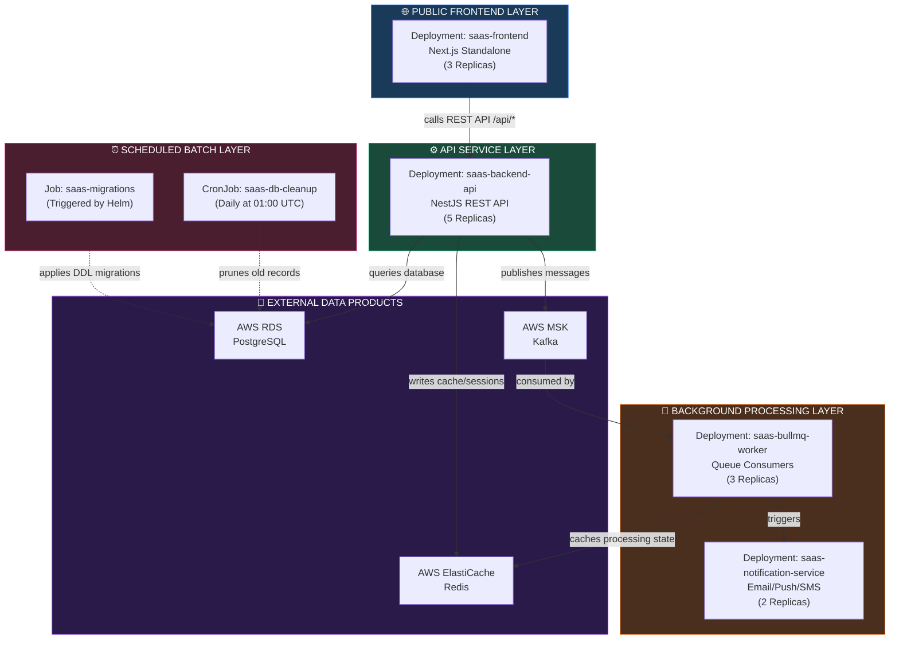
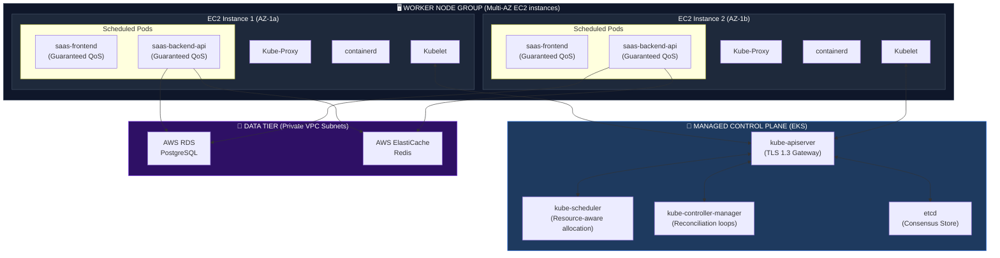
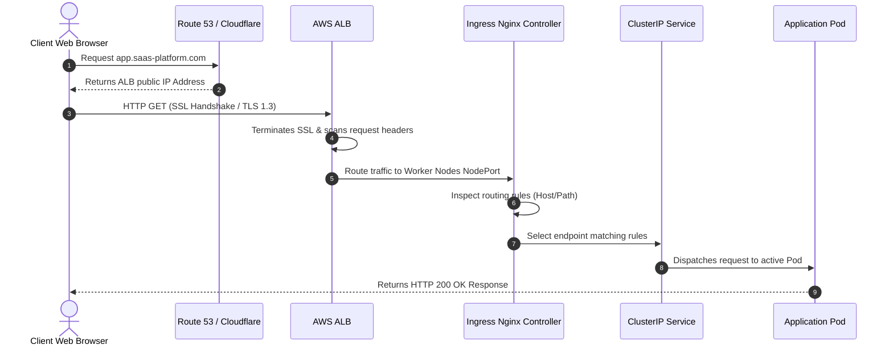
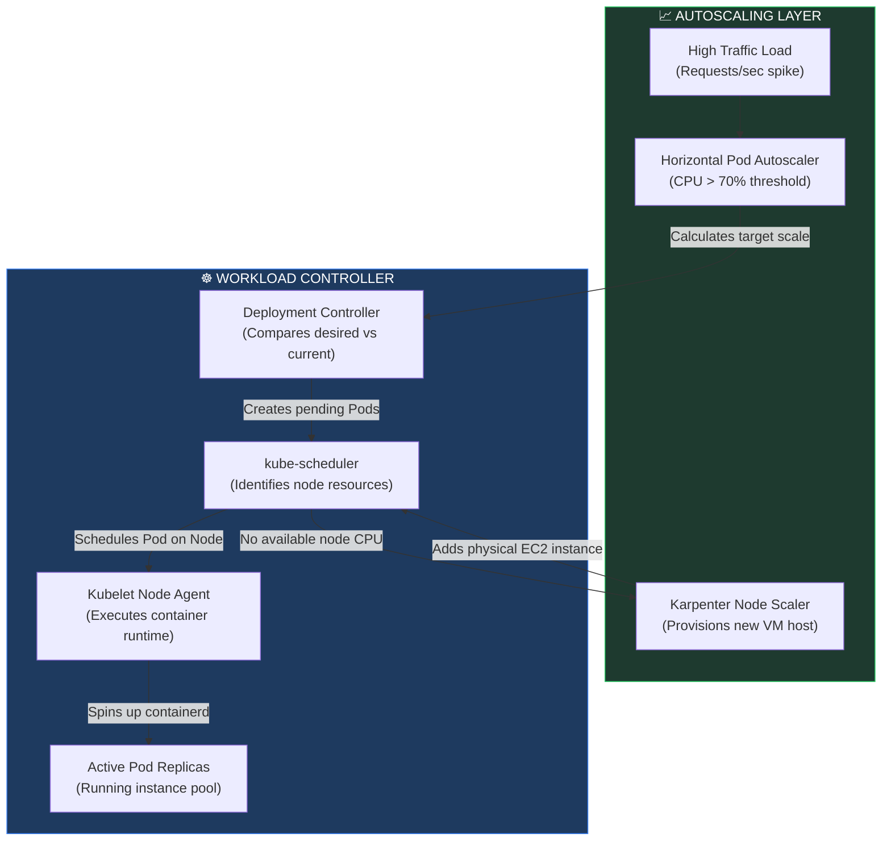
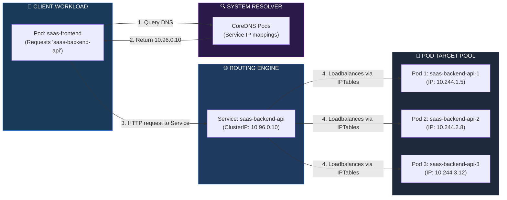
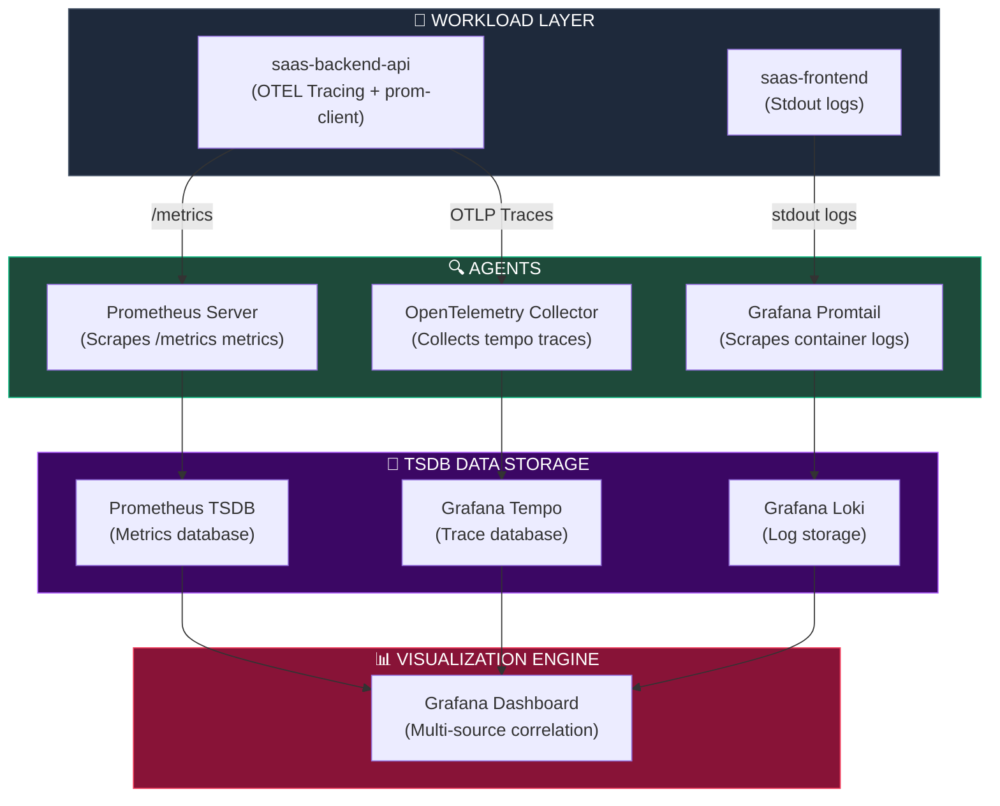

# KUBERNETES ARCHITECTURE, CONTAINER ORCHESTRATION & PRODUCTION SCALING

**Project Name:** Enterprise SaaS Business Management Platform  
**Document Version:** 1.0.0 — Baseline Standard  
**Date:** July 14, 2026  
**Authors:** Principal Kubernetes Architect, Cloud Native Engineer, Platform Engineer, Site Reliability Engineer (SRE), DevOps Lead & Enterprise SaaS Infrastructure Architect  
**Classification:** Enterprise Internal — Restricted (Infrastructure Sensitive)  
**Status:** ☸️ APPROVED KUBERNETES ARCHITECTURE & CONTAINER ORCHESTRATION SPECIFICATION  

---

## TABLE OF CONTENTS

| Section | Title | Description |
| :---: | :--- | :--- |
| **§1** | [Kubernetes Foundation](#section-1--kubernetes-foundation) | Why K8s, orchestration, self-healing, rolling updates |
| **§2** | [Cluster Architecture](#section-2--cluster-architecture) | Control Plane vs. Worker Nodes, component layout |
| **§3** | [Workload Architecture](#section-3--workload-architecture) | Deployment models for Web, API, Worker, and Cron jobs |
| **§4** | [Pod Design Strategy](#section-4--pod-design-strategy) | Health probes, resource requests/limits, QoS |
| **§5** | [Service Discovery](#section-5--service-discovery) | Service types (ClusterIP, NodePort, LoadBalancer, ExternalName) |
| **§6** | [Ingress Architecture](#section-6--ingress-architecture) | Edge traffic routing, TLS termination, Nginx controller |
| **§7** | [Configuration Management](#section-7--configuration-management) | ConfigMaps, Secrets, and External Secrets (AWS Secrets Manager) |
| **§8** | [Auto Scaling Strategy](#section-8--auto-scaling-strategy) | HPA, VPA, Cluster Autoscaler, scaling policies |
| **§9** | [High Availability Design](#section-9--high-availability-design) | Multi-replica rules, Pod Anti-Affinity, PDBs, Topology Spread |
| **§10** | [Helm Architecture](#section-10--helm-architecture) | Chart layout, templating, and release lifecycle management |
| **§11** | [Background Workloads](#section-11--background-workloads) | Kubernetes Jobs, CronJobs, and BullMQ worker patterns |
| **§12** | [Network Policies](#section-12--network-policies) | Zero Trust network isolation, namespace rules, network security |
| **§13** | [Storage Architecture](#section-13--storage-architecture) | PV, PVC, StorageClasses, Container Storage Interface (CSI) |
| **§14** | [Observability](#section-14--observability) | Metrics, Logs, Traces (Prometheus, Grafana, Loki, Tempo) |
| **§15** | [Security Hardening](#section-15--security-hardening) | RBAC policies, Pod Security Standards, Admission Controllers |
| **§16** | [Deployment Strategies](#section-16--deployment-strategies) | Rolling Updates, Blue-Green, Canary comparisons |
| **§17** | [Disaster Recovery](#section-17--disaster-recovery) | Velero backup strategy, cluster restoration, configuration backup |
| **§18** | [Kubernetes Tool Stack](#section-18--kubernetes-tool-stack) | Operational tooling, purpose, and ownership |
| **§19** | [Platform Governance](#section-19--platform-governance) | Naming rules, namespace model, and policy enforcement |
| **§20** | [Final Kubernetes Architecture](#section-20--final-kubernetes-architecture) | 5 comprehensive architectural Mermaid diagrams |

---

## SECTION 1 — KUBERNETES FOUNDATION

### 1.1 Why Kubernetes?
Deploying microservices and modular monolith components across multi-tenant environments requires an infrastructure abstraction layer that guarantees high availability, automated resource scaling, security, and developer velocity. Kubernetes (K8s) serves as the container orchestration engine to eliminate host-level coupling, automate container lifecycles, and declare the desired state of infrastructure in version-controlled git repositories.

### 1.2 Container Orchestration & Lifecycle Automation
Rather than executing individual containers via ad-hoc scripts on discrete virtual machines, Kubernetes handles container scheduling, placement, health monitoring, and networking across a pooled cluster of compute nodes.

```
THE DECLARATIVE DESIRED STATE RECONCILIATION LOOP
═══════════════════════════════════════════════════════════════════════════════
┌─────────────────────────────────┐
│     User Declares Desired State │ (e.g., "5 replicas of saas-backend-api")
└────────────────┬────────────────┘
                 │
                 ▼
┌─────────────────────────────────┐          ┌────────────────────────────────┐
│      Reconciliation Loop        ├─────────►│         Observe State          │
│   (Control Plane Controllers)   │          │   (Inspect current active Pods)│
└────────────────▲────────────────┘          └───────────────┬────────────────┘
                 │                                           │
                 │ Compare                                   ▼
                 │                               ┌────────────────────────────┐
                 │◄──────────────────────────────┤      Analyze Difference    │
                 │                               │ (Are there fewer than 5?)  │
                 │                               └───────────┬────────────────┘
                 │                                           │
                 ▼                                           ▼
┌─────────────────────────────────┐          ┌────────────────────────────────┐
│      Act to Resolve Delta       ├─────────►│     Execute System Action      │
│  (Schedule new Pods to run)     │          │  (Instruct Kubelet to run Pod) │
└─────────────────────────────────┘          └────────────────────────────────┘
═══════════════════════════════════════════════════════════════════════════════
```

### 1.3 Core Orchestration Capabilities

*   **Self-Healing:** If a container crashes, Kubernetes restarts it automatically. If a node fails, Kubernetes reschedules the failed node's pods onto healthy worker nodes. If a container fails its user-defined readiness probes, it is immediately removed from the active service endpoint rotation.
*   **Dynamic Scaling:** Compute footprint increases and decreases dynamically using native Horizontal Pod Autoscaling (HPA) coupled with AWS Karpenter/Cluster Autoscaler to scale underlying VM nodes.
*   **Rolling Updates:** Applications are updated with zero downtime by progressively replacing old instances with new ones, validating readiness before shutting down old pods.

---

## SECTION 2 — CLUSTER ARCHITECTURE

### 2.1 The Control Plane & Worker Node Layout
An enterprise SaaS production cluster splits operational control from user application workloads to prevent traffic congestion, enhance security, and guarantee high availability.

```
CLUSTERING ENGINE TOPOLOGY (AWS EKS & EC2 NODE GROUPS)
═══════════════════════════════════════════════════════════════════════════════
                    [ AWS EKS Control Plane (Multi-AZ Managed) ]
        ┌──────────────────────────────────────────────────────────┐
        │  ┌────────────────┐  ┌──────────────┐  ┌──────────────┐  │
        │  │   API Server   │  │  Scheduler   │  │ Controller-  │  │
        │  │  (kube-apiserver)││(kube-scheduler)││Manager (KCM) │  │
        │  └───────┬────────┘  └──────┬───────┘  └──────┬───────┘  │
        │          │                  │                 │          │
        │          └──────────────────┼─────────────────┘          │
        │                             ▼                            │
        │                 ┌──────────────────────┐                 │
        │                 │   etcd Data Store    │                 │
        │                 │ (Highly Available,   │                 │
        │                 │  Raft-based Consensus│                 │
        │                 └──────────▲───────────┘                 │
        └────────────────────────────┼─────────────────────────────┘
                                     │ (gRPC via TLS 1.3)
  ═══════════════════════════════════╪═════════════════════════════════════════
                                     │ (Secure Network Border)
                       [ Worker Node EC2 Autoscaling Group ]
        ┌────────────────────────────┴─────────────────────────────┐
        │  ┌────────────────────────────────────────────────────┐  │
        │  │                   Worker Node 1                    │  │
        │  │ ┌───────────────┐ ┌───────────────┐ ┌────────────┐ │  │
        │  │ │    Kubelet    │ │  Kube-Proxy   │ │ Containerd │ │  │
        │  │ └───────┬───────┘ └───────┬───────┘ └─────┬──────┘ │  │
        │  │         │                 │               │        │  │
        │  │         ▼                 ▼               ▼        │  │
        │  │ ┌───────────────┐ ┌───────────────┐ ┌────────────┐ │  │
        │  │ │  Pod A (API)  │ │ Pod B (Worker)│ │ Pod C (FE) │ │  │
        │  │ └───────────────┘ └───────────────┘ └────────────┘ │  │
        │  └────────────────────────────────────────────────────┘  │
        └──────────────────────────────────────────────────────────┘
═══════════════════════════════════════════════════════════════════════════════
```

### 2.2 Control Plane Component Matrix

| Component | Native Binary | Primary Responsibility | SLA Impact |
| :--- | :--- | :--- | :--- |
| **API Server** | `kube-apiserver` | Exposes K8s API; validates and processes all declarative configuration manifests. | Crucial; gateway to cluster. |
| **Scheduler** | `kube-scheduler` | Inspects resource requirements of unscheduled pods and assigns them to worker nodes. | Impacts placement latency. |
| **Controller Manager** | `kube-controller-manager` | Runs background controller loops (Node, Deployment, Job, Namespace controllers). | Critical for self-healing. |
| **etcd Data Store** | `etcd` | Consistent, highly-available key-value store containing cluster state, secrets, and config. | Cluster database. |
| **Cloud Controller** | `cloud-controller-manager` | Integrates cluster with cloud provider services (AWS ALB/NLB, security groups, routing). | Elastic link. |

### 2.3 Worker Node Component Matrix

| Component | Native Binary | Primary Responsibility | Performance Impact |
| :--- | :--- | :--- | :--- |
| **Kubelet** | `kubelet` | Agent running on worker node; ensures containers are running in designated pods. | Core node execution agent. |
| **Kube Proxy** | `kube-proxy` | Maintains network routing tables on host; handles TCP/UDP packet translation for Services. | Network performance & routing. |
| **Container Runtime** | `containerd` | Low-level OCI-compliant runtime that manages container isolation, resource allocation, and images. | Container engine. |

---

## SECTION 3 — WORKLOAD ARCHITECTURE

### 3.1 Workload Design Strategy
Workloads within the platform are categorized by execution type (long-running public APIs, stateless frontends, background queue consumers, and scheduled system scripts) to isolate failures and optimize cost structures.

### 3.2 Workload Component Topology



---

## SECTION 4 — POD DESIGN STRATEGY

### 4.1 Pod Standards
A Pod is the smallest deployable computing unit in Kubernetes. To ensure zero-downtime operations and efficient bin-packing of containers on physical hosts, all Pod specs must conform to strict standards.

### 4.2 Quality of Service (QoS) Optimization
Pods are categorized into three QoS classes based on their resource configurations: Guaranteed, Burstable, and BestEffort.
*   **Guaranteed:** `requests` exactly equal `limits` for both CPU and Memory. These Pods are the last to be evicted if hosts run low on resources.
*   **Burstable:** `requests` are less than `limits`. These have flexibility to burst but risk throttling or eviction during resource starvation.
*   **BestEffort:** No requests or limits defined. Subject to immediate eviction.

> **Production Rule:** All critical SaaS application workloads (frontend, backend-api, workers) **MUST** run with the **Guaranteed** QoS class to prevent memory-induced application crashes (OOMkills) and CPU starvation during peak processing events.

### 4.3 Pod Health Probe Life Cycle

```
HEALTH PROBE TIMELINE & RESPONSIBILITY
═══════════════════════════════════════════════════════════════════════════════
Pod Scheduled ──► Container Starts ──► Startup Probe Runs ──► Ready
                                            │                 │
     ┌──────────────────────────────────────┘                 │
     ▼ (Checks if heavy modules loaded)                       ▼
Ready to handle traffic? ◄────────────────────────────── Readiness Probe Runs
     │                                                        │
     ├── ✅ Yes: Service Routing Active                       │
     └── ❌ No: Taken out of Active Rotation                  ▼
Continues running correctly? ◄─────────────────────────── Liveness Probe Runs
     │
     ├── ✅ Yes: Continue execution
     └── ❌ No: Container killed & restarted by Kubelet
═══════════════════════════════════════════════════════════════════════════════
```

### 4.4 Production Pod Manifest Template

```yaml
# templates/pod-standards-spec.yaml
apiVersion: apps/v1
kind: Deployment
metadata:
  name: saas-backend-api
  namespace: production
spec:
  replicas: 5
  selector:
    matchLabels:
      app: saas-backend-api
  template:
    metadata:
      labels:
        app: saas-backend-api
    spec:
      containers:
        - name: api-runtime
          image: 123456789012.dkr.ecr.ap-southeast-1.amazonaws.com/saas-backend:v1.0.0
          imagePullPolicy: IfNotPresent
          
          # Security Context: Hardened runtime limits
          securityContext:
            allowPrivilegeEscalation: false
            readOnlyRootFilesystem: true
            runAsNonRoot: true
            runAsUser: 1001
            runAsGroup: 1001
            capabilities:
              drop: ["ALL"]

          # Guaranteed QoS: Requests equal Limits
          resources:
            requests:
              cpu: "1000m"     # 1 Full vCPU
              memory: "1024Mi" # 1 GiB RAM
            limits:
              cpu: "1000m"     # Guaranteed CPU limit
              memory: "1024Mi" # Guaranteed memory limit to prevent OOM
              
          # Startup Probe: Validates initialization
          startupProbe:
            httpGet:
              path: /health/startup
              port: 3001
            initialDelaySeconds: 5
            periodSeconds: 5
            failureThreshold: 12 # Gives app up to 60 seconds to bootstrap

          # Readiness Probe: Validates traffic routing availability
          readinessProbe:
            httpGet:
              path: /health/readiness
              port: 3001
            initialDelaySeconds: 5
            periodSeconds: 10
            timeoutSeconds: 3
            successThreshold: 1
            failureThreshold: 3

          # Liveness Probe: Detects deadlock/unresponsive engine
          livenessProbe:
            httpGet:
              path: /health/liveness
              port: 3001
            initialDelaySeconds: 10
            periodSeconds: 15
            timeoutSeconds: 5
            failureThreshold: 3
            
          volumeMounts:
            - name: ephemeral-tmp
              mountPath: /tmp
      
      # Re-use standard volumes for write-required local directories
      volumes:
        - name: ephemeral-tmp
          emptyDir: {}
```

---

## SECTION 5 — SERVICE DISCOVERY

### 5.1 Service Types
Services provide persistent virtual IP addresses and DNS records for ephemeral, scaling pods. 

| Service Type | Scope | Target Use Case | DNS Resolution |
| :--- | :--- | :--- | :--- |
| **ClusterIP** | Internal to cluster. | Communication between internal layers (e.g., API calling Redis). | `redis.production.svc.cluster.local` |
| **NodePort** | External via VM port. | Legacy integrations, edge nodes. Avoid in production. | Evaluates to Host IP at designated NodePort. |
| **LoadBalancer** | External via Cloud LB. | Direct cloud load balancer creation (e.g., AWS NLB). | Public Cloud DNS CNAME. |
| **ExternalName** | Redirection to CNAME. | Connecting local cluster pods to external databases (RDS). | CNAME resolution to AWS RDS domain name. |

### 5.2 Enterprise Routing Model
To maintain database connection stability and secure boundaries, the application layers use `ClusterIP` and `ExternalName` policies.

```yaml
# templates/rds-database-service.yaml
apiVersion: v1
kind: Service
metadata:
  name: saas-postgres-rds
  namespace: production
spec:
  type: ExternalName
  externalName: saas-prod-db.c123456789.ap-southeast-1.rds.amazonaws.com
---
# templates/backend-api-service.yaml
apiVersion: v1
kind: Service
metadata:
  name: saas-backend-api
  namespace: production
  labels:
    app: saas-backend-api
spec:
  type: ClusterIP
  ports:
    - name: http
      port: 80
      targetPort: 3001
      protocol: TCP
  selector:
    app: saas-backend-api
```

---

## SECTION 6 — INGRESS ARCHITECTURE

### 6.1 Edge Traffic Ingress Controller
Ingress manages incoming HTTP and HTTPS traffic from outside the cluster, handling TLS certificate termination, routing rules, and header manipulation.

```
INGRESS ROUTING TOPOLOGY
═══════════════════════════════════════════════════════════════════════════════
       Browser HTTPS Traffic
                 │
                 ▼
       [ Cloudflare WAF + CDN ]
                 │
                 ▼ (Secure VPC Tunnel)
    [ AWS Application Load Balancer ]
                 │
                 ▼ (Routes to NodePort range)
  [ Ingress Nginx Controller Pods ]  ◄── Enforces TLS termination using ACM
                 │
        ┌────────┴───────────────────────────┐
        │ Path: /api/*                       │ Path: /*
        ▼                                    ▼
  [ Service: saas-backend-api ]        [ Service: saas-frontend ]
        │                                    │
        ├── Pod 1 (nestjs)                   ├── Pod 1 (nextjs)
        ├── Pod 2 (nestjs)                   ├── Pod 2 (nextjs)
        └── Pod 3 (nestjs)                   └── Pod 3 (nextjs)
═══════════════════════════════════════════════════════════════════════════════
```

### 6.2 Production Ingress Manifest

```yaml
# templates/production-ingress.yaml
apiVersion: networking.k8s.io/v1
kind: Ingress
metadata:
  name: saas-production-ingress
  namespace: production
  annotations:
    kubernetes.io/ingress.class: "nginx"
    nginx.ingress.kubernetes.io/ssl-redirect: "true"
    nginx.ingress.kubernetes.io/backend-protocol: "HTTP"
    nginx.ingress.kubernetes.io/proxy-body-size: "10m"
    nginx.ingress.kubernetes.io/proxy-connect-timeout: "15"
    nginx.ingress.kubernetes.io/proxy-read-timeout: "600"
    
    # AWS Cert Manager Integration
    cert-manager.io/cluster-issuer: "letsencrypt-production"
    nginx.ingress.kubernetes.io/cors-allow-credentials: "true"
    nginx.ingress.kubernetes.io/cors-allow-methods: "GET, PUT, POST, DELETE, OPTIONS"
    nginx.ingress.kubernetes.io/cors-allow-origin: "https://app.saas-platform.com"
spec:
  tls:
    - hosts:
        - app.saas-platform.com
        - api.saas-platform.com
      secretName: saas-platform-tls-cert
  rules:
    - host: app.saas-platform.com
      http:
        paths:
          - path: /
            pathType: Prefix
            backend:
              service:
                name: saas-frontend
                port:
                  number: 80
    - host: api.saas-platform.com
      http:
        paths:
          - path: /
            pathType: Prefix
            backend:
              service:
                name: saas-backend-api
                port:
                  number: 80
```

---

## SECTION 7 — CONFIGURATION MANAGEMENT

### 7.1 Separation of Config and Secrets
Application logic must remain clean, generic, and decoupled from environmental variables. Configuration that is non-sensitive is injected via `ConfigMaps`, whereas sensitive material (encryption keys, database credentials) is injected via `Secrets`.

### 7.2 External Secrets Integration
Hardcoding secrets or checking Base64 encoded secrets into Git commits violates basic compliance controls (SOC2, PCI-DSS). Therefore, the cluster integrates with **AWS Secrets Manager** via the Kubernetes **External Secrets Operator (ESO)**.

```
EXTERNAL SECRET SYNC FLOW
═══════════════════════════════════════════════════════════════════════════════
┌─────────────────────────┐
│   AWS Secrets Manager   │ (AWS encrypted vault)
└────────────┬────────────┘
             │ (OIDC IAM Role Authorization)
             ▼
┌─────────────────────────┐
│ External Secrets        │ (Reads AWS key-value secret mapping)
│ Operator (ESO)          │
└────────────┬────────────┘
             │ (Automatically decrypts and syncs)
             ▼
┌─────────────────────────┐
│ Kubernetes Secret       │ (Stored securely in-memory inside etcd)
│ (type: Opaque)          │
└────────────┬────────────┘
             │ (Injected at pod startup)
             ▼
┌─────────────────────────┐
│      Application Pod    │ (Exposed only as environment variables)
└─────────────────────────┘
═══════════════════════════════════════════════════════════════════════════════
```

### 7.3 Configuration Configurations

```yaml
# templates/app-configmap.yaml
apiVersion: v1
kind: ConfigMap
metadata:
  name: saas-backend-config
  namespace: production
data:
  NODE_ENV: "production"
  LOG_LEVEL: "info"
  DATABASE_PORT: "5432"
  REDIS_PORT: "6379"
  KAFKA_BROKERS: "saas-msk-brokers.production.svc.cluster.local:9092"
---
# templates/external-secret-definition.yaml
apiVersion: external-secrets.io/v1beta1
kind: ExternalSecret
metadata:
  name: saas-backend-secrets
  namespace: production
spec:
  refreshInterval: "1h" # Automatic sync loop
  secretStoreRef:
    name: aws-secretsmanager-store
    kind: ClusterSecretStore
  target:
    name: saas-backend-secrets # Destination local K8s Secret
    creationPolicy: Owner
  data:
    - secretKey: DATABASE_PASSWORD
      remoteRef:
        key: production/saas/backend
        property: db_password
    - secretKey: JWT_SECRET
      remoteRef:
        key: production/saas/backend
        property: jwt_secret_key
    - secretKey: REDIS_PASSWORD
      remoteRef:
        key: production/saas/backend
        property: redis_password
```

---

## SECTION 8 — AUTO SCALING STRATEGY

### 8.1 Auto Scaling Pillars
The platform leverages three layers of autoscaling to handle rapid SaaS traffic spikes and optimize infrastructure costs.

```
THE AUTO SCALING HEURISTIC LAYER
═══════════════════════════════════════════════════════════════════════════════
┌─────────────────────────────────┐
│     Traffic Load Increases      │ (API requests/sec spike)
└────────────────┬────────────────┘
                 │
                 ▼
┌─────────────────────────────────┐
│ Horizontal Pod Autoscaler (HPA) │ ◄── Monitors memory and CPU utilization
└────────────────┬────────────────┘
                 │ (Triggers more Pod replicas)
                 ▼
┌─────────────────────────────────┐
│    Compute Pool Insufficient    │ (Pods stuck in "Pending" status)
└────────────────┬────────────────┘
                 │
                 ▼
┌─────────────────────────────────┐
│        Cluster Autoscaling      │ ◄── Provisions new EC2 instances
│      (Karpenter / CA)           │
└─────────────────────────────────┘
═══════════════════════════════════════════════════════════════════════════════
```

### 8.2 Horizontal Pod Autoscaler (HPA) Specification

```yaml
# templates/backend-hpa.yaml
apiVersion: autoscaling/v2
kind: HorizontalPodAutoscaler
metadata:
  name: saas-backend-hpa
  namespace: production
spec:
  scaleTargetRef:
    apiVersion: apps/v1
    kind: Deployment
    name: saas-backend-api
  minReplicas: 3
  maxReplicas: 20
  metrics:
    - type: Resource
      resource:
        name: cpu
        target:
          type: AverageUtilization
          averageUtilization: 70 # Scale up if CPU exceeds 70%
    - type: Resource
      resource:
        name: memory
        target:
          type: AverageUtilization
          averageUtilization: 80 # Scale up if memory usage exceeds 80%
  behavior:
    scaleUp:
      stabilizationWindowSeconds: 0 # Immediate scaling on load spikes
      policies:
        - type: Percent
          value: 100 # Double capacity every 15 seconds if load sustains
          periodSeconds: 15
    scaleDown:
      stabilizationWindowSeconds: 300 # Cool-down period of 5 mins to prevent thrashing
      policies:
        - type: Pods
          value: 1 # Terminate 1 pod every 60 seconds
          periodSeconds: 60
```

### 8.3 Autoscaling Coordination Rules

*   **Vertical Pod Autoscaler (VPA):** Evaluates actual load metrics over time and updates recommended CPU/Memory request resources. **Must not** run on the same target deployment as the HPA unless HPA uses custom metrics (non-CPU/Memory), as resource adjustments will conflict.
*   **Cluster Autoscaler / Karpenter:** Karpenter schedules instances directly through AWS API based on pending pods, running faster than the traditional legacy Cluster Autoscaler (under 15 seconds vs. 2 minutes).

---

## SECTION 9 — HIGH AVAILABILITY DESIGN

### 9.1 Multi-Replica Rules
To guarantee service survival during hardware failures, no production component runs with less than 3 active replicas. Pods must be distributed across multiple physical zones.

### 9.2 Pod Anti-Affinity
We enforce **Pod Anti-Affinity** to guarantee that Kubernetes schedules identical service pods onto different physical EC2 worker nodes and Availability Zones (AZs).

```yaml
# templates/ha-affinity-rules.yaml
apiVersion: apps/v1
kind: Deployment
metadata:
  name: saas-backend-api
  namespace: production
spec:
  replicas: 5
  selector:
    matchLabels:
      app: saas-backend-api
  template:
    metadata:
      labels:
        app: saas-backend-api
    spec:
      affinity:
        # Enforce pod-to-node distribution rules
        podAntiAffinity:
          requiredDuringSchedulingIgnoredDuringExecution:
            - labelSelector:
                matchExpressions:
                  - key: app
                    operator: In
                    values:
                      - saas-backend-api
              topologyKey: "kubernetes.io/hostname" # Ensures pods run on different EC2 instances
          preferredDuringSchedulingIgnoredDuringExecution:
            - weight: 100
              podAffinityTerm:
                labelSelector:
                  matchExpressions:
                    - key: app
                      operator: In
                      values:
                        - saas-backend-api
                topologyKey: "topology.kubernetes.io/zone" # Prefers different AWS AZs
```

### 9.3 Pod Disruption Budget (PDB)
PDBs enforce availability rules during voluntary cluster maintenance (e.g., node group OS patching or scaling upgrades), limiting the number of pods terminated concurrently.

```yaml
# templates/backend-pdb.yaml
apiVersion: policy/v1
kind: PodDisruptionBudget
metadata:
  name: saas-backend-pdb
  namespace: production
spec:
  minAvailable: 3 # Guarantees at least 3 backend pods are online at all times
  selector:
    matchLabels:
      app: saas-backend-api
```

---

## SECTION 10 — HELM ARCHITECTURE

### 10.1 Package Management via Helm
Helm is the package manager for Kubernetes. Applications are packaged into **Charts**, parameterizing standard configurations to enable identical deployment steps across development, staging, and production environments.

### 10.2 Helm Directory Structure

```
helm/saas-platform/
│
├── Chart.yaml              # Metadata containing Chart name and SemVer version
├── values.yaml             # Base environment values (default local/development)
├── values-staging.yaml     # Staging overrides
├── values-production.yaml  # Production overrides (resource pinning, HA rules)
│
└── templates/              # Parameterized manifests compiled at deploy-time
    ├── _helpers.tpl        # Re-usable template functions and label generation
    ├── ingress.yaml
    ├── service.yaml
    ├── deployment.yaml
    ├── secrets.yaml
    ├── hpa.yaml
    └── NOTES.txt           # Post-install installation guide
```

### 10.3 Sample Helm Value Mapping (`values-production.yaml`)

```yaml
# helm/saas-platform/values-production.yaml
global:
  environment: production
  domain: saas-platform.com

replicaCount: 5

image:
  repository: 123456789012.dkr.ecr.ap-southeast-1.amazonaws.com/saas-backend
  tag: "v1.0.0"
  pullPolicy: IfNotPresent

resources:
  requests:
    cpu: "1000m"
    memory: "1024Mi"
  limits:
    cpu: "1000m"
    memory: "1024Mi"

autoscaling:
  enabled: true
  minReplicas: 3
  maxReplicas: 20
  targetCPUUtilizationPercentage: 70

database:
  host: "saas-postgres-rds"
  name: "saas_prod_db"
```

---

## SECTION 11 — BACKGROUND WORKLOADS

### 11.1 Short-Lived Jobs & CronJobs
SaaS operations frequently require scheduled automation (daily database vacuums, tenant reporting aggregation, batch invoicing). We deploy these as native Kubernetes `CronJob` and `Job` specifications.

```yaml
# templates/daily-backup-cronjob.yaml
apiVersion: batch/v1
kind: CronJob
metadata:
  name: saas-db-cleanup
  namespace: production
spec:
  schedule: "0 1 * * *" # Every day at 01:00 AM UTC
  concurrencyPolicy: Forbid # Prevents overlaps if previous run hangs
  successfulJobsHistoryLimit: 3
  failedJobsHistoryLimit: 5
  jobTemplate:
    spec:
      activeDeadlineSeconds: 1800 # Time out job if it runs longer than 30 mins
      template:
        spec:
          restartPolicy: OnFailure
          containers:
            - name: task-executor
              image: 123456789012.dkr.ecr.ap-southeast-1.amazonaws.com/saas-cleanup:v1.0.0
              command: ["npm", "run", "db:prune-audit"]
              resources:
                requests:
                  cpu: "500m"
                  memory: "512Mi"
                limits:
                  cpu: "500m"
                  memory: "512Mi"
```

### 11.2 BullMQ Worker Deployments
Stateless web APIs delegate compute-heavy tasks (receipt PDF compilation, transaction webhooks) to asynchronous BullMQ worker queues backended by Redis. These workers run as standard K8s Deployments and scale dynamically based on custom Prometheus queue-lag metrics.

---

## SECTION 12 — NETWORK POLICIES

### 12.1 Zero Trust Pod Networking
By default, Kubernetes pods accept traffic from any source inside the cluster. To enforce security segmentation, we apply **NetworkPolicies** to restrict ingress and egress traffic using a deny-by-default posture.

```
POD-LEVEL FIREWALL TOPOLOGY
═══════════════════════════════════════════════════════════════════════════════
                   [ Ingress Nginx Controller ]
                               │
                      ✅ Allow │ (Allowed by NetworkPolicy)
                               ▼
                    [ Pod: saas-frontend ]
                               │
                      ❌ Block │ (Blocked by default Egress policy)
                               ▼
                  [ Database / Cache / Msg ]
                               ▲
                      ✅ Allow │ (Allowed only from Backend API)
                               │
                    [ Pod: saas-backend-api ]
═══════════════════════════════════════════════════════════════════════════════
```

### 12.2 Production Network Policies

```yaml
# templates/deny-all-network-policy.yaml
apiVersion: networking.k8s.io/v1
kind: NetworkPolicy
metadata:
  name: default-deny-all
  namespace: production
spec:
  podSelector: {} # Matches all pods in namespace
  policyTypes:
    - Ingress
    - Egress
---
# templates/backend-isolation-policy.yaml
apiVersion: networking.k8s.io/v1
kind: NetworkPolicy
metadata:
  name: saas-backend-net-policy
  namespace: production
spec:
  podSelector:
    matchLabels:
      app: saas-backend-api
  policyTypes:
    - Ingress
    - Egress
  ingress:
    # 1. Allow traffic ONLY from Frontend pods
    - from:
        - podSelector:
            matchLabels:
              app: saas-frontend
      ports:
        - protocol: TCP
          port: 3001
    # 2. Allow traffic from Nginx Ingress Controller
    - from:
        - namespaceSelector:
            matchLabels:
              kubernetes.io/metadata.name: ingress-nginx
      ports:
        - protocol: TCP
          port: 3001
  egress:
    # 1. Allow outbound to CoreDNS
    - to:
        - namespaceSelector: {}
          podSelector:
            matchLabels:
              k8s-app: kube-dns
      ports:
        - protocol: UDP
          port: 53
    # 2. Allow outbound connections to Redis Cache
    - to:
        - podSelector:
            matchLabels:
              app: saas-redis
      ports:
        - protocol: TCP
          port: 6379
```

---

## SECTION 13 — STORAGE ARCHITECTURE

### 13.1 Stateless Applications & Dynamic Storage Volumes
For application containers, the primary strategy remains stateless. However, temporary file processing, caching, and background jobs require reliable block storage configurations.

### 13.2 Storage Components (CSI Driver)
To persist logging indexes, asset uploads, or temporary message queues, the cluster leverages AWS EBS and EFS volumes provisioned dynamically using the Container Storage Interface (CSI).

```
DYNAMIC STORAGE PROVISIONING MODEL
═══════════════════════════════════════════════════════════════════════════════
┌─────────────────────────────────┐
│     PersistentVolumeClaim       │ (Requested by Pod definition)
└────────────────┬────────────────┘
                 │
                 ▼
┌─────────────────────────────────┐
│       StorageClass (gp3)        │ (Defines encryption, type, and provisioner)
└────────────────┬────────────────┘
                 │
                 ▼
┌─────────────────────────────────┐
│       AWS EBS CSI Driver        │ (Calls AWS EC2 APIs to create EBS block volume)
└────────────────┬────────────────┘
                 │
                 ▼
┌─────────────────────────────────┐
│      PersistentVolume (PV)      │ (Binds volume dynamically inside Pod)
└─────────────────────────────────┘
═══════════════════════════════════════════════════════════════════════════════
```

### 13.3 Dynamic Provisioning Configuration

```yaml
# templates/gp3-storage-class.yaml
apiVersion: storage.k8s.io/v1
kind: StorageClass
metadata:
  name: saas-storage-gp3
provisioner: ebs.csi.aws.com # AWS EBS CSI Driver
volumeBindingMode: WaitForFirstConsumer # Ensures PV is built in the correct AZ
allowVolumeExpansion: true
parameters:
  type: gp3
  iops: "3000"
  throughput: "125"
  encrypted: "true"
---
# templates/logging-pvc.yaml
apiVersion: v1
kind: PersistentVolumeClaim
metadata:
  name: saas-logs-volume-claim
  namespace: production
spec:
  accessModes:
    - ReadWriteOnce # Single node read-write mount
  storageClassName: saas-storage-gp3
  resources:
    requests:
      storage: 50Gi
```

---

## SECTION 14 — OBSERVABILITY

### 14.1 The Monitoring Framework
We leverage Prometheus, Grafana, Loki, and Tempo (the LGTM stack) to aggregate logs, metrics, traces, and system events.

### 14.2 Observability Integration Matrix

```
METRICS, LOGS & TRACES COLLECTION PIPELINE
═══════════════════════════════════════════════════════════════════════════════
      Workload Pods           Aggregators           Observability UI
  ┌───────────────────┐
  │ Metrics: /metrics ├──► [ Prometheus Agent ] ──┐
  ├───────────────────┤                           │
  │ Logs: stdout/stderr├─► [ Loki Promtail    ] ──┼─► [ Grafana Dashboards ]
  ├───────────────────┤                           │
  │ Traces: OTEL SDK  ├──► [ Tempo Agent      ] ──┘
  └───────────────────┘
═══════════════════════════════════════════════════════════════════════════════
```

### 14.3 Prometheus ServiceMonitor Template

```yaml
# templates/backend-servicemonitor.yaml
apiVersion: monitoring.coreos.com/v1
kind: ServiceMonitor
metadata:
  name: saas-backend-servicemonitor
  namespace: production
  labels:
    release: prometheus-operator # Integrates with kube-prometheus-stack
spec:
  selector:
    matchLabels:
      app: saas-backend-api
  endpoints:
    - port: metrics # Matches named port in Service definition
      interval: 15s # Metrics scraping frequency
      path: /metrics
      metricRelabelings:
        # Security: drop debugging metrics to reduce TSDB database bloat
        - sourceLabels: [__name__]
          regex: "go_gc_.*"
          action: drop
```

---

## SECTION 15 — SECURITY HARDENING

### 15.1 Role-Based Access Control (RBAC)
We enforce the principle of least privilege, ensuring that cluster services and users are allocated only the permissions they require.

```yaml
# templates/developer-role-binding.yaml
apiVersion: rbac.authorization.k8s.io/v1
kind: Role
metadata:
  name: saas-read-only-developer
  namespace: production
rules:
  - apiGroups: [""]
    resources: ["pods", "services", "configmaps"]
    verbs: ["get", "list", "watch"]
  - apiGroups: ["apps"]
    resources: ["deployments"]
    verbs: ["get", "list", "watch"]
---
apiVersion: rbac.authorization.k8s.io/v1
kind: RoleBinding
metadata:
  name: read-only-dev-binding
  namespace: production
subjects:
  - kind: Group
    name: "saas-developers-sso" # AWS IAM SSO Identity Group
    apiGroup: rbac.authorization.k8s.io
roleRef:
  kind: Role
  name: saas-read-only-developer
  apiGroup: rbac.authorization.k8s.io
```

### 15.2 Pod Security Standards (PSS)
Namespace-level annotations block pods that fail to meet strict security profiles.

```bash
# Label production namespace to enforce restricted baseline security posture
kubectl label --overwrite ns production pod-security.kubernetes.io/enforce=restricted
```

*   **Restricted Profile Rules:** Containers cannot run as root, cannot use host networking or host storage namespaces, must drop all Linux kernel capabilities, and must run with a read-only root filesystem.

---

## SECTION 16 — DEPLOYMENT STRATEGIES

### 16.1 Strategy Breakdown

| Strategy | Speed | Risk | Resource Overhead | Target Use Case |
| :--- | :--- | :--- | :--- | :--- |
| **Rolling Update** | Medium | Low | Low (maxSurge) | Standard backend APIs and web frontends. |
| **Blue-Green** | Fast | Very Low | High (200% resources) | Critical database schema migrations or core upgrades. |
| **Canary** | Slow | Minimal | Medium | Risky feature rollouts, routing 5% of traffic initially. |
| **Recreate** | Fast | High | Zero | Stateful, non-concurrent workloads. Avoid in production. |

### 16.2 Rolling Update Deployment Settings

```yaml
# templates/rolling-update-spec.yaml
apiVersion: apps/v1
kind: Deployment
metadata:
  name: saas-backend-api
  namespace: production
spec:
  strategy:
    type: RollingUpdate
    rollingUpdate:
      maxSurge: 25%       # Allow 25% overhead pods during rollout
      maxUnavailable: 0%  # Ensure 100% capacity remains online during deploy
```

---

## SECTION 17 — DISASTER RECOVERY

### 17.1 Disaster Recovery Policies
Infrastructure configurations, Helm releases, and PV data are backed up regularly to guarantee disaster recovery limits.

### 17.2 Velero Backup Execution Pattern
The platform leverages Velero to snapshot cluster states, etcd metadata, and persistent disk volumes to an encrypted S3 bucket.

```bash
# Execute full production backup, excluding caching namespaces
velero backup create production-daily-backup \
  --include-namespaces production \
  --exclude-namespaces monitoring,ingress-nginx \
  --snapshot-volumes \
  --volume-snapshot-locations default \
  --ttl 720h0m0s # Retain backups for 30 days
```

*   **Cluster Recovery:** In the event of a regional failure, Terraform builds a new cluster in the Sydney region (`ap-southeast-2`), installs Helm packages, and runs `velero restore` to recover configurations.

---

## SECTION 18 — KUBERNETES TOOL STACK

### 18.1 Kubernetes Tool Stack Matrix

| Category | Tool | Production Purpose | System Owner |
| :--- | :--- | :--- | :--- |
| **Container Engine** | EKS (AWS) | Hosts the control plane and managed EC2 worker node pools. | DevOps / Cloud Architect |
| **Deploy Tool** | Helm | Manages application templates and variable overrides. | Platform / SRE |
| **GitOps Delivery** | Argo CD | Syncs cluster state to the declarative Git repositories. | Platform Engine |
| **Scraper** | Prometheus | Collects system and business metric endpoints. | Site Reliability (SRE) |
| **Visualizer** | Grafana | Renders operational dashboards and tracks alerts. | SRE / DevOps |
| **Log Collector** | Loki | Indexes container stdout logs. | DevOps / SRE |
| **Security** | Kyverno | Evaluates K8s configurations against platform policies. | Security Engineer |

---

## SECTION 19 — PLATFORM GOVERNANCE

### 19.1 Naming Standards & Structure
All resources in the cluster must use strict lowercase, hyphenated naming patterns prefixed with the application name.
*   **Production namespaces:** `saas-production-frontend`, `saas-production-backend`, `saas-production-data`.
*   **Labels:** All manifests must define `app.kubernetes.io/name`, `app.kubernetes.io/instance`, and `app.kubernetes.io/version`.

### 19.2 Resource Quota Enforcement
To prevent resource exhaustion across namespace boundaries, we enforce strict **ResourceQuotas**.

```yaml
# templates/namespace-quota.yaml
apiVersion: v1
kind: ResourceQuota
metadata:
  name: production-resource-quota
  namespace: production
spec:
  hard:
    pods: "100"
    requests.cpu: "40"       # Max 40 vCPUs in namespace
    requests.memory: "80Gi"  # Max 80 GiB memory allocated
    limits.cpu: "80"
    limits.memory: "160Gi"
    services: "30"
```

---

## SECTION 20 — FINAL KUBERNETES ARCHITECTURE

### 20.1 Kubernetes Cluster Architecture



### 20.2 Ingress Traffic Flow



### 20.3 Deployment & Scaling Flow



### 20.4 Service Discovery Architecture



### 20.5 Production Observability Stack



---

## DOCUMENT METADATA

| Field | Value |
| :--- | :--- |
| **Document ID** | SAAS-INFRA-015.3 |
| **Section** | 15 — Cloud Infrastructure |
| **Subsection** | 15.3 — Kubernetes Architecture |
| **Status** | ☸️ APPROVED |
| **Version** | 1.0.0 |
| **Date** | July 14, 2026 |
| **Next Review** | January 14, 2027 |
| **Related Documents** | [Cloud Foundation](../15.1-Cloud-Foundation/Cloud-Foundation.md) · [Docker Strategy](../15.2-Docker-Container-Architecture/Docker-Container-Architecture.md) · [Security Architecture](../../14-Backend-Architecture/14.9-Security-Architecture/Security-Architecture.md) |
| **Technology Versions** | Kubernetes 1.30 · Helm v3 · AWS EKS 1.30 · Karpenter v0.35+ · External Secrets v0.9.x · Cert-Manager v1.14 |

---

*This document is the authoritative specification for all Kubernetes architecture, container orchestration, and scaling decisions in the Enterprise SaaS Business Management Platform. All deployment manifests, Helm charts, and scaling configurations must conform to the standards defined herein.*
