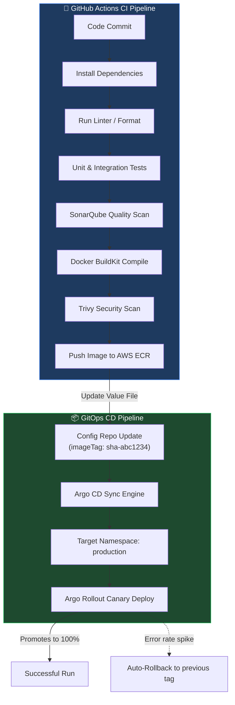
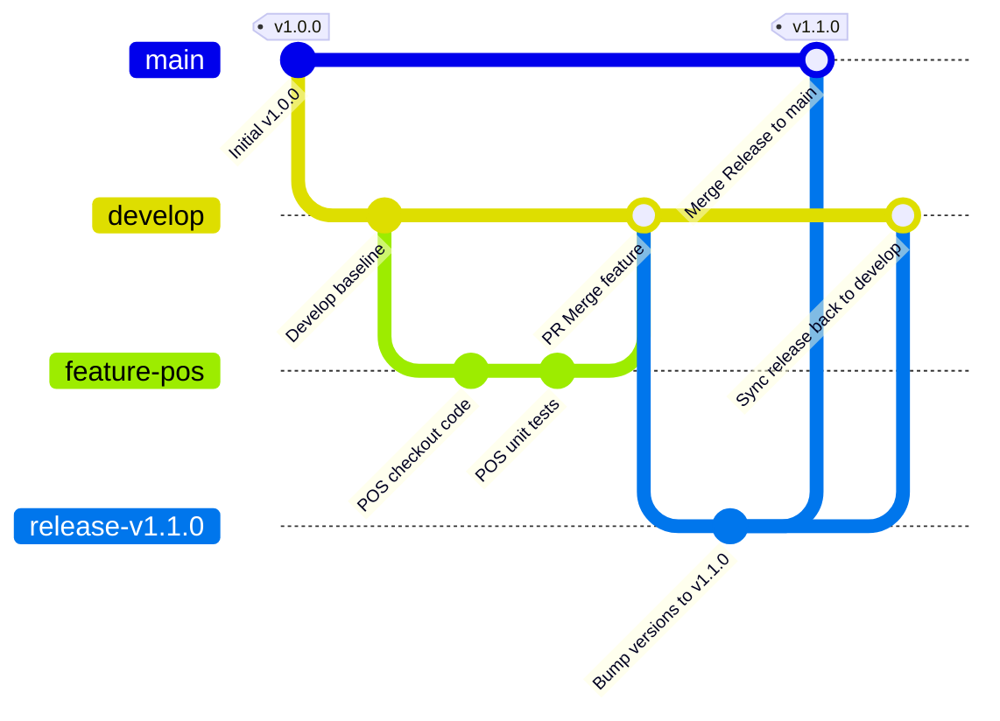
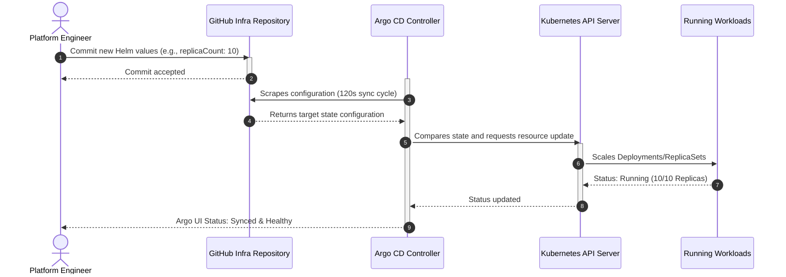
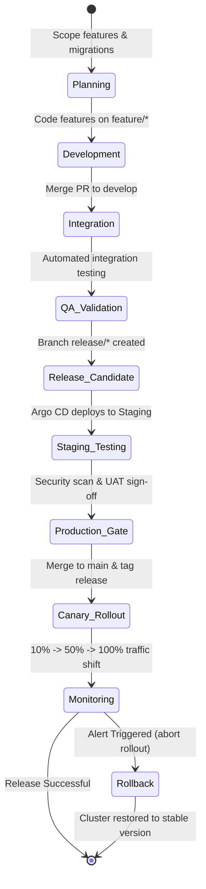
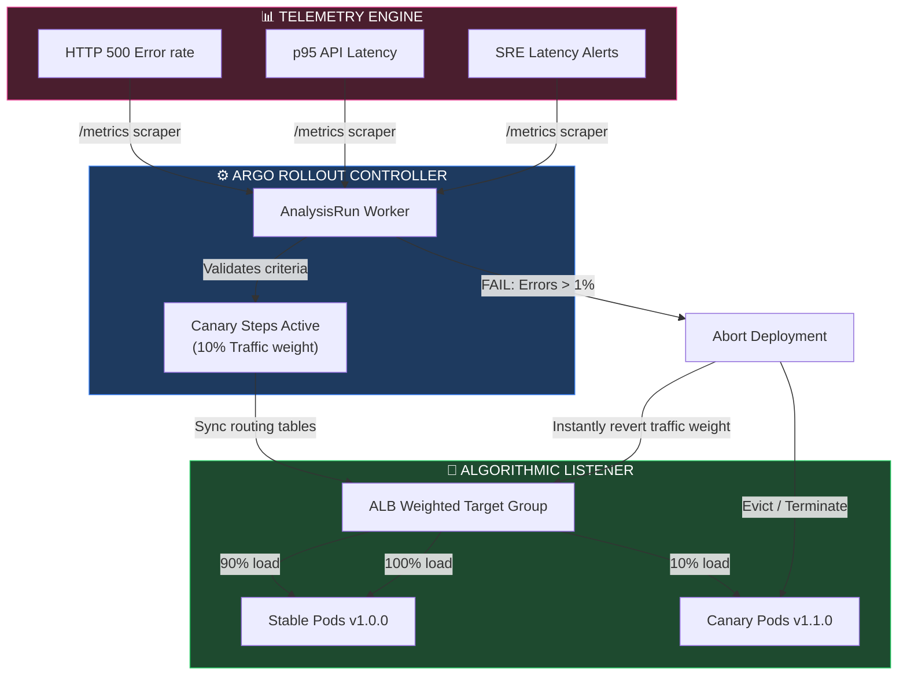

# CI/CD PIPELINE, GITOPS & RELEASE MANAGEMENT ARCHITECTURE

**Project Name:** Enterprise SaaS Business Management Platform  
**Document Version:** 1.0.0 — Baseline Standard  
**Date:** July 14, 2026  
**Authors:** Principal DevOps Architect, CI/CD Specialist, GitOps Engineer, Platform Engineer, Site Reliability Engineer (SRE), Enterprise Release Manager & Cloud Native Infrastructure Architect  
**Classification:** Enterprise Internal — Restricted (Infrastructure Sensitive)  
**Status:** 🚀 APPROVED CI/CD, GITOPS & RELEASE MANAGEMENT ARCHITECTURE SPECIFICATION  

---

## TABLE OF CONTENTS

| Section | Title | Description |
| :---: | :--- | :--- |
| **§1** | [CI/CD Foundation](#section-1--cicd-foundation) | Definitions, developer workflow, and business benefits |
| **§2** | [Enterprise Git Workflow](#section-2--enterprise-git-workflow) | Pull request mechanics, review loops, and integration |
| **§3** | [Branching Strategy](#section-3--branching-strategy) | Branch nomenclature, tagging strategy, and SemVer rules |
| **§4** | [Continuous Integration Pipeline](#section-4--continuous-integration-pipeline) | Build validation, linting, tests, and security scans |
| **§5** | [Container Build Pipeline](#section-5--container-build-pipeline) | BuildKit optimizations, Docker image scanning, and pushing |
| **§6** | [Continuous Delivery](#section-6--continuous-delivery) | Deployment orchestration and staging release loops |
| **§7** | [GitOps Architecture](#section-7--gitops-architecture) | Argo CD sync engine, git reconciliation, and cluster state |
| **§8** | [Release Management](#section-8--release-management) | Release candidate cycles, planning, and hotfix paths |
| **§9** | [Deployment Strategies](#section-9--deployment-strategies) | Rolling Updates, Blue-Green, Canary, Flags, and Shadows |
| **§10** | [Rollback Strategy](#section-10--rollback-strategy) | Automated/manual rollback, DB sync, Helm rollback |
| **§11** | [Environment Promotion](#section-11--environment-promotion) | Dev → QA → UAT → Staging → Prod lifecycle gates |
| **§12** | [Quality Gates](#section-12--quality-gates) | Enforced PR policies, coverage metrics, and approvals |
| **§13** | [Security Pipeline](#section-13--security-pipeline) | Secrets scanning, SAST/DAST audits, and SBOM generation |
| **§14** | [Artifact Management](#section-14--artifact-management) | Image/Chart storage registries, tag pinning, and retentions |
| **§15** | [Observability in Pipeline](#section-15--observability-in-pipeline) | DORA metric instrumentation, SLA tracking, pipeline logging |
| **§16** | [Mobile Release Pipeline](#section-16--mobile-release-pipeline) | React Native build paths, Fastlane automation, App/Play Stores |
| **§17** | [Disaster Recovery for CI/CD](#section-17--disaster-recovery-for-cicd) | Backup pipelines, registry replica rules, and Argo CD recovery |
| **§18** | [DevOps Tool Stack](#section-18--devops-tool-stack) | Operational tooling, purpose, and ownership mappings |
| **§19** | [Governance](#section-19--governance) | PR permissions, merge gates, emergency procedures, audit logs |
| **§20** | [Final CI/CD Architecture](#section-20--final-cicd-architecture) | 5 comprehensive architectural Mermaid diagrams |

---

## SECTION 1 — CI/CD FOUNDATION

### 1.1 Core Definitions
To maintain security, reliability, and engineering velocity at scale, the platform relies on three automated pillars of software delivery:
*   **Continuous Integration (CI):** The practice of automating the building, testing, linting, and security auditing of code changes as soon as developers commit and merge them to a shared Git repository.
*   **Continuous Delivery (CD):** The automation of release packaging (Docker images, Helm charts) and immediate, automated deployment to staging and testing environments, rendering master branches production-ready at all times.
*   **Continuous Deployment:** The automated mechanism where changes that pass the full testing pipeline are pushed directly to the production cluster without manual operator intervention. For this enterprise SaaS platform, we utilize a GitOps model with progressive delivery (canary gates) for production deployments.

### 1.2 Developer Workflow Lifecycle

```
DEVELOPER CODE TO PRODUCTION FLOW
═══════════════════════════════════════════════════════════════════════════════
┌─────────────┐     ┌─────────────┐     ┌─────────────┐     ┌─────────────┐
│ Developer   ├────►│ Pull Request├────►│ CI Pipeline ├────►│ Peer Review │
│ Code Change │     │ Created     │     │ (Automated) │     │ (Min 2 Devs)│
└─────────────┘     └─────────────┘     └─────────────┘     └──────┬──────┘
                                                                   │
                                                                   ▼
┌─────────────┐     ┌─────────────┐     ┌─────────────┐     ┌──────┴──────┐
│ Production  │◄────┤ GitOps Sync │◄────┤ Release Tag │◄────┤ Merge to    │
│ Deployment  │     │ (Argo CD)   │     │ (SemVer)    │     │ main Branch │
└─────────────┘     └─────────────┘     └─────────────┘     └─────────────┘
═══════════════════════════════════════════════════════════════════════════════
```

### 1.3 Business & Operational Benefits
*   **Reduced Lead Time to Market:** Features and hotfixes transition from a developer's machine to the live SaaS environment in under 20 minutes.
*   **Lower Mean Time to Resolution (MTTR):** Automatic rollbacks revert faulty deployments within 60 seconds of health check failures.
*   **Zero-Downtime Releases:** Rolling upgrades and traffic-splitting (canary) deploy strategies protect active tenant sessions.
*   **Auditable & Compliant Deployments:** Every infrastructure and application modification is logged in Git commits, providing an immutable audit trail.

---

## SECTION 2 — ENTERPRISE GIT WORKFLOW

### 2.1 The Pull Request Lifecycle
All code modifications require a GitHub Pull Request (PR) targeted at the `develop` or `main` branches. The lifecycle enforces static analysis, security validation, and peer consensus before merging.

### 2.2 Roles and Responsibilities
*   **Developer/Author:** Creates functional branches, writes tests, resolves code quality warnings, and fixes CI issues discovered in the PR.
*   **Peer Reviewer (Minimum 2):** Audits architecture, checks for business logic regressions, verifies database indexes on new migrations, and confirms security policies are not bypassed.
*   **DevOps/Platform Engineer:** Maintains reusable GitHub Actions workflows, updates runner configurations, manages ECR registries, and coordinates Kubernetes Helm values.
*   **Release Manager / SRE:** Approves production promotion tags, monitors telemetry during rollout, and initiates rollback protocols if automated mechanisms fail.

---

## SECTION 3 — BRANCHING STRATEGY

### 3.1 Branching Topology & Conventions
We utilize a structured Git Flow model to organize release branches, development integration layers, and feature isolation.

```
GIT BRANCH LIFE CYCLE MODEL
═══════════════════════════════════════════════════════════════════════════════
main        ─────────────────────────────────────────────► [Tag: v1.0.0]
              ▲                                   ▲
              │ (Merge Release)                   │ (Emergency Hotfix)
release/*   ──┴─────────────────────────          │
              ▲                                   │
              │ (Stage Release candidate)         │
develop     ──┴─┬───────────────────────┬─────────┴──────► [Auto-deploys Staging]
                ▲                       ▲
                │                       │ (Merge Features)
feature/*   ────┴───────────────────────┴────────────────► [Local Dev Isolation]
═══════════════════════════════════════════════════════════════════════════════
```

### 3.2 Branch Reference Matrix

| Branch Name | Source | Destination | Auto-Deployment Target | Lifecycle |
| :--- | :--- | :--- | :--- | :--- |
| **`main`** | `release/*`, `hotfix/*` | N/A | Production (via manual gate / Canary) | Permanent |
| **`develop`** | `feature/*`, `bugfix/*` | `release/*` | Staging Environment | Permanent |
| **`feature/*`** | `develop` | `develop` | Local development environments | Ephemeral |
| **`bugfix/*`** | `develop` | `develop` | QA / Testing Environment | Ephemeral |
| **`release/*`** | `develop` | `main` & `develop` | UAT / Pre-production Staging | Ephemeral |
| **`hotfix/*`** | `main` | `main` & `develop` | Staging, then Production | Ephemeral |

### 3.3 Semantic Versioning (SemVer) & Tagging Strategy
Every production release must be tagged using the standard format: `vMAJOR.MINOR.PATCH` (e.g., `v1.2.4`).
*   **MAJOR:** Incremented for breaking DDL migrations or incompatible API schema upgrades.
*   **MINOR:** Incremented for backward-compatible features (e.g., adding a new POS checkout option).
*   **PATCH:** Incremented for hotfixes, dependency security patches, or configuration updates.

---

## SECTION 4 — CONTINUOUS INTEGRATION PIPELINE

### 4.1 The Build & Test Pipeline Flow
The GitHub Actions workflow executes tests and checks in parallel to minimize pipeline run times and maximize feedback loops.

```
THE MULTI-STAGE INTEGRATION ENGINE
─────────────────────────────────────────────────────────────────────────────
[ Developer Push ] ──► [ Install Deps ]
                          │
     ┌────────────────────┴────────────────────┐
     ▼                                         ▼
[ Run Lint & Format Check ]             [ Run SonarQube SAST ]
     │                                         │
     └────────────────────┬────────────────────┘
                          ▼
             [ Run Unit & Integration Tests ]
                          │
                          ▼
             [ Run Trivy Container Vulnerability Scan ]
                          │
                          ▼
             [ Build Production Docker Image ]
                          │
                          ▼
             [ Push Signed Image to AWS ECR ]
─────────────────────────────────────────────────────────────────────────────
```

### 4.2 GitHub Actions Configuration (`ci-workflow.yaml`)

```yaml
# .github/workflows/ci-backend.yaml
name: Backend Continuous Integration

on:
  pull_request:
    branches: [develop, main]
    paths:
      - 'backend/**'
  push:
    branches: [develop]
    paths:
      - 'backend/**'

env:
  NODE_VERSION: '20'
  AWS_REGION: 'ap-southeast-1'

jobs:
  validate:
    name: Code Validation & Quality
    runs-on: ubuntu-latest
    steps:
      - name: Checkout Code
        uses: actions/checkout@v4
        with:
          fetch-depth: 0

      - name: Setup Node.js
        uses: actions/setup-node@v4
        with:
          node-version: ${{ env.NODE_VERSION }}
          cache: 'npm'
          cache-dependency-path: 'backend/package-lock.json'

      - name: Install Dependencies
        run: |
          cd backend
          npm ci --frozen-lockfile

      - name: Run Linter
        run: |
          cd backend
          npm run lint

      - name: Run Unit Tests
        run: |
          cd backend
          npm run test:cov

      - name: SonarQube Scanner
        uses: sonarsource/sonarqube-scan-action@v2
        env:
          SONAR_TOKEN: ${{ secrets.SONAR_TOKEN }}
          SONAR_HOST_URL: ${{ secrets.SONAR_HOST_URL }}
        with:
          projectBaseDir: backend
```

---

## SECTION 5 — CONTAINER BUILD PIPELINE

### 5.1 Docker BuildKit Layer Optimizations
To speed up build cycles, the container build workflow utilizes Docker BuildKit caching to store intermediate layers in the ECR registry. This prevents rebuilding unchanged NPM dependency blocks on minor source changes.

### 5.2 Build and Push Workflow Specification

```yaml
# .github/workflows/container-build.yaml
  build-and-push:
    name: Build & Push Container
    needs: validate
    runs-on: ubuntu-latest
    steps:
      - name: Checkout Code
        uses: actions/checkout@v4

      - name: Set up Docker Buildx
        uses: docker/setup-buildx-action@v3
        with:
          driver-opts: image=moby/buildkit:latest

      - name: Configure AWS Credentials (OIDC)
        uses: aws-actions/configure-aws-credentials@v4
        with:
          role-to-assume: arn:aws:iam::123456789012:role/github-actions-ecr-push
          aws-region: ${{ env.AWS_REGION }}

      - name: Login to Amazon ECR
        id: login-ecr
        uses: aws-actions/amazon-ecr-login@v2

      - name: Set Image Tag Metadata
        id: meta
        run: |
          echo "TAG_SHA=sha-${{ github.sha }}" >> $GITHUB_OUTPUT
          echo "REGISTRY=${{ steps.login-ecr.outputs.registry }}" >> $GITHUB_OUTPUT

      - name: Build and Push Docker Image
        uses: docker/build-push-action@v5
        with:
          context: ./backend
          file: ./backend/Dockerfile
          target: production
          push: true
          tags: |
            ${{ steps.meta.outputs.REGISTRY }}/saas-backend:${{ steps.meta.outputs.TAG_SHA }}
            ${{ steps.meta.outputs.REGISTRY }}/saas-backend:latest
          cache-from: type=registry,ref=${{ steps.meta.outputs.REGISTRY }}/saas-backend:cache
          cache-to: type=registry,ref=${{ steps.meta.outputs.REGISTRY }}/saas-backend:cache,mode=max

      - name: Scan Image with Trivy
        uses: aquasecurity/trivy-action@master
        with:
          image-ref: ${{ steps.meta.outputs.REGISTRY }}/saas-backend:${{ steps.meta.outputs.TAG_SHA }}
          format: 'table'
          exit-code: '1' # Fail the pipeline on Critical vulnerabilities
          ignore-unfixed: true
          severity: 'CRITICAL,HIGH'
```

---

## SECTION 6 — CONTINUOUS DELIVERY

### 6.1 Progressive Promotion Architecture
Continuous Delivery ensures that release packages are generated automatically and promoted through testing environments using a structured staging pipeline.

```
STAGING PROMOTION FLOW
═══════════════════════════════════════════════════════════════════════════════
┌───────────────────┐      ┌───────────────────┐      ┌───────────────────┐
│  Dev Environment  ├─────►│  QA Environment   ├─────►│ Staging Sandbox   │
│  (Merged code)    │      │  (End-to-end test)│      │ (Release Prep)    │
└───────────────────┘      └───────────────────┘      └─────────┬─────────┘
                                                                │
                                                                ▼
┌───────────────────┐      ┌───────────────────┐      ┌─────────┴─────────┘
│ Production (Live) │◄─────┤ Manual Approval   │◄─────┤ Release Candidate │
│ (100% Traffic)    │      │ (Security & Ops)  │      │ (Tagged v1.x.x)   │
└───────────────────┘      └───────────────────┘      └───────────────────┘
═══════════════════════════════════════════════════════════════════════════════
```

*   **Production Gate Policy:** No container is deployed to production without passing UAT criteria, automated Snyk security analysis, and a manual pull request approval from the operations lead.

---

## SECTION 7 — GITOPS ARCHITECTURE

### 7.1 Declarative State Reconciliation via Argo CD
Instead of executing imperative deployment scripts (`kubectl apply`), the platform relies on **Argo CD** for declarative GitOps delivery. The desired state of the cluster is maintained in a dedicated Git configuration repository, and Argo CD reconciles any drift between Git and the running cluster.

```
THE GITOPS RECONCILIATION LAYER
═══════════════════════════════════════════════════════════════════════════════
┌─────────────────────────────────┐
│     Application Manifests       │ (Helm value files, network policies, configs)
│  (Config Git Repository: main)  │
└────────────────┬────────────────┘
                 │
                 ▼
┌─────────────────────────────────┐
│         Argo CD Engine          │ ◄── Reconciles state differences every 120s
└────────────────┬────────────────┘
                 │
                 ▼ (kubectl API Tunnel)
┌─────────────────────────────────┐
│    Kubernetes Cluster State     │ (State in local etcd database)
└────────────────┬────────────────┘
                 │
                 ▼
┌─────────────────────────────────┐
│       Running Pod Replicas      │ (Actual running workloads)
└─────────────────────────────────┘
═══════════════════════════════════════════════════════════════════════════════
```

*   **Self-Healing:** If an operator manually edits a running deployment in the cluster (e.g., changes replica counts), Argo CD detects the difference from Git and automatically overwrites the cluster state to match the configuration in source control.

### 7.2 Argo CD Application Definition

```yaml
# deploy/argocd/backend-app.yaml
apiVersion: argoproj.io/v1alpha1
kind: Application
metadata:
  name: saas-backend-api
  namespace: argocd
  finalizers:
    - resources-finalizer.argocd.argoproj.io
spec:
  project: default
  source:
    repoURL: 'https://github.com/org/saas-platform-infra.git'
    targetRevision: HEAD
    path: helm/saas-platform
    helm:
      valueFiles:
        - values.yaml
        - values-production.yaml
      parameters:
        - name: backend.image.tag
          value: "sha-abc1234"
  destination:
    server: 'https://kubernetes.default.svc'
    namespace: production
  syncPolicy:
    automated:
      prune: true     # Automatically remove deleted resources
      selfHeal: true  # Overwrite manual cluster changes
    syncOptions:
      - CreateNamespace=true
      - ApplyOutOfSyncOnly=true
    retry:
      limit: 5
      backoff:
        duration: "5s"
        factor: 2
        maxDuration: "3m"
```

---

## SECTION 8 — RELEASE MANAGEMENT

### 8.1 Release Lifecycle Phases
1.  **Release Planning:** Scopes new feature commits and coordinates database migration dependencies.
2.  **Version Assignment:** Generates tag branches (e.g., `release/v2.1.0`) from the integration layer (`develop`).
3.  **Release Candidate Testing (UAT):** Argo CD deploys the release candidate to the staging sandbox for integration and performance testing.
4.  **Production Gate & Deployment:** Merges the verified candidate tag into `main`, triggering Argo CD to run a canary update on the production environment.
5.  **Post-Release Monitoring:** Telemetry tools check endpoint response times, error rates, and DB connection pool usage.

### 8.2 Emergency Hotfix Execution Path
When a critical security issue or severe production bug is detected, the hotfix workflow bypasses standard sprint planning.

```
EMERGENCY HOTFIX LIFECYCLE
═══════════════════════════════════════════════════════════════════════════════
1. Branch: Create 'hotfix/vX.Y.Z' off 'main'
   │
   ▼
2. Resolve: Fix bug locally, write regression unit test, commit changes
   │
   ▼
3. Validate: CI runs lint, unit tests, and security scans on PR target 'main'
   │
   ▼
4. Deploy: Merge PR to 'main' & tag 'vX.Y.Z'. Argo CD reconciles cluster
   │
   ▼
5. Backport: Merge hotfix branch back into 'develop' to prevent regressions
═══════════════════════════════════════════════════════════════════════════════
```

---

## SECTION 9 — DEPLOYMENT STRATEGIES

### 9.1 Strategy Comparison Matrix

| Strategy | Risk Profile | Compute Overhead | Rollback Time | Recommendation |
| :--- | :--- | :--- | :--- | :--- |
| **Rolling Update** | Medium | Low (maxSurge) | 2–5 minutes | Default for internal utility tasks. |
| **Blue-Green** | Low | High (200% resources) | < 10 seconds | Recommended for heavy database structure updates. |
| **Canary** | Minimal | Medium | < 5 seconds | **Default for Backend APIs & Frontends.** |
| **Feature Flags** | Low | None | < 1 second | Default for user-facing UX modifications. |
| **Shadow Deployment** | Low | High (200% resources) | N/A | Used for stress testing core API revisions. |

### 9.2 Argo Rollout Canary Configuration
To implement canary deployments, we deploy an **Argo Rollout** controller in place of the standard Kubernetes Deployment resource.

```yaml
# templates/backend-canary-rollout.yaml
apiVersion: argoproj.io/v1alpha1
kind: Rollout
metadata:
  name: saas-backend-api
  namespace: production
spec:
  replicas: 10
  strategy:
    canary:
      analysis:
        templates:
          - templateName: prometheus-error-rate
      steps:
        - setWeight: 10 # Route 10% of user traffic to new canary Pods
        - pause: { duration: 5m } # Monitor telemetry for 5 minutes
        - setWeight: 30
        - pause: { duration: 10m } # Monitor telemetry for 10 minutes
        - setWeight: 60
        - pause: { duration: 5m }
        - setWeight: 100 # Promote rollout to 100% if all checks pass
  template:
    metadata:
      labels:
        app: saas-backend-api
    spec:
      containers:
        - name: backend-runtime
          image: 123456789012.dkr.ecr.ap-southeast-1.amazonaws.com/saas-backend:v2.1.0
          ports:
            - containerPort: 3001
```

---

## SECTION 10 — ROLLBACK STRATEGY

### 10.1 Automated Telemetry-Driven Rollback
If the canary rollout registers an increase in HTTP 5xx errors or triggers SRE latency alerts, the Argo Rollout aborts and automatically diverts all traffic back to the stable pods.

```
AUTOMATED TELEMETRY-DRIVEN ROLLBACK
═══════════════════════════════════════════════════════════════════════════════
Canary Deploy Start ──► Route 10% Traffic ──► Monitor Metrics
                                                 │
     ┌───────────────────────────────────────────┴─────────────────────────────┐
     ▼                                                                         ▼
❌ Error Rate > 1% (or Latency > 500ms)                                     ✅ Metrics Normal
     │                                                                         │
     ▼                                                                         ▼
Abort Rollout & Revert Traffic to Stable Pods (Instant)                      Increase Traffic to 100%
═══════════════════════════════════════════════════════════════════════════════
```

### 10.2 Database Rollback Protocols
Database schema updates must be designed to be backward compatible (following the expand-and-contract pattern) to prevent lockups if the application layer rolls back.
*   **Safe DB Rollback Rule:** Avoid running destructive commands (like `DROP COLUMN`) until the corresponding application release has been fully promoted and validated in production for at least 24 hours.

### 10.3 Emergency Helm Manual Rollback
If automated systems fail, operators can execute a manual rollback to a previous configuration version via the CLI.

```bash
# Identify target release version
helm history saas-backend -n production

# Execute rollback to last stable revision (e.g., revision 12)
helm rollback saas-backend 12 -n production --wait --timeout 3m
```

---

## SECTION 11 — ENVIRONMENT PROMOTION

### 11.1 The Staged Promotion Pipeline
Application changes progress through five distinct environments to isolate defects before they impact customer workloads.

```
THE PROMOTION PIPELINE
─────────────────────────────────────────────────────────────────────────────
[ Dev ] ──► [ QA ] ──► [ UAT ] ──► [ Staging ] ──► [ Production ]
─────────────────────────────────────────────────────────────────────────────
```

### 11.2 Environment Gates and Approvals

| Environment | Purpose | Promotion Trigger | Gate Requirements |
| :--- | :--- | :--- | :--- |
| **Dev** | Sandbox for developer integrations. | Automatic push to `develop` branch. | None (Fast feedback). |
| **QA** | QA automation and end-to-end testing. | Scheduled nightly sync. | Unit test pass rate of 100%. |
| **UAT** | Product verification and client validation. | Release branch creation (`release/*`). | 100% E2E automated test pass. |
| **Staging** | Production-like sandbox environment. | Release Candidate tag (`-rc`). | Snyk vulnerability scans showing zero critical CVEs. |
| **Production** | Live tenant environment. | Merged tag to `main` branch. | Approved PR review + manual approval from Release Lead. |

---

## SECTION 12 — QUALITY GATES

### 12.1 Enforced Pull Request Quality Gates
To maintain stability on core branches, GitHub branch protection rules block pull requests that fail to meet these quality standards:

```
PR MERGE REQUIREMENTS
═══════════════════════════════════════════════════════════════════════════════
[ PR Merge Attempt ]
       │
       ├── 1. Code Review: Minimum of 2 approved reviews
       ├── 2. Code Coverage: Must be >= 80%
       ├── 3. Static Analysis: Zero SonarQube quality blocker issues
       ├── 4. Security Scan: Zero high/critical CVEs in container base images
       └── 5. Integration Tests: All API tests must execute successfully
       │
       ▼
[ Merge Approved ]
═══════════════════════════════════════════════════════════════════════════════
```

### 12.2 Code Coverage Verification

```bash
# Execute Jest coverage checks with validation flags
npm run test:cov -- --coverageThreshold='{"global":{"branches":80,"functions":80,"lines":80,"statements":80}}'
# Non-zero exit code halts the CI pipeline if coverage requirements are missed
```

---

## SECTION 13 — SECURITY PIPELINE

### 13.1 DevSecOps Security Tools
Security checks are integrated directly into the CI pipeline to identify risks early in the delivery lifecycle.

*   **Secret Scanning (TruffleHog):** Scrapes the commit history on every push to detect hardcoded API keys, JWT secrets, or cloud credentials.
*   **Static Application Security Testing (SAST):** SonarQube analyzes the source code to flag security hotspots, SQL injection vulnerabilities, and weak cryptography implementations.
*   **Software Composition Analysis (SCA):** Snyk checks NPM dependencies against databases of known vulnerabilities (CVEs) and warns of licensing violations.
*   **Software Bill of Materials (SBOM):** Generates an OCI-compliant inventory listing all software dependencies, libraries, and base system layers packaged in the production image.

### 13.2 SBOM Generation Configuration

```yaml
# Snippet for SBOM generation in GitHub Actions
      - name: Generate SBOM (Syft)
        uses: anchore/sbom-action@v0
        with:
          image: ${{ steps.meta.outputs.REGISTRY }}/saas-backend:${{ steps.meta.outputs.TAG_SHA }}
          format: 'spdx-json'
          output-file: 'sbom.spdx.json'

      - name: Upload SBOM Artifact
        uses: actions/upload-artifact@v4
        with:
          name: sbom-backend-${{ steps.meta.outputs.TAG_SHA }}
          path: sbom.spdx.json
```

---

## SECTION 14 — ARTIFACT MANAGEMENT

### 14.1 Registry Architecture
Built release assets are stored in secure registries using strict naming and access controls.
*   **Docker Images:** AWS Elastic Container Registry (ECR) configured with KMS CMK encryption and immutable tag settings.
*   **Helm Charts:** Stored in AWS ECR using OCI repository formats to simplify package management.

### 14.2 Artifact Lifecycle Policy

```
ARTIFACT LIFECYCLE MANAGEMENT
═══════════════════════════════════════════════════════════════════════════════
Tag Pattern          │  Retention Period             │  Action
─────────────────────┼───────────────────────────────┼─────────────────────────
:v*.*.* (SemVer)     │  Indefinite (Permanent)       │  Never deleted
:sha-*               │  90 Days                      │  Auto-purged via ECR rules
:pr-*                │  14 Days                      │  Auto-purged via ECR rules
(untagged)           │  7 Days                       │  Auto-purged via ECR rules
═══════════════════════════════════════════════════════════════════════════════
```

---

## SECTION 15 — OBSERVABILITY IN PIPELINE

### 15.1 Tracking DORA Metrics
Operational success and speed are monitored via the four core DORA (DevOps Research and Assessment) metrics.

```
DORA METRICS ARCHITECTURE
═══════════════════════════════════════════════════════════════════════════════
┌─────────────────────────┐
│ Deployment Frequency    │ ◄── Tracks deploy count to production (Target: >1/day)
└─────────────────────────┘
┌─────────────────────────┐
│ Lead Time for Changes   │ ◄── Commit to production deploy time (Target: <1 hour)
└─────────────────────────┘
┌─────────────────────────┐
│ Change Failure Rate     │ ◄── Percentage of rollbacks required (Target: <5%)
└─────────────────────────┘
┌─────────────────────────┐
│ Mean Time to Restore    │ ◄── Time to recover from service failure (Target: <5 mins)
└─────────────────────────┘
═══════════════════════════════════════════════════════════════════════════════
```

*   **Telemetry Sync:** The GitHub Actions CI runner emits webhook events to a central dashboard at the start, completion, or failure of deployment jobs to maintain historical metrics.

---

## SECTION 16 — MOBILE RELEASE PIPELINE

### 16.1 React Native Build Pipeline
The tablet POS app is built using React Native and compiled for iOS and Android platforms in parallel.

```
MOBILE DEPLOYMENT PIPELINE
═══════════════════════════════════════════════════════════════════════════════
Code Commit ──► Lint & Test ──► Compile Artifacts (Fastlane)
                                      │
        ┌─────────────────────────────┴─────────────────────────────┐
        ▼ iOS Build (macOS runner)                                  ▼ Android Build (Linux runner)
Xcode compile (.ipa)                                         Gradle compile (.aab)
        │                                                           │
        ▼ (Sign with Provisioning Profile)                          ▼ (Sign with Upload Key)
Upload to TestFlight                                         Upload to Google Play Console
        │                                                           │
        ▼ (Internal QA testing)                                     ▼ (Internal QA testing)
Promote to App Store Production                              Promote to Google Play Production
═══════════════════════════════════════════════════════════════════════════════
```

### 16.2 Fastlane configuration (`Fastfile`)

```ruby
# mobile/ios/fastlane/Fastfile
default_platform(:ios)

platform :ios do
  desc "Build and upload iOS App to TestFlight"
  lane :beta do
    setup_ci
    match(type: "appstore", readonly: true) # Match credentials for code signing
    increment_build_number(
      build_number: ENV["GITHUB_RUN_NUMBER"]
    )
    build_app(
      scheme: "SaaSPOS",
      workspace: "SaaSPOS.xcworkspace",
      include_bitcode: true
    )
    upload_to_testflight(
      skip_submission: true
    )
  end
end
```

---

## SECTION 17 — DISASTER RECOVERY FOR CI/CD

### 17.1 CI/CD Infrastructure Backup Policies
*   **Git Source Code Redundancy:** GitHub repositories are mirrored hourly to a secondary secure Git repository hosted on AWS EC2 nodes in a different region.
*   **Argo CD State Protection:** Argo CD configuration states and custom resource definitions (CRDs) are backed up daily using Velero and exported to AWS S3 storage.
*   **ECR Registry Failover:** Important production images tagged with releases (`v*.*.*`) are cross-region replicated from ECR Singapore (`ap-southeast-1`) to ECR Sydney (`ap-southeast-2`).

---

## SECTION 18 — DEVOPS TOOL STACK

### 18.1 DevOps Tool Stack Matrix

| Category | Tool | Production Purpose | System Owner |
| :--- | :--- | :--- | :--- |
| **Source Control** | GitHub | Git code hosting, branching rules, code review. | Engineering |
| **CI Engine** | GitHub Actions | Builds, runs tests, and publishes container packages. | DevOps / Platform |
| **Container Engine**| Docker | Local packaging format. | Software Engineers |
| **Package Manager** | Helm | Templates and packages Kubernetes resource manifests. | Platform / SRE |
| **GitOps Agent** | Argo CD | Automates state sync between Git and Kubernetes. | Platform Engine |
| **Security Scan** | Trivy | Scans container images for vulnerabilities. | Security Engineer |
| **Static Auditor** | SonarQube | Checks code quality and scans for vulnerabilities. | QA / Security |
| **Mobile Deployment**| Fastlane | Automates mobile builds and uploads to app stores. | Frontend Team |

---

## SECTION 19 — GOVERNANCE

### 19.1 CI/CD Policy Rules
*   **Strict No-Bypass Policies:** Direct commits to `main` and `develop` are blocked by branch protection rules.
*   **Review Attestations:** GitHub requires at least 2 approvals from developers assigned via CODEOWNERS rules before a pull request can be merged.
*   **Security Auditing:** Access to AWS ECR and Kubernetes namespaces is governed by OIDC-based IAM roles. Static AWS keys are prohibited in the CI/CD pipeline.
*   **Release Logs:** Every deployment to production requires a corresponding Jira/GitHub release issue documenting approval signatures, verification test outputs, and rollback plans.

---

## SECTION 20 — FINAL CI/CD ARCHITECTURE

### 20.1 Enterprise CI/CD Pipeline



### 20.2 Git Flow Architecture



### 20.3 GitOps Deployment Flow



### 20.4 Release Management Lifecycle



### 20.5 Rollback Architecture



---

## DOCUMENT METADATA

| Field | Value |
| :--- | :--- |
| **Document ID** | SAAS-INFRA-015.4 |
| **Section** | 15 — Cloud Infrastructure |
| **Subsection** | 15.4 — CI/CD & Release Architecture |
| **Status** | 🚀 APPROVED |
| **Version** | 1.0.0 |
| **Date** | July 14, 2026 |
| **Next Review** | January 14, 2027 |
| **Related Documents** | [Cloud Foundation](../15.1-Cloud-Foundation/Cloud-Foundation.md) · [Docker Strategy](../15.2-Docker-Container-Architecture/Docker-Container-Architecture.md) · [Kubernetes Architecture](../15.3-Kubernetes-Architecture/Kubernetes-Architecture.md) |
| **Technology Versions** | GitHub Actions v4 · Argo CD v2.10 · Docker v26 · Helm v3 · Fastlane v2.220 |

---

*This document is the authoritative specification for all CI/CD, GitOps, and release management decisions in the Enterprise SaaS Business Management Platform. All pipeline changes, deployment workflows, and release configurations must conform to the standards defined herein.*
