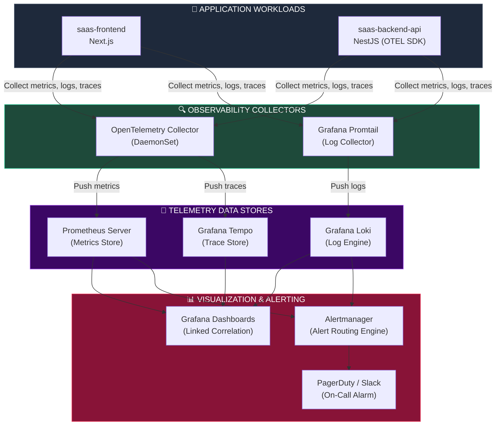
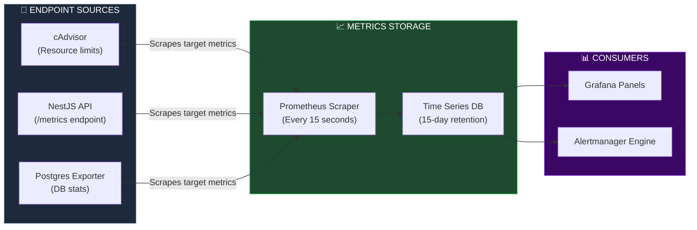
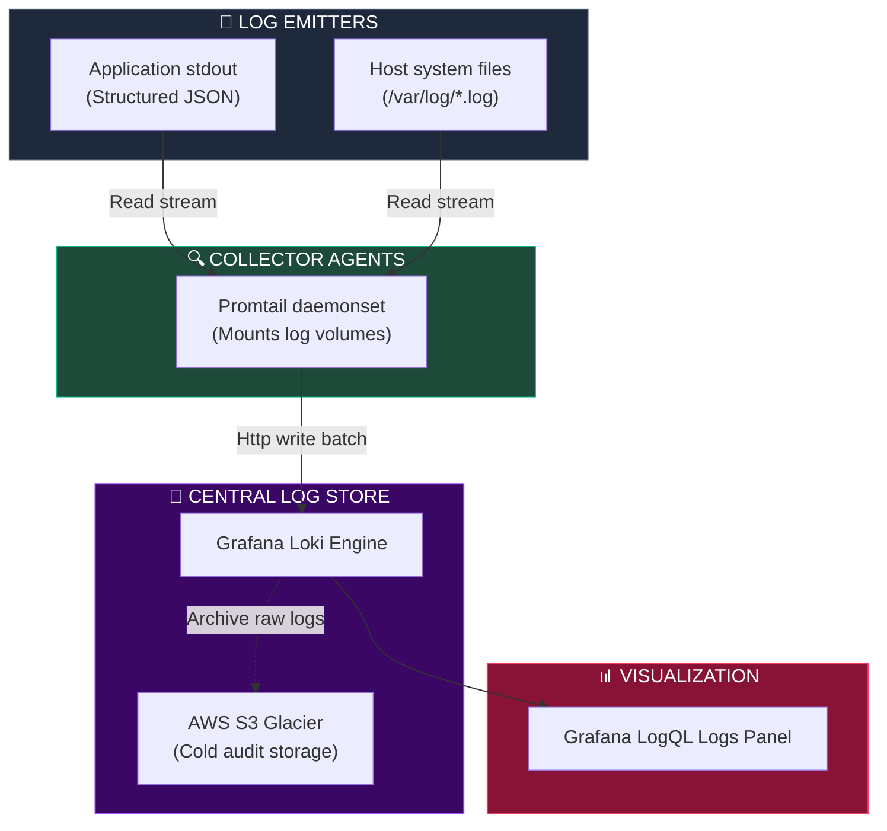
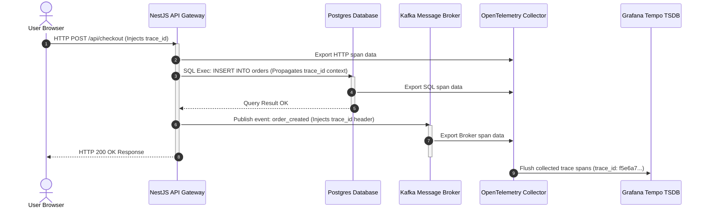
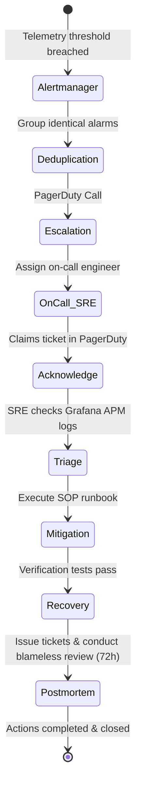

# INFRASTRUCTURE MONITORING, OBSERVABILITY & SITE RELIABILITY ENGINEERING (SRE)

**Project Name:** Enterprise SaaS Business Management Platform  
**Document Version:** 1.0.0 — Baseline Standard  
**Date:** July 14, 2026  
**Authors:** Principal Site Reliability Engineer (SRE), Observability Architect, Cloud Monitoring Specialist, DevOps Engineer, Platform Reliability Engineer & Enterprise SaaS Infrastructure Architect  
**Classification:** Enterprise Internal — Restricted (Infrastructure Sensitive)  
**Status:** 📊 APPROVED INFRASTRUCTURE MONITORING, OBSERVABILITY & SRE SPECIFICATION  

---

## TABLE OF CONTENTS

| Section | Title | Description |
| :---: | :--- | :--- |
| **§1** | [Observability Foundation](#section-1--observability-foundation) | Pillars of observability, relationships, and business value |
| **§2** | [Enterprise Observability Architecture](#section-2--enterprise-observability-architecture) | Unified collection topology and Mermaid architecture |
| **§3** | [Metrics Architecture](#section-3--metrics-architecture) | App, infra, business, DB, cache, and queue metrics |
| **§4** | [Centralized Logging](#section-4--centralized-logging) | Structured JSON logs, Loki collection, levels, and correlation |
| **§5** | [Distributed Tracing](#section-5--distributed-tracing) | Trace propagation flow with OpenTelemetry and Grafana Tempo |
| **§6** | [Grafana Dashboards](#section-6--grafana-dashboards) | App, infra, database, message queues, and executive panels |
| **§7** | [Alerting Architecture](#section-7--alerting-architecture) | Rules engines, deduplication, and notification routing |
| **§8** | [Incident Response](#section-8--incident-response) | Severity levels, alert triage, recovery, and postmortem templates |
| **§9** | [Service Level Management](#section-9--service-level-management) | SLI, SLO, SLA matrices and Error Budget calculations |
| **§10** | [Application Performance Monitoring](#section-10--application-performance-monitoring) | Response time, latency, error rates, and CPU/Memory profiles |
| **§11** | [Database Observability](#section-11--database-observability) | pg_stat metrics, replication lag, connection pools, index usage |
| **§12** | [Redis & Message Queue Observability](#section-12--redis--message-queue-observability) | Cache hit ratios, evictions, Kafka consumer lag, msg rates |
| **§13** | [Kubernetes Observability](#section-13--kubernetes-observability) | cAdvisor scraping, pod/node health, and HPA autoscaling states |
| **§14** | [Business Observability](#section-14--business-observability) | Active tenants, transaction velocity, revenue throughput, failed payments |
| **§15** | [Reliability Engineering](#section-15--reliability-engineering) | Capacity forecasting, chaos validation, load testing, fault injections |
| **§16** | [Incident Management](#section-16--incident-management) | Runbooks, escalation policies, on-call schedules, communications |
| **§17** | [Security Observability](#section-17--security-observability) | Audit logs, unauthorized access detections, API abuse tracking |
| **§18** | [Observability Tool Stack](#section-18--observability-tool-stack) | Complete monitoring tool comparison and ownership matrix |
| **§19** | [SRE Governance](#section-19--sre-governance) | Monitoring standards, alert audits, postmortem rules, operational checklist |
| **§20** | [Final Observability Architecture](#section-20--final-observability-architecture) | 5 comprehensive observability and SRE Mermaid diagrams |

---

## SECTION 1 — OBSERVABILITY FOUNDATION

### 1.1 The Three Pillars of Observability
To isolate issues within a high-throughput, multi-tenant SaaS application, operations teams rely on three complementary observability streams:
*   **Metrics (Aggregated Statistics):** Highly structured, numeric data points aggregated over time (e.g., CPU utilization, API requests per second). Metrics answer **whether** a system is experiencing a degradation and trigger near-real-time alerts.
*   **Logs (Detailed Event Streams):** Structured, time-stamped text records emitted by application components (e.g., database connection timeout warnings, login audit failures). Logs explain **why** a specific failure occurred.
*   **Traces (Contextual Transaction Path):** Chronological graphs showing request lifecycles across multiple microservices or monorepo packages (e.g., path of a POS checkout request from the UI to API gateway to database). Traces localize **where** performance bottlenecks reside.

### 1.2 Unified Correlation Strategy

```
CORRELATED TELEMETRY ANALYSIS
═══════════════════════════════════════════════════════════════════════════════
       1. Metric Alert
          │
          ▼
   [ AlertManager Trigger ] ──► "saas_http_error_rate > 1%"
          │
          ▼ 2. Correlate via Time and Service Context
   [ OpenTelemetry Tracing ] ──► Trace ID: abc123xyz
          │                       Locates bottleneck in database transaction
          ▼
          │ 3. Drill down via Trace-to-Log Link
   [ Centralized Logs ] ───────► Search: "trace_id=abc123xyz"
                                  Exposes raw exception: "Connection pool exhausted"
═══════════════════════════════════════════════════════════════════════════════
```

### 1.3 Enterprise Business Benefits
*   **Reduced MTTR (Mean Time to Resolution):** Outages are isolated and diagnosed in minutes rather than hours.
*   **Optimized Resource Allocation:** Performance traces pinpoint slow queries and resource leaks, enabling down-sizing or target-scaling of compute nodes.
*   **Guaranteed Service Quality (SLAs):** Proactive alerting flags issues before they impact client-facing service contracts.

---

## SECTION 2 — ENTERPRISE OBSERVABILITY ARCHITECTURE

### 2.1 The Unified Collection Model
We employ an OpenTelemetry-native architecture, standardizing collector endpoints to prevent tool lock-in.

```
THE TELEMETRY COLLECTION ARCHITECTURE
═══════════════════════════════════════════════════════════════════════════════
                         [ Workload Pods / Compute Nodes ]
        ┌──────────────────────────────────────────────────────────────┐
        │  ┌───────────────────┐ ┌───────────────────┐ ┌─────────────┐ │
        │  │ Next.js Frontend  │ │    NestJS API     │ │ PostgreSQL  │ │
        │  └─────────┬─────────┘ └─────────┬─────────┘ └──────┬──────┘ │
        │            │                     │                  │        │
        │            └──────────────┬──────┴──────────────────┘        │
        │                           ▼                                  │
        │             [ OpenTelemetry Collector ]                      │
        │             (Runs as sidecar or daemonset)                   │
        └───────────────────────────┬──────────────────────────────────┘
                                    │
           ┌────────────────────────┼────────────────────────┐
           ▼ (Metrics)              ▼ (Logs)                 ▼ (Traces)
     [ Prometheus ]               [ Loki ]                [ Tempo ]
           │                        │                        │
           └────────────────────────┼────────────────────────┘
                                    ▼
                             [ Grafana UI ]
                                    │
                                    ▼
                            [ Alertmanager ]
═══════════════════════════════════════════════════════════════════════════════
```

---

## SECTION 3 — METRICS ARCHITECTURE

### 3.1 Metric Scopes
Metrics are scraped at 15-second intervals and divided into four functional scopes:

*   **Application Metrics:** API latency distribution, request throughput, error ratios (HTTP 5xx).
*   **Infrastructure Metrics:** Host-level compute allocations (CPU, memory, disk I/O, node counts).
*   **Business Metrics:** POS transaction volume, active merchant sessions, invoice print rate.
*   **Data Tier Metrics:** Connection counts, cache hit rates, consumer queue depths.

### 3.2 Prometheus Metric Types Reference

| Metric Type | Operational Behavior | Example | SRE Application |
| :--- | :--- | :--- | :--- |
| **Counter** | A cumulative metric that only increases or resets to zero. | `saas_http_requests_total` | Calculating rate of change (throughput/sec). |
| **Gauge** | A single numerical value that can arbitrarily go up or down. | `saas_active_db_connections` | Monitoring resource usage levels (memory, thread pools). |
| **Histogram** | Samples observations (like duration) and counts them in buckets. | `saas_api_duration_seconds` | Calculating percentiles (e.g., p95, p99 latency). |
| **Summary** | Similar to Histogram, calculates configurable quantiles over a sliding window. | `saas_cache_read_duration` | High-fidelity client-side percentile calculations. |

---

## SECTION 4 — CENTRALIZED LOGGING

### 4.1 Structured JSON Logs
To ensure parsing consistency across search systems (Grafana Loki, Elasticsearch), all applications emit structured JSON logs to standard output/error, avoiding unstructured text logs.

```json
// Sample Backend Structured JSON Log Output
{
  "timestamp": "2026-07-14T07:53:00.123Z",
  "level": "error",
  "service": "saas-backend-api",
  "version": "1.0.0",
  "environment": "production",
  "tenant_id": "tenant-cambodia-retail-899",
  "user_id": "usr-cashier-056",
  "trace_id": "f5e6a7b8c9d0e1f2",
  "span_id": "a1b2c3d4e5f6",
  "method": "POST",
  "path": "/api/v1/pos/checkout",
  "status": 500,
  "duration_ms": 142.5,
  "message": "POS checkout failed due to connection pool timeout",
  "error": {
    "message": "Connection not available within timeout period",
    "stack": "Error: Connection not available...\n    at Pool.acquireConnection (/app/node_modules/pg/lib/pool.js:89:12)"
  }
}
```

### 4.2 Log Management Rules
*   **Log Levels:** Standard levels must be adhered to: `fatal`, `error`, `warn`, `info`, `debug`, `trace`. Production defaults to `info`.
*   **Correlation ID:** The platform's middleware intercepts incoming web requests, reads or generates a `trace_id`, and propagates it to all internal application logs and downstream database queries.
*   **Log Retention:** Operational logs are retained in Loki hot storage for 15 days. Security audit logs are forwarded to AWS S3 Glacier with a 7-year retention policy.

---

## SECTION 5 — DISTRIBUTED TRACING

### 5.1 Request Propagation Path
Distributed tracing tracks requests across process boundaries. Metadata headers are injected into HTTP calls and Kafka messages.

```
TRACE METADATA FLOW
═══════════════════════════════════════════════════════════════════════════════
[ Client Browser ]
        │ (POST /api/v1/pos/checkout)
        ▼ [w3c-trace-context: 00-f5e6a7b8c9d0...-01]
[ Ingress Nginx ]
        │
        ▼ [Injects trace header]
[ NestJS Backend API ]
        ├──────────────────────┐
        │                      │ (Produces Kafka event)
        ▼ (Reads trace state)   ▼ [w3c-trace-context: 00-f5e6a7b8c9d0...]
[ AWS RDS PostgreSQL ]  [ Kafka Broker (MSK) ]
                               │
                               ▼
                        [ BullMQ Worker Pod ]
═══════════════════════════════════════════════════════════════════════════════
```

### 5.2 OpenTelemetry NestJS Integration

```typescript
// backend/src/monitoring/tracing.ts
import { NodeSDK } from '@opentelemetry/sdk-node';
import { getNodeAutoInstrumentations } from '@opentelemetry/auto-instrumentations-node';
import { OTLPTraceExporter } from '@opentelemetry/exporter-trace-otlp-grpc';
import { Resource } from '@opentelemetry/resources';
import { SemanticResourceAttributes } from '@opentelemetry/semantic-conventions';

// Instantiate the OpenTelemetry Node SDK
const sdk = new NodeSDK({
  resource: new Resource({
    [SemanticResourceAttributes.SERVICE_NAME]: 'saas-backend-api',
    [SemanticResourceAttributes.SERVICE_VERSION]: '1.0.0',
    [SemanticResourceAttributes.DEPLOYMENT_ENVIRONMENT]: process.env.NODE_ENV || 'production',
  }),
  // Export traces directly via gRPC to the OpenTelemetry Collector
  traceExporter: new OTLPTraceExporter({
    url: process.env.OTEL_EXPORTER_OTLP_ENDPOINT || 'grpc://otel-collector.production.svc.cluster.local:4317',
  }),
  instrumentations: [
    getNodeAutoInstrumentations({
      // Exclude noisy instrumentation libraries
      '@opentelemetry/instrumentation-fs': { enabled: false },
    }),
  ],
});

// Start tracing SDK on application bootstrap
sdk.start();

// Gracefully shut down collector connection on process termination
process.on('SIGTERM', () => {
  sdk.shutdown()
    .then(() => console.log('Tracing SDK terminated.'))
    .catch((error) => console.log('Error terminating Tracing SDK', error))
    .finally(() => process.exit(0));
});
```

---

## SECTION 6 — GRAFANA DASHBOARDS

### 6.1 Dashboard Hierarchy
Dashboards are designed for different user roles to avoid visual noise and speed up troubleshooting.

```
DASHBOARD VISUALIZATION MATRIX
═══════════════════════════════════════════════════════════════════════════════
┌─────────────────────────────────┐
│     Executive SLO Dashboard     │ ◄── Key business indicators (SLA, Revenue, SLO)
└────────────────┬────────────────┘
                 │ (Outage detected)
                 ▼
┌─────────────────────────────────┐
│   Application APM Dashboard     │ ◄── RED metrics (Rate, Errors, Duration)
└────────────────┬────────────────┘
                 │ (Bottleneck isolated to cache layer)
                 ▼
┌─────────────────────────────────┐
│  Infrastructure Performance     │ ◄── Resource metrics (CPU, Memory, IOPS)
└─────────────────────────────────┘
═══════════════════════════════════════════════════════════════════════════════
```

*   **Executive Dashboard:** Tracks overall service availability (99.9% target), daily active users, total sales processed, and the active Error Budget.
*   **APM Dashboard:** Visualizes standard RED (Rate, Errors, Duration) metrics for NestJS and Next.js services.
*   **Database (PostgreSQL) Dashboard:** Tracks query execution latency, connection pool usage, lock count, active transactions, and replication lag.

---

## SECTION 7 — ALERTING ARCHITECTURE

### 7.1 Prometheus Rules Engine
Alerts are defined declaratively as Prometheus Rules and evaluated by the Prometheus engine.

```yaml
# deploy/prometheus/rules-app.yaml
apiVersion: monitoring.coreos.com/v1
kind: PrometheusRule
metadata:
  name: saas-api-alerts
  namespace: production
  labels:
    role: alert-rules
spec:
  groups:
    - name: application-latency-errors
      rules:
        # Alert: High HTTP 5xx Error Rate
        - alert: HighHttpErrorRate
          expr: sum(rate(saas_http_requests_total{status=~"5.."}[5m])) / sum(rate(saas_http_requests_total[5m])) * 100 > 1.5
          for: 2m
          labels:
            severity: critical
            tier: application
          annotations:
            summary: "High HTTP 5xx error rate detected: {{ $value | printf \"%.2f\" }}%"
            description: "Application backend api is returning error status codes for more than 1.5% of total requests over the last 5 minutes."
            runbook_url: "https://wiki.saas-platform.internal/sre/runbooks/high-error-rate"

        # Alert: Slow API Response Latency (p95)
        - alert: HighP95Latency
          expr: histogram_quantile(0.95, sum(rate(saas_http_request_duration_seconds_bucket[5m])) by (le)) > 0.5
          for: 5m
          labels:
            severity: warning
            tier: application
          annotations:
            summary: "High p95 API latency detected: {{ $value | printf \"%.2f\" }}s"
            description: "API endpoints are responding slow; p95 latency exceeds 500ms over the last 5 minutes."
            runbook_url: "https://wiki.saas-platform.internal/sre/runbooks/slow-latency"
```

### 7.2 Alert Routing Matrix

```
TELEMETRY ROUTING TOPOLOGY
═══════════════════════════════════════════════════════════════════════════════
┌─────────────────────────┐
│     Alertmanager        │ (Deduplicates and groups incoming alerts)
└────────────┬────────────┘
             │
             ├── [ Severity: Warning  ] ──► Route to: Slack / Email / Telegram
             │                              (Generates tickets, no call)
             │
             └── [ Severity: Critical ] ──► Route to: PagerDuty
                                            (Triggers on-call engineer alarm)
═══════════════════════════════════════════════════════════════════════════════
```

---

## SECTION 8 — INCIDENT RESPONSE

### 8.1 Severity Level Classifications

| Severity | Definition | Target Response (SLO) | Escalation Channel |
| :--- | :--- | :--- | :--- |
| **P1** | **Critical Platform Outage:** Core flows (checkout, payments) are non-functional for multiple tenants. | Acknowledge: < 5 min<br>Mitigate: < 1 hr | PagerDuty + Slack Incident Room + Live Incident Call. |
| **P2** | **Partial Degradation:** Non-core feature down (e.g., supplier report generation) or single tenant impacted. | Acknowledge: < 15 min<br>Mitigate: < 4 hr | PagerDuty + Slack notification. |
| **P3** | **Minor Issue:** Intermittent UI styling error or non-blocking system warn messages. | Acknowledge: < 4 hr<br>Resolve: < 24 hr | Automated ticket in Jira. |
| **P4** | **Cosmetic Improvement:** Minor feature requests or static text edits. | Next scheduled release | Backlog ticket. |

### 8.2 Incident Remediation Workflow
```
ALERT FIRED ──► ACKNOWLEDGE (SRE) ──► TRIAGE ──► MITIGATE ──► POSTMORTEM
```
1.  **Acknowledge:** On-call SRE claims the alert in PagerDuty, changing the status to "Acknowledged" to stop the escalation path.
2.  **Triage:** SRE checks Grafana dashboards to identify if the issue is application-level (e.g., code exception) or infrastructure-level (e.g., DB storage limit reached).
3.  **Mitigate:** The primary focus is restoring service (e.g., rolling back the last deploy, expanding storage volumes), not root-cause analysis.
4.  **Recovery:** SRE monitors telemetry to verify that the metrics return to baseline levels.
5.  **Postmortem:** A blameless review is conducted for all P1/P2 incidents within 72 hours of resolution to prevent future regressions.

---

## SECTION 9 — SERVICE LEVEL MANAGEMENT

### 9.1 SRE Targets (SLIs and SLOs)
*   **Service Level Indicator (SLI):** The quantitative metric measuring service health (e.g., `requests_resolved_successfully / total_requests`).
*   **Service Level Objective (SLO):** The target availability metric agreed upon with business units (e.g., `Availability >= 99.9%`).
*   **Service Level Agreement (SLA):** The client-facing legal contract committing to availability targets. SRE teams optimize for SLOs to ensure SLAs are not breached.

### 9.2 SLO Definition Table

| SLI Metric | SLO Target | SLA Threshold | Allowed Monthly Downtime |
| :--- | :--- | :--- | :--- |
| **API Availability** | $\ge 99.9\%$ | $\ge 99.5\%$ | 43m 49s |
| **POS Transaction Success** | $\ge 99.95\%$ | $\ge 99.9\%$ | 21m 54s |
| **p95 Latency** | $\le 200\text{ ms}$ | $\le 500\text{ ms}$ | — (degraded performance) |
| **Database Availability** | $\ge 99.99\%$ | $\ge 99.9\%$ | 4m 22s |

### 9.3 Error Budget Management
The **Error Budget** is the allowed failure rate over a rolling 30-day window (`100% - SLO`).
*   **SaaS SLO:** 99.9% Availability.
*   **Allowed Budget:** 0.1% of requests can fail.
*   **Budget Depletion Action:** If the error budget drops below 20% in a month, feature development stops, and engineering tasks are redirected to performance tuning and reliability work.

---

## SECTION 10 — APPLICATION PERFORMANCE MONITORING

### 10.1 Key APM Metrics (The Golden Signals)
The platform measures SRE reliability targets using Google's **Four Golden Signals**:

```
THE APM APIS GOLDEN SIGNALS
═══════════════════════════════════════════════════════════════════════════════
┌─────────────────────────┐
│ Latency                 │ ◄── Time taken to service a request (p50/p90/p99)
└─────────────────────────┘
┌─────────────────────────┐
│ Traffic                 │ ◄── Measure of demand (HTTP requests/sec, Kafka events)
└─────────────────────────┘
┌─────────────────────────┐
│ Errors                  │ ◄── Rate of requests that fail (HTTP 5xx, exceptions)
└─────────────────────────┘
┌─────────────────────────┐
│ Saturation              │ ◄── Measure of system fullness (memory, queue depth)
└─────────────────────────┘
═══════════════════════════════════════════════════════════════════════════════
```

*   **Slow Queries:** NestJS tracking logs transactions exceeding 250ms and raises database optimization alerts.

---

## SECTION 11 — DATABASE OBSERVABILITY

### 11.1 PostgreSQL Relational Metrics
Relational databases require detailed telemetry to identify lock contention and connection pool exhaustion.
*   **Active Connections:** Monitors pgBouncer connection usage. High connection usage alerts indicate the need to scale RDS resources.
*   **Replication Lag:** Evaluates Multi-AZ read replica replication delay. Alerts fire if replication lag exceeds 10 seconds.
*   **Vacuum Operations:** Tracks `autovacuum` sweeps to clean dead tuples and maintain transaction ID performance.

---

## SECTION 12 — REDIS & MESSAGE QUEUE OBSERVABILITY

### 12.1 Redis Cache Health Metrics
*   **Cache Hit Ratio:** `keyspace_hits / (keyspace_hits + keyspace_misses)`. High miss rates indicate caching strategy inefficiencies or premature TTL expirations.
*   **Memory Fragmentation:** Fragmentation ratios exceeding 1.5 trigger active memory defragmentation loops to reclaim host resources.

### 12.2 Kafka Messaging Performance Metrics
*   **Consumer Group Lag:** Tracks the delta between the log end offset and the current consumer offset. Higher lag values indicate worker node bottlenecks.

---

## SECTION 13 — KUBERNETES OBSERVABILITY

### 13.1 Kubelet & cAdvisor Metrics
*   **Pod Resource Restraints:** Tracks when containers approach their memory limit to predict and prevent OOM evictions.
*   **Node Ready State:** Alerts fire if host compute instances report a `NotReady` status, prompting rescheduling of affected pods.

---

## SECTION 14 — BUSINESS OBSERVABILITY

### 14.1 Custom Metrics for Business Logic
Observability tools help bridge infrastructure health with SaaS business KPIs to monitor platform value.
*   **Tenant Checkout Rate:** Tracks transaction throughput grouped by tenant ID to identify localized tenant payment gateway disruptions.
*   **Revenue Throughput:** Gauges the monetary volume of sales processed per hour. Sudden drops indicate potential checkout UI issues.

---

## SECTION 15 — RELIABILITY ENGINEERING

### 15.1 Chaos Engineering Experiments
The platform conducts automated chaos engineering experiments in the staging environment using **LitmusChaos**.
*   **Network Latency Injection:** Artificially introduces 250ms of network latency to PostgreSQL connections to verify that the NestJS application handles database connection pools gracefully.
*   **Pod Eviction Simulation:** Randomly terminates backend api pods to confirm that Kubernetes rescheduled tasks continue servicing requests without dropping active calls.

---

## SECTION 16 — INCIDENT MANAGEMENT

### 16.1 Runbooks & SOPs
Every alert must link to a corresponding Standard Operating Procedure (SOP) runbook to guide SREs during incident resolution.

```
RUNBOOK DIRECTORY & INCIDENT ACTIONS
─────────────────────────────────────────────────────────────────────────────
Runbook ID            │  Alert Target          │  Action Link
──────────────────────┼────────────────────────┼─────────────────────────────
SOP-ALERT-DB-CONN     │  HighDbConnections     │  https://wiki.saas.internal/db-conn
SOP-ALERT-KAFKA-LAG   │  HighConsumerLag       │  https://wiki.saas.internal/kafka-lag
SOP-ALERT-MEM-EXHAUST │  MemoryUsageExhausted  │  https://wiki.saas.internal/mem-leak
─────────────────────────────────────────────────────────────────────────────
```

---

## SECTION 17 — SECURITY OBSERVABILITY

### 17.1 Runtime Threat Audits
The observability stack monitors logs and system events to detect potential security threats:
*   **API Abuse:** Tracks rapid spikes in requests targeted at authentication endpoints or sensitive customer data exports.
*   **Failed Logins:** Alerts fire if a tenant account records more than 5 failed login attempts in 1 minute, indicating a potential brute-force attack.

---

## SECTION 20 — FINAL OBSERVABILITY ARCHITECTURE

### 20.1 Enterprise Observability Architecture



### 20.2 Metrics Collection Flow



### 20.3 Centralized Logging Pipeline



### 20.4 Distributed Tracing Flow



### 20.5 Incident Response Lifecycle



---

## DOCUMENT METADATA

| Field | Value |
| :--- | :--- |
| **Document ID** | SAAS-INFRA-015.5 |
| **Section** | 15 — Cloud Infrastructure |
| **Subsection** | 15.5 — Observability & Site Reliability Engineering |
| **Status** | 📊 APPROVED |
| **Version** | 1.0.0 |
| **Date** | July 14, 2026 |
| **Next Review** | January 14, 2027 |
| **Related Documents** | [Cloud Foundation](../15.1-Cloud-Foundation/Cloud-Foundation.md) · [Docker Strategy](../15.2-Docker-Container-Architecture/Docker-Container-Architecture.md) · [Kubernetes Architecture](../15.3-Kubernetes-Architecture/Kubernetes-Architecture.md) · [CI/CD & GitOps Architecture](../15.4-CICD-GitOps-Release-Management/CICD-GitOps-Release-Management.md) |
| **Technology Versions** | Prometheus v2.52 · Grafana v10.4 · Loki v2.9 · Tempo v2.4 · OpenTelemetry SDK v1.23 |

---

*This document is the authoritative specification for all infrastructure monitoring, observability, and SRE standards in the Enterprise SaaS Business Management Platform. All dashboards, alert rules, on-call schedules, and telemetry instrumentation must conform to the guidelines defined herein.*
