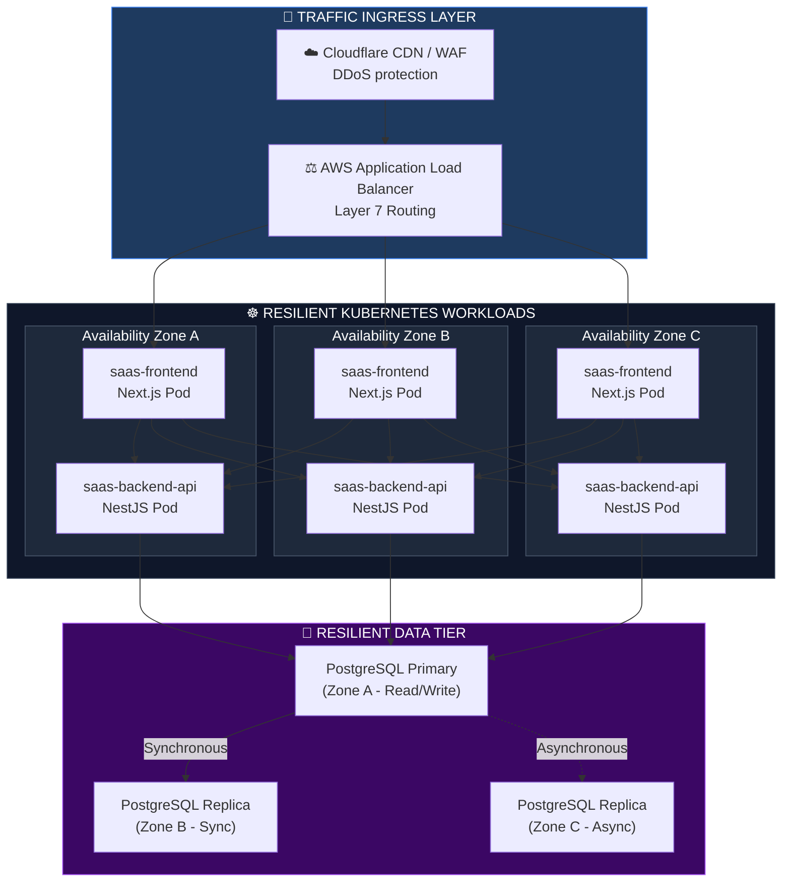
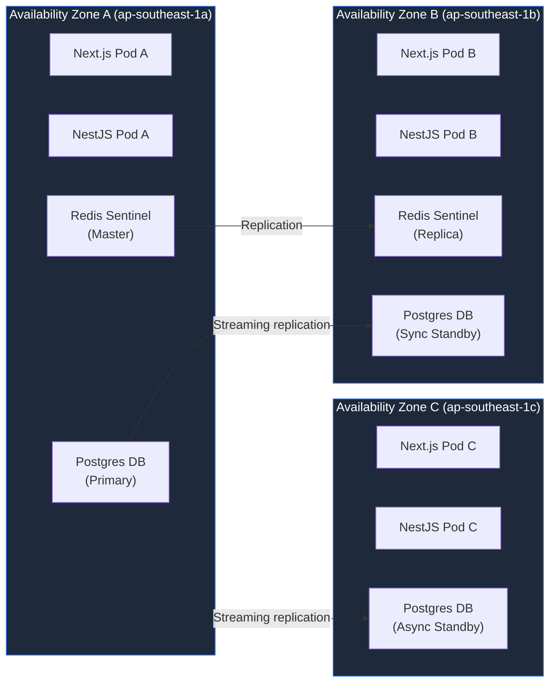
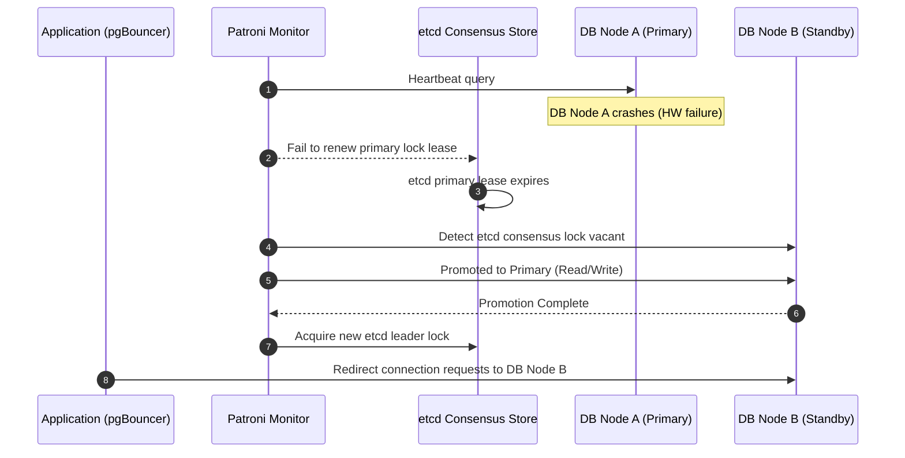
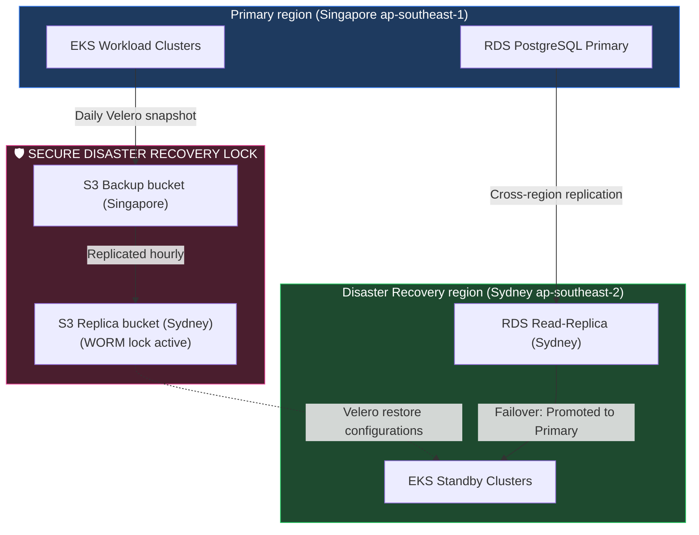
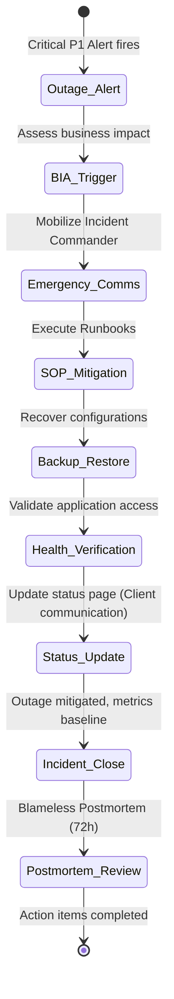

# HIGH AVAILABILITY, DISASTER RECOVERY & BUSINESS CONTINUITY ARCHITECTURE

**Project Name:** Enterprise SaaS Business Management Platform  
**Document Version:** 1.0.0 — Baseline Standard  
**Date:** July 14, 2026  
**Authors:** Principal Cloud Architect, Site Reliability Engineer (SRE), Disaster Recovery Architect, Business Continuity Consultant, Infrastructure Security Architect, Kubernetes Expert & Enterprise SaaS Platform Architect  
**Classification:** Enterprise Internal — Restricted (Infrastructure Sensitive)  
**Status:** 🛡️ APPROVED HIGH AVAILABILITY, DISASTER RECOVERY & BUSINESS CONTINUITY ARCHITECTURE SPECIFICATION  

---

## TABLE OF CONTENTS

| Section | Title | Description |
| :---: | :--- | :--- |
| **§1** | [High Availability Foundation](#section-1--high-availability-foundation) | Core principles, fault tolerance, availability target metrics |
| **§2** | [Enterprise High Availability Architecture](#section-2--enterprise-high-availability-architecture) | End-to-end routing resilience and global cluster design |
| **§3** | [Multi-AZ Deployment](#section-3--multi-az-deployment) | Availability Zones A/B/C traffic split and data sync rules |
| **§4** | [Load Balancing & Failover](#section-4--load-balancing--failover) | Layer 4/7 proxies, routing health checks, connection draining |
| **§5** | [Database High Availability](#section-5--database-high-availability) | Streaming replication, dynamic failovers, pgBouncer pooling |
| **§6** | [Redis High Availability](#section-6--redis-high-availability) | Sentinel vs. Cluster, leader elections, eviction, failover |
| **§7** | [Message Broker Resilience](#section-7--message-broker-resilience) | Partition replicas, partition in-sync replicas (ISR), DLQ routing |
| **§8** | [Backup Strategy](#section-8--backup-strategy) | Schedule matrix, encryption, retention policies, verification |
| **§9** | [Restore Strategy](#section-9--restore-strategy) | DB, configuration, secret, and full cluster recovery runbooks |
| **§10** | [Disaster Recovery Architecture](#section-10--disaster-recovery-architecture) | Warm/Hot site region configurations, RTO and RPO metrics |
| **§11** | [Business Continuity Plan](#section-11--business-continuity-plan) | Impact analysis, communication matrices, operational priorities |
| **§12** | [Chaos Engineering](#section-12--chaos-engineering) | Automated experiments, pod evictions, network partition tests |
| **§13** | [Resilience Testing](#section-13--resilience-testing) | Disaster recovery drill schedules, validation criteria, loops |
| **§14** | [Security During Disaster](#section-14--security-during-disaster) | Encryption of backups, WORM properties, secret recovery |
| **§15** | [Cloud Resilience](#section-15--cloud-resilience) | Cloud provider independence, replication, Route 53 DNS failover |
| **§16** | [Operational Runbooks](#section-16--operational-runbooks) | SOP action sheets for database, Redis, API, and cloud failures |
| **§17** | [Reliability Metrics](#section-17--reliability-metrics) | MTBF, MTTR, availability percentage, and backup success rates |
| **§18** | [HA & DR Tool Stack](#section-18--ha--dr-tool-stack) | Component operational tools, purposes, and ownerships |
| **§19** | [Governance](#section-19--governance) | Testing audit frequency, compliance validation, risk matrices |
| **§20** | [Final High Availability & DR Architecture](#section-20--final-high-availability--disaster-recovery-architecture) | 5 comprehensive architectural Mermaid diagrams |

---

## SECTION 1 — HIGH AVAILABILITY FOUNDATION

### 1.1 Core HA Design Principles
Resilience is a core feature of the platform's architecture. Systems are designed to anticipate, tolerate, and automatically recover from component failures without merchant disruption.
*   **Elimination of Single Points of Failure (SPOF):** Every infrastructure layer (dns, cdn, load balancing, compute instances, database nodes, message brokers, caching nodes) runs in redundant configurations.
*   **Active Redundancy:** Compute nodes span multiple isolated Availability Zones (AZs) to survive regional data center outages.
*   **Fault Tolerance:** Downstream errors (such as cache timeouts or transient queue disconnects) must degrade gracefully using circuit breakers and local fallback defaults.
*   **Self-Healing:** Workloads use liveness probes and resource thresholds to trigger automated recovery without human intervention.

### 1.2 Availability Target Scorecard

| Target SLA | Max Downtime / Year | Max Downtime / Month | Business Operational Impact | Enterprise Application |
| :--- | :--- | :--- | :--- | :--- |
| **99.9%** | 8h 45m 57s | 43m 49s | Brief service interruptions tolerated. Minor data delays acceptable. | Standard internal staging environments. |
| **99.95%** | 4h 22m 58s | 21m 54s | Production standard for non-critical tools. Quick failover required. | Reporting dashboard APIs. |
| **99.99%** | 52m 35s | 4m 22s | High Availability. Automated AZ failovers required. Zero human intervention. | **Backend Checkout APIs & POS Core Services.** |
| **99.999%** | 5m 15s | 26.3s | Carrier-grade availability. Real-time active-active replication. | Global DNS Routing & Edge WAF. |

---

## SECTION 2 — ENTERPRISE HIGH AVAILABILITY ARCHITECTURE

### 2.1 The Global High Availability Routing Architecture
Client traffic is filtered, distributed, and routed across a highly redundant multi-region cloud topology.

```
CLIENT END-TO-END RESILIENT ROUTING
═══════════════════════════════════════════════════════════════════════════════
                           [ Client Browser / POS ]
                                      │
                                      ▼
                        [ Cloudflare Anycast Global DNS ]
                                      │
                                      ▼
                         [ Cloudflare Edge WAF & CDN ]
                                      │
                                      ▼ (Cross-Region Traffic Routing)
                       [ AWS Application Load Balancer ]
                                      │
           ┌──────────────────────────┼──────────────────────────┐
           ▼ (AZ-1a)                  ▼ (AZ-1b)                  ▼ (AZ-1c)
     [ EKS Node Group 1 ]       [ EKS Node Group 2 ]       [ EKS Node Group 3 ]
           │                          │                          │
           ▼                          ▼                          ▼
     [ NestJS Pod 1 ]           [ NestJS Pod 2 ]           [ NestJS Pod 3 ]
           │                          │                          │
     ┌─────┴──────────────────────────┼──────────────────────────┴─────┐
     │                                │                                │
     ▼                                ▼                                ▼
[ Redis Sentinel ]            [ Kafka Cluster ]             [ Postgres HA Primary ]
                                                                       │ (Sync)
                                                                       ▼
                                                            [ Postgres HA Replica ]
═══════════════════════════════════════════════════════════════════════════════
```

---

## SECTION 3 — MULTI-AZ DEPLOYMENT

### 3.1 Multi-Zone Network Architecture
To isolate issues within a single physical data center, the platform spans three independent Availability Zones (AZ-1a, AZ-1b, AZ-1c) within the primary Singapore region (`ap-southeast-1`).

```
AVAILABILITY ZONE SUBNET SEGMENTATION
═══════════════════════════════════════════════════════════════════════════════
Region: ap-southeast-1
┌─────────────────────────┬─────────────────────────┬─────────────────────────┐
│  Availability Zone A    │  Availability Zone B    │  Availability Zone C    │
│                         │                         │                         │
│  ┌───────────────────┐  │  ┌───────────────────┐  │  ┌───────────────────┐  │
│  │ Public Subnet (ALB)│  │  │ Public Subnet (ALB)│  │  │ Public Subnet (ALB)│  │
│  └─────────┬─────────┘  │  └─────────┬─────────┘  │  └─────────┬─────────┘  │
│            ▼            │            ▼            │            ▼            │
│  ┌───────────────────┐  │  ┌───────────────────┐  │  ┌───────────────────┐  │
│  │ Private Subnet K8s│  │  │ Private Subnet K8s│  │  │ Private Subnet K8s│  │
│  └─────────┬─────────┘  │  └─────────┬─────────┘  │  └─────────┬─────────┘  │
│            ▼            │            ▼            │            ▼            │
│  ┌───────────────────┐  │  ┌───────────────────┐  │  ┌───────────────────┐  │
│  │ Data Subnet (RDS) │  │  │ Data Subnet (RDS) │  │  │ Data Subnet (RDS) │  │
│  └───────────────────┘  │  └───────────────────┘  │  └───────────────────┘  │
└─────────────────────────┴─────────────────────────┴─────────────────────────┘
═══════════════════════════════════════════════════════════════════════════════
```

### 3.2 Traffic Distribution & Data Sync Rules
*   **Traffic Distribution:** Application Load Balancers evaluate routing metrics to balance incoming requests evenly across all active zones.
*   **Replication Loop:** Compute resources are stateless. Data persistence layers use synchronous replication between Zone A (Primary) and Zone B (Synchronous Replica) to prevent data loss on failover events. Zone C hosts an asynchronous read replica.
*   **Dynamic Failover:** If Zone A experiences a power or hardware failure, the database coordinator automatically promotes the Zone B replica to Primary in under 30 seconds.

---

## SECTION 4 — LOAD BALANCING & FAILOVER

### 4.1 Layer 4 vs. Layer 7 Routing
*   **Layer 4 (AWS Network Load Balancer):** Performs low-level TCP/UDP routing, handling high throughput (millions of requests/second) and direct port redirection (e.g., routing Kafka traffic to brokers).
*   **Layer 7 (AWS Application Load Balancer):** Inspects application HTTP headers, cookies, TLS SNI certificates, and path parameters. Handles redirection rules, HTTP-to-HTTPS promotion, and path-based routing (e.g., forwarding `/api/*` to NestJS and `/*` to Next.js).

### 4.2 Health Check Strategy & Connection Draining
*   **Health Check Intervals:** ALB queries app endpoints every 5 seconds. If a pod returns HTTP 5xx codes or fails to respond twice consecutively, it is removed from routing tables.
*   **Connection Draining (Deregistration Delay):** When a pod is flagged for termination (e.g., during scale-down or rolling updates), the load balancer stops routing new requests but allows active connections up to 30 seconds to complete processing before termination.

---

## SECTION 5 — DATABASE HIGH AVAILABILITY

### 5.1 Patroni Orchestrated PostgreSQL Cluster
Production databases require automated replication and failover orchestration. The platform configures **Patroni** on top of PostgreSQL, utilizing **etcd** for leader elections and state consensus.

```
PATRONI HA DATABASE CLUSTER
═══════════════════════════════════════════════════════════════════════════════
                  [ Client Application / pgBouncer ]
                                  │
                                  ▼ (Virtual IP / VIP)
                  [ Patroni Leader Node: Zone A ]
                                  │
         ┌────────────────────────┴────────────────────────┐
         │ (Sync Streaming Replication)                    │ (Async Replication)
         ▼                                                 ▼
[ Patroni Standby: Zone B ]                       [ Patroni Standby: Zone C ]
(Automatic Promotion Target)                      (Read Replica)

              * etcd consensus cluster tracks leader heartbeat *
═══════════════════════════════════════════════════════════════════════════════
```

### 5.2 Dynamic Failover Sequence
1.  **Heartbeat Timeout:** The Patroni leader node in Zone A crashes.
2.  **Consensus Loss:** etcd registers a lease timeout after 10 seconds.
3.  **Leader Election:** The Patroni agent on the Zone B node detects etcd consensus loss and requests a leader lock.
4.  **Promotion:** Zone B is promoted to Primary. Its PostgreSQL instance changes from read-only to read-write.
5.  **DNS Update:** The virtual IP or DNS endpoint (managed by Patroni) updates to point to the new Primary IP.
6.  **Catch Up:** The Zone C Standby node is reconfigured to stream replication from the new Zone B Primary.

---

## SECTION 6 — REDIS HIGH AVAILABILITY

### 6.1 Caching Topologies
*   **Redis Standalone:** Single instance. High risk of data loss and downtime. Recommended for local development only.
*   **Redis Sentinel:** Active Primary instance with redundant replicas monitored by independent Sentinel nodes. Sentinels coordinate automated failovers if the primary fails. **Recommended for Session stores and Lock engines.**
*   **Redis Cluster:** Shards data across multiple primary nodes, allowing high scale-out throughput. **Recommended for high-volume application cache engines.**

```
REDIS SENTINEL TOPOLOGY
═══════════════════════════════════════════════════════════════════════════════
             ┌───────────────── Sentinel Cluster ─────────────────┐
             │  Sentinel 1          Sentinel 2          Sentinel 3│
             └──────┬───────────────────┬───────────────────┬─────┘
                    │                   │                   │
                    ▼                   ▼                   ▼
             ┌────────────────────────────────────────────────────┐
             │              Redis Master (Zone A)                 │
             └────────────────────────┬───────────────────────────┘
                                      │
                                      ▼ (Replication)
             ┌────────────────────────────────────────────────────┐
             │              Redis Replica (Zone B)                │
             └────────────────────────────────────────────────────┘
═══════════════════════════════════════════════════════════════════════════════
```

---

## SECTION 7 — MESSAGE BROKER RESILIENCE

### 7.1 Kafka Cluster Partition & Replica Design
Kafka handles asynchronous task delegation. To survive node failures, topics are configured with high replication.

```yaml
# Kafka topic configuration rules
Replication Factor: 3           # Each message is duplicated on 3 brokers
Min In-Sync Replicas (ISR): 2    # A write is only acknowledged if at least 2 brokers confirm write
Acks: "all"                     # Publisher waits for all in-sync replicas to commit
```

*   **Consumer Recovery:** If a consumer instance fails, the Kafka group coordinator initiates a partition rebalance, redirecting processing tasks to another consumer pod.
*   **Dead Letter Queue (DLQ):** Messages that fail processing (e.g., due to serialization errors or missing database records) are retried 3 times, then redirected to a DLQ topic (`orders-dead-letter`) for manual auditing, preventing queue blocking.

---

## SECTION 8 — BACKUP STRATEGY

### 8.1 Backup Schedule Matrix

| Data Asset | Backup Type | Frequency | Storage Location | Retention | Encryption |
| :--- | :--- | :--- | :--- | :--- | :--- |
| **PostgreSQL DB** | WAL archiving + Daily Full Dump | Continuous + 24 Hours | AWS S3 (Standard IA) | 35 Days (PITR) | AES-256 (KMS) |
| **K8s Configs** | Velero State Snapshot | 6 Hours | AWS S3 (Same-Region) | 30 Days | AES-256 (KMS) |
| **S3 Media Assets** | Cross-Region Sync | Continuous | AWS S3 (Sydney Region) | Indefinite | SSE-KMS |
| **Database Audit** | Log Export | Daily | AWS S3 (WORM Object Lock) | 7 Years | SSE-KMS |

---

## SECTION 9 — RESTORE STRATEGY

### 9.1 Database Restore Workflow (PITR)
Point-in-Time Recovery (PITR) allows database restoration to any specific millisecond within the backup retention window by replaying transaction logs over a baseline backup.

```
POINT-IN-TIME RECOVERY STEPS
═══════════════════════════════════════════════════════════════════════════════
1. Fetch base snapshot created prior to target target restore time
   │
   ▼
2. Provision new PostgreSQL instance with WAL recovery configurations active
   │
   ▼
3. Stream Write-Ahead Logs (WAL) from target backup S3 bucket
   │
   ▼
4. Replay transactions sequentially up to target timestamp: 2026-07-14T01:05:00Z
   │
   ▼
5. Stop replay, promote database instance, and update application connection strings
═══════════════════════════════════════════════════════════════════════════════
```

---

## SECTION 10 — DISASTER RECOVERY ARCHITECTURE

### 10.1 Recovery Strategy Comparison

| Strategy | RTO (Restoration Speed) | RPO (Data Integrity) | Cost Overhead | Target SaaS Tier |
| :--- | :--- | :--- | :--- | :--- |
| **Cold Site** | 24–48 Hours | Up to 24 Hours | Low | Not recommended. |
| **Warm Site** | 1–4 Hours | < 1 Hour | Medium | Core non-critical SaaS modules. |
| **Hot Site (Active/Passive)** | < 15 Minutes | < 1 Minute | High | **Standard Production Target.** |
| **Multi-Region (Active/Active)**| < 30 Seconds | Near Zero | Very High | Premium enterprise tier customers. |

*   **SaaS Production Targets:**
    *   **Recovery Time Objective (RTO):** $\le 15\text{ minutes}$ for service restoration.
    *   **Recovery Point Objective (RPO):** $\le 1\text{ minute}$ for database transactions.

---

## SECTION 11 — BUSINESS CONTINUITY PLAN

### 11.1 Critical Business Functions & Priority

```
CRITICAL FUNCTION RESTORATION HIERARCHY
═══════════════════════════════════════════════════════════════════════════════
Priority 1: POS Checkout & Payments Success (Core business)
   │
   ▼
Priority 2: Inventory & Store Operations Sync
   │
   ▼
Priority 3: Reports, Analytics & Invoicing Generation
   │
   ▼
Priority 4: Developer CI/CD Pipelines & Operational Monitoring
═══════════════════════════════════════════════════════════════════════════════
```

### 11.2 Emergency Contact Matrix

| Role | Designation | Emergency Communication Channel | Primary Responsibility |
| :--- | :--- | :--- | :--- |
| **Incident Commander** | VP of Infrastructure | Zoom Bridge / Phone Hotline | Overall incident coordination. |
| **Communications Lead** | Head of PR | Email / Public Status Page | Client updates, status notifications. |
| **SRE Lead** | Principal SRE | Ops Bridge / Slack `#incident-war-room` | Core technical resolution. |
| **DBA Lead** | Database Engineer | Dedicated Slack channel | Database recovery and verification. |

---

## SECTION 12 — CHAOS ENGINEERING

### 12.1 Automated Chaos Injection Rules
To verify resilience assumptions, SRE teams inject faults into the staging environment during business hours.

*   **Host Instance Failure:** Automatically terminates an EC2 worker node hosting NestJS application pods. **Expected result:** Kubernetes detects the loss of the node and reschedules target workloads onto healthy nodes within 30 seconds without impacting active requests.
*   **Network Partition Simulation:** Artificially isolates Kafka broker instances. **Expected result:** NestJS application buffers messages locally, then flushes them once the network connection is restored.

---

## SECTION 13 — RESILIENCE TESTING

### 13.1 Drill Schedule

```
RECURRING RESILIENCE TEST SCHEDULE
═══════════════════════════════════════════════════════════════════════════════
Monthly: Automated database backup restoration testing
   │
   ▼
Quarterly: Patroni database failover test
   │
   ▼
Bi-Annually: Kubernetes worker node termination simulations
   │
   ▼
Annually: Full Multi-Region Disaster Recovery failover drill
═══════════════════════════════════════════════════════════════════════════════
```

---

## SECTION 14 — SECURITY DURING DISASTER

### 14.1 Backup Integrity Standards
*   **Encryption at Rest:** All backups, database snapshots, and WAL archives are encrypted with KMS-managed customer keys using AES-256 algorithms.
*   **Immutable Backups (Write Once, Read Many):** Backup S3 buckets are configured with **S3 Object Lock** in Compliance mode. This prevents deletion or modification of backup files (even by compromised admin accounts) for the duration of the retention window.
*   **Secret Protection:** Recovery procedures do not export secrets (such as API keys or DB passwords) to plain text files. Credentials are recovered directly from AWS Secrets Manager using IAM role mappings.

---

## SECTION 15 — CLOUD RESILIENCE

### 15.1 Cross-Region Replication Design
To survive a complete AWS regional outage (e.g., failure of Singapore `ap-southeast-1`), the platform maintains a secondary disaster recovery site in the Sydney region (`ap-southeast-2`).

```
CROSS-REGION FAILOVER TOPOLOGY
═══════════════════════════════════════════════════════════════════════════════
Primary Region: ap-southeast-1 (Singapore)
  [ Running EKS Cluster ] ───► [ RDS PostgreSQL Primary ]
                                          │
                                          │ (Continuous Cross-Region Replication)
                                          ▼
Secondary Region: ap-southeast-2 (Sydney)
  [ Standby EKS Cluster ] ───► [ RDS PostgreSQL Read Replica ]
                                          ▲
                                          │ (On Failover Action)
                                          └── Ingress DNS promoted to Sydney
═══════════════════════════════════════════════════════════════════════════════
```

---

## SECTION 16 — OPERATIONAL RUNBOOKS

### 16.1 SOP Action Sheets for Database Failures

```
STANDARD OPERATING PROCEDURE: SOP-DR-042 (RDS Failover)
─────────────────────────────────────────────────────────────────────────────
Trigger Condition: Automated failover fails or RDS reports "Degraded" status.

Action Steps:
1. Validate PostgreSQL leader node status:
   $ patronictl -c /etc/patroni/patroni.yml list
2. Identify standbys and replication lag.
3. If primary is unresponsive and auto-failover hung, force promote standby:
   $ patronictl -c /etc/patroni/patroni.yml failover
4. Monitor backend application logs for connection recovery.
5. Post-mitigation: File root-cause ticket in Jira.
─────────────────────────────────────────────────────────────────────────────
```

---

## SECTION 17 — RELIABILITY METRICS

### 17.1 SRE Metrics
*   **Mean Time Between Failures (MTBF):** $\text{Total Uptime} / \text{Number of Breakdowns}$. Target: $\ge 90\text{ days}$.
*   **Mean Time to Repair (MTTR):** $\text{Total Downtime} / \text{Number of Breakdowns}$. Target: $\le 15\text{ minutes}$.
*   **Backup Success Rate:** Target: $100\%$ successful backups and verification tests daily.

---

## SECTION 18 — HA & DR TOOL STACK

### 18.1 High Availability & Disaster Recovery Tool Stack

| Category | Tool | Production Purpose | System Owner |
| :--- | :--- | :--- | :--- |
| **DB Failover** | Patroni | Orchestrates PostgreSQL replication and automatic leader elections. | SRE / Database Lead |
| **Connection Pool** | pgBouncer | Handles database connection pooling. | Platform Engineer |
| **Cache HA** | Redis Sentinel | Monitors Redis master/replica states and coordinates failovers. | DevOps / SRE |
| **Backup Utility** | Velero | Backs up and restores Kubernetes cluster resources and volumes. | SRE / Platform |
| **Storage Driver** | Longhorn / EBS CSI | Handles block storage replication across Availability Zones. | Platform Engine |
| **DNS Failover** | AWS Route 53 | Performs latency-based routing and automated health check failovers. | Cloud Architect |
| **IaC Provisioner** | Terraform | Re-provisions infrastructure in secondary DR regions. | DevOps / Platform |

---

## SECTION 19 — GOVERNANCE

### 19.1 Backup & DR Compliance Policies
*   **Backup Policy:** All databases must execute continuous WAL archiving. Deletion of backup snapshots is prevented via WORM object policies.
*   **DR Testing Frequency:** Patroni database failover tests must be performed quarterly. Regional DR restoration drills are conducted annually.
*   **Runbook Reviews:** SOP files must be audited and updated after every major platform release or database schema update.

---

## SECTION 20 — FINAL HIGH AVAILABILITY & DISASTER RECOVERY ARCHITECTURE

### 20.1 Enterprise High Availability Architecture



### 20.2 Multi-AZ Deployment



### 20.3 Database Failover Flow



### 20.4 Disaster Recovery Workflow



### 20.5 Business Continuity Lifecycle



---

## DOCUMENT METADATA

| Field | Value |
| :--- | :--- |
| **Document ID** | SAAS-INFRA-015.6 |
| **Section** | 15 — Cloud Infrastructure |
| **Subsection** | 15.6 — High Availability & Disaster Recovery |
| **Status** | 🛡️ APPROVED |
| **Version** | 1.0.0 |
| **Date** | July 14, 2026 |
| **Next Review** | January 14, 2027 |
| **Related Documents** | [Cloud Foundation](../15.1-Cloud-Foundation/Cloud-Foundation.md) · [Docker Strategy](../15.2-Docker-Container-Architecture/Docker-Container-Architecture.md) · [Kubernetes Architecture](../15.3-Kubernetes-Architecture/Kubernetes-Architecture.md) · [CI/CD & GitOps Architecture](../15.4-CICD-GitOps-Release-Management/CICD-GitOps-Release-Management.md) · [Observability & SRE](../15.5-Observability-SRE/Observability-SRE.md) |
| **Technology Versions** | Patroni v3.2 · pgBouncer v1.22 · Redis Sentinel v7.2 · Velero v1.13 · Route 53 (AWS) |

---

*This document is the authoritative specification for all high availability, disaster recovery, and business continuity decisions in the Enterprise SaaS Business Management Platform. All backup schedules, replication rules, failover procedures, and incident management workflows must conform to the standards defined herein.*
