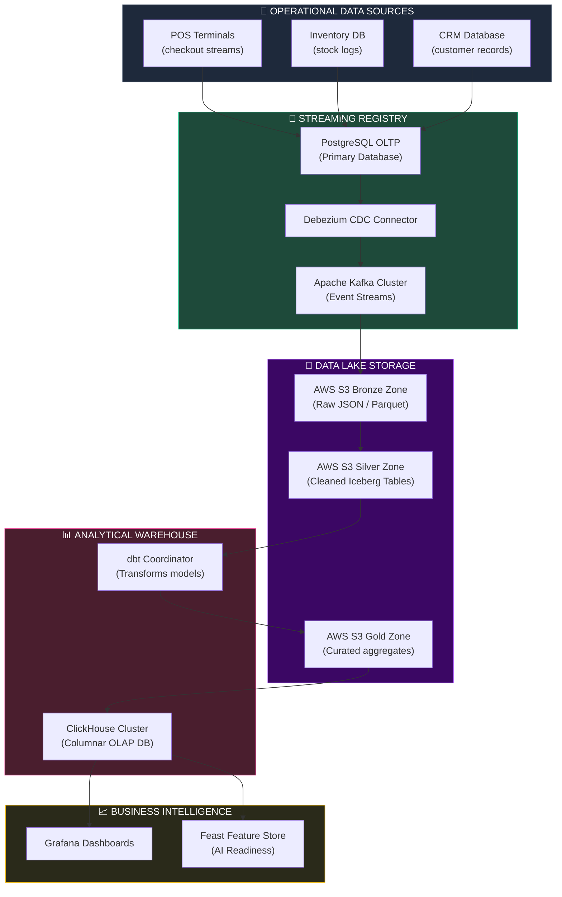
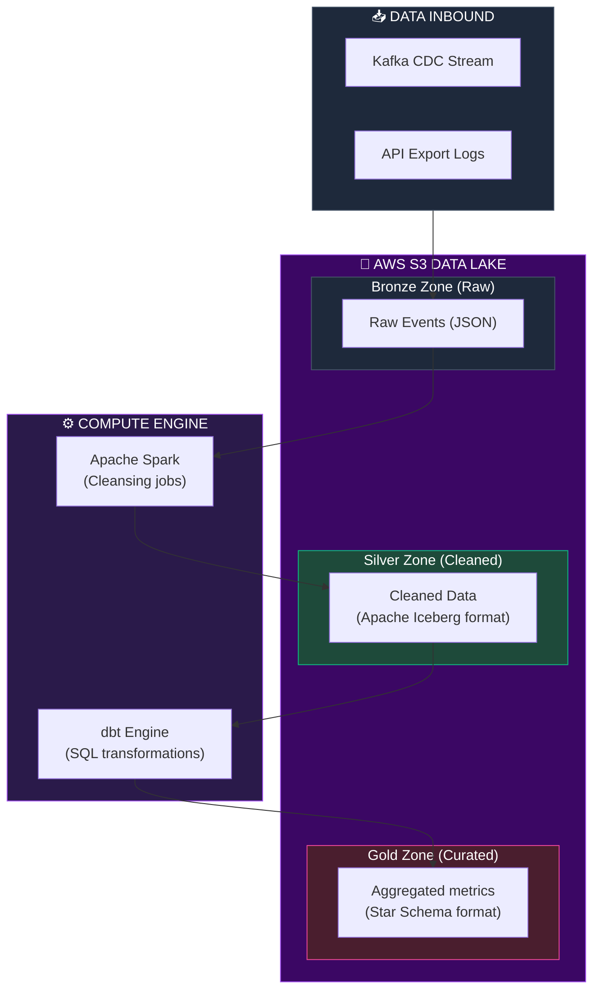
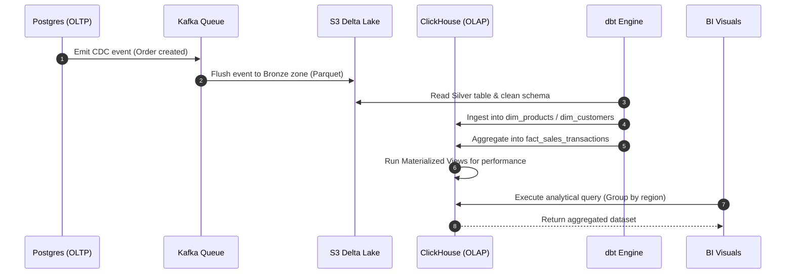
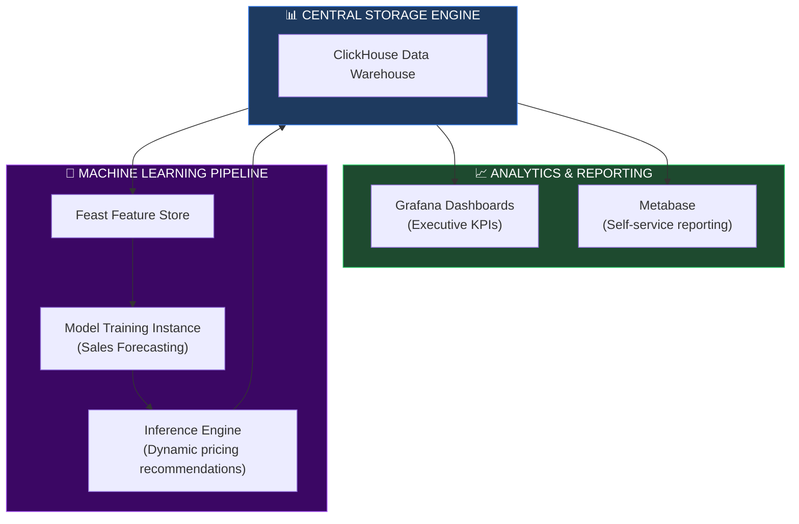

# ENTERPRISE DATA PLATFORM, DATA WAREHOUSE & DATA LAKE ARCHITECTURE

**Project Name:** Enterprise SaaS Business Management Platform  
**Document Version:** 1.0.0 — Baseline Standard  
**Date:** July 14, 2026  
**Authors:** Principal Data Architect, Enterprise Data Platform Engineer, Data Warehouse Architect, Data Lake Specialist, Analytics Platform Architect & Enterprise SaaS Platform Architect  
**Classification:** Enterprise Internal — Restricted (Infrastructure Sensitive)  
**Status:** 🗄️ APPROVED ENTERPRISE DATA PLATFORM, DATA WAREHOUSE & DATA LAKE ARCHITECTURE SPECIFICATION  

---

## TABLE OF CONTENTS

| Section | Title | Description |
| :---: | :--- | :--- |
| **§1** | [Enterprise Data Foundation](#section-1--enterprise-data-foundation) | Operational vs. analytical data strategies, business value |
| **§2** | [Enterprise Data Architecture](#section-2--enterprise-data-architecture) | Unified end-to-end data flow, components, and topology |
| **§3** | [Data Sources](#section-3--data-sources) | POS, inventory, CRM, financial systems, and external inputs |
| **§4** | [Data Lake Architecture](#section-4--data-lake-architecture) | Raw, Clean, Curated, and AI zones storage architecture |
| **§5** | [Data Warehouse Architecture](#section-5--data-warehouse-architecture) | Dimensional modeling: Fact/Dimension tables and Star schema |
| **§6** | [ETL / ELT Pipelines](#section-6--etl--elt-pipelines) | Batch vs. Streaming pipelines, dbt-based transformation |
| **§7** | [Real-Time Data Streaming](#section-7--real-time-data-streaming) | Change Data Capture (CDC), Kafka pipelines, dynamic reporting |
| **§8** | [Master Data Management (MDM)](#section-8--master-data-management-mdm) | Core entities, single-source-of-truth governance, schemas |
| **§9** | [Data Quality Management](#section-9--data-quality-management) | Validation rules, duplicate resolution, anomaly profiling |
| **§10** | [Data Governance](#section-10--data-governance) | Data stewards, classification metadata, lifecycle retention |
| **§11** | [Business Intelligence Foundation](#section-11--business-intelligence-foundation) | Exec, sales, inventory, and finance reporting layout structures |
| **§12** | [Analytics Data Model](#section-12--analytics-data-model) | Calculation metrics for revenue, CLV, turnover, productivity |
| **§13** | [Data Security](#section-13--data-security) | Column-level encryption, dynamic masking, tenant isolation |
| **§14** | [Data Observability](#section-14--data-observability) | Pipeline freshness, completeness, lineage, and data drift |
| **§15** | [AI Data Readiness](#section-15--ai-data-readiness) | Feature stores, model training exports, vectorization assets |
| **§16** | [Data Tool Stack](#section-16--data-tool-stack) | Platform software matrix, purpose, and operations ownership |
| **§17** | [Performance Optimization](#section-17--performance-optimization) | Partitioning keys, columnar compression, materialized projections |
| **§18** | [Backup & Compliance](#section-18--backup--compliance) | Audit trails, legal holds, regulatory compliance policies |
| **§19** | [Data Platform Governance](#section-19--data-platform-governance) | Naming rules, schema evolution management, version controls |
| **§20** | [Final Enterprise Data Platform](#section-20--final-enterprise-data-platform) | 5 comprehensive architectural Mermaid data diagrams |

---

## SECTION 1 — ENTERPRISE DATA FOUNDATION

### 1.1 Operational vs. Analytical Data Strategies
Modern SaaS architectures require a clean separation of concerns between operational transaction engines (OLTP) and analytical calculation engines (OLAP).
*   **Operational Data (OLTP):** Optimized for low-latency write/update transactions (e.g., POS checkouts, inventory stock inserts). Relies on highly normalized relational databases (PostgreSQL) to avoid data duplication.
*   **Analytical Data (OLAP):** Optimized for high-volume aggregate queries (e.g., computing a merchant's sales growth over 5 years). Relies on columnar storage engines (ClickHouse, Snowflake) designed to scan billions of records in seconds.

### 1.2 The Enterprise Analytics Hierarchy

```
DATA-TO-DECISION PIPELINE
═══════════════════════════════════════════════════════════════════════════════
       1. Raw Data (POS checkout transaction logs)
          │
          ▼
   [ Data Lake Ingestion ] ──► Store immutable parquet tables on AWS S3
          │
          ▼ 2. Standardize & Aggregate (dbt pipeline)
   [ Data Warehouse Model ] ──► Star schema with Facts & Dimensions
          │
          ▼
          │ 3. Business Intelligence / AI Inference
   [ Decision Support ] ──────► "Suggest purchase order: reorder 50 units of milk"
═══════════════════════════════════════════════════════════════════════════════
```

---

## SECTION 2 — ENTERPRISE DATA ARCHITECTURE

### 2.1 End-to-End Enterprise Data Flow
The platform captures, processes, aggregates, and visualizes transactional data via a multi-tiered pipeline.

```
THE DATA PLATFORM PIPELINE
═══════════════════════════════════════════════════════════════════════════════
 [ Public Applications ] ──► [ OLTP Database (Postgres) ]
                                      │
                                      ▼ (Change Data Capture / CDC via Debezium)
                             [ Apache Kafka Topics ]
                                      │
                                      ▼ (Batch/Stream Ingest)
                       [ AWS S3 Delta/Iceberg Lake ]
                                      │
                                      ▼ (Transformations via Spark / dbt)
                          [ ClickHouse Data Warehouse ]
                                      │
           ┌──────────────────────────┴──────────────────────────┐
           ▼                                                     ▼
 [ Grafana / Metabase BI ]                             [ AI Feature Store ]
═══════════════════════════════════════════════════════════════════════════════
```

---

## SECTION 3 — DATA SOURCES

### 3.1 Data Source Matrix
The platform aggregates data from multiple operational components:
*   **POS Terminal:** Checkout transaction streams, terminal cash audits, payment gateway events.
*   **Inventory Manager:** Purchase orders, stock arrivals, internal branch allocations.
*   **CRM / Loyalty System:** Customer contact files, reward point balances, email marketing campaigns.
*   **Financials:** Cash ledgers, accounts payable/receivable, tenant billing logs.
*   **Human Resources:** Employee timesheets, hourly wages, branch access logs.

---

## SECTION 4 — DATA LAKE ARCHITECTURE

### 4.1 Zone Segregation Model
The Data Lake serves as the central repository for raw, clean, and processed files, utilizing object storage (AWS S3) formatted in Apache Iceberg tables.

```
DATA LAKE ZONE STRUCTURE
─────────────────────────────────────────────────────────────────────────────
Zone          │ Format                │ Read Access Rules
──────────────┼───────────────────────┼──────────────────────────────────────
Raw (Bronze)  │ Immutable JSON/Parquet│ Ingestion pipelines only. Read-only.
Clean (Silver)│ Parquet (Iceberg)     │ Data Engineers. Injected metadata keys.
Curated (Gold)│ Parquet (Iceberg)     │ BI Tools, data analysts, report tools.
AI (Platinum) │ Parquet/Numpy         │ Machine learning training engines.
─────────────────────────────────────────────────────────────────────────────
```

*   **Storage Strategy:** Delta tables on S3 are encrypted at rest with AWS KMS, version-controlled, and pruned via lifecycle rules that archive Raw data to Glacier after 90 days.

---

## SECTION 5 — DATA WAREHOUSE ARCHITECTURE

### 5.1 Dimensional Modeling: Fact and Dimension Tables
To simplify analytical SQL queries and optimize read performance, the Data Warehouse uses a **Star Schema** architecture.

```
STAR SCHEMA TOPOLOGY
═══════════════════════════════════════════════════════════════════════════════
                   [ dim_customers ]
                           │
                   [ dim_products ] ───┐
                           │           │
                           ▼           ▼
                   [ fact_sales_transactions ] ◄─── [ dim_branches ]
                           ▲           ▲
                           │           │
                   [ dim_employees ] ──┘
                           │
                    [ dim_time ]
═══════════════════════════════════════════════════════════════════════════════
```

*   **Fact Tables:** Store numerical measurements of business processes (e.g., quantity sold, total tax, net profit). Relies on surrogate keys pointing to dimensions.
*   **Dimension Tables:** Store descriptive metadata attributes describing the business context (e.g., product name, category, customer address, branch region).

### 5.2 Warehouse DDL Schema Definition

```sql
-- warehouse/schema/dim_products.sql
CREATE TABLE dim_products (
    product_key UInt64,
    product_id String,
    tenant_id String,
    product_name String,
    category_name String,
    barcode String,
    base_unit String,
    cost_price Decimal(18, 4),
    retail_price Decimal(18, 4),
    is_active UInt8,
    created_at DateTime
) ENGINE = ReplacingMergeTree()
ORDER BY (tenant_id, product_key);

-- warehouse/schema/fact_sales_transactions.sql
CREATE TABLE fact_sales_transactions (
    transaction_key UInt64,
    transaction_id String,
    tenant_id String,
    branch_key UInt64,
    customer_key UInt64,
    product_key UInt64,
    employee_key UInt64,
    time_key UInt32,
    quantity Decimal(18, 4),
    unit_cost Decimal(18, 4),
    unit_price Decimal(18, 4),
    discount_amount Decimal(18, 4),
    tax_amount Decimal(18, 4),
    gross_amount Decimal(18, 4),
    net_amount Decimal(18, 4)
) ENGINE = MergeTree()
PARTITION BY toYYYYMM(toDate(time_key))
ORDER BY (tenant_id, branch_key, product_key, time_key);
```

---

## SECTION 6 — ETL / ELT PIPELINES

### 6.1 Transformation Strategy
*   **ETL (Extract, Transform, Load):** Transform data before loading. Best for legacy systems, but slow and CPU-bound at the pipeline gateway.
*   **ELT (Extract, Load, Transform):** Raw data is loaded directly into the destination warehouse, using the warehouse's compute capacity (dbt + ClickHouse/Snowflake) to transform the data. **Recommended for SaaS scalability.**
*   **Streaming ETL:** Uses tools like Apache Flink or Spark Streaming to transform data in real-time as it traverses messaging brokers (Kafka). **Recommended for real-time dashboards.**

---

## SECTION 7 — REAL-TIME DATA STREAMING

### 7.1 CDC to Kafka Pipeline
Changes in the PostgreSQL operational database are captured in real-time using Debezium CDC and streamed to Apache Kafka topics.

```
STREAMING DATA PROCESSING PIPELINE
═══════════════════════════════════════════════════════════════════════════════
PostgreSQL Write ──► Debezium CDC Connector ──► Kafka Topic (orders-event)
                                                   │
     ┌─────────────────────────────────────────────┴───────────────────────────┐
     ▼                                                                         ▼
[ Apache Spark Streaming ]                                             [ ClickHouse Engine ]
(Calculate running KPIs)                                               (Dynamic Ingestion)
     │                                                                         │
     ▼                                                                         ▼
[ Redis Cache Store ] ──► real-time dashboards                         [ Star Schema Store ]
═══════════════════════════════════════════════════════════════════════════════
```

---

## SECTION 8 — MASTER DATA MANAGEMENT (MDM)

### 8.1 Single-Source-of-Truth Core Entities
The platform establishes a Master Data Management (MDM) framework to maintain consistency for shared business entities across all tenant environments.

```json
// Sample MDM Tenant Entity Master Schema
{
  "$schema": "https://json-schema.org/draft/2020-12/schema",
  "title": "MasterTenant",
  "type": "object",
  "required": ["tenant_id", "legal_name", "tax_number", "billing_address"],
  "properties": {
    "tenant_id": { "type": "string" },
    "legal_name": { "type": "string" },
    "tax_number": { "type": "string" },
    "currency_code": { "type": "string", "maxLength": 3 },
    "billing_address": {
      "type": "object",
      "required": ["country", "city", "street"],
      "properties": {
        "country": { "type": "string" },
        "city": { "type": "string" },
        "street": { "type": "string" }
      }
    }
  }
}
```

---

## SECTION 9 — DATA QUALITY MANAGEMENT

### 9.1 Quality Validation Gates
During the ELT Silver layer transformation, data quality rules are evaluated, and anomalies are logged to a dead-letter queue.
*   **Zero-price verification:** Sales transactions with negative unit costs are flagged for review.
*   **Orphan key checks:** Checks that all sales fact items correspond to a valid product in `dim_products`.
*   **Deduplication checks:** Uses dynamic hashing to discard duplicated events at the ingestion gateway.

---

## SECTION 10 — DATA GOVERNANCE

### 10.1 Access & Ownership Rules
*   **Data Stewardship:** Product owners are responsible for their respective domain schemas (e.g., POS team owns transaction structures).
*   **Data Classification:** Data is tagged using four classification levels:
    *   `Highly Restricted`: Credit card details, user passwords (encrypted/masked).
    *   `Restricted`: Customer names, emails, transaction values.
    *   `Confidential`: Internal tenant cost prices, salary logs.
    *   `Public`: Product barcodes, branch locations.
*   **Lifecycle Rules:** Curated data is stored indefinitely for long-term reporting. Raw data is archived or deleted after 90 days to reduce storage costs.

---

## SECTION 11 — BUSINESS INTELLIGENCE FOUNDATION

### 11.1 Standard Reporting Metrics
*   **Revenue Performance:** Gross vs. Net sales, average order value (AOV), branch sales growth.
*   **Inventory Health:** Inventory turnover ratio, stock-to-sales ratios, low-stock forecasts.
*   **Employee Performance:** Sales processed per hour, timesheet validation audits.

---

## SECTION 12 — ANALYTICS DATA MODEL

### 12.1 Analytical Calculation Formulations
*   **Inventory Turnover Ratio:**
    $$\text{Inventory Turnover} = \frac{\text{Cost of Goods Sold (COGS)}}{\text{Average Inventory Value}}$$
*   **Customer Lifetime Value (CLV):**
    $$\text{CLV} = \text{Average Order Value} \times \text{Purchase Frequency} \times \text{Customer Lifespan}$$

---

## SECTION 13 — DATA SECURITY

### 13.1 Column-Level Encryption & Dynamic Masking
To prevent internal operators from accessing sensitive data, columns containing Personally Identifiable Information (PII) are dynamically masked at query execution time.

```sql
-- ClickHouse Policy: Mask email address column
CREATE ROW POLICY mask_email_policy ON dim_customers 
FOR SELECT USING 1 
AS email_masked 
SELECT 
    CASE 
        WHEN current_user() IN ('finance_director', 'data_steward') THEN email
        ELSE concat(substring(email, 1, 2), '***@', splitByChar('@', email)[2])
    END;
```

*   **Row-Level Security (RLS):** Just like the OLTP database, OLAP queries enforce multi-tenant isolation by appending `WHERE tenant_id = current_tenant()` filters to all query executions.

---

## SECTION 14 — DATA OBSERVABILITY

### 14.1 Observability Pillars
*   **Freshness:** Tracks pipeline lag. Alerts trigger if data delay between Postgres write and ClickHouse ingest exceeds 5 minutes.
*   **Data Drift:** Monitors target schemas for unexpected structure modifications.

---

## SECTION 15 — AI DATA READINESS

### 15.1 Ingestion to Feature Store
To prepare data for machine learning models (e.g., sales forecasting, customer recommendation engines), the analytical engine exports structured datasets to a feature store.
*   **Feature Store Ingestion:** ClickHouse aggregates data daily and writes it to a **Feast** feature store, enabling fast access during model training and inference.

---

## SECTION 16 — DATA TOOL STACK

### 16.1 Data Tool Stack Matrix

| Category | Tool | Production Purpose | System Owner |
| :--- | :--- | :--- | :--- |
| **Operational DB** | PostgreSQL | Primary OLTP database for SaaS transactions. | Database Administrator |
| **Streaming Platform**| Apache Kafka | Handles distributed event logging. | DevOps / SRE |
| **Stream Processor** | Apache Spark | Performs high-throughput stream transformations. | Data Platform Team |
| **ELT Orchestration** | dbt (data build tool) | Orchestrates SQL modeling and data warehouse transformations. | Analytics Engineer |
| **Ingestion Engine** | Airbyte | Syncs third-party APIs and file logs. | Data Platform Team |
| **Local Query** | DuckDB | Handles fast local analysis of raw Parquet files. | Data Analyst |
| **Data Warehouse** | ClickHouse | Columnar database for low-latency analytical queries. | Data Architect |
| **Table Format** | Apache Iceberg | Manages transactional tables on object storage. | Data Platform Team |

---

## SECTION 20 — FINAL ENTERPRISE DATA PLATFORM

### 20.1 Enterprise Data Platform



### 20.2 Data Lake Architecture



### 20.3 Data Warehouse Flow



### 20.4 Real-Time Streaming Pipeline

```mermaid
flowchart LR
    subgraph PROD["🔌 PRODUCERS"]
        DB["Postgres DB"]
        debezium["Debezium CDC"]
    end

    subgraph KAFKA["📨 STREAM REGISTRY"]
        topic_in["Topic: pg.orders.raw"]
        topic_out["Topic: analytics.orders.speed"]
    end

    subgraph TRANS["⚙️ STREAM ENGINE"]
        flink["Apache Flink\n(Real-time aggregations)"]
    end

    subgraph STORAGE["📊 OLAP STORAGE"]
        click["ClickHouse Speed Table"]
        redis["Redis Speed Cache"]
    end

    DB --> debezium
    debezium --> topic_in
    topic_in --> flink
    flink --> topic_out
    topic_out --> click & redis

    style PROD fill:#1e293b,stroke:#475569,color:#fff
    style KAFKA fill:#1e4a3a,stroke:#10b981,color:#fff
    style TRANS fill:#3b0764,stroke:#a855f7,color:#fff
    style STORAGE fill:#2a2a1a,stroke:#eab308,color:#fff
```

### 20.5 BI & AI Data Flow



---

## DOCUMENT METADATA

| Field | Value |
| :--- | :--- |
| **Document ID** | SAAS-DATA-016.2 |
| **Section** | 16 — AI & Data Platform |
| **Subsection** | 16.2 — Data Warehouse & Lake Architecture |
| **Status** | 🗄️ APPROVED |
| **Version** | 1.0.0 |
| **Date** | July 14, 2026 |
| **Next Review** | January 14, 2027 |
| **Related Documents** | [Detailed Database Design](../../02-System-Design/03-Database-Design.md) · [Backend API Architecture](../../14-Backend-Architecture/14.5-API-Architecture/API-Architecture.md) · [AI Platform Foundation](../16.1-AI-Platform-Foundation/AI-Platform-Foundation.md) |
| **Technology Versions** | ClickHouse v24.3 · Apache Kafka v3.7 · Apache Iceberg v1.5 · dbt v1.7 |

---

*This document is the authoritative specification for all data platform, data warehouse, and data lake architecture decisions in the Enterprise SaaS Business Management Platform. All ETL/ELT pipelines, schema designs, streaming queries, and data governance policies must conform to the standards defined herein.*
