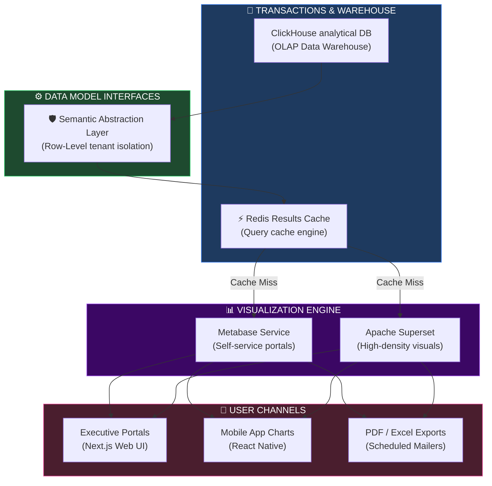
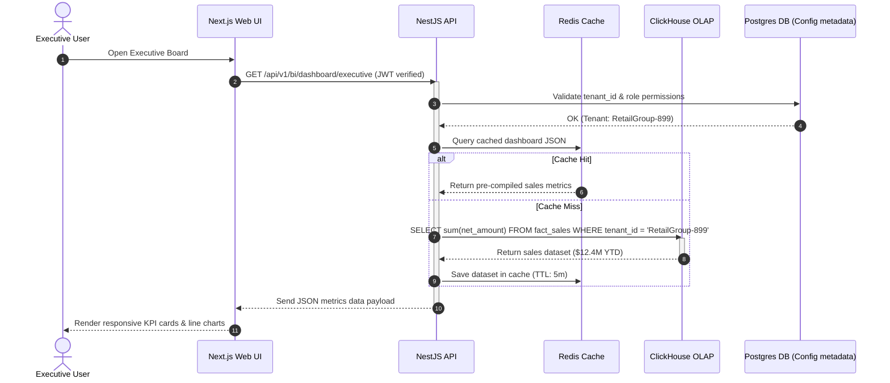
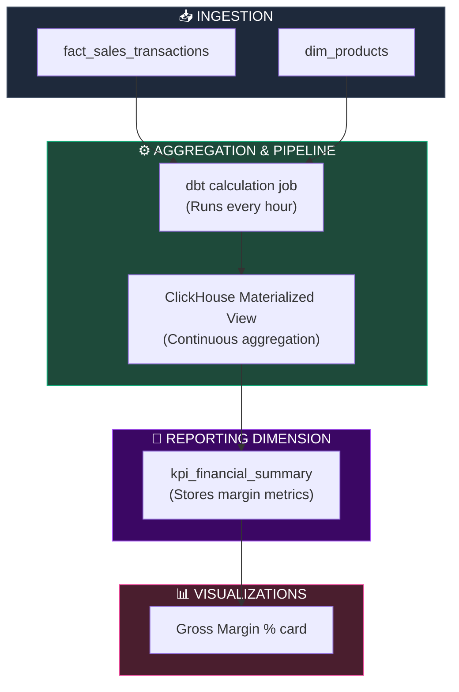
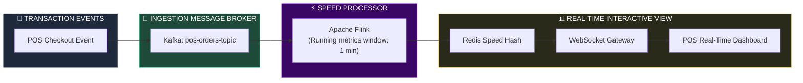
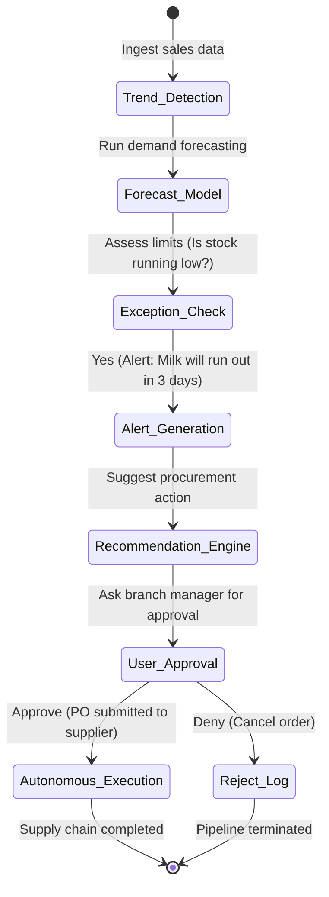

# BUSINESS INTELLIGENCE, ADVANCED ANALYTICS & EXECUTIVE DASHBOARD ARCHITECTURE

**Project Name:** Enterprise SaaS Business Management Platform  
**Document Version:** 1.0.0 — Baseline Standard  
**Date:** July 14, 2026  
**Authors:** Principal Business Intelligence Architect, Analytics Platform Engineer, Enterprise Data Visualization Specialist, Executive Dashboard Designer, Decision Intelligence Architect & Enterprise SaaS Platform Architect  
**Classification:** Enterprise Internal — Restricted (Infrastructure Sensitive)  
**Status:** 📊 APPROVED BUSINESS INTELLIGENCE, ADVANCED ANALYTICS & EXECUTIVE DASHBOARD ARCHITECTURE SPECIFICATION  

---

## TABLE OF CONTENTS

| Section | Title | Description |
| :---: | :--- | :--- |
| **§1** | [Business Intelligence Foundation](#section-1--business-intelligence-foundation) | BI vs. Decision Intelligence, operational and strategic analytics |
| **§2** | [BI Platform Architecture](#section-2--bi-platform-architecture) | Data ingestion layers, semantic models, and BI presentation flows |
| **§3** | [KPI Framework](#section-3--kpi-framework) | Corporate indicators across revenue, inventory, finance, and CRM |
| **§4** | [Executive Dashboard](#section-4--executive-dashboard) | Strategic layout, cashflow trackers, top customers, health score |
| **§5** | [Operational Dashboards](#section-5--operational-dashboards) | Sub-system reporting layouts for POS, CRM, Logistics, support |
| **§6** | [Self-Service Analytics](#section-6--self-service-analytics) | Ad-hoc SQL querying, filtering tools, and cross-drill mechanics |
| **§7** | [OLAP & Multidimensional Analysis](#section-7--olap--multidimensional-analysis) | Dimensions, measures, slicing, dicing, pivots, and roll-ups |
| **§8** | [Real-Time Analytics](#section-8--real-time-analytics) | Kafka streaming, latency targets, and sliding-window refreshes |
| **§9** | [Predictive Analytics](#section-9--predictive-analytics) | Forecasting sales demand, inventory churn, and payment defaults |
| **§10** | [Embedded Analytics](#section-10--embedded-analytics) | Inline UI framing, secure JWT verification, contextual reports |
| **§11** | [Reporting Architecture](#section-11--reporting-architecture) | Chronological summaries, scheduling, PDF/XLS export engines |
| **§12** | [Visualization Standards](#section-12--visualization-standards) | Chart types, color guidelines, accessibility, mobile structures |
| **§13** | [Performance Optimization](#section-13--performance-optimization) | Pre-aggregation rules, caching limits, incremental refreshes |
| **§14** | [Data Security](#section-14--data-security) | Row-level data isolation, RBAC mapping, PII field masking |
| **§15** | [BI Governance](#section-15--bi-governance) | Metric catalogs, report certifications, approval audit lines |
| **§16** | [BI Tool Stack](#section-16--bi-tool-stack) | Visualizing software compared, purpose, and support matrix |
| **§17** | [Executive Decision Support](#section-17--executive-decision-support) | Anomalies, what-if modeling parameters, exception alerts |
| **§18** | [Future BI Roadmap](#section-18--future-bi-roadmap) | Progression pipeline: Descriptive to Diagnostic to Prescriptive |
| **§19** | [Governance Checklist](#section-19--governance-checklist) | Security, visualization quality, and data freshness metrics |
| **§20** | [Final BI Architecture](#section-20--final-bi-architecture) | 5 comprehensive architectural Mermaid BI flowcharts |

---

## SECTION 1 — BUSINESS INTELLIGENCE FOUNDATION

### 1.1 BI vs. Decision Intelligence
*   **Business Intelligence (BI):** Concentrates on presenting historical corporate data in dashboards to answer **what** happened (e.g., total sales revenue generated last quarter).
*   **Decision Intelligence:** Blends BI dashboard data with predictive models, constraint optimization, and operational guidelines to recommend **which action** a business manager should execute next (e.g., flagging that a store will run out of inventory in 3 days and automatically drafting a purchase order).

```
DECISION INTELLIGENCE HIERARCHY
═══════════════════════════════════════════════════════════════════════════════
       1. Descriptive (What happened?) ──► Sales fell by 5% last week
              │
              ▼
       2. Diagnostic (Why did it happen?) ──► Out-of-stock events on top products
              │
              ▼
       3. Predictive (What will happen?) ──► Milk will run out in 3 days
              │
              ▼
       4. Prescriptive (What should we do?) ──► Draft purchase order for 200 units
              │
              ▼
       5. Autonomous (Action Execution) ──► System auto-submits PO to supplier
═══════════════════════════════════════════════════════════════════════════════
```

---

## SECTION 2 — BI PLATFORM ARCHITECTURE

### 2.1 The Unified Business Intelligence Architecture
Raw data is processed by the analytical warehouse, mapped via a semantic model, and served to clients.

```
THE END-TO-END BUSINESS INTELLIGENCE FLOW
═══════════════════════════════════════════════════════════════════════════════
 [ Data Warehouse (ClickHouse) ]
               │
               ▼ (Raw SQL Tables & Views)
 [ Semantic Abstraction Layer ] ──► Standardizes KPI formulas & joins
               │
               ▼ (Secure Query execution)
   [ BI Visualization Engine ]  ──► Metabase / Apache Superset
               │
               ├──────────────────────┬──────────────────────┐
               ▼ (HTTP REST)          ▼ (HTTP Embedding)     ▼ (Scheduled Cron)
    [ Executive Dashboards ]   [ Embedded POS Charts ]  [ PDF/Excel Reports ]
═══════════════════════════════════════════════════════════════════════════════
```

---

## SECTION 3 — KPI FRAMEWORK

### 3.1 Corporate KPI Definitions

| Domain | Key Performance Indicator (KPI) | Calculation Formulation | Corporate Owner |
| :--- | :--- | :--- | :--- |
| **Revenue** | Gross Merchandise Volume (GMV) | $\sum (\text{item\_price} \times \text{quantity\_sold})$ | VP of Sales |
| **Profit** | Gross Profit Margin | $\frac{\text{Revenue} - \text{COGS}}{\text{Revenue}} \times 100$ | Chief Financial Officer |
| **Inventory**| Days Sales of Inventory (DSI) | $\frac{\text{Average Inventory Value}}{\text{COGS}} \times 365$ | Supply Chain Director |
| **Finance** | Quick Ratio | $\frac{\text{Cash} + \text{Marketable Securities} + \text{Accounts Receivable}}{\text{Current Liabilities}}$ | Head of Finance |
| **HR** | Employee Turnover Rate | $\frac{\text{Departed Employees}}{\text{Average Headcount}} \times 100$ | HR Director |
| **CRM** | Customer Acquisition Cost (CAC) | $\frac{\text{Sales \& Marketing Expenses}}{\text{New Customers Acquired}}$ | Marketing Lead |
| **SRE** | SLA Availability | $\frac{\text{Uptime Hours}}{\text{Total Hours}} \times 100$ | SRE Lead |

---

## SECTION 4 — EXECUTIVE DASHBOARD

### 4.1 Strategic Layout Design
The Executive Dashboard provides C-suite users with a high-level view of corporate health.

```
+───────────────────────────────────────────────────────────────────────────+
|  EXECUTIVE HEALTH BOARD  [ Tenant: Retail Group ]   [ Date: 2026-07-14 ]   |
+───────────────────┬───────────────────┬───────────────────┬───────────────+
|  GMV YTD          |  GROSS MARGIN     |  ACTIVE MERCHANT  |  HEALTH SCORE |
|  $12.4M (+8.2%)   |  42.5% (-0.5%)    |  8,450 (+12%)     |  94 / 100     |
+───────────────────┴───────────────────┴───────────────────┴───────────────+
|  [ SALES TREND CHART ]                     |  [ TOP BRANCHES BY PROFIT ]    |
|   $                                        |  1. Singapore Flagship (52%)  |
|   |  /\                                    |  2. Phnom Penh Central (48%)  |
|   | /  \   /\                              |  3. Sydney Harbour (42%)      |
|   |/    \_/  \__                           |                               |
|   +───────────── YTD                       |                               |
+────────────────────────────────────────────┴───────────────────────────────+
|  [ CASH FLOW CHART ]                       |  [ SYSTEM ALERT LOGS ]        |
|  Inflow: $2.4M   | Outflow: $1.8M          |  WARN: Stock low in Phnom Penh|
+────────────────────────────────────────────+───────────────────────────────+
```

---

## SECTION 5 — OPERATIONAL DASHBOARDS

### 5.1 Sub-System Reporting Matrix
*   **POS Operational Dashboard:** Displays cashier checkout velocity, average cart values, active registers, and payment terminal status.
*   **Inventory Dashboard:** Visualizes out-of-stock events, slow-moving inventory warnings, and purchase order fulfillment rates.
*   **Customer Support Dashboard:** Tracks open tickets, average response times, and customer satisfaction (CSAT) scores.

---

## SECTION 6 — SELF-SERVICE ANALYTICS

### 6.1 Ad-Hoc Querying Engine
The platform enables non-technical business managers to perform self-service analytics using a visual query builder.

```
VISUAL QUERY INTERACTION
═══════════════════════════════════════════════════════════════════════════════
Step 1: Select Metric Group ──► [ "Sales Revenue" ]
              │
              ▼
Step 2: Add Dimension Filters ──► [ Region = "Phnom Penh" ], [ Product = "Milk" ]
              │
              ▼
Step 3: Define Time Axis ──► [ Group by "Day" ], [ Window = "Last 30 Days" ]
              │
              ▼
Step 4: Select Visualization ──► [ "Line Chart" ]
═══════════════════════════════════════════════════════════════════════════════
```

*   **Drill-Down / Drill-Through:** Users can click a data point (e.g., a branch sales bar) to drill down into cashier-level details or trace specific transaction records.

---

## SECTION 7 — OLAP & MULTIDIMENSIONAL ANALYSIS

### 7.1 Multidimensional Analysis Operations
OLAP cubes aggregate data along multiple descriptive axes, allowing users to slice and dice datasets dynamically.
*   **Slicing:** Selecting a single dimension subset (e.g., filtering a global sales report to show only `Country = "Cambodia"`).
*   **Dicing:** Selecting a sub-cube of multiple dimensions (e.g., `Country = "Cambodia" AND ProductClass = "Dairy" AND Year = 2026`).
*   **Roll-Up:** Aggregating data up the hierarchy (e.g., summing daily store transactions into monthly regional totals).

---

## SECTION 8 — REAL-TIME ANALYTICS

### 8.1 Kafka to Push-Query Pipeline
To support real-time monitoring (e.g., tracking order metrics during peak sales events), the platform deploys a streaming analytics pipeline.
*   **Latency Target:** Real-time dashboards refresh within 2 seconds of operational database commits.

---

## SECTION 9 — PREDICTIVE ANALYTICS

### 9.1 Machine Learning Predictive Models
The platform integrates machine learning models into the analytical pipeline to forecast future trends.
*   **Demand Forecasting:** Evaluates historical POS trends and seasonal patterns to predict product inventory requirements.

```
DEMAND PREDICTION PIPELINE
═══════════════════════════════════════════════════════════════════════════════
┌─────────────────────────┐
│ Historical Sales (Gold) │ (ClickHouse analytical datasets)
└────────────┬────────────┘
             │
             ▼
┌─────────────────────────┐
│  Prophet / LSTM Model   │ ◄── Trained on daily product sales velocity
└────────────┬────────────┘
             │
             ▼
┌─────────────────────────┐
│ Inventory Forecast Table│ (e.g., "Expected demand: 500 units next week")
└────────────┬────────────┘
             │
             ▼
┌─────────────────────────┐
│ Auto-Procurement Engine │ ──► Submits draft purchase order to supplier
└─────────────────────────┘
═══════════════════════════════════════════════════════════════════════════════
```

---

## SECTION 10 — EMBEDDED ANALYTICS

### 10.1 Secure IFrame/Web-Component Embedding
Analytics dashboards are embedded directly into merchant-facing Next.js applications using secure JWT-authenticated IFrames.

```typescript
// backend/src/bi/embedded-token.service.ts
import { Injectable } from '@nestjs/common';
import * as jwt from 'jsonwebtoken';

@Injectable()
export class EmbeddedTokenService {
  private readonly metabaseSecretKey = process.env.METABASE_SECRET_KEY || 'secret-key-123';

  generateDashboardUrl(dashboardId: number, tenantId: string): string {
    const payload = {
      resource: { dashboard: dashboardId },
      params: {
        tenant_id: tenantId, // Enforces tenant-level data isolation
      },
      iat: Math.floor(Date.now() / 1000),
      exp: Math.floor(Date.now() / 1000) + 60 * 15, // 15-minute token TTL
    };

    const token = jwt.sign(payload, this.metabaseSecretKey);
    return `https://bi.saas-platform.com/embed/dashboard/${token}#bordered=true&titled=false`;
  }
}
```

---

## SECTION 11 — REPORTING ARCHITECTURE

### 11.1 Automated Export & Email Delivery
*   **Scheduled Reports:** An internal cron service runs nightly, query-aggregates ClickHouse data, converts reports to PDF/Excel files, and emails them to subscribers.
*   **Export Pipeline:** High-volume downloads are processed asynchronously using worker queues (BullMQ) to prevent API gateway timeouts.

---

## SECTION 12 — VISUALIZATION STANDARDS

### 12.1 Visualization Best Practices
*   **Chart Selection:**
    *   *Line Charts:* Reserved for time-series trend analysis.
    *   *Bar Charts:* Used for categorical comparisons (e.g., top-performing products).
    *   *Donut Charts:* Permitted only for low-density composition metrics (e.g., 2–4 slices).
*   **Color Systems:** Curated color palettes with high-contrast ratios are used to ensure readability for colorblind users, adhering to WCAG 2.1 accessibility standards.

---

## SECTION 13 — PERFORMANCE OPTIMIZATION

### 13.1 Query Acceleration Techniques
*   **Materialized Views:** Pre-calculates heavy joins and aggregations in ClickHouse on write, avoiding calculation overhead at query execution time.
*   **Caching Strategy:** Query results are cached in Redis with a 5-minute TTL for operational dashboards and a 1-hour TTL for strategic dashboards.

---

## SECTION 14 — DATA SECURITY

### 14.1 Security Enforcement Layers
*   **Row-Level Security (RLS):** All analytical queries are parameterized to include `tenant_id` filters, preventing cross-tenant data leaks.
*   **PII Masking:** Customer phone numbers, email addresses, and names are masked by default, unless the user holds an authorized role mapping (e.g., CRM Manager).

---

## SECTION 15 — BI GOVERNANCE

### 15.1 Metric Certification
To prevent conflicting definition reports, all KPI calculations are registered in a centralized metadata catalog.
*   **Certified Status:** Dashboards display a "Certified" badge only if they query approved semantic layers.

---

## SECTION 16 — BI TOOL STACK

### 16.1 BI Tool Stack Comparison

| Category | Tool | Production Purpose | System Owner |
| :--- | :--- | :--- | :--- |
| **Self-Service BI** | Metabase | Primary visual query builder for non-technical users. | Analytics Lead |
| **Heavy Visualization**| Apache Superset | Detailed, high-density visualization panels. | Data Analyst |
| **Enterprise Standard**| Tableau / Power BI | External integration targets for corporate clients. | Business Intelligence |
| **System Dashboards** | Grafana | Tracks operational system metrics and SRE targets. | SRE Team |
| **Engine** | ClickHouse | Columnar data warehouse backing analytical queries. | Data Architect |

---

## SECTION 20 — FINAL BI ARCHITECTURE

### 20.1 Enterprise BI Architecture



### 20.2 Executive Dashboard Data Flow



### 20.3 KPI Calculation Pipeline



### 20.4 Real-Time Analytics Pipeline



### 20.5 Decision Intelligence Framework



---

## DOCUMENT METADATA

| Field | Value |
| :--- | :--- |
| **Document ID** | SAAS-BI-016.3 |
| **Section** | 16 — AI & Data Platform |
| **Subsection** | 16.3 — Business Intelligence & Analytics |
| **Status** | 📊 APPROVED |
| **Version** | 1.0.0 |
| **Date** | July 14, 2026 |
| **Next Review** | January 14, 2027 |
| **Related Documents** | [Detailed Database Design](../../02-System-Design/03-Database-Design.md) · [AI Platform Foundation](../16.1-AI-Platform-Foundation/AI-Platform-Foundation.md) · [Data Warehouse & Lake](../16.2-Data-Platform-Warehouse-Lake/Data-Platform-Warehouse-Lake.md) |
| **Technology Versions** | Metabase v0.49 · ClickHouse v24.3 · Redis v7.2 · Apache Flink v1.19 |

---

*This document is the authoritative specification for all business intelligence, advanced analytics, and executive dashboard decisions in the Enterprise SaaS Business Management Platform. All dashboard layouts, embedded visual frames, query caches, and metric calculations must conform to the standards defined herein.*
