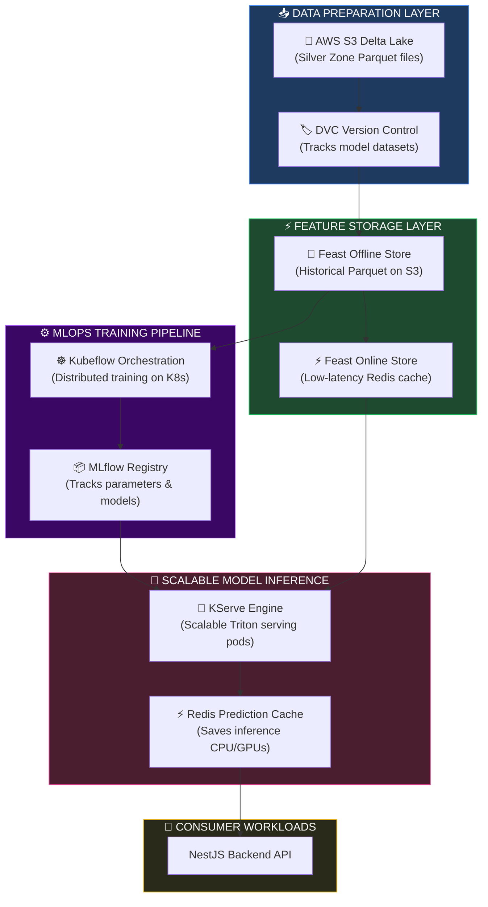
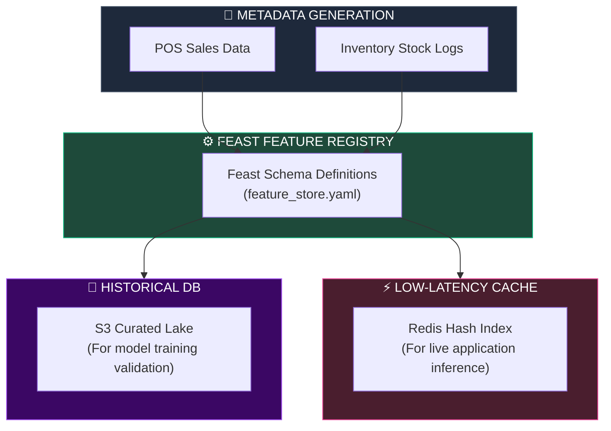
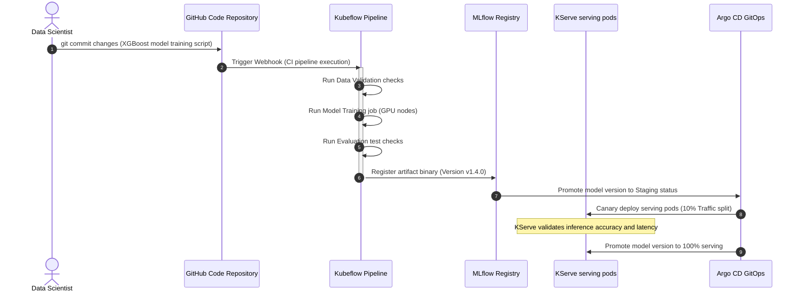
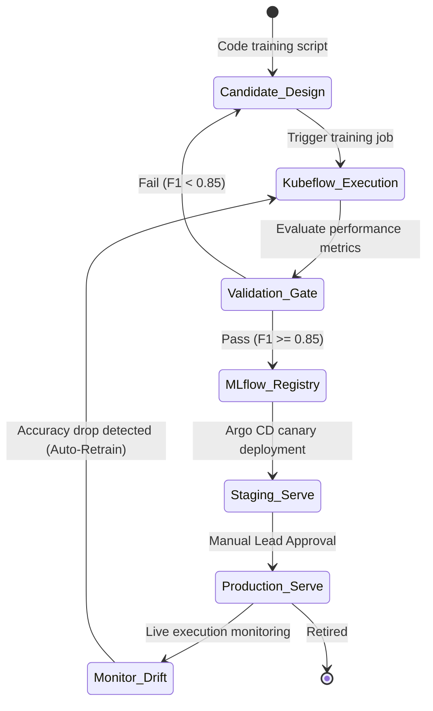
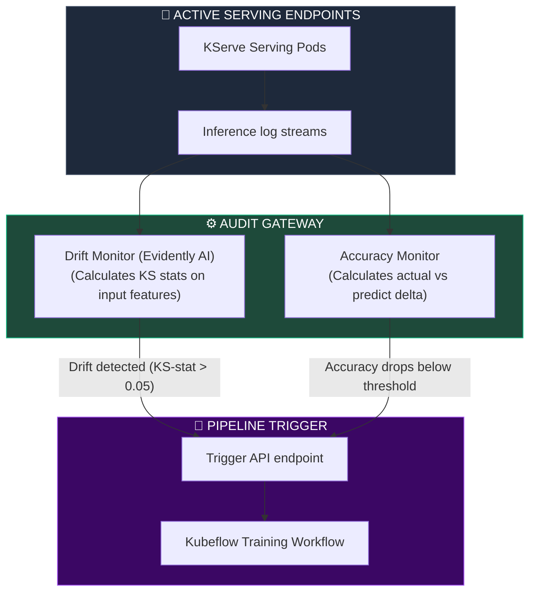

# MACHINE LEARNING PLATFORM, MLOPS & MODEL LIFECYCLE ARCHITECTURE

**Project Name:** Enterprise SaaS Business Management Platform  
**Document Version:** 1.0.0 — Baseline Standard  
**Date:** July 14, 2026  
**Authors:** Principal Machine Learning Architect, MLOps Engineer, AI Platform Architect, Data Scientist, ML Infrastructure Engineer & Enterprise SaaS Platform Architect  
**Classification:** Enterprise Internal — Restricted (Infrastructure Sensitive)  
**Status:** ⚙️ APPROVED MACHINE LEARNING PLATFORM, MLOPS & MODEL LIFECYCLE ARCHITECTURE SPECIFICATION  

---

## TABLE OF CONTENTS

| Section | Title | Description |
| :---: | :--- | :--- |
| **§1** | [Machine Learning Foundation](#section-1--machine-learning-foundation) | Core paradigms, supervised/unsupervised strategies |
| **§2** | [Enterprise ML Architecture](#section-2--enterprise-ml-architecture) | Ingestion pipelines, feature storage, serving topology |
| **§3** | [Data Preparation Pipeline](#section-3--data-preparation-pipeline) | Data validation, cleaning, and train/eval set splits |
| **§4** | [Feature Engineering](#section-4--feature-engineering) | Centralized Feast Feature Store and versioning strategy |
| **§5** | [Model Training](#section-5--model-training) | Workflow blueprints for sales, demand, churn, and fraud |
| **§6** | [Model Evaluation](#section-6--model-evaluation) | Quantitative validation metrics: Precision, F1, RMSE, MAPE |
| **§7** | [Model Registry](#section-7--model-registry) | MLflow model versioning, approval gates, and rollback policies |
| **§8** | [Model Serving](#section-8--model-serving) | Batch vs. Real-time vs. Streaming server deployments compared |
| **§9** | [MLOps Pipeline](#section-9--mlops-pipeline) | End-to-end Git-triggered CI/CD training pipeline |
| **§10** | [Continuous Training](#section-10--continuous-training) | Event-driven drift triggers and automated model updates |
| **§11** | [Model Monitoring](#section-11--model-monitoring) | Telemetry monitoring for concept drift, latency, and costs |
| **§12** | [Model Security](#section-12--model-security) | Adversarial mitigation, parameter audits, and S3 encryption |
| **§13** | [Enterprise ML Use Cases](#section-13--enterprise-ml-use-cases) | Module implementations: churn, fraud, segment, and routing |
| **§14** | [AI Governance](#section-14--ai-governance) | Ethical checks, model explainability (SHAP), and audit logging |
| **§15** | [MLOps Tool Stack](#section-15--mlops-tool-stack) | Ingest, serve, track, registry, and orchestrate software matrix |
| **§16** | [Performance & Scalability](#section-16--performance-scalability) | Distributed GPU allocations, caching, and request queuing |
| **§17** | [Compliance](#section-17--compliance) | Audit trails, data protection consents, documentation standards |
| **§18** | [Future ML Roadmap](#section-18--future-ml-roadmap) | Progression plan: Automated AutoML to Continuous Adaptive AI |
| **§19** | [Governance Checklist](#section-19--governance-checklist) | Verification steps for pipeline quality, security, and approval |
| **§20** | [Final ML Platform Architecture](#section-20--final-ml-platform-architecture) | 5 comprehensive technical Mermaid ML flowcharts |

---

## SECTION 1 — MACHINE LEARNING FOUNDATION

### 1.1 Enterprise Machine Learning Paradigms
To support predictive intelligence inside a multi-tenant SaaS application, the platform structures its algorithms under three primary learning branches:
*   **Supervised Learning:** Models trained on labeled historical records (e.g., training a regression model on daily store transaction values to output future sales forecasts).
*   **Unsupervised Learning:** Clustering algorithms designed to discover hidden structures in unlabeled datasets (e.g., grouping customers into demographic cohorts based on checkout patterns).
*   **Reinforcement Learning:** Goal-oriented loops that optimize decision policies (e.g., real-time delivery path optimization for logistics).

---

## SECTION 2 — ENTERPRISE ML ARCHITECTURE

### 2.1 The Unified ML Engine Pipeline
Analytical datasets are routed from the data lake, stored in the feature store, processed during model training, registered, and served to application users.

```
THE ENTERPRISE ML PIPELINE
═══════════════════════════════════════════════════════════════════════════════
 [ Analytical Data (S3 Lake) ]
               │
               ▼ (dbt Feature Prep)
   [ Feast Feature Store ] ──► Serves historical (offline) & current (online) features
               │
               ▼ (Kubeflow Training Pipeline)
    [ MLflow Model Registry ] ──► Stores validated artifacts & metrics
               │
               ▼ (vLLM / Triton Server serving)
    [ KServe Model API Endpoint ]
               │
               ▼ (HTTP REST / gRPC)
    [ NestJS Application Core ]
═══════════════════════════════════════════════════════════════════════════════
```

---

## SECTION 3 — DATA PREPARATION PIPELINE

### 3.1 Data Validation & Train/Eval Splitting
Operational data must be formatted and cleaned before ingestion by the model training pipeline.

```
DATA SPLIT AND INGESTION PIPELINE
═══════════════════════════════════════════════════════════════════════════════
┌─────────────────────────┐
│     Raw Lake Data       │ (Parquet tables)
└────────────┬────────────┘
             │
             ▼
┌─────────────────────────┐
│ Validation (Great Expect) ◄── Discards NULL prices and outliers
└────────────┬────────────┘
             │
             ▼ (Temporal Ingestion Split)
     ┌───────┴───────────────────────┐
     ▼ (80% Random Hash)             ▼ (20% Random Hash)
[ Training Dataset ]        [ Evaluation Dataset ]
(Used to update weights)    (Used to test metrics)
═══════════════════════════════════════════════════════════════════════════════
```

---

## SECTION 4 — FEATURE ENGINEERING

### 4.1 Centralized Feast Feature Store
To prevent duplicate calculation pipelines, all ML features are registered in a centralized **Feast** Feature Store.

```python
# MLOps feature store definition: feast/features.py
from datetime import timedelta
from feast import (
    Entity,
    FeatureView,
    Field,
    FileSource,
)
from feast.types import Float32, Int64

# Define the Tenant Entity
tenant = Entity(name="tenant_id", value_type=Int64, description="Tenant Identifier")

# Define Data Source location in the Silver S3 Zone
pos_source = FileSource(
    path="s3://saas-data-lake-silver/pos_features.parquet",
    event_timestamp_column="event_timestamp",
    created_timestamp_column="created_timestamp",
)

# Define the POS Feature View
pos_feature_view = FeatureView(
    name="tenant_pos_features",
    entities=[tenant],
    ttl=timedelta(days=90),
    schema=[
        Field(name="avg_cart_value", dtype=Float32),
        Field(name="sales_velocity_30d", dtype=Float32),
        Field(name="total_transactions_qty", dtype=Int64),
    ],
    online=True, # Syncs features to Redis for low-latency real-time inference
    source=pos_source,
)
```

---

## SECTION 5 — MODEL TRAINING

### 5.1 System Training Blueprints
*   **Sales Forecasting:** Utilizes deep learning sequential models (LSTM) or gradient boosting (XGBoost) trained on historical transaction records.
*   **Demand Prediction:** Uses Prophet models trained on store checkout frequencies to forecast next-week supply chain constraints.
*   **Customer Churn:** Employs Random Forest classifiers trained on customer login activity, dispute counts, and purchase intervals.

---

## SECTION 6 — MODEL EVALUATION

### 6.1 Validation Metrics Matrix
Before promotion to production serving tables, models are evaluated against test datasets to confirm accuracy.

*   **Classification Models (Churn, Fraud):**
    *   *F1 Score:* Optimal metric for imbalanced fraud data:
        $$\text{F1} = 2 \times \frac{\text{Precision} \times \text{Recall}}{\text{Precision} + \text{Recall}}$$
    *   *ROC-AUC:* Verifies classifier threshold separation.
*   **Regression Models (Sales, Demand):**
    *   *MAPE (Mean Absolute Percentage Error):* Tracks forecast percentage error.
    *   *RMSE (Root Mean Squared Error):* Penalizes large errors.

---

## SECTION 7 — MODEL REGISTRY

### 7.1 MLflow Model Lifecycle Gates
All models, parameters, and artifact binaries are registered in **MLflow**.

```
MODEL LIFECYCLE STAGES
═══════════════════════════════════════════════════════════════════════════════
[ Candidate Artifact ] ──► Stage: Candidate
                              │
                              ▼ (Runs CI Validation tests)
                       [ F1 Score >= 0.85 & Drift <= 5% ]
                              │
                              ▼
                       [ Stage: Staging ]
                              │
                              ▼ (Manual approval by Lead Data Scientist)
                       [ Stage: Production ] ──► Argo CD deploys serving pods
═══════════════════════════════════════════════════════════════════════════════
```

---

## SECTION 8 — MODEL SERVING

### 8.1 Inference Routing Topologies

| Serving Pattern | Latency Targets | Infrastructure | SaaS Business Case |
| :--- | :--- | :--- | :--- |
| **Batch Inference** | Hours / Overnight | Apache Spark Job | Global monthly store inventory forecasting. |
| **Real-Time Inference** | $\le 100\text{ ms}$ | KServe / Triton API | **Real-time checkout fraud checks.** |
| **Streaming Inference** | $\le 1\text{ second}$ | Spark Streaming | Dynamic demand notifications. |
| **Edge Inference** | Zero network latency | Mobile (ONNX Runtime) | POS local offline product scanners. |

---

## SECTION 9 — MLOPS PIPELINE

### 9.1 The GitOps MLOps Pipeline
We coordinate model ingestion, training, tracking, and promotion using automated Kubeflow pipelines.

```
THE KUBEFLOW MLOPS LIFECYCLE
═══════════════════════════════════════════════════════════════════════════════
Code Commit ──► Kubeflow Orchestration ──► Run Data Prep ──► Run MLflow Training
                                                                     │
     ┌───────────────────────────────────────────────────────────────┘
     ▼
Validate Performance ──► Register Model ──► Argo CD Canary serving update
═══════════════════════════════════════════════════════════════════════════════
```

---

## SECTION 10 — CONTINUOUS TRAINING

### 10.1 Event-Triggered Retraining Loop
Models degrade over time as consumer behaviors drift.
*   **Drift Trigger:** If a model's prediction accuracy drops below a defined threshold (e.g., MAPE exceeds 15% for 3 days), or if statistical feature drift is detected between training data and active production requests, a retraining job is triggered in Kubeflow.

---

## SECTION 11 — MODEL MONITORING

### 11.1 Real-Time Inference Audits
The model serving gateway tracks and logs operational telemetry:
*   **Inference Latency:** Time taken to execute a model forward pass. Alerts trigger if latency exceeds 150ms.
*   **Feature Drift:** Evaluates Kolmogorov-Smirnov statistical tests on inference inputs, alerting the MLOps team if input distributions drift significantly.

---

## SECTION 12 — MODEL SECURITY

### 12.1 Attack Protection Standards
*   **API Rate Limiting:** Enforces strict request quotas on serving endpoints to prevent model extraction attacks.
*   **Binary Validation:** Model binaries stored on S3 are signed and validated against cryptographic hashes before being loaded by Triton/KServe pods.

---

## SECTION 13 — ENTERPRISE ML USE CASES

### 13.1 Predictive SaaS Module Functionalities
*   **Stock Optimization:** Recommends optimal buffer volumes based on predicted supplier shipping delays and branch sales velocities.
*   **Dynamic Pricing:** Suggests pricing updates based on competitor APIs and current inventory levels.

---

## SECTION 14 — AI GOVERNANCE

### 14.1 Fairness & Interpretability
*   **Explainable AI (XAI):** High-impact predictions (e.g., employee attrition risks or credit score defaults) require **SHAP (SHapley Additive exPlanations)** values to show which features influenced the prediction.

---

## SECTION 15 — MLOPS TOOL STACK

### 15.1 MLOps Tool Stack Matrix

| Category | Tool | Production Purpose | System Owner |
| :--- | :--- | :--- | :--- |
| **Model Registry** | MLflow | Tracks experiments, metrics, parameters, and binaries. | Data Scientist |
| **Orchestrator** | Kubeflow Pipelines | Coordinates multi-step ML training workloads. | MLOps Engineer |
| **Feature Store** | Feast | Standardizes features for training and real-time serving. | Data Architect |
| **Workflow Scheduler**| Apache Airflow | Schedules batch data ingestion and processing tasks. | Platform Engineer |
| **Data Versioning** | DVC (Data Version Control)| Tracks datasets and pipeline outputs in S3. | MLOps Engineer |
| **Model Serving** | KServe / Triton Server | Manages scalable model endpoints inside EKS. | SRE / Platform |
| **ML Framework** | PyTorch / XGBoost | Primary frameworks for model training. | Data Scientist |

---

## SECTION 20 — FINAL ML PLATFORM ARCHITECTURE

### 20.1 Enterprise ML Platform



### 20.2 Feature Store Architecture



### 20.3 MLOps Pipeline



### 20.4 Model Lifecycle



### 20.5 Continuous Training Workflow



---

## DOCUMENT METADATA

| Field | Value |
| :--- | :--- |
| **Document ID** | SAAS-MLOPS-016.4 |
| **Section** | 16 — AI & Data Platform |
| **Subsection** | 16.4 — Machine Learning Platform & MLOps |
| **Status** | ⚙️ APPROVED |
| **Version** | 1.0.0 |
| **Date** | July 14, 2026 |
| **Next Review** | January 14, 2027 |
| **Related Documents** | [AI Platform Foundation](../16.1-AI-Platform-Foundation/AI-Platform-Foundation.md) · [Data Warehouse & Lake](../16.2-Data-Platform-Warehouse-Lake/Data-Platform-Warehouse-Lake.md) · [BI & Analytics](../16.3-BI-Advanced-Analytics/BI-Advanced-Analytics.md) |
| **Technology Versions** | Feast v0.37 · MLflow v2.12 · Kubeflow v1.8 · KServe v0.12 · Triton v2.43 |

---

*This document is the authoritative specification for all machine learning platform, MLOps, and model lifecycle decisions in the Enterprise SaaS Business Management Platform. All training pipelines, model registries, serving endpoints, feature stores, and retraining triggers must conform to the standards defined herein.*
