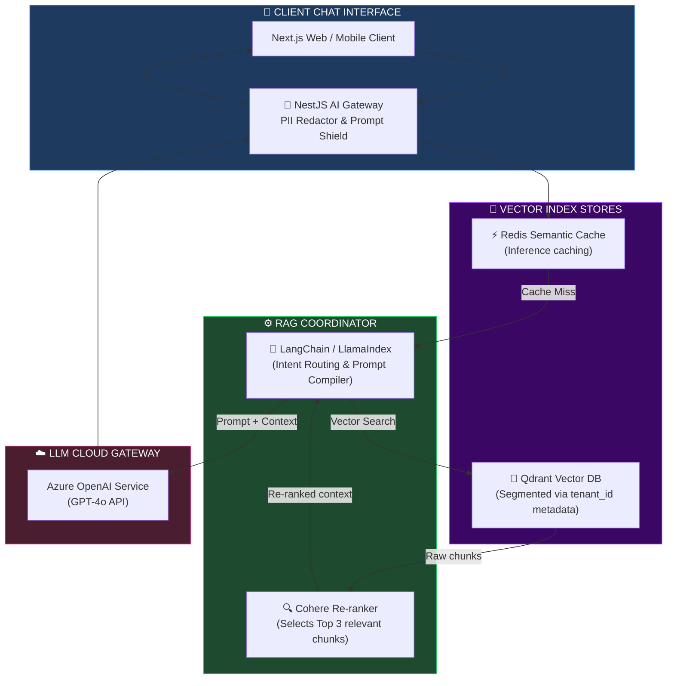
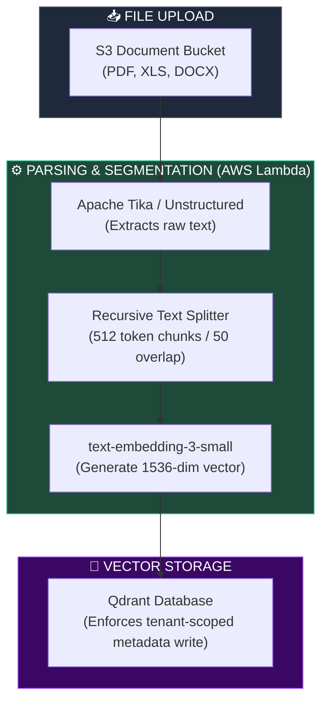
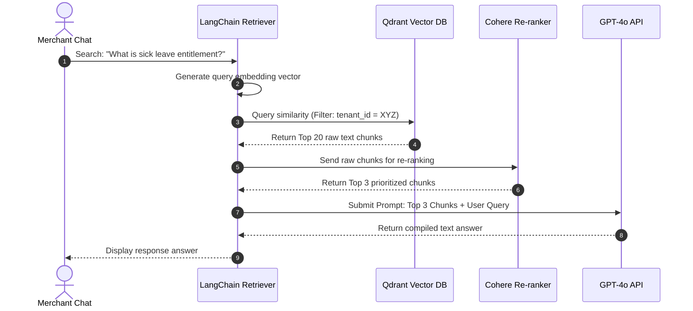
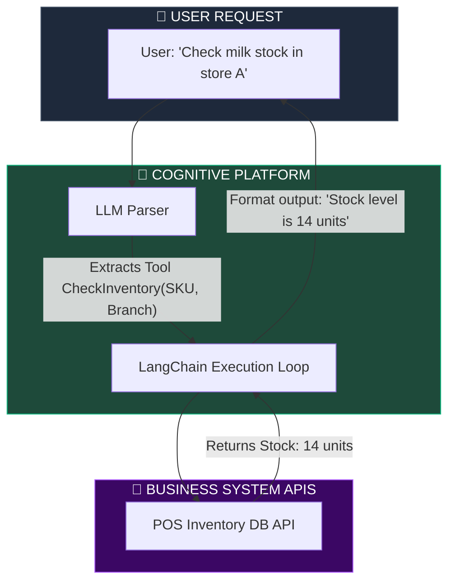
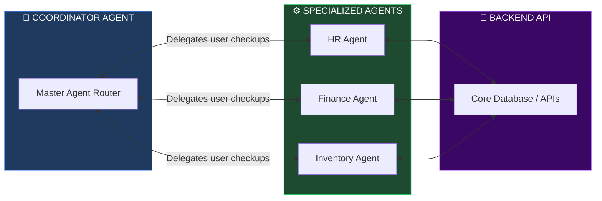

# GENERATIVE AI, RAG, VECTOR DATABASE & ENTERPRISE KNOWLEDGE ARCHITECTURE

**Project Name:** Enterprise SaaS Business Management Platform  
**Document Version:** 1.0.0 — Baseline Standard  
**Date:** July 14, 2026  
**Authors:** Principal Generative AI Architect, Retrieval-Augmented Generation (RAG) Specialist, Knowledge Systems Architect, Vector Database Engineer, AI Platform Architect & Enterprise SaaS Platform Architect  
**Classification:** Enterprise Internal — Restricted (Infrastructure Sensitive)  
**Status:** 🔮 APPROVED GENERATIVE AI, RAG, VECTOR DATABASE & ENTERPRISE KNOWLEDGE SPECIFICATION  

---

## TABLE OF CONTENTS

| Section | Title | Description |
| :---: | :--- | :--- |
| **§1** | [Generative AI Foundation](#section-1--generative-ai-foundation) | Core GenAI concepts, LLMs, RAG, embeddings, and search |
| **§2** | [Enterprise RAG Architecture](#section-2--enterprise-rag-architecture) | Retrieval loops, intent gateways, and end-to-end telemetry |
| **§3** | [Document Ingestion Pipeline](#section-3--document-ingestion-pipeline) | Upload parsing, OCR engines, chunk splits, metadata tag pipelines |
| **§4** | [Vector Database Architecture](#section-4--vector-database-architecture) | Qdrant vs. pgvector vs. Pinecone, and Emitter recommendations |
| **§5** | [Embedding Pipeline](#section-5--embedding-pipeline) | Chunk configurations (size, overlap), text embeddings models |
| **§6** | [Enterprise Knowledge Base](#section-6--enterprise-knowledge-base) | Core domains (SOPs, catalogs, rules) and metadata models |
| **§7** | [Semantic Search](#section-7--semantic-search) | Hybrid search, dense/sparse vectors, re-ranking (Cohere) |
| **§8** | [AI Copilot Architecture](#section-8--ai-copilot-architecture) | Exec, HR, Finance, CRM, and developer agent boundaries |
| **§9** | [Tool Calling Architecture](#section-9--tool-calling-architecture) | Function calling schemas, payload structures, API orchestrators |
| **§10** | [Multi-Agent Architecture](#section-10--multi-agent-architecture) | Coordinator, specialized sub-agents, message topologies |
| **§11** | [Knowledge Governance](#section-11--knowledge-governance) | Ingestion approvals, version tracking, and content audits |
| **§12** | [Security & Privacy](#section-12--security-and-privacy) | Multi-tenant isolation at index, prompt validation, PII shields |
| **§13** | [Performance Optimization](#section-13--performance-optimization) | Vector caching, token compression, asynchronous stream loops |
| **§14** | [AI Observability](#section-14--ai-observability) | RAG evaluation (Ragas), token counts, and hallucination rates |
| **§15** | [Enterprise AI Tool Stack](#section-15--enterprise-ai-tool-stack) | Complete software comparison and alignment metrics |
| **§16** | [Compliance](#section-16--compliance) | GDPR consent guidelines, data residency rules, deletion audits |
| **§17** | [Future Evolution](#section-17--future-evolution) | Chatbots → RAG → Copilots → Autonomous Multi-Agents |
| **§18** | [Cost Optimization](#section-18--cost-optimization) | Semantic caching, token budgets, model routing, pruning |
| **§19** | [Governance Checklist](#section-19--governance-checklist) | QA controls, security verification loops, prompt checklists |
| **§20** | [Final Generative AI Architecture](#section-20--final-generative-ai-architecture) | 5 comprehensive technical Mermaid GenAI flowcharts |

---

## SECTION 1 — GENERATIVE AI FOUNDATION

### 1.1 Core Generative AI Concepts
Generative AI allows SaaS applications to transition from passive data capture systems to active business assistants.
*   **Large Language Models (LLMs):** Deep learning neural networks trained on vast text corpora, capable of understanding context, writing code, and generating natural language.
*   **Retrieval-Augmented Generation (RAG):** An architectural pattern that dynamically injects real-time, tenant-specific documents into the LLM prompt context window, preventing hallucinations and ensuring data accuracy without expensive retraining.
*   **Embeddings:** Numeric vector arrays representing the semantic meaning of text chunks (e.g., matching "sales drop" closely with "revenue decline" in vector space).

---

## SECTION 2 — ENTERPRISE RAG ARCHITECTURE

### 2.1 The RAG Ingestion & Query Lifecycle
 RAG connects user interfaces with vector indexes and language models.

```
THE END-TO-END RAG LIFECYCLE
═══════════════════════════════════════════════════════════════════════════════
 [ User Chat UI ] ──► [ Intent Detector ] ──► [ Semantic Search (Qdrant) ]
                                                     │
                                                     ▼ (Retrieve Top K Chunks)
                                            [ Cohere Re-ranker ]
                                                     │
                                                     ▼ (Filter Tenant ID context)
                                            [ Prompt Ingestion Engine ]
                                                     │
                                                     ▼ (Injected Context + Prompt)
                                            [ Enterprise LLM API Gateway ]
                                                     │
                                                     ▼ (Guardrail Checks)
 [ User Chat UI ] ◄───────────────────────── [ Sanitized Output Response ]
═══════════════════════════════════════════════════════════════════════════════
```

---

## SECTION 3 — DOCUMENT INGESTION PIPELINE

### 3.1 Document Parsing & Chunking Pipeline
Documents uploaded by tenants are parsed, split into semantic chunks, and embedded.

```
DOCUMENT PROCESSING LIFECYCLE
═══════════════════════════════════════════════════════════════════════════════
Tenant PDF upload ──► S3 Bucket Event ──► Text Extraction (OCR / Unstructured)
                                                │
       ┌────────────────────────────────────────┘
       ▼
Text Chunking (500 tokens, 10% overlap) ──► Generate Embeddings ──► Write Vector
                                                                    (Qdrant DB)
═══════════════════════════════════════════════════════════════════════════════
```

*   **Supported Formats:** PDF (Invoices, SOPs), Word/Excel (HR manuals, catalog inventories), Markdown/HTML (API documentations).

---

## SECTION 4 — VECTOR DATABASE ARCHITECTURE

### 4.1 Vector Store Selection Comparison

| Feature | Qdrant | pgvector (PostgreSQL) | Pinecone | Milvus |
| :--- | :--- | :--- | :--- | :--- |
| **Scalability** | High (Clustered, horizontal). | Moderate (Bounded by database host). | Managed (Cloud only). | High (Complex cluster). |
| **Performance** | Low latency ($\le 15\text{ ms}$). | Bounded by memory. | Variable (Network transit). | Low latency ($\le 20\text{ ms}$). |
| **Operational Overhead**| Low (Docker/K8s Native). | Zero (Already hosting Postgres). | Low (Managed service). | High (Requires zoo of pods).|
| **Tenant Isolation** | Excellent (Payload filters). | Excellent (Relational table RLS). | Bounded by namespace count. | Excellent (Collections partitions). |
| **SaaS Standard** | **Recommended Standard.** | **Operational Standard for low volume.** | Not recommended. | Bounded by cost constraints. |

---

## SECTION 5 — EMBEDDING PIPELINE

### 5.1 Chunking & Schema Metadata Strategy
*   **Chunk Size:** 512 tokens (optimal for maintaining context without exceeding LLM prompt limits).
*   **Chunk Overlap:** 50 tokens (prevents semantic splits across boundary limits).

```json
// Qdrant Vector Payload Schema
{
  "id": "c7a8b9d0-e1f2-3a4b-5c6d-7e8f9a0b1c2d",
  "vector": [0.0123, -0.0456, 0.0789, "... 1536 dimensions ..."],
  "payload": {
    "tenant_id": "tenant-cambodia-retail-899",
    "branch_id": "phnom-penh-01",
    "document_id": "doc-hr-handbook-2026",
    "chunk_index": 4,
    "chunk_text": "Employees are entitled to 18 days of paid annual leave. Leave requests must be submitted through the portal 5 days in advance.",
    "access_role": "employee",
    "created_at": 1783928000
  }
}
```

---

## SECTION 6 — ENTERPRISE KNOWLEDGE BASE

### 6.1 Knowledge Domain Mappings
The Enterprise Knowledge Base organizes tenant data into structured domains:
*   **Standard Operating Procedures (SOPs):** Store operations, cashier checkouts, refund validation paths.
*   **HR Policies:** Leave entitlements, sick day rules, code of conduct codes.
*   **Finance & Billing:** Tenant pricing matrices, invoicing rules, billing schedules.

---

## SECTION 7 — SEMANTIC SEARCH

### 7.1 Hybrid Search & Re-Ranking
To maximize retrieval relevance, the search engine combines traditional keyword search with dense vector matching, followed by a re-ranking step.

```
HYBRID SEARCH RETRIEVAL
═══════════════════════════════════════════════════════════════════════════════
User Query: "What is the policy on annual leave?"
   │
   ├─► Vector Search (Dense) ─────► Top 20 Semantic Matches (Qdrant) ──┐
   │                                                                    ├─► [ Cohere Re-ranker ] ──► Top 3 Chunks
   └─► Keyword Search (BM25) ────► Top 20 Keyword Matches (Elastic) ────┘
═══════════════════════════════════════════════════════════════════════════════
```

---

## SECTION 8 — AI COPILOT ARCHITECTURE

### 8.1 Module Copilot Boundaries
*   **Executive Copilot:** Accesses consolidated financial records. Bounded by strict write locks (Read-only insights).
*   **Finance Copilot:** Bounded to invoice and tax collections. Authorized to draft transaction records.
*   **HR Copilot:** Restricted to payroll and employee details. Cannot access tenant billing metrics.

---

## SECTION 9 — TOOL CALLING ARCHITECTURE

### 9.1 Dynamic Tool Execution
When the LLM detects that a user request requires system action (e.g., "Check milk stock in Phnom Penh"), it outputs a structured tool-calling payload instead of simple text.

```json
// LLM Tool Calling Payload Output
{
  "tool": "check_inventory_stock",
  "parameters": {
    "product_sku": "SKU-MILK-1000",
    "branch_id": "phnom-penh-01"
  }
}
```

### 9.2 Tool Handler Implementation

```typescript
// backend/src/ai/tools/inventory-tool.service.ts
import { Injectable } from '@nestjs/common';
import { InventoryService } from '../../inventory/inventory.service';

// Interface defining parameters generated by the LLM
interface CheckInventoryParams {
  product_sku: string;
  branch_id: string;
}

@Injectable()
export class InventoryToolService {
  constructor(private readonly inventoryService: InventoryService) {}

  // Function called by the LangChain Orchestrator
  async execute(params: CheckInventoryParams, tenantId: string): Promise<string> {
    const stock = await this.inventoryService.getBranchStock(
      params.product_sku,
      params.branch_id,
      tenantId
    );

    return JSON.stringify({
      product_sku: params.product_sku,
      branch_id: params.branch_id,
      available_stock: stock.qty_on_hand,
      unit: stock.unit,
      reorder_point: stock.reorder_level,
    });
  }
}
```

---

## SECTION 10 — MULTI-AGENT ARCHITECTURE

### 10.1 Collaborative Agent Mappings
The platform coordinates specialized agents to execute complex, multi-step workflows.

```
MULTI-AGENT COLLABORATION FLOW
═══════════════════════════════════════════════════════════════════════════════
User: "Compile billing invoice for cashier timesheets"
  │
  ▼
[ Coordinator Agent ]
  ├── Sends payroll check ──► [ HR Agent ] ────► returns cashier hours: 142h
  │
  ├── Sends rate check ─────► [ Finance Agent ] ──► returns hourly rate: $15/h
  │
  ▼ (Calculates total billing: 142h * $15 = $2130)
[ Coordinator Agent ] ─────► Calls Tool: Create Invoice ($2130)
═══════════════════════════════════════════════════════════════════════════════
```

---

## SECTION 11 — KNOWLEDGE GOVERNANCE

### 11.1 Document Ingestion Approvals
*   **Version Control:** When a policy is updated, the old document chunks are tombstoned in the vector store and replaced with the new version to prevent retrieval conflicts.
*   **Audit Logging:** Every vector database upsert, deletion, or query is logged with its tenant ID and user context.

---

## SECTION 12 — SECURITY AND PRIVACY

### 12.1 Row-Level Security at Index Time
To prevent data leaks, vector databases enforce tenant isolation at query time using partition filters.

```python
# python/rag/retriever.py
def retrieve_tenant_documents(client, query_vector, tenant_id, limit=3):
    # Enforces hard isolation inside vector database queries
    search_result = client.search(
        collection_name="tenant_knowledge",
        query_vector=query_vector,
        query_filter={
            "must": [
                {"key": "tenant_id", "match": {"value": tenant_id}}
            ]
        },
        limit=limit
    )
    return search_result
```

---

## SECTION 13 — PERFORMANCE OPTIMIZATION

### 13.1 Context & Query Caching
*   **Semantic Cache:** Direct queries are matched against a semantic cache (Redis) before invoking the LLM to save token costs and reduce latency.
*   **Context Compression:** Retrieval results are filtered to remove redundant headers and metadata, reducing the token count sent to the LLM.

---

## SECTION 14 — AI OBSERVABILITY

### 14.1 RAG Quality Metrics
RAG quality is monitored continuously using the **Ragas** evaluation framework:
*   **Faithfulness:** Measures if generated answers are based strictly on retrieved context (hallucination check).
*   **Answer Relevance:** Measures if the output matches the user's initial query intent.

---

## SECTION 15 — ENTERPRISE AI TOOL STACK

### 15.1 Generative AI & RAG Tool Stack

| Category | Tool | Production Purpose | System Owner |
| :--- | :--- | :--- | :--- |
| **Model API** | OpenAI / Azure | Primary hosted LLM for reasoning and text generation. | Platform Lead |
| **Orchestration** | LangChain / LlamaIndex | Orchestrates prompt assembly, agent memory, and tool calls. | AI Architect |
| **Vector Database** | Qdrant | Central vector database for RAG document chunk storage. | Vector DB Engineer |
| **Relational Vector**| pgvector | Relational vector indexing for local tables. | Database Admin |
| **Local Models** | Ollama | Runs local model instances for developer tests. | AI Developer |
| **Serving Host** | vLLM | Runs local open-source models (Llama-3) on GPU clusters. | MLOps Engineer |

---

## SECTION 20 — FINAL GENERATIVE AI ARCHITECTURE

### 20.1 Enterprise RAG Architecture



### 20.2 Document Ingestion Pipeline



### 20.3 Vector Search Flow



### 20.4 AI Copilot Tool Calling



### 20.5 Multi-Agent Collaboration



---

## DOCUMENT METADATA

| Field | Value |
| :--- | :--- |
| **Document ID** | SAAS-GENAI-016.5 |
| **Section** | 16 — AI & Data Platform |
| **Subsection** | 16.5 — Generative AI & Knowledge Systems |
| **Status** | 🔮 APPROVED |
| **Version** | 1.0.0 |
| **Date** | July 14, 2026 |
| **Next Review** | January 14, 2027 |
| **Related Documents** | [AI Platform Foundation](../16.1-AI-Platform-Foundation/AI-Platform-Foundation.md) · [Data Warehouse & Lake](../16.2-Data-Platform-Warehouse-Lake/Data-Platform-Warehouse-Lake.md) · [BI & Analytics](../16.3-BI-Advanced-Analytics/BI-Advanced-Analytics.md) · [MLOps Lifecycle](../16.4-MLOps-Model-Lifecycle/MLOps-Model-Lifecycle.md) |
| **Technology Versions** | Qdrant v1.9 · LangChain v0.2.x · LlamaIndex v0.10.x · Cohere Re-ranker v3 |

---

*This document is the authoritative specification for all generative AI, RAG, vector database, and enterprise knowledge architecture decisions in the Enterprise SaaS Business Management Platform. All document ingest pipelines, chunk models, vector query partitions, and tool-calling interfaces must conform to the standards defined herein.*
