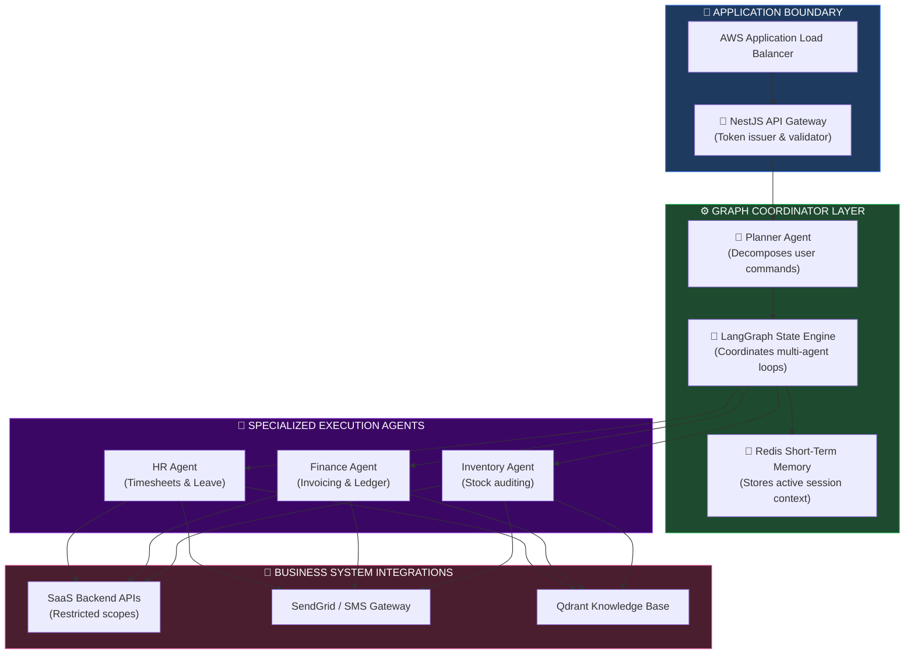
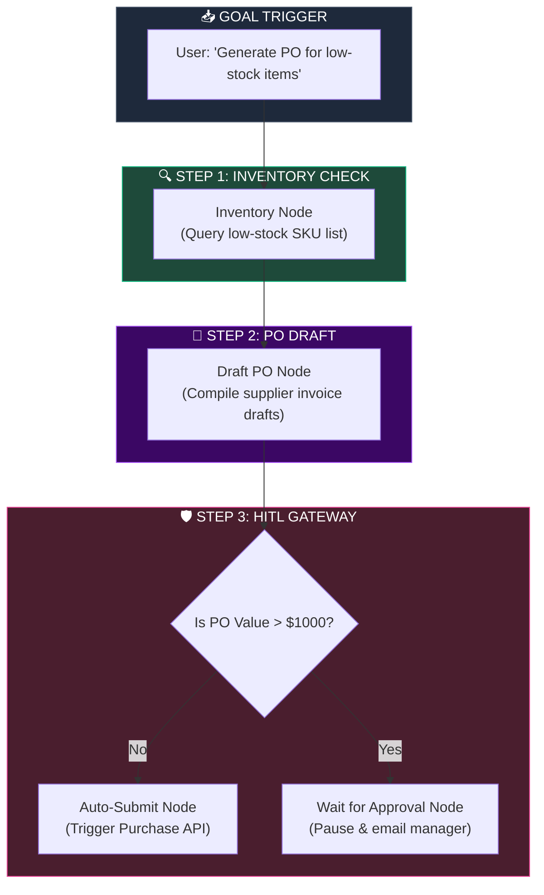
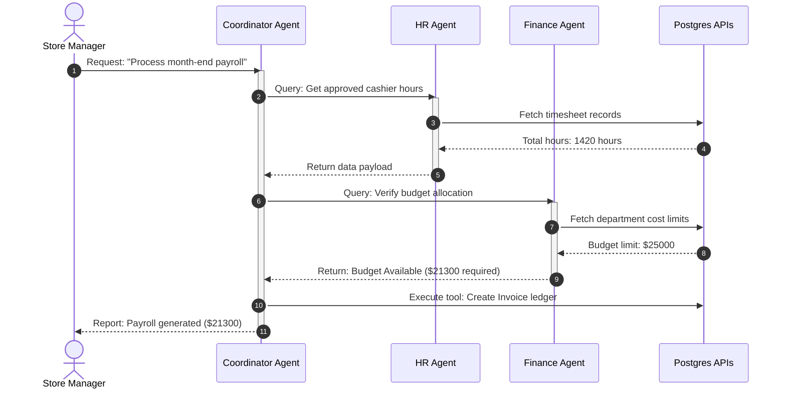
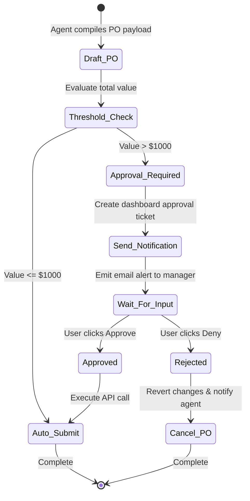
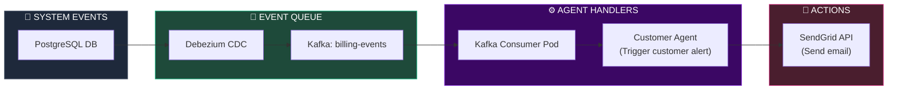

# AUTONOMOUS AI AGENTS, WORKFLOW AUTOMATION & INTELLIGENT BUSINESS OPERATIONS

**Project Name:** Enterprise SaaS Business Management Platform  
**Document Version:** 1.0.0 — Baseline Standard  
**Date:** July 14, 2026  
**Authors:** Principal AI Agent Architect, Enterprise Automation Architect, Multi-Agent Systems Engineer, Workflow Orchestration Expert, AI Governance Specialist & Enterprise SaaS Platform Architect  
**Classification:** Enterprise Internal — Restricted (Infrastructure Sensitive)  
**Status:** 🤖 APPROVED AUTONOMOUS AI AGENTS, WORKFLOW AUTOMATION & INTELLIGENT BUSINESS OPERATIONS SPECIFICATION  

---

## TABLE OF CONTENTS

| Section | Title | Description |
| :---: | :--- | :--- |
| **§1** | [AI Agent Foundation](#section-1--ai-agent-foundation) | Copilot vs. Agent, autonomous capabilities, enterprise values |
| **§2** | [Enterprise Agent Architecture](#section-2--enterprise-agent-architecture) | Planner patterns, orchestrator layers, and routing topologies |
| **§3** | [Agent Types](#section-3--agent-types) | Specific domain agents (Finance, HR, Inventory, Support) |
| **§4** | [Task Planning](#section-4--task-planning) | Goal decomposition, prioritizing, execution, and validation |
| **§5** | [Workflow Orchestration](#section-5--workflow-orchestration) | Invoicing, POs, leaves, and inventory reorder flows |
| **§6** | [Human-in-the-Loop](#section-6--human-in-the-loop) | Approval triggers, manual gates, overrides, escalation |
| **§7** | [Tool Integration](#section-7--tool-integration) | Core API bindings, sandboxing execution, calendar, and mail |
| **§8** | [Multi-Agent Collaboration](#section-8--multi-agent-collaboration) | Communication protocols, consensus and conflict resolution |
| **§9** | [Event-Driven Agents](#section-9--event-driven-agents) | Kafka event listeners, low stock and failed payment loops |
| **§10** | [Decision Support](#section-10--decision-support) | Risk assessment engines, scenario modeling, cost pruners |
| **§11** | [Agent Memory](#section-11--agent-memory) | Episodic (short-term) and Semantic (long-term) structures |
| **§12** | [Security & Governance](#section-12--security-and-privacy) | Least-privilege API scopes, tenant sandbox walls, prompts |
| **§13** | [Observability](#section-13--observability) | Metric scorecards: token counts, execution success, accuracy |
| **§14** | [Agent Lifecycle](#section-14--agent-lifecycle) | Deployment stages: registration, monitoring, deprecation |
| **§15** | [Enterprise Use Cases](#section-15--enterprise-use-cases) | E2E runbooks: Month-end close, automated procurement |
| **§16** | [Agent Tool Stack](#section-16--agent-tool-stack) | Orchestrator stack comparison and ownership maps |
| **§17** | [Compliance](#section-17--compliance) | Audit trails, trace log histories, user accountability |
| **§18** | [Future Evolution](#section-18--future-evolution) | System roadmap: Copilot to Semi-Autonomous to Full Autonomous |
| **§19** | [Governance Checklist](#section-19--governance-checklist) | Verification parameters for security, safety, and performance |
| **§20** | [Final AI Agent Architecture](#section-20--final-ai-agent-architecture) | 5 comprehensive technical Mermaid agent flowcharts |

---

## SECTION 1 — AI AGENT FOUNDATION

### 1.1 The Shift from Assistants to Autonomous Agents
*   **AI Assistant:** A basic search-and-answer tool that responds to user inputs (e.g., standard customer service chatbots).
*   **AI Copilot:** Works alongside the user, recommending actions within an active window, but relying on the user to click "execute" (e.g., GitHub Copilot, Business reporting assistants).
*   **AI Agent:** Formulates a multi-step plan to achieve a user-defined goal, dynamically choosing tools, evaluating results, and adjusting actions.
*   **Autonomous Agent:** Runs continuously in the background, triggered by system events (e.g., database updates or Kafka topics), executing tasks independently without user intervention.
*   **Multi-Agent System:** A network of specialized agents that coordinate, negotiate, and execute complex workflows (e.g., a Finance Agent coordinating with an Inventory Agent to settle accounts).

---

## SECTION 2 — ENTERPRISE AGENT ARCHITECTURE

### 2.1 The Multi-Agent Orchestration Topology
Incoming requests are parsed, scheduled by a planner, executed by specialized agents, and verified.

```
THE ENTERPRISE AGENT RUNTIME
═══════════════════════════════════════════════════════════════════════════════
                           [ User Natural Command ]
                                      │
                                      ▼
                        [ Ingress Webhook / Gateway ]
                                      │
                                      ▼
                           [ Planner Agent / Router ]
                                      │
                                      ▼ (Decompose Tasks)
                        [ Task Orchestrator (LangGraph) ]
                                      │
           ┌──────────────────────────┼──────────────────────────┐
           ▼                          ▼                          ▼
    [ Finance Agent ]           [ HR Agent ]            [ Inventory Agent ]
           │                          │                          │
           ▼                          ▼                          ▼
    [ Financial APIs ]          [ HR Systems ]          [ Warehouse Tools ]
           │                          │                          │
           └──────────────────────────┼──────────────────────────┘
                                      ▼ (Validate Outcomes)
                            [ Validator Agent ]
                                      │
                                      ▼ (Acknowledge)
                           [ User UI Notification ]
═══════════════════════════════════════════════════════════════════════════════
```

---

## SECTION 3 — AGENT TYPES

### 3.1 Domain Agent Boundaries

| Agent Persona | Core Domain | Execution Permissions | Security Boundaries |
| :--- | :--- | :--- | :--- |
| **Executive Agent** | Corporate reporting & strategies. | Read-only access to all modules. | Cannot execute transactions. |
| **Finance Agent** | Ledger audits, invoices, payments. | Read-write on invoices & billing. | Blocked from employee files. |
| **HR Agent** | Leave tracking, timesheets, audits. | Read-write on schedules & timesheets. | Blocked from credit card logs. |
| **Inventory Agent** | Stock allocations, product metadata. | Read-write on stock catalog. | Cannot approve external supplier payments. |
| **Procurement Agent**| Supplier POs, purchase contracts. | Drafts POs, edits supplier logs. | Bounded by Human-in-the-loop limits. |
| **Analytics Agent** | Custom reports generation, SQL execution. | Read-only on OLAP ClickHouse. | Blocked from write actions. |

---

## SECTION 4 — TASK PLANNING

### 4.1 Planning & Execution Loops
When a goal is submitted, the Planner Agent breaks it down into structured tasks:
*   **Goal Decomposition:** Converts a request (e.g., "Replenish low-selling stock for Zone A") into sequential tasks.
*   **Priority & Dependency:** Identifies prerequisites (e.g., we must calculate sales rates before drafting a PO).
*   **Result Validation:** Compares output data against schema constraints to verify tool execution.

---

## SECTION 5 — WORKFLOW ORCHESTRATION

### 5.1 LangGraph State Machine Definition
The platform uses **LangGraph** to coordinate multi-step workflows.

```python
# MLOps Agent workflow configuration: agents/workflows/po_generation.py
from typing import Dict, TypedDict, Annotated, List
from langgraph.graph import StateGraph, END

# Define state structure passed between agents
class AgentState(TypedDict):
    goal: str
    tenant_id: str
    target_branch: str
    low_stock_items: List[Dict]
    draft_po_ids: List[str]
    human_approved: bool
    status: str

# Create Node functions
def check_inventory_node(state: AgentState) -> Dict:
    # Queries inventory database for low-stock items
    items = [{"sku": "SKU-MILK-100", "qty": 4, "reorder": 10, "supplier": "DairyCorp"}]
    return {"low_stock_items": items, "status": "inventory_checked"}

def draft_po_node(state: AgentState) -> Dict:
    # Drafts purchase order for supplier
    po_ids = ["PO-2026-99120"]
    return {"draft_po_ids": po_ids, "status": "po_drafted"}

def human_approval_gate(state: AgentState) -> str:
    # Conditional router node mapping approval
    if state.get("human_approved", False):
        return "submit_po"
    return "wait_for_user"

# Initialize StateGraph
workflow = StateGraph(AgentState)

# Add Nodes
workflow.add_node("check_inventory", check_inventory_node)
workflow.add_node("draft_po", draft_po_node)

# Set Entry Point
workflow.set_entry_point("check_inventory")

# Add Transitions
workflow.add_edge("check_inventory", "draft_po")
workflow.add_conditional_edges(
    "draft_po",
    human_approval_gate,
    {
        "submit_po": END,
        "wait_for_user": END
    }
)

app = workflow.compile()
```

---

## SECTION 6 — HUMAN-IN-THE-LOOP (HITL)

### 6.1 Approval Gates & Escalations
To maintain operational safety, autonomous write actions are governed by a Human-in-the-Loop (HITL) framework.

```json
// Sample HITL Verification Payload Schema
{
  "task_id": "task-po-generation-88219",
  "tenant_id": "tenant-cambodia-retail-899",
  "requesting_agent": "ProcurementAgent",
  "action_target": "https://api.saas.internal/v1/procurement/purchase-orders",
  "action_payload": {
    "supplier_id": "sup-dairycorp-01",
    "items": [{ "sku": "SKU-MILK-100", "quantity": 100 }],
    "total_value": 1500.00
  },
  "escalation_rules": {
    "auto_timeout_hours": 24,
    "escalation_role": "store_manager",
    "on_reject_action": "notify_creator"
  }
}
```

*   **Financial Thresholds:** Write actions exceeding $1,000 (e.g., high-value refunds or PO submissions) are paused, generating a notification to the store manager.

---

## SECTION 7 — TOOL INTEGRATION

### 7.1 Secure Tool Execution
Agents invoke business APIs through a secure wrapper that enforces rate limiting, inputs sanitation, and credential isolation.
*   **External Service Integration:** Integrates with tools like Google Calendar (scheduling shift slots) and SendGrid (sending supplier orders).

---

## SECTION 8 — MULTI-AGENT COLLABORATION

### 8.1 Agent Consensus Protocol
When multiple agents collaborate, they share a common session log inside a shared database (e.g., a Redis stream) to coordinate state updates.
*   **Conflict Resolution:** If the Finance Agent rejects a PO draft because it exceeds the monthly budget, the workflow is redirected to the Coordinator Agent for reconciliation.

---

## SECTION 9 — EVENT-DRIVEN AGENTS

### 9.1 Kafka Ingest triggers
SaaS business events are captured, streamed via Kafka, and dispatched to trigger active agents.

```
EVENT-DRIVEN AGENT PIPELINE
═══════════════════════════════════════════════════════════════════════════════
PostgreSQL Write ──► Kafka Event: payment_failed ──► Agent Listener
                                                         │
                                                         ▼
                                            [ Customer Support Agent ]
                                                         │
                                                         ▼
                                            Calls Tool: Send Email Alert
═══════════════════════════════════════════════════════════════════════════════
```

---

## SECTION 10 — DECISION SUPPORT

### 10.1 Prescriptive Suggestions
*   **Risk Analysis:** Evaluates customer metrics to predict risk profiles.
*   **Demand Planning:** Suggests staffing levels based on forecasted POS traffic.

---

## SECTION 11 — AGENT MEMORY

### 11.1 Dynamic Memory Architecture
*   **Short-Term Memory:** Bounded to the active user session log (Redis cache).
*   **Long-Term Memory:** Stores general user preferences, tenant context, and historical run successes (PostgreSQL/Qdrant).
*   **Memory Isolation:** Memory keys are prefixed with `tenant_id` to prevent cross-tenant leakage.

---

## SECTION 12 — SECURITY AND PRIVACY

### 12.1 Least-Privilege API Scopes
Agents authenticate using short-lived JWT tokens configured with narrow scopes (e.g., `scope: ["read:inventory", "write:purchase-orders"]`).
*   **Prompt Security:** Input prompts are sanitized to remove system instructions, preventing prompt injection attacks.

---

## SECTION 13 — OBSERVABILITY

### 13.1 Operational Metric Telemetry
*   **Execution Time:** Tracks the duration of multi-agent runs.
*   **Decision Accuracy:** Compares automated decisions against manual overrides.

---

## SECTION 14 — AGENT LIFECYCLE

### 14.1 Lifecycle Phases
1.  **Create:** Authoring agent code and prompt definitions.
2.  **Deploy:** Argo CD registers the agent in Kubernetes.
3.  **Version:** Semantic version tagging (e.g., `agent-finance-v1.2.0`).
4.  **Monitor:** Drift checks.
5.  **Retire:** Graceful shutdown and archiving of execution logs.

---

## SECTION 15 — ENTERPRISE USE CASES

### 15.1 Month-End Closing Automation
The Coordinator Agent triggers a multi-step audit workflow:
1.  **Finance Agent:** Collects unpaid invoices.
2.  **CRM Agent:** Cross-references customer billing balances.
3.  **Analytics Agent:** Generates monthly tax and profit projections.
4.  **Executive Notification:** Compiles results and sends a summary report to the CFO.

---

## SECTION 16 — AGENT TOOL STACK

### 16.1 AI Agent Tool Stack Matrix

| Category | Tool | Production Purpose | System Owner |
| :--- | :--- | :--- | :--- |
| **Agent Orchestration** | LangGraph | Coordinates multi-agent state graphs. | AI Architect |
| **Agent Framework** | Autogen / CrewAI | Defines specialized agents and tools. | AI Developer |
| **Workflow Engine** | Temporal | Manages long-running workflows. | Platform Engineer |
| **Integration** | n8n / Camunda | Connects third-party APIs. | Integration Lead |
| **Messaging** | Apache Kafka | Streams events to trigger agents. | DevOps / SRE |

---

## SECTION 20 — FINAL AI AGENT ARCHITECTURE

### 20.1 Enterprise AI Agent Architecture



### 20.2 Workflow Orchestration Flow



### 20.3 Multi-Agent Collaboration



### 20.4 Human-in-the-Loop Approval Flow



### 20.5 Event-Driven Agent Architecture



---

## DOCUMENT METADATA

| Field | Value |
| :--- | :--- |
| **Document ID** | SAAS-AGENTS-016.6 |
| **Section** | 16 — AI & Data Platform |
| **Subsection** | 16.6 — Autonomous Agents & Workflows |
| **Status** | 🤖 APPROVED |
| **Version** | 1.0.0 |
| **Date** | July 14, 2026 |
| **Next Review** | January 14, 2027 |
| **Related Documents** | [AI Platform Foundation](../16.1-AI-Platform-Foundation/AI-Platform-Foundation.md) · [Data Warehouse & Lake](../16.2-Data-Platform-Warehouse-Lake/Data-Platform-Warehouse-Lake.md) · [BI & Analytics](../16.3-BI-Advanced-Analytics/BI-Advanced-Analytics.md) · [MLOps Lifecycle](../16.4-MLOps-Model-Lifecycle/MLOps-Model-Lifecycle.md) · [RAG & Vector DB](../16.5-Generative-AI-RAG-Vector/Generative-AI-RAG-Vector.md) |
| **Technology Versions** | LangGraph v0.2 · Autogen v0.2.x · Temporal v1.23 · Kafka v3.7 |

---

*This document is the authoritative specification for all autonomous AI agents, workflow automation, and intelligent business operations decisions in the Enterprise SaaS Business Management Platform. All multi-agent workflows, state graphs, human-in-the-loop triggers, tool call registries, and Kafka event consumers must conform to the standards defined herein.*
