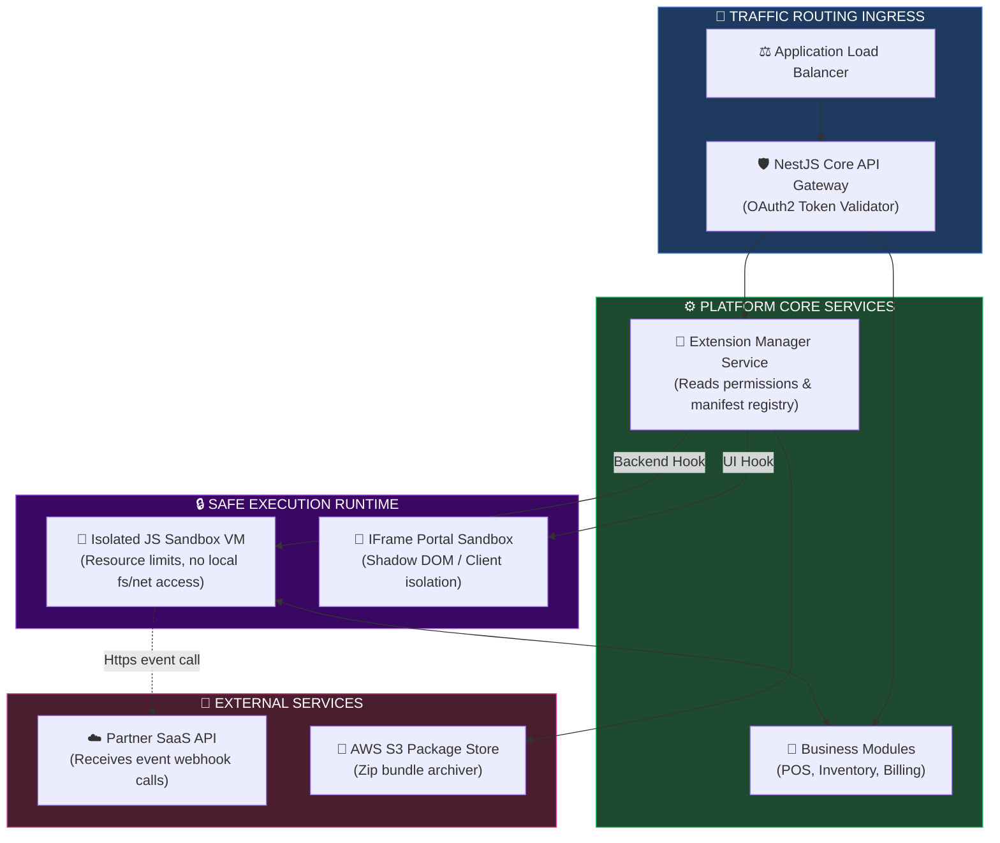
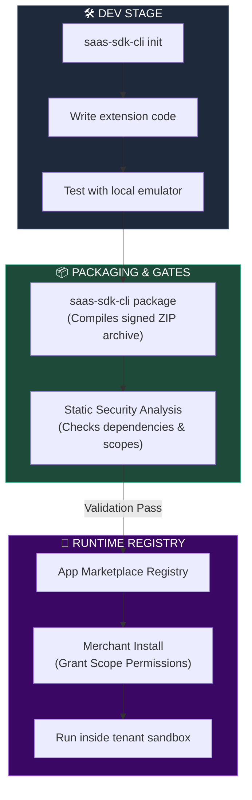
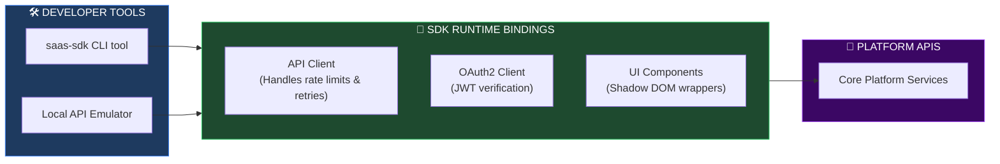
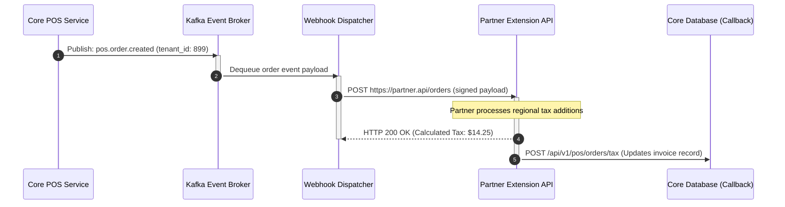
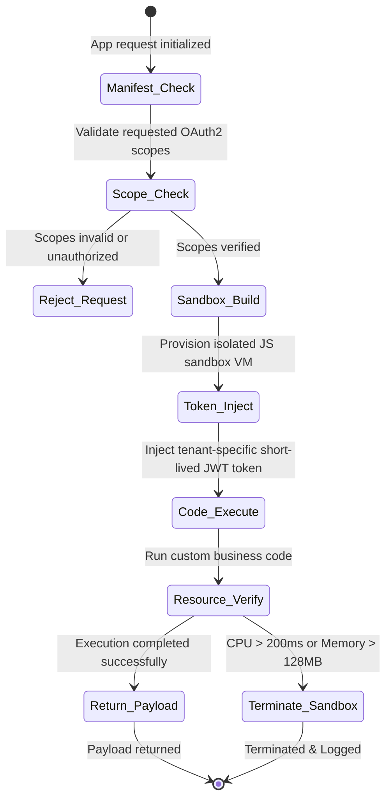

# ENTERPRISE PLATFORM EXTENSIBILITY FRAMEWORK ARCHITECTURE

**Project Name:** Enterprise SaaS Business Management Platform  
**Document Version:** 1.0.0 — Baseline Standard  
**Date:** July 14, 2026  
**Authors:** Principal Platform Architect, Enterprise Software Architect, API Platform Engineer, Extensibility Framework Specialist, Cloud Platform Architect & Enterprise SaaS Platform Architect  
**Classification:** Enterprise Internal — Restricted (Infrastructure Sensitive)  
**Status:** 🔌 APPROVED ENTERPRISE PLATFORM EXTENSIBILITY FRAMEWORK ARCHIBILITY SPECIFICATION  

---

## TABLE OF CONTENTS

| Section | Title | Description |
| :---: | :--- | :--- |
| **§1** | [Platform Foundation](#section-1--platform-foundation) | Platform strategy, ecosystem growth, marketplace evolution |
| **§2** | [Platform Extensibility Architecture](#section-2--platform-extensibility-architecture) | Execution flow, core hooks, SDK layers, and Mermaid topology |
| **§3** | [Extension Types](#section-3--extension-types) | UI, backend, workflow, reporting, AI, and notification boundaries |
| **§4** | [Module Lifecycle](#section-4--module-lifecycle) | Extension states: package, validate, publish, install, upgrade |
| **§5** | [SDK Architecture](#section-5--sdk-architecture) | Client bindings, authentication libraries, and CLI templates |
| **§6** | [Event-Driven Extensibility](#section-6--event-driven-extensibility) | Platform event triggers, listeners, and response execution |
| **§7** | [API Extensibility](#section-7--api-extensibility) | REST, GraphQL, Webhooks, and streaming event abstractions |
| **§8** | [Configuration Framework](#section-8--configuration-framework) | Extension manifest rules, JSON validation, security scopes |
| **§9** | [Security Model](#section-9--security-model) | Sandbox isolation, least-privilege RBAC, code signing |
| **§10** | [Versioning Strategy](#section-10--versioning-strategy) | Semantic Versioning, compatibility matrix, deprecation rules |
| **§11** | [Extension Storage](#section-11--extension-storage) | Registry repositories, metadata stores, and binary storage |
| **§12** | [Developer Experience](#section-12--developer-experience) | CLI tools, local emulators, testing sandboxes, documentation |
| **§13** | [Performance](#section-13--performance) | Lazy loading, resource quotas, rate limits, script timeouts |
| **§14** | [Observability](#section-14--observability) | Health checks, CPU/memory telemetry, event crash logging |
| **§15** | [Enterprise Use Cases](#section-15--enterprise-use-cases) | custom workflow handlers, industry modules, compliance hooks |
| **§16** | [Platform Tool Stack](#section-16--platform-tool-stack) | Monorepo tools, OpenAPI, OAuth2, and serving runtime engines |
| **§17** | [Governance](#section-17--governance) | Code review processes, certification levels, and support policies |
| **§18** | [Future Evolution](#section-18--future-evolution) | Roadmap: internal → partners → public global app marketplace |
| **§19** | [Governance Checklist](#section-19--governance-checklist) | Verification gates for security, QA, access control, and performance |
| **§20** | [Final Platform Extensibility Architecture](#section-20--final-platform-extensibility-architecture) | 5 comprehensive technical Mermaid extension diagrams |

---

## SECTION 1 — PLATFORM FOUNDATION

### 1.1 The Enterprise Platform Strategy
To achieve global scale, an enterprise SaaS system must evolve from a closed product into an open ecosystem.
*   **Application:** Out-of-the-box business solutions (e.g., standard retail checkout).
*   **Platform:** Base system offering open APIs, storage schemas, and UI hooks.
*   **Platform Ecosystem:** A network of third-party developers, partners, and system integrators adding vertical specializations.
*   **Marketplace:** A monetization directory where merchants browse, purchase, and deploy extensions.

```
THE SAAS PLATFORM SPECTRUM
═══════════════════════════════════════════════════════════════════════════════
Application ──► Monolithic CRUD workflows, closed core
     │
     ▼
Platform ──► APIs and developer SDK bindings are exposed
     │
     ▼
Ecosystem ──► Partner networks write bespoke add-ons
     │
     ▼
Marketplace ──► Open app store with validation and billing
═══════════════════════════════════════════════════════════════════════════════
```

---

## SECTION 2 — PLATFORM EXTENSIBILITY ARCHITECTURE

### 2.1 The Extensible System Execution Flow
Incoming UI or backend requests are checked against extension registries and executed inside secure, isolated sandboxes.

```
THE PLATFORM EXTENSIBILITY FLOW
═══════════════════════════════════════════════════════════════════════════════
 [ Next.js UI / NestJS API ]
               │
               ▼
 [ Extension Manager (Registry) ] ──► Validates scopes and token signature
               │
               ▼ (Dispatch Payload)
  [ Execution Sandbox (V8 / WASM) ] ◄── Mounts short-lived API client tokens
               │
               ▼ (Mutates / Appends Data)
   [ Core Business Module ]
               │
               ▼
 [ Database / UI Output Render ]
═══════════════════════════════════════════════════════════════════════════════
```

---

## SECTION 3 — EXTENSION TYPES

### 3.1 Platform Hook Points
*   **UI Extension:** Embeds custom components (e.g., a shipping calculator card) in Next.js admin dashboard frames using secure web-component sandboxes (iframe/shadow DOM).
*   **Backend Extension:** Registers interceptors or decorators to validate payloads or append fields to responses.
*   **Workflow Extension:** Dynamically inserts custom steps into approval workflows.
*   **Report Extension:** Generates custom datasets from the ClickHouse analytical database.
*   **AI Extension:** Registers custom tools or prompt templates within the RAG coordinator agent.

---

## SECTION 4 — MODULE LIFECYCLE

### 4.1 Deployment & Validation Lifecycle
All extensions follow a structured path from development to deprecation:
1.  **Develop:** Developer uses the platform CLI and emulator.
2.  **Package:** Compiles code, assets, and the extension manifest into a signed archive.
3.  **Validate:** The platform run validation tests (static analysis, dependency checks).
4.  **Publish:** Registry lists the validated version in the App Store.
5.  **Install:** Tenant enables the app, consenting to required API scopes.
6.  **Upgrade:** Rolling updates with backward compatibility verification.
7.  **Retire:** Graceful deprecation window; API access revoked.

---

## SECTION 5 — SDK ARCHITECTURE

### 5.1 SDK Libraries
*   **API Client:** A wrapper for core APIs that handles authorization headers, rate limits, and automatic retries.
*   **Authentication Library:** Validates short-lived tokens and coordinates OAuth2 flows.
*   **CLI Tools:** Node-based terminal tool to scaffold, run, test, and upload packages.

---

## SECTION 6 — EVENT-DRIVEN EXTENSIBILITY

### 6.1 Platform Event Trigger Payload
When business events occur, the platform dispatches event payloads to registered webhooks.

```json
// Sample Event Webhook POST Payload
{
  "event_id": "evt-order-created-9912a",
  "event_type": "pos.order.created",
  "timestamp": "2026-07-14T07:59:00Z",
  "tenant_id": "tenant-cambodia-retail-899",
  "version": "1.0.0",
  "data": {
    "order_id": "ord-88102-cam",
    "gross_amount": 142.50,
    "currency": "USD",
    "cashier_id": "usr-cashier-05",
    "branch_id": "phnom-penh-01"
  },
  "context": {
    "callback_url": "https://api.saas-platform.com/v1/extensions/actions/resume"
  }
}
```

---

## SECTION 7 — API EXTENSIBILITY

### 7.1 API Protocols & Versioning
*   **REST & GraphQL:** Core models are queried using REST (payload mutations) or GraphQL (data aggregation).
*   **Webhooks:** Outbound events are dispatched asynchronously using worker queues.
*   **API Versioning:** Enforces path versioning (e.g., `/api/v1/`) with a 12-month deprecation policy for older endpoints.

---

## SECTION 8 — CONFIGURATION FRAMEWORK

### 8.1 Extension Manifest Specification
Every extension must declare a manifest defining its permissions and configuration requirements.

```json
// manifest.json
{
  "extension_id": "ext-cambodian-tax-calc",
  "name": "Cambodian General Tax Calculator",
  "version": "1.2.0",
  "publisher": "TaxTech International",
  "required_scopes": [
    "read:pos:orders",
    "write:pos:taxes"
  ],
  "settings_schema": {
    "type": "object",
    "properties": {
      "vat_rate": { "type": "number", "minimum": 0, "maximum": 1, "default": 0.1 },
      "vat_id": { "type": "string" }
    },
    "required": ["vat_id"]
  },
  "hooks": {
    "before_order_save": "https://tax-api.taxtech.kh/hooks/calculate-vat"
  }
}
```

---

## SECTION 9 — SECURITY MODEL

### 9.1 The Sandbox Security Matrix

```
SECURE EXECUTION SANDBOX
═══════════════════════════════════════════════════════════════════════════════
[ Next.js Core Portal ] ──► iframe (Sandbox properties active)
                                 ├── Allow: scripts, forms
                                 └── Block: top-navigation, same-origin
                                 
[ NestJS Core API ] ──► Node.js VM2 / V8 Isolate Sandbox
                                 ├── Block: process, fs, net, require
                                 └── Allow: Input/Output payload mutation only
═══════════════════════════════════════════════════════════════════════════════
```

*   **Tenant Isolation:** Sandbox runtimes only receive API tokens scoped to the active `tenant_id`.

---

## SECTION 10 — VERSIONING STRATEGY

### 10.1 Semantic Versioning & Deprecation Lifecycle
*   **Semantic Versioning (SemVer):** Major updates (`X.0.0`) denote breaking changes; Minor updates (`0.Y.0`) add backward-compatible features; Patch updates (`0.0.Z`) address bug fixes.
*   **Deprecation Policy:** Deprecated APIs remain active for 12 months, during which warning headers (`Deprecation: true`) are appended to all responses.

---

## SECTION 11 — EXTENSION STORAGE

### 11.1 Registry Repositories
*   **Metadata Store:** PostgreSQL tables tracking extensions, versions, metadata, and install scopes.
*   **Binary Storage:** Safe object storage (AWS S3) holding packaged extension zip archives.

---

## SECTION 12 — DEVELOPER EXPERIENCE

### 12.1 Scaffolding CLI Commands
```bash
# Initialize a new extension template
$ saas-sdk-cli init my-custom-tax --type=backend

# Run local API emulator with mock database
$ saas-sdk-cli dev --tenant-mock=tenant-992

# Run security static analysis checks
$ saas-sdk-cli lint --security

# Package and sign the extension zip archive
$ saas-sdk-cli package --key=dev-key.pem
```

---

## SECTION 13 — PERFORMANCE

### 13.1 Performance Optimization Rules
*   **Script Timeouts:** Backend custom scripts running in the sandbox must complete execution within 200ms.
*   **Rate Limiting:** Extensions are limited to 100 API requests per minute per tenant to prevent resource exhaustion.

---

## SECTION 14 — OBSERVABILITY

### 14.1 Metrics & Alerting
*   **Extension Health:** Logs CPU/memory utilization and exception rates for sandboxed executions. Spikes in error rates trigger automated application disabling.

---

## SECTION 15 — ENTERPRISE USE CASES

### 15.1 Custom Payment Integration
*   **Scenario:** A large merchant requires integration with a niche local payment gateway.
*   **Solution:** Partner builds an Integration Extension using the Plugin SDK, exposing a custom payment driver on the POS terminal interface.

---

## SECTION 16 — PLATFORM TOOL STACK

### 16.1 Platform Tool Stack Matrix

| Category | Tool | Production Purpose | System Owner |
| :--- | :--- | :--- | :--- |
| **Backend Core** | NestJS | Hosts the Extension Manager registry. | Software Architect |
| **Monorepo Management**| Nx | Orchestrates CLI and SDK library builds. | Devops Engineer |
| **Schema Standard** | OpenAPI (Swagger) | Publishes API contracts for external developers. | API Engineer |
| **Identity Standard** | OAuth2 / OIDC | Secures extension API access tokens. | Security Lead |
| **Sandbox Host** | Docker / WASM VM | Runs backend scripts in isolated runtimes. | Platform SRE |
| **Deployment Engine** | Helm / Kubernetes | Deploys registry services and sandboxes. | Platform Engineer |

---

## SECTION 20 — FINAL PLATFORM EXTENSIBILITY ARCHITECTURE

### 20.1 Platform Extension Architecture



### 20.2 Extension Lifecycle



### 20.3 SDK Architecture



### 20.4 Event-Driven Extension Flow



### 20.5 Extension Security Model



---

## DOCUMENT METADATA

| Field | Value |
| :--- | :--- |
| **Document ID** | SAAS-EXT-017.1 |
| **Section** | 17 — Platform Extensibility |
| **Subsection** | 17.1 — Extensibility Foundation |
| **Status** | 🔌 APPROVED |
| **Version** | 1.0.0 |
| **Date** | July 14, 2026 |
| **Next Review** | January 14, 2027 |
| **Related Documents** | [Detailed Database Design](../../02-System-Design/03-Database-Design.md) · [Backend API Gateway](../../14-Backend-Architecture/14.5-API-Architecture/API-Architecture.md) · [Security Architecture](../../10-Security-Architecture/10.1-Security-Foundation/Security-Foundation.md) |
| **Technology Versions** | NestJS v10 · Nx v19 · OpenAPI v3 · OAuth2 (OIDC) |

---

*This document is the authoritative specification for all platform extensibility framework architecture decisions in the Enterprise SaaS Business Management Platform. All API wrappers, CLI scaffolds, sandbox executors, manifest schemas, and event hooks must conform to the standards defined herein.*
