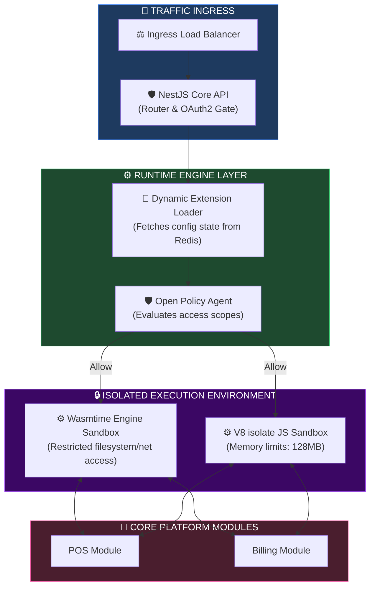
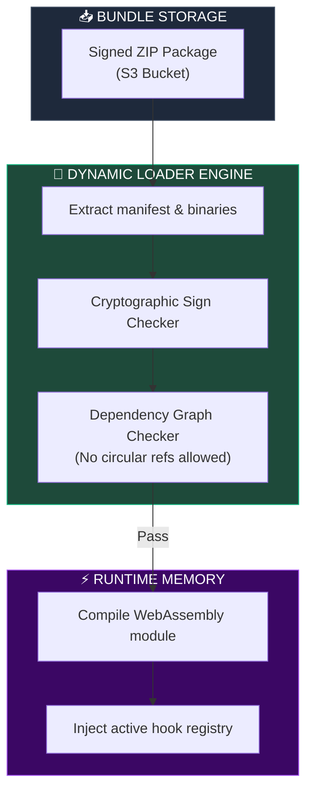
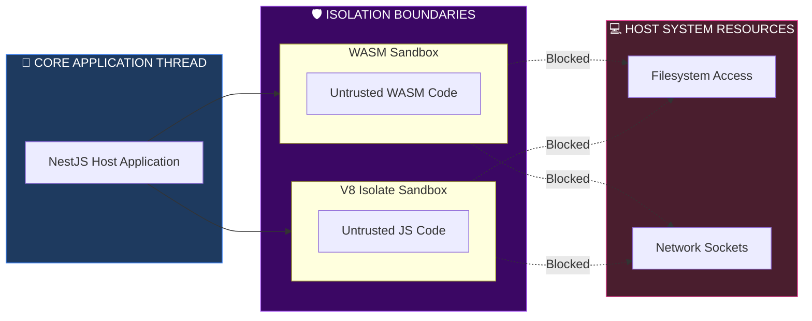
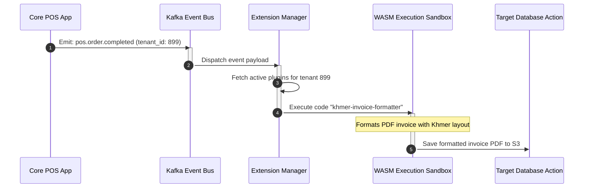
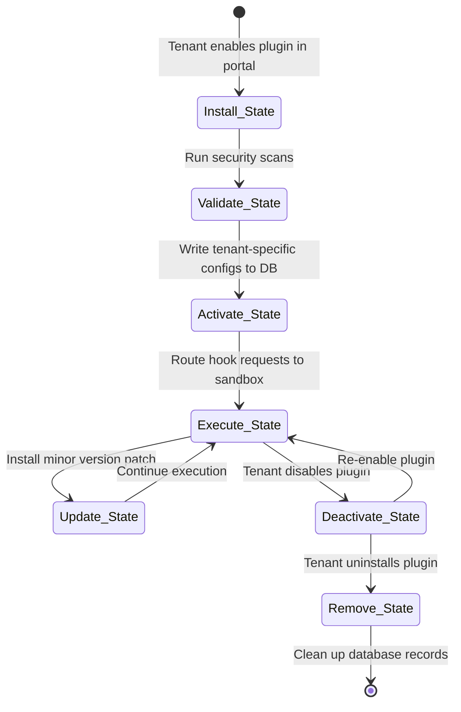

# PLUGIN, MODULE & EXTENSION RUNTIME ARCHITECTURE

**Project Name:** Enterprise SaaS Business Management Platform  
**Document Version:** 1.0.0 — Baseline Standard  
**Date:** July 14, 2026  
**Authors:** Principal Platform Runtime Architect, Plugin System Engineer, Modular Architecture Specialist, Cloud Native Engineer, Security Architect & Enterprise SaaS Platform Architect  
**Classification:** Enterprise Internal — Restricted (Infrastructure Sensitive)  
**Status:** 🐳 APPROVED PLUGIN, MODULE & EXTENSION RUNTIME ARCHITECTURE SPECIFICATION  

---

## TABLE OF CONTENTS

| Section | Title | Description |
| :---: | :--- | :--- |
| **§1** | [Plugin Runtime Foundation](#section-1--plugin-runtime-foundation) | Architectural comparisons, core benefits, code updates |
| **§2** | [Runtime Architecture](#section-2--runtime-architecture) | Execution flow, core engine layers, and Mermaid runtime topology |
| **§3** | [Plugin Types](#section-3--plugin-types) | Specific domain plugins (Frontend, Backend, AI, Payment) |
| **§4** | [Module System Design](#section-4--module-system-design) | Directory layout structure, manifest file mapping layouts |
| **§5** | [Extension Manifest](#section-5--extension-manifest) | Configuration manifest templates, permission scopes |
| **§6** | [Dynamic Loading Strategy](#section-6--dynamic-loading-strategy) | Static, dynamic, remote, and container loaders compared |
| **§7** | [Execution Isolation](#section-7--execution-isolation) | Process vs. Container vs. WASM Sandbox execution layers |
| **§8** | [Dependency Management](#section-8--dependency-management) | Version conflict resolution, DAG checks, package mapping |
| **§9** | [Tenant Extension Management](#section-9--tenant-extension-management) | Tenant scopes, enabling, disabling, and versioning rules |
| **§10** | [Extension Lifecycle](#section-10--extension-lifecycle) | State transitions: Install, Validate, Execute, Remove |
| **§11** | [Security Architecture](#section-11--security-architecture) | Permission boundaries, OPA policies, audit logging |
| **§12** | [Performance Architecture](#section-12--performance-architecture) | Lazy loading, resource limits, background worker queues |
| **§13** | [Event Extension System](#section-13--event-extension-system) | Kafka events, custom event structures, callback routing |
| **§14** | [API Access Model](#section-14--api-access-model) | JWT authorizations, OAuth2 gateway rules, scoped RESTs |
| **§15** | [Extension Monitoring](#section-15--extension-monitoring) | CPU/memory checks, error tracing telemetry, token usage |
| **§16** | [Failure Handling](#section-16--failure-handling) | Sandbox failure detection, isolation, self-disable loops |
| **§17** | [Version Management](#section-17--version-management) | Major/Minor versions, database migrations, rollbacks |
| **§18** | [Runtime Tool Stack](#section-18--runtime-tool-stack) | Ingestion software comparison, purposes, and support matrices |
| **§19** | [Platform Governance](#section-19--platform-governance) | Certification reviews, testing rules, approval thresholds |
| **§20** | [Final Plugin Runtime Architecture](#section-20--final-plugin-runtime-architecture) | 5 comprehensive technical Mermaid runtime flowcharts |

---

## SECTION 1 — PLUGIN RUNTIME FOUNDATION

### 1.1 Architectural Evolution: Monolithic Customization vs. Dynamic Extensibility
*   **Traditional Customization:** Modifying core source code for custom customer features.
    *   *Hard Upgrades:* Core upgrades overwrite custom code, leading to code drift and version forks.
    *   *Dependency Conflicts:* Conflicting npm/library package versions break the system.
    *   *Security Risks:* Direct execution of custom scripts bypasses security boundaries.
*   **Dynamic Plugin Architecture:** Code runs in isolated sandboxes and interacts with core systems strictly through APIs.

```
THE PLUGIN ARCHITECTURE SEPARATION
═══════════════════════════════════════════════════════════════════════════════
Traditional:
  [ Core Codebase ] ──► (Merged directly) ◄── [ Custom Tenant Code ]
                                                   │ (Upgrade breaks code)
                                                   ▼
Dynamic:
  [ Core Platform APIs ] ◄── [ Runtime Sandboxes ] ◄── [ Isolated Plugins ]
                                                   │ (Upgrades run safely)
                                                   ▼
═══════════════════════════════════════════════════════════════════════════════
```

---

## SECTION 2 — RUNTIME ARCHITECTURE

### 2.1 The Dynamic Execution Flow
The dynamic runtime manager intercepts calls, validates permissions, provisions sandboxes, and executes third-party scripts safely.

```
THE PLUGIN RUNTIME ARCHITECTURE
═══════════════════════════════════════════════════════════════════════════════
 [ Core API Gateway ] ──► [ Extension Loader Engine ]
                                  │
                                  ▼ (Query Manifest Settings)
                      [ Permission Validator (OPA) ]
                                  │
                                  ▼ (Validate Code Hash)
                     [ Sandboxed Execution Environment ]
                     (WASM runtime / V8 Isolate VM)
                                  │
                                  ▼ (Short-lived Scoped Token)
                       [ Core Platform Service APIs ]
═══════════════════════════════════════════════════════════════════════════════
```

---

## SECTION 3 — PLUGIN TYPES

### 3.1 Specialized Runtime Adaptors
*   **Backend Plugin:** Dynamic middleware executed before core NestJS routes to mutate or validate input payloads.
*   **Frontend Plugin:** Next.js pages rendered inside sandbox IFrames.
*   **Workflow Plugin:** Adds custom steps to core business logic workflows (e.g., executing a local tax check during checkout).
*   **AI Plugin:** Registers custom agent tools inside the LangGraph cognitive loop.

---

## SECTION 4 — MODULE SYSTEM DESIGN

### 4.1 Extension Bundle Directory Structure
Extensions are packaged as signed ZIP files with a standardized directory layout.

```
extension-package.zip
├── manifest.json            # Configuration and permission definitions
├── main.js                 # Compiled backend JavaScript code
├── index.html              # Frontend UI assets
├── config/
│   └── settings-ui.json    # Merchant settings UI schema definition
├── assets/
│   └── logo.png            # Icon displayed in marketplace
└── doc/
    └── README.md           # Installation documentation
```

---

## SECTION 5 — EXTENSION MANIFEST

### 5.1 Extension Manifest Example
The `manifest.json` file defines metadata, permissions, and dependency requirements.

```json
{
  "id": "ext-khmer-invoice-formatter",
  "name": "Khmer VAT Invoice Formatter",
  "version": "1.1.2",
  "author": "Phnom Penh Solutions Ltd",
  "description": "Formats invoices according to Cambodian General Department of Taxation regulations.",
  "permissions": [
    "read:billing:invoices",
    "write:billing:invoices",
    "use:analytics:reports"
  ],
  "dependencies": {
    "platform-core": ">=1.5.0",
    "pdf-generator-service": "^2.1.0"
  },
  "api_requirements": {
    "rest_version": "v1",
    "webhook_protocol": "HTTPS"
  },
  "compatibility": {
    "kubernetes": ">=1.28",
    "nodejs": ">=20.x"
  }
}
```

---

## SECTION 6 — DYNAMIC LOADING STRATEGY

### 6.1 Loading Strategy Evaluation

| Loading Model | Isolation Level | Boot Speed | System Overhead | SaaS Target Use Case |
| :--- | :--- | :--- | :--- | :--- |
| **Static Loading** | None (Runs in core thread). | Fast (Boot time). | High (Memory leak risk). | Core framework modules. |
| **Dynamic Loading** | Low (Dynamic import). | Fast (< 50ms). | Low. | Internal non-critical plugins. |
| **Remote Loading** | High (HTTP endpoint call). | Medium (Network transit). | Low. | Third-party partner APIs. |
| **Container-based**| Very High (Docker / Pod). | Slow (3–5 seconds). | High. | **Heavy background compute tasks.** |

---

## SECTION 7 — EXECUTION ISOLATION

### 7.1 Sandbox Isolation Layer
The platform isolates third-party code using a WebAssembly (WASM) runtime for backend extensions.

```typescript
// backend/src/extensions/runtime/wasm-sandbox.service.ts
import { Injectable } from '@nestjs/common';
import * as fs from 'fs';
import { WASI } from 'wasi';

@Injectable()
export class WasmSandboxService {
  // Execute untrusted third-party code in a secure WebAssembly sandbox
  async executePlugin(wasmPath: string, inputPayload: Record<string, any>): Promise<Record<string, any>> {
    const wasi = new WASI({
      args: [],
      env: {},
      preopens: {} // Blocks access to local directories
    });

    const wasmBuffer = fs.readFileSync(wasmPath);
    const wasmModule = await WebAssembly.compile(wasmBuffer);
    
    const importObject = {
      wasi_snapshot_preview1: wasi.wasiImport,
      env: {
        // Expose a sanitized memory buffer for input data exchange
        get_input_data: (ptr: number) => { this.writeBuffer(ptr, inputPayload); },
      }
    };

    const instance = await WebAssembly.instantiate(wasmModule, importObject);
    wasi.start(instance);

    // Read mutated result payload from WASM memory pointer
    return this.readResultBuffer(instance);
  }

  private writeBuffer(ptr: number, data: any) { /* implementation details */ }
  private readResultBuffer(instance: WebAssembly.Instance): any { /* implementation details */ }
}
```

---

## SECTION 8 — DEPENDENCY MANAGEMENT

### 8.1 Resolution Graph Verification
Before activation, the Extension Manager checks dependencies to prevent version conflicts.
*   **Dependency DAG:** Scans packages for circular dependencies. Installation is aborted if a circular reference is found.

---

## SECTION 9 — TENANT EXTENSION MANAGEMENT

### 9.1 Multi-Tenant Activation States
Tenants manage their extensions independently through the admin portal.
*   **Isolation at State Level:** Extension configurations, variables, and data tables are stored in PostgreSQL tables partitioned by `tenant_id`.

---

## SECTION 10 — EXTENSION LIFECYCLE

### 10.1 Lifecycle Stage Transitions
```
INSTALL ──► VALIDATE ──► ACTIVATE ──► EXECUTE ──► UPDATE ──► DEACTIVATE ──► REMOVE
```
*   **Validate:** The system runs automated security scans and dependency checks on the uploaded package.
*   **Deactivate:** Active hooks are disabled in database tables, stopping request routing to the extension without losing configuration data.

---

## SECTION 11 — SECURITY ARCHITECTURE

### 11.1 Open Policy Agent (OPA) Guardrails
The platform evaluates security permissions using an Open Policy Agent (OPA) engine before calling extensions.

```rego
# security/policies/extensions.rego
package platform.extensions

default allow = false

# Allow extension execution if request matching scopes are granted in manifest
allow {
    input.action == "execute"
    input.extension.permissions[_] == input.request.required_scope
    input.tenant.status == "active"
    input.extension.status == "verified"
}
```

---

## SECTION 12 — PERFORMANCE ARCHITECTURE

### 13.1 Performance Guardrails
*   **Memory Quota:** V8 Isolates are limited to 128MB of RAM per execution.
*   **Resource Limits:** CPU utilization limits prevent plugins from consuming excessive thread capacity.

---

## SECTION 13 — EVENT EXTENSION SYSTEM

### 13.1 Kafka Event Ingest Loops
When business events occur, the platform's Event Bus dispatches the data payload to registered extension listeners.
*   **Low Stock Notification:** Triggers a purchasing assistant plugin to generate stock reorders when inventory drops below defined thresholds.

---

## SECTION 14 — API ACCESS MODEL

### 14.1 OAuth2 Scoped Token Verification
Extensions request data from core systems using scoped OAuth2 access tokens generated on execution.
*   **Scoped Access:** Tokens carry short TTLs (15 minutes) and are restricted to permissions declared in the extension's manifest (e.g., `read:pos:orders`).

---

## SECTION 15 — EXTENSION MONITORING

### 15.1 Real-Time Telemetry Tracking
The Extension Manager logs performance metrics to the central observability stack:
*   **Error Rate:** Logs exception counts for sandboxed executions. Spikes in error rates trigger automated warnings.

---

## SECTION 16 — FAILURE HANDLING

### 16.1 Circuit Breakers
To prevent faulty plugins from impacting core platform stability, calls are wrapped in circuit breakers.

```
CIRCUIT BREAKER STATES
═══════════════════════════════════════════════════════════════════════════════
[ State: Closed ] ──► Standard execution
                          │
                          ▼ (5 consecutive failures)
[ State: Open ] ────► Circuit trips. Bypasses plugin. Returns default.
                          │
                          ▼ (1-minute timeout)
[ State: Half-Open ] ──► Test single call. Auto-restores if OK.
═══════════════════════════════════════════════════════════════════════════════
```

---

## SECTION 17 — VERSION MANAGEMENT

### 17.1 Rolling Updates & Migration Support
*   **Database Schema Evolution:** Extensions must register schema migrations in version folders. Migrations are executed using isolated schemas.

---

## SECTION 18 — RUNTIME TOOL STACK

### 18.1 Runtime Platform Tools

| Category | Tool | Production Purpose | System Owner |
| :--- | :--- | :--- | :--- |
| **Isolation VM** | WASM Runtime (Wasmtime)| Runs backend plugin binaries in a secure sandbox. | Platform Architect |
| **Interceptor Host**| NestJS | Loads dynamic middleware handlers. | Core Developer |
| **Event Broker** | Apache Kafka | Streams events to trigger extension actions. | SRE / DevOps |
| **Auth Gateway** | OAuth2 / OIDC | Authenticates and scopes extension access. | Security Lead |
| **Consensus Engine**| Redis | Caches configuration variables and state locks. | SRE Team |
| **Policy Engine** | Open Policy Agent (OPA)| Evaluates security permissions. | Security Architect |
| **Container Engine**| Docker / Kubernetes | Hosts long-running worker container processes. | Platform Engineer |

---

## SECTION 20 — FINAL PLUGIN RUNTIME ARCHITECTURE

### 20.1 Plugin Runtime Architecture



### 20.2 Dynamic Module Loading



### 20.3 Extension Security Isolation



### 20.4 Event Extension Flow



### 20.5 Tenant Extension Management



---

## DOCUMENT METADATA

| Field | Value |
| :--- | :--- |
| **Document ID** | SAAS-RUNTIME-017.2 |
| **Section** | 17 — Platform Extensibility |
| **Subsection** | 17.2 — Plugin Runtime Architecture |
| **Status** | 🐳 APPROVED |
| **Version** | 1.0.0 |
| **Date** | July 14, 2026 |
| **Next Review** | January 14, 2027 |
| **Related Documents** | [Extensibility Foundation](../17.1-Extensibility-Foundation/Extensibility-Foundation.md) · [Kubernetes Deployment Architecture](../../15-Cloud-Infrastructure/15.3-Kubernetes-Architecture/Kubernetes-Architecture.md) · [API Gateway Configuration](../../14-Backend-Architecture/14.5-API-Architecture/API-Architecture.md) |
| **Technology Versions** | Wasmtime v21.0 · Node.js v20.x · Kubernetes v1.28 · OPA v0.64 |

---

*This document is the authoritative specification for all plugin, module, and extension runtime architecture decisions in the Enterprise SaaS Business Management Platform. All sandboxed execution environments, dynamic loading engines, OPA validation rules, and dependency managers must conform to the standards defined herein.*
