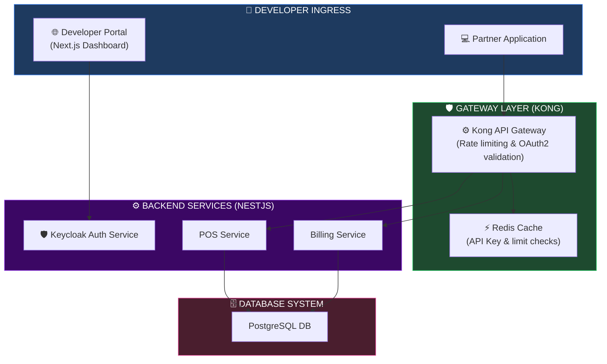
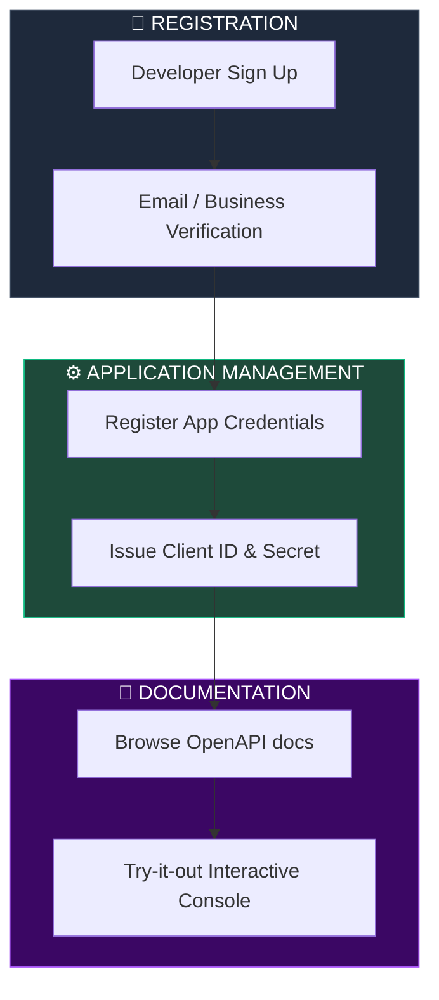
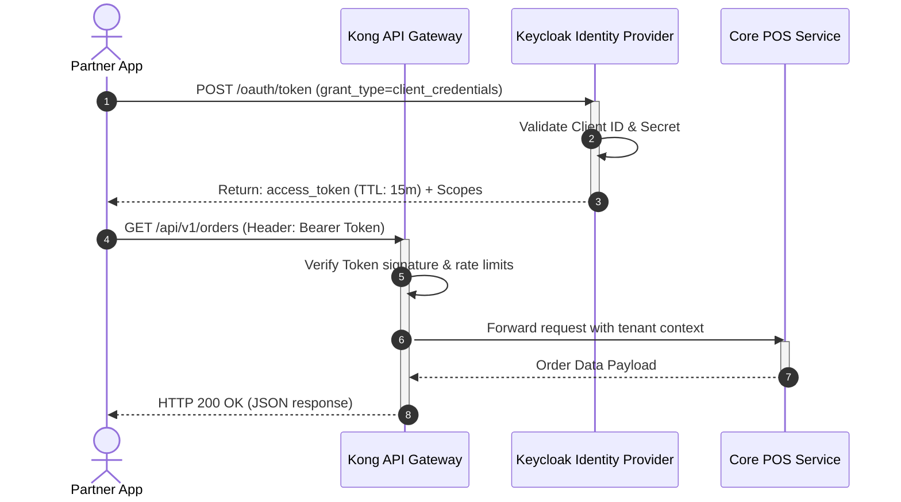
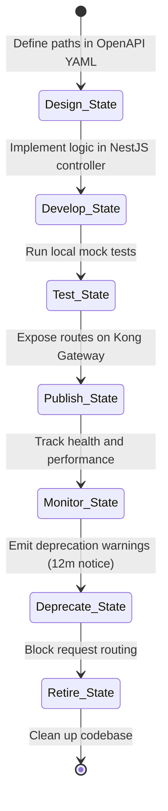

# PUBLIC API PLATFORM, DEVELOPER PORTAL & API MANAGEMENT ARCHITECTURE

**Project Name:** Enterprise SaaS Business Management Platform  
**Document Version:** 1.0.0 — Baseline Standard  
**Date:** July 14, 2026  
**Authors:** Principal API Platform Architect, Developer Experience Architect, API Gateway Engineer, Enterprise Integration Architect, OAuth Security Specialist & SaaS Platform Architect  
**Classification:** Enterprise Internal — Restricted (Infrastructure Sensitive)  
**Status:** 🌐 APPROVED PUBLIC API PLATFORM & DEVELOPER PORTAL ARCHITECTURE SPECIFICATION  

---

## TABLE OF CONTENTS

| Section | Title | Description |
| :---: | :--- | :--- |
| **§1** | [API Platform Foundation](#section-1--api-platform-foundation) | Internal vs. Partner vs. Public APIs, ecosystem benefits |
| **§2** | [Enterprise API Architecture](#section-2--enterprise-api-architecture) | Request flows, API Gateway integrations, and Mermaid topology |
| **§3** | [API Gateway Architecture](#section-3--api-gateway-architecture) | Gateway responsibilities, Kong vs. Apigee vs. AWS comparison |
| **§4** | [API Design Standards](#section-4--api-design-standards) | REST endpoints, resource casing, pagination, error schemas |
| **§5** | [API Authentication](#section-5--api-authentication) | API Keys, OAuth2 client credentials, OpenID Connect OIDC |
| **§6** | [API Authorization](#section-6--api-authorization) | Scopes-based RBAC, multi-tenant boundaries, policy rules |
| **§7** | [Developer Portal](#section-7--developer-portal) | Registration, app registration keys, testing console layout |
| **§8** | [API Documentation System](#section-8--api-documentation-system) | OpenAPI Spec generation, Swagger UI assemblies, interactive sandboxes |
| **§9** | [SDK Generation](#section-9--sdk-generation) | Automated SDK builds, supported languages, config examples |
| **§10** | [Webhook Platform](#section-10--webhook-platform) | Outbound event queues, retry logs, signature verification code |
| **§11** | [API Rate Limiting](#section-11--api-rate-limiting) | Redis sliding-window algorithms, developer tier limits |
| **§12** | [API Observability](#section-12--api-observability) | Consumer analytics dashboards, trace headers, latency metrics |
| **§13** | [API Security](#section-13--api-security) | WAF guardrails, DDoS mitigation, sanitizing parameters |
| **§14** | [API Lifecycle Management](#section-14--api-lifecycle-management) | Stages: Design, Develop, Test, Deprecate, Retire |
| **§15** | [API Versioning Strategy](#section-15--api-versioning-strategy) | URI versions, backward compatibility matrices, deprecations |
| **§16** | [API Analytics](#section-16--api-analytics) | Traffic logging, active client monitoring, performance metrics |
| **§17** | [API Monetization](#section-17--api-monetization) | Pricing tires, usage metrics invoicing, credit limits |
| **§18** | [API Platform Tool Stack](#section-18--api-platform-tool-stack) | Gateways, developer tools, and validation frameworks |
| **§19** | [Developer Governance](#section-19--developer-governance) | Developer terms of service, certification, and verification gates |
| **§20** | [Final API Platform Architecture](#section-20--final-api-platform-architecture) | 5 comprehensive technical Mermaid API flowcharts |

---

## SECTION 1 — API PLATFORM FOUNDATION

### 1.1 Public API Stratification
To enable enterprise integration, the platform exposes three tiers of APIs:
*   **Internal API:** Private endpoints for frontends and internal microservices.
*   **Partner API:** Exposes restricted data schemas to verified third-party partners.
*   **Public API:** Open REST and GraphQL endpoints that allow customers to build custom extensions and automate operations.

```
THE PUBLIC API STRATIFICATION
═══════════════════════════════════════════════════════════════════════════════
 [ Internal App UI ] ──► (No gateway isolation) ──► [ Core Microservices ]
 
 [ Partner Systems ] ──► (OAuth2 M2M Gateway) ────► [ Partner APIs ]
 
 [ Public Developer ] ─► (API Key & Rate Limiter) ─► [ Public APIs ]
═══════════════════════════════════════════════════════════════════════════════
```

---

## SECTION 2 — ENTERPRISE API ARCHITECTURE

### 2.1 The Request Ingress Path
Public requests pass through an edge API Gateway, which handles security policies, rate limits, and routing to backend services.

```
THE INGRESS PATH ARCHITECTURE
═══════════════════════════════════════════════════════════════════════════════
 [ Public Developer Client ]
             │
             ▼ (HTTPS / TLS 1.3)
   [ Edge API Gateway (Kong) ] ◄── Validates API Key / JWT in Redis Cache
             │
             ▼ (Forward Request)
    [ NestJS API Controller ]
             │
             ▼ (Row-Level Security Check)
   [ Core Postgres Database ]
═══════════════════════════════════════════════════════════════════════════════
```

---

## SECTION 3 — API GATEWAY ARCHITECTURE

### 3.1 Gateway Options Comparison

| Feature | Kong Gateway (OSS/Enterprise) | Google Apigee | AWS API Gateway | NGINX Plus |
| :--- | :--- | :--- | :--- | :--- |
| **Execution Performance**| Ultra-Low Latency (<2ms). | Medium Latency. | High Latency (Varied). | Low Latency. |
| **Deployment Target** | Kubernetes (Custom Pods). | Managed Cloud Service. | Serverless / AWS. | VM / Baremetal. |
| **Rate Limiting Engine** | Redis Plugin integration. | Policies Engine. | Native limits. | Nginx rate limits. |
| **Extensibility** | Lua, Go, WASM Plugins. | Java, Python scripts. | AWS Lambdas. | NJS / Lua. |

*   **Production Standard:** The platform deploys **Kong Gateway** in Kubernetes to ensure low latency and native GitOps management.

---

## SECTION 4 — API DESIGN STANDARDS

### 4.1 REST API Specification
*   **Resource Naming:** Plural nouns using kebab-case (e.g., `/api/v1/purchase-orders`).
*   **Casing:** CamelCase for JSON payload properties.
*   **Pagination:** Cursor-based pagination for listing APIs to improve query efficiency.

```http
GET /api/v1/pos/orders?limit=20&starting_after=ord_882093 HTTP/1.1
Host: api.saas-platform.com
Authorization: Bearer token_here
```

*   **Error Schemas:** standard RFC 7807 error payloads.

```json
{
  "type": "https://api.saas-platform.com/errors/insufficient-stock",
  "title": "Insufficient Stock",
  "status": 422,
  "detail": "SKU 'SKU-MILK-100' only has 4 units in stock; requested 20.",
  "instance": "/api/v1/pos/orders/draft-99"
}
```

---

## SECTION 5 — API AUTHENTICATION

### 5.1 Authentication Schemes
*   **API Keys:** Configured as signed header parameters (`X-API-Key: pk_live_...`). Ideal for scripting and continuous integrations.
*   **OAuth2 / OIDC:** Leverages the Client Credentials grant type for secure machine-to-machine (M2M) communications.

```json
// Sample Client Credentials OAuth2 Response
{
  "access_token": "eyJhbGciOiJSUzI1NiIsInR5cCI6IkpXVCJ9...",
  "token_type": "Bearer",
  "expires_in": 3600,
  "scope": "read:pos:orders write:pos:refunds"
}
```

---

## SECTION 6 — API AUTHORIZATION

### 6.1 RBAC Scope Management
The platform enforces scope validation on all incoming gateway requests:
*   `read:inventory` - Read-only access to catalogs and warehouse logs.
*   `write:inventory` - Modify inventory items and write POs.
*   `read:billing` - Read financial ledger entries.

---

## SECTION 7 — DEVELOPER PORTAL

### 7.1 Developer Portal UI Features
Admin console built in Next.js, allowing developers to manage integrations:
*   **App Registration:** Provisioning of client IDs and secrets.
*   **Sandbox Testing:** Interactive API execution console using OpenAPI specs.

---

## SECTION 8 — API DOCUMENTATION SYSTEM

### 8.1 OpenAPI 3.0 Document Specification

```yaml
# docs/api/openapi.yaml
openapi: "3.0.3"
info:
  title: "Enterprise SaaS POS API"
  version: "1.0.0"
  description: "Exposes POS catalog, sales order and checkout endpoints."
paths:
  /api/v1/pos/orders:
    post:
      summary: "Create a Sales Order"
      security:
        - OAuth2ClientCredentials:
            - "write:pos:orders"
      requestBody:
        required: true
        content:
          application/json:
            schema:
              $ref: "#/components/schemas/OrderInput"
      responses:
        "201":
          description: "Order created successfully"
components:
  schemas:
    OrderInput:
      type: "object"
      required:
        - "items"
        - "tenant_id"
      properties:
        tenant_id:
          type: "string"
        items:
          type: "array"
          items:
            type: "object"
            properties:
              sku:
                type: "string"
              qty:
                type: "integer"
  securitySchemes:
    OAuth2ClientCredentials:
      type: "oauth2"
      flows:
        clientCredentials:
          tokenUrl: "https://auth.saas-platform.com/oauth/token"
          scopes:
            write:pos:orders: "Allows creating sales orders"
```

---

## SECTION 9 — SDK GENERATION

### 9.1 OpenAPI Generator Pipeline
The platform uses **OpenAPI Generator** to build client SDK libraries for TypeScript, Python, and Go during CI/CD cycles.

```bash
# Build TypeScript Client SDK
npx @openapitools/openapi-generator-cli generate \
  -i docs/api/openapi.yaml \
  -g typescript-axios \
  -o sdk/typescript/ \
  --additional-properties=npmName=@saas-platform/sdk-typescript,supportsES6=true
```

---

## SECTION 10 — WEBHOOK PLATFORM

### 10.1 Webhook Dispatcher Execution
The platform dispatches webhook notifications using a secure worker service.

```typescript
// backend/src/webhooks/dispatcher.service.ts
import { Injectable } from '@nestjs/common';
import * as crypto from 'crypto';
import axios from 'axios';

@Injectable()
export class WebhookDispatcherService {
  // Generate cryptographic signature to verify payload integrity
  calculateSignature(payload: string, secret: string): string {
    return crypto
      .createHmac('sha256', secret)
      .update(payload)
      .digest('hex');
  }

  async sendWebhook(targetUrl: string, secret: string, payload: Record<string, any>): Promise<boolean> {
    const stringifiedPayload = JSON.stringify(payload);
    const signature = this.calculateSignature(stringifiedPayload, secret);

    try {
      await axios.post(targetUrl, stringifiedPayload, {
        headers: {
          'Content-Type': 'application/json',
          'X-SaaS-Signature': signature,
          'X-SaaS-Event-Timestamp': Date.now().toString(),
        },
        timeout: 5000 // 5-second execution timeout
      });
      return true;
    } catch (error) {
      // Log failure and schedule retry in queue
      return false;
    }
  }
}
```

---

## SECTION 11 — API RATE LIMITING

### 11.1 Rate Limiting Schemes
The API Gateway uses Redis-backed sliding-window rate limiters to protect the platform.
*   **Developer Tier:** 60 requests/minute.
*   **Business Tier:** 600 requests/minute.
*   **Enterprise Tier:** 3,000 requests/minute.

---

## SECTION 12 — API OBSERVABILITY

### 12.1 Real-Time Analytics
*   **Trace Headers:** Ingress requests are stamped with a unique `x-correlation-id` to trace execution across microservices.
*   **Latency Metrics:** Latency averages are logged to Grafana dashboard monitors.

---

## SECTION 13 — API SECURITY

### 13.1 Gateway Guardrails
*   **WAF Protection:** Intercepts traffic to mitigate DDoS attacks and SQL injection attempts.
*   **Request Validation:** The API Gateway rejects payloads that do not conform to schema configurations defined in the OpenAPI spec.

---

## SECTION 14 — API LIFECYCLE MANAGEMENT

### 14.1 API Stages
1.  **Design:** OpenAPI specs are designed and reviewed.
2.  **Develop:** Endpoints are developed in NestJS.
3.  **Test:** Automated integration testing using Postman/Supertest.
4.  **Publish:** Registration on the developer portal.
5.  **Deprecate:** Announcing upcoming removals (minimum 12-month notice).

---

## SECTION 15 — API VERSIONING STRATEGY

### 15.1 SemVer Version Handlers
Major changes require updating the API path version (e.g., `/api/v1/` to `/api/v2/`). Minor, non-breaking modifications are deployed in place.

---

## SECTION 16 — API ANALYTICS

### 16.1 Observability Indicators
*   **Popular APIs:** Identifies highly-utilized endpoints to optimize infrastructure resource allocation.
*   **Error Trends:** Tracks HTTP 5xx errors to quickly catch runtime failures.

---

## SECTION 17 — API MONETIZATION

### 17.1 Monetization Tiers
*   **Free Tier:** Standard developer sandboxes.
*   **Usage-Based Pricing:** billing is calculated on total requests served (e.g., $0.05 per 1,000 API calls over base quotas).

---

## SECTION 18 — API PLATFORM TOOL STACK

### 18.1 API Tools

| Category | Tool | Production Purpose | System Owner |
| :--- | :--- | :--- | :--- |
| **API Gateway** | Kong Gateway | Route matching, rate limits, OAuth2 validation. | Gateway SRE |
| **OAuth2 Provider** | Keycloak | Issues and validates access tokens. | Security Lead |
| **Specification** | OpenAPI 3.0 | Schema documentation. | API Architect |
| **SDK Generator** | OpenAPI Generator | Automatically builds client libraries. | Platform Engineer |
| **Test Client** | Postman / Insomnia | Endpoint testing. | QA Engineer |

---

## SECTION 20 — FINAL API PLATFORM ARCHITECTURE

### 20.1 Public API Platform Architecture



### 20.2 Developer Portal Flow



### 20.3 OAuth2 Authentication Flow



### 20.4 Webhook Event Delivery

```mermaid
flowchart LR
    subgraph WRITER["🏢 CORE APPLICATION"]
        APP["Core POS App"]
    end

    subgraph QUEUE["📨 DELAY QUEUE"]
        KAFKA["Kafka Topic: webhook-jobs"]
        WORKER["Webhook Dispatcher Worker"]
    end

    subgraph CLIENT["🔌 CONSUMER ENDPOINT"]
        PARTNER["Customer API Endpoint\n(Verifies Hmac signature)"]
    end

    APP --> KAFKA
    KAFKA --> WORKER
    WORKER -->|"POST Payload + Signature Header"| PARTNER
    PARTNER -->>|"HTTP 200 OK"| WORKER

    style WRITER fill:#1e293b,stroke:#475569,color:#fff
    style QUEUE fill:#1e4a3a,stroke:#10b981,color:#fff
    style CLIENT fill:#3b0764,stroke:#a855f7,color:#fff
```

### 20.5 API Lifecycle Management



---

## DOCUMENT METADATA

| Field | Value |
| :--- | :--- |
| **Document ID** | SAAS-PUBLIC-017.3 |
| **Section** | 17 — Platform Extensibility |
| **Subsection** | 17.3 — Public API Portal |
| **Status** | 🌐 APPROVED |
| **Version** | 1.0.0 |
| **Date** | July 14, 2026 |
| **Next Review** | January 14, 2027 |
| **Related Documents** | [Extensibility Foundation](../17.1-Extensibility-Foundation/Extensibility-Foundation.md) · [Plugin Runtime Architecture](../17.2-Plugin-Runtime-Architecture/Plugin-Runtime-Architecture.md) · [Security Architecture](../../10-Security-Architecture/10.1-Security-Foundation/Security-Foundation.md) |
| **Technology Versions** | Kong Gateway v3.6 · OpenAPI v3 · Keycloak v24 · NestJS v10 |

---

*This document is the authoritative specification for all public API platform, developer portal, and API management architecture decisions in the Enterprise SaaS Business Management Platform. All routes, gateways, rate limit configurations, Webhook dispatchers, and SDK generators must conform to the standards defined herein.*
