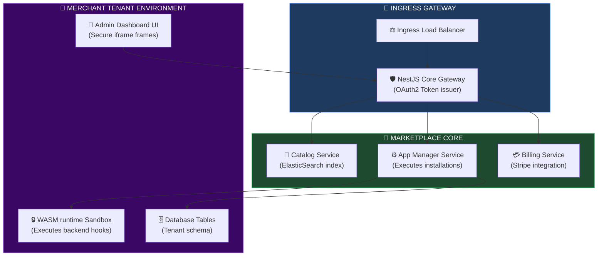
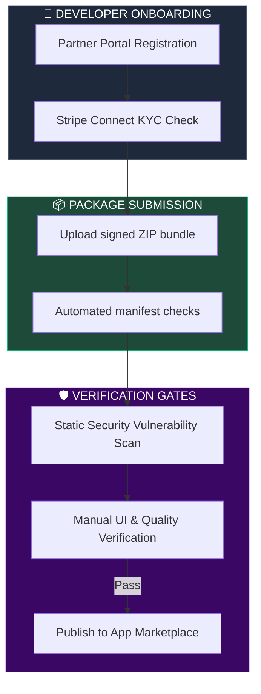
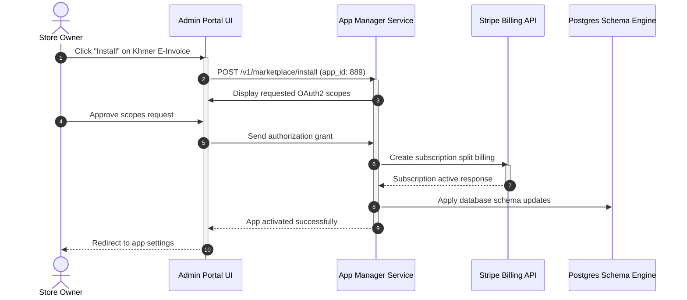
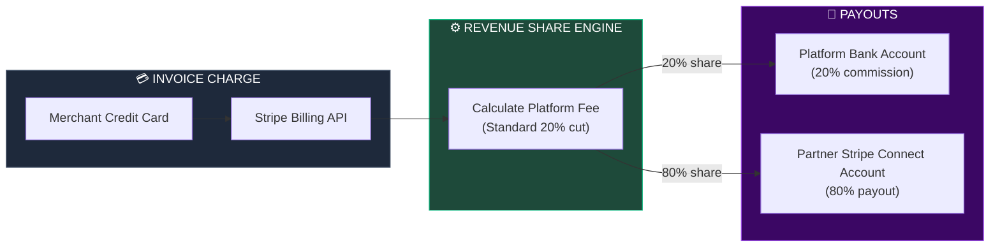
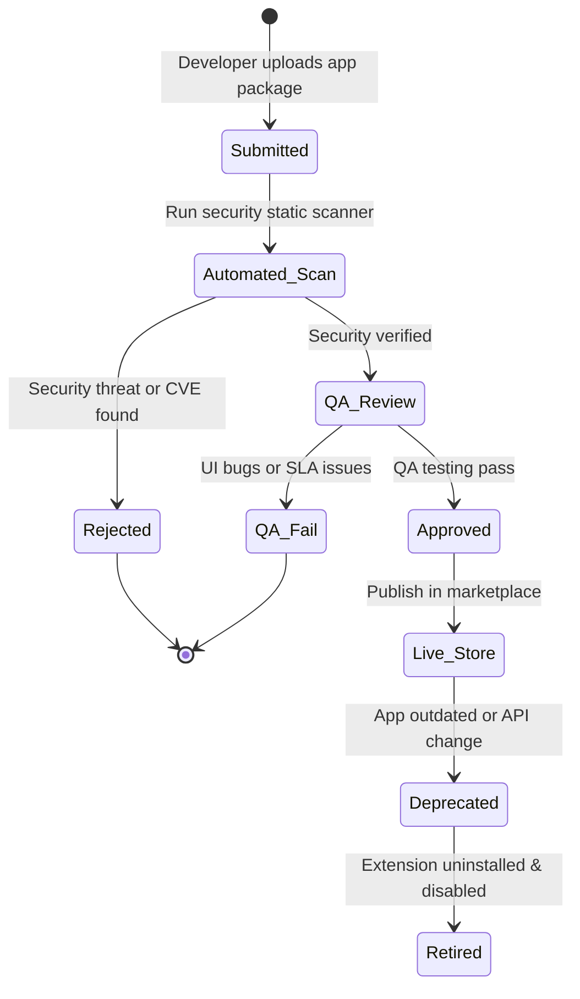

# MARKETPLACE ARCHITECTURE & APP ECOSYSTEM PLATFORM

**Project Name:** Enterprise SaaS Business Management Platform  
**Document Version:** 1.0.0 — Baseline Standard  
**Date:** July 14, 2026  
**Authors:** Principal Marketplace Platform Architect, SaaS Ecosystem Architect, App Store Infrastructure Engineer, Partner Platform Specialist, Billing Integration Architect & Enterprise SaaS Platform Architect  
**Classification:** Enterprise Internal — Restricted (Infrastructure Sensitive)  
**Status:** 🛒 APPROVED MARKETPLACE & APP ECOSYSTEM PLATFORM SPECIFICATION  

---

## TABLE OF CONTENTS

| Section | Title | Description |
| :---: | :--- | :--- |
| **§1** | [Marketplace Foundation](#section-1--marketplace-foundation) | Ecosystem roadmap, value propositions, and growth models |
| **§2** | [Marketplace Architecture](#section-2--marketplace-architecture) | Ingress layouts, app management API, and Mermaid topology |
| **§3** | [Application Types](#section-3--application-types) | Native apps vs. third-party connectors vs. AI workflow tools |
| **§4** | [App Catalog System](#section-4--app-catalog-system) | Catalog models, search schemas, metadata files |
| **§5** | [Developer Publishing Flow](#section-5--developer-publishing-flow) | Registration, security gates, validation, and releases |
| **§6** | [Customer Installation Flow](#section-6--customer-installation-flow) | Discovery, scope validation, tenant installation routines |
| **§7** | [App Permission Model](#section-7--app-permission-model) | Security authorization requests, least privilege API scopes |
| **§8** | [Billing Architecture](#section-8--billing-architecture) | Subscription processing, Stripe metering, usage logs |
| **§9** | [Revenue Sharing Model](#section-9--revenue-sharing-model) | Split fees (80/20), multi-tenant automated settlements |
| **§10** | [App Review System](#section-10--app-review-system) | Static security scans, manual reviews, QA certification gates |
| **§11** | [App Version Management](#section-11--app-version-management) | Upgrade pipelines, compatibility validation, data schema changes |
| **§12** | [Marketplace Search](#section-12--marketplace-search) | ElasticSearch schemas, categorical tagging, semantic matches |
| **§13** | [AI Marketplace Features](#section-13--ai-marketplace-features) | Compatibility checker scripts, AI recommendation tools |
| **§14** | [Marketplace Security](#section-14--marketplace-security) | Supply chain threats, sandboxing UI dependencies, code audits |
| **§15** | [Analytics Platform](#section-15--analytics-platform) | Install tracking, developer revenue calculators, API monitors |
| **§16** | [Partner Management](#section-16--partner-management) | Portal configurations, developer profiles, certification badges |
| **§17** | [Marketplace Tool Stack](#section-17--marketplace-tool-stack) | Gateways, payment APIs, database engines, and messaging |
| **§18** | [Global Marketplace](#section-18--global-marketplace) | Multi-language catalog, cross-border payments, VAT compliance |
| **§19** | [Marketplace Governance](#section-19--marketplace-governance) | Publishing criteria, developer agreements, SLA definitions |
| **§20** | [Final Marketplace Architecture](#section-20--final-platform-extensibility-architecture) | 5 comprehensive technical Mermaid marketplace diagrams |

---

## SECTION 1 — MARKETPLACE FOUNDATION

### 1.1 The Ecosystem Evolution Path
Evolving from a closed application into an open ecosystem:
*   **Product Platform:** Core POS, HR, and Inventory engines.
*   **Extension Platform:** Plugin SDKs and event execution sandboxes.
*   **Marketplace:** Directory for third-party add-ons.
*   **Ecosystem:** An active network of developers, merchant clients, and system integrators.

```
THE MARKETPLACE EVOLUTION
═══════════════════════════════════════════════════════════════════════════════
 [ Product Platform ] ──► Exposes core services via API Gateway
          │
          ▼
 [ Extension Platform ] ─► Sandboxed WASM runtimes execute third-party code
          │
          ▼
  [ Marketplace ] ──────► Digital storefront handles billing and installation
          │
          ▼
   [ Ecosystem ] ───────► Self-sustaining network driving platform growth
═══════════════════════════════════════════════════════════════════════════════
```

---

## SECTION 2 — MARKETPLACE ARCHITECTURE

### 2.1 Enterprise Application Directory Routing
The Marketplace architecture connects merchants, developers, and platform billing systems.

```
THE APP DIRECTORY SYSTEM
═══════════════════════════════════════════════════════════════════════════════
   [ Next.js Tenant Admin Dashboard ]
                 │
                 ▼
    [ Marketplace Catalog UI ] ──► (Browses published apps)
                 │
                 ▼ (Initiate Install)
   [ App Management Service ] ──► (Validates requested scopes)
                 │
                 ├──────────────────────────────┐
                 ▼                              ▼
    [ Billing Service (Stripe) ]      [ Plugin Runtime Sandboxes ]
                 │                              │
                 ▼                              ▼
     [ Revenue Split Engine ]       [ Scoped OAuth2 DB Actions ]
═══════════════════════════════════════════════════════════════════════════════
```

---

## SECTION 3 — APPLICATION TYPES

### 3.1 App Category Boundaries
*   **Native Apps:** High-performance modules running directly on platform infrastructure (e.g., advanced tax calculators).
*   **Third-party Extensions:** Sandboxed UI cards embedded in the Admin portal using Shadow DOM wrappers.
*   **Industry Solutions:** Configured database setups for specific business verticals (e.g., hotel management presets).
*   **AI Applications:** Integrates custom LLM prompt templates and search adapters into the platform's RAG gateway.

---

## SECTION 4 — APP CATALOG SYSTEM

### 4.1 Application Catalog Metadata Schema
Every published application registers a metadata entry defining categorizations, target compatibility, and pricing parameters.

```json
// metadata-schema.json
{
  "app_id": "app-khmer-e-invoice",
  "name": "Cambodia E-Invoice Link",
  "category": "Accounting & Tax",
  "short_description": "Auto-syncs POS transactions with local tax reporting systems.",
  "developer": {
    "name": "E-Invoicing PP Ltd",
    "developer_id": "dev-9918a",
    "certified": true
  },
  "pricing": {
    "model": "subscription",
    "currency": "USD",
    "price_per_month": 29.00,
    "usage_rates": {
      "excess_invoice_cost": 0.02
    }
  },
  "version": "2.1.0",
  "compatibility": {
    "platform_core_version": ">=1.8.0",
    "db_migration_required": false
  }
}
```

---

## SECTION 5 — DEVELOPER PUBLISHING FLOW

### 5.1 Publishing Pipelines
1.  **Register:** Developer creates an account in the Partner Portal.
2.  **Submit:** Uploads package (manifest, assets, code bundles).
3.  **Review:** Automated static analysis scans and vulnerability tests.
4.  **Approve:** Manual code and UI verification.
5.  **Publish:** Store catalog updates, enabling installs.

---

## SECTION 6 — CUSTOMER INSTALLATION FLOW

### 6.1 Installation Actions
1.  **Select App:** Tenant clicks "Install" in the Marketplace UI.
2.  **Consent Check:** Next.js UI lists required API scopes (e.g., read inventory).
3.  **Deploy Schema:** Database runs partitioned schema migrations.
4.  **Register Hooks:** Hooks are registered in the Gateway.
5.  **Activate:** App is enabled in the tenant's admin dashboard.

---

## SECTION 7 — APP PERMISSION MODEL

### 7.1 Least-Privilege OAuth2 Scope Enforcement
During installation, tenants must grant the application specific access permissions.
*   **Scoped Access Tokens:** Executed plugin scripts use short-lived tokens restricted to verified scopes (e.g., `scope: ["read:inventory"]`).

---

## SECTION 8 — BILLING ARCHITECTURE

### 8.1 Stripe Billing Integration
The Marketplace uses Stripe Connect to manage multi-tenant billing and payouts.

```typescript
// backend/src/marketplace/billing/stripe-connect.service.ts
import { Injectable } from '@nestjs/common';
import Stripe from 'stripe';

@Injectable()
export class StripeConnectService {
  private stripe: Stripe;

  constructor() {
    this.stripe = new Stripe(process.env.STRIPE_SECRET_KEY, {
      apiVersion: '2023-10-16',
    });
  }

  // Process customer subscription with automated revenue split
  async createSubscriptionSplit(
    customerId: string,
    developerAccountId: string,
    priceId: string,
    platformFeePercent: number
  ): Promise<Stripe.Subscription> {
    return this.stripe.subscriptions.create({
      customer: customerId,
      items: [{ price: priceId }],
      application_fee_percent: platformFeePercent, // Platform commission cut (e.g., 20%)
      transfer_data: {
        destination: developerAccountId, // Transfers remaining 80% to developer
      },
    });
  }
}
```

---

## SECTION 9 — REVENUE SHARING MODEL

### 9.1 Revenue Settlement
*   **Platform Commission:** The platform takes a standard 20% cut of subscription fees.
*   **Developer Revenue:** 80% is paid out to developers through Stripe Connect.
*   **Tax Handling:** VAT is calculated based on customer billing location before the revenue split.

---

## SECTION 10 — APP REVIEW SYSTEM

### 10.1 Review & Certification Gates
*   **Security Review:** Code analysis tools check for malware and security vulnerabilities.
*   **Performance Testing:** Sandboxed execution checks verify that execution times do not exceed 200ms limits.

---

## SECTION 11 — APP VERSION MANAGEMENT

### 11.1 Upgrade Pipelines
*   **SemVer Enforcement:** Version upgrades must follow Semantic Versioning rules.
*   **Safe Migration:** Major database updates require schema updates that run in isolated, tenant-partitioned tables.

---

## SECTION 12 — MARKETPLACE SEARCH

### 12.1 ElasticSearch Schema
The search engine indexes metadata tags, titles, and categories to return relevant results.

```json
// search-index-config.json
{
  "settings": {
    "analysis": {
      "analyzer": {
        "autocomplete_analyzer": {
          "tokenizer": "autocomplete",
          "filter": ["lowercase"]
        }
      }
    }
  },
  "mappings": {
    "properties": {
      "name": { "type": "text", "analyzer": "autocomplete_analyzer" },
      "category": { "type": "keyword" },
      "tags": { "type": "text" },
      "certified": { "type": "boolean" }
    }
  }
}
```

---

## SECTION 13 — AI MARKETPLACE FEATURES

### 13.1 Intelligent Recommendation Tools
*   **AI Compatibility Checker:** Evaluates an extension's dependencies against the merchant's active platform modules before installation.

---

## SECTION 14 — MARKETPLACE SECURITY

### 14.1 Supply Chain Security
*   **Code Signing:** Packages must be signed with a verified developer certificate.
*   **Dependency Auditing:** Automatic dependency checking blocks packages that contain known CVE vulnerabilities.

---

## SECTION 15 — ANALYTICS PLATFORM

### 15.1 Real-Time Analytics
*   **Install Tracking:** Logs active installs and uninstall events.
*   **API Usage:** Tracks API call volume from third-party extensions to verify billing tiers.

---

## SECTION 16 — PARTNER MANAGEMENT

### 16.1 Partner Certification
*   **Partner Portal:** A dashboard for developers to manage their applications, track payouts, and view support tickets.

---

## SECTION 17 — MARKETPLACE TOOL STACK

### 17.1 Marketplace Infrastructure Stack

| Category | Tool | Production Purpose | System Owner |
| :--- | :--- | :--- | :--- |
| **Payment Gateway** | Stripe Connect | Customer billing and developer payouts. | Financial Lead |
| **Identity Standard** | OAuth2 / OIDC | Secures extension API access tokens. | Security Architect |
| **Deployment Platform**| Kubernetes / Helm | Hosts marketplace catalog services. | Platform SRE |
| **Data Storage** | PostgreSQL | Stores application metadata and review logs. | Lead DBA |
| **Event Bus** | Apache Kafka | Streams installation and billing events. | DevOps Engineer |

---

## SECTION 20 — FINAL MARKETPLACE ARCHITECTURE

### 20.1 SaaS Marketplace Architecture



### 20.2 Developer Publishing Flow



### 20.3 Customer App Installation Flow



### 20.4 Billing & Revenue Sharing Flow



### 20.5 Marketplace Governance Model



---

## DOCUMENT METADATA

| Field | Value |
| :--- | :--- |
| **Document ID** | SAAS-MKT-017.4 |
| **Section** | 17 — Platform Extensibility |
| **Subsection** | 17.4 — Marketplace Architecture & App Ecosystem |
| **Status** | 🛒 APPROVED |
| **Version** | 1.0.0 |
| **Date** | July 14, 2026 |
| **Next Review** | January 14, 2027 |
| **Related Documents** | [Extensibility Foundation](../17.1-Extensibility-Foundation/Extensibility-Foundation.md) · [Plugin Runtime Architecture](../17.2-Plugin-Runtime-Architecture/Plugin-Runtime-Architecture.md) · [Public API Portal](../17.3-Public-API-Portal/Public-API-Portal.md) |
| **Technology Versions** | Stripe Connect API v3 · Kubernetes v1.28 · ElasticSearch v8 |

---

*This document is the authoritative specification for all marketplace architecture and app ecosystem platform decisions in the Enterprise SaaS Business Management Platform. All catalog structures, developer pipelines, billing integrations, revenue splits, security review criteria, and installer engines must conform to the standards defined herein.*
