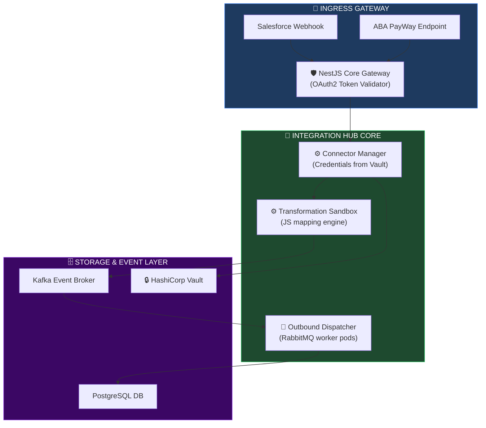
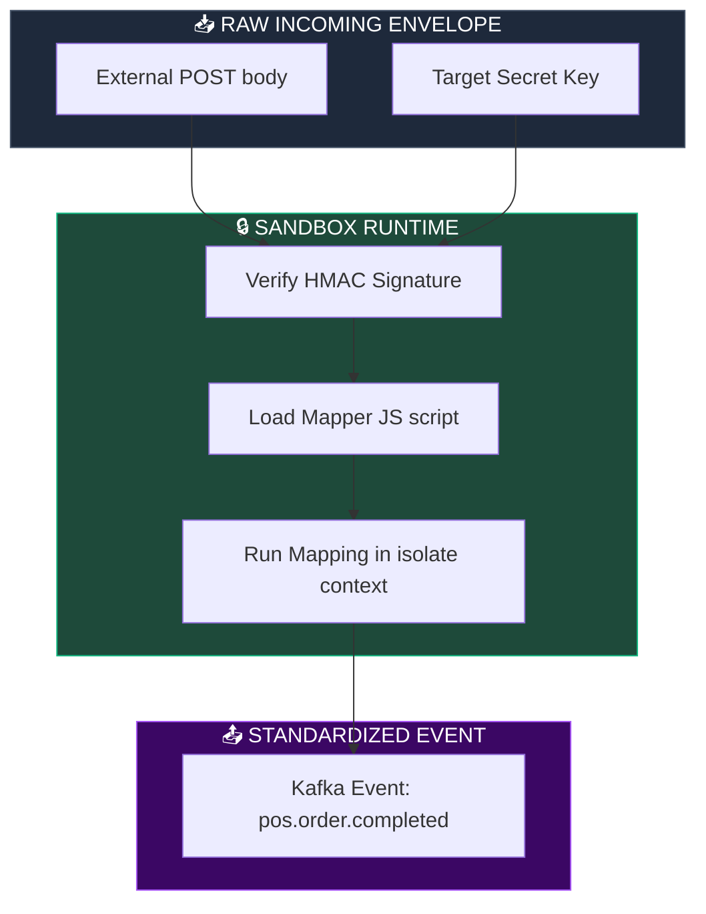
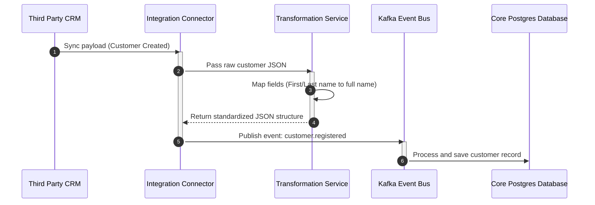
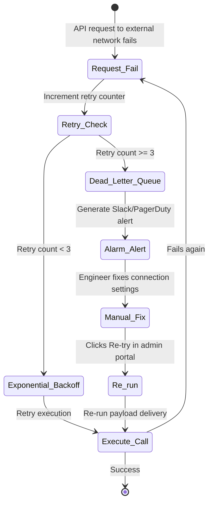

# INTEGRATION HUB & ENTERPRISE CONNECTOR ARCHITECTURE

**Project Name:** Enterprise SaaS Business Management Platform  
**Document Version:** 1.0.0 — Baseline Standard  
**Date:** July 14, 2026  
**Authors:** Principal Integration Architect, Enterprise Integration Platform Engineer, iPaaS Architect, API Integration Specialist, Event-Driven Architecture Expert & Enterprise SaaS Platform Architect  
**Classification:** Enterprise Internal — Restricted (Infrastructure Sensitive)  
**Status:** 🔌 APPROVED INTEGRATION HUB & ENTERPRISE CONNECTOR ARCHITECTURE SPECIFICATION  

---

## TABLE OF CONTENTS

| Section | Title | Description |
| :---: | :--- | :--- |
| **§1** | [Integration Platform Foundation](#section-1--integration-platform-foundation) | Point-to-point issues, integration hub model, benefits |
| **§2** | [Enterprise Integration Architecture](#section-2--enterprise-integration-architecture) | Ingress routing flows, message broker layers, Mermaid topology |
| **§3** | [Connector Framework](#section-3--connector-framework) | Connector classifications: API, DB, Webhook, and AI connectors |
| **§4** | [Enterprise Connector Examples](#section-4--enterprise-connector-examples) | Specific endpoints: ABA PayWay, Salesforce, QuickBooks |
| **§5** | [API Integration Architecture](#section-5--api-integration-architecture) | REST, GraphQL, SOAP, and gRPC auth layers, retries |
| **§6** | [Data Synchronization Engine](#section-6--data-synchronization-engine) | ETL loops, real-time CDC configurations, batch operations |
| **§7** | [Event-Driven Integration](#section-7--event-driven-integration) | Kafka topics, order created and stock trigger structures |
| **§8** | [Transformation Engine](#section-8--transformation-engine) | Schema translation systems, JS payload mapper scripts |
| **§9** | [Workflow Automation](#section-9--workflow-automation) | E2E scenarios: New customer syncing, payment ledger writes |
| **§10** | [Security Architecture](#section-10--security-architecture) | Vault secret managers, credential encrypting, OAuth scopes |
| **§11** | [Failure Management](#section-11--failure-management) | Retry mechanisms, Dead Letter Queues (DLQ), manual routing |
| **§12** | [Monitoring & Observability](#section-12--monitoring--observability) | Consumer metrics, sync logs, OpenTelemetry trace contexts |
| **§13** | [Integration Marketplace](#section-13--integration-marketplace) | Store installation flows, user configure UI templates |
| **§14** | [AI Powered Integrations](#section-14--ai-powered-integrations) | Auto code mapping, error diagnostics, tools routing |
| **§15** | [Multi-Tenant Integration](#section-15--multi-tenant-integration) | Partitioned secrets, tenant rate quotas, sandbox resources |
| **§16** | [Integration Tool Stack](#section-16--integration-tool-stack) | Gateways, schedulers, airbyte ETLs, and IPaaS systems |
| **§17** | [Performance & Scalability](#section-17--performance--scalability) | Database pooling, redis caches, partition scaling rules |
| **§18** | [Governance](#section-18--governance) | Code reviews, certification pipelines, deprecation paths |
| **§19** | [Future Roadmap](#section-19--future-roadmap) | Vision: basic APIs → partner tools → autonomous integrations |
| **§20** | [Final Integration Hub Architecture](#section-20--final-integration-hub-architecture) | 5 comprehensive technical Mermaid integration diagrams |

---

## SECTION 1 — INTEGRATION PLATFORM FOUNDATION

### 1.1 The Shift from Point-to-Point to Hub-Based Integration
*   **Point-to-Point Integration Problems:**
    *   *Complexity:* N*(N-1) connections create an unmanageable mesh as the system scales.
    *   *High Maintenance:* Changes to one API require updating all dependent endpoints.
    *   *Scaling Bottlenecks:* Lack of centralized logging, monitoring, and security auditing.
*   **Integration Hub Model:** Core systems connect to a central integration engine, which routes, translates, and delivers payloads to external networks.

```
THE INTEGRATION SPECTRUM
═══════════════════════════════════════════════════════════════════════════════
Point-to-Point:
  [ POS App ] ◄──► [ QuickBooks ] ◄──► [ Salesforce ] ◄──► [ Delivery API ]
 
Hub-Based:
  [ POS App ] ─────┐
                   ▼
  [ ERP Core ] ──► [ CENTRAL INTEGRATION HUB ] ◄──► [ External Systems ]
                   ▲
  [ CRM App ] ─────┘
═══════════════════════════════════════════════════════════════════════════════
```

---

## SECTION 2 — ENTERPRISE INTEGRATION ARCHITECTURE

### 2.1 The Request Broker Flow
The Integration Hub processes incoming and outbound events through a transformation layer, an event bus, and core microservices.

```
THE INTEGRATION BROKER FLOW
═══════════════════════════════════════════════════════════════════════════════
 [ External CRM (Salesforce) ]
               │
               ▼ (Webhook / API Request)
    [ Connector Ingress Port ]
               │
               ▼ (De-serialize & Decode)
   [ Transformation Engine ] ──► Validates and maps JSON payloads
               │
               ▼ (Enqueue Event)
       [ Kafka Event Bus ]
               │
               ▼ (Consume Event)
    [ Core Business Module ]
═══════════════════════════════════════════════════════════════════════════════
```

---

## SECTION 3 — CONNECTOR FRAMEWORK

### 3.1 Connector Adaptor Classes
*   **API Connector:** Integrates with third-party JSON/REST APIs (e.g., Salesforce REST endpoints).
*   **Database Connector:** Directly queries databases (e.g., PostgreSQL replicas or ClickHouse analytical nodes) using read-only connections.
*   **Webhook Connector:** Receives incoming JSON payloads from third-party platforms.
*   **AI Connector:** Interfaces with generative AI models and semantic search vectors.

---

## SECTION 4 — ENTERPRISE CONNECTOR EXAMPLES

### 4.1 Payment Integrations
*   **ABA PayWay:** Registers transactions and generates Khmer QR payment payloads.
*   **Stripe:** Manages multi-tenant billing, invoices, and payouts.
*   **CRM (Salesforce):** Synchronizes customer contact logs and billing histories.
*   **Accounting (QuickBooks):** Syncs ledger entries and tax information.

---

## SECTION 5 — API INTEGRATION ARCHITECTURE

### 5.1 Communication Protocols
*   **REST & GraphQL:** High-frequency customer queries are routed through REST (payload updates) or GraphQL (data aggregation).
*   **gRPC & WebSockets:** Used for low-latency microservice communications and real-time frontend updates.

---

## SECTION 6 — DATA SYNCHRONIZATION ENGINE

### 6.1 ETL & Change Data Capture (CDC) Topologies
*   **CDC (Change Data Capture):** Debezium tracks database transactions in real-time, streaming updates to Kafka topics.
*   **Batch Synchronization:** Scheduled batch jobs extract large datasets during off-peak hours to minimize database load.

---

## SECTION 7 — EVENT-DRIVEN INTEGRATION

### 7.1 Real-Time Ingress Kafka Event payload
When events occur, the platform's Event Bus dispatches payloads to registered integration listeners.

```json
// Event Stream Payload
{
  "event_id": "evt-payment-settled-8812c",
  "event_type": "finance.payment.settled",
  "timestamp": "2026-07-14T08:02:10Z",
  "tenant_id": "tenant-cambodia-retail-899",
  "data": {
    "payment_id": "pay-99281-cam",
    "amount": 250.00,
    "currency": "USD",
    "payment_method": "ABA_PAYWAY",
    "invoice_id": "inv-2026-99120"
  }
}
```

---

## SECTION 8 — TRANSFORMATION ENGINE

### 8.1 Schema Conversion Execution
The Transformation Engine parses third-party schemas and maps them to core structures using a sandboxed execution runtime.

```typescript
// backend/src/integration/transformation/mapping.service.ts
import { Injectable } from '@nestjs/common';
import * as vm from 'vm';

@Injectable()
export class MappingService {
  // Translate external payloads using a sandboxed JS transformation script
  transformPayload(
    externalPayload: Record<string, any>,
    mappingScript: string
  ): Record<string, any> {
    const sandbox = {
      input: externalPayload,
      output: {} as Record<string, any>,
    };

    // Run mapping script in a secure sandbox
    const context = vm.createContext(sandbox);
    const script = new vm.Script(mappingScript);
    script.runInContext(context, { timeout: 100 }); // 100ms execution timeout limit

    return sandbox.output;
  }
}
```

*   **Example Mapping Script:**
```javascript
// Map Salesforce payload to core customer schema
output.customer_id = input.Id;
output.email_address = input.Email;
output.full_name = input.FirstName + ' ' + input.LastName;
output.phone_number = input.Phone;
```

---

## SECTION 9 — WORKFLOW AUTOMATION

### 9.1 Orchestration Workflows
*   **Sync Customer Log:** Customer records created in the POS are automatically synchronized with Salesforce.
*   **Automate Invoice Ledger:** Paid invoices in POS trigger QuickBooks entries and customer email receipts.

---

## SECTION 10 — SECURITY ARCHITECTURE

### 10.1 Key & Credential Isolation
*   **Secret Vault:** External credentials (such as API keys and OAuth2 secrets) are encrypted and stored in HashiCorp Vault.
*   **Role-Based Scope Access:** Integration clients use scoped tokens configured with least-privilege permissions.

---

## SECTION 11 — FAILURE MANAGEMENT

### 11.1 Resilient Queue Execution
Faulty integrations are handled gracefully without impacting core system availability.

```
FAILURE RECOVERY WORKFLOW
═══════════════════════════════════════════════════════════════════════════════
[ API Request Fails ] ──► [ Exponential Backoff Retry ]
                                 │
                                 ▼ (3 failures)
                         [ RabbitMQ Retry Queue ]
                                 │
                                 ▼ (Max retries exceeded)
                      [ Dead Letter Queue (DLQ) ] ──► (Alert generated)
                                 │
                                 ▼ (Resolve issue)
                        [ Re-process Trigger ]
═══════════════════════════════════════════════════════════════════════════════
```

---

## SECTION 12 — MONITORING & OBSERVABILITY

### 12.1 Metrics & Telemetry
*   **Sync Latency:** Tracks duration of data synchronization processes.
*   **Failure Rate:** Tracks error counts for integration endpoints. Spikes in failure rates trigger circuit breakers.

---

## SECTION 13 — INTEGRATION MARKETPLACE

### 13.1 App Installation Flow
Merchants can browse, install, and authorize integration connectors directly from the admin portal dashboard.

---

## SECTION 14 — AI POWERED INTEGRATIONS

### 14.1 AI Mapping Assistant
*   **AI Schema Mapper:** Suggests database field mappings between new external APIs and core system schemas.

---

## SECTION 15 — MULTI-TENANT INTEGRATION

### 15.1 Multi-Tenant Isolation
*   **Data Partitioning:** Tenant credentials and configuration profiles are stored in partitioned tables using the merchant's unique `tenant_id`.

---

## SECTION 16 — INTEGRATION TOOL STACK

### 16.1 Integration Infrastructure Stack

| Category | Tool | Production Purpose | System Owner |
| :--- | :--- | :--- | :--- |
| **Event Bus** | Apache Kafka | Streams high-frequency integration events. | SRE / DevOps |
| **Data Extraction** | Airbyte | Orchestrates bulk data ingestion. | Data Engineer |
| **Orchestration** | Temporal | Coordinates long-running workflows. | Platform Lead |
| **Automation** | n8n / Camunda | Visual editor for business processes. | Integration Engineer |
| **Secret Vault** | HashiCorp Vault | Encrypts external API credentials. | Security Lead |
| **Gateway Proxy** | Kong API Gateway | Route matching, rate limits, OAuth2 validation. | Gateway SRE |

---

## SECTION 20 — FINAL INTEGRATION HUB ARCHITECTURE

### 20.1 Enterprise Integration Hub



### 20.2 Connector Runtime Architecture



### 20.3 Data Synchronization Flow



### 20.4 Event-Driven Integration Flow

```mermaid
flowchart LR
    subgraph PLATFORM["🏢 CORE PLATFORM"]
        ORDER["Sales POS Order Completed"]
    end

    subgraph EVENTS["📨 EVENT STREAM"]
        KAFKA["Kafka: pos-events"]
        DISPATCH["Integration Dispatch Worker"]
    end

    subgraph EXTERNAL["🔌 EXTERNAL CRM"]
        SF_API["Salesforce Lead API"]
    end

    ORDER --> KAFKA
    KAFKA --> DISPATCH
    DISPATCH -->|"POST mapped lead payload"| SF_API
    SF_API -->>|"HTTP 200 OK"| DISPATCH

    style PLATFORM fill:#1e293b,stroke:#475569,color:#fff
    style EVENTS fill:#1e4a3a,stroke:#10b981,color:#fff
    style EXTERNAL fill:#3b0764,stroke:#a855f7,color:#fff
```

### 20.5 Integration Failure Recovery



---

## DOCUMENT METADATA

| Field | Value |
| :--- | :--- |
| **Document ID** | SAAS-INTEG-017.5 |
| **Section** | 17 — Platform Extensibility |
| **Subsection** | 17.5 — Integration Hub & Connectors |
| **Status** | 🔌 APPROVED |
| **Version** | 1.0.0 |
| **Date** | July 14, 2026 |
| **Next Review** | January 14, 2027 |
| **Related Documents** | [Extensibility Foundation](../17.1-Extensibility-Foundation/Extensibility-Foundation.md) · [Plugin Runtime Architecture](../17.2-Plugin-Runtime-Architecture/Plugin-Runtime-Architecture.md) · [Public API Portal](../17.3-Public-API-Portal/Public-API-Portal.md) · [Marketplace Architecture](../17.4-Marketplace-App-Ecosystem/Marketplace-App-Ecosystem.md) |
| **Technology Versions** | Apache Kafka v3.7 · Temporal v1.23 · HashiCorp Vault v1.15 |

---

*This document is the authoritative specification for all integration hub and enterprise connector architecture decisions in the Enterprise SaaS Business Management Platform. All ingress brokers, payload mappers, external integrations, retry queue logic, secret vaults, and performance scaling policies must conform to the standards defined herein.*
