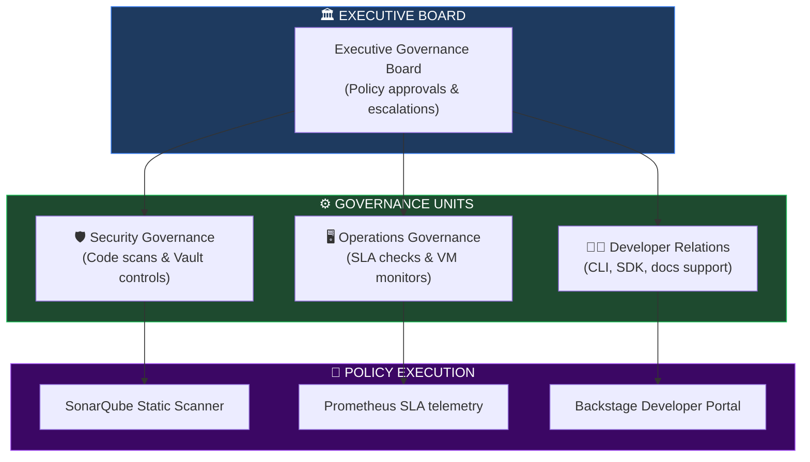
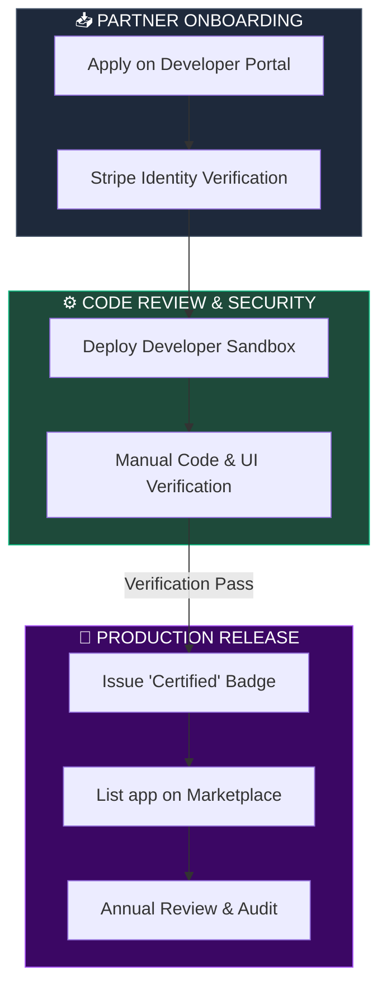
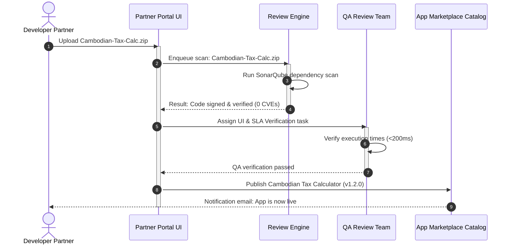
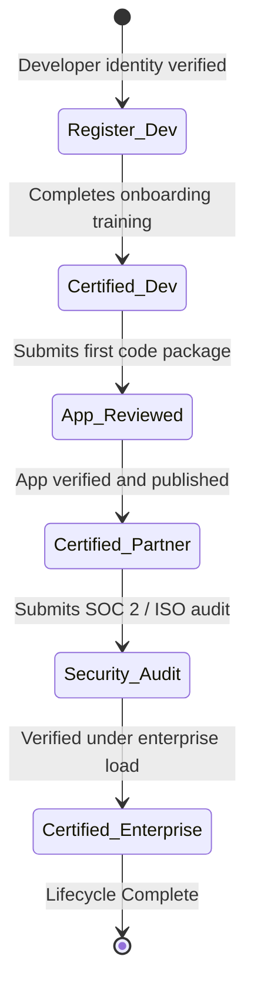
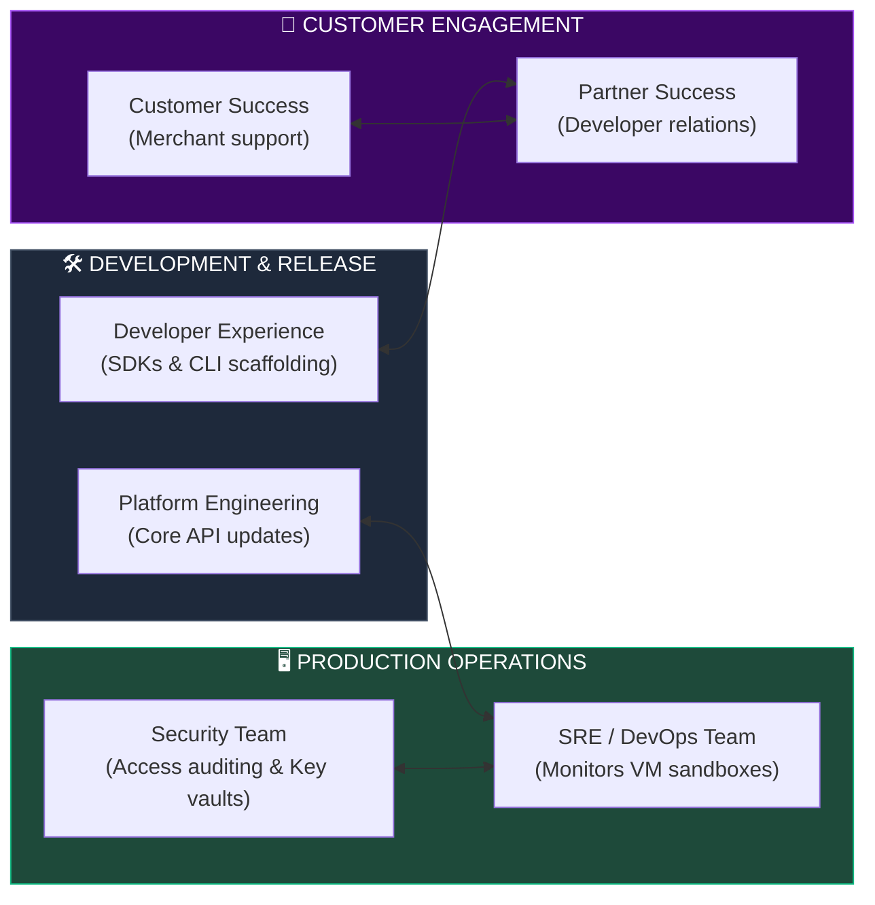

# PLATFORM GOVERNANCE, ECOSYSTEM MANAGEMENT & ENTERPRISE OPERATING MODEL

**Project Name:** Enterprise SaaS Business Management Platform  
**Document Version:** 1.0.0 — Baseline Standard  
**Date:** July 14, 2026  
**Authors:** Principal Enterprise Platform Architect, Ecosystem Strategy Architect, SaaS Governance Specialist, Partner Platform Manager, Security Governance Architect & Enterprise Operating Model Consultant  
**Classification:** Enterprise Internal — Restricted (Governance Sensitive)  
**Status:** 🏛️ APPROVED PLATFORM GOVERNANCE & OPERATING MODEL SPECIFICATION  

---

## TABLE OF CONTENTS

| Section | Title | Description |
| :---: | :--- | :--- |
| **§1** | [Platform Governance Foundation](#section-1--platform-governance-foundation) | Why platform governance is required, operational challenges |
| **§2** | [Governance Architecture](#section-2--governance-architecture) | Governance organizational structure, roles, and Mermaid org chart |
| **§3** | [Platform Governance Model](#section-3--platform-governance-model) | Security, data, API, marketplace, and AI governance matrices |
| **§4** | [Developer Governance](#section-4--developer-governance) | Developer policies, registration, verification code, support |
| **§5** | [Partner Management](#section-5--partner-management) | Partner lifecycle: onboarding, evaluations, certification metrics |
| **§6** | [Marketplace Governance](#section-6--marketplace-governance) | Application criteria: security scans, privacy audits, SLA targets |
| **§7** | [Certification Program](#section-7--certification-program) | Tier levels: developer, partner, enterprise, security |
| **§8** | [Security Governance](#section-8--security-governance) | Access control, code signature audits, security review rules |
| **§9** | [Compliance Management](#section-9--compliance-management) | GDPR, SOC 2, HIPAA, and regional PCI auditing controls |
| **§10** | [SLA Management](#section-10--sla-management) | Platform uptime targets, support queues, and incident response |
| **§11** | [Ecosystem Analytics](#section-11--ecosystem-analytics) | Dashboard layouts, partner usage charts, customer feedback |
| **§12** | [Operating Model](#section-12--operating-model) | Platform team topologies: engineering, partner success, ops |
| **§13** | [Change Management](#section-13--change-management) | Breaking change notifications, API deprecations, deprecation templates |
| **§14** | [Risk Management](#section-14--risk-management) | Platform risks: vendor lock-in, malware injection, dependency drift |
| **§15** | [Platform Support Model](#section-15--platform-support-model) | Tiered support structures: developer forum vs. enterprise SLAs |
| **§16** | [Governance Tool Stack](#section-16--governance-tool-stack) | Developer portals, ServiceNow dashboards, code repositories |
| **§17** | [Platform Metrics](#section-17--platform-metrics) | KPI lists: registration velocity, developer churn, SLA drift |
| **§18** | [Future Ecosystem Roadmap](#section-18--future-ecosystem-roadmap) | Vision: internal platform → public global developer ecosystem |
| **§19** | [Governance Checklist](#section-19--governance-checklist) | Audit checklist mapping code reviews, security, and operations |
| **§20** | [Final Platform Governance Architecture](#section-20--final-platform-governance-architecture) | 5 comprehensive technical Mermaid organizational flowcharts |

---

## SECTION 1 — PLATFORM GOVERNANCE FOUNDATION

### 1.1 Why Platform Governance is Required
Operating a multi-tenant SaaS platform that executes third-party code requires strict operational guardrails:
*   **Security Risks:** Malicious plugins could inject code or access sensitive database schemas.
*   **Quality Control:** Poorly coded extensions can cause performance bottlenecks or application crashes.
*   **Compatibility:** Updates to core APIs could break partner integrations.
*   **Partner Management:** Clear terms of service and certification requirements are needed to build a trusted partner ecosystem.

---

## SECTION 2 — GOVERNANCE ARCHITECTURE

### 2.1 The Governance Board Structure
The platform is managed by a centralized Governance Board that coordinates security, operations, and partner success.

```
THE GOVERNANCE BOARD STRUCTURE
═══════════════════════════════════════════════════════════════════════════════
                 [ Executive Governance Board ]
                                │
         ┌──────────────────────┼──────────────────────┐
         ▼                      ▼                      ▼
  [ Security Team ]     [ Operations Team ]    [ Dev Relations ]
         │                      │                      │
         ▼                      ▼                      ▼
 [ Code Vulnerability ]  [ Sandbox Monitors ]  [ SDK & CLI Support ]
═══════════════════════════════════════════════════════════════════════════════
```

---

## SECTION 3 — PLATFORM GOVERNANCE MODEL

### 3.1 Domain Governance Modules
*   **Architecture Governance:** Verifies that plugin code patterns align with the platform's modular monorepo standards.
*   **Security Governance:** Controls code signing and isolates V8 sandbox environments.
*   **Data Governance:** Restricts access to data schemas using tenant-specific row-level security (RLS).
*   **API Governance:** Restricts API endpoint access using OAuth2 permission scopes.

---

## SECTION 4 — DEVELOPER GOVERNANCE

### 4.1 Developer Registration & Verification Policy
To publish applications, developers must register their business details, pass validation checks, and agree to the platform's API Usage Policy.

```json
// Sample Developer Registration Verification Schema
{
  "developer_id": "dev-cambodian-tax-calc",
  "business_name": "Phnom Penh Tax Tech Ltd",
  "registration_number": "Co. 88102-CAM",
  "verification_status": "PENDING_MANUAL_REVIEW",
  "consented_policies": {
    "api_usage_policy_version": "v1.2.0",
    "data_privacy_agreement_version": "v1.0.0",
    "timestamp": "2026-07-14T08:02:40Z"
  },
  "developer_key_fingerprint": "SHA256:d8:a2:b5:01:fe:32:0a..."
}
```

---

## SECTION 5 — PARTNER MANAGEMENT

### 5.1 Partner Lifecycle Stages
1.  **Application:** Developer submits credentials and business information.
2.  **Evaluation:** Platform relations team reviews business capabilities.
3.  **Approval:** Business agreement finalized; partner portal access granted.
4.  **Onboarding:** Provisioning developer sandboxes.
5.  **Certification:** Code review and performance validation.

---

## SECTION 6 — MARKETPLACE GOVERNANCE

### 6.1 Application Submission Review Criteria
Before an application is listed in the marketplace, it must pass several automated and manual checks:
*   **Security Review:** Automated static analysis scans packages for CVE vulnerabilities.
*   **Performance Testing:** Sandboxed executions must complete within 200ms limits.

---

## SECTION 7 — CERTIFICATION PROGRAM

### 7.1 Certification Badges
To build merchant trust, the platform offers three certification levels:
*   **Developer Certified:** Developer identity has been verified.
*   **Partner Certified:** The developer has published at least one validated application.
*   **Enterprise Solution Certified:** Scalability, performance, and security compliance have been verified under enterprise loads.

---

## SECTION 8 — SECURITY GOVERNANCE

### 8.1 Security Policies
*   **Access Control:** Access to developer settings and production deployments requires multi-factor authentication (MFA).
*   **Application Audits:** The security team conducts quarterly audits of third-party applications to verify dependency integrity.

---

## SECTION 9 — COMPLIANCE MANAGEMENT

### 9.1 Regulatory Guardrails
*   **Data Privacy:** Restricts customer PII access using role-based scopes (enforcing GDPR/SOC 2 requirements).
*   **Audit Logging:** Logs all administrative actions and plugin installations to WORM (Write-Once-Read-Many) storage.

---

## SECTION 10 — SLA MANAGEMENT

### 10.1 Platform Service Level Agreements (SLAs)
The platform defines operational targets for its ecosystem.

```yaml
# configs/governance/sla-targets.yaml
sla:
  platform_uptime:
    target: "99.95%"
    measurement_period: "monthly"
  developer_portal:
    availability: "99.5%"
  support_queues:
    tier_1_incident: "15 minutes"
    tier_2_incident: "2 hours"
    developer_issue: "24 hours"
  maintenance_windows:
    schedule: "Every Sunday 02:00 - 04:00 UTC"
```

---

## SECTION 11 — ECOSYSTEM ANALYTICS

### 11.1 Key Performance Dashboards
*   **Adoption Rates:** Tracks active installations and monthly active users (MAU) per extension.
*   **SLA Drift:** Monitors response latencies and webhook delivery success rates.

---

## SECTION 12 — OPERATING MODEL

### 12.1 Team Topologies
*   **Platform Engineering:** Manages core services, APIs, and the sandbox environment.
*   **Developer Experience:** Authors SDKs, maintains CLI tools, and updates developer documentation.
*   **Partner Success:** Manages relationships and helps developers build integrations.

---

## SECTION 13 — CHANGE MANAGEMENT

### 13.1 API Deprecation Communication Flow
When breaking API changes are introduced, the platform executes a structured deprecation process.

```
API DEPRECATION PROCESS
═══════════════════════════════════════════════════════════════════════════════
[ Breaking Change Approved ] ──► [ Deprecation Header Appended to Response ]
                                         │
                                         ▼ (Email notification to developers)
                                 [ 12-Month Grace Period ]
                                         │
                                         ▼ (API disabled on Sandbox)
                                  [ 3-Month Beta Test ]
                                         │
                                         ▼ (Access revoked)
                                   [ API Retired ]
═══════════════════════════════════════════════════════════════════════════════
```

---

## SECTION 14 — RISK MANAGEMENT

### 14.1 Risk Mitigation Matrix
*   **Malicious Code Injection:** Mitigated by code signing requirements and running plugins in isolated WASM sandboxes.
*   **Dependency Vulnerabilities:** Static code analysis scans uploaded packages for known CVEs.

---

## SECTION 15 — PLATFORM SUPPORT MODEL

### 15.1 Tiered Support Channels
*   **Tier 1:** Public developer forums and documentation.
*   **Tier 2:** Dedicated developer relations engineers via the Partner Portal.
*   **Tier 3:** Support channels for enterprise integration partners.

---

## SECTION 16 — GOVERNANCE TOOL STACK

### 16.1 Platform Governance Tools

| Category | Tool | Production Purpose | System Owner |
| :--- | :--- | :--- | :--- |
| **Developer Portal** | Backstage | Centralized portal for developer onboarding. | DevEx Lead |
| **Service Desk** | Jira Service Management| Manages review approvals and support tickets. | Operations Lead |
| **Security Auditing** | SonarQube | Automated code scanning. | Security Architect |
| **Secret Vault** | HashiCorp Vault | Encrypts developer API keys and credentials. | Security Lead |
| **Deployment Engine** | Terraform | Provisions developer sandbox infrastructure. | Platform SRE |

---

## SECTION 20 — FINAL PLATFORM GOVERNANCE ARCHITECTURE

### 20.1 Platform Governance Model



### 20.2 Partner Lifecycle



### 20.3 Marketplace Governance Flow



### 20.4 Certification Process



### 20.5 Enterprise Operating Model



---

## DOCUMENT METADATA

| Field | Value |
| :--- | :--- |
| **Document ID** | SAAS-GOV-017.6 |
| **Section** | 17 — Platform Extensibility |
| **Subsection** | 17.6 — Governance & Operating Model |
| **Status** | 🏛️ APPROVED |
| **Version** | 1.0.0 |
| **Date** | July 14, 2026 |
| **Next Review** | January 14, 2027 |
| **Related Documents** | [Extensibility Foundation](../17.1-Extensibility-Foundation/Extensibility-Foundation.md) · [Plugin Runtime Architecture](../17.2-Plugin-Runtime-Architecture/Plugin-Runtime-Architecture.md) · [Public API Portal](../17.3-Public-API-Portal/Public-API-Portal.md) · [Marketplace Architecture](../17.4-Marketplace-App-Ecosystem/Marketplace-App-Ecosystem.md) · [Integration Hub](../17.5-Integration-Hub-Connectors/Integration-Hub-Connectors.md) |
| **Technology Versions** | SonarQube v10 · ServiceNow vUtah · Backstage v1.25 |

---

*This document is the authoritative specification for all platform governance, ecosystem management, and enterprise operating model decisions in the Enterprise SaaS Business Management Platform. All developer policies, partner lifecycles, marketplace standards, verification gates, certification paths, and team topologies must conform to the standards defined herein.*
