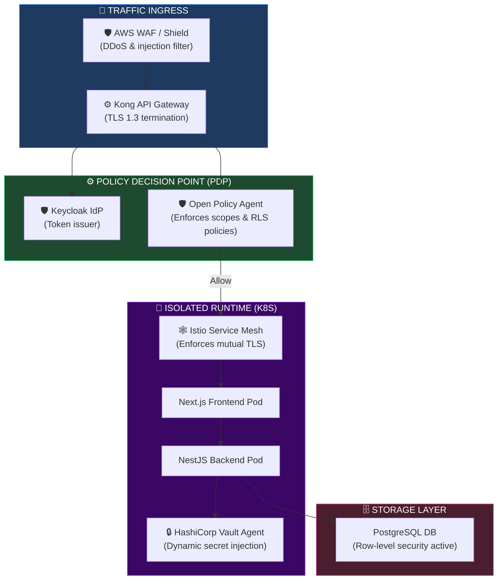
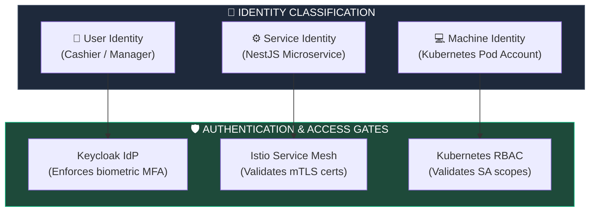
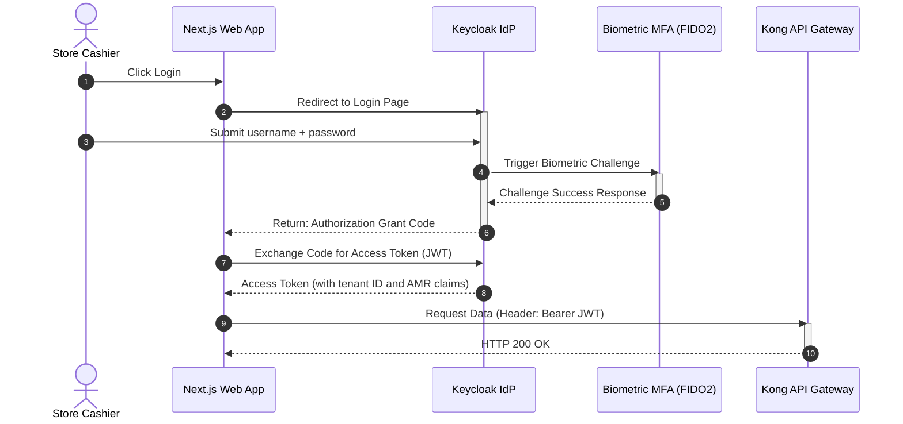
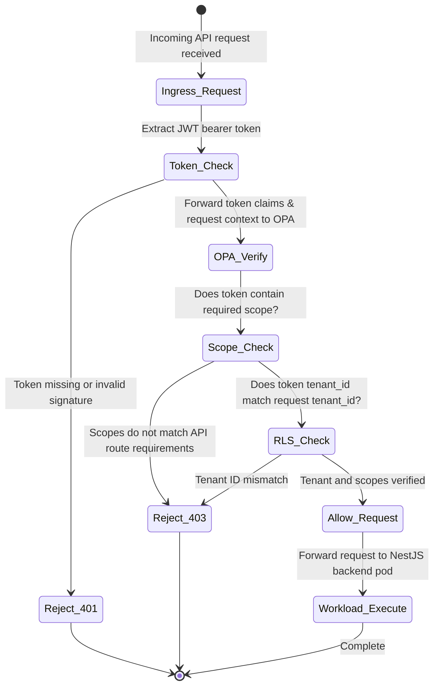
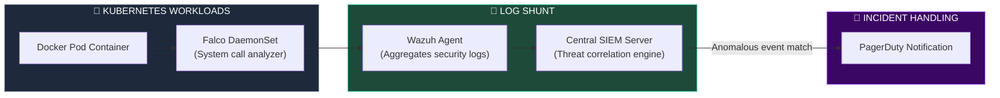

# ZERO TRUST SECURITY ARCHITECTURE & ENTERPRISE SECURITY FOUNDATION

**Project Name:** Enterprise SaaS Business Management Platform  
**Document Version:** 1.0.0 — Baseline Standard  
**Date:** July 14, 2026  
**Authors:** Principal Security Architect, Zero Trust Architect, Cloud Security Engineer, Identity Security Specialist, Application Security Expert & Enterprise SaaS Security Architect  
**Classification:** Enterprise Internal — Restricted (Security Critical)  
**Status:** 🛡️ APPROVED ZERO TRUST SECURITY ARCHITECTURE & ENTERPRISE FOUNDATION SPECIFICATION  

---

## TABLE OF CONTENTS

| Section | Title | Description |
| :---: | :--- | :--- |
| **§1** | [Zero Trust Foundation](#section-1--zero-trust-foundation) | Perimeter model issues, zero trust logic, user identity flows |
| **§2** | [Zero Trust Security Principles](#section-2--zero-trust-security-principles) | Never trust, always verify, least privilege, continuous auth |
| **§3** | [Zero Trust Architecture](#section-3--zero-trust-architecture) | Request validation pipelines, policy decision gates, Mermaid topology |
| **§4** | [Identity & Access Management (IAM)](#section-4--identity--access-management-iam) | Identity classification: users, applications, microservices, machines |
| **§5** | [Authentication Architecture](#section-5--authentication-architecture) | Passwordless SSO, OAuth2/OIDC protocols, biometric MFA |
| **§6** | [Authorization Model](#section-6--authorization-model) | RBAC and ABAC structures, OPA policy examples |
| **§7** | [Privileged Access Management](#section-7--privileged-access-management) | Admin access controls, temporary JIT permissions, audits |
| **§8** | [Application Security](#section-8--application-security) | Code scan gates, input sanitization middleware, dependencies |
| **§9** | [API Security](#section-9--api-security) | API Gateway validations, threat scanners, payload limits |
| **§10** | [Data Security](#section-10--data-security) | Transit/Rest encryption, dynamic data masking, vault transit |
| **§11** | [Network Security](#section-11--network-security) | Service Mesh segmentation, Kubernetes Network Policies |
| **§12** | [Kubernetes Security](#section-12--kubernetes-security) | Pod isolation levels, RBAC boundaries, image checking |
| **§13** | [Secrets Management](#section-13--secrets-management) | Secrets injection, rotation periods, Vault cluster endpoints |
| **§14** | [Security Monitoring](#section-14--security-monitoring) | Falco event triggers, audit logs, wazuh collectors |
| **§15** | [Threat Modeling](#section-15--threat-modeling) | STRIDE risk assessment matrix, severity scoring |
| **§16** | [Security Tool Stack](#section-16--security-tool-stack) | Security software matrix: scanners, vaults, logs |
| **§17** | [Incident Response](#section-17--incident-response) | IR phases: detection, isolation playbooks, rollbacks |
| **§18** | [Security Governance](#section-18--security-governance) | Policies compliance, mandatory reviews, training schedules |
| **§19** | [Security Roadmap](#section-19--security-roadmap) | Vision: basic credentials → continuous verification → AI-SecOps |
| **§20** | [Final Zero Trust Architecture](#section-20--final-zero-trust-architecture) | 5 comprehensive technical Mermaid security flowcharts |

---

## SECTION 1 — ZERO TRUST FOUNDATION

### 1.1 The Shift from Perimeter Security to Zero Trust
*   **Traditional Perimeter Security:**
    *   *Trust Boundary:* Assumes that users and systems inside the firewall are safe.
    *   *Insider Risks:* Compromised credentials allow attackers to move laterally across the network.
    *   *Lateral Movement:* Once inside a single VM, there are few barriers to accessing other internal microservices.
*   **Zero Trust Model:** Every access request is verified explicitly, authorized based on context, and monitored continuously.

```
THE SECURITY MODEL SHIFT
═══════════════════════════════════════════════════════════════════════════════
Traditional (Perimeter-Based):
  [ Internet ] ──► [ Firewall ] ──► [ Internal Network (Trusted Zone) ]
                                          ├── [ POS Microservice ]
                                          └── [ Database Storage ]
                                          
Zero Trust (Continuous Verification):
  [ User Request ] ──► [ Identity Gate ] ──► [ Policy Engine ] ──► [ Micro-segment ]
                                                                      ├── POS App
                                                                      └── Database
═══════════════════════════════════════════════════════════════════════════════
```

---

## SECTION 2 — ZERO TRUST SECURITY PRINCIPLES

### 2.1 Core Architectural Principles
*   **Verify Explicitly:** Authenticate and authorize based on all available data points (user identity, location, device health, service context).
*   **Least Privilege:** Restrict access using Just-In-Time (JIT) and Just-Enough-Access (JEA) policies.
*   **Assume Breach:** Micro-segment the network, encrypt all data in transit and at rest, and use analytics to detect anomalies.

---

## SECTION 3 — ZERO TRUST ARCHITECTURE

### 3.1 The Ingress Validation Path
Every request passes through an Identity Provider (IdP) and a Policy Decision Point (PDP) before reaching isolated target workloads.

```
THE INGRESS VALIDATION PATH
═══════════════════════════════════════════════════════════════════════════════
 [ User Client / Mobile App ]
             │
             ▼ (HTTPS / TLS 1.3)
    [ API Gateway (Kong) ] ──► Enforces rate limits & header checks
             │
             ▼ (Verify Signature)
  [ Keycloak / Auth Service ] ──► (Validates JWT claims)
             │
             ▼ (Policy Decision)
    [ Policy Engine (OPA) ] ──► Verifies resource scopes & tenant RLS
             │
             ▼ (Authorize Access)
    [ Isolated Container Pod ]
═══════════════════════════════════════════════════════════════════════════════
```

---

## SECTION 4 — IDENTITY & ACCESS MANAGEMENT (IAM)

### 4.1 Identity Classification
*   **User Identity:** Handled by Keycloak with multi-factor authentication (MFA).
*   **Service Identity:** Microservices authenticate with each other using mutual TLS (mTLS) managed by an Istio Service Mesh.
*   **Machine Identity:** Infrastructure components authenticate using AWS IAM roles and Kubernetes service accounts.

---

## SECTION 5 — AUTHENTICATION ARCHITECTURE

### 5.1 Authentication Protocols
*   **OAuth2 & OpenID Connect (OIDC):** Standard protocol for user login and token generation.
*   **Multi-Factor Authentication (MFA):** Enforces time-based one-time password (TOTP) or biometric verification (FIDO2/WebAuthn).

---

## SECTION 6 — AUTHORIZATION MODEL

### 6.1 Policy-Based Access Control (PBAC)
The platform uses **Open Policy Agent (OPA)** to validate authorizations before forwarding requests to backend systems.

```rego
# security/policies/api_access.rego
package platform.security

default allow = false

# Allow access if the user has the required scope, matches the tenant, and MFA is verified
allow {
    input.method == "POST"
    input.path == ["api", "v1", "billing", "invoices"]
    input.token.scopes[_] == "write:billing:invoices"
    input.token.tenant_id == input.request.tenant_id
    input.token.amr[_] == "mfa" # Verifies MFA was used during login
}
```

---

## SECTION 7 — PRIVILEGED ACCESS MANAGEMENT (PAM)

### 7.1 Just-In-Time (JIT) Admin Access
Administrative access to production environments is restricted and managed using JIT workflows:
*   **Temporary Permissions:** Admin sessions expire automatically after 2 hours.
*   **Approval Workflows:** Requests for production database access require approval from the security operations lead.

---

## SECTION 8 — APPLICATION SECURITY

### 8.1 Secure Coding Standards
*   **Input Validation:** NestJS class-validators sanitize incoming payloads to prevent SQL injection and cross-site scripting (XSS).
*   **Vulnerability Scanning:** Automated CI/CD pipelines run dependency checks to catch vulnerabilities before code is deployed.

---

## SECTION 9 — API SECURITY

### 9.1 API Gateway Guardrails
*   **Threat Detection:** WAF filters block common web attack patterns (e.g., OWASP Top 10).
*   **Payload Sanitation:** Restricts payload sizes (max 10MB) to prevent buffer overflows and Denial of Service (DoS) attacks.

---

## SECTION 10 — DATA SECURITY

### 10.1 Key Management & Transit Encryption
*   **Encryption in Transit:** Enforces TLS 1.3 for external requests and mutual TLS (mTLS) for microservice communications.
*   **Encryption at Rest:** Enforces AES-256 encryption on database volumes and object stores.
*   **Key Management:** Cryptographic keys are rotated automatically every 90 days.

```typescript
// backend/src/security/encryption/transit.service.ts
import { Injectable } from '@nestjs/common';
import * as crypto from 'crypto';

@Injectable()
export class TransitEncryptionService {
  private readonly algorithm = 'aes-256-gcm';

  // Encrypt sensitive records before writing to PostgreSQL
  encryptField(text: string, secretKey: Buffer): { ciphertext: string; iv: string; tag: string } {
    const iv = crypto.randomBytes(12);
    const cipher = crypto.createCipheriv(this.algorithm, secretKey, iv);
    
    let encrypted = cipher.update(text, 'utf8', 'hex');
    encrypted += cipher.final('hex');
    
    const tag = cipher.getAuthTag().toString('hex');
    
    return {
      ciphertext: encrypted,
      iv: iv.toString('hex'),
      tag: tag
    };
  }
}
```

---

## SECTION 11 — NETWORK SECURITY

### 11.1 Service Mesh & Micro-Segmentation
*   **Istio Service Mesh:** Enforces mTLS across all microservices.
*   **Kubernetes Network Policies:** Blocks communication between namespaces (e.g., frontend pods cannot communicate directly with database pods).

---

## SECTION 12 — KUBERNETES SECURITY

### 12.1 Pod Security Policies
*   **Container Sandboxing:** Blocks root privileges on container processes (`runAsNonRoot: true`).
*   **Image Scanning:** The container registry runs automated vulnerability scans on all built images before deployment.

---

## SECTION 13 — SECRETS MANAGEMENT

### 13.1 Vault Integration
Secret assets (database passwords, credentials, API keys) are managed dynamically:
*   **HashiCorp Vault Integration:** Configures dynamic secret injection to application pods.
*   **Kubernetes Secrets:** Configures secrets injection using the Vault Agent Sidecar Injector.

---

## SECTION 14 — SECURITY MONITORING

### 14.1 Runtime Auditing
*   **Runtime Audits:** Falco checks container behaviors for unauthorized activities (e.g., write attempts to bin folders).

---

## SECTION 15 — THREAT MODELING

### 15.1 STRIDE Threat Assessment

| Threat | Description | SaaS Platform Mitigation |
| :--- | :--- | :--- |
| **Spoofing** | User attempts to hijack cashier identity. | Enforces OIDC JWT validation + MFA. |
| **Tampering** | Payload parameters are modified during transit. | Enforces HTTPS TLS 1.3 and cryptographic webhook signatures. |
| **Repudiation** | User denies executing a high-value refund transaction. | Logs all write actions to a WORM-compliant audit trail. |
| **Information Disclosure** | Data leakage across tenant boundaries. | Enforces database Row-Level Security (RLS) checked by `tenant_id`. |
| **Denial of Service** | Volumetric DDOS attacks overload the system. | Rate limiting at the API Gateway and AWS Shield WAF filters. |
| **Elevation of Privilege** | Partner plugin attempts to gain root permissions. | Sandboxes plugin execution in isolated WASM runtimes. |

---

## SECTION 16 — SECURITY TOOL STACK

### 16.1 Security Platform Tools

| Category | Tool | Production Purpose | System Owner |
| :--- | :--- | :--- | :--- |
| **Identity Provider** | Keycloak | User authentication and MFA enforcement. | Security Lead |
| **Secrets Vault** | HashiCorp Vault | Dynamic secrets injection and transit encryption. | Platform SRE |
| **Policy Engine** | Open Policy Agent (OPA)| Evaluates runtime authorization requests. | Security Architect |
| **Intrusion Detection** | Falco | Runtime container behavior monitoring. | DevOps / SecOps |
| **Log Collector** | Wazuh / SIEM | Centralized security event logging. | SRE Lead |
| **Vulnerability Scanner**| OWASP ZAP | Web application security testing. | QA Engineer |

---

## SECTION 20 — FINAL ZERO TRUST ARCHITECTURE

### 20.1 Zero Trust Architecture



### 20.2 IAM Flow



### 20.3 Authentication Flow



### 20.4 Authorization Decision Flow



### 20.5 Security Monitoring Architecture



---

## DOCUMENT METADATA

| Field | Value |
| :--- | :--- |
| **Document ID** | SAAS-SEC-018.1 |
| **Section** | 18 — Security Architecture |
| **Subsection** | 18.1 — Zero Trust Foundation |
| **Status** | 🛡️ APPROVED |
| **Version** | 1.0.0 |
| **Date** | July 14, 2026 |
| **Next Review** | January 14, 2027 |
| **Related Documents** | [Detailed Database Design](../../02-System-Design/03-Database-Design.md) · [Backend API Gateway](../../14-Backend-Architecture/14.5-API-Architecture/API-Architecture.md) · [Kubernetes Topology](../../15-Cloud-Infrastructure/15.3-Kubernetes-Architecture/Kubernetes-Architecture.md) |
| **Technology Versions** | Keycloak v24 · Kong v3.6 · Istio v1.21 · Open Policy Agent v0.64 |

---

*This document is the authoritative specification for all Zero Trust security architecture and enterprise security foundation decisions in the SaaS Business Management Platform. All authentication protocols, policy decision points, authorization models, network micro-segmentations, Secrets vault structures, and threat response procedures must conform to the standards defined herein.*
