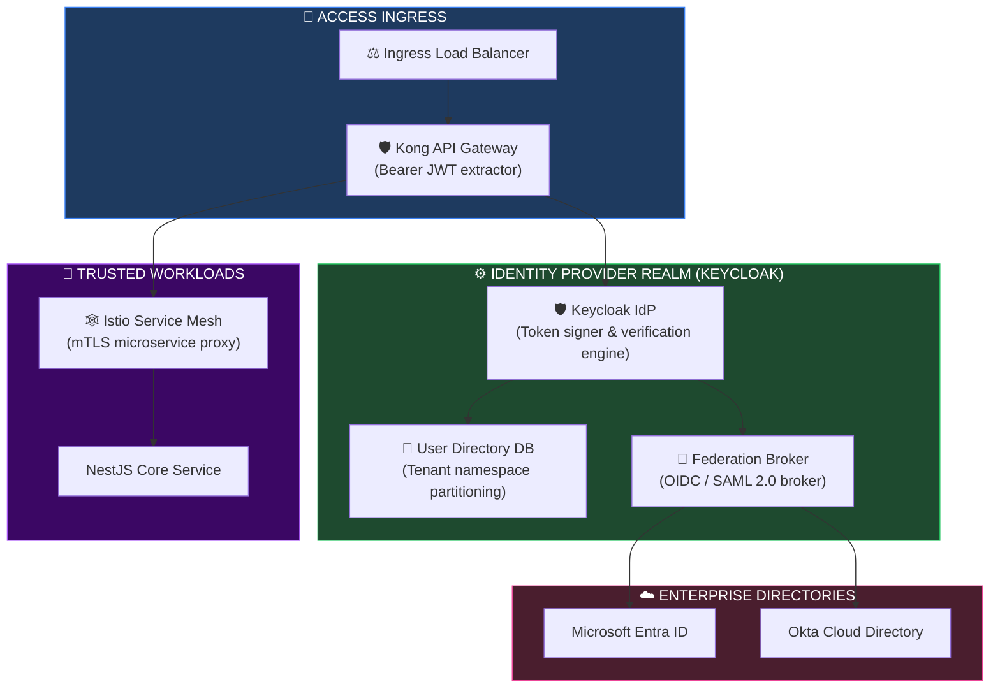
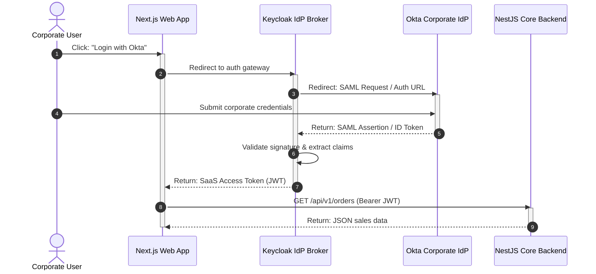
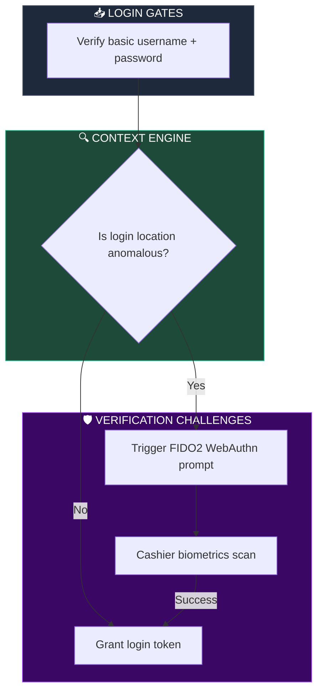
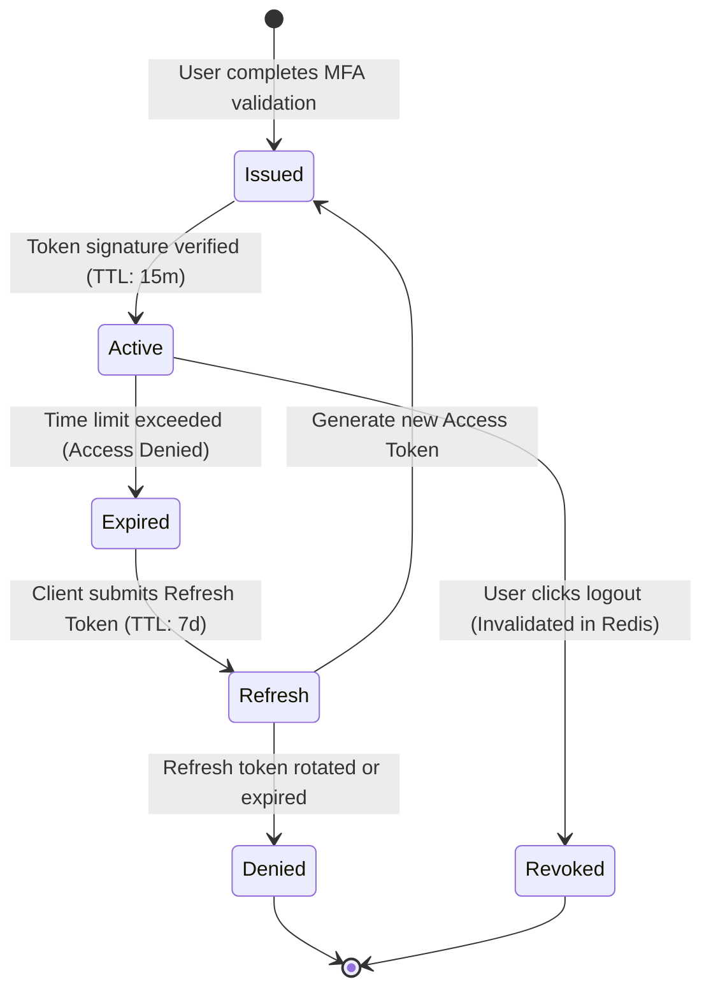
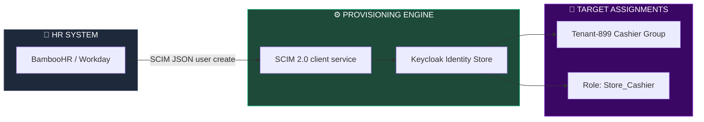

# IDENTITY & ACCESS MANAGEMENT (IAM), SSO, MFA & ENTERPRISE AUTHENTICATION ARCHITECTURE

**Project Name:** Enterprise SaaS Business Management Platform  
**Document Version:** 1.0.0 — Baseline Standard  
**Date:** July 14, 2026  
**Authors:** Principal Identity Architect, IAM Security Engineer, Enterprise Authentication Specialist, OAuth2/OIDC Expert, SSO Architect & SaaS Security Platform Architect  
**Classification:** Enterprise Internal — Restricted (Identity Sensitive)  
**Status:** 🔑 APPROVED IDENTITY & ACCESS MANAGEMENT (IAM) & ENTERPRISE AUTHENTICATION SPECIFICATION  

---

## TABLE OF CONTENTS

| Section | Title | Description |
| :---: | :--- | :--- |
| **§1** | [IAM Foundation](#section-1--iam-foundation) | Who you are, what you can access, and what you did |
| **§2** | [Enterprise Identity Architecture](#section-2--enterprise-identity-architecture) | Ingress auth routing pipelines and Mermaid IAM runtime |
| **§3** | [Identity Provider Architecture](#section-3--identity-provider-architecture) | Directory management, credentials vaults, token validation |
| **§4** | [Authentication Architecture](#section-4--authentication-architecture) | Login schemes: passwords, passkeys, SSO, OAuth federation |
| **§5** | [Single Sign-On (SSO)](#section-5--single-sign-on-sso) | SAML 2.0, OpenID Connect OIDC, metadata integrations |
| **§6** | [Multi-Factor Authentication](#section-6--multi-factor-authentication) | Adaptive MFA, WebAuthn FIDO2, TOTP app validators |
| **§7** | [User Lifecycle Management](#section-7--user-lifecycle-management) | SCIM provisioning, dynamic onboarding/offboarding payload mappers |
| **§8** | [Token Security](#section-8--token-security) | Token signatures, expiration parameters, cache-based revocations |
| **§9** | [Session Management](#section-9--session-management) | Inactivity timeouts, concurrent session pruners, remote logouts |
| **§10** | [Authorization Architecture](#section-10--authorization-model) | RBAC and ABAC permission structures, OPA evaluation examples |
| **§11** | [Service Identity](#section-11--service-identity) | Machine-to-machine trust, SPIFFE/SPIRE nodes, mTLS mesh |
| **§12** | [Enterprise Federation](#section-12--enterprise-federation) | Azure AD (Entra), Okta OIDC, LDAP directories mappings |
| **§13** | [Identity Security](#section-13--identity-security) | Risk engines, geo-velocity checks, brute-force locking |
| **§14** | [Identity Audit](#section-14--identity-audit) | Audit logging targets: user activities, security changes |
| **§15** | [IAM Tool Stack](#section-15--iam-tool-stack) | Provider stack comparison: Keycloak, Okta, Vault |
| **§16** | [IAM Observability](#section-16--iam-observability) | Metric dashboards: login failure ratios, latency telemetry |
| **§17** | [Security Policies](#section-17--security-policies) | MFA, session rules, credential reset controls |
| **§18** | [Enterprise Customer IAM](#section-18--enterprise-customer-iam) | Tenant domains separation, delegated administrator rules |
| **§19** | [Future IAM Roadmap](#section-19--future-iam-roadmap) | Vision: simple logins → passwordless biometric continuous verification |
| **§20** | [Final IAM Architecture](#section-20--final-iam-architecture) | 5 comprehensive technical Mermaid IAM flowcharts |

---

## SECTION 1 — IAM FOUNDATION

### 1.1 Who, What, and When
Enterprise security requires separating authentication, authorization, and accounting:
*   **Authentication (Who are you?):** Verifies user identity using credentials, passkeys, or federated SSO tokens.
*   **Authorization (What can you access?):** Checks the user's roles and scopes to verify permissions.
*   **Accounting (What did you do?):** Logs user activities to a central audit trail.

```
THE AAA SECURITY TRIAD
═══════════════════════════════════════════════════════════════════════════════
 Authentication ──► Keycloak validates credentials/biometrics
       │
       ▼
  Authorization ──► OPA validates roles and resource scopes
       │
       ▼
     Accounting ──► Logs written to audit trail (Postgres/WORM)
═══════════════════════════════════════════════════════════════════════════════
```

---

## SECTION 2 — ENTERPRISE IDENTITY ARCHITECTURE

### 2.1 The Authentication & Authorization Runtime Path
Requests are authenticated by Keycloak, authorized by Open Policy Agent (OPA), and logged to the audit repository.

```
THE IDENTITY RUNTIME PATH
═══════════════════════════════════════════════════════════════════════════════
 [ User Client / Browser ]
             │
             ▼ (JWT Ingress)
   [ Kong Gateway / Proxy ] ──► Extracts bearer token in headers
             │
             ▼ (Validate Signature)
    [ Keycloak IdP Engine ] ◄── Cache checks user status
             │
             ▼ (Evaluate Policies)
   [ OPA Authorization Engine ]
             │
             ├──────────────────────────────┐
             ▼                              ▼
    [ Target Container ]           [ Security Audit Logger ]
═══════════════════════════════════════════════════════════════════════════════
```

---

## SECTION 3 — IDENTITY PROVIDER ARCHITECTURE

### 3.1 IdP Key Functions
*   **User Directory:** Stores user metadata, roles, and groupings partitioned by `tenant_id`.
*   **Token Service:** Issues sign-in tokens (JWT format) carrying tenant IDs, scopes, and MFA claims.

---

## SECTION 4 — AUTHENTICATION ARCHITECTURE

### 4.1 Authentication Schemes
*   **Passwords:** Enforces dynamic hashing using the Argon2id algorithm.
*   **Passwordless (Passkeys):** Leverages WebAuthn (FIDO2) for cryptographically secure logins.
*   **Enterprise SSO:** Connects to Microsoft Entra ID or Okta using OIDC/SAML 2.0.

---

## SECTION 5 — SINGLE SIGN-ON (SSO)

### 5.1 OpenID Connect OIDC Metadata Configuration
SSO integrations are configured using OIDC configuration templates.

```json
// configs/iam/oidc-client.json
{
  "client_id": "saas-portal-cambodia",
  "client_secret": "VaultInject:secret/data/iam/clients/saas-portal:secret",
  "protocol": "openid-connect",
  "redirect_uris": [
    "https://cambodia.saas-platform.com/auth/callback"
  ],
  "web_origins": [
    "https://cambodia.saas-platform.com"
  ],
  "authorization_services_enabled": true,
  "consent_required": false,
  "default_scopes": [
    "web-origins",
    "acr",
    "roles",
    "profile",
    "email"
  ]
}
```

---

## SECTION 6 — MULTI-FACTOR AUTHENTICATION

### 6.1 Adaptive MFA
*   **Adaptive Step-Up Authentication:** Logins from new devices or locations trigger step-up MFA prompts (WebAuthn/TOTP).

---

## SECTION 7 — USER LIFECYCLE MANAGEMENT

### 7.1 SCIM Provisioning Payload Schema
The platform supports **SCIM 2.0** for automated user provisioning and de-provisioning.

```json
// Sample SCIM 2.0 User Creation POST Request
{
  "schemas": ["urn:ietf:params:scim:schemas:core:2.0:User"],
  "userName": "kimsour.srun@cambodia-retail.kh",
  "name": {
    "familyName": "Srun",
    "givenName": "Kimsour",
    "formatted": "Kimsour Srun"
  },
  "emails": [{
    "value": "kimsour.srun@cambodia-retail.kh",
    "type": "work",
    "primary": true
  }],
  "active": true,
  "urn:ietf:params:scim:schemas:extension:enterprise:2.0:User": {
    "employeeNumber": "EMP-88102",
    "organization": "Cambodia Retail Group",
    "division": "Phnom Penh Branch"
  }
}
```

---

## SECTION 8 — TOKEN SECURITY

### 8.1 JWT Claims Configuration
Access tokens carry payload claims that define execution contexts and scopes:
*   `amr: ["mfa", "hwk"]` - Verifies multi-factor authentication was used.
*   `tenant_id: "tenant-899"` - Limits access to the user's tenant partition.

---

## SECTION 9 — SESSION MANAGEMENT

### 9.1 Session Security
*   **Session Timeout:** Sessions expire after 15 minutes of inactivity.
*   **Concurrent Sessions:** Restricts concurrent active sessions to 3 sessions per user account.

---

## SECTION 10 — AUTHORIZATION ARCHITECTURE

### 10.1 Access Control Matrix

| Role | Target Scopes | Database Boundaries | Context Restrictions |
| :--- | :--- | :--- | :--- |
| **Tenant Admin** | `*:*` (Full permissions). | Scoped to their `tenant_id`. | None. |
| **Finance Manager**| `read:billing`, `write:billing` | Financial tables only. | Business hours only. |
| **Store Clerk** | `read:inventory`, `write:pos` | POS catalogs only. | Bounded by store POS IP. |
| **Developer** | `read:api`, `write:extensions` | Read-only APIs. | Sandbox sandbox only. |

---

## SECTION 11 — SERVICE IDENTITY

### 11.1 Mutual TLS (mTLS)
Microservices authenticate using mutual TLS (mTLS) managed by Istio.
*   **Service Tokens:** High-privilege tasks require short-lived tokens injected dynamically by HashiCorp Vault.

---

## SECTION 12 — ENTERPRISE FEDERATION

### 12.1 Federation Ingress Path
Enterprise users authenticate using their corporate IdP (e.g., Okta or Entra ID).

```
ENTERPRISE FEDERATION PATH
═══════════════════════════════════════════════════════════════════════════════
 Merchant User ──► Portal Login ──► Keycloak (Identity Broker)
                                           │
                                           ▼ (Redirect)
                                    Okta / Azure AD ──► (Validates user)
                                           │
                                           ▼ (SAML Assertion)
                                     SaaS Backend
═══════════════════════════════════════════════════════════════════════════════
```

---

## SECTION 13 — IDENTITY SECURITY

### 13.1 Geo-Velocity Checks
*   **Geo-Velocity Rules:** Flag logins if the distance between concurrent sessions exceeds physical travel limits (e.g., login from Phnom Penh followed by London within 1 hour).

---

## SECTION 14 — IDENTITY AUDIT

### 14.1 Log Schema
*   **Audit Logging:** Logs all authentication events, administrative actions, and permission changes to WORM storage.

---

## SECTION 15 — IAM TOOL STACK

### 15.1 Authentication Infrastructure Stack

| Category | Tool | Production Purpose | System Owner |
| :--- | :--- | :--- | :--- |
| **Identity Provider** | Keycloak | User directory, SSO, OIDC. | Security Lead |
| **SSO Provider** | Okta / Entra ID | Enterprise federation services. | IAM Engineer |
| **MFA Standard** | WebAuthn (FIDO2) | Biometric authentication validation. | DevEx Lead |
| **Secrets Engine** | HashiCorp Vault | Stores client secrets and keys. | Platform SRE |
| **Auditing Log** | Elasticsearch | Centralized identity access logs. | Operations Lead |

---

## SECTION 20 — FINAL IAM ARCHITECTURE

### 20.1 Enterprise IAM Architecture



### 20.2 SSO Authentication Flow



### 20.3 MFA Verification Flow



### 20.4 Token Lifecycle



### 20.5 User Lifecycle Management



---

## DOCUMENT METADATA

| Field | Value |
| :--- | :--- |
| **Document ID** | SAAS-IAM-018.2 |
| **Section** | 18 — Security Architecture |
| **Subsection** | 18.2 — IAM, SSO & Authentication |
| **Status** | 🔑 APPROVED |
| **Version** | 1.0.0 |
| **Date** | July 14, 2026 |
| **Next Review** | January 14, 2027 |
| **Related Documents** | [Zero Trust Foundation](../18.1-Zero-Trust-Foundation/Zero-Trust-Foundation.md) · [Backend API Gateway](../../14-Backend-Architecture/14.5-API-Architecture/API-Architecture.md) · [Security Foundation](../../10-Security-Architecture/10.1-Security-Foundation/Security-Foundation.md) |
| **Technology Versions** | Keycloak v24 · SAML v2.0 · SCIM v2.0 · OpenSSL v3.1 |

---

*This document is the authoritative specification for all identity & access management (IAM), SSO, MFA, and enterprise authentication decisions in the SaaS Business Management Platform. All identity directories, single sign-on brokers, multifactor protocols, user provisioning channels, and JWT lifecycles must conform to the standards defined herein.*
