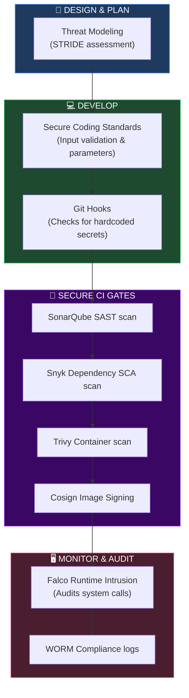
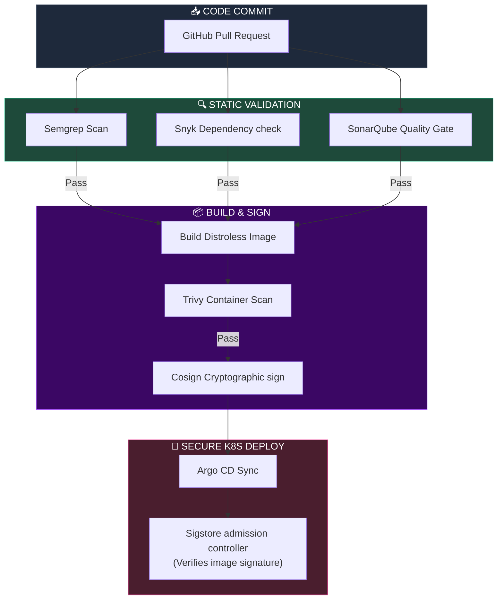
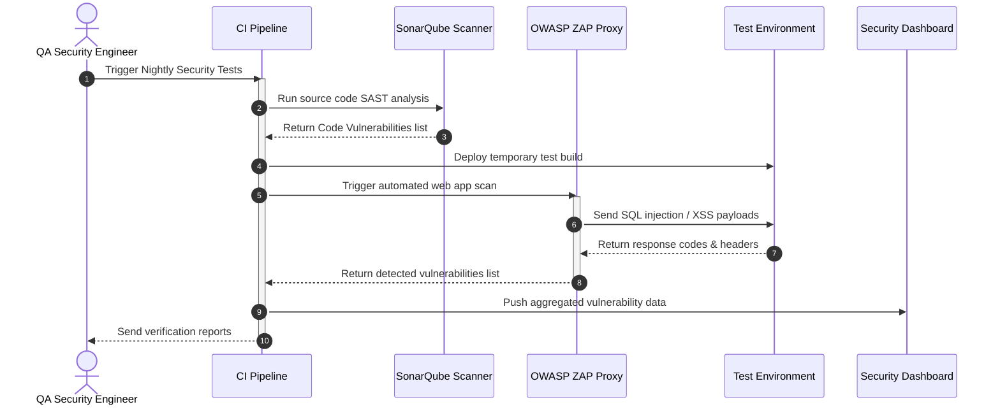
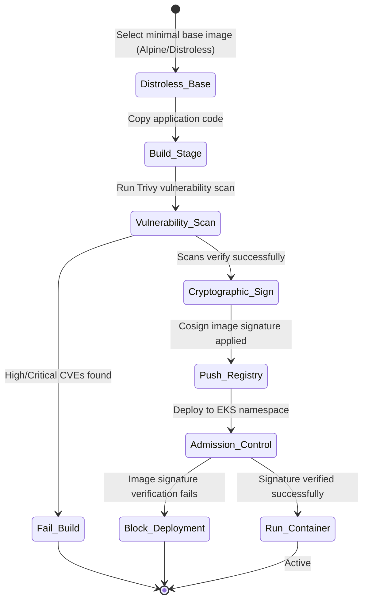
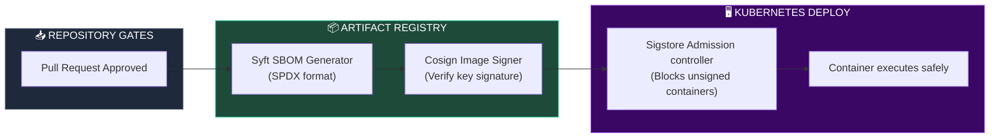

# APPLICATION SECURITY, SECURE SDLC & DEVSECOPS ARCHITECTURE

**Project Name:** Enterprise SaaS Business Management Platform  
**Document Version:** 1.0.0 — Baseline Standard  
**Date:** July 14, 2026  
**Authors:** Principal Application Security Architect, DevSecOps Engineer, Secure Software Development Specialist, Cloud Security Engineer, Software Supply Chain Security Expert & Enterprise SaaS Security Architect  
**Classification:** Enterprise Internal — Restricted (CI/CD Sensitive)  
**Status:** 🔒 APPROVED APPLICATION SECURITY, SECURE SDLC & DEVSECOPS SPECIFICATION  

---

## TABLE OF CONTENTS

| Section | Title | Description |
| :---: | :--- | :--- |
| **§1** | [Secure SDLC Foundation](#section-1--secure-sdlc-foundation) | Shift-left security strategy, legacy vs. secure SDLC models |
| **§2** | [DevSecOps Culture](#section-2--devsecops-culture) | Shared responsibilities, security advocates, engineering loops |
| **§3** | [Application Security Architecture](#section-3--application-security-architecture) | Input/Output sanitizers, JWT auth verification, schema filters |
| **§4** | [Secure Coding Standard](#section-4--secure-coding-standard) | OWASP Top 10 mitigations, strict error handling, no secrets policy |
| **§5** | [Source Code Security](#section-5--source-code-security) | PR branch protections, Semgrep config maps, SonarQube gates |
| **§6** | [Software Composition Analysis](#section-6--software-composition-analysis) | Dependency scanners, Snyk configs, license compliance checks |
| **§7** | [CI/CD Security Pipeline](#section-7--cicd-security-pipeline) | Secure GitHub Actions, container scans, and Mermaid flow |
| **§8** | [Secret Management](#section-8--secret-management) | Vault cluster injection, rotation timers, OIDC cloud identity |
| **§9** | [Container Security](#section-9--container-security) | Minimal base distroless images, Trivy vulnerability audits |
| **§10** | [Kubernetes Security](#section-10--kubernetes-security) | RBAC access limits, Istio mTLS boundaries, network policy specs |
| **§11** | [Security Testing](#section-11--security-testing) | SAST, DAST, IAST, penetration testing, security regression gates |
| **§12** | [API Security Testing](#section-12--api-security-testing) | Webhook verifications, token injection tests, OWASP ZAP sweeps |
| **§13** | [Mobile Application Security](#section-13--mobile-application-security) | React Native: secure Keychain storage, certificate pinning, proguard |
| **§14** | [Software Supply Chain Security](#section-14--software-supply-chain-security) | SBOM inventory, cosign binary signatures, artifact verifications |
| **§15** | [Security Automation](#section-15--security-automation) | CI automation rules, fail-fast parameters, quality threshold rules |
| **§16** | [Security Monitoring](#section-16--security-monitoring) | Falco alerts, pipeline breach checks, runtime intrusion captures |
| **§17** | [DevSecOps Tool Stack](#section-17--devsecops-tool-stack) | Security stack matrix: Snyk, Trivy, ZAP, GitHub configurations |
| **§18** | [Security Metrics](#section-18--security-metrics) | KPI dashboards: Mean Time to Patch (MTTP), code coverage metrics |
| **§19** | [DevSecOps Maturity Roadmap](#section-19--devsecops-maturity-roadmap) | Vision: basic static checks → automated triggers → AI threat analysis |
| **§20** | [Final DevSecOps Architecture](#section-20--final-devsecops-architecture) | 5 comprehensive technical Mermaid DevSecOps pipelines |

---

## SECTION 1 — SECURE SDLC FOUNDATION

### 1.1 Shift-Left Security Philosophy
Rather than treating security as a final phase before deployment, the platform integrates security checks into every phase of the software development lifecycle:
*   **Traditional SDLC:** Security review happens at the end, leading to late bug detection and launch delays.
*   **Secure SDLC:** Security requirements are defined at the planning stage, checked during coding, and validated automatically in CI/CD pipelines.

```
THE SHIFT-LEFT PIPELINE
═══════════════════════════════════════════════════════════════════════════════
Plan & Design ──► Secure Coding ──► Static Scans (SAST) ──► Container Check ──► Deploy
  (Threat Model)   (Argon2/mTLS)    (Semgrep/Snyk)        (Trivy scanner)   (Verify OPA)
═══════════════════════════════════════════════════════════════════════════════
```

---

## SECTION 2 — DEVSECOPS CULTURE

### 2.1 Shared Responsibility Topologies
*   **Developers:** Responsible for secure coding practices and resolving vulnerability alerts.
*   **Security Team:** Defines security policies and designs verification tools.
*   **Operations Team:** Manages secure runtime environments and deployments.

---

## SECTION 3 — APPLICATION SECURITY ARCHITECTURE

### 3.1 Protection Layers
*   **Frontend (Next.js):** Enforces Content Security Policies (CSP) to mitigate cross-site scripting (XSS).
*   **Backend (NestJS):** Validates and sanitizes all incoming payloads.
*   **Database (PostgreSQL):** Restricts access to data using tenant-specific row-level security (RLS).

---

## SECTION 4 — SECURE CODING STANDARD

### 4.1 Vulnerability Mitigation Standards
*   **Injection Prevention:** Enforces parameterized queries and schema validations on all database writes.
*   **Error Handling:** Prevents stack traces from leaking database schemas to clients.
*   **Secret Management:** Blocks hardcoded credentials. All secrets must be loaded dynamically.

---

## SECTION 5 — SOURCE CODE SECURITY

### 5.1 Branch Protections & Static Scans
The platform uses branch protection rules to enforce security policies:
*   **Branch Protections:** Blocks direct commits to master branches. Merge actions require approvals from the security lead.
*   **Static Scans:** Enforces Semgrep scans on every pull request to catch common vulnerabilities.

```yaml
# .github/workflows/semgrep.yaml
name: Semgrep Static Analysis
on:
  pull_request:
    branches: [ master, develop ]
jobs:
  semgrep:
    runs-on: ubuntu-latest
    steps:
      - name: Checkout Code
        uses: actions/checkout@v4
      - name: Run Semgrep Scan
        run: |
          docker run --rm -v "${{ github.workspace }}:/src" returntocorp/semgrep semgrep ci \
            --config=auto \
            --fail-on-severity=ERROR
```

---

## SECTION 6 — SOFTWARE COMPOSITION ANALYSIS (SCA)

### 6.1 Third-Party Dependency Auditing
*   **Snyk Scanning:** Automated Snyk scans check third-party libraries for vulnerabilities on every build.
*   **License Checks:** Blocks GPL-licensed packages to protect intellectual property.

---

## SECTION 7 — CI/CD SECURITY PIPELINE

### 7.1 Secure Pipeline Execution
Every commit triggers an automated build pipeline that runs security checks before deploying code.

```
THE CI/CD SECURITY GATES
═══════════════════════════════════════════════════════════════════════════════
 Developer Commit ──► SAST / SCA Scans ──► Container Vuln Scan ──► Deploy to K8s
    (GitHub PR)         (Snyk/Semgrep)          (Trivy run)         (Verify Cosign)
═══════════════════════════════════════════════════════════════════════════════
```

---

## SECTION 8 — SECRET MANAGEMENT

### 8.1 Vault Integration & OIDC Authentication
*   **HashiCorp Vault Integration:** Dynamic secret injection secures application database credentials.
*   **OIDC Auth:** CI pipelines use OpenID Connect (OIDC) to authenticate with cloud resources, removing the need for static access keys.

---

## SECTION 9 — CONTAINER SECURITY

### 9.1 Base Images & Vulnerability Scans
*   **Minimal Base Images:** Applications deploy on distroless or minimal Alpine base images to reduce the attack surface.
*   **Trivy Scanning:** The CI pipeline runs Trivy to scan built images for vulnerabilities.

```yaml
# .github/workflows/trivy-scan.yaml
name: Trivy Container Vulnerability Scan
on:
  push:
    branches: [ master ]
jobs:
  trivy:
    runs-on: ubuntu-latest
    steps:
      - name: Checkout Code
        uses: actions/checkout@v4
      - name: Build Local Image
        run: docker build -t saas-platform/backend:latest .
      - name: Run Trivy Scan
        uses: aquasecurity/trivy-action@master
        with:
          image-ref: 'saas-platform/backend:latest'
          format: 'table'
          exit-code: '1' # Fails build if HIGH or CRITICAL vulnerabilities are found
          severity: 'HIGH,CRITICAL'
```

---

## SECTION 10 — KUBERNETES SECURITY

### 10.1 Cluster Security
*   **Pod Isolation:** Enforces pod security standards to block root privileges (`readOnlyRootFilesystem: true`).
*   **Network Policies:** Blocks traffic between namespaces (e.g., frontend pods cannot communicate directly with databases).

---

## SECTION 11 — SECURITY TESTING

### 11.1 Verification Methods
*   **Static Application Security Testing (SAST):** Scans source code repositories (SonarQube/CodeQL).
*   **Dynamic Application Security Testing (DAST):** Runs automated OWASP ZAP sweeps against test environments.

---

## SECTION 12 — API SECURITY TESTING

### 12.1 Gateway Validations
*   **Rate Limits:** Redis sliding-window limiters protect endpoints from DDoS and brute force attacks.
*   **Request Validation:** Schema checks verify that incoming payloads conform to configurations defined in the OpenAPI spec.

---

## SECTION 13 — MOBILE APPLICATION SECURITY

### 13.1 React Native App Protections
*   **Secure Storage:** Stores sensitive keys in iOS Keychain and Android Keystore.
*   **Certificate Pinning:** Protects API communications from Man-in-the-Middle (MITM) attacks by pinning SSL certificates.

---

## SECTION 14 — SOFTWARE SUPPLY CHAIN SECURITY

### 14.1 Software Bill of Materials (SBOM)
The build pipeline generates a Software Bill of Materials (SBOM) for audit compliance.
*   **Cosign Signing:** Container images are cryptographically signed with Cosign before deployment to verify image origin.

```bash
# Generate SBOM (SPDX format)
syft packages saas-platform/backend:latest -o spdx-json=sbom.json

# Sign container image
cosign sign --key cosign.key saas-platform/backend:latest
```

---

## SECTION 15 — SECURITY AUTOMATION

### 15.1 Pipeline Quality Gates
*   **Automated Quality Gates:** Builds are aborted if security scans identify any unresolved high-severity vulnerabilities.

---

## SECTION 16 — SECURITY MONITORING

### 16.1 Runtime Threat Detection
*   **Intrusion Detection:** Falco checks container behaviors for unauthorized activities (e.g., write attempts to bin directories).

---

## SECTION 17 — DEVSECOPS TOOL STACK

### 17.1 Security Tool Stack

| Category | Tool | Production Purpose | System Owner |
| :--- | :--- | :--- | :--- |
| **SCA Scan** | Snyk / Dependabot | Audits third-party library dependencies. | Security Lead |
| **SAST Engine** | SonarQube / CodeQL | Scans source code for vulnerability patterns. | QA Lead |
| **Image Auditing** | Trivy | Scans built container images for CVEs. | Platform SRE |
| **DAST Tool** | OWASP ZAP | Scans endpoints in test environments. | Security Architect |
| **Intrusion Detection** | Falco | Runtime container behavior monitoring. | Operations Lead |
| **Image Signing** | Cosign | Cryptographically signs built container images. | DevOps Engineer |

---

## SECTION 20 — FINAL DEVSECOPS ARCHITECTURE

### 20.1 Secure SDLC Pipeline



### 20.2 DevSecOps CI/CD Architecture



### 20.3 Security Testing Flow



### 20.4 Container Security Architecture



### 20.5 Software Supply Chain Security



---

## DOCUMENT METADATA

| Field | Value |
| :--- | :--- |
| **Document ID** | SAAS-DEVSEC-018.3 |
| **Section** | 18 — Security Architecture |
| **Subsection** | 18.3 — Secure SDLC & DevSecOps |
| **Status** | 🔒 APPROVED |
| **Version** | 1.0.0 |
| **Date** | July 14, 2026 |
| **Next Review** | January 14, 2027 |
| **Related Documents** | [Zero Trust Foundation](../18.1-Zero-Trust-Foundation/Zero-Trust-Foundation.md) · [IAM & Authentication](../18.2-IAM-SSO-Authentication/IAM-SSO-Authentication.md) · [CI/CD Release Management](../../15-Cloud-Infrastructure/15.4-CICD-GitOps-Release-Management/CICD-GitOps-Release-Management.md) |
| **Technology Versions** | Semgrep v1.68 · Trivy v0.50 · Cosign v2.2 · SonarQube v10.4 |

---

*This document is the authoritative specification for all application security, secure SDLC, and DevSecOps architecture decisions in the SaaS Business Management Platform. All static scanners, composition analysis engines, container build configurations, secrets rotations, SBOM generators, and pipeline quality gates must conform to the standards defined herein.*
