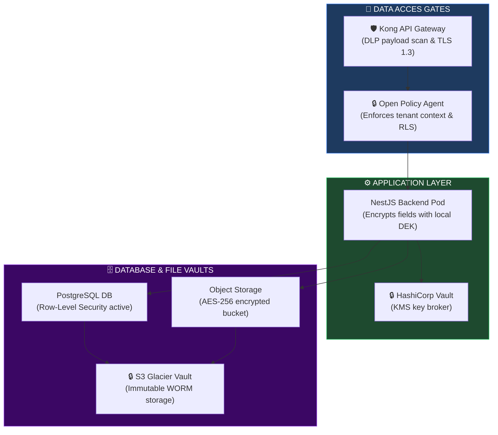
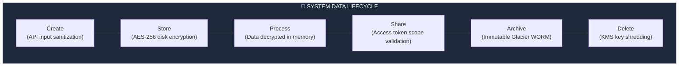
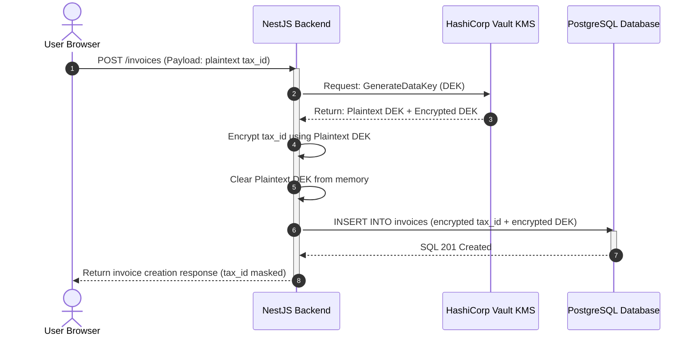
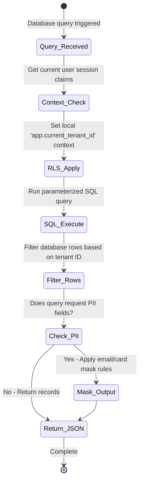
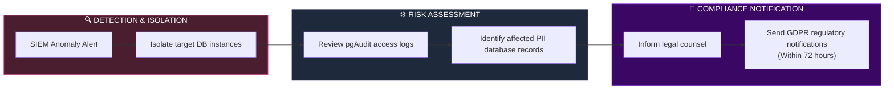

# DATA SECURITY, PRIVACY & ENTERPRISE COMPLIANCE ARCHITECTURE

**Project Name:** Enterprise SaaS Business Management Platform  
**Document Version:** 1.0.0 — Baseline Standard  
**Date:** July 14, 2026  
**Authors:** Principal Data Security Architect, Privacy Engineer, Enterprise Compliance Architect, Cloud Security Specialist, Data Governance Expert & SaaS Security Architect  
**Classification:** Enterprise Internal — Restricted (Data Critical)  
**Status:** 💾 APPROVED DATA SECURITY, PRIVACY & ENTERPRISE COMPLIANCE SPECIFICATION  

---

## TABLE OF CONTENTS

| Section | Title | Description |
| :---: | :--- | :--- |
| **§1** | [Data Security Foundation](#section-1--data-security-foundation) | Data lifecycle phases, protection metrics, collection to disposal |
| **§2** | [Data Classification Model](#section-2--data-classification-model) | Data sensitivity classes: Public, Internal, Confidential, Highly Sensitive |
| **§3** | [Data Governance Architecture](#section-3--data-governance-architecture) | Roles: Owner, Steward, Security, SRE and Mermaid org map |
| **§4** | [Data Encryption Architecture](#section-4--data-encryption-architecture) | Cryptographic drivers: KMS, database cell masking, TLS 1.3 |
| **§5** | [Key Management System](#section-5--key-management-system) | Envelope encryption, KMS policies, automatic key rotators |
| **§6** | [Database Security](#section-6--database-security) | PostgreSQL security configurations, row-level security (RLS) policies |
| **§7** | [Multi-Tenant Data Isolation](#section-7--multi-tenant-data-isolation) | Database topologies compared: shared DB vs. schemas vs. separate DBs |
| **§8** | [Data Access Governance](#section-8--data-access-governance) | Dynamic RBAC/ABAC access verifications, OPA audit evaluations |
| **§9** | [Privacy Architecture](#section-9--privacy-architecture) | Consent management engines, right-to-be-forgotten deletion workflows |
| **§10** | [Personal Data Protection](#section-10--personal-data-protection) | Data anonymization algorithms, masking rules, PII tokenizers |
| **§11** | [Data Loss Prevention](#section-11--data-loss-prevention) | Egress checkers, file export limits, OCR scanners |
| **§12** | [Backup Security](#section-12--backup-security) | WORM-configured backups, immutable storage, point-in-time recoveries |
| **§13** | [Audit Logging](#section-13--audit-logging) | Audit trails, schema modifications logs, read activities captures |
| **§14** | [Compliance Framework](#section-14--compliance-framework) | Standards mappings: SOC 2 Type II, ISO 27001, GDPR, and PCI DSS |
| **§15** | [Data Retention Policy](#section-15--data-retention-policy) | Retention parameters: financial ledgers, system logs, user accounts |
| **§16** | [Data Security Tool Stack](#section-16--data-security-tool-stack) | Security stack tools: AWS KMS, pgAudit, Vault, DLP engines |
| **§17** | [Data Security Monitoring](#section-17--data-security-monitoring) | Query anomaly check metrics, Loki log aggregators, alert triggers |
| **§18** | [Incident Response](#section-18--incident-response) | Data breach playbooks: containment steps, legal notification timelines |
| **§19** | [Data Security Maturity Roadmap](#section-19--data-security-maturity-roadmap) | Vision: encryption baseline → automated data governance |
| **§20** | [Final Data Security Architecture](#section-20--final-data-security-architecture) | 5 comprehensive technical Mermaid data flowcharts |

---

## SECTION 1 — DATA SECURITY FOUNDATION

### 1.1 Data Lifecycle Requirements
Protecting enterprise data requires defining security standards for each phase of the data lifecycle:
1.  **Create:** Authenticate user inputs and sanitize data at the API gateway.
2.  **Store:** Encrypt data at rest using AES-256 and isolate database volumes.
3.  **Process:** Decrypt data in memory using TLS-terminated runtimes.
4.  **Share:** Enforce scopes, validate signatures, and log all data transfers.
5.  **Archive:** Store compressed database snapshots in immutable bucket vaults.
6.  **Delete:** Cryptographically shred encryption keys to render archived data unreadable.

---

## SECTION 2 — DATA CLASSIFICATION MODEL

### 2.1 Sensitivity Tiers
*   **Public:** Non-sensitive data (e.g., store directories, public product catalogs).
*   **Internal:** Core operations data (e.g., standard inventory levels).
*   **Confidential:** Business-critical data (e.g., sales reports, customer contact details).
*   **Highly Sensitive:** Regulated data (e.g., password hashes, payment details, PII).

---

## SECTION 3 — DATA GOVERNANCE ARCHITECTURE

### 3.1 Data Governance Roles
*   **Data Owner:** Business unit leader who defines access policies.
*   **Data Steward:** Data manager who configures database tags and schemas.
*   **Security Team:** Audits database configurations and rotates KMS keys.

```
DATA GOVERNANCE FLOW
═══════════════════════════════════════════════════════════════════════════════
  [ Data Owner ] ──► (Defines Access Policies)
         │
         ▼
 [ Data Steward ] ──► (Applies Data Class Tags & Schemas)
         │
         ▼
 [ Security Team ] ──► (Audits Access Controls & Key Rotations)
═══════════════════════════════════════════════════════════════════════════════
```

---

## SECTION 4 — DATA ENCRYPTION ARCHITECTURE

### 4.1 Encryption Standards
*   **Encryption in Transit:** Enforces TLS 1.3 with secure cipher suites (e.g., ECDHE-RSA-AES256-GCM-SHA384).
*   **Encryption at Rest:** Enforces AES-256 encryption on database volumes and storage buckets.
*   **Encryption in Use:** Encrypts sensitive fields (e.g., tax IDs) at the application layer before writing them to the database.

---

## SECTION 5 — KEY MANAGEMENT SYSTEM

### 5.1 Envelope Encryption
The platform uses envelope encryption to secure sensitive data:
1.  **Data Encryption Key (DEK):** Encrypts data fields locally.
2.  **Key Encrypting Key (KEK):** Enclosed inside KMS to encrypt the DEK.

```yaml
# configs/security/kms-key-policy.yaml
KmsKeyPolicy:
  Version: "2012-10-17"
  Statement:
    - Sidebar: "Allow Admin Access"
      Effect: "Allow"
      Principal:
        AWS: "arn:aws:iam::123456789012:role/SecurityAdmin"
      Action: "kms:*"
      Resource: "*"
    - Sidebar: "Allow Backend Encryption Service Use"
      Effect: "Allow"
      Principal:
        AWS: "arn:aws:iam::123456789012:role/saas-backend-pod-role"
      Action:
        - "kms:Encrypt"
        - "kms:Decrypt"
        - "kms:GenerateDataKey"
      Resource: "*"
```

---

## SECTION 6 — DATABASE SECURITY

### 6.1 PostgreSQL Protections
*   **Row-Level Security (RLS):** Prevents tenants from accessing other tenants' data.

```sql
-- database/migrations/v2_row_level_security.sql
-- Enable RLS on core orders database
ALTER TABLE orders ENABLE ROW LEVEL SECURITY;

-- Create policy restricting access by tenant ID
CREATE POLICY tenant_isolation_policy ON orders
    FOR ALL
    USING (tenant_id = current_setting('app.current_tenant_id'))
    WITH CHECK (tenant_id = current_setting('app.current_tenant_id'));
```

---

## SECTION 7 — MULTI-TENANT DATA ISOLATION

### 7.1 Database Topologies Compared

| Model | Security Level | Operational Cost | Performance Scaling |
| :--- | :--- | :--- | :--- |
| **Shared DB (RLS)** | Medium | Low | High (Shared resource pools). |
| **Separate Schemas**| High | Medium | Medium (Larger migrations). |
| **Separate Databases**| Absolute | High | Low (Resource overhead). |

---

## SECTION 8 — DATA ACCESS GOVERNANCE

### 8.1 Least Privilege Policy Validation
Access requests are validated by Open Policy Agent (OPA) before querying data:
*   Users must have the required scopes to read or write data.
*   Administrative access requires double-authorization and approval.

---

## SECTION 9 — PRIVACY ARCHITECTURE

### 9.1 GDPR / CCPA Deletion (Right to be Forgotten)
When a user requests deletion of their personal data, the platform triggers a secure deletion workflow:
1.  Locate all instances of the user's PII across database tables.
2.  Overwrite identified records with anonymized placeholders.
3.  Log the deletion event for compliance audits.

---

## SECTION 10 — PERSONAL DATA PROTECTION

### 10.1 Data Masking & Tokenization
Sensitive data fields are masked or tokenized before being returned to client applications.

```typescript
// backend/src/security/privacy/masking.service.ts
import { Injectable } from '@nestjs/common';

@Injectable()
export class DataMaskingService {
  // Mask sensitive credit card numbers (leaving only the last 4 digits visible)
  maskCreditCard(cardNumber: string): string {
    if (!cardNumber || cardNumber.length < 4) {
      return '****';
    }
    const lastFour = cardNumber.slice(-4);
    return `****-****-****-${lastFour}`;
  }

  // Mask PII email addresses
  maskEmail(email: string): string {
    const [name, domain] = email.split('@');
    if (name.length <= 2) {
      return `*@${domain}`;
    }
    return `${name[0]}***${name[name.length - 1]}@${domain}`;
  }
}
```

---

## SECTION 11 — DATA LOSS PREVENTION (DLP)

### 11.1 Egress Scanners
*   **Egress Scanners:** WAF rules block responses that contain patterns matching sensitive data formats (e.g., credit card numbers, tax IDs).
*   **Download Limits:** Restricts bulk CSV exports to 1,000 records per user request.

---

## SECTION 12 — BACKUP SECURITY

### 12.1 Backup Strategy
*   **Immutable Backups:** Database backups are stored in WORM-compliant storage buckets to prevent tampering or deletion.
*   **Backup Encryption:** Backups are encrypted using customer-managed KMS keys.

---

## SECTION 13 — AUDIT LOGGING

### 13.1 Audit Trails
*   **pgAudit Integration:** Records all database queries and schema modifications.
*   **Immutable Logging:** Logs are forwarded to a secure log collector and stored in immutable storage.

---

## SECTION 14 — COMPLIANCE FRAMEWORK

### 14.1 Compliance Controls
*   **SOC 2 Type II:** Audits data access logs, encryption configurations, and security policies.
*   **GDPR:** Enforces data minimization, consent management, and the right to be forgotten.
*   **PCI DSS:** Restricts payment card processing. All card data is tokenized using Stripe integration.

---

## SECTION 15 — DATA RETENTION POLICY

### 15.1 Retention Parameters
*   **Financial Records:** Retained for 7 years to meet tax compliance requirements.
*   **System Logs:** Retained for 1 year for security analysis.
*   **User Data:** Retained for the duration of the active subscription, then deleted after 30 days.

---

## SECTION 16 — DATA SECURITY TOOL STACK

### 16.1 Data Protection Tools

| Category | Tool | Production Purpose | System Owner |
| :--- | :--- | :--- | :--- |
| **KMS Provider** | AWS KMS / Vault | Key management and rotation. | Security Lead |
| **Database Audit** | pgAudit | Logs queries and database admin actions. | Lead DBA |
| **DLP Scanner** | Nightfall | Scans outgoing traffic for sensitive PII data. | SecOps Lead |
| **Log Storage** | AWS S3 Glacier Vault| Stores audit logs in immutable WORM format. | Platform SRE |
| **Database Security**| pg_anon | PostgreSQL data masking and anonymization. | Data Steward |

---

## SECTION 20 — FINAL DATA SECURITY ARCHITECTURE

### 20.1 Data Security Architecture



### 20.2 Data Lifecycle Protection



### 20.3 Encryption Architecture



### 20.4 Data Access Control Flow



### 20.5 Data Breach Response Process



---

## DOCUMENT METADATA

| Field | Value |
| :--- | :--- |
| **Document ID** | SAAS-DATASEC-018.4 |
| **Section** | 18 — Security Architecture |
| **Subsection** | 18.4 — Data Security & Compliance |
| **Status** | 💾 APPROVED |
| **Version** | 1.0.0 |
| **Date** | July 14, 2026 |
| **Next Review** | January 14, 2027 |
| **Related Documents** | [Zero Trust Foundation](../18.1-Zero-Trust-Foundation/Zero-Trust-Foundation.md) · [IAM & Authentication](../18.2-IAM-SSO-Authentication/IAM-SSO-Authentication.md) · [Database Design](../../02-System-Design/03-Database-Design.md) |
| **Technology Versions** | PostgreSQL v16 · OpenSSL v3.1 · AWS KMS v2 |

---

*This document is the authoritative specification for all data security, privacy protection, and enterprise compliance architecture decisions in the SaaS Business Management Platform. All database schemas, encryption algorithms, KMS envelope flows, RLS policies, data anonymization services, and audit trails must conform to the standards defined herein.*
