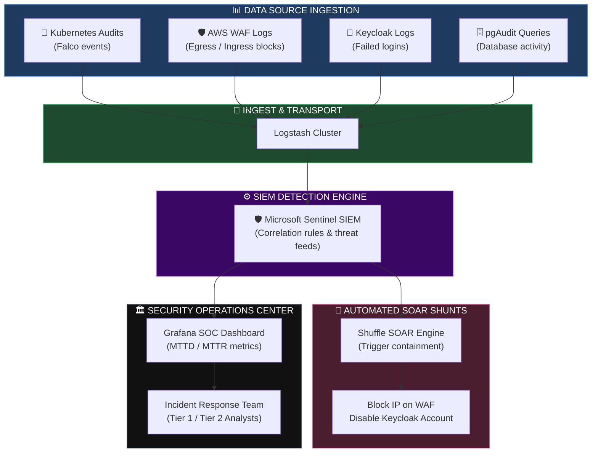
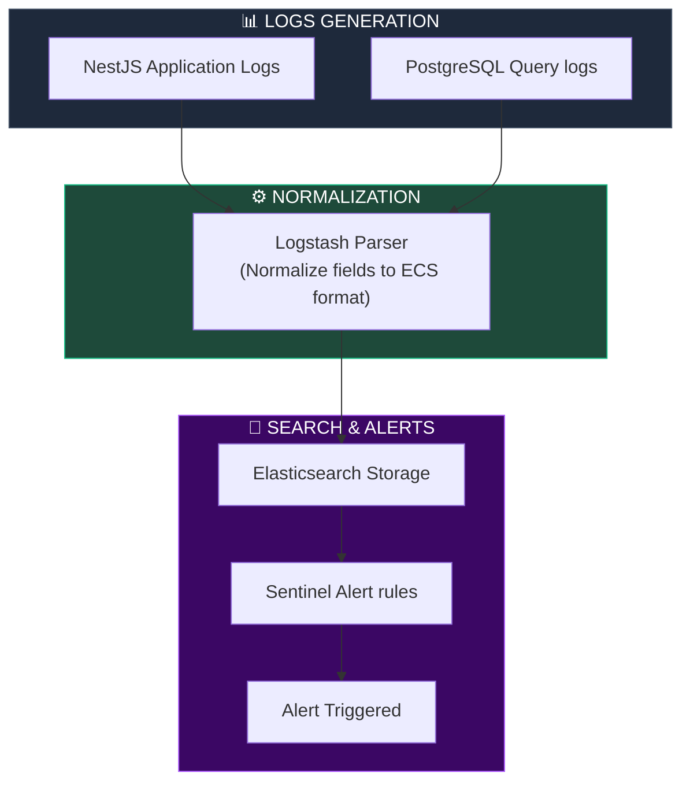
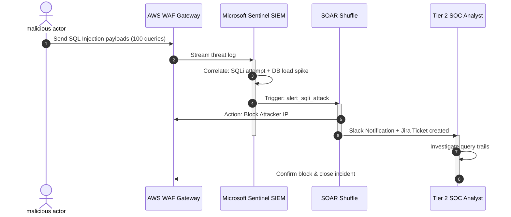
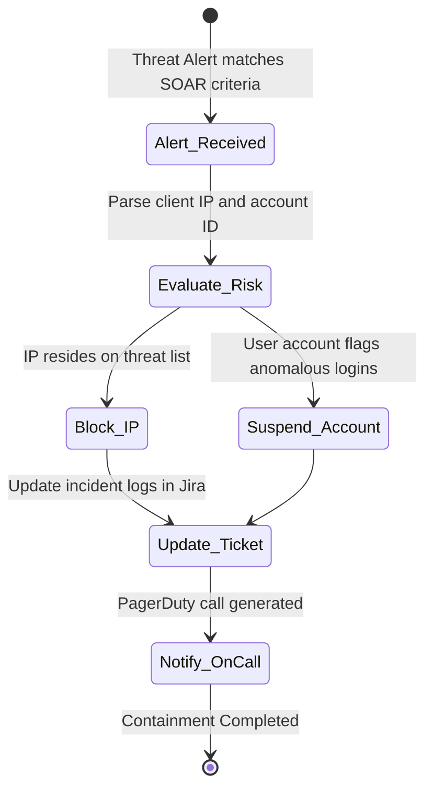
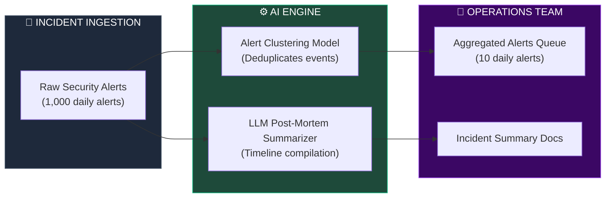

# SECURITY OPERATIONS CENTER (SOC), SIEM & CONTINUOUS MONITORING ARCHITECTURE

**Project Name:** Enterprise SaaS Business Management Platform  
**Document Version:** 1.0.0 — Baseline Standard  
**Date:** July 14, 2026  
**Authors:** Principal Security Operations Architect, SOC Architect, SIEM Engineer, Threat Intelligence Specialist, Incident Response Expert & Enterprise SaaS Security Architect  
**Classification:** Enterprise Internal — Restricted (SOC Sensitive)  
**Status:** 🚨 APPROVED SOC, SIEM & CONTINUOUS THREAT MONITORING ARCHITECTURE SPECIFICATION  

---

## TABLE OF CONTENTS

| Section | Title | Description |
| :---: | :--- | :--- |
| **§1** | [SOC Foundation](#section-1--soc-foundation) | Shift from prevention-only to continuous detection and response |
| **§2** | [SOC Organization Model](#section-2--soc-organization-model) | Security analyst levels, threat hunters, incident handlers, and org chart |
| **§3** | [Security Monitoring Architecture](#section-3--security-monitoring-architecture) | Logs ingest routes, correlation, alerts triggers, and topology |
| **§4** | [SIEM Architecture](#section-4--siem-architecture) | Normalized data pipelines, Sentinel vs. Splunk vs. Wazuh |
| **§5** | [Log Management](#section-5--log-management) | Central log collection configurations (app, DB, Kubernetes, cloud) |
| **§6** | [Threat Detection](#section-6--threat-detection) | Detection patterns: brute force, data exfiltration, privilege escalation |
| **§7** | [Security Analytics](#section-7--security-analytics) | Correlation rules, behavioral heuristics, threshold triggers |
| **§8** | [Threat Intelligence](#section-8--threat-intelligence) | Threat feed integrations (TAXII/STIX), indicators of compromise (IOCs) |
| **§9** | [Incident Response](#section-9--incident-response) | IR Lifecycle: triage, containment actions, root cause reviews |
| **§10** | [Security Automation (SOAR)](#section-10--security-automation-soar) | Dynamic SOAR playbooks, automated firewall blocks, account suspensions |
| **§11** | [Vulnerability Management](#section-11--vulnerability-management) | Scans, asset discovery, CVE risk ranking, remediation |
| **§12** | [Cloud Security Monitoring](#section-12--cloud-security-monitoring) | EKS audits, container system calls, IAM policy changes |
| **§13** | [Application Security Monitoring](#section-13--application-security-monitoring) | NestJS validation failures monitoring, WAF logs, API abuses |
| **§14** | [AI Security Operations](#section-14--ai-security-operations) | ML-driven alert clustering, AI-assisted incident summarizers |
| **§15** | [Security Dashboard](#section-15--security-dashboard) | Critical dashboard metrics: MTTD, MTTR, vulnerability status |
| **§16** | [SOC Tool Stack](#section-16--soc-tool-stack) | Security monitoring tooling matrix: Wazuh, Sentinel, Falco, Loki |
| **§17** | [Security Compliance Monitoring](#section-17--security-compliance-monitoring) | Real-time policy audits, configuration drifts, IAM review triggers |
| **§18** | [Security Metrics](#section-18--security-metrics) | Operations KPIs, false positive ratios, remediation timelines |
| **§19** | [SOC Maturity Roadmap](#section-19--soc-roadmap) | Roadmap: basic logging → automated SOAR playbooks → autonomous SOC |
| **§20** | [Final SOC Architecture](#section-20--final-soc-architecture) | 5 comprehensive technical Mermaid SOC flowcharts |

---

## SECTION 1 — SOC FOUNDATION

### 1.1 Shift-Left Security Philosophy
Perimeter security alone is insufficient to protect cloud-native, multi-tenant SaaS environments. The platform adopts a modern Security Operations Center (SOC) framework focused on continuous detection, response, and containment:
*   **Traditional Security:** Relies on firewalls and basic access controls to prevent attacks.
*   **Modern SOC:** Assumes breach, continuously detects anomalies, responds using automated playbooks, and iterates to improve defenses.

```
THE SOC OPERATIONAL LOOP
═══════════════════════════════════════════════════════════════════════════════
  [ Prevent ] ──► [ Detect ] ──► [ Respond ] ──► [ Improve & Harden ]
       ▲                                                 │
       └─────────────────────────────────────────────────┘
═══════════════════════════════════════════════════════════════════════════════
```

---

## SECTION 2 — SOC ORGANIZATION MODEL

### 2.1 Staffing Topologies
*   **Tier 1 Analyst:** Triage and alert verification.
*   **Tier 2 Analyst:** Incident response and threat mitigation.
*   **Tier 3 Analyst:** Threat hunting and root cause analysis.
*   **Security Engineers:** Maintain SIEM configurations, Wazuh rules, and SOAR integrations.

---

## SECTION 3 — SECURITY MONITORING ARCHITECTURE

### 3.1 The Detection and Response Pipeline
The platform aggregates telemetry across all layers (infrastructure, databases, identity systems) into a centralized SIEM to correlate events.

```
THE DETECTION PIPELINE
═══════════════════════════════════════════════════════════════════════════════
 [ Logs Ingestion ] ──► [ Logstash / FluentBit ] ──► [ Central SIEM ]
        ▲                                                 │
        │                                                 ▼ (Correlation Engine)
  App & DB Pods                                    [ Alerts Trigger ]
═══════════════════════════════════════════════════════════════════════════════
```

---

## SECTION 4 — SIEM ARCHITECTURE

### 4.1 Deployment Topologies
*   **Microsoft Sentinel:** Used for enterprise cloud logging and third-party SaaS integrations.
*   **Wazuh:** Open-source agent deployed on Kubernetes worker nodes to monitor runtime processes and system calls.

---

## SECTION 5 — LOG MANAGEMENT

### 5.1 Centralized Logging Strategy
*   **Aggregation:** FluentBit agents aggregate container logs and stream them to centralized Elasticsearch pools.
*   **Access Audits:** pgAudit logs all PostgreSQL database actions. Keycloak logs all authentication events.

---

## SECTION 6 — THREAT DETECTION

### 6.1 Attack Patterns
*   **Brute Force Logins:** Multiple failed login attempts from a single IP address within 60 seconds.
*   **Data Exfiltration:** Large database reads followed by large outgoing HTTP transfers.
*   **Privilege Escalation:** Unauthorized attempts to write to administrative configuration paths.

---

## SECTION 7 — SECURITY ANALYTICS

### 7.1 SIEM Correlation Rules
The platform uses correlation rules to identify potential attacks from disjointed logs.

```json
// configs/siem/correlation-rules.json
{
  "rule_id": "rule_brute_force_exfiltration",
  "rule_name": "Brute Force Followed by Data Exfiltration",
  "severity": "CRITICAL",
  "conditions": {
    "step_1": {
      "source": "keycloak",
      "event": "LOGIN_FAILED",
      "threshold_count": 10,
      "time_window_seconds": 60,
      "group_by": "client_ip"
    },
    "step_2": {
      "source": "postgresql",
      "event": "LARGE_QUERY_SELECT",
      "threshold_bytes": 100000000,
      "time_window_seconds": 300,
      "match_on": "client_ip"
    }
  },
  "actions": [
    "trigger_soar_playbook_block_ip",
    "create_jira_incident_ticket"
  ]
}
```

---

## SECTION 8 — THREAT INTELLIGENCE

### 8.1 Feed Integrations
*   **Feed Ingestion:** Threat feeds update the SIEM daily with known malicious IPs, malware signatures, and compromised domains.
*   **Automated Scans:** Incoming connections from flagged IPs are blocked automatically.

---

## SECTION 9 — INCIDENT RESPONSE

### 9.1 The Incident Lifecycle
1.  **Detection:** Threat detected by SIEM correlation rules.
2.  **Triage:** Security analyst verifies the alert severity.
3.  **Containment:** Automated SOAR playbooks block the attacker's IP and disable the compromised user account.
4.  **Eradication:** Platform engineers patch the vulnerability and rotate compromised keys.
5.  **Recovery:** Restore compromised services from immutable backups.
6.  **Lessons Learned:** Update detection rules and post-mortem reports.

---

## SECTION 10 — SECURITY AUTOMATION (SOAR)

### 10.1 SOAR Containment Playbooks
The platform uses **SOAR (Security Orchestration, Automation, and Response)** to automate incident containment.

```yaml
# configs/soar/playbooks/block-attacker.yaml
playbook:
  id: "soar-block-attacker"
  trigger: "alert_brute_force_exfiltration"
  actions:
    - name: "Block IP"
      service: "aws-waf-client"
      action: "block_ip"
      params:
        ip_address: "${trigger.client_ip}"
        duration_hours: 24
    - name: "Suspend Account"
      service: "keycloak-client"
      action: "disable_user"
      params:
        user_id: "${trigger.user_id}"
    - name: "Log Ticket"
      service: "jira-client"
      action: "create_ticket"
      params:
        summary: "CRITICAL: Automated Block Triggered on IP ${trigger.client_ip}"
```

---

## SECTION 11 — VULNERABILITY MANAGEMENT

### 11.1 Continuous Scanning Lifecycle
*   **Automated Scans:** Weekly dependency checks scan all microservice repositories for CVE vulnerabilities.
*   **Remediation:** Critical vulnerabilities must be patched within 48 hours; high vulnerabilities must be patched within 7 days.

---

## SECTION 12 — CLOUD SECURITY MONITORING

### 12.1 Infrastructure Threat Scans
*   **Runtime Audits:** Falco monitors container workloads for unauthorized behavior (e.g., shell executions inside application pods).
*   **CloudTrail Logs:** Tracks administrative changes to cloud infrastructure.

---

## SECTION 13 — APPLICATION SECURITY MONITORING

### 13.1 App Threat Scans
*   **API Gateway Scans:** WAF logs are analyzed for SQL injection and cross-site scripting (XSS) patterns.
*   **Abuse Detection:** Monitored metrics track anomalous spikes in rate-limited endpoints.

---

## SECTION 14 — AI SECURITY OPERATIONS

### 14.1 ML-Driven Operations
*   **Alert Deduplication:** Machine learning models group redundant alerts to reduce alert fatigue.
*   **Incident Summarization:** Large Language Models (LLMs) summarize incident timelines for security post-mortems.

```json
// Sample LLM Alert Summarization Request
{
  "prompt_template": "Summarize the following security logs for a post-mortem report. Identify the compromised account, the attacker's IP, and the actions taken to contain the breach.",
  "input_logs": [
    "2026-07-14T08:00:10Z - Keycloak: Login failed for user admin@saas.com from IP 198.51.100.42 (Attempt 12)",
    "2026-07-14T08:01:05Z - pgAudit: SELECT * FROM customer_data executed by admin@saas.com",
    "2026-07-14T08:01:12Z - AWS WAF: Blocked IP 198.51.100.42 following brute force alert"
  ],
  "model_parameters": {
    "temperature": 0.1,
    "max_tokens": 200
  }
}
```

---

## SECTION 15 — SECURITY DASHBOARD

### 15.1 Key Performance Metrics
*   **Mean Time to Detect (MTTD):** Target < 5 minutes.
*   **Mean Time to Respond (MTTR):** Target < 15 minutes for critical incidents.
*   **Vulnerability Remediation Velocity:** SLA compliance status of open patches.

---

## SECTION 16 — SOC TOOL STACK

### 16.1 Security Operations Center Tool Stack

| Category | Tool | Production Purpose | System Owner |
| :--- | :--- | :--- | :--- |
| **SIEM Engine** | Microsoft Sentinel | Centralized log ingestion and correlation. | Lead SIEM Engineer |
| **EDR / Host Agent**| Wazuh | Runtime container analysis and file integrity. | Security Engineer |
| **Cloud Monitor** | Falco | Monitors system calls and Kubernetes APIs. | SRE Lead |
| **Automation** | Shuffle / SOAR | Orchestrates automated response playbooks. | SecOps Lead |
| **Visualization** | Grafana | Dashboards for security event metrics. | SOC Manager |

---

## SECTION 20 — FINAL SOC ARCHITECTURE

### 20.1 Enterprise SOC Architecture



### 20.2 SIEM Data Flow



### 20.3 Incident Response Workflow



### 20.4 SOAR Automation Flow



### 20.5 AI Security Operations Architecture



---

## DOCUMENT METADATA

| Field | Value |
| :--- | :--- |
| **Document ID** | SAAS-SOC-018.5 |
| **Section** | 18 — Security Architecture |
| **Subsection** | 18.5 — Security Operations Center (SOC) |
| **Status** | 🚨 APPROVED |
| **Version** | 1.0.0 |
| **Date** | July 14, 2026 |
| **Next Review** | January 14, 2027 |
| **Related Documents** | [Zero Trust Foundation](../18.1-Zero-Trust-Foundation/Zero-Trust-Foundation.md) · [Data Security](../18.4-Data-Security-Compliance/Data-Security-Compliance.md) · [Observability Architecture](../../15-Cloud-Infrastructure/15.5-Observability-SRE/Observability-SRE.md) |
| **Technology Versions** | Sentinel v2024 · Wazuh v4.7 · Falco v0.37 · Logstash v8.12 |

---

*This document is the authoritative specification for all Security Operations Center (SOC), SIEM configuration, continuous threat monitoring, and SOAR response playbook decisions in the SaaS Business Management Platform. All log aggregations, correlation algorithms, containment parameters, vulnerability lifecycle scopes, and AI-SecOps pipelines must conform to the standards defined herein.*
