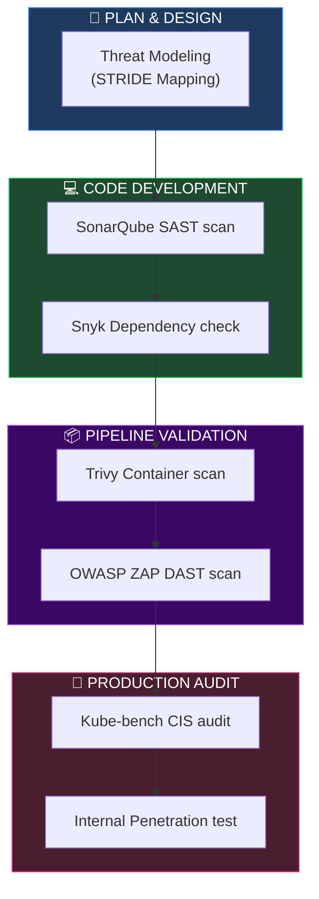
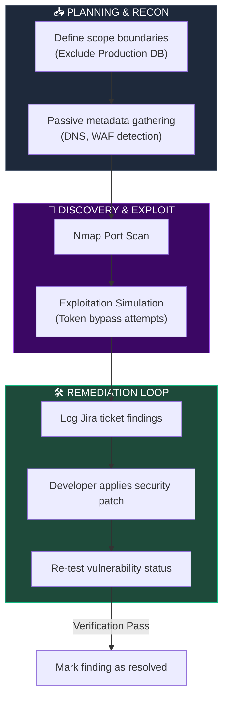
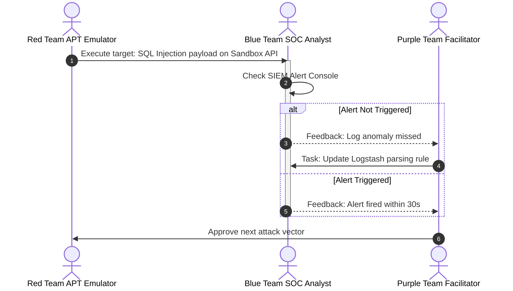
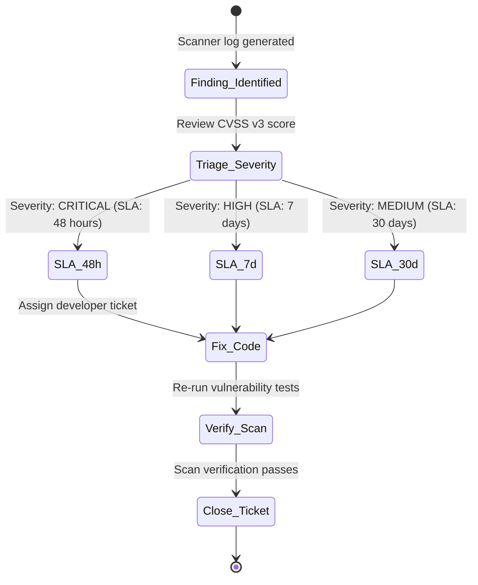
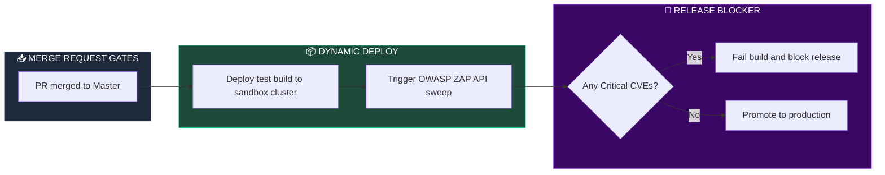

# SECURITY TESTING, PENETRATION TESTING & RED TEAM ARCHITECTURE

**Project Name:** Enterprise SaaS Business Management Platform  
**Document Version:** 1.0.0 — Baseline Standard  
**Date:** July 14, 2026  
**Authors:** Principal Cybersecurity Architect, Penetration Testing Expert, Red Team Leader, Application Security Specialist, Cloud Security Tester, OWASP Specialist & Enterprise SaaS Security Architect  
**Classification:** Enterprise Internal — Restricted (Red Team Sensitive)  
**Status:** 🎯 APPROVED SECURITY TESTING, PENETRATION TESTING & RED TEAM ARCHITECTURE SPECIFICATION  

---

## TABLE OF CONTENTS

| Section | Title | Description |
| :---: | :--- | :--- |
| **§1** | [Security Testing Foundation](#section-1--security-testing-foundation) | Strategic validation of application, cloud, and process boundaries |
| **§2** | [Security Testing Framework](#section-2--security-testing-framework) | SDLC integration path: design threat model to runtime testing |
| **§3** | [Vulnerability Assessment](#section-3--vulnerability-assessment) | Scanning infrastructure (Trivy, Nessus), CVSS v3 classification |
| **§4** | [Penetration Testing](#section-4--penetration-testing) | Black-box vs. Grey-box methods, target scopes, scheduling |
| **§5** | [Application Security Testing](#section-5--application-security-testing) | OWASP Top 10 mitigation validation (SQLi, CSRF, SSRF checks) |
| **§6** | [API Security Testing](#section-6--api-security-testing) | Endpoint tests: token integrity, rate limits, schema bindings |
| **§7** | [Mobile Security Testing](#section-7--mobile-security-testing) | React Native checks: keystore validations, certificate pinning |
| **§8** | [Cloud Security Testing](#section-8--cloud-security-testing) | Cloud configuration audits, EKS namespace isolation validations |
| **§9** | [Red Team Architecture](#section-9--red-team-architecture) | Adversary emulation models, target execution paths, rules of engagement |
| **§10** | [Blue Team Architecture](#section-10--blue-team-architecture) | Defense posture, detection telemetry, security log correlation |
| **§11** | [Purple Team Process](#section-11--purple-team-process) | Combined exercises: attack mapping, detection rule improvement |
| **§12** | [Threat Modeling](#section-12--threat-modeling) | MITRE ATT&CK mapping, STRIDE threat models, attack trees |
| **§13** | [Security Testing Tool Stack](#section-13--security-testing-tool-stack) | Security validation tools: ZAP, Burp, Metasploit, Kube-bench |
| **§14** | [Security Reporting](#section-14--security-reporting) | Reporting templates: risk assessments, evidence records |
| **§15** | [Remediation Management](#section-15--remediation-management) | Remediation workflows: triage, prioritizations, fix validations |
| **§16** | [Continuous Security Testing](#section-16--continuous-security-testing) | CI/CD testing integration, nightly regression sweeps |
| **§17** | [Security Certification Readiness](#section-17--security-certification-readiness) | Pre-audit compliance checklists (SOC 2, ISO 27001, PCI DSS) |
| **§18** | [Security Metrics](#section-18--security-metrics) | Quality KPIs: remediation timelines, test coverage ratios |
| **§19** | [Security Maturity Roadmap](#section-19--security-maturity-roadmap) | Vision: manual testing → continuous validation → AI-assisted pen testing |
| **§20** | [Final Security Testing Architecture](#section-20--final-security-testing-architecture) | 5 comprehensive technical Mermaid testing pipelines |

---

## SECTION 1 — SECURITY TESTING FOUNDATION

### 1.1 Goals of Security Testing
*   **Identify Weaknesses:** Uncover vulnerabilities before malicious actors can exploit them.
*   **Validate Controls:** Verify that firewalls, WAF rules, and sandbox isolation engines function as designed.
*   **Reduce Risk:** Ensure data security, availability, and tenant isolation across the multi-tenant SaaS platform.

---

## SECTION 2 — SECURITY TESTING FRAMEWORK

### 2.1 The Security Validation Pipeline
The platform integrates security testing into every stage of the software development lifecycle:
*   *Design:* Threat modeling (STRIDE analysis) maps trust boundaries.
*   *Develop:* Static analysis (SAST) and software composition analysis (SCA) scan code.
*   *Deploy:* Dynamic analysis (DAST) scans API endpoints in test environments.
*   *Production:* Automated penetration testing and runtime vulnerability scans monitor active environments.

---

## SECTION 3 — VULNERABILITY ASSESSMENT

### 3.1 Scanning Layers
*   **Applications:** DAST tools scan frontend interfaces and backend APIs.
*   **Infrastructure:** Vulnerability scanners audit Kubernetes nodes and cloud networks.
*   **Dependencies:** Dependency checkers identify known CVEs in third-party libraries.
*   **Containers:** Image scanners check container payloads before deployment.

---

## SECTION 4 — PENETRATION TESTING

### 4.1 Methodology
*   **Black-Box Testing:** Evaluates defenses from an external attacker's perspective without access to source code or internal network diagrams.
*   **Grey-Box Testing:** Conducts internal tests using credentials and API keys to verify authorization rules and tenant isolation.
*   **Scope:** Focuses on public API gateways, Keycloak identity controllers, database schemas, and microservice meshes.

---

## SECTION 5 — APPLICATION SECURITY TESTING

### 5.1 OWASP Top 10 Verification
The testing framework includes automated validation scripts to check for common vulnerabilities:
*   **Injection:** Parameterized SQL queries and schema input validations are checked.
*   **Broken Authentication:** Verifies token signature checks, MFA enforcement, and session termination times.
*   **Broken Object-Level Authorization:** Confirms that tenant-isolation filters prevent access to resources belonging to other tenants.

---

## SECTION 6 — API SECURITY TESTING

### 6.1 Endpoint Validation Policies
*   **Rate Limiting:** Enforces and tests Redis sliding-window limiters to prevent DoS attacks.
*   **Dynamic Scans:** Automated dynamic application security testing (DAST) scans API endpoints in test environments using OWASP ZAP configuration profiles.

```yaml
# configs/security/zap-api-scan.yaml
zap:
  target: "https://sandbox.saas-platform.com/api/v1"
  scan_type: "API"
  format: "openapi"
  openapi_file: "docs/api/openapi-spec.json"
  rules:
    - id: 40012 # SQL Injection
      severity: "HIGH"
      action: "FAIL"
    - id: 90019 # XSS
      severity: "HIGH"
      action: "FAIL"
    - id: 10048 # Insecure Cookies
      severity: "MEDIUM"
      action: "WARN"
```

---

## SECTION 7 — MOBILE SECURITY TESTING

### 7.1 React Native App Checks
*   **Secure Storage:** Verifies that sensitive data is stored securely in Keychain (iOS) and Keystore (Android).
*   **SSL Pinning:** Confirms that certificate pinning blocks proxy-based traffic analysis.
*   **Reverse Engineering:** Audits Android ProGuard/DexGuard configurations to verify obfuscation.

---

## SECTION 8 — CLOUD SECURITY TESTING

### 8.1 Infrastructure Auditing
*   **Network Scans:** Ports scans verify that database endpoints are not exposed to the public internet.
*   **Access Audits:** Checks AWS IAM configurations for least-privilege violations.
*   **Kubernetes Audits:** Kube-bench checks worker nodes against CIS benchmarks.

---

## SECTION 9 — RED TEAM ARCHITECTURE

### 9.1 Attack Simulation Framework
The Red Team emulates advanced persistent threats (APTs) to identify operational security gaps.

```
THE RED TEAM ATTACK CHAIN
═══════════════════════════════════════════════════════════════════════════════
 [ Passive Recon ] ──► [ Phishing / Social ] ──► [ Exploit API Endpoints ]
                                                       │
                                                       ▼ (Establish Foothold)
 [ Exfiltrate Database ] ◄── [ Lateral Movement ] ◄── [ Privilege Escalation ]
═══════════════════════════════════════════════════════════════════════════════
```

---

## SECTION 10 — BLUE TEAM ARCHITECTURE

### 10.1 Defensive Controls
*   **Detection Telemetry:** Logs all system events and routes them to a central SIEM.
*   **Incident Response:** Monitors alerts and isolates compromised containers using automated playbooks.

---

## SECTION 11 — PURPLE TEAM PROCESS

### 11.1 Collaboration Model
*   **Purple Teaming:** The Red and Blue teams run joint exercises to test defensive controls and verify detection rules.

---

## SECTION 12 — THREAT MODELING

### 12.1 Attack Mapping
*   **STRIDE Model:** Identifies threat vectors at each interface boundary.
*   **MITRE ATT&CK Mapping:** Links identified vulnerabilities to known attack techniques for prioritization.

---

## SECTION 13 — SECURITY TESTING TOOL STACK

### 13.1 Security Testing Tools

| Category | Tool | Production Purpose | System Owner |
| :--- | :--- | :--- | :--- |
| **API / Web DAST** | OWASP ZAP | Automated dynamic API endpoint scanning. | Security Architect |
| **Manual DAST** | Burp Suite | Dynamic testing and request manipulation. | Pen Test Lead |
| **Infrastructure Scan**| Nessus | Scans servers and networks for CVEs. | Platform SRE |
| **Container Audit** | Trivy | Scans built container images for vulnerabilities. | DevOps Engineer |
| **Kubernetes Audit** | Kube-bench | Audits cluster setups against CIS benchmarks. | Platform SRE |

---

## SECTION 14 — SECURITY REPORTING

### 14.1 Pentest Vulnerability Log Schema
Vulnerabilities identified during penetration testing are cataloged for remediation:

```json
// Sample Pentest Finding Log
{
  "finding_id": "PENTEST-2026-004",
  "title": "SQL Injection in POS Catalog Filter",
  "severity": "HIGH",
  "cvss_v3_score": 8.2,
  "component": "POS Service",
  "description": "The category parameter on POST /pos/products is vulnerable to SQL injection.",
  "evidence": {
    "payload": "category=beverages' OR 1=1--",
    "raw_response": "HTTP/1.1 200 OK ... raw SQL dump trace"
  },
  "remediation": "Validate input using class-validator and use Prisma parameterized queries."
}
```

---

## SECTION 15 — REMEDIATION MANAGEMENT

### 15.1 Remediation Workflows
*   **Critical Findings:** Must be resolved within 48 hours.
*   **High Findings:** Must be resolved within 7 days.
*   **Medium Findings:** Must be resolved within 30 days.

---

## SECTION 16 — CONTINUOUS SECURITY TESTING

### 16.1 Automated Pipelines
*   **Nightly Tests:** Runs automated DAST scans and regression tests against staging environments.
*   **Deploy Blockers:** Scans must complete with zero unresolved high-severity vulnerabilities to deploy code to production.

---

## SECTION 17 — SECURITY CERTIFICATION READINESS

### 17.1 Pre-Audit Compliance
*   **Audit Readiness:** Pre-audit checklists verify that system configurations, logs, and policies align with SOC 2 Type II and ISO 27001 requirements.

---

## SECTION 18 — SECURITY METRICS

### 18.1 Key Performance Metrics
*   **Vulnerability Resolution Velocity:** Average time to patch identified vulnerabilities.
*   **Risk Reduction Ratios:** Tracking vulnerability density across builds.

---

## SECTION 20 — FINAL SECURITY TESTING ARCHITECTURE

### 20.1 Security Testing Lifecycle



### 20.2 Penetration Testing Process



### 20.3 Red Blue Purple Team Model



### 20.4 Vulnerability Management Flow



### 20.5 Continuous Security Validation



---

## DOCUMENT METADATA

| Field | Value |
| :--- | :--- |
| **Document ID** | SAAS-TESTING-018.6 |
| **Section** | 18 — Security Architecture |
| **Subsection** | 18.6 — Security Testing & Red Teaming |
| **Status** | 🎯 APPROVED |
| **Version** | 1.0.0 |
| **Date** | July 14, 2026 |
| **Next Review** | January 14, 2027 |
| **Related Documents** | [Secure SDLC Architecture](../18.3-Secure-SDLC-DevSecOps/Secure-SDLC-DevSecOps.md) · [SOC SIEM Monitoring](../18.5-SOC-SIEM-Monitoring/SOC-SIEM-Monitoring.md) · [Testing Strategy](../../14-Backend-Architecture/14.10-Testing-Strategy/Testing-Strategy.md) |
| **Technology Versions** | OWASP ZAP v2.14 · Burp Suite Pro v2024 · Metasploit v6.3 · Kube-bench v0.7.3 |

---

*This document is the authoritative specification for all security testing, penetration testing protocols, red-teaming simulations, purple-teaming exercises, and automated security validation pipelines in the SaaS Business Management Platform. All scan schedules, vulnerability classifications, remediation lifecycles, and certification pre-audits must conform to the standards defined herein.*
