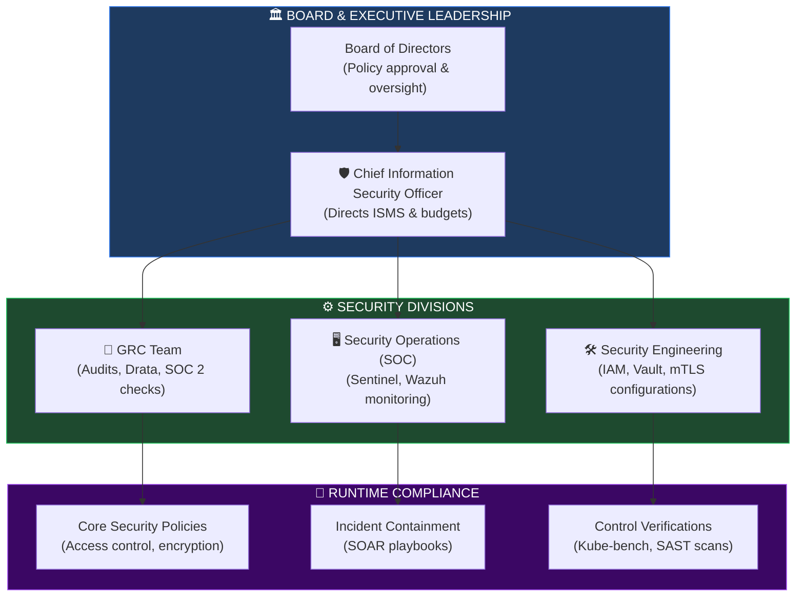
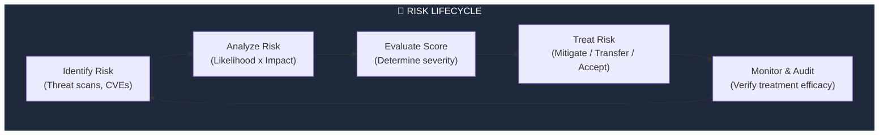
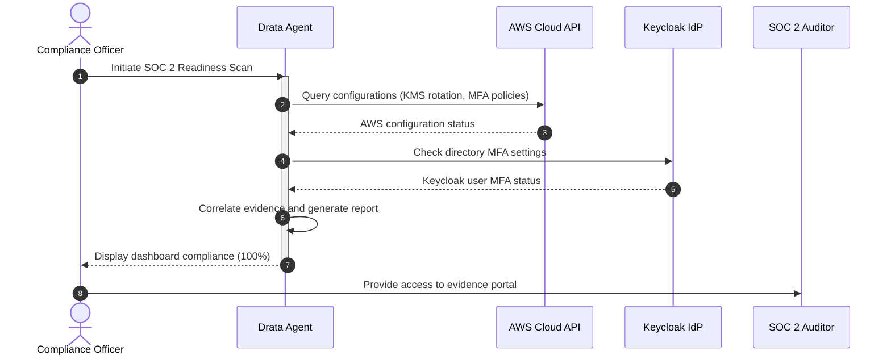
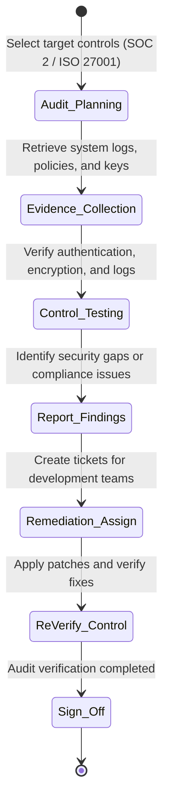
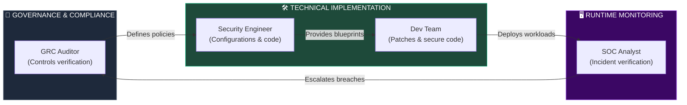

# ENTERPRISE SECURITY GOVERNANCE, RISK MANAGEMENT & COMPLIANCE (GRC) FRAMEWORK

**Project Name:** Enterprise SaaS Business Management Platform  
**Document Version:** 1.0.0 — Baseline Standard  
**Date:** July 14, 2026  
**Authors:** Principal Enterprise Security Governance Architect, GRC Specialist, Risk Management Consultant, Compliance Architect, ISO 27001 Expert, SOC 2 Control Specialist & SaaS Security Architect  
**Classification:** Enterprise Internal — Restricted (Governance Sensitive)  
**Status:** 🏛️ APPROVED ENTERPRISE SECURITY GOVERNANCE & COMPLIANCE FRAMEWORK SPECIFICATION  

---

## TABLE OF CONTENTS

| Section | Title | Description |
| :---: | :--- | :--- |
| **§1** | [Security Governance Foundation](#section-1--security-governance-foundation) | Security engineering vs. security governance definitions |
| **§2** | [Security Organization Model](#section-2--security-organization-model) | Security hierarchy: Board to CISO to operational teams, org chart |
| **§3** | [Security Policy Framework](#section-3--security-policy-framework) | Policy domains: InfoSec, access controls, data retention, software |
| **§4** | [Risk Management Framework](#section-4--risk-management-framework) | Risk management lifecycle: identify, evaluate, treat, monitor |
| **§5** | [Risk Assessment Model](#section-5--risk-assessment-model) | Risk formulas: Likelihood × Impact risk scoring matrix |
| **§6** | [Security Control Framework](#section-6--security-control-framework) | Mapping controls: identity, data, app, and infrastructure layers |
| **§7** | [Compliance Framework](#section-7--compliance-framework) | Standard alignments: ISO 27001, SOC 2 Type II, PCI DSS |
| **§8** | [ISO 27001 Alignment](#section-8--iso-27001-alignment) | Security domains: crypto, supplier security, incident handling |
| **§9** | [SOC 2 Control Model](#section-9--soc-2-control-model) | Trust Principles: Security, Availability, Integrity, Privacy |
| **§10** | [Audit Management](#section-10--audit-management) | Audit lifecycle: planning, evidence collectors, remediations |
| **§11** | [Security Metrics & KPIs](#section-11--security-metrics--kpis) | Compliance metrics: training levels, patch velocities, incident rates |
| **§12** | [Third-Party Risk Management](#section-12--third-party-risk-management) | Vendor checks, partner assessments, integration evaluations |
| **§13** | [Security Awareness Program](#section-13--security-awareness-program) | Phishing tests, secure coding training, engineering loops |
| **§14** | [Incident Governance](#section-14--incident-governance) | Severity classifications, legal notification workflows |
| **§15** | [Business Continuity Governance](#section-15--business-continuity-governance) | BCP/DR frameworks, RTO/RPO targets, failover drills |
| **§16** | [Security Governance Tool Stack](#section-16--security-governance-tool-stack) | GRC software comparison: ServiceNow, Drata, Vanta |
| **§17** | [Security Maturity Model](#section-17--security-maturity-model) | Roadmap: basic security → AI-driven continuous compliance |
| **§18** | [Enterprise Customer Security Package](#section-18--enterprise-customer-security-package) | Deliverables: Whitepaper, DPA, pentest summaries, SOC 2 reports |
| **§19** | [Continuous Improvement](#section-19--continuous-improvement) | Governance feedback loops: review, measure, improve, repeat |
| **§20** | [Final Security Governance Architecture](#section-20--final-security-governance-architecture) | 5 comprehensive technical Mermaid GRC flowcharts |

---

## SECTION 1 — SECURITY GOVERNANCE FOUNDATION

### 1.1 Engineering vs. Governance
*   **Security Engineering:** Focuses on implementing security controls (e.g., configuring firewalls, setting up mTLS, writing access policies).
*   **Security Governance:** Defines the policies, goals, and metrics that guide engineering efforts. It ensures the platform meets enterprise security standards and regulatory compliance requirements.

```
THE GOVERNANCE OVERSEE LOOP
═══════════════════════════════════════════════════════════════════════════════
 [ Security Governance (Policies & Audits) ] ──► Defines parameters
                        ▲
                        │
                        ▼ (Verification Checks)
 [ Security Engineering (Code & Infrastructure) ] ──► Executes controls
═══════════════════════════════════════════════════════════════════════════════
```

---

## SECTION 2 — SECURITY ORGANIZATION MODEL

### 2.1 The Governance Hierarchy
The platform's security posture is overseen by the Board of Directors and managed by the CISO, coordinating engineering and operations teams.

```
THE GRC HIERARCHY
═══════════════════════════════════════════════════════════════════════════════
                 [ Board of Directors ]
                           │
                           ▼
                [ Chief Information Security Officer (CISO) ]
                           │
         ┌─────────────────┴─────────────────┐
         ▼                                   ▼
 [ GRC Compliance Team ]            [ Security Operations (SOC) ]
         │                                   │
         ▼                                   ▼
 [ Audits & Frameworks ]            [ Telemetry & Incident Response ]
═══════════════════════════════════════════════════════════════════════════════
```

---

## SECTION 3 — SECURITY POLICY FRAMEWORK

### 3.1 Core Security Policies
*   **Information Security Policy:** Defines the platform's overall security goals and standards.
*   **Access Control Policy:** Outlines authorization rules, identity checks, and least-privilege standards.
*   **Data Protection Policy:** Enforces encryption at rest, data masking, and multi-tenant isolation.
*   **Incident Response Policy:** Defines escalation workflows and response timelines for security incidents.

---

## SECTION 4 — RISK MANAGEMENT FRAMEWORK

### 4.1 The Risk Management Lifecycle
1.  **Identify:** Uncover potential security and compliance risks.
2.  **Analyze:** Determine the likelihood and impact of identified risks.
3.  **Evaluate:** Score and prioritize risks using the risk assessment model.
4.  **Treat:** Mitigate, transfer, accept, or avoid identified risks.
5.  **Monitor:** Track mitigation progress and audit controls regularly.

---

## SECTION 5 — RISK ASSESSMENT MODEL

### 5.1 Scoring Formula
*   **Risk Score Formula:** `Likelihood (1-5) × Impact (1-5) = Risk Score (1-25)`
*   **Tiers:** Critical (20-25), High (12-19), Medium (5-11), Low (1-4).

```yaml
# configs/grc/risk-register.yaml
risks:
  - id: "RISK-2026-001"
    category: "DATA_SECURITY"
    title: "SQL Injection in POS Service"
    likelihood: 2 # Unlikely due to Prisma parameterization
    impact: 5 # Critical data exposure
    score: 10 # Medium Risk
    treatment: "MITIGATE"
    mitigation_strategy: "Enforce class-validator schema checks and run nightly OWASP ZAP API scans."
    owner: "Lead Security Architect"
```

---

## SECTION 6 — SECURITY CONTROL FRAMEWORK

### 6.1 Mapped Security Controls

| Category | Security Target | Mapped Control | Verification Tool |
| :--- | :--- | :--- | :--- |
| **Identity** | Authentication | Passwordless WebAuthn (FIDO2) + MFA | Keycloak audit logs |
| **Data** | Multi-tenant Isolation | PostgreSQL Row-Level Security (RLS) | pgAudit query verification|
| **Application**| Code Vulnerabilities | SAST, SCA, and container signature gates | SonarQube, Trivy, Cosign |
| **Infrastructure**| Pod Isolation | Kubernetes Pod Security Standards | Kube-bench CIS scanner |
| **Operations** | Incident Response | SOAR playbooks + SIEM alerts | Microsoft Sentinel |

---

## SECTION 7 — COMPLIANCE FRAMEWORK

### 7.1 Framework Standards
*   **ISO 27001:** Focuses on the Information Security Management System (ISMS), risk assessments, and supplier security.
*   **SOC 2 Type II:** Audits the operational effectiveness of security, availability, and privacy controls over a 6-month period.
*   **PCI DSS:** Restricts payment card processing. All card transactions must be tokenized via Stripe integrations.

---

## SECTION 8 — ISO 27001 ALIGNMENT

### 8.1 Key Security Domains
*   **Cryptography:** AES-256 field encryption and TLS 1.3 transit tunnels are enforced.
*   **Supplier Security:** Third-party plugins must undergo vulnerability assessments before listing.
*   **Incident Management:** SOC analysts investigate alerts and log details to immutable storage.

---

## SECTION 9 — SOC 2 CONTROL MODEL

### 9.1 Trust Services Criteria (TSC)
*   **Security:** Multi-factor authentication, firewalls, and encryption protect system access.
*   **Availability:** Multi-AZ failovers, backups, and load balancing ensure system uptime.
*   **Confidentiality:** Data is classified, isolated, and masked before access.

---

## SECTION 10 — AUDIT MANAGEMENT

### 10.1 Auditing Steps
1.  **Planning:** Define the audit scope and select control domains.
2.  **Evidence Collection:** Retrieve logs, access matrices, and configurations automatically.
3.  **Control Testing:** Verify that access controls, firewalls, and encryption function as expected.
4.  **Remediation:** Resolve identified gaps and compile compliance reports.

---

## SECTION 11 — SECURITY METRICS & KPIs

### 11.1 Key Performance Indicators
*   **MFA Adoption:** Enforce 100% MFA adoption for administrative and core employee accounts.
*   **Mean Time to Patch (MTTP):** Target < 48 hours for critical vulnerabilities.
*   **Audit Readiness Score:** Target 100% compliance across all tested SOC 2 controls.

---

## SECTION 12 — THIRD-PARTY RISK MANAGEMENT

### 12.1 Vendor Assessments
*   **Vendor Audits:** Third-party integrations must complete security questionnaires and provide SOC 2 compliance reports.
*   **App Assessments:** Partner plugins undergo automated vulnerability scans before listing.

---

## SECTION 13 — SECURITY AWARENESS PROGRAM

### 13.1 Awareness Activities
*   **Phishing Simulations:** Conduct quarterly phishing simulations to train employees.
*   **Developer Training:** Enforce secure coding practices (OWASP Top 10 prevention) for all engineers.

---

## SECTION 14 — INCIDENT GOVERNANCE

### 14.1 Escalation Workflows
*   **Incident Levels:** Classified from Low to Critical.
*   **Notifications:** Critical data breaches must be reported to legal counsel and regulators within 72 hours (in compliance with GDPR requirements).

---

## SECTION 15 — BUSINESS CONTINUITY GOVERNANCE

### 15.1 Disaster Recovery Plans
*   **RTO Target:** Restore core systems within 4 hours.
*   **RPO Target:** Database backups must limit data loss to less than 1 hour.
*   **DR Drills:** Conduct annual failover exercises to verify backup integrity and system recovery times.

---

## SECTION 16 — SECURITY GOVERNANCE TOOL STACK

### 16.1 Compliance Platform Tools

| Category | Tool | Production Purpose | System Owner |
| :--- | :--- | :--- | :--- |
| **GRC Management** | ServiceNow GRC | Manages policy maps, audits, and risk registers. | Governance Lead |
| **Audit Automation**| Drata / Vanta | Automates evidence collection for SOC 2. | Compliance Specialist|
| **Incident Logging**| Jira Service Desk | Logs incidents and tracks security patches. | SOC Lead |
| **Document Vault** | Confluence | Stores policies, post-mortems, and procedures. | Operations Lead |

---

## SECTION 20 — FINAL SECURITY GOVERNANCE ARCHITECTURE

### 20.1 Enterprise Security Governance Model



### 20.2 Risk Management Lifecycle



### 20.3 Compliance Management Flow



### 20.4 Audit Lifecycle



### 20.5 Security Operating Model



---

## DOCUMENT METADATA

| Field | Value |
| :--- | :--- |
| **Document ID** | SAAS-GRC-018.7 |
| **Section** | 18 — Security Architecture |
| **Subsection** | 18.7 — Governance, Risk & Compliance |
| **Status** | 🏛️ APPROVED |
| **Version** | 1.0.0 |
| **Date** | July 14, 2026 |
| **Next Review** | January 14, 2027 |
| **Related Documents** | [Zero Trust Foundation](../18.1-Zero-Trust-Foundation/Zero-Trust-Foundation.md) · [Secure SDLC Architecture](../18.3-Secure-SDLC-DevSecOps/Secure-SDLC-DevSecOps.md) · [SOC SIEM Monitoring](../18.5-SOC-SIEM-Monitoring/SOC-SIEM-Monitoring.md) |
| **Technology Versions** | Drata Agent v2.5 · ServiceNow Utah · ISO/IEC 27001:2022 |

---

*This document is the authoritative specification for all security governance, risk management frameworks, compliance models, pre-audit verifications, and third-party vendor review decisions in the SaaS Business Management Platform. All security policies, risk assessment scoring formulas, control frameworks, and compliance reporting packages must conform to the standards defined herein.*
