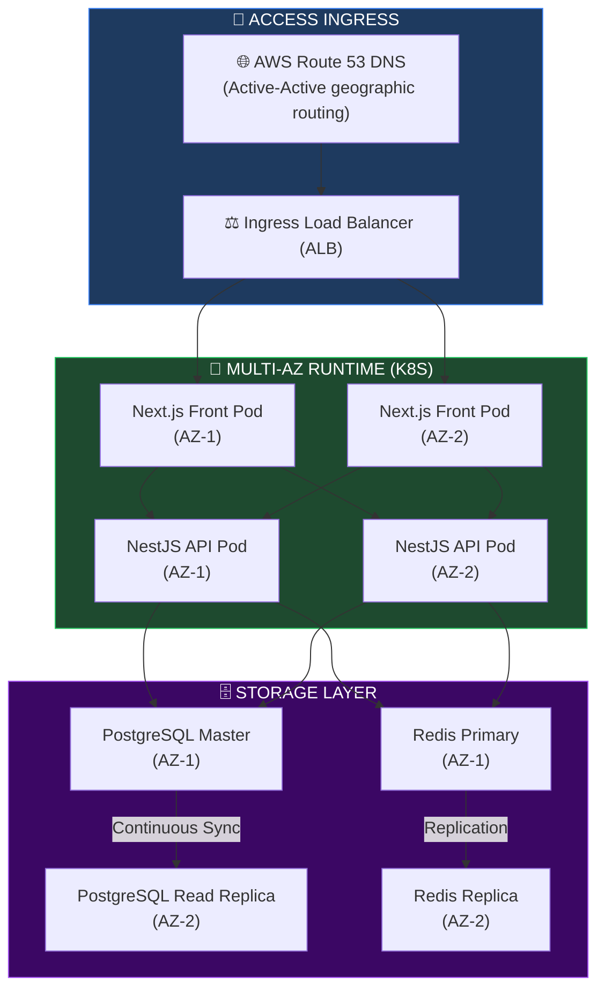
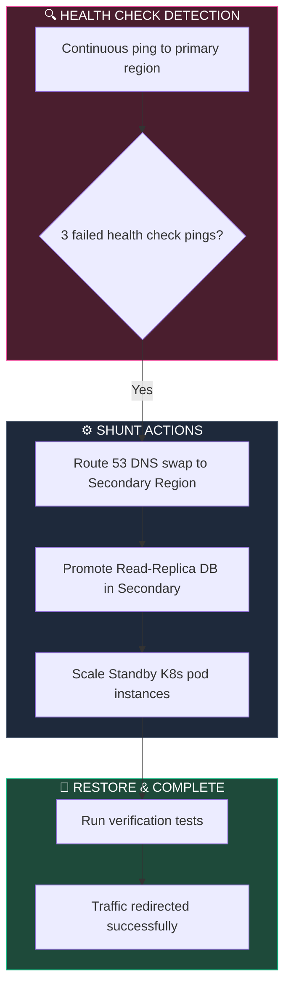
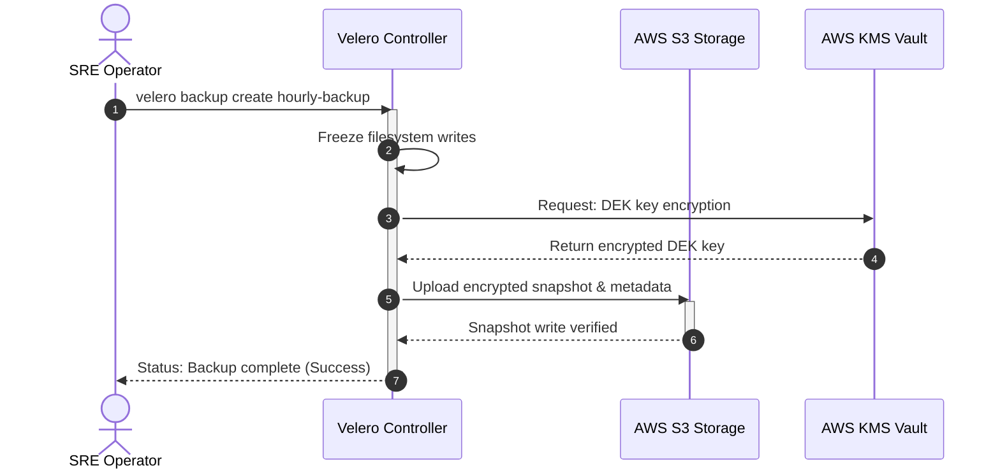
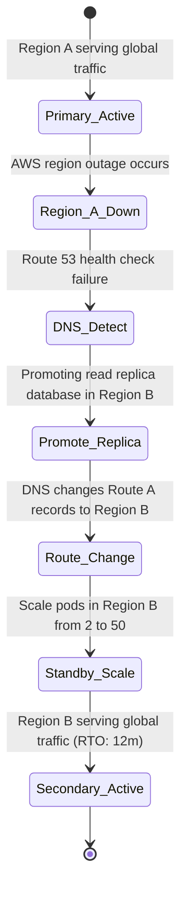
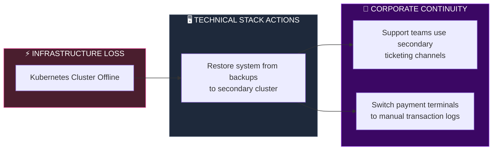

# DISASTER RECOVERY, BUSINESS CONTINUITY & ENTERPRISE RESILIENCE ARCHITECTURE

**Project Name:** Enterprise SaaS Business Management Platform  
**Document Version:** 1.0.0 — Baseline Standard  
**Date:** July 14, 2026  
**Authors:** Principal Cloud Resilience Architect, Disaster Recovery Architect, Business Continuity Specialist, Site Reliability Engineer, Cloud Infrastructure Architect & Enterprise SaaS Platform Architect  
**Classification:** Enterprise Internal — Restricted (Resilience Critical)  
**Status:** ⚙️ APPROVED DISASTER RECOVERY, BUSINESS CONTINUITY & ENTERPRISE RESILIENCE SPECIFICATION  

---

## TABLE OF CONTENTS

| Section | Title | Description |
| :---: | :--- | :--- |
| **§1** | [Resilience Foundation](#section-1--resilience-foundation) | Availability vs. reliability vs. resilience; high availability vs. DR |
| **§2** | [Business Impact Analysis](#section-2--business-impact-analysis) | Critical sub-systems identification, impact, downtime costs |
| **§3** | [High Availability Architecture](#section-3--high-availability-architecture) | Single-region local multi-AZ topologies and local failovers |
| **§4** | [Multi-Region Architecture](#section-4--multi-region-architecture) | Cross-region Active-Active and Active-Passive topologies |
| **§5** | [Database Resilience](#section-5--database-resilience) | PostgreSQL Patroni clusters, WAL-G archiving, and read-replicas |
| **§6** | [Backup Architecture](#section-6--backup-architecture) | Immutable S3 backup vaults, retention, encryption policies |
| **§7** | [Recovery Objectives](#section-7--recovery-objectives) | RTO and RPO targets mapped by application tier and criticality |
| **§8** | [Disaster Recovery Strategies](#section-8--disaster-recovery-strategies) | Pilot Light vs. Warm Standby vs. Hot Standby comparisons |
| **§9** | [Application Recovery](#section-9--application-recovery) | Self-healing pods, Liveness/Readiness check designs |
| **§10** | [Kubernetes Resilience](#section-10--kubernetes-resilience) | Node drain behaviors, multi-master setups, namespace backup scripts |
| **§11** | [Cloud Failure Management](#section-11--cloud-failure-management) | AZ outages mitigations, Route 53 DNS shunts, network circuit breakers |
| **§12** | [Security Incident Recovery](#section-12--security-incident-recovery) | Cyber containment steps: isolation, integrity checks, rollbacks |
| **§13** | [Business Continuity Plan](#section-13--business-continuity-plan) | Corporate operational guidelines during critical infrastructure outages |
| **§14** | [Crisis Management](#section-14--crisis-management) | Escalation trees, crisis roles (Commander, Communications Lead) |
| **§15** | [Disaster Recovery Testing](#section-15--disaster-recovery-testing) | Chaos Mesh templates, automated failover drills, backup restore checks |
| **§16** | [Resilience Tool Stack](#section-16--resilience-tool-stack) | Resilience tools comparison: Velero, AWS Backup, Chaos Mesh |
| **§17** | [Monitoring Resilience](#section-17--monitoring-resilience) | Prometheus alerts for recovery, replication lag telemetry |
| **§18** | [SLA & SLO Management](#section-18--sla--slo-management) | SLA tables: availability targets, financial credit penalties |
| **§19** | [Resilience Maturity Roadmap](#section-19--resilience-maturity-roadmap) | Roadmap: basic backups → active-active global autonomous resilience |
| **§20** | [Final Resilience Architecture](#section-20--final-resilience-architecture) | 5 comprehensive technical Mermaid resilience flowcharts |

---

## SECTION 1 — RESILIENCE FOUNDATION

### 1.1 Availability, Reliability, and Resilience
*   **Availability:** The percentage of time a system remains operational and accessible (e.g., "three nines" or 99.9% uptime).
*   **Reliability:** The probability that a system performs its required functions under stated conditions for a specified period.
*   **Resilience:** The system's ability to withstand and recover from infrastructure failures, cyber attacks, and natural disasters.

```
THE CONTINUOUS RESILIENCE LOOP
═══════════════════════════════════════════════════════════════════════════════
  [ Local HA Outage Protection ] ──► [ Cross-AZ Auto-Failovers ]
                ▲                              │
                │                              ▼
  [ Continuous Chaos Drills ] ◄── [ Multi-Region DR Standbys ]
═══════════════════════════════════════════════════════════════════════════════
```

---

## SECTION 2 — BUSINESS IMPACT ANALYSIS

### 2.1 Criticality Tiering

| Sub-System | Business Impact | Estimated Downtime Cost | Recovery Priority |
| :--- | :--- | :--- | :--- |
| **Authentication** | Users cannot log in; complete operation halt. | $50,000 / hour | Tier 1 (Critical) |
| **Payments** | Cashiers cannot process checkout transactions. | $120,000 / hour | Tier 1 (Critical) |
| **POS Transactions**| Sales data cannot be saved locally. | $80,000 / hour | Tier 1 (Critical) |
| **Reporting / BI** | Analytics dashboards are unavailable. | $5,000 / hour | Tier 3 (Low) |
| **AI Copilot** | Automated chat assistant is offline. | $1,500 / hour | Tier 3 (Low) |

---

## SECTION 3 — HIGH AVAILABILITY ARCHITECTURE

### 3.1 Local Multi-AZ Topologies
Within a single region, resources are distributed across three Availability Zones (AZs) to prevent downtime from localized outages.

```
LOCAL MULTI-AZ INGRESS
═══════════════════════════════════════════════════════════════════════════════
                   [ Ingress Load Balancer (ALB) ]
                                 │
         ┌───────────────────────┼───────────────────────┐
         ▼                       ▼                       ▼
 [ AZ-1 (Active) ]       [ AZ-2 (Active) ]       [ AZ-3 (Active) ]
    ├── NestJS Pod          ├── NestJS Pod          ├── NestJS Pod
    └── PG Master           └── PG Replica          └── PG Replica
═══════════════════════════════════════════════════════════════════════════════
```

---

## SECTION 4 — MULTI-REGION ARCHITECTURE

### 4.1 Cross-Region Failover Topologies
*   **Active-Passive (Warm Standby):** The secondary region runs minimal container configurations and receives continuous database replication. If the primary region fails, traffic is routed to the secondary region.
*   **Active-Active:** Both regions actively serve user traffic. Databases sync in real-time, and regional load balancers distribute requests geographically.

---

## SECTION 5 — DATABASE RESILIENCE

### 5.1 PostgreSQL Patroni Cluster Setup
The database layer uses **Patroni** to manage high availability and automate failovers.
*   **Replication:** Continuous write-ahead log (WAL) archiving to immutable storage.
*   **Failover:** Patroni promotes a read replica to primary if the master node goes offline.

```yaml
# configs/database/patroni-resilience.yaml
scope: saas-postgres-cluster
namespace: database
dcs:
  ttl: 30
  loop_wait: 10
  retry_timeout: 10
  postgresql:
    use_pg_rewind: true
    use_slots: true
    parameters:
      shared_buffers: 4GB
      max_connections: 500
      archive_mode: "on"
      archive_command: "wal-g wal-push %p" # Continuously archives WAL logs
postgresql:
  listen: '*:5432'
  authentication:
    replication:
      username: replicator
      password: VaultInject:secret/data/database/replication:password
```

---

## SECTION 6 — BACKUP ARCHITECTURE

### 6.1 Backup Retention & Encryption
*   **Snapshot Frequency:** Core databases are snapshotted hourly; filesystems are snapshotted daily.
*   **Retention:** Snapshots are retained for 30 days in primary storage and archived to immutable Glacier storage for 7 years to meet audit requirements.
*   **Encryption:** All backups are encrypted using customer-managed KMS keys.

---

## SECTION 7 — RECOVERY OBJECTIVES (RTO/RPO)

### 7.1 Objective Mappings

| System Priority | Target RTO | Target RPO | Backup Method |
| :--- | :--- | :--- | :--- |
| **Tier 1 (Critical)** | < 15 minutes | < 5 minutes | Continuous WAL replication + hourly snapshots |
| **Tier 2 (Standard)** | < 2 hours | < 1 hour | Daily snapshot replication |
| **Tier 3 (Low)** | < 24 hours | < 24 hours | Weekly cold storage backups |

---

## SECTION 8 — DISASTER RECOVERY STRATEGIES

### 8.1 Strategy Comparison

| Strategy | Target RTO | Target RPO | Deployment Cost | Operational Complexity |
| :--- | :--- | :--- | :--- | :--- |
| **Backup & Restore** | 24 hours | 24 hours | Low | Medium (Manual recovery). |
| **Pilot Light** | 4 hours | 1 hour | Medium | High (Infrastructure sync).|
| **Warm Standby** | 30 minutes | 15 minutes | High | High (Sync states). |
| **Hot Standby** | < 1 minute | < 1 minute | Critical | Absolute (Global replication).|

---

## SECTION 9 — APPLICATION RECOVERY

### 9.1 Self-Healing Pods
Kubernetes Liveness and Readiness probes automatically identify and restart unhealthy application containers.

```yaml
# templates/apps/backend-probes.yaml
apiVersion: apps/v1
kind: Deployment
metadata:
  name: backend-service
spec:
  template:
    spec:
      containers:
        - name: nestjs-api
          image: saas-platform/backend:latest
          livenessProbe:
            httpGet:
              path: /health/liveness
              port: 3000
            initialDelaySeconds: 30
            periodSeconds: 10
            timeoutSeconds: 2
            failureThreshold: 3 # Restarts pod if health check fails 3 times
          readinessProbe:
            httpGet:
              path: /health/readiness
              port: 3000
            initialDelaySeconds: 15
            periodSeconds: 10
            timeoutSeconds: 2
            successThreshold: 1
```

---

## SECTION 10 — KUBERNETES RESILIENCE

### 10.1 Cluster Recovery Strategy
*   **Multi-Master Control Plane:** Kubernetes control planes run across 3 AZs to prevent master node failure outages.
*   **Velero Backup Scripts:** Hourly Velero tasks back up Kubernetes namespace configurations, secrets, and volumes.

```bash
# Backup all Kubernetes namespace resources
velero backup create saas-k8s-hourly-backup \
  --include-namespaces production \
  --snapshot-volumes \
  --ttl 720h0m0s # Retain backups for 30 days
```

---

## SECTION 11 — CLOUD FAILURE MANAGEMENT

### 11.1 Regional Outage Failovers
*   **AZ Outages:** AWS Auto Scaling groups dynamically migrate pods from degraded AZs to healthy zones.
*   **Route 53 Routing:** AWS Route 53 DNS monitors primary region health and automatically shunts traffic to the secondary standby region if endpoints go offline.

---

## SECTION 12 — SECURITY INCIDENT RECOVERY

### 12.1 Ransomware Containment Playbook
If a ransomware payload is detected:
1.  **Isolation:** Terminate network connections to the compromised pods.
2.  **Snapshot Lock:** Lock current database snapshots and isolate volumes for investigation.
3.  **Restore:** Provision a clean environment using Terraform and restore the database to the last clean recovery point.

---

## SECTION 13 — BUSINESS CONTINUITY PLAN (BCP)

### 13.1 Operations Continuity
*   **Customer Support:** CS teams switch to secondary cloud VoIP and ticketing systems if primary networks go offline.
*   **Engineering Operations:** Git repositories are hosted across distributed cloud registries (GitHub + secondary GitLab backups).

---

## SECTION 14 — CRISIS MANAGEMENT

### 14.1 Incident Command Structures
*   **Incident Commander:** Directs technical team tasks and mitigation strategies.
*   **Communications Lead:** Manages internal updates and coordinates customer notifications.

---

## SECTION 15 — DISASTER RECOVERY TESTING

### 15.1 Chaos Mesh Experiments
The SRE team uses **Chaos Mesh** to test platform resilience by injecting failures in staging environments.

```yaml
# configs/chaos/network-latency-experiment.yaml
apiVersion: chaos-mesh.org/v1alpha1
kind: NetworkChaos
metadata:
  name: database-network-delay
  namespace: staging
spec:
  action: delay
  mode: one
  selector:
    namespaces:
      - staging
    labelSelectors:
      app: postgres-database
  delay:
    latency: '250ms' # Injects latency to test database connection recovery
    jitter: '10ms'
  direction: to
  duration: '5m'
  scheduler:
    cron: '0 0 * * 0' # Runs weekly on Sunday at midnight
```

---

## SECTION 16 — RESILIENCE TOOL STACK

### 16.1 Infrastructure Resilience Tools

| Category | Tool | Production Purpose | System Owner |
| :--- | :--- | :--- | :--- |
| **K8s Backup** | Velero | Backs up namespace resources and persistent volumes. | Lead SRE |
| **Cloud Backups** | AWS Backup | Manages snapshot retention and KMS encryption. | Platform Engineer |
| **Chaos Injection**| Chaos Mesh | Simulates pod, network, and disk failures. | QA/SRE Team |
| **DNS Failover** | Route 53 | Monitors health and manages DNS routing. | Network Engineer |
| **Uptime Tracking**| Grafana | Visualizes system availability and replication lag. | SOC Manager |

---

## SECTION 20 — FINAL RESILIENCE ARCHITECTURE

### 20.1 Enterprise High Availability Architecture



### 20.2 Disaster Recovery Flow



### 20.3 Backup & Restore Process



### 20.4 Multi-Region Failover Architecture



### 20.5 Business Continuity Model



---

## DOCUMENT METADATA

| Field | Value |
| :--- | :--- |
| **Document ID** | SAAS-DR-018.8 |
| **Section** | 18 — Security Architecture |
| **Subsection** | 18.8 — Disaster Recovery & Resilience |
| **Status** | ⚙️ APPROVED |
| **Version** | 1.0.0 |
| **Date** | July 14, 2026 |
| **Next Review** | January 14, 2027 |
| **Related Documents** | [Zero Trust Foundation](../18.1-Zero-Trust-Foundation/Zero-Trust-Foundation.md) · [Data Security Architecture](../18.4-Data-Security-Compliance/Data-Security-Compliance.md) · [Observability Architecture](../../15-Cloud-Infrastructure/15.5-Observability-SRE/Observability-SRE.md) |
| **Technology Versions** | Kubernetes v1.29 · Patroni v3.2 · Velero v1.13 · Chaos Mesh v2.6 |

---

*This document is the authoritative specification for all disaster recovery, business continuity planning, high availability configurations, database replicas, backup retention periods, and chaos engineering exercises in the SaaS Business Management Platform. All recovery time objectives (RTO), recovery point objectives (RPO), failover architectures, and business continuity models must conform to the standards defined herein.*
