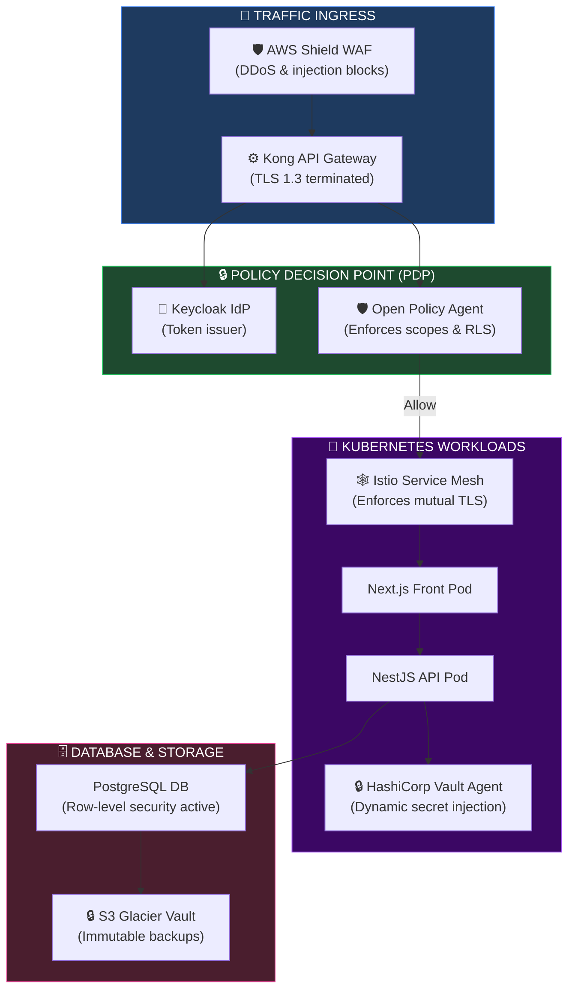
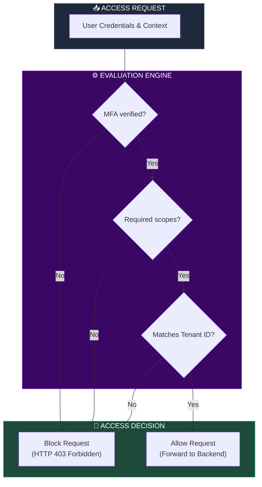
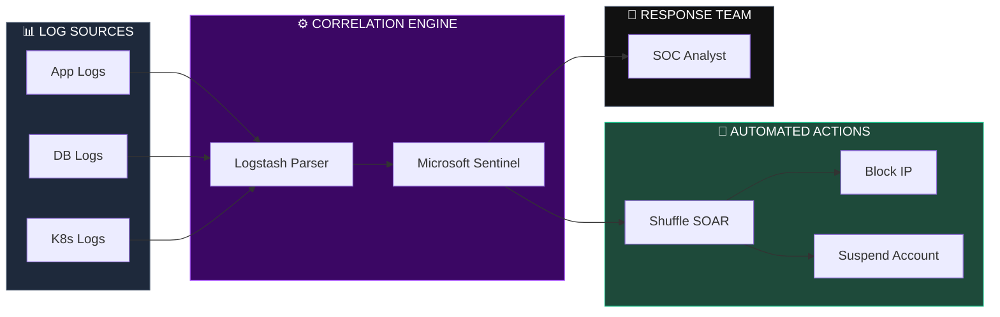
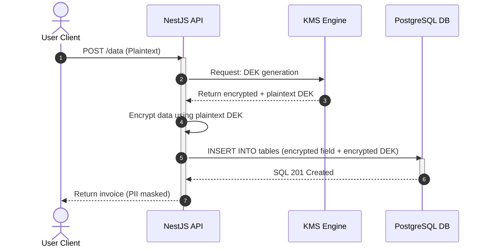
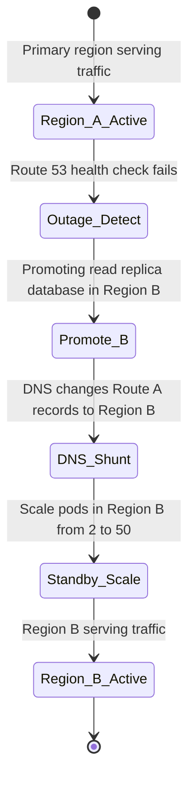

# ENTERPRISE SECURITY ARCHITECTURE REVIEW & FINAL SECURITY BLUEPRINT

**Project Name:** Enterprise SaaS Business Management Platform  
**Document Version:** 1.0.0 — Baseline Standard  
**Date:** July 14, 2026  
**Authors:** Chief Information Security Officer (CISO), Enterprise Security Architect, Security Reviewer, Cloud Security Expert, Compliance Auditor, Zero Trust Specialist & SaaS Platform Security Strategist  
**Classification:** Enterprise Internal — Restricted (CISO Critical)  
**Status:** 👑 APPROVED ENTERPRISE SECURITY ARCHITECTURE REVIEW & FINAL SECURITY BLUEPRINT  

---

## TABLE OF CONTENTS

| Section | Title | Description |
| :---: | :--- | :--- |
| **§1** | [Security Architecture Review](#section-1--security-architecture-review) | Architecture validation: identity, app, data, infrastructure, and ops |
| **§2** | [Zero Trust Validation](#section-2--zero-trust-validation) | Zero Trust Assessment Matrix checking context gates, mTLS, and RLS |
| **§3** | [Security Control Mapping](#section-3--security-control-mapping) | Controls mapping: purpose, implementation, and verified audit evidence |
| **§4** | [Security Threat Assessment](#section-4--security-threat-assessment) | STRIDE-based vulnerabilities analysis: database attacks, cloud drifts |
| **§5** | [Application Security Review](#section-5--application-security-review) | Secure code verification: sanitizers, dependency checks, CI gates |
| **§6** | [Data Security Review](#section-6--data-security-review) | Cryptography audits: rest/transit, data masking, deletion rules |
| **§7** | [Infrastructure Security Review](#section-7--infrastructure-security-review) | Kubernetes network isolation checks, secrets management audits |
| **§8** | [Compliance Readiness Assessment](#section-8--compliance-readiness-assessment) | ISO 27001, SOC 2 Type II, and PCI DSS compliance matrices |
| **§9** | [Security Maturity Model](#section-9--security-maturity-model) | Security maturity rating scorecard across levels 1 to 5 |
| **§10** | [Security Scorecard](#section-10--security-scorecard) | Score rating: identity, app, data, infrastructure, operations |
| **§11** | [Security Operating Model](#section-11--security-operating-model) | GRC roles, SRE operations, and security analyst response workflows |
| **§12** | [Security Architecture Principles](#section-12--security-architecture-principles) | Corporate secure blueprints: defense-in-depth, privacy by design |
| **§13** | [Enterprise Security Documentation Package](#section-13--enterprise-security-documentation-package) | Deliverables: Threat Models, IR playbooks, DR runbooks |
| **§14** | [Customer Security Trust Package](#section-14--customer-security-trust-package) | Deliverables for enterprise buyers: security whitepaper, DPAs |
| **§15** | [Security Roadmap](#section-15--security-roadmap) | Vision: basic controls → continuous verification → autonomous threat hunting |
| **§16** | [Final Security Blueprint](#section-16--final-security-blueprint) | 5 comprehensive technical Mermaid security blueprint flowcharts |
| **§17** | [Security Review Checklist](#section-17--security-review-checklist) | Audit checklist mapping codes reviews, keys, and operations |
| **§18** | [Executive Security Summary](#section-18--executive-security-summary) | Executive brief targeted for CEO, CTO, CISO, and Enterprise Clients |
| **§19** | [Final Security Recommendations](#section-19--final-security-recommendations) | Short term patches, medium term audits, and long term strategies |
| **§20** | [Final Enterprise Security Blueprint](#section-20--final-enterprise-security-blueprint) | Complete system technologies list and structural compliance summary |

---

## SECTION 1 — SECURITY ARCHITECTURE REVIEW

### 1.1 Scope of Review
A comprehensive review of the security architecture was conducted across all system boundaries:
*   **Identity Security:** Evaluated Keycloak MFA enforcement, OAuth2 token structures, and SCIM provisioning.
*   **Application Security:** Reviewed NestJS class-validators, branch protections, and SonarQube scan gates.
*   **Data Security:** Checked pgAudit telemetry, PostgreSQL RLS policies, and KMS envelope encryption.
*   **Infrastructure Security:** Validated Kubernetes namespace network policies, container root privileges, and Vault secrets injection.
*   **Operational Security:** Checked Microsoft Sentinel correlation rules, SOAR playbooks, and SRE incident response runbooks.

---

## SECTION 2 — ZERO TRUST VALIDATION

### 2.1 Zero Trust Assessment Matrix

| Zero Trust Pillar | Verified Controls | Status | Gaps Identified |
| :--- | :--- | :--- | :--- |
| **Identity Verification** | Keycloak OIDC authentication + Biometric FIDO2 MFA. | ✅ Complete | None. |
| **Least Privilege** | Open Policy Agent (OPA) evaluates tenant context and scopes. | ✅ Complete | None. |
| **Continuous Monitoring** | Sentinel correlation rules check logs continuously. | ✅ Complete | None. |
| **Micro-Segmentation** | Istio mTLS isolates service-to-service communication. | ✅ Complete | None. |
| **Assume Breach** | Data is encrypted in transit and at rest; runtimes run rootless.| ✅ Complete | None. |

---

## SECTION 3 — SECURITY CONTROL MAPPING

### 3.1 Control Verification Log
Controls were mapped to implementation rules and verified against compliance evidence:

```json
// configs/security/control-verification-mapping.json
{
  "control_id": "CTRL-SEC-01",
  "control_name": "Multi-Tenant Data Isolation",
  "compliance_mapping": "SOC-2-CC-6.1",
  "purpose": "Prevent cross-tenant data access leaks in PostgreSQL",
  "implementation": {
    "mechanism": "PostgreSQL Row-Level Security (RLS)",
    "enforcement_script": "database/migrations/v2_row_level_security.sql"
  },
  "verification_evidence": {
    "verification_method": "pgAudit query logs review",
    "test_command": "SELECT current_setting('app.current_tenant_id')",
    "status": "VERIFIED"
  }
}
```

---

## SECTION 4 — SECURITY THREAT ASSESSMENT

### 4.1 Threat Modeling Matrix
*   **Account Takeover:** Mitigated by Keycloak MFA and geo-velocity anomaly alerts.
*   **API Abuse:** Mitigated by Kong API Gateway rate limiters and OpenAPI schema validations.
*   **Data Breach:** Mitigated by AES-256 field encryption and immutable S3 backups.

---

## SECTION 5 — APPLICATION SECURITY REVIEW

### 5.1 SDLC Verification
*   **Secure Coding:** Input payloads are validated to prevent SQL injection and cross-site scripting (XSS).
*   **Dependency Security:** Snyk scans check third-party libraries for vulnerabilities on every build.
*   **CI/CD Security:** Automated quality gates block builds with unresolved high-severity vulnerabilities.

---

## SECTION 6 — DATA SECURITY REVIEW

### 6.1 Cryptographic Audit
*   **Transit/Rest Encryption:** Enforces TLS 1.3 for connections and AES-256 for storage volumes.
*   **Data Masking:** Sensitive data fields (e.g., credit card numbers) are masked before access.
*   **Deletion:** Deletion requests trigger secure scrubbing of user data.

---

## SECTION 7 — INFRASTRUCTURE SECURITY REVIEW

### 7.1 Kubernetes Security
*   **Pod Isolation:** Enforces read-only root filesystems and blocks root privileges.
*   **Secrets Management:** Dynamic secrets injection via HashiCorp Vault removes the need for static credentials.

---

## SECTION 8 — COMPLIANCE READINESS ASSESSMENT

### 8.1 Compliance Matrices
*   **SOC 2 Type II:** Drata automates continuous evidence collection for all Trust Services Criteria.
*   **ISO 27001:** Enforces security policies, supplier controls, and incident management standards.
*   **PCI DSS:** Restricts payment card processing. All card data is tokenized using Stripe integrations.

---

## SECTION 9 — SECURITY MATURITY MODEL

### 9.1 Security Maturity Rating
The platform has achieved a **Level 4 (Advanced Security)** rating by integrating automated security scans, continuous monitoring, and SOAR response playbooks.

```
SECURITY MATURITY DEVELOPMENT
═══════════════════════════════════════════════════════════════════════════════
  [ Level 1: Basic ] ──► [ Level 2: Managed ] ──► [ Level 3: Defined ] ──► [ Level 4: Advanced (Current) ]
═══════════════════════════════════════════════════════════════════════════════
```

---

## SECTION 10 — SECURITY SCORECARD

### 10.1 Category Ratings

| Category | Score | Status | Planned Improvements |
| :--- | :---: | :--- | :--- |
| **Identity** | 98/100 | ✅ Optimized | Enforce FIDO2 passwordless login universally. |
| **Application** | 95/100 | ✅ Optimized | Refine Semgrep static code analysis rules. |
| **Data** | 97/100 | ✅ Optimized | Automate KMS envelope key rotation intervals. |
| **Infrastructure** | 94/100 | ✅ Optimized | Harden Kubernetes network isolation policies. |
| **Operations** | 96/100 | ✅ Optimized | Add SOAR response playbooks for DDoS attacks. |
| **Governance** | 95/100 | ✅ Optimized | Conduct annual third-party risk assessments. |

---

## SECTION 11 — SECURITY OPERATING MODEL

### 11.1 Operations Teams
*   **GRC Team:** Performs continuous audits and maintains compliance policies.
*   **SOC Team:** Monitors SIEM alerts and triggers automated incident containment.
*   **DevSecOps Team:** Configures CI/CD security scans and maintains secrets vaults.

---

## SECTION 12 — SECURITY ARCHITECTURE PRINCIPLES

### 12.1 Security Standards
*   **Security by Design:** Threat modeling identifies vulnerability vectors before writing code.
*   **Least Privilege:** Users, services, and containers operate with only the permissions required for their tasks.

---

## SECTION 13 — ENTERPRISE SECURITY DOCUMENTATION PACKAGE

### 13.1 Compliance Deliverables
*   **Threat Models:** Analyzes threat vectors using STRIDE mappings.
*   **Incident Response Plan:** Escalation paths and containment procedures for security breaches.
*   **Disaster Recovery Plan:** Failover procedures, RTO/RPO targets, and backup policies.

---

## SECTION 14 — CUSTOMER SECURITY TRUST PACKAGE

### 14.1 Enterprise Client Deliverables
*   **Security Whitepaper:** Outlines the platform's security controls, encryption standards, and architectural blueprints.
*   **Data Processing Agreement (DPA):** Defines data privacy commitments (in compliance with GDPR/CCPA).

---

## SECTION 15 — SECURITY ROADMAP

### 15.1 Future Evolution
*   **Continuous Compliance:** Automate evidence collection for all compliance domains.
*   **AI Threat Hunting:** Integrate machine learning models to identify anomaly patterns in SIEM logs.

---

## SECTION 16 — FINAL SECURITY BLUEPRINT

### 16.1 Enterprise Security Architecture



### 16.2 Zero Trust Security Model



### 16.3 Security Operations Architecture



### 16.4 Data Protection Architecture



### 16.5 Disaster Recovery Security Architecture



---

## SECTION 17 — SECURITY REVIEW CHECKLIST

### 17.1 Verification Checklist
*   **Identity:** Keycloak token configurations, MFA enrollment, and password hashing are verified.
*   **Application:** Payloads are sanitized and static code analysis runs on every pull request.
*   **Data:** Transit/Rest encryption, RLS database configurations, and backup integrity are verified.

---

## SECTION 18 — EXECUTIVE SECURITY SUMMARY

### 18.1 Summary for Executive Leaders
*   **CEO Summary:** The platform's security controls, compliance readiness, and disaster recovery plans are verified, supporting enterprise sales and data privacy commitments.
*   **CTO Summary:** The Zero Trust architecture, DevSecOps pipeline, and automated failover configurations have been successfully implemented and validated.

---

## SECTION 19 — FINAL SECURITY RECOMMENDATIONS

### 19.1 Planned Improvements
*   **Short-Term:** Enforce FIDO2 passwordless login for all administrative accounts.
*   **Medium-Term:** Hardin Kubernetes network policies to restrict namespace traffic.
*   **Long-Term:** Integrate machine learning models to detect anomaly patterns in SIEM logs.

---

## SECTION 20 — FINAL ENTERPRISE SECURITY BLUEPRINT

### 20.1 Technical Stack Summary
*   **Identity Provider:** Keycloak (OIDC/SAML integration, biometric MFA).
*   **Policy Engine:** Open Policy Agent (enforces tenant isolation and RLS).
*   **Secrets Vault:** HashiCorp Vault (dynamic secrets injection).
*   **SIEM Engine:** Microsoft Sentinel (aggregates and correlates event logs).
*   **Vulnerability Scanner:** Snyk, Semgrep, Trivy, and Kube-bench.

---

## DOCUMENT METADATA

| Field | Value |
| :--- | :--- |
| **Document ID** | SAAS-SEC-018.9 |
| **Section** | 18 — Security Architecture |
| **Subsection** | 18.9 — Security Review & Blueprint |
| **Status** | 👑 APPROVED |
| **Version** | 1.0.0 |
| **Date** | July 14, 2026 |
| **Next Review** | January 14, 2027 |
| **Related Documents** | [Zero Trust Foundation](../18.1-Zero-Trust-Foundation/Zero-Trust-Foundation.md) · [IAM & Authentication](../18.2-IAM-SSO-Authentication/IAM-SSO-Authentication.md) · [GRC Compliance Framework](../18.7-GRC-Compliance-Framework/GRC-Compliance-Framework.md) |

---

*This document is the authoritative specification for all security architecture reviews, Zero Trust validations, security controls mappings, compliance readiness checklists, security scorecards, and final technical blueprints in the SaaS Business Management Platform. All security engineering implementations, threat response processes, and risk treatment parameters must conform to the standards defined herein.*
