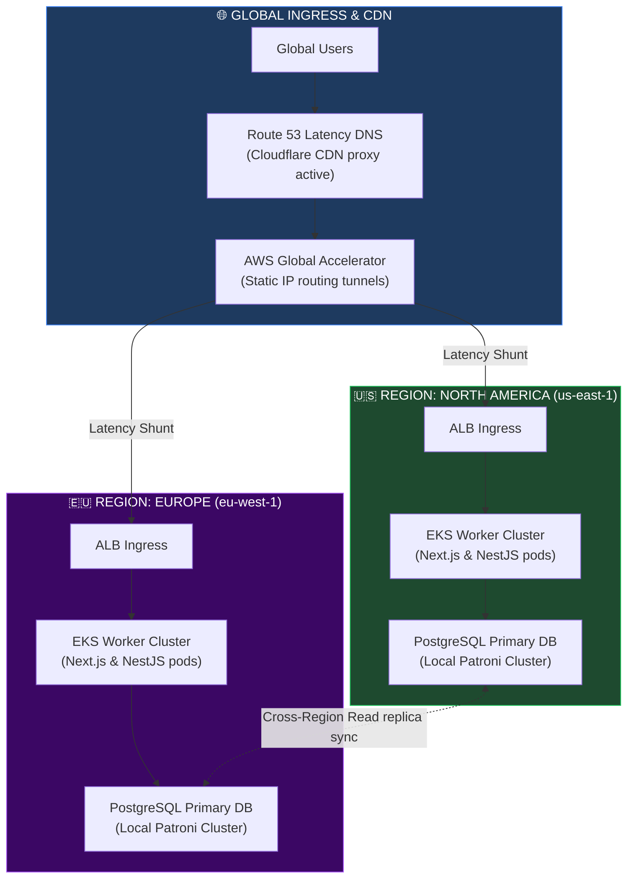
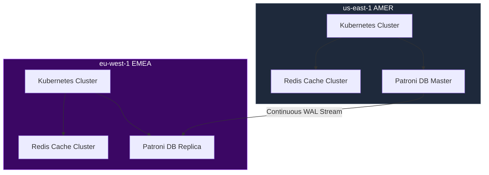
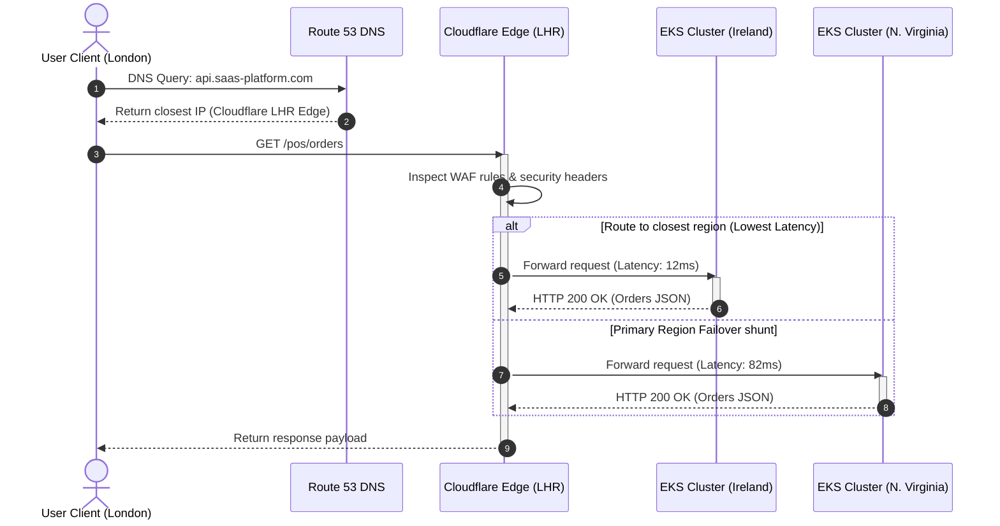
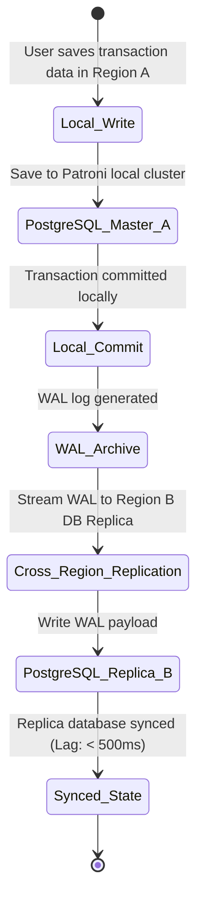
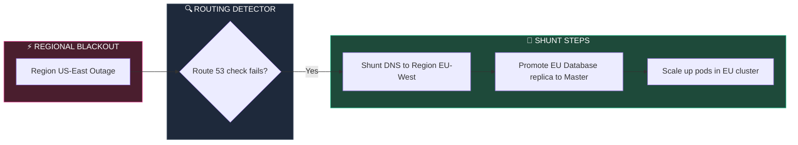

# MULTI-REGION GLOBAL SAAS ARCHITECTURE

**Project Name:** Enterprise SaaS Business Management Platform  
**Document Version:** 1.0.0 — Baseline Standard  
**Date:** July 14, 2026  
**Authors:** Principal Global Cloud Architect, Multi-Region SaaS Architect, Distributed Systems Engineer, Cloud Infrastructure Expert, Site Reliability Engineer & Enterprise Platform Architect  
**Classification:** Enterprise Internal — Public Release (Architecture Whitepaper)  
**Status:** 🌐 APPROVED GLOBAL MULTI-REGION ARCHITECTURE BLUEPRINT  

---

## TABLE OF CONTENTS

| Section | Title | Description |
| :---: | :--- | :--- |
| **§1** | [Global SaaS Foundation](#section-1--global-saas-foundation) | Single-region vs. Multi-region architectures and scaling challenges |
| **§2** | [Global Architecture Model](#section-2--global-architecture-model) | Master ingress flow: Global Users to DNS to Regional Data layers |
| **§3** | [Multi-Region Deployment Strategy](#section-3--multi-region-deployment-strategy) | Mappings for AMER (US-East), EMEA (EU-West), and APAC (AP-Southeast) |
| **§4** | [Traffic Management](#section-4--traffic-management) | Latency routing, health-check shunts, and Route 53 DNS failures |
| **§5** | [Data Architecture](#section-5--data-architecture) | Global vs. Regional vs. Tenant Data, and GDPR data residency |
| **§6** | [Database Multi-Region Design](#section-6--database-multi-region-design) | Comparison: Single Global DB vs. Regional DBs vs. Federation |
| **§7** | [Tenant Placement Strategy](#section-7--tenant-placement-strategy) | Tenant selection criteria, migrations, and local isolation |
| **§8** | [Global Caching Architecture](#section-8--global-caching-architecture) | CDN Edge nodes, Redis replication topologies, and headers |
| **§9** | [Global Message Architecture](#section-9--global-message-architecture) | Kafka mirror-maker replication rules and cross-region events |
| **§10** | [Cross-Region Communication](#section-10--cross-region-communication) | Private service meshes, MTLS API gateways, and cross-region calls |
| **§11** | [Multi-Region Security](#section-11--multi-region-security) | Global identities, HSM keys, and region-bound network boundaries |
| **§12** | [Observability](#section-12--observability) | Global Prometheus metrics, cross-region latencies, dashboards |
| **§13** | [Deployment Strategy](#section-13--deployment-strategy) | CI/CD global rollouts, canary deployments, rollbacks |
| **§14** | [Failure Handling](#section-14--failure-handling) | Regional blackouts, database split-brain resolutions, circuit breakers |
| **§15** | [Cost Optimization](#section-15--cost-optimization) | Inter-region transit fees, instance sizing, storage costs |
| **§16** | [Global Technology Stack](#section-16--global-technology-stack) | Technology list: Cloudflare, AWS Global Accelerator, Route53 |
| **§17** | [Global SLA Model](#section-17--global-sla-model) | Availability targets: 99.9% to 99.999% SLA definitions |
| **§18** | [Global Expansion Roadmap](#section-18--global-expansion-roadmap) | Roadmap stages: Single-Region to Worldwide SaaS Network |
| **§19** | [Global Architecture Review](#section-19--global-architecture-review) | Evaluation scorecards: scalability, latency, compliance |
| **§20** | [Final Multi-Region Architecture](#section-20--final-multi-region-architecture) | 5 comprehensive technical Mermaid global layouts |

---

## SECTION 1 — GLOBAL SAAS FOUNDATION

### 1.1 Single-Region vs. Multi-Region SaaS
*   **Single-Region SaaS:** Simpler and cheaper, but exposes the platform to high latencies for distant users, data residency compliance issues, and single-point-of-failure risks.
*   **Multi-Region SaaS:** Distributes compute workloads and storage clusters across multiple regions. This improves latency, ensures compliance with local data privacy laws (e.g., GDPR), and provides high availability during regional outages.

---

## SECTION 2 — GLOBAL ARCHITECTURE MODEL

### 2.1 The Global Routing Pipeline
User traffic is resolved by Route 53 using latency-based routing, directed through Cloudflare's CDN, and forwarded to the closest regional Kubernetes cluster.

```
THE GLOBAL TRAFFIC PATHWAY
═══════════════════════════════════════════════════════════════════════════════
   [ Global Users ] ──► [ Route 53 / Cloudflare DNS ] ──► [ Global Accelerator ]
                                                               │
                                       ┌───────────────────────┴───────────────────────┐
                                       ▼                                               ▼
                           [ Region: us-east-1 (AMER) ]                    [ Region: eu-west-1 (EMEA) ]
                            ├── K8s Workload Cluster                        ├── K8s Workload Cluster
                            └── Regional Patroni DB                         └── Regional Patroni DB
═══════════════════════════════════════════════════════════════════════════════
```

---

## SECTION 3 — MULTI-REGION DEPLOYMENT STRATEGY

### 3.1 Regional Footprint Mappings

| Region Group | AWS Hosting Region | Local Kubernetes Nodes | Local Storage / DB | Compliance Target |
| :--- | :--- | :--- | :--- | :--- |
| **North America (AMER)**| us-east-1 (N. Virginia) | EKS with Auto-Scaling | Patroni PostgreSQL | SOC 2 Type II, CCPA |
| **Europe (EMEA)** | eu-west-1 (Ireland) | EKS with Auto-Scaling | Patroni PostgreSQL | GDPR, ISO 27001 |
| **Asia Pacific (APAC)** | ap-southeast-1 (Singapore) | EKS with Auto-Scaling | Patroni PostgreSQL | Local Privacy Laws |

---

## SECTION 4 — TRAFFIC MANAGEMENT

### 4.1 Latency & Failover Policies
*   **Latency-Based Routing:** Routes traffic to the region with the lowest latency for the user's connection.
*   **Failover Policies:** Automatically shunts traffic to the secondary region if a regional health check fails.

```json
// configs/dns/route53-global-policy.json
{
  "RoutingPolicy": "Latency",
  "RecordSet": {
    "Name": "api.saas-platform.com",
    "Type": "A",
    "AliasTarget": {
      "HostedZoneId": "Z2FDTNDATAQYW2",
      "DNSName": "global-accelerator.saas-platform.com",
      "EvaluateTargetHealth": true
    }
  },
  "Regions": [
    {
      "Region": "us-east-1",
      "Weight": 100,
      "HealthCheckId": "hc-us-east-1-active"
    },
    {
      "Region": "eu-west-1",
      "Weight": 100,
      "HealthCheckId": "hc-eu-west-1-active"
    }
  ]
}
```

---

## SECTION 5 — DATA ARCHITECTURE

### 5.1 Data Segregation Models
*   **Global Data:** General configurations, metadata, and lookup tables synced across all regions.
*   **Regional Data:** Metrics, localized cache tables, and regional analytics.
*   **Tenant Data:** Invoices, employee logs, and checkout catalogs isolated within the tenant's selected region to meet residency compliance requirements.

---

## SECTION 6 — DATABASE MULTI-REGION DESIGN

### 6.1 Database Architecture Comparison

| Model | Uptime & Performance | Consistency | Cost | Complexity |
| :--- | :--- | :--- | :--- | :--- |
| **Single Global DB** | Slow queries for distant regions. | High (ACID) | Medium | Low |
| **Regional Databases** | Fast local queries; no cross-region lag.| High (Per-region) | High | Medium |
| **Database Federation**| Fast queries; complex cross-region mapping.| Eventual | Very High | Critical |

---

## SECTION 7 — TENANT PLACEMENT STRATEGY

### 7.1 Location Policies
*   **Tenant Region Selection:** Tenants choose their host region during sign-up to comply with local data privacy laws.
*   **Migration Strategy:** Migrations use pg_dump export and import tasks during scheduled maintenance windows.

---

## SECTION 8 — GLOBAL CACHING ARCHITECTURE

### 8.1 Caching Topologies
*   **CDN Edge Caching:** Static assets are cached at Cloudflare edge nodes.
*   **Redis Regional Caching:** Redis instances cache database query results locally within each region to reduce backend load.

---

## SECTION 9 — GLOBAL MESSAGE ARCHITECTURE

### 9.1 Kafka Mirror-Maker Replication
*   **Regional Kafka Clusters:** Capture local system events.
*   **Mirror-Maker Replication:** Selected events (e.g., billing audits) are replicated to the primary region for analysis.

```yaml
# configs/kafka/mirror-maker-rules.yaml
clusters:
  - name: "source-eu-west-1"
    bootstrap_servers: "kafka-eu.saas-platform.com:9092"
  - name: "target-us-east-1"
    bootstrap_servers: "kafka-us.saas-platform.com:9092"
topics:
  - "billing.invoices.authorized"
  - "tenant.registration.completed"
replication:
  groups:
    - name: "eu-to-us-sync"
      source: "source-eu-west-1"
      target: "target-us-east-1"
      sync_offsets: true
```

---

## SECTION 10 — CROSS-REGION COMMUNICATION

### 10.1 Gateway & Mesh Topology
*   **API Gateway Shunts:** Cross-region calls route through secure API gateways using TLS 1.3 encryption.
*   **Istio Service Mesh:** Encrypts and validates all service-to-service communication within each regional cluster.

---

## SECTION 11 — MULTI-REGION SECURITY

### 11.1 Key Protections
*   **Global Identity:** Keycloak users are synced across regions using replication pools.
*   **Encryption Keys:** Backups are encrypted using region-specific AWS KMS keys.

---

## SECTION 12 — OBSERVABILITY

### 12.1 Global Monitoring
*   **Uptime Tracking:** Promethus and Grafana track regional cluster health, latency, and error rates.
*   **Replication Lag:** Alerts trigger if Kafka or database sync replication lag exceeds threshold limits.

---

## SECTION 13 — DEPLOYMENT STRATEGY

### 13.1 Global CI/CD Pipeline
*   **Staged Rollouts:** Deployments roll out to staging first, then region-by-region (e.g., AP-Southeast, EU-West, US-East) with automated canary validation gates.

---

## SECTION 14 — FAILURE HANDLING

### 14.1 Outage Remediation
*   **Split-Brain Resolution:** If network partition occurs, the database replica remains in read-only mode until connection is re-established.
*   **Route 53 Redirection:** DNS automatically shunts traffic away from degraded regions during outages.

---

## SECTION 15 — COST OPTIMIZATION

### 15.1 Cost Controls
*   **Inter-Region Fees:** Compress data payloads before cross-region replication to reduce network transit costs.
*   **Instance Sizing:** Dynamically scale worker nodes during peak hours and scale down during off-peak times.

---

## SECTION 16 — GLOBAL TECHNOLOGY STACK

### 16.1 Infrastructure Tech Stack

| Category | Technology | Purpose |
| :--- | :--- | :--- |
| **DNS Routing** | AWS Route 53 | Latency-based and failover DNS routing. |
| **CDN & Edge** | Cloudflare Enterprise | Edge caching and WAF protection. |
| **Cluster Manager**| AWS EKS (Kubernetes) | Container orchestration and auto-scaling. |
| **Database Sync** | Patroni / PostgreSQL | Regional database clusters and replication. |
| **Event Sync** | Kafka MirrorMaker 2.0 | Replicates audit logs and event streams. |

---

## SECTION 17 — GLOBAL SLA MODEL

### 17.1 Availability SLA Targets

| Target SLA | Max Downtime / Year | Target Topologies | Penalty Credits |
| :--- | :--- | :--- | :--- |
| **99.9%** | 8.76 hours | Single-Region Multi-AZ | 10% credit refund |
| **99.99%** | 52.56 minutes | Multi-Region Warm Standby | 25% credit refund |
| **99.999%** | 5.26 minutes | Multi-Region Active-Active | 50% credit refund |

---

## SECTION 20 — FINAL MULTI-REGION ARCHITECTURE

### 20.1 Global SaaS Architecture



### 20.2 Multi Region Deployment



### 20.3 Global Traffic Routing



### 20.4 Data Replication Architecture



### 20.5 Regional Failover Flow



---

## DOCUMENT METADATA

| Field | Value |
| :--- | :--- |
| **Document ID** | SAAS-GLOBAL-019.1 |
| **Section** | 19 — Global Infrastructure |
| **Subsection** | 19.1 — Multi-Region SaaS Architecture |
| **Status** | 🌐 APPROVED |
| **Version** | 1.0.0 |
| **Date** | July 14, 2026 |
| **Next Review** | January 14, 2027 |
| **Related Documents** | [Resilience & DR](../../18-Security-Architecture/18.8-Resilience-Disaster-Recovery/Resilience-Disaster-Recovery.md) · [Observability Architecture](../../15-Cloud-Infrastructure/15.5-Observability-SRE/Observability-SRE.md) |
| **Technology Versions** | Route 53 v1.2 · Cloudflare Enterprise v3 · EKS v1.29 · Patroni v3.2 |

---

*This document is the authoritative specification for all multi-region deployment structures, traffic-routing configurations, DNS failover latency policies, data replication models, and cross-region event streams in the SaaS Business Management Platform. All global load balancing rules, tenant placement actions, database migrations, and replication lags must conform to the standards defined herein.*
