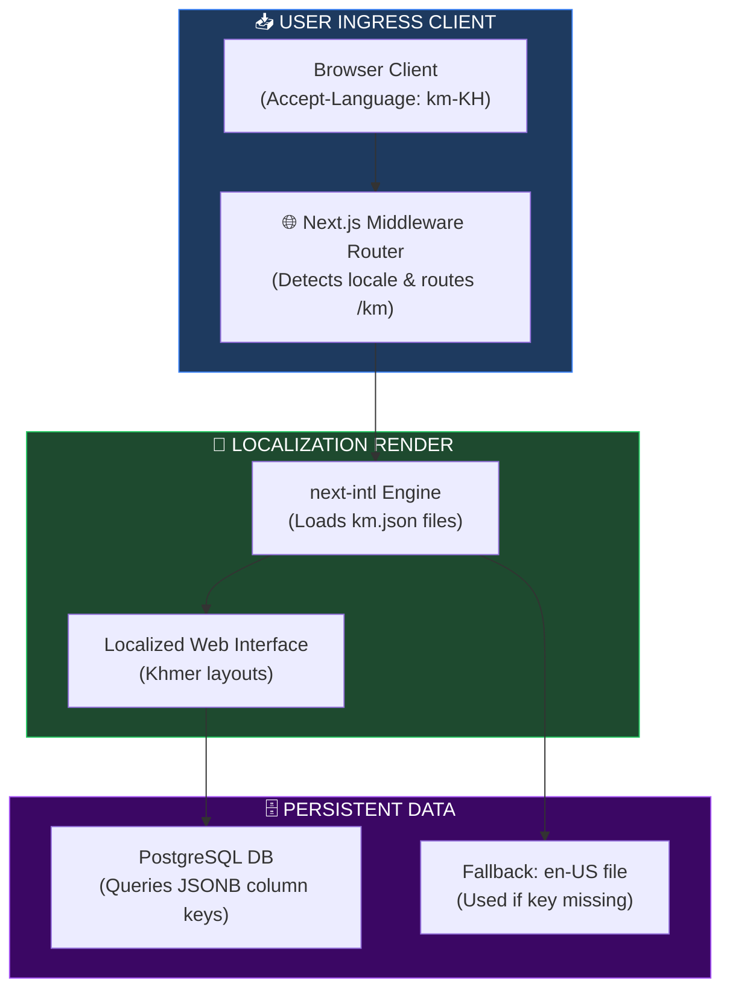
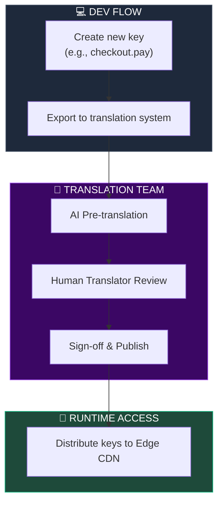
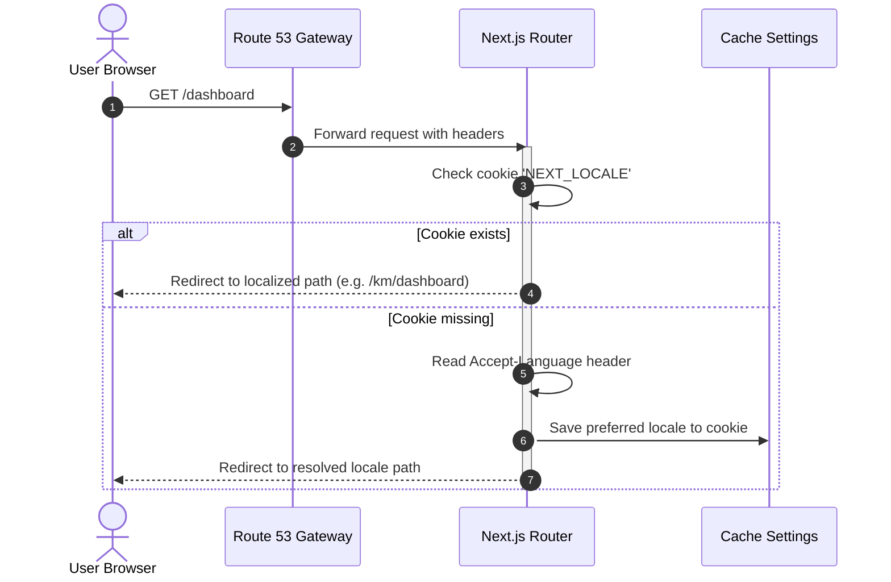
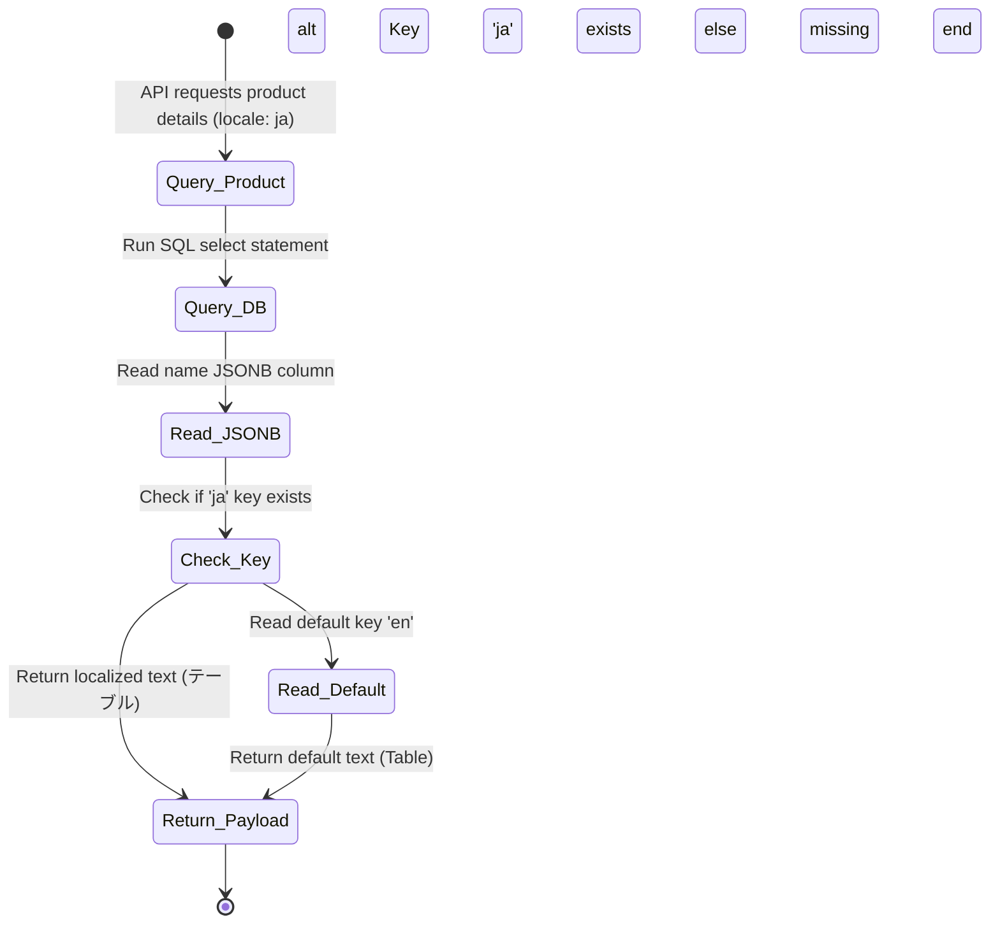
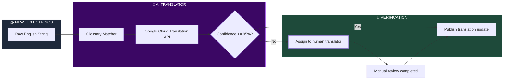

# LOCALIZATION, INTERNATIONALIZATION (I18N) & MULTI-LANGUAGE ARCHITECTURE

**Project Name:** Enterprise SaaS Business Management Platform  
**Document Version:** 1.0.0 — Baseline Standard  
**Date:** July 14, 2026  
**Authors:** Principal Global SaaS Architect, Internationalization (i18n) Specialist, Localization Engineer, Frontend Architect, Backend Architect & Enterprise Product Architect  
**Classification:** Enterprise Internal — Public Release (Developer Handout)  
**Status:** 🌐 APPROVED ENTERPRISE i18n & LOCALIZATION SPECIFICATION  

---

## TABLE OF CONTENTS

| Section | Title | Description |
| :---: | :--- | :--- |
| **§1** | [i18n Foundation](#section-1--i18n-foundation) | i18n vs. L10n definitions, core separation principles |
| **§2** | [Global Language Architecture](#section-2--global-language-architecture) | Request lifecycle flow: User preference detection to localized view |
| **§3** | [Language Management System](#section-3--language-management-system) | Language Registry schemas, fallback behaviors, and tenant parameters |
| **§4** | [Translation Management Platform](#section-4--translation-management-platform) | Localization key workflows, version control, and translation memories |
| **§5** | [Frontend Localization](#section-5--frontend-localization) | Next.js routes, Next-intl configurations, locale detections |
| **§6** | [Mobile Application Localization](#section-6--mobile-application-localization) | React Native offline fallback assets and dynamic language swapping |
| **§7** | [Backend Localization](#section-7--backend-localization) | NestJS translation decorators, error code maps, templates |
| **§8** | [Database Localization](#section-8--database-localization) | JSONB column records, translations lookup schemas, and locales tables |
| **§9** | [Date, Time & Number Formatting](#section-9--date-time--number-formatting) | Localization helpers for localized currency, decimals, and dates |
| **§10** | [Right To Left Language Support](#section-10--right-to-left-language-support) | Mirroring UI layout systems for Arabic and Hebrew systems |
| **§11** | [Localized Business Rules](#section-11--localized-business-rules) | Dynamic tax calculations, legal invoice terms, receipt dimensions |
| **§12** | [Content Management System](#section-12--content-management-system) | Dynamic content localizer schemas, approval lifecycles |
| **§13** | [AI Translation Support](#section-13--ai-translation-support) | AI translation engines pipelines, glossaries, confidence checks |
| **§14** | [Testing Strategy](#section-14--testing-strategy) | QA checks: text overflow, layout shifts, locale formats |
| **§15** | [Localization Security](#section-15--localization-security) | Input sanitizations, template injection protections, auth limits |
| **§16** | [Technology Stack](#section-16--technology-stack) | Technology list: i18next, formatjs, next-intl, react-intl |
| **§17** | [Global UX Design](#section-17--global-ux-design) | Language selectors, font mappings, accessibility guidelines |
| **§18** | [Localization Operations](#section-18--localization-operations) | Teams coordination: managers, translation reviewers, developers |
| **§19** | [Localization Roadmap](#section-19--localization-roadmap) | Roadmap stages: Single language baseline to autonomous L10n |
| **§20** | [Final Global i18n Architecture](#section-20--final-global-i18n-architecture) | 5 comprehensive technical Mermaid i18n flowcharts |

---

## SECTION 1 — i18n FOUNDATION

### 1.1 Internationalization (i18n) vs. Localization (L10n)
*   **Internationalization (i18n):** The process of designing and developing applications to support multiple languages and regions without code changes (e.g., separating translatable text strings from application logic, supporting variable date formats).
*   **Localization (L10n):** The process of adapting an internationalized application to a specific language, culture, or region by adding localized resources (e.g., translation files, regional tax calculation rules).

---

## SECTION 2 — GLOBAL LANGUAGE ARCHITECTURE

### 2.1 The Localization Request Lifecycle
User locale preferences are detected via request headers, authenticated, mapped against translation resource bundles, and rendered to the client interface.

```
THE I18N REQUEST PATHWAY
═══════════════════════════════════════════════════════════════════════════════
   [ User Client ] ──► [ Accept-Language Header ] ──► [ Next-intl Resolver ]
                                                               │
                                       ┌───────────────────────┴───────────────────────┐
                                       ▼                                               ▼
                             [ Render Localized UI ]                        [ Query Localized DB ]
                            ├── Locale: EN (English)                        ├── JSONB Content columns
                            └── Locale: KM (Khmer)                          └── Fallback: default lang
═══════════════════════════════════════════════════════════════════════════════
```

---

## SECTION 3 — LANGUAGE MANAGEMENT SYSTEM

### 3.1 Registry & Fallback Policies
*   **Language Registry:** A central registry defining supported languages, default fallbacks, and regional formatting rules.
*   **Default Language:** English (US) acts as the fallback language if translation resources for the requested locale are missing.

---

## SECTION 4 — TRANSLATION MANAGEMENT PLATFORM

### 4.1 Translation Workflows
*   **Key Creation:** Developers define translation keys in source code (e.g., `checkout.pay_button`).
*   **Approval Lifecycle:** Keys are exported to the translation platform, reviewed by translators, approved, and published to edge nodes.

---

## SECTION 5 — FRONTEND LOCALIZATION

### 5.1 Next.js App Routing i18n
Next.js uses folder-based dynamic routing to resolve locales and serves translations using the `next-intl` framework.

```json
// public/locales/en/common.json
{
  "auth": {
    "login_button": "Log In",
    "forgot_password": "Forgot Password?"
  },
  "pos": {
    "receipt_header": "Invoice #{invoiceId}",
    "vat_percentage": "VAT ({percentage}%)"
  }
}
```

```typescript
// middleware.ts - Next.js Locale Router middleware
import createMiddleware from 'next-intl/middleware';

export default createMiddleware({
  locales: ['en', 'km', 'zh', 'ja', 'fr'],
  defaultLocale: 'en',
  localeDetection: true
});

export const config = {
  // Match only internationalized pathnames
  matcher: ['/', '/(km|zh|ja|fr|en)/:path*']
};
```

---

## SECTION 6 — MOBILE APPLICATION LOCALIZATION

### 6.1 React Native i18n Handling
*   **Offline Packs:** Translation files are bundled within the app package to ensure offline usability.
*   **Language Detection:** Detects system settings on boot and sets appropriate fallback routes.

---

## SECTION 7 — BACKEND LOCALIZATION

### 7.1 NestJS Localization Interceptors
The backend uses custom request interceptors to detect client language headers and localize error messages and email templates before sending them.

```typescript
// src/common/interceptors/i18n.interceptor.ts
import { Injectable, NestInterceptor, ExecutionContext, CallHandler } from '@nestjs/common';
import { Observable } from 'rxjs';
import { I18nContext } from 'nestjs-i18n';

@Injectable()
export class LocalizerInterceptor implements NestInterceptor {
  intercept(context: ExecutionContext, next: CallHandler): Observable<any> {
    const request = context.switchToHttp().getRequest();
    const lang = request.headers['accept-language'] || 'en';
    
    // Bind current locale to context for downstream database queries
    I18nContext.create(context, lang);
    return next.handle();
  }
}
```

---

## SECTION 8 — DATABASE LOCALIZATION

### 8.1 PostgreSQL JSONB Localization Schema
Multi-language fields (e.g., product names, catalog descriptions) are stored using JSONB structures for efficiency and flexibility.

```sql
-- database/migrations/v2_localized_tables.sql
CREATE TABLE product_catalogs (
    id UUID PRIMARY KEY DEFAULT gen_random_uuid(),
    sku VARCHAR(100) UNIQUE NOT NULL,
    price DECIMAL(12, 2) NOT NULL,
    -- Localized descriptions stored inside JSONB objects
    -- Example structure: {"en": "Table", "km": "តុ", "ja": "テーブル"}
    name JSONB NOT NULL,
    description JSONB NOT NULL,
    created_at TIMESTAMP WITH TIME ZONE DEFAULT CURRENT_TIMESTAMP
);

-- Index the JSONB keys for fast queries
CREATE INDEX idx_catalogs_name_en ON product_catalogs ((name->>'en'));
```

---

## SECTION 9 — DATE, TIME & NUMBER FORMATTING

### 9.1 Localization Formats

| Locale Code | Date Format | Time Format | Number / Currency Format | Example |
| :--- | :--- | :--- | :--- | :--- |
| **en-US** | MM/DD/YYYY | hh:mm AM/PM | $1,250.75 | 1,250.75 |
| **km-KH** | DD/MM/YYYY | HH:mm | ៛៥,០០០.០០ | ៥,០០០.០០ |
| **fr-FR** | DD/MM/YYYY | HH:mm | 1 250,75 € | 1 250,75 |
| **ja-JP** | YYYY/MM/DD | HH:mm | ¥125,000 | 125,000 |

---

## SECTION 10 — RIGHT TO LEFT LANGUAGE SUPPORT

### 10.1 RTL Layout Rules
*   **UI Mirroring:** Mirror layouts dynamically for RTL languages like Arabic and Hebrew.
*   **CSS Flexbox Rules:** CSS alignments switch dynamically from `flex-start` to `flex-end` based on locale direction.

---

## SECTION 11 — LOCALIZED BUSINESS RULES

### 11.1 Dynamic Taxation & Invoicing
*   **Tax Rules:** Tax calculations change based on tenant region and local transaction rules.
*   **Invoice Formats:** Templates match local requirements, supporting dynamic invoice sizes and headers.

---

## SECTION 12 — CONTENT MANAGEMENT SYSTEM

### 12.1 Localization CMS Controls
*   **Translation Memory:** Reuse previously approved translations to speed up localization tasks.
*   **Version Control:** Track translation updates by user and version.

---

## SECTION 13 — AI TRANSLATION SUPPORT

### 13.1 Translation Pipelines
*   **AI Pre-Translation:** Machine learning models translate text strings automatically.
*   **Human Review:** Translators review and approve AI translations before publication.

---

## SECTION 14 — TESTING STRATEGY

### 14.1 QA Validation Checklists
*   **Layout Shift Tests:** Verify that UI elements handle long translated text strings without layout shifts or text overflow issues.
*   **Formatting Tests:** Confirm that currency symbols, decimal points, and date/time formats match local user settings.

---

## SECTION 15 — LOCALIZATION SECURITY

### 15.1 Input Sanitization & Protections
*   **XSS Prevention:** Sanitize all translated text inputs before rendering to prevent cross-site scripting (XSS) attacks.
*   **Access Control:** Dynamic translations require multi-factor authentication (MFA) to edit.

---

## SECTION 16 — TECHNOLOGY STACK

### 16.1 i18n Infrastructure Technologies

| Category | Technology | Purpose |
| :--- | :--- | :--- |
| **Frontend Framework**| `next-intl` | Resolves locale routes and formats Next.js templates. |
| **Mobile Resolver** | `react-i18next` | Handles localized resources in React Native. |
| **Backend Resolver** | `nestjs-i18n` | Localizes NestJS error messages and notifications. |
| **Translation Hub** | Phrase / Lokalise | Manages keys and coordinates translation tasks. |
| **AI Translation** | Google Cloud Translation | Automates pre-translation of text strings. |

---

## SECTION 20 — FINAL GLOBAL i18n ARCHITECTURE

### 20.1 Localization Architecture



### 20.2 Translation Workflow



### 20.3 User Language Selection Flow



### 20.4 Multi-Language Data Model



### 20.5 AI Translation Pipeline



---

## DOCUMENT METADATA

| Field | Value |
| :--- | :--- |
| **Document ID** | SAAS-I18N-019.2 |
| **Section** | 19 — Global Infrastructure |
| **Subsection** | 19.2 — Localization & i18n |
| **Status** | 🌐 APPROVED |
| **Version** | 1.0.0 |
| **Date** | July 14, 2026 |
| **Next Review** | January 14, 2027 |
| **Related Documents** | [Multi-Region Global SaaS Strategy](../19.1-Multi-Region-Architecture/Multi-Region-Architecture.md) · [Testing Strategy](../../14-Backend-Architecture/14.10-Testing-Strategy/Testing-Strategy.md) |
| **Technology Versions** | next-intl v3.11 · react-i18next v14.1 · nestjs-i18n v10.4 · PostgreSQL v16 |

---

*This document is the authoritative specification for all internationalization (i18n) designs, localization (L10n) systems, JSON translation file structures, language registries, right-to-left layout configurations, database JSONB storage schemas, and AI translation assistant loops in the SaaS Business Management Platform. All locale routing middleware, response localizers, date/number formatters, and translation workflows must conform to the standards defined herein.*
