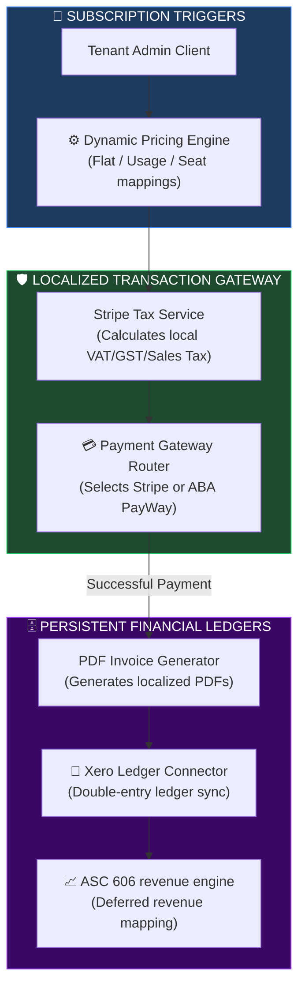
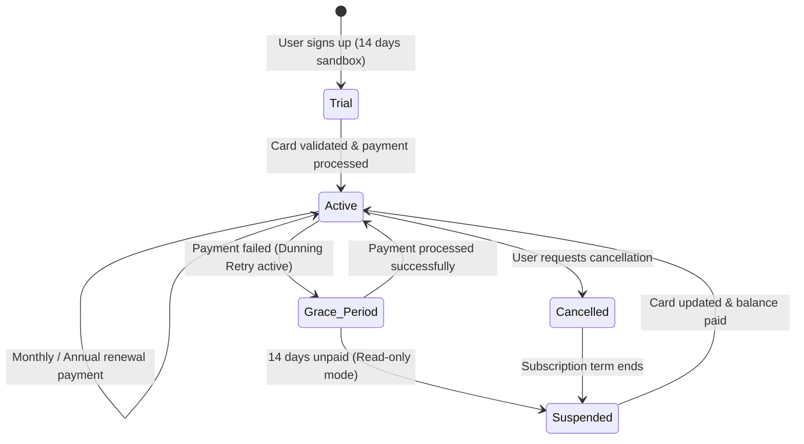
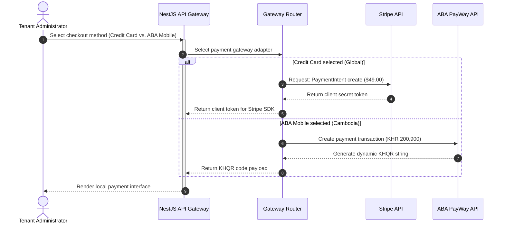
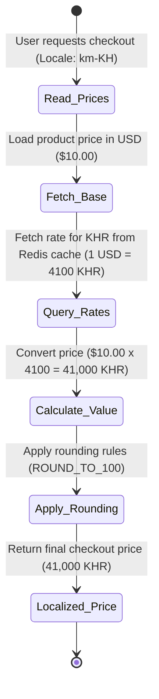
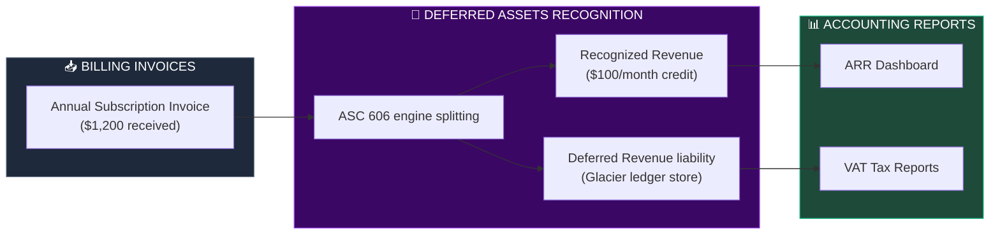

# MULTI-CURRENCY, GLOBAL BILLING & INTERNATIONAL PAYMENT ARCHITECTURE

**Project Name:** Enterprise SaaS Business Management Platform  
**Document Version:** 1.0.0 — Baseline Standard  
**Date:** July 14, 2026  
**Authors:** Principal SaaS Billing Architect, FinTech Platform Architect, Payment Systems Engineer, Revenue Operations Architect, Global Commerce Specialist & Enterprise SaaS Architect  
**Classification:** Enterprise Internal — Restricted (Financial Critical)  
**Status:** 💳 APPROVED GLOBAL BILLING & PAYMENT GATEWAY SPECIFICATION  

---

## TABLE OF CONTENTS

| Section | Title | Description |
| :---: | :--- | :--- |
| **§1** | [Global Billing Foundation](#section-1--global-billing-foundation) | Traditional billing vs. global SaaS billing, and core revenue challenges |
| **§2** | [Billing Platform Architecture](#section-2--billing-platform-architecture) | The core billing loop: Subscription services to gateways to ledgers |
| **§3** | [Multi-Currency Engine](#section-3--multi-currency-engine) | Supported currencies (USD, KHR, EUR, JPY, CNY) and rounding policies |
| **§4** | [Exchange Rate Management](#section-4--exchange-rate-management) | Exchange rate provider ingestion and manual overrides |
| **§5** | [Subscription Billing System](#section-5--subscription-billing-system) | Lifecycle states: trials, active, renewals, upgrades, cancellations |
| **§6** | [Pricing Engine](#section-6--pricing-engine) | Supported pricing models: Flat rate, usage-based, per-seat, enterprise |
| **§7** | [Payment Gateway Architecture](#section-7--payment-gateway-architecture) | Gateway adapters (Stripe, ABA PayWay, KHQR, PayPal, Bank Transfers) |
| **§8** | [Payment Security](#section-8--payment-security) | Tokenization, credit card masking, and PCI DSS compliance rules |
| **§9** | [Invoice Management](#section-9--invoice-management) | Automated PDF generation, localized VAT billing invoices |
| **§10** | [Tax Management](#section-10--tax-management) | Localization tax engine for global taxes (VAT, GST, Sales Tax) |
| **§11** | [Revenue Management](#section-11--revenue-management) | Tracking ARR, MRR, churn, and ASC 606 revenue recognition rules |
| **§12** | [Accounting Integration](#section-12--accounting-integration) | Double-entry ledger integrations with Xero, QuickBooks, and ERPs |
| **§13** | [Financial Reporting](#section-13--financial-reporting) | Revenue analytics, tax logs, and audit trails |
| **§14** | [Global Payment Failure Handling](#section-14--global-payment-failure-handling) | Dunning logic, sliding-scale payment retries, and account suspensions |
| **§15** | [Billing Security](#section-15--billing-security) | Role-based access controls for finance records, and transaction logs |
| **§16** | [Billing Technology Stack](#section-16--billing-technology-stack) | Technology list: Stripe Billing, Chargebee, Stripe Tax |
| **§17** | [Multi-Tenant Billing](#section-17--multi-tenant-billing) | Usage tracking and billing admin portals for tenant accounts |
| **§18** | [Global Billing Operations](#section-18--global-billing-operations) | Finance teams, billing support agents, and customer success |
| **§19** | [Billing Roadmap](#section-19--billing-roadmap) | Roadmap stages: Basic subscriptions to AI-driven finance automation |
| **§20** | [Final Global Billing Architecture](#section-20--final-global-billing-architecture) | 5 comprehensive technical Mermaid billing flowcharts |

---

## SECTION 1 — GLOBAL BILLING FOUNDATION

### 1.1 Traditional Billing vs. Global SaaS Billing
*   **Traditional Billing:** Operates with fixed, one-off invoices, single-currency transactions, and manual tax compliance calculations.
*   **Global SaaS Billing:** Handles recurring subscriptions, dynamic usage-based pricing, multi-currency processing, local tax rules (e.g., VAT, GST), and automated revenue recognition rules (in compliance with ASC 606 standards).

```
THE GLOBAL BILLING PIPELINE
═══════════════════════════════════════════════════════════════════════════════
   [ Tenant Usage / Plans ] ──► [ Global Tax Engine ] ──► [ Localized Invoice ]
                                                               │
                                       ┌───────────────────────┴───────────────────────┐
                                       ▼                                               ▼
                             [ International Gateway ]                       [ Accounting Ledger ]
                            ├── Stripe / PayPal (Global)                     ├── Xero / QuickBooks Sync
                            └── ABA PayWay / KHQR (Cambodia)                 └── ASC 606 revenue rules
═══════════════════════════════════════════════════════════════════════════════
```

---

## SECTION 2 — BILLING PLATFORM ARCHITECTURE

### 2.1 The Core Billing Loop
Dynamic client actions (e.g., user additions, subscription upgrades) trigger the pricing engine, calculate localized taxes, execute gateway payments, and generate ledgers.

```
THE REVENUE FLOW
═══════════════════════════════════════════════════════════════════════════════
 [ Subscription Change ] ──► [ Pricing Engine ] ──► [ Localized Tax Calc ]
                                                           │
                                                           ▼
 [ Xero Ledger Sync ] ◄── [ PDF Invoice Gen ] ◄── [ Payment Gateway Auth ]
═══════════════════════════════════════════════════════════════════════════════
```

---

## SECTION 3 — MULTI-CURRENCY ENGINE

### 3.1 Currency Configuration
The billing engine supports processing, pricing, and invoicing in multiple currencies, using a central base currency (USD) for financial reporting:
*   **USD:** US Dollar (Base currency).
*   **KHR:** Cambodian Riel.
*   **EUR:** Euro.
*   **JPY:** Japanese Yen.
*   **CNY:** Chinese Yuan.

---

## SECTION 4 — EXCHANGE RATE MANAGEMENT

### 4.1 Ingestion & Update Policies
*   **Automated Updates:** The exchange rate engine updates currency tables daily using data from Open Exchange Rates.
*   **Manual Overrides:** Administrative overrides are available for region-specific billing terms or contracts.

```json
// configs/billing/exchange-rates-cache.json
{
  "provider": "open_exchange_rates",
  "base_currency": "USD",
  "timestamp": "2026-07-14T00:00:00Z",
  "rates": {
    "KHR": 4100.00,
    "EUR": 0.92,
    "JPY": 158.50,
    "CNY": 7.25
  },
  "rounding_rules": {
    "KHR": "ROUND_TO_100",
    "USD": "ROUND_TO_CENT",
    "EUR": "ROUND_TO_CENT",
    "JPY": "ROUND_TO_YEN",
    "CNY": "ROUND_TO_CENT"
  }
}
```

---

## SECTION 5 — SUBSCRIPTION BILLING SYSTEM

### 5.1 The Subscription Lifecycle
*   **Trial:** Zero-cost sandbox access for 14 days; requires a card validation check to start.
*   **Active:** System accesses are active, and invoices are generated automatically at the start of each billing cycle.
*   **Cancellation:** Uptime accesses remain active until the current billing cycle ends, after which the account transitions to a suspended state.

---

## SECTION 6 — PRICING ENGINE

### 6.1 Supported Pricing Models
*   **Flat Rate:** Fixed monthly or annual subscription fee.
*   **Usage-Based:** Charges based on tenant resources consumed (e.g., API requests, gigabytes stored).
*   **Per-User (Seat):** Fees scale with the number of active user accounts.
*   **Enterprise Custom:** Tailored pricing rules defined via service contracts.

---

## SECTION 7 — PAYMENT GATEWAY ARCHITECTURE

### 7.1 Gateway Adapters & Local Payment Rails
*   **Stripe Integration:** Primary gateway for card transactions, Apple Pay, and Google Pay.
*   **ABA PayWay (Cambodia):** Handles local transactions using KHQR and ABA mobile banking apps.
*   **KHQR (Cambodia):** Local bank transactions via National Bank of Cambodia standard QR codes.

```typescript
// src/billing/gateways/stripe.adapter.ts
import { Injectable } from '@nestjs/common';
import Stripe from 'stripe';

@Injectable()
export class StripeBillingAdapter {
  private stripe: Stripe;

  constructor() {
    this.stripe = new Stripe(process.env.STRIPE_SECRET_KEY, {
      apiVersion: '2023-10-16',
    });
  }

  async createSubscriptionPayment(
    customerId: string, 
    priceId: string, 
    currency: string
  ): Promise<Stripe.PaymentIntent> {
    return this.stripe.paymentIntents.create({
      customer: customerId,
      amount: 4900, // Amount in cents ($49.00)
      currency: currency.toLowerCase(),
      payment_method_types: ['card'],
      metadata: { source: 'saas_subscription_renewal' }
    });
  }
}
```

---

## SECTION 8 — PAYMENT SECURITY

### 8.1 PCI DSS Control Requirements
*   **Tokenization:** The platform never stores raw credit card details. All payment values are tokenized at the gateway level.
*   **Transit Security:** Encrypts all transaction details using TLS 1.3 tunnels.

---

## SECTION 9 — INVOICE MANAGEMENT

### 9.1 Localized PDF Generation
*   **Localized Templates:** Invoices are generated dynamically, adjusting tax labels, headers, and currency symbols based on the tenant's region.
*   **Tax Compliance:** Displays the tenant's business registration and local VAT/GST details on the invoice.

---

## SECTION 10 — TAX MANAGEMENT

### 10.1 Automated Localization Tax Calculation
*   **VAT (Europe/APAC):** Calculated based on the user's location and local tax rates.
*   **Sales Tax (US):** Integrates with Stripe Tax to calculate and apply state-specific sales tax rates.

---

## SECTION 11 — REVENUE MANAGEMENT

### 11.1 ASC 606 Revenue Recognition
*   **ASC 606 Compliance:** Revenue is recognized incrementally over the subscription term. For example, a $1,200 annual subscription is recognized as $100 in revenue monthly, with the remainder tracked as deferred revenue.

---

## SECTION 12 — ACCOUNTING INTEGRATION

### 12.1 Ledger Sync Operations
*   **Ledger Sync:** Synced invoices are exported daily to double-entry ledger platforms like Xero and QuickBooks.
*   **Bank Reconciliation:** Automates matching bank deposit logs with payment gateway transactions.

---

## SECTION 13 — FINANCIAL REPORTING

### 13.1 Key Performance Metrics
*   **MRR (Monthly Recurring Revenue):** Tracks month-over-month revenue trends.
*   **ARR (Annual Recurring Revenue):** Forecasts annual revenue based on active subscriptions.
*   **LTV (Lifetime Value):** Average revenue generated per customer account.
*   **CAC (Customer Acquisition Cost):** Total sales and marketing cost to acquire a new customer.

---

## SECTION 14 — GLOBAL PAYMENT FAILURE HANDLING

### 14.1 Dunning Logic Retries
If a payment fails, the system executes the following dunning workflow:
*   **Retry 1:** 3 days after first failure; email notification sent to billing admin.
*   **Retry 2:** 7 days after first failure; system permissions restricted to read-only.
*   **Retry 3:** 14 days after first failure; subscription is suspended.

---

## SECTION 15 — BILLING SECURITY

### 15.1 Audit Controls
*   **Access Control:** Access to billing configurations and transaction logs is restricted to authorized finance team members.
*   **Audit Logging:** All billing updates (e.g., manual refunds, credit notes) are logged to immutable storage for auditing.

---

## SECTION 16 — BILLING TECHNOLOGY STACK

### 16.1 Financial Infrastructure Tools

| Category | Technology | Purpose |
| :--- | :--- | :--- |
| **Payment Gateway** | Stripe / PayPal | Core subscription billing engine and checkout handler. |
| **Local Payment** | ABA PayWay | Direct mobile banking transactions in Cambodia. |
| **Local QR standard**| KHQR | Mobile banking transactions via National Bank standard. |
| **Tax Engine** | Stripe Tax / Avalara | Automates local tax rate calculations. |
| **Ledger Sync** | Xero API | Syncs invoices and updates accounting ledgers. |

---

## SECTION 20 — FINAL GLOBAL BILLING ARCHITECTURE

### 20.1 Global Billing Architecture



### 20.2 Subscription Lifecycle



### 20.3 Payment Processing Flow



### 20.4 Currency Conversion Flow



### 20.5 Revenue Management Architecture



---

## DOCUMENT METADATA

| Field | Value |
| :--- | :--- |
| **Document ID** | SAAS-BILL-019.3 |
| **Section** | 19 — Global Infrastructure |
| **Subsection** | 19.3 — Multi-Currency & Global Billing |
| **Status** | 💳 APPROVED |
| **Version** | 1.0.0 |
| **Date** | July 14, 2026 |
| **Next Review** | January 14, 2027 |
| **Related Documents** | [Multi-Region SaaS Strategy](../19.1-Multi-Region-Architecture/Multi-Region-Architecture.md) · [Localization & i18n](../19.2-i18n-Localization-Architecture/i18n-Localization-Architecture.md) |
| **Technology Versions** | Stripe API v3 · Stripe Tax v2 · ABA PayWay v2.0 · Xero API v2.4 |

---

*This document is the authoritative specification for all multi-currency calculations, global subscription lifecycles, payment gateway adapter interfaces, localized tax rules, dunning retry processes, and ASC 606 revenue recognition engines in the SaaS Business Management Platform. All pricing logic, exchange rate updates, payment verification steps, and ledger synchronizations must conform to the standards defined herein.*
