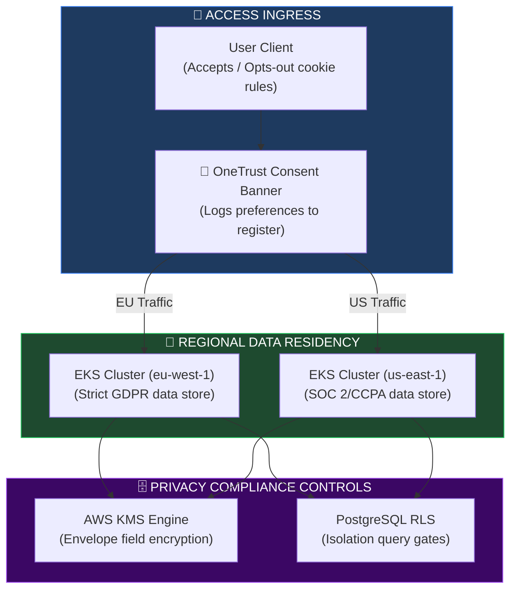
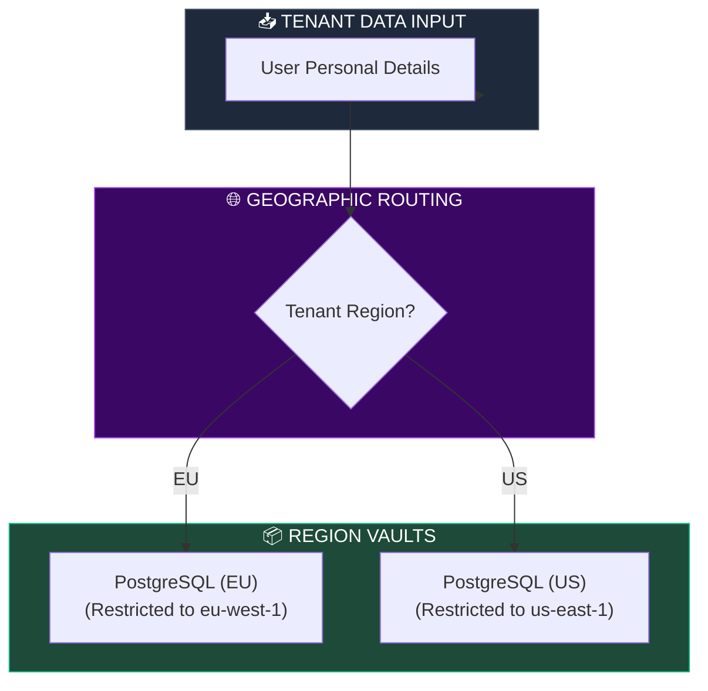
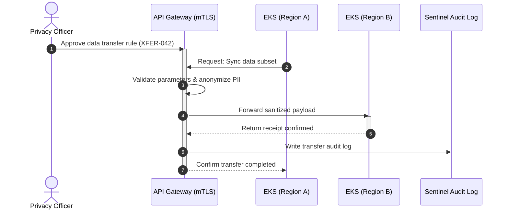
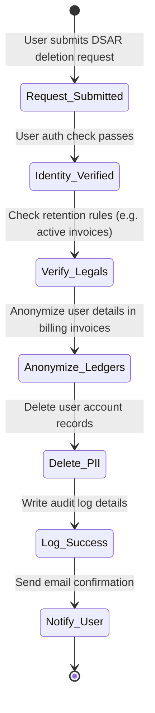
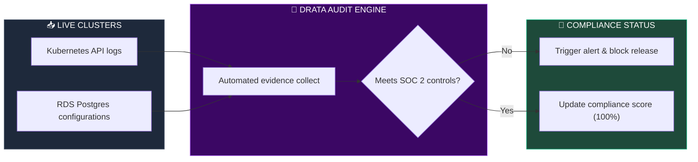

# REGIONAL COMPLIANCE, DATA RESIDENCY & GLOBAL PRIVACY ARCHITECTURE

**Project Name:** Enterprise SaaS Business Management Platform  
**Document Version:** 1.0.0 — Baseline Standard  
**Date:** July 14, 2026  
**Authors:** Principal Privacy Architect, Global Compliance Architect, Data Governance Expert, Cloud Security Architect, Enterprise SaaS Architect & International Regulatory Specialist  
**Classification:** Enterprise Internal — Restricted (Compliance Critical)  
**Status:** ⚖️ APPROVED GLOBAL COMPLIANCE & PRIVACY FRAMEWORK SPECIFICATION  

---

## TABLE OF CONTENTS

| Section | Title | Description |
| :---: | :--- | :--- |
| **§1** | [Global Privacy Foundation](#section-1--global-privacy-foundation) | Why global SaaS requires structural privacy engineering |
| **§2** | [Data Residency Architecture](#section-2--data-residency-architecture) | Request routing paths: user region to data residency vaults |
| **§3** | [Regional Data Model](#section-3--regional-data-model) | Data layers: global replication vs. regional-only constraints |
| **§4** | [Cross-Border Data Transfer](#section-4--cross-border-data-transfer) | SEC-compliant cross-region transfers, logs, encryption |
| **§5** | [Privacy Management System](#section-5--privacy-management-system) | Consent tracking systems, data deletion pipelines, and portals |
| **§6** | [Data Subject Rights](#section-6--data-subject-rights) | Automated DSAR rights (Access, Correct, Delete, Export) |
| **§7** | [Compliance Framework](#section-7--compliance-framework) | Global mapping: GDPR, HIPAA, SOC 2, ISO 27001, CCPA |
| **§8** | [Privacy by Design](#section-8--privacy-by-design) | Principles: Data minimization, purpose limits, secure defaults |
| **§9** | [Consent Management](#section-9--consent-management) | User cookie opt-in flows, consent registers, and audits |
| **§10** | [Compliance Automation](#section-10--compliance-automation) | Continuous evidence gatherers, real-time policy checks |
| **§11** | [Data Governance](#section-11--data-governance) | Governance roles: Data Owners, Stewards, Privacy Officers |
| **§12** | [Regional Deployment Rules](#section-12--regional-deployment-rules) | Allowed microservices, localized backups, region-bound networks |
| **§13** | [Privacy Security Controls](#section-13--privacy-security-controls) | Dynamic masking, envelope field encryption, data tokens |
| **§14** | [Audit Management](#section-14--audit-management) | Internal audit loops: planning, evidence, findings, reviews |
| **§15** | [Third-Party Compliance](#section-15--third-party-compliance) | Vendor privacy audits, API connection limits, plugin scans |
| **§16** | [Compliance Technology Stack](#section-16--compliance-technology-stack) | Technology list: OneTrust, Drata, AWS Control Tower, Vanta |
| **§17** | [Privacy Monitoring](#section-17--privacy-monitoring) | Real-time alerts for unauthorized data reads, transfer logs |
| **§18** | [Global Compliance Operating Model](#section-18--global-compliance-operating-model) | Teams coordination: legal counsel, GRC engineers, SREs |
| **§19** | [Compliance Maturity Roadmap](#section-19--compliance-maturity-roadmap) | Roadmap stages: Basic checklist to continuous compliance automation |
| **§20** | [Final Global Privacy Architecture](#section-20--final-global-privacy-architecture) | 5 comprehensive technical Mermaid compliance diagrams |

---

## SECTION 1 — GLOBAL PRIVACY FOUNDATION

### 1.1 The Compliance Challenge
A globally distributed SaaS platform must manage varying privacy regulations (e.g., EU GDPR, California CCPA, Canada PIPEDA) while maintaining data residency requirements and secure cross-border transfer rules.

```
THE COMPLIANCE PARADIGM
═══════════════════════════════════════════════════════════════════════════════
   [ Local Data Ingress ] ──► [ Resident Database Node ]
                                     │
                                     ▼ (Cross-Border Check)
   [ Secure Consent Gates ] ◄── [ Immutable Audit Log ]
═══════════════════════════════════════════════════════════════════════════════
```

---

## SECTION 2 — DATA RESIDENCY ARCHITECTURE

### 2.1 Regional Segregation Model
User identities and transaction logs are routed directly to the tenant's chosen geographic region to ensure compliance with local data residency requirements.

```
THE REGIONAL RESIDENCY BOUNDS
═══════════════════════════════════════════════════════════════════════════════
                   [ Route 53 Geo-Location ALB ]
                                 │
         ┌───────────────────────┼───────────────────────┐
         ▼                       ▼                       ▼
 [ region: us-east-1 ]   [ region: eu-west-1 ]   [ region: ap-southeast-1 ]
   └── US Tenant DB        └── EU Tenant DB        └── APAC Tenant DB
═══════════════════════════════════════════════════════════════════════════════
```

---

## SECTION 3 — REGIONAL DATA MODEL

### 3.1 Data Residency Rules
*   **Global Data:** Global SKU catalogs, anonymized analytics templates, and system configuration metrics.
*   **Regional Data:** Tenant specific PII, invoice ledger records, and localized transactional tables.

---

## SECTION 4 — CROSS-BORDER DATA TRANSFER

### 4.1 Cross-Region Security Policies
*   **Encryption:** All data in transit is encrypted using TLS 1.3 tunnels.
*   **Audit Logging:** Cross-region data transfers are logged to verify authorization and compliance.

```json
// configs/privacy/cross-border-transfer.json
{
  "transfer_id": "XFER-2026-042",
  "source_region": "eu-west-1",
  "destination_region": "us-east-1",
  "authorized_by": "Privacy Officer",
  "justification": "Cross-region analytics extraction",
  "encryption": {
    "transit": "TLS 1.3",
    "payload": "AES-256-GCM"
  },
  "data_fields": [
    { "field": "user_id", "status": "ANONYMIZED" },
    { "field": "transaction_total", "status": "PLAIN" },
    { "field": "email", "status": "BLOCKED" }
  ]
}
```

---

## SECTION 5 — PRIVACY MANAGEMENT SYSTEM

### 5.1 Consent & Request Portals
*   **Consent Management:** Tracks user cookie preferences and data collection opt-ins.
*   **Privacy Portal:** Allows users to request data exports, access logs, or trigger account deletion workflows.

---

## SECTION 6 — DATA SUBJECT RIGHTS (DSAR)

### 6.1 Right to Erasure Execution
When a user submits a deletion request, the system triggers the following data erasure pipeline:

```typescript
// src/privacy/erasure.processor.ts
import { Injectable } from '@nestjs/common';
import { PrismaService } from '../database/prisma.service';

@Injectable()
export class DataErasureProcessor {
  constructor(private prisma: PrismaService) {}

  async executeRightToBeForgotten(userId: string): Promise<boolean> {
    // 1. Anonymize user details in transaction ledgers (to maintain accounting integrity)
    await this.prisma.invoice.updateMany({
      where: { userId },
      data: { 
        customerEmail: 'deleted-user@privacy.saas-platform.com',
        customerBillingName: 'ANONYMIZED_USER'
      }
    });

    // 2. Delete user account and PII records
    await this.prisma.user.delete({
      where: { id: userId }
    });

    return true;
  }
}
```

---

## SECTION 7 — COMPLIANCE FRAMEWORK

### 7.1 Compliance Standard Mappings
*   **GDPR:** Enforces data minimization, consent tracking, and localized data storage.
*   **SOC 2 Type II:** Audits security, availability, and privacy controls over a 6-month period.
*   **ISO 27001:** Aligns with ISMS requirements, encryption standards, and incident management procedures.

---

## SECTION 8 — PRIVACY BY DESIGN

### 8.1 Core Principles
*   **Data Minimization:** Only collect the data fields required for system operations.
*   **Privacy by Default:** Opt-in settings are disabled by default for telemetry and non-essential tracking.

---

## SECTION 9 — CONSENT MANAGEMENT

### 9.1 The Consent Flow
1.  **Consent Prompt:** The user is presented with a privacy banner on their first visit.
2.  **Consent Record:** Preference settings are saved to the user's profile and logged for audit purposes.

---

## SECTION 10 — COMPLIANCE AUTOMATION

### 10.1 Continuous Audit Readiness
*   **Evidence Collection:** Platforms like Drata automatically verify database settings and access policies to maintain audit readiness.
*   **Policy Verification:** Automated checks verify that RLS isolation policies remain active on all database tables.

---

## SECTION 11 — DATA GOVERNANCE

### 11.1 Key Roles
*   **Data Owner:** Approves data access rules and migration plans.
*   **Data Steward:** Configures and monitors database encryption settings and access policies.
*   **Privacy Officer:** Reviews cross-border data transfer requests and manages DSAR compliance.

---

## SECTION 12 — REGIONAL DEPLOYMENT RULES

### 12.1 Deployment Regulations
*   **EU Deployment:** Backups must be stored in EU data centers (e.g., Ireland, Frankfurt) to comply with data residency regulations.
*   **Network Isolation:** Regional EKS clusters are isolated, with cross-region communication restricted to authorized API gateways.

---

## SECTION 13 — PRIVACY SECURITY CONTROLS

### 13.1 PII Protection Measures
*   **Field Encryption:** Encrypts sensitive fields (e.g., social security numbers, tax IDs) using customer-managed KMS keys.
*   **Dynamic Data Masking:** Masks PII data fields in application logs to prevent accidental exposure.

---

## SECTION 14 — AUDIT MANAGEMENT

### 14.1 Audit Processes
*   **Audit Planning:** Define control targets and select compliance frameworks.
*   **Audit Remediation:** Compliance gaps are logged in Jira and resolved by engineering teams before audits begin.

---

## SECTION 15 — THIRD-PARTY COMPLIANCE

### 15.1 Partner Integration Audits
*   **Vendor Checks:** Third-party integrations must complete security questionnaires and verify GDPR compliance.
*   **App Store Scans:** Marketplace plugins undergo automated vulnerability scans before listing.

---

## SECTION 16 — COMPLIANCE TECHNOLOGY STACK

### 16.1 Compliance Platform Tools

| Category | Tool | Purpose |
| :--- | :--- | :--- |
| **Privacy Portal** | OneTrust | Manages user consent settings and tracks DSAR requests. |
| **Audit Compliance** | Drata / Vanta | Automates evidence collection for SOC 2. |
| **Rule Enforcer** | AWS Control Tower | Enforces regional data boundaries and access rules. |
| **Data Catalog** | Apache Atlas | Maps data assets and tracks processing lineage. |

---

## SECTION 20 — FINAL GLOBAL PRIVACY ARCHITECTURE

### 20.1 Global Compliance Architecture



### 20.2 Data Residency Model



### 20.3 Cross-Border Data Flow



### 20.4 Privacy Request Workflow (DSAR)



### 20.5 Compliance Automation Architecture



---

## DOCUMENT METADATA

| Field | Value |
| :--- | :--- |
| **Document ID** | SAAS-PRIVACY-019.4 |
| **Section** | 19 — Global Infrastructure |
| **Subsection** | 19.4 — Compliance & Data Privacy |
| **Status** | ⚖️ APPROVED |
| **Version** | 1.0.0 |
| **Date** | July 14, 2026 |
| **Next Review** | January 14, 2027 |
| **Related Documents** | [Multi-Region SaaS Strategy](../19.1-Multi-Region-Architecture/Multi-Region-Architecture.md) · [Zero Trust Foundation](../../18-Security-Architecture/18.1-Zero-Trust-Foundation/Zero-Trust-Foundation.md) · [Data Security](../../18-Security-Architecture/18.4-Data-Security-Compliance/Data-Security-Compliance.md) |
| **Technology Versions** | OneTrust v2024 · Drata Agent v2.5 · AWS Control Tower v3.0 |

---

*This document is the authoritative specification for all regional compliance policies, data residency rules, cross-border data transfer permissions, consent management setups, data subject erasure (DSAR) workflows, and automated compliance evidence collect scripts in the SaaS Business Management Platform. All policy definitions, data classifications, dynamic mask layouts, and audit checklists must conform to the standards defined herein.*
