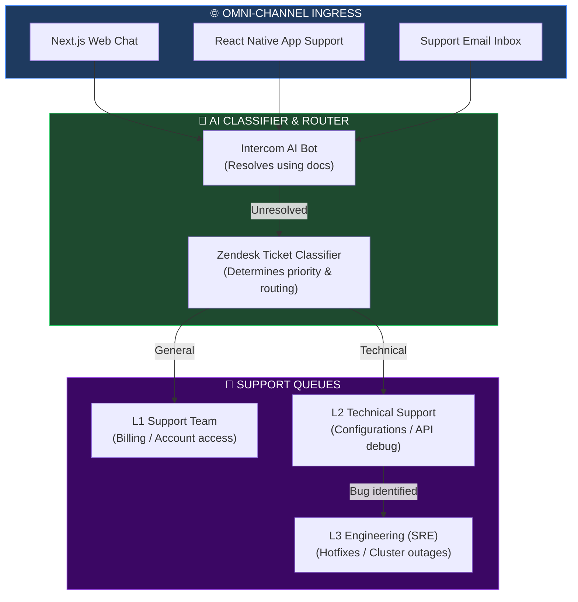
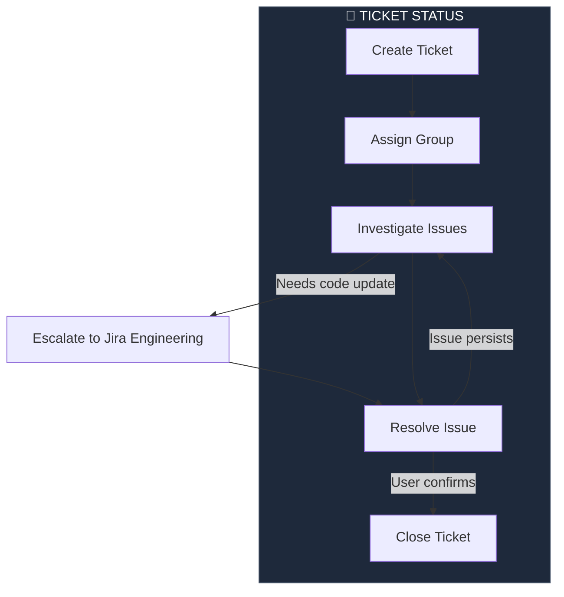
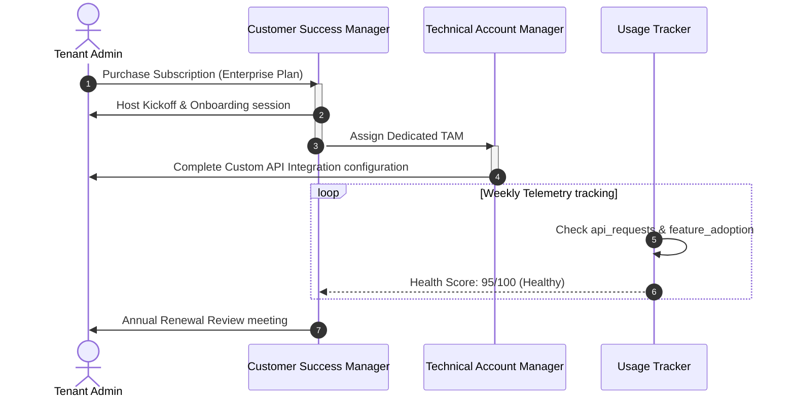
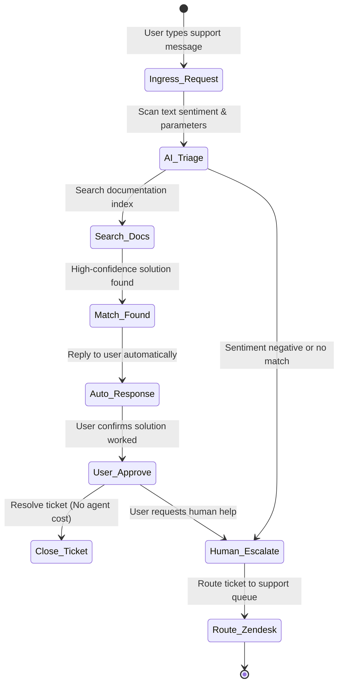
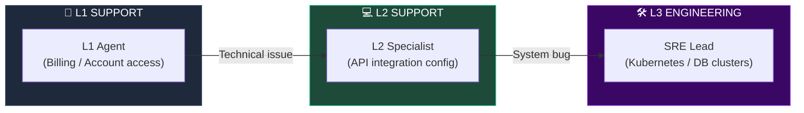

# GLOBAL CUSTOMER SUPPORT, SUCCESS & ENTERPRISE SERVICE ARCHITECTURE

**Project Name:** Enterprise SaaS Business Management Platform  
**Document Version:** 1.0.0 — Baseline Standard  
**Date:** July 14, 2026  
**Authors:** Principal Customer Experience Architect, SaaS Operations Architect, Customer Success Strategist, Enterprise Support Architect, AI Support Platform Engineer & Global SaaS Architect  
**Classification:** Enterprise Internal — C-Suite Release  
**Status:** 👑 APPROVED GLOBAL CUSTOMER OPERATIONS & SERVICE DESIGN  

---

## TABLE OF CONTENTS

| Section | Title | Description |
| :---: | :--- | :--- |
| **§1** | [Customer Support Foundation](#section-1--customer-support-foundation) | Traditional support vs. modern SaaS customer experience |
| **§2** | [Customer Experience Architecture](#section-2--customer-experience-architecture) | The unified experience chain: Channels to bots to tier support |
| **§3** | [Support Channels](#section-3--support-channels) | Omni-channel access: web chat, mobile app, email, phone routing |
| **§4** | [Customer Ticket System](#section-4--customer-ticket-system) | Log schemas, state lifecycles, and automated assignment rules |
| **§5** | [SLA Management](#section-5--sla-management) | Response and resolution commitments by subscription tiers |
| **§6** | [Customer Success Platform](#section-6--customer-success-platform) | Lifecycle journeys: onboarding to adoption to renewal |
| **§7** | [Customer Health Score](#section-7--customer-health-score) | Formula mappings calculating user engagement and retention |
| **§8** | [Knowledge Management](#section-8--knowledge-management) | Internal/external knowledge base structures and versioning |
| **§9** | [AI Customer Support](#section-9--ai-customer-support) | AI chat integrations, sentiment analysis, and documentation lookups |
| **§10** | [Enterprise Support Model](#section-10--enterprise-support-model) | Escalation tiers: L1 Support, L2 Technical support, L3 SRE Engineering |
| **§11** | [Customer Portal Architecture](#section-11--customer-portal-architecture) | Self-service portals: ticket logs, analytics dashboards, invoicing |
| **§12** | [Customer Feedback System](#section-12--customer-feedback-system) | Net Promoter Score (NPS) loops and feature request trackers |
| **§13** | [Customer Analytics](#section-13--customer-analytics) | Dashboard KPIs: CSAT, CES, ticket volume, first contact resolutions |
| **§14** | [Global Support Operations](#section-14--global-support-operations) | Follow-the-sun global support teams (AMER, EMEA, APAC) |
| **§15** | [Support Technology Stack](#section-15--support-technology-stack) | Technology list: Zendesk, Intercom, Freshdesk, Salesforce |
| **§16** | [Customer Data Security](#section-16--customer-data-security) | Encryption, attachment isolation, and conversation audits |
| **§17** | [Support Automation](#section-17--support-automation) | Dynamic ticket routers, priority detectors, macro recommenders |
| **§18** | [Customer Success Operating Model](#section-18--customer-success-operating-model) | Team structures: CSMs, TAMs, Support SREs |
| **§19** | [Customer Experience Roadmap](#section-19--customer-experience-roadmap) | Roadmap stages: Basic ticketing to predictive customer success |
| **§20** | [Final Customer Experience Architecture](#section-20--final-customer-experience-architecture) | 5 comprehensive technical Mermaid service diagrams |

---

## SECTION 1 — CUSTOMER SUPPORT FOUNDATION

### 1.1 Support Evolution
*   **Traditional Support:** Operates using siloed email threads, static phone queues, and manual ticket routing, often leading to slow resolution times and fragmented user experiences.
*   **Modern SaaS Customer Experience:** Integrates omni-channel support interfaces, automated AI routing systems, and real-time telemetry to proactively resolve customer issues.

```
THE SERVICE ARCHITECTURE
═══════════════════════════════════════════════════════════════════════════════
   [ Inbound Customer Request ] ──► [ AI Support Agent triage ]
                                           ├── Auto-resolve (Docs match)
                                           └── Route to Tiered Support
                                                  ├── L1 General (Billing)
                                                  ├── L2 Technical (Configs)
                                                  └── L3 Engineering (SRE)
═══════════════════════════════════════════════════════════════════════════════
```

---

## SECTION 2 — CUSTOMER EXPERIENCE ARCHITECTURE

### 2.1 Operational Support Chain
User requests are ingested via API, triaged by the AI Classifier, matched against SLAs, and routed to the appropriate support queue.

```
THE OPERATIONS LIFECYCLE
═══════════════════════════════════════════════════════════════════════════════
 [ User Inbound ] ──► [ AI Classifier / SLA check ] ──► [ Zendesk routing ]
                                                             │
                                                             ▼
 [ Jira Escalate ] ◄── [ L3 SRE Engineering ] ◄── [ L2 Tech Support ]
═══════════════════════════════════════════════════════════════════════════════
```

---

## SECTION 3 — SUPPORT CHANNELS

### 3.1 Omni-Channel Entry Points
*   **Email:** Tickets are generated automatically from support addresses (e.g., `support@saas-platform.com`).
*   **Live Chat:** Real-time chat widget embedded within Next.js dashboards.
*   **Mobile App:** Support portal built directly into React Native clients.
*   **Phone (VoIP):** Unified corporate call routing.

---

## SECTION 4 — CUSTOMER TICKET SYSTEM

### 4.1 Ticket Structure Schema
Tickets are logged in Zendesk with metadata payload mappings for priority routing:

```json
// configs/support/ticket-schema.json
{
  "ticket_id": "TKT-2026-8910",
  "tenant_id": "tenant-corp-99",
  "subscription_tier": "ENTERPRISE",
  "channel": "LIVE_CHAT",
  "subject": "POS sync latency in Boston store",
  "priority": "HIGH",
  "status": "OPEN",
  "sla_deadline": "2026-07-14T09:12:00Z",
  "routing_tags": ["pos_sync", "latency", "database_replica"],
  "assigned_group": "L2_TECHNICAL_SUPPORT",
  "history": [
    { "timestamp": "2026-07-14T08:12:00Z", "action": "TICKET_CREATED" },
    { "timestamp": "2026-07-14T08:14:00Z", "action": "AI_ROUTED_TO_L2" }
  ]
}
```

---

## SECTION 5 — SLA MANAGEMENT

### 5.1 Response & Resolution Targets

| Subscription Tier | First Response SLA | Resolution SLA | Account Management |
| :--- | :--- | :--- | :--- |
| **Standard Plan** | < 8 business hours | < 24 business hours| Self-service portal |
| **Business Plan** | < 2 business hours | < 8 business hours | Shared Support Pool |
| **Enterprise Plan**| < 15 minutes (24/7) | < 2 hours | Dedicated Technical Account Manager (TAM) |

---

## SECTION 6 — CUSTOMER SUCCESS PLATFORM

### 6.1 Customer Success Milestones
*   **Onboarding:** Guided platform setup, data migrations, and API integrations.
*   **Adoption:** Proactive training sessions to encourage feature usage.
*   **Expansion:** Recommending add-on plugins based on tenant usage patterns.
*   **Renewal:** Contract review and renewal coordination.

---

## SECTION 7 — CUSTOMER HEALTH SCORE

### 7.1 Score Calculation Formula
Customer health is calculated daily using the following formula:
$$\text{Health Score} = (\text{Usage Frequency} \times 0.3) + (\text{Feature Adoption} \times 0.25) - (\text{Critical Tickets} \times 0.25) + (\text{Payment Status} \times 0.2)$$
*   **Health Tiers:** Green (80-100: Healthy), Amber (50-79: At Risk), Red (<50: High Churn Risk).

---

## SECTION 8 — KNOWLEDGE MANAGEMENT

### 8.1 Documentation Registry
*   **API Reference:** OpenAPI schemas and developer SDK guides.
*   **Customer FAQs:** Common user troubleshooting steps and billing guides.

---

## SECTION 9 — AI CUSTOMER SUPPORT

### 9.1 AI Support Assistant
*   **AI Resolution:** Resolves common user questions automatically using documentation lookups.
*   **Sentiment Analysis:** Analyzes customer sentiment in real-time to escalate frustrated users to human agents.

```yaml
# configs/support/ai-classifier-rules.yaml
classifier:
  provider: "openai"
  model: "gpt-4o"
  temperature: 0.1
  rules:
    - category: "BILLING"
      keywords: ["invoice", "refund", "pricing", "charge"]
      routing_target: "L1_GENERAL_SUPPORT"
    - category: "TECHNICAL_BUG"
      keywords: ["error", "sync", "fail", "broken", "offline"]
      routing_target: "L2_TECHNICAL_SUPPORT"
  sentiment_escalation:
    enabled: true
    threshold: "NEGATIVE" # Escalates directly to human agent if sentiment is negative
```

---

## SECTION 10 — ENTERPRISE SUPPORT MODEL

### 10.1 Support Tier Responsibilities
*   **L1 (General Support):** Handles billing questions, account access issues, and basic troubleshooting.
*   **L2 (Technical Support):** Handles configuration issues, API integrations, and database errors.
*   **L3 (Engineering Support):** Handles code updates, database migrations, and infrastructure failovers.

---

## SECTION 11 — CUSTOMER PORTAL ARCHITECTURE

### 11.1 Support Portal Features
*   **Ticket History:** View, update, and track support tickets.
*   **Usage Dashboards:** Visualizes tenant API usage, transaction volumes, and performance metrics.

---

## SECTION 12 — CUSTOMER FEEDBACK SYSTEM

### 12.1 NPS Loop Surveys
*   **NPS Surveys:** Prompts users for feedback after resolving support tickets.
*   **Feature Requests:** Tenants can suggest and vote on new platform features.

---

## SECTION 13 — CUSTOMER ANALYTICS

### 13.1 Key Support Metrics
*   **First Contact Resolution (FCR):** Percentage of tickets resolved in the first response.
*   **Customer Satisfaction (CSAT):** Average satisfaction score rating from post-ticket surveys.

---

## SECTION 14 — GLOBAL SUPPORT OPERATIONS

### 14.1 Follow-the-Sun Support
*   **AMER (Austin):** Serves customers during North American business hours.
*   **EMEA (Dublin):** Serves customers during European business hours.
*   **APAC (Singapore):** Serves customers during Asia-Pacific business hours.

---

## SECTION 15 — SUPPORT TECHNOLOGY STACK

### 15.1 CX Platform Tools

| Category | Tool | Purpose |
| :--- | :--- | :--- |
| **Ticket System** | Zendesk Enterprise | Central repository for tracking and managing support tickets. |
| **User Chat Widget** | Intercom | Embedded live chat and self-service bots. |
| **CRMs Engine** | Salesforce | Tracks customer journeys, health scores, and accounts. |
| **Knowledge Vault** | GitBook | Documentation repository and dynamic API references. |

---

## SECTION 16 — CUSTOMER DATA SECURITY

### 16.1 Support Encryption
*   **Secure Attachments:** Support attachments (e.g., error screenshots, log files) are stored in secure S3 buckets with access controls active.
*   **Data Redaction:** Automated filters redact credit card numbers and passwords from ticket threads.

---

## SECTION 20 — FINAL CUSTOMER EXPERIENCE ARCHITECTURE

### 20.1 Global Customer Support Architecture



### 20.2 Ticket Lifecycle



### 20.3 Customer Success Journey



### 20.4 AI Support Workflow



### 20.5 Enterprise Support Model



---

## DOCUMENT METADATA

| Field | Value |
| :--- | :--- |
| **Document ID** | SAAS-SUPPORT-019.5 |
| **Section** | 19 — Global Infrastructure |
| **Subsection** | 19.5 — Support & Customer Success |
| **Status** | 👑 APPROVED |
| **Version** | 1.0.0 |
| **Date** | July 14, 2026 |
| **Next Review** | January 14, 2027 |
| **Related Documents** | [Multi-Region SaaS Strategy](../19.1-Multi-Region-Architecture/Multi-Region-Architecture.md) · [API Platform Architecture](../../17-Platform-Extensibility/17.3-Public-API-Portal/Public-API-Portal.md) |
| **Technology Versions** | Zendesk API v2 · Intercom SDK v14 · Salesforce Cloud v60 |

---

*This document is the authoritative specification for all customer support processes, customer success journeys, ticket lifecycles, SLA response targets, knowledge base layouts, AI classifier configurations, and tier escalation boundaries in the SaaS Business Management Platform. All support workflows, SLA monitors, automated routing rules, and customer data protocols must conform to the standards defined herein.*
