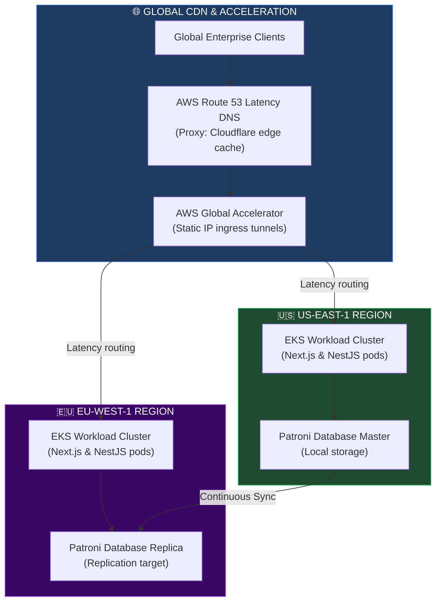
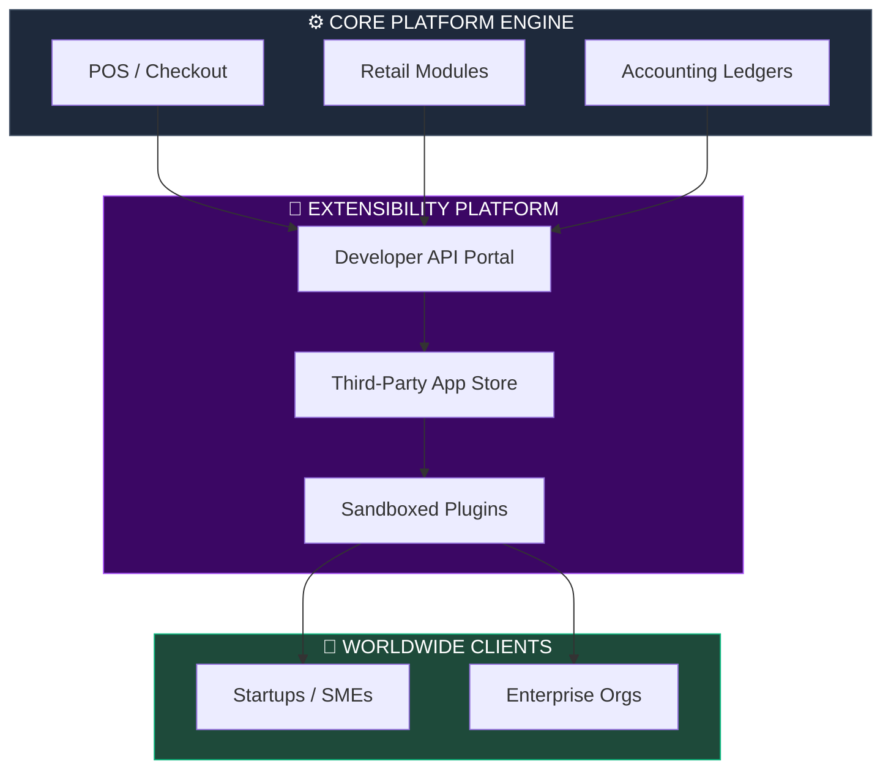
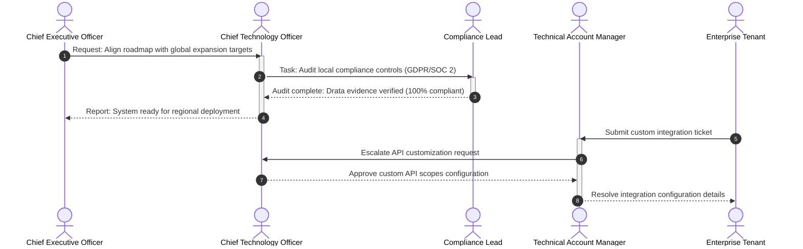
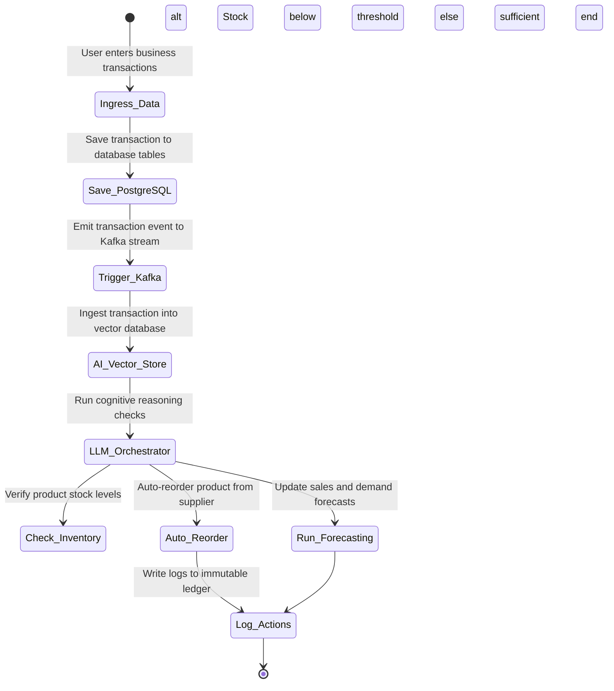

# FINAL GLOBAL SAAS BLUEPRINT & WORLDWIDE EXPANSION STRATEGY

**Project Name:** Enterprise SaaS Business Management Platform  
**Document Version:** 1.0.0 — Baseline Standard  
**Date:** July 14, 2026  
**Authors:** Chief Technology Officer (CTO), Global SaaS Platform Architect, Enterprise Cloud Architect, Product Strategy Leader, Business Transformation Architect & Digital Platform Visionary  
**Classification:** Enterprise Internal — Board Release  
**Status:** 👑 APPROVED FINAL GLOBAL SAAS BLUEPRINT & WORLDWIDE STRATEGY  

---

## TABLE OF CONTENTS

| Section | Title | Description |
| :---: | :--- | :--- |
| **§1** | [Global SaaS Vision](#section-1--global-saas-vision) | Mission, vision, and transition to a Global Business Operating System |
| **§2** | [Final Global Platform Architecture](#section-2--final-global-platform-architecture) | The worldwide ingress path: User requests to regional AI data zones |
| **§3** | [Global Platform Layers](#section-3--global-platform-layers) | Architectural stack layers: Experience, App, Services, Data, and Infra |
| **§4** | [Global Multi-Tenant Model](#section-4--global-multi-tenant-model) | Tiered tenant architectures: Small Business, Growth, Enterprise |
| **§5** | [Business Module Ecosystem](#section-5--business-module-ecosystem) | Core modules (POS, Retail, Inventory) and future app directories |
| **§6** | [Global Business Model](#section-6--global-business-model) | Revenue streams: Subscriptions, commissions, usage, and premium AI |
| **§7** | [Global Operating Model](#section-7--global-operating-model) | Organizational structure, regional teams, and executive roles |
| **§8** | [Global Technology Strategy](#section-8--global-technology-strategy) | Architecture evolution: Monolith to microservices to AI-native |
| **§9** | [AI Platform Vision](#section-9--ai-platform-vision) | AI assistant capabilities, agent workflows, and predictive controls |
| **§10** | [Global Market Expansion](#section-10--global-market-expansion) | Expansion phases: Local market launch to global SaaS dominance |
| **§11** | [Partnership Ecosystem](#section-11--partnership-ecosystem) | Strategic integrations: Cloud providers, payment rails, consultants |
| **§12** | [Platform Marketplace](#section-12--platform-marketplace) | Developer SDK portals, sandboxed plugins, and extension APIs |
| **§13** | [Global Data Strategy](#section-13--global-data-strategy) | Master data management, OLAP star schemas, and AI ingestion streams |
| **§14** | [Security & Trust Model](#section-14--security-trust-model) | Core security summary: Zero Trust, SOC 2, privacy, and DR |
| **§15** | [Customer Success Model](#section-15--customer-success-model) | Lifecycle stages: Acquisition, onboarding, adoption, and renewal |
| **§16** | [Global KPI Framework](#section-16--global-kpi-framework) | Corporate metrics dashboard: MRR, ARR, NPS, and Uptime |
| **§17** | [10-Year Global Roadmap](#section-17--10-year-global-roadmap) | Decade plan: Foundation, regional growth, global scale, AI OS |
| **§18** | [Competitive Positioning](#section-18--competitive-positioning) | Comparison: Traditional software suites vs. Global Business OS |
| **§19** | [Final Executive Summary](#section-19--final-executive-summary) | Target reports for CEO, CTO, Investors, and Enterprise Buyers |
| **§20** | [Final Global SaaS Blueprint](#section-20--final-global-saas-blueprint) | 5 comprehensive technical Mermaid global blueprints |

---

## SECTION 1 — GLOBAL SAAS VISION

### 1.1 Mission & Vision
*   **Mission:** To provide a secure, modular, and globally scalable platform that enables companies of all sizes to manage their business operations efficiently.
*   **Vision:** To evolve from traditional, siloed business applications into a unified **Global Business Operating System** that handles operations, billing, compliance, and AI-driven automation natively.

```
THE EVOLUTION PATH
═══════════════════════════════════════════════════════════════════════════════
  [ Siloed Local App ] ──► [ Multi-Tenant Cloud SaaS ] ──► [ Global Business OS ]
═══════════════════════════════════════════════════════════════════════════════
```

---

## SECTION 2 — FINAL GLOBAL PLATFORM ARCHITECTURE

### 2.1 The Unified Platform Architecture
Global user requests route through CDN edge nodes, are processed by regional Kubernetes clusters, and execute operations across isolated database schemas and data layers.

```
THE GLOBAL PLATFORM PATHWAY
═══════════════════════════════════════════════════════════════════════════════
   [ Global Users ] ──► [ Edge Network (Cloudflare) ] ──► [ Global Accelerator ]
                                                               │
                                       ┌───────────────────────┴───────────────────────┐
                                       ▼                                               ▼
                           [ Region: AMER (EKS) ]                         [ Region: EMEA (EKS) ]
                            ├── Core POS / Retail                          ├── Core POS / Retail
                            └── Local PostgreSQL RLS                       └── Local PostgreSQL RLS
                                       │                                               │
                                       └───────────────────────┬───────────────────────┘
                                                               ▼
                                                  [ AI Data Lake (Gold Zone) ]
                                                  └── star schemas / LLM agents
═══════════════════════════════════════════════════════════════════════════════
```

---

## SECTION 3 — GLOBAL PLATFORM LAYERS

### 3.1 Platform Layer Mappings
*   **Layer 1 (Experience):** Next.js web applications, React Native mobile clients, and public developer portal portals.
*   **Layer 2 (Business Application):** Core microservices (POS, Retail, Inventory, Accounting) and third-party marketplace integrations.
*   **Layer 3 (Platform Services):** Identity management (Keycloak), secure gateways (Kong), and asynchronous event messaging (Kafka).
*   **Layer 4 (Data Intelligence):** PostgreSQL database clusters, Redis caches, vector databases, and analytical warehouses.
*   **Layer 5 (Infrastructure):** AWS EKS deployments, transit networks, and global CDN edge points.

---

## SECTION 4 — GLOBAL MULTI-TENANT MODEL

### 4.1 Tenant Architecture Tiers
*   **Small Business:** Shared databases and compute resources; isolated via Row-Level Security (RLS) policies.
*   **Growing Business:** Shared databases with dedicated read replicas; isolated compute pools to prevent resource contention.
*   **Enterprise Organization:** Dedicated database instances and isolated Kubernetes namespaces to meet security and data residency compliance requirements.

---

## SECTION 5 — BUSINESS MODULE ECOSYSTEM

### 5.1 Core & Future Modules
*   **Core POS:** High-performance checkout, catalog management, and local offline payment processing.
*   **Inventory & Accounting:** Real-time stock tracking and double-entry accounting ledgers.
*   **HR & CRM:** Employee scheduling, customer directories, and loyalty programs.
*   **AI Agent (Future):** Automated inventory forecasting and predictive sales analytics.

---

## SECTION 6 — GLOBAL BUSINESS MODEL

### 6.1 Revenue Streams
*   **Subscription Plans:** Monthly or annual flat-rate subscriptions (Standard, Business, Enterprise).
*   **Marketplace Commission:** Payout splits on third-party plugin sales.
*   **API / AI Usage:** Pay-as-you-go pricing for high-volume API requests and advanced AI analytics.

---

## SECTION 7 — GLOBAL OPERATING MODEL

### 7.1 Organization Model
The global operating model coordinates executive leadership, product management, engineering, security, and regional support teams using follow-the-sun workflows.

---

## SECTION 8 — GLOBAL TECHNOLOGY STRATEGY

### 8.1 Technology Evolution Roadmap
1.  **Monolith:** Core NestJS/Next.js platforms with shared database tables.
2.  **Modular Monolith:** Separating core modules (POS, Inventory, Accounting) into distinct logical boundaries.
3.  **Platform Ecosystem:** Exposing extensibility APIs, SDK generation, and developer sandboxes.
4.  **AI-Native Platform:** Deploying automated LLM agents and predictive analysis engines directly into core business workflows.

---

## SECTION 9 — AI PLATFORM VISION

### 9.1 AI Services Mappings
*   **Business Assistant:** Natural language search for business metrics and reports.
*   **Automation Agent:** Automatically triggers inventory reorders when stock levels drop below thresholds.

---

## SECTION 10 — GLOBAL MARKET EXPANSION

### 10.1 Regional Rollout Mappings

```json
// configs/strategy/expansion-phases.json
{
  "phase_1": {
    "name": "Local Market Launch",
    "timeline": "Months 1-12",
    "target": "Establish POS baseline in Southeast Asia",
    "focus": "Local payment rails integration (ABA PayWay, KHQR)"
  },
  "phase_2": {
    "name": "Regional Expansion",
    "timeline": "Months 13-36",
    "target": "Expand into EMEA and APAC markets",
    "focus": "Localize languages, tax systems, and compliance frameworks"
  },
  "phase_3": {
    "name": "Global Scale",
    "timeline": "Months 37-60",
    "target": "Deploy to North America",
    "focus": "Integrate Stripe Tax, enforce SOC 2, and establish global support"
  }
}
```

---

## SECTION 11 — PARTNERSHIP ECOSYSTEM

### 11.1 Key Integrations
*   **Payment Providers:** Stripe, PayPal, and local mobile banking rails (ABA PayWay, KHQR).
*   **Cloud Providers:** AWS hosting EKS clusters, S3 storage, and KMS key management.

---

## SECTION 12 — PLATFORM MARKETPLACE

### 12.1 Third-Party Integration Framework
*   **Developer SDKs:** Generate client wrappers and API specifications automatically from OpenAPI definitions.
*   **Extension Sandbox:** Execute third-party plugins securely using sandboxed containers and Open Policy Agent (OPA) scopes.

---

## SECTION 13 — GLOBAL DATA STRATEGY

### 13.1 Data Lineage & Star Schema
*   **Operational DB:** PostgreSQL RLS databases handle real-time transactional reads and writes.
*   **Analytical DB:** Star/Snowflake schema data warehouses analyze billing and operational metrics.

---

## SECTION 14 — SECURITY & TRUST MODEL

### 14.1 Security Compliance Targets
*   **Zero Trust:** Istio mTLS service meshes, OPA policies, and FIDO2 MFA enforce security at every boundary.
*   **GRC Compliance:** Continuous evidence collection via Drata ensures audit readiness for SOC 2 Type II and ISO 27001.

---

## SECTION 15 — CUSTOMER SUCCESS MODEL

### 15.1 Customer Lifecycle Stages
*   **Acquisition:** Content marketing, partnerships, and product-led growth (PLG) trials.
*   **Onboarding:** Guided workflows to configure local tax rules, payment adapters, and import inventory data.

---

## SECTION 16 — GLOBAL KPI FRAMEWORK

### 16.1 Target KPIs

| KPI Metric Group | Business Target | Technology Target | Customer Experience |
| :--- | :--- | :--- | :--- |
| **Growth & Revenue**| ARR / MRR targets | Minimize cloud hosting costs | Customer Acquisition Cost (CAC) |
| **System Uptime** | N/A | 99.99% availability | Page load latency < 1.5 seconds |
| **Satisfaction** | Low Churn Rate (< 2% annual) | N/A | CSAT > 90% |

---

## SECTION 17 — 10-YEAR GLOBAL ROADMAP

### 17.1 Decade Execution Phases
*   **Years 1-2 (Foundation):** Deploy multi-tenant architecture, local payment adapters, and basic POS modules.
*   **Years 3-5 (Regional Expansion):** Expand EKS clusters into EU/APAC, localizing tax rules, languages, and compliance.
*   **Years 6-7 (Global Platform):** Expose the developer marketplace, launch billing adapters globally, and establish follow-the-sun support.
*   **Years 8-10 (AI Business OS):** Integrate autonomous LLM agents, predictive forecasting, and automated business operations.

---

## SECTION 20 — FINAL GLOBAL SAAS BLUEPRINT

### 20.1 Worldwide SaaS Architecture



### 20.2 Business Platform Ecosystem



### 20.3 Global Operating Model



### 20.4 AI Native SaaS Future Architecture



### 20.5 10-Year Vision Roadmap

```mermaid
flowchart LR
    subgraph PHASE1["🚀 FOUNDATION (Y1-2)"]
        CORE_SYS["Build Core POS & Multi-Tenant DBs"]
    end

    subgraph PHASE2["🌎 REGIONAL (Y3-5)"]
        EXPAND_SYS["Deploy clusters to EU/APAC"]
        LOCALIZE_SYS["Localize languages & tax rules"]
    end

    subgraph PHASE3["🌐 GLOBAL (Y6-7)"]
        MARKET_SYS["Launch App Store & Developer Portal"]
        SUPPORT_SYS["Establish 24/7 global support"]
    end

    subgraph PHASE4["🤖 AI OPERATING SYSTEM (Y8-10)"]
        AI_SYS["Deploy autonomous LLM agents"]
    end

    CORE_SYS --> EXPAND_SYS
    EXPAND_SYS --> LOCALIZE_SYS
    LOCALIZE_SYS --> MARKET_SYS
    MARKET_SYS --> SUPPORT_SYS
    SUPPORT_SYS --> AI_SYS

    style PHASE1 fill:#1e293b,stroke:#475569,color:#fff
    style PHASE2 fill:#1e4a3a,stroke:#10b981,color:#fff
    style PHASE3 fill:#3b0764,stroke:#a855f7,color:#fff
    style PHASE4 fill:#4a1e2e,stroke:#ec4899,color:#fff
```



---

## DOCUMENT METADATA

| Field | Value |
| :--- | :--- |
| **Document ID** | SAAS-BLUEPRINT-019.6 |
| **Section** | 19 — Global Infrastructure |
| **Subsection** | 19.6 — Global Blueprint & Strategy |
| **Status** | 👑 APPROVED |
| **Version** | 1.0.0 |
| **Date** | July 14, 2026 |
| **Next Review** | January 14, 2027 |
| **Related Documents** | [Multi-Region SaaS Strategy](../19.1-Multi-Region-Architecture/Multi-Region-Architecture.md) · [Localization & i18n](../19.2-i18n-Localization-Architecture/i18n-Localization-Architecture.md) · [Global Billing Strategy](../19.3-Global-Billing-Payments/Global-Billing-Payments.md) |

---

*This document is the authoritative specification for the Final Global SaaS Blueprint, worldwide expansion phases, 10-year technology roadmap milestones, platform layer mappings, multi-tenant tiers, and AI-native service plans in the SaaS Business Management Platform. All architecture designs, expansion timelines, technology selections, and operating rules must conform to the standards defined herein.*
