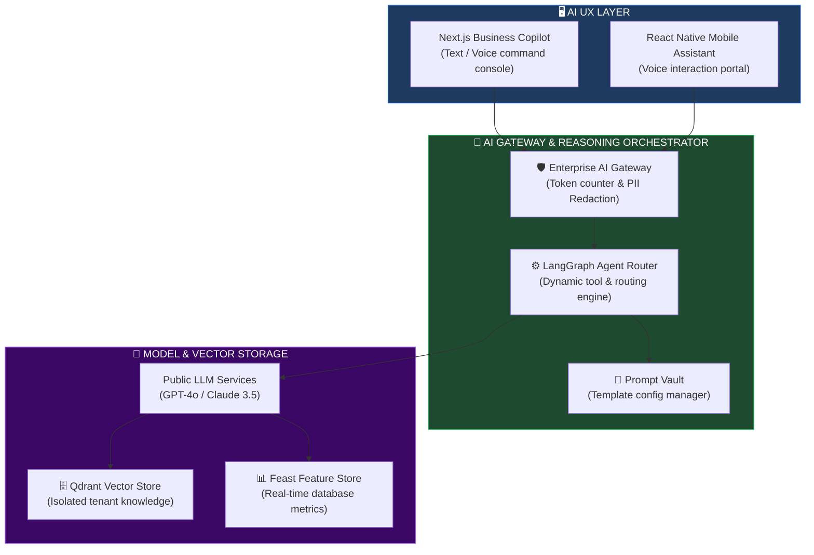
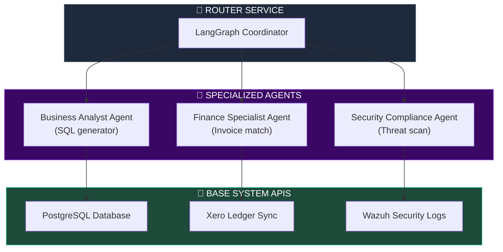
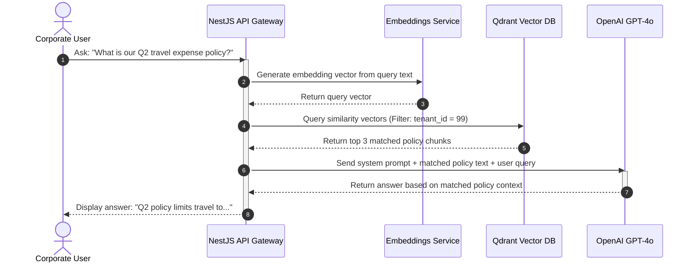
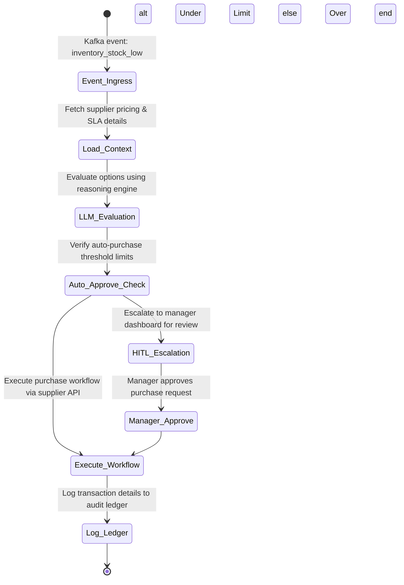
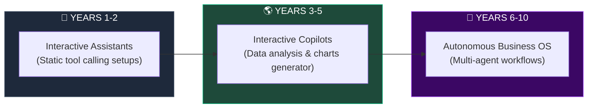

# AI-NATIVE SAAS FOUNDATION ARCHITECTURE

**Project Name:** Enterprise SaaS Business Management Platform  
**Document Version:** 1.0.0 — Baseline Standard  
**Date:** July 14, 2026  
**Authors:** Chief AI Architect, Enterprise AI Platform Architect, Machine Learning Architect, SaaS Platform Architect, Data Intelligence Engineer & AI Transformation Strategist  
**Classification:** Enterprise Internal — Board Release  
**Status:** 🤖 APPROVED AI-NATIVE FOUNDATION ARCHITECTURE SPECIFICATION  

---

## TABLE OF CONTENTS

| Section | Title | Description |
| :---: | :--- | :--- |
| **§1** | [AI-Native SaaS Foundation](#section-1--ai-native-saas-foundation) | Transformation from traditional App database architectures to AI reasoning |
| **§2** | [AI Platform Architecture](#section-2--ai-platform-architecture) | The structural layers: Experience, agents, models, features, infra |
| **§3** | [AI Platform Services](#section-3--ai-platform-services) | AI Gateway rules, Prompt vaults, evaluations, token tracking monitors |
| **§4** | [AI Data Architecture](#section-4--ai-data-architecture) | Real-time CDC streams ingestion, Feature stores mapping pipeline |
| **§5** | [AI Model Architecture](#section-5--ai-model-architecture) | Supported model types: LLMs, predictive forecasting, recommendations |
| **§6** | [AI Agent Architecture](#section-6--ai-agent-architecture) | Agent registries: Business assistant, Finance agent, Security monitor |
| **§7** | [AI Memory System](#section-7--ai-memory-system) | Conversation context buffer caches, Redis-driven long-term preferences |
| **§8** | [AI Knowledge System](#section-8--knowledge-system) | Retrieval-Augmented Generation (RAG), text chunkers, Qdrant indexing |
| **§9** | [AI Automation Engine](#section-9--ai-automation-engine) | Trigger events ingestion, reasoning checks, orchestrator actions |
| **§10** | [AI Copilot Architecture](#section-10--ai-copilot-architecture) | Interactive UI wrappers, dashboard widgets, reports auto-generation |
| **§11** | [AI Security Architecture](#section-11--ai-security-architecture) | Prompt injection blocks, PII filters, and multi-tenant RLS isolation |
| **§12** | [AI Governance](#section-12--ai-governance) | Governance policies, model evaluation criteria, human-in-the-loop gates |
| **§13** | [AI Operations (MLOps)](#section-13--ai-operations-mlops) | Pipelines: continuous training, validations, drift tracking metrics |
| **§14** | [AI Technology Stack](#section-14--ai-technology-stack) | Technology list: OpenAI, Claude, LangChain, MLflow, Qdrant |
| **§15** | [AI Observability](#section-15--ai-observability) | Monitoring dashboards: accuracy, cost budgets, and user feedbacks |
| **§16** | [AI Business Value](#section-16--ai-business-value) | Strategic targets: manual work reduction, productivity, speed |
| **§17** | [AI Maturity Roadmap](#section-17--ai-maturity-roadmap) | Roadmap stages: Basic assistant to autonomous business operating system |
| **§18** | [AI Platform Operating Model](#section-18--ai-platform-operating-model) | Team roles: AI engineers, MLOps, Data engineers, GRC reviewers |
| **§19** | [Future AI Vision](#section-19--future-ai-vision) | Evolving from transactional business tools to autonomous business OS |
| **§20** | [Final AI-Native SaaS Architecture](#section-20--final-ai-native-saas-architecture) | 5 comprehensive technical Mermaid AI blueprints |

---

## SECTION 1 — AI-NATIVE SAAS FOUNDATION

### 1.1 The Structural Shift
*   **Traditional SaaS:** Users navigate static forms and menus. User $\rightarrow$ Application UI $\rightarrow$ PostgreSQL Database.
*   **AI-Native SaaS:** Users express intent in natural language. The system reasons about context, accesses APIs dynamically, and executes workflows securely. User $\rightarrow$ AI Assistant $\rightarrow$ AI Reasoning Engine $\rightarrow$ Business Systems APIs.

```
THE PARADIGM SHIFT
═══════════════════════════════════════════════════════════════════════════════
   Traditional: [ User ] ──► [ Click Forms ] ──► [ DB Write ]
   
   AI-Native:   [ User Intent ] ──► [ AI Reasoning Engine ] ──► [ API Actions ]
═══════════════════════════════════════════════════════════════════════════════
```

---

## SECTION 2 — AI PLATFORM ARCHITECTURE

### 2.1 The AI Stack Layers
The platform isolates presentation, agent orchestration, prompt templates, model routing, feature ingestion, and compute resources.

```
THE AI ARCHITECTURE STACK
═══════════════════════════════════════════════════════════════════════════════
 [ Next.js Copilot UI ] ──► [ AI Gateway Router ] ──► [ LangGraph Orchestration ]
                                                             │
                                                             ▼
 [ Qdrant Vector Store ] ◄── [ Feature Store Store ] ◄── [ Model APIs / Llama ]
═══════════════════════════════════════════════════════════════════════════════
```

---

## SECTION 3 — AI PLATFORM SERVICES

### 3.1 Core Architecture Components
*   **AI Gateway:** Manages API authentication, rate limiting, and routes requests to LLM providers.
*   **Prompt Manager:** Stores, versions, and manages system prompt templates.
*   **AI Memory Service:** Persists conversation state and user preferences in low-latency Redis stores.

```json
// configs/ai/ai-gateway-router.json
{
  "routing_rules": {
    "default_model": "gpt-4o",
    "fallback_model": "claude-3-5-sonnet",
    "provider_weights": {
      "openai": 0.7,
      "anthropic": 0.3
    },
    "rate_limits": {
      "enterprise_tier": { "rpm": 1000, "tpm": 100000 },
      "business_tier": { "rpm": 200, "tpm": 20000 }
    },
    "pii_redaction": {
      "enabled": true,
      "redact_fields": ["credit_card", "phone_number", "ssn"]
    }
  }
}
```

---

## SECTION 4 — AI DATA ARCHITECTURE

### 4.1 Ingestion & Feature Engineering
*   **CDC Event Streaming:** Ingests transactional updates in real-time from PostgreSQL using Debezium and Kafka.
*   **Feature Store:** Combines operational data and user metrics to provide real-time context for model inference.

---

## SECTION 5 — AI MODEL ARCHITECTURE

### 5.1 Supported Models
*   **Large Language Models (LLMs):** Handles task routing, query parsing, and interactive support (OpenAI GPT-4o, Claude 3.5, Llama 3).
*   **Time-Series Forecasting:** Forecasts inventory levels and cash flow trends (ARIMA, LSTM models).
*   **Classification Engines:** Identifies fraudulent transactions and categorizes support tickets.

---

## SECTION 6 — AI AGENT ARCHITECTURE

### 6.1 Agent Registry
*   **Business Assistant:** Translates natural language queries into SQL database queries.
*   **Finance Agent:** Automates invoice reconciliation and tracks expense anomalies.
*   **Security Monitor:** Detects unauthorized access patterns and blocks potential threats.

---

## SECTION 7 — AI MEMORY SYSTEM

### 7.1 Memory Layers
*   **Conversation Memory:** Short-term cache that persists dialogue history during active sessions.
*   **User Preference Memory:** Stores user-specific interface settings and language preferences.
*   **Business Context Memory:** Persists tenant organization hierarchies, tax rules, and localized parameters.

---

## SECTION 8 — KNOWLEDGE SYSTEM

### 8.1 Retrieval-Augmented Generation (RAG)
*   **RAG Engine:** Parses corporate documentation, files, and FAQs, converts the text into vector embeddings, and indexes them in Qdrant for semantic search.

```typescript
// src/ai/rag/rag.service.ts
import { Injectable } from '@nestjs/common';
import { QdrantClient } from '@qdrant/js-client-rest';
import { OpenAIEmbeddings } from '@langchain/openai';

@Injectable()
export class RAGRetrievalService {
  private qdrant: QdrantClient;
  private embeddings: OpenAIEmbeddings;

  constructor() {
    this.qdrant = new QdrantClient({ url: process.env.QDRANT_HOST });
    this.embeddings = new OpenAIEmbeddings({ modelName: 'text-embedding-3-small' });
  }

  async retrieveContext(query: string, tenantId: string): Promise<string[]> {
    const queryVector = await this.embeddings.embedQuery(query);
    const searchResults = await this.qdrant.search('enterprise_knowledge', {
      vector: queryVector,
      filter: {
        must: [
          { key: 'tenant_id', match: { value: tenantId } }
        ]
      },
      limit: 3
    });

    return searchResults.map(result => result.payload.text as string);
  }
}
```

---

## SECTION 9 — AI AUTOMATION ENGINE

### 9.1 Event-Driven Reasoning Loops
1.  **Detect Event:** Event ingestion engine receives a system notification (e.g., "inventory_low").
2.  **Reasoning Check:** The orchestrator retrieves context and determines the next logical action.
3.  **Execute Workflow:** The automation engine executes the selected action via system APIs.

---

## SECTION 10 — AI COPILOT ARCHITECTURE

### 10.1 Chat Interfaces
*   **Next.js Copilot Console:** Embedded chat panel that allows users to ask questions, generate reports, and execute tasks using natural language.
*   **Dynamic UI Rendering:** Renders interactive tables, charts, or confirmation buttons directly in the chat panel based on the model's response.

---

## SECTION 11 — AI SECURITY ARCHITECTURE

### 11.1 Security Controls
*   **PII Filtering:** Redacts sensitive personal information from payloads before forwarding requests to public model APIs.
*   **Data Isolation:** Applies tenant-specific namespace filters in Qdrant to prevent cross-tenant data leaks during retrieval.

---

## SECTION 12 — AI GOVERNANCE

### 12.1 Governance Controls
*   **Human-in-the-Loop (HITL):** High-risk actions (e.g., executing high-value payments or updating user permissions) require manual confirmation from a human administrator.
*   **Access Reviews:** Automated tools review model outputs to ensure quality and compliance.

---

## SECTION 13 — AI OPERATIONS (MLOPS)

### 13.1 Deployment Lifecycles
*   **Training & Evaluation:** Models are trained using Kubeflow pipelines and evaluated against performance datasets.
*   **Monitoring & Drift Detection:** Tracks prediction latency, token usage costs, and alerts teams if model accuracy drifts below thresholds.

---

## SECTION 14 — AI TECHNOLOGY STACK

### 14.1 Enterprise AI Stack Components

| Category | Technology | Purpose |
| :--- | :--- | :--- |
| **Model APIs** | OpenAI GPT-4o / Claude 3.5 | Core LLMs for task routing, chat assistance, and code generation. |
| **Vector DB** | Qdrant | Stores and indexes vector embeddings for multi-tenant RAG. |
| **Frameworks** | LangChain / LangGraph | Orchestrates agent workflows, tool calls, and state transitions. |
| **MLOps Pipeline**| MLflow / Kubeflow | Manages model packaging, execution tracking, and pipelines. |

---

## SECTION 20 — FINAL AI-NATIVE SAAS ARCHITECTURE

### 20.1 AI-Native SaaS Architecture



### 20.2 AI Agent Ecosystem



### 20.3 RAG Knowledge Architecture



### 20.4 AI Automation Pipeline



### 20.5 AI Operating System Vision



---

## DOCUMENT METADATA

| Field | Value |
| :--- | :--- |
| **Document ID** | SAAS-AI-020.1 |
| **Section** | 20 — AI-Native SaaS |
| **Subsection** | 20.1 — AI-Native Foundation |
| **Status** | 🤖 APPROVED |
| **Version** | 1.0.0 |
| **Date** | July 14, 2026 |
| **Next Review** | January 14, 2027 |
| **Related Documents** | [Enterprise Data Platform](../../16-AI-Platform/16.2-Enterprise-Data-Platform/Enterprise-Data-Platform.md) · [Vector Database Architecture](../../16-AI-Platform/16.5-Generative-AI-RAG/Generative-AI-RAG.md) |

---

*This document is the authoritative specification for all AI-Native SaaS foundation engines, prompt templates, RAG query paths, memory architectures, automated agent workflows, security controls, and MLOps deployment cycles in the SaaS Business Management Platform. All prompt structures, vector index filters, tool integrations, and human confirmation workflows must conform to the standards defined herein.*
