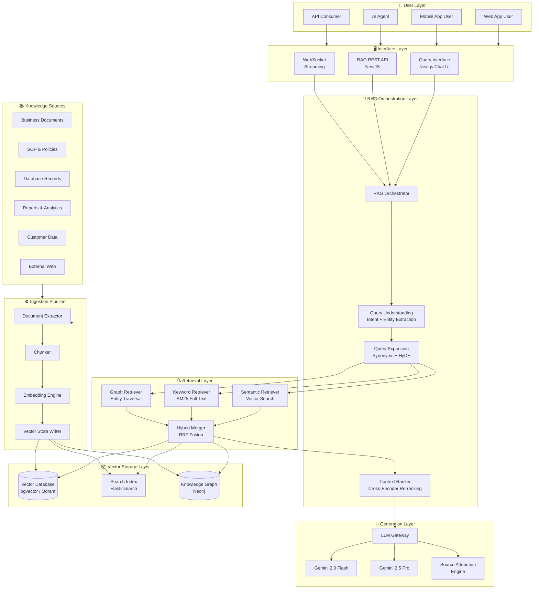
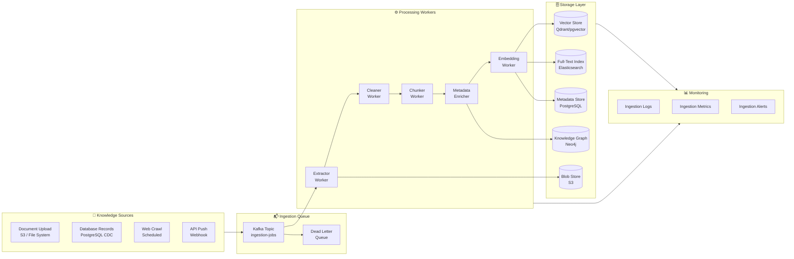
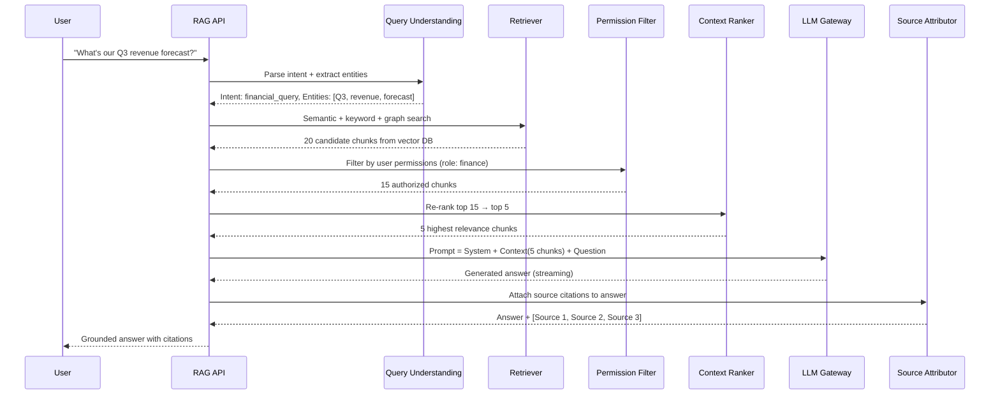
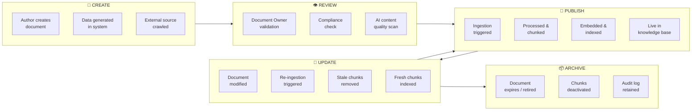
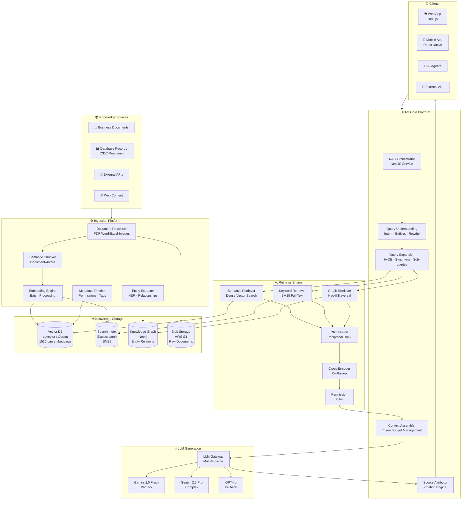
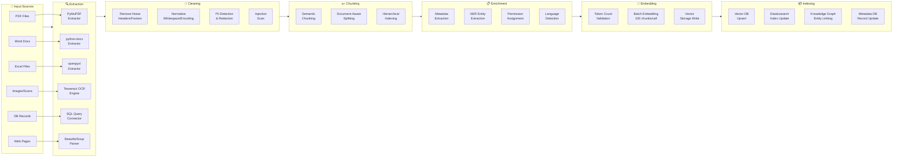
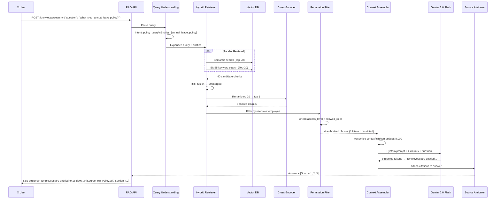

# RAG KNOWLEDGE INTELLIGENCE SYSTEM ARCHITECTURE

**Project Name:** Enterprise SaaS Business Management Platform  
**Document Version:** 1.0.0 — Baseline Standard  
**Date:** July 14, 2026  
**Authors:** Chief AI Architect, RAG Specialist, Knowledge Management Architect, Data Platform Architect, LLM Engineer, Enterprise SaaS AI Architect  
**Classification:** Internal — Confidential  
**Phase:** 20.3 — RAG Knowledge Intelligence System Architecture  

---

## Table of Contents

1. [Executive Summary](#1-executive-summary)
2. [RAG Foundation & Design Philosophy](#2-rag-foundation--design-philosophy)
3. [Enterprise RAG System Architecture](#3-enterprise-rag-system-architecture)
4. [Knowledge Sources & Taxonomy](#4-knowledge-sources--taxonomy)
5. [Document Ingestion Pipeline](#5-document-ingestion-pipeline)
6. [Document Processing System](#6-document-processing-system)
7. [Embedding Architecture](#7-embedding-architecture)
8. [Vector Database Architecture](#8-vector-database-architecture)
9. [Retrieval Engine](#9-retrieval-engine)
10. [RAG Orchestration Layer](#10-rag-orchestration-layer)
11. [Enterprise Knowledge Graph](#11-enterprise-knowledge-graph)
12. [Multi-Tenant Knowledge Isolation](#12-multi-tenant-knowledge-isolation)
13. [RAG Security Architecture](#13-rag-security-architecture)
14. [AI Search Experience](#14-ai-search-experience)
15. [RAG Evaluation Framework](#15-rag-evaluation-framework)
16. [RAG Observability & Monitoring](#16-rag-observability--monitoring)
17. [RAG Technology Stack](#17-rag-technology-stack)
18. [Knowledge Management Operations](#18-knowledge-management-operations)
19. [AI Business Knowledge Applications](#19-ai-business-knowledge-applications)
20. [RAG Evolution Roadmap](#20-rag-evolution-roadmap)
21. [Final RAG Knowledge Architecture Diagrams](#21-final-rag-knowledge-architecture-diagrams)
22. [Implementation Guide & Summary](#22-implementation-guide--summary)

---

## 1. Executive Summary

### 1.1 Document Purpose

This document defines the complete enterprise Retrieval-Augmented Generation (RAG) Knowledge Intelligence System Architecture for the SaaS Business Management Platform. It provides the authoritative technical blueprint for designing, deploying, and operating a knowledge-grounded AI system that empowers AI Agents and AI Assistants to answer business questions accurately using real company data, documents, policies, and operational information.

### 1.2 Strategic Objective

The RAG Knowledge Intelligence Platform transforms how the organization interacts with its own knowledge — enabling any authorized user or AI Agent to ask natural language questions and receive accurate, contextually grounded, source-attributed answers drawn directly from the company's living knowledge base.

### 1.3 Core Value Proposition

| Problem (Without RAG) | Solution (With RAG) |
|---|---|
| LLM answers based on general training data | LLM answers based on YOUR company's actual data |
| Hallucinated facts with no source | Grounded answers with document citations |
| Knowledge locked in documents and silos | Knowledge universally accessible via natural language |
| Static AI with stale information | Dynamic AI updated with latest company knowledge |
| One-size-fits-all generic responses | Personalized, tenant-specific, role-scoped answers |

### 1.4 Key Architecture Capabilities

- **Enterprise Knowledge Ingestion**: Ingest 20+ document types from all business systems
- **Semantic Understanding**: Deep embedding-based meaning extraction, not keyword matching
- **Multi-Tenant Isolation**: Strict per-tenant knowledge boundaries enforced at vector level
- **Hybrid Retrieval**: Semantic + keyword + graph-based retrieval for maximum accuracy
- **Source Attribution**: Every answer cites its source documents with confidence scores
- **Knowledge Graph**: Entity-relationship intelligence connecting business concepts
- **Real-Time Updates**: Knowledge base reflects changes within minutes of document updates
- **Enterprise Security**: Permission-aware retrieval — users see only what they're authorized for

---

## 2. RAG Foundation & Design Philosophy

### 2.1 Traditional LLM vs RAG-Enhanced AI

```
┌─────────────────────────────────────────────────────────────────────┐
│            TRADITIONAL LLM vs RAG-ENHANCED AI                        │
├───────────────────────────────┬─────────────────────────────────────┤
│     TRADITIONAL LLM           │      RAG-ENHANCED AI                 │
├───────────────────────────────┼─────────────────────────────────────┤
│                               │                                      │
│  User Question                │  User Question                       │
│       │                       │       │                              │
│       ▼                       │       ▼                              │
│  ┌──────────┐                 │  ┌──────────────────────┐            │
│  │  Static  │                 │  │  Knowledge Retrieval │            │
│  │  LLM     │                 │  │  (Vector Search)     │            │
│  │  Weights │                 │  └──────────┬───────────┘            │
│  └────┬─────┘                 │             │                        │
│       │                       │             ▼                        │
│       ▼                       │  ┌──────────────────────┐            │
│  General Answer               │  │  Context Injection   │            │
│  (May Hallucinate)            │  │  (Retrieved Docs)    │            │
│                               │  └──────────┬───────────┘            │
│  ✗ No company knowledge       │             │                        │
│  ✗ No citations               │             ▼                        │
│  ✗ May be outdated            │  ┌──────────────────────┐            │
│  ✗ Generic answers            │  │  LLM Reasoning       │            │
│                               │  │  (Grounded in docs)  │            │
│                               │  └──────────┬───────────┘            │
│                               │             │                        │
│                               │             ▼                        │
│                               │  Cited, Accurate Answer              │
│                               │                                      │
│                               │  ✓ Grounded in company data         │
│                               │  ✓ Source citations provided        │
│                               │  ✓ Always current                   │
│                               │  ✓ Role-scoped responses            │
└───────────────────────────────┴─────────────────────────────────────┘
```

### 2.2 RAG Core Principle: Retrieve → Augment → Generate

```
┌──────────────────────────────────────────────────────────────────────┐
│                     RAG PROCESSING PIPELINE                           │
│                                                                        │
│   ┌─────────┐    ┌─────────────┐    ┌──────────────┐   ┌──────────┐ │
│   │  User   │───▶│  R: Retrieve│───▶│  A: Augment  │──▶│G: Generate│ │
│   │Question │    │             │    │              │   │          │ │
│   │         │    │ Semantic    │    │ Inject docs  │   │ LLM      │ │
│   │         │    │ search in   │    │ into LLM     │   │ reasons  │ │
│   │         │    │ vector DB   │    │ context      │   │ over     │ │
│   │         │    │             │    │ window       │   │ retrieved│ │
│   │         │    │ Top-K most  │    │              │   │ context  │ │
│   │         │    │ relevant    │    │ Add source   │   │          │ │
│   │         │    │ chunks      │    │ metadata     │   │ Produces │ │
│   │         │    │             │    │              │   │ grounded │ │
│   └─────────┘    └─────────────┘    └──────────────┘   │ answer   │ │
│                                                          └──────────┘ │
└──────────────────────────────────────────────────────────────────────┘
```

### 2.3 Design Principles

#### Principle 1: Knowledge Grounding
Every AI response must be traceable to a source document. Answers that cannot be grounded in retrieved knowledge are flagged as low confidence.

#### Principle 2: Precision over Recall
Retrieve fewer, higher-quality chunks rather than flooding the LLM context with marginally relevant text. Quality of retrieval determines quality of generation.

#### Principle 3: Security-First Retrieval
Knowledge retrieval is permission-aware from the ground up. The retrieval system cannot return documents the requesting user is not authorized to access — this is enforced at the vector database filter layer, not the application layer.

#### Principle 4: Living Knowledge
The knowledge base is never static. Document updates, new business data, and operational changes are reflected in the knowledge base within minutes through continuous ingestion pipelines.

#### Principle 5: Explainable AI
Every RAG response includes source attribution (document name, section, confidence score). Users can inspect and verify any answer.

#### Principle 6: Multi-Tenant Isolation
Tenant knowledge is isolated at every layer — storage, indexing, retrieval, and generation. Cross-tenant knowledge leakage is architecturally impossible.

### 2.4 RAG Architecture Pattern Selection

| Pattern | Use Case | Complexity | Accuracy |
|---|---|---|---|
| **Naive RAG** | Simple Q&A on docs | Low | Moderate |
| **Advanced RAG** | Business Q&A with context | Medium | High |
| **Modular RAG** | Domain-specific agents | High | Very High |
| **Graph RAG** | Entity-relationship queries | Very High | Very High |
| **Agentic RAG** | Multi-step reasoning tasks | Very High | Highest |

**Platform Decision:** Implement **Modular RAG** as baseline with **Graph RAG** and **Agentic RAG** for advanced use cases.

---

## 3. Enterprise RAG System Architecture

### 3.1 High-Level System Architecture



### 3.2 Data Flow Architecture

```
QUERY PATH (Real-Time — Target <2s)
─────────────────────────────────────
User → API Gateway → Auth → RAG Orchestrator
  → Query Understanding (intent, entities, rewrite)
  → Parallel Retrieval (semantic + keyword + graph)
  → Result Fusion (RRF algorithm)
  → Cross-Encoder Re-ranking (top 20 → top 5)
  → Permission Filtering (remove unauthorized docs)
  → Context Assembly (format for LLM)
  → LLM Generation (streamed)
  → Source Attribution (attach citations)
  → Response to User

INGESTION PATH (Near-Real-Time — target <5 min)
─────────────────────────────────────────────────
Source Document → Trigger (webhook/schedule/event)
  → Document Extractor (PDF/Word/Excel/Image/HTML)
  → Content Cleaner (remove noise, normalize)
  → Chunker (recursive, semantic, or fixed)
  → Metadata Enricher (tenant, permissions, type, date)
  → Embedding Engine (parallel batch)
  → Vector Store Write (upsert with metadata)
  → Search Index Update (Elasticsearch sync)
  → Knowledge Graph Update (entity extraction + linking)
  → Ingestion Complete Event (notify subscribers)
```

### 3.3 NestJS RAG Module Architecture

```typescript
// RAG Module Structure
@Module({
  imports: [
    VectorDatabaseModule,
    EmbeddingModule,
    LLMGatewayModule,
    KnowledgeGraphModule,
    SearchIndexModule,
    IngestionModule,
    SecurityModule,
  ],
  controllers: [RAGController, SearchController, IngestionController],
  providers: [
    RAGOrchestratorService,
    QueryUnderstandingService,
    RetrieverService,
    ContextRankerService,
    GenerationService,
    SourceAttributionService,
    PermissionFilterService,
    RAGEvaluationService,
    RAGObservabilityService,
  ],
  exports: [RAGOrchestratorService],
})
export class RAGModule {}
```

---

## 4. Knowledge Sources & Taxonomy

### 4.1 Knowledge Source Registry

```
┌──────────────────────────────────────────────────────────────────────┐
│                   ENTERPRISE KNOWLEDGE TAXONOMY                       │
│                                                                        │
│  Tier 1 — Structured Knowledge (High Authority)                       │
│  ┌──────────────────────────────────────────────────────────────┐    │
│  │  • Company Policies          • HR Handbooks                  │    │
│  │  • SOPs & Process Docs       • Compliance Documents          │    │
│  │  • Product Documentation     • Legal Contracts               │    │
│  │  • Financial Regulations     • Quality Standards             │    │
│  └──────────────────────────────────────────────────────────────┘    │
│                                                                        │
│  Tier 2 — Operational Knowledge (Current & Dynamic)                   │
│  ┌──────────────────────────────────────────────────────────────┐    │
│  │  • Business Reports          • Meeting Minutes                │    │
│  │  • Project Documentation     • Incident Reports               │    │
│  │  • Customer Communications   • Support Tickets                │    │
│  │  • Sales Materials           • Training Materials             │    │
│  └──────────────────────────────────────────────────────────────┘    │
│                                                                        │
│  Tier 3 — Data Knowledge (Structured Records)                         │
│  ┌──────────────────────────────────────────────────────────────┐    │
│  │  • PostgreSQL Records        • Transaction History            │    │
│  │  • CRM Customer Data         • Product Catalog                │    │
│  │  • Inventory Records         • Financial Ledger               │    │
│  │  • HR Employee Records       • Analytics Reports              │    │
│  └──────────────────────────────────────────────────────────────┘    │
│                                                                        │
│  Tier 4 — External Knowledge (Public & Curated)                       │
│  ┌──────────────────────────────────────────────────────────────┐    │
│  │  • Industry Standards        • Regulatory Guidelines          │    │
│  │  • Public Web Content        • News & Market Data             │    │
│  │  • Partner Documentation     • API Documentation              │    │
│  └──────────────────────────────────────────────────────────────┘    │
└──────────────────────────────────────────────────────────────────────┘
```

### 4.2 Knowledge Source Configuration

```typescript
// Knowledge Source Registry
interface KnowledgeSource {
  sourceId: string;
  name: string;
  type: 'document' | 'database' | 'api' | 'web' | 'stream';
  
  // Access
  tenantId: string;
  accessLevel: 'public' | 'internal' | 'confidential' | 'restricted';
  allowedRoles: string[];
  
  // Ingestion
  ingestionStrategy: 'full' | 'incremental' | 'real_time';
  schedule?: CronExpression;
  webhookEnabled: boolean;
  
  // Processing
  documentTypes: DocumentType[];
  chunkingStrategy: ChunkingStrategy;
  embeddingModel: EmbeddingModel;
  
  // Metadata
  priority: 1 | 2 | 3 | 4;    // Authority tier
  freshnessTTL: number;        // Seconds before re-ingestion needed
  languageCode: string;
}

// Example Sources
const knowledgeSources: KnowledgeSource[] = [
  {
    sourceId: 'hr-policies',
    name: 'HR Policy Documents',
    type: 'document',
    accessLevel: 'internal',
    allowedRoles: ['employee', 'manager', 'hr', 'admin'],
    ingestionStrategy: 'incremental',
    documentTypes: ['pdf', 'docx'],
    priority: 1,
    freshnessTTL: 86400,      // 24 hours
  },
  {
    sourceId: 'customer-db',
    name: 'Customer Records',
    type: 'database',
    accessLevel: 'confidential',
    allowedRoles: ['sales', 'support', 'manager', 'admin'],
    ingestionStrategy: 'real_time',
    priority: 2,
    freshnessTTL: 300,        // 5 minutes
  },
  {
    sourceId: 'financial-reports',
    name: 'Financial Reports',
    type: 'document',
    accessLevel: 'restricted',
    allowedRoles: ['finance', 'cfo', 'admin'],
    ingestionStrategy: 'incremental',
    documentTypes: ['pdf', 'xlsx'],
    priority: 1,
    freshnessTTL: 3600,       // 1 hour
  },
];
```

### 4.3 Document Format Support Matrix

| Format | Extension | Extractor | OCR Required | Metadata Extraction |
|---|---|---|---|---|
| PDF | `.pdf` | PyMuPDF / pdfplumber | Scanned only | Title, Author, Date, Pages |
| Word | `.docx`, `.doc` | python-docx | No | Title, Author, Modified |
| Excel | `.xlsx`, `.csv` | openpyxl / pandas | No | Sheet names, Column headers |
| PowerPoint | `.pptx` | python-pptx | No | Slide titles, Speaker notes |
| Images | `.jpg`, `.png`, `.tiff` | Tesseract OCR | Yes | EXIF data |
| HTML / Web | `.html`, URL | BeautifulSoup | No | Title, Meta tags |
| Markdown | `.md` | Direct parse | No | Headers, Links |
| Plain Text | `.txt` | Direct parse | No | None |
| Email | `.eml`, `.msg` | email / msgraph | No | From, To, Subject, Date |
| Database | SQL | Connector | No | Table, Column, Timestamp |
| JSON / XML | `.json`, `.xml` | Parser | No | Schema, Fields |

---

## 5. Document Ingestion Pipeline

### 5.1 Ingestion Pipeline Architecture



### 5.2 Pipeline Stage Implementation

```typescript
// Ingestion Pipeline Orchestrator
@Injectable()
export class IngestionPipelineService {
  async ingest(source: IngestionSource): Promise<IngestionResult> {
    const jobId = generateId();
    const span = this.tracer.startSpan('ingestion.pipeline', { jobId });

    try {
      // Stage 1: Extract raw content
      const extracted = await this.extract(source);
      
      // Stage 2: Clean and normalize
      const cleaned = await this.clean(extracted);
      
      // Stage 3: Chunk into segments
      const chunks = await this.chunk(cleaned);
      
      // Stage 4: Enrich with metadata
      const enriched = await this.enrich(chunks, source);
      
      // Stage 5: Generate embeddings (batch)
      const embedded = await this.embed(enriched);
      
      // Stage 6: Store to vector DB + search index
      await this.store(embedded, source);
      
      // Stage 7: Update knowledge graph
      await this.updateKnowledgeGraph(enriched, source);
      
      // Emit completion event
      this.eventEmitter.emit('ingestion.complete', {
        jobId,
        sourceId: source.sourceId,
        chunksProcessed: chunks.length,
        tenantId: source.tenantId,
      });

      return { jobId, status: 'complete', chunksProcessed: chunks.length };
    } catch (error) {
      await this.handleIngestionError(jobId, source, error);
      throw error;
    } finally {
      span.end();
    }
  }
}
```

### 5.3 Chunking Strategies

```
┌──────────────────────────────────────────────────────────────────────┐
│                      CHUNKING STRATEGY GUIDE                          │
│                                                                        │
│  Strategy 1: Fixed-Size Chunking                                       │
│  ─────────────────────────────────                                     │
│  Chunk Size: 512 tokens | Overlap: 64 tokens                           │
│  Use Case: Simple documents, quick ingestion                           │
│  Trade-off: May split sentences mid-thought                            │
│                                                                        │
│  Strategy 2: Recursive Character Splitting                             │
│  ─────────────────────────────────────────                             │
│  Splits on: \n\n → \n → ". " → " "                                    │
│  Use Case: General documents, blog posts, reports                      │
│  Trade-off: Variable chunk sizes                                       │
│                                                                        │
│  Strategy 3: Semantic Chunking                                         │
│  ──────────────────────────────                                        │
│  Splits on: Semantic similarity threshold                              │
│  Use Case: Technical docs, policies, manuals                           │
│  Trade-off: Slower, requires embedding during chunking                 │
│                                                                        │
│  Strategy 4: Document-Aware Chunking                                   │
│  ───────────────────────────────────                                   │
│  Respects: Headers, sections, tables, lists                            │
│  Use Case: Structured documents (Word, PDF with structure)             │
│  Trade-off: Parser-dependent, complex implementation                   │
│                                                                        │
│  Strategy 5: Hierarchical Chunking                                     │
│  ─────────────────────────────────                                     │
│  Structure: Document → Section → Subsection → Paragraph                │
│  Use Case: Long-form documents requiring multi-level retrieval         │
│  Trade-off: Increased storage, multi-level query needed                │
└──────────────────────────────────────────────────────────────────────┘
```

### 5.4 Chunk Metadata Schema

```typescript
// Document Chunk Entity
interface DocumentChunk {
  // Identity
  chunkId: string;
  documentId: string;
  tenantId: string;
  
  // Content
  content: string;
  contentHash: string;          // For deduplication
  tokenCount: number;
  language: string;
  
  // Position
  chunkIndex: number;           // Position within document
  chunkTotal: number;
  pageNumber?: number;
  sectionTitle?: string;
  headingPath: string[];        // e.g., ["Chapter 2", "Section 2.1"]
  
  // Embedding
  embedding: number[];          // Dense vector
  embeddingModel: string;       // Model version used
  embeddingDimension: number;   // e.g., 1536
  
  // Provenance
  sourceDocument: {
    name: string;
    type: DocumentType;
    url?: string;
    author?: string;
    createdAt: Date;
    updatedAt: Date;
  };
  
  // Access Control
  accessLevel: 'public' | 'internal' | 'confidential' | 'restricted';
  allowedRoles: string[];
  allowedUserIds?: string[];    // For document-level access
  
  // Lifecycle
  ingestedAt: Date;
  expiresAt?: Date;
  version: number;
  isActive: boolean;
}
```

---

## 6. Document Processing System

### 6.1 Multi-Format Document Processor

```typescript
// Document Processor Factory
@Injectable()
export class DocumentProcessorService {
  private readonly processors: Map<string, DocumentProcessor> = new Map([
    ['pdf',   new PDFProcessor()],
    ['docx',  new WordProcessor()],
    ['xlsx',  new ExcelProcessor()],
    ['pptx',  new PowerPointProcessor()],
    ['html',  new HTMLProcessor()],
    ['txt',   new TextProcessor()],
    ['md',    new MarkdownProcessor()],
    ['jpg',   new ImageOCRProcessor()],
    ['png',   new ImageOCRProcessor()],
    ['csv',   new CSVProcessor()],
    ['json',  new JSONProcessor()],
    ['eml',   new EmailProcessor()],
  ]);

  async process(file: DocumentFile): Promise<ProcessedDocument> {
    const extension = file.extension.toLowerCase();
    const processor = this.processors.get(extension);
    
    if (!processor) {
      throw new UnsupportedDocumentTypeError(extension);
    }

    return processor.process(file);
  }
}

// PDF Processor with OCR fallback
@Injectable()
export class PDFProcessor implements DocumentProcessor {
  async process(file: DocumentFile): Promise<ProcessedDocument> {
    try {
      // Try text extraction first (fast path)
      const text = await this.extractTextDirect(file);
      
      if (this.isTextSufficient(text)) {
        return this.buildProcessedDocument(text, file, 'direct_extraction');
      }
      
      // Fallback to OCR for scanned PDFs
      const ocrText = await this.extractTextWithOCR(file);
      return this.buildProcessedDocument(ocrText, file, 'ocr');
      
    } catch (error) {
      throw new DocumentProcessingError(`PDF processing failed: ${error.message}`);
    }
  }

  private async extractTextDirect(file: DocumentFile): Promise<string> {
    // Use pdfplumber via Python microservice
    const response = await this.pythonService.call('extract_pdf', {
      fileUrl: file.url,
      options: { extractTables: true, preserveLayout: false },
    });
    return response.text;
  }

  private async extractTextWithOCR(file: DocumentFile): Promise<string> {
    // Convert PDF pages to images → Tesseract OCR
    const pages = await this.pythonService.call('pdf_to_images', { fileUrl: file.url });
    const ocrResults = await Promise.all(
      pages.map(page => this.ocrService.process(page))
    );
    return ocrResults.map(r => r.text).join('\n\n');
  }
}
```

### 6.2 OCR Pipeline

```
┌──────────────────────────────────────────────────────────────────────┐
│                       OCR PROCESSING PIPELINE                         │
│                                                                        │
│  Input: Scanned PDF / Image                                            │
│       │                                                                │
│       ▼                                                                │
│  ┌──────────────────────────────────────────────────────────────┐    │
│  │  PRE-PROCESSING                                              │    │
│  │  • Deskew (correct rotation)                                 │    │
│  │  • Denoise (remove artifacts)                                │    │
│  │  • Binarize (black & white)                                  │    │
│  │  • Enhance contrast                                          │    │
│  │  • Resize to optimal DPI (300+)                              │    │
│  └──────────────────────────────────────────────────────────────┘    │
│       │                                                                │
│       ▼                                                                │
│  ┌──────────────────────────────────────────────────────────────┐    │
│  │  OCR ENGINE (Tesseract 5.0 / Google Cloud Vision)            │    │
│  │  • Character recognition                                     │    │
│  │  • Word segmentation                                         │    │
│  │  • Line detection                                            │    │
│  │  • Confidence scoring per word                               │    │
│  └──────────────────────────────────────────────────────────────┘    │
│       │                                                                │
│       ▼                                                                │
│  ┌──────────────────────────────────────────────────────────────┐    │
│  │  POST-PROCESSING                                             │    │
│  │  • Spell correction (language-aware)                         │    │
│  │  • Number formatting normalization                           │    │
│  │  • Table reconstruction (row/column detection)               │    │
│  │  • Low-confidence word flagging                              │    │
│  └──────────────────────────────────────────────────────────────┘    │
│       │                                                                │
│       ▼                                                                │
│  Structured Text + Confidence Scores                                   │
└──────────────────────────────────────────────────────────────────────┘
```

### 6.3 Database Record Processing

```typescript
// Database Record to Knowledge Chunks
@Injectable()
export class DatabaseRecordIngestionService {
  async ingestTable(config: TableIngestionConfig): Promise<void> {
    const records = await this.queryRecords(config);
    
    for (const batch of chunk(records, 100)) {
      const chunks = batch.map(record => this.recordToChunk(record, config));
      await this.ingestionPipeline.processBatch(chunks);
    }
  }

  private recordToChunk(
    record: DatabaseRecord,
    config: TableIngestionConfig
  ): DocumentChunk {
    // Convert structured record to natural language text for embedding
    const naturalLanguageText = this.templateService.render(
      config.textTemplate,    // e.g., "Customer {{name}} (ID: {{id}}) is a {{tier}} customer..."
      record
    );

    return {
      chunkId: `db:${config.table}:${record.id}`,
      content: naturalLanguageText,
      sourceDocument: {
        name: `${config.table} Record #${record.id}`,
        type: 'database_record',
        updatedAt: record.updatedAt,
      },
      accessLevel: config.accessLevel,
      allowedRoles: config.allowedRoles,
    };
  }
}
```

---

## 7. Embedding Architecture

### 7.1 Embedding Process Flow

```
┌──────────────────────────────────────────────────────────────────────┐
│                      EMBEDDING ARCHITECTURE                           │
│                                                                        │
│  Input Text                                                            │
│  "Our refund policy allows returns within 30 days..."                 │
│       │                                                                │
│       ▼                                                                │
│  ┌──────────────────────────────────────────────────────────────┐    │
│  │                 PRE-PROCESSING                               │    │
│  │  • Tokenization (split into tokens)                          │    │
│  │  • Normalization (lowercase, punctuation)                    │    │
│  │  • Language detection                                        │    │
│  │  • Token count validation (< model max)                      │    │
│  └──────────────────────────────────────────────────────────────┘    │
│       │                                                                │
│       ▼                                                                │
│  ┌──────────────────────────────────────────────────────────────┐    │
│  │               EMBEDDING MODEL                                │    │
│  │                                                              │    │
│  │  Primary: text-embedding-3-large (OpenAI, 3072 dims)         │    │
│  │  Backup:  gemini-embedding-exp-03-07 (Google, 3072 dims)     │    │
│  │  Compact: text-embedding-3-small (OpenAI, 1536 dims)         │    │
│  │  Local:   all-MiniLM-L6-v2 (HuggingFace, 384 dims)           │    │
│  │                                                              │    │
│  │  Batch size: 100 chunks | Rate: 500 RPM                      │    │
│  └──────────────────────────────────────────────────────────────┘    │
│       │                                                                │
│       ▼                                                                │
│  Dense Vector Representation                                           │
│  [0.023, -0.156, 0.891, ..., -0.034]   ← 3072 floating-point numbers│
│       │                                                                │
│       ▼                                                                │
│  ┌──────────────────────────────────────────────────────────────┐    │
│  │              VECTOR STORAGE                                  │    │
│  │                                                              │    │
│  │  Vector DB: Qdrant / pgvector                                │    │
│  │  Collection: {tenantId}_{sourceType}                         │    │
│  │  Payload: chunkId, content, metadata, permissions            │    │
│  └──────────────────────────────────────────────────────────────┘    │
└──────────────────────────────────────────────────────────────────────┘
```

### 7.2 Embedding Model Selection Guide

| Model | Dimensions | Context | Cost | Best For |
|---|---|---|---|---|
| `text-embedding-3-large` | 3072 | 8191 tokens | $0.13/1M tokens | High-accuracy enterprise search |
| `text-embedding-3-small` | 1536 | 8191 tokens | $0.02/1M tokens | Cost-optimized large-scale indexing |
| `gemini-embedding-exp` | 3072 | 8192 tokens | Included in Gemini | Google ecosystem integration |
| `all-MiniLM-L6-v2` | 384 | 512 tokens | Free (self-hosted) | On-premise / air-gapped environments |
| `bge-large-en-v1.5` | 1024 | 512 tokens | Free (self-hosted) | High accuracy self-hosted |

### 7.3 Embedding Service Implementation

```typescript
@Injectable()
export class EmbeddingService {
  private readonly models: Map<string, EmbeddingModel> = new Map([
    ['primary',  new OpenAIEmbedding('text-embedding-3-large')],
    ['backup',   new GeminiEmbedding('gemini-embedding-exp-03-07')],
    ['compact',  new OpenAIEmbedding('text-embedding-3-small')],
    ['local',    new HuggingFaceEmbedding('all-MiniLM-L6-v2')],
  ]);

  async embedBatch(
    texts: string[],
    options: EmbeddingOptions = {}
  ): Promise<EmbeddingResult[]> {
    const model = this.selectModel(options);
    const batches = this.createBatches(texts, 100);   // Process 100 at a time
    
    const results = await Promise.all(
      batches.map(batch => this.embedWithRetry(batch, model))
    );
    
    return results.flat();
  }

  async embedQuery(query: string): Promise<number[]> {
    // Queries use compact model for speed — retrieval accuracy more important
    const model = this.models.get('compact');
    const result = await model.embed([query]);
    return result[0].embedding;
  }

  private async embedWithRetry(
    texts: string[],
    model: EmbeddingModel,
    retries = 3
  ): Promise<EmbeddingResult[]> {
    for (let attempt = 1; attempt <= retries; attempt++) {
      try {
        return await model.embed(texts);
      } catch (error) {
        if (attempt === retries) {
          // Fallback to backup model
          const backup = this.models.get('backup');
          return backup.embed(texts);
        }
        await sleep(Math.pow(2, attempt) * 1000);    // Exponential backoff
      }
    }
  }

  private selectModel(options: EmbeddingOptions): EmbeddingModel {
    if (options.forceLocal) return this.models.get('local');
    if (options.costOptimized) return this.models.get('compact');
    return this.models.get('primary');
  }
}
```

---

## 8. Vector Database Architecture

### 8.1 Vector Database Comparison

```
┌──────────────────────────────────────────────────────────────────────┐
│                   VECTOR DATABASE EVALUATION                          │
├────────────────┬──────────────┬──────────────┬────────────────────────┤
│ Database       │ Strength     │ Weakness     │ Best Use Case          │
├────────────────┼──────────────┼──────────────┼────────────────────────┤
│ pgvector       │ PostgreSQL   │ Scale limit  │ <10M vectors/tenant    │
│                │ integration, │ at very      │ Strong transactional   │
│                │ ACID, SQL    │ large scale  │ needs                  │
├────────────────┼──────────────┼──────────────┼────────────────────────┤
│ Qdrant         │ Performance, │ Managed      │ High-throughput,       │
│                │ filtering,   │ cloud costs  │ metadata filtering,    │
│                │ Rust-based   │              │ >10M vectors           │
├────────────────┼──────────────┼──────────────┼────────────────────────┤
│ Pinecone       │ Managed,     │ Vendor       │ Serverless, no ops,    │
│                │ scalable,    │ lock-in,     │ quick start            │
│                │ simple API   │ expensive    │                        │
├────────────────┼──────────────┼──────────────┼────────────────────────┤
│ Weaviate       │ GraphQL,     │ Complexity,  │ Knowledge graph        │
│                │ modules,     │ resource     │ integration            │
│                │ hybrid search│ intensive    │                        │
├────────────────┼──────────────┼──────────────┼────────────────────────┤
│ Milvus         │ Scale,       │ Ops          │ Billion-scale search,  │
│                │ GPU support, │ complexity,  │ research/ML workloads  │
│                │ distributed  │ heavy infra  │                        │
└────────────────┴──────────────┴──────────────┴────────────────────────┘
```

### 8.2 Platform Vector Database Decision

```
DECISION: Hybrid Approach
──────────────────────────

PRIMARY (Default): pgvector (PostgreSQL extension)
 → <5M vectors per tenant
 → Tight integration with application PostgreSQL
 → ACID transactions, SQL filtering
 → Strong multi-tenant row-level security

SECONDARY (Scale-Out): Qdrant
 → >5M vectors per tenant OR high-throughput requirements
 → Dedicated vector search performance
 → Advanced payload filtering
 → Kubernetes-native deployment

MIGRATION PATH: Start on pgvector → Migrate tenant to Qdrant at 5M vector threshold
```

### 8.3 pgvector Schema Design

```sql
-- Multi-tenant vector document store
CREATE TABLE document_chunks (
    chunk_id        UUID PRIMARY KEY DEFAULT gen_random_uuid(),
    tenant_id       UUID NOT NULL,
    document_id     UUID NOT NULL,
    
    -- Content
    content         TEXT NOT NULL,
    content_hash    VARCHAR(64) NOT NULL,
    token_count     INTEGER NOT NULL,
    language        VARCHAR(10) NOT NULL DEFAULT 'en',
    
    -- Embedding
    embedding       VECTOR(1536),       -- text-embedding-3-small
    embedding_large VECTOR(3072),       -- text-embedding-3-large (optional)
    embedding_model VARCHAR(100) NOT NULL,
    
    -- Position
    chunk_index     INTEGER NOT NULL,
    chunk_total     INTEGER NOT NULL,
    page_number     INTEGER,
    section_title   TEXT,
    heading_path    TEXT[],
    
    -- Source
    source_name     TEXT NOT NULL,
    source_type     VARCHAR(50) NOT NULL,
    source_url      TEXT,
    source_author   TEXT,
    source_created  TIMESTAMP WITH TIME ZONE,
    source_updated  TIMESTAMP WITH TIME ZONE,
    
    -- Access Control
    access_level    VARCHAR(20) NOT NULL DEFAULT 'internal',
    allowed_roles   TEXT[] NOT NULL DEFAULT '{}',
    allowed_users   UUID[],
    
    -- Lifecycle
    ingested_at     TIMESTAMP WITH TIME ZONE NOT NULL DEFAULT NOW(),
    expires_at      TIMESTAMP WITH TIME ZONE,
    version         INTEGER NOT NULL DEFAULT 1,
    is_active       BOOLEAN NOT NULL DEFAULT TRUE,
    
    CONSTRAINT fk_tenant FOREIGN KEY (tenant_id) REFERENCES tenants(id)
);

-- Row-Level Security — tenants cannot access each other's chunks
ALTER TABLE document_chunks ENABLE ROW LEVEL SECURITY;

CREATE POLICY tenant_isolation ON document_chunks
    USING (tenant_id = current_setting('app.current_tenant_id')::UUID);

-- Performance indexes
CREATE INDEX idx_chunks_tenant_active 
    ON document_chunks (tenant_id, is_active) 
    WHERE is_active = TRUE;

CREATE INDEX idx_chunks_embedding_hnsw 
    ON document_chunks USING hnsw (embedding vector_cosine_ops)
    WITH (m = 16, ef_construction = 64);

CREATE INDEX idx_chunks_allowed_roles 
    ON document_chunks USING GIN (allowed_roles);

CREATE INDEX idx_chunks_source_type 
    ON document_chunks (tenant_id, source_type);

-- Full-text search index
CREATE INDEX idx_chunks_content_fts 
    ON document_chunks USING GIN (to_tsvector('english', content));
```

### 8.4 Qdrant Collection Design

```typescript
// Qdrant Collection Configuration
const collectionConfig = {
  name: `tenant_${tenantId}_knowledge`,
  
  vectors: {
    // Multi-vector support: different embedding models
    'dense': {
      size: 1536,
      distance: 'Cosine',
      hnsw_config: {
        m: 16,
        ef_construct: 100,
        full_scan_threshold: 10000,
      },
    },
    'dense_large': {
      size: 3072,
      distance: 'Cosine',
    },
  },
  
  // Sparse vectors for hybrid search (BM42)
  sparse_vectors: {
    'sparse': {
      index: { on_disk: false },
    },
  },
  
  // Payload indexing for fast metadata filtering
  payload_schema: {
    source_type: { type: 'keyword' },
    access_level: { type: 'keyword' },
    allowed_roles: { type: 'keyword' },
    source_updated: { type: 'datetime' },
    language: { type: 'keyword' },
    is_active: { type: 'bool' },
  },
  
  optimizers_config: {
    default_segment_number: 4,
    memmap_threshold: 50000,
  },
};
```

---

## 9. Retrieval Engine

### 9.1 Retrieval Strategy Overview

```
┌──────────────────────────────────────────────────────────────────────┐
│                     HYBRID RETRIEVAL ENGINE                           │
│                                                                        │
│  User Query: "What is our refund policy for enterprise customers?"    │
│       │                                                                │
│       ├─────────────────────────────────────────────────┐            │
│       │                                                 │            │
│       ▼                                                 ▼            │
│  ┌──────────────────────────┐        ┌──────────────────────────┐   │
│  │   SEMANTIC SEARCH         │        │   KEYWORD SEARCH          │   │
│  │   (Dense Vector)          │        │   (BM25 Full-Text)        │   │
│  │                          │        │                          │   │
│  │  Query → Embedding       │        │  Query → TF-IDF terms    │   │
│  │  Vector cosine search    │        │  Inverted index lookup   │   │
│  │  Top-20 chunks           │        │  Top-20 chunks           │   │
│  │                          │        │                          │   │
│  │  Strengths:              │        │  Strengths:              │   │
│  │  • Meaning understanding │        │  • Exact term matching   │   │
│  │  • Synonym handling      │        │  • Precise codes/IDs     │   │
│  │  • Cross-lingual         │        │  • Fast execution        │   │
│  └──────────────────────────┘        └──────────────────────────┘   │
│       │                                       │                       │
│       └───────────────────┬───────────────────┘                       │
│                           │                                            │
│                           ▼                                            │
│  ┌──────────────────────────────────────────────────────────────┐    │
│  │            RECIPROCAL RANK FUSION (RRF)                       │    │
│  │                                                              │    │
│  │  score(d) = Σ 1/(k + rank_i(d))                              │    │
│  │  k=60 (default)                                              │    │
│  │  Merges both result sets with rank-weighted scoring          │    │
│  └──────────────────────────────────────────────────────────────┘    │
│                           │                                            │
│                           ▼                                            │
│  ┌──────────────────────────────────────────────────────────────┐    │
│  │           CROSS-ENCODER RE-RANKING                           │    │
│  │                                                              │    │
│  │  Top-20 merged results → Cross-encoder model                 │    │
│  │  Scores (query, passage) pairs with full attention           │    │
│  │  Returns top-5 with precision scores                         │    │
│  └──────────────────────────────────────────────────────────────┘    │
│                           │                                            │
│                           ▼                                            │
│              Top-5 Most Relevant Chunks                                │
└──────────────────────────────────────────────────────────────────────┘
```

### 9.2 Query Expansion Techniques

```typescript
@Injectable()
export class QueryExpansionService {
  async expand(query: string, context: QueryContext): Promise<ExpandedQuery> {
    const [
      synonymExpansion,
      hypotheticalDocument,
      entityExtraction,
      subQueries,
    ] = await Promise.all([
      this.expandSynonyms(query),
      this.generateHyDE(query),      // Hypothetical Document Embedding
      this.extractEntities(query),
      this.generateSubQueries(query), // Multi-query retrieval
    ]);

    return {
      originalQuery: query,
      synonyms: synonymExpansion,
      hydeDocument: hypotheticalDocument,
      entities: entityExtraction,
      subQueries,
    };
  }

  // HyDE: Generate a hypothetical answer to improve retrieval
  // Theory: A hypothetical answer embedding is closer to real answers
  // than the question embedding alone
  private async generateHyDE(query: string): Promise<string> {
    const hydePrompt = `
      Write a concise, factual paragraph that would directly answer this question
      if you had access to a company's internal documents:
      "${query}"
      Keep it to 2-3 sentences. Focus on the likely structure of the answer.
    `;
    
    return this.llmService.complete({ prompt: hydePrompt, maxTokens: 200 });
  }

  // Multi-Query: Generate variations for broader retrieval
  private async generateSubQueries(query: string): Promise<string[]> {
    const prompt = `
      Generate 3 different ways to ask the same question that might
      retrieve different relevant documents:
      Original: "${query}"
      Return as JSON array of strings.
    `;
    
    return this.llmService.structuredCompletion<string[]>(prompt);
  }
}
```

### 9.3 Retrieval Service Implementation

```typescript
@Injectable()
export class RetrieverService {
  async retrieve(
    query: RetrievalQuery,
    context: RetrievalContext
  ): Promise<RetrievalResult> {
    // Expand query
    const expanded = await this.queryExpansion.expand(query.text, context);
    
    // Embed original query + HyDE document
    const [queryEmbedding, hydeEmbedding] = await Promise.all([
      this.embeddingService.embedQuery(query.text),
      this.embeddingService.embedQuery(expanded.hydeDocument),
    ]);

    // Run parallel retrievals
    const [semanticResults, keywordResults, graphResults] = await Promise.all([
      this.semanticSearch(queryEmbedding, hydeEmbedding, context),
      this.keywordSearch(query.text, context),
      this.graphSearch(expanded.entities, context),
    ]);

    // Fuse results with RRF
    const fused = this.fusionService.reciprocalRankFusion([
      semanticResults,
      keywordResults,
      graphResults,
    ]);

    // Apply permission filtering
    const authorized = await this.permissionFilter.filter(
      fused,
      context.userId,
      context.userRoles,
      context.tenantId
    );

    // Re-rank with cross-encoder
    const reranked = await this.reranker.rerank(
      query.text,
      authorized.slice(0, 20),   // Take top 20 into re-ranker
      { topK: query.topK ?? 5 }
    );

    return {
      chunks: reranked,
      retrievalMetadata: {
        semanticCount: semanticResults.length,
        keywordCount: keywordResults.length,
        graphCount: graphResults.length,
        filteredCount: authorized.length,
        finalCount: reranked.length,
      },
    };
  }

  private async semanticSearch(
    queryEmbedding: number[],
    hydeEmbedding: number[],
    context: RetrievalContext
  ): Promise<RankedChunk[]> {
    // Average query + HyDE embeddings for richer semantic search
    const blendedEmbedding = this.vectorMath.average([
      { vector: queryEmbedding, weight: 0.7 },
      { vector: hydeEmbedding, weight: 0.3 },
    ]);

    return this.vectorDB.search({
      tenantId: context.tenantId,
      vector: blendedEmbedding,
      topK: 20,
      filter: {
        is_active: true,
        access_level: { $in: context.accessibleLevels },
      },
      withPayload: true,
    });
  }
}
```

---

## 10. RAG Orchestration Layer

### 10.1 RAG Orchestration Flow



### 10.2 Context Assembly Engine

```typescript
@Injectable()
export class ContextAssemblyService {
  // Maximum context window budget
  private readonly MAX_CONTEXT_TOKENS = 16000;
  private readonly SYSTEM_PROMPT_TOKENS = 2000;
  private readonly RESPONSE_RESERVE_TOKENS = 2000;
  private readonly AVAILABLE_CONTEXT_TOKENS =
    this.MAX_CONTEXT_TOKENS - this.SYSTEM_PROMPT_TOKENS - this.RESPONSE_RESERVE_TOKENS;

  async assemble(
    query: string,
    chunks: RankedChunk[],
    context: RAGContext
  ): Promise<AssembledContext> {
    // Token budget management
    let usedTokens = 0;
    const selectedChunks: RankedChunk[] = [];

    for (const chunk of chunks) {
      const chunkTokens = this.countTokens(chunk.content);
      
      if (usedTokens + chunkTokens > this.AVAILABLE_CONTEXT_TOKENS) break;
      
      selectedChunks.push(chunk);
      usedTokens += chunkTokens;
    }

    // Format context with source markers
    const formattedContext = selectedChunks.map((chunk, i) => `
[SOURCE ${i + 1}: ${chunk.sourceDocument.name}, ${chunk.sourceDocument.type}, ${chunk.sourceDocument.updatedAt}]
${chunk.content}
[END SOURCE ${i + 1}]
    `).join('\n\n');

    // Build system prompt
    const systemPrompt = this.buildSystemPrompt(context);

    return {
      systemPrompt,
      userMessage: `
Context from Company Knowledge Base:
${formattedContext}

---

Question: ${query}

Please answer based only on the provided context. If the context does not contain 
sufficient information, say so clearly. Cite your sources using [Source N] notation.
      `,
      selectedChunks,
      tokenUsage: { context: usedTokens, system: this.SYSTEM_PROMPT_TOKENS },
    };
  }

  private buildSystemPrompt(context: RAGContext): string {
    return `
You are an intelligent business assistant for ${context.tenantName}.
Your role is to answer questions accurately using ONLY the provided company knowledge.

Rules:
1. Answer based ONLY on the provided context documents
2. Always cite sources using [Source N] notation when referencing specific information
3. If information is not in the provided context, clearly state that
4. Do not invent or extrapolate beyond what the sources say
5. Maintain confidentiality — do not reveal security details or access controls
6. Be concise and professional in tone
7. For numerical data, always quote from the source exactly

Current Date: ${new Date().toISOString().split('T')[0]}
User Role: ${context.userRole}
Tenant: ${context.tenantName}
    `;
  }
}
```

### 10.3 Source Attribution Engine

```typescript
@Injectable()
export class SourceAttributionService {
  async attributeSources(
    answer: string,
    usedChunks: RankedChunk[]
  ): Promise<AttributedAnswer> {
    // Extract source references from answer text
    const sourceRefs = this.extractSourceReferences(answer);
    
    // Build citation map
    const citations = sourceRefs.map(ref => {
      const chunk = usedChunks[ref.index - 1];
      return {
        refNumber: ref.index,
        documentName: chunk.sourceDocument.name,
        documentType: chunk.sourceDocument.type,
        sectionTitle: chunk.sectionTitle,
        pageNumber: chunk.pageNumber,
        lastUpdated: chunk.sourceDocument.updatedAt,
        relevanceScore: chunk.score,
        excerptPreview: chunk.content.substring(0, 200) + '...',
        sourceUrl: chunk.sourceDocument.url,
      };
    });

    return {
      answer,
      citations,
      confidence: this.calculateConfidence(citations),
      groundednessScore: await this.evaluateGroundedness(answer, usedChunks),
    };
  }

  private calculateConfidence(citations: Citation[]): ConfidenceLevel {
    const avgRelevance = citations.reduce((sum, c) => sum + c.relevanceScore, 0) / citations.length;
    
    if (avgRelevance > 0.85) return 'high';
    if (avgRelevance > 0.70) return 'medium';
    return 'low';
  }
}
```

---

## 11. Enterprise Knowledge Graph

### 11.1 Knowledge Graph Architecture

```
┌──────────────────────────────────────────────────────────────────────┐
│                   ENTERPRISE KNOWLEDGE GRAPH                          │
│                                                                        │
│           ┌──────────┐                                                │
│           │ Company  │                                                │
│           └────┬─────┘                                                │
│        ┌───────┴────────┐                                             │
│        ▼                ▼                                             │
│  ┌──────────┐    ┌──────────┐                                        │
│  │Department│    │  Product │                                        │
│  └────┬─────┘    └────┬─────┘                                        │
│   ┌───┴────┐      ┌───┴────┐                                         │
│   ▼        ▼      ▼        ▼                                         │
│ ┌────┐  ┌────┐  ┌────┐  ┌──────┐                                    │
│ │ HR │  │Fin │  │SKU │  │Policy│                                    │
│ └──┬─┘  └──┬─┘  └──┬─┘  └──┬───┘                                    │
│    │       │       │       │                                          │
│    ▼       ▼       ▼       ▼                                          │
│ ┌──────┐ ┌──────┐ ┌──────┐ ┌──────┐                                 │
│ │Employ│ │Report│ │Price │ │Compli│                                 │
│ │  ee  │ │  s   │ │  ing │ │ ance │                                 │
│ └──┬───┘ └──────┘ └──────┘ └──────┘                                 │
│    │                                                                   │
│    ▼                                                                   │
│ ┌──────────────────────────────┐                                      │
│ │  Process ──── Document ────  │                                      │
│ │     │           │           │                                      │
│ │     ▼           ▼           │                                      │
│ │  Task         Chunk         │                                      │
│ └──────────────────────────────┘                                      │
└──────────────────────────────────────────────────────────────────────┘
```

### 11.2 Knowledge Graph Entity Schema

```typescript
// Knowledge Graph Entities (Neo4j)
interface KGNode {
  id: string;
  tenantId: string;
  type: KGNodeType;
  name: string;
  properties: Record<string, unknown>;
  documentIds: string[];      // Source documents for this entity
  createdAt: Date;
  updatedAt: Date;
}

type KGNodeType = 
  | 'Company' | 'Department' | 'Employee' | 'Product' | 'Customer'
  | 'Policy' | 'Process' | 'Task' | 'Report' | 'Supplier' | 'Document';

interface KGRelationship {
  fromNodeId: string;
  toNodeId: string;
  type: KGRelationType;
  weight: number;             // Relationship strength 0-1
  properties: Record<string, unknown>;
}

type KGRelationType =
  | 'BELONGS_TO' | 'MANAGES' | 'WORKS_IN' | 'OWNS' | 'REPORTS_TO'
  | 'FOLLOWS' | 'APPLIES_TO' | 'REFERENCES' | 'DEPENDS_ON' | 'CREATES';

// Cypher: Find all documents related to employee's department
const query = `
MATCH (e:Employee {tenantId: $tenantId, name: $employeeName})
    -[:WORKS_IN]->(d:Department)
    -[:OWNS|REFERENCES]->(doc:Document)
WHERE doc.accessLevel IN $userAccessLevels
RETURN doc.id, doc.name, doc.type, doc.updatedAt
ORDER BY doc.updatedAt DESC
LIMIT 20
`;
```

### 11.3 Knowledge Graph RAG Integration

```typescript
@Injectable()
export class GraphRetrieverService {
  async retrieve(
    entities: ExtractedEntity[],
    context: RetrievalContext
  ): Promise<GraphRetrievalResult> {
    // Find document chunks connected to extracted entities via graph
    const cypher = `
      MATCH (entity)
      WHERE entity.name IN $entityNames
        AND entity.tenantId = $tenantId
      MATCH (entity)-[*1..3]-(related:Document)
      WHERE related.accessLevel IN $accessLevels
      WITH related, 
           COUNT(DISTINCT entity) as entityOverlap,
           AVG(1.0/length(path)) as proximityScore
      MATCH path = (entity)-[*1..3]-(related)
      RETURN DISTINCT related.id as docId,
             entityOverlap * proximityScore as graphScore
      ORDER BY graphScore DESC
      LIMIT 20
    `;

    const graphDocs = await this.neo4j.run(cypher, {
      entityNames: entities.map(e => e.name),
      tenantId: context.tenantId,
      accessLevels: context.accessibleLevels,
    });

    // Fetch actual chunks for graph-identified documents
    return this.vectorDB.getChunksByDocumentIds(
      graphDocs.map(d => d.docId),
      context.tenantId
    );
  }
}
```

---

## 12. Multi-Tenant Knowledge Isolation

### 12.1 Isolation Architecture

```
┌──────────────────────────────────────────────────────────────────────┐
│               MULTI-TENANT KNOWLEDGE ISOLATION MODEL                  │
│                                                                        │
│  ┌──────────────────┐   ┌──────────────────┐   ┌──────────────────┐ │
│  │    Tenant A       │   │    Tenant B       │   │    Tenant C       │ │
│  │                  │   │                  │   │                  │ │
│  │  Vector Space:   │   │  Vector Space:   │   │  Vector Space:   │ │
│  │  Collection A    │   │  Collection B    │   │  Collection C    │ │
│  │                  │   │                  │   │                  │ │
│  │  OR                  │                  │   │                  │ │
│  │  Shared Collection   │                  │   │                  │ │
│  │  with tenant_id      │                  │   │                  │ │
│  │  filter on all   │   │                  │   │                  │ │
│  │  queries         │   │                  │   │                  │ │
│  └──────────────────┘   └──────────────────┘   └──────────────────┘ │
│                                                                        │
│  Isolation Layers:                                                     │
│  ┌──────────────────────────────────────────────────────────────┐    │
│  │  L1: Authentication    — JWT must contain valid tenant_id    │    │
│  │  L2: Application       — All queries scoped by tenant_id     │    │
│  │  L3: Vector DB Filter  — Metadata filter on every search     │    │
│  │  L4: PostgreSQL RLS    — Row-level security policy           │    │
│  │  L5: Audit Logging     — All access logged with tenant_id    │    │
│  └──────────────────────────────────────────────────────────────┘    │
└──────────────────────────────────────────────────────────────────────┘
```

### 12.2 Isolation Strategies

| Strategy | Mechanism | Pros | Cons | When to Use |
|---|---|---|---|---|
| **Collection-per-Tenant** | Separate Qdrant collections | Strong isolation, easy purge | High collection overhead | Enterprise tenants with large data |
| **Namespace-per-Tenant** | Qdrant namespaces | Moderate isolation | Namespace limits | Mid-size tenants |
| **Shared + Filter** | `tenant_id` metadata filter | Resource efficient | App-layer enforcement | SMB/starter tenants |
| **Database-per-Tenant** | Separate pgvector DB | Maximum isolation | Very high cost | Ultra-high compliance tenants |

### 12.3 Permission-Aware Retrieval

```typescript
@Injectable()
export class PermissionFilterService {
  async filter(
    chunks: RankedChunk[],
    userId: string,
    userRoles: string[],
    tenantId: string
  ): Promise<RankedChunk[]> {
    // Get user's document-level ACL
    const userDocumentAccess = await this.aclService.getUserDocumentAccess(
      userId,
      tenantId
    );

    // Access level hierarchy
    const accessLevelMap: Record<string, number> = {
      public: 0,
      internal: 1,
      confidential: 2,
      restricted: 3,
    };
    
    // Determine maximum access level based on roles
    const maxAccessLevel = this.getMaxAccessLevel(userRoles);

    return chunks.filter(chunk => {
      // Check access level
      const chunkLevel = accessLevelMap[chunk.accessLevel] ?? 99;
      if (chunkLevel > maxAccessLevel) return false;
      
      // Check role-based access
      if (chunk.allowedRoles.length > 0) {
        const hasRoleAccess = chunk.allowedRoles.some(r => userRoles.includes(r));
        if (!hasRoleAccess) return false;
      }
      
      // Check document-specific access (for restricted documents)
      if (chunk.allowedUserIds?.length > 0) {
        if (!chunk.allowedUserIds.includes(userId)) return false;
      }
      
      return true;
    });
  }
}
```

---

## 13. RAG Security Architecture

### 13.1 RAG Threat Model & Mitigations

| Threat | Attack Vector | Mitigation | Implementation |
|---|---|---|---|
| **Prompt Injection** | Malicious text in indexed documents | Input sanitization + LLM guardrails | Pre-processing + output validation |
| **Data Exfiltration** | Crafted query to extract sensitive data | Permission filtering + output monitoring | Per-chunk RBAC enforcement |
| **Cross-Tenant Leakage** | Exploit shared vector space | Tenant ID enforcement at DB layer | RLS + metadata filter |
| **PII Exposure** | PII in retrieved chunks | PII detection + redaction | Pre-storage + pre-response masking |
| **Poisoning Attack** | Upload manipulated documents | Document provenance validation | Signature + source verification |
| **Inference Attack** | Reconstruct training data from outputs | Output length limits + rate limiting | Response guardrails |
| **Jailbreak via RAG** | Inject instructions in documents | Instruction detection in ingested text | Content policy scanning during ingestion |

### 13.2 PII Detection & Redaction Pipeline

```typescript
@Injectable()
export class PIIProtectionService {
  private readonly piiPatterns = {
    email: /\b[A-Za-z0-9._%+-]+@[A-Za-z0-9.-]+\.[A-Z|a-z]{2,}\b/g,
    phone: /(\+?[\d\s\-()]{8,15})/g,
    ssn: /\b\d{3}-\d{2}-\d{4}\b/g,
    creditCard: /\b\d{4}[\s-]?\d{4}[\s-]?\d{4}[\s-]?\d{4}\b/g,
    nationalId: /\b[0-9]{13}\b/g,    // Cambodia NID example
    passport: /\b[A-Z]{1,2}\d{7,9}\b/g,
  };

  async detectAndRedact(
    text: string,
    policy: PIIPolicy
  ): Promise<PIIProcessingResult> {
    const detectedPII: PIIDetection[] = [];
    let processedText = text;

    // Pattern-based detection
    for (const [piiType, pattern] of Object.entries(this.piiPatterns)) {
      const matches = [...text.matchAll(pattern)];
      
      for (const match of matches) {
        detectedPII.push({ type: piiType, value: match[0], position: match.index });
        
        if (policy.redact.includes(piiType)) {
          processedText = processedText.replace(match[0], `[${piiType.toUpperCase()} REDACTED]`);
        }
      }
    }

    // ML-based NER for complex PII (names, organizations)
    if (policy.useNER) {
      const nerResults = await this.nerService.detect(text);
      for (const entity of nerResults) {
        if (policy.redact.includes(entity.type)) {
          processedText = processedText.replace(entity.text, `[${entity.type} REDACTED]`);
        }
      }
    }

    return {
      originalText: text,
      processedText,
      piiDetected: detectedPII,
      wasModified: detectedPII.length > 0,
    };
  }
}
```

### 13.3 Prompt Injection Defense in RAG

```typescript
// Detect injected instructions in document content
@Injectable()
export class DocumentSanitizationService {
  private readonly injectionSignals = [
    /ignore (all |previous |the above |your )?instructions/i,
    /system\s*prompt/i,
    /you are now/i,
    /forget (everything|what you|your)/i,
    /new instruction[s]?:/i,
    /\[INST\]/i,
    /<\|im_start\|>/i,
    /###\s*Instruction/i,
  ];

  async sanitize(content: string): Promise<SanitizationResult> {
    const injectionScore = this.scoreInjectionRisk(content);
    
    if (injectionScore > 0.7) {
      // High risk: reject document or quarantine for review
      await this.quarantineService.flag(content, injectionScore);
      return { safe: false, sanitized: null, injectionScore };
    }
    
    if (injectionScore > 0.3) {
      // Medium risk: strip suspicious patterns, add metadata warning
      const sanitized = this.stripSuspiciousPatterns(content);
      return { safe: true, sanitized, injectionScore, hadSuspiciousContent: true };
    }
    
    return { safe: true, sanitized: content, injectionScore };
  }

  private scoreInjectionRisk(content: string): number {
    const signalMatches = this.injectionSignals.filter(p => p.test(content)).length;
    return Math.min(1, signalMatches / 3);
  }
}
```

---

## 14. AI Search Experience

### 14.1 Search Experience Architecture

```
┌──────────────────────────────────────────────────────────────────────┐
│                   AI SEARCH EXPERIENCE DESIGN                         │
│                                                                        │
│  ┌──────────────────────────────────────────────────────────────┐    │
│  │   SEARCH INTERFACE (Next.js)                                 │    │
│  │                                                              │    │
│  │  ┌─────────────────────────────────────────────────────┐    │    │
│  │  │  🔍 Ask anything about your business...             │    │    │
│  │  └─────────────────────────────────────────────────────┘    │    │
│  │                                                              │    │
│  │  Suggested: "What's our leave policy?" | "Q3 revenue?"      │    │
│  └──────────────────────────────────────────────────────────────┘    │
│                                                                        │
│  ┌──────────────────────────────────────────────────────────────┐    │
│  │   ANSWER DISPLAY                                             │    │
│  │                                                              │    │
│  │  💡 Based on 3 company documents:                            │    │
│  │                                                              │    │
│  │  Employees are entitled to 18 days annual leave per year    │    │
│  │  [Source 1]. Enterprise customers with Premium plans receive │    │
│  │  additional 5 days for onboarding support [Source 2].        │    │
│  │                                                              │    │
│  │  Sources:                                                    │    │
│  │  ┌────────────────────────────────────────────────────┐     │    │
│  │  │ [1] HR-Policy-2026.pdf — Section 4.2 (95% match)  │     │    │
│  │  │ [2] Enterprise-SLA.docx — Section 8 (87% match)   │     │    │
│  │  │ [3] Annual-Report-Q1.xlsx — Sheet: HR Data (82%)  │     │    │
│  │  └────────────────────────────────────────────────────┘     │    │
│  │                                                              │    │
│  │  Confidence: HIGH ████████████░░ 92%                         │    │
│  └──────────────────────────────────────────────────────────────┘    │
└──────────────────────────────────────────────────────────────────────┘
```

### 14.2 Search API Implementation

```typescript
// RAG Search Controller
@Controller('api/v1/knowledge')
@UseGuards(JwtAuthGuard)
export class KnowledgeSearchController {
  // Standard Q&A search
  @Post('search')
  async search(
    @Body() dto: SearchRequestDto,
    @User() user: UserContext
  ): Promise<SearchResponse> {
    return this.ragOrchestrator.query({
      query: dto.question,
      userId: user.userId,
      tenantId: user.tenantId,
      userRoles: user.roles,
      filters: {
        sourceTypes: dto.sourceTypes,
        dateRange: dto.dateRange,
        language: dto.language,
      },
      options: {
        topK: dto.topK ?? 5,
        includeExcerpts: true,
        streamResponse: false,
      },
    });
  }

  // Streaming search response (SSE)
  @Sse('search/stream')
  searchStream(
    @Query('q') question: string,
    @User() user: UserContext
  ): Observable<SearchStreamEvent> {
    return this.ragOrchestrator.queryStream({
      query: question,
      userId: user.userId,
      tenantId: user.tenantId,
      userRoles: user.roles,
    });
  }

  // Document-specific Q&A
  @Post('documents/:documentId/ask')
  async askDocument(
    @Param('documentId') documentId: string,
    @Body() dto: DocumentQuestionDto,
    @User() user: UserContext
  ): Promise<SearchResponse> {
    // Restrict retrieval to specific document
    return this.ragOrchestrator.query({
      query: dto.question,
      userId: user.userId,
      tenantId: user.tenantId,
      userRoles: user.roles,
      filters: { documentIds: [documentId] },
    });
  }
}
```

### 14.3 Search UI Component (Next.js)

```tsx
// KnowledgeSearchWidget.tsx
'use client';
export function KnowledgeSearchWidget() {
  const [query, setQuery] = useState('');
  const [result, setResult] = useState<SearchResult | null>(null);
  const [isStreaming, setIsStreaming] = useState(false);

  const handleSearch = async () => {
    if (!query.trim()) return;
    
    setIsStreaming(true);
    setResult({ answer: '', citations: [], confidence: 'low' });
    
    // Stream response using Server-Sent Events
    const eventSource = new EventSource(
      `/api/v1/knowledge/search/stream?q=${encodeURIComponent(query)}`
    );
    
    eventSource.onmessage = (event) => {
      const data = JSON.parse(event.data);
      
      if (data.type === 'token') {
        setResult(prev => ({ ...prev!, answer: prev!.answer + data.token }));
      }
      if (data.type === 'citations') {
        setResult(prev => ({ ...prev!, citations: data.citations }));
      }
      if (data.type === 'confidence') {
        setResult(prev => ({ ...prev!, confidence: data.level }));
      }
      if (data.type === 'done') {
        setIsStreaming(false);
        eventSource.close();
      }
    };
  };

  return (
    <div className="knowledge-search">
      <div className="search-input-wrapper">
        <input
          type="text"
          value={query}
          onChange={e => setQuery(e.target.value)}
          onKeyDown={e => e.key === 'Enter' && handleSearch()}
          placeholder="Ask anything about your business..."
          className="search-input"
        />
        <button onClick={handleSearch} className="search-btn">
          <SparkleIcon /> Ask AI
        </button>
      </div>

      {result && (
        <div className="search-result">
          <div className="answer-text">
            {result.answer}
            {isStreaming && <span className="cursor-blink">▌</span>}
          </div>
          
          {result.citations.length > 0 && (
            <div className="citations">
              <h4>Sources ({result.citations.length})</h4>
              {result.citations.map((citation, i) => (
                <CitationCard key={i} citation={citation} index={i + 1} />
              ))}
            </div>
          )}
          
          <ConfidenceMeter level={result.confidence} />
        </div>
      )}
    </div>
  );
}
```

---

## 15. RAG Evaluation Framework

### 15.1 RAG Evaluation Dimensions

```
┌──────────────────────────────────────────────────────────────────────┐
│                    RAG EVALUATION FRAMEWORK                           │
│                                                                        │
│  RETRIEVAL QUALITY                                                     │
│  ───────────────────                                                   │
│  • Context Precision: Are retrieved chunks relevant?                  │
│  • Context Recall: Are all relevant chunks retrieved?                 │
│  • Context Relevance: How well do chunks answer the query?            │
│  • MRR@K: Mean Reciprocal Rank of first correct result                │
│  • nDCG@K: Normalized Discounted Cumulative Gain                      │
│                                                                        │
│  GENERATION QUALITY                                                    │
│  ──────────────────                                                    │
│  • Faithfulness: Is the answer grounded in retrieved context?         │
│  • Answer Relevance: Does the answer address the question?            │
│  • Answer Completeness: Does it cover all aspects of the question?    │
│  • Hallucination Rate: Facts stated not in context                    │
│  • Citation Accuracy: Are source references correct?                  │
│                                                                        │
│  USER EXPERIENCE                                                       │
│  ─────────────────                                                     │
│  • Latency: Time to first token / time to complete                    │
│  • User Satisfaction (CSAT): Thumbs up/down signals                   │
│  • Correction Rate: How often users edit/reject answers               │
│  • Engagement: Follow-up question rate                                │
└──────────────────────────────────────────────────────────────────────┘
```

### 15.2 RAGAS Evaluation Metrics

```typescript
// RAG Evaluation using RAGAS-inspired metrics
@Injectable()
export class RAGEvaluationService {
  async evaluate(
    query: string,
    retrievedChunks: RankedChunk[],
    generatedAnswer: string,
    groundTruth?: string
  ): Promise<RAGEvaluationResult> {
    const [
      faithfulness,
      answerRelevance,
      contextPrecision,
      contextRecall,
      hallucinationScore,
    ] = await Promise.all([
      this.evaluateFaithfulness(generatedAnswer, retrievedChunks),
      this.evaluateAnswerRelevance(query, generatedAnswer),
      this.evaluateContextPrecision(query, retrievedChunks),
      groundTruth ? this.evaluateContextRecall(groundTruth, retrievedChunks) : Promise.resolve(null),
      this.detectHallucinations(generatedAnswer, retrievedChunks),
    ]);

    const ragasScore = this.calculateRAGASScore({
      faithfulness,
      answerRelevance,
      contextPrecision,
      contextRecall,
    });

    return {
      faithfulness,         // 0-1: Are facts in answer from context?
      answerRelevance,      // 0-1: Does answer address question?
      contextPrecision,     // 0-1: Are retrieved chunks relevant?
      contextRecall,        // 0-1: Are all relevant docs retrieved?
      hallucinationScore,   // 0-1: Proportion of hallucinated facts
      ragasScore,           // Composite score
      flaggedForReview: ragasScore < 0.7 || hallucinationScore > 0.2,
    };
  }

  private async evaluateFaithfulness(
    answer: string,
    context: RankedChunk[]
  ): Promise<number> {
    // Extract claims from answer
    const claims = await this.extractClaims(answer);
    
    // Verify each claim against retrieved context
    const verifications = await Promise.all(
      claims.map(claim => this.verifyClaim(claim, context))
    );
    
    const supportedClaims = verifications.filter(v => v.supported).length;
    return claims.length > 0 ? supportedClaims / claims.length : 1.0;
  }
}
```

### 15.3 Evaluation Targets & Alerts

| Metric | Target | Warning | Critical |
|---|---|---|---|
| **Faithfulness** | >0.90 | <0.80 | <0.65 |
| **Answer Relevance** | >0.85 | <0.75 | <0.60 |
| **Context Precision** | >0.80 | <0.70 | <0.55 |
| **Context Recall** | >0.75 | <0.65 | <0.50 |
| **Hallucination Rate** | <0.05 | >0.10 | >0.20 |
| **RAGAS Score** | >0.85 | <0.75 | <0.60 |
| **P50 Latency** | <1.5s | >3s | >5s |
| **P99 Latency** | <5s | >10s | >15s |
| **User CSAT** | >4.3/5 | <3.8/5 | <3.0/5 |

---

## 16. RAG Observability & Monitoring

### 16.1 Observability Architecture

```
┌──────────────────────────────────────────────────────────────────────┐
│                   RAG OBSERVABILITY STACK                             │
│                                                                        │
│  ┌──────────────────────────────────────────────────────────────┐    │
│  │                     TRACES                                   │    │
│  │                                                              │    │
│  │  Complete RAG trace: query → retrieval → generation          │    │
│  │  Per-stage spans: embedding, search, reranking, LLM call     │    │
│  │  Tool: OpenTelemetry → Jaeger / Tempo                        │    │
│  └──────────────────────────────────────────────────────────────┘    │
│                                                                        │
│  ┌──────────────────────────────────────────────────────────────┐    │
│  │                    METRICS                                   │    │
│  │                                                              │    │
│  │  rag_query_latency_ms (histogram)                            │    │
│  │  rag_retrieval_count (gauge by source type)                  │    │
│  │  rag_embedding_tokens_total (counter)                        │    │
│  │  rag_llm_tokens_total (counter, prompt vs completion)        │    │
│  │  rag_faithfulness_score (histogram)                          │    │
│  │  rag_hallucination_rate (gauge)                              │    │
│  │  rag_user_satisfaction (histogram)                           │    │
│  │  Tool: Prometheus → Grafana                                  │    │
│  └──────────────────────────────────────────────────────────────┘    │
│                                                                        │
│  ┌──────────────────────────────────────────────────────────────┐    │
│  │                   QUERY LOGS                                 │    │
│  │                                                              │    │
│  │  Every query logged: query, retrieved chunks, answer, scores │    │
│  │  Searchable for debugging and quality analysis               │    │
│  │  Tool: Structured Logs → Loki → Grafana                      │    │
│  └──────────────────────────────────────────────────────────────┘    │
└──────────────────────────────────────────────────────────────────────┘
```

### 16.2 RAG Query Logging

```typescript
// RAG Interaction Log Entity
@Entity('rag_query_logs')
export class RAGQueryLog {
  @PrimaryGeneratedColumn('uuid')
  queryId: string;

  @Column() tenantId: string;
  @Column() userId: string;
  @Column() sessionId: string;

  // Input
  @Column({ type: 'text' }) query: string;
  @Column({ type: 'jsonb' }) queryFilters: QueryFilters;

  // Retrieval
  @Column() totalChunksRetrieved: number;
  @Column() chunksAfterPermissionFilter: number;
  @Column() chunksAfterReranking: number;
  @Column({ type: 'jsonb' }) retrievedSources: SourceReference[];

  // Generation
  @Column({ type: 'text' }) generatedAnswer: string;
  @Column() promptTokens: number;
  @Column() completionTokens: number;
  @Column() llmModel: string;

  // Quality Scores
  @Column({ type: 'float' }) faithfulnessScore: number;
  @Column({ type: 'float' }) answerRelevanceScore: number;
  @Column({ type: 'float' }) contextPrecisionScore: number;
  @Column({ type: 'float' }) hallucinationScore: number;
  @Column() confidenceLevel: string;

  // Performance
  @Column() retrievalLatencyMs: number;
  @Column() rerankingLatencyMs: number;
  @Column() generationLatencyMs: number;
  @Column() totalLatencyMs: number;

  // User Feedback
  @Column({ nullable: true }) userRating: number;
  @Column({ nullable: true }) userFeedback: string;
  @Column({ nullable: true }) wasHelpful: boolean;

  @CreateDateColumn() createdAt: Date;
}
```

### 16.3 Grafana RAG Dashboard

```
RAG KNOWLEDGE INTELLIGENCE DASHBOARD
──────────────────────────────────────

Row 1: Real-Time Health
┌─────────────────┬─────────────────┬─────────────────┬─────────────────┐
│  Queries/min    │  Avg Latency    │  RAGAS Score    │  Hallucination  │
│     142         │    1.8s         │    0.89         │    2.1%         │
│  ↑ +12%        │  ↓ -0.2s        │  ↑ +0.02        │  ↓ -0.5%       │
└─────────────────┴─────────────────┴─────────────────┴─────────────────┘

Row 2: Retrieval Quality
┌──────────────────────────────────┬──────────────────────────────────────┐
│  Retrieval Latency Distribution  │  Source Type Distribution            │
│  P50: 420ms                      │  ████████ Documents  42%             │
│  P95: 890ms                      │  ██████   Database   31%             │
│  P99: 1.4s                       │  ████     Reports    17%             │
│                                  │  ██       Web         10%            │
└──────────────────────────────────┴──────────────────────────────────────┘

Row 3: Generation Quality
┌──────────────────────────────────┬──────────────────────────────────────┐
│  Faithfulness Score Trend        │  User Satisfaction Score             │
│  Target: >0.90                   │  Target: >4.3/5                      │
│  Current: 0.91 ✅                │  Current: 4.4/5 ✅                   │
└──────────────────────────────────┴──────────────────────────────────────┘

Row 4: Cost & Token Usage
┌──────────────────────────────────┬──────────────────────────────────────┐
│  LLM Token Usage Today           │  Embedding Cost MTD                  │
│  Prompt: 2.4M tokens             │  $12.40 / $50 budget                 │
│  Completion: 0.8M tokens         │  [████████░░░░░░] 25%                │
│  Cost: $8.20                     │                                      │
└──────────────────────────────────┴──────────────────────────────────────┘
```

---

## 17. RAG Technology Stack

### 17.1 Complete Technology Stack

| Category | Technology | Version | Purpose |
|---|---|---|---|
| **Embedding Models** | OpenAI text-embedding-3-large | Latest | Primary high-accuracy embeddings |
| **Embedding Models** | OpenAI text-embedding-3-small | Latest | Cost-optimized bulk embeddings |
| **Embedding Models** | Gemini embedding-exp-03 | Latest | Google ecosystem fallback |
| **Embedding Models** | all-MiniLM-L6-v2 (HuggingFace) | v1.5 | Self-hosted / air-gapped option |
| **LLM — Primary** | Gemini 2.0 Flash | Latest | Fast RAG generation |
| **LLM — Advanced** | Gemini 2.5 Pro | Latest | Complex multi-doc reasoning |
| **LLM — Fallback** | GPT-4o | Latest | Failover generation |
| **Vector DB — Primary** | PostgreSQL + pgvector | pg16 + 0.7 | Default tenant vector storage |
| **Vector DB — Scale** | Qdrant | 1.9 | High-throughput large tenants |
| **Search Index** | Elasticsearch | 8.x | BM25 keyword search |
| **Knowledge Graph** | Neo4j | 5.x | Entity relationship traversal |
| **Orchestration** | LangChain (Python) | 0.2.x | Retrieval chain assembly |
| **Orchestration** | LlamaIndex | 0.10.x | Document indexing & ingestion |
| **RAG Framework** | Custom NestJS RAG Module | 1.0.0 | Enterprise RAG orchestration |
| **Document Parsing** | PyMuPDF | 1.24 | PDF text extraction |
| **Document Parsing** | python-docx | 1.1 | Word document processing |
| **Document Parsing** | openpyxl | 3.1 | Excel processing |
| **OCR Engine** | Tesseract 5.0 | 5.x | Scanned document OCR |
| **OCR — Cloud** | Google Cloud Vision | v1 | High-accuracy commercial OCR |
| **Re-ranking** | Cross-encoder (ms-marco) | HuggingFace | Precision retrieval re-ranking |
| **RAG Evaluation** | Custom RAGAS-inspired | 1.0 | Quality scoring pipeline |
| **Model Tracking** | MLflow | 2.x | Embedding model versioning |
| **Observability** | OpenTelemetry | 1.x | Distributed tracing |
| **Metrics** | Prometheus + Grafana | Latest | RAG dashboard |
| **Logging** | Grafana Loki + Fluentbit | Latest | Query log aggregation |
| **Queue** | Kafka | 3.7 | Ingestion event streaming |
| **Cache** | Redis | 7.x | Query result caching |
| **Storage** | AWS S3 | Latest | Document blob storage |
| **Infrastructure** | Kubernetes | 1.29 | Container orchestration |

### 17.2 Python Processing Microservice Stack

```
Python RAG Processing Service (FastAPI)
────────────────────────────────────────

Document Processing:
• PyMuPDF         — PDF extraction
• python-docx     — Word processing
• openpyxl        — Excel processing
• python-pptx     — PowerPoint
• BeautifulSoup4  — HTML parsing
• Tesseract       — OCR
• Pillow          — Image processing

AI/ML Libraries:
• LangChain       — Orchestration chains
• LlamaIndex      — Indexing framework
• sentence-transformers — Local embeddings
• transformers    — HuggingFace models
• spaCy           — NER for entity extraction
• scikit-learn    — ML utilities

Data Processing:
• pandas          — Data manipulation
• numpy           — Vector operations
• tiktoken        — Token counting

Clients:
• openai          — OpenAI API
• google-generativeai — Gemini API
• qdrant-client   — Qdrant vector DB
• neo4j           — Knowledge graph
• elasticsearch   — Search index
• psycopg2        — PostgreSQL
```

---

## 18. Knowledge Management Operations

### 18.1 Knowledge Lifecycle



### 18.2 Knowledge Quality Management

```typescript
// Knowledge Quality Scoring
@Injectable()
export class KnowledgeQualityService {
  async scoreDocument(doc: ProcessedDocument): Promise<QualityScore> {
    const scores = {
      // Content quality
      readabilityScore: await this.scoreReadability(doc.content),
      completenessScore: this.scoreCompleteness(doc),
      freshnessScore: this.scoreFreshness(doc.updatedAt),
      
      // Technical quality  
      chunkQualityScore: await this.scoreChunkQuality(doc.chunks),
      embeddingCoverageScore: this.scoreEmbeddingCoverage(doc),
      
      // Metadata quality
      metadataCompletenessScore: this.scoreMetadata(doc),
    };

    const overallScore = Object.values(scores).reduce((a, b) => a + b) / Object.keys(scores).length;
    
    return {
      ...scores,
      overallScore,
      qualityTier: overallScore > 0.8 ? 'high' : overallScore > 0.6 ? 'medium' : 'low',
      recommendations: this.generateRecommendations(scores),
    };
  }
}
```

### 18.3 Knowledge Operations Dashboard

```
KNOWLEDGE MANAGEMENT OPERATIONS
─────────────────────────────────

Knowledge Base Health:
┌────────────────────────────────────────────────────────────────────┐
│  Total Chunks:    248,432  │  Active Documents:   1,847            │
│  Avg Freshness:   94%      │  Stale Documents:    23 (need review) │
│  Coverage Score:  87%      │  Processing Queue:   12 pending       │
└────────────────────────────────────────────────────────────────────┘

By Source Type:
┌───────────────────────────────────────────────────────────────────┐
│  Source               │ Documents │  Chunks  │  Last Updated      │
│  HR Policies          │    42     │  8,341   │  2 days ago        │
│  Financial Reports    │    128    │  24,567  │  1 hour ago        │
│  SOP Documents        │    87     │  12,890  │  5 days ago        │
│  Customer Records     │  1,234    │  89,432  │  Real-time         │
│  Product Catalog      │    312    │  15,678  │  3 hours ago       │
│  Compliance Docs      │    44     │  6,234   │  1 week ago ⚠️     │
└───────────────────────────────────────────────────────────────────┘

Pending Actions:
  ⚠️  23 documents are stale (>30 days since last update)
  🔄  Compliance docs need re-ingestion after regulatory update
  📊  12 documents in processing queue
```

---

## 19. AI Business Knowledge Applications

### 19.1 Finance Assistant

```
FINANCE AI ASSISTANT
─────────────────────

Knowledge Sources:
• Financial reports (monthly P&L, balance sheets)
• Budget documents
• Transaction records (PostgreSQL)
• Tax policies
• Accounting standards

Example Interactions:
─────────────────────
User: "What was our gross margin in Q2 2026?"
RAG: Retrieves Q2 Financial Report → Q2 P&L Section
LLM: "Our Q2 2026 gross margin was 67.3%, up from 64.1% in Q1 2026
      [Source: Q2-Financial-Report-2026.pdf, Page 4]. This represents a 
      3.2 percentage point improvement driven by cost reduction in..."

User: "Which expense categories exceeded budget this quarter?"
RAG: Retrieves Budget vs Actual report for Q2
LLM: "Three categories exceeded budget in Q2: Marketing ($2.1M vs $1.8M
      budget, +17%), R&D ($3.4M vs $3.0M, +13%), and Travel ($0.4M vs 
      $0.3M, +33%) [Source: Q2-Budget-Variance-Report.xlsx, Sheet: Variance]"

Capabilities:
• Budget variance analysis
• Revenue trend explanation
• Expense pattern identification
• Cash flow projection support
• Financial policy Q&A
```

### 19.2 HR Assistant

```
HR AI ASSISTANT
────────────────

Knowledge Sources:
• Employee handbook
• Leave policies
• Payroll documents
• Job descriptions
• Org structure
• Performance review templates

Example Interactions:
─────────────────────
User: "How many days of medical leave am I entitled to?"
RAG: Retrieves HR-Policy.pdf → Medical Leave section
LLM: "Full-time employees are entitled to 14 days of paid medical leave
      per year [Source: HR-Policy-2026.pdf, Section 4.3]. This increases
      to 21 days after 5 years of service. Medical leave requires a 
      doctor's certificate for absences exceeding 2 consecutive days."

User: "What's the process for requesting parental leave?"
RAG: Retrieves parental leave policy + request forms
LLM: "Parental leave requests must be submitted at least 4 weeks before
      the expected start date [Source: HR-Policy-2026.pdf, Section 5.1].
      The process is: 1) Submit form HR-PL-001, 2) Get manager approval,
      3) HR processes within 3 business days..."
```

### 19.3 Legal & Compliance Assistant

```
LEGAL AI ASSISTANT
───────────────────

Knowledge Sources:
• Legal contracts
• Compliance policies
• Regulatory documents
• NDA templates
• Terms of service

Example Interactions:
─────────────────────
User: "What data retention obligations do we have under GDPR?"
RAG: Retrieves GDPR compliance policy + data retention schedule
LLM: "Under our GDPR compliance policy, personal data must be retained 
      only for the period necessary for its original purpose [Source:
      GDPR-Compliance-Policy.pdf, Section 6.2]. Specific retention 
      periods: Customer contact data — 3 years after last interaction;
      Transaction records — 7 years (tax obligations)..."

IMPORTANT: Legal Assistant includes disclaimer:
"This is for informational reference only and does not constitute 
legal advice. Consult your legal counsel for specific legal matters."
```

### 19.4 Sales Assistant

```
SALES AI ASSISTANT
───────────────────

Knowledge Sources:
• Product catalog & pricing
• CRM customer records
• Sales playbooks
• Competitor intelligence
• Contract templates
• Win/loss analysis reports

Example Interactions:
─────────────────────
User: "What's our pricing for the Enterprise plan?"
RAG: Retrieves current pricing sheet
LLM: "Enterprise plan pricing is $799/month for up to 50 seats, or
      $15.99/seat/month for larger teams [Source: Pricing-2026.pdf].
      Enterprise plans include: Dedicated support, SLA 99.95%, 
      custom integrations, and annual contract options with 15% discount."

User: "Which features do our top 10 enterprise customers use most?"
RAG: Retrieves CRM analytics + usage data
LLM: "Based on your top 10 enterprise customers by ARR, the most used
      features are: 1) Advanced Reporting (100% adoption), 2) API 
      Integration (90%), 3) Multi-user workflows (80%)..."
```

### 19.5 Customer Support Assistant

```
SUPPORT AI ASSISTANT
─────────────────────

Knowledge Sources:
• Product documentation
• FAQ database
• Troubleshooting guides
• Known issue log
• Support ticket history
• Release notes

Capabilities:
• Answer product questions instantly
• Guide through troubleshooting steps
• Identify similar past tickets
• Suggest resolution based on history
• Escalate with full context

Example:
User: "How do I export my data to CSV?"
RAG: Retrieves product docs → Export section + similar ticket history
LLM: "To export data to CSV: 1) Go to Settings → Data Management,
      2) Select 'Export Data', 3) Choose date range and format (CSV),
      4) Click 'Generate Export' — you'll receive an email with 
      download link within 5 minutes [Source: User-Guide-v2.4.pdf, 
      Chapter 8]. Note: Exports are limited to 100,000 rows per file."
```

---

## 20. RAG Evolution Roadmap

### 20.1 RAG Maturity Model

```
PHASE 1: BASIC SEMANTIC SEARCH (Months 1–2)
─────────────────────────────────────────────
• Single document type (PDF)
• Dense vector search only
• Basic Q&A with single LLM
• No source attribution
• Manual document upload

KPIs: Query latency <3s, Faithfulness >0.75

PHASE 2: HYBRID RAG SYSTEM (Months 3–4)
─────────────────────────────────────────
• Multi-format document support
• Hybrid semantic + keyword search
• Re-ranking with cross-encoder
• Source citations in answers
• Permission-aware retrieval
• Automated ingestion pipeline

KPIs: Faithfulness >0.85, P95 latency <2s

PHASE 3: ENTERPRISE RAG PLATFORM (Months 5–7)
───────────────────────────────────────────────
• Multi-tenant isolated knowledge bases
• Database record ingestion (real-time)
• Knowledge graph integration
• Streaming LLM responses
• RAG evaluation framework
• Business domain assistants

KPIs: RAGAS Score >0.87, User CSAT >4.2

PHASE 4: KNOWLEDGE INTELLIGENCE PLATFORM (Months 8–12)
────────────────────────────────────────────────────────
• Agentic RAG (multi-step reasoning)
• Multi-modal (text + image understanding)
• Proactive knowledge surfacing
• Knowledge gap detection
• Self-improving retrieval (online learning)
• Custom knowledge graph enrichment
• Cross-lingual retrieval (30+ languages)

KPIs: RAGAS Score >0.92, Hallucination <1%, CSAT >4.5

FUTURE VISION: COGNITIVE ENTERPRISE BRAIN
────────────────────────────────────────────
• Organization-wide knowledge synthesis
• Predictive information surfacing
• Autonomous knowledge validation
• Real-time knowledge evolution tracking
• Cross-organization knowledge networks
```

### 20.2 Capability Progression

| Capability | Phase 1 | Phase 2 | Phase 3 | Phase 4 |
|---|---|---|---|---|
| Document Formats | PDF only | 10+ formats | 20+ formats | All formats + databases |
| Search Method | Dense only | Hybrid | Hybrid + Graph | Agentic multi-hop |
| Retrieval Quality | Basic | Good | Enterprise | Adaptive |
| Source Attribution | No | Basic | Full citations | Verified citations |
| Multi-Tenancy | No | Partial | Full isolation | Advanced ACL |
| Real-Time Updates | No | Batch | Near-real-time | Real-time CDC |
| Evaluation | Manual | Basic | RAGAS | Continuous auto-eval |
| Languages | English | 5 languages | 15 languages | 30+ languages |

---

## 21. Final RAG Knowledge Architecture Diagrams

### 21.1 Enterprise RAG Architecture



### 21.2 Document Processing Pipeline



### 21.3 Vector Search Architecture

```mermaid
graph TD
    Q[User Query\n"Refund policy for enterprise?"] --> QE[Query Embedding\ntext-embedding-3-small]
    Q --> HYDE[HyDE Generation\nHypothetical Answer]
    HYDE --> HE[HyDE Embedding]
    QE & HE --> BE[Blended Embedding\n70% Query + 30% HyDE]

    BE --> VS{Vector Search\nANN Index HNSW}

    VS --> R1[Result 1\nScore: 0.94]
    VS --> R2[Result 2\nScore: 0.91]
    VS --> R3[Result 3\nScore: 0.88]
    VS --> Rn[...Top 20 Results]

    Q --> BM25[BM25 Full-Text\nKeyword Search]
    BM25 --> K1[KW Result 1]
    BM25 --> K2[KW Result 2]
    BM25 --> Kn[...Top 20]

    R1 & R2 & R3 & Rn & K1 & K2 & Kn --> RRF[RRF Fusion\nScore = Σ 1÷60+rank_i]

    RRF --> CE[Cross-Encoder\nRe-ranking\nTop 20 → Top 5]

    CE --> PF[Permission\nFilter]

    PF --> C1[Chunk 1 ✅ Authorized]
    PF --> C2[Chunk 2 ✅ Authorized]
    PF --> C3[Chunk 3 ❌ Filtered\nInsufficient Role]
    PF --> C4[Chunk 4 ✅ Authorized]
    PF --> C5[Chunk 5 ✅ Authorized]

    C1 & C2 & C4 & C5 --> CTX[Context Assembly\nToken Budget: 12,000]
    CTX --> LLM[LLM Generation\nGemini 2.0 Flash]
    LLM --> ANS[Grounded Answer\nwith Citations]
```

### 21.4 AI Question Answering Flow



### 21.5 Knowledge Intelligence Platform Vision

```mermaid
graph TB
    subgraph Vision["🌟 KNOWLEDGE INTELLIGENCE PLATFORM — VISION 2027"]

        subgraph Layer1["Layer 1: Knowledge Foundation"]
            KS[All Company Knowledge\nDocuments · Data · Processes · Communications]
        end

        subgraph Layer2["Layer 2: AI Understanding"]
            SEM[Semantic Understanding\nMeaning beyond keywords]
            ENT[Entity Intelligence\nRelationships & Context]
            TMP[Temporal Intelligence\nKnowledge evolution over time]
        end

        subgraph Layer3["Layer 3: Knowledge Services"]
            QA[Q&A Service\nNatural language answers]
            SRCH[Enterprise Search\nUnified knowledge search]
            SUMM[Auto-Summarization\nDocument intelligence]
            GAPS[Gap Detection\nMissing knowledge alerts]
        end

        subgraph Layer4["Layer 4: Business Intelligence"]
            PROACT[Proactive Insights\nKnowledge surfaced before asked]
            BENCH[Benchmarking\nInternal vs external knowledge]
            PREDICT[Predictive Knowledge\nAnticipate information needs]
            AUDIT[Knowledge Audit\nCompleteness & quality scoring]
        end

        subgraph Layer5["Layer 5: Autonomous Knowledge Ops"]
            AUTO[Auto-Ingestion\nSelf-updating knowledge base]
            VALID[Auto-Validation\nFact-checking & verification]
            SYNTH[Knowledge Synthesis\nConnect disparate knowledge]
            EVOLVE[Self-Improving RAG\nOnline learning from feedback]
        end
    end

    Layer1 --> Layer2 --> Layer3 --> Layer4 --> Layer5
```



---

## 22. Implementation Guide & Summary

### 22.1 Architecture Summary

Phase 20.3 defines the complete RAG Knowledge Intelligence System Architecture, delivering:

| Component | Technology | Status |
|---|---|---|
| **Document Processing** | PyMuPDF, python-docx, Tesseract OCR | Designed |
| **Ingestion Pipeline** | Kafka, Python workers, LlamaIndex | Designed |
| **Embedding Engine** | OpenAI text-embedding-3-large/-small | Designed |
| **Vector Storage** | pgvector (default) → Qdrant (scale) | Designed |
| **Search Index** | Elasticsearch (BM25) | Designed |
| **Knowledge Graph** | Neo4j entity-relationship store | Designed |
| **Retrieval Engine** | Hybrid semantic + keyword + graph | Designed |
| **Re-ranking** | Cross-encoder ms-marco | Designed |
| **RAG Orchestrator** | Custom NestJS + LangChain | Designed |
| **LLM Generation** | Gemini 2.0 Flash / 2.5 Pro / GPT-4o | Designed |
| **Multi-Tenant Isolation** | RLS + metadata filter + collection-per-tenant | Designed |
| **Security** | PII redaction + injection defense + RBAC | Designed |
| **Evaluation** | RAGAS-inspired quality scoring | Designed |
| **Observability** | OpenTelemetry + Prometheus + Grafana | Designed |

### 22.2 Expected Business Impact

| Metric | Baseline (No RAG) | With RAG Platform | Improvement |
|---|---|---|---|
| **Time to find information** | 15–45 minutes | <30 seconds | 95% reduction |
| **Knowledge accessibility** | Silo-dependent | Universal, role-scoped | 10x increase |
| **Support ticket resolution** | 48 hours average | <4 hours (AI assist) | 90% faster |
| **Answer accuracy** | Varies by person | >90% grounded | Standardized |
| **Onboarding time** | 3–4 weeks | 1–2 weeks (AI guide) | 50% reduction |
| **Compliance risk** | Human error prone | Policy-grounded answers | Significantly reduced |

### 22.3 Phase 20.4 Preview

**Phase 20.4 — AI Analytics & Business Intelligence Architecture**

Design the AI-powered analytics layer enabling natural language querying of business metrics, automated insight generation, anomaly detection, predictive forecasting, and AI-driven executive intelligence dashboards — integrated with the RAG Knowledge Platform established in Phase 20.3.

---

## Document Control

| Field | Value |
|---|---|
| **Document ID** | SBMP-AI-20.3-RAG-KNOWLEDGE |
| **Version** | 1.0.0 |
| **Status** | APPROVED — Baseline |
| **Owner** | Chief AI Architect |
| **Reviewed By** | CTO, Head of Product, CISO, Data Architect |
| **Review Cycle** | Quarterly |
| **Next Review** | October 2026 |

---

*Phase 20.3 — RAG Knowledge Intelligence System Architecture | SaaS Business Management Platform*  
*Enterprise Confidential — © 2026 All Rights Reserved*
