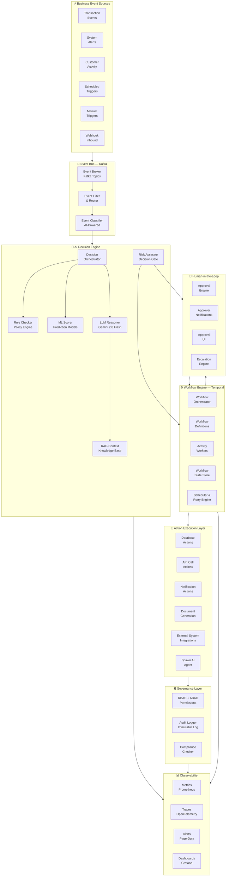
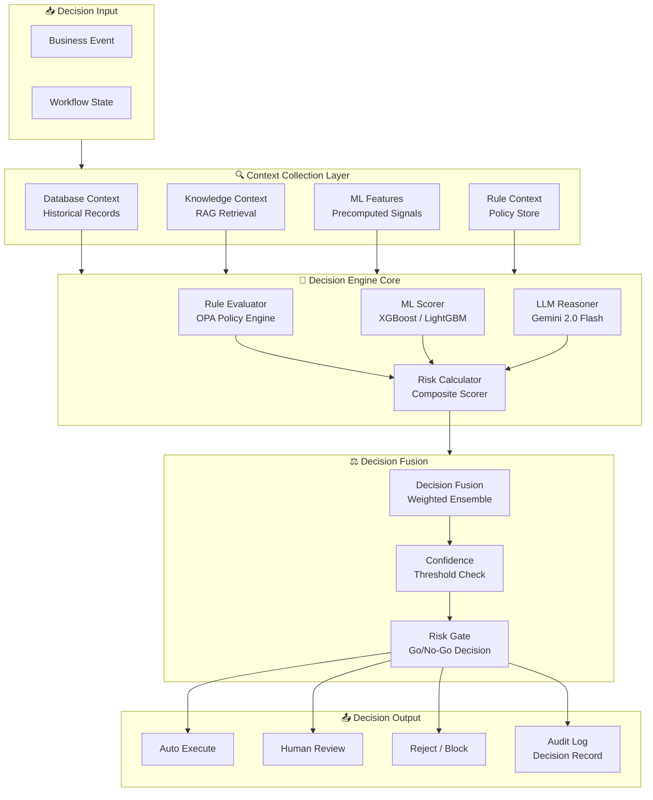
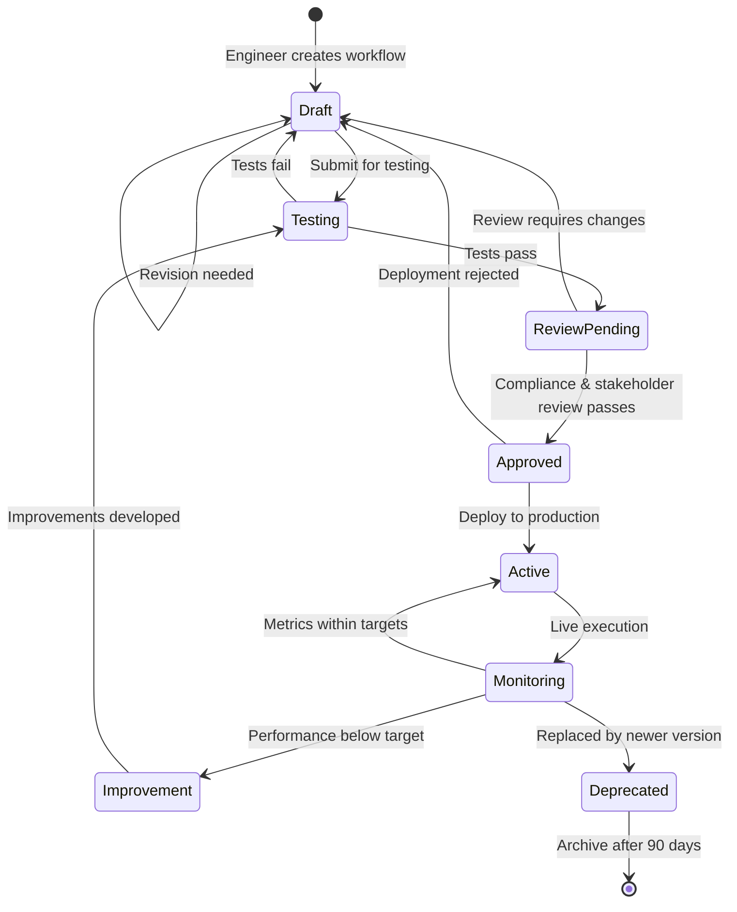
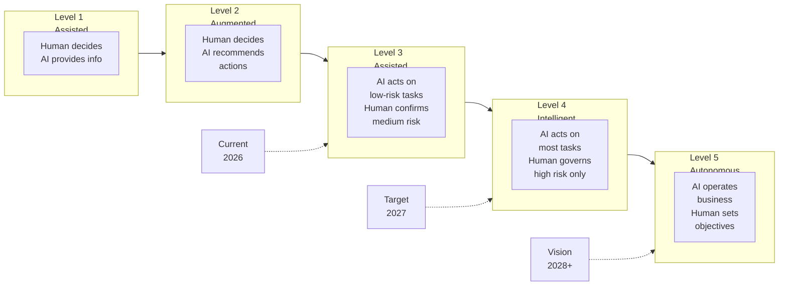
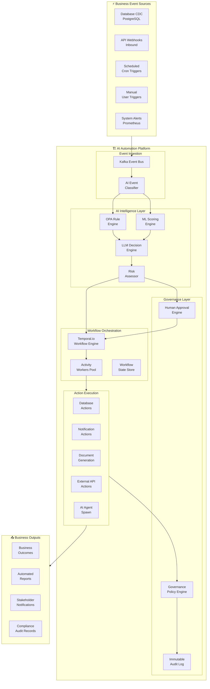
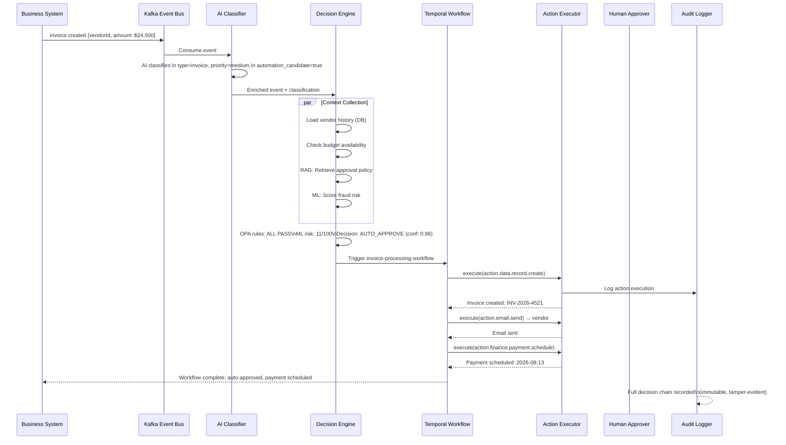
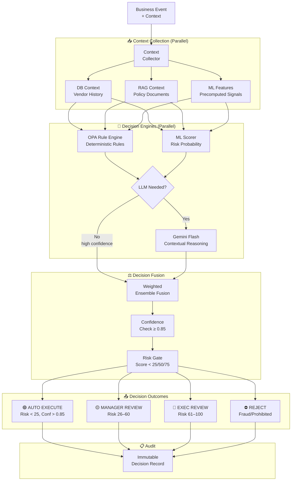
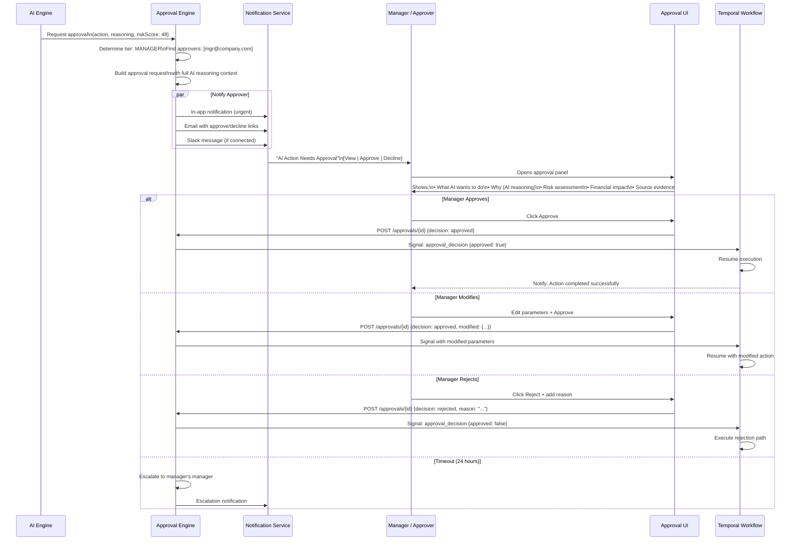
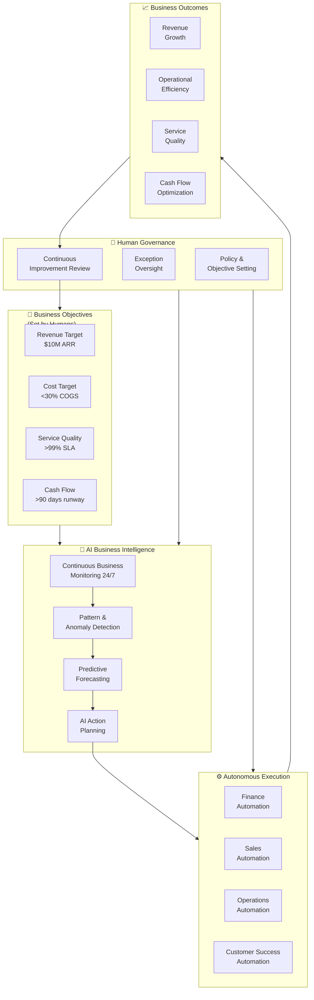

# AI AUTOMATION ENGINE & AUTONOMOUS WORKFLOW ARCHITECTURE

**Project Name:** Enterprise SaaS Business Management Platform  
**Document Version:** 1.0.0 — Baseline Standard  
**Date:** July 14, 2026  
**Authors:** Chief AI Automation Architect, Enterprise Workflow Architect, Business Process Automation Specialist, Intelligent Systems Engineer, SaaS Platform Architect, AI Transformation Strategist  
**Classification:** Internal — Confidential  
**Phase:** 20.4 — AI Automation Engine & Autonomous Workflow Architecture  

---

## Table of Contents

1. [Executive Summary](#1-executive-summary)
2. [AI Automation Foundation & Philosophy](#2-ai-automation-foundation--philosophy)
3. [AI Automation Platform Architecture](#3-ai-automation-platform-architecture)
4. [Event-Driven AI Architecture](#4-event-driven-ai-architecture)
5. [Intelligent Workflow Engine](#5-intelligent-workflow-engine)
6. [AI Decision Engine](#6-ai-decision-engine)
7. [Business Process Automation](#7-business-process-automation)
8. [AI Action Execution System](#8-ai-action-execution-system)
9. [Human-in-the-Loop Governance](#9-human-in-the-loop-governance)
10. [AI Automation Agents](#10-ai-automation-agents)
11. [Automation Security Architecture](#11-automation-security-architecture)
12. [Workflow Version Management](#12-workflow-version-management)
13. [AI Automation Observability](#13-ai-automation-observability)
14. [Automation Technology Stack](#14-automation-technology-stack)
15. [AI Automation Testing Framework](#15-ai-automation-testing-framework)
16. [Autonomous Business Operations](#16-autonomous-business-operations)
17. [AI Automation Use Cases](#17-ai-automation-use-cases)
18. [Cost Optimization Architecture](#18-cost-optimization-architecture)
19. [AI Governance Framework](#19-ai-governance-framework)
20. [AI Automation Roadmap](#20-ai-automation-roadmap)
21. [Final Architecture Diagrams](#21-final-architecture-diagrams)
22. [Implementation Summary](#22-implementation-summary)

---

## 1. Executive Summary

### 1.1 Document Purpose

This document defines the complete AI Automation Engine & Autonomous Workflow Architecture for the SaaS Business Management Platform. It provides the authoritative technical blueprint for designing, deploying, and operating an intelligent business automation platform that understands business events, applies AI reasoning to make decisions, executes multi-step workflows, and progressively automates repetitive operations — all under structured human governance.

### 1.2 Strategic Objective

The AI Automation Engine transforms the SaaS platform from a system that records business activity into one that actively responds to it — detecting patterns, making decisions, executing actions, and continuously improving operations with minimal human intervention while maintaining full auditability and control.

### 1.3 Automation Platform Scope

| Dimension | Scope |
|---|---|
| **Automation Types** | Event-triggered, scheduled, manual-triggered, AI-proactive |
| **Decision Intelligence** | Rule-based, ML model-based, LLM-based, hybrid |
| **Action Surface** | 50+ business actions across all platform domains |
| **Human Controls** | 3-tier approval governance (auto / manager / executive) |
| **Business Domains** | Finance, Sales, Inventory, HR, Operations, Support, Security |
| **Workflow Complexity** | Simple single-step to multi-agent long-running workflows |

### 1.4 Key Capabilities Delivered

- **Event Intelligence**: Real-time detection and classification of business events across all systems
- **AI Decision Engine**: Context-aware decisions combining rules, ML models, and LLM reasoning
- **Workflow Orchestration**: Durable, fault-tolerant workflow execution at enterprise scale
- **Business Process Automation**: Domain-specific automations for Finance, Sales, HR, Ops
- **Human Governance**: Configurable approval gates with risk-proportionate oversight
- **Audit-Grade Logging**: Every automated action fully logged, traceable, and reversible
- **Progressive Autonomy**: Automation that earns trust and evolves toward higher autonomy

### 1.5 Business Value Proposition

| Business Problem | AI Automation Solution | Estimated Impact |
|---|---|---|
| Manual invoice processing taking days | AI-automated invoice extraction, coding, and routing | 85% time reduction |
| Late payment follow-ups missed | Intelligent dunning workflows triggered automatically | 40% DSO improvement |
| Inventory stockouts causing lost sales | AI-predicted restocking with auto purchase orders | 60% stockout reduction |
| Lead follow-up delays losing deals | Auto-triggered personalized follow-up sequences | 3x faster response |
| HR onboarding tasks scattered | Fully automated onboarding workflow orchestration | 70% process time reduction |

---

## 2. AI Automation Foundation & Philosophy

### 2.1 Traditional vs AI Automation

```
┌──────────────────────────────────────────────────────────────────────┐
│         TRADITIONAL WORKFLOW AUTOMATION vs AI INTELLIGENT AUTOMATION  │
├───────────────────────────────┬──────────────────────────────────────┤
│   TRADITIONAL AUTOMATION      │    AI INTELLIGENT AUTOMATION          │
├───────────────────────────────┼──────────────────────────────────────┤
│                               │                                      │
│  IF invoice received          │  DETECT: Invoice patterns in email,  │
│    AND amount < $1,000        │          attachments, and ERP        │
│    AND vendor is approved     │                                      │
│  THEN auto-approve            │  UNDERSTAND: Extract amount, vendor, │
│                               │  line items, due date via AI parsing │
│  ✗ Rigid rule set             │                                      │
│  ✗ Breaks on edge cases       │  REASON: Is this vendor trusted?     │
│  ✗ No context understanding   │  Does amount match PO? Is budget     │
│  ✗ Cannot learn               │  available? What is risk level?      │
│  ✗ Fails on unstructured data │                                      │
│  ✗ Binary yes/no decisions    │  DECIDE: Auto-approve / route for    │
│                               │  review / flag for investigation     │
│                               │                                      │
│                               │  ✓ Understands context & nuance     │
│                               │  ✓ Handles unstructured inputs      │
│                               │  ✓ Probabilistic, risk-aware        │
│                               │  ✓ Learns from outcomes             │
│                               │  ✓ Explains its reasoning           │
│                               │  ✓ Escalates appropriately          │
└───────────────────────────────┴──────────────────────────────────────┘
```

### 2.2 Automation Intelligence Spectrum

```
────────────────────────────────────────────────────────────────────────
RULE-BASED ◄──────────────────────────────────────► AI-NATIVE
────────────────────────────────────────────────────────────────────────
│                │               │              │              │
│  Hard-Coded    │  Decision     │  ML-Guided   │  LLM-        │
│  Rules         │  Trees        │  Rules       │  Reasoned    │
│                │               │              │  Decisions   │
│  IF/THEN       │  Decision     │  Model       │  Context-    │
│  exact match   │  branching    │  scoring +   │  aware with  │
│                │               │  rules       │  reasoning   │
│  Level 1       │  Level 2      │  Level 3     │  Level 4     │
────────────────────────────────────────────────────────────────────────

Platform Target: Level 3 (ML-Guided) as default, Level 4 (LLM) for 
complex decisions requiring contextual understanding
```

### 2.3 Design Principles

#### Principle 1: Automation with Accountability
Every automated action has a traceable decision chain — why the AI acted, what data it used, and what outcome was produced. No black-box automation.

#### Principle 2: Graduated Autonomy
Automation earns the right to act autonomously through demonstrated reliability. New workflows start with high human oversight, autonomy increases as trust is established.

#### Principle 3: Fail-Safe by Default
When uncertain, automation stops and escalates. It is always safer to ask a human than to proceed with a low-confidence decision.

#### Principle 4: Business Domain Awareness
Automations understand business context — a $500 invoice means something different from a $500,000 invoice; a delay in payroll is categorically different from a delay in a report.

#### Principle 5: Reversibility First
Before executing any action, the automation engine evaluates reversibility. Irreversible actions always require explicit human confirmation.

#### Principle 6: Continuous Improvement
Every workflow execution feeds back into the system — success signals reinforce patterns, failures trigger root cause analysis and workflow improvement suggestions.

---

## 3. AI Automation Platform Architecture

### 3.1 High-Level Platform Architecture



### 3.2 Request Flow Architecture

```
AUTOMATED WORKFLOW EXECUTION FLOW
─────────────────────────────────

1. EVENT DETECTED
   Business event published to Kafka topic
   (e.g., kafka://events.invoice.created)

2. EVENT CLASSIFIED
   AI classifier tags event:
   type=invoice_received, priority=medium, 
   domain=finance, requires_automation=true

3. WORKFLOW TRIGGERED  
   Event Router matches event to workflow definition
   Invoice Processing Workflow v2.3 selected

4. CONTEXT LOADED
   Decision Engine collects:
   → Vendor history from database
   → Budget status from finance system
   → Similar past invoices via RAG
   → Current approval policies

5. AI DECISION
   LLM reasons over collected context:
   → Confidence: HIGH (0.92)
   → Recommendation: AUTO_APPROVE
   → Justification: Vendor trusted (95 invoices, 0 disputes),
     amount within budget, matches PO#4521

6. RISK ASSESSMENT
   Risk Score: 12/100 (LOW)
   Decision: Proceed automatically (threshold: <25)

7. WORKFLOW EXECUTION
   Temporal worker executes activities:
   a) POST /api/finance/invoices (create record)
   b) PATCH /api/finance/approvals (mark approved)
   c) POST /api/notifications (notify vendor + finance)
   d) Generate payment schedule entry

8. AUDIT LOGGED
   Full decision chain stored in immutable audit log

9. METRICS EMITTED
   automation.workflow.completed{type=invoice,decision=auto}
```

### 3.3 NestJS Automation Module Structure

```typescript
// AI Automation Platform Module
@Module({
  imports: [
    KafkaModule,
    TemporalModule,
    DecisionEngineModule,
    WorkflowRegistryModule,
    ActionExecutorModule,
    HITLModule,
    AutomationSecurityModule,
    ObservabilityModule,
  ],
  controllers: [
    AutomationController,
    WorkflowController,
    ApprovalController,
    AutomationAdminController,
  ],
  providers: [
    EventClassifierService,
    WorkflowTriggerService,
    DecisionOrchestratorService,
    RiskAssessmentService,
    ActionExecutorService,
    ApprovalEngineService,
    AutomationAuditService,
    WorkflowVersionService,
    CostOptimizationService,
  ],
})
export class AIAutomationModule {}
```

---

## 4. Event-Driven AI Architecture

### 4.1 Business Event Taxonomy

```
┌──────────────────────────────────────────────────────────────────────┐
│                    BUSINESS EVENT TAXONOMY                            │
│                                                                        │
│  Domain: Finance                                                       │
│  ├── invoice.created           Invoice uploaded or received           │
│  ├── invoice.overdue           Payment past due date                  │
│  ├── payment.received          Customer payment processed             │
│  ├── payment.failed            Payment attempt declined               │
│  ├── budget.threshold_reached  Spend reaches X% of budget             │
│  └── reconciliation.gap        Ledger discrepancy detected            │
│                                                                        │
│  Domain: Sales                                                         │
│  ├── lead.created              New lead entered in CRM                │
│  ├── lead.scored               Lead qualification score updated       │
│  ├── deal.stage_changed        Opportunity moved pipeline stages      │
│  ├── deal.stalled              No activity for N days                 │
│  ├── customer.churned          Customer cancelled subscription        │
│  └── customer.upsell_signal    Usage triggers upsell opportunity      │
│                                                                        │
│  Domain: Inventory                                                     │
│  ├── stock.low_threshold       SKU below reorder point                │
│  ├── stock.out_of_stock        SKU at zero quantity                   │
│  ├── stock.overstock           Inventory exceeds target level         │
│  └── demand.surge_detected     Unusual demand pattern detected        │
│                                                                        │
│  Domain: HR                                                            │
│  ├── employee.onboarded        New employee record created            │
│  ├── employee.offboarded       Employee termination processed         │
│  ├── leave.requested           Leave application submitted            │
│  └── performance.review_due   Review period deadline approaching      │
│                                                                        │
│  Domain: Operations                                                    │
│  ├── system.alert              Infrastructure or service alert        │
│  ├── sla.breach_risk           SLA at risk of violation               │
│  ├── ticket.escalation_needed  Support ticket needs escalation        │
│  └── anomaly.detected          ML-detected operational anomaly        │
└──────────────────────────────────────────────────────────────────────┘
```

### 4.2 Event Schema Standard

```typescript
// Universal Business Event Schema
interface BusinessEvent<T = unknown> {
  // Identity
  eventId: string;                    // UUID v4
  correlationId: string;              // Links related events
  causationId?: string;               // Parent event that caused this
  
  // Classification
  domain: EventDomain;                // finance | sales | inventory | hr | ops
  type: string;                       // e.g., 'invoice.created'
  version: string;                    // Schema version, e.g., '1.0'
  priority: 'critical' | 'high' | 'medium' | 'low';
  
  // Context
  tenantId: string;
  userId?: string;                    // Who/what triggered the event
  source: string;                     // System that emitted the event
  
  // Payload
  payload: T;                         // Domain-specific event data
  
  // Metadata
  timestamp: Date;
  tags: Record<string, string>;       // For filtering and routing
  ttl?: number;                       // Event TTL in seconds
}

// Example: Invoice Created Event
interface InvoiceCreatedPayload {
  invoiceId: string;
  vendorId: string;
  vendorName: string;
  amount: number;
  currency: string;
  dueDate: Date;
  lineItems: InvoiceLineItem[];
  documentUrl: string;
  purchaseOrderRef?: string;
}

type InvoiceCreatedEvent = BusinessEvent<InvoiceCreatedPayload>;
```

### 4.3 AI Event Classifier

```typescript
// AI-Powered Event Classifier
@Injectable()
export class EventClassifierService {
  async classify(event: BusinessEvent): Promise<ClassifiedEvent> {
    const [
      automationCandidate,
      urgencyScore,
      riskIndicators,
      relatedWorkflows,
    ] = await Promise.all([
      this.assessAutomationPotential(event),
      this.scoreUrgency(event),
      this.detectRiskIndicators(event),
      this.matchWorkflowDefinitions(event),
    ]);

    return {
      ...event,
      classification: {
        automationCandidate,
        urgencyScore,               // 0-100
        riskIndicators,
        matchedWorkflows: relatedWorkflows,
        aiConfidence: automationCandidate.confidence,
        recommendedAction: this.determineAction(
          automationCandidate,
          urgencyScore,
          riskIndicators,
          relatedWorkflows
        ),
      },
    };
  }

  private async assessAutomationPotential(
    event: BusinessEvent
  ): Promise<AutomationAssessment> {
    // Use lightweight Gemini Flash to classify event
    const prompt = `
      Classify this business event and determine automation potential:
      Event Type: ${event.type}
      Domain: ${event.domain}
      Priority: ${event.priority}
      Payload Summary: ${JSON.stringify(event.payload).substring(0, 500)}
      
      Respond with JSON:
      {
        "shouldAutomate": boolean,
        "confidence": 0.0-1.0,
        "reasoning": "string",
        "suggestedWorkflow": "string or null",
        "requiresHumanReview": boolean
      }
    `;
    
    return this.llmService.structuredCompletion<AutomationAssessment>(prompt, {
      model: 'gemini-flash',          // Fast, cost-effective classification
      maxTokens: 200,
      temperature: 0.1,
    });
  }
}
```

### 4.4 Kafka Event Topics Architecture

```
KAFKA TOPIC ARCHITECTURE — AI AUTOMATION PLATFORM
──────────────────────────────────────────────────

Source Topics (Inbound):
  events.finance.*          Finance domain events
  events.sales.*            Sales domain events  
  events.inventory.*        Inventory domain events
  events.hr.*               HR domain events
  events.operations.*       Operations domain events
  events.system.*           System/infrastructure events

Processing Topics:
  automation.classified     Events classified by AI
  automation.triggered      Workflows triggered
  automation.decisions      AI decisions logged
  automation.approvals      HITL approval requests/responses
  automation.actions        Action execution commands
  automation.results        Action execution results

Output Topics:
  notifications.user        User notifications triggered
  notifications.external    External webhook notifications
  audit.automation          Immutable automation audit log
  metrics.automation        Real-time automation metrics

Dead Letter Topics:
  dlq.automation.failed     Failed workflow events for reprocessing
  dlq.decisions.uncertain   Events requiring manual classification
```

---

## 5. Intelligent Workflow Engine

### 5.1 Workflow Architecture Overview

```
┌──────────────────────────────────────────────────────────────────────┐
│                   INTELLIGENT WORKFLOW ENGINE                          │
│                   (Powered by Temporal.io)                            │
│                                                                        │
│  Workflow Definition (YAML / TypeScript DSL):                         │
│  ┌──────────────────────────────────────────────────────────────┐    │
│  │  name: invoice-processing-workflow                           │    │
│  │  version: 2.3                                                │    │
│  │  trigger: event(invoice.created)                             │    │
│  │                                                              │    │
│  │  steps:                                                      │    │
│  │    1. EXTRACT  — AI extracts invoice data                    │    │
│  │    2. VALIDATE — Validate against PO and vendor records      │    │
│  │    3. DECIDE   — AI scores risk and makes decision           │    │
│  │    4. GATE     — Human approval if risk > threshold          │    │
│  │    5. EXECUTE  — Post to accounting system                   │    │
│  │    6. NOTIFY   — Send confirmation to vendor                 │    │
│  │    7. SCHEDULE — Create payment schedule entry               │    │
│  └──────────────────────────────────────────────────────────────┘    │
│                                                                        │
│  Execution Engine (Temporal Workers):                                  │
│  ┌──────────────────────────────────────────────────────────────┐    │
│  │  • Durable execution (survives process crashes)              │    │
│  │  • Automatic retry with configurable policies                │    │
│  │  • State persistence across steps                            │    │
│  │  • Long-running workflows (hours, days, weeks)               │    │
│  │  • Parallel step execution where dependencies allow          │    │
│  │  • Signal handling for human approval responses              │    │
│  └──────────────────────────────────────────────────────────────┘    │
└──────────────────────────────────────────────────────────────────────┘
```

### 5.2 Workflow Component Model

```typescript
// Workflow Definition DSL
interface WorkflowDefinition {
  workflowId: string;
  name: string;
  version: string;
  description: string;
  domain: BusinessDomain;
  tenantId?: string;           // null = platform-wide workflow
  
  // Trigger Configuration
  trigger: WorkflowTrigger;
  
  // Execution Configuration
  maxDuration: number;         // Max workflow lifetime in seconds
  retryPolicy: RetryPolicy;
  timeoutPolicy: TimeoutPolicy;
  
  // Steps
  steps: WorkflowStep[];
  
  // Governance
  defaultApprovalLevel: ApprovalLevel;
  auditRequired: boolean;
  complianceRequirements: string[];
  
  // Versioning
  createdAt: Date;
  approvedAt?: Date;
  approvedBy?: string;
  status: 'draft' | 'testing' | 'approved' | 'active' | 'deprecated';
}

// Workflow Step Types
type WorkflowStep =
  | TriggerStep
  | ConditionStep
  | AIDecisionStep
  | ActionStep
  | ApprovalStep
  | NotificationStep
  | ParallelStep
  | LoopStep
  | WaitStep
  | SubWorkflowStep;

// AI Decision Step
interface AIDecisionStep {
  type: 'ai_decision';
  name: string;
  description: string;
  
  // Context inputs for decision
  contextInputs: ContextInput[];
  
  // Decision configuration
  decisionModel: 'rules' | 'ml_model' | 'llm' | 'hybrid';
  confidenceThreshold: number;    // Minimum confidence to proceed
  
  // Outcomes
  outcomes: {
    condition: string;           // e.g., 'confidence > 0.85 && risk < 25'
    nextStep: string;
    action?: AutomationAction;
  }[];
  
  // Fallback
  onLowConfidence: 'human_review' | 'reject' | 'default_path';
}

// Approval Step
interface ApprovalStep {
  type: 'approval';
  name: string;
  riskLevel: 'low' | 'medium' | 'high' | 'critical';
  
  approvers: ApproverConfig;
  timeout: number;               // Seconds before escalation
  escalationPath: string[];     // User IDs / roles to escalate to
  
  onApprove: string;            // Next step ID
  onReject: string;             // Step to go to on rejection
  onTimeout: 'escalate' | 'auto_reject' | 'auto_approve';
}
```

### 5.3 Temporal Workflow Implementation

```typescript
// Temporal Workflow — Invoice Processing
import { proxyActivities, sleep, setHandler, defineSignal } from '@temporalio/workflow';

const approvalSignal = defineSignal<[ApprovalDecision]>('approval_decision');

export async function invoiceProcessingWorkflow(
  event: InvoiceCreatedEvent
): Promise<WorkflowResult> {
  const activities = proxyActivities<InvoiceActivities>({
    startToCloseTimeout: '5 minutes',
    retry: { maximumAttempts: 3, backoffCoefficient: 2 },
  });

  // Step 1: Extract & validate invoice data via AI
  const extractedData = await activities.extractInvoiceData(event.payload.documentUrl);
  
  // Step 2: Validate against vendor and PO records
  const validation = await activities.validateInvoice(extractedData, event.payload);
  
  if (!validation.valid) {
    await activities.notifyInvalidInvoice(event.payload.vendorId, validation.errors);
    return { status: 'rejected', reason: 'validation_failed', errors: validation.errors };
  }

  // Step 3: AI Decision — should we auto-approve?
  const decision = await activities.makeApprovalDecision(extractedData, validation);
  
  // Step 4: Check if human approval needed
  if (decision.requiresHumanApproval) {
    const approvalRequest = await activities.createApprovalRequest(decision, extractedData);
    
    let approvalDecision: ApprovalDecision | null = null;
    
    // Wait for human signal or timeout
    setHandler(approvalSignal, (d: ApprovalDecision) => { approvalDecision = d; });
    
    // Timeout after 48 hours — escalate if no response
    await Promise.race([
      // Wait for approval signal
      new Promise(resolve => setHandler(approvalSignal, (d) => {
        approvalDecision = d;
        resolve(d);
      })),
      // Escalation timeout
      sleep('48 hours').then(async () => {
        await activities.escalateApproval(approvalRequest.approvalId);
      }),
    ]);
    
    if (!approvalDecision?.approved) {
      await activities.notifyRejection(event.payload.vendorId, approvalDecision?.reason);
      return { status: 'rejected', reason: approvalDecision?.reason ?? 'not_approved' };
    }
  }

  // Step 5: Execute approved actions in parallel
  const [accountingResult, paymentSchedule] = await Promise.all([
    activities.postToAccountingSystem(extractedData),
    activities.createPaymentSchedule(extractedData),
  ]);

  // Step 6: Notify all parties
  await activities.sendConfirmations({
    vendorId: event.payload.vendorId,
    financeTeamId: 'finance',
    invoiceId: accountingResult.invoiceId,
    paymentDate: paymentSchedule.scheduledDate,
  });

  return {
    status: 'completed',
    invoiceId: accountingResult.invoiceId,
    decision: decision.recommendation,
    wasAutoApproved: !decision.requiresHumanApproval,
  };
}
```

---

## 6. AI Decision Engine

### 6.1 Decision Engine Architecture



### 6.2 Decision Process Flow

```
DECISION ENGINE EXECUTION FLOW
────────────────────────────────

INPUT: Invoice processing decision needed
Context: Invoice $24,500 from Vendor ACME Corp

STEP 1: CONTEXT COLLECTION (parallel, ~200ms)
  → DB: Vendor ACME has 127 invoices, 0 disputes, preferred vendor
  → DB: Budget remaining in Q3: $847,000 (this = 2.9% of remaining)
  → DB: PO#8821 exists, approved for $25,000
  → RAG: Policy says invoices <$50K from approved vendors can auto-approve
  → ML: Vendor risk score: 8/100 (very low)

STEP 2: RULE EVALUATION (OPA)
  Rule 1: Is vendor approved? → YES ✓
  Rule 2: Is there a matching PO? → YES ✓ (within $500 tolerance)
  Rule 3: Is budget available? → YES ✓
  Rule 4: Is amount within auto-approve threshold? → YES ($24,500 < $50,000) ✓
  Rule Result: ALL RULES PASS → eligible for auto-approve

STEP 3: ML SCORING
  Risk Score: 11/100
  Anomaly Score: 0.03 (very normal)
  Fraud Probability: 0.002
  ML Result: LOW RISK → proceed

STEP 4: LLM REASONING (only if rules/ML are insufficient)
  Rules + ML passed with HIGH confidence → LLM skip (cost optimization)
  LLM would be invoked for: edge cases, policy conflicts, novel situations

STEP 5: DECISION FUSION
  Rule Engine: AUTO_APPROVE (weight: 0.4)
  ML Model:    AUTO_APPROVE (weight: 0.4)
  Combined Confidence: 0.96
  Risk Score: 11/100

STEP 6: RISK GATE
  Confidence 0.96 > threshold 0.85 → PASS
  Risk 11 < threshold 25 → PASS
  Final Decision: AUTO_APPROVE
  Justification: "Trusted vendor, matching PO, within budget, low risk"
```

### 6.3 Decision Engine Implementation

```typescript
@Injectable()
export class DecisionOrchestratorService {
  async makeDecision(
    context: DecisionContext
  ): Promise<DecisionResult> {
    const span = this.tracer.startSpan('decision.orchestrate');

    try {
      // 1. Collect context in parallel
      const enrichedContext = await this.collectContext(context);
      
      // 2. Evaluate rules first (fast, deterministic)
      const ruleResult = await this.ruleEvaluator.evaluate(enrichedContext);
      
      // 3. Run ML scoring (fast inference)
      const mlResult = await this.mlScorer.score(enrichedContext);
      
      // 4. Determine if LLM reasoning is needed
      const needsLLM = this.needsLLMReasoning(ruleResult, mlResult, context);
      
      let llmResult: LLMDecision | null = null;
      if (needsLLM) {
        llmResult = await this.llmReasoner.reason(enrichedContext, ruleResult, mlResult);
      }
      
      // 5. Fuse decisions
      const fusedDecision = this.fusionEngine.fuse({
        rules: ruleResult,
        ml: mlResult,
        llm: llmResult,
        weights: this.getWeights(context.domain, context.eventType),
      });
      
      // 6. Risk gate
      const finalDecision = this.riskGate.evaluate(fusedDecision, context);
      
      // 7. Log decision record
      await this.auditLogger.logDecision({
        contextSummary: this.summarizeContext(enrichedContext),
        ruleResult,
        mlResult,
        llmResult,
        fusedDecision,
        finalDecision,
        timestamp: new Date(),
      });
      
      return finalDecision;
    } finally {
      span.end();
    }
  }

  private needsLLMReasoning(
    rules: RuleResult,
    ml: MLResult,
    context: DecisionContext
  ): boolean {
    // Skip LLM if rules and ML agree with high confidence
    if (rules.outcome === ml.outcome && rules.confidence > 0.9 && ml.confidence > 0.85) {
      return false;
    }
    
    // Always use LLM for: novel situations, rule conflicts, high-value decisions
    if (context.decisionValue > 100_000) return true;
    if (rules.hasConflict) return true;
    if (ml.isAnomalous) return true;
    if (context.isFirstTimeVendor) return true;
    
    return false;
  }

  private getWeights(domain: string, eventType: string): DecisionWeights {
    // Domain-specific weight configurations
    const weightConfig: Record<string, DecisionWeights> = {
      'finance.invoice': { rules: 0.4, ml: 0.4, llm: 0.2 },
      'finance.payment': { rules: 0.5, ml: 0.3, llm: 0.2 },
      'sales.lead':      { rules: 0.2, ml: 0.5, llm: 0.3 },
      'hr.leave':        { rules: 0.6, ml: 0.2, llm: 0.2 },
      'inventory.reorder': { rules: 0.2, ml: 0.6, llm: 0.2 },
    };
    
    return weightConfig[`${domain}.${eventType}`] ?? { rules: 0.35, ml: 0.4, llm: 0.25 };
  }
}
```

### 6.4 OPA Rule Engine Integration

```rego
# OPA Policy — Invoice Auto-Approval Rules
package automation.finance.invoice

import future.keywords.if
import future.keywords.in

# Main decision: should invoice be auto-approved?
default auto_approve = false
default requires_human = false
default reject = false

# Auto-approve conditions
auto_approve if {
    vendor_is_approved
    purchase_order_matches
    budget_available
    amount_within_threshold
    not fraud_signals_present
}

# Vendor must be in approved vendor list
vendor_is_approved if {
    input.vendor.status == "approved"
    input.vendor.risk_score < 25
    input.vendor.invoice_count >= 3          # At least 3 previous invoices
}

# PO matching within tolerance
purchase_order_matches if {
    po := data.purchase_orders[input.po_reference]
    po.status == "open"
    abs(input.amount - po.approved_amount) <= po.approved_amount * 0.05  # 5% tolerance
}

# Budget check
budget_available if {
    budget := data.budgets[input.cost_center][input.quarter]
    budget.remaining >= input.amount
}

# Auto-approve threshold by tier
amount_within_threshold if {
    input.vendor.tier == "preferred"
    input.amount <= 100000    # $100K for preferred vendors
}

amount_within_threshold if {
    input.vendor.tier == "standard"
    input.amount <= 25000     # $25K for standard vendors
}

# Fraud signals from ML
fraud_signals_present if {
    input.ml_scores.fraud_probability > 0.1
}

fraud_signals_present if {
    input.ml_scores.anomaly_score > 0.7
}

# Require human if large amount even with good vendor
requires_human if {
    vendor_is_approved
    input.amount > 250000
}

# Reject conditions
reject if {
    input.vendor.status == "blacklisted"
}

reject if {
    input.ml_scores.fraud_probability > 0.5
}
```

---

## 7. Business Process Automation

### 7.1 Finance Automation Suite

#### 7.1.1 Intelligent Invoice Processing

```
WORKFLOW: Intelligent Invoice Processing
─────────────────────────────────────────

Trigger: invoice.created event

Step 1: AI Document Extraction (OCR + LLM)
  Input:  PDF/image of invoice
  Output: Structured data {vendor, amount, items, dates, PO ref}
  Model:  Gemini 2.0 Flash + document understanding

Step 2: 3-Way PO Matching
  Match: Invoice ↔ Purchase Order ↔ Receipt
  Tolerance: ±5% on amounts
  Result: Match / Partial Match / No Match

Step 3: Risk Scoring (ML)
  Signals: Vendor history, amount vs baseline, timing, format
  Output: Risk score 0-100

Step 4: Decision Gate
  Score 0-25:   AUTO APPROVE
  Score 26-60:  MANAGER APPROVAL
  Score 61-100: FINANCE DIRECTOR APPROVAL

Step 5: Action Execution
  AUTO path: → Post to ERP → Schedule payment → Notify vendor
  MANUAL path: → Create approval task → Notify approver → Wait
  
Step 6: Payment Scheduling
  Net 30/60/90 based on vendor terms
  Optimize for early payment discounts

KPIs:
  Straight-through rate target: >70%
  Processing time: <5 minutes (vs 3 days manual)
```

#### 7.1.2 Intelligent Payment Reminder (Dunning)

```typescript
// Dunning Workflow — AI-Personalized Payment Reminders
export async function intelligentDunningWorkflow(
  invoice: OverdueInvoice
): Promise<DunningResult> {
  const customerProfile = await activities.loadCustomerProfile(invoice.customerId);
  const paymentHistory = await activities.getPaymentHistory(invoice.customerId);
  
  // AI generates personalized message based on relationship + history
  const message = await activities.generatePersonalizedReminder({
    invoice,
    customerProfile,
    paymentHistory,
    daysPastDue: invoice.daysPastDue,
    relationship: customerProfile.relationshipScore,
  });

  // Escalating sequence based on days past due
  if (invoice.daysPastDue <= 7) {
    await activities.sendEmail(invoice.contactEmail, message.gentle);
  } else if (invoice.daysPastDue <= 21) {
    await activities.sendEmail(invoice.contactEmail, message.firm);
    await activities.sendSMS(invoice.contactPhone, message.smsReminder);
  } else if (invoice.daysPastDue <= 45) {
    await activities.notifyAccountManager(invoice, message.escalation);
    await activities.createCollectionTask(invoice);
  } else {
    // Escalate to collections process
    await activities.initiateCollectionsProcess(invoice);
  }

  // Schedule next check
  await sleep(`${7 * 24}h`);   // Check again in 7 days
  return { dunningStage: invoice.daysPastDue <= 7 ? 1 : 2, messageSent: true };
}
```

### 7.2 Sales Automation Suite

#### 7.2.1 AI Lead Qualification & Routing

```
WORKFLOW: AI Lead Qualification & Routing
──────────────────────────────────────────

Trigger: lead.created event

Step 1: Lead Enrichment (2s)
  Sources:
  • Company data (Clearbit / internal DB)
  • Contact LinkedIn profile
  • Website technology stack (BuiltWith)
  • Recent news and funding rounds

Step 2: ICP Scoring (ML Model, 500ms)
  Signals scored:
  • Company size match (ideal: 50-500 employees)
  • Industry match (target industries weighted)
  • Budget signals (funding, job postings)
  • Technology fit (uses compatible tools)
  • Geographic match
  Output: ICP Score 0-100

Step 3: Intent Scoring (AI)
  Signals:
  • Form responses analyzed for buying intent
  • Content engagement history
  • Feature trial behavior
  Output: Intent Level (HOT / WARM / COLD)

Step 4: Routing Decision (AI)
  HOT (ICP > 75, Intent = HOT):   → Immediate SDR call + AE assignment
  WARM (ICP > 50, Intent = WARM): → Nurture sequence + SDR follow-up in 24h
  COLD (ICP < 50 OR Intent = COLD): → Marketing nurture sequence

Step 5: Personalized Outreach Generation (LLM)
  AI drafts personalized outreach email based on:
  • Company context and pain points
  • Relevant case study
  • Personal connection angle
  Sent as DRAFT for human review (not auto-sent)
```

#### 7.2.2 Deal Health Monitor

```typescript
// Deal Stall Detection and Re-engagement
export async function dealHealthMonitorWorkflow(
  dealId: string
): Promise<void> {
  while (true) {    // Long-running workflow, checks weekly
    const deal = await activities.loadDeal(dealId);
    
    if (deal.status === 'closed') break;

    const healthScore = await activities.calculateDealHealth({
      daysSinceLastActivity: deal.daysSinceLastActivity,
      daysSinceLastMeeting: deal.daysSinceLastMeeting,
      proposalSent: deal.proposalSent,
      stakeholderEngagement: deal.stakeholderEngagement,
      competitorMentions: deal.competitorMentions,
    });

    if (healthScore < 40) {
      // Deal at risk — generate AI re-engagement strategy
      const strategy = await activities.generateReEngagementStrategy(deal);
      
      // Notify assigned rep with AI coaching
      await activities.notifyRepWithAICoaching(deal.assignedRepId, {
        dealId,
        healthScore,
        strategy,
        recommendedActions: strategy.actions,
        urgency: healthScore < 20 ? 'critical' : 'high',
      });
      
      // If no activity in 7 more days, escalate to manager
      await sleep('7 days');
      const updatedDeal = await activities.loadDeal(dealId);
      
      if (updatedDeal.daysSinceLastActivity > deal.daysSinceLastActivity) {
        await activities.escalateDealRisk(dealId, deal.managerId);
      }
    }

    await sleep('7 days');   // Weekly health check
  }
}
```

### 7.3 Inventory Automation Suite

#### 7.3.1 AI-Powered Demand Forecasting & Auto-Reorder

```
WORKFLOW: Intelligent Inventory Management
───────────────────────────────────────────

Schedule: Daily at 02:00 (for all active SKUs)

Step 1: Demand Forecasting (ML)
  Model: ARIMA + LSTM Hybrid
  Inputs:
  • 24-month historical sales
  • Seasonality patterns
  • Promotional calendar
  • External signals (weather, events, trends)
  Output: 30/60/90-day demand forecast with confidence intervals

Step 2: Safety Stock Calculation
  Formula: Safety Stock = Z × σ × √(Lead Time)
  Where Z = service level z-score (98% = 2.05)
  
Step 3: Reorder Point Detection
  Reorder Point = Avg Daily Demand × Lead Time + Safety Stock
  Trigger reorder if: Current Stock ≤ Reorder Point

Step 4: Purchase Quantity Optimization
  Economic Order Quantity (EOQ):
  EOQ = √(2 × Annual Demand × Ordering Cost / Holding Cost)
  
  Adjusted for: Minimum order quantities, supplier capacity,
  storage constraints, cash flow

Step 5: Supplier Selection (AI)
  Rank suppliers by: Price, reliability score, lead time, MOQ
  Select optimal supplier for each SKU

Step 6: Auto-Purchase Order Generation
  Draft PO created with AI-verified quantities and pricing
  LOW VALUE (< $5,000):   AUTO-SEND to preferred supplier
  MEDIUM VALUE ($5K-$50K): Procurement Manager approval
  HIGH VALUE (> $50K):     CPO approval

KPIs:
  Forecast Accuracy (MAPE): <12%
  Stockout Rate: <2%
  Overstock Rate: <5%
  Processing Time: 2 minutes (vs 4 hours manual)
```

### 7.4 HR Automation Suite

#### 7.4.1 Employee Onboarding Orchestration

```typescript
// Complete Employee Onboarding Workflow
export async function employeeOnboardingWorkflow(
  employee: NewEmployee
): Promise<OnboardingResult> {
  const startDate = new Date(employee.startDate);

  // T-7 Days: Pre-arrival setup
  await activities.provisionITAccounts(employee);
  await activities.sendWelcomeEmail(employee);
  await activities.assignBuddy(employee);
  await activities.prepareWorkspace(employee);
  await activities.sendStartDayInfo(employee);

  // Wait until start date
  await sleep(calculateTimeUntil(startDate, -1));   // Day before

  // Day 0: First day
  await activities.activateAllAccounts(employee);
  await activities.scheduleDay1Orientation(employee);
  await activities.assignOnboardingTracker(employee);
  await activities.notifyTeam(employee);
  await activities.generatePersonalizedWelcomeGuide(employee);  // AI-generated

  // Day 3: Check-in
  await sleep('3 days');
  const checkIn = await activities.sendCheckInSurvey(employee);
  
  if (checkIn.satisfactionScore < 7) {
    await activities.notifyHRManager(employee, checkIn);
    await activities.scheduleHRCheckIn(employee);
  }

  // Week 1: Training assignments
  await sleep('4 days');   // End of week 1
  const trainings = await activities.assignRequiredTrainings(employee);
  await activities.setWeek1Goals(employee);

  // Week 2-4: Ongoing monitoring
  for (let week = 2; week <= 4; week++) {
    await sleep('7 days');
    const progress = await activities.checkTrainingProgress(employee);
    
    if (progress.completionRate < 0.7) {
      await activities.sendTrainingReminder(employee, progress);
    }
  }

  // Day 30: Probation review preparation
  await sleep('30 days');
  await activities.generatePerformanceReport(employee);  // AI-generated
  await activities.schedule30DayReview(employee);
  await activities.collectFeedbackFrom360(employee);

  return { status: 'onboarding_complete', employeeId: employee.id };
}
```

---

## 8. AI Action Execution System

### 8.1 Action Catalog

```
┌──────────────────────────────────────────────────────────────────────┐
│                    AI ACTION CATALOG                                   │
│                                                                        │
│  Category: DATA OPERATIONS                                             │
│  ├── action.data.record.create        Create database record          │
│  ├── action.data.record.update        Update existing record          │
│  ├── action.data.record.delete        Soft-delete record              │
│  ├── action.data.bulk.import          Bulk data import                │
│  └── action.data.export.generate      Generate data export            │
│                                                                        │
│  Category: COMMUNICATIONS                                              │
│  ├── action.email.send                Send email to recipient(s)      │
│  ├── action.sms.send                  Send SMS notification           │
│  ├── action.push.send                 Send push notification          │
│  ├── action.slack.message             Post Slack message              │
│  └── action.teams.message             Post MS Teams message           │
│                                                                        │
│  Category: DOCUMENT GENERATION                                         │
│  ├── action.doc.invoice.generate      Generate PDF invoice            │
│  ├── action.doc.report.generate       Generate business report        │
│  ├── action.doc.contract.draft        Draft contract from template    │
│  └── action.doc.summary.ai_generate   AI-generated summary           │
│                                                                        │
│  Category: EXTERNAL INTEGRATIONS                                       │
│  ├── action.api.webhook.call          Call external webhook           │
│  ├── action.erp.sync                  Sync with ERP system            │
│  ├── action.crm.update                Update CRM record               │
│  └── action.payment.process           Process payment via gateway     │
│                                                                        │
│  Category: WORKFLOW CONTROL                                            │
│  ├── action.workflow.trigger          Trigger another workflow         │
│  ├── action.workflow.cancel           Cancel running workflow          │
│  ├── action.agent.spawn               Spawn AI agent task             │
│  └── action.approval.request         Create human approval request   │
│                                                                        │
│  Category: SYSTEM OPERATIONS                                           │
│  ├── action.user.permission.grant     Grant user permission           │
│  ├── action.user.permission.revoke    Revoke user permission          │
│  ├── action.alert.create             Create system alert              │
│  └── action.ticket.create            Create support ticket           │
└──────────────────────────────────────────────────────────────────────┘
```

### 8.2 Action Executor Service

```typescript
@Injectable()
export class ActionExecutorService {
  async execute(
    action: AutomationAction,
    context: ExecutionContext
  ): Promise<ActionResult> {
    const span = this.tracer.startSpan('action.execute', {
      actionType: action.type,
      workflowId: context.workflowId,
      tenantId: context.tenantId,
    });

    try {
      // 1. Pre-execution checks
      await this.securityService.validateActionPermissions(action, context);
      await this.guardrailService.validateAction(action, context);
      
      // 2. Validate action schema
      await this.schemaValidator.validate(action);
      
      // 3. Check idempotency (prevent duplicate execution)
      const idempotencyKey = this.generateIdempotencyKey(action, context);
      const existingResult = await this.idempotencyStore.get(idempotencyKey);
      if (existingResult) {
        return existingResult;    // Return cached result
      }
      
      // 4. Execute action
      const executor = this.resolveExecutor(action.type);
      const result = await executor.execute(action, context);
      
      // 5. Store result for idempotency
      await this.idempotencyStore.set(idempotencyKey, result, 3600);
      
      // 6. Audit log
      await this.auditService.logActionExecution({
        actionId: action.actionId,
        type: action.type,
        workflowId: context.workflowId,
        tenantId: context.tenantId,
        userId: context.triggeringUserId,
        input: action.parameters,
        output: result,
        success: true,
        timestamp: new Date(),
      });
      
      return result;
    } catch (error) {
      await this.auditService.logActionError(action, context, error);
      throw new ActionExecutionError(action.type, error.message);
    } finally {
      span.end();
    }
  }

  private resolveExecutor(actionType: string): ActionExecutor {
    const [category, subcategory, ...rest] = actionType.split('.');
    
    const executors: Record<string, ActionExecutor> = {
      'action.email.send':             this.emailExecutor,
      'action.data.record.create':     this.databaseExecutor,
      'action.doc.invoice.generate':   this.documentExecutor,
      'action.api.webhook.call':       this.webhookExecutor,
      'action.workflow.trigger':       this.workflowExecutor,
      'action.agent.spawn':            this.agentExecutor,
      'action.payment.process':        this.paymentExecutor,
    };
    
    const executor = executors[actionType];
    if (!executor) {
      throw new UnknownActionTypeError(actionType);
    }
    return executor;
  }
}
```

---

## 9. Human-in-the-Loop Governance

### 9.1 Three-Tier Approval Model

```
┌──────────────────────────────────────────────────────────────────────┐
│                   HUMAN-IN-THE-LOOP GOVERNANCE MODEL                  │
│                                                                        │
│  TIER 1 — AUTOMATIC (Risk Score: 0-25)                                │
│  ────────────────────────────────────────                              │
│  • AI acts autonomously without human approval                        │
│  • Full audit trail maintained                                        │
│  • Post-hoc review reports generated daily                            │
│  • Human override always possible                                     │
│  Examples: Routine invoice processing, standard notifications,        │
│            lead routing, inventory alerts                             │
│                                                                        │
│  TIER 2 — MANAGER APPROVAL (Risk Score: 26-60)                        │
│  ─────────────────────────────────────────────                         │
│  • Direct manager notified via app + email                            │
│  • 24-hour response window before escalation                          │
│  • Approver sees AI reasoning + context                               │
│  • Can approve, reject, or modify parameters                          │
│  Examples: Large invoices ($10K-$100K), new vendor payments,          │
│            promotional discounts >20%, hiring offers                  │
│                                                                        │
│  TIER 3 — EXECUTIVE APPROVAL (Risk Score: 61-100)                     │
│  ──────────────────────────────────────────────────                    │
│  • C-suite or Department Head approval required                       │
│  • 4-hour SLA with immediate notification                             │
│  • Secondary approver required for critical actions                   │
│  • Override must include documented justification                     │
│  Examples: Transactions >$100K, system configuration changes,         │
│            mass data operations, vendor contract changes              │
└──────────────────────────────────────────────────────────────────────┘
```

### 9.2 Approval Engine Implementation

```typescript
@Injectable()
export class ApprovalEngineService {
  async requestApproval(
    action: AutomationAction,
    decision: DecisionResult,
    context: ExecutionContext
  ): Promise<ApprovalRequest> {
    // Determine approver tier
    const tier = this.determineTier(decision.riskScore, action, context);
    
    // Find appropriate approvers
    const approvers = await this.resolveApprovers(tier, context);
    
    // Build approval request with full context
    const request: ApprovalRequest = {
      approvalId: generateId(),
      workflowId: context.workflowId,
      tenantId: context.tenantId,
      tier,
      
      // What the AI wants to do
      proposedAction: {
        type: action.type,
        description: action.humanReadableDescription,
        parameters: action.parameters,
        estimatedImpact: action.estimatedImpact,
        reversible: action.reversible,
      },
      
      // Why the AI recommends this
      aiReasoning: {
        decision: decision.recommendation,
        confidence: decision.confidence,
        justification: decision.justification,
        riskScore: decision.riskScore,
        contextSummary: decision.contextSummary,
      },
      
      // Evidence and supporting context
      supportingEvidence: await this.gatherEvidence(action, context),
      
      // Governance
      approvers,
      timeout: this.getTimeout(tier),
      escalationPath: this.buildEscalationPath(tier, context),
      expiresAt: new Date(Date.now() + this.getTimeout(tier) * 1000),
    };
    
    // Store and notify
    await this.approvalRepository.create(request);
    await this.notifyApprovers(request, approvers);
    
    return request;
  }

  private getTimeout(tier: ApprovalTier): number {
    const timeouts = {
      [ApprovalTier.AUTOMATIC]: 0,
      [ApprovalTier.MANAGER]: 86400,       // 24 hours
      [ApprovalTier.EXECUTIVE]: 14400,      // 4 hours (urgent)
    };
    return timeouts[tier];
  }

  async resolveApproval(
    approvalId: string,
    resolution: ApprovalResolution
  ): Promise<void> {
    const request = await this.approvalRepository.findById(approvalId);
    
    // Validate approver is authorized
    await this.validateApprover(resolution.approvedByUserId, request);
    
    // Update approval record
    await this.approvalRepository.resolve(approvalId, resolution);
    
    // Signal the waiting workflow
    await this.temporalClient.signal(
      request.workflowId,
      'approval_decision',
      {
        approved: resolution.decision === 'approved',
        modifiedParameters: resolution.modifiedParameters,
        reason: resolution.reason,
        approvedBy: resolution.approvedByUserId,
        timestamp: new Date(),
      }
    );
  }
}
```

### 9.3 Approval Notification Templates

```typescript
// Multi-channel approval notification
await Promise.all([
  // In-app: Real-time notification
  notificationService.send(approvers, {
    type: 'automation_approval_required',
    title: `⚡ AI Action Needs Your Approval`,
    body: `${action.description} — ${tier} risk`,
    actionUrl: `/automation/approvals/${approvalId}`,
    priority: tier === 'executive' ? 'urgent' : 'high',
    badge: true,
  }),
  
  // Email: Detailed context
  emailService.sendTemplate(approvers, 'approval-request', {
    actionDescription: action.humanReadableDescription,
    aiJustification: decision.justification,
    riskLevel: tier,
    financialImpact: action.estimatedImpact,
    deadline: request.expiresAt,
    approvalUrl: `${baseUrl}/approvals/${approvalId}`,
    declineUrl: `${baseUrl}/approvals/${approvalId}/decline`,
  }),
  
  // Slack (if connected)
  slackService.sendApprovalBlock({
    channel: context.approverSlackId,
    blocks: buildApprovalSlackBlocks(request),
  }),
]);
```

---

## 10. AI Automation Agents

### 10.1 Finance Automation Agent

```
FINANCE AUTOMATION AGENT
──────────────────────────

Role: Autonomous financial operations management

Responsibilities:
• Invoice processing and three-way matching
• Payment scheduling and cash flow optimization
• Expense report review and approval
• Budget variance detection and alerting
• Month-end close checklist orchestration
• Financial anomaly detection
• Dunning and collections automation

Autonomy Level:
• Routine operations: L4 (Auto-execute up to $10K)
• Large transactions: L3 (Manager approval >$10K)
• Policy changes: L1 (Always human decision)

Capabilities:
• Read: All financial data (role-scoped)
• Write: Accounting entries, payment schedules, expense records
• External: ERP sync, bank API, payment gateways
• Cannot: Change tax rates, modify chart of accounts

Performance KPIs:
• Invoice processing SLA: <5 minutes
• Straight-through processing rate: >70%
• Dunning recovery rate improvement: >30%
• Month-end close acceleration: >50%
```

### 10.2 Sales Automation Agent

```
SALES AUTOMATION AGENT
────────────────────────

Role: Revenue pipeline optimization and acceleration

Responsibilities:
• Lead enrichment and qualification scoring
• Deal health monitoring and intervention alerts
• Automated follow-up sequence management
• Proposal and quote generation assistance
• Churn prediction and proactive retention
• Upsell opportunity identification
• Sales forecast adjustment

Autonomy Level:
• Lead routing: L4 (Fully automated)
• Outreach drafts: L2 (Human review before send)
• Discounts >15%: L3 (Manager approval)
• Contract changes: L1 (Always human decision)

Capabilities:
• Read: CRM data, product catalog, pricing
• Write: Lead scores, follow-up tasks, deal stages
• External: Email drafts (not send), LinkedIn enrichment
• Cannot: Send emails without rep review, modify contracts
```

### 10.3 Operations Automation Agent

```
OPERATIONS AUTOMATION AGENT
─────────────────────────────

Role: Operational efficiency and incident management

Responsibilities:
• System alert triage and initial response
• SLA monitoring and escalation
• Support ticket routing and priority scoring
• Resource utilization optimization
• Process compliance monitoring
• Capacity planning recommendations
• Incident runbook execution

Autonomy Level:
• Alert triage: L4 (Automatic classification)
• Runbook execution: L3 (Approved runbooks only)
• Incident escalation: L4 (Auto-escalate on SLA breach)
• System changes: L2 (Engineer approval)

Capabilities:
• Read: All operational metrics, logs, tickets
• Write: Ticket assignments, alert acknowledgments, runbook steps
• External: PagerDuty, Slack, Jira, Datadog
• Cannot: Deploy to production, modify infrastructure
```

### 10.4 Customer Success Automation Agent

```
CUSTOMER SUCCESS AUTOMATION AGENT
────────────────────────────────────

Role: Customer health management and retention

Responsibilities:
• Customer health score calculation and monitoring
• Churn risk identification and intervention
• Onboarding milestone tracking and nudging
• NPS and CSAT survey automation
• Renewal risk management
• Product adoption coaching
• QBR preparation and scheduling

Autonomy Level:
• Health monitoring: L4 (Continuous, automatic)
• Outreach messaging: L2 (CSM review before send)
• Renewal discounts: L3 (Manager approval)
• Account reassignment: L2 (Manager confirmation)

KPIs:
• Churn rate reduction: Target >20%
• Onboarding completion rate: Target >85%
• NPS response rate: Target >40%
• Renewal rate improvement: Target >15%
```

### 10.5 Security Automation Agent

```
SECURITY AUTOMATION AGENT
───────────────────────────

Role: Automated threat response and compliance monitoring

Responsibilities:
• Real-time threat detection and initial triage
• Automated incident response execution
• Compliance monitoring and reporting
• Access permission anomaly detection
• Failed login pattern analysis
• Data exfiltration pattern monitoring
• Security policy enforcement

Autonomy Level:
• Threat triage: L4 (Automatic classification)
• Account lockout: L4 (Auto-lock on confirmed threats)
• Permission revocation: L3 (Security team approval)
• Network isolation: L3 (Always confirmed for production)

Capabilities:
• Read: All security logs, access records, threat intel
• Write: Security alerts, incident records, audit flags
• Execute: Account lockout (low-risk users only)
• Cannot: Delete data, modify security policies, admin access
```

---

## 11. Automation Security Architecture

### 11.1 Automation RBAC + ABAC Model

```
┌──────────────────────────────────────────────────────────────────────┐
│              AUTOMATION SECURITY — RBAC + ABAC MODEL                  │
│                                                                        │
│  RBAC: Who can trigger or approve automations                         │
│  ─────────────────────────────────────────────                         │
│  Role: automation.viewer         — View workflow executions           │
│  Role: automation.operator       — Manually trigger workflows         │
│  Role: automation.approver       — Approve automation requests        │
│  Role: automation.admin          — Create/modify workflow definitions  │
│  Role: automation.super_admin    — System-wide automation settings     │
│                                                                        │
│  ABAC: What conditions govern action execution                        │
│  ──────────────────────────────────────────────                        │
│  Attribute: resource.financial_amount                                  │
│    → finance.invoice.approve requires amount ≤ approver.limit         │
│                                                                        │
│  Attribute: time.business_hours                                        │
│    → some actions restricted to business hours only                   │
│                                                                        │
│  Attribute: resource.tenant_id                                         │
│    → All actions strictly scoped to triggering tenant                 │
│                                                                        │
│  Attribute: action.reversible                                          │
│    → Irreversible actions require higher approval tier                │
│                                                                        │
│  Attribute: environment.production                                     │
│    → Production actions require additional confirmation               │
└──────────────────────────────────────────────────────────────────────┘
```

### 11.2 Automation Action Audit Schema

```typescript
// Immutable Automation Audit Log
@Entity('automation_audit_logs')
export class AutomationAuditLog {
  @PrimaryGeneratedColumn('uuid')
  auditId: string;

  // Workflow Context
  @Column() workflowId: string;
  @Column() workflowName: string;
  @Column() workflowVersion: string;
  @Column() executionId: string;
  @Column() tenantId: string;

  // Trigger Context
  @Column() triggerEventId: string;
  @Column() triggerEventType: string;
  @Column() triggeredByUserId?: string;
  @Column() triggeredBySystem: string;

  // Decision Record
  @Column({ type: 'jsonb' })
  decisionRecord: {
    ruleResults: RuleEvaluationResult[];
    mlScores: MLScoringResult;
    llmReasoning?: LLMDecisionRecord;
    finalDecision: string;
    confidence: number;
    riskScore: number;
    justification: string;
  };

  // Human Approval (if applicable)
  @Column({ type: 'jsonb', nullable: true })
  approvalRecord?: {
    approvalId: string;
    tier: ApprovalTier;
    requestedAt: Date;
    approvedAt?: Date;
    approvedByUserId?: string;
    approverComment?: string;
    decision: 'approved' | 'rejected' | 'modified';
  };

  // Action Execution
  @Column() actionType: string;
  @Column({ type: 'jsonb' }) actionParameters: Record<string, unknown>;
  @Column({ type: 'jsonb', nullable: true }) actionResult: unknown;
  @Column() actionSuccess: boolean;
  @Column() actionReversible: boolean;
  @Column({ nullable: true }) actionRollbackId?: string;

  // Performance
  @Column() totalDurationMs: number;
  @Column() decisionDurationMs: number;
  @Column() executionDurationMs: number;

  // Tamper-Evidence
  @Column() checksum: string;
  @Column() previousAuditId?: string;   // Linked list for chain validation

  @CreateDateColumn()
  timestamp: Date;

  @BeforeUpdate()
  preventUpdate() { throw new Error('Audit logs are immutable'); }
}
```

### 11.3 Action Rate Limiting & Circuit Breaker

```typescript
@Injectable()
export class AutomationRateLimiterService {
  // Per-tenant, per-action-type limits
  private readonly limits: Record<string, RateLimit> = {
    'action.email.send':          { perMinute: 100, perHour: 1000, perDay: 5000 },
    'action.sms.send':            { perMinute: 20, perHour: 200, perDay: 1000 },
    'action.payment.process':     { perMinute: 10, perHour: 100, perDay: 500 },
    'action.data.bulk.import':    { perMinute: 1, perHour: 10, perDay: 50 },
    'action.api.webhook.call':    { perMinute: 200, perHour: 5000, perDay: 50000 },
  };

  async checkRateLimit(
    actionType: string,
    tenantId: string
  ): Promise<RateLimitResult> {
    const limit = this.limits[actionType] ?? { perMinute: 60, perHour: 600, perDay: 5000 };
    const key = `rate:${tenantId}:${actionType}`;
    
    const [minuteCount, hourCount, dayCount] = await Promise.all([
      this.redis.incr(`${key}:minute`),
      this.redis.incr(`${key}:hour`),
      this.redis.incr(`${key}:day`),
    ]);

    // Set TTLs on first call
    await Promise.all([
      this.redis.expire(`${key}:minute`, 60),
      this.redis.expire(`${key}:hour`, 3600),
      this.redis.expire(`${key}:day`, 86400),
    ]);
    
    if (minuteCount > limit.perMinute || hourCount > limit.perHour || dayCount > limit.perDay) {
      return { allowed: false, reason: 'rate_limit_exceeded', retryAfter: 60 };
    }
    
    return { allowed: true };
  }
}
```

---

## 12. Workflow Version Management

### 12.1 Workflow Lifecycle



### 12.2 Workflow Version Control

```typescript
@Entity('workflow_definitions')
export class WorkflowDefinition {
  @PrimaryGeneratedColumn('uuid')
  definitionId: string;

  @Column() workflowName: string;
  @Column() version: string;           // SemVer: major.minor.patch
  @Column({ type: 'int' }) majorVersion: number;
  @Column({ type: 'int' }) minorVersion: number;

  @Column({ type: 'jsonb' })
  definition: WorkflowDefinitionSchema;

  @Column({ type: 'enum', enum: WorkflowStatus })
  status: WorkflowStatus;

  // Review & Approval
  @Column({ nullable: true }) reviewedByUserId: string;
  @Column({ nullable: true }) reviewedAt: Date;
  @Column({ nullable: true }) approvedByUserId: string;
  @Column({ nullable: true }) approvedAt: Date;
  @Column({ type: 'text', nullable: true }) approvalNotes: string;

  // Testing
  @Column({ type: 'jsonb', nullable: true })
  testResults: {
    testsRun: number;
    testsPassed: number;
    testsFailied: number;
    coveragePercent: number;
    lastTestedAt: Date;
  };

  // Deployment
  @Column({ nullable: true }) deployedAt: Date;
  @Column({ nullable: true }) deployedByUserId: string;

  // Change tracking
  @Column({ nullable: true }) previousVersionId: string;
  @Column({ type: 'text', nullable: true }) changeLog: string;

  @CreateDateColumn() createdAt: Date;
  @UpdateDateColumn() updatedAt: Date;
}
```

---

## 13. AI Automation Observability

### 13.1 Observability Architecture

```
┌──────────────────────────────────────────────────────────────────────┐
│               AI AUTOMATION OBSERVABILITY STACK                       │
│                                                                        │
│  DISTRIBUTED TRACING                                                   │
│  • Full execution trace: event → decision → action → result           │
│  • Per-step spans with timing and inputs/outputs                      │
│  • Cross-service correlation (Temporal + NestJS + DB)                 │
│  • Tool: OpenTelemetry → Jaeger / Tempo                               │
│                                                                        │
│  BUSINESS METRICS                                                      │
│  • automation.executions.total            (counter by type/domain)   │
│  • automation.success_rate                (gauge, target >95%)        │
│  • automation.auto_approval_rate          (gauge, target 65-80%)      │
│  • automation.human_approval_rate         (gauge)                     │
│  • automation.decision.latency_ms         (histogram)                 │
│  • automation.action.latency_ms           (histogram)                 │
│  • automation.cost.per_execution          (gauge)                     │
│  • automation.business_value.usd          (counter, estimated)        │
│  Tool: Prometheus → Grafana                                            │
│                                                                        │
│  OPERATIONAL LOGS                                                      │
│  • Every workflow start, step completion, decision, error             │
│  • Structured JSON with correlation IDs                               │
│  • Retention: 90 days hot, 7 years cold (compliance)                 │
│  • Tool: Fluentbit → Loki → Grafana                                  │
│                                                                        │
│  ALERTS                                                                │
│  • Workflow failure rate > 5%  → PagerDuty                           │
│  • Decision latency P99 > 5s  → Slack alert                         │
│  • HITL approval backlog > 50 → Manager alert                        │
│  • Cost per execution spike    → Finance alert                        │
└──────────────────────────────────────────────────────────────────────┘
```

### 13.2 Automation Dashboard Design

```
AI AUTOMATION OPERATIONS DASHBOARD
─────────────────────────────────────

REAL-TIME STATUS
┌─────────────────┬─────────────────┬─────────────────┬─────────────────┐
│ Active Workflows│  Success Rate   │  Auto-Approval  │  Pending HITL   │
│     1,247       │    97.3%        │     71.4%       │      23         │
│  ▲ Running: 89  │  ▲ +1.2% wk    │  ⬆ +3% wk       │  ⚠ 5 urgent    │
└─────────────────┴─────────────────┴─────────────────┴─────────────────┘

DOMAIN BREAKDOWN
┌──────────────────────┬─────────┬──────────┬──────────┬────────────────┐
│ Domain               │ Count   │ Success  │ Auto     │ Business Value │
│ Finance              │   342   │  96.8%   │  68.2%   │  $48K saved    │
│ Sales                │   287   │  98.1%   │  79.3%   │  12 deals accel│
│ Inventory            │   218   │  99.2%   │  91.4%   │  $23K avoided  │
│ HR                   │   156   │  94.7%   │  62.8%   │  89 hrs saved  │
│ Operations           │   244   │  97.9%   │  73.1%   │  4 incidents   │
└──────────────────────┴─────────┴──────────┴──────────┴────────────────┘

DECISION QUALITY
┌──────────────────────────────────┬───────────────────────────────────┐
│  AI Decision Distribution        │  Decision Outcome Accuracy        │
│  ████████████ Auto (71.4%)       │  Last 1000 decisions reviewed:    │
│  ████████     Manager (20.2%)    │  Correct: 961 (96.1%)             │
│  ████         Executive (8.4%)   │  Incorrect: 39 (3.9%)             │
│                                  │  Trend: Improving (+0.5% monthly) │
└──────────────────────────────────┴───────────────────────────────────┘
```

---

## 14. Automation Technology Stack

### 14.1 Complete Technology Stack

| Category | Technology | Version | Purpose |
|---|---|---|---|
| **Workflow Engine** | Temporal.io | 1.23 | Durable workflow orchestration, retry, state |
| **Workflow Alternative** | Apache Airflow | 2.9 | Data pipeline workflows, scheduled tasks |
| **Process Modeling** | Camunda 8 | Latest | BPMN 2.0 visual workflow design |
| **Event Streaming** | Apache Kafka | 3.7 | Event bus for business events |
| **Event Processing** | Kafka Streams | 3.7 | Real-time event enrichment and filtering |
| **Rule Engine** | Open Policy Agent (OPA) | 0.65 | Declarative policy evaluation |
| **ML Decision** | XGBoost / LightGBM | Latest | Risk scoring, anomaly detection |
| **LLM Reasoning** | Gemini 2.0 Flash | Latest | Complex decision reasoning |
| **LLM Advanced** | Gemini 2.5 Pro | Latest | High-stakes decision analysis |
| **AI Orchestration** | LangGraph | 0.2 | Multi-step AI reasoning chains |
| **No-Code Automation** | n8n (self-hosted) | 1.x | Citizen developer automation builder |
| **Integration Platform** | Zapier (managed tier) | Latest | External SaaS integrations |
| **Backend Framework** | NestJS | 10.x | Automation platform API |
| **Job Queue** | BullMQ | 5.x | Background action execution |
| **Caching** | Redis | 7.x | Rate limiting, idempotency, state cache |
| **Database** | PostgreSQL | 16 | Workflow definitions, audit logs |
| **Document Generation** | Puppeteer / WeasyPrint | Latest | PDF invoice and report generation |
| **Email** | SendGrid / SES | Latest | Transactional email delivery |
| **SMS** | Twilio | Latest | SMS notifications |
| **Observability** | OpenTelemetry | 1.x | Distributed tracing |
| **Metrics** | Prometheus + Grafana | Latest | Automation metrics dashboard |
| **Logging** | Loki + Fluentbit | Latest | Structured log aggregation |
| **Alerting** | PagerDuty | Latest | Incident escalation |
| **Infrastructure** | Kubernetes | 1.29 | Container orchestration |
| **Secret Management** | HashiCorp Vault | 1.16 | Action credentials and API keys |
| **CI/CD** | GitHub Actions | Latest | Workflow definition deployment |

### 14.2 Technology Selection Rationale

| Decision | Choice | Rationale |
|---|---|---|
| **Primary Workflow Engine** | Temporal.io | Durable execution, automatic retries, long-running workflow support, Kubernetes-native |
| **Event Bus** | Apache Kafka | Battle-tested at scale, exactly-once semantics, replay capability for reprocessing |
| **Rule Engine** | OPA (Rego) | Declarative policies, version-controlled, separated from code, testable |
| **No-Code Builder** | n8n (self-hosted) | Open source, self-hosted (data stays in VPC), 400+ connectors, visual builder |
| **LLM for Decisions** | Gemini 2.0 Flash | Fast (low latency), cost-effective for high-volume decisions, function calling |

---

## 15. AI Automation Testing Framework

### 15.1 Testing Strategy

```
┌──────────────────────────────────────────────────────────────────────┐
│                  AUTOMATION TESTING FRAMEWORK                          │
│                                                                        │
│  Level 1: Unit Testing (Workflow Activities)                           │
│  • Test each activity function in isolation                           │
│  • Mock external dependencies (DB, APIs, LLM)                         │
│  • Verify input/output contracts                                      │
│  • Test error handling and retry behavior                             │
│  Tools: Jest, ts-mockito                                              │
│                                                                        │
│  Level 2: Decision Engine Testing                                      │
│  • Test rule evaluation with known inputs                             │
│  • Validate ML model predictions vs labeled dataset                   │
│  • Test LLM decisions with golden dataset (expected vs actual)        │
│  • Measure decision quality metrics (accuracy, precision, recall)     │
│  • Test confidence calibration                                        │
│  Tools: OPA test suite, pytest, custom LLM evaluation harness         │
│                                                                        │
│  Level 3: Workflow Integration Testing                                 │
│  • End-to-end workflow execution in Temporal test server              │
│  • Test all workflow paths (happy path + all edge cases)              │
│  • Simulate event inputs and verify outcomes                          │
│  • Test HITL approval gates with simulated approver responses         │
│  • Verify audit log completeness                                      │
│  Tools: @temporalio/testing, custom test harness                      │
│                                                                        │
│  Level 4: Chaos & Resilience Testing                                   │
│  • Kill workflow workers mid-execution — verify automatic resume      │
│  • Introduce DB failures — verify retry and compensation              │
│  • Simulate LLM API timeout — verify fallback to rule-based decision  │
│  • Test idempotency — verify duplicate events handled correctly       │
│  • Load test: 10,000 concurrent workflow executions                   │
│  Tools: Chaos Mesh, Temporal's built-in fault injection               │
│                                                                        │
│  Level 5: Security Testing                                             │
│  • Test RBAC enforcement (unauthorized action attempts)               │
│  • Test tenant isolation (cross-tenant event leakage)                 │
│  • Test rate limiting enforcement                                     │
│  • Test audit log tamper-evidence                                     │
│  • OWASP API testing on automation endpoints                          │
│  Tools: OWASP ZAP, custom security test suite                         │
└──────────────────────────────────────────────────────────────────────┘
```

### 15.2 Workflow Test Implementation

```typescript
// Temporal Workflow Testing
import { TestWorkflowEnvironment } from '@temporalio/testing';
import { Worker } from '@temporalio/worker';

describe('Invoice Processing Workflow', () => {
  let testEnv: TestWorkflowEnvironment;
  let worker: Worker;

  beforeAll(async () => {
    testEnv = await TestWorkflowEnvironment.createLocal();
    worker = await Worker.create({
      connection: testEnv.nativeConnection,
      taskQueue: 'test',
      workflowsPath: require.resolve('./workflows'),
      activities: createMockActivities(),
    });
    worker.run();
  });

  afterAll(async () => {
    worker.shutdown();
    await testEnv.teardown();
  });

  it('should auto-approve trusted vendor invoice under threshold', async () => {
    const { client } = testEnv;
    
    const result = await client.workflow.execute(invoiceProcessingWorkflow, {
      taskQueue: 'test',
      workflowId: 'test-invoice-001',
      args: [mockTrustedVendorInvoice({ amount: 15000 })],
    });

    expect(result.status).toBe('completed');
    expect(result.wasAutoApproved).toBe(true);
    expect(result.decision).toBe('AUTO_APPROVE');
  });

  it('should require approval for high-value invoice', async () => {
    const { client } = testEnv;
    
    // Start workflow with high-value invoice
    const handle = await client.workflow.start(invoiceProcessingWorkflow, {
      taskQueue: 'test',
      workflowId: 'test-invoice-002',
      args: [mockVendorInvoice({ amount: 250000 })],
    });

    // Simulate approval signal after 100ms
    setTimeout(async () => {
      await handle.signal('approval_decision', { approved: true, reason: 'Approved by CFO' });
    }, 100);

    const result = await handle.result();
    expect(result.status).toBe('completed');
    expect(result.wasAutoApproved).toBe(false);
  });

  it('should handle workflow worker crash and resume', async () => {
    // Test Temporal's durability — crash worker during execution
    const { client, nativeConnection } = testEnv;
    
    const handle = await client.workflow.start(invoiceProcessingWorkflow, {
      taskQueue: 'test',
      workflowId: 'test-durability-001',
      args: [mockInvoice()],
    });

    // Simulate worker crash after first activity
    await worker.shutdown();
    
    // Restart worker
    const newWorker = await Worker.create({ /* same config */ });
    newWorker.run();
    
    // Workflow should resume and complete
    const result = await handle.result();
    expect(result.status).toBe('completed');
  });
});
```

---

## 16. Autonomous Business Operations

### 16.1 Autonomy Evolution Model



### 16.2 Autonomous Operations Model

```
AUTONOMOUS BUSINESS OPERATIONS FRAMEWORK
──────────────────────────────────────────

Input: Business Events + Business Objectives

┌──────────────────────────────────────────────────────────────────┐
│  AI UNDERSTANDING                                                 │
│  • Event classification and context extraction                   │
│  • Business impact assessment                                    │
│  • Pattern recognition (normal vs anomalous)                    │
│  • Relationship mapping (this event affects X, Y, Z)            │
└──────────────────────────────────────────────────────────────────┘
                              │
┌──────────────────────────────────────────────────────────────────┐
│  AI PLANNING                                                      │
│  • Goal decomposition (what needs to happen?)                    │
│  • Workflow selection (which process handles this?)              │
│  • Resource allocation (what resources needed?)                  │
│  • Risk assessment (what could go wrong?)                        │
│  • Dependency resolution (what must happen first?)               │
└──────────────────────────────────────────────────────────────────┘
                              │
┌──────────────────────────────────────────────────────────────────┐
│  AI EXECUTION (under governance)                                  │
│  • Orchestrated workflow execution                               │
│  • Real-time monitoring and adjustment                           │
│  • Exception handling and escalation                             │
│  • Human approval gates (risk-proportionate)                     │
│  • Progress reporting                                            │
└──────────────────────────────────────────────────────────────────┘
                              │
┌──────────────────────────────────────────────────────────────────┐
│  BUSINESS OPTIMIZATION                                            │
│  • Outcome measurement against objectives                        │
│  • Process performance analysis                                  │
│  • Continuous workflow improvement suggestions                   │
│  • Predictive issue prevention                                   │
│  • Cost and efficiency optimization                              │
└──────────────────────────────────────────────────────────────────┘
```

---

## 17. AI Automation Use Cases

### 17.1 CEO / Executive Assistant Automation

```
EXECUTIVE ASSISTANT AUTOMATION
────────────────────────────────

Daily Morning Briefing (Auto, 07:00):
• Summarize yesterday's business metrics vs targets (AI-generated)
• Highlight critical items needing attention
• List pending decisions and approvals
• Competitive and market news summary
• Calendar optimization suggestions

Weekly Report (Auto, Monday 06:00):
• Generate weekly business health report
• Revenue vs forecast tracking
• Key customer health dashboard
• Team performance highlights
• Risk and opportunity summary

Meeting Preparation (Auto, 30 min before meeting):
• Pull all relevant context for meeting participants
• Summarize last interactions with attendees
• Prepare talking points based on current data
• Generate suggested agenda based on open action items

Action Item Tracking:
• Extract action items from meeting transcripts (AI)
• Assign owners and deadlines automatically
• Weekly follow-up reminders
• Escalate overdue items

Examples of questions handled by AI:
• "Summarize our top 10 customer health status"
• "What decisions are pending my approval?"
• "How are we tracking against Q3 revenue target?"
```

### 17.2 Finance Assistant Automation

```
FINANCE AUTOMATION FLOWS
──────────────────────────

Month-End Close Automation:
  Day 1 of month: Trigger month-end checklist
  → AI validates all transaction postings complete
  → Auto-generate draft financial statements
  → Flag variances > 5% for CFO review
  → Schedule review meetings with relevant teams
  → Generate auditor-ready documentation

Cash Flow Management:
  Daily: AI predicts 30-day cash position
  Alert if: Projected balance < safety threshold
  Action: Suggest: invoice acceleration, payment timing
  Report: Daily cash flow dashboard to CFO

AR Aging Automation:
  Weekly: AI segments overdue invoices by risk
  Auto-send: Gentle reminders (0-30 days)
  Escalate: Firm notices (30-60 days)
  Assign: Collections team (60+ days)
  Legal flag: 90+ days with history of disputes

Expense Report Processing:
  Employee submits: Photo of receipt
  AI extracts: Amount, date, category, vendor
  Auto-code: To appropriate cost center
  Validate: Policy compliance (per diem limits etc.)
  Route: Approve (within policy) or flag (exceptions)
```

### 17.3 Operations Assistant Automation

```
OPERATIONS AUTOMATION FLOWS
────────────────────────────

Incident Response Automation:
  Alert triggered → AI classifies severity
  P1: Page on-call + auto-create incident + initiate runbook
  P2: Notify team channel + create ticket + assign
  P3: Create ticket + auto-assign by rotation
  
  During incident:
  → AI monitors progression
  → Suggests diagnostic steps from runbook
  → Tracks SLA countdown
  → Prepares status update messages

SLA Management:
  Continuous monitoring of all active tickets
  At 70% SLA consumed: Warn assigned agent
  At 85% SLA consumed: Alert manager
  At 95% SLA consumed: Auto-escalate
  At 100%: Breach recorded, trigger post-mortem
  
Capacity Planning Automation:
  Weekly: AI analyzes resource utilization trends
  Predict: Capacity needs 30/60/90 days out
  Recommend: Scaling actions with cost estimates
  Alert: If projected to exceed capacity in 14 days
  Report: Monthly capacity planning to CTO
```

### 17.4 Marketing Assistant Automation

```
MARKETING AUTOMATION FLOWS
────────────────────────────

Campaign Performance Monitoring:
  Hourly: AI monitors active campaign KPIs
  Alert: If conversion rate drops >20% vs baseline
  Suggest: AI-generated optimization recommendations
  Auto-pause: Campaigns burning budget with 0 conversions
  Report: Daily campaign performance digest

Content Intelligence:
  Analyze: Top-performing content by engagement
  Identify: Content gaps vs competitor
  Suggest: Topics and formats for next 30 days
  Track: SEO rankings for target keywords
  Alert: If ranking drops for critical terms

Lead Nurture Automation:
  Trigger: Based on lead behavior (page views, downloads)
  AI selects: Most relevant content for each lead
  Personalize: Email content based on industry and role
  Score: Engagement and trigger SDR when hot
  Report: Pipeline contribution by campaign
```

### 17.5 Customer Support Automation

```
SUPPORT AUTOMATION FLOWS
──────────────────────────

Ticket Intelligence:
  Inbound ticket → AI classifies:
  • Category (bug, question, feature request, billing)
  • Priority (P1-P4 based on impact + SLA)
  • Sentiment (frustrated, neutral, satisfied)
  • Language (auto-translate if needed)
  • Similar tickets (link related issues)

Smart Routing:
  Route to: Best available agent by skill + workload
  Or: AI handles fully if confidence > 0.85 for known issues
  Escalate: VIP customers → dedicated CSM immediately

AI Resolution (Tier 1 deflection):
  AI answers: Common questions from knowledge base
  Success rate target: >70% deflection
  Fallback: Seamlessly hand to human with full context
  Learning: Successful resolutions train future responses

CSAT Automation:
  Auto-send: Survey 2 hours after ticket closed
  Analyze: Sentiment and common themes
  Alert: If CSAT < 3/5 for any interaction
  Report: Weekly CSAT trends by category and agent
```

---

## 18. Cost Optimization Architecture

### 18.1 AI Cost Optimization Strategy

```
┌──────────────────────────────────────────────────────────────────────┐
│                   AI AUTOMATION COST OPTIMIZATION                     │
│                                                                        │
│  Layer 1: LLM Tier Routing                                            │
│  ─────────────────────────                                             │
│  SIMPLE decisions (rules + ML sufficient):                            │
│    → Skip LLM entirely — save 100% of LLM cost                       │
│    → Target: 50-60% of all decisions                                  │
│                                                                        │
│  MODERATE decisions (some ambiguity):                                 │
│    → Use Gemini 2.0 Flash (fast, cheap)                               │
│    → $0.075/1M input tokens                                           │
│    → Target: 35-45% of LLM-needed decisions                          │
│                                                                        │
│  COMPLEX decisions (high-stakes, ambiguous):                          │
│    → Use Gemini 2.5 Pro                                               │
│    → Target: 5-10% of LLM-needed decisions                           │
│                                                                        │
│  Layer 2: Caching                                                     │
│  ─────────────                                                         │
│  Cache LLM decisions for identical contexts:                          │
│  → TTL: 1 hour for routine decisions                                  │
│  → TTL: 24 hours for policy queries                                   │
│  → Expected cache hit rate: 30-40%                                    │
│  → Estimated savings: 25-35% of LLM costs                            │
│                                                                        │
│  Layer 3: Batch Processing                                             │
│  ─────────────────────────                                             │
│  Low-urgency decisions batched:                                       │
│  → Process during off-peak hours                                      │
│  → Use batch API (50% discount on some providers)                     │
│  → Target: 20% of non-urgent decisions                                │
│                                                                        │
│  Layer 4: Workflow Efficiency                                          │
│  ────────────────────────────                                          │
│  Parallel execution where dependencies allow                          │
│  Early exit on rejection conditions                                   │
│  Skip unnecessary steps based on event type                           │
│  Expected: 30% reduction in workflow execution time                   │
└──────────────────────────────────────────────────────────────────────┘
```

### 18.2 Cost Monitoring & Budget Controls

```typescript
@Injectable()
export class AutomationCostService {
  async trackExecution(execution: WorkflowExecution): Promise<CostRecord> {
    const costs = {
      llmCost: this.calculateLLMCost(execution.llmUsage),
      computeCost: this.calculateComputeCost(execution.durationMs),
      actionCost: this.calculateActionCosts(execution.actionsExecuted),
      totalCost: 0,
    };
    
    costs.totalCost = costs.llmCost + costs.computeCost + costs.actionCost;
    
    // Check against budget
    const tenantBudget = await this.getBudgetAllowance(execution.tenantId);
    const currentSpend = await this.getCurrentMonthSpend(execution.tenantId);
    
    if (currentSpend + costs.totalCost > tenantBudget * 0.9) {
      await this.notifyBudgetAlert(execution.tenantId, currentSpend, tenantBudget);
    }
    
    if (currentSpend >= tenantBudget) {
      // Throttle non-critical automations
      await this.applySpendThrottle(execution.tenantId);
    }
    
    return this.costRepository.create(costs);
  }

  // Monthly automation ROI calculation
  async calculateROI(tenantId: string, period: DateRange): Promise<ROIReport> {
    const [costs, savedHours, preventedErrors, acceleratedRevenue] = await Promise.all([
      this.getTotalCosts(tenantId, period),
      this.estimateSavedHours(tenantId, period),
      this.estimatePreventedErrors(tenantId, period),
      this.estimateAcceleratedRevenue(tenantId, period),
    ]);
    
    const totalValue = (savedHours * 35) + preventedErrors + acceleratedRevenue;  // $35/hr
    const roi = ((totalValue - costs) / costs) * 100;
    
    return { costs, totalValue, roi, savedHours, preventedErrors, acceleratedRevenue };
  }
}
```

---

## 19. AI Governance Framework

### 19.1 Automation Governance Policy

```
┌──────────────────────────────────────────────────────────────────────┐
│                    AI AUTOMATION GOVERNANCE POLICY                    │
│                                                                        │
│  PERMITTED AUTONOMOUS ACTIONS (No Human Required)                     │
│  ─────────────────────────────────────────────────                     │
│  ✓ Send informational notifications                                   │
│  ✓ Create draft records (not finalized)                               │
│  ✓ Route and classify incoming items                                  │
│  ✓ Generate reports and summaries                                     │
│  ✓ Score and rank items                                               │
│  ✓ Read-only queries and analysis                                     │
│  ✓ Low-value transactions (tenant-configured threshold)               │
│  ✓ Repeatable rule-governed operations (invoice matching)             │
│                                                                        │
│  RESTRICTED ACTIONS (Human Approval Required)                         │
│  ────────────────────────────────────────────                          │
│  ⚠ Financial transactions above threshold                             │
│  ⚠ Sending external communications on behalf of company              │
│  ⚠ Modifying customer-facing data                                     │
│  ⚠ Any action affecting more than 100 records at once                │
│  ⚠ Integration with external financial systems                        │
│  ⚠ Generating legally binding documents                               │
│                                                                        │
│  ABSOLUTELY PROHIBITED (Never Automated)                               │
│  ─────────────────────────────────────────                             │
│  ✗ Deleting financial records                                         │
│  ✗ Modifying system security configurations                           │
│  ✗ Processing payroll runs                                            │
│  ✗ Signing or committing to contracts                                 │
│  ✗ Actions in regulated markets without compliance review             │
│  ✗ Any action that could violate GDPR data subject rights             │
│  ✗ Actions against explicit user preferences                          │
└──────────────────────────────────────────────────────────────────────┘
```

### 19.2 Governance Controls Implementation

```typescript
@Injectable()
export class AutomationGovernanceService {
  // Governance policy registry
  private readonly prohibitedActions = new Set([
    'action.data.financial.delete',
    'action.system.security.modify',
    'action.payroll.process',
    'action.contract.sign',
  ]);

  private readonly requiresAudit = new Set([
    'action.payment.process',
    'action.user.permission.grant',
    'action.data.bulk.import',
    'action.data.export.generate',
  ]);

  async enforceGovernance(
    action: AutomationAction,
    context: ExecutionContext
  ): Promise<GovernanceResult> {
    // Check prohibited actions
    if (this.prohibitedActions.has(action.type)) {
      await this.auditService.logProhibitedAttempt(action, context);
      throw new ProhibitedAutomationActionError(action.type);
    }
    
    // Check compliance requirements
    const complianceCheck = await this.complianceService.validate(action, context);
    if (!complianceCheck.compliant) {
      return { allowed: false, reason: complianceCheck.violations };
    }
    
    // Determine if enhanced audit required
    const auditLevel = this.requiresAudit.has(action.type)
      ? 'enhanced'
      : 'standard';
    
    // Check tenant-specific restrictions
    const tenantPolicy = await this.loadTenantPolicy(context.tenantId);
    if (tenantPolicy.restrictedActions.includes(action.type)) {
      return { allowed: false, reason: 'tenant_policy_restriction' };
    }
    
    return { allowed: true, auditLevel };
  }
}
```

---

## 20. AI Automation Roadmap

### 20.1 Four-Phase Automation Maturity Journey

```
PHASE 1: SIMPLE AUTOMATION (Q3 2026)
───────────────────────────────────────
• Rule-based event triggers (IF/THEN)
• Basic notification automations
• Scheduled report generation
• Simple approval workflows
• Kafka event bus foundation
• Temporal workflow engine setup
• Basic audit logging

Target: 20% of routine tasks automated
Effort: 3 months | Investment: Foundation

PHASE 2: INTELLIGENT WORKFLOW (Q4 2026)
──────────────────────────────────────────
• AI-powered event classification
• ML-based decision scoring
• 3-tier HITL approval governance
• Invoice and payment automation
• Lead qualification and routing
• Inventory reorder intelligence
• HR onboarding orchestration
• Full audit trail + observability

Target: 50% of routine tasks automated
Effort: 3 months | Investment: Core platform

PHASE 3: AI AGENT AUTOMATION (Q1-Q2 2027)
────────────────────────────────────────────
• LLM-powered decision reasoning
• 5 domain-specific automation agents
• Multi-step autonomous workflows
• Proactive opportunity detection
• Self-healing workflow execution
• Cost optimization and ROI tracking
• Advanced anomaly detection
• No-code workflow builder for users

Target: 70% of routine tasks automated
Effort: 6 months | Investment: Advanced AI

PHASE 4: AUTONOMOUS BUSINESS PLATFORM (H2 2027+)
──────────────────────────────────────────────────
• Self-optimizing workflows
• Predictive automation (act before event)
• Cross-domain intelligent orchestration
• Adaptive autonomy (learns from outcomes)
• Autonomous business operations agents
• Executive-level AI business assistant
• Ecosystem automation (supplier/partner)
• Regulatory-compliant autonomous finance

Target: 85%+ of routine tasks automated
Vision: AI as co-pilot for all business operations
```

### 20.2 Automation Maturity Metrics

| Phase | Auto Rate | Human Time Saved | Annual Business Value |
|---|---|---|---|
| Phase 1 | 20% | 200 hrs/month | $84K/year |
| Phase 2 | 50% | 600 hrs/month | $350K/year |
| Phase 3 | 70% | 1,100 hrs/month | $800K/year |
| Phase 4 | 85% | 1,800 hrs/month | $1.5M+/year |

---

## 21. Final Architecture Diagrams

### 21.1 AI Automation Platform Architecture



### 21.2 Event-Driven Automation Flow



### 21.3 AI Decision Engine Flow



### 21.4 Human Approval Workflow



### 21.5 Autonomous Business Operations Model



---

## 22. Implementation Summary

### 22.1 Architecture Component Summary

| Component | Technology | Status | Phase |
|---|---|---|---|
| **Event Bus** | Apache Kafka 3.7 | Designed | Phase 1 |
| **Event Classifier** | Gemini Flash + NestJS | Designed | Phase 1 |
| **Workflow Engine** | Temporal.io 1.23 | Designed | Phase 1 |
| **Rule Engine** | Open Policy Agent | Designed | Phase 2 |
| **ML Decision Scorer** | XGBoost / LightGBM | Designed | Phase 2 |
| **LLM Decision Engine** | Gemini 2.0 Flash | Designed | Phase 2 |
| **HITL Approval Engine** | NestJS + Temporal Signals | Designed | Phase 2 |
| **Action Executor** | NestJS Workers | Designed | Phase 2 |
| **Finance Automation Agent** | Temporal + AI | Designed | Phase 3 |
| **Sales Automation Agent** | Temporal + AI | Designed | Phase 3 |
| **Inventory Automation Agent** | ML + Temporal | Designed | Phase 3 |
| **HR Automation Agent** | Temporal + AI | Designed | Phase 3 |
| **Security Automation Agent** | Temporal + ML | Designed | Phase 3 |
| **No-Code Builder** | n8n self-hosted | Designed | Phase 3 |
| **Cost Optimizer** | Custom analytics | Designed | Phase 3 |
| **Audit Logger** | PostgreSQL + WORM | Designed | All Phases |
| **Observability** | OpenTelemetry + Grafana | Designed | All Phases |

### 22.2 Business Value Summary

```
ESTIMATED ANNUAL BUSINESS IMPACT (Per Tenant, Mid-Tier)
──────────────────────────────────────────────────────────

Time Savings:
  Finance operations:    240 hrs/month × $35/hr = $100K/year
  Sales acceleration:    120 hrs/month × $35/hr =  $50K/year
  HR administration:     100 hrs/month × $35/hr =  $42K/year
  Operations efficiency:  80 hrs/month × $35/hr =  $34K/year
  ─────────────────────────────────────────────────────────
  Total time value:                                 $226K/year

Error Prevention:
  Invoicing errors prevented:                        $35K/year
  Stockout losses prevented:                         $45K/year
  Collection delays reduced (DSO improvement):       $60K/year
  ─────────────────────────────────────────────────────────
  Total error value:                                $140K/year

Revenue Acceleration:
  Faster lead response → deal acceleration:          $80K/year
  Churn prevention → retention value:                $50K/year
  ─────────────────────────────────────────────────────────
  Total revenue value:                              $130K/year

TOTAL ESTIMATED VALUE:                             ~$496K/year
PLATFORM COST (AI + infrastructure):               ~$24K/year
ESTIMATED ROI:                                        ~1,967%
```

### 22.3 Risk Register

| Risk | Likelihood | Impact | Mitigation |
|---|---|---|---|
| AI makes wrong decision causing financial loss | Medium | High | HITL gates, financial limits, reversibility design |
| Workflow failure causing business disruption | Low | High | Temporal durability, automatic retries, manual override |
| Automation runaway (loop/spam) | Low | Medium | Rate limiting, circuit breakers, human kill switch |
| Data privacy violation via automation | Low | Critical | RBAC, tenant isolation, PII detection before actions |
| Over-automation reducing human judgment | Medium | Medium | Graduated autonomy policy, regular human review |
| LLM cost overrun | Medium | Medium | Budget controls, tier routing, caching |

### 22.4 Next Phase

**Phase 20.5 — AI Analytics & Business Intelligence Architecture**

Design the AI-powered analytics and executive intelligence layer, integrating predictive forecasting, natural language querying of business metrics, automated insight generation, and AI-driven executive dashboards — building on the automation foundation established in Phase 20.4.

---

## Document Control

| Field | Value |
|---|---|
| **Document ID** | SBMP-AI-20.4-AUTOMATION-ENGINE |
| **Version** | 1.0.0 |
| **Status** | APPROVED — Baseline |
| **Owner** | Chief AI Automation Architect |
| **Reviewed By** | CTO, COO, CFO, CISO |
| **Review Cycle** | Quarterly |
| **Next Review** | October 2026 |

---

*Phase 20.4 — AI Automation Engine & Autonomous Workflow Architecture | SaaS Business Management Platform*  
*Enterprise Confidential — © 2026 All Rights Reserved*
