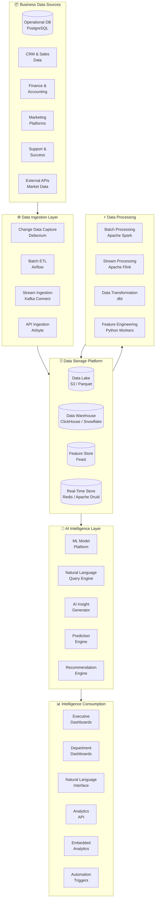
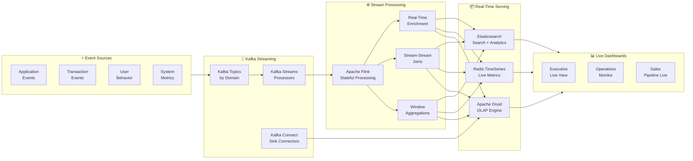
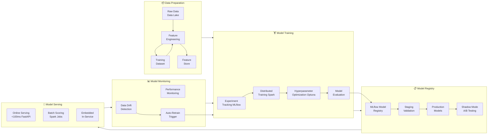
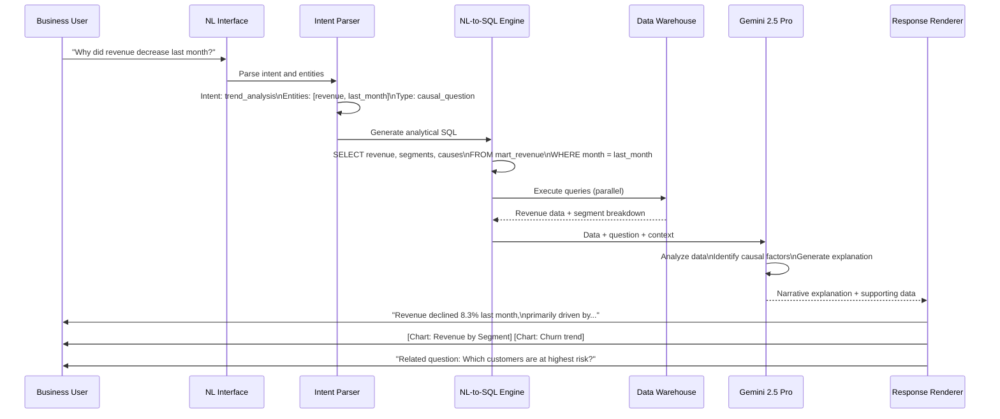
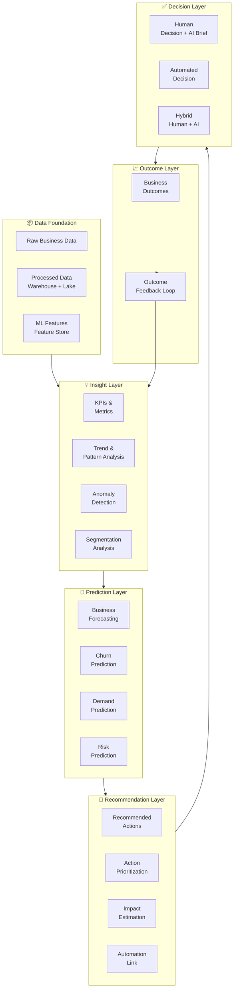
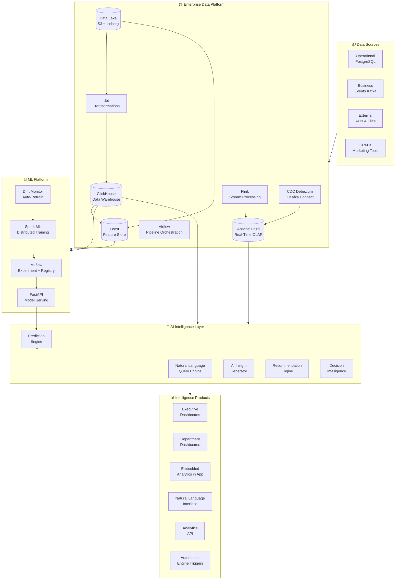
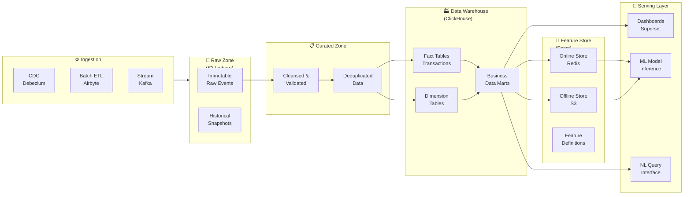
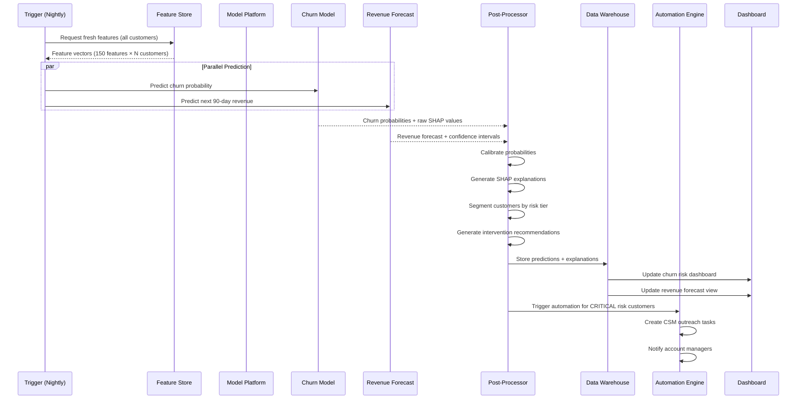
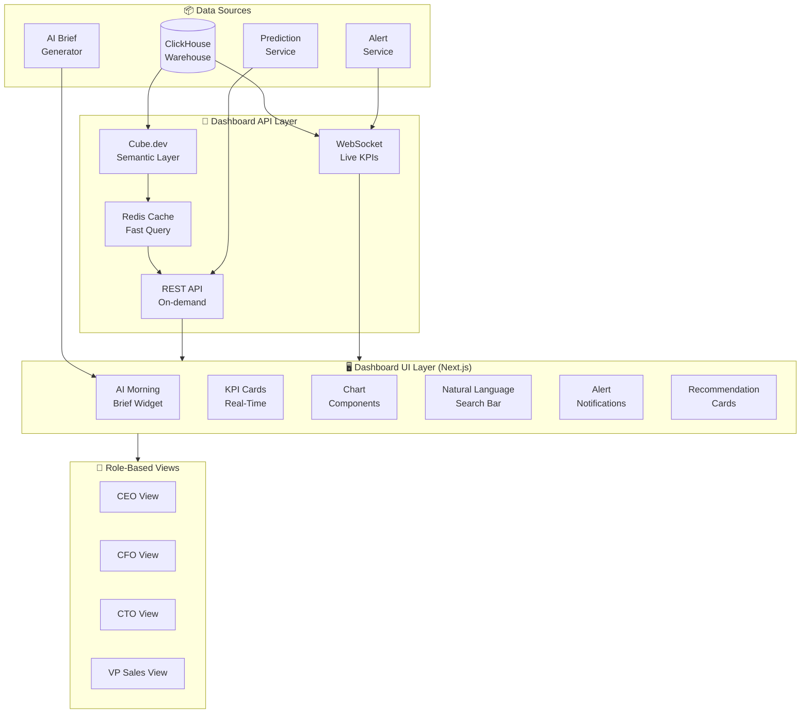

# AI ANALYTICS, PREDICTION & BUSINESS INTELLIGENCE PLATFORM

**Project Name:** Enterprise SaaS Business Management Platform  
**Document Version:** 1.0.0 — Baseline Standard  
**Date:** July 14, 2026  
**Authors:** Chief Data & AI Architect, Business Intelligence Architect, Machine Learning Engineer, Predictive Analytics Specialist, Data Platform Architect, Enterprise SaaS Analytics Strategist  
**Classification:** Internal — Confidential  
**Phase:** 20.5 — AI Analytics, Prediction & Business Intelligence Platform  

---

## Table of Contents

1. [Executive Summary](#1-executive-summary)
2. [AI Analytics Foundation & Philosophy](#2-ai-analytics-foundation--philosophy)
3. [Data Intelligence Architecture](#3-data-intelligence-architecture)
4. [Enterprise Data Platform](#4-enterprise-data-platform)
5. [Real-Time Analytics Architecture](#5-real-time-analytics-architecture)
6. [AI Prediction Engine](#6-ai-prediction-engine)
7. [Machine Learning Model Platform](#7-machine-learning-model-platform)
8. [Business Intelligence Platform](#8-business-intelligence-platform)
9. [Executive AI Dashboard](#9-executive-ai-dashboard)
10. [AI Insight Generation Engine](#10-ai-insight-generation-engine)
11. [Natural Language Analytics](#11-natural-language-analytics)
12. [Predictive Business Models](#12-predictive-business-models)
13. [Recommendation Engine](#13-recommendation-engine)
14. [Data Governance Architecture](#14-data-governance-architecture)
15. [AI Analytics Security](#15-ai-analytics-security)
16. [Analytics Technology Stack](#16-analytics-technology-stack)
17. [AI Analytics Observability](#17-ai-analytics-observability)
18. [AI Analytics Use Cases](#18-ai-analytics-use-cases)
19. [Decision Intelligence Platform](#19-decision-intelligence-platform)
20. [AI Analytics Evolution Roadmap](#20-ai-analytics-evolution-roadmap)
21. [Final Architecture Diagrams](#21-final-architecture-diagrams)
22. [Implementation Summary](#22-implementation-summary)

---

## 1. Executive Summary

### 1.1 Document Purpose

This document defines the complete AI Analytics, Prediction & Business Intelligence Platform Architecture for the SaaS Business Management Platform. It provides the authoritative technical blueprint for designing, deploying, and operating a unified intelligence layer that transforms raw operational data into actionable insights, accurate predictions, and intelligent business recommendations — accessible to every stakeholder from frontline operators to the C-suite.

### 1.2 Strategic Vision

The AI Analytics Platform represents the intelligence nervous system of the enterprise — continuously sensing the state of the business, detecting patterns and anomalies, predicting future outcomes, generating natural-language explanations, and delivering decision-ready intelligence to the right person at the right time.

### 1.3 Transformation Narrative

```
THE INTELLIGENCE TRANSFORMATION JOURNEY
─────────────────────────────────────────

BEFORE (Traditional BI):                AFTER (AI-Native Analytics):
──────────────────────────────          ────────────────────────────────
Data exists in silos                 →  Unified data platform
Weekly static reports                →  Real-time living dashboards
Historical reporting only            →  Predictive forecasting
Manual data analysis                 →  AI-automated insight surfacing
Generic dashboards for all           →  Personalized role-based views
"What happened?" questions           →  "What will happen?" predictions
Human analysts finding patterns      →  AI proactively surfaces anomalies
Executive reviews next quarter       →  AI alerts the moment trends shift
```

### 1.4 Platform Capability Overview

| Capability | Description | Business Value |
|---|---|---|
| **Real-Time Analytics** | Live operational metrics with sub-second refresh | Immediate situational awareness |
| **AI Prediction Engine** | 6 business-critical predictive models | 3–12 month forward visibility |
| **Natural Language BI** | Ask questions in plain English, get data answers | Analytics for non-technical users |
| **Automated Insights** | AI proactively surfaces anomalies and opportunities | Faster response to change |
| **Executive Dashboard** | Role-specific AI-powered intelligence views | Better executive decisions |
| **ML Model Platform** | End-to-end MLOps for 15+ business models | Continuously improving predictions |
| **Decision Intelligence** | Data → Insight → Prediction → Recommendation → Decision | Faster, data-driven decisions |

### 1.5 Key Business KPIs Enabled

| Business KPI | Without Platform | With AI Analytics | Improvement |
|---|---|---|---|
| Time to insight | 2–3 days (manual analysis) | <30 seconds (natural language) | 99% faster |
| Forecast accuracy (revenue) | ±25% manual estimates | ±7% AI MAPE | 72% improvement |
| Churn prediction lead time | Reactive (post-churn) | 60–90 days in advance | Proactive |
| Analytics user adoption | Finance/Data teams only | All business users | 10x broader |
| Decision cycle time | Weekly review cadence | Real-time alerts + recommendations | Days → minutes |

---

## 2. AI Analytics Foundation & Philosophy

### 2.1 Traditional BI vs AI Business Intelligence

```
┌──────────────────────────────────────────────────────────────────────┐
│          TRADITIONAL BI  vs  AI BUSINESS INTELLIGENCE                 │
├───────────────────────────────┬──────────────────────────────────────┤
│   TRADITIONAL BI              │    AI BUSINESS INTELLIGENCE           │
├───────────────────────────────┼──────────────────────────────────────┤
│                               │                                      │
│  WHAT HAPPENED?               │  WHY DID IT HAPPEN?                  │
│  Last quarter revenue: $4.2M  │  Revenue fell 12% because churn      │
│                               │  increased in the SMB segment due    │
│  ✗ No context                 │  to competitor price cuts in March   │
│  ✗ No causality               │                                      │
│  ✗ No future view             │  WHAT WILL HAPPEN?                   │
│  ✗ Static reports             │  Forecast: $4.6M next quarter        │
│  ✗ Requires data expertise    │  Risk: 23 accounts at churn risk     │
│  ✗ Reactive                   │                                      │
│  ✗ Available next week        │  WHAT SHOULD WE DO?                  │
│                               │  Recommend: Target 23 at-risk        │
│                               │  accounts with retention campaign    │
│                               │  Expected impact: +$340K ARR         │
│                               │                                      │
│                               │  ✓ Root cause analysis              │
│                               │  ✓ Predictive forecasting           │
│                               │  ✓ Actionable recommendations       │
│                               │  ✓ Natural language queries         │
│                               │  ✓ Proactive alerts                 │
│                               │  ✓ Real-time availability           │
└───────────────────────────────┴──────────────────────────────────────┘
```

### 2.2 Intelligence Value Chain

```
┌──────────────────────────────────────────────────────────────────────┐
│              DATA → INFORMATION → INSIGHT → PREDICTION → DECISION    │
│                                                                        │
│  DATA              Raw facts. No context.                             │
│  ─────             Revenue: $4,247,832                                │
│                                                                        │
│  INFORMATION       Data with context. Answers "what?"                 │
│  ─────────────     Revenue this month is $4.2M, down 12% vs last     │
│                                                                        │
│  INSIGHT           Information with analysis. Answers "why?"          │
│  ────────          The decline is driven by SMB churn (+40%) offset   │
│                    by enterprise growth (+18%). SMB churn correlates  │
│                    with competitor pricing changes in March.           │
│                                                                        │
│  PREDICTION        Insight with forward view. Answers "what next?"    │
│  ──────────        Next quarter revenue forecast: $4.6M (±6%)         │
│                    Churn risk: 23 accounts likely to cancel in 60 days│
│                    Combined value at risk: $780K ARR                   │
│                                                                        │
│  DECISION          Prediction with recommendation. Answers "what do?" │
│  ────────          Initiate retention campaign for 23 high-risk       │
│                    accounts. Estimated recovery: $340K ARR             │
│                    Assign dedicated CSM to top 5 by account value.    │
│                                                                        │
│   ▲ Strategic      ◄──────── AI ANALYTICS PLATFORM OPERATES HERE ────►│
│   │ Value                                                              │
│   │ Added                                                              │
│   ▼ Volume         Much Data                              Few Decisions│
└──────────────────────────────────────────────────────────────────────┘
```

### 2.3 Design Principles

#### Principle 1: Data as a Product
Every dataset, model output, and metric is treated as a product with owners, quality SLAs, documentation, and consumers.

#### Principle 2: Insight for Everyone
Analytics must be accessible to non-technical business users through natural language interfaces, not just data analysts with SQL skills.

#### Principle 3: Prediction over Reporting
The platform prioritizes forward-looking predictive intelligence over backward-looking reporting. Every historical view should also have a predictive counterpart.

#### Principle 4: Explainability Always
Every AI-generated insight, prediction, and recommendation must include an explanation. Stakeholders must understand *why* the AI arrived at a conclusion.

#### Principle 5: Trust Through Accuracy
Prediction accuracy is tracked and published. When models degrade, alerts fire and retraining is triggered automatically. Trust is earned through consistently accurate predictions.

#### Principle 6: Privacy-Preserving Analytics
Analytics must never expose individual PII. All analytical outputs are aggregated, anonymized where required, and governed by RBAC.

---

## 3. Data Intelligence Architecture

### 3.1 Platform Architecture Overview



### 3.2 Tenant Data Isolation Model

```
MULTI-TENANT ANALYTICS ISOLATION
──────────────────────────────────

Tenant A Data ──► Tenant A Warehouse Schema ──► Tenant A Dashboards
Tenant B Data ──► Tenant B Warehouse Schema ──► Tenant B Dashboards

Isolation Strategy:
  Data Warehouse: Schema-per-tenant (PostgreSQL schema isolation)
  Data Lake:      Prefix-per-tenant (s3://data-lake/{tenantId}/*)
  Feature Store:  Namespace-per-tenant (feast::{tenantId}::*)
  ML Models:      Shared global models + tenant-specific fine-tuned models
  Dashboards:     Row-level security on all analytical tables

Cross-Tenant Analytics (Platform-Level, Aggregated):
  Benchmarking analytics use anonymized aggregate data only
  Individual tenant data NEVER exposed cross-tenant
  Anonymization: k-anonymity with k≥10
```

---

## 4. Enterprise Data Platform

### 4.1 Five-Layer Data Architecture

```
┌──────────────────────────────────────────────────────────────────────┐
│               ENTERPRISE DATA PLATFORM — 5 LAYERS                     │
│                                                                        │
│  Layer 1: OPERATIONAL DATABASE                                         │
│  ──────────────────────────────                                        │
│  Technology: PostgreSQL 16                                             │
│  Purpose: Source of truth for all live business transactions          │
│  Data: Real-time operational state (orders, customers, inventory)     │
│  Access: Application services only — not for analytics queries        │
│  Replication: Logical replication to CDC pipeline                     │
│                                                                        │
│  Layer 2: DATA LAKE (Raw & Curated Zones)                             │
│  ─────────────────────────────────────────                             │
│  Technology: AWS S3 + Apache Iceberg (table format)                   │
│  Purpose: Immutable historical archive, raw event storage             │
│  Zones:                                                               │
│    Raw:     Untouched source data (never modified)                    │
│    Cleansed: Validated, deduplicated, typed                           │
│    Curated:  Business-ready enriched datasets                         │
│  Retention: 7 years (compliance requirement)                          │
│  Format: Apache Parquet (columnar, compressed)                        │
│                                                                        │
│  Layer 3: DATA WAREHOUSE (Analytical)                                  │
│  ────────────────────────────────────                                  │
│  Technology: ClickHouse (self-hosted) / Snowflake (managed)           │
│  Purpose: Fast analytical queries, aggregations, BI workloads         │
│  Schema: Star schema with fact and dimension tables                   │
│  Refresh: Near-real-time (stream) + daily batch                       │
│  SLA: <1 second for 90% of dashboard queries                         │
│                                                                        │
│  Layer 4: FEATURE STORE                                                │
│  ────────────────────────                                              │
│  Technology: Feast + Redis (online) + S3 (offline)                    │
│  Purpose: Reusable ML features shared across all models               │
│  Features: 200+ business features (customer health, usage, finance)   │
│  Freshness: Real-time features <1 minute lag                         │
│                                                                        │
│  Layer 5: AI DATA PLATFORM                                             │
│  ─────────────────────────                                             │
│  Technology: MLflow + Databricks (optional) + Custom                  │
│  Purpose: ML training datasets, model artifacts, experiment tracking  │
│  Datasets: Training, validation, test splits with versioning          │
│  Lineage: Full data lineage from source to model output               │
└──────────────────────────────────────────────────────────────────────┘
```

### 4.2 Data Warehouse Star Schema

```
DATA WAREHOUSE — STAR SCHEMA DESIGN
──────────────────────────────────────

FACT TABLES (Quantitative Measures):
  fact_revenue          — Daily revenue per tenant/customer/product
  fact_orders           — Order events with all dimensions
  fact_customer_health  — Daily customer health score snapshots
  fact_support_tickets  — Support interactions and resolution metrics
  fact_product_usage    — Feature usage events per user/tenant
  fact_pipeline         — Sales pipeline stage transitions

DIMENSION TABLES (Descriptive Attributes):
  dim_tenant            — Tenant master data (plan, region, industry)
  dim_customer          — Customer master data
  dim_product           — Product and SKU master data
  dim_date              — Date dimension (calendar, fiscal, business days)
  dim_geography         — Country, region, city hierarchy
  dim_user              — Platform user master data
  dim_channel           — Marketing and sales channel

AGGREGATE/MART TABLES (Pre-computed):
  mart_monthly_revenue  — Monthly revenue rollups with YoY, MoM
  mart_cohort_revenue   — Revenue by customer acquisition cohort
  mart_pipeline_funnel  — Conversion rates by stage and period
  mart_churn_analysis   — Churn rate analysis by segment and period
```

### 4.3 dbt Data Transformation Models

```sql
-- dbt model: mart_monthly_revenue
-- File: models/marts/finance/mart_monthly_revenue.sql

{{ config(
    materialized='incremental',
    unique_key=['tenant_id', 'year_month'],
    on_schema_change='merge'
) }}

WITH monthly_revenue AS (
    SELECT
        tenant_id,
        DATE_TRUNC('month', order_date) AS year_month,
        SUM(net_revenue_usd) AS total_revenue,
        COUNT(DISTINCT customer_id) AS paying_customers,
        COUNT(DISTINCT order_id) AS total_orders,
        AVG(net_revenue_usd) AS avg_order_value,
        SUM(CASE WHEN is_new_customer THEN net_revenue_usd ELSE 0 END) AS new_customer_revenue,
        SUM(CASE WHEN is_expansion THEN net_revenue_usd ELSE 0 END) AS expansion_revenue,
        SUM(CASE WHEN is_churn THEN net_revenue_usd ELSE 0 END) AS churned_revenue
    FROM {{ ref('fact_revenue') }}
    WHERE is_valid = TRUE
    
    AND order_date >= DATE_TRUNC('month', CURRENT_DATE - INTERVAL '2 months')
    
    GROUP BY tenant_id, DATE_TRUNC('month', order_date)
),
with_growth AS (
    SELECT
        *,
        LAG(total_revenue) OVER (PARTITION BY tenant_id ORDER BY year_month) AS prev_month_revenue,
        LAG(total_revenue, 12) OVER (PARTITION BY tenant_id ORDER BY year_month) AS same_month_last_year,
        ROUND(
            (total_revenue - LAG(total_revenue) OVER (PARTITION BY tenant_id ORDER BY year_month))
            / NULLIF(LAG(total_revenue) OVER (PARTITION BY tenant_id ORDER BY year_month), 0) * 100,
            2
        ) AS mom_growth_pct,
        SUM(total_revenue) OVER (PARTITION BY tenant_id, DATE_PART('year', year_month)) AS ytd_revenue
    FROM monthly_revenue
)
SELECT * FROM with_growth
```

---

## 5. Real-Time Analytics Architecture

### 5.1 Stream Processing Pipeline



### 5.2 Flink Stream Processing Implementation

```java
// Apache Flink — Real-Time Revenue Aggregation
public class RevenueStreamProcessor {
    
    public static void main(String[] args) throws Exception {
        StreamExecutionEnvironment env = StreamExecutionEnvironment.getExecutionEnvironment();
        
        // Kafka source — consume order events
        KafkaSource<OrderEvent> source = KafkaSource.<OrderEvent>builder()
            .setBootstrapServers("kafka:9092")
            .setTopics("events.orders.completed")
            .setGroupId("flink-revenue-processor")
            .setValueOnlyDeserializer(new OrderEventDeserializer())
            .build();
        
        DataStream<OrderEvent> orders = env.fromSource(
            source, WatermarkStrategy.forBoundedOutOfOrderness(Duration.ofSeconds(5)), "Kafka Source"
        );
        
        // Aggregate revenue per tenant per minute
        DataStream<RevenueSummary> minuteRevenue = orders
            .keyBy(order -> order.getTenantId())
            .window(TumblingEventTimeWindows.of(Time.minutes(1)))
            .aggregate(new RevenueAggregateFunction(), new RevenueWindowFunction());
        
        // Running 15-minute moving average
        DataStream<RevenueMovingAvg> movingAvg = orders
            .keyBy(order -> order.getTenantId())
            .window(SlidingEventTimeWindows.of(Time.minutes(15), Time.minutes(1)))
            .aggregate(new MovingAverageFunction());
        
        // Anomaly detection: alert if revenue drops >30% vs moving average
        DataStream<RevenueAnomaly> anomalies = minuteRevenue
            .connect(movingAvg)
            .flatMap(new RevenueAnomalyDetector(0.30));
        
        // Sink results to Apache Druid (OLAP) and Redis (live dashboard)
        minuteRevenue.sinkTo(buildDruidSink());
        minuteRevenue.sinkTo(buildRedisSink("revenue:live:minute"));
        anomalies.sinkTo(buildAlertSink());
        
        env.execute("Revenue Stream Processor");
    }
}
```

### 5.3 Real-Time KPI Framework

```typescript
// Real-Time KPI Service — WebSocket streaming to dashboards
@Injectable()
export class RealTimeKPIService {
  // KPI definitions with targets and alert thresholds
  private readonly kpiDefinitions: KPIDefinition[] = [
    {
      id: 'mrr',
      name: 'Monthly Recurring Revenue',
      query: 'SELECT SUM(mrr_usd) FROM fact_subscriptions WHERE tenant_id = ? AND is_active = true',
      refreshIntervalMs: 60000,
      target: null,                      // Set per tenant
      alertThreshold: { changePercent: -5, windowMinutes: 60 },
      format: 'currency_usd',
    },
    {
      id: 'revenue_today',
      name: "Today's Revenue",
      source: 'redis_timeseries',
      key: 'revenue:live:today:{tenantId}',
      refreshIntervalMs: 5000,           // 5 second refresh
      format: 'currency_usd',
    },
    {
      id: 'active_sessions',
      name: 'Active User Sessions',
      source: 'redis',
      key: 'sessions:active:{tenantId}',
      refreshIntervalMs: 10000,
      format: 'number',
    },
    {
      id: 'support_sla_breach_risk',
      name: 'Tickets at SLA Risk',
      source: 'druid',
      query: 'SELECT COUNT(*) FROM tickets WHERE sla_consumed_pct > 0.8 AND status = "open"',
      refreshIntervalMs: 30000,
      alertThreshold: { absoluteValue: 5 },
      format: 'number',
      severity: 'warning',
    },
  ];

  // WebSocket gateway — push KPI updates to connected dashboards
  async streamKPIsToClient(client: WebSocket, tenantId: string, userId: string): Promise<void> {
    const userRoles = await this.authService.getUserRoles(userId);
    const allowedKPIs = this.filterKPIsByRole(this.kpiDefinitions, userRoles);
    
    for (const kpi of allowedKPIs) {
      setInterval(async () => {
        try {
          const value = await this.fetchKPIValue(kpi, tenantId);
          const trend = await this.calculateTrend(kpi.id, tenantId, value);
          
          client.send(JSON.stringify({
            type: 'kpi_update',
            kpiId: kpi.id,
            value,
            trend,
            timestamp: new Date().toISOString(),
          }));
        } catch (error) {
          this.logger.error(`KPI fetch failed: ${kpi.id}`, error);
        }
      }, kpi.refreshIntervalMs);
    }
  }
}
```

---

## 6. AI Prediction Engine

### 6.1 Prediction Engine Architecture

```
┌──────────────────────────────────────────────────────────────────────┐
│                    AI PREDICTION ENGINE                                │
│                                                                        │
│  Input: Business Data (Features)                                       │
│       │                                                                │
│       ▼                                                                │
│  ┌──────────────────────────────────────────────────────────────┐    │
│  │  FEATURE ENGINEERING LAYER                                   │    │
│  │  • Pull features from Feature Store (Feast)                  │    │
│  │  • Compute derived features on-demand                        │    │
│  │  • Feature validation and freshness check                    │    │
│  │  • Feature transformation (scaling, encoding)                │    │
│  └──────────────────────────────────────────────────────────────┘    │
│       │                                                                │
│       ▼                                                                │
│  ┌──────────────────────────────────────────────────────────────┐    │
│  │  MODEL ROUTING LAYER                                         │    │
│  │  • Route to appropriate model by prediction type             │    │
│  │  • A/B testing between model versions                        │    │
│  │  • Shadow mode for new model validation                      │    │
│  │  • Ensemble combination where applicable                     │    │
│  └──────────────────────────────────────────────────────────────┘    │
│       │                                                                │
│       ├──────────────────────────────────────────────────────┐       │
│       │  Sales Forecast  │ Churn Model │ Inventory │ Risk ... │       │
│       └──────────────────────────────────────────────────────┘       │
│       │                                                                │
│       ▼                                                                │
│  ┌──────────────────────────────────────────────────────────────┐    │
│  │  POST-PROCESSING LAYER                                       │    │
│  │  • Calibration (align probabilities to real outcomes)        │    │
│  │  • Explainability (SHAP values for feature importance)       │    │
│  │  • Confidence intervals                                      │    │
│  │  • Business rule overrides                                   │    │
│  └──────────────────────────────────────────────────────────────┘    │
│       │                                                                │
│       ▼                                                                │
│  Predictions + Confidence + Explanations + Recommendations            │
└──────────────────────────────────────────────────────────────────────┘
```

### 6.2 Prediction Portfolio

#### Prediction 1: Revenue Forecasting

```
REVENUE FORECASTING MODEL
──────────────────────────

Goal: Predict monthly/quarterly revenue for the next 12 months

Algorithm: Ensemble of:
  • Prophet (Facebook) — seasonality + trend decomposition
  • ARIMA — statistical time series
  • LightGBM — feature-based regression
  Final: Weighted average by historical accuracy

Features (90+ features):
  • Historical revenue (36 months)
  • MRR, ARR, expansion, churn signals
  • Sales pipeline weighted value
  • Product usage trends
  • Macroeconomic indicators (GDP growth, SaaS index)
  • Seasonal patterns
  • Marketing spend and campaign schedule

Output:
  • Point forecast (best estimate)
  • 80% confidence interval
  • 95% confidence interval
  • Upside/downside scenario analysis

Performance Target:
  • MAPE: <8% for 30-day forecast
  • MAPE: <15% for 90-day forecast
  • Continuous evaluation vs actuals

Update Frequency: Daily (next-day prediction) / Weekly (12-month)
```

#### Prediction 2: Customer Churn Prediction

```
CUSTOMER CHURN PREDICTION MODEL
─────────────────────────────────

Goal: Identify customers likely to churn in next 30/60/90 days

Algorithm:
  • Primary: XGBoost gradient boosting (binary classification)
  • Secondary: LSTM neural network (sequence patterns)
  • Calibration: Platt scaling for probability calibration
  • Explanation: SHAP TreeExplainer

Features (150+ features):
  Engagement Features:
  • Login frequency (7d, 30d, 90d trend)
  • Feature adoption (% of available features used)
  • Active user count (trend)
  • Session duration trend
  
  Financial Features:
  • MRR trend (growing/stable/declining)
  • Invoice payment behavior
  • Plan tier (starter/pro/enterprise)
  • Discount levels applied
  
  Support Features:
  • Open ticket count and age
  • CSAT score trend
  • Escalation history
  • Unresolved issues
  
  Product Health:
  • API error rate trend
  • Integration failure frequency
  • Data import success rate

Output Per Customer:
  • Churn probability (0-100%)
  • Churn risk tier (LOW / MEDIUM / HIGH / CRITICAL)
  • Top 5 churn reasons with SHAP values
  • Recommended intervention
  • Estimated ARR at risk

Performance Target:
  • AUC-ROC: >0.87
  • Precision at 10% recall threshold: >80%
  • Model recalibrated monthly
```

#### Prediction 3: Demand Forecasting

```
INVENTORY DEMAND FORECASTING
──────────────────────────────

Goal: Predict product demand per SKU for next 30/60/90 days

Algorithm:
  • Global model: LightGBM with temporal features (handles cold start)
  • Per-SKU fine-tuned: Prophet with custom seasonality
  • Hierarchical reconciliation: Bottom-up + top-down

Features:
  • 24-month sales history per SKU
  • Promotional calendar (planned discounts, campaigns)
  • Inventory level and stockout history
  • Supplier lead time
  • Weather (for relevant product categories)
  • Public holidays and regional events
  • Price elasticity estimates

Output:
  • Point forecast: Units per day per SKU
  • Prediction intervals: 80% and 95%
  • Seasonality decomposition
  • Reorder recommendations with optimal quantities

Performance Target:
  • MAPE: <12% for 30-day horizon
  • Bias: <±3% (no systematic over/under prediction)
```

#### Prediction 4: Customer Lifetime Value (CLV)

```
CUSTOMER LIFETIME VALUE MODEL
───────────────────────────────

Goal: Predict expected revenue from each customer over 3 years

Algorithm:
  • BG/NBD model (contractual): Probability of remaining active
  • Gamma-Gamma model: Expected spend per active period
  • Combined: CLV = E[Transactions] × E[Order Value] × Margin

Segments Generated:
  • Champions (High CLV, High recent activity)
  • Loyal (Moderate CLV, Consistent activity)
  • Potential (Low current, High predicted CLV)
  • At-Risk (Previously high, declining)
  • Lost Causes (Low CLV, Low activity)

Output:
  • 12-month CLV
  • 36-month CLV
  • Segment classification
  • Optimal investment level per customer

Business Use:
  • Customer acquisition bid optimization
  • Support and success resource allocation
  • Pricing and discount authority by CLV tier
  • Portfolio health dashboard
```

#### Prediction 5: Pricing Optimization

```
DYNAMIC PRICING OPTIMIZATION
──────────────────────────────

Goal: Recommend optimal pricing by segment, use case, and market

Algorithm:
  • Price elasticity estimation per segment
  • Competitor price monitoring (web scraping + APIs)
  • Value-based pricing via conjoint analysis
  • Constraint optimization: Maximize revenue subject to growth targets

Inputs:
  • Current pricing + competitor pricing
  • Conversion rates by price point
  • Win/loss data with pricing notes
  • Customer segment willingness-to-pay survey data
  • Renewal rates by discount level

Output:
  • Recommended list price per plan
  • Optimal discount thresholds by segment
  • Personalized deal recommendations for reps
  • Price sensitivity heatmap by customer segment
```

#### Prediction 6: Fraud Detection

```
FRAUD & ANOMALY DETECTION MODEL
──────────────────────────────────

Goal: Detect fraudulent transactions and anomalous account behavior in real-time

Algorithm:
  • Isolation Forest (unsupervised anomaly detection)
  • Autoencoder neural network (reconstruction error)
  • Rule-based velocity checks (always-on baseline)
  • Online learning: Adapts to new fraud patterns

Detection Categories:
  • Account takeover (login anomalies + behavior shift)
  • Payment fraud (card testing, stolen credentials)
  • Fake account creation (velocity, email patterns)
  • Data exfiltration attempts (unusual data access volumes)

Latency Requirement: <100ms (real-time path)
False Positive Target: <2%
Recall Target: >92% of actual fraud events caught
```

---

## 7. Machine Learning Model Platform

### 7.1 MLOps Architecture



### 7.2 ML Model Lifecycle Management

```typescript
// MLflow Model Registry Integration
@Injectable()
export class ModelRegistryService {
  async promoteModel(
    modelName: string,
    version: string,
    targetStage: 'Staging' | 'Production'
  ): Promise<PromotionResult> {
    // Validate model meets quality gates before promotion
    const qualityCheck = await this.validateModelQuality(modelName, version);
    
    if (!qualityCheck.passes) {
      throw new ModelQualityGateError(
        `Model ${modelName} v${version} failed quality gate: ${qualityCheck.failedChecks.join(', ')}`
      );
    }

    // Shadow mode: run alongside production for 48h before full promotion
    if (targetStage === 'Production') {
      await this.enableShadowMode(modelName, version);
      
      // Wait for shadow validation
      const shadowResult = await this.runShadowValidation(
        modelName,
        version,
        { durationHours: 48, trafficPercent: 10 }
      );
      
      if (!shadowResult.acceptable) {
        throw new ShadowValidationError(shadowResult.issues);
      }
    }

    // Transition model stage in MLflow
    await this.mlflowClient.transitionModelVersionStage(modelName, version, targetStage);
    
    // Update serving routes
    await this.modelServingService.updateRoute(modelName, version);
    
    // Archive previous production version
    if (targetStage === 'Production') {
      await this.archivePreviousVersion(modelName);
    }
    
    // Notify data science team
    await this.notificationService.modelPromoted({ modelName, version, targetStage });
    
    return { success: true, activeVersion: version };
  }

  private async validateModelQuality(
    modelName: string,
    version: string
  ): Promise<QualityCheckResult> {
    const metrics = await this.mlflowClient.getRunMetrics(modelName, version);
    const qualityGates = this.getQualityGates(modelName);
    
    const failedChecks = qualityGates
      .filter(gate => !gate.evaluate(metrics))
      .map(gate => gate.description);
    
    return { passes: failedChecks.length === 0, failedChecks };
  }
}

// Quality Gates per Model Type
const qualityGates: Record<string, QualityGate[]> = {
  'churn_prediction': [
    { metric: 'auc_roc', threshold: 0.85, operator: '>=', description: 'AUC-ROC >= 0.85' },
    { metric: 'precision_at_k', threshold: 0.75, operator: '>=', description: 'Precision@10% >= 0.75' },
    { metric: 'feature_coverage', threshold: 0.95, operator: '>=', description: 'Feature coverage >= 95%' },
  ],
  'revenue_forecast': [
    { metric: 'mape_30d', threshold: 0.10, operator: '<=', description: 'MAPE 30-day <= 10%' },
    { metric: 'bias', threshold: 0.03, operator: '<=', description: '|Bias| <= 3%' },
  ],
  'fraud_detection': [
    { metric: 'recall', threshold: 0.90, operator: '>=', description: 'Recall >= 90%' },
    { metric: 'false_positive_rate', threshold: 0.02, operator: '<=', description: 'FPR <= 2%' },
    { metric: 'latency_p99_ms', threshold: 100, operator: '<=', description: 'P99 latency <= 100ms' },
  ],
};
```

### 7.3 Model Drift Detection

```typescript
// Model Data Drift Monitor
@Injectable()
export class ModelDriftService {
  async checkDrift(modelName: string, tenantId?: string): Promise<DriftReport> {
    const referenceData = await this.getTrainingDistributions(modelName);
    const currentData = await this.getCurrentFeatureDistributions(modelName, tenantId);
    
    const featureDrifts = await Promise.all(
      referenceData.features.map(async (feature) => {
        const drift = await this.calculateDrift(
          referenceData.distributions[feature.name],
          currentData.distributions[feature.name],
          feature.type
        );
        return { feature: feature.name, drift, threshold: feature.driftThreshold };
      })
    );
    
    const driftedFeatures = featureDrifts.filter(f => f.drift > f.threshold);
    const overallDriftScore = featureDrifts.reduce((sum, f) => sum + f.drift, 0) / featureDrifts.length;
    
    const shouldRetrain = driftedFeatures.length > 5 || overallDriftScore > 0.3;
    
    if (shouldRetrain) {
      await this.triggerRetraining(modelName, { reason: 'data_drift', driftScore: overallDriftScore });
      await this.alertService.modelDriftAlert(modelName, driftedFeatures);
    }
    
    return {
      modelName,
      overallDriftScore,
      driftedFeaturesCount: driftedFeatures.length,
      driftedFeatures,
      shouldRetrain,
      evaluatedAt: new Date(),
    };
  }
  
  // Population Stability Index for categorical features
  // KL Divergence / Wasserstein for numerical features
  private async calculateDrift(
    reference: FeatureDistribution,
    current: FeatureDistribution,
    featureType: 'categorical' | 'numerical'
  ): Promise<number> {
    if (featureType === 'categorical') {
      return this.calculatePSI(reference, current);
    }
    return this.calculateWassersteinDistance(reference, current);
  }
}
```

---

## 8. Business Intelligence Platform

### 8.1 BI Platform Architecture

```
┌──────────────────────────────────────────────────────────────────────┐
│                  BUSINESS INTELLIGENCE PLATFORM                       │
│                                                                        │
│  Data Foundation                                                       │
│  ┌─────────────────────────────────────────────────────────────┐    │
│  │  Semantic Layer (Cube.dev / dbt Semantic Layer)              │    │
│  │  • Business metrics definitions (MRR, CAC, LTV, NRR)        │    │
│  │  • Dimensions and hierarchies                                │    │
│  │  • Access control policies                                   │    │
│  │  • Single source of truth for all KPIs                       │    │
│  └─────────────────────────────────────────────────────────────┘    │
│                                                                        │
│  Analytics Experiences                                                 │
│  ┌──────────────┬──────────────┬──────────────┬─────────────────┐   │
│  │  EXECUTIVE   │  DEPARTMENT  │  OPERATIONAL │  SELF-SERVICE   │   │
│  │  DASHBOARDS  │  DASHBOARDS  │  DASHBOARDS  │  ANALYTICS      │   │
│  │              │              │              │                 │   │
│  │  CEO/CFO/CTO │  Finance     │  Support     │  Any Business   │   │
│  │  views       │  Sales       │  Operations  │  User           │   │
│  │              │  Marketing   │  Dev/Ops     │  Natural Lang.  │   │
│  └──────────────┴──────────────┴──────────────┴─────────────────┘   │
│                                                                        │
│  Report Types                                                          │
│  ┌─────────────────────────────────────────────────────────────┐    │
│  │  Scheduled Reports   │  Ad-Hoc Reports  │  AI Reports       │    │
│  │  • Daily digest      │  • User-built    │  • Auto-generated │    │
│  │  • Weekly summaries  │  • SQL + visual  │  • NL-explained   │    │
│  │  • Monthly board     │  • Drag & drop   │  • Insight-first  │    │
│  │  • Regulatory        │  • Export (PDF)  │  • Action-ready   │    │
│  └─────────────────────────────────────────────────────────────┘    │
└──────────────────────────────────────────────────────────────────────┘
```

### 8.2 Semantic Metrics Layer

```typescript
// Cube.dev Semantic Layer — Business Metrics Definition
cube(`Revenue`, {
  sql: `SELECT * FROM mart_monthly_revenue`,
  
  measures: {
    totalRevenue: {
      type: `sum`,
      sql: `total_revenue`,
      title: `Total Revenue (USD)`,
      format: `currency`,
      drillMembers: [orderId, customerId, productId],
    },
    mrr: {
      type: `number`,
      sql: `SUM(total_revenue) FILTER (WHERE subscription_type = 'recurring')`,
      title: `MRR`,
      format: `currency`,
    },
    momGrowthPct: {
      type: `number`,
      sql: `AVG(mom_growth_pct)`,
      title: `MoM Growth %`,
      format: `percent`,
    },
    churnRate: {
      type: `number`,
      sql: `ROUND(SUM(churned_revenue) / NULLIF(SUM(total_revenue), 0) * 100, 2)`,
      title: `Revenue Churn Rate`,
      format: `percent`,
    },
    nrr: {
      type: `number`,
      sql: `
        ROUND((SUM(total_revenue) - SUM(churned_revenue) + SUM(expansion_revenue)) 
        / NULLIF(SUM(prev_month_revenue), 0) * 100, 2)
      `,
      title: `Net Revenue Retention`,
      format: `percent`,
    },
  },
  
  dimensions: {
    tenantId: { sql: `tenant_id`, type: `string`, primaryKey: true },
    yearMonth: { sql: `year_month`, type: `time` },
    year: { sql: `DATE_PART('year', year_month)`, type: `number` },
    quarter: { sql: `DATE_PART('quarter', year_month)`, type: `number` },
  },
  
  segments: {
    enterprise: { sql: `${Revenue}.plan_tier = 'enterprise'` },
    smb: { sql: `${Revenue}.plan_tier IN ('starter', 'pro')` },
  },
});
```

### 8.3 KPI Registry

| KPI | Formula | Target | Alert Threshold |
|---|---|---|---|
| **MRR** | Sum of monthly recurring revenue | Tenant-specific | >±10% MoM change |
| **ARR** | MRR × 12 | Tenant-specific | — |
| **MoM Growth** | (MRR_current - MRR_prev) / MRR_prev | >5% | <0% for 2 months |
| **NRR** | (MRR_start + expansion - churn) / MRR_start | >100% | <90% |
| **Gross Churn** | Churned MRR / Total MRR | <3% | >5% |
| **CAC** | Total sales+marketing cost / New customers | Tenant-specific | >2.5x payback increase |
| **LTV:CAC Ratio** | LTV / CAC | >3:1 | <2:1 |
| **Payback Period** | CAC / (MRR × Gross Margin) | <18 months | >24 months |
| **DAU/MAU Ratio** | Daily active / Monthly active users | >40% | <25% |
| **Feature Adoption** | Features used / Features available | >60% | <40% |
| **Support CSAT** | Average customer satisfaction score | >4.3/5 | <3.8/5 |
| **Ticket Resolution SLA** | % tickets resolved within SLA | >95% | <90% |

---

## 9. Executive AI Dashboard

### 9.1 CEO Intelligence Dashboard

```
┌──────────────────────────────────────────────────────────────────────┐
│  🏢 EXECUTIVE AI DASHBOARD          [Last updated: 2 min ago]  [🔔 3] │
│  Good morning, Alex. Here's your business intelligence for today.     │
│                                                                        │
│  ┌──────────────────────────────────────────────────────────────┐    │
│  │  💡 AI MORNING BRIEF                                         │    │
│  │  Revenue is tracking 4.2% above forecast. However, 3 high-   │    │
│  │  value accounts ($280K ARR combined) show critical churn      │    │
│  │  risk. Recommended action: schedule executive outreach today. │    │
│  │  [View Details] [Initiate Outreach] [Dismiss]                │    │
│  └──────────────────────────────────────────────────────────────┘    │
│                                                                        │
│  ┌──────────┬──────────┬──────────┬──────────┐                       │
│  │  MRR     │  Growth  │  NRR     │  Churn   │                       │
│  │ $847K    │ +5.8%    │  112%    │  1.8%    │                       │
│  │ ▲$46K vs │ ▲ vs 4.2%│ ▲ vs 108%│ ▼ vs 2.1%│                       │
│  │ last mo  │ target   │ last mo  │ last mo  │                       │
│  └──────────┴──────────┴──────────┴──────────┘                       │
│                                                                        │
│  ┌──────────────────────────┬─────────────────────────────────────┐  │
│  │  REVENUE FORECAST         │  CUSTOMERS AT RISK                 │  │
│  │  ───────────────          │  ─────────────────────             │  │
│  │  Q3 Target:  $2.6M        │  ● CRITICAL: 3 accounts ($280K)    │  │
│  │  Q3 Forecast: $2.7M (+4%) │  ● HIGH: 12 accounts ($540K)       │  │
│  │  Confidence: 87%          │  ● MEDIUM: 34 accounts ($820K)     │  │
│  │  [View Forecast]          │  Total at risk: $1.64M ARR         │  │
│  │                           │  [Launch Retention Campaign]        │  │
│  └──────────────────────────┴─────────────────────────────────────┘  │
│                                                                        │
│  ┌──────────────────────────┬─────────────────────────────────────┐  │
│  │  PIPELINE HEALTH          │  OPERATIONAL HEALTH                │  │
│  │  ──────────────           │  ────────────────────              │  │
│  │  Total Pipeline: $8.2M    │  Support SLA: 97.3% ✅             │  │
│  │  Weighted: $3.1M          │  System Uptime: 99.97% ✅          │  │
│  │  Deals close this mo: 14  │  Data Quality: 98.2% ✅            │  │
│  │  Win rate: 34% (▲2%)      │  Open Incidents: 0 ✅              │  │
│  └──────────────────────────┴─────────────────────────────────────┘  │
│                                                                        │
│  🤖 Ask AI: [Why did NRR improve this month?_______________] [Ask]   │
└──────────────────────────────────────────────────────────────────────┘
```

### 9.2 Executive Dashboard Implementation

```typescript
// Executive Dashboard Service
@Injectable()
export class ExecutiveDashboardService {
  async buildExecutiveView(
    tenantId: string,
    userId: string
  ): Promise<ExecutiveDashboard> {
    const [
      revenueMetrics,
      customerHealthSummary,
      pipelineSummary,
      operationalHealth,
      aiMorningBrief,
      forecasts,
      alerts,
    ] = await Promise.all([
      this.revenueService.getMetrics(tenantId),
      this.customerHealthService.getSummary(tenantId),
      this.pipelineService.getSummary(tenantId),
      this.operationsService.getHealthSummary(tenantId),
      this.aiInsightService.generateMorningBrief(tenantId),
      this.forecastService.getAllForecasts(tenantId),
      this.alertService.getActiveAlerts(tenantId, { severity: ['critical', 'high'] }),
    ]);

    return {
      generatedAt: new Date(),
      aiMorningBrief,           // LLM-generated personalized brief
      kpis: this.buildKPIs(revenueMetrics),
      forecasts,
      alerts,
      customerRiskSummary: customerHealthSummary,
      pipelineSummary,
      operationalHealth,
    };
  }

  private buildKPIs(revenue: RevenueMetrics): KPICard[] {
    return [
      {
        id: 'mrr',
        label: 'MRR',
        value: revenue.mrr,
        format: 'currency_usd',
        change: revenue.mrrMoMChange,
        changeType: 'mom',
        trend: revenue.mrrTrend12m,
        status: revenue.mrrMoMChange > 0 ? 'positive' : 'warning',
      },
      {
        id: 'growth',
        label: 'MoM Growth',
        value: revenue.momGrowthPct,
        format: 'percent',
        target: revenue.growthTarget,
        status: revenue.momGrowthPct >= revenue.growthTarget ? 'positive' : 'warning',
      },
      {
        id: 'nrr',
        label: 'Net Revenue Retention',
        value: revenue.nrr,
        format: 'percent',
        benchmark: 110,
        status: revenue.nrr >= 100 ? 'positive' : 'critical',
      },
      {
        id: 'churn',
        label: 'Revenue Churn',
        value: revenue.churnRate,
        format: 'percent',
        status: revenue.churnRate <= 2 ? 'positive' : revenue.churnRate <= 4 ? 'warning' : 'critical',
      },
    ];
  }
}
```

### 9.3 Role-Based Dashboard Hierarchy

| Role | Dashboard View | Key Metrics | Prediction Access |
|---|---|---|---|
| **CEO** | Business overview, strategic metrics | Revenue, Growth, NRR, Churn, Pipeline | All forecasts |
| **CFO** | Financial intelligence, cash flow | Revenue, CAC, LTV, P&L, Cash position | Revenue + CLV forecast |
| **CTO** | Platform health, engineering metrics | Uptime, Performance, Tech debt, API health | Capacity forecast |
| **VP Sales** | Pipeline, deal health, team performance | Pipeline value, Win rate, Quota attainment | Revenue + churn |
| **Sales Manager** | Team and deal-level analytics | Rep performance, Deal stages, Stalled deals | Churn + propensity |
| **Finance Manager** | P&L, budget, AP/AR analytics | Expenses, Budget variance, DSO, Collection rate | Revenue |
| **Support Manager** | Ticket analytics, SLA, agent performance | CSAT, SLA adherence, Resolution time, Volume | Volume forecast |
| **Marketing** | Campaign performance, funnel analytics | Lead volume, Conversion, CAC, Attribution | Demand forecast |

---

## 10. AI Insight Generation Engine

### 10.1 Automated Insight Architecture

```
┌──────────────────────────────────────────────────────────────────────┐
│                   AI INSIGHT GENERATION ENGINE                        │
│                                                                        │
│  DATA MONITORING (Continuous)                                          │
│  ┌──────────────────────────────────────────────────────────────┐    │
│  │  Statistical Control Charts — detect metric shifts            │    │
│  │  CUSUM / EWMA algorithms — detect trend changes              │    │
│  │  Isolation Forest — detect multivariate anomalies            │    │
│  │  Cohort comparison — detect segment divergence               │    │
│  └──────────────────────────────────────────────────────────────┘    │
│       │ Anomaly / Pattern Detected                                     │
│       ▼                                                                │
│  ROOT CAUSE ANALYSIS                                                   │
│  ┌──────────────────────────────────────────────────────────────┐    │
│  │  Causal analysis — identify contributing factors             │    │
│  │  Segment drill-down — identify which segments are affected   │    │
│  │  Time correlation — what else changed at the same time?      │    │
│  │  Feature importance — which variables explain the change?    │    │
│  └──────────────────────────────────────────────────────────────┘    │
│       │ Explanation Generated                                          │
│       ▼                                                                │
│  NATURAL LANGUAGE EXPLANATION (LLM)                                    │
│  ┌──────────────────────────────────────────────────────────────┐    │
│  │  Context: Metric, change magnitude, time frame, affected seg  │    │
│  │  Cause: Identified contributing factors with evidence         │    │
│  │  Comparison: vs target, vs last period, vs benchmark         │    │
│  │  Implication: Business impact of this insight                │    │
│  └──────────────────────────────────────────────────────────────┘    │
│       │                                                                │
│       ▼                                                                │
│  RECOMMENDATION                                                        │
│  ┌──────────────────────────────────────────────────────────────┐    │
│  │  Immediate action: What to do today                          │    │
│  │  Expected impact: Estimated result of action                 │    │
│  │  Automation option: Can the AI execute this? [Automate]      │    │
│  └──────────────────────────────────────────────────────────────┘    │
└──────────────────────────────────────────────────────────────────────┘
```

### 10.2 Automated Insight Service

```typescript
@Injectable()
export class AIInsightGeneratorService {
  // Proactively generate insights — runs every 4 hours
  @Cron('0 */4 * * *')
  async generateProactiveInsights(): Promise<void> {
    const tenants = await this.tenantService.getActiveTenants();
    
    for (const tenant of tenants) {
      await this.generateInsightsForTenant(tenant.id);
    }
  }

  async generateInsightsForTenant(tenantId: string): Promise<Insight[]> {
    // 1. Detect anomalies across all key metrics
    const anomalies = await this.anomalyDetector.scan({
      tenantId,
      metrics: ['revenue', 'churn_rate', 'csat', 'usage', 'pipeline_velocity'],
      windowDays: 30,
      sensitivityThreshold: 0.15,  // 15% deviation triggers investigation
    });
    
    const insights: Insight[] = [];
    
    for (const anomaly of anomalies) {
      // 2. Investigate root cause
      const rootCause = await this.investigateRootCause(anomaly, tenantId);
      
      // 3. Generate natural language explanation via LLM
      const explanation = await this.generateExplanation(anomaly, rootCause);
      
      // 4. Generate recommendation
      const recommendation = await this.generateRecommendation(
        anomaly,
        rootCause,
        tenantId
      );
      
      // 5. Determine priority
      const priority = this.calculateInsightPriority(anomaly, rootCause);
      
      insights.push({
        insightId: generateId(),
        tenantId,
        type: this.classifyInsightType(anomaly),
        priority,
        headline: explanation.headline,
        bodyText: explanation.fullExplanation,
        dataPoints: rootCause.evidence,
        recommendation: recommendation,
        estimatedImpact: recommendation.estimatedImpact,
        canAutomate: recommendation.automationAvailable,
        expiresAt: new Date(Date.now() + 7 * 24 * 60 * 60 * 1000),
        generatedAt: new Date(),
      });
    }

    // Save and notify relevant stakeholders
    await this.insightRepository.bulkCreate(insights);
    await this.notifyStakeholders(insights, tenantId);
    
    return insights;
  }

  private async generateExplanation(
    anomaly: Anomaly,
    rootCause: RootCauseAnalysis
  ): Promise<InsightExplanation> {
    const prompt = `
You are an expert business intelligence analyst. Generate a clear, professional explanation for this business metric anomaly.

Metric: ${anomaly.metric} changed by ${anomaly.changePercent}% over ${anomaly.windowDays} days
Direction: ${anomaly.direction} (${anomaly.severity} severity)

Root Cause Evidence:
${rootCause.factors.map(f => `- ${f.factor}: ${f.explanation} (confidence: ${f.confidence}%)`).join('\n')}

Write:
1. A 1-sentence HEADLINE (clear, impactful, specific)
2. A 2-3 paragraph EXPLANATION covering: what happened, why it happened, which segments/products/regions are affected

Be specific, professional, and data-driven. Reference actual numbers.
Avoid jargon. Write for a business executive audience.
    `;
    
    return this.llmService.structuredCompletion<InsightExplanation>(prompt, {
      model: 'gemini-flash',
      temperature: 0.3,
    });
  }
}
```

---

## 11. Natural Language Analytics

### 11.1 NL Query Architecture



### 11.2 Natural Language Query Service

```typescript
@Injectable()
export class NaturalLanguageAnalyticsService {
  async query(
    question: string,
    context: QueryContext
  ): Promise<NLQueryResult> {
    // Step 1: Parse intent and extract entities
    const intent = await this.intentParser.parse(question, context);
    
    // Step 2: Generate analytical queries
    const queries = await this.queryGenerator.generate(intent, context);
    
    // Step 3: Execute queries against data warehouse
    const queryResults = await Promise.all(
      queries.map(q => this.warehouseService.execute(q, context.tenantId))
    );
    
    // Step 4: Generate natural language response
    const response = await this.generateNarrativeResponse(
      question,
      intent,
      queryResults,
      context
    );
    
    // Step 5: Generate follow-up questions
    const followUpQuestions = await this.generateFollowUps(question, intent, queryResults);
    
    // Step 6: Build visualizations
    const visualizations = this.buildVisualizations(intent, queryResults);
    
    return {
      answer: response.narrative,
      confidence: response.confidence,
      dataPoints: queryResults,
      visualizations,
      followUpQuestions,
      sqlGenerated: queries.map(q => q.sql),    // For transparency
      executionTimeMs: response.executionTimeMs,
    };
  }
  
  private async generateNarrativeResponse(
    question: string,
    intent: ParsedIntent,
    data: QueryResult[],
    context: QueryContext
  ): Promise<NarrativeResponse> {
    const systemPrompt = `
You are an expert business intelligence analyst for ${context.tenantName}.
Your role: Transform raw data into clear, insightful, actionable narratives.

Rules:
- Be specific: Reference exact numbers and percentages from the data
- Explain WHY, not just WHAT
- Recommend next actions when patterns are significant  
- Keep explanations concise (2-3 paragraphs max)
- Always cite which time period the data covers
- Mention confidence level if data is limited
    `;

    const userPrompt = `
Question: "${question}"

Data retrieved:
${JSON.stringify(data.map(d => ({ query: d.query, rows: d.rows.slice(0, 20) })), null, 2)}

Generate a clear, insightful answer to the question.
Include specific numbers, percentage changes, and comparisons where relevant.
`;
    
    return this.llmService.complete({ systemPrompt, userPrompt, model: 'gemini-pro' });
  }
}
```

### 11.3 NL Analytics — Question Library

| Question Type | Example | Required Data | AI Output |
|---|---|---|---|
| **Trend** | "How is revenue trending?" | Revenue time series | Chart + narrative with CAGR |
| **Causal** | "Why did churn increase?" | Churn cohorts, exit surveys, usage data | Root cause narrative with evidence |
| **Comparison** | "How do we compare to last quarter?" | Current vs prior period all KPIs | Side-by-side with highlights |
| **Segmentation** | "Which customer segment is most profitable?" | Revenue, cost by segment | Ranked segment analysis |
| **Prediction** | "What will sales be next month?" | Historical + pipeline data | Forecast with confidence interval |
| **Anomaly** | "Is there anything unusual today?" | All metrics vs baselines | Anomaly report with severity |
| **What-if** | "If we reduce churn by 10%, what's the impact?" | CLV model + churn data | Scenario simulation output |
| **Recommendation** | "What should I focus on today?" | All dashboard data | Prioritized action list |

---

## 12. Predictive Business Models

### 12.1 Customer Lifetime Value Model (Detailed)

```typescript
// CLV Prediction Service
@Injectable()
export class CLVPredictionService {
  async predictCLV(
    customerId: string,
    tenantId: string
  ): Promise<CLVPrediction> {
    // Load customer features from Feature Store
    const features = await this.featureStore.getFeatures('customer_clv_features', {
      entityId: customerId,
      tenantId,
    });
    
    // Run BG/NBD model for transaction prediction
    const transactionPrediction = await this.bgNBDModel.predict(features);
    
    // Run Gamma-Gamma for monetary value prediction
    const monetaryPrediction = await this.gammaGammaModel.predict(features);
    
    // Combine: CLV = E[transactions] × E[avg order value] × gross margin × discount factor
    const grossMargin = await this.revenueService.getGrossMargin(tenantId);
    const discountRate = 0.10;   // Annual discount rate
    
    const clv12m = this.calculatePVCLV(
      transactionPrediction.expectedTransactions12m,
      monetaryPrediction.expectedAvgOrderValue,
      grossMargin,
      discountRate,
      12
    );
    
    const clv36m = this.calculatePVCLV(
      transactionPrediction.expectedTransactions36m,
      monetaryPrediction.expectedAvgOrderValue,
      grossMargin,
      discountRate,
      36
    );
    
    // Segment customer
    const segment = this.segmentCustomer(clv12m, features);
    
    // Generate SHAP explanations
    const explanations = await this.shapExplainer.explain(features, [clv12m]);
    
    return {
      customerId,
      clv12m,
      clv36m,
      segment,
      expectedTransactions: transactionPrediction.expectedTransactions12m,
      expectedAvgOrderValue: monetaryPrediction.expectedAvgOrderValue,
      churnProbability: transactionPrediction.churnProbability,
      topValueDrivers: explanations.topFeatures,
      confidence: transactionPrediction.confidence,
      calculatedAt: new Date(),
    };
  }
}
```

### 12.2 Churn Intervention Framework

```
CHURN INTERVENTION PLAYBOOK
─────────────────────────────

CRITICAL RISK (Churn Probability > 80%)
  Action: CEO/VP Sales executive outreach within 24h
  Trigger: Assign dedicated CSM, create save opportunity in CRM
  Offer: Strategic review meeting + roadmap preview + possible price adjustment
  Timeline: Outreach within 4 hours of detection

HIGH RISK (Churn Probability 60–80%)
  Action: CSM outreach within 48 hours
  Trigger: Health check call + usage review + success plan update
  Offer: Feature adoption workshop + integration support
  Timeline: Outreach within 24 hours

MEDIUM RISK (Churn Probability 40–60%)
  Action: Automated nurture + CSM monthly check-in
  Trigger: Email sequence on feature adoption + ROI calculator
  Offer: Training resources + best practice guides
  Timeline: Automated email within 24 hours

LOW RISK (Churn Probability < 40%)
  Action: Standard customer success motion
  Monitor: Weekly health score review
  Note: Track for movement to higher risk tiers
```

---

## 13. Recommendation Engine

### 13.1 Recommendation Architecture

```
┌──────────────────────────────────────────────────────────────────────┐
│                  ENTERPRISE RECOMMENDATION ENGINE                     │
│                                                                        │
│  PRODUCT RECOMMENDATIONS                                               │
│  ─────────────────────────                                             │
│  • Upsell: Features or plan upgrades most likely to convert          │
│  • Cross-sell: Adjacent modules the customer doesn't use             │
│  • Adoption: Untried features most relevant to customer use case     │
│  Algorithm: Collaborative filtering + content-based hybrid           │
│                                                                        │
│  MARKETING RECOMMENDATIONS                                             │
│  ─────────────────────────                                             │
│  • Best channel per prospect (email vs call vs LinkedIn)             │
│  • Optimal send time per recipient                                   │
│  • Content most likely to engage based on behavior                   │
│  • Next best action for each lead at each funnel stage               │
│  Algorithm: Contextual bandit (Thompson Sampling)                    │
│                                                                        │
│  BUSINESS OPTIMIZATION RECOMMENDATIONS                                 │
│  ──────────────────────────────────────                                │
│  • Pricing: Optimal price point for each deal                        │
│  • Resource allocation: Where to invest next quarter                 │
│  • Risk mitigation: Proactive risk reduction actions                 │
│  • Process improvements: Workflow optimizations based on outcomes    │
│  Algorithm: Constraint optimization + LLM reasoning                  │
│                                                                        │
│  NEXT BEST ACTION                                                      │
│  ──────────────────                                                    │
│  • For each stakeholder role: "What should I do right now?"          │
│  • Prioritized by business impact and urgency                        │
│  • Time-sensitive: Surfaces before opportunity windows close         │
│  Algorithm: Multi-objective optimization + LLM context awareness     │
└──────────────────────────────────────────────────────────────────────┘
```

### 13.2 Recommendation Service

```typescript
@Injectable()
export class RecommendationEngineService {
  async getRecommendations(
    context: RecommendationContext
  ): Promise<Recommendation[]> {
    const [
      productRecs,
      businessOptRecs,
      nextBestActions,
    ] = await Promise.all([
      this.productRecommender.recommend(context),
      this.businessOptimizer.recommend(context),
      this.nextBestActionEngine.getActions(context),
    ]);

    const allRecs = [
      ...productRecs,
      ...businessOptRecs,
      ...nextBestActions,
    ];

    // Rank by estimated business impact × urgency × confidence
    return allRecs
      .map(rec => ({
        ...rec,
        rankScore: rec.estimatedImpact * rec.urgency * rec.confidence,
      }))
      .sort((a, b) => b.rankScore - a.rankScore)
      .slice(0, 10);  // Top 10 recommendations
  }

  async getUpsellRecommendations(
    tenantId: string,
    userId: string
  ): Promise<UpsellRecommendation[]> {
    const usageProfile = await this.featureStore.getFeatures('usage_profile', {
      entityId: tenantId,
    });

    // Collaborative filtering: find similar tenants on higher plans
    const similarTenants = await this.collaborativeFilter.findSimilar(usageProfile);
    const topFeatures = await this.identifyValueFeatures(similarTenants);

    // LLM generates personalized upsell messaging
    const messaging = await this.llmService.complete({
      prompt: `
        Generate a personalized upsell recommendation for a customer with this profile:
        Industry: ${usageProfile.industry}
        Current Plan: ${usageProfile.plan}
        Most Used Features: ${usageProfile.topFeatures.join(', ')}
        Team Size: ${usageProfile.teamSize}
        
        Features they don't use but similar companies love: ${topFeatures.join(', ')}
        
        Write a 2-sentence recommendation explaining:
        1. Which feature upgrade would benefit them most
        2. Why (based on what similar companies have experienced)
        
        Tone: Helpful, not salesy. Evidence-based.
      `,
    });

    return topFeatures.slice(0, 3).map(feature => ({
      featureId: feature.id,
      featureName: feature.name,
      estimatedValueUSD: feature.avgValuePerCustomer,
      adoptionRateInSimilarTenants: feature.adoptionRate,
      personalizedMessage: messaging,
      confidence: 0.82,
    }));
  }
}
```

---

## 14. Data Governance Architecture

### 14.1 Data Governance Framework

```
┌──────────────────────────────────────────────────────────────────────┐
│                   DATA GOVERNANCE FRAMEWORK                           │
│                                                                        │
│  DATA QUALITY                                                          │
│  ─────────────                                                         │
│  Dimensions:                                                           │
│  • Completeness: Are required fields populated? Target: >99%          │
│  • Accuracy: Does data match source of truth? Target: >99.5%          │
│  • Timeliness: Is data fresh within SLA? Target: <5 min lag          │
│  • Consistency: Are values consistent across systems? Target: >99.9%  │
│  • Uniqueness: No duplicate records? Target: 0 duplicates            │
│                                                                        │
│  Tooling: Great Expectations + dbt tests + custom monitoring          │
│                                                                        │
│  DATA OWNERSHIP                                                        │
│  ───────────────                                                       │
│  Data Domain         │  Data Owner        │  Data Steward             │
│  Revenue Data        │  CFO               │  Finance Analytics Lead   │
│  Customer Data       │  VP Customer       │  CRM Operations Lead      │
│  Product Usage       │  CPO               │  Data Engineering Lead    │
│  HR Data             │  CHRO              │  HR Systems Lead          │
│  Support Data        │  VP Support        │  Support Operations Lead  │
│                                                                        │
│  DATA LINEAGE                                                          │
│  ─────────────                                                         │
│  Track: Source → Transform → Model → Dashboard                        │
│  Tool: OpenMetadata / Apache Atlas                                    │
│  Requirement: Every dashboard metric traceable to source table        │
│                                                                        │
│  DATA CATALOG                                                          │
│  ─────────────                                                         │
│  All datasets documented with:                                        │
│  • Description and business context                                   │
│  • Owner and steward                                                  │
│  • Freshness SLA and current freshness                                │
│  • Quality score and history                                          │
│  • Downstream consumers (dashboards, models, workflows)               │
│  • Sensitivity classification (public/internal/confidential/PII)      │
└──────────────────────────────────────────────────────────────────────┘
```

### 14.2 Data Quality Testing Framework

```python
# Great Expectations — Data Quality Suite
import great_expectations as gx

context = gx.get_context()

# Revenue data quality suite
suite = context.suites.add(
    gx.ExpectationSuite(name="revenue_data_quality")
)

# Define expectations on revenue fact table
validator = context.get_validator(
    datasource_name="clickhouse_warehouse",
    data_asset_name="fact_revenue",
    expectation_suite_name="revenue_data_quality",
)

# Completeness expectations
validator.expect_column_values_to_not_be_null("tenant_id")
validator.expect_column_values_to_not_be_null("revenue_usd")
validator.expect_column_values_to_not_be_null("order_date")

# Accuracy expectations
validator.expect_column_values_to_be_between(
    "revenue_usd", min_value=0, max_value=10_000_000
)
validator.expect_column_values_to_match_strftime_format(
    "order_date", strftime_format="%Y-%m-%d"
)

# Uniqueness expectations
validator.expect_compound_columns_to_be_unique(
    ["tenant_id", "order_id"]
)

# Timeliness expectations (custom check)
validator.expect_table_row_count_to_be_between(
    min_value=1,
    notes="At least 1 revenue record in last 24 hours"
)

# Run validation and alert on failures
results = validator.validate()
if not results.success:
    alerting_service.send_data_quality_alert(
        suite="revenue_data_quality",
        failures=results.statistics["unsuccessful_expectations"],
        severity="high",
    )
```

---

## 15. AI Analytics Security

### 15.1 Analytics Security Model

```
┌──────────────────────────────────────────────────────────────────────┐
│               AI ANALYTICS SECURITY ARCHITECTURE                      │
│                                                                        │
│  DATA ACCESS CONTROL                                                   │
│  ─────────────────────                                                 │
│  • Row-Level Security on all analytical tables                        │
│  • tenant_id filter enforced at database level (not application)      │
│  • Column masking for PII fields (email, phone, name) in BI reports   │
│  • Role-based metric access (execs vs managers vs operators)          │
│                                                                        │
│  MODEL SECURITY                                                        │
│  ───────────────                                                       │
│  • Model artifacts encrypted at rest (AES-256)                       │
│  • Model API endpoints authenticated (JWT + API key)                  │
│  • Prediction results logged for audit                                │
│  • Model input validation (prevent adversarial inputs)                │
│  • Rate limiting on prediction APIs                                   │
│                                                                        │
│  SENSITIVE DATA PROTECTION                                             │
│  ──────────────────────────                                            │
│  • PII never flows into ML training data (anonymized proxies)         │
│  • Differential privacy for aggregate analytics with small groups     │
│  • k-anonymity enforcement: suppress cells with < 5 records          │
│  • Data masking in ad-hoc query tools (no raw PII visible)           │
│                                                                        │
│  ANALYTICS AUDIT                                                       │
│  ─────────────────                                                     │
│  • Log every dashboard view, report export, NL query                 │
│  • Anomalous access patterns detected and flagged                    │
│  • Bulk data export requires manager approval                        │
│  • Cross-tenant data access: architecturally impossible              │
└──────────────────────────────────────────────────────────────────────┘
```

### 15.2 Row-Level Security Implementation

```sql
-- ClickHouse Row-Level Security Policy
-- Enforces tenant isolation on all analytical queries

-- Create tenant isolation policy
CREATE ROW POLICY tenant_isolation ON fact_revenue
    FOR SELECT
    USING (tenant_id = currentSetting('analytics.current_tenant_id'));

-- Create role-based column policy (hide PII for analysts)
CREATE ROW POLICY hide_pii ON dim_customer
    FOR SELECT
    USING (true)
    TO analyst_role;

-- Column masking for analysts (non-PII roles)
ALTER TABLE dim_customer
    MODIFY COLUMN customer_email 
    DEFAULT if(currentUser() IN ('data_admin', 'ciso'), customer_email, '[MASKED]');

ALTER TABLE dim_customer
    MODIFY COLUMN phone_number
    DEFAULT if(currentUser() IN ('data_admin', 'ciso'), phone_number, '[MASKED]');

-- k-anonymity enforcement: suppress small groups
CREATE VIEW fact_revenue_safe AS
SELECT
    tenant_id,
    DATE_TRUNC('month', order_date) as month,
    customer_segment,
    -- Suppress any cell with < 5 records (k-anonymity)
    CASE WHEN COUNT(*) >= 5 THEN SUM(revenue_usd) ELSE NULL END AS revenue_usd,
    CASE WHEN COUNT(*) >= 5 THEN COUNT(*) ELSE NULL END AS order_count
FROM fact_revenue
GROUP BY tenant_id, DATE_TRUNC('month', order_date), customer_segment;
```

---

## 16. Analytics Technology Stack

### 16.1 Complete Technology Stack

| Category | Technology | Version | Purpose |
|---|---|---|---|
| **Stream Processing** | Apache Flink | 1.19 | Real-time event processing and aggregations |
| **Batch Processing** | Apache Spark | 3.5 | Large-scale batch ETL and ML training |
| **Event Streaming** | Apache Kafka | 3.7 | Data transport and event streaming |
| **OLAP Engine — Primary** | ClickHouse | 24.x | Sub-second analytical queries, self-hosted |
| **OLAP Engine — Managed** | Snowflake | Latest | Managed data warehouse alternative |
| **Real-Time OLAP** | Apache Druid | 30.x | Real-time analytics on streaming data |
| **Data Lake Format** | Apache Iceberg | 1.5 | ACID transactions on data lake |
| **Data Lake Storage** | AWS S3 | Latest | Immutable raw data storage |
| **Data Transformation** | dbt | 1.8 | SQL-based transformation modeling |
| **Pipeline Orchestration** | Apache Airflow | 2.9 | Batch pipeline scheduling |
| **Data Integration** | Airbyte | 0.63 | 300+ source connectors, EL tool |
| **CDC** | Debezium | 2.6 | Change data capture from PostgreSQL |
| **Feature Store** | Feast | 0.39 | Centralized ML feature management |
| **ML Framework** | scikit-learn | 1.5 | Classical ML models |
| **ML Gradient Boost** | XGBoost / LightGBM | Latest | Churn, fraud, scoring models |
| **ML Deep Learning** | PyTorch | 2.3 | LSTM, neural network models |
| **Time Series** | Facebook Prophet | 1.1 | Sales and demand forecasting |
| **Experiment Tracking** | MLflow | 2.14 | Model experiments, registry, serving |
| **Hyperparameter Opt.** | Optuna | 3.6 | Automated hyperparameter search |
| **Model Serving** | FastAPI + Triton | Latest | Low-latency model inference |
| **Explainability** | SHAP | 0.46 | Feature importance explanations |
| **Semantic Layer** | Cube.dev | 0.35 | Business metrics definitions |
| **Data Quality** | Great Expectations | 0.18 | Data quality testing and validation |
| **Data Catalog** | OpenMetadata | 1.4 | Metadata management and lineage |
| **BI Visualization** | Apache Superset | 4.x | Open-source BI dashboards |
| **Embedded Analytics** | Custom React | — | Embedded in SaaS app |
| **NL Query** | Custom LLM + Cube | — | Natural language analytics interface |
| **Observability** | OpenTelemetry | 1.x | Analytics platform monitoring |
| **Metrics** | Prometheus + Grafana | Latest | Platform health dashboards |

### 16.2 Architecture Decision Records

| Decision | Choice | Rationale |
|---|---|---|
| **Primary OLAP** | ClickHouse | Self-hosted, sub-second queries at scale, columnar, cost-effective vs Snowflake |
| **Real-Time OLAP** | Apache Druid | Purpose-built for sub-second real-time analytics, Kafka integration |
| **Feature Store** | Feast | Open source, supports offline (S3) and online (Redis) stores, MLOps best practice |
| **ML Experiment Tracking** | MLflow | Open source, model registry, serving, wide adoption, vendor-neutral |
| **BI Framework** | Apache Superset | Open source, self-hosted, 40+ chart types, SQL Lab for analysts |
| **NL Query** | Custom (Cube + Gemini) | Maximum control over query generation, semantic layer integration |
| **Data Quality** | Great Expectations | Industry standard, integrates with dbt and Airflow |

---

## 17. AI Analytics Observability

### 17.1 Analytics Platform Health Monitoring

```
┌──────────────────────────────────────────────────────────────────────┐
│              AI ANALYTICS OBSERVABILITY STACK                         │
│                                                                        │
│  DATA PIPELINE MONITORING                                              │
│  • Pipeline success rate (target: >99.5%)                            │
│  • End-to-end latency (source → warehouse): target <5 minutes        │
│  • Row count validation per pipeline run                             │
│  • Data freshness per table (alert if stale >SLA)                   │
│  • Failed pipeline alerts → PagerDuty                                │
│                                                                        │
│  MODEL PERFORMANCE MONITORING                                          │
│  • Prediction accuracy vs actuals (weekly backtesting)               │
│  • Data drift score per model (PSI, KL divergence)                   │
│  • Feature coverage (% of features with valid values)                │
│  • Model serving latency (target: P99 <100ms)                       │
│  • Prediction volume and anomalies                                    │
│                                                                        │
│  QUERY PERFORMANCE MONITORING                                          │
│  • Dashboard query latency (P50, P95, P99)                           │
│  • NL query success rate (% with useful answers)                     │
│  • Cache hit rate (ClickHouse query cache)                            │
│  • Concurrent user load                                               │
│  • Slow query detection and alerting                                  │
│                                                                        │
│  BUSINESS IMPACT MONITORING                                            │
│  • Insight click-through rate (are insights being acted on?)         │
│  • Recommendation acceptance rate (are recs being followed?)         │
│  • Dashboard engagement (DAU, session duration)                      │
│  • NL query volume and types (usage patterns)                        │
│  • Estimated business value delivered                                 │
└──────────────────────────────────────────────────────────────────────┘
```

### 17.2 Model Performance Dashboard

```
ML MODEL PERFORMANCE DASHBOARD
────────────────────────────────

┌──────────────────────────────────────────────────────────────────────┐
│  Model Registry — Active Production Models                            │
├──────────────────┬──────────┬──────────┬──────────┬──────────────────┤
│  Model           │  Version │  AUC/MAPE│  Drift   │  Last Evaluated  │
│  Churn Predictor │  v2.4    │  0.89    │  LOW     │  2 hours ago ✅  │
│  Revenue Forecast│  v1.8    │  7.2%    │  NONE    │  1 hour ago ✅   │
│  CLV Calculator  │  v3.1    │  R²=0.82 │  LOW     │  6 hours ago ✅  │
│  Fraud Detector  │  v4.2    │  0.94    │  NONE    │  5 min ago ✅    │
│  Demand Forecast │  v2.0    │  11.4%   │  MEDIUM ⚠│  1 day ago       │
│  Pricing Opt.    │  v1.2    │  R²=0.74 │  HIGH ⚠  │  3 days ago ⚠   │
└──────────────────┴──────────┴──────────┴──────────┴──────────────────┘

Drift Alerts:
  ⚠ Demand Forecast: Feature 'lead_time' distribution shifted (PSI=0.28)
    Action: Scheduling retraining for tonight 02:00 UTC
  ⚠ Pricing Optimizer: 3 days without evaluation — scheduling run

Model Health Summary:
  4 of 6 models: HEALTHY ✅
  2 of 6 models: ATTENTION NEEDED ⚠
  0 of 6 models: CRITICAL ❌
```

---

## 18. AI Analytics Use Cases

### 18.1 Finance Intelligence

```
FINANCE AI INTELLIGENCE PLATFORM
──────────────────────────────────

Revenue Intelligence:
  • Real-time revenue tracking vs budget and forecast
  • MRR waterfall: new + expansion - churn - contraction
  • ARR bridge: what drove year-over-year change?
  • Revenue concentration risk: top 10 customer % of ARR
  • Revenue quality: one-time vs recurring vs professional services

Cash Flow Intelligence:
  • 30/60/90 day cash flow projection
  • AR aging with collection probability scores
  • Working capital optimization recommendations
  • Payment timing optimization for AP

CFO Natural Language Examples:
  "What's our Q3 revenue outlook?"
  → "Q3 forecast is $2.7M, 4% above target. Upside risk from 3 enterprise 
     deals expected to close by month-end ($340K combined). Downside risk 
     from 12 renewal renewals at risk ($280K). Confidence: 85%."

  "Which customers have unpaid invoices over 60 days?"
  → Shows ranked list with amounts, contact info, and AI-suggested action
```

### 18.2 Sales Intelligence

```
SALES AI INTELLIGENCE PLATFORM
────────────────────────────────

Pipeline Intelligence:
  • Real-time pipeline health score
  • Deals at risk of slipping (velocity analysis)
  • Win probability per deal (ML-scored)
  • Pipeline coverage ratio vs quota (target: 3x)
  • Forecast accuracy by rep and manager

Performance Intelligence:
  • Rep performance vs quota with trend
  • Activity-to-outcome correlation (which activities drive wins?)
  • Competitive win/loss analysis with AI-extracted reasons
  • Best practices: what do top reps do differently?

AI-Generated Sales Insights:
  "3 deals in your pipeline are at high risk of slipping this quarter.
   ACME Corp: Last contact was 18 days ago (typical close takes 8-12 touchpoints)
   Action: Schedule executive call within 48 hours."

  "Top performers send 40% more follow-up emails in the first 48 hours
   after demos. Consider changing your team's follow-up SLA."
```

### 18.3 Marketing Intelligence

```
MARKETING AI INTELLIGENCE PLATFORM
────────────────────────────────────

Campaign Intelligence:
  • Multi-touch attribution modeling (data-driven, not last-click)
  • Campaign ROI by channel with marginal return curves
  • Content performance analysis (what converts vs what engages)
  • Keyword and SEO trend intelligence

Lead Intelligence:
  • Lead scoring with AI qualification
  • Funnel conversion by source, campaign, and segment
  • Content → lead correlation (which content drives leads?)
  • ICP match scoring for inbound leads

AI-Generated Marketing Insights:
  "Paid LinkedIn leads convert at 3.2% vs 1.1% for Google Ads, but CAC is
   2.8x higher. For your current growth target, recommend shifting 15% of 
   Google budget to LinkedIn for net +$45K ARR impact."

  "Blog posts about 'inventory management automation' are generating 
   8x more qualified leads than average. Recommend 4 more articles 
   on this topic this quarter."
```

### 18.4 Operations Intelligence

```
OPERATIONS AI INTELLIGENCE PLATFORM
──────────────────────────────────────

Infrastructure Intelligence:
  • Capacity utilization by service and region
  • Cost-per-customer trend (efficiency metric)
  • Performance degradation prediction (before incidents)
  • Resource optimization recommendations

Support Intelligence:
  • Ticket volume forecast (plan staffing)
  • Sentiment trend analysis on incoming tickets
  • Top recurring issues (candidate for product fix)
  • Agent performance analytics with coaching recommendations

AI-Generated Operations Insights:
  "API response time has increased 23% in the EU-WEST region over the 
   last 6 hours. Correlates with 40% traffic increase from new enterprise 
   customer. Recommend: scale EU-WEST API pods from 3 to 5 proactively."

  "Support ticket volume is forecast to increase 35% next week based on 
   the upcoming billing cycle. Recommend scheduling 2 additional agents 
   on Monday and Tuesday."
```

### 18.5 Customer Intelligence

```
CUSTOMER AI INTELLIGENCE PLATFORM
────────────────────────────────────

Health Intelligence:
  • Customer health score (composite: usage, support, payment, NPS)
  • Cohort analysis: how do customers from different acquisition periods retain?
  • Expansion opportunity map: who's ready to upgrade?
  • Lifecycle stage tracking: trial → activated → growing → mature → at-risk

Usage Intelligence:
  • Feature adoption heatmap (which features drive retention?)
  • Power users vs at-risk users identification
  • Engagement trend by customer segment
  • Time-to-value tracking: how long until customers see ROI?

AI-Generated Customer Insights:
  "Customers who use the 'Advanced Reporting' feature within the first 
   30 days have 3.4x higher 12-month retention rate. Only 28% of your 
   new customers activate this feature. Recommend: add onboarding prompt 
   for this feature to new user setup flow."

  "Your 15 healthiest customers (Health Score > 85) have renewed at 98% 
   and expanded by 34% on average. Their key differentiator: active 
   integration with Slack and daily active use. Focus expansion efforts 
   on customers with these behaviors."
```

---

## 19. Decision Intelligence Platform

### 19.1 Decision Intelligence Architecture



### 19.2 Decision Intelligence Service

```typescript
@Injectable()
export class DecisionIntelligenceService {
  // Comprehensive decision briefing for any business decision
  async buildDecisionBrief(
    decision: BusinessDecision,
    context: DecisionContext
  ): Promise<DecisionBrief> {
    const [
      relevantData,
      historicalOutcomes,
      predictions,
      recommendations,
      risks,
    ] = await Promise.all([
      this.dataService.getDecisionRelevantData(decision, context),
      this.outcomeService.getSimilarDecisionOutcomes(decision),
      this.predictionService.getDecisionImpactPredictions(decision),
      this.recommendationService.getDecisionRecommendations(decision, context),
      this.riskService.assessDecisionRisks(decision),
    ]);

    // LLM synthesizes all context into executive brief
    const executiveBrief = await this.synthesizeDecisionBrief({
      decision,
      relevantData,
      historicalOutcomes,
      predictions,
      recommendations,
      risks,
    });

    return {
      decision,
      executiveBrief,              // AI-written 3-5 paragraph brief
      supportingData: relevantData,
      historicalPrecedents: historicalOutcomes,
      impactPredictions: predictions,
      recommendedOption: recommendations[0],
      alternativeOptions: recommendations.slice(1),
      keyRisks: risks,
      confidence: this.calculateDecisionConfidence(predictions, risks),
      dataCompleteness: this.assessDataCompleteness(relevantData),
      generatedAt: new Date(),
    };
  }
}
```

---

## 20. AI Analytics Evolution Roadmap

### 20.1 Analytics Maturity Journey

```
PHASE 1: DASHBOARD & REPORTING (Q3 2026)
──────────────────────────────────────────
• Real-time KPI dashboards
• Role-based executive views
• Standard scheduled reports
• Basic trend visualization
• Data warehouse foundation
• dbt transformation pipeline

Target: Replace manual Excel reporting
KPIs: Dashboard MAU >80% of target users

PHASE 2: BI ANALYTICS PLATFORM (Q4 2026)
──────────────────────────────────────────
• Self-service analytics for business users
• Advanced segmentation and cohort analysis
• Custom report builder
• Automated anomaly detection
• Multi-metric correlation analysis
• Data quality monitoring

Target: Analytics for all business users, not just data teams
KPIs: >70% of business decisions reference dashboard data

PHASE 3: PREDICTIVE ANALYTICS (Q1-Q2 2027)
────────────────────────────────────────────
• 6 production ML prediction models
• Churn prediction with intervention playbook
• Revenue and demand forecasting
• CLV segmentation
• Natural language query interface
• AI insight generation (proactive)
• Feature store + MLOps platform

Target: Forward-looking predictive intelligence
KPIs: Forecast MAPE <8%, Churn prediction AUC >0.87

PHASE 4: DECISION INTELLIGENCE (Q3-Q4 2027)
─────────────────────────────────────────────
• Full decision intelligence platform
• Recommendation engine (product, marketing, ops)
• "Next best action" for all roles
• Decision briefing AI assistant
• What-if scenario simulation
• Automated insight → action pipelines
• Integration with Automation Engine (Phase 20.4)

Target: AI co-pilot for every business decision
KPIs: Decision cycle time -60%, Recommendation acceptance >50%

PHASE 5: AUTONOMOUS BUSINESS OPTIMIZATION (H1 2028+)
──────────────────────────────────────────────────────
• Self-optimizing business processes
• AI sets and adjusts business targets
• Autonomous pricing and resource allocation
• Cross-company benchmarking intelligence
• Predictive market intelligence
• Real-time strategy adjustment

Vision: AI as a strategic business co-pilot
KPIs: Measurable business performance improvement attributable to AI
```

### 20.2 Analytics Capability Progression

| Capability | Phase 1 | Phase 2 | Phase 3 | Phase 4 | Phase 5 |
|---|---|---|---|---|---|
| Reporting | Basic | Advanced | — | — | — |
| Dashboards | Static | Interactive | Predictive | AI-augmented | Autonomous |
| Forecasting | None | Simple | ML-based | Ensemble | Self-improving |
| NL Interface | None | None | Basic NLQ | Full NL analytics | Conversational AI |
| Insights | Manual | Anomaly alerts | AI-generated | Proactive | Prescriptive |
| Recommendations | None | None | Basic | Full | Autonomous actions |
| User Adoption | BI team | All business | All users | Every decision | Embedded everywhere |

---

## 21. Final Architecture Diagrams

### 21.1 AI Analytics Platform Architecture



### 21.2 Data Intelligence Pipeline



### 21.3 Predictive Analytics Flow



### 21.4 Executive AI Dashboard Architecture



### 21.5 Decision Intelligence Model

```mermaid
graph LR
    subgraph Input["📥 Decision Input"]
        Q[Business Question\nor Decision]
        D[Relevant\nData]
        H[Historical\nOutcomes]
    end

    subgraph Analysis["🔍 Analysis Layer"]
        METRIC[Metric\nAnalysis]
        TREND[Trend\nAnalysis]
        SEG[Segment\nAnalysis]
        ANOM[Anomaly\nCheck]
    end

    subgraph Prediction["🔮 Prediction Layer"]
        FORE[Outcome\nForecast]
        RISK_M[Risk\nAssessment]
        SCEN[Scenario\nSimulation]
    end

    subgraph Recommendation["🎯 Recommendation"]
        OPT1[Option A\n+ Impact Estimate]
        OPT2[Option B\n+ Impact Estimate]
        OPT3[Option C\n+ Impact Estimate]
        BEST[Best Option\nwith Rationale]
    end

    subgraph Decision["✅ Decision"]
        AI_BRIEF[AI Executive\nBrief]
        HUMAN_D[Human\nDecision]
        AUTO_D[Automated\nExecution]
        HYBRID_D[Hybrid\nApproval]
    end

    subgraph Outcome["📈 Outcome"]
        RESULT_M[Measured\nOutcome]
        FEEDBACK[Learning\nFeedback Loop]
    end

    Input --> Analysis --> Prediction --> Recommendation --> Decision --> Outcome
    Outcome --> FEEDBACK --> Analysis
```



---

## 22. Implementation Summary

### 22.1 Platform Component Summary

| Component | Technology | Phase | Status |
|---|---|---|---|
| **Data Ingestion (CDC)** | Debezium + Kafka Connect | 1 | Designed |
| **Data Lake** | AWS S3 + Apache Iceberg | 1 | Designed |
| **Data Warehouse** | ClickHouse | 1 | Designed |
| **Data Transformation** | dbt | 1 | Designed |
| **Pipeline Orchestration** | Apache Airflow | 1 | Designed |
| **Stream Processing** | Apache Flink | 1 | Designed |
| **Real-Time OLAP** | Apache Druid | 1 | Designed |
| **Semantic Layer** | Cube.dev | 2 | Designed |
| **BI Dashboards** | Apache Superset + Custom | 1–2 | Designed |
| **Executive Dashboard** | Custom Next.js | 2 | Designed |
| **Data Quality** | Great Expectations | 2 | Designed |
| **Feature Store** | Feast | 3 | Designed |
| **Churn Prediction** | XGBoost + MLflow | 3 | Designed |
| **Revenue Forecast** | Prophet + LightGBM | 3 | Designed |
| **CLV Model** | BG/NBD + Gamma-Gamma | 3 | Designed |
| **Fraud Detection** | Isolation Forest + Autoencoder | 3 | Designed |
| **Natural Language BI** | Custom (Cube + Gemini) | 3 | Designed |
| **AI Insight Generator** | Statistical + LLM | 3 | Designed |
| **Recommendation Engine** | Collaborative filter + LLM | 4 | Designed |
| **Decision Intelligence** | Full decision briefing AI | 4 | Designed |
| **Model Drift Monitor** | Custom + MLflow | 3 | Designed |
| **Analytics Observability** | OpenTelemetry + Grafana | All | Designed |

### 22.2 Business Value Projection

```
ESTIMATED ANNUAL BUSINESS IMPACT (Per Tenant, Mid-Tier)
──────────────────────────────────────────────────────────

Revenue Impact (Predictive Analytics):
  Churn prediction → proactive retention:
    • 15% churn reduction × $400K ARR = $60K saved/year
  Revenue forecast accuracy → better resource planning:
    • Avoid 2 over-hiring cycles/year: $40K saved/year
  Pricing optimization:
    • 3% revenue uplift on new deals: $35K/year
  ──────────────────────────────────────────────────────
  Revenue impact:                                $135K/year

Efficiency Impact (Analytics Platform):
  Analyst time savings (5 hrs/week × 52):       $9K/year
  Manager time savings (reports, prep):          $15K/year
  Faster decisions (reduced analysis cycles):    $30K/year
  ──────────────────────────────────────────────────────
  Efficiency impact:                             $54K/year

Risk Mitigation:
  Fraud detection: Prevent 1-2 fraud events:    $20K/year
  Data quality: Prevent 1 major decision error: $25K/year
  ──────────────────────────────────────────────────────
  Risk mitigation:                               $45K/year

TOTAL ESTIMATED VALUE:                          ~$234K/year
PLATFORM COST (infrastructure + LLM):           ~$18K/year
ESTIMATED ROI:                                    ~1,200%
```

### 22.3 Integration with Existing AI Architecture

| Platform Phase | Integration | Data Exchange |
|---|---|---|
| **Phase 20.1 — AI Foundation** | Uses AI Gateway for LLM calls | Prediction prompts, insight generation |
| **Phase 20.2 — Agent Platform** | Analytics Agent accesses data platform | Agent reads metrics, writes findings |
| **Phase 20.3 — RAG System** | RAG retrieves business context for analytics Q&A | Document knowledge enriches NL answers |
| **Phase 20.4 — Automation Engine** | Predictions trigger automation workflows | Churn score → auto-trigger retention campaign |

### 22.4 Next Phase Preview

**Phase 20.6 — AI Personalization & User Intelligence Architecture**

Design the AI-powered user personalization layer — enabling the SaaS platform to deliver adaptive, personalized experiences to every user based on their role, behavior, preferences, and organizational context, integrating the predictive models and knowledge intelligence established in Phases 20.3–20.5.

---

## Document Control

| Field | Value |
|---|---|
| **Document ID** | SBMP-AI-20.5-ANALYTICS-BI-PLATFORM |
| **Version** | 1.0.0 |
| **Status** | APPROVED — Baseline |
| **Owner** | Chief Data & AI Architect |
| **Reviewed By** | CTO, CFO, VP Engineering, Data Science Lead |
| **Review Cycle** | Quarterly |
| **Next Review** | October 2026 |

---

*Phase 20.5 — AI Analytics, Prediction & Business Intelligence Platform | SaaS Business Management Platform*  
*Enterprise Confidential — © 2026 All Rights Reserved*
